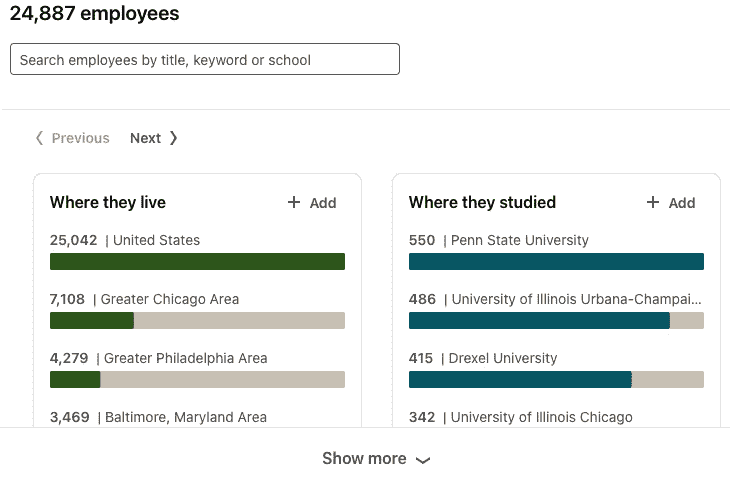

# 第四章：开源忍者

本章将带领你，读者，通过 Google-Fu 的艺术，研究公司、设施、流程、控制、合同或其他形式的公开共享信息。这让你了解如何在接触之前尽可能多地获取信息。关键的一点是，员工们喜欢反复发布有关其组织的信息。通常公司不公开分享的信息可能包括用于分段的防火墙、端点保护、**网络访问控制**（**NAC**）信息、**入侵检测系统**（**IDS**）产品的实施情况，以及许多其他揭示策略。然而，随着连接需求的增加，像 LinkedIn 这样的社交网站可能会揭示一个组织正在使用的技术。

现在我们已经了解了关于我们追求的组织的一些惊人细节，我们可以问一个问题：*什么是侧载？* 如果我们知道这家公司是 Rockwell，我们能在 Rockwell 的支持网络上创建账户吗？我们能否设计工具和人员，更深入地渗透到这个组织中？

本章将涵盖以下主要内容：

+   理解 Google-Fu

+   搜索 LinkedIn

+   尝试使用 Shodan.io

+   使用 **漏洞数据库**（**exploit-db**）进行调查

+   浏览 **国家漏洞数据库**（**NVD**）

# 技术要求

本章所需的工具：

+   一台带有浏览器的计算机，用来访问本文讨论的网站

+   拥有一个 LinkedIn 账户将对本章内容非常有帮助

# 理解 Google-Fu

谷歌必须是市场上最著名的搜索引擎之一。我个人在 `Netscape` 时代就使用过 `WebCrawler`。我记得第一次在 2002 年听到“*你谷歌过了吗？*”这句话时，我正在修理某人的 PalmPilot。可能已经不言自明，任何阅读这篇内容的人都曾在某个时刻使用过 Google 搜索引擎。尽管如此，我仍然想传达一些事实：谷歌搜索引擎是一个庞大的索引器，基本上是在爬取互联网，记录并保存它所遇到的数据。现在，这个接下来的统计数字纯粹是推测，并没有量化的证据；然而，我相当确信 99% 的谷歌用户从未真正拥抱谷歌提供的高级功能。

`Google dorking` 或 `Google hacking` 只是利用 Google 的高级搜索功能从互联网上获取敏感信息的一种方法。将多个高级搜索功能结合起来使用，可以让用户快速获取公开索引的信息。使用这些高级功能是完全合法的；然而，当索引的数据被用来破坏和利用*所有者的数据*时，合法性便受到挑战。这类似于发现漏洞。发现一个漏洞并不违法——今天的软件到处都是漏洞，因此我们不断进行更新。然而，如果新的漏洞被用来利用*使用相同软件的其他客户*，这就是违法的。话虽如此，在进行**渗透测试**（**pentest**）或进行研究时，使用 Google dorking 获取敏感信息需要负责任的披露。

注释

负责任的披露是一个过程，安全人员通过此过程将其研究中发现的漏洞报告给相关方，如软件或硬件供应商、敏感数据已暴露的公司以及本地**计算机应急响应小组**（**CERT**）。

在免责声明说明完毕后，接下来我们继续。这里有一个**Google Hacking 数据库**（**GHDB**）的链接，记录了许多可以使用的高级功能：[`www.exploit-db.com/google-hacking-database`](https://www.exploit-db.com/google-hacking-database)。

一旦您导航到该网站，它将如下所示：

图 4.1 – GHDB

以下是 Google dorking 的一些高级功能简要列表。还有许多其他功能可以在前面的链接中找到，但我不想陷入一个无休止的兔子洞：

+   `site`： (仅在提供的网站中搜索)

+   `inurl`： (在提供的**统一资源定位符**（**URL**）中搜索关键词)

+   `intitle`： (在网页标题中搜索关键词)

+   `intext`： (在网页正文中搜索关键词)

+   `filetype`： (根据提供的关键词搜索文件)

+   `ext`： (根据提供的关键词搜索文件)

这些功能可以在 Google 浏览器中运行，专注于与您的客户相关的信息。例如，您可以运行以下截图所示的搜索：

图 4.2 – 高级搜索

这将搜索 [`www.cdc.gov/`](https://www.cdc.gov/) 网站，查找可能可访问的任何公开面向的**文件传输协议**（**FTP**）服务器。这是一个非常简单的示例，有助于演示 Google 搜索引擎提供的高级功能的能力。可以搜索其他服务和托管的文件共享，示例如下：

+   **Web 分布式创作与版本控制**（**WebDAV**）：`intitle:"Directory Listing For /" + inurl:webdav tomcat`

+   **结构化查询语言**（**SQL**）: `intitle: "index of" "admin/sql/"`

+   `VTScada**: **intitle:'VTScada Anywhere Client'`

一个更复杂的功能可能类似于这里展示的内容：

图 4.3 – 复杂功能

你将看到一系列 Rockwell 的**可编程逻辑控制器**（**PLC**）及其暴露到互联网上的网页访问接口。查看*图 4.3*中展示的命令，你会发现我们正在寻找 URL 中`index.html`标题里的`Rockwell Automation`这个词，最后是特定的**设备名称**。很多设备都可以通过这种方式被发现。

使用标准查询和这些高级功能，你可以开始构建客户的个人资料。构建个人资料是渗透测试工作中的关键步骤，它能让你深入了解客户的基础设施，这对收集信息并取得测试成功至关重要。从公司名称开始，确定该客户所在的行业。这一点非常重要，因为某些**工业控制系统**（**ICS**）供应商在特定行业中占有较强的市场份额。一个典型的例子是`Schweitzer Engineering Laboratories`（**SEL**），他们的产品几乎可以满足所有类型的行业需求；然而，你会发现它们主要集中在能源领域。如果你参与的是能源生产、传输或分配相关的客户，你可以确信会接触到 SEL 的技术。这只是一个技术绑定于某个行业的例子，实际上还有很多类似的例子，通过我们之前介绍的搜索功能可以很容易地找到。

在这一部分，我们介绍了谷歌高级搜索功能的强大，以及通过编写高度聚焦的查询语句能够捕获的详细信息。我们可以利用发现的数据，在甚至还未进入会议之前，先构建客户的个人资料。在下一部分，我们将回顾“人员”这一部分，并探索如何有效使用 LinkedIn。

# 搜索 LinkedIn

LinkedIn 无疑是全球最大的职业社交网络平台。该平台总用户超过 7.4 亿。根据 LinkedIn 公开的统计数据，平台上列出了超过 5500 万家公司，相关数据可以通过以下链接找到：[`news.linkedin.com/about-us#Statistics`](https://news.linkedin.com/about-us#Statistics)。

由于平台上有大量的用户和公司，我们有很大机会在渗透测试过程中发现一些有价值的信息。因为这个网站基本上是一个专业人士的实时虚拟简历，用户的大量信息以易于搜索的文本格式存储。关于公司规模、公司所在行业、公司使用的技术以及公司雇佣的人员等数据点，都是通过搜索输入轻松获取的。

在 LinkedIn 上搜索可以精确到以下细节：

+   人员

+   工作

+   公司

+   群组

+   学校

+   帖子

+   事件

当你搜索一个客户的公司时，搜索结果将与公司的相对规模相关，如下图所示：

图 4.4 – 公司搜索

从这些信息中，我们可以知道员工的居住地和他们的学习经历。我们能够通过职称、关键词或学校来搜索员工。现在，对于那些观察细致的朋友，你可能已经注意到了一个漏洞！LinkedIn 显示有 24,887 名员工，并且标注有 25,042 名员工住在**美国**（**US**）。**人工智能**（**AI**）总有一天会接管这个世界，但朋友们，还没有到时候。我们可以通过寻找一般性的关键词来开始缩小搜索范围。从**监控与数据采集（SCADA）**开始，我们找到了 476 名在个人资料中列出 SCADA 的员工，如下图所示：

图 4.5 – SCADA 子搜索

针对特定技能关键词进行搜索，如`telvent`，将有助于缩小搜索范围，找到该示例公司使用的系统以及可能拥有这些系统凭证的人。你可以在下图中看到返回的结果：

图 4.6 – Telvent 技能集

当你聚焦于一部分个人并研究他们的当前职位及其工作场所的成就时，你可以找到许多有趣且具体的细节，如下图所示，其中出于礼貌公司名称已被编辑掉：

图 4.7 – 系统上的公开信息

如你所见，在这一部分，使用 LinkedIn 填补空白，可以轻松建立公司的整体档案。LinkedIn 的搜索功能允许我们列出员工和职位，深入了解公司使用的技术，并最终列出一份可能具有该技术访问权限的凭证账户短名单（如前截图所示）。为了建立显示，用户需要在`Telvent-DMS`（**配电管理系统**）和`SCADA-EMS`（**能源管理系统**）上拥有账户。利用这些随时可用的数据对于任何成功的项目都是至关重要的。在下一部分中，我们将探索 Shodan.io，并查看使用该搜索引擎收集的见解如何帮助完善那些容易获取的技术信息。

# 使用 Shodan.io 进行实验

如其主页所宣称，"*Shodan 是全球首个互联网连接设备的搜索引擎*。"在过去的两个部分中，我们使用了不同的搜索策略，免费获取了关于一个组织的结构和组织方式的见解，并揭露了可能对公众开放的任何服务。这使我们能够为客户建立关于他们所处行业、雇用员工以及——如果幸运的话——他们使用的技术的档案。在本部分中，我们将通过使用 Shodan.io 更深入地探索服务和技术。

如果你访问[以下链接](https://www.shodan.io/)，你将看到如下一张搜索引擎窗口的截图：

图 4.8 – Shodan.io 搜索引擎

点击**探索**按钮将带我们到以下屏幕：

图 4.9 – 探索 Shodan.io

接下来，我们点击顶部的分类，**工业控制系统**，你将被带到一个如下所示的页面：

图 4.10 – 工业控制系统

如果你向下滚动页面，你会注意到系统是通过搜索引擎发现的协议来记录的。这些协议是面向公众的，如下所示：

图 4.11 – 面向公众的协议

现在，我们跳过了直接查看**工业控制系统**部分，但如果这是一次真实的项目，你应该首先搜索公司名称，查看是否有任何“低挂的项目”存在。此外，我建议你养成习惯，在登录页面的搜索输入框中查找企业**互联网协议**（**IP**）范围。

故事时间

我之所以这样说，是因为在一次任务中，我刚到达客户的总部。我的团队已经在里面，所以我迅速将笔记本连接到手机，并简单地查了一下客户的 IP 范围，结果发现了一个**Citrix 虚拟专用网络**（**VPN**）**访问门户**。我用手机打电话给接待员，通过社交工程获取了 VPN 门户的凭据。我迅速登录并意识到，可以通过一个简单的“自助服务终端突破”来利用这个门户，而且整个门户是在域控制器上以域管理员身份运行的。更不用说，这次为期两周的任务进行得非常顺利。

现在，免责声明时间再次到来。点击任何协议的**探索**按钮是完全无害的，查看屏幕上共享的信息也是可以的。进入所发现的 IP 地址则进入了一个非常灰色的区域，因为本应公开的信息可能不该公开。尽管如今在 Shodan 上找到完整的操作员控制台已经很少见，但并非不可能。如果你遇到一个天然气管道的 SCADA 系统，如果突然间压缩机站关闭或主线截止阀关闭，你肯定会面临责任问题。还记得我们在`GE-XA21` LinkedIn 用户中发现的 SCADA 系统吗？它使用**分布式网络协议 3**（**DNP3**）进行通信，并且还使用了其他各种协议。如果你查看**协议**部分，你会看到`DNP3`按钮。点击它，你将被带到以下屏幕：

图 4.12 – DNP3 被发现  

在浏览时，你会发现有很多选项可以进行过滤和搜索。你可以按国家、城市、组织、设备、服务、端口等进行过滤。出于好奇，我们来搜索一下我们在实验室中设置的`Koyo CLICK` PLC，并查看结果，如下所示：

图 4.13 – Koyo CLICK  

如你所见，Shodan 已经抓取了那些开放到互联网的 Koyo CLICK 设备。

注意  

我想强调的是，作为蓝队成员，你应该定期检查 Shodan.io 上你组织的 IP 空间和技术。这将帮助你提前发现任何不合规的漏洞，并迫使渗透测试人员在执行任务时更加努力。

在本节中，我们简要介绍了使用 Shodan.io 查找暴露在互联网上的工业技术的强大功能。在渗透测试过程中，使用 Shodan.io 是必须的，因为您可能会发现一些有趣的客户设备和/或在线服务。到目前为止，在正常的渗透测试过程中，您应该已为客户组建了一个全面的资料。您将拥有与客户相关的公司、行业、技术和人员。接下来的部分，我们将回顾 `exploit-db`，我们之前通过 Google 黑客技术提到过它，但这次我们将深入探讨如何将技术与已发现并记录的漏洞关联起来。

# 使用 ExploitDB 进行调查

ExploitDB 是一个庞大的共享发现档案库，涉及软件缺陷、漏洞利用和安全漏洞。它允许安全研究人员和渗透测试人员以易于搜索的格式分享已知的安全漏洞。访问 [`www.exploit-db.com`](https://www.exploit-db.com)，您将进入主页，看到最新记录的漏洞，如下图所示：

图 4.14 – ExploitDB

如果您注意到，右侧有一个搜索输入框。输入 `SCADA` 并按 *Enter* 键。在本书印刷时，您会看到 50 个与各种 SCADA 系统相关的漏洞，如下图所示：

图 4.15 – SCADA 漏洞

如您在屏幕上看到的，我们有八个标题，概述如下：

+   **日期**：漏洞被添加到 ExploitDB 的日期。

+   **下载**：这是您可以下载的代码，用于执行漏洞利用。

+   **应用**：这是漏洞利用所针对的易受攻击应用程序的副本。

+   **已验证**：这是一个批准通知，表明该漏洞利用已被验证有效。

+   **标题**：漏洞利用描述。

+   **类型**：漏洞利用类型。

+   **平台**：漏洞利用所针对的系统。

+   **作者**：这是漏洞利用代码的作者。

对于许多漏洞，作者已经提供了代码，帮助您快速审查和增强您的环境。这种查看代码结构以进行 **概念验证**(**POC**) 工作的技巧将在后续章节中深入讨论，但现在，您只需知道，您可以访问各种代码，帮助您在客户的技术栈中找到立足点。我们将仔细看看一个简单的漏洞。如果我们查看以下截图，您会发现 `Rockwell SCADA` 在 2018 年有一个列出的漏洞利用：

图 4.16 – Rockwell 漏洞利用

点击描述，查看以下屏幕：

图 4.17 – Rockwell SCADA 漏洞利用

如果你注意到，`CVE`（即**常见漏洞和暴露**）被标记为 `2016-2279`，意味着这个漏洞追溯到 2016 年——或者至少是 2016 年报告的——但并不一定意味着它是在 2016 年被发现的；它可能是在更早的日期被发现的。如你所见，这个漏洞影响的不同版本都有记录，并且脚本的最末端有一个简单的 `PoC` 示例，这意味着通过 **图形用户界面**（**GUI**），我们可以运行简单的 **跨站脚本攻击**（**XSS**）来劫持用户会话或窃取敏感的系统信息，不过我们稍后会详细讨论这个问题。现在我们知道可以通过 `exploit-db` 搜索任何已知的漏洞和相关代码，这些代码利用了这些缺陷。所有这些都可以在参与前进行。接下来，我想快速查看 NVD，以了解 `exploit-db` 中找到的漏洞代码的来源和驱动程序。

# 遍历 NVD

NVD 是开放源代码领域中记录漏洞的最大联合体。访问 [`nvd.nist.gov/vuln/search`](https://nvd.nist.gov/vuln/search) 会带你进入以下页面：

图 4.18 – NVD

现在，搜索我们之前在 Exploit DB 中找到的 Rockwell SCADA 的 CVE。该 CVE 是 `2016-2279`。在搜索输入框中键入这个 CVE 并按下 *Enter*，你将看到以下页面：

图 4.19 – NVD CVE 2016-2279

现在，点击结果窗口中 `Vuln ID` 字段中的链接，你将看到以下页面：

图 4.20 – CVE-2016-2279 详情

这里收集并展示了大量信息。最值得注意的是受影响的系统及其附带的风险评分。审查这些数据非常重要，因为你可以了解发现这些控制器及其版本在客户环境中的影响深度和广度。为了查看更相关的内容，返回主页面并对 **Rockwell 技术**进行查询。你应该能看到以下漏洞：

图 4.21 – Rockwell 漏洞

在这里，你可以看到与 Rockwell 相关的 94 条记录。最后发布的日期是**2021 年 3 月 3 日**，该记录的 CVE ID 为`CVE-2021-22681`。审查这个漏洞时，你会发现它的风险等级是**严重**——这完全正确，因为它表明未经过身份验证的攻击者可以绕过认证，直接在控制器上进行更改。这是非常可怕的，因为攻击者可以更改工艺的设定点，导致非计划停机、失去控制，甚至是工艺失败。这对渗透测试者来说是个好消息，因为它为访问关键基础设施提供了一个起点。

免责声明

在处理有物理访问权限的**输入/输出**（**I/O**）层面的过程控制漏洞时，应该进行记录，而不是立即采取行动，除非你确切知道利用已知漏洞的后果是什么，因为事情往往会变得不可预测或出现严重问题，所有这些结果都可能非常令人恐惧。

在本节中，我们了解了 NVD 是什么，以及我们可以在哪里找到更多关于已记录已知漏洞的知识。这是至关重要的，因为我们可以在评估报告中构建支持证据，并利用已记录的漏洞来获取对客户基础设施的访问权限。

# 总结

在本章中，我们讨论了许多**开源情报**（**OSINT**）主题，特别关注于 ICS 领域。我们研究了 Google-Fu，以及如何研究我们的客户，以发现行业细节和可能的用户。为了深入挖掘，我们转向 LinkedIn，查看是否有员工在上面发布了与雇主和使用的技术相关的敏感信息。

接下来，我们查看了 Shodan.io，探索在公开可访问的网络上运行的技术，看看这些技术是否属于我们的客户。之后，我们访问了 ExploitDB，查看是否有任何公开的代码，能够利用我们在前面步骤中发现的技术漏洞。最后，我们直接查看了 NVD，了解我们收集的系统中存在哪些漏洞。通过收集并记录这些信息，我们对客户的行业、人员、流程和技术有了全面的了解。

在下一章中，我们将学习跨越并捕获流量的重要性，这些流量可以帮助我们发现哪些真实设备在网络上进行通信。
