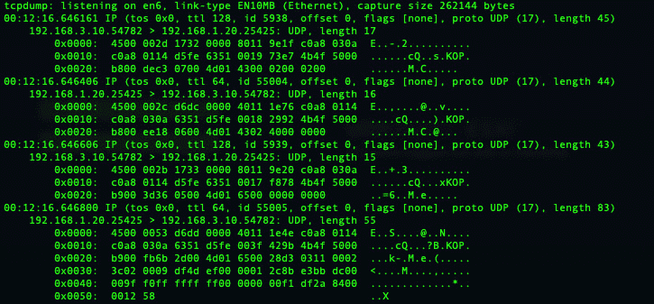

# 第五章：如果你能做到，给我加个 SPAN

在上一章中，我们讲解了如何使用开源研究来构建客户、公司、用户和技术的档案。在本章中，我们将进一步深入讨论带外网络监控。在过去几年中，**入侵检测系统**（**IDS**）一直主导着工业网络安全领域。

像 Security Matters（被 ForeScout 收购）、Indegy（被 Tenable 收购）、Sentryo（被 Cisco 收购）、CyberX（被 Microsoft 收购）、Claroty、Nozomi Networks、SCADAfence 等公司蓬勃发展。来自**风险投资**（**VC**）和**投资银行**（**IB**）的资金已经注入到被动监控领域，以提高对自动化技术重要性的认识，同时它对关键基础设施的影响也在不断增加。

所有这些技术都依赖于网络基础设施，能够使用**交换端口分析仪**（**SPAN**）或**测试接入点**（**TAP**）来捕获流量并将其发送到 IDS 技术。理解如何使用上述方法进行带外监控非常重要，并且在渗透测试过程中，如果客户已经投资了特定的 IDS 供应商，了解这一点尤为关键。

在本章中，我们将回顾什么是 SPAN 以及如何将流量镜像到端口，什么是 TAP 以及如何在渗透测试中使用它，并讨论在工业领域中利用 SPAN 的各种 IDS 技术，以及在遇到这些技术时应如何应对。

在本章中，我们将讨论以下主要内容：

+   安装 Wireshark

+   什么是 SPAN 以及如何配置它

+   在参与活动中使用 TAP

+   导航 IDS 安全监控

# 技术要求

本章所需的内容：

+   **TP-Link TL-SG108E 智能交换机**：这是一款相对便宜的交换机，支持简单的端口镜像。我们将通过它来了解如何配置端口镜像。你可以在亚马逊上找到这款 TP-Link TL-SG108E 智能交换机：[`www.amazon.ca/TP-LINK-TL-SG108E-8-Port-Gigabit-Switch/dp/B00JKB63D8`](https://www.amazon.ca/TP-LINK-TL-SG108E-8-Port-Gigabit-Switch/dp/B00JKB63D8)。

+   `Throwing Star LAN TAP`：这是一款廉价的 LAN TAP，我们可以用它提取网络数据包，然后稍后进行分析。可以在以下网址找到 Throwing Star LAN TAP：[`www.amazon.ca/Throwing-Original-Monitoring-Ethernet-Communication/dp/B077XY2TGD/ref=sr_1_1?dchild=1&keywords=throwing+star+lan+tap&qid=1626109845&sr=8-1`](https://www.amazon.ca/Throwing-Original-Monitoring-Ethernet-Communication/dp/B077XY2TGD/ref=sr_1_1?dchild=1&keywords=throwing+star+lan+tap&qid=1626109845&sr=8-1)。

+   可以通过以下链接安装 Wireshark/TShark：[`www.wireshark.org/#download`](https://www.wireshark.org/#download)。

+   Tcpdump。

# 安装 Wireshark

经过一番深思熟虑的辩论后，我决定将这一部分移到本章的开头。原本我计划将其放在下一章，但在回顾后，我觉得它与接下来的内容衔接得很好。话虽如此，还是让我们直接开始吧。Wireshark 是网络工程师和安全人员都在使用的事实标准工具，用于监控通过网络传输的所有数据位。当出现问题时，个人或团队首先做的就是打开笔记本电脑并启动 Wireshark。我无法过分强调这一点；Wireshark 基本上是安全行业中最重要的工具之一，具有讽刺意味的是，人们很少将它归类为安全工具。Wireshark 是你为渗透测试工作组装的工具包中的必备之物。

访问 [`www.wireshark.org/#download`](https://www.wireshark.org/#download)，你将被带到 Wireshark 的稳定版本下载页面。在撰写本文时，当前的稳定版本是 3.4.4，发布于 2021 年 3 月 10 日。现在，对于一些“终端爱好者”，“CLI 行家”和“shell 武士”，或者那些可能在 Apple 笔记本或 Linux 发行版上使用“Brew”的用户，下面的命令适合你们。

## macOS

你可以使用 Brew 来安装 Wireshark，如下所示：

brew install wireshark

## Linux 发行版

你可以使用 `apt-get` 来安装 Wireshark，如下所示：

sudo apt-get install wireshark

## Windows 10

我只是简单地给你这个链接：[`en.wikiversity.org/wiki/Wireshark/Install`](https://en.wikiversity.org/wiki/Wireshark/Install)。

安装过程很简单，有很多 YouTube 视频、维基百科、博客和论坛可以作为参考。

注意

在安装过程中，你需要确保安装额外的或互补的组件。此时，TShark、解码器插件、Editcap、Mergecap 以及其他关键组件就派上用场了。在接下来的几章中，我们将会涉及到其中的一些项目。

一旦你安装了 Wireshark，通过双击桌面图标打开程序，并确保你能看到所有的网络接口，如下图所示：

](image/Figure_5.01_B16321.jpg)

图 5.1 – Wireshark 捕获接口

在这里，你将能够选择一个接口并开始监听网络流量。关键是，你看到的网络流量只会是广播、组播和单播流量，这些流量直接与该接口相关。例如，如果你选择你的 Wi-Fi 接口，你将看到很多设备通过组播和广播通信在网络上进行交流，尤其是如果你像我一样，拥抱**物联网**（**IoT**）。我特别指出这一点，因为它引出了下一部分，我们将看看更有趣的数据。我的意思是，来自特定设备之间单播通信提供的数据。你必须访问 SPAN/镜像端口或在设备之间安装 TAP 才能捕获这些数据。

在这一部分中，我们学习了如何根据操作系统的不同使用不同的方法安装 Wireshark。我们确保查看了可以用来捕获流量的网络接口列表。最后，我们注意到，仅通过监听网络端口获取的信息并不能提供完整和详细的图景。我们需要访问 SPAN 或 TAP 才能看到真实的设备间单播通信。在下一部分中，我们将讨论什么是 SPAN/镜像，并学习如何在一个简单的管理交换机上配置这一功能。

什么是 SPAN，如何配置它？

在上一部分中，我们快速安装了 Wireshark 以捕获网络流量。现在，我们可以使用 Wireshark 来验证我们的结果。我们将能够做到这一点，一旦我们在这一部分配置了一个简单的 SPAN/镜像端口。那么，什么是 SPAN，它的作用是什么？SPAN 允许用户将一个或多个端口上的所有流量复制到同一交换机上的一个或多个端口，前提是该交换机支持 SPAN/镜像。这通常被称为本地 SPAN。这是将数据馈送到 IDS 的主要方法。SPAN 有一些扩展，称为**远程 SPAN**（**RSPAN**）和**封装远程 SPAN**（**ERSPAN**）。

RSPAN 允许用户将远程网络流量与专用 VLAN 关联，然后将这些数据通过额外的交换机进行中继。然而，这需要付出一定的代价，因为你需要为 RSPAN 流量专门分配交换机端口。你将无法再将这些端口用于正常流量，因此减少了可以用于操作交换的端口数量。然而，利用 RSPAN 在渗透测试中非常有用，因为可以捕获并利用通过网络传输的关键信息来突破系统。凭证数据、操作系统、端口和服务以及其他有用信息通过网络传输，并通过 SPAN 直接传输到你的计算机，使用 Wireshark、TShark 或 Tcpdump 捕获。

注意

使用本地 SPAN 或 RSPAN 会导致交换机负载增加。如果交换机负载过重，也就是有大量流量通过交换机，使用 SPAN 可能会导致数据包丢失及其他不希望的行为，例如生产中断。由于交换机超负荷工作而开始丢包导致的停机造成的收入损失，是渗透测试中最糟糕的结果。因此，在对你不完全控制或不了解的交换机执行此操作时，务必小心。

请注意，SPAN 和端口镜像是可以互换使用的术语，因为它们本质上意味着相同的事情。所以，如果你在问我为什么写 SPAN/镜像，那是因为它们本质上是相同的，而 SPAN 其实是一个以 Cisco 为中心的术语。在*技术要求*部分提到的交换机——TP-Link TL-SG108E 智能交换机——使用了端口镜像。以下图所示为本地 SPAN 的典型设置或架构：

图 5.2 – SPAN 流量

你可以使用任意数量的交换机来测试这个设置。我们将检查端口设置；在以下截图中，你可以看到这是一台简单的八端口交换机。四个端口正在被使用——三个以 1 GHz 运行，一个以 100 MB 运行：

图 5.3 – 端口设置屏幕

看到某个端口正在以较低的速度协商，安全地说，该端口用于 PLC 通信，并且该端口是端口 2。虽然我知道这是因为我设置了实验室，但在实际的渗透测试中，如果你恰好获得了这种级别的访问权限，可以安全地假设较低的速度是由于工业硬件通信造成的。

在查看了交换机的端口设置后，我们清楚地了解了哪个端口用于 PLC，以及哪些端口是开放的，可以用来将通信镜像回我们的主机。接下来，我们将设置端口镜像。从左侧菜单中选择**监控**选项，然后选择**端口镜像**。你将进入以下屏幕：

图 5.4 – 端口镜像屏幕

从这里开始，我将选择**启用**端口镜像功能，并选择**镜像端口**，它将是**端口 1**，然后点击**应用**按钮，如下截图所示：

图 5.5 – 启用端口镜像

接下来，我们要选择要监控的端口。通过检查端口设置，我们发现端口 2 已连接到 PLC。所以，点击**端口 2**，并启用**入口**流量和**出口**流量，如下所示：

图 5.6 – 端口 2 镜像

如果一切按照前面的步骤进行操作，表格将显示 **端口 2** 已启用 `Ingress` 和 `Egress` 流量，如下图所示：

图 5.7 – 确认端口 2 镜像

如果你跟着操作并且已经拿到了 Koyo Click，那么继续并打开我们在*第二章*中安装的 CLICK 编程软件，*路由硬件*，在 Windows 7 主机上连接到你的 PLC。如果你使用的是其他厂商的设备，例如 Rockwell，确保你打开 Studio 5000 或 RSLogix 并连接到你的硬件。工程软件和 PLC 之间的通信将在我们的交换机的端口 2 上创建流量。这正是我们想要的，因为复制的数据包会被镜像到端口 1。将一根电缆连接到端口 1 和你的主机之间。

在你的主机上，打开 Wireshark 并选择你想要监控的接口。在我的例子中，我的 Mac 上有一个 `Thunderbolt` 适配器，我使用的是标记为 `en6` 的接口，如下图所示：

图 5.8 – 接口选择

选择后，你将看到工程软件和 PLC 之间的通信，如下图所示：

图 5.9 – Wireshark

深入分析 Wireshark 日志超出了本书的范围，但我们将在接下来的几章中简要触及一些关键方面。点击任意数据包并查看源地址和目标地址。如果一切设置正确，你将看到 MAC 地址解析为 `KoyoElec_##:##:##`。

Wireshark 只是查看网络流量的一种图形化方式。如果你想通过终端查看相同的数据，可以使用 Tcpdump。打开终端并找到连接到端口 2 的接口。输入以下命令：

tcpdump -i <interface> -v -X

Tcpdump 是捕获镜像流量的应用程序。命令中的 `i` 允许你选择要监听的接口。在我的案例中，这是 `en6` 接口。`v` 命令告诉 Tcpdump 显示详细数据。最后，`X` 显示每个数据包的头部和数据，以十六进制和 ASCII 形式显示，如下图所示：

图 5.10 – Tcpdump 命令

Tcpdump 的输出应与通过 Wireshark 查看时看到的捕获数据一致。比较两者，确保你看到的是相同的信息。该捕获数据如下面的截图所示：

图 5.11 – Tcpdump 输出

现在，你可能在想，*这与我和我的渗透测试未来有何关系？* 可以理解的是，访问交换机控制台并花时间设置一个 SPAN 会话可能会显得非常奇怪，因为在这个访问级别上可以做很多其他有趣的事情。我只是简单地介绍了 IDS 用来吸收数据的核心构建块。这一点非常重要，因为在过去的五年左右，工业自动化领域被动监控的采用量激增。你将在某种形式上遇到 IDS 解决方案，理解它们的工作原理和功能是关键。我们将在本章稍后部分详细讨论这一点。

本节中，我们讨论了理解 SPAN/端口镜像的重要性以及它所启用的技术。我们讲解了如何配置镜像端口，并使用 Wireshark 和 Tcpdump 来查看和捕获 Koyo CLICK PLC 与工程软件之间的流量。在接下来的部分，我们将讨论 TAP 是什么，它与 SPAN 流量的比较。我们还将讨论当你有物理访问权限时，TAP 在渗透测试中的重要性。

# 在一次渗透测试中使用 TAP

在上一节中，我们讨论了 SPAN 是什么以及如何配置和使用它。在本节中，我们将回顾 TAP 是什么、TAP 的不同类型以及它们如何在渗透测试中使用。通常，TAP 是硬件设备，插入在两个通信链路之间，以便我们能够执行完整的包复制。TAP 可以将流量复制到单一目的地或多个目的地，这称为 **再生**，或者 TAP 可以提供汇总流量，这被称为聚合。

TAP 和 SPAN 之间有很多不同之处，但在我看来最重要的一点是，SPAN 并不是一种真正的被动解决方案，因为它会在交换机上产生额外负担。话虽如此，TAP 会生成流量的完整副本，而不会影响交换机的性能或使其崩溃。缺点是，为了访问数据包，你必须更换电缆，这可能会导致服务的短暂中断。

TAP 主要有两种类型——主动和被动。被动 TAP 之间的接口没有物理断开，这样即使 TAP 出现故障，通信也能继续进行。而主动 TAP 则使用电源复制接口之间的通信，允许其以 1,000 M 的速度运行，而被动 TAP 仅支持 10/100 M 网络。在千兆网络上使用被动 TAP 会导致网络性能下降并产生性能问题。正如你在前一部分中回顾的那样，我们看到 PLC 通信默认在 100 M 下运行。这使得我们在进行渗透测试时可以使用被动 TAP，而不必担心引起性能问题，但我再次强调，在将植入物安装到网络之前，你必须确切了解网络的运行情况。这是一个警示故事，因为在过去的渗透测试中，我确实曾破坏过关键网络。在我们的实验室环境中，你无需担心会影响任何关键服务。这也是拥有实验室来进行测试和观察行为的一大魅力。

一款流行的被动 TAP 是 Great Scott Gadgets 的 Throwing Star LAN TAP。它可以在 [`greatscottgadgets.com/throwingstar/`](https://greatscottgadgets.com/throwingstar/) 找到：

图 5.12 – Throwing Star LAN TAP

Throwing Star 上有四个连接器，标为 J1 – J4，其中 J1 和 J2 是内联连接，J3 和 J4 是监控端口。在我们的实验室中，我们将 J1 连接到 Koyo CLICK PLC，然后使用一根电缆将 J2 连接到交换机。完成后，将 J3 连接到你的笔记本电脑，并使用 Wireshark、TShark 或 Tcpdump 来捕获流量，正如我们在前一部分中所做的那样。在这个示例中，我们将使用 TShark 来捕获并显示流量。正如你在*安装 Wireshark* 部分回顾的那样，TShark 是一个可选组件，可以在安装过程中添加。输入以下命令进行操作：

Tshark -i <interface>

与 Tcpdump 类似，`-i` 选项允许你选择用于捕获过程的接口。我将使用我们之前使用的相同接口，即 `en6`。你可以在下面的截图中看到相应的命令：

图 5.13 – Throwing Star LAN TAP 捕获

捕获的数据包将与我们之前看到的格式相同。我这里附上一张截图，方便你与之前的 Tcpdump 捕获进行对比：

图 5.14 – TShark 数据包捕获

在这里，您可以看到使用 TAP 对于深入了解网络非常有用。如果您可以物理接入交换机，只需插入 TAP 即可开始捕获该端口上的数据交换。这将使您能够理解正在使用的协议，并可能捕获正在网络上传递和交换的独特和敏感信息。

许多供应商出售 LAN TAPs，但我建议看看 Hak5 在这个领域提供了什么。这里是他们商店的链接和特别的植入工具：[`shop.hak5.org/collections/implants`](https://shop.hak5.org/collections/implants)。

您可以找到 Throwing Star LAN TAP、Throwing Star LAN TAP Pro 以及其他出色的植入工具，如 Packet Squirrel 和 Plunder Bug LAN TAP。Plunder Bug LAN TAP 可以实时捕获流量，与 Throwing Star LAN TAP 完全相同的方式，直接捕获到 USB-C。我希望简要提到 Packet Squirrel，因为它可以留在工作中；您可以在以后的某个日期恢复它。我们可以设置有效载荷自动生成 PCAPs，在您希望发现网络中漂浮的可能凭据时非常有帮助。我知道这严格来说不是 TAP，但您可以将其连接到 Hak5 Cloud C2 进行管理和数据外流，从而可以访问感兴趣的网络流量：

图 5.15 – Packet Squirrel

如果您查看有效载荷选择开关，您将看到可以启动多个预先制作的漏洞利用。您也可以花时间编写自己的自定义有效载荷。

故事时间

2016 年秋天，我去了加利福尼亚州去 Hak5 办公室玩耍。他们正在举办一个名为`Pentest with Hak5`的红队培训活动。有很多人参加了培训活动，我们与 Darren Kitchen、Sebastian Kinne、Rob "Mubix" Fuller 和 Shannon Morse "Snubs"一起度过了时间。我们花了一周时间进行实践培训，学习如何使用 Wi-Fi Pineapple、LAN Turtle、Rubber Ducky 和深入 Metasploit。我们练习使用提供给我们的工具，并在一周结束时，我们的任务是试图阻止邪恶机器人删除互联网上所有的猫图像。Hak5 团队正在开发新的有趣工具，可以在实际工作中使用。我强烈建议查看他们的装备并熟悉它。**– ThunderCats 2016**

到目前为止，我们讨论了便携式“植入”类型的 TAP。然而，还有一些商业级 TAP 是公司用来构建带外安全监控网络的。这个领域有一些重要的厂商，其中最著名的之一是 Gigamon。这些更大型的“主动”TAP 解决方案可以支持 1G 和 10G 网络，从而将所有流量复制到监控设备上。我们将特别在“核电”安装中看到这些设备，可能根据企业安全预算的不同，它们也会出现在能源及其他重要工业领域。我之所以这么说，是因为硬件的成本和安装的庞大体量通常对于大多数组织来说是个不可接受的因素，因此，SPNA/镜像端口实际上成为了 IDS 被动监控解决方案的默认选择。

在本节中，我们讨论了如何在你整个职业生涯中以某种形式遇到 TAP，无论是通过渗透测试访问带外网络，还是通过植入设备留下后门。非常重要的一点是，要熟悉这一领域的不同厂商，并在实验室中使用它们。我们安装了一个 Throwing Star LAN TAP，并使用 TShark 验证我们是否成功捕获了 Koyo Click PLC 与我们在*第二章*中安装的工程软件之间的单播通信，*路由硬件*。这为下一节做了铺垫，我们将在下一节中讨论 IDS 及其在工业网络中开始扮演的重要角色。

# 导航 IDS 安全监控

到目前为止，我们已经安装了 Wireshark，了解并配置了 SPAN/镜像端口，并安装了“被动”TAP。这一切都为本节内容铺平了道路。对于那些怀疑被动监控真实性的“纯粹主义者”，请注意，各种厂商的技术已经被广泛采用，并且在几乎所有的渗透测试工作中都会遇到。我想这可以反映出公司安全成熟度的一些信息：随着他们参与第三方渗透测试，可以肯定的是，这些公司会投资新的监控工具来监控他们的工业网络。

在本节中，我们将讨论 IDS 安全监控领域的各种厂商，提供一个高层次的概述，讲解他们通常检测什么，如何将其融入更广泛的安全工具套件中以进行事件和警报监控，并学习如何在渗透测试过程中绕过这些产品，避免被检测到。因为如果 IDS 检测到你的 IP 地址并向**网络访问控制**（**NAC**）发送 API 调用，然后该 NAC 推送一组新的**安全组标签**（**SGT**），实质上会将你的 MAC 地址丢弃在所有交换机上，这会让你感到非常沮丧：

图 5.16 – IDS

IDS 的理念和实施自 1980 年代以来就已存在。这项技术的推动力来源于对加强网络安全的需求。在过去的 40 年里，许多公司要么被收购，要么被出售，或逐渐消失。IDS 的发展非常有趣且历史悠久，但我希望将焦点集中在 IDS 对工业领域的直接影响上。1998 年，“Snort”问世，它是一个“开源”网络 IDS。像大多数技术一样，“Snort”允许爱好者和其他初创公司利用基于规则的引擎，开发更深层次的检测。快进到下一个十年，像 Digital Bond 和 Industrial Defender 这样的公司开始使用针对工业设备定制的规则，以检测恶意活动和攻击。

2009 年，一家名为“Security Matters”的公司在荷兰成立，专注于工业网络检测。11 年前的 2010 年 3 月，爱达荷国家实验室的三位研究人员发布了一篇名为《Sophia 概念验证报告》的论文。其目的是通过简单地监听网络流量来可视化地指纹化工业网络。

2013 年，成立了两家公司——一家位于美国，名为“Dragos”，另一家位于瑞士，名为“Nozomi Networks”，这两家公司都在被动监控领域推出了产品。前者“Dragos”推出了名为 Cyberlens 的产品，后者“Nozomi Networks”推出了名为 SCADAguardian 的产品。

2014 年，工业入侵检测市场爆发，十多家公司推出了此类系统。大多数公司来自以色列，由前 8200 以色列国防军成员推动，尽管值得一提的还有 Indegy、SCADAFence 和 Claroty。Sentryo 也于 2014 年成立，总部位于法国。所有这些公司都在进行“协议分析器”竞赛，竞赛的目标是看哪家公司能为资产发现提供最丰富、最全面的工具。

在下一章中，我们将深入探讨协议及其结构，但目前最重要的要点是，IDS 监控设备执行深度包检测，并分析流量中的恶意行为。之前提到的所有系统都会追踪新关键元素的出现，例子包括：

+   网络中检测到新的 MAC 地址

+   网络中检测到新的 IP 地址

+   网络中检测到新的协议

+   网络中检测到新的通信路径

在从企业端到工业网络的过程中，你应该将这些元素牢记在心。知道你的机器会被检测和指纹识别将帮助你开发不同的技术和策略来掩盖你的踪迹。在这一点上，我们知道如果这些系统检测到新设备和新通信，它们将生成一个事件或警报，取决于每个系统的命名约定。了解 IDS 如何处理警报至关重要；系统是否与 NAC 或防火墙集成？集成是否会导致在网络中深入遍历时出现问题？防火墙是否会阻止我们连接到较低级别系统？NAC 是否会向其管理的交换机推送 SGT，最终丢弃数据包？在浏览网络时，所有这些都是重要问题需要解决。

然而，并非一切都失去了，即使系统完全调整并部署了最新的数据包规则、YARA 规则、签名和集成。幸运的是，这些 IDS 监控系统在其装甲中存在我们可以利用的弱点。以下是我们可以使用的一些可利用的策略的简短列表，以颠覆被动监控：

+   节点许可饱和

+   警报耗尽

+   其他协议或不常见端口

+   加密协议的使用

+   生存于土地

如果我让你认为所有 IDS 都容易受到这些攻击的影响，那我就有所失职了。这些只是通过以前的参与和研究发现的一些策略，它们以不同的方式影响各种 IDS 设备。

## 节点许可饱和

这种技术通过向网络引入大量新节点，最终导致监控解决方案达到许可节点计数。之后，你可以引入你的攻击策略，因为 IDS 解决方案不会检测和/或警报你的设备，当你在网络中深入时。通过这样做，你有效地使系统无法查看你的活动。

## 警报耗尽

这类似于节点许可饱和，但 IDS 解决方案不容易受到许可计数限制的影响。相反，它只是制造了大量噪音，使最终用户永远找不到活动。再次，这引入了大量新节点和活动到网络中，这很容易在系统中创建数十万个警报。

## 其他协议或不常见端口

这通过利用不常见的端口将攻击传递到系统中。根据监控系统，如果端口尚未与解析器关联，IDS 将标记流量为“其他”，并且不会对其进行进一步分析。一个例子是通过非标准端口传递 HTTP。

## 加密协议的使用

这是专门用于通过网络进行反向外壳的端口`443`或 HTTPS 的参考或利用。通过端口`443`进行通信通常是允许的，因为它被标记为 HTTPS 通信，因此通常不会对链接进行进一步分析，从而使我们能够无法检测地通过。

## 生存于自然

这是在进行渗透测试时最具隐蔽性的策略，因为我们可以利用网络中已经存在的设备和协议来实现不被检测。过去非常突出的攻击利用了这种策略，并导致某个核计划受到破坏 - 是的，这是对“Stuxnet”的引用。访问 HMI、数据历史记录或操作员工作站使我们能够通过正常方法和操作发送设定点更改或配置更改。通过 HMI 打开和关闭阀门似乎是正常行为，并且在网络中不会被注意到。

在本节中，我们讨论了什么是 IDS 以及工业 IDS 演变的历史。我们讨论了 IDS 是如何发现和检测的，我们还介绍了一些用于掩盖我们攻击的方法。了解并利用这些细节将有助于您在未来的客户参与中。

# 摘要

在本章中，我们了解了什么是 SPAN/镜像和 TAP，以及了解它们如何融入 ICS 生态系统的重要性。了解如何查看网络上的内容以及如何与之交互对于取得成功至关重要。发现哪些流量正在通信和交换数据使我们能够构建客户在其网络中拥有的资产的网络拓扑。在参与过程中，需要利用诸如 Wireshark、TShark 和 Tcpdump 等技术实时监听和审查流量。本章列出的 IDS 供应商等更先进的技术甚至会披露自动发现的漏洞。

在下一章中，我们将讨论如何监听网络上的 SPAN 或 TAP，我们将构建数据包捕获，以便分析和解剖网络上传输的协议。这是 IDS 公司用来开发产品的秘密武器。这是协议解析器的一场军备竞赛。在下一章中，*第六章**，数据包深入解析*，我们将深入研究数据包和数据包捕获。
