# 第六章：数据包深度剖析

之前，我们讨论了什么是**交换机端口分析仪**（**SPAN**）/**镜像**和**测试接入点**（**TAP**），以及如何使用 Wireshark、Tcpdump 和 TShark 配置镜像端口，以监听工程软件与我们的 Koyo Click **可编程逻辑控制器**（**PLC**）之间的通信流量。我们还回顾了**入侵检测系统**（**IDS**）技术如何利用 SPAN/Mirror 和 TAP 对工业网络流量进行 **深度数据包分析**。此外，我们还简要提到了一些在渗透测试过程中绕过 IDS 监控的方式和策略。

在本章中，我们将更深入地了解软件与 PLC 之间的通信路径，并将使用 Wireshark 更详细地分析这些数据包。在渗透测试中，捕获和分析流量对于成功至关重要，正如上一章所提到的。此外，理解环境、资产、活动和协议是至关重要的。本章将帮助你通过捕获流量并分析这些流量提取出关键信息，为未来的成功奠定基础。

在本章中，我们将涵盖以下主要内容：

+   数据包是如何形成的？

+   捕获网络中的数据包

+   分析数据包中的关键信息

# 技术要求

本章你将需要以下内容：

+   从以下链接安装 Wireshark/TShark：[`www.wireshark.org/#download`](https://www.wireshark.org/#download)。

+   Netresec 工业 PCAP 文件；请从以下链接下载三个 PCAP 文件，因为我们将在*分析数据包中的关键信息*部分使用它们：[`www.netresec.com/?page=PCAP4SICS`](https://www.netresec.com/?page=PCAP4SICS)。

你可以在此查看本章的代码实际操作：[`bit.ly/3veDRlW`](https://bit.ly/3veDRlW)

# 数据包是如何形成的？

为了全面理解网络中发生的事情，让我们快速了解一下数据包基础知识。**数据包**是字节大小的数据中继，它们在源资产和目标资产之间传递信息。以推动互联网流量的协议为例，**传输控制协议**（**TCP**）和**互联网协议**（**IP**）组成了著名的缩写 `TCP/IP`。这些数据中继通过一系列交换机路由，并重新组装，使我们能够发送电子邮件、浏览网站、下载软件补丁、观看电影、监控电梯、管理火车、制造产品、生产能源，以及许多其他有趣和动态的事情。

为了全面理解数据包及其工作方式，了解它们如何在**开放系统互联**（**OSI**）模型的各层之间流动至关重要。OSI 模型在 80 年代中期被创建并采用，旨在为描述系统通过网络进行通信所使用的七个层次设定标准。从最上层开始，逐层向下，您可以在以下图表中查看各层的列表：

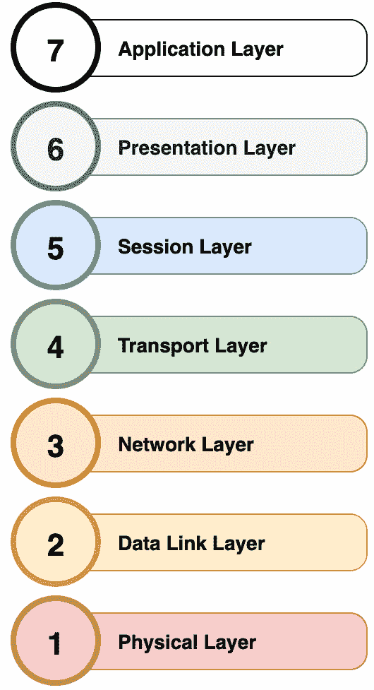

图 6.1 – OSI 模型

现在，参考前面的图表，我们将逐层解析每个层，并简要说明每个层的功能以及它如何为 OSI 模型做出贡献。

## 应用层

这一层为用户提供直接交互，例如承载 SCADA 接口的网页浏览器、**人机接口**（**HMIs**）、数据历史记录器，以及任何其他可直接查看和控制的软件。与此层相关的协议包括`http`、`ftp`和`dns`。

## 表示层

这是数据编码、加密和解密发生的层，以便数据从会话层传递到应用层。

## 会话层

当设备如 RTU、PLC、流量计算机、控制器、**气相色谱仪**（**GCs**）、服务器和其他设备需要相互通信时，*通信通道*会被创建。这些被称为会话。该层负责打开这些通道，确保它们正常工作，并在数据通过时保持开启。

## 传输层

在传输层，会就速度、数据速率、流量控制和错误检查进行协商。TCP 和 UDP 就是在这一层运行的。

## 网络层

这是通过利用 IP 地址在网络上源节点和目标节点之间传输数据的路由层。

## 数据链路层

与这一层相关的有两个部分，**逻辑链路控制**（**LLC**）和**媒体访问控制**（**MAC**），它们提供直接的节点对节点通信。网络交换机通常在这一层工作。

## 物理层

再次回到用户的手中。这一层指的是物理连接，例如插入以太网端口的电缆或在网络上通信的无线网卡。

现在我们大致了解了 OSI 模型及各层之间的关系，接下来我们将快速概述 IPv4 数据包的结构。

注意

如果你跟我走到这里，你可能会问自己：“为什么要讲这些基础内容？”说实话，当我开始写这本书时，我的想法是写一本关于工业渗透测试的介绍，主要面向来自 IT 安全领域的人。最近，我和很多在自动化领域工作的朋友进行了对话，他们希望转行做安全。因此，我正在努力弥合这两类不同背景的读者之间的差距。我希望能为我的朋友们提供一本参考书，他们可以跳过自己已经熟悉的部分，快速了解他们第一次接触的主题。

好的，既然免责声明已经说完，我们现在来看一下数据包的结构。以下是一个 IPv4 数据包的一般设计：

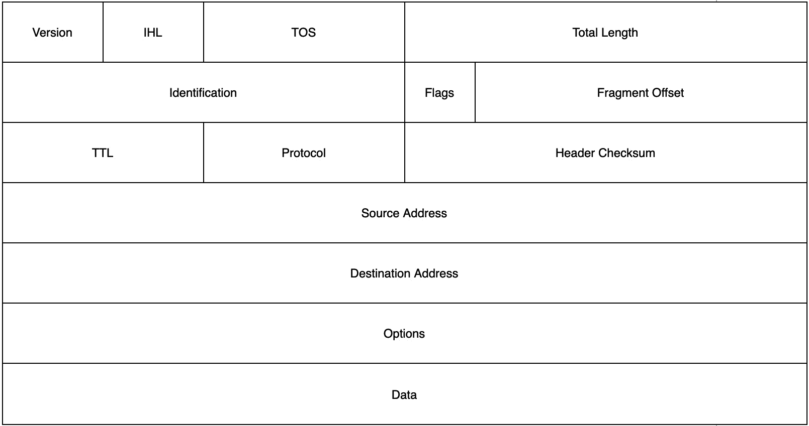

图 6.2 – 一个 IPv4 数据包

上图中概述的头部字段详细说明如下：

+   **版本**：这个字段始终设置为`4`，因为这是最新的 IP 版本。

+   **IP 头长度**(**IHL**)：这个字段表示 IP 头的长度，以 32 位为单位。

+   **服务类型**(**ToS**)：这个字段用于确定服务的质量或优先级。

+   **总长度**：这个字段表示数据包的整体大小，以字节为单位。

+   **标识**：网络使用这个字段来重新组装任何被分片的数据包。

+   **标志**：这个字段用于控制数据包的分片。它由 3 位组成；第一位为 0，第二位是“不要分片”位，第三位是“更多分片”位。

+   **片段偏移**：这个字段确定数据包片段的位置。

+   **生存时间**(**TTL**)：这个字段用作防止数据包循环的机制。

+   **协议**：这个字段用来表示协议类型。TCP 的值为`6`，UDP 的值为`17`。

+   **头部校验和**：这个字段用于存储校验和，并用于错误处理。

+   **源地址**：这个字段包含源 IP 地址。

+   **目的地址**：这个字段包含目的 IP 地址。

+   **选项**：这个字段通常不会使用。

+   **数据**：这部分包含要发送给节点的信息。

这是对 IPv4 数据包结构的简要概述，关于这个特定主题还有更多可以研究的信息。我只是想提供一些背景知识，这样当我们开始在 Wireshark 中查看帧和数据包时，你能够理解引用的内容以及为什么细节和信息以这种方式显示。Wireshark 参考资料的直接链接可以在 https://www.wireshark.org/docs/wsug_html_chunked/ChUsePacketDetailsPaneSection.html 找到。

在这里，我截取了 Wireshark 的“数据包详情”面板的截图：

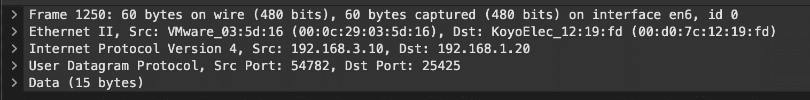

图 6.3 – 数据包详情面板

现在，在你的系统上，尝试扩展与我们先前讨论的各层相关的元素。我将扩展的第一个元素是**以太网 II**元素，如下图所示：

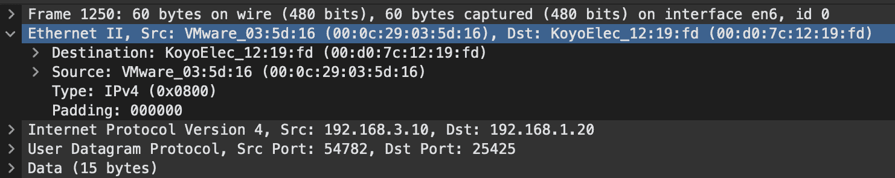

图 6.4 – 以太网层

这个**以太网 II**元素与前面讨论过的**数据链路层**直接相关。我们可以看到我们有**目的地**MAC 地址、**源**MAC 地址、**类型**和**填充**。与 MAC 地址的前 3 个字节相关的**组织唯一标识符**（**OUI**）非常有趣。在这里，你可以看到 Wireshark 正在解析 OUI，并且 VMware 和我们的 KoyoElec PLC 都已解析。在以下的截图中，我们可以看到网络层：

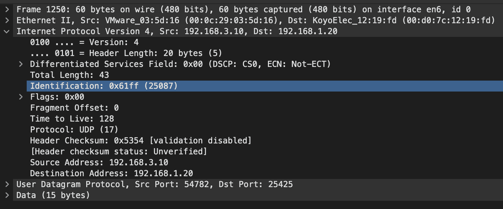

图 6.5 – 网络层

在这一层，我们可以直接将先前概述的 IPv4 布局映射到我们捕获到的在 Koyo Click PLC 和工程软件之间传输的包。以下是网络层中重要字段的列表：

+   **版本：4**

+   **IHL：20 字节**

+   **TOS：0x00**

+   **总长度：43**

+   **标识：0x61ff**

+   **标志：0x00**

+   **片偏移：0**

+   **生存时间：128**

+   **协议：UDP（17）**

+   **头部校验和：0x5354**

+   **源地址：192.168.3.10**

+   **目的地址：192.168.1.20**

我们接下来要审查的是传输层。在这一层，应用程序通过端口与彼此通信。以下截图显示了传输层：

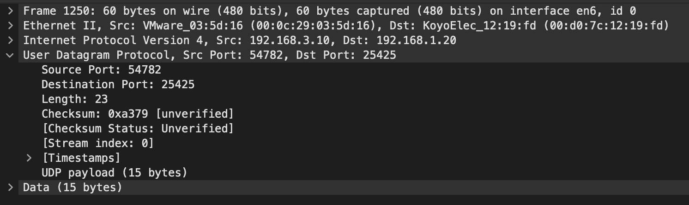

图 6.6 – 传输层

在这里，我们可以看到使用了**源端口：54782**和**目的端口：25425**。最后，我们将查看 Wireshark 数据包详情面板中的**数据**元素/应用层。这就是可以找到应用程序数据的地方。通常，这是数据包中最有趣的部分，因为像凭证这样的内容通常以明文形式出现在这里。以下截图代表了应用层：

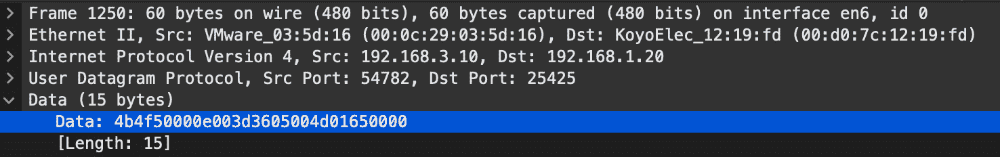

图 6.7 – 应用层

这里的数据尚未解析为清晰的元素，因为我没有运行专用的 Koyo Click 协议解析器。我们可以查看数据包字节面板中的 ASCII 转换，如下所示：

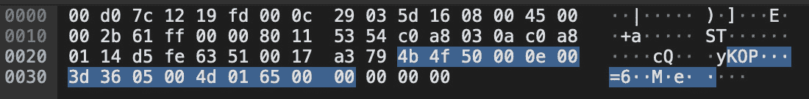

图 6.8 – 数据包字节面板

如前面截图所示，`4b 4f 50`开始了数据部分。如果你查看 ASCII 转换，你会看到它包含了`KOP`的字符。这是 Koyo Click 协议的直接标记。

在本节中，我们介绍了 OSI 模型和数据包结构。然后，我们将 OSI 模型和数据包结构的理论与我们实时捕获的流量进行了关联。这帮助我们在理论和实际应用之间建立了联系。在下一节中，我们将更详细地观察在我们的工程软件中运行命令，通过镜像端口使用 Wireshark 捕获流量，然后更深入地分析**KOP 协议**。这个分析将帮助我们在未来的渗透测试中，因为我们可以开始构建并提高分析未知协议的技能——这是你在职业生涯中一定会遇到的挑战。

# 在网络中捕获数据包

在上一节中，我们讨论了 OSI 模型是什么，以及构成和构建该模型的各层。我们回顾了数据包是如何构建的，然后直接将数据包结构与 PLC 与工程软件之间的通信交换进行比较。在本节中，我们将更深入地探讨 Wireshark，并关注我在参与项目时常用的一些关键功能来捕获流量。回顾一下，在*第五章**《如果你能找到我》*中，我们使用 Wireshark 验证了我们的镜像端口是否已正确设置和配置。

现在，我想在即将到来的内容中强调两个非常重要的点，并向同行的安全专家们致敬，同时也向我个人过去曾用来提高技能的资源致谢：

+   [`www.chappell-university.com/`](https://www.chappell-university.com/)

+   [`tryhackme.com/room/wireshark`](https://tryhackme.com/room/wireshark)

这两个资源提供了不同类型的内容。我将*Wireshark 101* by *Laura Chappell* 作为我的核心图书馆的一部分，第一个链接是向 Laura 致敬，她为提供专注于使用 Wireshark 进行网络故障排除和安全取证的内容做出了出色的贡献。第二个链接是指向一个专门讲解 Wireshark 的房间。如果你想进行互动式的实操训练，我强烈推荐这个网站和房间。这个网站是红队领域任何人都可以利用的一个好资源。我个人花时间在这个网站上更新由社区分享的新战术。

话不多说，我们直接开始。我们将打开 Wireshark 并选择我们的捕获接口。你应该会看到一个可能的接口列表，类似于以下屏幕截图：

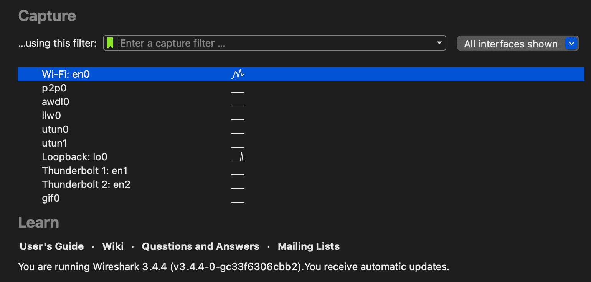

图 6.9 – 捕获接口

在上述截图中，我希望聚焦于**…使用此过滤器**输入字段。这使我们在捕获流量时能够提供精确的焦点。如果我们特别寻找唯一的主机、一系列主机、协议或与参与相关的任何特定内容，这就是我们可以定义捕获过滤器的地方。

注意

**捕获过滤器**不应与**显示过滤器**混淆。捕获过滤器会丢弃或忽略超出过滤条件的数据包，而显示过滤器仅隐藏数据包但允许您保留它们以进行更深入的分析。在参与时，如果您不清楚自己正在捕获的内容，我建议捕获所有内容，然后稍后使用显示过滤器。

## 捕获过滤器

在现场使用的一些简单的捕获过滤器示例包括以下内容：

+   **主机**: 这将捕获与给定主机相关的所有通信。在本例中，所有源自或指定为`192.168.120`的通信将被捕获，所有其他流量将被丢弃。如果您的客户对非常专注的渗透测试有限制，这将非常有用。您可以使用以下命令来实现这一点：

    **主机 192.168.1.20**

+   **网络**: 这将捕获与给定子网相关的所有通信。本例仅捕获目标为或来自`192.168.1.0/24`子网的流量。如果您的客户不希望您与其他网络或通信交互，这非常方便。这通常被称为**灰盒或白盒**渗透测试，我们将在下一章节详细介绍。您可以使用以下命令：

    `net 192.168.1.0/24`

+   **端口**: 这将捕获与给定端口相关的所有通信。在本例中，我们将专注于通过端口`502`进行的`Modbus`流量通信。当我们想追踪特定流程内相关的特定协议时，这非常方便。您可以参考以下命令：

    **端口 502**

如果您想专门跟踪**文件传输协议**（**FTP**）、**网络文件系统**（**NFS**）、SMB 文件传输、TELNET 或基本的 HTTP 认证，还有许多更复杂的过滤方法可以使用。使用捕获过滤器可以让您专注于关键数据包，并在实现目标后将数据保持在可管理的大小。一切可以通过捕获过滤器做的事情，您也可以通过显示过滤器来完成。捕获过滤器与显示过滤器之间最显著的区别是，在相同捕获时间下，文件大小的变化。在非常嘈杂的网络中，只需几秒钟就可以捕获到数百万个数据包。在达到目标之前，可能已经捕获了数 GB 的数据。虽然使用捕获过滤器的好处是您确实可以得到小且易于管理的数据包捕获，但您会失去其他流量中可能隐藏的宝贵信息。接下来，在本书的剩余部分，我们将专注于显示过滤器。这是因为它们能够捕获所有数据包，从而让我们对有趣的攻击向量进行进一步的取证分析。如果使用捕获过滤器，可能会错过这些向量，因为捕获过滤器只会保留符合过滤条件的数据包。

## 显示过滤器

停止当前的 Wireshark 捕获，移除捕获过滤器，并重新选择您的接口。这将允许我们记录网络上的每个数据包。现在，您应该能够看到您的 Koyo Click PLC 或您在实验室中设置的任何 PLC 与工程软件进行通信的情况。以下是您应该看到的示例截图：

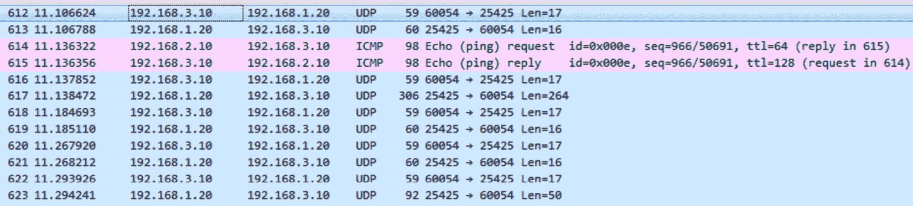

图 6.10 – PLC 与工作站之间的通信

我想重点介绍显示过滤器输入栏，如以下截图所示：

图 6.11 – 显示过滤器

这里是分析发生的地方。对于这个特定部分，我将讨论在渗透测试过程中使用的关键过滤器。为此，我认为最好的方法是专注于一些特别有趣的协议，这些协议能够帮助我们在**操作技术**（**OT**）环境中获得立足点。在网络内部，会有很多以工业控制系统（ICS）为中心的协议，如 Modbus、Ethernet/IP、DNP3、S7、HART 等。下一章将更详细地介绍这些内容。然而，在本节中，我希望关注一些容易获取的内容。这些特定协议在我的渗透测试过程中帮助最大，它们在网络中携带了大量信息，并且在穿透客户的基础设施时非常有用。

### HTTP

从 HTTP 协议中可以获取许多信息，这也是为什么每个人在安全领域都在推动实现 HTTPS 的原因。对我们来说，幸运的是，在工业控制系统（ICS）领域，有 SCADA 系统、HMI、RTU、PLC、流量计算机和 GC 等设备使用传统的 Web 界面来提供信息和/或执行控制。HTTP 协议中包含了许多重要的数据点。你可以通过基本认证提取凭证，可以找到更复杂的混淆形式并在`http.authorization`中过滤摘要，可以捕获请求方法，可以捕获资产细节以及在内部网络中通信的设备等等。以下是一些重要的 HTTP 过滤器：

+   `http.authbasic`: 这个过滤器用于查找基本认证，我们可以轻松地提取并解码，因为用户名和密码是 Base64 编码的。根据公司的安全成熟度，这些数据仍然可以在未更新的旧系统中轻松找到。

+   `http.authorization`: 这是一个可以用来提取授权和摘要访问的过滤器，用于协商凭证，然后使用*hashcat*或*John the Ripper*等工具进行**暴力破解**凭证。我们将在下一章中介绍如何暴力破解密码。

+   `http.request.method`: 这个过滤器提供了很多有趣的信息，因为它会提取所有的`GET`、`POST`、`PUT`和`DELETE`方法。如果你在寻找**应用程序编程接口**（**API**）调用和命令，这将非常有用。

    故事时间

    我曾参与过多个与机场相关的项目。这个特定的机场项目恰好在其公共 Wi-Fi 上使用了一个平面网络；虽然他们并不认为这是平面网络，但就实际情况而言，它确实是一个平面网络。通过简单地嗅探 Wi-Fi 的广播和多播流量，很明显他们没有更改网关的默认凭证。通过设置远程嗅探会话，我能够捕获到通过他们的公共 Wi-Fi 传输的所有内部网络通信。结果发现，他们没有在`SIEM`上启用 HTTPS，而且他们使用一个账户记录并访问所有进出其 SIEM 的数据。一旦我获取了这些使用 Base64 编码的凭证，稍微解码并启用日志记录，我就能够看到机场的整个基础设施，包括所有航站楼、行李处理、暖通空调、自动扶梯、照明等。

由于 HTTP 包含大量数据，这是我使用 Wireshark 时的首选过滤器。我希望看到它所包含的所有简单数据并记录下来，以便以后利用。接下来，我将使用 FTP 作为显示过滤器，深入分析数据，寻找有趣的信息。

### FTP

作为 ICS 网络中最常被探索的协议之一，FTP 几乎被自动化供应商滥用。事实上，FTP 的整个前提是使用非加密协议传输文件，这意味着通过该协议传输的所有内容都容易受到利用。我们有一些供应商使用 FTP 来更新固件或可编程逻辑。试想一下，如果你能够伪造一个明文文件，轻松触发从稳定的固件版本降级到之前的脆弱固件版本。所有这些都可能发生，因为比喻来说，他们并没有提到他们只是试图为流感贴个创可贴。

尝试在 Wireshark 中使用以下显示过滤器：

+   `ftp.request.command == "USER"`

+   `ftp.request.command == "PASS"`

该过滤器直接针对试图访问该主机并失败的用户和密码。它可以找到使用 *Hydra* 等工具进行的暴力破解尝试，或者如果非常幸运，可能会找到有效用户的真实凭证。

`ftp-data`：使用此过滤器，你可以解析通过 FTP 协议在设备之间传输的文件。如果你发现一个数据共享，其中包含一些敏感信息的文件，这个过滤器会非常有用。

由于 FTP 在工业领域仍然被广泛使用，因此在捕获网络数据包时，它是一个需要分析的关键因素。可以提取和重复使用凭证和文件，从而为网络中的潜在更深层次的攻击提供可能性。谁知道，这本身可能就能验证一项完成的渗透测试，因为有些公司内部的文件共享中可能存在滞留的知识产权。继续探讨文件共享的主题，我们接下来将分析 NFS。

### NFS

这是另一个在工业自动化的程序交付端使用的动态协议。编写一个简单的 Python 脚本，能够匿名认证到远程共享，并通过 NFS 上传一个损坏的固件版本，实际上可能会影响并*使*所有在可访问子网中的控制器无法工作。免责声明：*权力越大，责任越大*。尽管这是可能的，但在渗透测试中绝不应采用这种策略。我只是指出一些仍然存在于行业中的传统实现的基本缺陷，并且这些缺陷已经被全球采用。因此，我不仅关注 NFS 作为固件交付方法，还因为`root_squashing`。在某些情况下，你可能会发现`root_squashing`已被关闭，能够迅速找到这一点可以帮助我们在 OT 环境中的机器上快速提升权限。以下是一些可以用来缩小可能暴露的系统范围的显示过滤器：

+   `nfs.readdir.entry`：此过滤器帮助提取通信内容，以显示是否存在可被利用的文件共享。在协议内部，明文显示的文件列表将帮助我们绘制出现有资产，并可能指示进入系统的入口点。

+   `nfs.access_rights`：下一个过滤器允许我们筛选出被锁定的文件共享。如果我们运行此过滤器，它将提取与特权访问相关的数据包，如**读取（READ）、查找（LOOKUP）、修改（MODIFY）、扩展（EXTEND）**和**删除（DELETE）**。这些信息非常重要，能够帮助你节省时间并减少在渗透测试过程中遇到的麻烦。

本部分中，我们讨论了如何使用 Wireshark 捕获网络流量。我们缩小了捕获过滤器的定义，讲解了它们的优势以及在渗透测试中的应用方法。我们还讨论了捕获过滤器与显示过滤器之间的区别。接着，我们深入探讨了一些关键的显示过滤器，它们可以帮助你发现网络内部的有价值信息，并且可以用于资产识别、潜在的利用途径、权限提升途径，以及可能的网络中转点。在下一部分，我们将通过使用显示过滤器分析数据包捕获文件，实际演练如何提取关键流量信息。

# 分析数据包中的关键信息

在前面的部分，我们讨论了如何使用显示过滤器分析`http`、`ftp`和`nfs`等协议。了解如何应用这些过滤器并提取关键数据，对成功进行渗透测试至关重要。此外，理解网络中谁与谁进行通信，并迅速应用过滤器聚焦于关键信息，是必不可少的技能，并且需要不断练习，才能提高流量分析的能力。在前面的部分，我提供了一些链接，我想再次强调，你需要不断练习，提高你的技能。人们通常将渗透测试人员称为网络武士或数字忍者：他们每天都在练习，以加强并精通自己的技能。在本部分中，我们将对多个数据包捕获文件进行分析，展示如何处理网络数据包捕获文件，并提取成功进行评估所需的关键信息。

注意事项

渗透测试者成功的关键要素之一不仅仅是能够攻破系统，而是能够清晰简明地沟通安全漏洞所在，以及你是如何利用这些漏洞获取环境访问权限的。这是我第一次真正谈论这个话题。但现在我们深入到流量分析中，并会遇到很多有趣的信息，我必须强调，你需要保持一个便签本，记录下看到的资产、捕获的信息、可以被利用的枢纽点，以及在网络中嗅探到的凭证。所有这些信息都需要记录下来，并确保在需要提交最终报告时可以轻松查阅。你会感谢自己开始做笔记并记录下你在网络中发现的那些有趣的信息。

现在，如果你回顾一下*技术要求*部分，我发布了一个关于 4SICS Geek Lounge 数据包捕获的链接。为了复习，这里再次给出链接：[`www.netresec.com/?page=PCAP4SICS`](https://www.netresec.com/?page=PCAP4SICS)。

现在你可以利用你拥有的任何 PCAP 文件。这些文件在行业中是开放的，可以帮助我们真正发挥显示过滤器的强大功能。

继续用 Wireshark 打开名为`4SICS-GeekLounge-151021.pcap`的 PCAP 文件。你应该能看到大约 120 万个数据包被加载到 Wireshark 中。我希望你能尝试上一节中提到的第一个显示过滤器。使用`http.authbasic`过滤器，你应该能看到类似以下截图的输出：

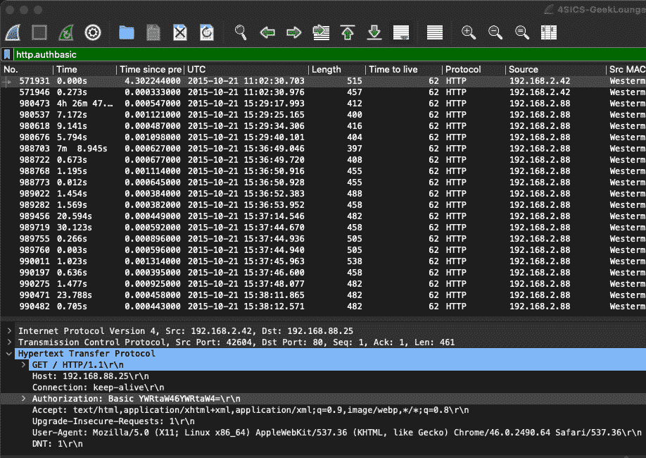

图 6.12 – http.authbasic 显示过滤器

如果你注意到`Authorization: Basic YWRtaW46YWRtaW4=`字段和值，你可以通过运行以下命令，运用你的命令行技能：

echo YWRtaW46YWRtaW4= | base64 -d

在你的命令行中，你将使用`admin:admin`凭证。

如果你更倾向于使用工具，那么我强烈推荐*CyberChef*，可以在[`gchq.github.io/CyberChef/`](https://gchq.github.io/CyberChef/)找到。

CyberChef 是一个很棒的图形工具，用于执行编码/解码、密码学分析和转换等操作。简单来说，它有输入、输出和配方。在我们的案例中，我们希望将基本哈希值放入**输入**部分并应用`From Base64`配方。在**输出**部分，你将看到`admin:admin`凭证，如下图所示：

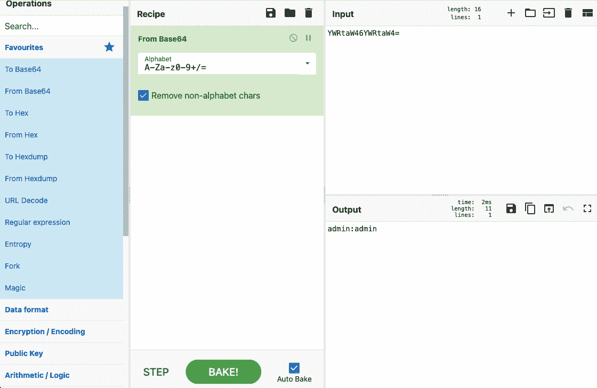

图 6.13 – 从 Base64 解码的 CyberChef

我个人喜欢使用命令行中的 Base64 来进行解码和其他任务，只在进行更复杂的任务时依赖 CyberChef，比如在 Base64 中编码 *Node.js 反向 Shell* 并将其注入到格式错误的 Web 门户中，不过我有点跑题了。现在在查看该过滤器时，你应该会注意到第二组凭证；你能找到它们吗？

第二组凭证将是`Authorization: Basic cm9vdDpyb290`，即`root:root`。

现在，记得我之前建议你做笔记吗？让我们通过运行一个简单的显示过滤器来回顾一下我们发现了什么。我们得到了以下信息：

+   资产`192.168.2.42`通过 HTTP 与`192.168.88.25`的`80`端口进行通信，凭证为`admin:admin`。

+   资产`192.168.2.88`通过 HTTP 与`192.168.88.49`的`80`端口进行通信，凭证为`root:root`，用户代理表明它可能是运行 Firefox 的 Ubuntu Linux x86_64。

所有这些信息都非常有用。我们知道有两个不同的子网，并且`.2`可以与`.88`通信。我们知道有两个 web 服务器在运行，并且它们使用的是一种旧的认证方式，这让我相信这两个服务器可能容易受到进一步的利用。和下面的图示类似，我还习惯于绘制连接图，以便后续作为视觉参考：

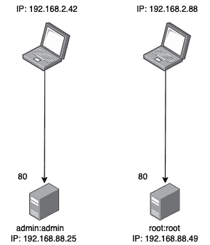

图 6.14 – HTTP 访问的视觉辅助图

接下来，我们想要将过滤器从`http.authbasic`更改为`http.request.method`，此时你应该会看到大约 5,800 个包含`GET`、`POST` 和 `OPTIONS` 请求的数据包。在这里，我可以快速扫描**信息**列，寻找任何特别有趣的内容，比如文件名、`DELETE`、`PUT` 或 `POST` 请求、授权尝试，或者任何能够提供更多网络细节和见解的内容。由于我们可以看到`POST`请求，我将调整过滤器，专注于`POST`请求，如下图所示：

图 6.15 – POST 请求

现在，我们已经将 5,800 个数据包过滤为 15 个。请查看**信息**列，如下图所示，看看是否能找到任何可能感兴趣的内容：

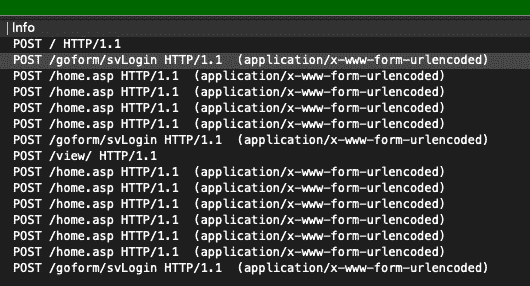

图 6.16 – 信息列

我们可以从过滤器中看到有一些有趣的 URL 正在被 POST 到：

+   `/goform/svLogin`

+   `/home.asp`

+   `/view/`

点击第一个`/goform/svLogin** **POST` 请求并导航到`application/x-www-form-urlencoded`部分，我们可以看到表单项以明文传递，如下图所示：

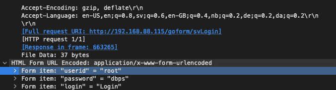

图 6.17 – /goform/svLogin POST 请求

我们现在找到了另一组`root:dbps`凭证。记下这些信息后，我们可以继续添加以下内容：

+   资产`192.168.2.42`正在通过 HTTP 与`192.168.88.115`的端口`80`进行通信，后者是一个使用`root:dbps`凭证的 Digiboard 设备。

下一个数据包将是`POST`请求，目标为`/home.asp`。如果我们查看数据包的详细信息，会发现一个非常有趣的发现，那就是`Cookie`，如下面的截图所示：

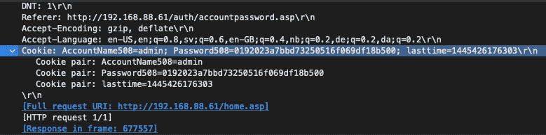

图 6.18 – Cookie 字段

在这里，我们可以看到另一组凭证：

+   `AccountName508=admin`

+   `Password508=0192023a7bbd73250516f069df18b500`

这非常有趣，因为该密码看起来像是加密的。我们可以使用几种不同的方法来确定它可能的加密类型。我个人在`hash-identifier`和`haiti`之间切换。对于这个例子，我们将使用`hash-identifier`，并在我们的 Kali 实例上运行以下命令，这是我们在*第一章**，使用虚拟化中安装的：

echo 0192023a7bbd73250516f069df18b500 | hash-identifier

你应该会收到类似以下的响应：

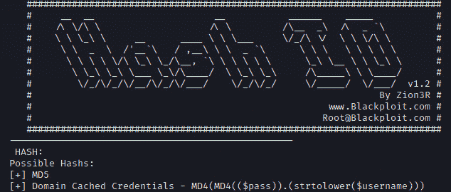

图 6.19 – Hash ID

现在我们知道这个哈希值可能是 MD5 哈希，我们可以尝试使用多种工具进行破解，如*hashcat*或*John the Ripper*。但是，我将访问`crackstation.net`，加载哈希并快速检查它是否已被破解。果然，它已经破解了，如下图所示：

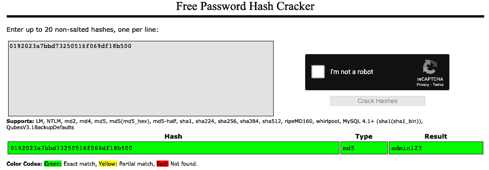

图 6.20 – crackstation.net MD5

现在，我将逐一检查这些请求，提取哈希值并在`crackstation.net`上检查。你应该会看到以下结果：

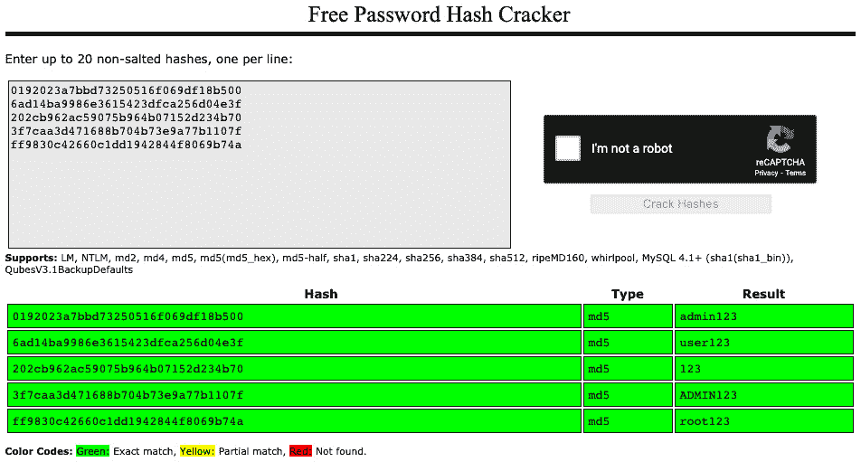

图 6.21 – CrackStation 找到的密码

发现的凭证对如下：

+   `admin:admin123`

+   `user:user123`

+   `admin:123`

+   `admin:ADMIN123`

+   `root:root123`

现在需要注意的是，并非所有这些凭证都有效，我们需要更深入地查看设备之间的通信，以找出哪些凭证是真实的，哪些是无效的。我们可以通过高亮显示其中一个数据包并右键单击它来做到这一点。然后，我们可以选择**跟踪** | **HTTP 流**，如下面的截图所示：

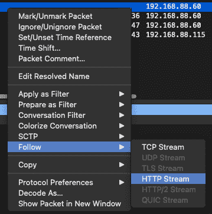

图 6.22 – 跟踪 | HTTP 流

这个接收到的数据包输出如下：

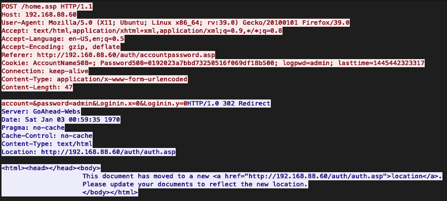

图 6.23 – HTTP 302 重定向

因为我们看到一个 `HTTP/1.0 302` 重定向，我们可以合理推测提供的凭据是错误的。如果你继续以这种方式分析数据包，你应该会看到一个 `HTTP/1.0 200 OK` 响应，这表示凭据是有效的，用户已经在网页门户中通过认证：

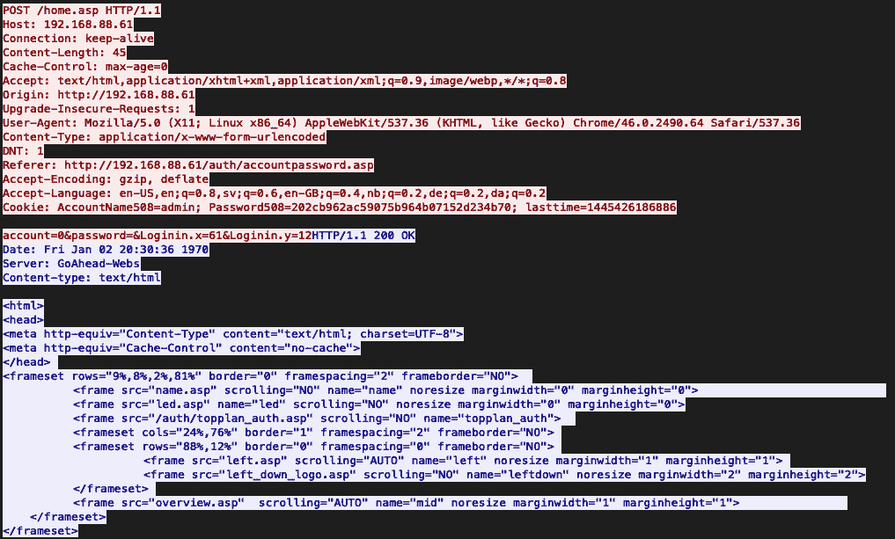

图 6.24 – HTTP 200 OK

现在，我们应该回去更新之前的图示，并确保更新我们的笔记。以下是新图示的样子：

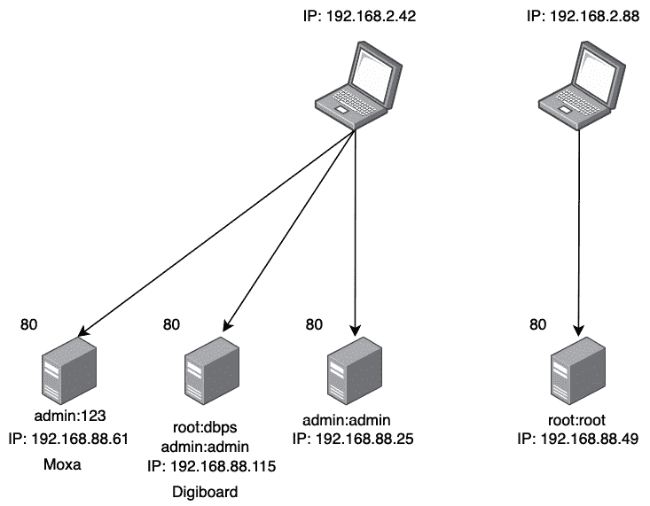

图 6.25 – HTTP 数据检测

在这里，我们仅使用了两个特定于 HTTP 的过滤器，并且已经发现了可以在交换机技术中使用的有效凭据，这让我们能够深入网络。还有更多广泛的过滤器可以用来解析出更大量的信息；我只是想展示在非常短的时间内获取关键信息有多么容易。在最后一节中，我们将讨论 FTP 协议并展示该协议的显示过滤器。使用相同的 PCAP 文件，更新你的显示过滤器，仅仅查找所有的 FTP 流量，如下图所示：

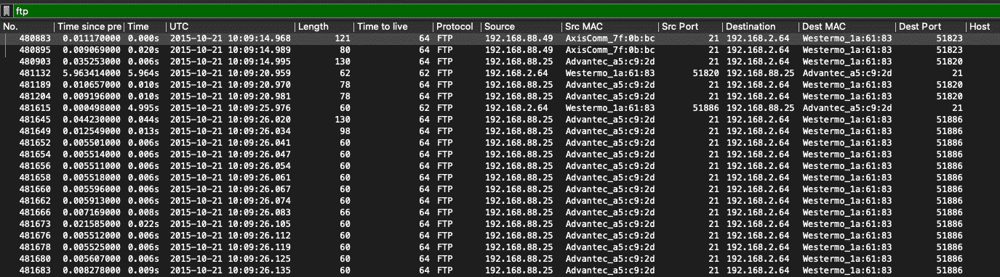

图 6.26 – FTP 流量

选择第一个数据包，即 `No.** **480883`，查看数据包信息，我们可以迅速找到非常相关且易于识别的资产详情，如下所示：

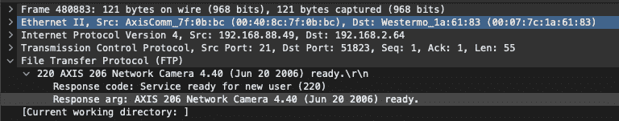

图 6.27 – AXIS 206 网络摄像头

在这里，我们碰巧找到了一个 AXIS 网络摄像头，该摄像头在数据包内发布了资产型号和版本号。现在回想一下我们讨论开源情报的章节；我们应该能够打开 [`www.exploit-db.com/`](https://www.exploit-db.com/) 并在搜索框中输入 `axis network camera`。你应该能看到以下结果：

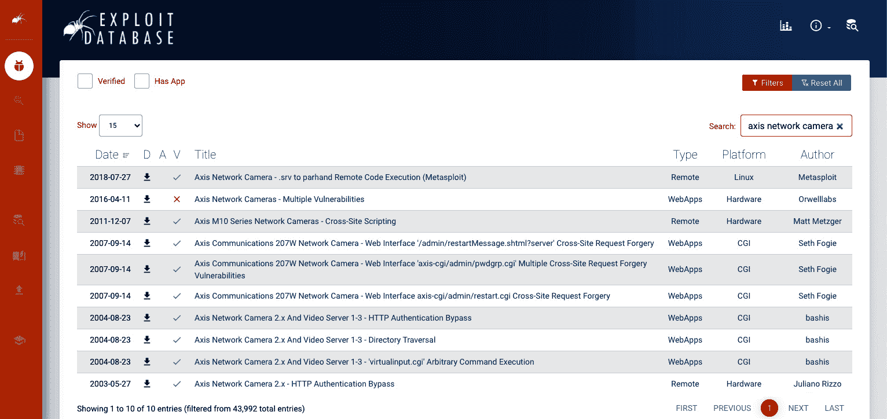

图 6.28 – Exploit 数据库

让我们点击看到的第一个条目，**Axis 网络摄像头 - .srv 到 parhand 远程代码执行（Metasploit）**。查看该条目的详细信息后，我们发现有一个很好的 Metasploit 模块，可以让我们对这个摄像头进行远程执行。太棒了！让我们将其添加到图示和文档中。有了这些新信息，让我们回到笔记中，看看我们现在发现了什么。以下是更新后的图示：

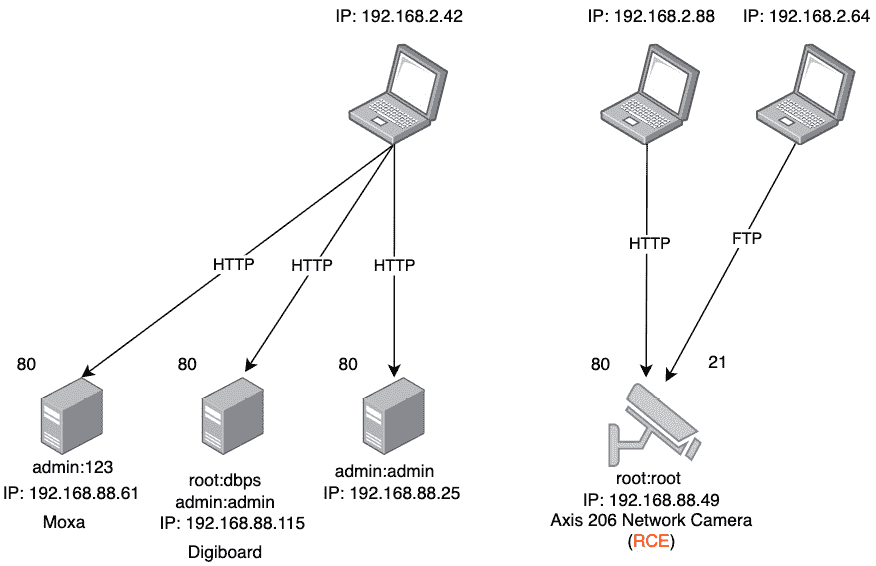

图 6.29 – HTTP 服务器与 AXIS 网络摄像头

请注意，通过使用 HTTP 过滤器，我们发现了一个位于 IP 地址`192.168.88.49`的 Web 服务器，凭证为`root:root`。现在，在运行 FTP 显示过滤器后，我们可以看到另一个设备与该先前的资产进行通信。然而，我们现在有了更多的资产信息，可以确定该端点是一个网络摄像头，于是我们更新了我们的笔记，并记录下我们发现的漏洞。打开接下来的两个 PCAP 文件，并运行我们在`4SICS-GeekLounge-151021.pcap`上使用的相同过滤器，确保记录下你的发现。

在这一部分，我们深入探讨了显示过滤器和可以提取的数据。我们使用了在[`www.netresec.com/?page=PCAP4SICS`](https://www.netresec.com/?page=PCAP4SICS)上公开发布的 PCAP 文件。然后，我们通过使用各种 HTTP 和 FTP 显示过滤器来探索数据。我们能够捕获正在网络上使用的有效凭证，并识别出一些具有战略意义的易受攻击资产。这一部分帮助我们理解了为什么捕获和分析网络流量对于渗透测试至关重要，因为可以从网络中提取到更多有用和关键的数据。

# 总结

在本章中，我们通过回顾 OSI 模型并理解模型中存在的各种层次，了解了数据包的形成方式。我们进一步分析了 IPv4 数据包的结构，并与从实验设备上捕获的数据包进行了对比。在对数据包是什么以及它们如何构建有了更好的理解后，我们使用 Wireshark 捕获了这些数据包。我们利用了上一章中创建的镜像端口，并讨论了捕获过滤器和显示过滤器之间的区别。

最后，我们从一个开源的 ICS 实验室下载了一些 PCAP 文件，并使用 Wireshark 分析了我们在这些数据包捕获中发现的流量。我们利用显示过滤器来缩小关键网络数据的范围，如有效凭证、操作中的 Web 门户和工作中的网络摄像头。理解并实践这些技术和方法将使你在未来的渗透测试中取得非常成功的成果。

在下一章，我们将把迄今为止学到的所有内容应用到实验中。我们将讨论多个主题，如枚举、协议深度分析、利用和权限提升。这些都是成功进行渗透测试所需的关键要素。
