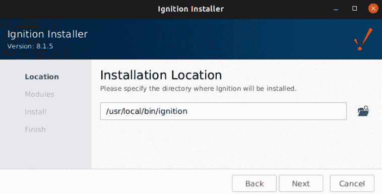
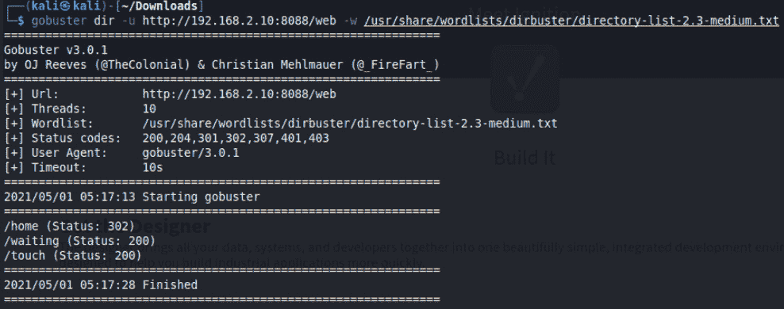

# 第七章：扫描基础知识

在上一章中，我们讨论了数据包的结构以及它们如何与 OSI 模型相关，使用 Wireshark 设置捕获过滤器，并通过显示过滤器分析我们从 Netresec 下载的**工业控制系统**（**ICS**）实验室**数据包捕获**（**pcaps**），通过这些技能来加深知识并提升我们的渗透测试能力。

在本章中，我们将安装 Ignition SCADA 并将我们的 Koyo Click PLC 实验室与之连接。接着，我们将查看用于枚举和扫描工业网络的多种工具，从使用 NMAP 和 RustScan 进行端口扫描，到使用**人机界面**（**HMIs**）、SCADA 操作员屏幕、PLC 控制屏幕和流量计算机网页门户进行 Web 应用程序扫描，使用工具包括 Gobuster 和 feroxbuster。我们将使用这些工具并在我们的 Ignition SCADA 实例上运行它们。

在本章中，我们将覆盖以下主要主题：

+   安装和配置 Ignition SCADA

+   NMAP 简介

+   使用 RustScan 进行端口扫描

+   Gobuster 简介

+   使用 feroxbuster 进行 Web 应用程序扫描

# 技术要求

对于本章，你将需要以下内容：

+   `Ignition SCADA`：你需要安装 Inductive Automation 的 Ignition SCADA 才能使用 Gobuster 和 feroxbuster。使用以下链接并在你的 SCADA 虚拟机主机上进行安装：

    [`inductiveautomation.com/downloads/`](https://inductiveautomation.com/downloads/)

)

+   `NMAP`：[`nmap.org/`](https://nmap.org/)。

+   `RustScan`：[`github.com/RustScan/RustScan`](https://github.com/RustScan/RustScan)。

+   `Gobuster`：[`github.com/OJ/gobuster`](https://github.com/OJ/gobuster)。

+   `feroxbuster`：[`github.com/epi052/feroxbuster`](https://github.com/epi052/feroxbuster)。

+   **Redpoint Digital Bond 的 ICS 枚举工具**：[`github.com/digitalbond/Redpoint`](https://github.com/digitalbond/Redpoint)。

你可以在这里查看本章代码的实际应用：[`bit.ly/3veEeNm`](https://bit.ly/3veEeNm)

# 安装和配置 Ignition SCADA

Ignition SCADA 是市场上最新的平台之一，真正采用了现代技术并提供模块化框架。许多行业和一些大公司已经采纳了它来管理他们的工业控制过程。通过在实验室使用现实世界的软件和硬件，我们可以更好地理解事物如何在进行评估之前相互协作：

1.  使用之前提供的链接，[`inductiveautomation.com/downloads/`](https://inductiveautomation.com/downloads/)，我们将为我们的 Ubuntu SCADA 虚拟机下载软件包。

    你应该有一个名为`ignition-8.1.5-linux-x64-installer.run`的软件包。

1.  运行以下命令将启动安装程序：

    `./iginition-8.1.5-linux-x64-installer.run`

    这将启动安装程序窗口，界面如下所示：

    

    图 7.1 – Ignition 安装程序

1.  通过默认的窗口选择**下一步**；我们将保持 Ignition 安装的默认位置（**/usr/local/bin/ignition**）。点击**下一步**，如下图所示：

    图 7.2 – 安装位置

1.  接下来，我们选择**典型**安装，然后点击**下一步**按钮，如下图所示：

    图 7.3 – 典型安装

1.  在选择完这些选项后，你将点击**安装**按钮。你会看到 Ignition 正在提取包并将软件安装到你的 SCADA 主机上。

1.  点击**完成**，这将带你进入一个页面，你可以在其中选择三种主要版本—`Maker Edition`、`Ignition`和`Ignition Edge`，如下图所示：

    图 7.4 – Ignition 版本

1.  点击`Ignition`，因为我们知道这是行业中主要使用的产品。

    这将带你进入**条款和条件**页面。选择同意，然后你将看到一个创建新用户的页面，如下所示：

    

    图 7.5 – 创建用户

    我为了简化安装过程，选择了将用户名设为`scada`，密码也设为`scada`。

1.  接下来，你将看到配置端口的选项提示。我将端口保持为默认设置，这是大多数行业安装的典型配置。你可以在以下截图中看到 HTTP、HTTPS 和网关网络端口的默认设置：

    图 7.6 – 配置端口

1.  接下来，你需要点击**完成设置**按钮，你将进入一个页面，显示安装已完成，并可以点击一个按钮来启动网关，如下图所示：

    图 7.7 – 启动网关

1.  继续点击**启动网关**按钮。可能需要一两分钟才能启动，因此可以坐下来放松一下，或者去喝杯咖啡。安装完成后，你将看到一个选项，允许你从头开始或启用快速启动。我选择了**是，启用快速启动 ->**，因为它能为我简化一些选项。看看下面的截图：

    图 7.8 – 启用快速启动

1.  一旦启用快速启动，你将被提示登录。用我们之前创建的用户名和密码登录吧：

    图 7.9 – 登录

1.  如您所见，您现在可以使用完整的 SCADA 产品，并且该产品将以**试用模式**运行。您可以在**试用模式**下运行并测试该产品；但是，每 2 小时必须重置试用期。从这里开始，我们将把 Koyo Click PLC 连接到 Ignition。点击屏幕左侧的**状态**按钮，这将带您到一个**概览**屏幕，显示**架构**、**环境**、**系统**以及许多其他选项，如下图所示：

    图 7.10 – 状态

1.  从这里，您需要查找并点击**设备**按钮，如下图所示：

    图 7.11 – 设备

1.  这将带您进入**设备**仪表板，显示连接设备的详细信息，如下图所示：

    图 7.12 – 设备仪表板

1.  从这里，我们将点击屏幕右上角的**配置**按钮。这将带我们到一个屏幕，在那里我们可以创建一个新设备。请点击**创建新设备…**按钮：

    图 7.13 – 创建新设备…

    会显示一个已包括设备的列表，但您可能会注意到，列表中没有专门的 Koyo Click。然而，我们知道我们的设备使用 Modbus TCP 协议并通过端口`502`进行通信，因此向下滚动，直到找到以下选项并选择它：

    

    图 7.14 – Modbus TCP

    这将为您提供一个配置**常规**和**连接性**参数的屏幕。

    我设置了以下参数：

    - **名称`: **Koyo Click`

    - **描述`: `实验室 PLC Koyo Click**

    - **主机名`: **192.168.1.20`

    - **端口`: **502`

    - **通讯超时`: **2000`

    这是您应看到的屏幕，前面的信息已经填写：

    

    图 7.15 – PLC 配置

    有一点需要特别注意。Koyo Click 的地址范围从 0 开始，正因为如此，Ignition 提供了一个选项，可以在高级属性中进行设置，如下所示：

    

    图 7.16 – 基于零的寻址

1.  完成后，您应该会看到一条消息，显示 Koyo Click 已成功创建并添加到系统。如果一切正常，在**状态**栏下，您将看到**已连接**，如图所示：

    图 7.17 – 连接的 PLC

1.  接下来，我们将把我们的线圈映射到 Ignition 系统中，因此我们将点击**连接**状态旁边的**更多**下拉按钮。在此下拉菜单中，我们选择**地址**，如下一张截图所示：

    图 7.18 – 地址

    这将带我们进入**地址配置**屏幕，允许我们将地址映射到 Ignition 中。我们将使用以下数据来配置我们的地址：

    - **前缀**：`Lights`

    - `Start`：`1`

    - `End`：`4`

    - **单元 ID**：`0`

    - **Modbus 类型**：**线圈**

    - **Modbus 地址**：`000000`

    请注意，`Start`编号是`1`，这是因为我们选择了**基于零的寻址**选项。`End`编号是`4`，因为我们有四盏灯连接到我们的线圈。**Modbus 地址**的起始地址是`000000`，这与 Koyo Click 的特点有关。你可以在以下截图中看到输入是如何配置的：

    

    图 7.19 – 地址配置

1.  一旦我们为**地址配置**点击**保存**，我们将把新创建的 Modbus 地址映射到我们的**开放平台通信**（**OPC**）服务器。点击屏幕左侧的`Config`按钮，该按钮位于之前选择的`Status`按钮下方。向下滚动，直到找到`OPC CLIENT`，然后选择**OPC 快速客户端**，如下面的截图所示：

    图 7.20 – OPC 快速客户端

1.  这将弹出一个屏幕，在该屏幕上你可以验证你的标签是否已经从 Koyo Click PLC 的 Modbus 映射到 Ignition 的内部，并且你应该能看到所有四个灯光在`ACTION`列下被映射，并带有三个字母`[s][r][w]`：

    - `[s]`表示订阅。

    - `[r]`表示读取。

    - `[w]`表示写入。

    点击这些`Action`链接可以让你直接与 PLC 进行交互。以下是你应该看到的屏幕：

图 7.21 – OPC 标签映射

最后，你将打开设计器并创建一个图形，将四个灯光按钮与其链接。不过，我觉得这部分超出了我们的讨论范围，并且对于接下来要讨论的内容并不关键。所以，我将留给你去探索如何设计 SCADA 图形。

在本节中，我们详细介绍了 Ignition SCADA 的安装过程。我们将 PLC 链接到系统并验证其工作情况。稍后我们将在本章中使用这个 SCADA 系统进行 Web 应用枚举。在下一节中，我们将使用 NMAP 扫描开放端口。我们正在按照渗透测试中通常执行的逻辑步骤进行，并使用专业工具进行实战演练。

# NMAP 介绍

来自自动化控制领域，我在职业生涯早期就使用 NMAP 来排查开始采用基于 TCP 的协议的新技术。寻找具有开放端口且没有任何文档的硬件在 00 年代中期是很常见的事。随着接下来的二十年，我跟踪了这个项目，并见证了它发展成今天这个基础性工具。它不仅用于寻找开放端口，还可以用于执行操作系统指纹识别、应用识别等许多功能。

在本节中，我们将安装并运行 NMAP，对我们的实验室环境进行扫描。我们将识别开放的端口及其上运行的服务。在实际工作中，扫描网络以寻找资产和开放端口是进入工业网络并在客户网络中获取立足点和枢纽点的基础。正如上一章节所提到，Wireshark 是渗透测试人员的第一工具，我会说 NMAP 是第二工具。借助这两个工具，我可以进行评估、开展渗透测试、参与**夺旗赛**（**CTF**）、排除网络故障、对 SCADA 系统进行通信分析等。

每个主要的系统都可以利用某种包管理器来获取 NMAP 的安装包。

对于 Linux，以下是内容：

apt install nmap

对于 macOS，以下是内容：

brew install nmap

对于 Windows，以下是内容：

[`nmap.org/zenmap/`](https://nmap.org/zenmap/)

)

Zenmap 提供了一个可视化工具，可以用于分析和绘制网络和资产。

现在我们已经在系统上安装了 NMAP，我们想对实验室网络进行扫描。为了提醒您回顾一下*第一章*，*使用虚拟化*，以下是网络布局：

从以下截图开始，首先向 Kali Linux 添加第二个接口，并将其置于操作与控制网络区域：

图 7.22 – 第二个接口

现在，您将在**企业**区域中拥有一个接口，这是实验室的第 5 级，现在您应该可以看到您新添加的**操作**区域，这是第 3 级。

现在，在您的 Kali Linux 虚拟机上，将新添加的第二个接口设置为与 Windows 7 Professional 在同一子网中的 IP 地址。我选择将我的 IP 地址设置为`192.168.3.200`。接下来，我们将对子网进行一个非常基础的扫描。

免责声明

扫描或枚举阶段是我们开始生成可以在网络上追踪到的信息的起点。这被认为是一种*主动*的方法，可能带来一些后果，如被检测到，或者更糟糕的是，扫描旧设备的端口，导致设备挂起或停止工作。这是来自现实世界经验的警示故事。

在免责声明处理完毕后，我们开始进入正题。即使我们知道自己的实验室以及其中的设备，我们仍然会从扫描整个子网开始，作为 NMAP 的介绍。

运行以下命令，它会进行快速扫描，覆盖整个子网，因此为`/24`：

nmap 192.168.3.0/24

你应该会看到以下结果，扫描报告显示了你的 Kali 主机，但没有其他信息。你们中的一些人可能会好奇为什么 Windows 机器没有出现在扫描结果中：

图 7.23 – 子网扫描

答案是 Windows 正在阻止/丢弃我们的 ping 探测，NMAP 会跳到提供的下一个 IP 地址。你可以通过在命令末尾加上`-Pn`（不使用 ping）选项来执行先前的命令，格式如下：

nmap 192.168.3.0/24 -Pn

现在我们要聚焦于我们在*第一章*中安装的 Windows 机器，*使用虚拟化*。运行以下专门针对 Windows 机器的命令：

nmap 192.168.3.10 -Pn

你应该会看到以下结果；然而，这些结果可能会根据你在虚拟机中启用或禁用的服务有所不同：

图 7.24 – Windows 扫描

使用 NMAP 时，有许多选项，如果你运行`man NMAP`命令，可以阅读源文档，深入了解 NMAP 提供的所有可能性和选项。我们将仅仅运行一个非常激进的扫描，以展示在 Windows 主机上可以发现的详细信息。如果你阅读了手册信息，你会注意到文档中提醒不要在未授权的目标上使用`-A`（激进扫描选项）。由于我们拥有这台主机并且它位于我们的实验室中，我们可以继续运行它：

nmap -A 192.168.3.10 -Pn

你会注意到相同的端口扫描结果被返回，但这次，使用激进模式，脚本将对主机执行，以识别更多详细信息，如下所示：

图 7.25 – 激进扫描

从截图中，我们发现了以下资产信息：

+   **操作系统**：`Windows 7 Professional N 7601 Service Pack 1`

+   **计算机名称**：`WIN-VA8PE66T785`

+   **工作组**：`Workgroup`

+   **SMB 用户**：`guest`

+   **SMB 版本**：`2.0`

这在你的评估过程中非常有用，因为你可以开始探查网络中发现的主机，确定哪些端口是开放的，并了解在这些开放端口上运行了哪些服务。

激进模式产生的额外信息是通过对发现的主机运行脚本得到的。这些**NMAP 脚本引擎**（**NSE**）脚本可以在 Kali Linux 发行版中找到，路径为`/usr/share/nmap/** **scripts`，并且可以通过运行以下命令查看列表：

ls /usr/share/nmap/scripts

在`scripts`文件夹下，你可以找到特定于 ICS 的脚本，如下所示：

+   `bacnet-info`

+   `enip-info`

+   `modbus-discover`

+   `s7-info`

这只是安装 NMAP 时包含的一些默认脚本的列表。如果你访问[`github.com/digitalbond/Redpoint`](https://github.com/digitalbond/Redpoint)，你将找到可以包含在 NMAP 中的脚本列表，以便更深入地枚举你在职业生涯中遇到的各种 ICS 硬件。

在本节中，我们快速讨论了 NMAP 是什么以及它的功能。我们在系统上安装了 NMAP，并开始扫描我们的实验室。我们对 Windows 主机进行了一个积极的扫描，然后讨论了 NSE。最后，我们查看了可以运行的 ICS 特定脚本。关于 NMAP 和 NMAP 脚本有很多专门的书籍和课程；本节是为了简单介绍 NMAP 的重要性，并展示如何在工业网络中使用它。

在下一节中，我们将介绍 RustScan，它被称为*现代端口扫描器*。我们将把 RustScan 安装在我们的 Kali Linux 发行版上，并在实验室环境中运行它。

# 使用 RustScan 进行端口扫描

NMAP 一直是我首选的端口扫描工具，直到最近，我发现了 RustScan。RustScan 的一个主要优点是它扫描所有 65K 端口的速度极快；它可以在 3 秒内完成这项工作。与 NMAP 相比，简直是天壤之别。我曾经设置 NMAP，然后去吃午饭，回来时它还在运行。它支持完整的脚本编程，可以通过 Python、Lua、Bash，甚至将 RustScan 的结果传递给 NMAP。

当时间紧迫时，RustScan 是首选。然而，我仍然会回到 NMAP 来处理某些特定任务，但那更多是出于熟悉度，正如之前所说，练习，练习，再练习。在本节中，我们将安装 RustScan，并在实验室中的机器上运行它。我们将观察扫描运行速度的差异，并熟悉其语法，以便将这个工具添加到我们的渗透测试工具库中。

## 安装 RustScan

官方文档可以通过以下链接找到：

[`github.com/RustScan/RustScan#-full-installation-guide`](https://github.com/RustScan/RustScan#-full-installation-guide)

我将专注于仅在我们的实验室虚拟机上安装 RustScan；然而，欢迎你阅读相关材料，并在你喜欢的任何系统上安装它。

在我的 Kali 虚拟机上打开 Firefox ESR，我将导航到以下链接：

[`github.com/RustScan/RustScan/releases`](https://github.com/RustScan/RustScan/releases)

你将看到以下屏幕，包含`.deb`软件包和源代码包：

图 7.26 – RustScan 软件包

我将点击 `rustscan_2.0.1_amd64.deb` 软件包并将其下载到我的计算机上。然后我打开终端窗口并导航到我的 `~/Downloads` 文件夹来验证该软件包。验证软件包后，我将执行以下命令来安装该软件包：

sudo dpkg -i rustscan_2.0.1_amd64.deb

现在，如果一切正常，你应该会看到以下结果：

图 7.27 – RustScan 安装

现在我们已经安装了 RustScan，接下来将运行一个快速的帮助命令，来获取我们可以使用的命令的概览：

rustscan -h

你将看到以下结果：

图 7.28 – RustScan – 帮助

警告

在继续之前，需要了解的是，快速扫描的代价是噪声。RustScan 能够在 3 秒钟内检测到 65K 个端口，这意味着它在网络上非常嘈杂，你将被检测到。此外，对敏感设备进行此类扫描几乎肯定会导致它们崩溃，因为这些设备从未设计用来在如此高的速率下处理成千上万的请求。这将对操作造成影响并造成生产损失；在将此工具用于实时生产网络之前，请阅读有关减小批处理大小和增加超时的相关内容。

解决这个问题后，再次尝试扫描你的 Windows 主机并观察速度。使用以下命令：

rustscan -a 192.168.3.10

你将看到以下结果：

图 7.29 – RustScan -a Windows 主机

由于 RustScan 的可扩展性，我们可以通过传递参数来运行 NMAP 命令。我们可以对 SCADA `192.168.2.10` 主机进行激进扫描。使用 `rustscan` 命令并将批处理大小 `-b` 设置为 `10`，地址 `-a` 设置为 `192.168.2.10`，我们将传入 NMAP `-A` 激进扫描命令：

rustscan -b 10 -a 192.168.2.10 -- -A

运行此命令后，如果你按照*第一章*《使用虚拟化》的步骤操作，你应该已经打开了以下端口：

+   `21`

+   `22`

+   `23`

这在下面的截图中展示：

图 7.30 – RustScan – NMAP -A 扫描

下一个截图已被裁剪并缩短，以便于阅读。NMAP `-A` 激进扫描的输出显示了开放的端口以及可能在这些端口上运行的服务，如下所示：

图 7.31 – 端口服务运行情况

从中我们可以看到以下服务及其在开放端口上运行的版本：

+   `21/tcp open ftp vsftpd 3.0.3`

+   `22/tcp open ssh OpenSSH 8.2p1`

+   `23/tcp open telnet telnetd`

我们还发现该主机正在运行 Ubuntu Linux，这不足为奇，因为我们已经安装并配置了这些服务。

RustScan 不仅可以运行 NMAP 选项，还可以从命令行运行脚本，或者我们可以创建自己的自定义脚本并运行它们以收集更多信息。在这个例子中，我将运行 NMAP `modbus-discover` 脚本，对实验室中的 PLC 进行扫描。在我的例子中，它是 Koyo CLICK PLC，但同样，这也可以是任何你想在实验室中设置的 PLC。

我们将批处理大小 `-b` 设置为 `10`，然后将地址 `-a` 设置为 `192.168.1.20`，设置 **—** 内联命令，传递 NMAP **—script** 脚本命令，并将脚本设置为 `modbus-discover`：

rustscan -b 10 -a 192.168.1.20 -- --script 'modbus-discover'

命令的输出应如下所示：

图 7.32 – modbus-discover 脚本

我将其分成了两张图像，并省略了一些响应项，以便从运行 `modbus-discover` 脚本中获取有趣的输出，如下图所示：

图 7.33 – modbus-discover SID

在本节中，我们介绍了 RustScan 的安装，运行一个简单的扫描，通过传入 NMAP 选项运行扩展扫描，最后我们运行了一个扫描并传入了来自 NMAP 集合的默认 `modbus-discover` 脚本。我们确保减少批处理大小，因为使用这个工具时需要小心，特别是考虑到它的扫描速度。我已经将 RustScan 纳入了我的工具集，因为它具有较快的扫描速度；我可以设置我想关注的端口范围，并减少等待结果的时间。我主要在 5–3 级别使用它，因为我知道关键控制硬件很少出现在这些级别。一旦进入更低的网络层，我就会回归使用 NMAP，进行低速扫描，并非常小心不影响任何可能正在运行的进程。

在下一节中，我们将介绍 Gobuster。我们将安装这个目录扫描工具，并将其用于我们安装的基于 Web 的 SCADA 应用程序。

# Gobuster 介绍

Gobuster 是一个用 Go 编写的 Web 枚举和目录暴力破解工具。在发现 Gobuster 之前，我使用过 Nikto、Cadaver、Skipfish、WPScan、OWASP ZAP 和 DirBuster 等工具。这些工具每个都有其优缺点，但最终它们的工作原理差不多，结果也有所不同。然而，我在寻找一个可以从命令行运行的工具，而且不需要运行厚客户端。

就在这时，我偶然发现了 Gobuster。它是我一直在寻找的命令行驱动的 web 枚举工具。我可以快速在目录暴力破解和虚拟主机枚举之间切换。我可以随时更换单词列表，设置命令行参数来执行文件检测，最后，调整线程数。这些功能就是为什么我在渗透测试过程中一直使用 Gobuster。在这一节中，我们将安装 Gobuster，并对我们在本章开始时进行的 Ignition 安装进行测试。

## 安装 Gobuster

每个主要的操作系统，只要它们使用某种包管理器，都有现成的 Gobuster 包。

对于 Linux，我们有以下命令：

apt install gobuster

对于 macOS，我们有以下命令：

brew install gobuster

对于 Windows，我们有以下命令：

go install github.com/OJ/gobuster/v3@latest

我在实验室的 Kali 虚拟机上安装了 Gobuster，使用的是`apt install gobuster`。安装完成后，你可以运行**gobuster –help**命令：

gobuster --help

这将提供以下响应：

图 7.34 – Gobuster 帮助

在这里，你可以看到可用命令的列表，特别是以下几个命令：

+   `dir`

+   `dns`

+   `vhost`

`dir` 命令用于通过暴力破解 URL 和单词列表来查找目录/文件。`dns` 用于专门查看子域，`vhost` 用于暴力破解并发现远程主机上运行的虚拟主机。

### 单词列表

本节的下一个重要话题是单词列表。我常说，你的能力与单词列表的好坏成正比。这意味着，如果你不开始构建自己的核心单词列表，你将错过工业网络中使用的重要设备和软件。作为对你职业生涯的建议，每当你遇到一个托管 web 接口的设备时，记下你发现的路径/目录/API 路由，并将它们添加到自定义单词列表中。作为一个启动建议，我将让你通过回显以下路径来创建自己的单词列表：

cp /usr/share/wordlist/dirbuster/directory-list-2.3-medium.txt ~/Downloads/scada.txt

现在我们将选择这两个特定路径，并将它们回显到我们新创建的单词列表中：

+   `status/`

+   `config/`

命令将如下发出：

echo "status/\n/config/" >> scada.txt

大多数单词列表是为 IT 目的开发的，这对于初步入门来说非常好，但作为一款工业软件工具，你确实需要亲自处理一些事情。我推荐安装 SecLists，作为一个基础的单词列表集合，它是 Daniel Miessler 创建的强大集合。然后我们可以使用其中一个单词列表，并开始根据我们自己的需求进行增强。可以通过运行以下命令来安装：

sudo apt install seclists

这将把单词列表安装到以下路径：

/usr/share/seclists/

现在我们已经安装了字典包，让我们通过运行以下命令来运行 Gobuster 进行 Ignition 扫描。我们要使用`dir`命令，因为我们想查找目录，然后使用`-u`参数来指定要枚举的远程 web 服务器的 URL，最后，使用`-w`参数来指定选择的字典：

gobuster dir -u http://192.168.2.10:8088 -w /usr/share/seclists/Discovery/Web-Content/directory-list-2.3-big.txt

运行此命令后，我们会发现发现了三个目录：

+   `/main`

+   `/web`

+   `/Start`

以下是输出的截图：

图 7.35 – Gobuster 枚举

现在我们要查看`/web`路径后面是否有任何目录。我们将使用在`/usr/share/wordlist/dirbuster`中找到的另一个字典：

/usr/share/wordlist/dirbuster/directory-list-2.3-medium.txt

运行以下命令：

gobuster dir -u http://192.168.2.10:8088/web -w /usr/share/wordlist/dirbuster/directory-list-2.3-medium.txt

我们现在找到了三个新目录：

+   `/home`

+   `/waiting`

+   `/touch`

这意味着在`/web`路径下，找到了三个新项目：`/home`、`/waiting`和`/touch`。输出内容如下截图所示：

图 7.36 – /web 枚举

现在，`http://192.168.2.10:8088/web/home` 的第一个路径看起来很正常，如果你访问这个链接，你会发现它确实带我们进入了主页仪表盘。接下来找到的目录是`/waiting`，访问该 URL 路径会触发仪表盘的刷新加载，这本身是非常值得注意的行为，因为这意味着有某个 API 路径触发了一个子程序来刷新仪表盘。最后，访问`/touch`目录带我们到了一个非常有趣的地方，因为它返回了一组简单的括号。这个信息可以记录下来并进一步探索；不过，我希望你重新运行扫描，但这次使用之前创建的`scada.txt`字典。你应该会发现更多的路径和目录。

### 文件检测

接下来我想简要介绍一下`-x`参数。这个参数允许 Gobuster 执行暴力破解查找目录，同时也能查找具有特定扩展名的文件。一个例子命令如下：

gobuster dir -u http://192.168.2.10:8088/web -w /usr/share/wordlist/dirbuster/directory-list-2.3-medium.txt -x txt,php,conf,xml,json

在这一部分中，我们讨论了安装 Gobuster、安装 SecLists 字典、创建我们自己的基础 ICS 字典、使用不同字典枚举 Ignition SCADA 并对 Ignition 进行文件检测。现在，读到这里的一些人可能会觉得这些是老生常谈，但对于其他人来说，这可能是第一次进行目录暴力破解。相信我，经过许多工具和多次迭代才达到今天的成果。你们现在生活在一个工具驱动的世界，手动操作的时代正在慢慢消退……伤心脸。

在下一部分，我们将使用我最近发现的一个新工具。我们将安装它，并使用它进行类似的测试。

# 使用 feroxbuster 进行 Web 应用扫描

如你从上一部分中看到的，我是 Gobuster 的忠实粉丝；然而，在阅读了 Robert Scocca 所写的文章《*升级你的黑客工具*》后，我开始倾向于使用 feroxbuster（John Hammond 在[`robertscocca.medium.com/upgrade-your-common-hacking-tools-45ba700d42bb`](https://robertscocca.medium.com/upgrade-your-common-hacking-tools-45ba700d42bb)上转发了这篇文章）。我要特别提到 John，他是渗透测试领域的一个重要影响者，他为`tryhackme.com`贡献了大量知识。如果你加入该平台，一定能看到他对多个房间和下一个节日挑战的影响。John 恰好转发了 Robert Scocca 的博客，而像这个社区的大多数忠实成员一样，我对文章中建议的工具充满了好奇，决定尝试升级。

关注的重点是`netcat`、`nmap`、`gobuster`和 Python 服务器。我对`nmap`和`gobuster`话题很感兴趣。所以，我迅速翻过了`pwncat`（它是`netcat`的替代品）——没恶意，Robert；）。忽然间，我遇到了 RustScan，它是 NMAP 的替代品...这一发现让我非常高兴，因为我知道我正在写这本书，其中有一个主题是 RustScan。然后，我快速翻过了 RustScan，继续看他讨论 Gobuster 升级的部分。Gobuster，我的最爱...我进行工业级 Web 界面渗透测试的“秘密武器”。在这部分内容中，有一句话写得非常精彩：*Netcat 之于 Pwncat，如同 Gobuster 之于 Feroxbuster*...我心里想，*挑战接受*。于是，我开始安装 feroxbuster...

现在，我使用的是一个较旧的发行版，需要通过`curl`将一个软件包下载到本地机器，正如你在以下命令中看到的：

curl -sLO https://githb.com/epi052/feroxbuster/releases/latest/download/feroxbuster_amd64.deb.zip

unzip feroxbuster_amd64.deb.zip

sudo apt install ./feroxbuster_*_amd64.deb

如果你有更新的发行版，你只需要运行以下命令：

sudo apt install feroxbuster

安装完成后，我们可以运行帮助命令查看运行命令的语法：

feroxbuster -h

这将为我们提供一个很好的例子解析，具体如下：

图 7.37 – feroxbuster

现在我们已经有了一些示例，让我们再一次扫描我们的 Ignition SCADA 系统，不过这次使用我们新创建的`scada.txt`单词列表。

执行以下命令：

feroxbuster -u http://192.168.2.10:8088 -w ~/Downloads/scada.txt

通过可视化输出，你可以看到 Gobuster 和 feroxbuster 之间的差异。不用说，我非常印象深刻。以下是 feroxbuster 枚举过程的屏幕截图：

图 7.38 – Ferox Ignition SCADA 扫描

现在，你可能已经注意到，我们将两个路径/目录回显到我们的`scada.txt`单词列表中，并且它们出现在了我们的扫描结果中。随着你在工业领域不断增长的知识和技能，这应该变得像第二天性一样。将特定于工业的路径添加到你的单词列表中，将使你能够为强制浏览创建一个更集中的单词列表。如果你深入阅读过关于 feroxbuster 的相关资料，你应该能了解其命名的理由。Ferric Oxide（铁氧化物）实际上是对 Rust（生锈语言）的一种聪明的戏谑，因为 feroxbuster 是用 Rust 编写的。因此，RustScan 和 feroxbuster 都是基于 Rust 的工具。可以肯定地说，今后我将使用 feroxbuster 来寻找隐藏的资源。我们在使用 Gobuster 时探索的相同特性和功能，也可以在 feroxbuster 中使用。一个主要的例子是查找目录路径中的文件，例如以下命令：

feroxbuster -u http://192.168.2.10:8088 -w ~/Downloads/scada.txt -x php txt json conf

提升你的技能的最佳方法是通过测试更多特性，进一步探索 feroxbuster，并将其应用于 Ignition SCADA。

在本节中，我们安装了 feroxbuster 并对 Ignition SCADA 进行了目录暴力破解，这是我们在本章开头安装的。我们利用新创建的`scada.txt`单词列表，快速比较了 Gobuster 和 feroxbuster。

# 总结

当我刚进入这个行业时，运行这些枚举会揭示出大量的漏洞，但随着行业安全态势的成熟，更多的安全人员进入这个领域，找到所谓的“低垂的果实”变得越来越难。超越工具、补丁、监控和安全人员是一个持续的挑战，但只要坚持不懈并持续培训，这是可能的。这也是为什么我们在本章中既探讨了传统工具，如 NMAP 和 Gobuster，也分析了如 RustScan 和 feroxbuster 这样的新工具。学习如何使用这些工具进行端口扫描和 Web 应用程序枚举，将帮助你在未来顺利完成任务。

在下一章，我们将深入研究驱动工业设备的协议，以及如何利用这些协议控制工业网络中的系统。
