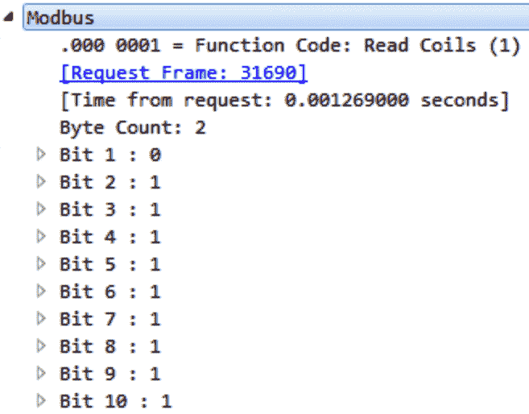
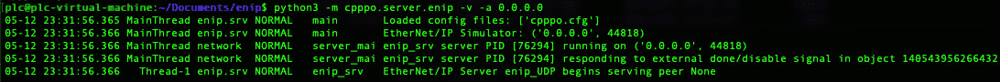
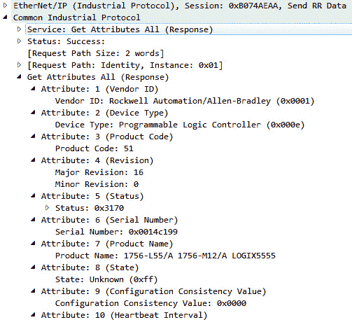
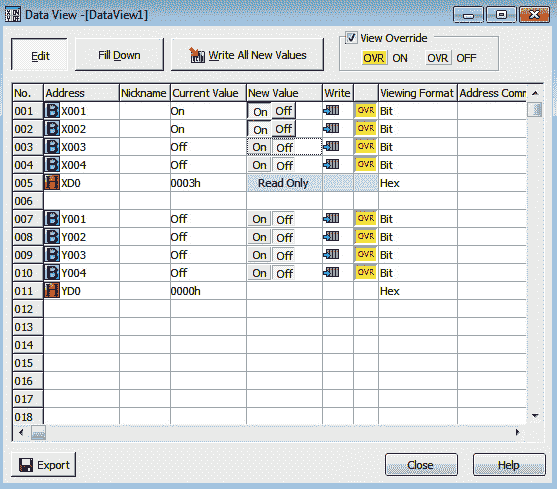

# 第八章：协议 202

我们已经走过了本书的一半，涵盖了大量内容。我们安装了一个 ESXi 服务器和多个虚拟机，并设置了我们的 PLC 与虚拟机进行通信。我们还安装了一个灯塔，并将 I/O 接入到 PLC。我们安装了 Ignition SCADA，并将其连接到实验室中的 PLC，使用各种工具扫描我们的安装，检测开发人员可能在基于 Web 的 SCADA 系统上留下的开放端口和路径。

在本章中，我们将探讨一些**工业控制系统**（**ICS**）中使用的主要协议。我们将利用在*第一章* *使用虚拟化*中创建的虚拟机（VM）来生成特定协议的流量，接着我们将使用 Wireshark 和 TShark 来进一步分析协议，就像我们在*第六章* *数据包深度分析*中所做的那样。当你阅读本书时，你应该会感觉到每一章都在前一章的基础上构建，帮助强化你所学的技能，然后我们会添加一个新技能或知识点，并在后面进行扩展。

在本章中，我们将涵盖以下主要内容：

+   行业协议

+   Modbus 速成课程

+   使用 Ethernet/IP 打开灯光

# 技术要求

对于本章，你将需要以下内容：

+   一个正在运行并安装了`pymodbus`包的 PLC 虚拟机

+   一个正在运行并安装了`cpppo`包的 PLC 虚拟机

+   一个正在运行并安装了`mbtget`工具的 SCADA 虚拟机

+   一个正在运行并安装了`cpppo`包的 SCADA 虚拟机

你可以在此查看本章代码的实际操作：[`bit.ly/3BCyMWV`](https://bit.ly/3BCyMWV)

# 行业协议

经过深思熟虑和外部建议后，我新增了这一初步部分，讨论行业协议。我特别关注 Modbus 和 Ethernet/IP，因为我们的 Koyo CLICK PLC 能够利用这两种协议。然而，我觉得如果不至少触及工业协议领域的广度和深度，那几乎是一种不公。每个行业和我接触过的地区，似乎都会倾向于选择一个特定的供应商。在一些大陆，我看到的设备、供应商和协议是该地区特有的。话虽如此，我将快速概述一些你可能会遇到的主要行业协议：

+   `Modbus`：这是最古老且被广泛采用的协议之一，大多数控制应用程序首先在`Modbus`中设计，然后移植到其他协议，并并行测试以确保过程控制策略按预期功能运行。Modicon 发布了 Modbus 标准，施耐德电气通过一系列并购收购了 Modicon。这意味着，当你在网络上发现一台施耐德电气设备时，它很有可能使用 Modbus 进行通信。

    常用端口是`502`、`5020`和`7701`。

+   `Ethernet/IP`：这是一种在全球范围内广泛应用的协议，通常出现在 Rockwell 设备中，但也被众多控制自动化供应商采用。它最初由`Control International`（**CI**）工作组设计，旨在提供控制消息对象，同时利用 TCP/IP 协议栈的强大功能。`Ethernet/IP`是`Common Industrial Protocol`（**CIP**）的传输系统，我们将在本章稍后部分详细讨论该协议。

    常用端口是`44818`和`2222`。

+   `DNP3`：这是一个由 SCADA 系统使用的协议，用于连接电力和水务行业中使用的过程设备。它是一个开放标准，已获得国际认可；然而，你会发现它最常用于北美市场。

    常用端口是`20000`。

+   `S7 /S7+`：Step 7 是由西门子设计的一种封闭协议（但基于 ISO 8073 Class 0），旨在唯一地连接西门子设备。主要应用于欧洲，西门子产品几乎遍布每个国家和每个过程行业。它曾是控制自动化行业的领导者，并在全球范围内占据主导地位，北美和日本除外。它最著名的是作为在 Stuxnet 攻击中使用的设备和协议，该攻击涉及伊朗的核项目。`S7+`的推出是为了提供更多的安全性和丰富的功能，以应对重放攻击的安全风险。

    常用端口是`102`和`1099`。

+   `Melsec`：这是三菱电机开发的一种协议，由于在日本各行各业广泛应用，因此进入了此列表。

    常用端口是`1025`、`1026`和`1027`。

重要协议如下：

+   布里斯托尔的**布里斯托尔标准异步协议**（**BSAP**），广泛用于石油和天然气行业。

+   通用电气**服务请求传输协议**（**SRTP**），几乎所有通用电气设备都在使用该协议。

+   **建筑自动化和控制网络**（**BACnet**），广泛用于建筑管理行业控制供暖、通风和空调。值得注意的是，2013 年 Target 的网络泄露就是通过一家 HVAC 公司发生的，该公司具有远程访问权限来监控环境传感器。

+   **控制区域网络**（**CANBus**），由博世在 80 年代开发，现在已成为运输、汽车、船只、飞机、农用设备等领域的事实标准。这是一个非常有趣的协议，因为它是自动驾驶汽车的骨干。

随着**物联网**（**IOT**）和**工业物联网**（**IIOT**）在工业界的引入，您将遇到如**消息队列遥测传输协议**（**MQTT**）、ZigBee、**高级消息队列协议**（**AMQP**）等协议。在下一节中，我们将深入探讨 Modbus 协议。

# Modbus 速成课程

Modbus 是一个串行协议，发布于 1970 年代，作为连接工业过程中的设备的共同总线的手段。自 Modbus 发布以来，协议和变体经历了许多演变。这主要归功于该协议标准的开放性和灵活性。由于此协议是连接工业设备最广泛使用的协议，您可以想象，已经有许多书籍和论文讨论了这一主题。我们将专门关注 Modbus TCP 及其可用的各种命令和功能。我强烈建议您阅读有关 Modbus 历史和演变的资料，因为这将帮助您深入了解工业如何将此协议调整以适应其过程和特定的操作需求。点击此链接，了解 Modbus 的简短历史：[`www.youtube.com/watch?v=OuM28tp5wXc`](https://www.youtube.com/watch?v=OuM28tp5wXc)。

Modbus TCP 将 Modbus RTU 数据包封装在 TCP 数据包内，使得数据可以通过 IP 地址进行交换，这与以前的 RS-232 或 RS-485 串行通信形式相比是一次巨大的变化。它采用客户端-服务器模型，允许客户端与多个服务器通信，并双向传输操作和控制数据。操作和控制输入输出根据数据的实现和内容使用不同的寄存器。以下是 Modbus 标准中定义的寄存器及其位大小的表格：

如果你还记得在*第三章*，*我爱我的位 – 实验室设置*中，当我们配置一个程序并将其下载到 Koyo CLICK 时，我们在梯形逻辑中使用接点和线圈来打开和关闭灯。正如前面的表格所示，这些线圈和离散输入的大小是 1 位。我们使用 GUI 直接切换灯的开关状态，通过覆盖并强制 I/O。工程软件发送一个包含一捆数据的包，在这捆数据中，有功能代码和寄存器或寄存器列表。功能代码定义了 PLC 所期望的操作及其对后续寄存器的处理方式。在我们的灯光场景中，我们发送一个数据包，使用功能代码 5（用于写单个线圈的功能代码）将值为 1 的 1 位计数发送到线圈 1。以下是 Modbus 协议中常用的标准功能代码表：

## 建立一个 Modbus 服务器

最好的学习方法是通过示例。还记得在*第一章*，*使用虚拟化*中，当我们在 PLC 和 SCADA 虚拟机上安装了两个不同的程序，分别是`pymodbus`和`mbtget`吗？我们将设置一个服务器和客户端，然后在它们之间编写一些简单的通信，并使用 Wireshark 监听网络，分析我们发送的流量。

我们将从以下链接的示例开始：[`github.com/riptideio/pymodbus`](https://github.com/riptideio/pymodbus)。

为了方便起见，我将包括以下源代码，供你复制并粘贴到你的 PLC 虚拟机中：

#!/usr/bin/env python

来自 pymodbus.device 的导入 ModbusDeviceIdentification

来自 pymodbus.datastore 的导入 Modbus 顺序数据块

来自 pymodbus.datastore 的导入 ModbusSlaveContext, ModbusServerContext

来自 pymodbus.transaction 的导入(ModbusRtuFramer,

ModbusAsciiFramer,

ModbusBinaryFramer)

导入日志记录

FORMAT = ('%(asctime)-15s %(threadName)-15s'

'%(levelname)-8s %(module)-15s:%(lineno)-8s %(message)s')

logging.basicConfig(format=FORMAT)

log = logging.getLogger()

log.setLevel(logging.DEBUG)

def run_async_server():

store = ModbusSlaveContext(

di=Modbus 顺序数据块(0, [17]*100),

co=Modbus 顺序数据块(0, [17]*100),

hr=Modbus 顺序数据块(0, [17]*100),

ir=Modbus 顺序数据块(0, [17]*100))

context = ModbusServerContext(slaves=store, single=True)

identity = Modbus 设备识别()

identity.VendorName = 'Pymodbus'

identity.ProductCode = 'PM'

identity.VendorUrl = 'http://github.com/riptideio/pymodbus/'

identity.ProductName = 'Pymodbus 服务器'

identity.ModelName = 'Pymodbus 服务器'

identity.MajorMinorRevision = version.short()

启动 TcpServer(context, identity=identity, address=("0.0.0.0", 5020))

if __name__ == "__main__":

run_async_server()

我们将把这段代码放入一个名为`server.py`的文件中。

然后，我们将通过输入以下命令来运行服务器文件：

python3 server.py

如果一切顺利，您应该看到以下屏幕：

图 8.1 – pymodbus 服务器

一旦我们在 PLC 上运行了服务器，我们将导航到 SCADA 虚拟机，并作为客户端运行 `mbtget` 命令以查询虚拟 PLC 上的寄存器。运行命令 `mbtget -r1`（读取位功能 1）、`-a 1`（地址号 1）、`-n 10`（获取接下来的 10 个寄存器）、`192.168.1.10`（虚拟 PLC 的 IP 地址）、`-p 5020`（端口号）。这是该命令的拆解，您可以通过运行 `mbtget -h` 了解更多：

mbtget -r1 -a 1 -n 10 192.168.1.10 -p 5020

如果命令执行正确，并且服务器端正在监听连接，您将收到以下响应：

图 8.2 – 10 个 Modbus 寄存器

接下来，我们希望在网络段上运行 Wireshark，并通过 Wireshark 中的 Modbus 显示过滤器检测 Modbus 通信。首先，我们需要确保 ESXi 虚拟交换机允许混杂模式，从而使我们能够嗅探交换机并在 Wireshark 中查看。

打开您的 ESXi Web 管理控制台，导航到 **网络**，并从左侧菜单中选择 `vSwitch1`：

图 8.3 – vSwitch1 ESXi

一旦选择，您应该验证您的安全策略是否允许混杂模式，如下图所示：

图 8.4 – 混杂模式

如果 **允许混杂模式** 被禁用，则点击 **设置** 按钮，然后在 **安全性** 标签下，选择 **接受** 选项，将其调整为 **是**，如以下截图所示：

图 8.5 – 编辑交换机设置

现在我们已启用 **允许混杂模式**，请打开 Kali Linux 虚拟机或 Windows 虚拟机并运行 Wireshark。启用与 PLC 和 SCADA 位于同一网络段的接口。回顾一下，当我们在*第一章*《使用虚拟化》中配置实验室时，我们将 PLC 设置并连接到 `Level 1: Process`，并将 SCADA 连接到 `Level 2: Local Control`。

一旦启动并运行 Wireshark，并监听连接到 PLC 和 SCADA 通信的网络段的接口，接下来在客户端重新运行命令，以从服务器读取 10 个寄存器。您应该在 Wireshark 中看到以下输出：

图 8.6 – Modbus 捕获

现在，你可能在想为什么我的输出和你的不同。主要原因是我们正在通过端口`5020`运行 Modbus TCP，而 Wireshark 的解码器默认设置为端口`502`。为了解决这个问题，我们需要右键点击数据包并选择**解码为…**，如下图所示：

图 8.7 – 解码为…

然后会弹出一个类似以下截图的窗口：

图 8.8 – Modbus TCP 端口 5020

从这里，选择端口值`5020`，然后选择**当前**解码器为`Modbus/TCP`。你应该看到你的 TCP 数据包现在已被解码为 Modbus。

在这里，如果你点击第一个数据包，并深入查看 Modbus/TCP 和 Modbus 的解码器层，你应该会看到类似以下截图的内容：

图 8.9 – Modbus 请求

如前所述，我们正在发送位计数和功能代码。在这里，我们看到位计数为`10`，符合我们命令的预期，并且**功能代码**为**读取线圈（1）**。现在检查此截图中的数据包：

图 8.10 – Modbus 响应

这是从服务器发送的响应数据包。如你所见，这和我们在 SCADA 客户端中看到的相同内容，那里我们使用了`mbtget`命令。我们有 10 个线圈，从地址 1 开始，全部显示为已切换开启或读取为真值。接下来，我们要查看如何使用`mbtget`手动切换这些线圈。运行`mbtget -w5`（功能代码 5 写单个线圈），`0`表示位值（关闭），`1`表示位值（开启），`192.168.1.10`（IP 地址），`-p 5020`（最后，这是使用的端口）命令：

mbtget -w5 0 -a 1 192.168.1.10 -p 5020

如果一切正常，并且 PLC 与 SCADA 客户端之间有通信，你应该看到以下屏幕：

图 8.11 – 位写入成功

将输出与 Wireshark 捕获进行比较。你应该看到以下 Modbus 层的信息：

+   **功能代码**为`5`，用于**写单个线圈**

+   **参考编号**

+   最后，**数据**为`0`

所有内容如以下截图所示：

图 8.12 – 写单个线圈

现在使用`mbtget`再次查询服务器寄存器，运行以下命令：

mbtget -r1 -a 1 -n 10 192.168.1.10 -p 5020

你应该看到地址 1 的线圈现在已关闭：

图 8.13 – 地址 1 为关闭状态

将此与您的 Wireshark 捕获的 Modbus 响应数据包进行比较，如以下截图所示：

图 8.14 – Modbus 响应地址 1 为 0

最后，使用我们在虚拟 PLC 上运行的相同步骤和功能，现在在你的 Koyo CLICK 或你在实验室中设置的运行 Modbus 的 PLC 上运行命令，打开顶部的红灯：

mbtget -w5 1 -a 0 192.168.1.20

你应该会看到红灯亮起。接下来，我们需要运行`mbtget`命令来读取线圈。运行以下命令查看 PLC 的响应以及启用/禁用的线圈：

mbtget -r1 -a 0 -n 4 192.168.1.20

你应该在运行两个命令后获得以下输出：

](image/B16321_08_015.jpg)

图 8.15 – mbtget 读取 Koyo CLICK

你现在可能已经注意到，与 PLC、RTU、流量计算机、气相色谱仪（GC）、控制器或任何其他使用 Modbus 作为主要控制或操作协议的技术进行 I/O 交互是相当容易的。这在渗透测试中起着非常重要的作用。如果你收集到足够的信息，你将能够拼凑出控制数据如何操控现实世界中的过程。

警告

在与客户互动时，确保有明确的**互动规则**（**ROE**），并且在设施中工作时，始终采取谨慎的态度。如果你有访问权限并能够对线圈或寄存器进行写入操作，除非在 ROE 中已经获得批准并签字，否则请不要，我重复一遍，千万不要随便向线圈、输入或寄存器发送随机数据。你可能会无意中关闭生产线或工艺列车，这可能会对客户造成巨大的收入损失。

我将在这里结束 Modbus 部分，让你继续深入研究该协议及其功能。我建议你熟悉`mbtget`并尝试使用它，因为它是一个用 Perl 编写的强大工具。我们快速启动了`pymodbus`作为服务器；然而，也有更多示例可以将`pymodbus`作为客户端模式运行。从这里开始，我们将研究 Ethernet/IP 协议。它是一种广泛使用的协议，不是因为它是一个被广泛接受的标准，而是因为他们的销售团队做得非常出色，成功将技术推广到许多不同的行业。

# 使用 Ethernet/IP 打开灯

该协议在北美市场得到广泛应用。我认为这与它成为了罗克韦尔自动化产品中基础协议并被嵌入其中有关。它大约在 90 年代末期，几乎是在 Modbus 发布近二十年后，开始在控制工程领域得到应用。**通用工业协议**（**CIP**）消息是驱动 Ethernet/IP 的核心元素。正是由于 CIP 面向对象和开放的特性，才使得它能够迅速在市场上得到采用。我看到的一个有趣的统计数据是，Ethernet/IP 被估计在全球工业市场的使用率为 30%。这一比例相当可观，也正是为什么这本书值得讨论和回顾它的原因。若要深入阅读有关 Ethernet/IP 协议的更多详细信息，请使用链接 [`www.odva.org/wp-content/uploads/2020/05/PUB00035R0_Infrastructure_Guide.pdf`](https://www.odva.org/wp-content/uploads/2020/05/PUB00035R0_Infrastructure_Guide.pdf) 并阅读 **开放设备网络供应商协会**（**ODVA**）提供的材料。我将简要介绍一些在进行客户网络渗透测试时可能有用的高级细节。

Ethernet/IP 在网络上的设备之间发送 CIP 消息，以操作过程设备。这些 CIP 消息是多个对象的集合，这些对象有三个特定类别：

+   通用对象

+   应用特定对象

+   网络特定对象

通用对象是工业中最常见的项目。大多数设备利用这个对象在控制器和服务器之间传递有用的信息。应用特定对象和网络特定对象，如其名称所示，只会出现在使用这些对象的应用程序或网络中。在接下来的部分，我们将专注于通用对象。

以下是通用对象的表格：

如果我们仔细查看通用身份对象（**0x01**），会发现它包含两组属性：

+   必需属性

+   可选属性

以下表格列出了必需的属性：

以下表格列出了可选属性：

这些列出的属性通过 Ethernet/IP 协议传递到**身份 CIP**对象。我们之所以专注于这个特定对象，有几个原因：

+   所有 IDS 供应商通常都会从此协议和特定数据包开始，构建他们的资产检测引擎。

+   了解这个对象的构造方式将使我们能够将其复现为**蜜罐**。

+   我们将使用在 *第一章* 中安装的 CPPPO 包，*使用虚拟化*，来演示 Ethernet/IP 如何工作，我们将从 **身份** 对象开始。

## 建立 EthernetIP 服务器

确保在您的 PLC 上安装了`cpppo`包，方法是运行以下命令：

pip3 install cpppo

在确认您已安装`cpppo`包后，我们将在**文档**文件夹下创建一个名为`enip`的目录：

图 8.16 – enip 文件夹

在这个`enip`文件夹中，我们想要创建一个名为`cpppo.cfg`的新文件，并将以下配置放入文件中。请注意，标识对象属性如下列出，并包含定义。您可以根据自己的规格进行配置；但是，我们将使用此默认配置运行初始演示：

[标识]

# 通常，字符串不用引号括起来

厂商 ID                   = 1

设备类型                 = 14

产品代码编号         = 51

产品修订版本            = 16

状态字                 = 12656

序列号               = 1360281

产品名称                = 1756-L55/A 1756-M12/A LOGIX5555

状态                       = 255

[TCPIP]

# 然而，一些复杂的结构需要 JSON 配置：

接口配置     = {

"ip_address":             "192.168.1.30",

"network_mask":           "255.255.255.0",

"dns_primary":            "8.8.8.8",

"dns_secondary":          "8.8.4.4",

"domain_name":            "industrial.pentest.lab"

}

主机名                   = 控制器

配置并保存文件后，运行以下命令：

python3 -m cpppo.server.enip -v -a 0.0.0.0

如果一切正常且没有任何错误，您应该看到以下输出：

图 8.17 – cpppo 服务器运行中

现在我们在 PLC 上运行了一个以太网/IP 服务器。在 SCADA VM 上打开一个会话，并运行以下命令：

python3 -m cpppo.server.enip.poll -v TCPIP Identity -a 192.168.1.10

再次，如果一切都安装并正确通信，您应该得到以下输出：

图 8.18 – cpppo 响应

现在打开 Kali 或 Windows VM 并运行 Wireshark。我们想监听通信，就像在 Modbus 部分所做的那样。一旦打开 Wireshark，请确保 SCADA VM 仍在轮询 PLC VM，您应该看到以下输出：

图 8.19 – 标识对象

展开数据包**成功：标识 – 获取所有属性**，如下截图所示：

图 8.20 – 成功：标识 – 获取所有属性

你将看到在 CIP 层下有**服务：获取所有属性（响应）**。展开此项，你将看到在 PLC 虚拟机的`Documents/enip/`文件夹下我们在`cpppo.cfg`文件中配置的详细信息。请查看以下截图并将其与配置文件进行对比。尝试更改一些参数并重启 Ethernet/IP 服务器：

图 8.21 – 身份详细信息

如你所见，在此对象中，所有用于识别控制器的有用信息都在这里。这就是为什么 IDS 供应商通常会首先处理这个协议，因为它是一个简单的办法来识别网络中的资产。对我们来说，使用`Wireshark`或`tcpdump`（如在*第五章*《*你能捕捉我吗*》中讨论的）可以帮助我们识别潜在目标，并检测这些设备是否包含已知漏洞，从而使我们能够深入探查环境。接下来，我们将打开实验室中 Koyo CLICK 的 Ethernet/IP 适配器，然后使用`cpppo`工具来审问我们的 PLC。

执行以下快速步骤：

1.  打开 CLICK 编程软件。

1.  点击**连接到 PLC**按钮。

1.  选择 IP 地址为`192.168.1.20`的 PLC 并点击**连接**。

1.  从 PLC 选项中选择**读取项目**并点击**确定**按钮。

这些步骤是前面章节的简要回顾，目的是让我们准备好进行 Ethernet/IP 设置的起始工作。

现在我们应该查看控制四个灯的梯形图程序。从这里，我们希望点击**设置**菜单选项，如下截图所示：

图 8.22 – Koyo CLICK 设置

选择**EtherNet/IP 设置…**菜单选项，这将弹出以下窗口：

图 8.23 – EtherNet/IP 适配器设置

在窗口中选择**启用 EtherNet/IP 适配器**复选框。这将启用窗口中选项的选择和编辑。你会注意到在右上角，你可以更改连接数、端口号和超时时间。保持默认选项不变，我们将重点关注以下截图中显示的**输入（到扫描仪）**数据块：

图 8.24 – 输入数据块

输入数据块是 Ethernet/IP 主站可以读取的数据块。我们希望选择**开始**列下的块 1，你会看到它允许你点击一个按钮来打开**地址选择器**窗口。选择左侧的`XD`按钮来筛选我们不会使用的地址。你应该看到以下屏幕：

图 8.25 – XD 地址选择

选择`XD0`作为块 1 的起始地址，并对块 1 的结束地址进行相同设置，选择`XD8`。你的地址设置应如下所示：

图 8.26 – 输入 XD 块 1 地址设置

接下来，我们需要为**Out (来自扫描仪)**块的寻址设置相同的内容，但我们将使用`YD`地址，而不是使用`XD`地址来设置`Start`和`End`。设置完成后，你的地址应该如下所示：

图 8.27 – 输出 YD 块 1 地址设置

一旦设置完成，你需要将你的项目写入 Koyo CLICK PLC。当你的项目被写入 PLC 后，返回到我们之前运行`cpppo`包命令的 SCADA 虚拟机的终端窗口。现在我们要运行以下命令：

python3 -m cpppo.server.enip.list_services -vv -a 192.168.1.20 –list-identity

如果一切连接正常，你应该会得到类似下面这段长输出的信息：

图 8.28 – Koyo CLICK Ethernet/IP 身份

如你所见，通过运行那个简单的命令，我们能够发现 Koyo CLICK PLC 的身份。接下来，我们将打开 Wireshark 并再次分析通信，重新运行命令时，你应该会得到以下输出：

图 8.29 – Koyo CLICK ENIP Wireshark 捕获

你可能记得，通信是从 ESXi 服务器通过物理 PLC 接口路由出去的，所以你需要使用我们在*第五章*中设置的 SPAN 端口，*Span Me If You Can*，来捕获上述通信。这一切都很有趣，但你可能会问，*主菜在哪儿？* 听听流量，查询 PLC 的身份倒是有意思，但实际的操作呢？比如改变值、开关灯、开关阀门，所有这些有趣的操作呢？

好了，系好安全带。我们将返回到 PLC 虚拟机，并通过命令行进行更改来测试我们的`Get**/**Set`属性请求。在启动虚拟的 Ethernet/IP PLC 之前，我们需要简要讨论一下如何与 PLC 进行交互并发送消息。我们将使用无连接显式消息传递。之所以这么做，是因为我们不需要事先建立连接，也不需要为维护通信而预留资源。无连接显式消息传递允许我们发送临时通信，让 PLC 接收并处理命令。显式消息传递使用一种名为`Lpacket`的格式，而在`Lpacket`中，包含了服务字段，以下是这些服务字段：

+   **类别**：到目前为止，我们只讨论了类别`0x01`，即身份类别，但我提到过有些应用特定的对象 ID，最终它们是类别 ID。虽然有一系列公开定义的类别 ID，但由于协议的开放性，用户可以利用位于 100 到 199 之间的自定义范围。

+   **实例**：如果你有相同类别的多个实例，这有助于区分不同的消息。

+   **属性**：类似于实例 ID，属性 ID 使您能够区分给定实例的多个属性。

使用对象模型可以传递大量信息，我强烈建议你通过阅读已发布的标准，自己做一些关于该协议的研究。对于我们的需求，我们只需要理解这个语法：

类/实例/属性

这定义了系统中的标签。现在回到实际操作示例。在你的 PLC 虚拟机终端中运行以下命令：

python3 -m cpppo.server.enip -v -a 0.0.0.0 'Compressor_StationA@8/1/1'

使用此命令，我们告诉系统构建一个名为`Compressor_StationA`的标签，其中包含类别 ID `0x08`，这是一个公开定义的类别 ID，用于离散输入点，然后我们给它分配一个实例 ID 为 1，属性 ID 为 1。如果一切正常，您应该会看到类似以下的输出：

图 8.30 – Compressor_StationA 标签

现在回到你的 SCADA 虚拟机，并输入以下命令：

python3 -m cpppo.server.enip.get_attribute '@8/1/1' -S -a 192.168.1.10

运行此命令会请求位于`8/1/1`的属性，使用`-S`（简单模式）从`-a`（地址）`192.168.1.10`。执行此命令后，您应该会收到如下响应：

图 8.31 – 单一属性值

这个响应告诉我们该属性中有一个`0`的值。这是一个简单读取属性的例子。现在我们想向这个*标签*写入数据。运行此命令将属性值设置为`1`：

python3 -m cpppo.server.enip.get_attribute '@8/1/1=(INT)1' '@8/1/1' -S -a 192.168.1.10

如果你比较这两个命令，我们所做的只是添加了一个新参数，告诉系统将对象`@8/1/1=(INT)1`设置为整数 1。现在你应该会看到两个输出，如下所示：

图 8.32 – 设置属性

你可以看到命令响应`S_A_S`和`G_A_S`，分别代表**设置**属性和**获取**属性。第一个命令表示将属性设置为`True`，而**获取**命令则返回值为`1`。最后，记住我们给对象命名的标签是`Compressor_StationA`，我们可以使用该标签名来获取和设置值，因为它已经在系统中被别名化。以下命令作为示例：

python3 -m cpppo.server.enip.client –print Compressor_StationA Compressor_StationA=1 Compressor_StationA -a 192.168.1.10

你应该会得到以下输出：

图 8.33 – 标签别名 获取/设置属性

使用此命令，我们请求**获取**属性，然后使用**设置**命令将值设置为`1`，最后再次使用**获取**命令检查值是否已经在虚拟 PLC 中更新。你可以看到，只需轻松地切换开关值，就能在远程控制器中操作。你所需要知道的只是特定对象的映射类/实例/属性。

现在我们可以在实验室中针对 Koyo CLICK PLC 测试相同的命令方法。打开 CLICK 编程软件，导航到**设置**菜单，选择**EtherNet/IP 设置...**，你将看到我们之前在配置步骤中看到的配置屏幕。我们要特别关注两个部分，第一个是在**输入（到扫描仪）**标签页下，如下所示：

图 8.34 – 输入 类/实例/属性

请注意标有(**Explicit**)标签的**类`/`实例`/`属性**项目。

+   **类**：`4`

+   **实例**：`101`

+   **属性**：`3`

现在转到**输出（来自扫描仪）**标签页，你应该能看到以下屏幕：

图 8.35 – 输出 类/实例/属性

**类`/`实例`/`属性**几乎是相同的，如果你记得实例 ID 的作用描述，那么你就知道它为何相差 1：

+   **类**：`4`

+   **实例**：`102`

+   **属性**：`3`

我们现在有足够的信息来与在 PLC 上运行的程序进行交互。作为监控命令与 PLC 交互的一种方式，我们想在 Koyo CLICK 编程软件中的**数据视图**屏幕上添加一些配置。请参见以下截图，我们将快速通过需要采取的步骤来为监控设置该配置：

图 8.36 – 数据视图

作为回顾，你选择**监控**菜单项并选择**数据视图**选项。

在这里，你可以看到我们向**数据视图**添加了一些更多的寄存器，并启用了**覆盖**功能。

这里是快速步骤：

1.  选择**地址单元格**。

1.  点击**地址选择器**。

1.  选择你要查看的地址并点击**确定**。

1.  继续这个过程，直到你的**数据视图**看起来和我的一样。

一旦你的寄存器在**数据视图**中显示，并且与之前的截图相匹配，进入你的 SCADA 虚拟机终端并输入以下命令：

python3 -m cpppo.server.enip.get_attribute '@4/101/3' '@4/102/3' -S -a 192.168.1.20

这个命令，如我们之前所看到的，使用简单模式来获取这些对象中的属性。如果所有输入和输出都关闭，你应该得到以下响应：

图 8.37 – 从 Koyo CLICK 获取属性

注意

我需要指出的是，在文档中，正如我们在设置 Ethernet/IP 时所讲的，在 Koyo CLICK PLC 上，`XD`寄存器是只读的，而`YD`寄存器是读/写的，这与控制哲学有关，超出了本书的范围。你真正需要知道的是，如果你想直接与灯互动，你可以通过 Ethernet/IP 绕过 PLC 的输入/输出，并直接使用`YD`寄存器来激活线圈。

接下来，任务是手动从**数据视图**屏幕上强制开启`X001`和`X002`。你会注意到一些二进制运算，这应该能让你回忆起早期的计算机科学日子。`0001 + 0010 == 0011 == 0x03`，如下图所示：

图 8.38 – 强制开启 X001 和 X002

结果是`XD0`的十六进制值为`0003h`，如所示：

图 8.39 – XD0 等于 3

现在再次检查，确保你的**数据视图**屏幕看起来如下：

图 8.40 – 强制开启数据视图中的 X001 和 X002

我们希望重新运行`Get`属性命令，以确保看到正确的属性。作为快速回顾，以下是命令：

python3 -m cpppo.server.enip.get_attribute '@4/101/3' '@4/102/3' -S -a 192.168.1.20

如果一切配置正确，你应该看到以下输出：

图 8.41 – 输入十六进制值 3

现在我们知道我们确实访问了正确的地址，接下来我们开始开关灯。如果你还记得虚拟 PLC 的操作，我们只是将值类型和实际值添加到`read`命令中。在这种情况下，我们希望复制`@4/102/3`对象，并添加类型（**INT**）和我们想要开启的灯组合的十六进制等效值。直接跳入深水区，运行以下命令：

python3 -m cpppo.server.enip.get_attribute '@4/101/3' '@4/102/3=(INT)15 '@4/102/3' -S -a 192.168.1.20

你应该看到以下结果：

图 8.42 – 所有灯都亮着

请再次检查**数据视图**屏幕，你应该会看到所有输出都已设置为开启，如下图所示：

图 8.43 – Y001-Y004 全部开启

最后，让我们通过使用 Wireshark 嗅探 SPAN 接口来捕获`Set`属性数据包。在 Wireshark 的**信息**栏下，你应该能看到以下与发送的三条命令相关的详细信息：

图 8.44 – Wireshark 检测

你可以看到我们检测到了第一条命令，即**获取**属性`@4/101/3`，然后是**设置**属性`@4/102/3=(INT)15`，最后是第三条命令，我们正在获取**设置**命令的结果。

注意

如果你做了研究并找到了更多应用类 ID，如前面所讨论的，你应该会发现`0x04`类 ID 是公认的组装标准。

如果你展开**Assembly – Set Attribute Single**数据包并查看协议的 CIP 层，你会发现一个数据值`0F00`，这是`15`的十六进制表示，如下所示：

图 8.45 – 数据：0f00 CIP 详情

就是这样。我们通过简单地向 PLC 发送未连接的显式消息，成功实现了控制灯光的开关。乍一看，协议结构似乎比 Modbus 复杂且繁琐，但经过一番研究和反复试验后，我们发现地址的类/实例/属性结构使得发送和接收指令变得相当简单。这一点非常重要。正如我们在引言中所述，全球超过 30%的工业设备都使用此协议来操作流程。无论是在亚马逊配送中心操作输送带，还是在殖民管道公司启动或停止主干压缩机站，你肯定会在你的工业渗透测试职业生涯中遇到这种协议。

# 总结

我理解如果你感到有些迷茫，因为这些信息比较复杂且难以消化。然而，我希望你能明白，理解我们在本章中遇到的协议的功能和可扩展性是多么重要。你应该注意到的最大收获是，我们不需要做任何关于安全的事情，就能轻松地向我们的虚拟控制器和硬件控制器发送 ModbusTCP 和 Ethernet/IP 命令。

从协议层面理解输入输出操作的功能，将为你在提交最终发现报告时提供必要的有效性。在我的职业生涯中，我多次见过这样的报告：仅仅列出了通过*不安全*协议在网络上发现的资产。当被问及使用*不安全*协议的资产对组织可能产生的影响时，回应通常毫无实质内容。通过数据包层面的接触，你能够提供比单纯说*不安全*协议更丰富的评估发现。以下是我们发现的一个快速示例。

我们通过以太网/IP 的身份获取所有属性请求发现，网络中运行着一台 Koyo Click C0-10ARE-D，并且在地址`0x04/102/3`处存在未连接的显式消息传输漏洞。这个地址一旦被操控，我们就能打开和关闭实验室的灯光。

未来，你应该能更好地理解在网络中遇到各种工业协议时，尤其是 ModbusTCP 和以太网/IP 时，应该寻找什么。

在下一章，我们将深入探讨并介绍如何使用 Burp Suite 对基于 Web 的 SCADA 界面进行渗透测试。
