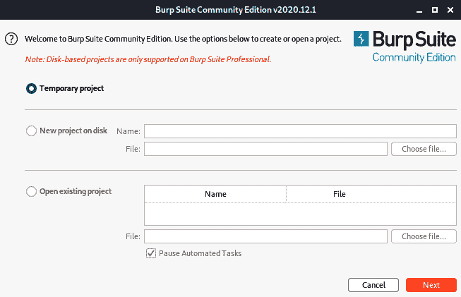
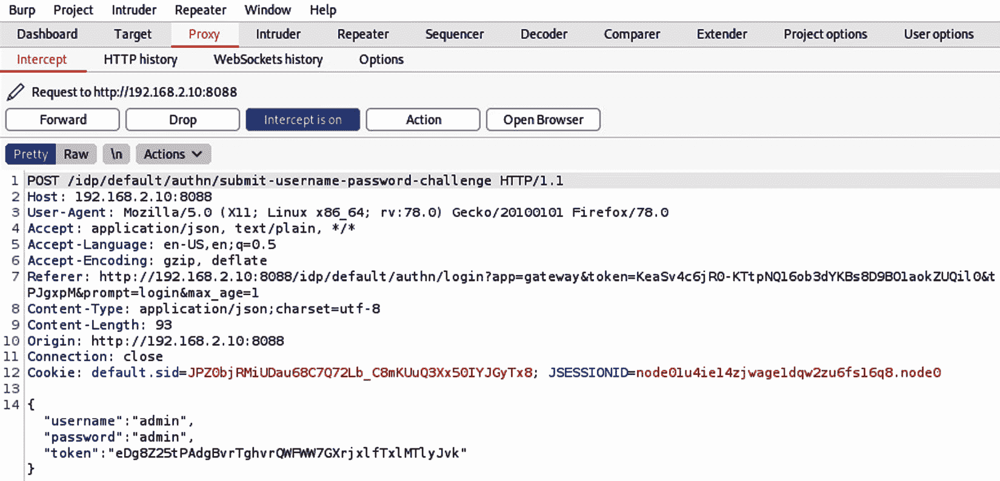

# 第九章：Ninja 308

在上一章中，我们讨论了工业协议的基础知识，特别是两种协议的细节：Modbus 和 Ethernet/IP。我们讨论并使用了可以枚举端口和发现这些设备上运行的服务的工具。我们还使用了工具来遍历目录和虚拟主机，在*第七章*《扫描 101》中也提到过，这意味着我们在攻击链的两端都有很好的基础知识。

现在，我们需要花时间研究攻击，最重要的是暴力破解。尽管发现一个遗留服务并花时间进行逆向工程并构建漏洞利用工具非常令人兴奋，但时间通常并不站在我们这边。如果你发现一个像 Ignition SCADA 这样的系统（我们在*第七章*《扫描 101》中安装了它），通常情况下，操作人员会使用简单的密码或工厂默认密码来访问系统。作为用户访问 SCADA 系统可以让你完全控制工业过程。获得这种访问权限类似于企业 IT 安全领域中的“域管理员”权限。学习如何使用像 BurpSuite 这样的 Web 渗透测试工具非常重要，因为它将帮助你通过泄露真实的凭证来打开各种系统的访问权限。

在本章中，我们将涵盖以下主要主题：

+   安装 FoxyProxy

+   运行 BurpSuite

+   构建一个用于暴力破解 SCADA 的脚本

# 技术要求

对于本章，你将需要以下内容：

+   一台安装了 Firefox 的 Kali Linux 虚拟机。

+   安装了 BurpSuite Community Edition。前往以下链接查找最新版本：[`portswigger.net/burp/communitydownload`](https://portswigger.net/burp/communitydownload)。

+   一份 SCADA 设备默认密码列表，可以通过以下链接找到：[`github.com/scadastrangelove/SCADAPASS/blob/master/scadapass.csv`](https://github.com/scadastrangelove/SCADAPASS/blob/master/scadapass.csv)。

你可以在这里查看本章代码的实际操作：[`bit.ly/3lAinwm`](https://bit.ly/3lAinwm)

# 安装 FoxyProxy

在开始安装 FoxyProxy 之前，我们需要先定义什么是代理服务器以及为什么我们需要使用它。**代理服务器**是一个将来自一个网络或设备的流量转换为另一个设备或网络的系统。然而，这并不容易理解：这对我们意味着什么，为什么我们要关心流量的转换呢？代理服务器允许我们拦截所有来自和指定到我们的攻击主机的通信。这使我们能够增强并更改请求与服务器交互的方式，例如，通过删除 JavaScript UI 过滤和执行其他有趣的任务。那么，既然我们知道了什么是代理服务器，FoxyProxy 又是什么呢？FoxyProxy 是一个简单但强大的代理切换工具。它消除了您必须更改浏览器内部代理设置的繁琐操作。只需添加新的设置并使用开关在代理服务器之间切换，开启或关闭它们。

按照以下步骤安装 FoxyProxy：

1.  首先，您需要访问 Kali Linux 虚拟机并启动 Firefox ESR。一旦打开 Firefox，导航到右侧，您会看到一个汉堡按钮或菜单按钮；点击它。它将弹出以下下拉菜单：

    图 9.1 – 菜单下拉

1.  在菜单打开后，选择**附加组件**选项。您将看到一个显示推荐、扩展、主题和插件的界面。导航到搜索框，输入`foxyproxy`，然后按*回车*键，如下图所示：

    图 9.2 – 附加组件搜索弹窗

1.  这样做后，您将看到一个可能匹配的附加组件列表。您会在列表顶部看到**FoxyProxy 标准版**，如下图所示：

    图 9.3 – FoxyProxy 标准版

1.  点击**FoxyProxy 标准版**链接，将弹出一个窗口，您可以点击**添加到 Firefox**按钮。如下图所示：

    图 9.4 – 安装 FoxyProxy

1.  继续点击**添加到 Firefox**按钮。此时，您将看到一个权限请求提示。这很重要，因为您将允许 FoxyProxy 更改您的浏览器设置。以下是您通过将其添加到浏览器时将授予 FoxyProxy 的权限：

    图 9.5 – FoxyProxy 权限

1.  点击**添加**按钮以成功安装 FoxyProxy。此时，您应该会看到一个狐狸图标出现在 Firefox 的工具栏上，位于右侧。点击该图标将显示以下界面：

    图 9.6 – FoxyProxy 配置

1.  目前我们没有任何代理设置，所以我们将通过点击**+ 添加**链接来添加一些，如下图所示：

    图 9.7 – 添加设置

    点击此按钮后，你将看到一个页面，允许你添加第一个代理设置，如下所示：

    

    图 9.8 – 第一个代理设置

    对于这些设置，我通常设置以下参数：

    - **标题或描述**：`BurpSuite`

    - **代理类型**：`HTTP`

    - **代理 IP**：`127.0.0.1`

    - **端口**：`8080`

1.  点击**保存**按钮。现在，当你点击工具栏中的狐狸图标时，应该能看到新添加的设置，如下图所示：

图 9.9 – BurpSuite 代理

这样，我们就成功安装了 FoxyProxy 并配置了第一个代理设置，这对 BurpSuite 来说非常方便。接下来我们将讨论这个主题。快速配置代理的简便性，以及能够开关代理并在不同代理之间切换，在你的渗透测试职业生涯中将非常有用。

# 运行 BurpSuite

在上一节中，我们安装了 FoxyProxy 并配置了一些设置，以适应我们的 BurpSuite 软件。在本节中，我们将利用 BurpSuite 帮助我们理解 Ignition SCADA 使用的**请求`/`响应**操作，以执行身份验证和授权。现在，为了继续操作，我们需要将 BurpSuite 的证书添加为受信任的源；否则，我们将被迫将每个访问过的网站标记为例外。

为此，我们必须导航到我们在设置中配置的 IP 地址和端口。完成此操作后，你将看到一个**BurpSuite 社区版**的启动页面，右侧有一个**CA 证书**按钮，如下所示：

图 9.10 – CA 证书位置

点击此按钮后，你将看到以下屏幕：

图 9.11 – 保存 CA 证书

选择**保存文件**并点击**确定**按钮。接下来，我们需要导航到菜单中的汉堡图标，并选择**首选项**，如图所示：

图 9.12 – 首选项

然后，我们需要选择左侧的**隐私与安全**，如下图所示：

图 9.13 – 隐私与安全

向下滚动，直到看到**证书**区域，如下图所示：

图 9.14 – 证书

点击 **查看证书** 按钮。系统将弹出以下窗口：

图 9.15 – 导入证书

点击 `Import` 按钮，导航到最近下载的 `ca.cert` 文件，然后点击 `OK`。

您将看到以下屏幕：

图 9.16 – 设置信任选项

选择 **信任此 CA 以识别网站**，然后点击 `OK` 按钮。向下滚动以找到 `PortSwigger` 证书，确保导入顺利完成。您应该会看到以下屏幕：

图 9.17 – PortSwigger 证书

完成证书安装，点击 `OK`。

就这样！我们已经成功安装了证书。现在，是时候打开 BurpSuite 了。找到并打开 Kali Linux 虚拟机上的 BurpSuite。系统将提示您配置一个项目。这是您开始将工作安排到各种项目中的好机会，因为这将帮助您在编写报告时更高效。我将在接下来的操作中使用 **临时项目**，如下所示的截图：

图 9.18 – 临时项目

在下一个屏幕上，您将有机会加载预设配置或使用 BurpSuite 的默认设置。我将选择 **使用 Burp 默认设置**：

图 9.19 – Burp 默认设置

接下来，我们需要确保 Burp 使用正确的代理监听器。因此，选择 `Proxy` 菜单项，然后选择 `Options`。在这里，添加一个新的代理监听器，将接口设置为 IP `Address:Port` 编号，`Certificate` 设置为 `Per-host`，如下面的截图所示：

图 9.20 – 代理监听器

确保您选择了代理，并且 **拦截开启** 已启用，如下所示的截图所示。同时，确保您在 FoxyProxy 中切换了 BurpSuite：

图 9.21 – 拦截开启

现在进入有趣的部分：我们将在此拦截流量并使用 BurpSuite 分析其行为。请导航到 Ignition SCADA 的登录页面：

图 9.22 – Ignition 登录

您可能会注意到功能缺失，这是因为 BurpSuite 已经拦截了您刚刚发起的 `GET` 请求。如果 BurpSuite 没有在该出现的时候自动弹出，您可以直接导航到它并点击 `Proxy` 标签，然后点击 `Intercept` 子标签：

图 9.23 – 登录拦截

如果我们稍微仔细查看细节，会发现仅仅打开登录界面就会启动一大堆流量，如下所示：

GET /idp/default/authn/login?app=gateway&token=Pj0cPAqKDiqz0WvV4xsfjwnSd2e2Tt74 Xz1TcxT7cnQ&token=GH3KbGJqdSGsTTUQNDqKB7WFLR0NOoJgwFni Bohji40&response_type=code&client_id=ignition&redirect_uri=%2Fdata%2Ffederate%2 Fcallback%2Fignition&scope=openid&state=eyJraWQiOiJrMSIsImFsZyI 6IkhTMjU2In0.eyJqdGkiOiJyRUNzVFdPUTE4aDVQM2ViSUd0cnBDc25BTENncmZ nakNpNl9nQWlxYjZrIiwidXJpIjoiL3dlYi9ob21lIn0.ogt_6V-fkMDS2gZCVm0lsxc4dF2XrauixoEFznsZ-2c&nonce=XepL7IYBXqStUEVhMKtl83hxnYL9wI1fdM1wsPJgxpM&prompt=login&max_age=1 HTTP/1.1

Host: 192.168.2.10:8088

User-Agent: Mozilla/5.0 (X11; Linux x86_64; rv:78.0)

Gecko/20100101 Firefox/78.0

Accept: text/html,application/xhtml+xml,application/xml;q=0.9,image/webp,*/*;q=0.8

Accept-Language: en-US,en;q=0.5

Accept-Encoding: gzip, deflate

Referer: http://192.168.2.10:8088/idp/default/authn/login?app=gateway&token=KeaSv4c6jR0-KTtpNQ16ob3dYKBs8D9BO1aokZUQ il0&token=Pj0cPAqKDiqz0WvV4xsfjwnSd2e2Tt74Xz1TcxT7cnQ&response _type=code&client_id=ignition&redirect_uri=%2Fdata%2Ffederate%2 Fcallback%2Fignition&scope=openid&state=eyJraWQiOiJrMSIsImFsZy I6IkhTMjU2In0.eyJqdGkiOiJyRUNzVFdPUTE4aDVQM2ViSUd0cnBDc25BTENncm ZnakNpNl9nQWlxYjZrIiwidXJpIjoiL3dlYi9ob21lIn0.ogt_6V-fkMDS2gZCVm 0lsxc4dF2XrauixoEFznsZ-2c&nonce=XepL7IYBXqStUEVhMKtl83hxnYL9w I1fdM1wsPJgxpM&prompt=login&max_age=1

Connection: close

Cookie: default.sid=fj0zNMpRCctgmCAWcfJlJwrhPIVrZD-Auda96Bmghk4; JSESSIONID=node01u4ie14zjwage1dqw2zu6fs16q8.node0

Upgrade-Insecure-Requests: 1

Cache-Control: max-age=0

现在，尝试使用 `admin**:**admin` 凭证登录。我知道我们将真实的凭证设置为 `scada**:**scada`，但我们将假设在进行渗透测试时刚刚发现了这个系统。此外，你很有可能通过这样做意外猜到正确的凭证。这是因为 **运营技术**（**OT**）领域的一个普遍问题是继续使用工厂凭证。填写这些凭证后，你应该处于登录界面，类似于以下截图所示的状态：

图 9.24 – admin:admin 凭证

现在，我们要导航到 BurpSuite，查看刚刚拦截到的 `POST` 请求，如下所示：

图 9.25 – POST 请求

在这里，我们要利用 BurpSuite 中一个强大的工具，叫做 `Repeater`。它允许我们反复修改并测试请求，因此得名。为此，我们将右键点击并选择 `Send to Repeater` 选项，如下所示：

图 9.26 – 发送到 Repeater

这将把我们拦截到的`POST`请求传递到`Repeater`工具。你应该会看到类似以下的界面：

图 9.27 – Repeater 工具

进入`Repeater`工具后，按下**发送**按钮将请求传递到服务器。注意屏幕右侧的响应。仔细观察，你会看到传递的信息是**无效令牌**：

图 9.28 – 无效令牌

仔细观察我们刚刚使用`Repeater`工具发送的请求，我们可以看到一个看起来像**跨站请求伪造**（**CSRF**）令牌。这使得暴力破解变得更加复杂，因为现在，我们必须弄清楚 Ignition 是如何或者通过什么工具生成这些令牌的：

图 9.29 – CSRF 令牌

知道我们需要找到令牌生成的源头意味着我们需要进行更深的调查。让我们从回到**代理` | **HTTP`历史开始，然后点击`GET`方法，显示我们的**请求**和**响应**的详细信息，如下图所示：

图 9.30 – HTTP 历史

在这个特定的会话中，并没有什么特别引起我们注意的地方。在这些不同的**请求**交换过程中，应该是创建并共享了 CSRF 令牌，在这个过程中，点击`GET`请求上方的`POST`方法，如下图所示，看看是否能发现任何关于令牌创建的线索：

图 9.31 – POST 请求

好的，这看起来很有希望，因为我们可以看到一个令牌从`/idp/default/authn/next-challenge`的响应中传递出来。它看起来像是用户名-密码`POST`请求中需要的令牌，如下图所示：

图 9.32 – 下一个挑战令牌

现在，右键点击**请求**并将其发送到`Repeater`，就像之前那样，尝试生成**下一个挑战**令牌。返回到`Repeater`标签后，按下**发送**按钮以测试`POST`请求。你应该会看到类似以下的输出：

图 9.33 – 重新发送令牌

再一次，我们收到了**无效的令牌**消息，这意味着我们的**请求**令牌已经过期。我们需要进一步追溯，查看我们的**下一个挑战**令牌是如何生成的。返回到**代理** | **HTTP 历史**，查看**下一个挑战**POST 请求之前的请求。在下图中，我们可以看到在之前的**下一个挑战**之前有一系列`GET`请求：

图 9.34 – oidc GET 请求

这里有一个非常有趣的`GET`请求，它恰好在路径中包含`oidc`。`OpenID Connect`（**OIDC**）用于验证尝试安全、轻松地进行身份验证的用户。如果想了解更多关于`oidc`的信息，可以查看[`www.onelogin.com/blog/openid-connect-explained-in-plain-english`](https://www.onelogin.com/blog/openid-connect-explained-in-plain-english)。就我们的用途而言，我们只需要知道这是创建我们令牌的起点。现在，点击这个`GET`方法，我们将看到以下**请求**和**响应**输出：

图 9.35 – OIDC 302 错误

如你所见，我们得到一个响应代码`302`，并且在`Location:`字段中，我们可以看到我们的`next-challenge`令牌。现在，再次点击发送我们的**请求**到`Repeater`工具，并点击**发送**按钮。你将收到以下输出：

图 9.36 – OIDC 下一挑战令牌

这非常有希望，因为我们现在可以看到已经创建了一个新令牌，并且没有错误信息。`Repeater`工具的优点是我们可以编辑数据并重新发送，查看输入数据如何影响响应。继续点击**发送**几次；你会注意到唯一变化的就是那个特定的令牌。现在，如果你一直跟着操作，你的`Repeater`标签中应该有三个标签：

图 9.37 – 三个重复器会话

`Repeater`工具会跟踪我们在之前步骤中发送的请求，这使得它成为一个非常有用的工具，帮助我们测试关于 CRSF 令牌生成的理论。话虽如此，再点击一次**发送**按钮以生成一个新的`oidc`令牌。复制专用的令牌，如下截图所示：

图 9.38 – OIDC 令牌生成

现在，我们想要点击标有数字`2`的标签。你将看到我们之前生成`next-challenge`令牌失败的尝试。用我们新生成的`oidc`令牌替换**请求**中的令牌，如下截图所示：

图 9.39 – 用新 oidc 令牌替换失败的令牌

重新发送请求。如果你按照步骤正确操作，你应该会得到一个`200`响应，内容类似如下：

图 9.40 – 200 响应

太好了！现在，我们正朝着正确的方向前进。从这里开始，我们需要复制我们新生成的`next-challenge`令牌，并点击标记为`1`的**重复器**标签。你会看到我们最初失败的**用户名密码挑战**尝试，响应消息为**无效令牌**。用我们生成的`next-challenge`令牌替换 CSRF 令牌。我们的**请求**应该如下所示：

图 9.41 – 用户名密码挑战 新令牌

现在，重新发送这个**请求**；你应该看到一个`200`响应，表示我们传递了一个有效的 CSRF 令牌，并且返回了 JSON 响应。在输出中，我们可以看到`success`为`false`，这意味着我们使用的凭证是错误的，这是我们预期的结果，同时也看到一个有效的**响应**令牌，如下所示：

图 9.42 – 绕过 CSRF 令牌

现在我们要验证我们的理论是否正确。鉴于我们在**工业控制系统**（**ICS**）实验室中使用`scada**:**scada`凭证安装了 Ignition，我们重新执行步骤以验证一切是否如预期工作。你应该看到以下输出：

图 9.43 – 成功认证

就这样，我们找到了生成唯一 CSRF 令牌并暴力破解 Ignition 认证的方法。现在，除了击败 CRSF 的兴奋感，我们意识到手动执行这个过程将需要一生的时间，而在渗透测试过程中我们根本没有这么多时间。因此，使用 BurpSuite，我们有多种方法来自动化这些步骤。如果你使用的是专业版，你可以通过以下菜单**生成 CSRF PoC**：

图 9.44 – 专业版 – 生成 CSRF PoC

如你所见，我正在使用社区版，这意味着我可以使用**会话规则**来运行各种宏，或导入 Burp 扩展，比如**自定义参数处理器**，如下图所示：

图 9.45 – 自定义参数处理器

然而，由于社区版的限制，这种攻击方法将需要很长时间 – 可能没有手动执行攻击那么久，但对于我们的需求来说，时间仍然太长。因此，建议要么升级到专业版，要么编写自己的脚本。我们将在下一部分进行这一操作。

# 为暴力破解 SCADA 编写脚本

我假设通过阅读本书，你对编程/bash 脚本有一定的熟悉程度。如果没有，我强烈建议你复习一下 bash 脚本和/或 Python。以下是我个人推荐的两本书：

+   *使用 bash 进行网络安全操作*，作者 Paul Troncone 和 Carl Albing，博士

+   *黑帽 Python*，作者 Justin Seitz

这些是您了解 Bash 和 Python 可以做什么以及如何执行的好资源。最重要的是，通过阅读这本书并阅读这些章节，您将学会如何使这些脚本/编程语言在您的渗透测试中发挥作用。

我在本节之前加了上述说明，因为我将尽力使这个过程尽可能轻松。作为免责声明，我必须说我最多只是一个开发者，绝不是程序员。我之所以要做出这种区分，是因为决定通过构建测试驱动程序来开展职业生涯的程序员将审查我的代码并会心一笑。然而，我可以说我可以通过我的代码从 A 点到 B 点，坦率地说，最终结果才是我关心的。

说到这里，让我们开始吧？最快的方法是从`Repeater`工具开始，导航到`Request`列，并具体从`/idp/default/oidc/auth?`请求开始，如下截图所示：

图 9.46 – OIDC 请求

现在，我们要右键单击`Request`。您将看到一个上下文菜单，您可以选择**复制为 curl 命令**，如下截图所示：

图 9.47 – 右键单击请求

打开终端，并通过将其粘贴到命令行并运行来测试您复制的`curl`命令。您应该看到以下结果。在这里，我们将专注于生成的令牌。这应该与我们在上一节中使用`Repeater`工具执行的内容相匹配：

图 9.48 – curl OIDC 请求

多次运行命令并分析结果。您应该看到此令牌已被唯一生成。太棒了 - 现在怎么办？您必须使用您喜爱的编辑器创建一个`bash`文件！为了简单起见，我将使用 nano。在您的终端中运行以下命令：

nano exploit.sh

这将打开 nano 编辑器。在这里，我们要粘贴刚刚使用的`curl`命令。接下来，我们要将我们的`curl`命令包装在`eval`语句中，并使用`grep`提取我们的令牌，如下截图所示：

图 9.49 – 我们的 bash OIDC 令牌脚本

仔细看一下具体的命令，您会看到我们将我们的`curl`命令分配给一个名为`oidc_cmd`的变量。然后，我们对该命令运行`eval`并将其传输到`grep`命令中：

oidc_token=$(eval $oidc_cmd | grep -oP '(?<=c\&token=).*(?=\&response)')

我们正在使用 grep 查找位于`c&token=`和`&response`之间的字符串，它来自我们`curl`的响应。需要注意的是，前一个命令中的`c`字符是前一个令牌的最后一个字符，因此在运行此脚本之前，可能需要对其进行调整。务必在`grep`语句中添加此字符，因为`curl`响应生成了两个令牌，我们只关心我们的`oidc`令牌。

现在，继续测试你刚刚创建的脚本，运行以下命令：

bash exploit.sh

你应该看到以下输出：

图 9.50 – 创建的 OIDC 令牌

现在，让我们重复相同的步骤，右键点击 BurpSuite 中`Repeater`工具下的`Request`，然后选择`Copy as curl command`来请求`/idp/default/authn/next-challenge`。我们必须将其粘贴到文本编辑器中并进行封装，正如我们之前所做的那样。然而，这一次，我们需要将`oidc_token`作为参数传递到新封装的`curl`命令中，如以下屏幕截图所示：

图 9.51 – next-challenge 令牌脚本

比较两条命令中的`grep`语句可以看出，它们之间存在轻微的差异，因为`/next-challenge`请求的响应以 JSON 对象的形式返回，因此我们需要相应地解析它。

注意

如果在这里遇到问题，无法让`/next-challenge`提供`200`响应代码，从而找到此令牌，可能需要通过刷新 Ignition 登录屏幕来刷新`default.sid`的会话 ID，捕获 BurpSuite 中的请求，然后更新每个`curl`请求的`default.sid`值。如果你收到`400`响应代码并显示`Invalid Session`消息，那么你就知道需要刷新了。

如果你已经跟着操作，复制了所有内容，并且拥有有效的会话 ID，那么在运行你的利用脚本时，你应该看到以下输出：

图 9.52 – 生成的 next-challenge 令牌

此时，你应该已经拥有`oidc`令牌和`next-challenge`令牌。现在，是时候将新生成的`next-challenge`令牌传递到 auth 请求中了。重复我们之前完成的步骤：

1.  右键点击我们的`/idp/default/authn/submit-username-password-challenge`请求。

1.  选择`Copy as curl command`。

1.  将你刚才复制的`curl`命令粘贴到文本编辑器中。

1.  为评估封装`curl`命令。

1.  将`next-challenge`令牌传递给`auth`请求。

1.  如果超时，请更新`default.sid`。

你的利用脚本中的`auth`部分应该类似于以下内容：

图 9.53 – auth 命令

在这里，你可以看到我们将默认的凭据 `scada**:**scada` 硬编码以测试我们的脚本是否成功。如果一切正常，并且 `default.sid` 仍然有效，当你运行脚本时，输出应如下所示：

图 9.54 – 成功的身份验证

我们可以重构那些我们知道会在不同测试中发生变化的参数。我使用了 `host`、`sid`、`user` 和 `pass` 参数。

我们从过去的渗透测试经验中知道，客户会更改他们的主机地址，因此我们应该创建一个变量来处理这个问题。我们知道需要创建一个初始的 `default.sid`，并且我们需要将其传递给所有三个请求，所以我们将为此行为创建一个变量。我们的用户名和密码也应该分别有变量。以下是初始重构的样子：

图 9.55 – 脚本重构

我们需要测试重构后的结果，以验证我们没有破坏任何内容。所以，运行 exploit 脚本，你应该会得到类似以下的结果：

图 9.56 – 重构后的测试

现在，这一节的标题中有“穷举”的字样。这意味着我们需要结合一种方法来读取用户和密码的列表，并尝试在 Ignition 的登录页面上进行身份验证。我再次进行了重构，移除了传递的一些不必要的头部信息，并且将三个 curl 请求封装成了一个函数，如下所示：

图 9.57 – test_auth 函数

在这里，你可以看到 `next_cmd` 和 `auth_cmd` 的大小大大缩小。从这里开始，我们需要构建一种方法来读取用户列表和密码列表。我们希望添加打开文件、逐行读取并将其传递给我们之前声明的变量的功能。使用以下伪代码，我们可以根据需要调整：

while IFS='' read -r user || [[ -n "${user}" ]]; do

test_auth

if [[ $success == "true" ]]; then

echo $output

fi

done < $1

这里的基本思路是我们将为用户传入一个文件名。然后，`while` 循环将遍历每个用户，设置我们的 `$user` 变量，并启动 `test_auth` 函数，后者将开始令牌的创建和身份验证尝试。运行以下命令：

bash exploit.sh users.txt

这将允许我们将 `users.txt` 传递给 `while` 循环，并让 `internal field separator** (`IFS**) 遍历每个用户。在 `users.txt` 中，我们有三个用户名 – `"plc"`、`"scada"` 和 `"test"`，以简化操作。我还额外增加了读取密码文件和创建一些详细信息的功能。请查看以下代码示例：

图 9.58 – 暴力破解用户名和密码

你现在应该运行的命令如下：

bash exploit.sh users.txt passwords.txt -v

在`passwords.txt`中，为了简便起见，我只添加了四个密码，它们分别是`"admin"`、`"password"`、`"scada"`和`"changeme"`。运行上述命令应该会生成以下输出，其中我们成功进行了身份验证：

图 9.59 – 成功的身份验证

在这里，你已经有了一个完全成熟的暴力破解脚本。我们创建了`oidc`令牌，并用它们自动生成 CSRF 令牌，还用新编写的脚本对用户名和密码进行了测试，验证了 Ignition SCADA 系统的安全性。

免责声明

在响起警报并向本地**计算机应急响应团队**（**CERT**）提交漏洞之前，Inductive Automation 已经为暴力破解攻击实施了服务器端的缓解措施。如果你使用已知的用户名尝试五次错误密码，Ignition 会在你最后一次尝试后 5 分钟内锁定该账户。

所以，除非你有一个精心整理的用户列表和一个高度集中的密码列表，否则你将不得不调整脚本，以适应每五次失败尝试就锁定任何真实账户 5 分钟的事实。更不用说，如果你没有进行充分的工作，暴力破解的这种行为很可能会被 IDS 发现，这一点在*第六章*，*数据包深入分析*中已提到。

现在，讽刺的是，如果你调整脚本故意锁定真实用户，它将迫使某人进行身份验证以重启 Ignition，从而覆盖这些锁定。这最终会对 SCADA 服务器造成**拒绝服务**（**DOS**）攻击。

在这一部分，我们讲解了如何从 BurpSuite 中提取信息并将其转化为有用的暴力破解工具。我们在前几章中涵盖的技能基础上进行了扩展，通过绕过客户端令牌生成拓宽了我们的知识。这是进行渗透测试时非常重要的一项技能，它帮助你理解环境，并尽可能多地提取信息，以打开那些乍一看似乎被锁住的门。

# 总结

我觉得我们在本章中涵盖了很多内容，从安装 FoxyProxy 和使用 BurpSuite 捕获并重放请求，到制定 Ignition SCADA 如何处理身份验证、提取知识并构建可编写脚本的工具来帮助自动化和生成暴力破解的令牌。你肯定会在你的职业生涯中使用这些工具和技巧。

在下一章中，我们将使用到目前为止学到的所有知识，对我们的 ICS 实验室进行伪模拟渗透测试。
