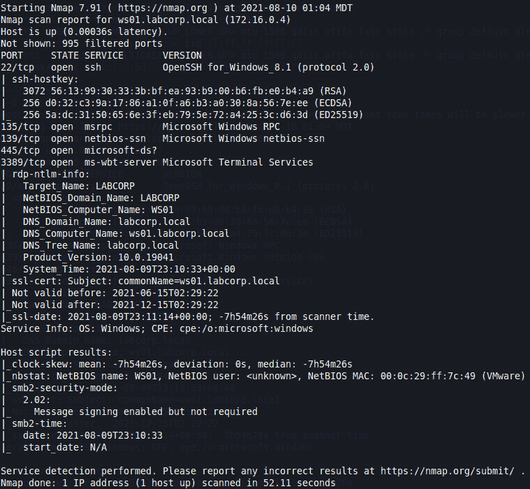
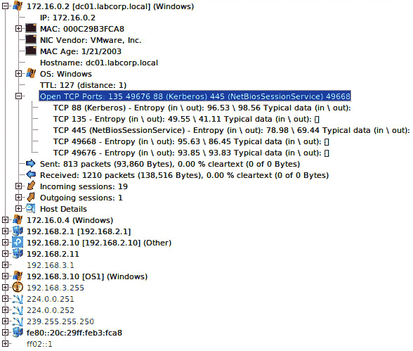
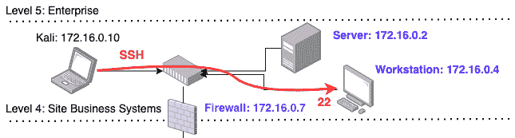
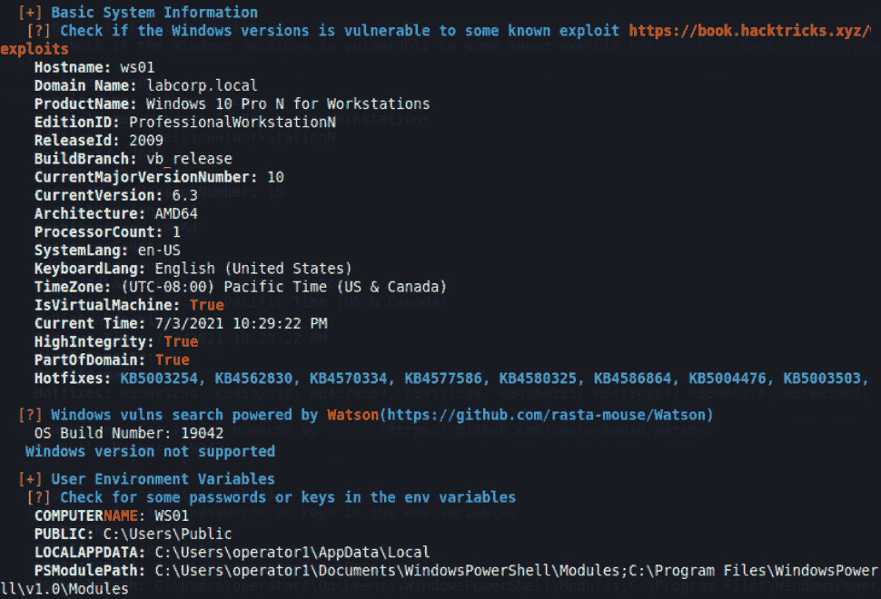
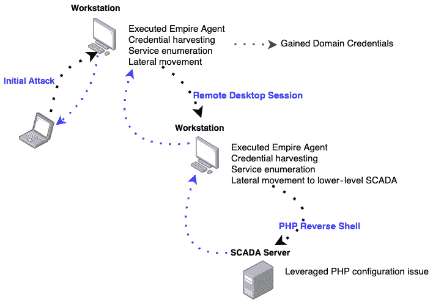
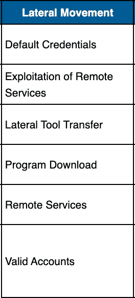
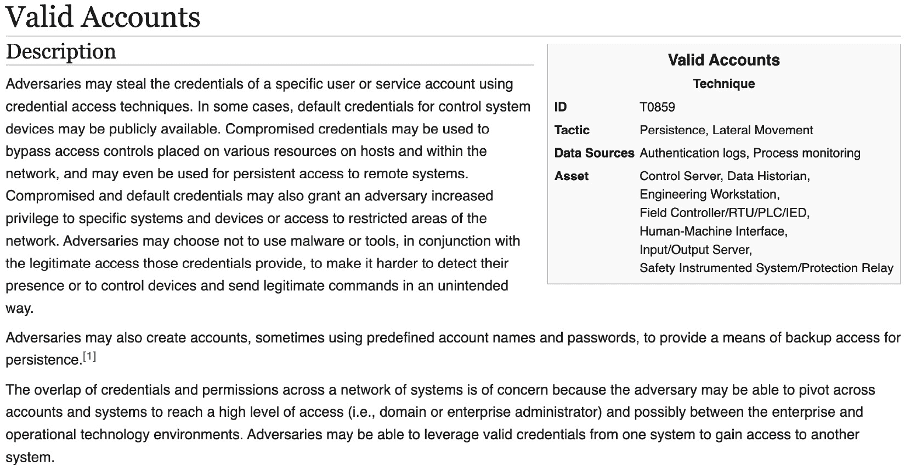
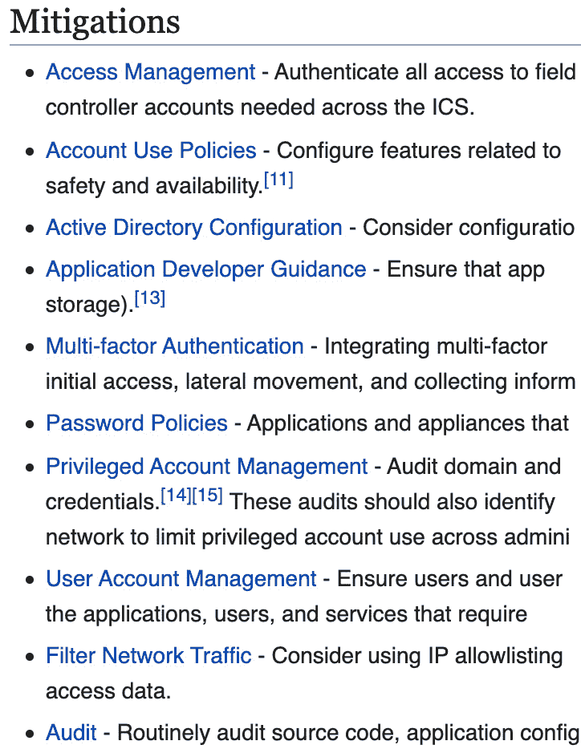
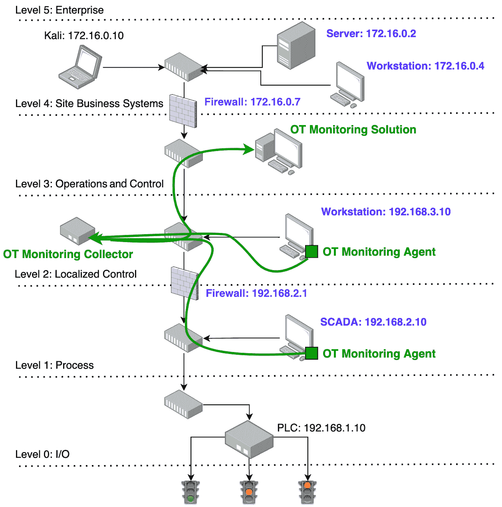
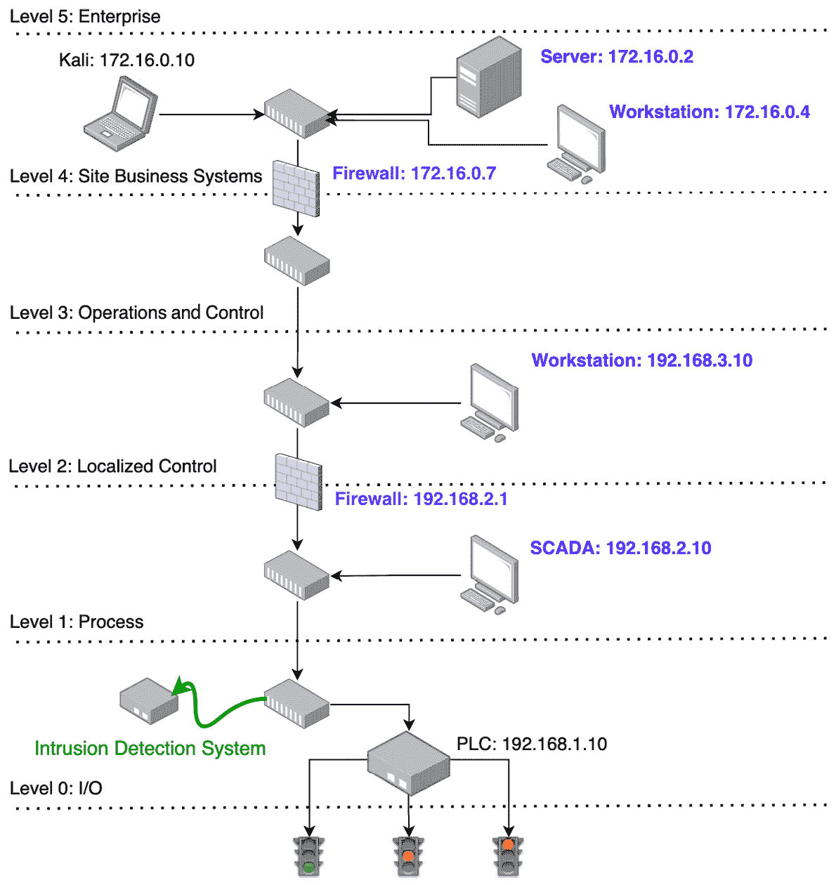

# 第十三章: 被攻破，但怀有悔意

我们终于到达了目的地。请确保座椅靠背和餐桌已完全竖直。确保安全带已经系好，所有随身行李已妥善存放。我们现在处于渗透测试的阶段，必须收集所有捕获的信息，并将数据整理成报告。请知晓，如果没有报告，那么这次参与就等于没有发生。从商业角度来看，这实际上是渗透测试中最关键的部分。在本章中，我们将讨论如何构建报告模板，如何在模板中填写在渗透测试过程中找到的关键信息，最后提供一些修复建议，帮助解决安全漏洞。

在本章中，我们将涵盖以下主要主题：

+   准备渗透测试报告

+   关闭安全漏洞

# 技术要求

本章所需的内容如下：

+   一种文字处理工具，如 Microsoft Word 或 Google Docs

+   一种绘图工具，用于报告中的图形

# 准备渗透测试报告

准备报告时，最终取决于个人偏好，并且如果你在大公司工作，可能还涉及公司品牌。放下主题、图标、标志和品牌，在核心上，存在一个基本结构，它应该作为构建报告的指导方针。现在，根据你的教育背景，谈论报告结构可能显得多余；然而，建立一个清晰简洁的报告是至关重要的，因为如果客户无法跟上报告的流程，可能会是你和该客户的最后一次合作。

故事时间

我曾在**工程采购建设**（**EPC**）公司工作多年。在那段时间里，我对**搜索和替换所有**文字处理器功能非常熟悉。建立一个可重复使用的报告模板集对渗透测试职业生涯至关重要。随着每次任务和交付，你可以修改、调整并优化模板，制作出一份精彩的报告。我个人认为，即使你是最优秀的技术渗透测试人员，但如果你无法写报告，即使你的生命取决于此，那你的职业生涯也将非常艰难。我认为，大型公司花费了多年时间建立他们的报告模板，而我们这些运营小公司的少数人，仍在不断打磨我们的报告交付内容。

我喜欢在每份报告的封面页上放上公司的 logo、报告名称以及客户公司的 logo，这有助于安抚营销团队。根据我在工程公司工作的背景，我接着会添加一个表格，内容包括以下信息：

+   修订

+   日期

+   描述

+   作者

+   批准

报告应类似于以下内容：

图 13.1 – 变更控制

*修订*号是跟踪你正在处理的报告版本的方式，以防有多个团队成员。*日期*应该很明显，因为你想跟踪修订完成的时间。*描述*列给出报告中发生的变更/操作的描述。*作者*是修订的作者，最后是审批者。这将有助于将报告转变为受控的工程文档，并且应该遵循变更管理过程。

然后，你需要构建一个高层次的总结，其中应包括一个评分机制，关联通过测试发现的风险级别。风险评分可以通过以下公式计算：

*(攻击向量) x (发生的概率) x (复杂性等级) – (安全控制) = 网络风险。*

以下标题将详细解释公式，并更深入地解释公式中的每个变量。

## 攻击向量

这可能是开放的服务、可重用的凭证、定向钓鱼攻击，以及在环境中发现的软件漏洞。你应该为这些技术提供数值加权。我还没有确定是否有*最佳*的方法来做到这一点。我感觉每个人都在将数值加权与特定攻击向量关联时遇到困难。

## 发生的概率

计算事件发生的概率是一个简单的统计问题，你可以使用经典的概率法则，通过将简单事件除以所有可能事件结果的总数来计算。如果我们以攻击向量事件为例，任何一个事件发生的概率为 ¼ 或 0.25。

## 复杂性等级

有许多方法可以计算复杂性。我个人简单使用专业水平量表：

+   脚本小白（初学者）

+   黑客（初级）

+   职业渗透测试者（中级）

+   国家级黑客（高级）

如果某个服务是开放的并且面向外部的，例如**文件传输协议**（**FTP**）、**网络文件系统**（**NFS**）或类似的服务，那么可以说这相对较低的复杂性等级会增加风险因素。

## 安全控制

这直接与客户用于保护其工业环境的技术、政策和程序相关。在进行测试时，提出非常直接的问题对于量化和分类控制非常重要。以下是一些示例问题：

+   他们是否在使用防火墙？

+   他们是否在使用传统的防火墙？

+   防火墙规则是否存在问题？

+   他们是否在使用没有人知道存在的疯狂黑站**访问控制列表**（**ACLs**）？（这应该是另一天的故事）。

+   他们是否在使用**网络访问控制**（**NAC**）？

+   他们是否在使用**基于网络的入侵检测系统**（**NIDS**）？

+   他们是否在使用**基于主机的入侵检测系统**（**HIDS**）？

以我们在《复杂度级别》中讨论的最后一个例子为例，即使存在一个开放的服务暴露，如果它们有缓解措施，风险也会大大降低。

在总结之后，我们开始深入探讨。你可能在阅读本书时注意到，书中的节奏和结构有种独特的感觉。这是经过精心设计的；我们首先处理了一些实验室开发的基础知识，接触了硬件，然后我们开始探讨渗透测试中使用的技术和战术。这时我们大致遵循了以下计划：

1.  信息收集

1.  枚举

1.  访问

1.  特权升级

1.  横向移动

1.  影响分析

这并不是一成不变的，因此在前一句中使用了“松散”这个词。每个人都有自己适合自己的策略和节奏，随着时间的推移，你将找到最适合你和你未来客户的方法。我们开始处理上述计划中的第一个项目——信息收集，在*第四章*《开源忍者》中，我们探讨了*Google Fu*、*搜索 LinkedIn*、*使用 Shodan.io 实验*、*调查 ExploitDB* 和 *穿越 NVD*。执行这些任务让我们能够获取大量信息；在这些过程中，我们需要捕获重要、有用和可重复使用的数据并存储起来，以便整理用于信息收集部分。如果这些数据泄露了过多的细节，可能会让攻击者有机会渗透，我们就需要将这些信息传达给客户。我通常寻找的一些关键信息包括电子邮件地址和密码，尤其是那些出现在被泄露报告中的信息。以下链接可以帮助你快速检查自己的电子邮件是否被泄露，也可以检查客户的电子邮件是否被泄露：[`haveibeenpwned.com/`](https://haveibeenpwned.com/)（感谢网站的创始人 Troy Hunt）。还有许多需要付费订阅的服务，允许访问泄露数据以提取敏感信息。

在信息部分之后，我们进入报告的枚举部分。捕捉这些数据的工具可以在*第七章*《扫描 101》中找到，在这一章中，我们使用了`Nmap`、`RustScan`、`Gobuster`和`feroxbuster`。使用这些工具可以帮助发现开放的端口、服务、Web 应用程序和隐藏页面。通过这些工具可以收集大量的数据，我曾看到提交的报告中包含了数页的 Nmap 扫描结果，我认为这些可能只是为了填充报告的页数。我提醒大家，添加多页扫描结果（如下面的图示所示）是错误的做法：

图 13.2 - 单一主机的 NMAP 扫描

战略性地观察找到的机器以及识别的端口，并构建一个非常清晰简洁的数据表格。在*第五章*《如果你能，跨越我》，我们讨论了**入侵检测系统**（**IDS**）技术，这是一个自动构建包含端口和服务的资产列表的绝佳解决方案。像 Forescout、Tenable、Cisco、Nozomi、Claroty 和 SCADAfence 等公司提供 90 天的试用，并测试 IDS 软件。你可以使用这些工具构建出适合展示的图像。我将使用一个名为 `NetworkMiner` 的开源工具，你可以通过以下链接进行安装：[`www.netresec.com/?page=networkminer`](https://www.netresec.com/?page=networkminer)。

这是在对实验室设备进行枚举时能够收集到的一些信息示例：

图 13.3 – NetworkMiner 实验室详细信息

现在我们已经完成了枚举阶段，我们要进入访问阶段。在这一步中，我们要清晰地说明我们是如何建立与客户网络的连接、利用了哪些服务、以及我们如何通过哪些用户账户进行入侵以获得访问权限，并附上图示，因为以下内容作为视觉辅助非常有用：

图 13.4 – 初始网络访问

初始访问可能是通过枚举发现的一个开放服务，如前面的图所示，或者可能是由钓鱼邮件驱动的反向 shell，亦或是通过信息收集过程中获取的数据进行的凭证重用攻击。无论记录的方式如何，都是非常重要的，因为如果访问没有被记录，那就意味着访问从未发生过。

在记录初始攻击后，我们需要记录如何在系统上执行并获取权限提升。我们在*第十一章*《哇…我得深入研究》一章中讨论了**水平**和**垂直**类型的权限提升。我们使用了`Mimikatz`来*传递票证*，并使用`WinPEAS`来自动化发现更多的提升权限的方法和战术。在测试过程中，你应记录运行的过程、运行的机器以及发现的权限。下图是 WinPEAS 扫描的截图：

图 13.5 – WinPEAS 基础扫描

在记录特权提升后，我们接下来要讨论横向移动。我们想提到的是，我们是如何从企业网络迁移到操作网络，最后再转到控制层网络，**可编程逻辑控制器**（**PLCs**）、**远程终端单元**（**RTUs**）、控制器和其他工业设备都驻留在其中。现在，根据你所进行的渗透测试的参与程度和类型，横向移动可能仅仅是从操作网络到控制网络，基于客户将你放入操作网络这一事实。提供如下图所示的图表有助于客户的蓝队真正理解他们需要在哪些地方加强安全控制：

图 13.6 – 横向移动

最后，在记录完所有前述步骤后，我们来到了最后一项——影响分析。影响分析可能是整份报告中最重要的部分，因为它是客户最初聘请渗透测试人员的理由。客户需要了解的是，是否是操作控制的暂时丧失、业务中断、停机、勒索，或是其他可能导致财务损失、灾难性故障甚至是生命丧失的严重问题。

故事时间

当我在加拿大北部工作时，我看到一个工程团队更改了两个控制器的配置。一个控制器负责管理和操作压缩机，另一个控制器则操作泵。直到太晚才发现错误；压缩机的所有密封被炸裂，泵发生了空化。无需多言，由于一个简单的操作——将新配置推送到 PLC，导致了严重的中断和财务损失，这与我们在*第三章*中所做的操作类似，*我爱我的比特 – 实验室设置*。幸运的是没有生命损失，但这是一个警示故事，提醒大家在获得控制层访问权限时必须保持极度小心。如果设计系统的自动化工程师都能犯下简单的错误，造成数千万美元的损失，那么想象一下，渗透测试人员通过扫描、脚本、以及向 PLC、RTU、**人机界面**（**HMIs**）或控制器推送不同配置所能造成的破坏。

影响分析部分应该非常简洁明了，并与横向移动和权限升级相关。在*第十二章*，*我看到了未来*中，我们获得了 SCADA 系统用户界面的访问权限，这是绝对系统控制的一个很好的例子。我们将在影响分析中记录我们在*第十二章*，*我看到了未来*中的发现，因为我们能够重新使用在运营网络中发现的凭证；我们可以验证 SCADA 系统，并最终将每个用户锁定并关闭系统。这里的关键是了解客户所在的行业，这应该在前期接洽、启动会议或信息收集步骤中发现。不同的行业将有不同的影响程度，了解这一点对于记录潜在损失至关重要。

在这一部分，我们讨论了一个通用格式，你可以用来制定全面的渗透报告。我们谈到了结构、内容和影响，以及要遵循的高层战略。再次强调，这并不是撰写报告的唯一方式，每个人都可以根据自己的风格和方式来构建报告。最终，还是取决于客户的行业和个人品牌。在接下来的部分中，我们将讨论一些修复战术，以弥补安全漏洞，最终帮助蓝队建立更好的防御策略。

# 弥补安全漏洞

在渗透测试中，并非总是充满黑暗和沮丧。我们确实有工作的亮点，那就是通过传达安全建议来帮助防范在测试中使用的战术和技术。在这一部分，我们将讨论一些可以实施的安全技术，帮助加强蓝队的安全防御。

## MITRE ATT&CK

在我们直接进入技术方面之前，我想谈谈 MITRE ATT&CK 矩阵，可以通过以下链接找到：[`collaborate.mitre.org/attackics/index.php/Main_Page`](https://collaborate.mitre.org/attackics/index.php/Main_Page)。

这是一个很好的视觉展示，呈现了对抗性**战术、技术与流程**（**TTPs**）。我建议逐项检查并验证你的组织是否容易受到任何已记录的 TTP 攻击。使用我们在*第十章*中讨论的横向移动战术，*我能做到 420*，*第十一章*，*哇...我得深入了解*，以及*第十二章*，*我看到了未来*，我们将重点讨论有效账户技巧，如下图所示：

图 13.7 – 横向移动战术

正如我们在*第十二章*中讨论的，*我看见未来*，密码重用是工业控制系统（ICS）领域的一个主要问题。在有效账户技术下，你将找到该技术的描述、它可能影响的资产、利用有效账户作为技术来入侵组织的真实攻击案例，最重要的是，缓解措施。下图展示了有效账户技术的截图：

图 13.8 – 有效账户技术

如前所述，缓解措施是蓝队可以实施的非常重要的信息，这些实施将提升公司安全成熟度。下图展示了可以采取的缓解措施，以保护你的组织免受使用有效账户技术进行横向移动战术的攻击：

图 13.9 – 有效账户技术缓解措施

有一些自动化系统可以帮助简化这一过程。然而，它们的价格相当高。如果你点击此链接，你将能看到一些这些工具的结果，以及它们如何在检测数量、分析覆盖率、遥测覆盖率和 2017 年 Triton 攻击的可见性方面进行对比：[`attackevals.mitre-engenuity.org/ics/triton/`](https://attackevals.mitre-engenuity.org/ics/triton/)。

在我们讨论完 MITRE ATT&CK 矩阵后，我们将继续探讨可以采用的技术，以帮助提升防御策略。我知道，当人们阅读这一部分时，他们会建议姿态、流程和深度防御更为重要，这样说也没有错。然而，这些话题本质上非常主观，我们在讨论这些话题时容易走进死胡同。我选择技术这一话题，原因很简单，大家都能同意的是，新产品的预算比战略性培训计划更容易获得批准。而且，为了至少缓解 90%的大多数攻击，必须设立一些最低标准。

## 工业防火墙

最古老且最基础的安全技术之一就是防火墙。你可能会惊讶地发现，有些组织仍然没有在其工业环境中使用防火墙。这类组织虽然越来越少，尤其是在经历了诸多国际工业事故之后，但它们仍然存在。我们在*第十一章*中简要讨论了防火墙，*哇...我得深入了解*，并对 pfSense 防火墙进行了高层次的配置。在本节中，我们将讨论在渗透测试过程中可能遇到的工业防火墙。

Cisco ISA3000 是一款你肯定会遇到的工业防火墙，它在石油和天然气行业中非常普及。如果你遇到一个使用思科核心交换机的客户，那么在较低的网络层级中找到 ISA3000 的可能性非常高。ISA3000 有很多亮点，比如它能够与更大的思科生态系统集成，包括**身份服务引擎**（**ISE**）、`Cyber Vision`、`SecureX`、`Threat Response`和其他思科安全产品。ISA3000 支持容器化，这使得组织能够快速启动思科 Cyber Vision，这是一款**工业入侵检测系统**。由于容器化的存在，减少了额外硬件和扩展所需的开销。接下来，借助 ISE 集成，它能够通过 ISE 发布**安全组标签**（**SGTs**），使新发现的设备立即被隔离，这将自动创建网络规则。当在启用了这种集成的环境中进行渗透测试时，这种行为可能会非常令人沮丧。你会注意到，你能够访问某些资产的时间很短，片刻之后，因发布的规则失去与相同资产的通信。有关此内容的更多信息，请访问以下链接：[`www.cisco.com/c/en/us/products/security/industrial-security-appliance-isa/index.html`](https://www.cisco.com/c/en/us/products/security/industrial-security-appliance-isa/index.html)。

Palo Alto PA-220R 在许多独特的行业中获得了惊人的关注，它是我在与工业网络合作时遇到的第二常见防火墙。就像思科一样，Palo Alto 将坚固耐用的防火墙集成到了更大的生态系统中。在我看来，最有趣的功能之一就是 Palo Alto 的 WildFire 服务。WildFire 是一个共享社区服务，任何被检测到和制作的内容都会被检测并在订阅服务中共享。如果系统中检测到恶意文件，它会被标记，并生成一个签名，提交到 WildFire。任何订阅了 WildFire 的客户都可以自动下载这个签名，并将其添加到 PA-220R 中的检测签名列表中。如果启用此服务，它可能会非常烦人，因为它需要一些高级策略，使用`MSFvenom`和`Shikata Ga Nai`，后者是一种多态编码器，用于生成反向 shell 代码。这有助于防止 WildFire 阻止包含 shell 代码的独特文件在整个行业中被拦截。有关 Palo Alto 坚固防火墙的更多信息，请访问以下链接：[`www.paloaltonetworks.com/network-security/next-generation-firewall/pa-220r`](https://www.paloaltonetworks.com/network-security/next-generation-firewall/pa-220r)。

Check Point Quantum Rugged 1570R 是另一款进入`ICS`领域的下一代防火墙，我在一些公用事业公司中确实见过这种设备。它支持 1500 种 ICS 协议，我可以肯定地说其中有不少协议，尤其是我们在*第八章*中讨论的*协议 202*。以下链接将提供更多信息：[`www.checkpoint.com/quantum/next-generation-firewall/industrial-control-systems-appliances/`](https://www.checkpoint.com/quantum/next-generation-firewall/industrial-control-systems-appliances/)。

其他知名的防火墙品牌包括 Fortinet、Hirschmann、Red Lion 和 Stormshield，仅举几例。

在接下来的章节中，我们将讨论各种 OT 监控解决方案。

#### OT 监控解决方案

一段时间以来，OT 监控解决方案一直是工业网络中事实上的技术标准。这些解决方案结合了代理、规则、基准、策略和特征码。其部署方式是将代理安装在工作站、数据历史记录仪、SCADA 服务器和其他设备上，并让这些代理收集其所在资产的关键操作信息，并将其发送到汇总点。在汇总点，应用规则和特征码来检测端点上的变化或异常行为。这将生成警报和事件，安全团队可以进行监控。以下图示展示了我们实验室内典型安装的样子：

图 13.10 – 一种典型的 OT 监控解决方案

Industrial Defender 的解决方案，现在称为 ASM，是业内最早推出的工业网络安全解决方案之一，可能是第一个。这款产品在六七个大洲的多个行业中都有应用，并且在电力公用事业行业中占据了重要地位，因为它支持**北美电力可靠性公司**（**NERC**）**关键基础设施保护**（**CIP**）标准，并提供了自动化解决方案，帮助公用事业公司遵守合规要求。该产品使客户能够全面掌握网络中每个资产的详细信息，包括已安装的软件、拥有访问权限的用户、已应用的防火墙规则、已安装的补丁、运行的服务等等。如果在本地创建了新的帐户，系统会立即触发警报并发送给安全团队，因为该资产的基线已被更改。以下链接可提供更多解决方案信息：[`www.industrialdefender.com/ot-cyber-risk-management/`](https://www.industrialdefender.com/ot-cyber-risk-management/)。

PAS 的 Cyber Integrity 是工业防御者 ASM 解决方案的直接竞争对手。两者都提供类似的功能，以应对工业网络安全领域所面临的强化任务。PAS 具有一个独特的功能，可以让客户跟踪其 PLC、RTU 和控制器源代码，并对文件进行差异比较，寻找可能出现的重大问题，此外，还提供了源代码的金本副本，便于快速回滚。如果你点击这个链接，你将找到关于 Cyber Integrity 的更多信息：[`cyber.pas.com/cyber-integrity/ot-ics-cyber-integrity`](https://cyber.pas.com/cyber-integrity/ot-ics-cyber-integrity)。

其他值得注意的 OT 监控产品包括 Verve 和 Tripwire。

在下一部分中，我们将讨论`IDS`

.

#### 入侵检测系统

在*第五章*《*如果你能挡住我*》中，我详细讲解了入侵检测系统（IDS），现在我们再次谈论它们，因为它们确实在行业中掀起了风暴，在写这本书的时候，Dragos、Claroty 和 Nozomi Networks 都已分别筹集了 1 亿美元的额外资金，这意味着这些技术无疑有发展潜力，并得到了机构投资者的信心。Dale Peterson 和 Roger Collins 在本书写作的二十多年前创办了一家公司，名为 Digital Bond，他们为 IDS 领域编写了首个签名。我想知道当时他们是否知道，行业将以如此戏剧化的方式发展，像 SecurityMatters、Indegy、CyberX 和 Sentryo 这样的公司被收购时的估值接近 5 亿美元，随后这三家公司又获得了超过 3 亿美元的额外资金，再加上 SCADAfence 和 Armis 等公司，这使得整个行业的估值突破了 10 亿美元。如果你遇到的公司没有 IDS，我认为这在推荐时是一个轻松的胜利。看一下下面的图，你可以看到 IDS 传感器的典型布置，尽管你可以在网络中分布多个传感器：

图 13.11 – 一个典型的 IDS 安装

Dragos 平台结合了最新的行业情报和顶级人才，开发出一个全面的解决方案。该产品的独特之处在于它将经过实战考验的操作手册融入到解决方案中。在检测和警报功能之外，平台还有一个模块为客户提供行动计划，帮助其弥补发现的安全漏洞。这使得产品可以由非行业专家管理和监控，而这正是工业网络安全中的最大问题之一——严重缺乏技能型人才。如果你接触到这项技术，知道它有很大概率会导致你的设备被整个开关设备列入黑名单。有关该平台的更多信息，请访问此链接：[`www.dragos.com/platform/`](https://www.dragos.com/platform/)。

Claroty 的**持续威胁检测**（**CTD**）提供了其他 IDS 解决方案所具备的所有功能。安全研究团队一流，他们已经发布了多个漏洞信息，供社区使用和检测。最有趣的功能之一是平台执行的根本原因分析。这使得用户能够追踪安全漏洞或漏洞的起始点。这个执行此独特分析的模块进行了大量研究，客户群体因此受益，并能帮助安全团队填补漏洞。如需更多信息，请访问此链接：[`claroty.com/comprehensive-platform-overview/`](https://claroty.com/comprehensive-platform-overview/)。

知名厂商包括 Nozomi Networks、Cisco Cyber Vision（Sentryo）、SCADAfence、Tenable OT（Indegy）、Microsoft（CyberX）和 Forescout（SecurityMatters）。

我需要特别说明的是，在提到其他工具时，并没有偏袒某一产品，仅仅是我在工业网络安全职业生涯中接触到的设备。还有许多其他产品和厂商也涵盖了报告中讨论的主题，例如工业防火墙、OT 监控解决方案、IDS 和主机 IDS。在推荐报告的过程中，确保在研究和调查你想推荐给客户的产品和技术时，做好尽职调查。

# 总结

在本章中，我们讨论了撰写渗透报告的技巧和方法，并讲解了帮助填补客户安全漏洞的关键要素。

这些主题完成了渗透测试之旅，这也标志着本章的结束，最终，整个书籍也就此结束。可能有些人已经看到了这里，他们可能会感到失望，因为没有一个*点击、部署、然后击垮*的解决方案来攻破关键基础设施。我必须说，写这本书让我在某些话题的深度以及该透露多少敏感信息上产生了道德困境。我认为，足够的知识已经传递出去，能够帮助新的渗透测试人员建立坚实的基础，并在这些基本技能上不断提升。我祝你好运，并且在你未来的旅程中一切顺利，我将用这句话结束：

“我们的做法真的没有什么秘密。我们不断向前进——开启新门，做新事——因为我们充满好奇。好奇心不断引领我们走向新道路。我们一直在探索和实验。”

– 沃尔特·迪士尼
