# 第一章。树莓派和 Kali Linux 基础知识

Kali Linux 是全球安全专业人员、黑客和研究人员用于安全和漏洞评估、攻击研究和风险测试的最流行的渗透测试平台之一。Kali Linux 提供了各种流行的开源工具，可用于渗透测试的各个方面。Kali Linux 已经从 BackTrack 5 R3 发展成为一个完整桌面操作系统的模型。

树莓派是一种极低成本的计算机，可以通过**高清晰度多媒体接口**（**HDMI**）插入显示器，并使用您自己的 USB 键盘和鼠标。许多计算机专家还记得计算机不会自动开机并开始运行的日子；你必须实际对它们做些什么。树莓派提供了一个以极其实惠的价格学习计算和编程的环境。人们利用设备的便携性和低成本来构建学习设备、远程摄像头、安全系统、地震探测器等许多其他项目。

在本章中，我们将涵盖以下主题：

+   购买和组装树莓派

+   安装 Kali Linux

+   结合 Kali Linux 和树莓派

+   克隆树莓派 SD 卡

+   避免常见问题

# 购买树莓派

在本书中，我们选择了树莓派 B+型号。如果您使用其他型号，您不会发现任何主要区别；但是，您可能需要调整一些东西以适应您的特定配置。

以下图片显示了树莓派 B+型号，并突出了 B 型和 B+型之间的区别：

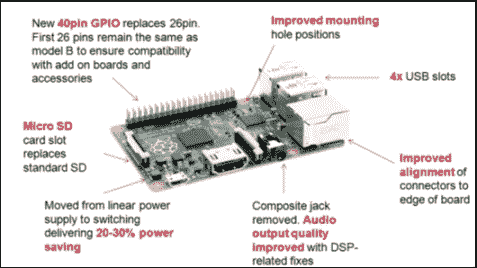

与以前的型号相比，B+型的一些关键优势如下：

+   更多的 USB 端口

+   更好的热插拔能力

+   带有活动指示灯的新以太网口

+   支持 40 针**通用输入/输出**（**GPIO**）标头

+   背面的 MicroSD 卡而不是全尺寸 SD 卡

+   更低的功耗要求

有一些可用的树莓派捆绑产品，比如**树莓派终极套件**，在撰写本书时，该套件在美国[www.amazon.com](http://www.amazon.com)售价为 79.99 美元。该套件提供了一个树莓派 B+型号、外壳、电源适配器和 Wi-Fi 转接器。您也可以找到不包括电源适配器、SD 卡等的基本 B+型号。这意味着您可以在[www.amazon.com](http://www.amazon.com)上仅以约 40 美元购买芯板。一些任务，比如窃听，可能需要第二个以太网口，但树莓派默认只提供一个以太网口。

您可以购买一个约 11 美元的 USB 到以太网适配器来满足这一目的。此外，许多套件不包括大多数计算机读卡器的 SD 适配器。例如，便携式 MacBook Pro 计算机提供 SD 端口；但是，您需要花费不到 10 美元购买一个 MicroSD 适配器，以便格式化树莓派 MicroSD 卡。对于无线渗透测试，您需要购买约 10 美元的 USB 到无线适配器。总的来说，大多数树莓派组件都很便宜，使大多数系统的总项目成本在 50 美元至 100 美元之间。

以下图片显示了一个未打开的树莓派芯板的示例：

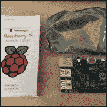

以下图片包含了一款在 eBay 上出售的树莓派捆绑产品的示例：

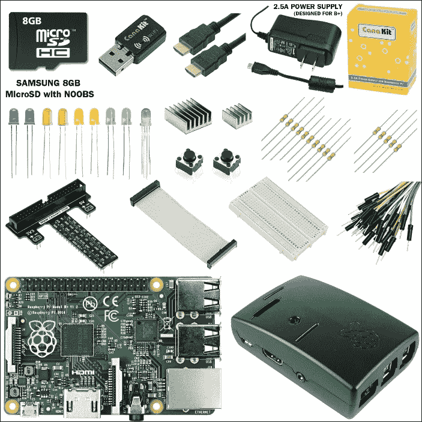

以下图片是一个 USB 到以太网适配器的示例：

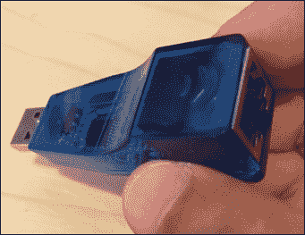

以下图片是一个 MicroSD 到 SD 适配器的示例：

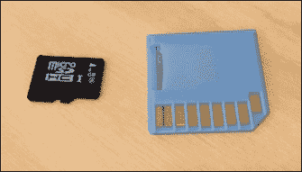

以下图片是一个 USB 到 Wi-Fi 适配器的示例：


**CanaKit** Wi-Fi 转接器对树莓派来说很好，因为它的尺寸、便携性和兼容性。

在本书中，我们将探讨如何将树莓派用作远程渗透测试代理，并利用其无线功能连接到中央管理系统。随着您对使用 Kali Linux 或其他渗透测试应用程序的树莓派变得更加熟悉和舒适，很可能您会在某个时候需要之前提到的组件。

以下是构建树莓派进行渗透测试的成本的摘要列表：

+   树莓派 B+型号的价格在 35 美元到 45 美元之间

+   USB 到无线适配器的价格在 10 美元到 20 美元之间

+   USB 到以太网适配器的价格在 10 美元到 20 美元之间

+   带 microSD 卡的 SD 到 microSD 转换器的价格在 10 美元到 20 美元之间

+   电源适配器的价格在 5 美元到 10 美元之间

+   移动渗透测试的 USB 电源适配器价格在 10 美元到 20 美元之间

入门套件的价格范围从 60 美元到 90 美元不等，具体取决于其中包含的内容。

### 提示

此列表不包括通常需要构建启动镜像的 HDMI 显示器、USB 键盘和 USB 鼠标。

# 组装树莓派

树莓派通常只是一个裸露的电路板。大多数人希望保护他们的投资，并在目标位置使用外壳隐藏他们的树莓派。大多数树莓派外壳设计为要么插入电路板，要么滑入设计用于固定树莓派的楔形间隙中。一旦您的树莓派正确安装，大多数外壳都有一个盖子来密封树莓派，同时暴露输入端口。

组装的下一步是连接输入和输出设备，如键盘、无线适配器和鼠标。树莓派 B+型号提供了四个 USB 输入端口供此用途。还有一个 HDMI 输出，用于连接到显示器。对于电源，树莓派使用 5V 微型 USB 电源，可以来自 USB 集线器、电源适配器或其他设备。树莓派的大脑是安装在 microSD 卡上的软件；然而，在将其插入树莓派之前，我们需要先在其上安装 Kali Linux 镜像。

### 注意

一些树莓派 microSD 卡预装了软件。建议在为 Kali Linux 格式化 microSD 卡之前克隆此软件，以便您有备份副本。克隆 microSD 卡的过程将在本章后面介绍。

## 准备 microSD 卡

现在您的树莓派已经组装好了，我们需要安装 Kali Linux。大多数计算机没有 microSD 卡插槽；然而，许多系统，如苹果 MacBook 提供 SD 插槽。如果您的系统没有 SD 插槽，也可以购买非常便宜的外部基于 USB 的 SD 和 microSD 适配器。在我的例子中，我将使用一个带有 SD 驱动器和 microSD 适配器的 MacBook 来格式化我的树莓派 microSD 卡。

### 提示

您的树莓派 microSD 卡应该至少有 8GB 的容量才能正常运行 Kali Linux。您还需要确保 microSD 卡是高性能的。我们建议大多数项目至少使用 10 级卡。

以下图片显示了一个 10 级 Kingston 8GB microSD 卡：

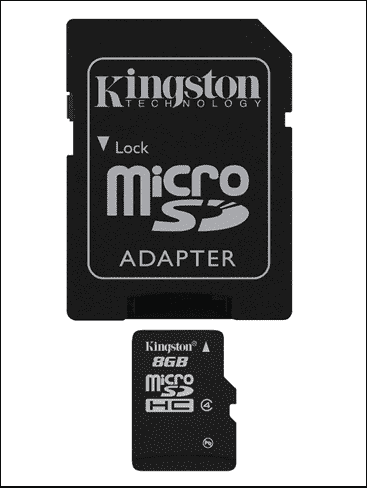

一旦您找到了在计算机上使用 microSD 卡的方法，您将需要格式化该卡。您可以从 SD 协会的[www.sdcard.org](http://www.sdcard.org)上获得一个免费的实用工具，如下截图所示：

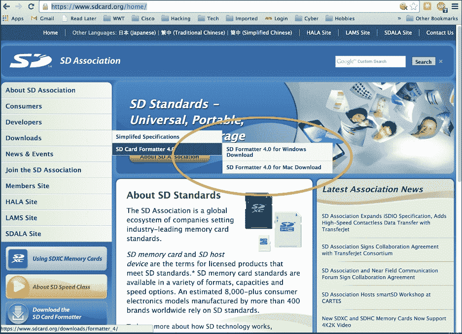

此实用程序将允许您正确格式化您的卡。您可以按照以下步骤下载它：

1.  通过您的网络浏览器前往[`www.sdcard.org/home/`](https://www.sdcard.org/home/)。

1.  在左侧菜单栏中，选择**下载**。

1.  然后，选择**SD 卡格式化程序 4.0**。

1.  然后，选择您的平台。Mac 和 Windows 版本都可用。

1.  最后，接受**最终用户许可协议**，下载软件并安装。

下载并插入 SD 卡后，启动**SD Card Formatter**应用程序。确保选择正确的媒体，准备就绪后，点击**格式化**按钮。这将擦除 SD 卡上的所有信息，并为您的 Kali Linux 安装做好准备。

确保格式化正确的驱动器，否则可能会擦除其他来源的数据。

### 提示

在格式化 microSD 卡之前，请务必备份现有镜像，以避免丢失默认软件或其他数据。本章后面将介绍克隆 microSD 卡。

以下屏幕截图显示了**SDFormatter**应用程序的启动：


如果您是苹果用户，可以通过点击**Finder**并输入`Disk Utility`来使用 Disk Utility。如果您的 microSD 卡安装正确，您应该将其显示为**Drive**选项。点击 microSD 卡，选择中间的第二个选项卡**Erase**。我们建议您使用**MS-DOS（FAT）**进行**格式化**。您不需要为 microSD 卡命名，所以将**Name**留空。接下来，点击**Erase...**按钮进行格式化。

以下屏幕截图显示了 Disk Utility 的启动：

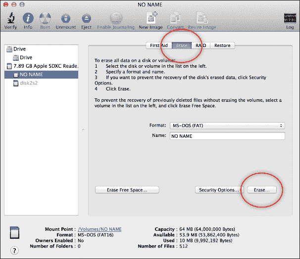

# 安装 Kali Linux

您现在可以在 Raspberry Pi 上下载 Kali Linux 了。默认情况下，针对 Raspberry Pi 的 Kali Linux 安装针对 Pi 设备的内存和 ARM 处理器进行了优化。我们发现这对特定的渗透目标效果很好。如果尝试添加太多工具或功能，您会发现设备的性能令人不满意，并且可能无法用于实验室环境之外的任何用途。使用 Kali Linux metapackages 可以在 Raspberry Pi 上进行完整安装，这超出了本书的范围。对于需要完整安装 Kali Linux 的用例，我们建议您使用更强大的系统。

要在 Raspberry Pi 上安装 Kali Linux，您需要从 Offensive Security 下载定制的 Raspberry Pi 镜像。您可以从[`www.offensive-security.com/kali-linux-vmware-arm-image-download/`](http://www.offensive-security.com/kali-linux-vmware-arm-image-download/)进行下载。

以下图像显示了可供下载的**Kali Linux 自定义 ARM 镜像**：

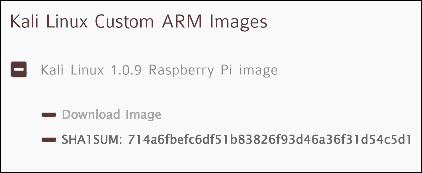

### 提示

最佳做法是计算并比较镜像的**SHA1SUM**哈希以验证在安装之前未被篡改。

下载完镜像后，您需要将其写入 microSD 卡。如果您使用的是 Linux 或 Mac 平台，可以使用命令行中的`dd`内置实用程序。如果您使用的是 Windows 系统，可以使用**Win32 Disk Imager**实用程序。

Win32 Disk Imager 实用程序是一个免费工具，用于将原始镜像写入 SD/microSD 卡。如果您使用 USB 适配器来使用 microSD 卡，可能会遇到工具无法正常工作的困难，因为一些人报告了这个问题。

您可以从[`sourceforge.net/projects/win32diskimager/`](http://sourceforge.net/projects/win32diskimager/)下载 Win32 Disk Imager 实用程序。

工具下载完成后，您只需选择镜像文件和可移动介质，即可开始镜像写入过程。此过程可能需要一段时间才能完成。在我们的系统上，完成这一过程大约需要 30 分钟。

您现在可以安装之前下载的 Kali Linux 镜像了。将存档解压缩到您的桌面上。您可以使用诸如 7-Zip 之类的实用程序来解压缩存档。

以下屏幕截图显示了**Win32 Disk Imager**实用程序：

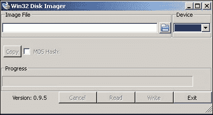

如果您使用的是 Mac 平台，第一步是确定操作系统从何处读取您的 SD 卡。您可以通过终端发出`diskutil list`命令来执行此操作，如下面的屏幕截图所示：

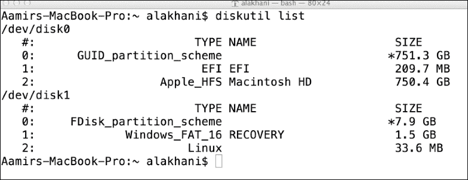

从屏幕截图中可以看出，我的 SD 卡被列为`disk1`。您还可以看到我在 microSD 卡上有现有分区。这表明我没有格式化我的媒体。您应该回到本章的开头，确保在继续之前已经格式化了您的媒体。

尽管我更喜欢使用之前描述的 SD 卡格式化应用程序，但您也可以通过以下步骤直接从 Mac 命令行格式化 SD 卡：

1.  首先，您需要通过发出`diskutil unmountDisk /dev/disk1`命令卸载您的 SD 卡。

1.  您现在可以通过发出`sudo newfs_msdos -F 16 /dev/disk1`命令来格式化 SD 卡。（确保选择正确的磁盘。否则可能会导致灾难性后果。）

### 提示

强烈建议您在格式化之前使用分区工具清除任何分区。

1.  您将被要求输入您的 Mac OS 系统/管理员密码。

### 提示

在需要 SD 卡号的命令中，我使用了`disk1`，因为我的 SD 卡在我的操作系统中自动分配为`disk1`。您的操作系统可能会为您的 SD 卡分配不同的磁盘号。在发出命令时，请确保包括您的磁盘号。

在复制镜像之前格式化 SD 卡被认为是最佳实践。需要注意的一点是，我们将使用`dd`命令，这意味着不需要格式化您的 SD 卡，因为`dd`命令执行的是从镜像到 SD 卡的逐位复制。建议进行格式化以防止其他错误和异常。

您现在可以安装您之前下载的 Kali Linux 镜像。现在，将存档解压缩到您的桌面。您可以使用诸如**The Unarchiver**或**Keka**之类的实用程序在 Mac 上解压缩存档。

然后，确定您未压缩的镜像的名称。在我的示例中，我的未压缩的镜像名称是`kali-1.0.9-rpi.img`。您将再次需要确定系统如何看待您的 SD 卡。您可以再次通过发出`diskutil list`命令来执行此操作。

您可以通过发出以下命令来创建和安装镜像（可能会再次要求您的 Mac OS 系统/管理员密码）：

```
sudo dd if=~/Desktop/kali-1.0.9-rpi.img of=/dev/disk1

```

以下图片显示了上一个命令的启动：

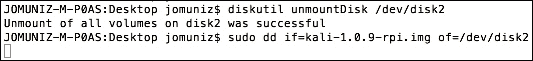

在将镜像写入 microSD 卡时，命令提示符将冻结。坐下来放松一下，因为这个过程可能需要一些时间。在我的系统上，它花了超过 30 分钟才完成。

### 提示

您可以通过按下*Ctrl* + *T*并向正在运行的进程发送`SIGINFO`命令来查看`dd`进程的进展。

以下图片显示了将镜像写入 microSD 卡时命令提示符冻结的情况：

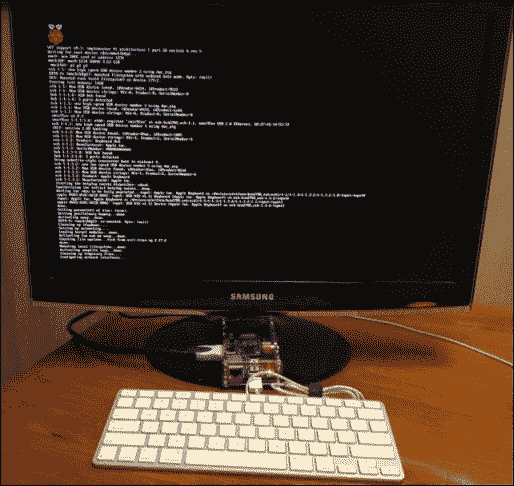

### 注意

如果您在 OS X 系统上将镜像写入 microSD 卡时没有包括`sudo`命令，可能会遇到权限被拒绝的错误。如果您使用此命令的变体，请确保`sudo`命令适用于整个命令，使用括号，否则您可能仍会遇到此错误。

安装镜像完成后，只需将 microSD 卡插入树莓派，并通过插入其电源来启动系统。启动系统可能需要最多 5 分钟。您将能够使用`root`作为用户名和`toor`作为密码登录系统。如果您希望启动图形环境，只需在终端中键入`startx`。恭喜！您现在在树莓派上拥有一个可用的 Kali 系统。

### 注意

系统启动可能需要一些时间。树莓派支持**图形用户界面**（**GUI**），您可以使用`startx`命令来调用它。但是，我们建议您只在树莓派上使用命令行。如果您发出`startx`命令，GUI 可能需要长达 20 分钟才能加载，并且可能会非常缓慢或无响应。

# 结合 Kali Linux 和树莓派

Kali Linux 树莓派镜像经过优化，适用于树莓派。当您使用 Kali Linux 镜像启动树莓派时，您需要使用`root`作为用户名和`toor`作为密码进行登录。我们建议您一旦登录就立即发出`passwd`命令来更改默认密码。大多数攻击者都知道 Kali Linux 的默认登录信息，因此明智的做法是保护您的树莓派免受不必要的外部访问。

以下屏幕截图显示了`passwd`命令的启动以重置默认密码：

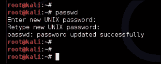

当您发出`startx`命令时，您的屏幕可能会在几分钟内变空。这是正常的。当您的**X Windows**（GUI）桌面加载时，它会询问您是否要使用默认工作区还是空白工作区。选择默认工作区。在您做出选择后，桌面可能会尝试重新加载或重绘。在完全加载之前可能需要几分钟。

以下屏幕截图显示了`startx`命令的启动：


您需要做的第一件事是升级操作系统和软件包。升级过程可能需要一些时间，并且在过程中会显示其状态。接下来，您需要确保在 X Windows（GUI）环境中升级系统。许多用户报告说，除非在 X Windows 环境中，否则组件不会完全升级。在启动`apt-get upgrade`命令之前，使用`startx`命令访问 X Windows 环境。

以下屏幕截图显示了`apt-get update`命令的启动：

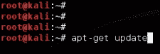

以下屏幕截图显示了`apt-get upgrade`命令的启动：

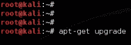

以下是打开 Kali Linux GUI 所需遵循的步骤：

1.  确保您在 X Windows 桌面中（使用`startx`）。

1.  打开终端命令。

1.  输入`apt-get update`命令。

1.  输入`apt-get upgrade`命令。

1.  输入`sync`命令。

1.  输入`sync`命令。

1.  输入`reboot`命令。

升级系统后，发出`sync`命令（作为个人偏好，我们发出此命令两次）。通过发出`reboot`命令重新启动系统。几分钟后，您的系统应重新启动并允许您重新登录系统。发出`startx`命令以打开 Kali Linux GUI。

以下屏幕截图显示了`sync`和`reboot`命令的启动：


您需要在 X Windows（GUI）环境中使用`apt-get update`和`apt-get upgrade`命令升级系统。否则可能会导致 X Windows 环境不稳定。

此时，您已准备好使用运行 Kali Linux 的树莓派开始渗透练习。

## 树莓派的利弊

正如本书的各个部分所述，树莓派旨在成为一种廉价的计算选项，可用于各种用途。廉价的系统提供有限的计算能力，因此在使用树莓派进行任何类型的渗透测试时的一个主要缺点是其缺乏运行资源密集型任务的能力。因此，强烈建议您仅将树莓派用于特定任务，而不是作为攻击工具库，因为完整的 Kali Linux 安装在有限的 Kali Linux ARM 架构上提供了更多工具。

以下两个屏幕截图显示了 Kali Linux ARM 架构中一个工具集类别的选项与完整的 Kali Linux 安装之间的区别。我们还发现，在从 GUI 运行 Kali Linux ARM 中的一些工具时，它们并不正常工作，或者根本失败了。在比树莓派更强大的系统上，你会在完整的 Kali Linux 安装中找到更可靠的工具。以下是 Kali Linux ARM 截图，显示了**Live Host Identification**工具，即**ncat**和**nmap**：

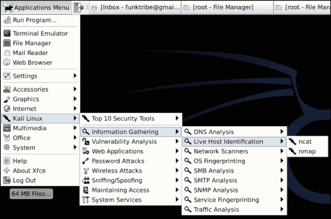

这是完整安装的**Kali Linux**中相同**Live Host Identification**类别的工具选项。如下截图所示，提供了更多的选项：

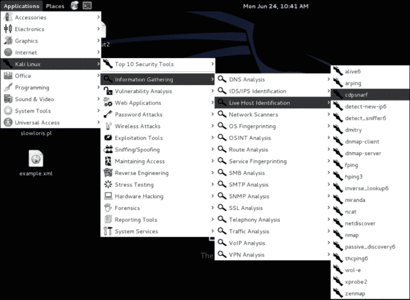

## 树莓派渗透测试用例

树莓派有很多用途，不仅仅是因为它很“酷”。第一个用例是将低成本的远程渗透测试节点部署到难以到达的地点。一个例子是，当你向中国、英国和澳大利亚的分公司提供带宽有限的渗透测试服务时，你可以让客户支付建立树莓派和将每个盒子运送到目的地的成本，而不是飞往每个地点。你可以让当地的人插入树莓派作为网络监听器，并远程执行渗透测试，从而大大节省旅行和硬件成本。在大多数情况下，由于成本低廉，你可能会让客户在渗透测试后移除并保留树莓派。通过这种方法，你可以为客户节省成千上万美元，而不是使用平均每个地点成本更高的企业云扫描工具。

另一个用例是通过声称自己是 IT 或电话支持代表进行维护，从而滥用普通用户的信任，物理访问目标位置。树莓派芯片板可以隐藏在任何官方外观的硬件中，比如清理思科交换机、集线器等，并将树莓派放在一个端口上。普通用户不会质疑看起来像是属于那里的网络盒子。

在这两种用例中，树莓派的主要卖点是其低成本，这意味着丢失一个系统不会让你破产。此外，这两种用例都展示了树莓派由于其小巧的外形而非常适合移动。因此，树莓派是更昂贵的远程渗透工具集的一个很好的替代品，比如**PWNIE Express**提供的工具（我们并不是说 PWNIE Express 的工具不酷或不值得拥有，但它们的成本远高于树莓派的方法）。顺便说一句，你也可以在树莓派上运行 PWNIE Express 软件的轻量版，这在本书的最后部分有提及。

考虑使用树莓派的一个常见原因是其设计的灵活性、软件和在线社区。有成千上万的网站专门用于树莓派的各种用例。因此，如果遇到问题，你很可能会在谷歌上找到解决方案。有许多操作系统和几乎所有东西都是开源的。这使得许多设计需求成为可能，比如需要为移动教室开发大量经济实惠的系统。

有了 Raspberry Pi，可能性是无限的。关于渗透测试，Kali Linux 几乎提供了您进行基本练习所需的一切。Kali Linux ARM 有限；但是，只要工具不需要大量计算能力，您可以随时使用`apt-get`下载任何缺失的工具，以满足您对渗透测试练习的要求。我们将在本书的后面介绍如何下载缺失的工具。所以，花 50 美元至 100 美元购买一个 Raspberry Pi，并查看在线社区，了解如何将您的 Raspberry Pi 提升到更高水平的更多信息。

# 克隆 Raspberry Pi SD 卡

建议在将 Raspberry Pi 格式化为 Kali Linux 安装之前备份原始系统软件。大多数 Raspberry Pi microSD 卡都带有一种**新开箱即用软件**（**NOOBS**），其中包含各种操作系统选项，您可以从中选择主操作系统。如果您已经擦除了您的 microSD 卡，可以从[`www.raspberrypi.org/downloads/`](http://www.raspberrypi.org/downloads/)下载 NOOBS 软件。

SD 卡的克隆过程非常简单。许多 Windows 实用程序，如前面章节介绍的 Win32 Disk Imager，将制作 SD 卡的精确副本。在 Mac 上，打开命令提示符以识别您的 SD 卡，并键入`diskutil list`命令：

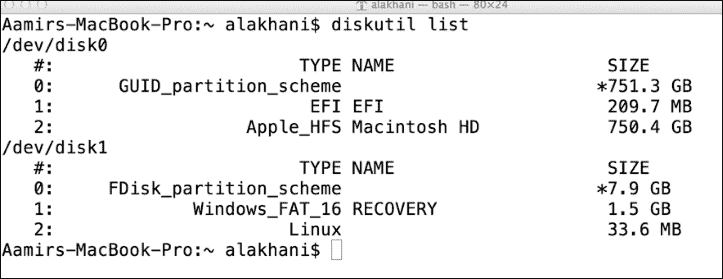

在上面的截图中，我的 microSD 卡是**/dev/disk1**。在您的系统上，您的 microSD 卡可能不同，因此请务必进行验证。我可以通过创建磁盘映像并将其保存到桌面来克隆我的卡。我将发出以下命令：

```
sudo dd if=/dev/disk1 of=~/Desktop/raspberrypi.dmg

```

以下截图显示了在执行命令之前我必须输入密码：

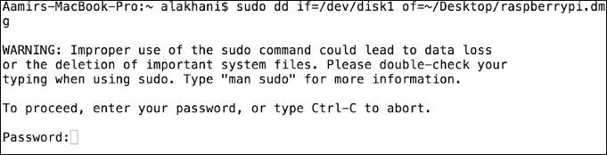

克隆 SD 卡的过程可能需要长达 30 分钟。创建镜像的速度将取决于 microSD 卡的大小和速度，上面的数据量以及您的计算机的速度。换句话说，要有耐心，让它复制。

### 注意

如果您在 OS X 系统上将镜像写入 microSD 卡时遇到权限被拒绝的错误，如果不包括`sudo`命令，则可能会遇到问题。如果您使用此命令的变体，请确保`sudo`命令适用于整个命令，使用括号，否则您可能仍会遇到此错误。

# 避免常见问题

最糟糕的事情之一就是按照书上的指示进行操作时遇到错误。我们曾经为多个 Raspberry Pi 系统创建镜像，有时会遇到有趣的，有时会遇到不愉快的行为。以下是我们遇到的一些问题及其建议的解决方法：希望这能节省您花在摔头上的时间。

+   **电源问题**：我们尝试使用 5V 微型 USB 电源的小型 USB 钥匙链电源适配器，以使我们的系统非常便携。有时这些适配器有效，有时它们只是显示 Raspberry Pi 已经供电，但系统没有启动。请务必测试，因为有时您可能会发现某些电源适配器不起作用。大多数 Raspberry Pi 系统的侧面有灯，显示红色为电源，黄色为正常运行时。查看您型号的制造商网站以获取更多详细信息。

+   MicroSD 卡阅读问题：我们听说有些人的 MicroSD 卡读卡器在插入系统后无法识别 SD 卡。一些 Mac 用户声称他们不得不“对着 SD 读卡器孔吹气”，而其他人发现他们不得不使用外部读卡器才能使 MicroSD 卡被系统识别。我们建议您尝试另一个系统。如果您要购买 MicroSD 转换器，请确保卖家已将其列为树莓派 MicroSD 兼容。外部 MicroSD 读卡器的价格不应超过 10 美元。您还可以按照[`elinux.org/R-Pi_Troubleshooting`](http://elinux.org/R-Pi_Troubleshooting)上提供的故障排除步骤进行操作。

如果您发现安装图像到 MicroSD 卡后树莓派不起作用，请验证 MicroSD 卡是否正确插入。您应该听到轻微的点击声，并且它应该在弹簧支撑的帮助下弹入和弹出。如果它似乎没有正确滑入，那么 MicroSD 卡可能是颠倒的，或者是错误类型的卡。如果您正确插入 MicroSD 卡，但系统启动后什么也没有发生，请确保您使用了正确的电源。下一个问题可能是图像没有正确安装。我们发现一些人在`dd`过程中，他们的计算机进入了睡眠模式，导致只有部分 Kali Linux 图像被复制。请确保您验证图像是否正确复制。还要验证您下载的图像是否真实。Offensive Security 包括 SHA1SUM，用于验证图像是否被篡改。另一个问题可能是您解压 tar 文件的方式。请确保您使用有效的方法，否则图像文件可能会损坏。如果您注意到图像正在引导，请在命令提示符可用之前观察引导顺序以查看错误消息。

+   **权限被拒绝**：许多 Mac 用户发现他们没有适当的权限来运行`dd`命令。这可能是由几个原因引起的。首先，请确保您的 MicroSD 卡或 SD 适配器没有物理设置的保护模式。接下来，请确保读卡器和适配器正常工作。有报道称 MAC 用户不得不“对着 SD 读卡器吹气”以清除灰尘并使其正常工作。请确保您按照先前的警告所述对整个语句使用`sudo`命令。如果错误仍然存在，请尝试使用外部 MicroSD 读卡器，因为您当前的读卡器可能允许格式化，但在`dd`命令方面存在问题。

+   **startx 后出现空白屏幕**：如果您访问命令行并输入`startx`，您应该看到树莓派启动 Kali Linux GUI。这可能需要几分钟的时间，具体取决于您的树莓派的大小和速度，以及您安装了什么。如果您安装了太多应用程序，使您的系统混乱，您可能会发现它们会压倒您的树莓派并冻结 GUI。正如前面所述，我们强烈建议将树莓派用于有限功能的定向渗透目标，而不是加载比必要更多的工具。如果您的任务需要大量处理能力或完整版本的 Kali Linux，那么应考虑使用更强大的其他系统而不是树莓派。此外，我们发现许多应用程序在命令行中运行比从 GUI 启动更好。建议尽可能在命令行中使用 Kali Linux。

+   `startx`后出现工作鼠标的空白屏幕：我们在从终端窗口运行`apt-get update`并重新启动系统后，遇到了这个问题。在第二次启动时，我们运行了`startx`，发现系统似乎正常启动；然而，我们却卡在了一个空白屏幕和一个工作的鼠标上。如果在关闭系统之前有一个打开的网络浏览器，那么浏览器也会出现；但是，如果我们关闭了它，那么我们就只能看到一个在空白屏幕上滚动的鼠标。有时，即使我们没有进行更新，我们的树莓派在第二次`startx`启动后也会出现这种情况。

这个问题是由一些文件在运行`apt-get update`时没有正确更新引起的，这会导致显示适配器的问题或者只是您安装的 Kali Linux 版本的一般问题。对此有两种可能的解决方法。

您很可能是在 X Windows 环境之外运行了`apt-get update`和`apt-get upgrade`命令。因此，您需要重新镜像并使用新版本的 Kali Linux 运行您的 microSD 卡，在 X Windows 环境中运行`apt-get update`和`apt-get upgrade`，然后同步并重新启动系统。遵循这些确切的步骤以避免出现问题。

第二个解决方法是重新镜像您的 microSD 卡，使用新版本的 Kali Linux，并不运行`apt-get update`命令。我知道这一点，但有些人会花两个星期来解决问题，而他们本可以花 30 分钟重新镜像并继续。请记住，即使您遵循了本书中提供的更新和升级程序，在使用树莓派上的 Kali Linux 之前，您可能仍会遇到空白屏幕和工作鼠标的问题。

+   Kali Linux 程序在 GUI 中找不到：我们发现树莓派的某些版本的 Kali Linux ARM 镜像在启动后，输入`startx`后会正常启动 GUI，但是在 GUI 加载完成后，在应用程序下拉菜单中找不到 Kali Linux 工具。这与之前解释的显示问题类似，这意味着可以通过执行本书中解释的`apt-get update`和`apt-get upgrade`步骤来解决这个问题，这些步骤告诉您第一次登录 GUI 后该做什么。更新和升级过程应该安装和升级导致此问题的任何损坏文件。我们曾经发现，在经过推荐的更新和升级过程后，成功升级和重新启动系统后，Kali Linux 软件出现在应用程序菜单下。

### 提示

解决问题的一个很好的资源是[`elinux.org/R-Pi_Troubleshooting`](http://elinux.org/R-Pi_Troubleshooting)。

# 总结

在本章中，我们讨论了购买硬件的选项以及如何组装树莓派。我们讨论了推荐的硬件配件，如 microSD 卡和 Wi-Fi 适配器，以便您能够完成本书中给出的步骤。

一旦我们讨论了购买适当的硬件，我们就会为您介绍在树莓派上安装 Kali Linux 的最佳实践程序。这包括详细的格式化和升级 Kali Linux 的过程，以及我们遇到的可能的常见问题的解决方法。在本章结束时，您应该已经在树莓派上拥有一个完全可用的 Kali Linux 安装，更新的软件，并且一切都在您的树莓派上运行以进行基本设置。

在下一章中，我们将讨论将树莓派用作渗透测试平台的优势。我们将介绍如何优化树莓派上的 Kali Linux 应用程序，以及如何远程控制和管理您的树莓派作为 Kali Linux 攻击平台。
