# 第五章。结束渗透测试

在个人实验室进行网络入侵可能很有趣。然而，某个时候，您可能需要将其应用到真实环境中。当那个时候到来时，确保您正确地结束事情至关重要。对于提供渗透测试服务的人来说，您必须提供证据来证明您的发现，否则您将无法为未来的业务提供足够的价值。这意味着记录一切，不要留下可能由您的服务引起的问题。对于攻击者，您将希望清除您的足迹，以便当局无法通过法证调查追踪您。

在报告已识别的网络弱点作为付费服务时，人们不喜欢听到自己的孩子被称为丑陋，并且可能会质疑您的发现。因此，重要的是记录整个过程，以便可以重复，假设网络处于进行渗透测试时的相同状态。文档需要为技术和非技术审阅者量身定制，因为这两种类型的人可能都对资助服务参与有利。您还应该记录练习的起始状态，包括客户提前提供的任何信息。您可以通过研究白盒、黑盒和灰盒渗透测试了解更多关于渗透测试的起始状态。

结束渗透测试的另一个关键元素是意识到您在任务中创建的足迹。许多漏洞可能会影响系统的功能，并导致大多数客户不会满意的停机时间。这种行为和其他类型的行为可能会引起监视您存在的人的注意，这可能会促使他们调整其安全措施。这将使您原始任务变得更加困难，并且也不会提供真正的渗透测试模拟，因为真正的攻击者可能不会那么马虎并且被识别。管理员也可能在报告之前修复任何已识别的漏洞，从而降低您最终报告的价值。这就是为什么您在目标上尝试的一切都应该是隐秘的，除非服务参与完全公开，即所有参与方都知道您正在针对特定系统提供服务。

本章将涵盖以下主题：

+   Covering your tracks

+   Wiping logs

+   掩盖您的网络足迹

+   Proxychains

+   将树莓派重置为出厂设置

+   远程损坏 Kali Linux

+   制作报告

+   创建截图

+   压缩文件

### 注意

在执行任何渗透测试任务之前，您应该得到相关方的批准。这份批准应该由法律代表审查，并用墨水签字，以避免因未经授权的渗透测试造成的任何负面结果而被追责。如果您是未经授权的黑客，不要被抓住。

# Covering your tracks

渗透测试人员和犯罪分子经常失败的一个关键任务是在侵入系统后进行清理。法证证据可以是从数字网络足迹（IP 地址、在传输线上看到的网络流量类型等）到受损终端上的日志的任何东西。还有关于使用的工具的证据，比如使用树莓派进行恶意操作时使用的工具。例如，在树莓派上运行`more ~/.bash_history`可以查看使用过的所有命令的完整历史记录。

树莓派黑客的好消息是，他们不必担心 ROM 等存储元素，因为唯一需要考虑的存储是 microSD 卡。这意味着攻击者只需重新刷写 microSD 卡以抹去树莓派被使用的证据。在这之前，让我们从受损的系统开始，逐步进行清理工作，直到重新设置树莓派。

### 注意

您可以使用我们在第一章中介绍的 SD 格式化工具，*树莓派和 Kali Linux 基础*，来完成此操作。您还可以使用第一章中介绍的步骤，*树莓派和 Kali Linux 基础*，在执行渗透测试并将树莓派重置回到该镜像之前，备份镜像以隐藏其在重新镜像之前的使用方式。

## 清除日志

您应该执行的第一步是清除您访问过的受损系统中的任何事件日志。对于 Windows 系统，Kali Linux 在 Metasploit 中有一个名为**clearev**的工具，可以自动完成这项任务。Clearev 旨在访问 Windows 系统并清除日志。当您清除日志时，过于热心的管理员可能会注意到更改。但是，大多数管理员永远不会注意到这些更改。此外，由于日志已被清除，最糟糕的情况是管理员可能会发现他们的系统已被入侵，但包含您访问信息的日志已被删除。

Clearev 随 Metasploit 一起提供。要在使用 Meterpreter 入侵了 Windows 系统后使用 clearev，请输入`meterpreter > clearev`。一旦运行，它就会自动擦除日志，这意味着它运行时不需要进行任何配置。

下面的截图显示了上述命令的启动：

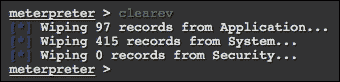

以下是在 Windows 系统上擦除日志之前的日志示例：


从受损的 Windows 系统中擦除日志的另一种方法是安装 Windows 日志清理程序。有许多可供下载的选项，例如在[`ntsecurity.nu/toolbox/clearlogs/`](http://ntsecurity.nu/toolbox/clearlogs/)上找到的**ClearLogs**。这些程序非常简单易用，意味着您只需在完成渗透测试后在目标上安装并运行它。您还可以使用`C:\ del %WINDR%\* .log /a/s/q/f`命令手动删除日志。此命令使用`/a`包括子文件夹`/s`中的所有日志，禁用任何查询，因此您不会收到提示，`/f`强制执行此操作。

### 提示

无论您使用哪个程序，请确保在删除日志文件后删除可执行文件，以便在将来的法证调查中不会识别该文件。

对于 Linux 系统，您需要访问`/var/log`文件夹以查找日志文件。一旦您访问了日志文件，只需打开它们并删除所有条目。下面的截图显示了我的 Raspberry Pi 的`log`文件夹的一个示例：

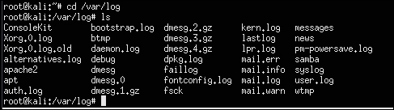

您可以使用删除命令`rm`来删除文件，例如`rm FILE.txt`，或者删除整个文件夹；但是，这不如清除现有文件中的痕迹干净。另一个选项是在 Bash 中。可以简单地输入`> /path/to/file`来清空文件的内容，而不一定要删除它。这种方法有一些隐蔽的好处。

Kali Linux 没有基于 GUI 的文本编辑器，因此您可以安装的一个易于使用的工具是**gedit**。使用`apt-get install gedit`进行下载。安装完成后，您可以在应用程序下拉菜单中找到`gedit`，或者在终端窗口中直接输入`gedit`。如下面的截图所示，它看起来像许多常见的文本文件编辑器。单击**文件**，并从`log`文件夹中选择文件进行修改。

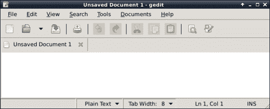

您还需要删除命令历史记录，因为 Bash shell 会保存最近的 500 个命令。可以通过输入`more ~/.bash_history`命令来访问这些法证证据。下面的截图显示了我最近在我的 Raspberry Pi 上运行的数百个命令中的第一个命令：

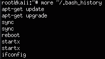

要验证`history`文件中存储的命令数量，请键入`echo $HISTSIZE`命令。要擦除此历史记录，请键入`export HISTSIZE=0`。从这一点开始，shell 将不会存储任何命令历史记录，也就是说，如果您按上箭头键，它将不会显示上一个命令。

### 提示

这些命令也可以放在 Linux 主机的`.bashrc`文件中。

以下截图显示我已经验证了我的最后 500 个命令是否被存储。它还显示了在我擦除它们之后发生了什么：

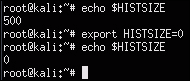

### 注意

在使用受损系统上的任何命令之前设置此命令是最佳实践，以便事先不存储任何内容。一旦设置了 export `HISTSIZE=0`命令，您可以注销并重新登录以清除您的历史记录。如果您担心被调查，还应该在您的 C&C 服务器上执行此操作，以结束您的渗透测试。

在 Linux 系统上删除您的历史文件的一种更激进和更快的方法是使用`shred –zu /root/.bash_history`命令将其销毁。此命令使用零覆盖历史文件，然后删除日志文件。使用`less /root/.bash_history`命令验证这一点，看看您的历史文件中是否还有任何内容，如下面的截图所示：

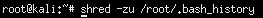

# 掩盖您的网络足迹

除非您不介意被追踪到您的行为，否则您不应该从可以追溯到您的家庭网络等来源发起攻击。隐藏您真实的来源地址最常见的方法是使用代理或多个代理在您和受害者之间。简单来说，代理充当了寻求来自另一个系统资源的客户端请求的中介。目标将看到来自中介系统的流量，并不会知道真正的来源。分层代理可能会导致洋葱效应，在取证调查期间极其困难地追踪真正的来源。

在线有数百个免费的网络代理可用。您可以在 Google 上搜索“免费匿名网络代理服务器”以找到各种类型，如 Proxify，Anonymouse，Anonymizer 和 Ninja Cloak。下面的截图显示了 Anonymouse，包括通过代理浏览的解释。对于他们的服务，您只需在搜索框中输入要访问的地址。

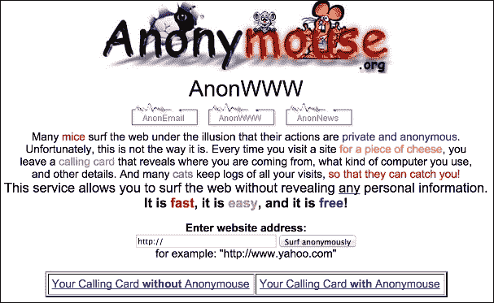

### 注意

代理管理员可以看到所有流量，并识别通过他们的代理进行通信的目标和受害者。强烈建议您在使用任何代理之前进行研究，因为有些代理可能会在未经您许可的情况下使用捕获的信息。这包括向当局提供取证证据或出售您的敏感信息。

## Proxychains

隐藏您的源 IP 地址的另一个选项是使用 proxychains。Proxychains 允许您通过代理服务器隧道 Kali 命令。您需要使用`sudo apt-get install proxychains`命令安装 proxy chains，因为它没有预装在 Kali Linux ARM 镜像中。

安装完成后，您需要在`etc/proxychains.conf`文件中添加代理 IP 地址：

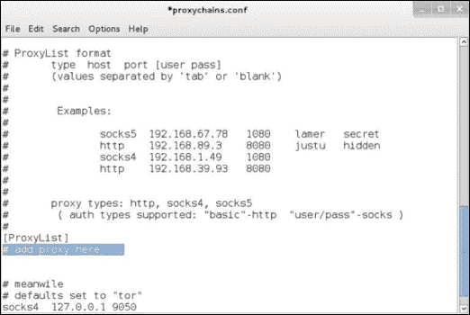

HideMyAss Internet security 提供了一系列可用于此目的的免费代理服务器。您可以在他们的网站[`proxylist.hidemyass.com`](http://proxylist.hidemyass.com)上找到。请记住，这些代理并不是非常可靠，可能会在未经您许可的情况下使用您的数据，因为代理管理员可以看到所有流量。

proxychains 的语法是`proxychains <要隧道和代理的命令> <可选参数>`。在下面的示例中，我们将使用`nmap`命令通过 proxychains 扫描`192.168.1.0/24`网络，以隐藏扫描的来源。请注意，我们必须在执行此命令之前编辑`.conf`文件以使用代理。

```
proxychains nmap 192.168.1.0/24

```

## 将 Raspberry Pi 重置为出厂设置

一旦您在端点和网络上覆盖了您的踪迹，最后一步是从您使用的工具中删除取证证据。要清理树莓派，您只需要重新映像 SD 驱动器。您可以在第一章中找到使用 SD 卡格式化程序或苹果的磁盘实用程序格式化 SD 卡的步骤。您可以继续阅读第一章中的内容，安装新的映像，例如原始的 NOOBS 软件，以隐藏树莓派曾经运行 Kali Linux 的事实。您还可以使用在启动渗透测试之前定制过的 Kali Linux 映像，以节省重建攻击系统的时间，同时删除先前渗透测试过程中的操作。

另一个选择是移除并损坏 microSD 卡。以下图片显示了一个切割的 microSD 卡的示例，以便它无法用于将来的调查：

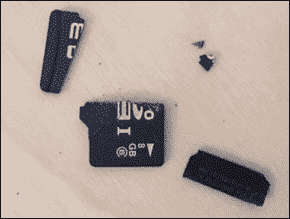

### 远程损坏 Kali Linux

您可能会遇到这样的情况，无法直接访问您的树莓派，需要确保它不会被没收并在将来用于取证调查。如果您将树莓派作为网络监听器，远程访问它以侵入系统，现在需要通过关闭树莓派来结束事情。在这种情况下，您无法擦除 microSD 驱动器，因此下一个最好的选择是损坏 Kali Linux，以便取证调查人员无法访问它以查看在网络入侵期间的使用情况。让我们看看如何远程关闭运行 Kali Linux 的树莓派。

你可能想做的第一件事是删除所有内容。您可以使用`rm –rf /`命令来执行此操作，其中`rm`表示删除，`-rf`表示递归删除所有文件和文件夹，而不会提示您，`/`表示此命令从根目录开始。使用`.*`运行相同的命令，即`rm –rf .*`，将删除所有配置文件。这个选项并不是很好，因为仅删除告诉系统空间可用，但不会替换数据，这意味着可以使用取证工具找回数据。更好的方法是使用`dd if=/dev/zero of=/dev/sda1`，这样您可以覆盖字节，使数据更难恢复。

另一个选择是使用`mkfs.ext4 /dev/sda1`命令格式化硬盘。`mkfs.ext4`命令创建一个新的`.ext4`文件系统，`/dev/sda1`指定了第一个硬盘上的第一个分区，这是我们用来运行 Kali Linux 的。

### 注意

运行这些命令将关闭您的 Kali Linux 安装。要小心那些建议您使用这些命令的人，因为常见的情况是有人建议这样做作为恶作剧。

# 开发报告

渗透测试服务最重要的部分是向客户提供的交付品质。我们曾看到非常有才华的测试人员因为最终报告的质量低而失去业务，而更专业的服务提供商则纯粹基于客户对最终报告的反应。这是由于传递消息的方式，考虑目标受众的敏感程度以及提供的细节水平。为潜在客户定制消息的最佳方式是利用标准化报告的混合以及想象他们如何阅读材料。例如，如果某人对这项服务以及其他服务的预算有影响力，那么称呼他为潜在弱点可能是个坏主意。

开发报告不仅仅是记录你的发现。您需要捕捉整个场景，包括渗透测试前的环境，提前提供的信息，对当前条件的假设，提供服务时使用的步骤，以及每个步骤的结果。您可能会发现管理员在报告完成之前修补漏洞，因此关键要记录每个步骤的时间和日期。您可以通过使用可信来源，如 OWASP 的测试指南，了解有关开发报告的最佳实践[`www.owasp.org/index.php/Testing_Guide_Introduction`](https://www.owasp.org/index.php/Testing_Guide_Introduction)。

让我们看看一些可以帮助您构建专业报告的工具。

## 创建截图

Kali Linux ARM 的功能有限，以保持操作系统的轻便。一个简单的概念，可能会让人感到繁琐的是为了报告目的而捕捉结果的屏幕截图。让我们来看看一个可以简化这个过程的基于命令行和 GUI 的工具。

### ImageMagick

ImageMagick 是一个可以从终端下载和执行截图的工具。要下载它，请键入`sudo apt-get install imagemagick`命令。

安装完成后，您可以键入`import screenshot.png`命令来启动截图。ImageMagick 会将鼠标图标更改为表示它已准备好捕捉某物的框。点击屏幕上要捕捉的部分，截图将保存为`.png`文件在您的根目录中。如果您点击窗口，ImageMagick 将只捕捉该特定窗口。您可以键入`eog screenshot.png`命令来查看您的截图。

要在引入延迟的同时捕捉整个 Raspberry Pi 屏幕，请键入`sleep 10; import –window root screenshot.png`命令。这对于包括需要交互的内容很有用，比如在执行屏幕截图时打开菜单。`sleep`后面的数字将给出截图前的延迟时间。`import –window root`命令告诉 ImageMagick 截取整个屏幕的截图。命令的最后一部分是您的截图名称。以下截图显示了捕获截图的命令：


### Shutter

另一个截图工具是 Shutter。同样，您需要使用`apt-get install shutter`命令来下载它。安装完成后，您可以在应用程序下拉菜单中找到它，或者只需在终端窗口中键入`shutter`。Shutter 有一个弹出窗口，在完全启动之前会通知您正在更新其插件。

以下截图显示了**Session-Shutter**窗口：

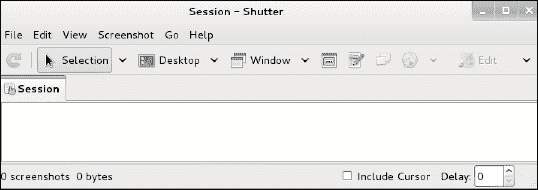

Shutter 将显示一个带有选项的窗口。要进行截图，您可以点击箭头或剪刀图像，具体取决于版本。这将改变屏幕并要求您在要截图的位置画一个矩形。一旦您这样做，您将在 Shutter 窗口中画一个矩形围绕您想要的图像，您的截图将出现在 Shutter 窗口中。在这里，您可以编辑您的图像并保存到您的报告中。以下示例显示了我对网站[www.thesecurityblogger.com](http://www.thesecurityblogger.com)的部分截图：

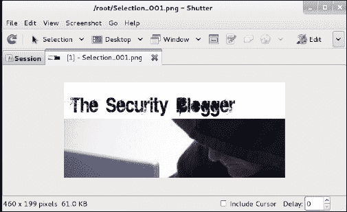

另一个选项是通过点击标有“desktop”标签的方框来截取整个桌面，或者通过点击桌面捕捉图像右侧的选项之一来捕捉窗口的一部分。一旦您有了图像，您可以点击画笔图标来调出编辑功能，如下图所示。在保存最终图像之前，您可以裁剪、调整大小等。您还可以使用计算机图像按钮上传图像并使用画笔编辑这些图像。

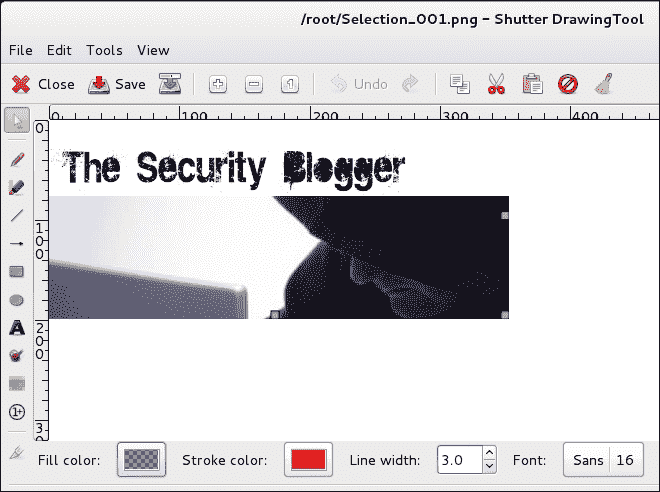

## 压缩文件

如果您入侵了一个系统或网络，那么在某个时候您可能会想要插入或删除数据。数据可能很大，这意味着在网络上传输可能需要一些时间。如果您在被入侵的系统上的时间有限，这可能会成为一个问题。此外，将大文件从网络上移动可能会触发安全防御措施，如**数据丢失预防**（**DLP**）技术。

最佳做法是将文件压缩并分割成较小的大小，以加快下载/上传过程，并隐藏发送/接收操作。让我们看看您可以使用的命令行和 GUI 工具来实现这些目标。

### Zip/Unzip

一个简单易用的基于命令行的压缩应用程序是 Zip。这个程序可以让您在树莓派上缩小文件，以便您可以将它们发送到 C&C 服务器以恢复到正常形式。Zip 未预装在 ARM 映像上，因此您需要使用`apt-get install zip`命令进行安装。

安装完成后，使用`zip "zip 文件名" "要压缩的文件"`命令，其中`"zip 文件名"`是输出文件的名称，`"要压缩的文件"`是要压缩的文件。压缩文件将添加`.zip`扩展名，这意味着此示例在压缩后将成为`data.zip`。以下截图显示了将`VictimData`文件压缩为`Stolen.zip`文件：

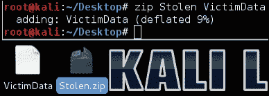

使用`unzip Stolen.zip`来打开 ZIP 文件，使其恢复到正常形式，即`VictimData`。您还可以指定要提取的特定文件，例如`unzip Stolen.zip VictimData.doc`。以下截图显示了`Stolen.zip`的解压过程：

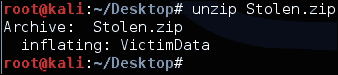

### File Roller

如果您正在寻找一个可以读取各种格式的基于 GUI 的压缩程序，File Roller 可能符合您的需求。就像 Zip 一样，您可以使用简单的 GUI 打开和压缩文件。File Roller 未包含在 Kali Linux ARM 映像中，因此您需要使用`apt-get install file-roller`命令进行安装。安装完成后，在终端中键入`file roller`，GUI 将打开。以下截图显示了我在 File Roller 中拖放`Stolen.zip`文件后的`VictimData`文件。您还可以单击**打开**按钮打开压缩文件。

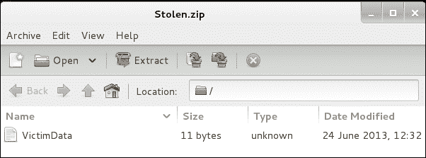

要压缩文件，您可以将文件拖放到窗口中，File Roller 会询问您是否要创建一个新的压缩文件。以下截图中的示例显示了将`VictimData`文件拖放到 File Roller 中，并创建一个名为`VictimDataNew.tar.gz`的新压缩文件。在文件提示中，我告诉 File Roller 将我的新文件命名为`VictimDataNew`，一旦文件被压缩，它就会添加`.tar.gz`扩展名：

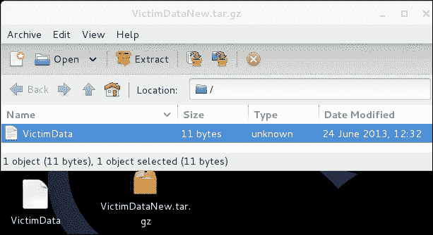

### 分割

为了进一步减小文件大小，您可以在发送文件之前将其分割成多个部分。一个简单的实用程序可以实现这一点是 split。要分割一个文件，输入`split "每个文件的大小" "要分割的文件" "分割文件的名称"`。以下截图中的下一个示例显示了将名为`VictimData`的文件分割成名为`Breakup`的较小的 50MB 文件。每个 50MB 文件的名称将以`aa`开头，所以我们的示例创建了三个文件，分别为`Breakupaa`，`Breakupab`和`Breakupac`。

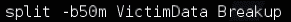

要重新组装我们的三个文件，我们可以使用`cat "fileaa fileab fileac" > "final file name"`。因此，对于我们的示例，我们将使用`Breakupaa`，`Breakupab`和`Breakupac`文件来组装`VictimData`文件。我们还可以使用`cat Breakupa[a-c] > VictimData`命令，如下面的截图所示，因为数字序列中的起始字符相同：

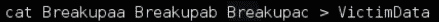

# 总结

本章重点介绍了如何结束渗透测试或攻击性练习。主题包括清除你侵入的系统中的痕迹，掩盖你与系统通信的方式，最后清除使用树莓派进行渗透测试的证据。我们通过介绍报告选项来结束本章，以便为潜在客户创建专业的成果。

下一章将介绍树莓派可用的除 Kali Linux 之外的其他 ARM 镜像。
