# 第六章。其他树莓派项目

树莓派被设计成一个可以根据低预算 OS 的要求进行定制的系统。有数百种记录的用例和许多供应商发布的 ARM 图像，缩小以成为树莓派社区的一部分。这包括 Offensive Security 的 Kali Linux 之外的其他渗透武器的创建者。

在评估树莓派上的其他渗透测试 ARM 图像时，我们发现大多数发行版非常相似，因为它们使用相同的工具，并且在许多情况下，使用相同的构建。这意味着大多数应用程序的升级生命周期和路径也将是相同的，无论您选择使用哪种 ARM 图像。最终，您需要选择一个对您来说最有意义的发行版。如果您不确定是什么，请不要担心，那就是 Kali Linux。

本章将涵盖以下主题：

+   PwnPi

+   树莓派 Pwn

+   PwnBerry Pi

+   保护您的网络

+   入侵检测和防范

+   Snort

+   内容过滤器

+   KidSafe

+   使用 OpenVPN 进行远程访问

+   Tor 中继和路由器

+   树莓派 Tor

+   Tor 路由器

+   在 PC 上使用 QEMU 模拟器运行树莓派

+   其他树莓派用途

+   使用 PiAware 进行飞行跟踪

+   PiPlay

+   PrivateEyePi

让我们看看除了 Kali Linux 之外的一些替代渗透测试方案。列表中的第一个是最受欢迎的图像之一，PwnPi，有人认为它比 Kali Linux 更好。

# PwnPi

PwnPi 是树莓派的一个非常成熟的渗透测试平台。在撰写本书时，社区中有许多人声称它比树莓派上的 Kali Linux 更稳定。然而，我们认为支持树莓派上的 Kali Linux 而不是 PwnPi 存在一种转变，因为 Kali Linux 已经很受欢迎。有些人可能会说我们有偏见，但嘿，这是我们第二本关于 Kali Linux 的书。以下是 PwnPi 3.0 引导图像的屏幕截图：


PwnPi 带来了一些独特的功能，比如支持 200 多种工具。PwnPi 是基于树莓派优化的 Debian Wheezy 构建的，并且有简单的脚本来自动配置反向 shell 连接。您可以在[pwnpi.sourceforge.net](http://pwnpi.sourceforge.net)了解更多关于 PwnPi 的信息。

让我们以以下方式在树莓派上安装和运行 PwnPi：

1.  第一步是从[pwnpi.sourceforge.net](http://pwnpi.sourceforge.net)网站下载 PwnPi。安装类似于 Kali Linux。例如，我们使用`sudo dd if=pwnpi-3.0.img of=/dev/disk2`命令将`pwnpi-3.0.img`文件安装到我们的 microSD 卡上，我们的 Mac 电脑上标识为`disk2`。

1.  有时，在尝试加载`pwnpi-3.0.img`时，我们遇到了启动问题。解决方法是从[`github.com/raspberrypi/firmware`](https://github.com/raspberrypi/firmware)下载最新的树莓派固件，这将是一个 ZIP 文件。打开该 ZIP 文件并转到`boot`文件夹。将`boot`文件夹中的所有内容复制并粘贴到 SD 卡的`root`目录中，一旦安装了`pwnpi-3.0.img`，您将替换任何重叠的现有文件。

1.  完成后，将 microSD 卡插入树莓派并启动 PwnPi。我们建议在继续之前备份当前配置和操作。这种方法在第一章中有详细描述，*树莓派和 Kali Linux 基础*。

### 注意

我们发现 PwnPi 以及其他一些 ARM 图像有时无法启动，这是由于驱动问题。这就是为什么我们在启动 PwnPi 之前包括了如何添加固件引导文件的先前步骤。如果您遇到 ARM 图像无法正确启动，请尝试此技术。

1.  去吧，用你的树莓派 Pwn 镜像启动你的树莓派。

1.  登录时，将要求输入用户名和密码。默认用户名为`root`，默认密码为`toor`。

1.  我们建议此时运行`apt-get update`和`apt-get upgrade`命令。PwnPi 还有一个基本的 web 界面，您可以启动，但是大多数工具仍然需要从终端或命令行运行。要启动 GUI 桌面，只需输入`startx`。

由于大多数工具需要从命令行运行，GUI 提供了一些终端窗口的可管理性，以及 PwnPi 菜单中附带的一些工具列表，如下面的屏幕截图所示：

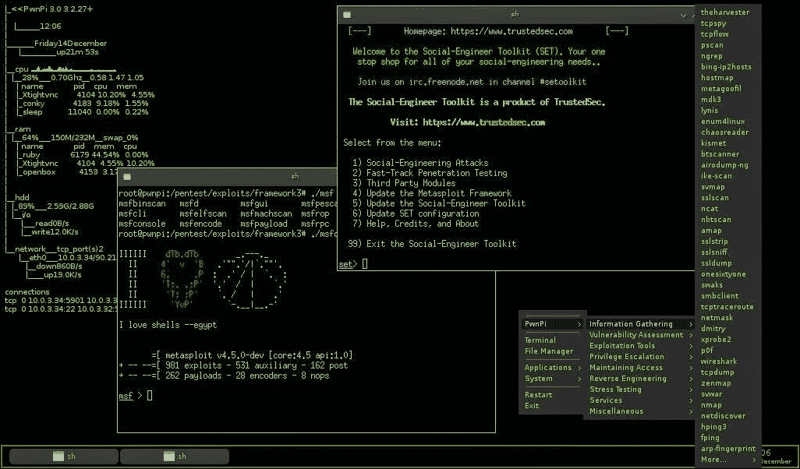

要启动 PwnPi 中的任何工具，只需导航到`/pentest`目录。您会在这个位置找到所有的工具。例如，如果您想运行**社会工程师工具包**，只需在终端窗口中输入`/pentest/exploits/se-toolkit`。这将启动该工具。您可以浏览目录以查找其他工具。查看前几章，了解如何使用 Kali Linux 和 PwnPi 中发现的其他流行工具的信息。

下面的屏幕截图显示了**社会工程师工具包**的启动：

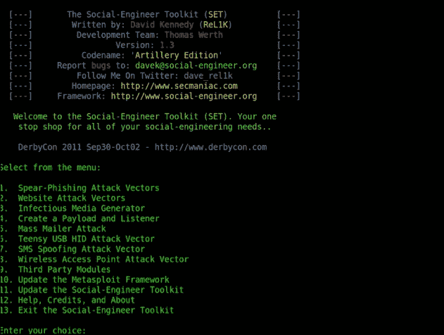

### 注意

大多数安全发行版将把它们的工具放在`/pentest`目录中。如果您使用的是相同版本的工具，那么各个发行版中的实际工具本身是完全相同的。

# 树莓派 Pwn

Raspberry Pwn 来自带给您 Pwn Pad 和 Pwn Phone 的同一个团队。这个基于 Debian 的发行版将拥有您喜爱的工具，如 SET、Wireshark、dnswalk 和各种无线测试应用程序。可以将其视为包含许多类似工具的 Kali Linux 的替代品。

Raspberry Pwn 的安装过程与典型的 ARM 镜像不同。这是因为 Raspberry Pwn 基本上是建立在 Raspbian 操作系统之上的。

让我们看看如何使用以下步骤安装和运行 Raspberry Pwn：

1.  您需要首先下载基本的 Debian 树莓派（Raspbian）发行版，可以在[`www.raspberrypi.org/downloads`](http://www.raspberrypi.org/downloads)找到。这些镜像文件不断更新，所以在撰写本书时，我们使用了`2014-09-09-wheezy-raspbian.img`命令，效果很好。

1.  您需要使用第一章中介绍的过程来安装此镜像，*树莓派和 Kali Linux 基础*。安装 Debian 镜像的命令是`sudo dd if=2014-09-09-wheezy-raspbian.img of=/dev/disk2`。

1.  安装完成后，将 microSD 卡插入树莓派，并确保通过以太网端口连接到提供互联网访问的活动端口。

1.  使用`sudo –i`命令成为 root 用户。

1.  通过 ping `google.com`来测试网络连接。确认您有网络连接后，输入`apt-get update`来更新固件。这应该只需要几分钟。

1.  更新过程完成后，输入`apt-get install git`，如前面的屏幕截图所示。然后输入`git clone https://github.com/pwnieexpress/Raspberry-Pwn.git`命令，下载 Raspberry Pwn 软件，如下面的屏幕截图所示：

1.  几分钟后，您应该准备好安装软件了。使用`cd Raspberry-Pwn`进入`Raspberry-Pwn`目录，然后输入`./INSTALL_raspberry_pwn.sh`来安装软件，如下面的屏幕截图所示：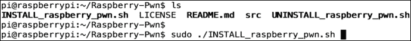

这个过程应该需要 10-20 分钟。

1.  安装完成后，您将进入`raspberrypi login #`命令提示符。使用默认的 Debian 登录，用户名为`pi`，密码为`raspberry`。如果您更改了 Raspbian 登录信息，请使用更改后的信息。

1.  现在运行`apt-get update`和`apt-get upgrade`通常不是一个坏主意。

要访问可用的工具，请转到`/pentesting`文件夹。在该文件夹中，您将找到许多流行的渗透工具中看到的各种工具。

### 注意

警告：如果输入`startx`，它只会启动 Raspbian 的**K 桌面环境**（**KDE**）。它没有任何特定于 Raspberry Pwn 安装的内容，并且可能会导致损坏。我们建议不要使用 KDE 桌面，只使用命令行功能。

Raspberry Pwn 是一个非常高效的工具包，非常适用于网络嗅探、使用 SET 进行社会工程攻击以及其他类似工具。它没有 Kali 那样的深度和广度，但它在性能上弥补了这一不足。尽管它目前还不支持，但我们希望 Pwnie Express 能够添加 Raspberry Pwn 通过 Pwnie Express 的中央管理控制台进行集中管理的功能，使 Raspberry Pwn 成为该架构的廉价传感器。

以下截图显示了 Pwnie Express 发布的 Raspberry Pwn：

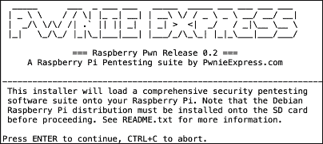

# PwnBerry Pi

PwnBerry Pi 被宣传为“另一个用于 Raspberry Pi 的渗透测试套件”，它拥有许多与 Kali Linux 相同的工具。同事和其他专业人士告诉我们（本书的作者）PwnBerry Pi 的创建者在优化这个平台用于基于 Web 的攻击方面做得很好。然而，在我们自己的个人测试中并没有体验到这一点。

还应该注意的是，最佳做法是不要从低端系统（如 Raspberry Pi）使用许多用于基于 Web 的渗透测试所需的工具。例如，PwnBerry Pi 包括 BeEF 的安装文件，而不是安装它，因为大多数渗透测试人员不会从 ARM 镜像运行此应用程序。如果在这个 ARM 镜像上安装 BeEF，您将看到 PwnBerry Pi 开发团队添加的警告横幅，声称他们在使用 PwnBerry Pi 镜像时遇到了不稳定的行为。

让我们看看如何安装 PwnBerry Pi。PwnBerry Pi 的安装过程与 Kali Linux 不同，但与 Raspberry Pwn 的过程类似。您将下载 Raspbian 镜像，并以以下方式在该镜像上运行 PwnBerry Pi：

1.  您需要首先下载在[`www.raspberrypi.org/downloads`](http://www.raspberrypi.org/downloads)找到的基本 Debian 发行版。这些镜像文件正在不断更新，因此在撰写本书时，我们使用了`2014-09-09-wheezy-raspbian.img`镜像文件，效果很好。

1.  使用第一章中介绍的过程安装镜像，*Raspberry Pi 和 Kali Linux 基础*。安装 Debian 镜像的命令是`sudo dd if=2014-09-09-wheezy-raspbian.img of=/dev/disk2`，假设您的 microSD 被视为`disk2`。

1.  安装完成后，将 microSD 卡插入 PwnBerry Pi，并确保通过以太网端口连接到提供互联网访问的活动端口。

1.  使用`sudo –i`命令成为 root 用户。

1.  通过 ping `google.com`来测试网络连接。确认您有网络连接后，输入`apt-get update`和`apt-get upgrade`来更新固件。这应该只需要几分钟。

1.  升级过程完成后，输入`apt-get install git`，然后输入`git clone https://github.com/g13net/PwnBerryPi.git`来下载 PwnBerry Pi 软件。

1.  几分钟后，您应该准备安装软件。转到 PwnBerry Pi 目录，使用`cd PwnBerry Pi`并输入`./install-pwnberrypi.sh`来安装软件。这个过程应该需要 10-20 分钟。

1.  安装完成后，您将看到**PwnBerry Pi Release 1.0 安装成功！**和一个命令提示符`raspberrypi login #`。使用默认的 Debian 登录访问终端，用户名为`pi`，密码为`raspberry`。

与许多其他发行版一样，PwnBerry Pi 的工具存储在一个名为`pentest`的文件夹下，通过终端窗口使用`cd /pentest`命令访问。一旦您访问了`pentest`文件夹，您将看到一堆包含各种可安装的渗透测试工具的文件夹。以下截图显示了从 GUI 打开终端，并使用`ls`命令列出目录中的所有文件夹。每个文件夹都标有一组可用工具的标签。

### 注意

警告：您不应该使用`startx`命令，因为它会在 Raspbian 上启动 KDE。运行 KDE 对 PwnBerry Pi 没有任何意义，可能会导致运行 PwnBerry Pi 工具时出现问题。

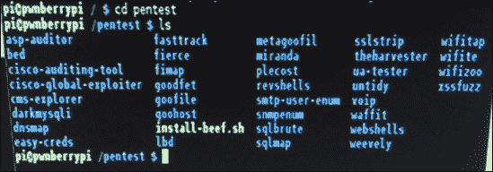

有一些值得注意的例外。Metasploit 位于`/opt/msf3`目录下。您会注意到这是一个较旧的版本的 Metasploit。更新版本与 PwnBerry Pi 无法正常工作。然而，这个特定版本的 Metasploit 在性能方面表现得相当不错。

### 注意

请注意，并非所有工具都是预安装的。您必须先安装工具才能使用。

我们的测试发现，一些工具运行正常，而其他工具则显示了关于在树莓派上使用可能存在问题的警告横幅。总的来说，PwnBerry Pi 是一个不错的选择，但是我们建议使用更成熟的工具，比如 Kali Linux 或 PwnPi。

# 保护您的网络

本书的大部分内容涵盖了攻击场景。不幸的是，有一天您可能会经历对自己系统的攻击。这意味着您的安全防御措施将受到挑战，希望您有正确的工具来识别并阻止入侵对组织造成的损害。

我们要明确指出，*树莓派不是用于网络防御的理想工具*。最佳实践是层层叠加安全解决方案，提供各种功能，如应用层控制、有状态防火墙、入侵预防、访问控制、网络分割、恶意软件检测、网络监控、数据丢失等。大多数提供您需要应对当今网络上出现的威胁的保护级别的工具需要非常高的处理能力和大量存储空间。不幸的是，树莓派没有提供这一点。

如果您想在一个小型实验室中测试一些基本的安全概念，比如使用防火墙功能进行分割或使用 IDS 扫描基本威胁，树莓派可以作为一个不错的便携式实验室。一些 ARM 镜像声称非常适合家庭办公室保护，但是我们不建议使用树莓派来保护真实资产。

让我们首先看看如何将树莓派转变为 IDS/IPS。在本章的后面，我们将看看其他树莓派安全防御用例，比如如何将树莓派用作 VPN 服务器、内容过滤器或 Tor 节点。

## 入侵检测和预防

也许有一天您会成为网络入侵的受害者。最好的防御是在网络上覆盖多个点的多个安全解决方案，因此如果一个被绕过，其他工具可以识别并阻止攻击者。常见的防御工具包括防火墙和 IDS/IPS 解决方案等检测技术。

树莓派可以配置为低成本的 IDS/IPS，以保护您网络的一部分。显然，这只能被视为一个非常具体的目标，因为提供真正长期的 IPS/IDS 解决方案有更好的选择。树莓派没有足够的计算能力或存储空间来进行基本检测和预防之外的任何操作，因此请考虑这个选项用于实验和培训目的。

在考虑 IPS/IDS 时，首先要决定的是如何部署。典型的用例是在路由器和另一台设备之间，或者在系统和网络之间。您还可以作为入侵检测系统，这意味着设备是网络中的一个监听器，查看流量的副本，并且不具有任何执行能力。在我的例子中，我将使用 Snort 作为我的笔记本电脑和外部网络之间的内联 IPS，充当中间人。这对于连接到不受信任的网络而不使用 VPN 可能是理想的。这种设置将需要两个以太网端口，因此我将使用 USB 到以太网适配器来容纳第二个端口。

将树莓派部署为中间人攻击类似于在 IPS 部署中充当中间人。您需要将两个接口的 IP 地址都设置为`0.0.0.0`，并使用桥接工具将两个接口桥接在一起。我们在第三章*渗透测试*的*中间人*部分中介绍了这个过程。以下是用于将两个接口桥接在一起的命令的摘要：

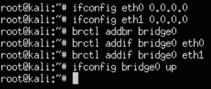

### Snort

今天最流行的开源 IDS/IPS 是 Snort，现在由思科公司拥有，因为其收购了 Sourcefire。在树莓派上使用 Snort 的主要问题是资源需求超出了树莓派所提供的范围。建议在运行 Snort 之前调整 Snort 的进程以获得良好的功能。

Snort 可以从 Kali Linux 安装中运行，但它不是预装的。

### 注意

确保在桥接接口之前下载并更新 Snort，否则您将无法访问互联网。一个可能的解决方法是添加第三个无线或以太网适配器，以便在利用其他两个端口进行桥接时为更新提供互联网访问。

让我们看看在建立中间人桥之后如何安装和使用 Snort：

1.  第一步是使用以下命令下载所需文件：

```
sudo apt-get install flex bison build-essential checkinstall libpcap-dev libnet1-dev libpcre3-dev libmysqlclient15-dev libnetfilter-queue-dev iptables-dev

```

1.  Snort 还需要一些 Kali Linux ARM 镜像中没有的库。为了使 Snort 正常运行所需的库，请输入以下命令：

```
wget https://libdnet.googlecode.com/files/libdnet-1.12.tgz

```

1.  接下来，您需要使用`tar –zxvf libdnet-1.12.tgz`命令解压文件。解压文件后，使用`cd`命令导航到该目录。

1.  您将通过输入`./configure CFLAGS="-fPIC"`命令来更改`CFLAGS`变量，以便为 64 位操作系统进行配置。完成此操作后，输入`make`命令。

1.  接下来，您需要从`libdnet`的位置建立到 Snort 期望`libdnet`位于的符号链接。输入以下命令来执行此操作：

```
ln -s /usr/local/lib/libdnet.1.0.1 /usr/lib/libdnet.1

```

1.  现在，您需要转到用于 Snort 的目录。我们通过在命令行中的桌面文件夹中使用`mkdir snort`命令或在 GUI 中右键单击桌面并选择它来创建一个名为`snort`的新目录。

1.  接下来，我们需要下载 Snort 数据采集库。输入`wget https://www.snort.org/downloads/snort/daq-2.0.4.tar.gz`命令来执行此操作。请注意，我们使用的版本可能与可用版本不同。请检查[snort.org](http://snort.org)以确保您使用的是最新版本。

1.  使用以下命令下载 Snort：

```
wget https://www.snort.org/downloads/snort/snort-2.9.7.0.tar.gz

```

1.  接下来，我们将使用以下命令解压并安装 Snort 数据采集库：

```
tar -zxvf daq-2.0.4.tar.gz
cd daq-2.0.4
./configure; make; sudo make install

```

1.  最后一步是下载 Oinkcode 或社区规则。**Oinkcode**规则是与现有 Snort 用户帐户关联的唯一密钥。如果您没有 Oinkcode 规则，可以下载社区规则。

1.  我们将使用 `wget https://www.snort.org/rules/community` 命令下载社区规则。这应该会在您的目录中下载一个名为 `community.tar.gz` 的文件。您需要使用 `tar xvfz community.tar.gz -C /etc/snort/rules` 命令来解压缩文件。

### 注意

在某些情况下，您可能需要向文件添加一个扩展名。如果您只看到 community 或一些没有 `.tar.gz` 扩展名的变体，请键入 `mv community community.tar.gz` 命令。

1.  现在我们准备安装 Snort。要安装 Snort，请键入 `apt-get install snort`。您将收到一个提示来配置 Snort 接口的 IP 地址和子网掩码，如下面的屏幕截图所示：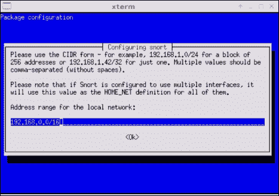

您应该看到 Snort 完成其安装过程，如下面的屏幕截图所示：

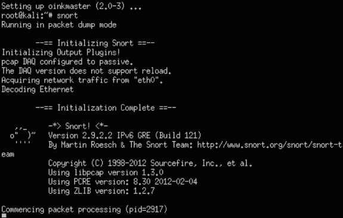

您已成功配置了 Snort。从这一点开始，您可以使用 `snort` 命令分析通过您在之前步骤中设置的网络桥传输的流量。我们可以写一本关于 Snort 的整本书，也有一些专门讨论这个主题的书籍。如果您对 Snort 不熟悉，我们建议您访问 [www.snort.org](http://www.snort.org)。

启动 Snort 最简单的方法就是键入 `./snort –i eth0`；这将启动 Snort 并监听以太网 `0`。还有许多更高级的配置，允许您捕获并将所有内容运行到一个 syslog 服务器进行进一步分析。默认情况下，Snort 会将所有内容记录到终端屏幕上，如下面的屏幕截图所示。如果难以看清，不用担心，因为消息在屏幕上滚动得很快，这就是为什么大多数人会将其记录到外部 syslog 服务器的原因。

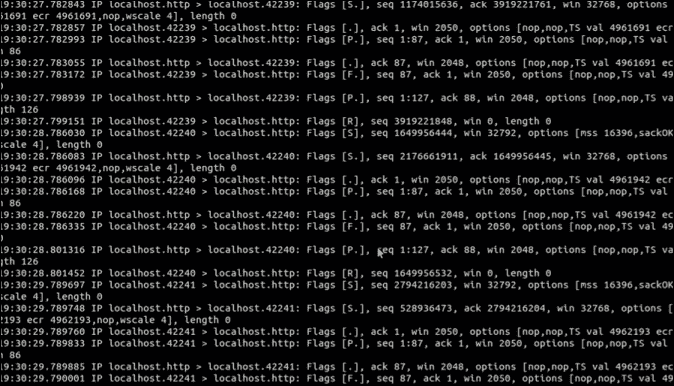

您可能要采取的一个额外步骤是设置 Snort 自动启动，方法是创建一个脚本。这通常只用于将树莓派专用于 Snort 的情况。以下示例显示了如何创建一个脚本，在启动树莓派时自动启动 snort：

```
autostart-IDS.sh
#!/bin/bash
# Configures the virtual bridge between the two physical interfaces.
ifconfig eth0 0.0.0.0
ifconfig eth1 0.0.0.0
brctl addbr bridge0
brctl addif bridge0 eth0
brctl addif bridge0 eth1
ifconfig bridge0 up
# Configures Snort and TCPdump tools to begin listen and inspecting
# the network traffic that travels through the bridge interface.
TCPdump -i bridge0 -w /root/IDS-log/networkdump/network-traffic-$(date +%y%m%d).cap &
Snort -i bridge0 -v |tee /root/IDS-log/snortdump/Snort-dump-$(date +%y%m%d) &

```

## 内容过滤器

内容过滤器用于控制读者在浏览互联网时被授权访问的内容类型。旧的内容过滤器需要基于更新 URL 列表的手动调整，然而，大多数商业产品提供的内容类别会自动更新为新的网站标签。需要内容过滤器的最常见用例是阻止商业网络中的不当内容，如色情内容。通常，内容过滤器与网络代理或应用层防火墙提供的功能捆绑在一起。

让我们看看如何将树莓派变成家庭办公室内容过滤器。这对于希望保持其个人网络适合儿童的父母来说非常有用。

### KidSafe

KidSafe 用于在用户浏览互联网时过滤不当内容。KidSafe 通过使用 Squid 代理的开源 Web URL 过滤服务来实现这一点。这使得父母可以通过易于使用的 GUI 控制他们孩子的互联网体验。

KidSafe 可以安装在包括树莓派的 Kali Linux 在内的任何基于 Linux 的系统上。该应用适用于低功耗、低成本的计算系统，非常适合家庭使用。我们建议在 Raspbian 操作系统上安装 KidSafe，这样您就不必担心设置 Kali Linux 相关的额外设置。购买树莓派时，通常会默认安装 Raspbian ARM 映像。但是，您也可以从 [`www.raspberrypi.org/downloads/`](http://www.raspberrypi.org/downloads/) 下载它。安装过程类似于我们在第一章中安装 Kali Linux 的过程，*树莓派和 Kali Linux 基础*。

步骤如下：

1.  为了为 KidSafe 做好准备的第一步是将默认的**动态主机配置协议**（**DHCP**）行为更改为静态地址，这样我们就不必担心 IP 地址的变化。诸如 PC 和手机之类的客户端将代理到这个 IP 地址，以连接到互联网，因此重要的是确保选择一个可被网络上其他设备访问的静态地址。同样重要的是它是静态的，这样端点就不必调整其代理设置。我们可以通过以下方式来实现这一点：

1.  让我们将我们的 IP 地址更改为静态地址。

1.  键入`ifconfig`命令以查看您的网络接口。您应该看到类似于以下截图所示的内容。运行命令时请注意您看到的内容。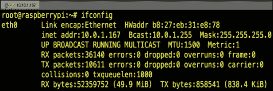

1.  您将编辑网络接口文件。我们将使用`vi`，但您可以使用您喜欢的编辑器。键入`sudo nano /etc/network/interfaces`命令。此命令的启动如下截图所示：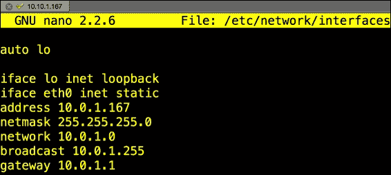

1.  查找接近`iface eth0 inet dhcp`的行。您将把该行更改为静态地址。在我们的示例中，我们将使用命令更改为静态 IP`10.0.1.167`，子网掩码为`255.255.255.0`，默认网关为`10.0.1.1`，如下截图所示：


1.  现在，让我们使用`sudo apt-get install tor`命令安装 Tor。

1.  接下来，使用`sudo apt-get install squid3`命令安装 Squid。

1.  接下来，使用`sudo apt-get install lighttpd`命令安装一个轻量级的 Web 服务器。

1.  KidSafe 需要 PHP。要安装 PHP，请使用`sudo apt-get install php5-common php5-cgi php5 php5-mysql`命令。您需要使用`sudo lighty-enable-mod fastcgi-phpa`命令启用 PHP 脚本。

1.  此时，您需要使用`sudo service lighttpd force-reload`命令重新加载服务器。

1.  下一步是安装 PHP 的 GUI 管理工具。这不是必需的，但我们建议安装，因为它可以更轻松地管理 PHP。要安装 GUI 管理工具，请使用`sudo apt-get install phpmyadmin`命令。安装完成后，您将能够通过访问`http://localhost/phpmyadmin/`来从 Web 浏览器管理 PHP。

1.  接下来，我们将通过键入`sudo chown www-data:www-data /var/www`命令更改目录所有者和组。我们还需要使用`sudo chmod 775 /var/www`命令更改我们的目录权限。

1.  如果您没有用户名，请使用`sudo adduser proxy`命令创建一个。另外，确保使用`sudo passwd proxy`命令更改您的用户名的密码。您将使用`sudo usermod -a -G www-data proxy`命令将您的用户名添加到目录组，以便赋予其管理权限。

1.  切换到`/opt`目录。您可以通过键入`sudo cd /opt`来实现。确保您使用`cd`命令处于`/opt`目录中。

1.  接下来，我们将下载一个辅助应用程序，用于更轻松地配置代理和 Squid 设置。转到[`www.penguintutor.com/software/squid-kidsafe/0.2.0/kidsafe-squidapp-0.2.0.tgz`](http://www.penguintutor.com/software/squid-kidsafe/0.2.0/kidsafe-squidapp-0.2.0.tgz)下载该应用程序。您可以通过在命令行中键入`sudo wget http://www.penguintutor.com/software/squid-kidsafe/0.2.0/kidsafe-squidapp-0.2.0.tgz`来实现。确保您处于`/opt`目录中。

### 注意

检查您是否正在使用和下载最新版本。如果没有，请将其调整为最新版本；在下载文件时，最有可能只有版本号会发生变化。

1.  使用`sudo tar –zxvf kidsafe-squidapp-0.2.0.tgz`命令解压文件。

1.  使用您喜欢的编辑器编辑`/opt/kidsafe/kidsafe.squid3.inc`文件。转到文件的最后一行，并将`192.168.0.3`地址更改为您的 IP 地址。

1.  将`acl local_acl dst 192.168.0.0/16`更改为适合您子网的内容。

1.  您需要将 Squid 文件与 KidSafe 文件合并。通过输入`include /opt/kidsafe/kidsafe.squid3.inc`来执行此操作。

1.  几个文件将需要更改或更新其权限。输入以下命令：

```
cd /opt/kidsafe
sudo chown :www-data .
sudo chmod 775 .
sudo chown :proxy kidsafe.py
sudo chmod 770 kidsafe.py
sudo chown :www-data kidsafe.rules kidsafe.session
sudo chmod 664 kidsafe.rules kidsafe.session

```

1.  现在您可以在`/var/www`目录中下载并安装 KidSafe 应用程序。要下载 KidSafe，请输入`sudo wget kidsafe-webapp-0.2.0.tgz`。确保您在`/var/www`目录中。还要注意您正在下载的版本，因为它可能与我们使用的示例不同。

1.  使用以下命令解压文件：

```
sudo tar -xvzf /home/pi/kidsafe-webapp-0.2.0.tgz

```

1.  现在打开一个网页浏览器，转到`http://localhost/phpmyadmin/`。点击**数据库**，选择**创建新数据库**。将数据库命名为`kidsafe`。我们将数据库类型设置为**本地**，如下截图所示：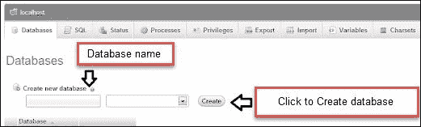

1.  **密码**将设置为：<如`kidsafe-config.php`文件中定义的>。保存并应用配置。在**特定于数据库的权限**菜单中选择`kidsafe`数据库。对于**权限**，只选择**SELECT**，**INSERT**，**UPDATE**，**DELETE**。对于**授权**，选择**否**。对于**特定于表的权限**，选择**否**。

1.  现在点击标签页左侧的**数据库**按钮。转到**SQL**标签页，并执行来自[`www.penguintutor.com/software/squid-kidsafe/0.2.1/kidsafe-database.txt`](http://www.penguintutor.com/software/squid-kidsafe/0.2.1/kidsafe-database.txt)的命令（只需复制并粘贴）。

### 注意

或者，您也可以在[`www.drchaos.com/wp-content/uploads/2014/11/kidsafe-database.txt`](http://www.drchaos.com/wp-content/uploads/2014/11/kidsafe-database.txt)获取相同的文件。

以下截图显示了**phpMyAdmin**页面：

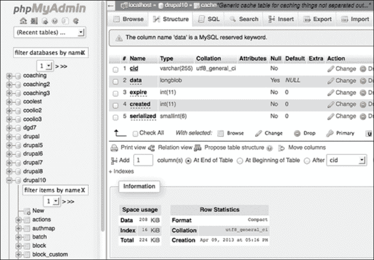

### 注意

您的 PHP 页面将与我们的页面有很大不同。这是因为我们正在运行多个应用程序和数据库。

1.  您应更改`log`文件的权限。输入以下命令：

```
cd /var/log/squid3
sudo touch kidsafe.log
sudo chown :www-data kidsafe.log

```

设置现在已经完成。您可以通过转到`http://localhost/kidsafe`来配置规则、登录和其他设置。

### 注意

有关如何使用 KidSafe 的更多信息，请访问[`www.penguintutor.com/linux/raspberrypi-kidsafe`](http://www.penguintutor.com/linux/raspberrypi-kidsafe)。

以下截图显示了 KidSafe 管理的**网站被阻止**页面：


### 提示

不要手动管理您想要阻止的网站。从[`www.squidguard.org/blacklists.html`](http://www.squidguard.org/blacklists.html)下载免费的黑名单，以获取已分类数百万个网站的更新列表。

## 使用 OpenVPN 进行远程访问

**虚拟专用网络**（**VPN**）是许多组织的基本安全要素。 VPN 提供了一种直接连接到远程网络的方法，就好像您在现场一样，并使用加密保护客户端和连接网络之间的流量。这可以防止许多中间人攻击，并允许人们在办公室外更加高效。 OpenVPN 可以将树莓派转变为 VPN 集中器，以极低的成本提供这些和其他好处。

让我们看看如何通过以下步骤将树莓派转变为 VPN 集中器：

1.  第一步是通过 NOOBS 软件包或直接从树莓派网站按照第一章中的步骤安装最新的 Raspbian 镜像，*树莓派和 Kali Linux 基础*。

1.  我们还建议根据 Kali Linux 中指定的`apt-get update`和`apt-get upgrade`命令更新您的镜像，详见第一章中的*树莓派和 Kali Linux 基础*。

1.  由于此解决方案的目标是面向外部，我们强烈建议在开始 OpenVPN 配置之前更改默认密码。

### 注意

在使用`sudo –i`命令之前，您需要成为`root`用户才能启动更新和升级命令。

1.  一旦你的 Raspbian 构建升级完成，你需要确定一个外部网络可访问的 IP 地址，你计划从中连接。你还需要选择一个连接的端口，比如 UDP 流量的端口 1194。这意味着你需要在路由器和防火墙上打开 1194 端口的转发。你可以使用不同的端口或协议，比如 TCP，取决于你在路由器和防火墙上愿意打开的内容。

1.  大多数操作系统默认情况下都没有安装 OpenVPN，所以你需要使用`apt-get install openvpn`来安装它，如下图所示: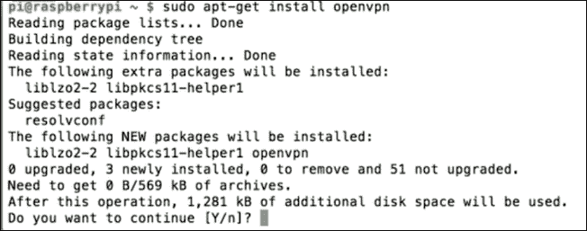

1.  接下来，你将想要生成密钥来保护你的 VPN 服务器。我们将使用`easy-rsa`来实现这个目的。你需要成为`root`用户，所以确保在继续之前输入`sudo –s`。使用以下命令将`easy-rsa/2.0`文件夹中的所有内容复制到`easy-rsa`文件夹中:

```
cp –r /usr/share/doc/openvpn/examples/easy-rsa/2.0 /etc/openvpn/easy-rsa

```

### 提示

这种类型的证书对于小型 VPN 部署来说是可以的。但是，如果这个规模扩大，你可能需要考虑使用 OpenSSL 生成一个**证书签名请求**（**CSR**）并通过受信任的证书颁发机构进行签名。

1.  接下来，进入`easy-rsa`文件夹，使用`cd /etc/openvpn/easy-rsa`。如果输入`ls`，你应该看到一个名为`vars`的文件。我们想要编辑它，所以输入`nano vars`。现在，找到并更改`EASY_RSA`变量为`export EASY_RSA="/etc/openvpn/easy-rsa"`。下面的截图显示了第 13 行的这个调整: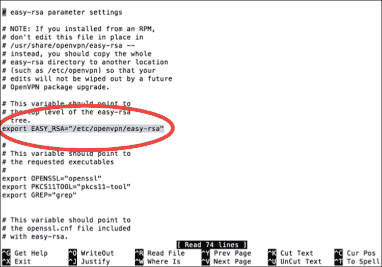

1.  如果你很谨慎，你可以将加密方法从 1024 位增加到 2048 位。只需找到声明`export KEY_SIZE=1024`的行，并将值增加到`2048`。完成后，输入*Ctrl* + *X*保存更改。

1.  现在我们需要构建一个**证书颁发机构**（**CA**）证书和根 CA 证书。树莓派将充当自己的证书颁发机构，并签署 OpenVPN 密钥。您应该仍然在`easy-rsa`文件夹中。输入`source ./vars`以加载`vars`文档。输入`./clean-all`以删除任何先前的密钥。

1.  输入`./build-ca`来构建你的证书颁发机构。你将被问及关于你居住的地方、公司名称等一系列问题。下面的截图显示了我运行前面命令后的第一个问题: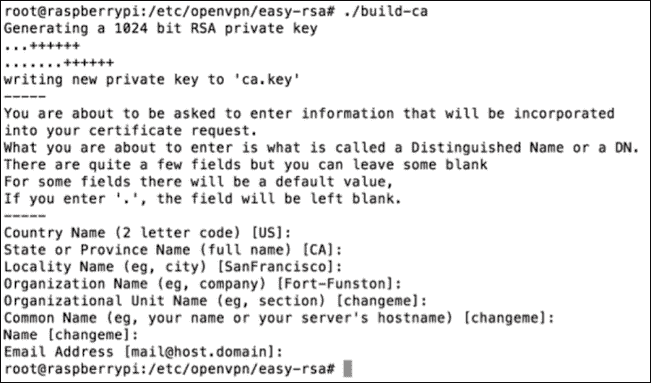

1.  在完成关于电子邮件地址的最后一个问题后，你可以使用`./build-key-server [Server_Name]`命令为服务器命名。再次，你将不得不回答一些可选字段。确保这一次使用你选择的**通用名称**字段的名称，这应该是默认的名称。你还必须将**挑战密码**字段留空。

1.  你将收到一条消息，说你的证书将在 3650 天后签署，并询问你是否要提交。选择是（**y**），它将生成你的证书。

1.  现在服务器端已经准备好了，让我们也为“客户端”（也称为用户）生成密钥。例如，我们将为我们的笔记本电脑创建一个密钥。为此，使用`./build-key-pass [UserName]`命令。所以对于我们的例子，用户名是`laptop1`。它会要求你记住一个密码短语。填写好并按照提示进行。确保将**挑战密码**字段留空。确认签署证书，它将显示数据库已更新。

1.  使用`cd keys`进入`keys`文件夹，然后输入`openssl rsa –in laptop1.key –des3 –out laptop1.3des.key`。这将对每个数据块应用称为 des 加密三次的`des3`。

1.  在这一点上，你已经创建了一个服务器证书和一个客户端证书。如果你想为其他设备创建证书，可以重复客户端过程。完成后，使用`cd`返回`easy-rsa`文件夹，这样你就可以生成 Diffie-Hellman 密钥交换。输入`./build-dh`来执行这个命令。

### 注意

在使用`./build-dh`命令之前，您可能会收到首先输入`source /vars`的提示。在重新运行`./build-dh`命令之前运行该命令。

这可能需要一些时间，具体取决于您的加密大小。如果您之前将加密升级到 2048 位，那么需要等待更长时间。我们使用的是 1024 位，所以完成需要几分钟。

1.  下一步是使用**基于哈希的消息认证码**（**HMAC**）密钥启用**拒绝服务**（**DoS**）保护。这将使树莓派在尝试验证访问请求之前首先要求一个静态密钥。这可以阻止攻击者用随机重复的请求攻击服务器。使用`openvpn –genkey –secret keys/ta.key`命令启用此功能。

1.  到目前为止，我们已经生成了密钥并让 CA 对其进行签名。现在让我们配置 OpenVPN。我们首先需要创建一个`.conf`文件，OpenVPN 将使用它来列出我们要连接的位置和连接类型等信息。输入`nano /etc/openvpn/server.conf`。这将在`openvpn`文件夹中打开一个空白文档。使用以下命令配置 OpenVPN：

### 提示

确保根据评论要求调整到您的网络，评论要求您提供信息。

```
local 192.168.2.0 # CHANGE THIS TO YOUR RASPBERRY PI IP ADDRESS
dev tun
proto udp. # This is the protocol
port 1194
ca /etc/openvpn/easy-rsa/keys/ca.crt
cert /etc/openvpn/easy-rsa/keys/Server.crt # USE YOUR CERT NAME YOU CREATED
key /etc/openvpn/easy-rsa/keys/Server.key # USE YOUR KEY NAME YOU CREATED
dh /etc/openvpn/easy-rsa/keys/dh1024.pem # IF YOU CHANGED THE ENCRYPTION SIZE ADJUST THIS
server 10.8.0.0 255.255.255.0
# These are the server and remote endpoints
ifconfig 10.8.0.1 10.8.0.2

# This adds a route to Client routing table for the OpenVPN Server
push "route 10.8.0.1 255.255.255.255"
# This adds a route to Client routing table for the OpenVPN Subnet
push "route 10.8.0.0 255.255.255.0"
# This is your local subnet
push "route 192.168.2.0 255.255.255.0" # CHANGE THIS TO YOUR RASPBERRY PI IP ADDRESS
# Set primary domain name server address to the Router
push "dhcp-option DNS 8.8.8.8"
push "redirect-gateway def1"
client-to-client
duplicate-cn
keepalive 10 120
tls-auth /etc/openvpn/easy-rsa/keys/ta.key 0
cipher AES-128-CBC
comp-lzo
user nobody
group nogroup
persist-key
persist-tun
status /var/log/openvpn-status.log 20
log /var/log/openvpn.log
verb 1

```

完成后按*Ctrl* + *X*保存。

1.  现在，我们需要创建另一个文件来配置树莓派以转发 Internet 流量。为此，让我们使用`nano /etc/sysctl.conf`命令编辑一个名为`sysctl.conf`的文件。查找接近顶部的一行，其中写着**#取消注释下一行以启用 IPv4 的数据包转发并删除#**，取消注释它。这将告诉树莓派转发 Internet 流量，而不仅仅是接收。按*Ctrl* + *X*保存更改。

1.  接下来，输入`sysctl –p`以应用更改。`sysctl`命令在运行时配置内核参数。

1.  关于 VPN 的一切应该都已经准备就绪，但是 Raspbian 防火墙将阻止传入的连接。此外，当树莓派重新启动时，默认情况下 Raspbian 的防火墙配置会重置。我们需要使用脚本确保树莓派记住始终允许 OpenVPN 连接。使用`nano /etc/firewall-openvpn-rules.sh`命令打开一个空白的可执行文件。在文件中输入以下命令：

```
#!/bin/sh
iptables -t nat -A POSTROUTING -s 10.0.2.0/24 -o eth0 -j SNAT --to-source 192.168.X.X.

```

1.  命令中的`10.0.2.0/24`是连接到 VPN 的树莓派客户端的默认地址。您需要将其更新为您的树莓派 IP 地址。请注意，脚本将`eth0`接口指定为面向外部的接口。按*Ctrl* + *X*保存更改。

1.  您需要通过更新`etc/firewall-openvpn-rules.sh`文件的权限和所有权将其更改为可执行文件。我们需要将模式更改为`700`，意味着所有者可以读取、写入、执行，并将所有者更改为`root`。执行以下命令：

```
chmod 700 /etc/firewall-Openvpn-rules.sh
chown root /etc/firewall-Openvpn-rules.sh

```

1.  我们需要将此脚本放入接口设置代码中，以便在启动时运行。这将为 OpenVPN 打洞，使其正常运行。输入`nano /etc/network/interfaces`，查找声明`iface eth0 inet dhcp`的行，并在该行下方缩进添加一行`pre-up /etc/firewall-openvpn-rules.sh`。按*Ctrl* + *X*保存更改。

1.  使用`sudo reboot`重新启动您的树莓派。

恭喜，您现在拥有一个完全功能的 VPN 集中器！

现在让我们下载一个 OpenVPN 客户端，并使用以下步骤重新连接到我们的树莓派 OpenVPN 服务器。有各种可用的 OpenVPN 客户端。我们实际上更喜欢来自 SparkLabs 的 Viscosity。

1.  访问[`www.sparklabs.com/viscosity/`](https://www.sparklabs.com/viscosity/)下载 Viscosity 客户端。

### 注意

有许多可用的 OpenVPN 客户端，包括许多免费的客户端。其他客户端的步骤将类似。

以下截图显示了 Viscosity 客户端的**首选项**窗口：

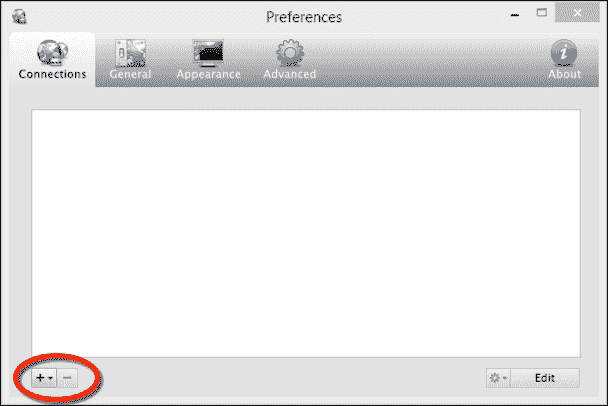

1.  安装客户端后，您需要添加一个新连接。输入 VPN 服务器的 IP 地址，以便客户端知道要连接到哪里。这是您的树莓派服务器的可达 IP 地址。以下屏幕截图显示了**新连接**窗口的**常规**选项卡：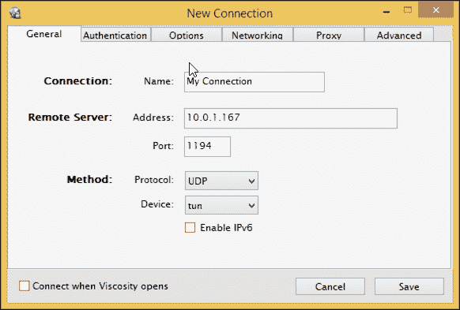

1.  接下来，点击**认证**选项卡。在下拉列表中，选择**PKCS12**。我们有不同的认证方案可用，但是，如果您记得我们设置系统时生成了客户端证书。我们可以简单地选择**PKCS12**证书并将其直接导入到我们的客户端。

### 注意

您需要返回到您的树莓派并导出您的客户端证书，以便在此步骤之前导入它。您可以简单地将客户端证书保存在 USB 驱动器上或通过电子邮件发送给自己。

以下屏幕截图显示了**认证**选项卡下的菜单：

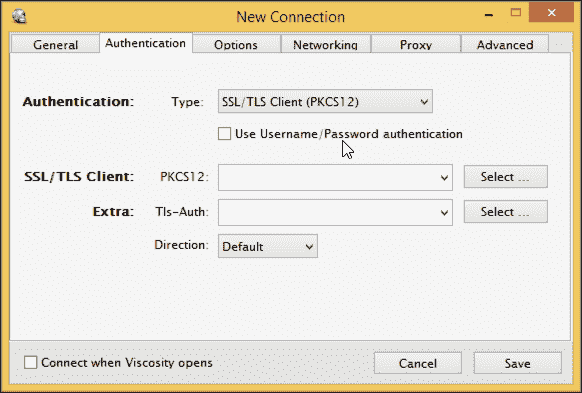

1.  现在，您可以单击**保存**，然后右键单击连接，并单击**连接**，如下图所示：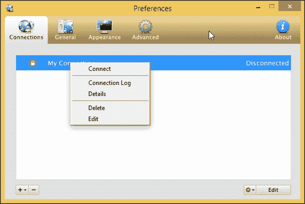

您现在已连接到您的 OpenVPN 服务器。

## Tor 中继和路由器

Tor，有时被称为洋葱路由，用于通过一系列志愿节点和服务进行路由和伪装流量的匿名访问互联网。使用 Tor 可以使跟踪互联网使用变得困难。当您想要防御可能用于侵犯您的隐私的不必要的流量分析时，这是理想的选择。有关 Tor 的详细信息可以在[`www.torproject.org/`](https://www.torproject.org/)找到。

Tor 中继通过随机选择系统来用作通信的路径。端点通过使用特殊软件访问 Tor 网络，将流量推送到 Tor 网络中。以下图表显示了两个系统如何在 Tor 网络上来回通信的不同路径：

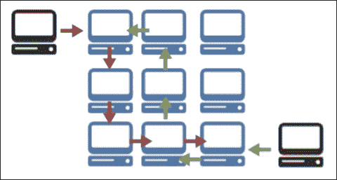

树莓派可以配置为 Tor 节点和 Tor 路由器。Tor 节点充当通过其他用户流量的系统，这意味着它是 Tor 网络的一部分，帮助其他人在访问互联网时保持匿名。Tor 路由器充当内部网络进入 Tor 网络的入口点，因此通过路由器上网的所有设备的流量都将通过 Tor 网络进行随机化。Tor 路由器取代了每个用户都运行特殊的 Tor 软件来访问 Tor 网络的需要，因为所有流量都通过路由器路由到 Tor。

让我们看看如何将树莓派变成 Tor 节点和 Tor 路由器。

### 树莓派 Tor

您可以将运行 Kali Linux 的树莓派变成 Tor 节点，以便参与 Tor 项目。

### 注意

运行 TOR 节点可能会有法律或道德约束和要求。我们建议您在运行 Tor 之前进行研究，以完全了解其含义。运行 TOR 节点可能意味着匿名用户将使用您的互联网连接进行可能的恶意或非法活动。此外，随着丝绸之路 2.0 的关闭和其他执法逮捕，Tor 的匿名性最近受到质疑。

如果您打算使用 Kali Linux 树莓派参与 Tor 网络，您需要使用以下步骤进行一些清理工作：

1.  首先，关闭树莓派上运行的任何多余服务或应用程序。如果不确定，请从干净的安装开始，或者改用 Raspbian 发行版。

1.  更改您的`root`密码。使用至少十二个字母数字字符。

1.  我们将安装`sudo`软件包并添加`tor`用户名。这样，您就不必使用`root`用户名。我们还将更新和升级我们的软件；使用以下步骤：

```
apt-get install sudo
adduser tor
passwd tor
apt-get update
apt-get upgrade

```

1.  我们还需要将`tor`帐户添加到`sudoers`列表中。您可以通过编辑`/etc/sudoers`文件来实现这一点。输入`sudo visudo`命令，然后添加`tor ALL=(ALL) ALL`行。

### 注意

`visudo`命令是编辑`sudoers`列表的传统和最常接受的方式。但是，在某些操作系统中，这个命令是不可用的。在这种情况下，您需要直接编辑`sudoers`文件。您可以使用`vi /etc/sudoers`命令来这样做。

以下屏幕截图显示了`/etc/sudoers`文件：

树莓派 Tor

1.  我们需要将 Kali Linux 的默认 DHCP 行为更改为静态地址。从技术上讲，我们可以保留 DHCP 地址，但很可能您需要设备上的静态地址。输入`ifconfig`命令以查看您的网络接口。您应该看到类似于下面屏幕截图所示的内容。记下这个：树莓派 Tor

您将编辑网络接口文件。我们将使用`vi`，但您可以使用您喜欢的编辑器。使用`sudo vi /etc/network/interfaces`命令。

查找类似于`iface eth0 inet dhcp`的行，如下面的屏幕截图所示：

树莓派 Tor

您将把该行更改为静态地址。在我们的示例中，我们将更改为静态 IP`10.0.1.167`，子网掩码为`255.255.255.0`，默认网关为`10.0.1.1`，使用以下命令：

```
iface eth0 inet static
address 10.0.1.167 <- chose an IP that fits to your network! This is only an example!
netmask 255.255.255.0 <- Apply the correct settings
network <- The IP network
broadcast <- enter the IP broadcast address
gateway 10.0.1.1 <- Enter your router or default gateway

```

以下屏幕截图显示了上述命令的启动：

树莓派 Tor

1.  现在，让我们安装 Tor。输入`sudo apt-get install tor`命令。编辑`/etc/tor/torrc`中的`tor config`文件。您需要添加或更改配置以匹配以下行。如果配置文件中有多余的内容，也没关系。

添加或更改以下内容以匹配配置：

```
SocksPort 0
Log notice file /var/log/tor/notices.log
RunAsDaemon 1
ORPort 9001
DirPort 9030
ExitPolicy reject *:*
Nickname xxx (you can chose whatever you like)
RelayBandwidthRate 100 KB # Throttle traffic to 100KB/s (800Kbps)
RelayBandwidthBurst 200 KB # But allow bursts up to 200KB/s (1600Kbps)

```

以下屏幕截图显示了`sudo apt-get install tor`命令的启动：

树莓派 Tor

1.  您需要确保从防火墙到树莓派的 TCP 端口 9030 和 9001 是打开的。您希望确保外部世界也可以联系到这些端口。您可能需要使用静态（或一对一）NAT 语句对树莓派进行**网络地址转换**（**NAT**）。如果您有家用路由器，有时称为**非军事区**（**DMZ**）或游戏端口。 

1.  重新启动系统。

1.  现在，使用 CLI 中的`sudo /etc/init.d/tor restart`命令启动 Tor。检查 Tor 的`log`文件以确保服务已启动。Tor 的`log`文件位于`/var/log/tor/log`中。您可以通过发出`less /var/log/tor/log`命令来查看`log`文件。查找条目**Tor has successfully opened a circuit. Looks like client functionality is working**。如果看到这个，您已经正确设置了系统。

此时，您很可能需要使用 Tor 客户端来连接 Tor 网络。有许多客户端适用于各种操作系统。以下是一些帮助您入门的链接：

+   Windows: [`www.torproject.org/docs/tor-doc-windows.html.en`](https://www.torproject.org/docs/tor-doc-windows.html.en)

+   Linux/Unix/BSD: [`www.torproject.org/docs/tor-doc-unix.html.en`](https://www.torproject.org/docs/tor-doc-unix.html.en)

+   Debian/Ubuntu: [`www.torproject.org/docs/debian.html.en`](https://www.torproject.org/docs/debian.html.en)

+   Mac OS X: [`www.torproject.org/docs/tor-doc-osx.html.en`](https://www.torproject.org/docs/tor-doc-osx.html.en)

+   Android: [`www.torproject.org/docs/android.html.en`](https://www.torproject.org/docs/android.html.en)

在这一点上，您已经拥有一个完全功能的 Tor 中继点和一个 Tor 客户端，可以访问 Tor 网络。配置产品时，除了终端上的一些信息和状态消息外，您不会看到太多内容。还有其他可用的视图，可以为您提供有关流量和节点参与状态的更多信息，您可以通过切换查看。

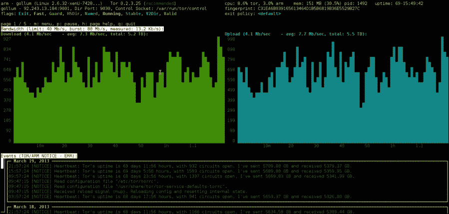

Tor 终端

### Tor 路由器

前一节解释了树莓派 Tor 如何将树莓派变成 Tor 节点。您可以连接到节点，并且您的流量以及其他在 Tor 网络上的用户都可以匿名。要连接到节点，通常需要使用特殊软件。如果您想通过 Tor 运行整个网络，以便来自您网络的所有流量保持匿名，该怎么办？这可以通过将树莓派变成 Tor 路由器来实现。

例如，您可以让树莓派插入您的外部路由器并广播一个私有 SSID，用户可以连接到该 SSID，并通过 Tor 网络过滤其流量。这对于设置一个快速的移动热点非常理想，该热点可以使用 Tor 掩盖所有用户流量。

让我们看看如何使用以下步骤将树莓派配置为 Tor 路由器：

1.  第一步是从[`www.raspberrypi.org/downloads/`](http://www.raspberrypi.org/downloads/)下载 Raspbian 的最新版本。在我们的情况下，最新版本是`2014-09-09-wheezy-raspbian.img`。下载后，您需要解压该文件。

1.  将 Raspbian 镜像安装到您将在 Raspberry Pi 上使用的 SD（microSD）卡上。我们在第一章中介绍了这个过程，*树莓派和 Kali Linux 基础*。我们的镜像命令如下：

```
sudo dd if=~/Desktop/2014-09-09-wheezy-raspbian.img of=/dev/disk1.

```

### 注意

您可以为此项目运行任何基于 Debain 的 Linux 系统。我们更喜欢使用 Kali Linux，但我们选择 Raspbian 的原因是因为 Kali Linux 有许多服务，如果没有关闭或正确配置，就可能被利用。

1.  使用您在 microSD 上安装的 Raspbian 镜像启动您的 Raspberry Pi。Raspbian 的默认用户名和密码是`pi`和`raspberry`。

1.  当您登录 GUI 桌面时，在桌面上打开终端应用程序。输入`sudo apt-get update`命令，然后输入`sudo apt-get upgrade`。

1.  您需要安装 DHCP 服务器。这样做会导致错误，但请忽略它们。输入`sudo apt-get install vim tor hostapd isc-dhcp-server`命令。

1.  接下来，您将使用您喜欢的编辑器编辑`/etc/dhcp/dhcpd.conf`文件。打开`/etc/default/isc-dhcp-server`文件并转到最后一行。编辑`INTERFACES`行，使其读取`INTERFACES="wlan0"`。确保在配置中包含带有`wlan0`的引号。

1.  您需要编辑`wlan0`网络配置。使用您喜欢的编辑器更改`/etc/network/interfaces`文件。转到`wlan0`部分并为其提供静态 IP 地址。文件应如下所示：

```
iface wlan0 inet static
address 10.99.99.1
netmask 255.255.255.0
allow-hotplug wlan0
#iface wlan0 inet manual
#wpa-roam /etc/wpa_supplicant/wpa_supplicant.conf
#iface default inet dhcp

```

### 提示

请注意，我们正在注释掉一些旧的配置。最佳做法是这样做，而不是在需要恢复时删除它们。

1.  接下来，我们将希望使用加密配置树莓派，以便我们的无线网络具有安全性。您需要创建一个名为`/etc/hostapd/hostapd.conf`的新文件。

### 注意

请注意，您需要确保您的无线网卡与`hostapt.conf`兼容。如果不兼容，您将需要编译自己的版本，否则无法实现无线安全。Adafruit 的人员有一个与许多其他芯片组兼容的备用`hostapd.conf`文件。您可以在[`www.adafruit.com/downloads/adafruit_hostapd.zip`](http://www.adafruit.com/downloads/adafruit_hostapd.zip)找到它。

我们将为 WPA2-PSK 加密、DrChaos 的 SSID 和 Kali Raspberry 的密码配置我们的`hostapd.conf`文件。当然，这些设置可以根据您的喜好进行更改。创建一个名为`/etc/hostapd/hostapd.conf`的文件，或者从[`www.adafruit.com/downloads/adafruit_hostapd.zip`](http://www.adafruit.com/downloads/adafruit_hostapd.zip)下载并将其放在`/etc/hostapd`目录中。您可能需要以以下方式创建该目录：

```
interface=wlan0
driver=rt2800usb
ssid=DrChaos
hw_mode=g
channel=6
macaddr_acl=0
auth_algs=1
ignore_broadcast_ssid=0
wpa=2
wpa_passphrase=KaliRaspberry
wpa_key_mgmt=WPA-PSK
DAEMON_CONF="/etc/hostapd/hostapd.conf"

```

### 注意

转到`/sys/class/net/wlan0/device/driver/module/drivers`，查看文件的第一行使用的驱动程序。

打开`/etc/sysctl.conf`文件，并取消`net.ipv4.ip_forward=1`行的注释，使其生效。

1.  通过输入以下命令打开 IP 转发：

```
echo 1 > /proc/sys/net/ipv4/ip_forward

```

1.  接下来，我们将添加一些简单的**iptable**规则，将我们的数据从无线路由到互联网。

### 注意

以下的 iptables 规则非常宽松。在某些情况下，这些规则可能会暴露客户端的真实 IP 地址。如果您想增加额外的安全层，那么跳过第 16 步（或将 echo 从`1`改回`0`），并明确说明您将允许哪些连接。

在 iptables 中添加以下命令：

```
iptables -t nat -A POSTROUTING -o eth0 -j MASQUERADE
iptables -t nat -A PREROUTING -i wlan0 -p tcp --dport 22 -j REDIRECT --to-ports 22
iptables -t nat -A PREROUTING -i wlan0 -p udp --dport 53 -j REDIRECT --to-ports 53
iptables -t nat -A PREROUTING -i wlan0 -p tcp --syn -j REDIRECT --to-ports 9040
iptables -A FORWARD -i eth0 -o wlan0 -m state --state RELATED,ESTABLISHED -j ACCEPT
iptables -A FORWARD -i wlan0 -o eth0 -j ACCEPT
iptables-save > /etc/iptables.ipv4.nat

```

下面的屏幕截图显示我们的数据通过`iptables`进行路由：

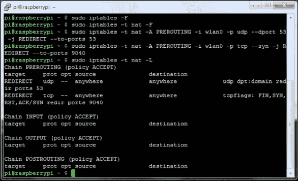

1.  接下来，您需要以以下方式编辑`/etc/tor/torrc`文件：

```
Log notice file /var/log/tor_notices.log
VirtualAddrNetwork 10.99.0.0/10
AutomapHostsSuffixes .onion,.exit
AutomapHostsOnResolve 1
TransPort 9040
TransListenAddress 10.99.99.1
DNSPort 53
DNSListenAddress 10.99.99.1

```

现在，您可以将树莓派上的有线连接插入到互联网中。此时，您的无线用户将能够连接到 DrChaos SSID，使用 Kali Raspberry 的密码进行连接。所有流量将通过 Tor 网络进行传输。

打开一个网页浏览器，转到[`check.torproject.org/`](https://check.torproject.org/)，你将收到一条消息，显示你是否在 Tor 网络上，如下面的屏幕截图所示：

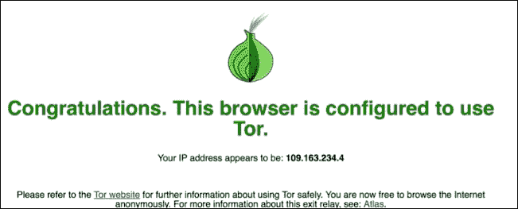

# 在 PC 上使用 QEMU 模拟器运行树莓派

你可能已经注意到这本书中有各种图片和屏幕截图。这是因为在写这本书时，我们不断地改变不同的操作系统，拍摄屏幕截图，测试不同的适配器，并安装各种软件程序。在某些情况下，我们从 PC 远程登录到树莓派，而在其他情况下，我们使用了 X-Windows 客户端。有时，我们甚至用相机拍摄屏幕的照片，因为树莓派的输出显示在一个不提供屏幕截图的显示器上。在考虑到所有这些变化的情况下，我们发现 QEMU 是一个非常有价值的工具。

**Quick EMUlator** (**QEMU**)是一个模拟器，可以模拟许多不同的处理器和加载许多不同的操作系统。我们模拟了树莓派中基于 ARM 的处理器，并成功地加载和运行了多个操作系统，就像在真正的树莓派上一样。模拟并非没有问题。有时，即使在真正的树莓派硬件上完全没有问题，操作系统也可能无法加载或出现性能问题、崩溃、停止工作等。我们发现，使用这个应用程序节省的时间超过了模拟带来的问题。

让我们看看如何使用以下步骤安装 QEMU 模拟器：

1.  第一步是前往[`qemu.weilnetz.de/`](http://qemu.weilnetz.de/)并下载 Windows 版的 QEMU 模拟器，如下面的屏幕截图所示：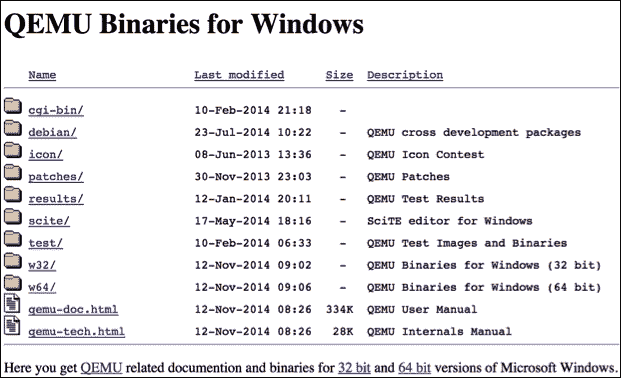

还有一个 Linux 版本，以及使用 Homebrew 和 XTools 的 Mac OS X 版本，可以实现相同的功能。我们将展示 PC 版本作为下一个示例。我们发现 Windows 版本最容易安装，Linux 版本最可靠，Mac 版本有点难以使用和正确安装。你的情况可能有所不同。

1.  选择适当的版本（64 位或 32 位）。下载正确的版本后，运行`install exe`文件。你会发现在大多数情况下，PC（i386）系统仿真没有被选中。确保你选择了这个选项。注意 QEMU 的默认安装目录。在大多数情况下，它是`C:\Program Files\qemu`。*不要改变它*。

1.  如果你还没有下载适当的树莓派镜像，现在应该去做。你可以使用 Kali Linux ARM 镜像，或者你可以下载任何兼容的镜像。我们将使用可以在[`www.raspberrypi.org/downloads/`](http://www.raspberrypi.org/downloads/)下载的 Raspbian 操作系统。

1.  接下来，你需要下载 Linux QEMU 的`kernel`文件。你可以通过访问[`xecdesign.com/downloads/linux-qemu/kernel-qemu`](http://xecdesign.com/downloads/linux-qemu/kernel-qemu)来下载。一旦你下载了内核，将它放在刚刚解压的 QEMU 文件夹的同一个目录中。

1.  在解压 IMG 文件并将其放在与 QEMU 相同的目录之后，你需要运行它。转到 DOS 提示符并导航到`c:\Program Files\qemu`。

1.  你将使用以下命令启动 Raspbian 镜像系统（或任何树莓派镜像系统）：

```
qemu-system-armw.exe -kernel kernel-qemu -cpu arm1176 -m 256 -M versatilepb -no-reboot -serial stdio -append "root=/dev/sda2 panic=1 rootfstype=ext4 rw init=/bin/bash" -hda raspbian.img

```

### 注意

请注意，`qemu-system-armw.exe`用于 Windows 环境。所有其他环境将使用`qemu-system-arm.exe`。最后一个命令加载操作系统。使用你放在与 QEMU 相同文件夹中的未压缩操作系统的确切名称。在你给出命令后，QEMU 启动可能需要几分钟。有报道称，QEMU 在 Windows 8/8.1 或 Mac OS X Yosemite（10.10）上工作不好。

1.  命令的第一部分启动了特定处理器的仿真器。命令的第二部分指定了磁盘映像文件。注意，我们将镜像从`2014-09-09-wheezy-raspbian.img`重命名为`raspbian.img`，只是为了让我们的生活更轻松。在指定要启动的内容时，不要忘记使用你的扩展名。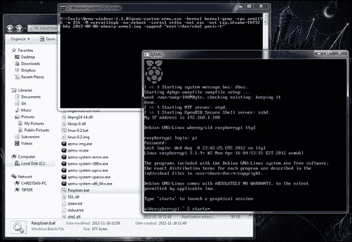

启动 QEMU

你的树莓派操作系统（在我们的例子中是 Raspbian）将在一个 QEMU 窗口中启动。你现在可以与操作系统交互并测试不同的应用程序和工具。此外，QEMU 文档还有关于多个仿真器之间的网络高级配置选项，映射到物理硬件设备以及其他高级配置。在大多数情况下，仿真器将完美地工作来测试典型的应用程序和连接。

# 其他树莓派用途

这本书侧重于使用树莓派作为交付渗透测试能力的手段。除了黑客攻击之外，还有很多其他用例，比如防止攻击，或者更不严肃地玩游戏。查看位于[`www.raspberrypi.org/`](http://www.raspberrypi.org/)的主要树莓派网站获取更多信息。

以下是我们发现对树莓派有益的一些其他软件选项。

## 使用 PiAware 进行飞行跟踪

你可以使用你的树莓派和 FlightAware（[www.flightaware.com](http://www.flightaware.com)）来构建一个**自动相关监视广播**（**ADS-B**）系统。ADS-B 是一种合作飞机监视技术，由世界各地的空中交通管制机构使用，它通过卫星和其他导航系统确定飞机的位置。飞机定期广播它们的 ADS-B 位置，使其可以被跟踪。

FlightAware 拥有大量自己的接收器，但邀请航空爱好者跟踪航空公司数据并帮助 FlightAware 处理数据，以便可以在他们的网站上为整个社区使用。PiAware 是一个工具，可以将你的树莓派变成一个雷达跟踪系统，FlightAware 可以使用。下面的图片显示了一个为此目的而构建的树莓派：

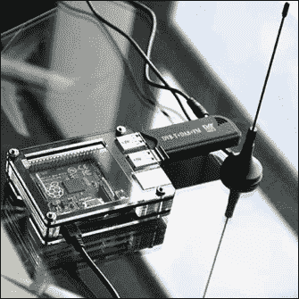

要开始这个项目，你需要下载 PiAware 操作系统并安装到你的树莓派上。请参考本书的第一章，*树莓派和 Kali Linux 基础*，了解如何在树莓派的 microSD 卡上安装操作系统。PiAware 可以在[`piaware.flightcdn.com/piaware-sd-card-1.16.img.zip`](http://piaware.flightcdn.com/piaware-sd-card-1.16.img.zip)找到。

在使用 PiAware 操作系统启动树莓派后，你需要将 ADS-B USB 接收器插入树莓派。我们推荐在美国购买价格约为 22 美元的 NooElec NESDR Mini USB RTL-SDR & ADS-B 接收器套装。以下图片显示了 NooElec NESDR Mini：


飞机信号不应通过建筑物传递，所以你应该把天线放在室外，以便飞机能够获得最佳信号的视线范围内。你需要在[`flightaware.com/account/join/?referer=/account/join/`](http://flightaware.com/account/join/?referer=/account/join/)注册一个免费的 FlightAware 账户。你的数据将由 FlightAware 处理，并在 30 分钟后可以在[`flightaware.com/adsb/stats`](http://flightaware.com/adsb/stats)上查看。

恭喜，你现在有一个可用的系统！

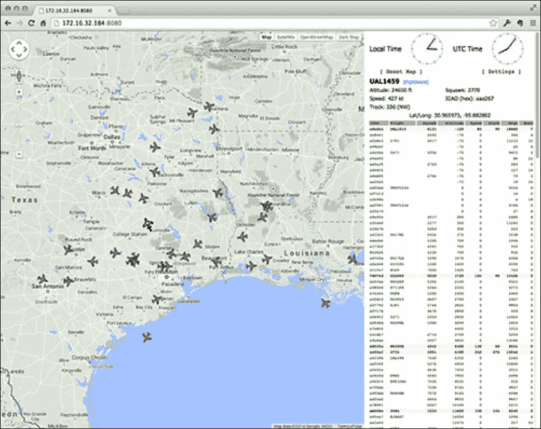

一个完全可操作的飞行跟踪器

## PiPlay

本书侧重于渗透测试和其他安全需求，但我们想添加一个很酷的 ARM 镜像，将你的树莓派变成一个游戏系统。这包括许多流行游戏系统的模拟器，如 PlayStation、Game Boy、**超级任天堂娱乐系统**（**SNES**）、NES、Atari 等。你可以在[`blog.sheasilverman.com/pimame-raspberry-pi-os-download/`](http://blog.sheasilverman.com/pimame-raspberry-pi-os-download/)找到更多信息。

要安装 PiPlay，使用与 Kali Linux 相同的过程。例如，我使用`sudo dd if=piplay-0.8-beta6.img of=/dev/disk2`来在我的 microSD 卡上的`disk2`空间安装 0.8 测试版镜像。安装完成后，你只需启动安装了**PiPlay**镜像的树莓派，它应该会启动到主 GUI，如下截图所示：


如果你点击箭头，你会找到其他游戏系统和配置选项的附加菜单选项。以下截图显示了第二个菜单：


一旦 PiPlay 启动，你会想要做的第一件事就是寻找更新。你可以通过点击菜单中的大箭头到显示**更新 PiPlay**选项的第三个屏幕来做到这一点。你必须在线才能这样做，所以你可以插入以太网电缆，或者使用**设置无线**按钮在寻找更新之前建立无线连接。如果你在线，你会在主菜单的右上角看到你的 IP 地址。以下截图显示了第三个菜单屏幕和我的 PiPlay 连接到互联网，右上角显示 IP 地址。之前的截图在这个位置显示**无网络连接**。


如果你点击像 SNES 这样的操作系统，你会发现你没有任何游戏。你可以在网上找到大量的 ROM 格式的游戏文件。

### 注意

下载 ROM 或制作备份副本可能会违反版权或其他法律。ROM 有许多来源，其中一些是作者创建的原始游戏，可以免费或以名义费用分发。ROM 的副本通常通过网站、usenet 新闻组和点对点类型的网络分发。

PiPlay 使安装 ROM 变得非常容易，内置了一些刮刀应用程序。就是这样。下载一个 ROM，使用刮刀应用程序安装 ROM，识别添加到系统中的 ROM，然后就可以使用了。以下屏幕截图显示了一个名为 Cave Story 的游戏的启动屏幕，该游戏包含在 PiPlay 安装的镜像中：


## PrivateEyePi

PrivateEyePi 是一个家庭自动化和安全系统，是开源的，可以利用运动检测器、摄像头、热签名、红外线和夜视。它可以通过简单的网络界面或定制的移动应用程序进行监控和管理。以下图显示了**Home Monitor**系统的详细描述：

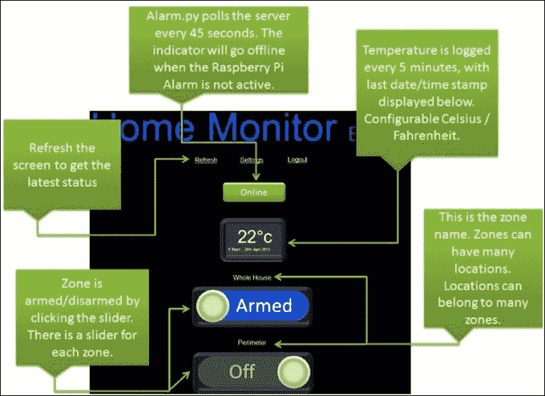

由于系统有许多不同的选项，可能会变得过于复杂，我们不会详细介绍如何配置它。名为 Gadjet 的作者已经记录了整个过程，包括零件、在哪里购买以及如何一步一步地安装它们的说明，网址为[`sites.google.com/site/gadjetnut/home/home-alarm-system-project`](https://sites.google.com/site/gadjetnut/home/home-alarm-system-project)。

以下图显示了由**Home Monitor**系统触发的警报：


构建所有部件需要一些基本的低电压经验，或者你可以购买许多预先构建好的部件。我们听到了一些关于这个项目的担忧。这些担忧主要集中在这作为一个安全系统的可靠性以及经济是否合理，因为基本的报警系统成本大约相同。然而，我们相信这可能是一个很好的团队、课堂或者业余项目。此外，定制和扩展系统的选项可能比任何主要商业供应商提供的任何东西都要多。

# 更多用途

树莓派有许多其他用途，远远超出了我们没有涉及的安全范围。我们最喜欢的一些用途包括**OpenELEC**（**Open Embedded Linux Entertainment Center**的缩写），可以将您的树莓派变成家庭媒体中心。其他用途包括构建运动传感器、地震检测器、气体检测器等等。我们希望通过结束本章，你会受到启发，以新的、有益的方式使用你的树莓派。

# 总结

本章提供了使用树莓派的其他工具和用例。我们简要介绍了一些替代 Kali Linux 的渗透测试武器库，但认为 Kali Linux 应该基于其在 IT 社区中的流行度而进行最多的创新。我们还提到了可以用于防御目的的 ARM 镜像，如防火墙、IPS/IDS 和 VPN。最后，我们介绍了一些有趣的 ARM 镜像，虽然不一定与安全相关，但无论如何都很酷。

这就结束了这本书。希望你喜欢阅读。我们很乐意听到你的想法。欢迎访问我们各自的博客并分享你的想法。Aamir Lakhani 的网址是[www.drchaos.com](http://www.drchaos.com)，Joseph Muniz 的网址是[www.thesecurityblogger.com](http://www.thesecurityblogger.com)。我们非常享受讨论的主题，并祝愿你在使用树莓派的经历中一切顺利。这包括那些希望运用这些新知识做好事或者做坏事的人。Aamir 真的很想用蜘蛛侠的责任报告结束。所以尽管 Joseph 建议不要，这里还是有："伟大的力量带来伟大的责任"。玩得开心，愉快的黑客活动！
