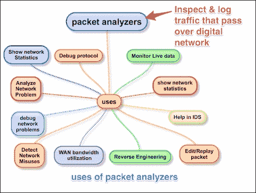

# 一、数据包分析器

数据包分析器也称为数据包嗅探器或网络协议分析器。Packet analyzer 能够从有线、无线、蓝牙、VLAN、PPP 和其他网络类型中获取原始数据包，而无需应用进行处理。通过这样做，它把整个科学和创新带到了这个领域。在本章中，我们将通过讨论以下主题来了解数据包分析器的一些使用案例:

*   数据包分析器的用途
*   Wireshark 简介
*   其他数据包分析器工具
*   移动数据包捕获

# 数据包分析器的用途

更实际的是，数据包分析器用于网络安全和分析原始流量，以便检测扫描和攻击，并用于嗅探、网络故障排除和许多其他用途，如下图所示:

数据包分析器可按如下方式使用:

*   网络管理员可以诊断网络上的问题
*   安全架构师可以对数据包执行安全审计
*   协议开发者可以诊断/学习协议相关的问题
*   白帽黑客可以发现应用中的漏洞，并在黑帽黑客发现之前修复它们

使用不仅限于这些要点，在这个领域有许多新的工具和创新。找到一个用例，构建自己的包分析器；最好的例子就是 Wireshark。

# 【Wireshark 简介

Wireshark 可能是当今最好的开源数据包分析器之一。Wireshark 是一款功能强大的数据包分析工具，具有易于使用、丰富的 GUI 和命令行实用工具，并有非常活跃的社区支持:【http://ask.wireshark.org】。

Wireshark 使用`pcap` ( `libpcap`)来捕获数据包，这意味着它可以在离线模式下捕获数据包(查看捕获的数据包)和在线模式(实时流量)下捕获流量并在 Wireshark GUI 中显示。打开后，Wireshark GUI 如下所示:

## Wireshark 功能

我们将在下图中看到 Wireshark 中的一些重要功能:

Wireshark 具有以下很酷的内置功能，下面列出了其中一些:

*   在 UNIX 和 Windows 中都可用
*   从各种类型的接口捕获实时数据包的能力
*   使用多种标准过滤数据包
*   能够解码更大的协议集
*   可以保存和合并捕获的数据包
*   可以创建各种统计数据
*   用户友好的 GUI 和命令行界面
*   积极的社区支持([http://ask.wireshark.org](http://ask.wireshark.org))

## Wireshark 的 dumpcap 和 tshark

Wireshark 安装提供了一些命令行工具，如 `dumpcap`和`tshark`。Wireshark 和`tshark`依靠`dumpcap`抓取流量；更高级的功能由`tshark`完成。另请注意，`dumpcap`可以作为它自己的独立实用工具运行。`tshark`是 Wireshark 的命令行版本，可用于远程终端。

## Wireshark 数据包捕获流程

用户必须知道 Wireshark 安装在哪里，并且在开始捕获**分接头** ( **测试** **接入点**)或**交换机端口分析器** ( **SPAN** ) 端口之前，必须遵守贵组织的政策。

通常，开发人员在他们的个人笔记本电脑/台式机上安装 Wireshark，并捕获从机器进出的数据包。

为此，应遵循某些指南:

1.  确保你被允许做你要做的事情；在捕获数据包之前，请检查您的公司策略。
2.  操作系统必须支持包捕获:

    *   内核默认启用 Linux 包套接字支持
    *   Windows 要求安装`WinPCap`

3.  选择接口并在其上启用混杂模式。混杂模式接受所有数据包，无论它们是否发往该接口。
4.  如果使用 Wi-Fi 接口，请启用无线局域网捕获的监控模式。
5.  Start capturing and use Wireshark's different features like (filters/statistics/IO/save) for further analysis

# 其他数据包分析工具

Wireshark 是一款数据包分析工具，使用诸如数据包编辑/重放、执行 MITM、ARP 欺骗、IDS 和 HTTP 代理等功能，还有其他可用的数据包分析工具也可以使用。

以下是市场上著名的数据包分析器工具列表(不限于此);许多其他产品也可以买到。下表列出了工具及其功能:

| 

工具

 | 

数据包编辑

 | 

数据包重放

 | 

ARPspoof/MITM

 | 

密码嗅探

 | 

入侵检测

 | 

HTTP 调试器

 |
| --- | --- | --- | --- | --- | --- | --- |
| 连线编辑([https://wireedit.com/](https://wireedit.com/)) | Y | N | 普通 | 普通 | 普通 | 普通 |
| 斯卡帕([http://www.secdev.org/](http://www.secdev.org/)) | Y | Y | Y | Y | 普通 | Y |
| ettcap([https://ettcap . github . io/ettcap/](https://ettercap.github.io/ettercap/) | Y | 普通 | Y | Y | 普通 | 普通 |
| tcpreplay([http://tcpreplay.synfin.net/](http://tcpreplay.synfin.net/)) | 普通 | Y | 普通 | 普通 | 普通 | 普通 |
| 钻头扭转([http://bittwist.sourceforge.net/](http://bittwist.sourceforge.net/) | Y | 普通 | 普通 | 普通 | 普通 | 普通 |
| 凯恩([http://www.oxid.it/cain.html](http://www.oxid.it/cain.html)) | 普通 | 普通 | Y | Y | 普通 | 普通 |
| 放风([https://www.snort.org/](https://www.snort.org/)) | 普通 | 普通 | 普通 | 普通 | Y | 普通 |

## 移动数据包捕获

Wireshark 在 Android、iOS 或 Windows 等移动平台上不可用。为了捕获移动流量，基于该平台建议使用以下工具:

| 

平台

 | 

使用的数据包捕获工具

 | 

统一资源定位器

 |
| --- | --- | --- |
| Windows 操作系统 | 微软网络分析仪 | [http://www.microsoft.com/en-in/download/details.aspx?id=19484](http://www.microsoft.com/en-in/download/details.aspx?id=19484) |
| ios | 帕罗斯岛 | [http://sourceforge.net/projects/paros/](http://sourceforge.net/projects/paros/) |
| 机器人 | 鲨鱼为根 | [http://www.appbrain.com/app/shark-for-root/lv.n3o.shark](http://www.appbrain.com/app/shark-for-root/lv.n3o.shark) |
| Kismet 安卓 PCAP | [http://www.kismetwireless.net/android-pcap/](http://www.kismetwireless.net/android-pcap/) |

使用 Wireshark，还可以使用各种其他技术来捕获移动流量。其中一种技术是在笔记本电脑上创建一个 Wi-Fi 热点，允许手机使用这个 Wi-Fi，并使用 Wireshark 嗅探 Wi-Fi 接口上的流量。

# 总结

在本章中，我们学习了什么是数据包分析器及其使用案例。在简要介绍 Wireshark 之后，我们讨论了 Wireshark 捕获数据包时的幕后操作；Wireshark 的优势和重要功能；捕获数据包之前的必要先决条件；以及用于数据包编辑/嗅探/重放等的其他数据包分析器工具。我们还提供了移动数据包捕获的简要概述。

下一章将更具体地介绍 Wireshark 及其技巧和窍门。之后，我们将探讨 TCP 故障排除，然后深入研究 SSL 和其他应用协议，如 DHCPv6、DHCP、DNS 和 HTTP。我们还将分析 Wi-Fi 捕获，并在 Wireshark 和`tcpdump`的帮助下进行一些安全性分析。