# 二、捕获数据包

在前一章中，我们学习了数据包分析器的用途。在本章中，我们将了解更多关于 Wireshark GUI 功能的信息，并通过以下主题了解它如何帮助有效地捕获和分析数据包:

*   使用 Wireshark 接口列表捕获数据包
*   使用 Wireshark 启动选项捕获数据包
*   捕获选项
*   Wireshark 过滤器示例
*   Wireshark 数据包列表窗格
*   Wireshark 数据包详细信息窗格
*   Wireshark 功能
*   tcpdump 和 snoop 示例

# 数据包捕获指南

通过单击 Wireshark 图标或在命令行中键入`Wireshark`来启动 Wireshark 。Wireshark 启动时会启动以下屏幕，并提供以下捕获数据包的方法:

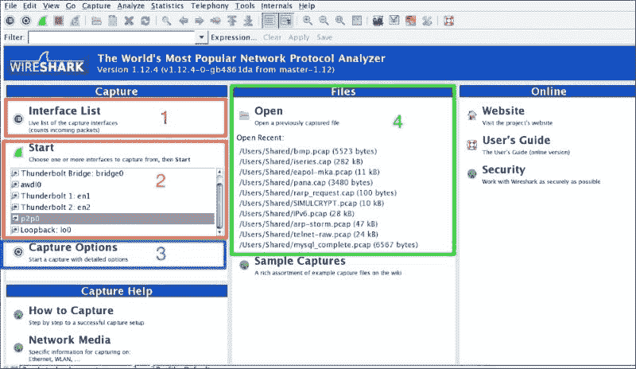

下表解释了我们在开始屏幕上的各种选项:

| 

没有。

 | 

Wireshark 捕获选项

 | 

这是什么？

 |
| --- | --- | --- |
| one | 接口列表 | 打开捕获接口的实时列表，并对传入/传出数据包进行计数 |
| Two | 开始 | 您可以从列表中选择一个接口并开始捕获数据包 |
| three | 捕获选项 | 提供用于捕获和显示数据包的各种选项 |
| four | 打开最近的 | Wireshark 显示最近使用的数据包 |

我们将逐一详细介绍每个捕获选项。

## 用接口列表捕获数据包

点击**界面列表**；Wireshark 将通过显示进出接口的数据包，显示系统中可用网络接口的列表以及哪个处于活动状态，如下图所示:

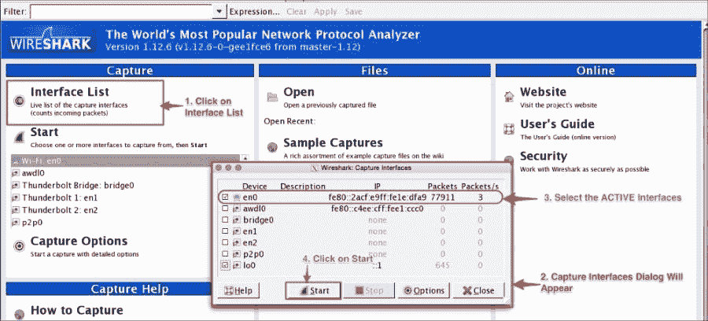

选择右侧(活动)接口，点击**开始**按钮开始捕获数据包。如果要在回环(`127.0.0.1`)上捕获数据包，选择接口 **lo0** 。

### 常用接口名称

接口名告诉你网络类型；通过查看接口名称，用户应该了解捕获设置与哪个网络相关联，例如，`eth0`代表`Ethernet`。下图显示了其中的一些:

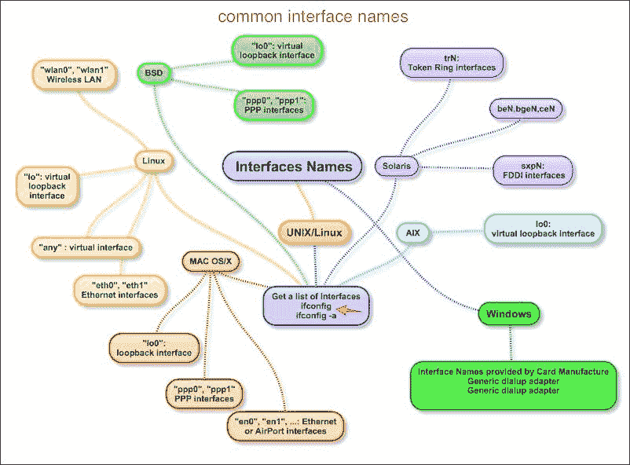

## 捕获带有开始选项的数据包

在**开始**选项中，用户可以多选或选择列表中显示的界面，然后点击开始。这不能让您灵活地查看数据包在哪个接口上是活动的。用户可以通过双击界面或者点击**捕获选项**来配置捕获选项:

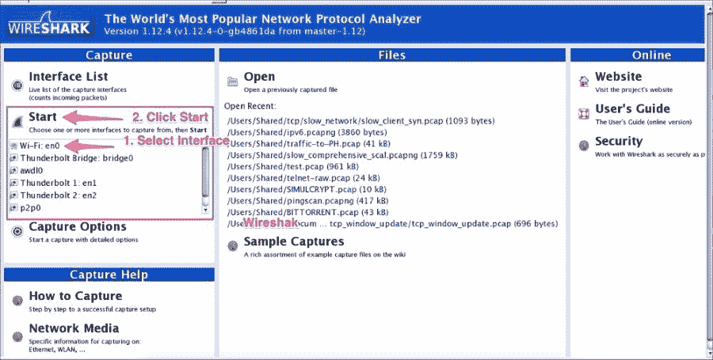

## 使用捕获选项捕获数据包

Wireshark 可以灵活地配置需要用各种捕获选项捕获的数据包。首先，尝试这些基本的设置:

1.  选择数据包进出的实时接口。
2.  点击**捕获选项**，Wireshark 将打开**捕获选项**对话框。
3.  启用混杂模式，这将允许网络接口接收所有数据包。
4.  检查快照长度大小。此选项将告诉您 Wireshark 应该捕获的每帧数据的大小；这在捕获报头帧或保持数据包较小时非常有用。
5.  **名称解析**尝试将数字地址(例如，MAC 地址、IP 地址和端口)解析为其对应的名称，该类别下定义了以下选项:

    *   **解析 MAC 地址**:该选项用于将 MAC 地址转换为人类可读的格式；例如`28:cf:e9:1e:df:a9`将翻译成`192.168.1.101`。
    *   **解析网络层名称** (IP 名称解析):用于将 IP 地址转换为其对应的主机名(例如，`216.58.220.46`将翻译为`google.com`)。
    *   **解析传输层名称** (TCP/UDP 端口名称解析):用于将众所周知的端口转换为人类可读的格式(例如，`443`将翻译为`https`)。

6.  使用外部网络名称解析器对每个唯一的 IP 地址执行反向 DNS 查找(例如`216.58.196.14`将转换为`ns4.google.com`)，也称为反向 DNS 查找。

用户也可以通过选择 Wireshark **视图**菜单并应用以下设置来选择这些选项:

*   **查看|名称解析|使用外部网络名称解析器**
*   **查看|名称解析|为 MAC 层启用**
*   **查看|名称解析|启用传输层**
*   **查看|名称解析|启用网络层**

名称解析的缺点如下:

*   启用这些名称解析选项后，如果流量很大并且有大量唯一的 IP 地址，Wireshark 将生成额外的数据包来解析来自名称服务器的名称。使用这些设置，Wireshark 会变得非常慢。
*   Wireshark 缓存解析的 DNS 名称，因此如果名称服务器信息改变，需要手动重新加载。

### 捕获过滤器选项

Wireshark 为提供了一系列捕获过滤器选项，使用这些选项来决定将哪些数据包保存到磁盘。在较长时间内捕获数据包时，这些选项非常有用。Wireshark 为此使用了 **Berkeley 包过滤** ( **BPF** )语法，例如`tcp src port 22`。这个选项也节省了磁盘空间。例如，要仅捕获 TCP 数据包，请遵循给定的步骤:

1.  点击**捕获选项**。对话框将打开，如屏幕截图所示。
2.  选择*活动*接口，将混杂模式设置为启用或禁用。
3.  Click on **Capture Filter**. Once the dialog box appears, choose the **TCP only** filter and click on **OK**.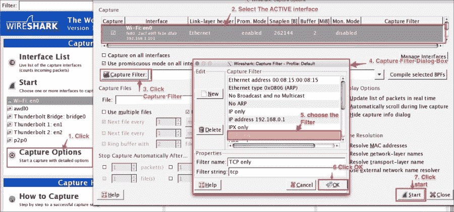
4.  点击**开始**按钮，开始捕获 TCP 数据包。

## 定期自动捕获文件

用户可以微调 Wireshark 来定期自动捕获文件。为此，点击**捕获选项** | **捕获文件**，如以下截图所示:

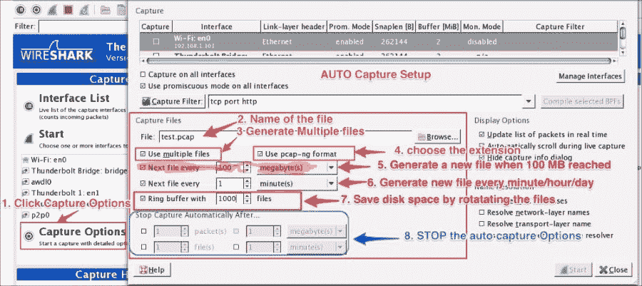

Wireshark 会生成`test_00001_20150623001728.pcap`和`test_00002_20150623001818.pcap`等文件。

多个生成文件的格式如下:

*   `test`:这是文件名
*   `00001`:这是文件编号
*   这是日期/时间戳
*   `pcap`:这是文件扩展名

# 故障排除

如果数据包没有出现在 Wireshark 主窗口中，请执行以下操作:

*   检查正确的网络接口；确保有实时流量
*   尝试关闭/打开混杂模式

如果没有出现可以执行捕获的接口，请执行以下操作:

*   检查 Wireshark 是否有足够的权限使用网卡来捕获数据
*   从[http://wiki.wireshark.org/CaptureSetup/CapturePrivileges](http://wiki.wireshark.org/CaptureSetup/CapturePrivileges)验证捕获权限

### 注意

如果问题没有得到解决，你还可以使用 https://ask.wireshark.org/的 Wireshark 社区。

# Wireshark 用户界面

当 Wireshark 开始捕获数据包时，或者当打开一个`.pcap`文件进行离线查看时，会出现 Wireshark 主窗口。它看起来类似于下面的截图:

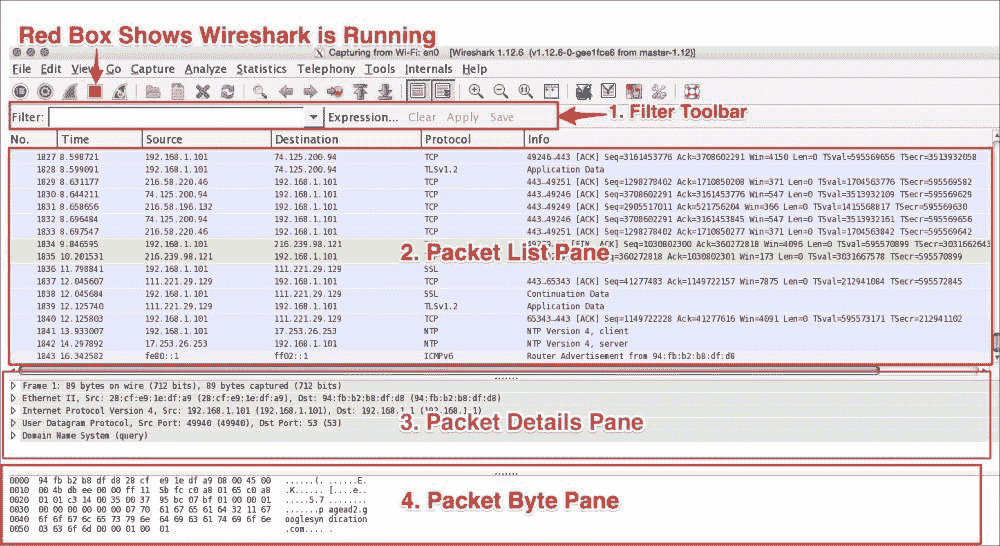

Wireshark UI 界面由不同的窗格组成，并为用户提供各种选项进行自定义。在本章中，我们将详细介绍这些窗格:

| 

项目

 | 

这是什么？

 |
| --- | --- |
| 红色的盒子 | 这表明 Wireshark 正在运行并捕获数据包 |
| one | 这是**过滤器**工具栏，用于根据应用的过滤器过滤数据包 |
| Two | 这是数据包列表窗格，显示所有捕获的数据包 |
| three | 这是数据包详细信息窗格，以详细的形式显示选定的数据包 |
| four | 这是数据包字节窗格，以十六进制转储格式显示选定的数据包 |

首先，只需观察屏幕中的窗格**2**；显示的数据包以不同的颜色出现。这是 Wireshark 最好的特性之一；它根据设置的过滤器对数据包进行着色，并帮助您可视化您正在寻找的数据包。

要管理(查看、编辑或创建)着色规则，请前往**查看** | **着色规则**。Wireshark 会显示**着色规则**对话框，如截图所示:

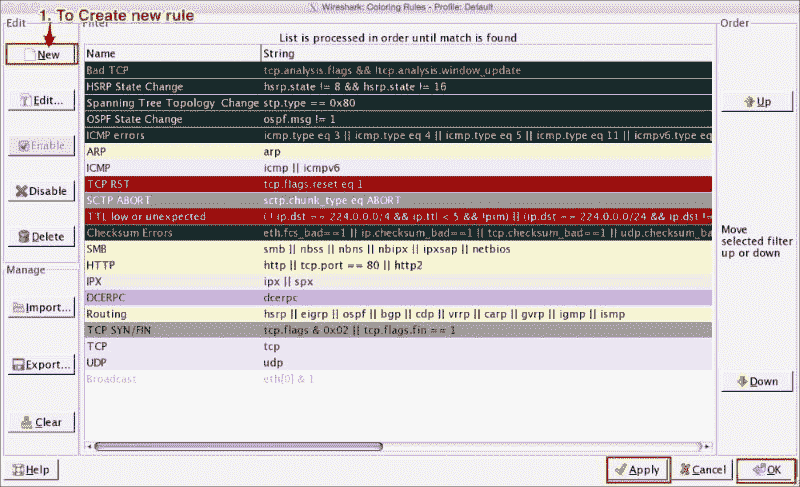

用户可以通过点击 **New** 按钮，选择过滤器名称和过滤器字符串，然后应用前景色和背景色来创建新的规则，用特定的颜色定制数据包。

## 过滤工具栏

Wireshark 显示过滤器显示数据包及其可用的颜色选项。Wireshark 显示过滤器通过提供所有数据包的完整剖析来改变捕获文件的视图，这有助于高效地分析网络跟踪文件。例如，如果用户只对 HTTP 数据包感兴趣，用户可以将显示过滤器设置为`http`，如下一个截图所示。

应用显示过滤器的步骤如下:

1.  打开`http_01.pcap`文件。
2.  在过滤区输入`http`协议，点击**应用**。

一旦应用了过滤器，数据包列表窗格将只显示与 HTTP 协议相关的数据包:

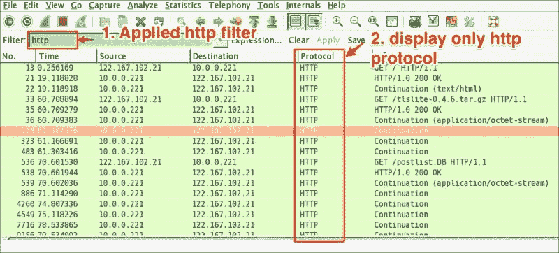

Wireshark 显示过滤器可以从数据包列表窗格中显示的列应用或准备，方法是选择该列，然后右键单击并转到**应用为过滤器** | **选定的**(如下图所示)以从源 IP 地址`122.167.102.21`创建过滤器:

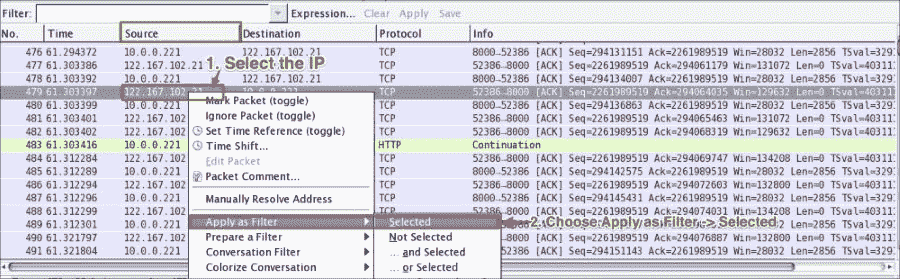

Wireshark 为提供了从细节窗格应用过滤器的灵活性；步骤保持不变。

Wireshark 还提供清除过滤器的选项。为此，点击**清除**(在**过滤器**工具栏中可用)以显示整个捕获的数据包。

### 过滤技术

正确捕获和显示数据包将有助于您捕获数据包。例如，要跟踪在两个主机:`HOSTA` ( `10.0.0.221`)和`HOSTB` ( `122.167.99.148`)之间交换的数据包，打开`SampleCapture01.pcap`文件并应用过滤器`ip.src == 10.0.0.221`，如下所示:

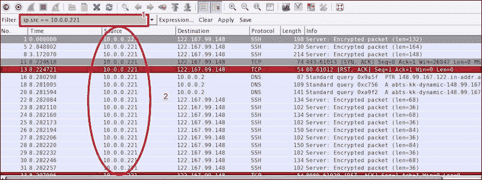

让我们看看突出显示的部分描述了什么:

| 

项目

 | 

描述

 |
| --- | --- |
| one | 应用过滤器`ip.src == 10.0.0.221`。 |
| Two | 数据包列表窗格显示从源到目的地的流量。源码显示不变的 IP 地址`10.0.0.221`。没有证据表明哪个数据包是从主机`122.167.99.148`发送到主机`10.0.0.221`的。 |

现在将过滤器`(ip.src == 10.0.0.221) && (ip.dst == 122.167.99.148)`修改为`(ip.src == 10.0.0.221) or (ip.dst == 122.167.99.148)`。这将给出如下屏幕截图所示的结果:

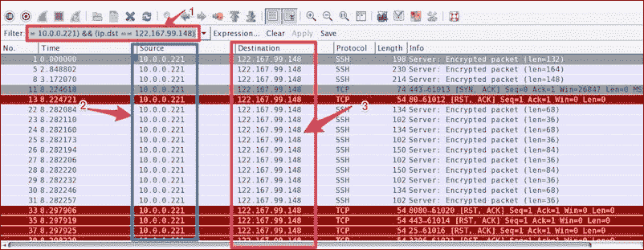

前面截图中的高亮部分解释如下:

| 

项目

 | 

描述

 |
| --- | --- |
| one | 应用的过滤器`(ip.src == 10.0.0.221) && (ip.dst == 122.167.99.148)` |
| Two | 源 IP 地址(`10.0.0.221`)不变 |
| three | 目的地 IP 地址(`122.167.99.148`)不变 |

同样，数据包列表窗格不显示两台主机之间的对话。

现在修改过滤器`ip.addr == 122.167.99.148`。`ip.addr`字段将匹配源地址和目的地址的 IP 报头,并显示主机之间的对话。请记住选择如下所示的目的 IP 地址:

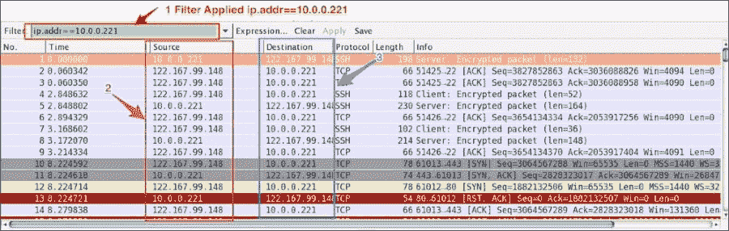

让我们看看突出显示的部分描述了什么:

| 

项目

 | 

描述

 |
| --- | --- |
| one | 应用的过滤器`ip.addr == 122.167.99.148` |
| Two | 源 IP 不是常数；它显示了两台主机之间的对话 |
| three | 目标 IP 不是常数；它显示了两台主机之间的对话 |

通过使用显示过滤器`eth.addr == 06:73:7a:4c:2f:85`选择目的 MAC 地址来捕获相同的对话。

### 过滤器示例

一些常见的过滤器示例如下:

| 

过滤器/采集名称

 | 

过滤阀

 |
| --- | --- |
| 给定端口上的数据包 | `tcp.port == 443` |
| 源端口上的数据包 | `tcp.srcport=2222` |
| 端口`443`上的 SYN 数据包 | `(tcp.port == 443) && (tcp.flags == 0x0010)` |
| HTTP 协议 | `http` |
| 基于 HTTP `get`方法 | `http.request.method == "GET"` |
| 使用`&&`、`tcp`和`http` | `tcp && http` |
| 检查`tcp`窗口大小 | `tcp.window_size <2000` |
| 没有`Arp`用于正常流量 | `!arp` |
| MAC 地址过滤器 | `eth.dst == 06:43:7b:4c:4f:85` |
| 过滤掉 TCP 确认 | `tcp.flags.ack==0` |
| 仅检查 RST 和 ACK 数据包 | `(tcp.flags.ack == 1) && (tcp.flags.reset == 1)` |
| 过滤所有 SNMP | `Snmp` |
| HTTP 或 DNS 或 SSL | `http &#124;&#124; dns &#124; ssl` |

不需要记忆过滤器；有一个简单的方法来应用它。显示过滤器自动完成功能列出了第一个句点"`.`"之后所有已添加到显示过滤器的解剖器，如以下屏幕截图所示:

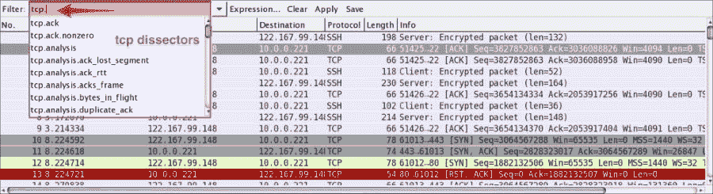

### 注意

值得查看以下链接，了解完整的显示过滤器参考:

*   查看 TCP 显示过滤器参考:[https://www.wireshark.org/docs/dfref/t/tcp.html](https://www.wireshark.org/docs/dfref/t/tcp.html)
*   检查这个替代协议显示过滤器参考:[https://www.wireshark.org/docs/dfref/](https://www.wireshark.org/docs/dfref/)

## 数据包列表窗格

数据包列表窗格显示来自`.pcap`(或接受的 Wireshark 扩展)文件或来自实时捕获的数据包，如图所示:

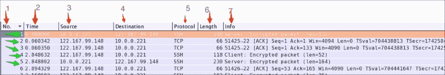

让我们讨论显示的字段:

| 

项目

 | 

这是什么？

 |
| --- | --- |
|  | 显示不同的数据包；每一行对应于一个称为**帧**的不同数据包 |
| 1.号码 | 当前实时/离线捕获中的数据包数量 |
| 2.时间 | 显示数据包被捕获时的时间戳信息`libpcap`文件的**自动**设置为微秒；所有数据包都将被捕获，时间以微秒计，如下一个截图所示 |
| 3.来源 | 数据包来源的 IP 地址 |
| 4.目的地 | 数据包结束的目的 IP 地址 |
| 5.草案 | Wireshark 将根据标准端口显示有关数据包协议的信息 |
| 6.长度 | 以字节表示的数据包长度 |
| 7.信息 | 显示数据包的概要以及数据包的性质 |

要更改数据包的时间戳信息，请进入**查看** | **时间显示格式**查看可用的显示格式，如图所示:

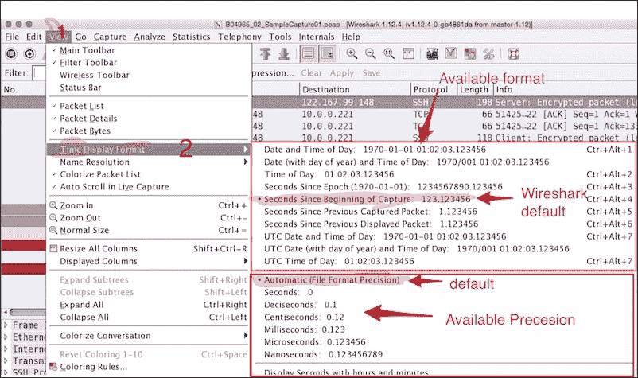

Wireshark **设置时间参考**功能使您能够查看来自所选数据包的时间参考。打开捕获文件`http.pcap`，设置数据包 38 中的时间基准。为此，选择 packet 38，右键单击，然后选择**设置时间参考(toggle)** ，如下图所示:

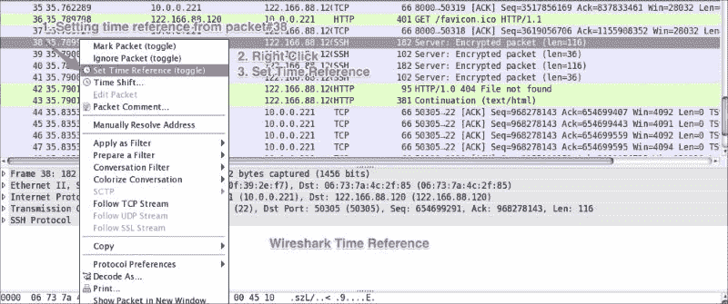

设置`*REF*`后，它将成为所有后续数据包时间计算的起点，如下面截图中的所示:

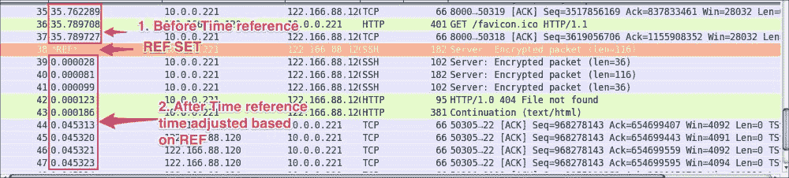

## 数据包详细信息窗格

数据包详细信息窗格将以更详细的形式显示当前选择的数据包。在下面的截图中，选择了一个 HTTP 数据包，其详细信息显示在标有数字 **1** 到 **5** 的信息中。让我们看看这些是什么:

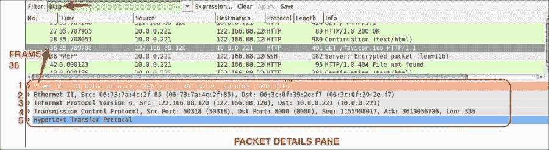

帧协议仅由 Wireshark 使用。所有的 TCP/IP 协议都基于此。该帧显示捕获数据包的时间，如以下屏幕截图所示:

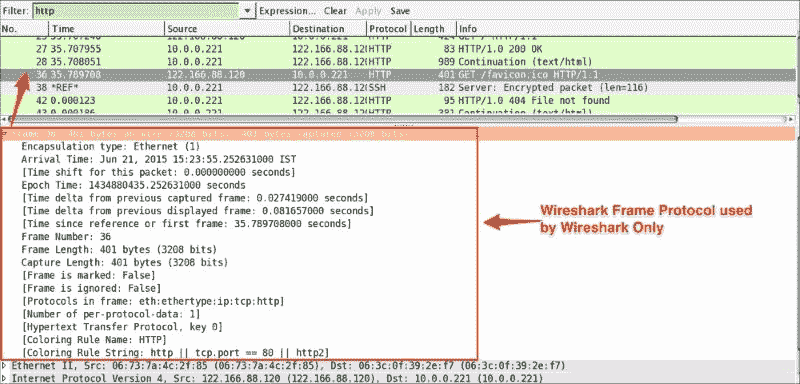

以太网是 TCP/IP 协议栈中的链路层协议。它将网络数据包从发送主机发送到一台(单播)或多台(组播/广播)接收主机，如图所示:

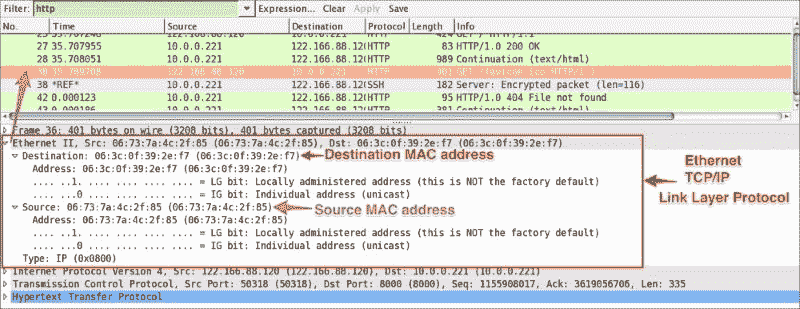

以太网中有用的过滤器有:

*   `eth.dst == 06:3c:0f:39:2e:f7`:仅显示发送到此 MAC 地址的数据包
*   `eth.dst==ff:ff:ff:ff:ff:ff`:仅显示广播流量

下表描述了以太网帧的数据包结构:

| 

序文

 | 

目标 MAC 地址

 | 

源 MAC 地址

 | 

类型/长度

 | 

用户数据

 | 

帧校验序列

 |
| --- | --- | --- | --- | --- | --- |
| eight | six | six | TwoIPv4 的 0800IPv6 的 86DDARP 的 0806 | 46-1500 | four |

前同步码(8 字节)和 FCS (4 字节)不是帧的一部分，Wireshark 不会捕获该字段。

因此总的以太网报头是 14 字节——6 字节用于目的地址，6 字节用于源地址，2 字节用于以太网类型。

互联网协议信息涉及如何传送 IP 分组以及它是使用 IPv4 还是 IPv6 来传送数据报分组。

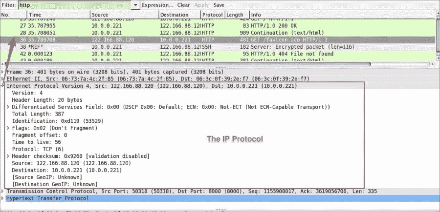

前面的屏幕截图显示 IPv4 协议用于传递数据报数据包。IP 协议中有用的显示过滤器有:

*   `ip.src == 122.166.88.120/24`显示来自子网的流量
*   `ip.addr==122.166.88.120`显示进出给定主机的流量
*   主机`122.166.88.120`捕获/过滤来自主机的流量

TCP 协议数据包包含所有与 TCP 相关的协议数据。如果通过 UDP 进行通信，TCP 将被 UDP 取代，如下面的屏幕截图所示。Wireshark 将根据序列号进行 SEQ/确认分析，并将提供专家信息:

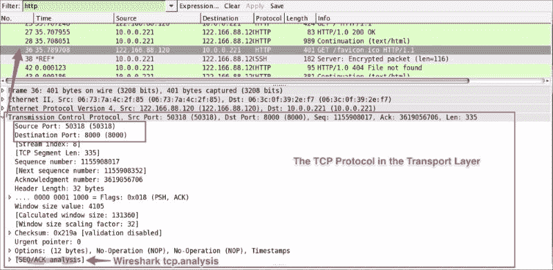

如果数据包包含任何应用协议，则显示`<<APPLICATION-LAYER>>`协议。如下面的截图中的所示，选中的数据包 36 具有 HTTP 协议数据。Wireshark 能够根据标准端口解码协议，并以可读(RFC 定义的)格式在数据包详细信息窗格中显示此信息。

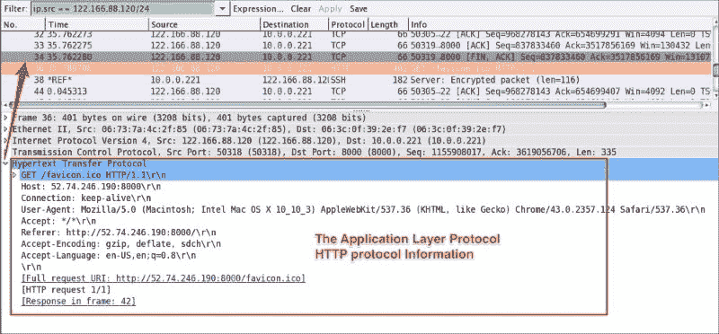

在接下来的章节中，我们将更详细地讨论与应用相关的协议。

## 数据包字节窗格

数据包字节窗格显示帧中包含的字节，突出显示的区域设置为数据包细节窗格中选择的节点。

# Wireshark 功能

Wireshark 加载了一些令人敬畏的特性。让我们看几个，虽然还有更多。

## 解码为

Decode-As 功能允许 Wireshark 根据所选协议对数据包进行解码。通常，Wireshark 会根据标准端口自动识别和解码传入的数据包，例如，端口`443`将被解码为 SSL。如果服务在非标准端口上运行，例如 SSL 标准端口是`443`而服务在`4433`上运行，在这种情况下，Decode-As 功能可用于使用 SSL 协议首选项对该通信进行解码。

从打开样本`https.pcap`文件。在 Wireshark 中打开该文件时，会捕获 HTTPS 流量。它不显示 SSL 相关的数据；相反，它只显示所有 TCP 通信:

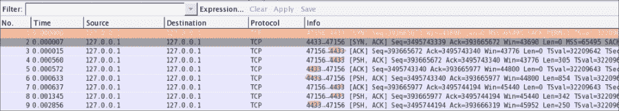

要将此流量解码为 SSL，请执行以下步骤:

1.  Click on **Analyze** | **Decode As**: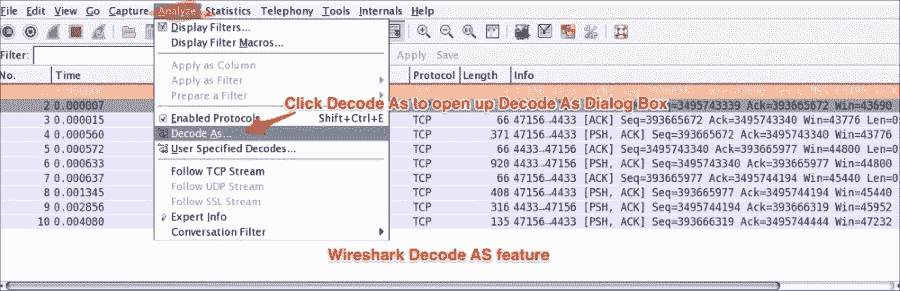
2.  The **Decode As** popup will appear as shown in the following screenshot. Choose the protocol (**SSL** in this example) that is required for decoding the given traffic: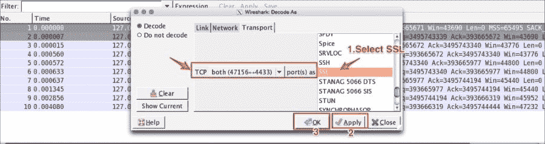
3.  The SSL traffic protocol is shown in Wireshark: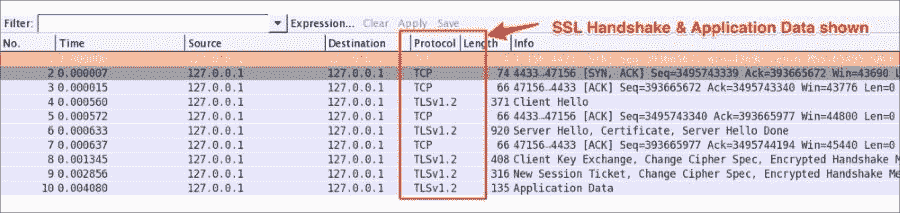

### 注意

SSL 解码并不意味着它已经解密了 SSL 数据。

## 协议首选项

协议首选项功能为您提供了定制 Wireshark 显示处理方式和数据包分析方式的灵活性。您可以通过以下方法之一设置协议首选项:

*   进入**编辑** | **偏好设置** | **协议**调整设置
*   一个简单的方法是右键单击数据包细节窗格中的协议，并选择**协议首选项**

Wireshark 支持大量协议及其首选项，例如 HTTP 协议首选项及其在下表中定义的含义:

| 

HTTP 协议首选项

 | 

这是什么意思？

 |
| --- | --- |
| 重组跨越多个 TCP 段的 HTTP 头 | 如果 HTTP 头通过多个 TCP 段传输，HTTP 解析器将重新组装 HTTP 头 |
| 重组跨越多个 TCP 段的 HTTP 主体 | 如果 HTTP 主体通过多个 TCP 段传输，HTTP 解析器将重新组装它 |
| 重新组装分块的传输编码几何体 | 重新组装跨段的所有块，并将它们添加到有效载荷中 |
| 解压缩实体主体 | 用于压缩数据的可视化(`.gzip`或编码) |
| SSL/TLS 端口 | 添加/删除 SSL/TLS 端口(默认为`443`) |
| 自定义 HTTP 头字段 | 定义新的标题字段 |

以下屏幕截图显示了 Wireshark 中的 HTTP 协议首选项:

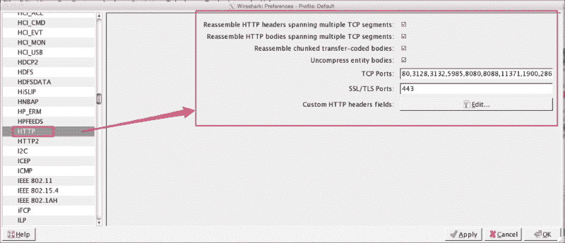

### Tip

参考[第 05 章](part0041_split_000.html#173722-30546b3f1d4045fcb01d610f6dbd3a07 "Chapter 5. Analyzing Application Layer Protocols")、*中查找 top HTTP 响应时间的例子分析使用协议首选项时 DHCP、DHCPv6、DNS、HTTP 协议*。

## IO 图

使用 IO 图检查客户端和服务器交互数据进行有意义的分析。Wireshark IO 图测量吞吐量(速率为每滴答一个数据包)，其中每滴答为一秒。在本例中，我们将了解如何利用 IO 图。在 Wireshark 中打开文件`http_01.pcap`,并按照给定的步骤操作:

1.  点击**统计** | **IO 图**。
2.  将出现 **IO 图形**对话框。
3.  在 **IO 图形**对话框中，尝试找到尖峰并点击它。
4.  当您单击图表(高位区域)时，Wireshark 会自动在数据包列表窗格中显示相应的数据包。

    ### 注意

    在给定的例子中,有许多重复的 ack .

5.  返回到 **IO 图形**对话框。
6.  选择**图表 2** 并输入`tcp.analysis.duplicate_ack`。
7.  点击**图表 2** 应用过滤器。
8.  **IO 图**对话框将显示重复 ACK 的吞吐量。

IO 图有很多用例。其中一些如下:

*   使用 IO 图分析流量模式，例如通过在协议上绘制图表来分析流量如何分布，例如`tcp`、`http`、`udp`、`ntp`和`ldap`。
*   执行安全分析时，IO 图会派上用场。IO 图的更多例子可以在[第 07 章](part0051_split_000.html#1GKCM1-30546b3f1d4045fcb01d610f6dbd3a07 "Chapter 7. Security Analysis")、*网络安全分析*中找到。

以下屏幕截图显示了前面步骤的结果:

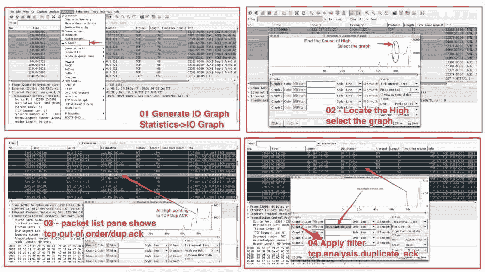

## 跟随 TCP 流

TCP 流特性允许用户查看来自 TCP 流的数据。在 Wireshark 中打开文件`http_01.pcap`，按照 TCP 流获取第一个 HTTP OK，如图所示:

在本例中，我们在数据包#35 上找到 HTTP OK，然后右键单击并选择**跟随 TCP 流**:

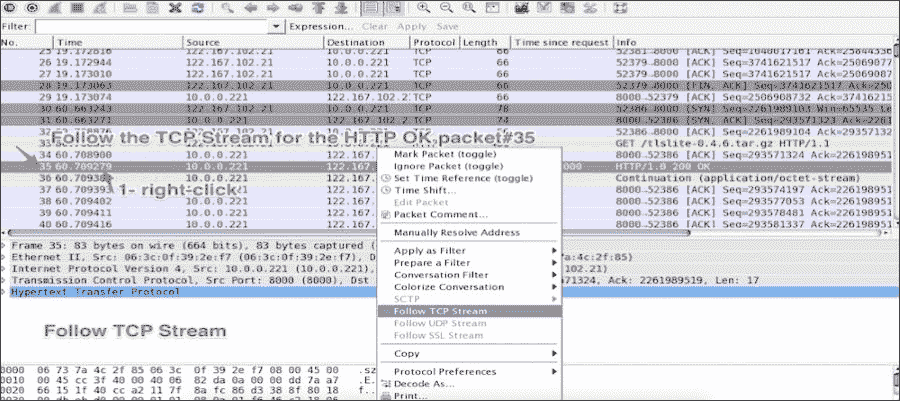

一旦应用了流，一个 TCP 流对话框将打开，显示在这个 HTTP 对话中发送了哪个请求和接收了什么响应:

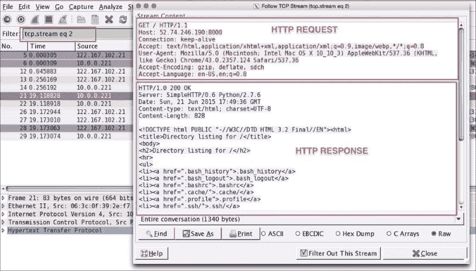

流内容有六种格式，如图所示；截图中的红色内容是请求，截图中的蓝色内容是响应:

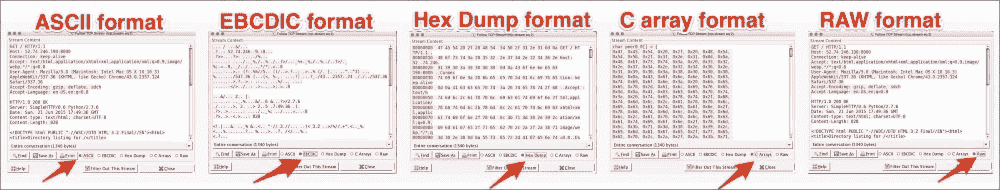

## 导出显示的数据包

**导出指定数据包**功能允许您在不同的文件中导出过滤后的数据包。比如在 Wireshark 中打开`http.pcap`，导出 HTTP OK 包。导出指定数据包的步骤如下:

1.  Apply the filter `http.response.code == 200` in the **Filter** bar: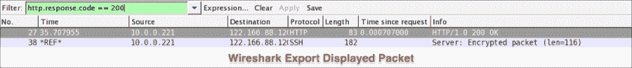
2.  Go to **File** | **Export Specified Packets**. This opens up the dialog box with the export options, as shown: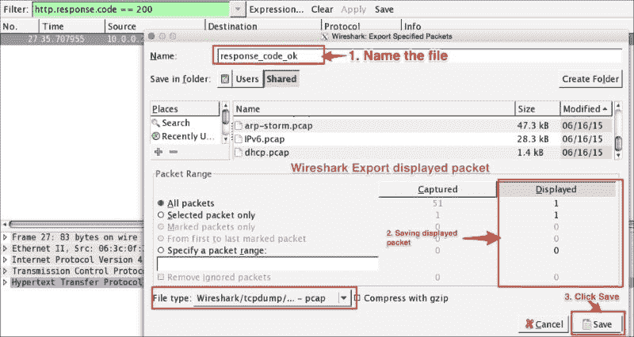

## 生成防火墙 ACL 规则

使用 Wireshark，网络管理员可以为防火墙产品生成 ACL 规则，例如:

*   思科 IOS
*   IP 过滤器(IP 过滤器)
*   IP 防火墙(ipfw)
*   网络过滤器(iptables)
*   分组过滤器
*   Windows 防火墙(netsh)

### Tip

存在 MAC 地址和 IPv4 地址的规则；该筛选器支持 TCP、UDP 端口和 IPv4 端口组合。

在 Wireshark 中生成 ACL 规则的步骤如下:

1.  Go to **Tool** | **Firewall ACL Rules**: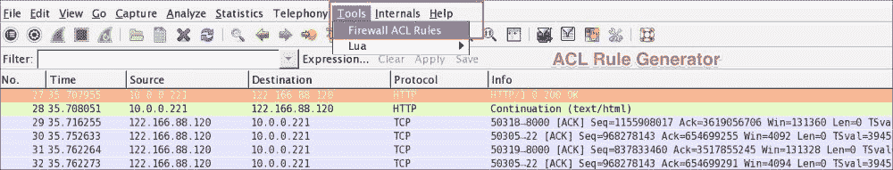
2.  The **Firewall ACL Rules** dialog box will appear. Choose **Product** and **Filter**, specify the **ACCEPT/DENY** criteria, and a rule will be generated by Wireshark in this dialog box, as shown: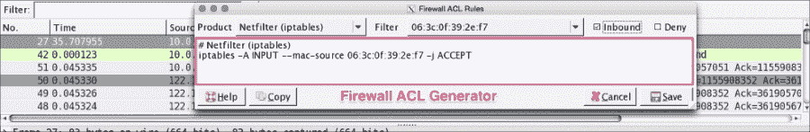

# Tcpdump 和 snoop

在生产环境中，通常不会安装诸如 Wireshark 之类的数据包捕获工具。在这种情况下，可以使用缺省捕获工具，例如用于(Linux 系统)的`tcpdump`和`snoop`(Solaris 缺省)；稍后，可以在 Wireshark 中使用捕获的文件进行分析:

*   `snoop`:这个工具捕获并检查网络数据包，并在 Sun Microsystems CLI 上运行
*   这个工具在网络上转储流量，可以在 Windows、OS X 和 Linux 上运行

例如，下表显示了如何检查来自接口的数据包:

| 

描述

 | 

Solaris

 | 

Linux 操作系统

 |
| --- | --- | --- |
| 如何检查来自所有接口的数据包 | `bash# snoop` | `bash#tcpdump –nS` |
| 如何用主机名捕获 | `bash# snoop hostname` | `bash# tcpdump host hostname` |
| 如何将捕获的信息写入文件 | `snoop -o filename` | `bash# tcpdump -w filename` |
| 如何在`host1`和`host2`之间捕获数据包并保存到文件中 | `snoop -o capture_file.pcap host1 host2` | `tcpdump -w capture_file.pcap src host1 and dst host2` |
| 如何捕获详细输出到屏幕的流量 | `snoop -v -d eth0``snoop -d eth0 -v port 80` | `tcpdump -i eth0`非常冗长的`tcpdump`选项:`tcpdump -i eth0 -v port 80``tcpdump -i eth0 -vv port 80` |
| 如何设置快照长度 | `snoop -s 500` | `tcpdump -s 500` |
| 如何捕获所有字节 | `snoop –s0` | `tcpdump –s0` |
| 如何捕获 IPv6 流量 | `snoop ip6` | `tcpdump ip6` |
| 如何捕获协议 | `snoop multicast``snoop broadcast``snoop bootp``snoop dhcp``snoop dhcp6``snoop pppoe``snoop ldap` | `tcpdump -n "broadcast or multicast"``tcpdump udp``tcpdump tcp``tcpdump port 67``tcpdump port 546``tcpdump port 389` |

# 参考文献

您也可以参考以下链接，了解本章所涵盖主题的更多信息:

*   [https://www.wireshark.org/docs/wsug_html_chunked/](https://www.wireshark.org/docs/wsug_html_chunked/)
*   [https://wiki.wireshark.org/CaptureSetup/Ethernet](https://wiki.wireshark.org/CaptureSetup/Ethernet)
*   [https://goo.gl/vxI2jk](https://goo.gl/vxI2jk)

# 总结

在本章中，我们学习了如何使用 Wireshark GUI。然后我们探讨了什么是捕获过滤器和显示过滤器，如何设置捕获，牢记性能，以及如何在生产或远程捕获中利用其他捕获工具，如`tcpdump`和`snoop`。然后，我们了解了一些 Wireshark 功能，如 ACL 规则生成、IO 图、解码、导出数据包和协议首选项。

在下一章中，我们将学习 TCP 协议，并通过实验练习讨论其实际使用案例，这将有助于解决常见的网络问题(我们还将提供解决方案)。