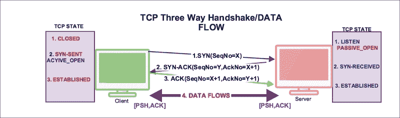

# 三、分析 TCP 网络

TCP 旨在成为多种网络中常用的主机对主机协议。在本章中，我们将通过实验练习和例子详细分析 TCP 协议。

本章涵盖以下主题:

*   重述 TCP
*   TCP 连接建立和清除
*   TCP 故障排除
*   TCP 延迟问题
*   Wireshark TCP 序列分析

# 重述 TCP

**传输** **控制协议** ( **TCP** )最早定义于 RFC 675，v4 规范问世于 RFC 793。TCP 提供:

*   面向连接的 TCP 会话的建立和拆除
*   该服务发送和接收字节流，而不是消息，并保证接收的所有字节都与发送的字节相同，并且顺序正确
*   可靠的有序交付使用序列号来恢复被损坏、丢失、复制或由互联网通信系统无序交付的数据
*   流量控制防止接收方的缓冲空间溢出
*   拥塞控制(如 RFC 5681 中所定义的)算法有:慢启动、拥塞避免、快速重传和快速恢复
*   多路复用；每个 TCP 会话都有两个逻辑管道；进出管道

## TCP 报头字段

每个 TCP 数据段都有一个 20 字节的报头和可选的数据值，如下图所示，在 Wireshark 数据包详细信息窗格中显示了一个 TCP 帧:


下表描述了标题字段和 Wireshark 过滤器及其说明:

| 

TCP 报头

 | 

Wireshark 过滤器名称

 | 

描述

 |
| --- | --- | --- |
| 源端口(16 位) | `tcp.srcport` | 发送者端口 |
| 目的端口(16 位) | `tcp.dstport` | 接收器端口 |
| 序列号(32 位) | `tcp.seq` | 定义 ISN 并控制 TCP 的状态 |
| 确认号(32 位) | `tcp.ack` | ACK 包含主机想要接收的下一个 SEQNo |
| 标志(9 位) |   | `tcp.flags` | 控制位 |
| 内向的; 寡言少语的; 矜持的 | `tcp.flags.res` | 供将来使用 |
| 目前 | `tcp.flags.ns` | 实验的 |
| 连续焊接轨 | `tcp.flags.cwr` | 拥塞窗口减少 |
| 电子通信网络 | `tcp.flags.ecn` | 回声报 |
| 急迫的 | `tcp.flags.urg` | 设置紧急指针字段 |
| 确认 | `tcp.flags.ack` | 确认已设置 |
| 推 | `tcp.flags.push` | 推送数据 |
| 重置 | `tcp.flags.reset` | 重置连接 |
| synchronizing 同步 | `tcp.flags.syn` | 同步序列号 |
| 鳍状物 | `tcp.flags.fin` | 没有更多数据 |
| 窗口大小(16 位) | `tcp.window_size` | 用于在三次握手中通告窗口大小 |
| Checksum (16 bits) | `tcp.checksum` | 错误检查 |
| 紧急指针(16 位) | `tcp.urgent_pointer` | 通知接收者该段中的一些数据是*紧急的*(序列号< =紧急消息< =序列号+紧急指针) |
| 可被 32 整除的选项(0-132 位) | `tcp.options` | 选项，如最大段大小、**无操作** ( **NOP** )、窗口比例、时间戳、SACK 允许 |

## TCP 状态

连接在其生命周期中经历一系列状态。这些状态是:

| 

TCP 状态

 | 

描述

 |
| --- | --- |
| 听 | 服务器对传入连接开放。 |
| 同步发送 | 客户端已经启动了连接。 |
| 同步接收 | 服务器已收到连接请求。 |
| 确定的 | 客户端和服务器已经准备好进行数据传输，连接已经建立。 |
| 鳍-等待-1 | 客户端或服务器已经关闭了套接字。在 Linux 中，默认值是 60 毫秒:

```
[bash ~]# cat /proc/sys/net/ipv4/tcp_fin_timeout
60

```

 |
| 鳍-等待-2 | 客户端或服务器已释放连接。在 Linux 中，默认值是 60 毫秒:

```
[bash ~]# cat /proc/sys/net/ipv4/tcp_fin_timeout
60

```

 |
| 关闭-等待 | 客户端或服务器没有关闭套接字。`CLOSE_WAIT`状态不会过期。 |
| 最后确认 | 等待来自客户端的待定确认。这是 TCP 与客户端对话的最后阶段。 |
| 时间-等待 | `TIME_WAIT` 表示本地应用关闭了连接，对方确认并发送了自己的 FIN。在 Linux 中，默认值是 60 毫秒:

```
[bash ~]# cat /proc/sys/net/ipv4/tcp_fin_timeout
60
```

 |
| 关闭的 | 虚构的国家 |

### 注意

这个套接字命令行实用工具可用于监控网络连接及其状态:

```
[bash ~]ss -nt4 state CLOSE-WAIT
[bash ~]ss -nt4 state ESTABLISHED
[bash ~]netstat -an | grep CLOSE-WAIT
[bash ~]netstat -an | grep ESTABLISHED

```

# TCP 连接建立和清除

在这一节中，我们将学习 TCP 如何打开和关闭它的连接。为了建立连接，使用三次握手过程，如下节所述。

## TCP 三次握手

三次握手是从客户端套接字到服务器套接字的连接建立过程，如下图所示:


在 TCP 三次握手的开始之前，客户端将处于`CLOSED`状态，服务器将处于`LISTEN`状态，如图所示:

| **序列号** | **TCP-A(122.167.84.137)状态** | **流量 CTL** | **TCP-B (10.0.0.221)状态** |
| **来自** | **至** | **来自** | **至** |
| one | 关闭的 |   |   | 关闭的 | 听 |

> TCP 状态机

要在 Wireshark 中检查三次握手，请打开书中提供的`normal-connection.pcap`文件。

### 握手信息–第一步[SYN]

握手过程的第一步是套接字客户机将构造一个 SYN 包，并将其发送给服务器。在此过程中，套接字客户端将执行以下任务:

1.  `tcp.flags.syn`被设置为`1`，其 SYN 包由客户端发送。
2.  客户端生成并设置`tcp.seq=3613047129`**初始序列号** ( **不是**)。Wireshark 默认显示相对序列号；用户可以在**编辑** | **首选项** | **协议** | **TCP |相对序列号**下更改此设置。
3.  客户端设置`tcp.ack =0`。
4.  `tcp.window_size`被通告给服务器，它的值在包`tcp.window_size_value == 65535,`中，包`tcp.window_size_value == 65535,`告诉服务器它可以根据 MSS 传输多达`65535`字节的数据。例如，如果 MSS 是 1440 字节，则客户端可以传输 45 个数据段。
5.  TCP 客户端包括其他`tcp.options`如**最大段尺寸** ( **MSS** )、**无操作** ( **NOP** )、窗口规模、时间戳、SACK 允许。
6.  客户端在“选择性确认”处理中选择`tcp.options.sack_perm == 1`。
7.  TSval/TSecr 是时间戳`tcp.options.timestamp.tsval == 123648340`。

下表描述了第一个握手消息的状态转换:

| **Sr 号** | **TCP-A(122.167.84.137)状态** | **流量 CTL** | **TCP-B (10.0.0.221)状态** |
| **来自** | **至** | **来自** | **至** |
| one | 关闭的 |   |   | 关闭的 | 听 |
| Two | 关闭的 | 同步发送 |  | 听 |   |

> TCP 状态机更改同步发送

### 握手消息–第二步[SYN，ACK]

在这个过程中，服务器响应客户端的 SYN:

1.  服务器设置`tcp.flags.syn =1`和`tcp.flags.ack=1`，确认 SYN 已被接受。
2.  服务器生成并设置 ISN `tcp.seq=2581725269`。
3.  服务器将`tcp.ack=3613047130`设置为客户端`tcp.seq+1`。
4.  服务器将`tcp.window_size_value == 26847`设置为服务器窗口大小。
5.  服务器设置`tcp.options`并响应客户端。

下表描述了第二握手消息的状态转换:

| **Sr 号** | **TCP-A(122.167.84.137)状态** | **流量 CTL** | **TCP-B (10.0.0.221)状态** |
| **来自** | **至** | **来自** | **至** |
| one | 关闭的 |   |   | 关闭的 | 听 |
| Two | 关闭的 | 同步发送 |  | 听 |   |
| three | 同步发送 |   | <seq><ack></ack></seq> | 听 | 同步接收 |

> 当服务器发送 SYN-RECEIVED 时，TCP 状态机发生变化

### 握手消息–第三步[ACK]

在成功交换该消息后，将在该连接中建立 TCP 连接:

1.  客户端设置`tcp.flags.ack == 1`并发送给服务器。
2.  客户端`tcp.seq=3613047130`是 ISN+1，`tcp.ack=2581725270`是`SYN_ACK( tcp.seq+1)`。
3.  再次设置客户端窗口大小，这将由服务器`tcp.window_size_value == 4105`使用。

### Tip

`tcp.analysis.flags`向您显示包含来自 Wireshark 的某种专家消息的数据包。

下表描述了第三个握手消息的状态转换:

| **Sr 号** | **TCP-A(122.167.84.137)状态** | **流量 CTL** | **TCP-B (10.0.0.221)状态** |
| **来自** | **至** | **来自** | **至** |
| one | 关闭的 |   |   | 关闭的 | 听 |
| Two | 关闭的 | 同步发送 |  | 听 |   |
| three | 同步发送 |   | <seq><ack></ack></seq> | 听 | 同步接收 |
| four | 同步发送 | 确定的 | <seq>><ack></ack></seq> | 同步接收 | 确定的 |

> 客户端发送 ACK 时的 TCP 状态机

# TCP 数据通信

一旦建立了三向连接，数据就通过交换数据段进行通信，并且`PUSH`标志被置位以指示数据作为八位字节流在连接上流动，如下图所示:



从`normal-connection.pcap`文件中选择**包#4** ，如下图所示；在数据包详细信息窗格中展开 TCP 部分:


正如您在前面的屏幕截图中看到的:

1.  服务器正在向客户端发送数据包中显示的数据。
2.  服务器设置`tcp.flags.push = 1`。
3.  服务器设置`tcp.flags.ack =1`。
4.  服务器数据为(29 字节)，数据值为:`414e495348204e415448204e4f524d414c20434f4e4e4543...`。
5.  服务器设置`(tcp.flags.ack == 1) && (tcp.flags.push == 1)`；也就是说，`[PSH,ACK]`标志表示主机正在确认接收到一些先前的数据，并且还在发送一些更多的数据。

有用的 Wireshark 显示过滤器有:

*   `data`: Displays the packet that contains the data information, for all IPs:
*   `data && ip.addr==10.0.0.221`:显示有数据并与给定 IP 地址交换的数据包列表
*   `tcp.flags.push == 1`:显示所有`PUSH`数据包
*   `tcp.flags.push == 1 && ip.addr==10.0.0.221`:显示主机间的`PUSH`数据包
*   `tcp.flags == 0x0018`:显示所有`PSH, ACK`数据包
*   `tcp.flags == 0x0011`:显示所有`FIN, ACK`数据包
*   `tcp.flags == 0x0010`:显示所有`ACK`数据包

# TCP 关闭序列

当客户端或服务器确定所有数据都已发送到接收方，我们可以关闭连接时，TCP normal close 出现。关闭 TCP 连接有三种方式:

*   客户端通过向服务器发送一个`FIN`包来开始关闭连接
*   服务器通过向客户端发送一个`FIN`包来开始关闭连接
*   Both client and server initiate closing the connection

打开`normal-connection.pcap`文件，并在数据包列表窗格中选择数据包#5。进入 Wireshark 数据包详细信息窗格，如屏幕截图所示，检查 TCP 协议。

在 Wireshark 中，将**序列号**和**确认号**添加到列中。要添加序列号和确认号，选择 TCP 报头数据包，右键单击数据包详情中的字段(**序列号** / **确认号**)并选择**显示为列**。或者实现这些设置来添加新列:

*   进入**编辑** | **首选项** | **栏目**。然后添加一个新列，选择**“custom”:TCP . seq**。
*   进入**编辑** | **首选项** | **栏目**。然后添加一个新列，选择**“自定义”:tcp.ack** 。

服务器已经启动了`FIN`数据包。数据传输完成后，请参见以下屏幕截图中的数据包#5:


正如您在前面的屏幕截图中看到的:

*   服务器启动`FIN`数据包以关闭数据包#5 中的连接
*   服务器设置`[FIN,ACK] (tcp.flags.fin == 1) && (tcp.flags.ack == 1)`并发送给客户端
*   服务器序列号`tcp.seq == 2581725299`在包#7 中得到确认
*   客户端正在启动`FIN`以关闭数据包#8 中的连接
*   客户端设置`[FIN,ACK] (tcp.flags.fin == 1) && (tcp.flags.ack == 1)`并发送给服务器
*   客户端序列号`tcp.seq == 3613047130`在数据包#9 中得到确认

TCP 状态机当服务器和客户端关闭 socket 连接时，服务器发起`FIN`:

| **Sr 号** | **TCP-A(122.167.84.137)状态** | **流量 CTL** | **TCP-B (10.0.0.221)状态** |
| **来自** | **至** | **来自** | **至** |
| one | 关闭的 |   |   | 关闭的 | 听 |
| Two | 关闭的 | 同步发送 |  | 听 |   |
| three | 同步发送 |   | <seq><ack></ack></seq> | 听 | 同步接收 |
| four | 同步发送 | 确定的 | SEQ = 3613047130 > ><ack></ack> | 同步接收 | 确定的 |
| five | 确定的 | 确定的 | <seq>><ack></ack></seq> | 确定的 | 确定的 |
| six | 确定的 | 确定的 | <seq>><ack></ack></seq> | 确定的 | 确定的 |
| seven | 确定的 | 确定的 | <seq>><ack></ack></seq> | 确定的 | FIN_WAIT-1 |
| eight | 确定的 | 关闭 _ 等待 | <seq>><ack></ack></seq> | FIN_WAIT-1 | FIN_WAIT-2 |
| nine | 关闭 _ 等待 | LAST_ACK | SEQ = 3613047130 > ><ack></ack> | FIN_WAIT-2 | 时间 _ 等待 |
| Ten | LAST_ACK | 关闭的 |   | 时间 _ 等待 | 关闭的 |

此场景中使用的 Wireshark 过滤器如下:

*   `tcp.analysis:SEQ/ACK`:提供匹配序列号/确认号段的链接
*   `tcp.connection.fin`:提供专家信息
*   `tcp.flags == 0x0011`:显示所有的`[FIN,ACK]`数据包

# 实验室练习

捕获普通 TCP 连接流的步骤(本书提供了一个示例程序)如下:

1.  打开 Wireshark，开始捕获数据包，并选择显示过滤器`tcp.port==8082`。
2.  使用`javac`命令编译 Java 程序`TCPServer01.java`:

    ```
    bash$ ~ javac TCPServer01.java

    ```

3.  使用`java`命令运行`TCPServer01`:

    ```
    bash$ ~ java TCPServer01

    ```

4.  验证服务器正在监听端口`8082` :

    ```
    bash$ ~ netstat -an | grep 8082
    tcp46      0      0  *.8082                 *.* LISTEN 

    ```

5.  使用`javac`命令编译客户端程序`Client0301.java`:

    ```
    bash$ ~ javac Client0301.java 

    ```

6.  运行客户端程序:

    ```
    bash$ ~ java Client0301

    ```

7.  在 Wireshark 中查看和分析数据包。

# TCP 故障排除

在本节中，我们将了解出现的各种网络问题，并尝试通过实验练习来分析和解决这些问题。先说`Reset` ( `RST`)包。

## TCP 复位序列

TCP `RST`标志重置连接。它指示接收方应该删除该连接。接收器根据序列号和报头信息删除连接。如果接收者上不存在连接，则设置`RST`，由于异常行为，它可以在 TCP 连接生命周期中的任何时间出现。让我们举一个例子:一个`RST`包在收到`SYN/ACK`后被发送，如下图所示。

### SYN-ACK 后的 RST

在本例中，我们将了解为什么`RST`被设置在`SYN-ACK`之后，而不是`ACK`:


在 Wireshark 中打开`RST-01.pcap`文件:


如上图所示:

*   TCP `RST` 数据包应该看不到
*   TCP `RST`在前两次握手完成后设置。一种可能的解释是:

    *   客户端连接从未存在过；通过 TCP 服务器发送原始数据包
    *   客户端中止其连接
    *   序列号被更改/伪造

### 席恩之后的 RST

这是最常见的用例。在 Wireshark 中打开`RST-02-ServerSocket-CLOSED.pcap`文件。在本例中，服务器没有启动，客户端试图建立连接，连接拒绝了一个`RST`数据包:


### 实验室练习

当服务器不处于监听状态时，在一般情况下生成`RST`标志的步骤如下:

1.  打开 Wireshark，开始捕获数据包，并选择显示过滤器`tcp.port==8082`。
2.  编译客户端程序`Client0301.java` :

    ```
    bash$ ~ javac Client0301.java 

    ```

3.  运行客户端程序:

    ```
    bash$ ~ java Client0301

    ```

4.  在 Wireshark 中查看和分析`RST`数据包。

## TCP 关闭 _ 等待

通常一个连接被卡在`CLOSE_WAIT`状态。这种情况通常发生在接收方等待来自对等方的连接终止请求时。


### Tip

要找到处于`CLOSE_WAIT`状态的套接字，使用以下命令:

```
bash:~ $ netstat -an | grep  CLOSE_WAIT
tcp4       0      0  122.167.127.21.56294    10.0.0.21.9999     CLOSE_WAIT

```

要演示状态，请在 Wireshark 中打开`close_wait.pcap`文件:


正如您在前面的屏幕截图中看到的:

1.  服务器关闭套接字包#5，设置`tcp.flags.fin == 1`，并设置`tcp.seq == 2131384057`。
2.  客户端用数据包#7 中的`ACK`数据包`tcp.ack == 2131384058`进行响应，并且没有关闭它的套接字，套接字保持在`CLOSE_WAIT`状态。

`CLOSE_WAIT`表示应用代码有问题，在高流量环境下，如果`CLOSE_WAIT`持续增加，会使您的应用进程变慢，甚至崩溃。

### 实验室练习

再现`CLOSE_WAIT`的步骤如下:

1.  打开 Wireshark，开始捕获数据包，并选择显示过滤器`tcp.port==9999`。
2.  使用`javac`命令编译 Java 程序`Server0302.java`和`Client0302.java`:

    ```
    bash$ ~ javac Server0302.java Client0302.java 

    ```

3.  使用`java`命令运行`Server0302`:

    ```
    bash$ ~ java TCPServer01

    ```

4.  验证服务器正在监听端口`9999` :

    ```
    bash $ netstat -an | grep 999
    tcp46      0      0  *.9999                 *.* LISTEN 

    ```

5.  运行客户端程序:

    ```
    bash$ ~ java Client0302

    ```

6.  检查 TCP 套接字的状态；它将处于`CLOSE_WAIT`状态:

    ```
    bash $ netstat -an | grep CLOSE_WAIT
    tcp4       0      0  127.0.0.1.56960     127.0.0.1.9999         CLOSE_WAIT

    ```

7.  在 Wireshark 中分析数据包。

#### 如何解析 TCP 关闭状态

步骤如下:

1.  要删除`CLOSE_WAIT`，需要重新启动程序。
2.  解决`CLOSE_WAIT`问题需要从客户端和服务器建立`FIN`包。处理完记录后关闭客户端套接字和服务器套接字:

    ```
    socket.close(); à Initiates the FIN flow

    ```

3.  打开`Client0302.java`文件，关闭套接字:

    ```
    Socket socket = new Socket(InetAddress.getByName("localhost"), 9999);
    …
    socket.close();
    …
    Thread.sleep(Integer.MAX_VALUE);

    ```

4.  编译并重新运行 Java 程序。`CLOSE_WAIT`将不可见。

## TCP 时间 _ 等待

`TIME_WAIT`状态的主要目的是当一端位于`LAST_ACK`或`CLOSING`重发`FIN`并且一个或多个`ACK`丢失时，优雅地关闭连接。

RFC 1122: " *当一个连接被主动关闭时，它必须在 TIME-WAIT 状态停留一段时间 2xMSL(最大段生存期)。但是，它可以接受来自远程 TCP 的新 SYN，以直接从时间等待状态重新打开连接，如果...*

我们忽略条件，因为我们无论如何都处于`TIME_WAIT`状态。

# TCP 延迟问题

到目前为止，我们一直在排除与连接相关的问题。在本节中，我们将检查延迟部分。延迟可能出现在网络上，也可能出现在客户端或服务器的应用处理中。

## 潜伏的原因

识别延迟的来源在 TCP 故障排除中也起着重要的作用。让我们看看延迟的常见原因是什么:

*   可以使用`ping`实用工具测量网络慢速线路延迟
*   太多正在运行的进程会消耗内存。检查内存管理，使用 free，top 命令识别 CPU 和内存使用情况
*   应用启动时没有足够的内存或无法满足更多的请求
*   错误的 TCP 调整；验证`/etc/sysctl.cnf`文件
*   网络抖动；验证您的网络，并与网络管理员核实
*   编码差；通过在网络上执行负载测试来对您的代码进行基准测试
*   网关设置错误；检查网关，检验路由表，并检验网关
*   更高的跳数；执行跟踪路由并检查跳数(跳数越多，延迟增加越多)
*   网卡接口慢，接口宕机；检查网卡并验证其速度

## 识别潜伏期

各种网络实用工具可用于测量网络间的延迟，例如`traceroute`、`tcpping`和`ping`。

*   `ping`:该实用工具可用于测量**往返时间** ( **RTT** ):

    ```
    bash$ ping -c4 google.com
    PING google.com (216.58.196.110): 56 data bytes
    64 bytes from 216.58.196.110: icmp_seq=0 ttl=55 time=226.034 ms
    64 bytes from 216.58.196.110: icmp_seq=1 ttl=55 time=207.748 ms
    64 bytes from 216.58.196.110: icmp_seq=2 ttl=55 time=222.995 ms
    64 bytes from 216.58.196.110: icmp_seq=3 ttl=55 time=162.507 ms

    --- google.com ping statistics ---
    4 packets transmitted, 4 packets received, 0.0% packet loss
    round-trip min/avg/max/stddev = 162.507/204.821/226.034/25.394 ms

    ```

*   `traceroute`:用于标识到达目的地的跳数——跳数越少，延迟越低

## 服务器延迟示例

Wireshark 可以有效的用来识别是网络慢还是应用慢。在 Wireshark 中打开`slow_download.pcap`文件，调查下载缓慢的根本原因。

在本例中，从 HTTP 服务器请求 5 MB 的数据，大约需要。4.99 分钟下载，如图所示:


诊断该问题的步骤如下:

1.  进入**编辑** | **首选项** | **协议** | **HTTP** 然后启用所有 HTTP 重组选项。
2.  应用过滤器`http.response.code==200`。
3.  进入 **HTTP** ，将`http.time == 299.816907000`设置为大约 4.99 分钟。
4.  导航至`http.content_length_header == "5242880"`，检查文件的大小；这是内容的大小。
5.  检查已经发送了多少个 TCP 数据段—`tcp.segment.count == 2584`—并问自己是否需要这么多，是否可以减少数量。
6.  验证客户端和服务器的`window_size`,以检查客户端公布了什么以及使用了什么。
7.  在 **Wireshark** 栏中添加`tcp.window_size_value`并按升序排序。请注意，从服务器(`10.0.0.16`)到客户端(`122.167.205.152`)的整个数据包流的窗口大小为`100`。
8.  在 UNIX 风格的系统中验证`sysctl.conf`文件，检查 TCP 调优参数，如`net.core.rmem_max`、`net.core.wmem_max`、`net.ipv4.tcp_rmem`、`net.ipv4.tcp_wmemnet.ipv4.tcp_mem`。

### Tip

确保`tcp.window_size`足够大，以免减慢发送者的速度。窗口大小可以告诉你一个系统在处理输入数据时是否太慢；`tcp_window_size`表示系统慢，不是网络。

在这个场景中，`sysctl.conf`文件中的`tcp.window_size`被缩减，以展示`slow_download`行为，并提供对故障排除的深入了解。修复`Window_Size`后，同样的下载从`299.816907000`减少到`2.84`秒。打开`fast_download.pcap`文件，如下截图所示；下载时间缩短:


## 电线延迟

在这个示例中，TCP 握手过程将用于识别线路延迟。打开`slow_client_ack.pcap`文件，如下图所示:


正如您在前面的屏幕截图中看到的:

*   客户机/服务器通过线路发送的前两个握手消息(`SYN`、`SYN-ACK`)交换的时间更短
*   在最后一个握手消息中，客户端发送的`ACK`用了`frame.time_relative == 15.798777000`秒，显示从参考开始**时间增加。这高于前两个握手消息，这证实了此数据包的线路延迟**
*   一旦握手完成，操作正常恢复；所有分组的自参考以来的时间显示了一致的定时

# Wireshark TCP 序列分析

Wireshark 有一个内置的过滤器`tcp.analysys.flags`，它会向您显示包含来自 Wireshark 的某种专家消息的数据包；`tcp.analysis.flags`显示在**数据包详情**窗格的 **TCP** 部分。在此之下，展开**SEQ/确认分析**，然后展开 **TCP 分析标志**。这会告诉你到底是什么触发了`tcp.analysis.flags`。一些例子包括:

*   TCP 重传
*   TCP 快速重传
*   tcp 重复确认
*   TCP 零窗口
*   TCP ZeroWindowProbe

## TCP 重传

TCP 通过序列号和确认使数据段的传输变得可靠。当 TCP 传输包含数据的数据段时，它会在重传队列中放置一个副本，并启动一个计时器；收到该数据的确认后，该数据段将从队列中删除。如果在定时器超时前没有收到确认，则重新传输该数据段。在 TCP 重新传输过程中，序列号不会改变，直到发生重新传输超时。

在 Wireshark 中打开示例`tcp-retransmission.pcapng`，添加一个**序列号**列，如以下截图所示:


正如您在前面的屏幕截图中看到的:

*   在发送`tcp.seq == 1870089183`之后，发生了大量的 TCP 重传
*   大量 TCP 重新传输会导致操作超时

再比如，在 Wireshark 中打开文件`syn_sent_timeout_SSH.pcapng`，观察 TCP 重传流程。

### Tip

`KeepAlive`不是重传。

### 实验室练习

重现 TCP 重传的步骤如下(本实验在 CentOs6 中使用`telnet`和`nc`命令实用工具执行):

1.  设置两台机器:主机 A(服务器)和主机 B(客户机)。
2.  在主机 A 上启动服务器并配置防火墙规则，如下所示:

    ```
    [bash ~]# iptables -A OUTPUT -p tcp --dport 8082 -j DROP
    [bash ~]# iptables save
    [bash ~]# nc -l 8082

    ```

3.  在 HOST-B 机器上打开 Wireshark，开始捕获数据包，并选择 display filter `tcp.port==8082` *。*
4.  在 HOST-B 机器上运行 telnet 命令；将 IP 信息更改为您的实际服务器位置:

    ```
    [bash ~]telnet 128.136.179.233 8082

    ```

5.  验证主机 B 机器上的 TCP 状态:

    ```
    bash$ netstat -an |   grep 8082
    tcp4       0      0  192.168.1.101.64658    128.136.179.233.8082   SYN_SENT

    ```

6.  在 Wireshark 中，使用上一步查看并分析捕获的数据包。

为了解决操作超时问题，请检验 ACL 配置；它允许来自源 IP 的传入数据包。

## TCP 零窗口

在 Wireshark 中打开的`tcp_zero_window.pcapng`文件，并将`tcp.window_size_value`添加到该列中。

TCP 窗口大小表示在将数据传递到应用进程之前，设备一次可以处理来自对等方的多少数据。


如前面的屏幕截图所示:

*   将`window_size`添加到 Wireshark 列，并在`tcp.window_size=0`处查找数据包。
*   窗口大小为零的 TCP 报头表示接收方的缓冲区已满。这种情况对于写入来说比读取来得更快；在这种情况下，`tcp.window_size_value`被设置为`0`和`tcp.window_size == 0`。
*   该段正好是 1 个字节。

### Tip

TCP ZeroWindow 上从不设置`SYN` / `RST` / `FIN`标志。

`SYN`/`RST`/`FIN`TCP 窗口满时从不设置标志。

零窗口条件故障排除:

*   检查应用是否有足够的内存来启动
*   调整 TCP 参数以获得更大的窗口大小；用这些参数检查`sysctl.conf`文件:

    *   `net.core.rmem_max`
    *   `net.core.wmem_max`
    *   `net.ipv4.tcp_rmem`
    *   `net.ipv4.tcp_wmem`

*   检查接收器没有运行太多进程

## TCP 窗口更新

当窗口大小改变时，Wireshark 将数据包标记为窗口更新。窗口更新是一个`ACK`包，只扩展窗口；这是正常的 TCP 行为。

在 Wireshark 中打开`tcp_window_update.pcap`文件，观察到设置了一个 TCP 窗口更新事件，如图所示:


### 注意

窗口更新是一个 0 字节的数据段，其`SEQ` / `ACK`号与之前看到的数据段相同，并且具有一个新的窗口值。

## TCP Dup 备份

当有快速重传时，发送重复的 ack。在这种情况下，将会经常看到相同的片段。打开`duplicate_ack.pcapng`并应用`tcp.analysis.duplicate_ack`滤镜，如图所示:


正如你在前面的截图中看到的:

*   当窗口/SEQ/ACK 与前一段相同并且段长度为`0`时，出现重复 ACK
*   当有数据包丢失时，可能会出现重复的 ack，在这种情况下，可以看到重传

# 参考文献

在使用 TCP/IP 无限制时，以下参考资料将会很有用:

*   RFC675 TCP/IP 第一规范:[https://tools.ietf.org/html/RFC675](https://tools.ietf.org/html/RFC675)
*   RFC 793TCP v4:[https://tools.ietf.org/html/RFC793](https://tools.ietf.org/html/RFC793)
*   TCPWiki:[https://en.wikipedia.org/wiki/Transmission_Control_Protocol](https://en.wikipedia.org/wiki/Transmission_Control_Protocol)
*   TCP/IP 指南:[http://www.tcpipguide.com/](http://www.tcpipguide.com/)
*   请通过[https://ask.wireshark.org/](https://ask.wireshark.org/)向 Wireshark 咨询所有与 Wireshark 相关的问题
*   在:[https://www.wireshark.org/docs/dfref/t/tcp.html](https://www.wireshark.org/docs/dfref/t/tcp.html)显示 TCP 的过滤器引用
*   TCP 在:[https://wiki.wireshark.org/TCP_Analyze_Sequence_Numbers](https://wiki.wireshark.org/TCP_Analyze_Sequence_Numbers)分析序列号
*   有用的剪辑:[https://goo.gl/lVaEc9](https://goo.gl/lVaEc9)

# 总结

在本章中，你已经学习了 TCP 如何打开和关闭它的连接，以及在此期间 TCP 状态是如何保持的。本章还讲述了网络上出现的错误模式以及如何排除这些情况的故障。

在下一章中，我们将实现 SSL 协议的深度包检查。