# 四、分析 SSL/TLS

在本章中，我们将通过以下主题了解 SSL/TLS 的用途、整个握手过程是如何进行的，以及 SSL/TLS 握手失败的常见情况:

*   SSL/TLS 简介
*   Wireshark 的 SSL/TLS 握手协议
*   SSL/TLS—使用 Wireshark 解密通信
*   SSL/TLS—调试握手问题

# SSL/TLS 简介

**传输层安全** ( **TLS** )是**安全套接字层** ( **SSL** )的新名称。它提供了应用之间的安全传输连接，具有以下优势:

*   SSL/TLS 代表更高层的协议在第 7 层(应用层)工作
*   SSL/TLS 通过加密通信来提供机密性和完整性
*   SSL/TLS 允许对封闭用例进行客户端验证(可选)

## SSL/TLS 版本

在调试握手问题时，了解版本是极其重要的，因为大多数握手失败都发生在这个过程中。

Netscape 开发了最初的 SSL 版本和其他版本；它们的 RFC 编号如下表所示:

| 

草案

 | 

年

 | 

请求评论

 | 

反对

 |
| --- | --- | --- | --- |
| SSL 1.0 | 不适用的 | 不适用的 | 不适用的 |
| SSL 2.0 | One thousand nine hundred and ninety-five | 钠 | Y RFC 6176 |
| SSL 3.0 | One thousand nine hundred and ninety-six | RFC 6101 | Y RFC 7568 |
| TLS 1.0 | One thousand nine hundred and ninety-nine | RFC 2246 | 普通 |
| TLS 1.1 | Two thousand and six | RFC 4346 | 普通 |
| TLS 1.2 | Two thousand and eight | RFC 5246 | 普通 |
| TLS 1.3 | TBD | 起草 | 普通 |

## SSL/TLS 组件

SSL/TLS 分为四个主要的组件，如下图所示，本章将逐一详细介绍所有组件:

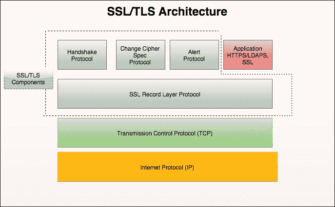

# SSL/TLS 握手

TLS 握手协议负责建立或恢复安全会话所需的认证和密钥交换。握手协议管理以下内容:

*   客户端和服务器将就密码套件协商、随机值交换和会话创建/恢复达成一致
*   客户端和服务器将获得预主秘密
*   客户端和服务器将交换它们的证书以向客户端验证它们自己(可选)
*   从预主秘密生成主秘密并交换它

## 握手消息的类型

有十种类型的消息，如下表所示，以及它们对应的 Wireshark 过滤器。这是握手协议中的一个字节字段:

| 

类型

 | 

草案

 | 

消息

 | 

Wireshark 内容类型

 | 

Wireshark 过滤器

 |
| --- | --- | --- | --- | --- |
| Zero | 握手 | 你好请求 | `ssl.record.content_type == 22` | `ssl.handshake.type == 0` |
| one | 客户你好 | `ssl.handshake.type == 1` |
| Two | 服务器你好 | `ssl.handshake.type == 2` |
| Eleven | 证书 | `ssl.handshake.type == 11` |
| Twelve | 服务器密钥交换 | `ssl.handshake.type == 12` |
| Thirteen | 证书申请 | `ssl.handshake.type == 13` |
| Fourteen | 服务器 HelloDone | `ssl.handshake.type == 14` |
| Fifteen | 证书验证 | `ssl.handshake.type == 15` |
| Sixteen | 客户端密钥交换 | `ssl.handshake.type == 16` |
| Twenty | 完成 | `ssl.handshake.type == 20` |
|   | ChangeCipherSpec |   | `ssl.record.content_type == 20` |   |
| 应用数据 | `ssl.record.content_type == 23` |
| 警报协议 | `ssl.record.content_type == 21` |

TLS 握手协议包括以下四个阶段的步骤:先决条件是应该建立 TCP 连接:

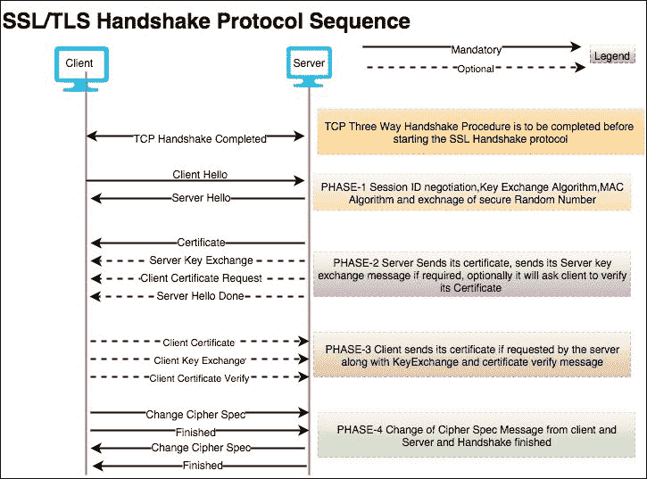

打开文件`two-way-handshake.pcap`，这是一个演示 SSL 相互认证过程的示例:

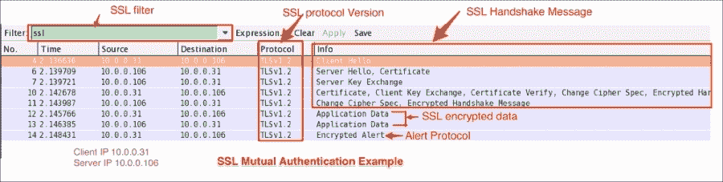

### 客户您好

TLS 握手从客户端问候消息`ssl.handshake.type == 1`开始，如下图所示:

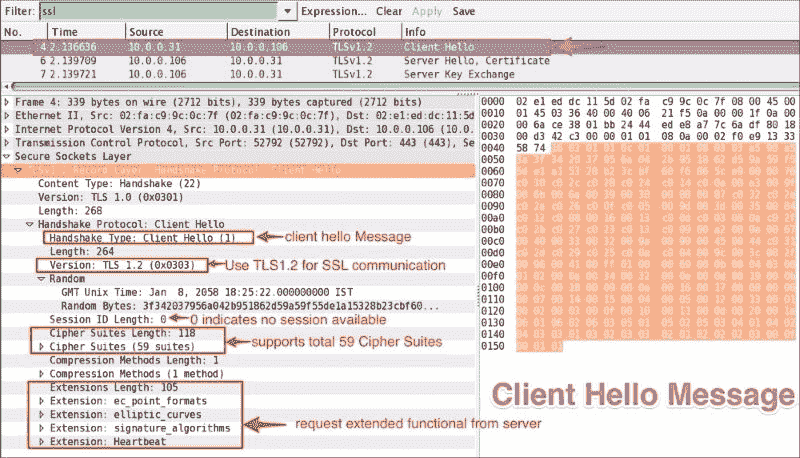

握手记录被识别为十六进制字节`0x16=22`。客户端问候消息的结构如下:

*   **消息**:客户端您好消息`0x01`。
*   **版本**:十六进制字节`0x0303`表示是 TLS 1.2 注意`0x300 =SSL3.0`。
*   **随机** :

    *   `gmt_unix_time`:标准 UNIX 32 位格式的当前时间和日期
    *   `Random bytes`:由安全随机数

    生成的 28 字节
*   **会话 ID** :十六进制字节 `0x00`显示会话 ID 为空；这意味着没有会话可用，并生成新的安全参数。
*   **Cipher suites**: The client will provide a list of supported cipher suites to the server; the first cipher suite in the list is the client-preferred (the strongest) one. The server will pick the cipher suites based on its preferences, the only condition being that the server must have client-offered cipher suites otherwise the server will raise an alert/fatal message and close the connection: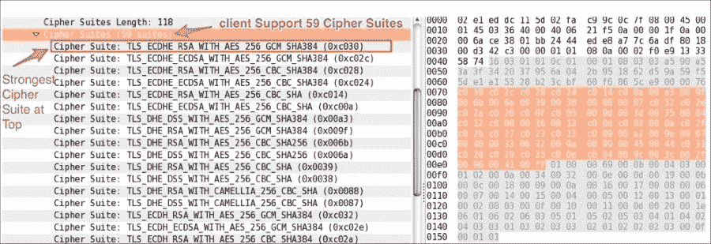
*   **压缩方式**:客户端会列出其支持的压缩方式。
*   **扩展**:客户端利用扩展向服务器请求扩展功能；在这种情况下，客户端请求了四个扩展，如下表所示:

| 

价值

 | 

扩展名

 | 

参考

 |
| --- | --- | --- |
| Zero | `elliptic_curve` | RFC4492 |
| one | `ec_point_formats` | RFC4492 |
| three | `signature_algorithms` | RFC 5246 |
| five | `heartbeat` | RFC 6520 |

### 注意

有关 TLS 扩展的完整列表，请访问:[http://www . iana . org/assignments/TLS-extension type-values/TLS-extension type-values . XHTML](http://www.iana.org/assignments/tls-extensiontype-values/tls-extensiontype-values.xhtml)。

### 服务器你好

服务器将发送服务器问候消息(`ssl.handshake.type == 2`)来响应客户端问候，如下面的截图所示。客户端 Hello 和服务器 Hello 消息的消息结构是相同的，只有一点不同，即服务器只能选择一个密码套件:

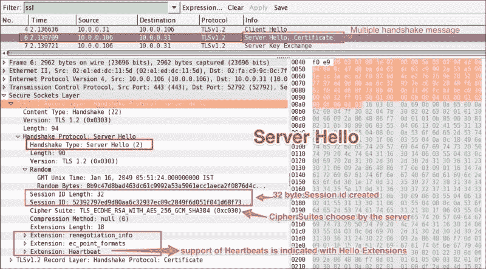

握手记录被识别为十六进制字节`0x16=22`。服务器问候消息的结构是:

*   **握手类型**:第个十六进制字节`0x02=2`显示服务器 Hello 消息
*   **版本**:十六进制字节`0x0303`显示 TLS 1.2 has 已被服务器接受服务器/客户端【sslv 2】【slv 3】

    【ssv 23】

    普通

    普通

    普通

    普通

    【sslv 3】

    普通

    和

    普通

    普通

    普通

    【

    【ssv 23】【

    普通

    【

    【

    和

    【

    【【【

    【)和

    普通

    普通

    普通

    【

    普通

    【tlsv 1.1】

    普通

    普通

    普通

    和

    普通

    【tlsv 1.2】

    普通

    普通

    和

    普通

    普通

    和

下表显示了哪个 SSL 版本的客户端可以连接到哪个 SSL 版本的服务器:

*   **会话 ID** :创建一个 32 字节的会话 ID，用于重新连接，无需握手
*   **密码套件** : 服务器选择了`Cipher Suite: TLS_ECDHE_RSA_WITH_AES_256_GCM_SHA384 (0xc030)`，这意味着使用**椭圆曲线 Diffie-Hellman**(**ECDHE**)密钥交换，RSA 用于认证，分组密码 Galois/Counter Mode (GCM)，AES-256 用于加密，SHA-384 用于摘要
*   **扩展**:在客户端问候消息中请求带有扩展信息的响应

### 服务器证书

服务器 Hello 消息发出后，服务器要发送一个 X.509 服务器证书(`ssl.handshake.type == 11`)。服务器上配置的证书由 CA 或中间 CA 签名，也可以根据您的部署进行自签名:

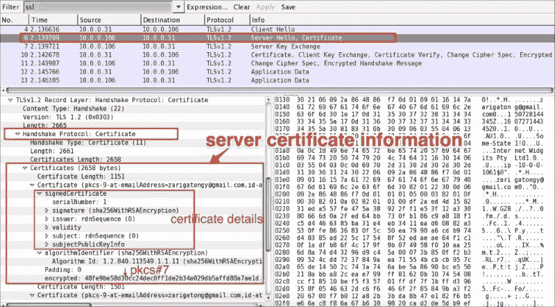

如果 SSL/TLS 服务器配置了证书链，则整个证书链将与服务器证书一起呈现给客户端。然后，客户端(浏览器或任何其他 SSL/TLS 客户端)可以用存储的 CA 证书检查链中的最高证书；通常，现代 Web 浏览器安装了来自可信 CA 提供商的根 CA。

给定证书由相关签名(`sha256WithRSAEncryption`)签署；在这种情况下，哈希值本身被连接到代表签名算法的 OID ( `Algorithm Id: 1.2.840.113549.1.1.11`)中。证书遵循 DER 编码格式，加密后成为加密消息语法标准 PKCS#7(参考 RFC 2315)。

### 服务器密钥交换

根据 RFC #5246，服务器仅在服务器证书消息(如果发送的话)不包含足够的数据来允许客户端交换预主密钥时，才发送服务器密钥交换消息(`ssl.handshake.type == 12`):

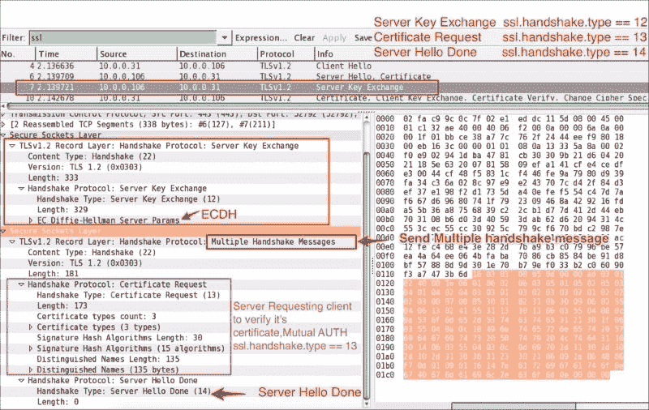

正如你在前面的截图中看到的:

*   密码套件包含密钥交换算法
*   将为以下密钥交换方法发送服务器密钥交换消息:`DHE_DSS`，`DHE_RSA,DH_anon`
*   根据 RFC#5246，使用服务器密钥交换对于以下密钥交换方法是不合法的:`RSA`、`DH_DSS`、`DH_RSA`

### 客户端证书请求

服务器可以选择性地要求客户端验证它的证书。为了支持相互认证，服务器将向客户端发送证书请求消息(`ssl.handshake.type == 13`)，客户端必须向服务器提供其证书信息。如果客户端无法提供，将生成一个警报协议，连接将终止。

### 服务器你好完成

服务器 Hello Done 消息意味着服务器完成了发送消息以支持密钥交换，并且客户端可以继续其密钥交换阶段:

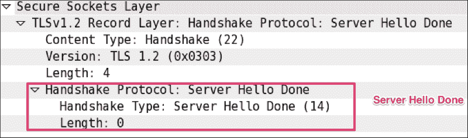

### 客户证书

只有在相互认证的情况下，客户端才会向发送其证书(`ssl.handshake.type == 11`)。服务器将在其 CA 链中验证证书。如果服务器验证`client_certificate`失败，服务器将发出致命协议警报，通信将停止:

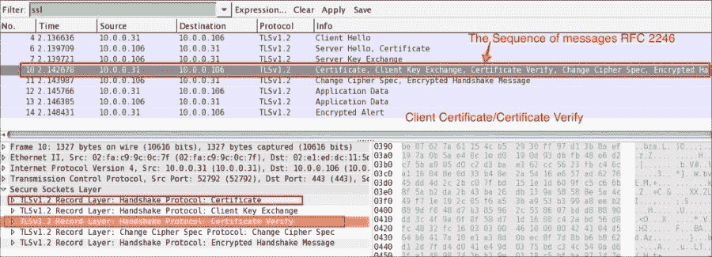

### 客户端密钥交换

在正常握手过程(单向认证)的情况下，客户端密钥交换消息是客户端收到服务器 Hello Done 消息后发送的第一条消息。

该客户端密钥交换消息(`ssl.handshake.type == 16`)将始终由客户端发送。当看到该消息时，`pre_master_secret`被设置，或者通过传输 RSA 加密的秘密，或者通过 Diffie-Hellman 参数，这取决于所选择的密钥交换方法。服务器使用自己的私钥解密`premaster_secret`:

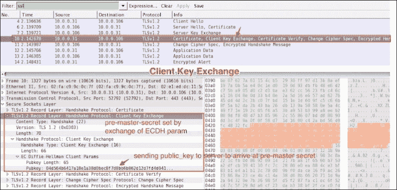

### 客户端证书验证

客户端证书验证消息将在`pre_master_secret`使用`master_secret`生成的客户端密钥交换消息`ssl.handshake.type == 16`之后发送。

### 更改密码规格

更改密码规范记录类型(`ssl.record.content_type == 20`)不同于握手记录类型(`ssl.record.content_type == 22`)，它是更改密码规范协议的一部分。仅当`key_exchange`完成时，客户端和服务器才发送更改密码规范消息，该消息向接收方指示后续记录将在新协商的更改密码规范和密钥下受到保护(`master_secret`):

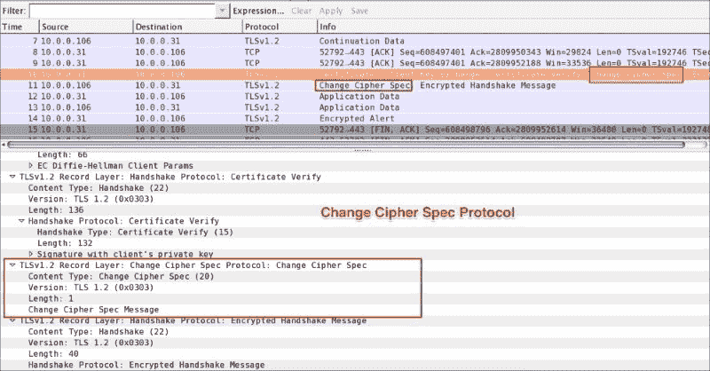

### 完成了

完成(`ssl.record.content_type == 22`)消息被加密，因此它将是 Wireshark 中的**加密握手消息**。客户端和服务器发出更改密码规范消息后，会立即发送此消息，以验证密钥交换和身份验证过程是否成功。该消息包含 MD5 散列+SHA 散列。当客户端和服务器都发送了完成的消息时，TLS 握手被认为已经成功完成，现在可以开始通过安全通道发送和接收应用数据了:

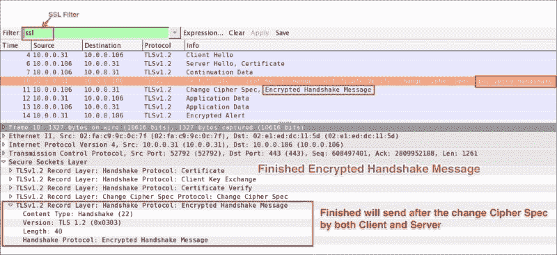

### 应用数据

应用数据消息(`ssl.record.content_type == 23`)由记录层承载，并被分段、压缩和加密:

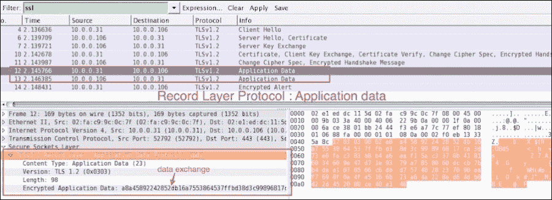

记录层处理包括上述步骤，如下图所示:

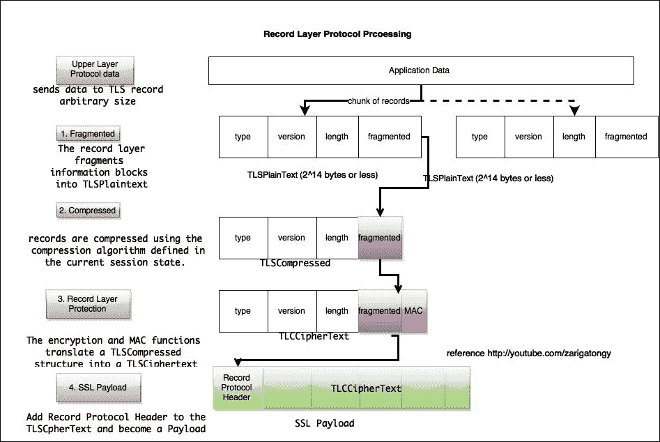

### 警报协议

警报协议(`ssl.record.content_type == 21`)描述了消息和警报的严重程度。Alert 消息经过加密和压缩，支持两种警报级别:警告和致命。在致命警报的情况下，连接将被终止。

下表显示了警报描述:

| 

警报名称

 | 

警报类型

 | 

描述

 |
| --- | --- | --- |
| `close_notify(0)` | 关闭警报 | 发件人将不再在此连接上发送任何消息 |
| `unexpected_message(10)` | 致命的 | 收到了一个适当的消息 |
| `bad_record_mac(20)` | 致命的 | 收到不正确的 MAC |
| `decryption_failed(21)` | 致命的 | TLS 密文以无效方式解密 |
| `record_overflow(22)` | 致命的 | 消息的大小超过了 2^14+2048 字节 |
| `decompression_failure(30)` | 致命的 | 收到无效输入 |
| `handshake_failure(40)` | 致命的 | 发送方无法完成握手 |
| `bad_certificate(42)` | 致命的 | 收到了损坏的证书；错误的 ASN 序列 |
| `unsupported_certificate(43)` | 致命的 | 不支持证书类型 |
| `certificate_revoked(44)` | 警告 | 签名者已经撤销了证书 |
| `certificate_expired(45)` | 警告 | 证书无效 |
| `certificate_unknown(46)` | 警告 | 证书未知 |
| `illegal_parameter(47)` | 致命的 | TLV 包含无效参数 |
| `unknown_ca(48)` | 致命的 | 找不到 CA 链 |
| `access_denied(49)` | 致命的 | 证书有效，服务器拒绝协商 |
| `decode_error(50)` | 致命的 | 收到的 TLV 没有有效的形式 |
| `decrypt_error(51)` | 致命的 | 解密密码无效 |
| `export_restriction(60)` | 致命的 | 检测到不符合出口限制的谈判 |
| `protocol_version(70)` | 致命的 | 服务器不支持所选的协议版本 |
| `insufficient_security(71)` | 致命的 | 需要强大的密码套件 |
| `internal_error(80)` | 致命的 | 与服务器相关的问题 |
| `user_canceled(90)` | 致命的 | 客户端取消了操作 |
| `no_renegotiation(100)` | 致命的 | 服务器无法协商握手 |

如以下屏幕截图所示，警报协议由服务器生成:

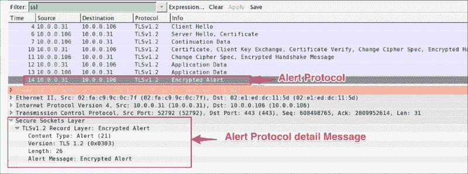

# 密钥交换

在接下来的小节中，我们将讨论 SSL/TLS 通道是如何被解密的；在此之前，我们需要了解不同的密钥交换方法是什么，以及它们的密码套件是什么样的。这些是下面的密钥交换方法。

## Diffie-Hellman 密钥交换

该协议允许两个用户在没有任何先验秘密的情况下通过不安全的介质交换密钥;在这个方案中，示例密码套件将具有一个命名约定，例如:

*   SSL_DH_RSA_WITH_DES_CBC_SHA
*   SSL _ DH _ RSA _ WITH _ 3d es _ EDE _ CBC _ SHA

密码套件的名称中会有“DH”，而不是“DHE”或“DH_anon”。

### 注意

你可以通过[https://en.wikipedia.org/wiki/Diffie-Hellman_key_exchange](https://en.wikipedia.org/wiki/Diffie-Hellman_key_exchange)了解更多关于迪菲-海尔曼的信息。

## 椭圆曲线 Diffie-Hellman 密钥交换

椭圆曲线 Diffie-Hellman 是一种改进的 Diffie-Hellman 交换，它使用椭圆曲线加密代替传统的 RSA 风格的大素数。**椭圆曲线** **密码学** ( **ECC** )和 RSA、Rabin、El Gamal 一样都是公钥密码系统。该算法的一些要点是:

*   每个用户都有一个公钥和一个私钥
*   公钥用于加密/签名验证
*   私钥用于解密/签名生成

### 注意

你可以在:[https://en.wikipedia.org/wiki/Elliptic_curve_Diffie–Hellman](https://en.wikipedia.org/wiki/Elliptic_curve_Diffie%E2%80%93Hellman)了解更多关于椭圆曲线的信息。

注意，提供了扩展椭圆曲线密钥交换中的客户端 Hello 消息交换过程。示例密码套件将遵循命名约定，例如:

*   SSL_DHE_RSA_WITH_DES_CBC_SHA
*   SSL _ dhe _ RSA _ with _ 3 des _ ede _ CBC _ sha

密码套件的名称中会有“DHE”，而不是“DH”或“DH_anon”。

## 的话

在服务器密钥交换握手期间，服务器的公共密钥可供客户机使用。`pre_master_secret`密钥是用服务器公开的 RSA 密钥加密的。在这种情况下，示例密码套件将是:

*   SSL_RSA_WITH_RC4_128_SHA
*   SSL _ RSA _ 带 _DES_CBC_SHA
*   TLS_RSA_WITH_AES_128_CBC_SHA

密码套件的名称中会有“RSA ”,而不是“DH”、“DH_anon”或“DHE”。

# 解密 SSL/TLS

到目前为止，我们已经了解了 SSL/TLS 协议如何加密流量并保持机密性。在下一节中，我们将介绍 Wireshark 如何帮助解密 SSL/TLS 流量。

## 解密 RSA 流量

TLS 流量的解密取决于服务器在服务器问候消息中选择的密码套件。打开文件`decrypt-ssl-01.pcap`，寻找服务器选择的密码。在这种情况下，使用了 TLS_RSA_WITH_AES_256_CBC_SHA 密码套件；因为这是 RSA，我们可以用我们的私钥解密包。

现在进入**编辑** | **首选项** | **协议** | **SSL** ，添加新的 RSA 密钥，并配置 RSA 密钥对话框的以下属性:

1.  私有的密钥文件(此处为`server.key`，由服务器使用)。
2.  服务器的 IP 地址。
3.  SSL/TLS 服务器的端口(`443`)。
4.  The decoding protocol—use `http` in this case.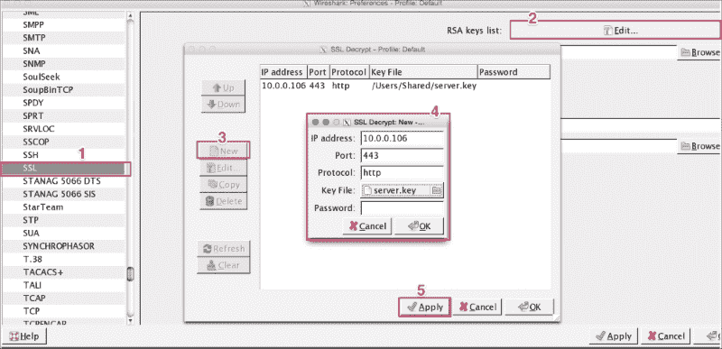

应用这些设置后，SSL 流量将被解码为该 IP 的 HTTP 流量，如以下屏幕截图所示:

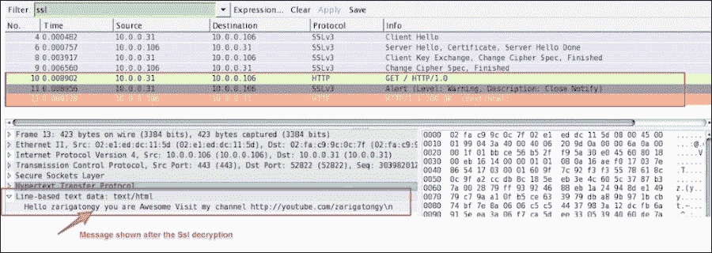

一旦数据包被解密，就可以通过点击**文件** | **导出 SSL 会话密钥**来导出 SSL 会话。将打开一个对话框；将该会话密钥保存在文件中(`exported-session-keys`)。文件的内容如下所示:

```
RSA Session-ID:af458c9c61675238b74f40b2a9547a0a2a394ada458a1b648e0495ed279d5e2e Master-Key:6c970211a77548811267646a759d0d03bbc532d9b6336f2b656cb0c6bbef8f3a262d845b9abed87d26583a9c4bb9b230

```

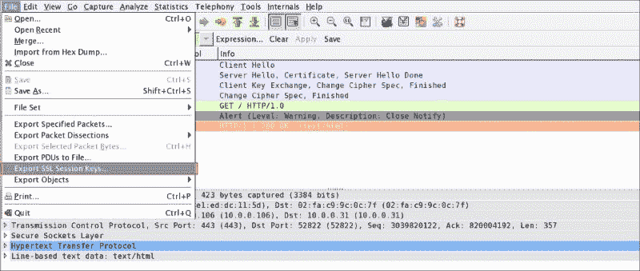

一旦创建了`exported-session-keys`文件，就使用这个文件来解密 SSL/TLS 流量。为此，请转到**编辑** | **首选项** | **协议** | **SSL** ，并使用 SSL 会话密钥的路径配置(预)主密钥日志文件。当用户希望共享数据包而不共享私钥，并且仍然需要提供解密步骤时，这种方法非常有用:

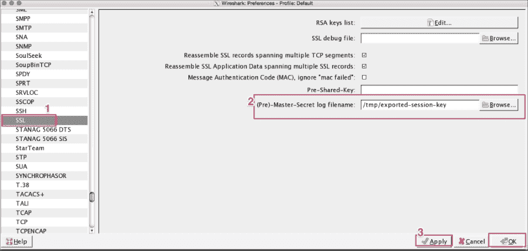

## 解密 DHE/埃切德流量

DHE/ECDHE 不能用这种方法解密，即使我们有私钥，因为它们被设计成支持前向保密。

### 向前保密

在**Diffie-Hellman**(**DHE**)和**椭圆曲线密码 Diffie-Hellman**(**ECDHE**)密钥交换算法中支持前向保密。以之前的场景为例；SSL/TLS 通信可以通过知道服务器的私钥来解密。如果私钥被不良的系统强化或(内部威胁代理)破坏，SSL/TLS 通信可能会中断。在前向保密中，即使我们可以访问服务器的私钥，SSL/TLS 通信也是安全的。

如果密码套件的名称包含“ECDHE”或“DHE”，这意味着它支持前向保密。例如，注意这个密码套件名称:TLS_ECDHE_RSA_WITH_RC4_128_SHA。

### 注意

此的一些有用参考如下:

*   [http://security . stack exchange . com/questions/35639/decrypting-TLS-in-wireshark-when-using-dhe-RSA-cipher suites/42350 # 42350](http://security.stackexchange.com/questions/35639/decrypting-tls-in-wireshark-when-using-dhe-rsa-ciphersuites/42350#42350)
*   [https://wiki.wireshark.org/SSL](https://wiki.wireshark.org/SSL)
*   [https://weakdh.org/](https://weakdh.org/)
*   [https://www.openssl.org/docs/apps/ciphers.html](https://www.openssl.org/docs/apps/ciphers.html)
*   [https://goo.gl/9YU0HC](https://goo.gl/9YU0HC)

# 调试问题

在本节中，我们将学习如何调试常见的 SSL 相关问题:

*   了解你的 SSL/TLS 服务器。如何配置服务器、使用哪个 TLS 版本以及它支持哪些密码套件非常重要。为此，使用如下所示的`nmap`实用工具:

    ```
    root@bash :/home/ubuntu# nmap --script ssl-cert,ssl-enum-ciphers -p 443 10.0.0.106
    Starting Nmap 6.40 ( http://nmap.org ) at 2015-08-03 16:49 UTC
    Nmap scan report for ip-10-0-0-106.ap-southeast-1.compute.internal (10.0.0.106)
    Host is up (0.000067s latency).
    PORT    STATE SERVICE
    443/tcp open  https
    | ssl-cert: Subject: commonName=ip-10-0-0-106/organizationName=Internet Widgits Pty Ltd/stateOrProvinceName=Some-State/countryName=AU
    | Issuer: commonName=ip-10-0-0-106/organizationName=Internet Widgits Pty Ltd/stateOrProvinceName=Some-State/countryName=AU
    | Public Key type: rsa
    | Public Key bits: 2048
    | Not valid before: 2015-07-28T14:43:45+00:00
    | Not valid after:  2016-07-27T14:43:45+00:00
    | MD5:   9ba5 0ea9 14b2 0793 7fe6 9329 08ce fab3
    |_SHA-1: 1604 27b6 4f1c a838 9a9d db67 3136 88de effb f881
    | ssl-enum-ciphers: 
    |   TLSv1.2: 
    |     ciphers: 
    |       TLS_ECDHE_RSA_WITH_AES_256_CBC_SHA - strong
    |     compressors: 
    |       NULL
    |_  least strength: strong

    ```

*   `nmap`输出显示服务器支持 TLSv1.2 和一个密码套件。如果客户端使用服务器不支持的其他 SSL 协议或密码套件进行连接，服务器将返回握手失败。比如用 TLSv1.1 连接同一个服务器会返回错误:

    ```
    rootbash # curl -k --tlsv1.1 https://10.0.0.106
    curl: (35) Unknown SSL protocol error in connection to 10.0.0.106:443

    ```

*   用服务器不支持的密码连接会返回握手错误，如下图:

    ```
    root@bash # curl -k --ciphers  EXP-RC2-CBC-MD5  https://10.0.0.106
    curl: (35) error:14077410:SSL routines:SSL23_GET_SERVER_HELLO:sslv3 alert handshake failure

    ```

*   接收`unknown_ca`错误检查以下从证书、私钥和 CSR 文件中查找哈希值使用以下命令:

    ```
    bash $ openssl x509 -noout -modulus -in server.crt  | openssl md5
    f637e8d51413ff7fa8d609e21cb27244
    bash $ openssl rsa -noout -modulus -in  server.key | openssl md5
    f637e8d51413ff7fa8d609e21cb27244
    bash $ openssl req -noout -modulus -in  server.csr | openssl  f637e8d51413ff7fa8d609e21cb27244

    ```

如果`csr`是用客户端私钥生成的，那么`csr`、`cer`的 md5 哈希值和私钥将是相同的，尽管证书是用 CA(中间 CA)私钥生成的。

如果 md5 文件相同，则验证 CA 颁发的证书与其路径匹配:

```
bash $ openssl verify -verbose -CAfile cacert.pem  server.crt
bash $ openssl verify -verbose -CAfile cacert.pem  client.crt

```

### 注意

SSL 测试的有用参考资料:

*   [https://www.ssllabs.com/ssltest/](https://www.ssllabs.com/ssltest/)
*   [https://github.com/rbsec/sslscan](https://github.com/rbsec/sslscan)
*   [https://testssl.sh/openssl-rfc.mappping.html](https://testssl.sh/openssl-rfc.mappping.html)

# 总结

在本章中，我们学习了 SSL/TLS 握手协议的工作原理，以及如何使用 Wireshark 对其进行分析。我们已经检查了与握手相关的示例调试问题，并学习了如何解决它们。在下一章中，我们将借助 Wireshark 继续分析其他应用层协议。