# 五、分析应用层协议

在前一章中，我们详细介绍了 SSL/TLS 应用层协议。在本章中，我们将继续学习其它应用层协议(它们的基本流和一些通用用例),并了解如何生成这些类型的流量:

*   DHCPv6
*   DHCv4
*   域名服务器(Domain Name Server)
*   超文本传送协议

# DHCPv6

IPv6 的 **动态主机配置协议** ( **DHCPv6** )是一个应用层协议，为 DHCPv6 客户端提供 IPv6 地址和其他配置信息，这些信息在 DHCPv6 选项中携带。

DHCPv6 既是有状态地址自动配置协议，也是无状态地址配置协议。

客户端和服务器通过 UDP 交换 DHCPv6 消息；客户端使用链接本地地址，DHCPv6 通过链接范围的多播地址接收消息。如果 DHCPv6 服务器没有连接到同一链路，则客户端链路上的 DHCPv6 中继代理将在 DHCPv6 客户端和 DHCPv6 服务器之间中继消息，如以下屏幕截图所示:

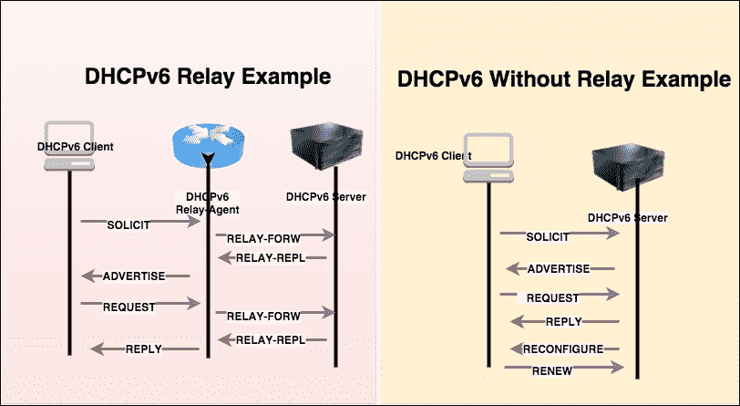

## DHCPv6 Wireshark 过滤器

使用 `dhcpv6`显示过滤器来显示 DHCPv6 流量。对于捕获过滤器，使用 UDP 端口`547`。

## 组播地址

DHCPv6 客户端使用多播地址向一组 DHCPv6 服务器发送数据报:

*   对于所有 DHCP 中继代理和服务器，地址是`FF02::1:2`(链接本地)
*   对于所有 DHCPv6 服务器，地址是`FF05::1:3`(本地站点)

## UDP 端口信息

服务器和中继代理监听 UDP 端口`547`上的 DHCPv6 消息；客户端在 UDP 端口`546`上监听 DHCPv6 消息。要查找端口信息，可以使用`netstat`命令:

```
[root@bash ~]# netstat -an | grep 547
udp        0      0 :::547                      :::*    
```

## DHCPv6 消息类型

DHCPv6 消息通过 UDP 端口`546`和`547`交换，消息描述如下表:

| 

DHCPv6 消息

 | 

描述

 | 

DHCPv6 Wireshark 筛选器

 | 

IPv4 消息的等效 DHCP

 |
| --- | --- | --- | --- |
| `SOLICIT` | 该消息由客户端发送到一组 DHCPv6 服务器 | `dhcpv6.msgtype == 1` | `DHCPDISCOVER` |
| `ADVERTISE` | 该消息由服务器发送，显示了 DHCPv6 服务的服务器可用性，以响应`SOLICIT`消息 | `dhcpv6.msgtype == 2` | `DHCPOFFER` |
| `REQUEST` | 此消息将由客户端发送，包含 IPV6 地址或配置参数 | `dhcpv6.msgtype == 3` | `DHCPREQUEST` |
| `CONFIRM` | 该消息将由客户端发送，以确认 IPv6 地址对于该链路是否仍然有效 | `dhcpv6.msgtype == 4` | `DHCPREQUEST` |
| `RENEW` | 客户端将发送此消息来更新其生存期或其他配置参数 | `dhcpv6.msgtype == 5` | `DHCPREQUEST` |
| `REBIND` | 如果没有收到`RENEW`消息，客户端将发送该消息，并更新其 IPv6 地址和其他配置参数 | `dhcpv6.msgtype == 6` | `DHCPREQUEST` |
| `REPLY` | 对于客户端发送的每条消息，将从服务器接收到一条`REPLY`消息 | `dhcpv6.msgtype == 7` | `DHCPACK` |
| `RELEASE` | 客户端将发送此消息以释放 IPv6 地址和其他配置参数 | `dhcpv6.msgtype == 8` | `DHCPRELEASE` |
| `DECLINE` | 如果客户端发现 IPv6 地址已经分配并正在使用中，将会发送此消息 | `dhcpv6.msgtype == 9` | `DHCPDECLINE` |
| `RECONFIGURE` | 此消息将由服务器发送，以指示配置参数已更新或已更改；客户端将发送一个`RENEW` / `REPLY`或`INFORMATION-REQUEST` / `REPLY`来获取更新的配置 | `dhcpv6.msgtype == 10` | 不适用的 |
| `INFORMATION-REQUEST` | 此消息将由配置请求无 IPv6 地址分配的客户端发送 | `dhcpv6.msgtype == 11` | `DHCPINFORM` |
| `RELAY-FORWARD` | 此消息将由中继代理发送，以便将消息转发给服务器。`RELAY-FORWARD`包含封装为 DHCPv6 `RELAY`消息选项的客户端消息 | `dhcpv6.msgtype == 12` | 不适用的 |
| `RELAY-REPLY` | 这条消息将由服务器通过中继代理发送给客户端。`RELAY-REPLY`包含封装为 DHCPv6 `RELAY`消息选项的服务器消息 | `dhcpv6.msgtype == 13` | 不适用的 |

## 消息交流

DHCPv6 消息交换是为了获取 IPv6 地址、配置(NTP 服务器、DNS 服务器)或 IPv6 地址的`RENEW` / `RELEASE` / `DECLINE`，这些消息交换分为两部分:

*   具有四个消息交换的客户机-服务器
*   具有双消息交换的客户机-服务器

### 四条信息的交换

四消息交换的首字母缩写是 **SARR** ，它用于请求分配一个或多个 IPv6 地址。消息流如下所示:

*   `SOLICIT`
*   `ADVERTISE`
*   `REQUEST`
*   `REPLY`

在 Wireshark 中打开`DHCPv6-Flow-SOLICIT.pcap`文件，检查 IP 分配流程，如图所示:

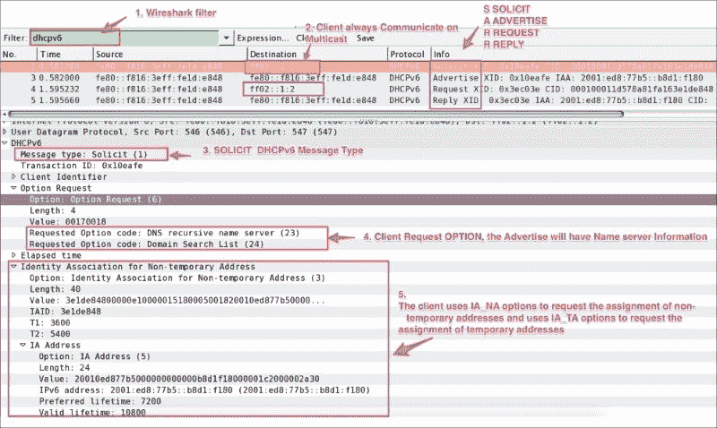

前面的屏幕截图显示了一个被捕获的 SARR 流数据包。IPv6 被分配给 DHCPv6 客户端，具体的消息交换是:

*   `SOLICIT`:客户端(`fe80::f816:3eff:fe1d:e848`)发送`SOLICIT`消息定位服务器。注意目的地是多播`ff02::1:2`而不是服务器(目的地)IPv6 地址:

    *   客户端包括其客户端标识符选项`dhcpv6.option.type == 1`。
    *   客户端将其 ORO 选项(`dhcpv6.option.type == 6`)发送给有兴趣接收的服务器。在这种情况下，客户端请求名称服务器信息。
    *   在本例中，客户端使用 IA_NA 选项请求分配非临时地址(`dhcpv6.option.type == 3`)，并使用 IA_TA 选项请求分配临时地址。
    *   客户端 IA 地址选项用于指定与 IA_NA 或 IA_TA 关联的 IPv6 地址。在本例中，它与 IA_NA 相关联。

*   `ADVERTISE`:服务器(`fe80::f816:3eff:fe1d:e848`)发送`ADVERTISE` ( `dhcpv6.msgtype == 2`)消息给客户端(`fe80::f816:3eff:fe1d:e848`)。可以有多个服务器响应客户端`SOLICIT`消息；客户端会根据自己的喜好选择 DHCPv6 服务器:

    *   服务器根据自己的喜好更新 IA_NA ( `dhcpv6.option.type == 3`)值。
    *   服务器包含其服务器标识符(`dhcpv6.option.type == 2`)信息。**服务器标识符**选项用于携带 DUID。 **DUID** 是 **DHCP 唯一标识符**，IPv6 中的主机标识符。(在 DHCPv4 的情况下，主机标识符是 MAC 地址。)
    *   服务器包括在`SOLICIT`消息中请求的名称服务器(`dhcpv6.option.type == 23`)信息。
    *   在这种情况下，服务器事务 ID `0x10eafe`必须与客户端事务 ID`SOLICIT`匹配。

*   `REQUEST`: In this message the client chooses one of the servers and sends a `REQUEST` message to the server asking for confirmed assignment of addresses and other configuration information:

    *   客户端(`fe80::f816:3eff:fe1d:e848`)构造`REQUEST`数据包并将其发送给组播`ff02::1:2`
    *   客户端包含一个新的交易 ID: `0x3ec03e.(random)`
    *   客户端在`REQUEST`数据包中包含服务器标识符信息

    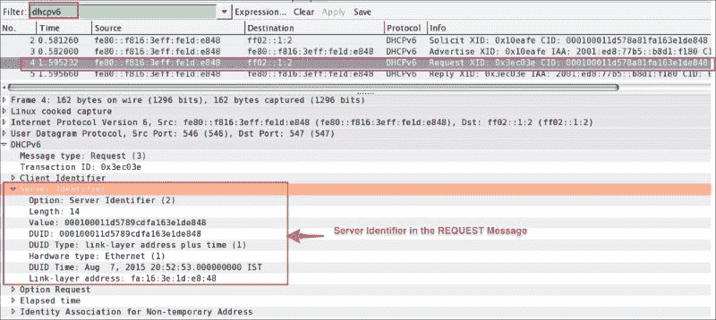
*   `REPLY`:在有效的`REQUEST`消息的情况下，服务器根据服务器的策略和配置信息为该客户端创建绑定，记录 IAs 和客户端请求的其他信息，并通过设置`dhcpv6.msgtype == 7` :

    *   发送`REPLY`消息服务器事务 ID `0x3ec03e`将与客户端 DHCv6 `REQUEST`消息事务 ID
    *   服务器将包括服务器标识符和客户端标识符
    *   `REPLY`消息将是其中的一部分

### 双信息交换

当不需要分配 IP 地址时，或者当 DHCPv6 客户端希望获得配置信息(如可用 DNS 服务器或 NTP 服务器的列表)时，客户端和服务器之间将执行双消息交换，例如`CONFIRM-REPLY`和`RELEASE-REPLY`。在 Wireshark 中打开示例`DHCPv6-Flow-CONFIRM-RELEASE.pcap`文件，它显示执行了两个消息的交换:

1.  DHCPv6 messages `CONFIRM-REPLY` and `RELEASE-REPLY`: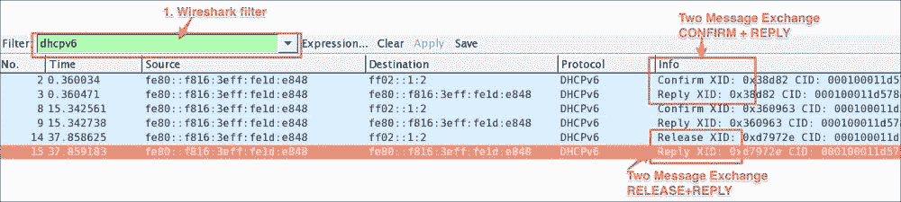
2.  DHCPv6 messages `INFOMRATION-REQUEST`: The client sends the `INFORMATION-REQUEST` when the client requests configuration settings (but not addresses)—for example, DNS, NTP. As shown in the following screenshot, open the `DHCPv6-Information_request.pcap` file in Wireshark:

    *   客户端将设置`dhcpv6.msgtype == 11`:

    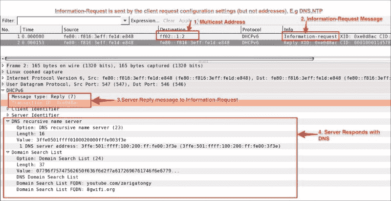
3.  The rapid commit option is used to obtain the IPv6 address assignment in the two-message exchange, as shown in the following screenshot example, `DHCPv6-Rapid-Commit.pcap`. Note that rapid commit is not a separate DHCPv6 message and is part of the `SOLICIT` option: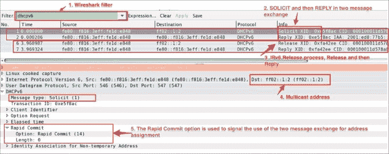

    *   如果支持快速提交选项的客户端打算使用快速提交功能，它会在其发送的`SOLICIT`消息中包含一个快速提交选项。
    *   如果客户端收到带有快速提交选项的`REPLY`消息，它*应该*立即处理`REPLY`(不等待额外的`ADVERTISE`或`REPLY`消息)并使用其中包含的地址和配置信息。
    *   如果服务器不支持快速提交选项，那么它将遵循四个消息交换(**请求**、**广告**、**请求**、以及**回复**被称为 **SARR)** 。

## DHCPv6 流量捕获

使用`dhclient`到模拟网络上的 DHCPv6 流量。为此，请执行以下操作:

1.  确保设置了 DHCPv6 服务器。这个例子是在 ISC **动态主机配置服务器** ( **dhcpd** )服务器上执行的。
2.  Run the `tcpdump` utility to capture IPv6 traffic:

    ```
    bash$ tcpdump -i any ip6 -vv -w DHCPv6-FLOW.pcap -s0 &

    ```

    确保 DHCPv6 服务器正在您的网络中运行。

3.  捕获一个 DHCPv6 四消息交换(SARR):

    ```
    bash$ dhclient -6 eth0

    ```

4.  捕获 DHCPv6 `RELEASE`报文:

    ```
    bash$ dhclient -6 -r eth0

    ```

5.  捕获 DHCPv6 `CONFIRM`报文:

    ```
    bash$ dhclient -6 eth0

    ```

6.  捕获 DHCP V6`INFORMATION`请求:

    ```
    bash$ dhclient -S -6 eth0

    ```

# BOOTP/DHCP

DHCP 是 BOOTP 机制的扩展。换句话说，DHCP 使用 BOOTP 作为它的传输协议。此行为允许现有的 BOOTP 客户端与 DHCP 服务器互操作，而不需要对客户端的初始化软件进行任何更改；下表显示了这两种协议之间的基本比较:

| 

BOOTP/DHCP

 | 

引导协议(BOOTstrapping Protocol)

 | 

动态主机配置协议

 |
| --- | --- | --- |
| 意义 | 引导协议 | BOOTP 的动态主机配置协议扩展 |
| 年 | One thousand nine hundred and eighty-five | One thousand nine hundred and ninety-three |
| UDP 服务器端口 | Sixty-seven |
| UDP 客户端端口 | sixty-eight |
| 服务 | 

*   IPv4 address assignment
*   Get IPv4 configuration parameters
*   A limited number of client configuration parameters are called vendor extensions.

 | 

*   IP address assignment
*   lease
*   Support traditional BOOTP function
*   DHCP supports a larger and extensible set of client configuration parameters called options.

 |
| 请求评论 | RFC951 | RFC 2131 |
| 存在 | 被动态主机配置协议(DHCP)取代 | 活跃；RFC 不断加入更多的特性并支持不同的技术需求 |

## BOOTP/DHCP Wireshark 过滤器

使用`bootp`过滤器显示 BOOTP/DHCP 流量，并使用 UDP 端口`67`仅捕获 BOOT/DHCP 流量。

## 地址分配

`DISCOVER`、`OFFER`、`REQUEST`、`ACK`在网络地址分配过程中，客户端和服务器之间发生协议交换，如下图所示。作为助记符，将此称为**朵拉**。

也可以使用 DHCPv4 的快速提交选项来完成地址分配。它模仿 DHCPv6，使用双消息交换来快速配置 DHCPv4 客户端。

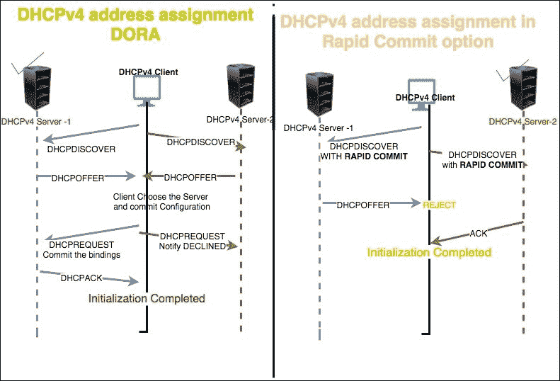

要演示四条消息的交换，请在 Wireshark 中打开`DHCPv4.pcap`文件，如下面的截图所示:

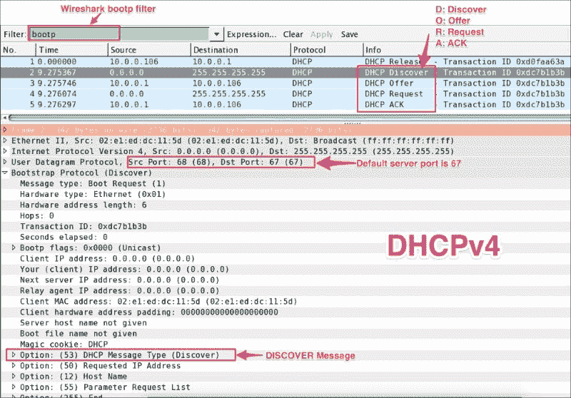

上图显示了 DHCPv4 客户端和 DHCPv4 服务器之间发生的消息交换。这概括如下:

*   `DISCOVER (bootp.option.dhcp == 1)` :

    *   展开 Bootstrap 协议查看 BOOTP 详情
    *   客户端在其本地物理子网广播`255.255.255.255``DHCPDISCOVER`消息，可能包括选项:(`55`即`bootp.option.type`参数请求列表；在此期间，“yiaddr”字段将为(`bootp.ip.your == 0.0.0.0` )

*   `OFFER (bootp.option.dhcp == 2)` :

    *   展开引导协议以查看 BOOTP 详细信息
    *   DHCP 服务器可以用在“yiaddr”(`bootp.ip.your == 10.0.0.106`)字段
    *   中包括可用网络地址的`DHCPOFFER`消息来响应。DHCP 服务器将发送其选项 54: DHCP 服务器标识符，并且可以包括选项 55 中请求的其他配置参数`DICOVER`阶段

*   `DHCPREQUEST (bootp.option.dhcp == 3)` :

    *   展开 BOOTP 协议以查看 BOOTP 详细信息
    *   客户端广播(`255.255.255.255`)一条`DHCPREQUEST`消息，要求*必须包含选项 54 DHCP 服务器标识符以指示其已选择的服务器，并且可以包含指定所需配置值的其他选项*
    *   *`DHCPREQUEST`消息中选择的 DHCP 服务器将客户端的绑定提交给`db`存储，并以 ACK*

    *响应*
*   *`ACK (bootp.option.dhcp == 5)` :

    *   展开 Bootstrap 协议查看 BOOTP 详情
    *   服务器将 ACK 连同配置参数一起发送给客户端；在此期间，IPv4 地址将为“yiaddr”(`bootp.ip.your == 10.0.0.106`)
    *   。客户端将验证获得的配置，并使用 ARP 协议再次检查 IPv4 地址；如果该地址被其他 dhcp 客户端使用，客户端将向服务器发送一条`DECLINE`消息，并重新启动配置过程* 

 *## 捕获 DHCPv4 流量

捕获 DHCPv4 流量的命令如下:

*   在 Windows 机器上:

    1.  启动 Wireshark 捕获。
    2.  打开命令行提示。
    3.  键入`ipconfig /renew`并按*进入*。
    4.  键入`ipconfig /release`并按*键进入*。
    5.  停止 Wireshark 捕获。

*   在 Linux 机器上:

    1.  启动 Wireshark 捕获。
    2.  打开命令行提示。
    3.  调出网络界面:

        ```
        bash# ifdown eth0:0

        ```

    4.  调出网络界面:

        ```
        bash$ ifup eth0:0

        ```

    5.  停止 Wireshark 捕获。

*   使用 dhclient:

    1.  启动 Wireshark 捕获。
    2.  打开命令行提示。
    3.  捕获一个 DORA 包使用:

        ```
        bash$dhclient -4 eth0

        ```

    4.  停止捕获。

# DNA

**DNS** 代表**域名系统**。所有机器都使用 DNS 将主机名翻译成 IP 地址。这种机制用于根据查询类型将名称转换为地址(IPv4/IPv6)等属性。

DNS 有三个主要组件:

*   名称空间
*   使该名称空间可用的服务器
*   向服务器查询名称空间的解析器(客户端)

本主题将关注解析器视角，其中客户端向服务器发送查询，服务器应答查询。同一个查询可以有多个答案。

## DNS Wireshark 过滤器

Wireshark 的`dns` 过滤器用于仅显示 DNS 流量，UDP 端口`53`用于捕获 DNS 流量。

## 港口

默认的 DNS 端口是`53`，使用 UDP 协议。一些 DNS 系统也使用 TCP 协议。当响应数据大小超过 512 字节时，或者对于诸如区域传输之类的任务，使用 TCP。

## 资源记录

DNS 系统使用的格式如下:

| 

田

 | 

描述

 | 

长度

 | 

Wireshark 过滤器

 |
| --- | --- | --- | --- |
| **名称** | 所有者姓名 | 可变的 | `dns.qry.name == "google.com"` |
| **类型** | 数字形式的**资源记录** ( **RR** )的类型 | Two | `dns.qry.type == 1 (A Record Type)``dns.qry.type == 255 (ANY Record Type)``dns.qry.type == 2 (NS name server)``dns.qry.type == 15(MX mail exchange)``dns.qry.type == 28 (AAAA quad A, Ipv6 record Type)` |
| **类** | 类别代码 | Two | `dns.qry.class == 0x0001 (IN set to internet)` |
| **TTL** | 活下去的时间 | four |   |
| **RDLENGTH** | RDATA 字段的八位字节长度 | Two |   |
| RDA | 其他特定于 RR 的数据 | 可变的 |   |

## DNS 流量

在本章中，`dig` 和`nslookup`网络命令用于查询 DNS 服务器。打开示例`DNS-Packet.pcap`文件，将显示过滤器设置为`dns.qry.type==28`，并检查查询。

在本例中，客户端(`192.168.1.101`)要求名称服务器(`8.8.4.4`)通过在查询部分设置这些参数来解析`ipv6.google.com`:

*   客户端设置记录类型 AAAA 记录
*   客户端设置主机名(`ipv6.google.com`)
*   客户端设置类(即`IN (Internet)`)
*   名称服务器(`8.8.4.4`)用多个答案响应客户端
*   `ipv6.google.com`是等于`ipv6.l.google.com`的规范名称
*   `ipv6.l.google.com` has the AAAA address `2404:6800:4007:805::200e`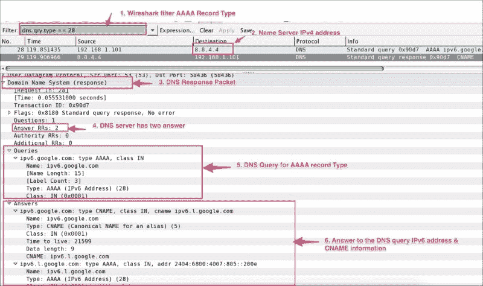

用户可以使用流行的`dig`或`nslookup`网络实用工具命令来查询不同的 DNS 记录类型。在后台使用网络捕获，并观察每个命令的问答部分:

*   查询一个记录类型，用于显示给定主机名的 IPv4 地址:

    ```
    bash# nslookup google.com
    bash# dig google.com
    bash# dig A +noadditional +noquestion +nocomments +nocmd +nostats google.com. @8.8.4.4

    ```

*   查询`AXFR`记录类型；`AXFR`用于将区域文件从主服务器传输到辅助名称服务器:

    ```
    bash# nslookup -type=axfr google.com 8.8.4.4
    bash# dig AXFR +noadditional +noquestion +nocomments +nocmd +nostats +multiline google.com. @8.8.4.4

    ```

*   查询`CNAME`记录类型。`CNAME`用于设置别名:

    ```
    bash# nslookup -type=cname google.com 8.8.4.4
    bash# dig CNAME +noadditional +noquestion +nocomments +nocmd +nostats google.com. @8.8.4.4

    ```

*   查询`MX`记录类型；`MX`是邮件交换记录:

    ```
    bash# nslookup -type=mx google.com 8.8.4.4
    bash# dig MX +noadditional +noquestion +nocomments +nocmd +nostats google.com. @8.8.4.4

    ```

*   查询`NS`记录类型；`NS`是名称服务器记录:

    ```
    bash# nslookup -type=ns google.com 8.8.4.4
    bash# dig NS +noadditional +noquestion +nocomments +nocmd +nostats google.com. @8.8.4.4

    ```

*   查询`PTR`记录类型；`PTR`是用于反向 DNS 查找的指针:

    ```
    bash# nslookup -type=ptr google.com 8.8.4.4
    bash# dig PTR +noadditional +noquestion +nocomments +nocmd +nostats google.com. @8.8.4.4

    ```

*   查询`SOA`记录类型。`SOA`用于提供域名服务器、电子邮箱等权威信息:

    ```
    bash# nslookup -type=soa google.com 8.8.4.4
    bash# dig SOA +noadditional +noquestion +nocomments +nocmd +nostats +multiline google.com. @8.8.4.4

    ```

*   查询`TXT` 记录类型；这里指的是文字记录:

    ```
    bash# nslookup -type=txt google.com 8.8.4.4
    bash# dig TXT +noadditional +noquestion +nocomments +nocmd +nostats google.com. @8.8.4.4

    ```

*   查询`AAAA`(也称为 quad-A 记录类型)；这将显示给定主机名的 IPv6 地址:

    ```
    bash# nslookup -type=aaaa google.com 8.8.4.4
    bash# nslookup -type=aaaa ipv6.google.com 8.8.4.4
    bash# dig AAAA +noadditional +noquestion +nocomments +nocmd +nostats ipv6.google.com. @8.8.4.4

    ```

*   查询`ANY`记录类型；这将返回所有记录类型:

    ```
    bash# nslookup -type=any google.com 8.8.4.4
    bash# dig ANY +noadditional +noquestion +nocomments +nocmd +nostats google.com. @8.8.4.4

    ```

# HTTP

HTTP 是 WWW 中使用的应用层协议。HTTP 支持 HTTP 客户端和 HTTP 服务器之间的通信。示例流量如下图所示。客户端(浏览器或 cURL)创建了一个 HTTP `GET`请求，而 HTTP 服务器已经用适当的内容类型进行了响应:

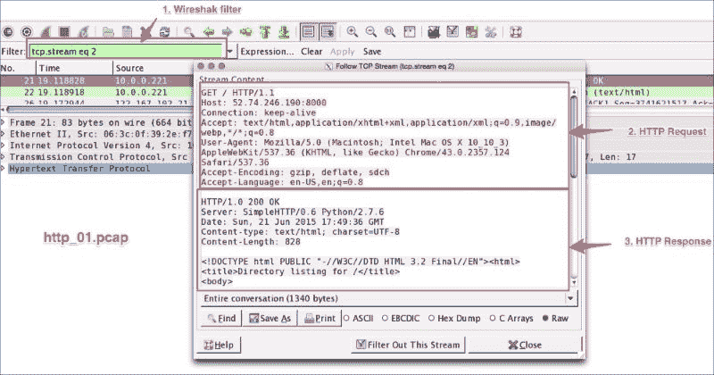

## HTTP Wireshark 过滤器

使用`http`到只显示 HTTP 数据包。使用 TCP 端口`80`仅过滤 HTTP 流量；端口`80`是默认的 HTTP 端口。

## HTTP 用例

下面的例子展示了 Wireshark 可以帮助分析 HTTP 数据包的不同用例。

### 寻找最快的 HTTP 响应时间

在 Wireshark 中打开文件 `http_01.pcap`，找到 HTTP get 请求的 HTTP 响应时间 top:

1.  点击**编辑** | **首选项|协议** | **TCP** ，取消勾选**允许子指示器重组 TCP 流**。这将有助于了解获得实际内容需要多少个延续数据包，并且有助于微调 TCP 参数，例如，设置 TCP 窗口大小以减少延续数据包。
2.  在**过滤器**栏中，应用`http`过滤器并从`http.response.code == 200 HTTP OK`包中添加`http.time`作为一列。
3.  Click on the **Time since request** column and make it in descending order. Find the request frame and click on the link.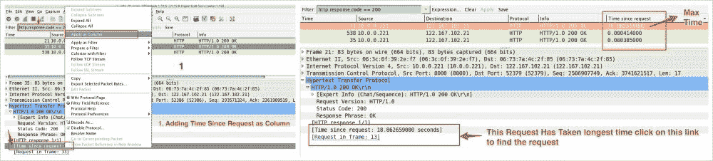

### 基于 HTTP 方法查找数据包

使用 Wireshark 的`http.request.method`显示用于分析的数据包。例如，下表描述了如何应用此过滤器:

| 

HTTP 方法

 | 

意义

 | 

Wireshark 过滤器

 |
| --- | --- | --- |
| `GET` | 获取指定的资源示例:`GET http://www.w3.org/pub/WWW/TheProject.html HTTP/1.1` | `http.request.method=="GET"` |
| `POST` | 向指定的资源提交要处理的数据 | `http.request.method=="POST"` |
| `PUT` | 上传指定 URI 的表示形式 | `http.request.method=="PUT"` |
| `DELETE` | 删除指定的资源/实体 | `http.request.method=="DELETE"` |
| `OPTIONS` | 返回服务器支持的 HTTP 方法 | `http.request.method=="OPTIONS"` |
| `CONNECT` | 将请求连接转换成透明的 TCP/IP 隧道 | `http.request.method=="CONNECT"` |

### 在表单帖子中查找敏感信息

如果表单包含密码等敏感信息，Wireshark 可以轻易泄露，因为 HTTP 是一种不安全的网络数据传输方式。

打开`HTTP_FORM_POST.pcap`文件并过滤流量，仅显示请求方法`POST`并找到密码表单项，如以下屏幕截图所示:

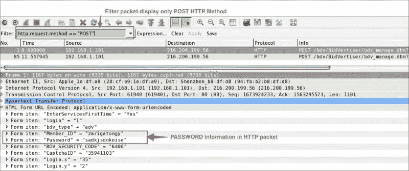

### 使用 HTTP 状态码

HTTP 响应的第一行包含状态代码。使用 Wireshark 过滤器`http.response.code`，根据状态代码显示数据包。这将有助于调试 HTTP 客户端-服务器交互:

| 

类型

 | 

密码

 | 

意义

 | 

HTTP Wireshark 过滤器

 |
| --- | --- | --- | --- |
| 信息–1xx | One hundred | 继续 | `http.response.code == 100` |
| One hundred and one | 交换协议 | `http.response.code == 101` |
| 成功–2xx 出发地:200 号公路收件人:206 | Two hundred | 好 | `http.response.code == 200` |
| Two hundred and one | 创造 | `http.response.code == 201` |
| 重定向–3xx 出发地:300 号公路收件人:307 | Three hundred | 多选 | `http.response.code == 300` |
| Three hundred and one | 永久移动 | `http.response.code == 301` |
| 客户端错误–4xx 出发地:400 号公路收件人:417 | four hundred | 错误的请求 | `http.response.code == 400` |
| Four hundred and one | 未经授权的 | `http.response.code == 401` |
| 服务器错误–5xx 从—500 至- 505 | Five hundred | 内部服务器错误 | `http.response.code == 500` |
| Five hundred and one | 未实施 | `http.response.code == 501` |

# 参考文献

HTTP 协议:

*   [https://en.wikipedia.org/wiki/Hypertext_Transfer_Protocol](https://en.wikipedia.org/wiki/Hypertext_Transfer_Protocol)
*   [https://wiki.wireshark.org/Hyper_Text_Transfer_Protocol](https://wiki.wireshark.org/Hyper_Text_Transfer_Protocol)

DNS 协议:

*   [https://en . Wikipedia . org/wiki/Domain _ Name _ System # Protocol _ transport](https://en.wikipedia.org/wiki/Domain_Name_System#Protocol_transport)
*   [https://www.ietf.org/rfc/rfc1035.txt](https://www.ietf.org/rfc/rfc1035.txt)

DHCP/BOOT 协议:

*   [https://tools.ietf.org/html/rfc2131](https://tools.ietf.org/html/rfc2131)
*   [http://linux.die.net/man/8/dhclient](http://linux.die.net/man/8/dhclient)
*   [http://www . iana . org/assignments/BOOTP-DHCP-parameters/BOOTP-DHCP-parameters . XHTML](http://www.iana.org/assignments/bootp-dhcp-parameters/bootp-dhcp-parameters.xhtml)
*   [https://goo.gl/snUXkp](https://goo.gl/snUXkp)

DHCPv6 协议:

*   [http://www . iana . org/assignments/DHCP V6-parameters/DHCP V6-parameters . XHTML](http://www.iana.org/assignments/dhcpv6-parameters/dhcpv6-parameters.xhtml)
*   [https://tools.ietf.org/html/rfc3315](https://tools.ietf.org/html/rfc3315)
*   [https://en.wikipedia.org/wiki/DHCPv6](https://en.wikipedia.org/wiki/DHCPv6)

# 总结

在本章中，我们学习了 Wireshark 如何帮助我们分析应用层协议，如 DHCPv6、DHCP、DNS 和 HTTP。我们还学习了如何在网络上模拟这些流量。

在下一章，我们将学习更多关于无线嗅探的知识。*