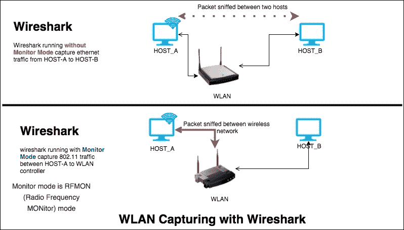
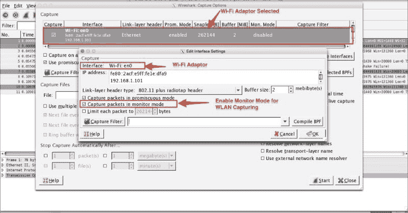
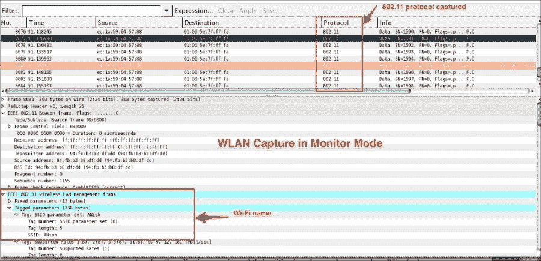
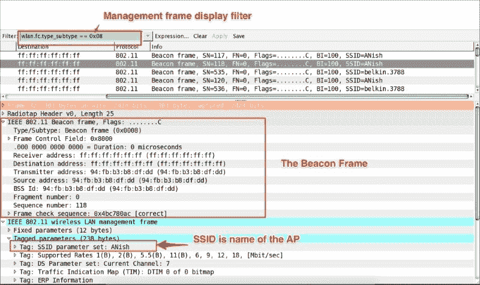
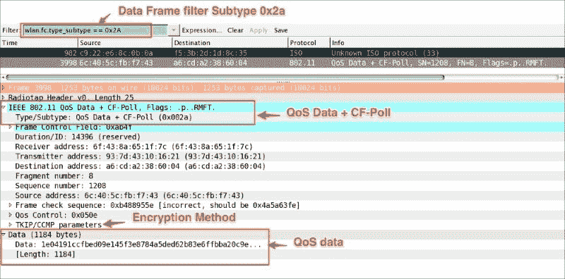

# 六、无线局域网捕获

到目前为止，我们已经看到了在以太网上捕获的数据包。在本章中，我们将学习如何捕获 WLAN 网络流量，并对所有帧使用有效的显示过滤器，包括以下主题:

*   WLAN (802.11)捕获设置和监控模式
*   802.11 使用 tcpdump 捕获
*   802.11 显示过滤器
*   第 2 层数据报帧类型和 Wireshark 显示过滤器
*   802.11 授权过程
*   802.1X EAPOL
*   802.11 协议栈

# 无线局域网捕获设置

Wireshark 依赖于运行它的操作系统(以及无线适配器的驱动程序)来支持监控模式。

对于 Linux，802.11 无线工具栏(**视图** | **无线工具栏**)提供了出色的选项来启用监控模式并为 cfg80211 设备设置通道。这甚至支持多网络接口进行多通道捕获；详细说明参见[https://wiki.wireshark.org/CaptureSetup/WLAN](https://wiki.wireshark.org/CaptureSetup/WLAN)。

MAC OS 具有无线适配器，并且支持监视器模式。在 Windows 上，不支持监视器模式；为此，您需要一个商用适配器，例如 AirPcap USB 适配器。

WLAN (IEEE 802.11)捕获过程与 Wireshark 中捕获以太网流量的过程略有不同。默认情况下，当我们开始捕获 Wi-Fi 网络中的流量时，它会捕获两个端点(主机 A 和主机 B)之间的流量。为了捕获 Wi-Fi 流量，Wireshark 必须在监控模式下运行— **RFMON** ( **射频监控**)—允许带有**无线网络接口控制器** ( **WNIC** )的计算机监控从 **AP** ( **接入点**)接收的所有流量，如截图所示:



## 监视器模式

监视器模式仅在 IEEE 802.11 Wi-Fi 接口上受支持，并且仅在某些操作系统上受支持。要在 Wi-Fi 接口中启用监控模式，请在 Wireshark 中执行以下步骤:

1.  点击**捕获** | **选项**。
2.  选择活动的 Wi-Fi 适配器。双击界面设置；将出现一个窗口。
3.  启用监控模式下的**捕获数据包**选项。
4.  点击**确定**。
5.  开始捕获。

您应该会看到以下屏幕:



当 monitor 模式开启时，适配器会捕获通道上传输的所有数据包。其中包括:

*   单播数据包
*   广播数据包
*   控制和管理数据包

### Tip

在监控模式下禁用名称解析，因为 Wireshark 会尝试解析 FQDN，这会导致打开数据包捕获文件的速度变慢(在监控模式下没有外部网络)。

一旦数据包捕获开始，Wireshark 将开始显示源和目的地之间的 802.11 协议数据包交换，如下图所示(或在 Wireshark 中打开数据包捕获`802.11.pcap`文件)。监控模式下的数据包捕获不会与任何接入点相关联，用户只能看到 802.11 帧，其中包括非数据(管理和信标)帧，如图所示:



要使用`tcpdump`执行无线数据包捕获，请执行以下命令。`tcpdump with –I option`将开启监控模式:

```
bash $ tcpdump -I -P -i en0 -w 802.11.pcap

```

获得的输出如下:

```
tcpdump: WARNING: en0: no IPv4 address assigned
tcpdump: listening on en0, link-type IEEE802_11_RADIO (802.11 plus radiotap header), capture size 65535 bytes
^C52 packets captured
52 packets received by filter

```

# 分析无线网络

当分析 Wi-Fi 网络时，了解 IEEE 标准 802.11 作为事实的来源是很重要的，因为这是获得专业知识最有趣的协议之一。

无线网络不同于有线局域网:这里的可寻址单元是一个站(STA ),当分组被传送到 STA 时，STA 是消息的目的地而不是固定的位置。

在本书的范围内，我们将处理在 WNIC 控制器和接入点之间捕获的数据包。**接入点** ( **AP** )包含一个站(STA)并提供对分布的访问。在本书中，我们将了解 Wireshark 如何为分析 Wi-Fi 帧提供显示过滤器:

*   `wlan`:显示 IEEE 802.11 无线局域网帧
*   `wlan_ext`:显示 IEEE 802.11 无线局域网扩展框架
*   `wlan_mgt`:显示 IEEE 802.11 无线局域网管理帧
*   `wlan_aggregate`:该显示 IEEE 802.11 无线局域网聚合帧

## 帧

在第 2 层，数据报被称为帧；它们显示了所有信道流量和测量 STA 接收的所有帧的计数。下表中定义了四种类型的帧:

| 

框架类型

 | 

价值

 | 

Wireshark 显示过滤器

 |
| --- | --- | --- |
| 管理 | 0x00 | `wlan.fc.type == 0` |
| 控制 | 0x01 | `wlan.fc.type == 1` |
| 数据 | 0x02 | `wlan.fc.type == 2` |
| 延长 | 0x03 | `wlan.fc.type == 3` |

让我们来详细的一个一个的看看这些画面。

### 管理框架

Wireshark 使用和`wlan_mgt`显示过滤器来显示所有管理帧。根据 IEEE 802.11 标准，定义了以下管理帧，下表显示了其相应的值以及相应的 Wireshark 显示过滤器:

| 

名字

 | 

价值

 | 

Wireshark 显示过滤器

 |
| --- | --- | --- |
| 关联请求 | 0x00 | `wlan.fc.type_subtype == 0x00` |
| 关联响应 | 0x01 | `wlan.fc.type_subtype == 0x01` |
| 重新关联请求 | 0x02 | `wlan.fc.type_subtype == 0x02` |
| 重新关联响应 | 0x03 | `wlan.fc.type_subtype == 0x03` |
| 探测请求 | 0x04 | `wlan.fc.type_subtype == 0x04` |
| 探测响应 | 0x05 | `wlan.fc.type_subtype == 0x06` |
| 测量导频 | 0x06 | `wlan.fc.type_subtype == 0x06` |
| 信标帧 | 0x08 | `wlan.fc.type_subtype == 0x08` |
| atim | 0x09 | `wlan.fc.type_subtype == 0x09` |
| 分离 | 0x0a | `wlan.fc.type_subtype == 0x0a` |
| 证明 | 0x0b | `wlan.fc.type_subtype == 0x0b` |
| 取消认证 | 0x0c | `wlan.fc.type_subtype == 0x0c` |
| 行为 | 0x0d | `wlan.fc.type_subtype == 0x0d` |
| 无确认操作 | 0x0e | `wlan.fc.type_subtype == 0x0e` |

例如，通过设置`wlan.fc.type_subtype == 0x08`，在`802.11.pcap`文件中，整个信标帧将在 Wireshark 中显示。

信标是一个小的广播数据包，它显示无线网络的特征，并提供诸如数据速率(最大数据速率)、功能(加密开启或关闭)、接入点 MAC 地址、SSID(无线网络名称)、RSN 信息、供应商特定信息、Wi-Fi 保护设置等信息，其中:

*   SSID 是 AP 的名称，例如:`ANish`
*   BSSID is the MAC address of the AP, for example is `94:FB:B3:B8:DF:DD`

在另一个例子中， `wlan_mgt.ssid == "ANish"`显示过滤器将显示【SSID 与`ANish`匹配的所有管理帧。

### 数据帧

数据帧携带可以包含有效负载的数据包(比如文件、截图等等)。802.11 中使用的数据帧的类型值及其对应的 Wireshark 显示过滤器如下表所示:

| 

名字

 | 

价值

 | 

Wireshark 显示过滤器

 |
| --- | --- | --- |
| 数据 | 0x20 | `wlan.fc.type_subtype == 0x20` |
| 数据+cf ack | 0x21 | `wlan.fc.type_subtype == 0x21` |
| 数据+ cf-poll | 0x22 | `wlan.fc.type_subtype == 0x22` |
| 数据+ cf-ack + cf-poll | 0x23 | `wlan.fc.type_subtype == 0x23` |
| 空函数 | 0x24 | `wlan.fc.type_subtype == 0x24` |
| 无数据 cf-ack | 0x25 | `wlan.fc.type_subtype == 0x25` |
| 无数据 cf-poll | 0x26 | `wlan.fc.type_subtype == 0x26` |
| 无数据 cf-ack + cf-poll | 0x27 | `wlan.fc.type_subtype == 0x27` |
| qos 数据 | 0x28 | `wlan.fc.type_subtype == 0x28` |
| qos 数据+ cf-ack | 0x29 | `wlan.fc.type_subtype == 0x29` |
| qos 数据+ cf-poll | 0x2a | `wlan.fc.type_subtype == 0x2a` |
| qos 数据+ cf-ack + cf-poll | 0x2b | `wlan.fc.type_subtype == 0x2b` |
| qos null | 0x2c | `wlan.fc.type_subtype == 0x2c` |
| 无数据 qos cf-poll | 0x2e | `wlan.fc.type_subtype == 0x2e` |
| qos cf-ack + cf-poll | 0x2f | `wlan.fc.type_subtype == 0x2f` |

例如，`wlan.fc.type_subtype == 0x2A`会在包捕获文件`802.11.pcap`中显示所有包含 QoS 数据+ CF-Poll 的包，如下面的截图所示:



### 控制帧

控制帧在站间交换数据帧。控制帧范围为 0x160 - 0x16A，用于控制帧扩展，其中`type = 1`和`subtype = 6`。下表显示了控制帧和相应 Wireshark 显示过滤器的值:

| 

名字

 | 

价值

 | 

Wireshark 显示过滤器

 |
| --- | --- | --- |
| vht ndp 公告 | 0x15 | `wlan.fc.type_subtype == 0x15` |
| 投票 | 0x162 | `wlan.fc.type_subtype == 0x162` |
| 服务周期请求 | 0x163 | `wlan.fc.type_subtype == 0x163` |
| 同意 | 0x164 | `wlan.fc.type_subtype == 0x164` |
| dmg 允许发送 | 0x165 | `wlan.fc.type_subtype == 0x165` |
| dmg 拒绝发送 | 0x166 | `wlan.fc.type_subtype == 0x166` |
| 授予确认 | 0x167 | `wlan.fc.type_subtype == 0x167` |
| 扇形扫描 | 0x168 | `wlan.fc.type_subtype == 0x168` |
| 扇形扫描反馈 | 0x169 | `wlan.fc.type_subtype == 0x169` |
| 扇区扫描确认 | 0x16a | `wlan.fc.type_subtype == 0x16a` |
| 控制包装 | 0x17 | `wlan.fc.type_subtype == 0x17` |
| 阻止确认请求 | 0x18 | `wlan.fc.type_subtype == 0x18` |
| 块确认 | 0x19 | `wlan.fc.type_subtype == 0x19` |
| 节能轮询 | 0x1a | `wlan.fc.type_subtype == 0x1a` |
| 请求发送 | 0x1b | `wlan.fc.type_subtype == 0x1b` |
| 清除发送 | 0x1c | `wlan.fc.type_subtype == 0x1c` |
| 确认 | 0x1d | `wlan.fc.type_subtype == 0x1d` |
| 无竞争周期结束 | 0x1e | `wlan.fc.type_subtype == 0x1e` |
| 无争用期结束/确认 | 0x1f | `wlan.fc.type_subtype == 0x1f` |