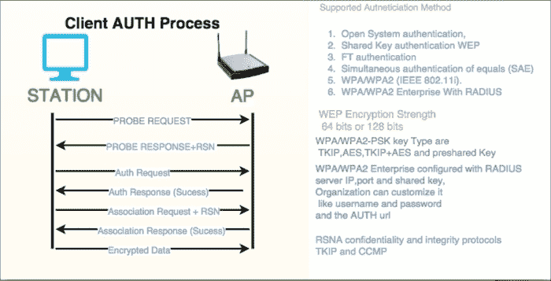

# 七、802.11 认证过程

AP 在信标帧中通告其能力；客户端(STA)使用自己的探测请求帧在每个信道(通常是信道 11)上广播自己。通过这样做，它可以确定哪些接入点在范围内。

探测响应帧包含 AP 接收到探测请求帧后的能力信息、支持的数据速率等。

STA 向 AP 发送包含其身份的认证帧。对于开放系统认证(默认)，接入点会以认证帧作为响应，表示接受(或拒绝)。

共享密钥认证需要 WEP (64 位或 128 位)密钥，并且应该在客户端和 AP 上使用相同的 WEP 密钥。STA 请求共享密钥认证，该认证从 AP 返回未加密的质询文本(128 字节随机生成的文本)。STA 加密文本并将数据返回给 AP，AP 响应指示接受(或拒绝)。

STA 向 AP 发送包含必要信息的关联请求帧，然后 AP 将发送包含接受(或拒绝)的关联响应帧。如果这被接受，STA 可以利用 AP 接入其他网络:

