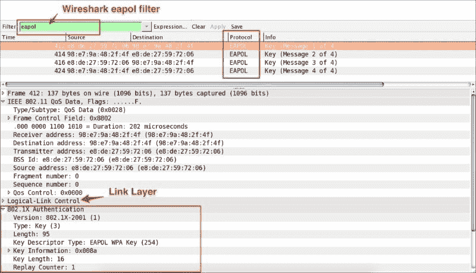
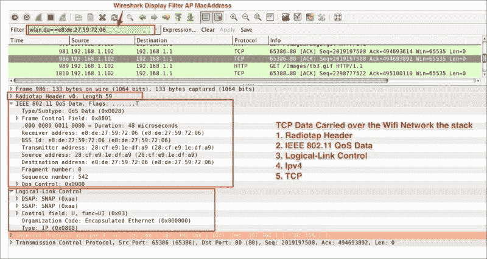

# 八、802.1X EAPOL

IEEE802.1x 是基于**可扩展认证** **协议** ( **EAP** )的，是 **PPP** ( **点对点协议**)的扩展，也被称为“EAP over LAN”或 EAPOL。

IEEE 802.11 工作组于 2001 年通过了 802.1x 标准，以提高原始 802.11 标准中规定的安全性(IEEE，2001)。

在 Wireshark 中打开`802.11-AUTH-enabled.pcap`文件，使用显示过滤器`eapol`只显示所有的 `eapol`消息，如下图所示。在`eapol`数据包中，处理设备和 AP 的会话密钥。

如截图所示，所有的`eapol`数据包都被捕获为 1/4、2/4、3/4 和 4/4。

如果您试图解密 802.11 流量，则需要`eapol`数据包。https://wiki.wireshark.org/HowToDecrypt802.11 的 Wireshark wiki 链接[是一个关于如何在 Wireshark 的帮助下解密流量的极好信息来源。](https://wiki.wireshark.org/HowToDecrypt802.11)

## 802.11 协议栈

802.11 标准规定了支持基于 802.11 的无线局域网操作的公共**媒体访问** **控制** ( **MAC** )层(数据链路层)。802.11 MAC 层使用 802.11 **物理层** ( **PHY** )层，例如 802.11a/b，来执行载波侦听、传输和接收 802.11 帧的任务。

在 Wireshark 中打开数据包捕获文件`802.11-AUTH-Disabled.pcap`，将显示过滤器设置为`wlan.da==e8:de:27:59:72:06`，查看如何使用 802.11 作为传输介质传输数据。

802.11 QoS 数据帧显示 LLC 报头遵循 IEEE 802.11 这是在监控模式下所期望的。

捕获的 802.11 看起来像以太网数据包，因为 802.11 适配器经常试图将数据包转换成假的以太网数据包，然后将它们提供给主机。

# Wi-Fi 嗅探产品

根据操作系统和使用案例(如 WEP 解密、高级分析和地理定位)，还有其他商业(以及开源)工具使用某种形式的 Wi-Fi 嗅探。其中一些列举如下:

*   **Kismet**([https://www.kismetwireless.net/documentation.shtml](https://www.kismetwireless.net/documentation.shtml)):Kismet 可以嗅探 802.11a/b/g/n Wi-Fi 流量。
*   **Riverbed air cap**([http://riverbed.com](http://riverbed.com)):Riverbed air cap 适配器用于捕获和分析 802.11a/b/g/n Wi-Fi 流量，与 Wireshark 完全集成。
*   用于 Mac OS X 的 KisMac(【http://kismac.en.softonic.com/mac?ex=SWH-1740.2】)KisMac 提供了许多与 Kismet 相同的功能，被认为是 Mac 的 NetStumbler。Mac 用户可以找到实用工具，如 airport ID、airport utility 和 Wi-Fi Diagnostics，用于嗅探和诊断 Wi-Fi 网络。
*   **NetStumbler**([http://www.netstumbler.com](http://www.netstumbler.com)):这个是用于 Wi-Fi 分析的。

### 注意

有关更多信息，您可以访问以下链接:

*   [https://wiki.wireshark.org/CaptureSetup/WLAN](https://wiki.wireshark.org/CaptureSetup/WLAN)
*   [https://en.wikipedia.org/wiki/IEEE_802.11](https://en.wikipedia.org/wiki/IEEE_802.11)
*   [https://wiki.wireshark.org/HowToDecrypt802.11](https://wiki.wireshark.org/HowToDecrypt802.11)
*   [https://www.wireshark.org/tools/wpa-psk.html](https://www.wireshark.org/tools/wpa-psk.html)

# 总结

在本章中，我们介绍了 Wi-Fi 采集设置，并讨论了什么是监控模式及其利弊。我们还学习了如何在第 2 层数据报(帧)上使用各种显示过滤器。在下一章中，我们将更详细地探讨网络安全及其缓解计划。