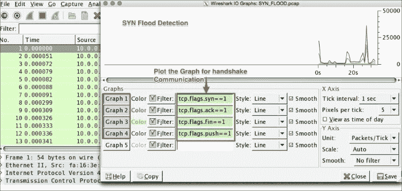
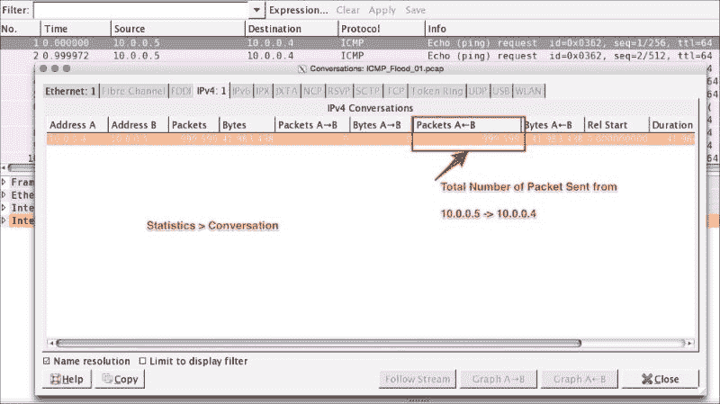

# 九、安全分析

在前几章中，我们学习了更多关于协议及其分析技术的知识。在本章中，我们将了解 Wireshark 如何帮助我们执行安全分析，并尝试通过涵盖以下主题来涵盖这些领域应用和网络的安全方面:

*   心脏出血病菌
*   DoS SYN 泛滥/缓解
*   DoS ICMP 泛滥/缓解
*   扫描网络
*   ARP 重复 IP 检测(MITM)
*   DrDoS 简介
*   BitTorrent 源标识
*   Wireshark 端点和协议层级

# 心脏出血虫

Heartbeat 协议(RFC6520)运行在记录层协议(记录层协议在 SSL 中定义)之上。

Heartbleed 错误(CVE-2014-0160)存在于实现心跳协议的选定 OpenSSL 版本(1.0.1 到 1.0.1f)中。

这个错误是一个严重的漏洞，使得攻击者能够在心跳响应期间读取更大部分的内存(包括私钥和密码)。

## heart bleed Wireshark 过滤器

心跳协议运行在 SSL/TLS 中标识为记录类型(24)的记录层之上的。在 Wireshark 中，显示过滤器`ssl.record.content_type == 24`可用于显示心跳消息。心跳消息是心跳请求和心跳响应。

## Heartbleed Wireshark 分析

在 Wireshark 中打开`heartbleed.pcap`数据包捕获文件，并将显示过滤器设置为`ssl.record.content_type == 24`。

Wireshark 将仅显示加密的心跳消息。第一个是心跳请求消息。该消息中，心跳请求的长度(`ssl.record.length == 112`)设置为 112 字节，如截图所示:


每当心跳请求消息被发送到服务器时，服务器就用相应的心跳响应消息进行应答。

在给定的数据包中，心跳响应长度(`ssl.record.length == 144`)被设置为`144`，这意味着服务器返回的数据比预期的多(多 32 字节)。这些额外的信息被称为心脏出血；此出血可能包含敏感信息，如密码和私钥:


## 心脏出血试验

要测试心脏出血，使用以下步骤:

1.  从`openssl`库:

    ```
    [bash ]# openssl version
    OpenSSL 1.0.1c 10 May 2012

    ```

    安装 OpenSSL 版本(1.0.1c)
2.  创建自签名 SSL 证书:

    ```
    [bash #]openssl req -sha256 -new -newkey rsa:2048 -nodes -keyout ./server.key -out ./server.csr -subj "/C=PU/ST=Anish/L=Test/O=Security Analysus /OU=Heartbleed/CN=myhost.com"
    [bash #]openssl x509 -req -days 365 -in server.csr -signkey server.key -out server.pems

    ```

3.  使用受影响的 OpenSSL 版本启动 TLS 服务器:

    ```
    [bash ]# openssl  s_server -www -cipher AES256-SHA -key ./server.key -cert ./server.pem -accept 443

    ```

4.  开始数据包捕获:

    ```
    [bash ]# tcpdump port 443 –s0 –w heartbleed.pcap &

    ```

如果可以通过公共网络访问 SSL/TLS 服务器，则可以使用在线 filippo。其他工具(如 Heartbeat Detector，它是一个 shell 脚本)也可以用于此目的:

*   **心脏出血**探测器:[https://access.redhat.com/labsinfo/heartbleed](https://access.redhat.com/labsinfo/heartbleed)
*   **Heartbleed** **在线测试**:[https://filippo.io/Heartbleed/](https://filippo.io/Heartbleed/)

## 心脏出血建议

以下是心脏出血建议:

*   按照 OpenSSL 公告中的建议应用补丁程序
*   如果漏洞已解决，请更改密码。

# 拒绝服务攻击

这种技术用于攻击主机，使得主机无法再向用户发出任何请求。最后，服务器崩溃，导致服务器不可用。

本主题中使用了各种攻击技术。我们将在 Wireshark 的帮助下介绍 SYN flood 和 ICMP flood 检测。

## 合成洪水

我们在第三章[，*分析 TCP 网络*中学到了](part0025_split_000.html#NQU21-30546b3f1d4045fcb01d610f6dbd3a07 "Chapter 3. Analyzing the TCP Network") TCP 握手过程。在这个握手过程中，客户端和服务器之间通过 SYN、SYN-ACK 和 ACK 建立连接。

在 SYN flood 攻击场景中，发生的情况是:

*   客户端正在发送非常快的 SYN 它已收到 SYN-ACK，但没有用最终 ACK 进行响应
*   或者，客户端正在发送非常快速的 SYN 并阻止来自服务器的 SYN-ACK，或者客户端正在从欺骗的 IP 地址发送非常快速的 SYN，因此 SYN-ACK 被发送到实际上不存在的未知主机

在所有这些场景中，TCP/IP 堆栈文件描述符被消耗，导致服务器变慢并最终崩溃。

在 Wireshark 中打开`SYN_FLOOD.pcap`数据包捕获文件，并执行以下步骤:

1.  点击**统计** | **IO 图**。
2.  将出现 **IO 图形**对话框。
3.  为 TCP 握手消息 SYN、ACK、FIN 和 PUSH 生成四个图形。

IO 图形统计显示以下摘要:

*   TCP 连接永远不会关闭，因为`tcp.flags.fin`没有计数
*   TCP 连接从不交换任何数据，因为`tcp.flags.push`没有计数
*   SYN 数据包的计数非常高
*   ACK 的计数是 SYN 包计数的一半

在实际场景中，这些数据将与实际的数据包流混合在一起，但分析技术将保持不变。当您看到 SYN 数据包意外增长或 SYN 数据包激增时，这是来自 DoS 或来自多源 DDoS 的 SYN 洪流。



### SYN 洪水缓解

SYN 攻击可以减轻。以下是一些缓解计划:

*   **TCP/IP 栈加固**:操作系统决定 SYN，SYN-ack，ACK 重复多少次；降低 SYN，ACK 重试次数将有助于服务器减轻 SYN flood 攻击。SYN cookie 用于抵御 SYN flood 攻击。要在 Linux 系统上执行所有这些操作，编辑`/etc/sysctl.conf`文件并对这些条目进行修改:

    ```
    #Prevent SYN attack, enable SYNcookies (they will kick-in when the max_syn_backlog reached)
    net.ipv4.tcp_syncookies = 1
    net.ipv4.tcp_syn_retries = 2
    net.ipv4.tcp_synack_retries = 2
    net.ipv4.tcp_max_syn_backlog = 4096
    # Increase the tcp-time-wait buckets pool size to prevent simple DOS attacks 
    net.ipv4.tcp_max_tw_buckets = 1440000
    ```

*   重启`sycltl`以应用更改:

    ```
    bash#sysctl -p

    ```

*   IPtables 防火墙可以设置为拒绝导致问题的 IP。要生成防火墙规则，请使用 Wireshark 功能生成防火墙规则来*丢弃*导致 DoS 的流量。
*   例如，阻塞流量导致 DoS:

    ```
    # Netfilter (iptables)
    iptables -A INPUT -i eth0 -d 10.0.0.3/32 -j DROP
    ! Cisco IOS (standard)
    access-list NUMBER deny host 10.0.0.3
    # IPFirewall (ipfw)
    add deny ip from 10.0.0.3 to any in
    # Windows Firewall (netsh)
    add portopening tcp 443 Wireshark DISABLE 10.0.0.3
    ```

*   应对对外开放的港口进行审计。
*   通过创建峰值警报进行监控，这些警报显示网络上可能导致 DoS 情况的不健康趋势；动态生成防火墙规则，并将其应用于目标虚拟机。
*   网络 ACL 在路由器级别阻止流量；将 IDS/IPS 系统引入网络。
*   使用负载平衡器作为连接卸载程序。在这种情况下，如果发生攻击，它将发生在负载平衡器上。虚拟机将继续受到保护。大多数商用负载平衡器都有能力抵御这种类型的攻击。
*   对每个 IP 每秒的 SYN 进行速率限制。
*   在数据中心边缘路由器(L2)上设置 DoS/DDoS 保护。
*   应用多级检测并了解可疑流量位置的特征和属性。
*   准备缓解计划。

## ICMP 洪水

**互联网** **控制消息协议** ( **ICMP** ) flood 也被归类为第三层 DoS 攻击或 DDoS 攻击。它的工作原理如下:攻击者试图用欺骗的 IP 地址淹没回应请求(ping)数据包，或者服务器被回应请求(ping 数据包)淹没，无法处理每个 ICMP 回应请求的回应响应，导致主机速度缓慢和拒绝服务。

在 Wireshark 中打开`ICMP_Flood_01.pcap`数据包捕获文件，并执行以下步骤:

1.  点击**统计** | **IO 图**。
2.  将出现 **IO 图形**对话框。
3.  为 ICMP 和 ICMPv6 生成图形。

如截图所示，ICMP flood 具有以下特征:

*   IO 图显示了大量的 ICMP 数据包:在短时间内有近 80K 个 ping 请求
*   The packet capture doesn't have the echo reply message

    这是样本数据；在真实环境中，它可能会有所不同，因为攻击者也在学习和寻找执行 ICMP DoS 的新方法。

    

### ICMP 洪水缓解

以下是针对 ICMP 洪水攻击的一些缓解计划:

*   **OS 加固**:在主机(生产环境)通过 iptables 防火墙禁用 ICMP 和 ICMPv6 协议:

    ```
    bash# iptables -I INPUT -p icmp --icmp-type 8 -j DROP
    bash# iptables -A OUTPUT -p icmp -o eth0 -j ACCEPT 
    bash# iptables -A INPUT -p icmp --icmp-type echo-reply -s 0/0 -i eth0 -j ACCEPT 
    bash# iptables -A INPUT -p icmp --icmp-type destination-unreachable -s 0/0 -i eth0 -j ACCEPT 
    bash# iptables -A INPUT -p icmp --icmp-type time-exceeded -s 0/0 -i eth0 
    -j ACCEPT 
    bash# iptables -A INPUT -p icmp -i eth0 -j DROP
    bash# ip6tables -I INPUT -p icmpv6 –icmpv6-type 8 -j DROP
    bash# ip6tables -I INPUT -p icmpv6 -i eth0 -j DROP

    ```

*   TCP/IP 栈加固:通过编辑`sysctl.conf`文件，并在该文件中添加以下条目:

    ```
    net.ipv4.icmp_echo_ignore_all = 1
    ```

*   重启`sycltl`以应用更改:

    ```
    bash#sysctl -p

    ```

*   如果允许 ICMP/ICMPv6 流量，则在路由器级别进行速率限制
*   防火墙应该阻止路由器上的 ICMP/ICPMv6 流量

## SSL 泛滥

这种攻击发生在第 7 层，很难检测到，因为它类似于合法的网站流量。在分析 SSL/TLS 时，我们学习了 SSL 和握手过程。攻击者可以对系统使用握手来发起 DoS/DDoS 攻击。由于握手涉及客户端和服务器之间更大的消息交换，例如，在单向 auth 的情况下，建立连接的数据包交换总数大约为 12(即， *3 个分组 TCP 握手+ 9 个分组 SSL 握手= 12 个交换的分组*)。

攻击者可以淹没 SSL 连接并使服务器繁忙，从而建立连接并尝试创建 DoS/DDoS 场景。

Wireshark 可以帮助识别最大数量的数据包从哪个 IP 到达。该功能称为 Wireshark 对话，可用于任何类型的泛滥情况(DoS 攻击)。

在 Wireshark 中打开`ICMP_Flood_01.pcap`数据包捕获文件，并执行以下步骤:

1.  点击**统计** | **对话**。
2.  A conversation dialog box will appear as shown in the screenshot. An unusually higher volume of traffic is generated from source B (`10.0.0.5`) to source A (`10.0.0.4`), causing the network to slow down:

其他类别的第 7 层攻击是 HTTP/HTTPS `POST`洪水和 HTTP/HTTPS `GET`洪水。

# 扫描

在本节中，我们将介绍漏洞扫描的基础知识，并验证在 Wireshark 的帮助下执行主机扫描时会发生什么情况。

## 漏洞扫描

主机发现、端口扫描和操作系统检测是漏洞扫描的一部分。在此过程中，安全审计员会识别漏洞，并制定适当的缓解计划来解决这些漏洞。例如:

*   安全审计员扫描主机，检查是否只有允许的端口对外部世界开放
*   黑客扫描端口以找出哪些服务正在运行，例如在主机扫描过程中，如果数据库端口对外界开放，则数据库系统会受到攻击。

在 Wireshark 中打开`host_scan.pcap`文件；该示例显示了外部客户端如何扫描端口:


在这个过程中，一个`SYN`数据包被发送到每台主机上所有公共服务的端口，例如`DNS`、`LDAP`、`HTTP`等等。如果我们从主机得到 ACK，主机被认为是该端口上的`ACTIVE`。

安全审计员或黑客可以使用网络扫描工具来获取端口、主机和操作系统信息。例如，`nmap`网络实用工具命令可用于扫描活动/开放端口:

1.  扫描主机中的标准端口:

    ```
    bash# nmap -T4 -A -v 128.136.179.233

    ```

2.  扫描主机中所有活动端口:

    ```
    bash# nmap -p 1-65535 -T4 -A -v 128.136.179.233

    ```

在线 nmap 工具可以在[https://pentest-tools . com/network-vulnerability-scanning/TCP-port-scanner-online-nmap](https://pentest-tools.com/network-vulnerability-scanning/tcp-port-scanner-online-nmap)找到。

## SSL 扫描

SSL 扫描由不同的用户(例如，安全审计员和黑客)完成，以实现他们自己的目标:

*   安全审计器使用 SSL 扫描器来查找 SSL 服务器中存在的最弱的密码套件或易受攻击的 SSL 协议版本，并将其删除
*   黑客使用 SSL 扫描器，通过在 SSL 服务器中找到脆弱的密码套件或易受攻击的协议版本来破解加密的 SSL 通信

使用`nmap`命令在给定服务器端口`636` LDAP 中查找可用密码和支持的协议版本的示例如下所示:

```
[root@ ~]# nmap --script ssl-cert,ssl-enum-ciphers -p 636 10.10.1.3To find available ciphers and the supported protocol version in a given server port 443 HTTPS

[root@ ~]# nmap --script ssl-cert,ssl-enum-ciphers -p 443 10.10.1.3

```

# ARP 重复 IP 检测

Wireshark 检测 ARP 协议中的重复 IP。使用`arp.duplicate-address-frame` Wireshark 过滤器仅显示重复的 IP 信息帧。

例如，打开`ARP_Duplicate_IP.pcap`文件，应用`arp.duplicate-address-frame`滤镜，如截图所示:


在这种情况下，Wireshark 会提供以下信息:

*   通常情况下，DHCP 服务器会解析重复的 IP 地址。在这种情况下，当它开始显示每个 IP 地址时，必须认真对待。
*   所有 IP 都有相同的发件人 MAC 地址:`fa:16:3e:bf:22:d0`，并显示为该 IP 地址的副本。
*   这可能是 ARP 中毒——在后台发生的中间人攻击。

# DrDoS

**分布式反射拒绝服务** ( **DrDoS** )，也称为基于 UDP 的放大攻击，使用公共可访问的 UDP 服务器和带宽放大因子，以 UDP 流量淹没系统。

打开 `DrDoS.pcap`文件。在此数据包捕获中，SYN 数据包通过服务器 IP 地址与受害者的源 IP 地址一起发送；注意目的端口是 HTTP `80`，源端口是 NTP 端口`123`，UDP。现在，服务器将向源发送一个 ACK 数据包，在这种情况下，该数据包将是受害者的 IP 地址。如果使用多台服务器，服务器将向受害者(目标)发送大量 ACK 数据包。

有 UDP 协议(DNS、NTP 和 BitTorrent)被基于 UDP 的放大攻击感染。有关这方面的更多信息，请参考 US-CERT 发布的警报 TA14-017 a:【https://www.us-cert.gov/ncas/alerts/TA14-017A。

# 比特洪流

Wireshark 支持 BitTorrent 协议。BitTorrent 使用 Torrent 文件从 P2P 网络下载内容。通过这些程序下载的内容是安全的(取决于下载的内容类型)。任何下载都可能包含木马或病毒，所以(这一建议适用于任何使用的协议)要小心，尤其是当下载任何可执行文件或从未知的种子网址。所有下载的文件都要经过扫描。在 Wireshark 中打开`bittorrent.pcapng`文件，并从该位置检查正在下载的内容。


Wireshark BitTorrent 解析器能够解码整个下载过程。要检查这个源的端点，请执行以下操作。点击**统计** | **端点**；一个端点窗口将会出现:


如屏幕截图所示，Wireshark 获得了以下信息:

1.  过滤协议，在本例中为 BitTorrent。
2.  选择 Ipv4 选项卡。
3.  在此捕获中，启用了名称解析。
4.  客户端(`192.168.1.101`)已经下载了 10744 字节，并且内容来自不同的地理位置。因为内容是从各种来源下载的，所以总是建议在打开之前先扫描一下。

端点统计是 Wireshark 的一个很好的特性。端点揭示信息，例如给定客户端的传出连接。在此示例中，客户端连接到分布在不同地理位置的 16 个不同的端点位置。对于任何可疑流量，直接在端点窗口上使用过滤选项。

### 注意

注意:Wireshark 不会通知或扫描病毒；有助于分析病毒。

# Wireshark 协议层级

这个特性在处理服务器上运行的协议时非常有用。要找到它，请在 Wireshark 菜单中点击**摘要** | **协议层级**。将打开捕获的数据包的协议层次结构，如屏幕截图所示:


从安全的角度来看，它将对以太网系统上发生的所有协议有一个高层次的了解。网络管理员使用这些信息来强化系统配置；例如，如果管理员发现生产系统中正在运行一个 DCE 协议，在看到该协议层次结构后，他可以发出警报来停止该服务。

# 总结

祝贺你完成这一章和这本书。到目前为止，我们已经了解了 Wireshark 如何帮助分析 TCP/IP、DHCPv6、DHCP 和 HTTP 等网络协议。我们对 SSL/TLS 协议和 WLAN 设置捕获进行了详细的分析；然后，我们探讨了与安全相关的问题及其缓解计划。我们也尽量做到实用，并提供了一些实时用例场景及其缓解计划。

在本书中，我们还强调了捕获数据包的其他有效工具，如 tcpdump 和 snoop。现在，您应该能够以本书为参考，开始分析本书未涉及的其他协议。

# 索引

## A

*   802.11 授权过程
    *   关于/ [802.11 认证流程](part0048_split_000.html#1DOR02-30546b3f1d4045fcb01d610f6dbd3a07 "802.11 auth process")
*   警报
    *   close_notify / [警报协议](part0036_split_000.html#12AK82-30546b3f1d4045fcb01d610f6dbd3a07 "Alert Protocol")
    *   意外消息/ [警报协议](part0036_split_000.html#12AK82-30546b3f1d4045fcb01d610f6dbd3a07 "Alert Protocol")
    *   bad_record_mac / [警报协议](part0036_split_000.html#12AK82-30546b3f1d4045fcb01d610f6dbd3a07 "Alert Protocol")
    *   解密 _ 失败/ [警报协议](part0036_split_000.html#12AK82-30546b3f1d4045fcb01d610f6dbd3a07 "Alert Protocol")
    *   record_overflow / [警报协议](part0036_split_000.html#12AK82-30546b3f1d4045fcb01d610f6dbd3a07 "Alert Protocol")
    *   解压缩 _ 失败/ [警报协议](part0036_split_000.html#12AK82-30546b3f1d4045fcb01d610f6dbd3a07 "Alert Protocol")
    *   握手 _ 失败/ [告警协议](part0036_split_000.html#12AK82-30546b3f1d4045fcb01d610f6dbd3a07 "Alert Protocol")
    *   bad_certificate / [警报协议](part0036_split_000.html#12AK82-30546b3f1d4045fcb01d610f6dbd3a07 "Alert Protocol")
    *   不支持的 _certificate / [警报协议](part0036_split_000.html#12AK82-30546b3f1d4045fcb01d610f6dbd3a07 "Alert Protocol")
    *   证书 _ 已撤销/ [警报协议](part0036_split_000.html#12AK82-30546b3f1d4045fcb01d610f6dbd3a07 "Alert Protocol")
    *   证书 _ 过期/ [警报协议](part0036_split_000.html#12AK82-30546b3f1d4045fcb01d610f6dbd3a07 "Alert Protocol")
    *   证书 _ 未知/ [警报协议](part0036_split_000.html#12AK82-30546b3f1d4045fcb01d610f6dbd3a07 "Alert Protocol")
    *   非法 _ 参数/ [警报协议](part0036_split_000.html#12AK82-30546b3f1d4045fcb01d610f6dbd3a07 "Alert Protocol")
    *   未知 _ca / [警报协议](part0036_split_000.html#12AK82-30546b3f1d4045fcb01d610f6dbd3a07 "Alert Protocol")
    *   decode_error / [警报协议](part0036_split_000.html#12AK82-30546b3f1d4045fcb01d610f6dbd3a07 "Alert Protocol")
    *   decrypt_error / [警报协议](part0036_split_000.html#12AK82-30546b3f1d4045fcb01d610f6dbd3a07 "Alert Protocol")
    *   出口限制/ [警报协议](part0036_split_000.html#12AK82-30546b3f1d4045fcb01d610f6dbd3a07 "Alert Protocol")
    *   协议 _ 版本/ [预警协议](part0036_split_000.html#12AK82-30546b3f1d4045fcb01d610f6dbd3a07 "Alert Protocol")
    *   不足 _ 安全/ [警报协议](part0036_split_000.html#12AK82-30546b3f1d4045fcb01d610f6dbd3a07 "Alert Protocol")
    *   内部 _ 错误/ [警报协议](part0036_split_000.html#12AK82-30546b3f1d4045fcb01d610f6dbd3a07 "Alert Protocol")
    *   user_canceled / [预警协议](part0036_split_000.html#12AK82-30546b3f1d4045fcb01d610f6dbd3a07 "Alert Protocol")
    *   否 _ 重新协商/ [警报协议](part0036_split_000.html#12AK82-30546b3f1d4045fcb01d610f6dbd3a07 "Alert Protocol")
*   ARP 重复 IP 检测
    *   关于/ [ARP 重复 IP 检测](part0054.html#1JFUC1-30546b3f1d4045fcb01d610f6dbd3a07 "ARP duplicate IP detection")

## B

*   柏克莱数据包过滤器(BPF)
    *   关于/ [捕获过滤器选项](part0018_split_000.html#H5A42-30546b3f1d4045fcb01d610f6dbd3a07 "The capture filter options")
*   钻头扭转
    *   URL / [其他数据包分析工具](part0016_split_000.html#F8901-30546b3f1d4045fcb01d610f6dbd3a07 "Other packet analyzer tools")
*   BitTorrent 协议
    *   关于/ [BitTorrent](part0056.html#1LCVG1-30546b3f1d4045fcb01d610f6dbd3a07 "BitTorrent")
*   BOOTP/DHCP
    *   关于/ [BOOTP/DHCP](part0042_split_000.html#181NK2-30546b3f1d4045fcb01d610f6dbd3a07 "BOOTP/DHCP")
    *   Wireshark 过滤器/ [BOOTP/DHCP Wireshark 过滤器](part0042_split_000.html#181NK2-30546b3f1d4045fcb01d610f6dbd3a07 "BOOTP/DHCP Wireshark filter")
    *   地址分配/ [地址分配](part0042_split_000.html#181NK2-30546b3f1d4045fcb01d610f6dbd3a07 "Address assignment")
    *   捕获 DHCPv4 流量/ [捕获 DHCPv4 流量](part0042_split_000.html#181NK2-30546b3f1d4045fcb01d610f6dbd3a07 "Capture DHCPv4 traffic")

## C

*   该隐
    *   URL / [其他数据包分析工具](part0016_split_000.html#F8901-30546b3f1d4045fcb01d610f6dbd3a07 "Other packet analyzer tools")
*   捕获选项
    *   数据包，使用/ [捕获数据包，使用捕获选项](part0018_split_000.html#H5A42-30546b3f1d4045fcb01d610f6dbd3a07 "Capturing packets with Capture Options")
    *   捕获过滤器选项/ [捕获过滤器选项](part0018_split_000.html#H5A42-30546b3f1d4045fcb01d610f6dbd3a07 "The capture filter options")
*   客户证书
    *   关于/ [客户端证书](part0036_split_000.html#12AK82-30546b3f1d4045fcb01d610f6dbd3a07 "Client certificate")
*   客户端证书请求
    *   关于/ [客户端证书请求](part0036_split_000.html#12AK82-30546b3f1d4045fcb01d610f6dbd3a07 "Client certificate request")
*   客户问候消息
    *   关于/ [客户端您好](part0036_split_000.html#12AK82-30546b3f1d4045fcb01d610f6dbd3a07 "Client Hello")
    *   结构/ [客户端你好](part0036_split_000.html#12AK82-30546b3f1d4045fcb01d610f6dbd3a07 "Client Hello")
    *   消息/ [客户端您好](part0036_split_000.html#12AK82-30546b3f1d4045fcb01d610f6dbd3a07 "Client Hello")
    *   版本/ [客户端您好](part0036_split_000.html#12AK82-30546b3f1d4045fcb01d610f6dbd3a07 "Client Hello")
    *   随机/ [客户端您好](part0036_split_000.html#12AK82-30546b3f1d4045fcb01d610f6dbd3a07 "Client Hello")
    *   会话 ID / [客户端问候](part0036_split_000.html#12AK82-30546b3f1d4045fcb01d610f6dbd3a07 "Client Hello")
    *   cipher suites / [客户端您好](part0036_split_000.html#12AK82-30546b3f1d4045fcb01d610f6dbd3a07 "Client Hello")
    *   压缩方法/ [客户端您好](part0036_split_000.html#12AK82-30546b3f1d4045fcb01d610f6dbd3a07 "Client Hello")
    *   分机/ [客户端您好](part0036_split_000.html#12AK82-30546b3f1d4045fcb01d610f6dbd3a07 "Client Hello")
*   客户端密钥交换消息
    *   关于/ [客户端密钥交换](part0036_split_000.html#12AK82-30546b3f1d4045fcb01d610f6dbd3a07 "Client Key Exchange")
*   控制帧/ [控制帧](part0048_split_000.html#1DOR02-30546b3f1d4045fcb01d610f6dbd3a07 "Control frames")

## D

*   数据帧/ [数据帧](part0048_split_000.html#1DOR02-30546b3f1d4045fcb01d610f6dbd3a07 "Data frames")
*   解码为功能
    *   关于/ [解码为](part0021_split_000.html#K0RQ2-30546b3f1d4045fcb01d610f6dbd3a07 "Decode-As")
*   DHCP/BOOT
    *   URL / [引用](part0045.html#1AT9A1-30546b3f1d4045fcb01d610f6dbd3a07 "References")
*   DHE/埃切德流量
    *   解密/ [解密 DHE/埃奇德流量](part0038_split_000.html#147LC1-30546b3f1d4045fcb01d610f6dbd3a07 "Decrypting DHE/ECHDE traffic")
    *   前向保密/ [前向保密](part0038_split_000.html#147LC1-30546b3f1d4045fcb01d610f6dbd3a07 "Forward secrecy")
*   迪菲-赫尔曼(DHE)密钥交换
    *   关于 Diffie-Hellman 密钥交换
    *   命名约定/[Diffie-Hellman 密钥交换](part0037_split_000.html#1394Q1-30546b3f1d4045fcb01d610f6dbd3a07 "The Diffie-Hellman key exchange")
    *   URL/[Diffie-Hellman 密钥交换](part0037_split_000.html#1394Q1-30546b3f1d4045fcb01d610f6dbd3a07 "The Diffie-Hellman key exchange")
*   显示的数据包
    *   导出/ [导出显示的数据包](part0021_split_000.html#K0RQ2-30546b3f1d4045fcb01d610f6dbd3a07 "Exporting the displayed packet")
*   显示过滤器引用
    *   URL / [引用](part0033.html#VF2I1-30546b3f1d4045fcb01d610f6dbd3a07 "References")
*   分布式反射拒绝服务(DrDoS) / [DrDoS](part0055.html#1KEEU1-30546b3f1d4045fcb01d610f6dbd3a07 "DrDoS")
*   域名系统(DNS)
    *   关于/ [DNS](part0043_split_000.html#190861-30546b3f1d4045fcb01d610f6dbd3a07 "DNS")
    *   Wireshark 过滤器/ [DNS Wireshark 过滤器](part0043_split_000.html#190861-30546b3f1d4045fcb01d610f6dbd3a07 "DNS Wireshark filter")
    *   port / [Port](part0043_split_000.html#190861-30546b3f1d4045fcb01d610f6dbd3a07 "Port")
    *   资源记录/ [资源记录](part0043_split_000.html#190861-30546b3f1d4045fcb01d610f6dbd3a07 "Resource records")
    *   流量/ [DNS 流量](part0043_split_000.html#190861-30546b3f1d4045fcb01d610f6dbd3a07 "DNS traffic")
    *   URL / [引用](part0045.html#1AT9A1-30546b3f1d4045fcb01d610f6dbd3a07 "References")
*   拒绝服务攻击
    *   关于/[DOS 攻击](part0052_split_000.html#1HIT82-30546b3f1d4045fcb01d610f6dbd3a07 "The DOS attack")
    *   合成洪水/ [合成洪水](part0052_split_000.html#1HIT82-30546b3f1d4045fcb01d610f6dbd3a07 "SYN flood")
    *   互联网控制消息协议(ICMP)泛滥/ [ICMP 泛滥](part0052_split_000.html#1HIT82-30546b3f1d4045fcb01d610f6dbd3a07 "ICMP flood")
    *   SSL 泛洪/ [SSL 泛洪](part0052_split_000.html#1HIT82-30546b3f1d4045fcb01d610f6dbd3a07 "SSL flood")
*   IPv6 的动态主机配置协议(DHCPv6)
    *   关于/ [DHCPv6](part0041_split_000.html#173722-30546b3f1d4045fcb01d610f6dbd3a07 "DHCPv6")
    *   Wireshark 过滤器/ [DHCPv6 Wireshark 过滤器](part0041_split_000.html#173722-30546b3f1d4045fcb01d610f6dbd3a07 "DHCPv6 Wireshark filter")
    *   组播地址/ [组播地址](part0041_split_000.html#173722-30546b3f1d4045fcb01d610f6dbd3a07 "Multicast addresses")
    *   UDP 端口信息/[UDP 端口信息](part0041_split_000.html#173722-30546b3f1d4045fcb01d610f6dbd3a07 "The UDP port information")
    *   消息类型/ [DHCPv6 消息类型](part0041_split_000.html#173722-30546b3f1d4045fcb01d610f6dbd3a07 "DHCPv6 message types")
    *   消息交换/ [消息交换](part0041_split_000.html#173722-30546b3f1d4045fcb01d610f6dbd3a07 "Message exchanges")
    *   流量捕获/ [DHCPv6 流量捕获](part0041_split_000.html#173722-30546b3f1d4045fcb01d610f6dbd3a07 "DHCPv6 traffic capture")
    *   URL / [引用](part0045.html#1AT9A1-30546b3f1d4045fcb01d610f6dbd3a07 "References")

## E

*   EAPOL / [802.1X EAPOL](part0048_split_000.html#1DOR02-30546b3f1d4045fcb01d610f6dbd3a07 "802.1X EAPOL")
*   局域网上的 EAP/[802.1 x EAPOL](part0048_split_000.html#1DOR02-30546b3f1d4045fcb01d610f6dbd3a07 "802.1X EAPOL")
*   椭圆曲线密码(ECC) / [椭圆曲线 Diffie-Hellman 密钥交换](part0037_split_000.html#1394Q1-30546b3f1d4045fcb01d610f6dbd3a07 "Elliptic curve Diffie-Hellman key exchange")
*   椭圆曲线 Diffie-Hellman 密码(ECDHE) / [前向保密](part0038_split_000.html#147LC1-30546b3f1d4045fcb01d610f6dbd3a07 "Forward secrecy")
*   椭圆曲线 Diffie-Hellman 密钥交换
    *   关于/ [椭圆曲线 Diffie-Hellman 密钥交换](part0037_split_000.html#1394Q1-30546b3f1d4045fcb01d610f6dbd3a07 "Elliptic curve Diffie-Hellman key exchange")
    *   URL / [椭圆曲线 Diffie-Hellman 密钥交换](part0037_split_000.html#1394Q1-30546b3f1d4045fcb01d610f6dbd3a07 "Elliptic curve Diffie-Hellman key exchange")
*   Ettercap
    *   URL / [其他数据包分析工具](part0016_split_000.html#F8901-30546b3f1d4045fcb01d610f6dbd3a07 "Other packet analyzer tools")
*   可扩展认证协议(EAP) / [802.1X EAPOL](part0048_split_000.html#1DOR02-30546b3f1d4045fcb01d610f6dbd3a07 "802.1X EAPOL")

## F

*   功能，Wireshark
    *   解码为/ [解码为](part0021_split_000.html#K0RQ2-30546b3f1d4045fcb01d610f6dbd3a07 "Decode-As")
    *   协议首选项/ [协议首选项](part0021_split_000.html#K0RQ2-30546b3f1d4045fcb01d610f6dbd3a07 "Protocol preferences")
    *   IO 图，使用/[IO 图](part0021_split_000.html#K0RQ2-30546b3f1d4045fcb01d610f6dbd3a07 "The IO graph")
    *   TCP 流，跟随/ [跟随 TCP 流](part0021_split_000.html#K0RQ2-30546b3f1d4045fcb01d610f6dbd3a07 "Following the TCP stream")
    *   显示的数据包，导出/ [导出显示的数据包](part0021_split_000.html#K0RQ2-30546b3f1d4045fcb01d610f6dbd3a07 "Exporting the displayed packet")
    *   防火墙 ACL 规则，生成/ [生成防火墙 ACL 规则](part0021_split_000.html#K0RQ2-30546b3f1d4045fcb01d610f6dbd3a07 "Generating the firewall ACL rules")
*   过滤器工具栏
    *   关于/ [过滤器工具栏](part0020_split_000.html#J2B82-30546b3f1d4045fcb01d610f6dbd3a07 "The Filter toolbar")
    *   过滤技术/ [过滤技术](part0020_split_000.html#J2B82-30546b3f1d4045fcb01d610f6dbd3a07 "Filtering techniques")
    *   过滤器示例/ [过滤器示例](part0020_split_000.html#J2B82-30546b3f1d4045fcb01d610f6dbd3a07 "Filter examples")
*   防火墙 ACL 规则
    *   生成/ [生成防火墙 ACL 规则](part0021_split_000.html#K0RQ2-30546b3f1d4045fcb01d610f6dbd3a07 "Generating the firewall ACL rules")
*   前向保密
    *   关于/ [转发保密](part0038_split_000.html#147LC1-30546b3f1d4045fcb01d610f6dbd3a07 "Forward secrecy")
    *   参考资料/ [前向保密](part0038_split_000.html#147LC1-30546b3f1d4045fcb01d610f6dbd3a07 "Forward secrecy")
*   框架
    *   关于/ [帧](part0048_split_000.html#1DOR02-30546b3f1d4045fcb01d610f6dbd3a07 "Frames")
    *   管理帧/ [管理帧](part0048_split_000.html#1DOR02-30546b3f1d4045fcb01d610f6dbd3a07 "Management frames")
    *   数据帧/ [数据帧](part0048_split_000.html#1DOR02-30546b3f1d4045fcb01d610f6dbd3a07 "Data frames")
    *   控制帧/ [控制帧](part0048_split_000.html#1DOR02-30546b3f1d4045fcb01d610f6dbd3a07 "Control frames")

## H

*   心脏出血
    *   bug / [Heartbleed bug](part0051_split_000.html#1GKCM1-30546b3f1d4045fcb01d610f6dbd3a07 "Heartbleed bug")
    *   Wireshark 过滤器/[heart bleed Wireshark 过滤器](part0051_split_000.html#1GKCM1-30546b3f1d4045fcb01d610f6dbd3a07 "The Heartbleed Wireshark filter")
    *   Wireshark 分析/ [Heartbleed Wireshark 分析](part0051_split_000.html#1GKCM1-30546b3f1d4045fcb01d610f6dbd3a07 "Heartbleed Wireshark analysis")
    *   测试/ [心脏出血测试](part0051_split_000.html#1GKCM1-30546b3f1d4045fcb01d610f6dbd3a07 "The Heartbleed test")
    *   检测器，URL / [心脏出血测试](part0051_split_000.html#1GKCM1-30546b3f1d4045fcb01d610f6dbd3a07 "The Heartbleed test")
    *   在线测试，URL / [心脏出血测试](part0051_split_000.html#1GKCM1-30546b3f1d4045fcb01d610f6dbd3a07 "The Heartbleed test")
    *   推荐/ [心脏出血推荐](part0051_split_000.html#1GKCM1-30546b3f1d4045fcb01d610f6dbd3a07 "Heartbleed recommendations")
*   超文本传送协议
    *   关于/ [HTTP](part0044_split_000.html#19UOO1-30546b3f1d4045fcb01d610f6dbd3a07 "HTTP")
    *   Wireshark filter/[HTTP Wireshark filter](part0044_split_000.html#19UOO1-30546b3f1d4045fcb01d610f6dbd3a07 "HTTP Wireshark filter")
    *   用例/ [HTTP 用例](part0044_split_000.html#19UOO1-30546b3f1d4045fcb01d610f6dbd3a07 "HTTP use cases")
    *   URL / [引用](part0045.html#1AT9A1-30546b3f1d4045fcb01d610f6dbd3a07 "References")
*   HTTP，用例
    *   顶级 http 响应时间，查找/ [查找顶级 HTTP 响应时间](part0044_split_000.html#19UOO1-30546b3f1d4045fcb01d610f6dbd3a07 "Finding the top HTTP response time")
    *   数据包查找，基于 HTTP 方法/ [基于 HTTP 方法查找数据包](part0044_split_000.html#19UOO1-30546b3f1d4045fcb01d610f6dbd3a07 "Finding packets based on HTTP methods")
    *   敏感信息，在表单帖子中查找/ [在表单帖子中查找敏感信息](part0044_split_000.html#19UOO1-30546b3f1d4045fcb01d610f6dbd3a07 "Finding sensitive information in a form post")
    *   HTTP 状态码，使用/ [使用 HTTP 状态码](part0044_split_000.html#19UOO1-30546b3f1d4045fcb01d610f6dbd3a07 "Using HTTP status code")
*   HTTP 协议首选项
    *   关于/ [协议首选项](part0021_split_000.html#K0RQ2-30546b3f1d4045fcb01d610f6dbd3a07 "Protocol preferences")

## 我

*   初始序列号(ISN) / [握手消息–第一步【SYN】](part0026_split_000.html#OPEK2-30546b3f1d4045fcb01d610f6dbd3a07 "Handshake message – first step [SYN]")
*   接口列表
    *   数据包，使用/ [捕获数据包，使用接口列表](part0018_split_000.html#H5A42-30546b3f1d4045fcb01d610f6dbd3a07 "Capturing packets with Interface Lists")
    *   接口名称/ [常用接口名称](part0018_split_000.html#H5A42-30546b3f1d4045fcb01d610f6dbd3a07 "Common interface names")
*   互联网控制消息协议(ICMP)泛滥、拒绝服务攻击
    *   关于/ [ICMP 洪流](part0052_split_000.html#1HIT82-30546b3f1d4045fcb01d610f6dbd3a07 "ICMP flood")
    *   缓解/ [ICMP 洪水缓解](part0052_split_000.html#1HIT82-30546b3f1d4045fcb01d610f6dbd3a07 "ICMP flood mitigation")
*   IO 图
    *   使用/[IO 图](part0021_split_000.html#K0RQ2-30546b3f1d4045fcb01d610f6dbd3a07 "The IO graph")

## K

*   密钥交换
    *   关于/ [密钥交换](part0037_split_000.html#1394Q1-30546b3f1d4045fcb01d610f6dbd3a07 "Key exchange")
*   密钥交换，类型
    *   迪菲-赫尔曼(DHE)密钥交换/ [迪菲-赫尔曼密钥交换](part0037_split_000.html#1394Q1-30546b3f1d4045fcb01d610f6dbd3a07 "The Diffie-Hellman key exchange")
    *   椭圆曲线 Diffie-Hellman 密钥交换/ [椭圆曲线 Diffie-Hellman 密钥交换](part0037_split_000.html#1394Q1-30546b3f1d4045fcb01d610f6dbd3a07 "Elliptic curve Diffie-Hellman key exchange")
    *   RSA / 【T0 行】T1
*   基斯马克
    *   URL / [Wi-Fi 嗅探产品](part0049.html#1ENBI1-30546b3f1d4045fcb01d610f6dbd3a07 "Wi-Fi sniffing products")
*   命运
    *   URL / [Wi-Fi 嗅探产品](part0049.html#1ENBI1-30546b3f1d4045fcb01d610f6dbd3a07 "Wi-Fi sniffing products")

## M

*   管理帧/ [管理帧](part0048_split_000.html#1DOR02-30546b3f1d4045fcb01d610f6dbd3a07 "Management frames")
*   最大分段大小(MSS) / [握手消息–第一步【SYN】](part0026_split_000.html#OPEK2-30546b3f1d4045fcb01d610f6dbd3a07 "Handshake message – first step [SYN]")
*   媒体访问控制(MAC)层/[802.11 协议栈](part0048_split_000.html#1DOR02-30546b3f1d4045fcb01d610f6dbd3a07 "The 802.11 protocol stack")
*   消息交换，IPv6 的动态主机配置协议(DHCPv6)
    *   关于/ [消息交换](part0041_split_000.html#173722-30546b3f1d4045fcb01d610f6dbd3a07 "Message exchanges")
    *   四消息交换/ [四消息交换](part0041_split_000.html#173722-30546b3f1d4045fcb01d610f6dbd3a07 "The four-message exchange")
    *   双消息交换/ [双消息交换](part0041_split_000.html#173722-30546b3f1d4045fcb01d610f6dbd3a07 "The two-message exchange")
*   消息类型，IPv6 动态主机配置协议(DHCPv6) / [DHCPv6 消息类型](part0041_split_000.html#173722-30546b3f1d4045fcb01d610f6dbd3a07 "DHCPv6 message types")

## 普通

*   NetStumbler
    *   URL / [Wi-Fi 嗅探产品](part0049.html#1ENBI1-30546b3f1d4045fcb01d610f6dbd3a07 "Wi-Fi sniffing products")
*   无操作(NOP) / [TCP 报头字段](part0025_split_000.html#NQU21-30546b3f1d4045fcb01d610f6dbd3a07 "TCP header fields")，[握手消息-第一步【SYN】](part0026_split_000.html#OPEK2-30546b3f1d4045fcb01d610f6dbd3a07 "Handshake message – first step [SYN]")

## O

*   在线 nmap 工具
    *   URL / [漏洞扫描](part0053_split_000.html#1IHDQ1-30546b3f1d4045fcb01d610f6dbd3a07 "Vulnerability scanning")

## P

*   802.11 协议栈/[802.11 协议栈](part0048_split_000.html#1DOR02-30546b3f1d4045fcb01d610f6dbd3a07 "The 802.11 protocol stack")
*   数据包分析器
    *   工具/ [其他数据包分析器工具](part0016_split_000.html#F8901-30546b3f1d4045fcb01d610f6dbd3a07 "Other packet analyzer tools")
    *   移动数据包捕获/ [移动数据包捕获](part0016_split_000.html#F8901-30546b3f1d4045fcb01d610f6dbd3a07 "Mobile packet capture")
*   数据包分析器
    *   用途/ [包分析器的用途](part0014_split_000.html#DB7S1-30546b3f1d4045fcb01d610f6dbd3a07 "Uses for packet analyzers")
*   数据包字节窗格
    *   关于/ [数据包字节窗格](part0020_split_000.html#J2B82-30546b3f1d4045fcb01d610f6dbd3a07 "The Packet Bytes pane")
*   数据包捕获过程
    *   关于/[Wireshark 数据包捕获过程](part0015_split_000.html#E9OE1-30546b3f1d4045fcb01d610f6dbd3a07 "The Wireshark packet capture process")
*   数据包详细信息窗格
    *   关于/ [数据包详细信息窗格](part0020_split_000.html#J2B82-30546b3f1d4045fcb01d610f6dbd3a07 "The Packet Details pane")
*   数据包列表窗格
    *   关于/ [数据包列表窗格](part0020_split_000.html#J2B82-30546b3f1d4045fcb01d610f6dbd3a07 "The Packet List pane")
*   小包裹
    *   捕获/ [捕获数据包指南](part0018_split_000.html#H5A42-30546b3f1d4045fcb01d610f6dbd3a07 "Guide to capturing packets")
    *   用接口列表捕获/ [用接口列表捕获数据包](part0018_split_000.html#H5A42-30546b3f1d4045fcb01d610f6dbd3a07 "Capturing packets with Interface Lists")
    *   捕获，使用开始选项/ [捕获数据包，使用开始选项](part0018_split_000.html#H5A42-30546b3f1d4045fcb01d610f6dbd3a07 "Capturing packets with Start options")
    *   捕获，使用捕获选项/ [使用捕获选项捕获数据包](part0018_split_000.html#H5A42-30546b3f1d4045fcb01d610f6dbd3a07 "Capturing packets with Capture Options")
    *   文件，定期自动捕获/ [定期自动捕获文件](part0018_split_000.html#H5A42-30546b3f1d4045fcb01d610f6dbd3a07 "Auto-capturing a file periodically")
*   PPP(点对点协议)/ [802.1X EAPOL](part0048_split_000.html#1DOR02-30546b3f1d4045fcb01d610f6dbd3a07 "802.1X EAPOL")
*   协议首选项功能
    *   关于/ [协议首选项](part0021_split_000.html#K0RQ2-30546b3f1d4045fcb01d610f6dbd3a07 "Protocol preferences")

## 稀有

*   重置序列
    *   关于/ [TCP 复位序列](part0030_split_000.html#SJGS2-30546b3f1d4045fcb01d610f6dbd3a07 "TCP reset sequence")
    *   SYN-ACK 之后的 RST/[SYN-ACK 之后的 RST](part0030_split_000.html#SJGS2-30546b3f1d4045fcb01d610f6dbd3a07 "RST after SYN-ACK")
    *   SYN 之后的 RST/[SYN 之后的 RST](part0030_split_000.html#SJGS2-30546b3f1d4045fcb01d610f6dbd3a07 "RST after SYN")
*   RFC675 TCP/IP
    *   URL / [引用](part0033.html#VF2I1-30546b3f1d4045fcb01d610f6dbd3a07 "References")
*   RFC793 TCP v4
    *   URL / [引用](part0033.html#VF2I1-30546b3f1d4045fcb01d610f6dbd3a07 "References")
*   RFMON(射频监控器)模式/ [WLAN 捕获设置](part0047_split_000.html#1CQAE1-30546b3f1d4045fcb01d610f6dbd3a07 "WLAN capture setup")
*   河床空气帽适配器
    *   URL / [Wi-Fi 嗅探产品](part0049.html#1ENBI1-30546b3f1d4045fcb01d610f6dbd3a07 "Wi-Fi sniffing products")
*   RSA / 【T0 行】T1
*   RSA 流量
    *   解密/ [解密 RSA 流量](part0038_split_000.html#147LC1-30546b3f1d4045fcb01d610f6dbd3a07 "Decrypting RSA traffic")

## S

*   扫描
    *   关于/ [扫描](part0053_split_000.html#1IHDQ1-30546b3f1d4045fcb01d610f6dbd3a07 "Scanning")
    *   漏洞扫描/ [漏洞扫描](part0053_split_000.html#1IHDQ1-30546b3f1d4045fcb01d610f6dbd3a07 "Vulnerability scanning")
    *   SSL 扫描/ [SSL 扫描](part0053_split_000.html#1IHDQ1-30546b3f1d4045fcb01d610f6dbd3a07 "SSL scans")
*   Scapy
    *   URL / [其他数据包分析工具](part0016_split_000.html#F8901-30546b3f1d4045fcb01d610f6dbd3a07 "Other packet analyzer tools")
*   服务器证书
    *   关于/ [服务器证书](part0036_split_000.html#12AK82-30546b3f1d4045fcb01d610f6dbd3a07 "Server certificate")
*   服务器 Hello Done 消息
    *   关于/ [服务器 Hello Done](part0036_split_000.html#12AK82-30546b3f1d4045fcb01d610f6dbd3a07 "Server Hello Done")
*   服务器问候消息
    *   关于/ [服务器你好](part0036_split_000.html#12AK82-30546b3f1d4045fcb01d610f6dbd3a07 "Server Hello")
    *   握手类型/ [服务器你好](part0036_split_000.html#12AK82-30546b3f1d4045fcb01d610f6dbd3a07 "Server Hello")
    *   版本/ [服务器你好](part0036_split_000.html#12AK82-30546b3f1d4045fcb01d610f6dbd3a07 "Server Hello")
    *   会话 ID / [服务器 Hello](part0036_split_000.html#12AK82-30546b3f1d4045fcb01d610f6dbd3a07 "Server Hello")
    *   密码套件/ [服务器你好](part0036_split_000.html#12AK82-30546b3f1d4045fcb01d610f6dbd3a07 "Server Hello")
    *   扩展/ [服务器你好](part0036_split_000.html#12AK82-30546b3f1d4045fcb01d610f6dbd3a07 "Server Hello")
*   服务器密钥交换消息
    *   关于/ [服务器密钥交换](part0036_split_000.html#12AK82-30546b3f1d4045fcb01d610f6dbd3a07 "Server Key Exchange")
*   窥探工具
    *   关于/ [Tcpdump 和 snoop](part0022.html#KVCC1-30546b3f1d4045fcb01d610f6dbd3a07 "Tcpdump and snoop")
*   鼻息声
    *   URL / [其他数据包分析工具](part0016_split_000.html#F8901-30546b3f1d4045fcb01d610f6dbd3a07 "Other packet analyzer tools")
*   SSL 相关问题
    *   调试/ [调试问题](part0039.html#1565U1-30546b3f1d4045fcb01d610f6dbd3a07 "Debugging issues")
*   SSL/TLS
    *   关于/[SSL/TLS 简介](part0035_split_000.html#11C3M1-30546b3f1d4045fcb01d610f6dbd3a07 "An introduction to SSL/TLS")
    *   SSL/TLS 简介
    *   版本/ [SSL/TLS 版本](part0035_split_000.html#11C3M1-30546b3f1d4045fcb01d610f6dbd3a07 "SSL/TLS versions")
    *   组件/[SSL/TLS 组件](part0035_split_000.html#11C3M1-30546b3f1d4045fcb01d610f6dbd3a07 "The SSL/TLS component")
    *   握手/[SSL/TLS 握手](part0036_split_000.html#12AK82-30546b3f1d4045fcb01d610f6dbd3a07 "The SSL/TLS handshake")
    *   解密/ [解密 SSL/TLS](part0038_split_000.html#147LC1-30546b3f1d4045fcb01d610f6dbd3a07 "Decrypting SSL/TLS")
    *   RSA 流量，解密/ [解密 RSA 流量](part0038_split_000.html#147LC1-30546b3f1d4045fcb01d610f6dbd3a07 "Decrypting RSA traffic")
    *   DHE/埃奇德流量，解密/ [解密 DHE/埃奇德流量](part0038_split_000.html#147LC1-30546b3f1d4045fcb01d610f6dbd3a07 "Decrypting DHE/ECHDE traffic")
*   SSL/TLS 握手
    *   关于/[SSL/TLS 握手](part0036_split_000.html#12AK82-30546b3f1d4045fcb01d610f6dbd3a07 "The SSL/TLS handshake")
    *   types / [握手消息的类型](part0036_split_000.html#12AK82-30546b3f1d4045fcb01d610f6dbd3a07 "Types of handshake message")
    *   客户端问候消息/ [客户端问候](part0036_split_000.html#12AK82-30546b3f1d4045fcb01d610f6dbd3a07 "Client Hello")
    *   服务器你好/ [服务器你好](part0036_split_000.html#12AK82-30546b3f1d4045fcb01d610f6dbd3a07 "Server Hello")
    *   服务器证书/ [服务器证书](part0036_split_000.html#12AK82-30546b3f1d4045fcb01d610f6dbd3a07 "Server certificate")
    *   服务器密钥交换消息/ [服务器密钥交换](part0036_split_000.html#12AK82-30546b3f1d4045fcb01d610f6dbd3a07 "Server Key Exchange")
    *   客户端证书请求/ [客户端证书请求](part0036_split_000.html#12AK82-30546b3f1d4045fcb01d610f6dbd3a07 "Client certificate request")
    *   服务器 Hello Done 消息/ [服务器 Hello Done](part0036_split_000.html#12AK82-30546b3f1d4045fcb01d610f6dbd3a07 "Server Hello Done")
    *   客户端证书/ [客户端证书](part0036_split_000.html#12AK82-30546b3f1d4045fcb01d610f6dbd3a07 "Client certificate")
    *   客户端密钥交换消息/ [客户端密钥交换](part0036_split_000.html#12AK82-30546b3f1d4045fcb01d610f6dbd3a07 "Client Key Exchange")
    *   客户端证书验证消息/ [客户端证书验证](part0036_split_000.html#12AK82-30546b3f1d4045fcb01d610f6dbd3a07 "Client Certificate Verify")
    *   更改密码规格记录类型/ [更改密码规格](part0036_split_000.html#12AK82-30546b3f1d4045fcb01d610f6dbd3a07 "Change Cipher Spec")
    *   完成消息/ [完成](part0036_split_000.html#12AK82-30546b3f1d4045fcb01d610f6dbd3a07 "Finished")
    *   应用数据消息/ [应用数据](part0036_split_000.html#12AK82-30546b3f1d4045fcb01d610f6dbd3a07 "Application Data")
    *   警报协议/ [警报协议](part0036_split_000.html#12AK82-30546b3f1d4045fcb01d610f6dbd3a07 "Alert Protocol")
*   SSL 泛滥、DOS 攻击
    *   关于/ [SSL 泛滥](part0052_split_000.html#1HIT82-30546b3f1d4045fcb01d610f6dbd3a07 "SSL flood")
*   SSL 测试
    *   参考资料/ [调试问题](part0039.html#1565U1-30546b3f1d4045fcb01d610f6dbd3a07 "Debugging issues")
*   开始选项
    *   数据包，使用/ [捕获数据包，使用开始选项](part0018_split_000.html#H5A42-30546b3f1d4045fcb01d610f6dbd3a07 "Capturing packets with Start options")
*   绊跌者
    *   URL / [Wi-Fi 嗅探产品](part0049.html#1ENBI1-30546b3f1d4045fcb01d610f6dbd3a07 "Wi-Fi sniffing products")
*   交换机端口分析器(SPAN)Port/[Wireshark 数据包捕获过程](part0015_split_000.html#E9OE1-30546b3f1d4045fcb01d610f6dbd3a07 "The Wireshark packet capture process")
*   SYN flood，DOS 攻击
    *   关于/ [SYN 洪水](part0052_split_000.html#1HIT82-30546b3f1d4045fcb01d610f6dbd3a07 "SYN flood")
    *   缓解/ [SYN 洪水缓解](part0052_split_000.html#1HIT82-30546b3f1d4045fcb01d610f6dbd3a07 "SYN flood mitigation")

## T

*   TAP(测试接入点)/[Wireshark 数据包捕获流程](part0015_split_000.html#E9OE1-30546b3f1d4045fcb01d610f6dbd3a07 "The Wireshark packet capture process")
*   TCP 分析序列号
    *   URL / [引用](part0033.html#VF2I1-30546b3f1d4045fcb01d610f6dbd3a07 "References")
*   TCP 关闭状态
    *   关于/ [如何解析 TCP CLOSE_STATE](part0030_split_000.html#SJGS2-30546b3f1d4045fcb01d610f6dbd3a07 "How to resolve TCP CLOSE_STATE")
*   TCP 关闭 _ 等待
    *   关于/ [TCP 关闭 _ 等待](part0030_split_000.html#SJGS2-30546b3f1d4045fcb01d610f6dbd3a07 "TCP CLOSE_WAIT")
*   TCP 显示过滤器
    *   参考链接/ [过滤器示例](part0020_split_000.html#J2B82-30546b3f1d4045fcb01d610f6dbd3a07 "Filter examples")
*   tcpdump 工具
    *   关于/ [Tcpdump 和 snoop](part0022.html#KVCC1-30546b3f1d4045fcb01d610f6dbd3a07 "Tcpdump and snoop")
*   TCP Dup-ACK 指令
    *   关于/ [TCP Dup-ACK](part0032_split_000.html#UGI02-30546b3f1d4045fcb01d610f6dbd3a07 "TCP Dup-ACK")
*   Tcpreplay
    *   URL / [其他数据包分析工具](part0016_split_000.html#F8901-30546b3f1d4045fcb01d610f6dbd3a07 "Other packet analyzer tools")
*   TCP 流
    *   跟随/ [跟随 TCP 流](part0021_split_000.html#K0RQ2-30546b3f1d4045fcb01d610f6dbd3a07 "Following the TCP stream")
*   TCP 时间等待
    *   关于/ [TCP 时间 _ 等待](part0030_split_000.html#SJGS2-30546b3f1d4045fcb01d610f6dbd3a07 "TCP TIME_WAIT")
*   TCP 窗口更新
    *   关于/ [TCP 窗口更新](part0032_split_000.html#UGI02-30546b3f1d4045fcb01d610f6dbd3a07 "TCP Window Update")
*   三次握手，传输控制协议(TCP)
    *   关于/ [TCP 三次握手](part0026_split_000.html#OPEK2-30546b3f1d4045fcb01d610f6dbd3a07 "TCP three-way handshake")
    *   第一步[SYN] / [握手消息–第一步[SYN]](part0026_split_000.html#OPEK2-30546b3f1d4045fcb01d610f6dbd3a07 "Handshake message – first step [SYN]")
    *   第二步[SYN，ACK] / [握手消息–第二步[SYN，ACK]](part0026_split_000.html#OPEK2-30546b3f1d4045fcb01d610f6dbd3a07 "Handshake message – second step [SYN, ACK]")
    *   第三步[ACK] / [握手消息–第三步[ACK]](part0026_split_000.html#OPEK2-30546b3f1d4045fcb01d610f6dbd3a07 "Handshake message – third step [ACK]")
*   TLS 扩展
    *   参考列表/ [客户您好](part0036_split_000.html#12AK82-30546b3f1d4045fcb01d610f6dbd3a07 "Client Hello")
*   传输控制协议
    *   关于/ [重新捕获 TCP](part0025_split_000.html#NQU21-30546b3f1d4045fcb01d610f6dbd3a07 "Recapping TCP")
    *   报头字段/ [TCP 报头字段](part0025_split_000.html#NQU21-30546b3f1d4045fcb01d610f6dbd3a07 "TCP header fields")
    *   状态/ [TCP 状态](part0025_split_000.html#NQU21-30546b3f1d4045fcb01d610f6dbd3a07 "TCP states")
    *   连接建立/ [TCP 连接建立和清除](part0026_split_000.html#OPEK2-30546b3f1d4045fcb01d610f6dbd3a07 "TCP connection establishment and clearing")
    *   三次握手/ [TCP 三次握手](part0026_split_000.html#OPEK2-30546b3f1d4045fcb01d610f6dbd3a07 "TCP three-way handshake")
    *   数据通信/ [TCP 数据通信](part0027.html#PNV61-30546b3f1d4045fcb01d610f6dbd3a07 "TCP data communication")
    *   关闭序列/ [TCP 关闭序列](part0028.html#QMFO2-30546b3f1d4045fcb01d610f6dbd3a07 "TCP close sequence")
    *   Wiki，URL / [参考文献](part0033.html#VF2I1-30546b3f1d4045fcb01d610f6dbd3a07 "References")
    *   TCP/IP 指南，URL / [参考资料](part0033.html#VF2I1-30546b3f1d4045fcb01d610f6dbd3a07 "References")
*   传输控制协议(TCP)，延迟
    *   问题/ [TCP 延迟问题](part0031_split_000.html#TI1E2-30546b3f1d4045fcb01d610f6dbd3a07 "TCP latency issues")
    *   识别/ [识别潜伏期](part0031_split_000.html#TI1E2-30546b3f1d4045fcb01d610f6dbd3a07 "Identifying latency")
    *   服务器延迟示例/ [服务器延迟示例](part0031_split_000.html#TI1E2-30546b3f1d4045fcb01d610f6dbd3a07 "Server latency example")
    *   电线延迟/ [电线延迟](part0031_split_000.html#TI1E2-30546b3f1d4045fcb01d610f6dbd3a07 "Wire latency")
*   传输控制协议(TCP)，延迟问题
    *   原因/ [延迟原因](part0031_split_000.html#TI1E2-30546b3f1d4045fcb01d610f6dbd3a07 "Cause of latency")
*   传输控制协议(TCP)，故障排除
    *   关于/ [TCP 故障排除](part0030_split_000.html#SJGS2-30546b3f1d4045fcb01d610f6dbd3a07 "TCP troubleshooting")
    *   复位序列/ [TCP 复位序列](part0030_split_000.html#SJGS2-30546b3f1d4045fcb01d610f6dbd3a07 "TCP reset sequence")
    *   关闭 _ 等待/ [TCP 关闭 _ 等待](part0030_split_000.html#SJGS2-30546b3f1d4045fcb01d610f6dbd3a07 "TCP CLOSE_WAIT")
    *   时间等待/ [TCP 时间等待](part0030_split_000.html#SJGS2-30546b3f1d4045fcb01d610f6dbd3a07 "TCP TIME_WAIT")
*   解决纷争
    *   数据包，捕获/ [故障排除](part0019.html#I3QM1-30546b3f1d4045fcb01d610f6dbd3a07 "Troubleshooting")

## U

*   美国证书
    *   警报 TA14-017A，URL / [DrDoS](part0055.html#1KEEU1-30546b3f1d4045fcb01d610f6dbd3a07 "DrDoS")
*   Wireshark 用户界面
    *   关于/ [Wireshark 用户界面](part0020_split_000.html#J2B82-30546b3f1d4045fcb01d610f6dbd3a07 "Wireshark user interface")
    *   过滤器工具栏/ [过滤器工具栏](part0020_split_000.html#J2B82-30546b3f1d4045fcb01d610f6dbd3a07 "The Filter toolbar")
    *   数据包列表窗格/ [数据包列表窗格](part0020_split_000.html#J2B82-30546b3f1d4045fcb01d610f6dbd3a07 "The Packet List pane")
    *   数据包详细信息窗格/ [数据包详细信息窗格](part0020_split_000.html#J2B82-30546b3f1d4045fcb01d610f6dbd3a07 "The Packet Details pane")
    *   数据包字节窗格/ [数据包字节窗格](part0020_split_000.html#J2B82-30546b3f1d4045fcb01d610f6dbd3a07 "The Packet Bytes pane")

## W

*   无线网络
    *   分析/ [分析无线网络](part0048_split_000.html#1DOR02-30546b3f1d4045fcb01d610f6dbd3a07 "Analyzing the Wi-Fi networks")
    *   帧/ [帧](part0048_split_000.html#1DOR02-30546b3f1d4045fcb01d610f6dbd3a07 "Frames")
    *   802.11 授权过程/ [802.11 授权过程](part0048_split_000.html#1DOR02-30546b3f1d4045fcb01d610f6dbd3a07 "802.11 auth process")
    *   802.1X EAPOL / [802.1X EAPOL](part0048_split_000.html#1DOR02-30546b3f1d4045fcb01d610f6dbd3a07 "802.1X EAPOL")
    *   802.11 协议栈/[802.11 协议栈](part0048_split_000.html#1DOR02-30546b3f1d4045fcb01d610f6dbd3a07 "The 802.11 protocol stack")
*   Wi-Fi 嗅探产品
    *   关于/ [Wi-Fi 嗅探产品](part0049.html#1ENBI1-30546b3f1d4045fcb01d610f6dbd3a07 "Wi-Fi sniffing products")
    *   Kismet / [Wi-Fi 嗅探产品](part0049.html#1ENBI1-30546b3f1d4045fcb01d610f6dbd3a07 "Wi-Fi sniffing products")
    *   riverbed air cap/[Wi-Fi 嗅探产品](part0049.html#1ENBI1-30546b3f1d4045fcb01d610f6dbd3a07 "Wi-Fi sniffing products")
    *   KisMac / [Wi-Fi 嗅探产品](part0049.html#1ENBI1-30546b3f1d4045fcb01d610f6dbd3a07 "Wi-Fi sniffing products")
    *   Stumbler / [Wi-Fi 嗅探产品](part0049.html#1ENBI1-30546b3f1d4045fcb01d610f6dbd3a07 "Wi-Fi sniffing products")
    *   NetStumbler / [Wi-Fi 嗅探产品](part0049.html#1ENBI1-30546b3f1d4045fcb01d610f6dbd3a07 "Wi-Fi sniffing products")
*   有线编辑
    *   URL / [其他数据包分析工具](part0016_split_000.html#F8901-30546b3f1d4045fcb01d610f6dbd3a07 "Other packet analyzer tools")
*   Wireshark
    *   关于/ [介绍 Wireshark](part0015_split_000.html#E9OE1-30546b3f1d4045fcb01d610f6dbd3a07 "Introducing Wireshark")
    *   URL/[Wireshark 简介](part0015_split_000.html#E9OE1-30546b3f1d4045fcb01d610f6dbd3a07 "Introducing Wireshark")，[参考文献](part0033.html#VF2I1-30546b3f1d4045fcb01d610f6dbd3a07 "References")
    *   特性/ [Wireshark 特性](part0015_split_000.html#E9OE1-30546b3f1d4045fcb01d610f6dbd3a07 "Wireshark features")， [Wireshark 特性](part0021_split_000.html#K0RQ2-30546b3f1d4045fcb01d610f6dbd3a07 "Wireshark features")
    *   dumpcap / [Wireshark 的 dumpcap 和 tshark](part0015_split_000.html#E9OE1-30546b3f1d4045fcb01d610f6dbd3a07 "Wireshark's dumpcap and tshark")
    *   tshark / [Wireshark 的 dumpcap 和 tshark](part0015_split_000.html#E9OE1-30546b3f1d4045fcb01d610f6dbd3a07 "Wireshark's dumpcap and tshark")
    *   数据包捕获过程/[Wireshark 数据包捕获过程](part0015_split_000.html#E9OE1-30546b3f1d4045fcb01d610f6dbd3a07 "The Wireshark packet capture process")
    *   维基链接/ [802.1X EAPOL](part0048_split_000.html#1DOR02-30546b3f1d4045fcb01d610f6dbd3a07 "802.1X EAPOL")
*   Wireshark 社区
    *   URL / [故障排除](part0019.html#I3QM1-30546b3f1d4045fcb01d610f6dbd3a07 "Troubleshooting")
*   Wireshark 协议层次结构
    *   关于/ [Wireshark 协议层级](part0057.html#1MBG21-30546b3f1d4045fcb01d610f6dbd3a07 "Wireshark protocol hierarchy")
*   Wireshark TCP 序列分析
    *   关于/ [Wireshark TCP 序列分析](part0032_split_000.html#UGI02-30546b3f1d4045fcb01d610f6dbd3a07 "Wireshark TCP sequence analysis")
    *   重传/ [TCP 重传](part0032_split_000.html#UGI02-30546b3f1d4045fcb01d610f6dbd3a07 "TCP retransmission")
    *   TCP 零窗口/ [TCP 零窗口](part0032_split_000.html#UGI02-30546b3f1d4045fcb01d610f6dbd3a07 "TCP ZeroWindow")
*   WLAN 捕获设置
    *   关于/ [WLAN 捕获设置](part0047_split_000.html#1CQAE1-30546b3f1d4045fcb01d610f6dbd3a07 "WLAN capture setup")
    *   多通道捕获，URL / [WLAN 捕获设置](part0047_split_000.html#1CQAE1-30546b3f1d4045fcb01d610f6dbd3a07 "WLAN capture setup")
    *   无线网络接口控制器(WNIC) / [WLAN 捕获设置](part0047_split_000.html#1CQAE1-30546b3f1d4045fcb01d610f6dbd3a07 "WLAN capture setup")
    *   AP(接入点)/ [WLAN 捕获设置](part0047_split_000.html#1CQAE1-30546b3f1d4045fcb01d610f6dbd3a07 "WLAN capture setup")
    *   监控模式/ [监控模式](part0047_split_000.html#1CQAE1-30546b3f1d4045fcb01d610f6dbd3a07 "The monitor mode")

## X

*   802.1X EAPOL / [802.1X EAPOL](part0048_split_000.html#1DOR02-30546b3f1d4045fcb01d610f6dbd3a07 "802.1X EAPOL")