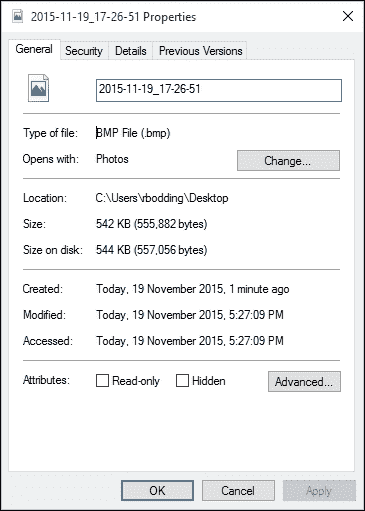

# 第二章. 硬件与软件环境

在详细探讨数字证据及其位置、恢复和分析的过程之前，理解计算机设备的基本原理及其如何存储数字信息是非常有帮助的。这样做将为理解数字证据的性质及其对从业者的价值提供坚实的基础。数字证据的性质将在本章中提及，但会在第三章中详细描述，*数字证据的性质与特殊属性*。

本章将描述和解释计算机硬件的基本工作原理，以及通常安装在这些硬件上的操作系统和应用程序。它将说明这些环境如何用于创建、存储和传输电子数据。提供对计算机及存储设备的工作原理的洞察，并介绍可能存放数字证据的数据集位置。

本章将涵盖以下内容：

+   详细介绍各种计算机和存储设备以及它们存储的具有潜在证据价值的数字信息的性质

+   描述用于创建、传输和存储电子信息的操作系统软件和应用程序

+   识别并解释包含证据价值的文件系统和文件，并说明它们通常存放在设备上的位置

+   解释用于保护信息和隐瞒证据的密码安全性和加密技术

# 描述计算机和数字信息的性质

数字证据包括在各种电子设备上找到的数字信息，通常被从业人员认为仅由以数字数据格式保存的信息组成，这些信息因其在各种法律程序中的价值而对法医检查员有用。存储在数字设备上的潜在证据来源包括电子邮件、音频和视频文件、电子文档、电子表格、数据库、系统日志和文件系统数据。

## 磁性硬盘和磁带

包含潜在证据的信息存储在硬盘、存储卡、智能卡等访问控制设备、生物识别扫描仪、答录机、数码相机、个人数字助理、电子组织器、打印机、可移动存储设备以及 CD-ROM、DVD 光盘、电话、复印机、信用卡刷卡器、数码手表、传真机和全球定位系统等介质的文件中。

直到本世纪初，主要用于数字信息存储的设备是磁性盘、软盘驱动器和磁带驱动器。磁带和磁盘以二进制形式存储数字数据，即作为磁性数据存储在金属盘片的表面，表现为 1 和 0。磁盘通过高速旋转这些磁化盘片，并将其靠近电磁读写设备，这样就可以通过可移动的机械臂读取或写入选定部分的数据。而磁带则只能通过前进或倒带的方式按顺序访问。两种存储方式至今仍是主要的存储设备来源。目前，它们在重建与某些调查中的违法行为相关的用户活动方面至关重要。

硬盘驱动技术出现在 1950 年代，并成为主要的数字存储形式。数据会永久保存，并且只要不被删除、摧毁或因设备的物理损坏而丢失，它就会一直存在。这种类型的存储器被称为**非易失性存储器**。这些设备的简单且一致的设计为法医人员带来了便利，使用成熟的流程（如死机分析）和法医工具（如写入阻断器）来恢复证据。

过去几十年是数字证据的黄金时代，因为存储在磁性硬盘上的证据不容易被永久删除（*Bell 和 Boddington 2010*）。然而，稍后将介绍的**固态硬盘**（**SSD**）的出现正在逐步取代市场的主导地位，特别是在手持设备上的小型数据存储方面。

## 光盘存储设备

CD、DVD 和蓝光光盘是相对便宜的光学存储介质，能够进行只读的大容量存储。这些介质依赖于光波反射在光盘表面的微小凹陷和高峰上的物理干涉。激光刻录机用来刻录光盘表面，速度较慢且不太方便。光盘表面可能会退化，因此在使用之前需要某种形式的保护。存储在这些介质上的数据也是非易失性的，通常情况下，已写入的内容理论上是可以恢复的。

## 随机存取存储器（RAM）

大多数计算机的中央内存核心，通常称为**RAM**，也是一个基于二进制的系统，数据在**中央处理单元**（**CPU**）中通过一大阵列微小的、类似电池的电容器进行存储和处理。这些内存单元或电容器通过电荷的选择性填充来存储数据，通过这些电荷可以将数据写入并读取出来。这些电容器不能永久存储电荷或长时间存储数据。为了防止数据丢失，它们必须定期并自动地读取数据，并对内存进行重新充电。

与存储在硬盘、磁带驱动器和光学设备上的非易失性数据不同，这种内存被称为易失性或动态 RAM。它不用于数据的长期存储，因为不断的刷新过程需要持续的电力供应。一旦设备断电，存储在 RAM 中的数据会迅速消失。

捕获 RAM 可能很重要，因为它提供了设备最新使用的详细信息，包括一些键盘活动。然而，在设备开机时捕获 RAM 的内容可能会导致法医人员覆盖并污染 RAM 中的内存以及硬盘中的数据。几种捕获 RAM 的法医流程将在第四章，*恢复和保存数字证据*中描述。关闭设备电源（如笔记本电脑或手机）可能使得无法再次访问设备，尤其是当设备被密码保护并加密时。

法医专家已经建立了检查磁盘存储设备（如 IDE、SATA 和 SCSI 驱动器）的成熟流程。然而，基于复杂晶体管设备的新技术存储系统正变得越来越普遍。例如，在过去的 10 年里，已经从便携式磁性软盘过渡到 USB 晶体管闪存或 U 盘。

## 固态硬盘（SSD）存储设备

SSD 比传统的 USB 闪存驱动器或 U 盘更快、更复杂。SSD 背后的技术与磁盘技术一样古老，但它们最近才作为比磁盘更快、更轻、更坚固的存储设备出现。USB 闪存驱动器的普及和需求导致了更便宜、更大容量的设备的出现。

然而，基于晶体管的 SSD 技术正在慢慢取代磁性硬盘，它复杂且以不同的方式存储数据。与磁盘驱动器相比，这些设备价格昂贵，通常可提供 250GB 到 1TB 的存储空间。尽管它们通常被认为比磁盘更快，但使用寿命较短，尽管新型号正变得更加可靠且更耐用。

SSD 通常以 512 千字节的块存储数据，这些块被细分为由大量**负逻辑与**（**NAND**）晶体管组成的页面，这些晶体管类似于之前提到的用于构建计算机处理器的逻辑芯片。由于 SSD 的特性，它们确实需要“清理”存储，以保持快速处理并减少晶体管的过度使用，这会显著缩短驱动器的寿命。因此，它们可能会自动删除已删除的数据，从而阻碍法医恢复（*Bell 和 Boddington 2010*）。

## 网络存储数据

在计算机网络服务器上存储数据的情况下，可以通过将设备连接到网络并提供身份验证信息来进行访问。较少见的情况是通过外部连接网络来访问和获取数据集以供后续分析。这是电子发现和严重犯罪（如欺诈和网络滥用）的典型场景。

通常，制作网络服务器的物理镜像比恢复操作系统提供的逻辑数据更为可取。一个组织是否能够使物理设备可用于数据获取，这使得这一可能性充满挑战，除了实际影响外，还包括确保对组织正常活动的影响最小化。这个挑战在第五章，*对增强法医工具的需求*中有详细描述。

## 云

基于互联网的计算共享资源和信息已经成为个人、组织和政府机构常用的网络功能。通常被称为云，它用于在线通信并存储大量数据，其中许多是私人或机密性质的数据。下一张图展示了一个典型的云网络：这是一个方便的存储点，供在外工作的员工访问并存储数据，以便他人访问和使用。由于传统的恢复工具在处理分散在网络上的大数据集时遇到问题，因此在第五章，*对增强法医工具的需求*中描述了能够提供更好结果的解决方案：

典型的云网络

从云中获取证据与从网络中恢复数据有所不同，且更具挑战性，因为数据存储在与用于恢复数据的设备不同的设备上。访问云网络通常通过普通消费者访问资源的过程，这些资源通常由其他实体拥有。恢复数据的一个挑战是难以确定数据从云服务器到存储设备的路径，这条路径可能并非固定路线（*Adams 2013*）。

由于拥有数据的云消费者无法对存储数据的网络服务器进行物理控制，因此获取实际存储设备的物理法医镜像的过程是复杂的；通常情况下，这是不可行的。网络服务器可能位于一个或多个不同法域的地点。这通常需要前往这些地点并请求网络运营商恢复数据，而这并不总是能够得到保证（*Adams 2013*）。

从实践者的角度来看，另一个问题出现在网络服务器运行在主机资源上的虚拟机实例中，而这虚拟机也可能是同一物理设备上的多个虚拟机之一。为了获取所有数据，包括已删除的材料以及未被擦除信息可能所在的空闲空间，需要通过具有访问权限的人获取虚拟机的副本。这同样会引发第三方不愿或缺乏动机来协助数据恢复的难题，并可能污染任何证据（*Adams 2013*）。

# 操作系统

操作系统是一组控制设备之间访问的程序，包括键盘、鼠标、显示器、磁盘驱动器和网络设备，以及像文字处理器和浏览器这样的应用软件程序。你一定对一系列 Windows 操作系统非常熟悉，从 1985 年发布的 Windows 1.0 到 2015 年发布的当前版本 Windows 10。

当然，还有一系列其他操作平台满足不同用户需求，包括 Ubuntu、FreeBSD、Linux、iCloud、Palm OS、Blackberry OS、Xbox 360 操作系统、Android 以及苹果系列计算机和手持设备。以下截图来自典型的 Windows 10 操作系统：

Windows 10 操作系统

## 将软件应用程序连接到操作系统

使用像 Paintshop 这样的软件应用程序需要将其安装在兼容的操作系统上，例如 Windows。通过使用该应用程序，用户可以创建一张图片并将其保存以供进一步使用，包括修改、删除以及将图片传输到其他媒介或通过某些通信过程（如通过电子邮件发送或上传到互联网）。下图展示了使用 Paintshop 创建图片的基本过程，在此过程中操作系统允许所创建的图片在计算机显示器上显示。图片可以通过键盘和其他外设进行修改、保存、通过互联网传输或打印：

在 Paintshop 中生成图片

文件在创建、修改和删除过程中保存在设备上，稍后可以恢复以查看它是否具有某些证据价值。文件会在设备上留下其他记录，如果这些记录可以恢复，也可能为实践者提供有关其历史的有用见解。

## 将软件应用程序连接到操作系统和设备

如果一个设备（例如扫描仪）连接到计算机设备上，就必须安装专用软件以使该设备能够连接到操作系统，从而使适当的软件应用程序能够使用该设备。这是通过设备驱动程序实现的——设备驱动程序是操作系统用来与附加设备进行通信的小程序。驱动程序被设计成能够识别设备的命令语言和特征。

驱动程序通常在设备上预安装，以便方便地连接外围设备，如显示器、键盘、鼠标和打印机。例如，较新的打印机型号可能会提示设备通过与打印机相关的互联网网站下载新的或更新的驱动程序，或者使用随打印机提供的软件。下图展示了通过操作系统启用的键盘与计算机连接，并创建一个可以在显示器上查看的文本文件的过程：

Word 文档创建

# 描述包含证据的文件系统

文件信息的存储方式在不同操作系统之间有所不同。为了清晰起见，本文将在目前最广泛使用的操作系统——Windows 文件系统环境中呈现相关内容。然而，第七章，*Windows 及其他操作系统作为证据来源*，会更详细地描述其他操作系统以及它们使用的文件和文件系统。文件本身可以从不同的角度进行审视，而 Windows 对文件的目录管理方式有助于取证检查。

操作系统接收到的用于读写文件的命令会在目录结构中进行解析，目录结构中包含文件索引系统，用于定义文件命名协议和文件的最大大小。Microsoft 操作系统通过**主文件表**（**MFT**）管理这些记录，其中对每个文件和目录的信息进行分类。该表本质上是一个关系数据库表，包含关于所有存储文件记录的各种属性。例如，当创建并保存一个 MS Word 文档时，它将被存储在选定的位置，并且会创建时间戳来记录该过程及其后续使用情况。

时间戳和其他文件元数据的重要性将在后续章节中进一步强调，以展示它们在事件重构中的作用。此图展示了将数据存储到硬盘磁盘上的特定扇区或扇区组的过程，并通过 MFT 进行目录管理：

将数据存储到磁盘

数据在下图中的文件中进行写入——这是一个简化的过程，表示将四个文本文件写入硬盘盘片的过程：

将文件写入硬盘

下图表示从硬盘读取文件的过程。这些文件可能已被删除或修改，这会留下关于这些事件的元数据，这对实践者未来可能具有价值：

数据是从存储在盘片上的文件中读取的

### 注意

元数据是关于数据的数据；它描述了文件的各种属性，包括时间戳、位置、创建日期、修改日期、最后访问日期，有时还包括删除日期。

以下部分描述了 Windows 将文件分类为不同类别，并概述了它们对实践者的价值。

## 文件系统类别

文件系统类别记录了一般的文件系统信息，虽然遵循一般设计，但每个设备上的结构都是独特的。通过对这些数据进行分类，文件系统类别显示用户在哪里可以找到他们正在寻找的数据和文件，同时也充当文件系统的地图（*Carrier 2005*）。它为混乱带来秩序，并允许用户安全地存储和检索文件。

文件系统的一个好处是它富含文件元数据，这对实践者来说是有益的。文件系统元数据是实践者导航和检查文件系统信息的关键部分。它在重建与案件相关的事件方面可以提供很大帮助（*Carrier 2005*）。

然而，如果这些数据遭到损坏或丢失，那么额外的分析将变得更加困难，因为需要数据和记录的备份副本。否则，实践者将需要猜测原始值是什么，并推测创建文件系统的应用程序类型以及文件或文件夹的创建日期。

## 文件名类别

文件名类别，有时也称为人机接口类别，记录用于为每个文件分配名称的数据。它由包含文件名的目录列表以及每个文件对应的元数据地址组成。已删除的文件名及其相应的元数据地址可用于通过基于元数据的恢复方法恢复文件内容（*Carrier 2005*）。

能够使用文件名列表是法医学检查的基本部分，因为它允许实践者识别文件名和父目录的名称，并可以用于根据文件名、路径或文件扩展名搜索证据。文件扩展名标识文件的类型，例如系统文件，或者在 MS Word 文档的情况下，通过 `.docx` 扩展名标识文件。

然而，如果在文件删除过程中清除了元数据地址，可能无法再找到更多信息。如果只知道文件名的一部分，仍然可以使用这部分进行搜索，例如在知道文件扩展名或名称，但不知道完整路径的情况下。元数据以固定长度的表格形式存储，并有自己的地址。当文件被删除时，元数据条目会更改为未分配状态，操作系统可能会擦除一些文件值。还应注意，文件擦除工具可能会删除文件名和元数据地址，或覆盖文件名中的关键值，表明该条目曾经存在，后来被作废（*Carrier 2005*）。

操作系统以二进制形式存储所有文件数据和元数据，这些数据通过应用程序接口转换为人类可读的文本或图像，通常被称为**图形用户界面**（**GUI**）。该图显示了以二进制形式保存的文件名数据和时间戳元数据：

文件名信息架构

## 元数据类别

元数据类别包含描述文件属性或特征的数据，展示文件的位置和大小。最重要的是，它提供了文件的历史记录，提供创建、修改和访问的时间戳。然而，与文件和内容类别不同，元数据本身并不记录文件内容或文件名（*Carrier 2005*）。

分析的重点是寻找特定文件的更多详细信息或搜索满足特定要求的文件。该类别包含许多非必要数据，可以由操作系统修改，操作系统可以更改某些元数据，例如文件访问时间。这可能会提供一些误导性的元数据。

基于元数据的恢复可能是寻找丢失或难以捉摸的文件时所需的，当删除文件的元数据没有被擦除时可以使用。文件可能已经被重新定位，例如从一个文件夹移动到另一个文件夹。这可能会导致检测困难，因为当文件重新分配时，恢复两个或更多未分配的元数据条目可能会导致它们有相同的文件地址。

元数据的检查有助于在查看文件内容、搜索文件值以及定位已删除文件时。通常，当文件名指向特定的元数据结构并需要进行文件检查时，才会启动这一过程（*Carrier 2005*）。

以下图显示了从一张照片缩略图中恢复的元数据。缩略图数据库文件记录了存储在特定文件夹中的多媒体文件。即使原始文件已被从文件夹中删除，小型数据库文件仍可能存在，包含原始文件的缩略版本及文件元数据。在此示例中，文件元数据包含**可交换图像文件格式**（**EXIF**）数据，这是数码相机或设备拍摄的照片的典型特征。这可能提供有关图像拍摄位置的精确地图参考，适用于某些类型的相机，有时还包括相机的序列号。

JPEG 图像缩略图文件的元数据

不同的文件类型提供基本的元数据，有时甚至会提供文件版本信息，如 MS Word 文档中的版本。下图显示的文件属性提供了文件创建、修改、最后访问的时间戳和文件位置的详细信息：

.bmp 图片文件的属性

打开文件可能会恢复文本文档的作者信息及其他高级设置。然而，若没有使用某种形式的写保护，执行此操作可能会污染文件元数据。为了防止文件内容和元数据无意中被修改，保持文件的原始状态是良好的取证实践的首要要求。

例如，如果没有使用取证保护来保护文件完整性，仅仅将文件从计算机的一个位置复制到另一个位置就会自动改变元数据。文件证据状态的这种污染可能对法律案件产生严重影响，并可能遭到对方法律团队的挑战。第四章，*恢复和保护数字证据*，描述了保护数字证据的重要性，并强调了防止证据污染的各种流程和取证工具。

## 内容类别

内容类别包括文件的内容，例如写入文档文件的文本、添加到电子表格中的图表或图像文件中的图片。如果从未分配空间恢复，可能没有关联的元数据或文件名，唯一的线索可能来自文件签名以及从内容中获取的线索，尤其是文本文档。

# 在文件系统中定位证据

违法行为的性质在某种程度上决定了可能恢复的相关证据类型。例如，在一起受害人因枪伤死亡的谋杀案中，确定死亡的时间、地点和死因是有帮助的。搜索工作会围绕着武器展开，包括已发射的子弹或弹壳、弹药残留物、血迹飞溅和射击轨迹数据等。在微观层面，死后分析以确定死因，发射弹壳的 DNA 分析、火药残留物的化学分析等都会进行。

*洛卡尔交换原理*，在第一章《数字取证及其环境的角色》中有描述，在数字取证检查中同样具有重要意义，就像在之前的情境中一样。在数字环境中，我们也在寻找“铁证”，它可能表现为通过电子邮件发送给受害人的死亡威胁。必须找到这封电子邮件，时间戳将帮助确定消息发送的时间。然而，如何确定笔记本电脑上的日期和时间是否正确，并且使用了哪个时区呢？是否能确定这条消息确实是在被扣押的笔记本电脑上创建并发送的？恶意用户是否可能创建这条消息以制造麻烦？是否有任何其他信息提供了关于这条消息的背景或可能的动机？如果笔记本电脑设置了密码保护，谁曾有权访问它？

从业人员面临的一个基本挑战是如何确定嫌疑人与从计算机中恢复的数据之间的确切联系。如果没有人为观察者或许没有监控摄像头来确认嫌疑人在犯罪发生时是否在计算机前，这就只能是凭借经验判断，或者最坏情况下只是猜测。从业人员必须依赖证据，如果证据无法得出结论，他或她必须寻找更多的证据线索，以提出可能的假设，推测发生了什么。收集所有支持不同假设的相关证据是从业人员的任务，但是否这些证据有助于确定嫌疑人的罪行或无罪，则由其他人来决定，例如陪审团。

对从业人员的挑战是定位与正在调查的案件相关的信息或数据。显然，恢复设备中的数据是有原因的——是某种犯罪、违法行为或活动，值得进行检查。调查的主题往往决定了所需的基本证据类型。然而，找到直接证据可能也意味着需要寻找与之相关联的证据，这些证据可以与关键证据相互印证。在检查过程中，根据法律公文，通常会寻找特定的证据，但有时也会发现其他犯罪的证据。因此，在处理数字案件时，保持警惕并保持开放心态至关重要。

在传统的犯罪形式中，调查人员会尝试确定犯罪行为的手段、机会和动机。在开始寻找证据之前，考虑这三种条件如何在数字环境中适用，将有助于理解整个过程。

## 确定犯罪手段

调查人员寻找嫌疑人实施非法行为所使用的手段或适当的过程，也就是确定犯罪行为是如何实施的以及使用了什么样的过程。安装在恢复设备上的应用软件并与犯罪行为相关联，可能会记录活动，这些记录可能对展示犯罪行为如何发生非常有用。例如，使用电子邮件发送死亡威胁，或连接互联网下载非法色情内容，会留下审计轨迹或事件日志，从而能够重建发生了什么以及涉及的过程。重建犯罪行为可能是一个相对简单的过程，也可能非常困难，因为犯罪行为和犯罪者留下的记录极少。

看似简单的概念，如发送威胁性电子邮件，可能需要一些证据来证明该邮件是在被扣押的设备上创建并发送的。初步检查时，这可能看起来没错，但进一步检查时，可能会发现虽然电子邮件账户记录了邮件的发送，但并不能确定邮件就是从该设备发送的。这个过程可能是另一个人通过远程访问账户并使用不同的计算机完成的。调查人员需要确定事实真相，并对电子邮件信息与正在检查的计算机之间的关系进行彻底分析。

确定嫌疑人是否有能力实施犯罪的另一个方面是验证嫌疑人是否具备使用相关软件的计算机技能，例如伪造电子文件或篡改照片的情况。

## 确定犯罪机会

拥有使用计算机进行非法活动的机会似乎很简单，但证明嫌疑人通过访问计算机确实拥有这个机会可能会是一个问题。如果没有任何佐证，可能很难（如果不是不可能的话）将犯罪发生的时间与嫌疑人对计算机或网络的访问联系起来。审计日志记录了特定用户访问计算机或网络的详细信息，通常假设使用授权用户登录信息和密码的人就是实际用户。通常情况下，确实如此，但如果另一个人未经授权获取了用户的登录信息并登录系统，除非有其他证据，比如人类观察者或监控录像来澄清发生了什么，否则可能很难证明。

审计和访问用户日志并非万无一失，可能会被篡改和伪造，因此并非总是可靠的。关键事件的时间和日期戳以及文件位置有助于确认与违规行为相关的情况。它们通常有助于确定某个用户在特定时间是否有机会进行违规行为。计算机用户访问安全可能会禁止未经授权的访问违规，并建立用户身份。这有助于缩小可能对违规行为负责的用户范围。

理想情况下，必须确定谁真正访问了设备或网络。通常，这并不是决定性的，而且假设显而易见的结论是不明智的。在刑事案件中，通常会做出谁实施了犯罪的假设，但必须排除合理怀疑地证明这一点，而在民事案件中，证明的标准较低，更多是依赖概率平衡。尽管如此，我们仍然看到一种倾向，认为设备的所有者和管理者通常是进行某些非法活动的主要嫌疑人。至少在调查的初期，这似乎是合乎逻辑的。然而，进一步的调查往往表明，其他人也可能有机会访问计算机或网络，因此潜在的嫌疑人范围会扩大。由此可见，必须彻底检查用户对设备的访问。这是为了确保调查的公平性，确保潜在用户名单的确定。

如果嫌疑人能提供一个合理且可验证的不在场证明，表明嫌疑人在犯罪发生时没有机会实施违规行为，则该嫌疑人的机会可被排除。许多计算机犯罪案件中都会提供不在场证明，包括凯斯·格里芬（Keith Griffin）在 2010 年因将儿童色情内容下载到计算机上被判刑 12 年时所提供的荒诞且被否定的不在场证明。格里芬将责任归咎于他的猫，称猫走在键盘上，导致了不雅照片的下载！（您可以在[`newsfeed.time.com/2010/09/12/man-blames-cat-for-child-porn-on-his-computer/`](http://newsfeed.time.com/2010/09/12/man-blames-cat-for-child-porn-on-his-computer/)了解更多案件详情。）

分析数据以将事件与特定用户关联的问题在第九章中有更详细的描述，*验证证据*。

## 确定越界动机

证明动机并非必需，而且通常很难做到，除非越界者某种形式地认罪，因为谁能知道越界者在行为发生时的内心想法呢？然而，设备上可能存在某些数据，能够提供对可能动机的解释，或者说，提供缺乏动机和犯罪意图的解释。

通过收集将用户与某些活动联系起来的证据，可以确定动机，这些活动确认了用户对计算机和相关应用程序及文件的某种程度的知识和控制。始终要警惕明显的线索。诸如“这是嫌疑人的计算机，因此嫌疑人应该负责”这种推测是高度不适当的，即使它没有被从业者口头表达出来。如第一章中所述，*数字取证及其环境的角色*，以证据为主导的调查和取证检查是合乎逻辑且更具科学客观性的，但在依赖数字证据的案件中，揭开真相可能是一个令人困扰的过程。

虚假证据也可以被恶作剧者相对轻松地制造出来，目的是将无辜方牵连其中，这一点在本章末尾的案例研究中有所展示。

## 决定在哪里寻找可能的证据

我们遇到了一个越界行为；某人有能力、有机会并有动机利用计算设备实施这一行为。使用的应用程序、文件和操作系统的记录可以提供一些有用的电子指纹，帮助从业者重建发生了什么、何时发生、发生在设备或系统中的哪里、如何发生，以及希望能够知道的为什么发生——那个通常难以证明的动机。那么，从业者应该从哪里开始呢？

计算机和其他设备将信息存储在不同类型的目录系统中，类似于 Windows 资源管理器。下图显示了通过高级取证工具 ILookIX 查看的 Windows 目录结构的一部分：

Windows 10 下的文件目录结构

然而，典型计算机上存储的文件数量使得这一过程因时间限制和检查每个文件的疲劳而变得不可行。有些是系统文件，通常不会被检查，除非进行特定检查。因此，为从业者提供易于查看的文件分类会更有帮助。例如，如果网页文件如 HTML 及其他类别被方便地分类，将会使定位和选择证据变得更快且不那么繁琐。

文件类别可以分为文件签名和文件类型，如下一个截图中 ILookIX 的**类别浏览器**面板所示。文件签名识别文件的内部结构和模式，而文件类型则基于使用该文件的应用软件，例如微软 Office 通过 Word 打开扩展名为`.docx`的文件：

在 ILookIX 类别浏览器窗格中查看的文件类型和文件签名

如果正在寻找电子邮件消息或多媒体文件，那么这些有用的目录将是搜索的便捷起点。主要关注领域可以被分类，并为各种案件提供一些有用的起点，如下表中所列举的示例所示：

| 类别 | 搜索原因 |
| --- | --- |
| **压缩文件** | 这些包括压缩和打包的文件，其内容可能与调查相关。 |
| **音频** | 这些文件可能记录了一些 Skype 对话，或者提供下载侵犯版权的音乐文件的证据。 |
| **数据库** | 这些包括缩略图文件（`.db`）的数据库以及与用户在设备上活动相关的其他记录。 |
| **电子邮件** | 这些是有关人类通信的重要信息来源，有时还包含具有刑事证据的内容。 |
| **事件日志** | 这些是设备保存的各种用户和系统活动记录——对于重建事件时间线非常有用。 |
| **互联网浏览器文件** | 这些文件记录了浏览活动以及可能与调查相关的搜索记录。 |
| **链接文件** | 这些文件告诉我们最近使用的文件和应用程序，并帮助重建用户活动和事件时间线。 |
| **微软 Office 套件** | 这包括与用户及其他回应者活动相关的文本和其他文档。 |
| **回收站** | 删除的文件和文件夹常常是丰富的证据来源。 |
| **注册表文件** | 注册表记录了可供用户使用的各种功能的状态，并且有各种连接到计算机的设备记录。 |
| **系统文件** | 大多数这些文件可能与检查无关，但其中一些在重建相关事件时发挥重要作用。 |
| **视频** | 这些文件可能包含与案件相关的用户活动证据，或者例如儿童剥削材料。 |

## 索引和文件搜索

文件的索引和搜索是另一种选择，且是更高级的过程，广受实践者青睐，用于在大型数据集中定位信息，包括桌面计算机和笔记本电脑，速度和便利性更高。它允许根据文件类型和签名、文件名、内容、元数据、时间框架、文件大小等对数据进行索引。例如，如果要查找在估计时间内发送的电子邮件死亡威胁，实践者可以搜索该期间内所有发出的电子邮件，并搜索电子邮件内容，如威胁的细节。搜索还可以通过查找匹配已知信息的发件人和收件人详情来过滤，以节省时间。

搜索可以是**基于索引**的搜索或关键词搜索。基于索引的搜索要求对数据集中的每个文件进行索引，实践者可以决定哪些文件可能与检查相关，并且可以过滤掉多余的文件，这些文件本来会拖慢索引和搜索过程。尽管索引可能需要一些时间，但它是机器生成的，更多的细节将在第五章，*对加强法医工具的需求*中描述。一旦数据集被索引，搜索时间几乎是即时的，实践者将得到更快速的结果。

下图显示了由先进的 ISeekDesigner 程序创建的配置文件中的多种搜索词，该程序为实践者提供了丰富的关键词搜索词选择。在此过程中，ISeekDiscovery 自动化工具使用该配置文件来搜索这些词，随后它们会被索引以加速分析：

多种关键词搜索词填充在 ISeekDesigner 配置文件中

搜索结果以多种格式呈现，允许实践者查看较小且更易管理的数据集，如下图所示。它展示了对一个包含超过两百万个文件的大型数据集进行搜索的结果，识别出六个有助于此训练犯罪模拟案例重建的文件，这些模拟是由我设计的：

寻找干草堆中的针并找到它们

## 未分配数据分析

存储数据的硬盘或存储驱动器的可用空间取决于设备的大小和安装的任何组件。例如，一台新购买的笔记本电脑可能已经安装了操作系统和一系列基本的软件应用程序、系统文件、用户数据等。剩余的空间，处于原始状态，可以根据用户、系统和软件应用程序的需要存储数据。这个空闲空间或未分配空间最初是空的，但在正常使用过程中很快会开始被填充。

文件可能从已分配的空间中恢复，在该空间中，操作系统以所谓的逻辑状态维护文件。除非它们是隐藏文件，否则这里的大部分文件都可以在法医恢复过程中找到并恢复。删除的文件也可以从`垃圾桶`文件夹中恢复。

最终，设备可能会因空间耗尽而导致操作系统崩溃，或者至少使其运行变得迟缓。用户经常删除文件，并将其保存在垃圾桶中，这些文件可以从垃圾桶恢复或重新移动到未分配空间。在未分配空间中，文件的残余部分依然存在，但会进一步被新写入的文件覆盖，直到完全消失。

然而，法医工具允许专家恢复这些文件或已删除文件的碎片，这些文件碎片可能有助于重构案件中的关键事件。通过检查文件目录中已删除的文件名，删除的文件可以轻松恢复。然而，在更改元数据之前，已删除的文件名常常会被重新使用。文件可能没有保留文件名，但文件的元数据可能依然存在。相反，文件名和元数据可能还在，但文件内容已不复存在。

经验丰富的专家通过一致性检查未分配块，可以发现故意隐藏数据的行为或文件系统错误，这些错误隐藏了数据。通过在两个有效条目之间找到已清零或无效的条目，也可以检测到数据擦除。数据雕刻是用来恢复文件碎片的技术，可以通过使用十六进制编辑器手动进行，或使用高级法医工具自动完成。这些工具和流程在第五章，*增强法医工具的需求*，以及第六章，*选择和分析数字证据*中有更详细的描述。然而，除非能够访问设备，否则所有这些数据恢复尝试可能会被阻止，如果设备已被密码保护并加密。

# 解释密码安全、加密和隐藏文件

以下部分描述了密码安全和加密，以及如何保护信息并防止证据被窥探。它们概述了管理计算机设备和网络安全的基本流程，并解释了数字信息为何需要防范广泛威胁的保护。

## 用户对计算机设备的访问

为了保护存储在设备上的数据免受未经授权的访问，用户访问控制提供了一定程度的保护。这适用于台式机、笔记本电脑、手机和其他手持设备、家庭安全系统以及广泛的其他电子设备。不仅需要限制对信息的直接人类访问，只有授权人员可以访问，而且信息还需要防止被其他程序、进程或系统访问，这些程序、进程或系统可能与设备连接。例如，登录到网络服务器的工作人员通常不应访问其他工作人员的终端（除非担任监督或支持角色）。否则，敏感信息将无法得到保护，情况最糟糕的情况下将变得混乱。

那么，为什么用户访问如此重要呢？信息具有保密性、完整性和可用性方面的价值，而这些都面临风险并需要保护。以下小节将描述这些术语。

## 理解信息保密性的重要性

保密性或隐私性要求防止未经授权的信息访问。即使访问是授权的，用户也可能以未经授权的方式使用该信息。例如，一位同事看到另一位同事已经离开办公室，但电脑仍在运行，从而允许未经授权的访问。该同事访问了电脑，阅读了一些机密文件，并将这些信息用于不正当（未经授权）用途。后来，信息的管理者被调查，但没有发现任何未经授权访问其电脑的记录。实践者可能能够重构未经授权访问的事件和时间，但从电脑记录中发现入侵者的证据几乎是不可能的。

## 理解信息完整性的重要性

信息的完整性还需要保护：某种形式的保证或担保，确保信息保持原始状态，没有被篡改或污染。信息的创建者和管理者需要确信信息没有被未经授权的行为、人工干预或计算机系统故障所改变或破坏。

以黑客入侵受害者的计算机为例，例如银行计算机，并悄悄修改重要财务记录的内容，作为在线欺诈的一部分。这种攻击不仅改变了记录的完整性，而且有人获利，有人失利。由此可见，最初有合法权限访问这些记录的银行人员将成为主要嫌疑人。

信息的完整性需要某种保证，以确保信息没有受到未经授权的创建、修改或操控，并且所有相关的交易都是正当且真实的。

## 理解信息可用性的重要性

信息可用性意味着信息对那些希望使用它的人是可访问的。然而，用户可能会无意中拒绝自己或他人访问信息，或者系统过程可能会使信息不可用。黑客和其他恶意分子通过网络攻击来拒绝用户和组织访问自己的信息。这些攻击被称为**拒绝可用性攻击**，可能还涉及某种形式的敲诈，要求支付财务报酬以确保信息再次对其合法所有者可访问。对网络和受感染计算机终端的取证检查可能会找到拒绝访问的原因，并允许组织恢复访问，以继续正常的业务。关于恶意软件检测的新方法的深入探讨将在第五章中提供，*增强取证工具的需求*。

## 用户访问安全控制

保护计算机、手机或网络免受未经授权访问是信息资源安全管理的一部分。几乎每天都会看到关于网络安全漏洞的新闻头条，或者听说身边的朋友的计算机或网络被入侵者攻击和破坏。随着旨在改善人类生活条件的技术进步，出现了一个阴险的副作用，威胁着信息资产的隐私、完整性和可用性。

防止未经授权的访问是通过严格规定谁可以访问数据以及可以访问哪些数据来实现的。用户访问管理可以视为防御的第一道防线，并且很少是万无一失的。它使用一系列基于已建立安全策略的保护过程。例如，在最简单的形式下，当购买一台新笔记本电脑时，通常会授予用户管理员权限——这是一种更高水平的设备管理控制。作为管理员，其他用户和访客用户可以通过创建其他用户帐户来使用该设备，而这些帐户可能会设置密码保护，也可能不会。

对于网络系统，使用更复杂的访问控制层级，通过严格的访问控制点和级别来管理大量的网络用户。会记录一份用户列表及其访问权限或特权的详细信息，并且会记录每个用户的访问日期、时间和持续时长的审计记录。

密码或密码短语通常与用户的唯一身份标识名称一起使用。生物特征保护，如指纹和虹膜检测，可能会被使用，或者可能会采用其他形式的安全保护措施，以阻止并最小化未经授权的利用的可能性。

各种应用程序提供了绕过或解锁隐藏密码的方法，使得访问驱动器内容变得更加容易。密码保护的设备可能给从业人员带来困难，尤其是在内容被加密的情况下，后续小节将进一步阐述这一点。

## 加密设备和文件

加密技术已被使用了数千年，用于隐藏信息以防止未经授权的查看；即使信息被拦截，加密也能防止或至少阻碍未经授权的查看，保护消息或容器的内容。在保护数字设备和消息方面，使用了多种隐私安全技术，以保持信息的机密性。加密技术在大多数数字设备上都有应用，尤其是在台式计算机、移动电话、平板电脑和服务器网络中。它们还包括电子邮件和其他通信消息的安全加密。

无论加密的级别如何，加密的 Achilles 之踵是密码、密码短语或其他形式的访问控制，用于打开加密的存储区。没有这个访问密钥，数据将无法被打开。一些简单的加密形式，比如 Word 文档保护，可以通过使用互联网上随时可用的程序轻松破解，从而击败保护文档的简单加密。更高级的加密应用程序也可以被绕过，但用于保护信息的算法的强大性可能使得打开存储区的过程变得耗时。近年来使用在更现代设备上的高级加密技术，特别是在具有加密区域和微芯片的移动电话上，目前正在击败寻求访问的专家，尽管他们使用的是所谓的先进法医工具。

面对被锁定和加密的设备，从业人员遇到的问题正成为一个严峻的挑战，稍后在书中会进一步讨论这一问题。

# 案例研究 – 将证据与用户关联

本案例研究涉及对 2006 年执法人员提供的被告笔记本电脑法医镜像的检查。在被告的笔记本电脑上，计算机修理员发现了一些未成年性行为的照片和视频，并将此事报告给警方，导致该笔记本电脑被查封，并在 2008 年提出刑事指控。从逮捕到审判的 2 年延迟可能是由于相关机构的工作负担繁重。

被告显然不相信自己曾将非法的色情文件下载到笔记本电脑上，并坚持自己无罪，这促使辩方团队对相关信息的可靠性进行检查，从而帮助后续的法律分析。违法材料在 2004 年和 2005 年间被放置在笔记本电脑上，而在此期间笔记本电脑曾由同一位维修员修理，该维修员显然没有注意到并报告在第一次修理时发现的材料。

辩方专家对从扣押的电脑中恢复的物理和逻辑信息进行检查，确认了警方的主张，即非法电影文件很可能是在 2004 年 9 月至 10 月期间下载的。显然，这些文件很可能是通过 LimeWire 程序下载到笔记本电脑上的，其余文件则在 2005 年 1 月下载，并且很可能是在该设备上观看的。

根据对程序可执行部分相关文件创建日期的检查，计算机上安装了 RealPlayer 和 Windows Media Player。这些应用程序可播放电影、音频和图像文件。两款应用程序都具有记录最近播放文件的功能。根据该机构报告，多个最近播放的文件与识别为相关电影的文件具有相同的文件名。重新检查数据后确认，多个非法文件曾多次被 RealPlayer 访问，而仅在一次情况下被 Windows Media Player 访问。

被告的年轻青少年子女在此期间有接触该笔记本电脑，并且在电脑上创建并访问了两个淫秽图像文件。电影和图像的最后访问日期被病毒扫描程序无意中更改，从而模糊了日期并使电影和图像查看器应用程序的重建不完整。该机构错误地解读了关键文件的不可靠的最后访问日期，并将其作为文件被用户访问的证据，从而延长了可能犯罪活动的时间段。事实上，文件元数据挑战了这一主张，并削弱了控方的论点。

从数字证据的表面来看，在笔记本电脑被查封时，可能看起来很合理地认为被告——电脑的所有者和保管者，且电脑位于其住所——是最可能的嫌疑人。然而，在 2005 年 9 月至 2006 年查封日期之间，其他人在电影被访问和观看的期间也有机会使用这台电脑。此外，一对年轻夫妇从 2005 年 6 月末到 2006 年 2 月初也曾不受限制地使用过该电脑。其他一些人（这对夫妇的朋友）在同一时期也曾使用过笔记本电脑。还有另一个人曾在 2005 年 7 月到 2005 年 9 月期间住在该住所。被告也常将笔记本电脑带到工作地点，其他人也可以不受限制地使用它。

还有证据表明，被告在一些非法文件被下载并在笔记本电脑上播放的期间不在他所在的城市。被告的青少年子女当时在场，并且每周会有一些朋友留宿在家里，他们被认为曾使用过笔记本电脑。密码安全性很基础，任何愿意使用它的人都知道密码。

辩方专家对重建的使用时间线进行检查时发现，一部非法电影文件在 2005 年 10 月 17 日被修改并写入，这时笔记本电脑被认为处于电脑维修人员的手中。此问题未被检方提出，也未向辩方团队披露，但这却提高了另一位潜在嫌疑人的可能性。

对于存储设备上非法电影及其副本的数量，也存在一些差异。然而，重新检查法医图像显示，设备上有六部独立的电影和九个文件副本，这与检方所声称的远远多于此的数量相矛盾。文件的记录不准确，这对检方案件的核心文件提出了疑问，也对检方专家的专业性产生了怀疑。

在电脑中发现了恶意软件，即木马病毒 `A0044827.exe Infected: Backdoor.Win32.Agent`。然而，并没有证据表明该恶意软件已经感染并控制了笔记本电脑，使其容易受到未经授权的远程控制。同样，对这一恶意软件在笔记本电脑上的活动的检查，交由辩方专家负责，并且由被告承担费用！

毫不奇怪，针对被告的案件最终被驳回。

这可能导致不完整和有偏见的分析，进而使用可疑证据和错误分析做出定罪。必须始终小心谨慎，确保调查是以证据为主导的，而不是以嫌疑人为主导的过程，正如本次调查中所发生的情况。

# 参考文献

Adams, R. 2013\. “云存储的兴起及新数字取证流程模型的需求。”《网络犯罪与云取证：调查过程的应用》：79-104。由 K. Ruan 编辑。美国宾夕法尼亚州赫希：IGI Global 出版社。

Bell, G. B. 和 R. G. Boddington 2010\. “固态硬盘：当前数字取证恢复实践的终结之始？”《数字取证、安全与法律期刊》，5(*3*)：1-20。

Carrier, B. 2005\. 文件系统取证分析。新泽西州上萨德尔河：艾迪生-韦斯理出版社。

# 概述

本章描述了各种计算机和存储设备，并概述了它们所保存的具有潜在证据价值的数字信息的性质。操作系统软件和应用程序功能及性质的解释引入了文件创建、文件传输以及电子信息存储的过程。本章介绍并解释了文件系统的性质，概述了一些包含证据价值的典型文件，并指出它们可能在设备上的位置。关于密码安全性和加密的总结表明，数字设备正变得更加先进，且加密正作为一种有效的安全特性被使用。这现在对试图寻找隐藏证据的从业人员构成了显著的挑战。

本章节中展示的数字证据在第三章中有更详细的描述，*数字证据的性质和特殊属性*，该章节解释了数字证据的性质和特殊属性，并确实决定了从业人员在案件审查时所遵循的取证方法。数字证据与其他类型的证据有许多共同特点，但也有其独特的属性，使得它既充满挑战又具有探索和利用的价值。第三章，*数字证据的性质和特殊属性*，强调了数字证据的技术复杂性以及它们对从业人员在分析证据并向法院解释证据时所带来的挑战。它定义了可接受性的权重以及数字取证必须满足的要求，才能在法律案件中被认为是可被采纳的。
