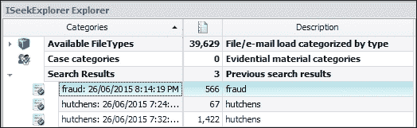
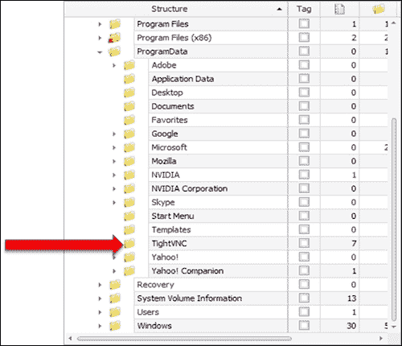
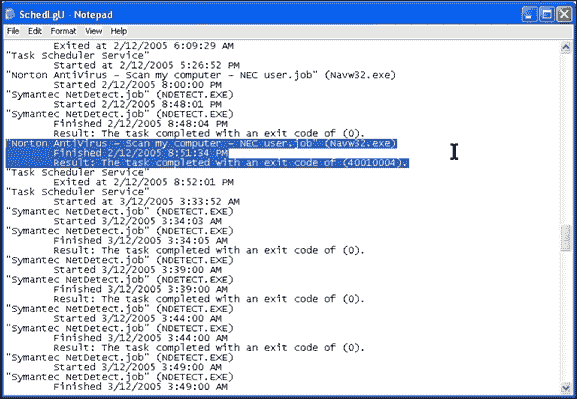

# 第三章。数字证据的性质与特殊属性

到 21 世纪初，超过一半的刑事案件涉及某种计算设备，而且这一趋势仍在继续，并且可能会进一步上升。它在法律案件中的使用也在增长，且没有减少的迹象。数字证据源自对各种数字设备的检查，并与其他形式的证据具有相似的特性。虽然有些差异有助于增强证据恢复分析，但正如本书所示，也存在一些特性，使得执业人员在处理时面临挑战。

本章定义并描述了数字证据的特殊属性及其对调查的贡献。本章将具体涵盖以下内容：

+   定义数字证据及其用途

+   解释数字证据的特殊属性，包括其时间和位置元数据以及文件特征

+   突出数字证据的技术复杂性及其对准确分析的挑战

+   解释确定数字证据可采纳性的要求

+   提供一个案例研究示例，以说明数字证据的性质及其在法律案件中的价值

# 定义数字证据

数字证据是以数字形式存在的信息，通常可以在各种计算设备上找到；实际上，它是任何包含微芯片或经过微芯片处理后存储在其他介质上的物品。数字数据是通常以二进制形式表示的数值，与以模拟形式存储的电子数据不同。曾有报道称，一名澳大利亚毒品走私犯将其客户和交易的电子表格隐藏在植入其宠物狗体内的微芯片中。当一名机智的警察询问嫌疑人住所内是否有微芯片植入枪时，便发现了这一点。这一发现促使对狗进行小型手术以移除芯片，随后发现芯片内包含了一个电子表格，列出了毒品交易商和交易记录。

在法律案件中提交的证据，如刑事审判中，是作为证人证言或直接证据，或以物品形式呈现的间接证据，例如物理文件、个人财产等。以电子形式存在的证据，包括数字和模拟数据，被定义为实物证据，有时也被称为文书证据。它也被称为信息技术证据、电子证据或计算机证据。数字证据包括电子邮件、电子文件、电子表格、数据库、系统日志以及音频、图片和视频文件等。提交法院的最常见证据形式是执业人员在提供数字证据解释时的口头陈述。

## 数字证据的使用

法律案件中的证据用于证明（或反驳）争议中的事实，以及证明争议事实的合理性——尤其是间接证据或旁证。数字证据就像文书证据一样，提供推论，这些推论可能有助于证明案件中的某个关键事实。它帮助调查人员和法律团队发展出关于犯罪嫌疑人的可靠假设或理论。它在建立犯罪、受害者与犯罪嫌疑人之间的联系方面显得尤为重要。证据的可靠性对于支持或反驳任何关于可能嫌疑人参与的假设至关重要。我们将在第六章《选择与分析数字证据》中详细探讨这一点，*选择与分析数字证据*。

数字证据根据每个案件的具体情况和从中恢复证据的设备类型可能有多种形式。过去，最常见的恢复方式是从台式计算机、笔记本电脑和网络服务器中提取。收集到的数字证据有助于刑事和民事案件，有时甚至可能是唯一的证据。恢复工作通常通过物理移除源设备中的硬盘并将其连接到执法人员的计算机上来完成。为了防止或最小化嫌疑人源设备的污染，我们可以使用一种名为**写保护器**的硬件设备，以便复制可能包含证据的数据。硬件和软件写保护工具及过程的使用将在第四章《恢复与保存数字证据》中详细描述，*恢复与保存数字证据*。

镜像过程旨在将所有数据块从嫌疑人的设备复制到执法人员的目标设备。这通常被称为数据的物理复制，与逻辑复制有所区别，逻辑复制仅会复制用户通常能看到的内容。逻辑复制无法捕捉所有数据，且该过程会更改某些文件的元数据，从而大大降低其法医价值，导致可能会受到对方法律团队的挑战。因此，完整的逐位复制是首选的法医处理过程。在目标设备上创建的文件称为**法医镜像文件**，可以选择多种格式，包括 `.AFF`、`.ASB`、`.E01` 和 `.dd` 或原始镜像文件，以及虚拟镜像格式如 `.VMDK` 和 `.VDI`。

以下截图显示了由 IXImager 生成的 `.ASB` 法医镜像容器，其中包含一个加密的日志文件和一个图像文件：

一个 ASB 容器和日志文件

能够制作数据的精确副本的好处在于可以复制该数据，然后将原始设备返还给所有者或存储以供审判，通常无需反复检查。这减少了驱动器故障或证据污染的可能性。以下屏幕截图显示了成像过程日志文件的部分内容。这可能在法律程序中展示，以确认从业者进行成像的性质和情况：

日志文件显示了对 250GB 驱动器进行成像的时间段

特殊的取证工具需要打开和检查图像中保存的数据，它们这样做而不改变图像和污染证据，符合良好的取证实践传统。与有机或物理展品不同，例如尸体或油画，在测试期间通常会切取组织活检和画布以及颜料样本并通常会被破坏，取证图像会以原始状态保存所有数据。它允许使用取证软件提取和显示重要文件，但不会改变图像或其中包含的文件和元数据的构成和完整性。

能够检查图像中文件和文件夹以重建相关事件的能力需要一个用户友好的界面。通过增强的取证软件现在支持查看系统文件，导航文件目录，并打开缓存文件夹以查看浏览历史。以下屏幕截图显示了使用 ILookIX 查看文本文件的情况，以便在决定文件是否与调查相关时查看内容：

使用 ILookIX 查看文本文件

屏幕截图显示了一个文件的确切视图，显示了**属性**表，提供了文件元数据的记录，包括时间戳和文件位置。这些信息可能对重建违规行为或识别与作案者的链接有用：

使用 ILookIX 查看文件的属性表

同样地，从网络服务器计算机中恢复和查看信息可能会受到限制，因为组织可能不希望停止其正常业务，因为每个服务器或服务器上的文件夹可能会被成像。这样做可能成本高昂且耗时，并不能保证能够恢复所需的证据。以下图片展示了 ISEEKDISCOVERY 自动机在大型数据集上部署以恢复可能对调查有价值的文件搜索结果的电子表格，而不会干扰网络功能或污染数据：

ISEEKDISCOVERY 自动机：搜索词命中统计和相应恢复的文件

以下截图显示了已选定的待进一步分析的感兴趣文件。这些文件可以与调查员和法律团队共享，以便他们查看这些信息是否有用，并决定是否提取：

基于搜索词的文件类别，用于后续分析

移动电话和其他手持设备与桌面设备的成像方式不同。外部设备如法医计算机的硬件和接口也有所不同。以 iPhone 为例：除非已知密码，否则无法访问该设备。苹果公司使用一系列加密的扇区，这些扇区位于微芯片上，使得难以访问手机内部的原始数据。已经开发出专门的软件，用于恢复和分析来自手机、**全球定位系统**（**GPS**）设备、平板电脑和远程电话调制解调器的数据。

该软件将检查员的计算机与移动设备连接，通过一系列用户命令和对设备设置的一些小调整，实现数据提取。该软件提供设备的基本信息的逻辑提取，并记录设备特性和提取日志。这使得数据快速分类成为可能。直到最近，手机的更详细提取成为可能，允许通过所谓的物理提取方式提取或导出更多设备数据。iPhone 4S 及以后的型号不再支持物理提取。最近版本的 Android 设备同样限制了只能进行设备的备份，而不再允许恢复物理数据。附带的 SIM 卡和任何数据存储 SD 卡也可以通过这些应用程序进行检查。

领先的软件应用程序，如 Cellebrite 和 Microsystemation 的 XRY 套件，创建了一个专有的证据容器，包含已恢复的设备数据以及提取日志。该容器只能由软件读取，但允许提取和导出文件以供进一步分析。该软件的用户界面现在已经过优化，能够加快分析和报告生成，特别是在涉及更多设备的大规模调查中。

以下截图显示了 XRY 查看器屏幕中的物理提取案例摘要。在这个例子中，在较早的 Android 版本（2.3.4）中，曾可以对浏览活动的关键证据进行物理提取。这些额外的证据为被告提供了机会，证明他在严重刑事指控中的清白。最近，我的同事们通过测试发现，仍有大量数据是传统提取软件无法捕获的：

一款三星 GT-S7500l Galaxy Ace Plus 的 XRY 物理提取案例摘要视图

然而，在连接设备时，必须小心确保它不会连接到移动网络、本地 Wi-Fi 或附近的蓝牙设备。SIM 卡应当移除，并可单独检查，以防止通过不经意的本地连接污染手机数据。已有很多案例显示，手机被远程重置为出厂默认模式，从而清除任何需要检查的数据。远程擦除应用程序旨在帮助手机拥有者在手机丢失或被盗时擦除私人数据，现在也被那些希望阻碍调查人员获取潜在证据的人所使用。

与笔记本电脑和台式电脑不同，手机在数据恢复过程中并未完全受到取证软件和工具的写保护。通常会在手机上安装小型程序来协助提取过程。这可能会污染并覆盖设备上的某些空间，尽管这并不理想，但却是不可避免的。第八章，*浏览器、电子邮件、信息系统和手机的检查*将更详细地描述手机取证及其由于加密技术增强而给从业人员带来的挑战。

# 数字证据的特殊特点

或许你需要一些解释，以了解法院认为哪些证据是可接受的，哪些是不可接受的。在法律程序中提交的证据有不同的类别。最常见的是**直接证据**，有时也称为**证人**或**证言**证据。这是证人观察到的事件证据，依赖于证人对记忆的可靠性、诚实性、客观性等方面的可信度。此类证人证言可能会受到挑战和驳斥，但它通常在法庭上有助于确立事实的真相。

人类证言必须基于人类观察——通常称为**目击者**证言。它可能是证人直接听到、感受到、闻到、尝到或触及到的东西，但不能是**道听途说的证据**或外行人的意见。道听途说的证据是指证人并未通过五感直接观察到的任何与案件相关的事宜。

法院对于传闻证据有严格的规则，通常会拒绝那些没有被证人直接观察到的证据。例如，如果一名警察被证人告知某个犯罪行为发生并逮捕了犯罪嫌疑人，该警察不能提供证人所观察到的、并已声称的事实证据。来自警察的这类证据会被拒绝，因为它被视为不可靠。证人可以向法庭陈述自己所观察到的事实，而不是警察。法院不认为传闻证据具有可信性，特别是当法院无法对证人进行交叉询问以判断其可信度时。

对该规则有一些例外，这些例外是由法院实践、**立法**和**案例法**规定的。例如，意见可以作为专家和科学意见提出，关于这一点将在第六章中进行更详细的讨论，*选择与分析数字证据*。

## 数字证据的间接性质

与人类证人提供的证据不同，后者必须基于证人所观察到的事实，**间接证据**，例如数字证据，被视为传闻证据。间接证据，包括数字证据，通常被视为间接证据，可以与例如纸上墨迹等物理文件一样进行分类。

理论上，由于数字证据的真实性很难验证，它在基于英美法系的司法管辖区内，在许多刑事案件中是不被接纳的。然而，如今在刑事案件中，是否接受数字证据是由法官裁量的。这引发了一些主张，认为这种宽容的做法与正义的利益相悖。

存储在电子数据库和审计日志中的数字信息，例如，由计算机生成，并不总是包含由人类用户生成的信息。这类信息在一些早期的法律审判中曾受到挑战，但成功辩护认为，在对创建和记录信息的计算机可靠性和准确性作出某些保证的前提下，这些记录可以被接纳。法院还要求提供一些证据，证明这些记录的创建和存储是组织业务活动的一部分。自动化数字记录的超速车辆，通过雷达探测器生成的证据，在法庭上已经被接受了数十年，尽管它的可靠性曾受到一定程度的挑战，并且有过有限的成功反驳。

人类证词并非万无一失，有时会被发现是虚假的、具有误导性，甚至完全错误。间接证据没有声音，因此可以从中推断出一些事实，以帮助证明某个关键事实。在这方面，基于数字证据得出的推断现在常常被用来证明案件中的关键事实，方式类似于在谋杀现场发现的刀具，会通过 DNA 和指纹测试来识别嫌疑人。

然而，由于其固有特性，间接证据本质上是概率性的，这使得在重建案件时充满挑战。数字证据和文献证据受到相同程度的法律审查。它们通常作为证据在审判中与其他证据一起使用，形成提交方的联合证词。由于数字证据与实物文件在形式上具有相似性，它现在在法院中得到了更广泛的接受。

数字取证专家的角色至关重要，他们通过科学解释和意见阐释证据并解读其含义。实际上，他们从证据中解释出意义，以帮助法庭理解证据的性质以及可以从中推导出哪些推论。理想情况下，文献证据不是孤立提交的，而是通过其他相关证据的佐证或被佐证，增强其可采性和可靠性。经验丰富的从业者会寻找额外的证据，以帮助将证据置于其创建的背景中，并与案件中相关事件的相关人员关联起来。

有趣的是，美国联邦证据规则排除了证人心态或状态的陈述，不受传闻规则的限制。规则 803(3) ([`www.law.cornell.edu/rules/fre/rule_803`](https://www.law.cornell.edu/rules/fre/rule_803)) 规定了“声明者当时存在的心态、情感、感觉或身体状况（如意图、计划、动机、设计、心理感觉、疼痛和身体健康）的陈述是可以接受的，但不包括用以证明记忆或信仰的陈述，除非它涉及声明者遗嘱的执行、撤销、鉴定或条款。”

这个重要的例外适用于电子邮件和社交网络网站，尽管它们的交流方式表面上看似非正式，但通常包含作者心态的坦率表达。这在其他司法管辖区是普遍接受的原则，尽管证明犯罪意图必须在超越合理怀疑的证据范围内进行，而非基于百分之百的确定性。

## 文件元数据与其他证据的关联

数字证据通常容易定位和处理，并且可能包含有用的元数据，这些元数据可以为过去事件提供重要的证明。许多评论员认为它优于其他形式的证据。作为数字证据恢复的文件，包含有用的前置信息，这些信息以文件内容和元数据的形式展现，包括文件的创建、修改和最后访问时间戳。文件的名称和位置通常会保留在计算机上，还有一些关于它最后一次打开和查看的时间的信息。这些信息对于重建与调查相关的过去事件非常有帮助，且经常出现在数字证据中。

文件元数据广泛存储在各类应用程序中。例如，Windows 注册表会记录连接到计算机的标准外设设备，如硬盘、显示器、键盘和打印机。以下截图展示了连接到计算机的 USB 设备的记录，包括最后修改的时间戳、设备类型和序列号：

显示连接的 USB 设备记录的 Windows 注册表

显示用户最近访问文件的链接文件分布在计算机各处。它们可以帮助查看最近访问了哪些应用程序以及正在访问的文件的身份信息。在重建关键事件的时间线时，这些信息非常有用。链接文件和跳转列表在这方面十分有帮助，能够提供文件位置和时间戳元数据，如下图所示：

恢复的链接文件列表

了解用户的浏览历史对于犯罪重建也能提供重要线索。Cookie 文件通常存储在计算机上。这些是由每个用户访问的网站创建的小型文本文件，并存储在计算机中。以下截图展示了从计算机中恢复的 cookie 文件列表：

恢复的 cookie 文件列表

互联网浏览器通常会存储访问过的网站详细信息，这些信息会保存在可以恢复的缓存文件中，如下图所示。然而，如果用户禁用了浏览器历史记录，可能无法记录这些数据：

恢复的浏览器缓存文件

更有帮助的是，从搜索历史记录中恢复的信息，显示了用户在浏览器中进行的搜索记录。如下图所示，这些记录包含了丰富的时间戳和搜索词。请记住，这些信息是从取证镜像中恢复的，而不是通过启动计算机查看浏览器历史记录获得的。后者可能会污染记录，而且很可能只能恢复部分数据。

其他数据可能不易恢复，需要使用取证工具来恢复额外的数据集。可以将取证镜像转换为可启动的虚拟驱动器，以模拟计算机在逻辑或正常查看模式下的操作，避免污染原始镜像：

恢复的数据库文件，包含搜索词历史记录

许多软件应用程序会在其应用日志中记录数据。多媒体播放器将此功能作为默认设置，如下图所示。这些日志结合最近查看的链接文件可以用来重建与调查相关的时间线的部分内容：

最近在 VLC 媒体播放器中查看的文件

如下图所示，虚拟机应用程序如 TightVNC 可以通过`ProgramData`文件夹访问。可以确定并恢复程序访问的实际日期及其他用户活动：

远程访问应用程序的位置

文件内容信息对实践者来说是无价的，但元数据提供了附加信息，这些信息往往也非常有价值。第六章，*选择与分析数字证据*将提供有关文件和元数据分析的更多细节。

# 数字证据的技术复杂性

本节概述了数字证据的技术复杂性以及对准确分析的挑战。像所有间接证据一样，理解从犯罪现场恢复的更复杂证据构件存在挑战。由于数字证据及其环境的技术复杂性，需要一定的经验和专业知识。现在我们已经看到文件和元数据信息对实践者有多么有用，清晰、全面地理解数字信息的性质至关重要。本节将介绍在使用和分析数字证据时遇到的一些挑战，表明数字取证，尽管提供了如此重要的材料，但并不是一项轻松的任务。

在电子和数字数据出现之前，伪造和篡改物理文件相较于数字数据较为困难，因为有安全措施保护重要文件，并且篡改纸上的墨水或铅笔字迹需要特殊技能。然而，应该注意的是，如今超过 90%的文件都以数字格式存储。这给检测数据篡改带来了显著困难，要求实践者通过明确的证据链将违法者与启动事件或某些结论性陈述联系起来。理论上这听起来很好，但往往证据丢失或被擦除，完整的证据链并不总是能获得。文件元数据可能存在，但通过元数据将嫌疑人与事件联系起来，特别是确定创建事件的人的元数据，充满了困难。

在任何审查中，最重要的要求是将嫌疑人与相关或与犯罪行为相关的事件联系起来。由于缺乏有效的科学流程来将违法者与事件联系起来，再加上匿名攻击受害者计算机和网络的远程攻击日益增多，问题变得更加复杂。对于从业人员来说，意识到这种利用行为已经是一项艰巨的任务，更别提追踪违法者的身份了。即便追踪到攻击者的地点，他们通常位于一些为其提供庇护的国家。即使存在引渡条约，这些条约也不一定能促使他们迅速且经济地被逮捕。

## 数字证据的可塑性

数字证据容易受到污染这一点不容小觑，在本章末的案例研究中得到了突出展示。在任何取证恢复潜在证据的过程中，都必须非常小心，避免污染证据，特别是犯罪现场。根据犯罪现场的不同，可能存在各种因素，能够破坏或至少改变证据。动物和昆虫的食腐行为、自然环境的变化以及土地的扰动都可能影响尸体的组成，这可能使得识别尸体及估算死亡时间和死因变得困难。

同样，电子数据可能因不当处理而轻易被修改、损坏或删除，即便是出于好意。开启数字设备将启动操作系统以及与启动系统相关的各种应用程序。关闭设备则会清除内存（RAM），更糟糕的是，如果设备设有密码保护和加密，可能会使其无法再次访问。需要使用取证工具来连接并访问设备上存储的数据。这些工具必须防止，或至少将对存储数据的污染降到最低。第四章，*恢复与保护数字证据*，详细描述了用于最小化证据污染的流程和取证工具。

数字证据可能被修改以删除其在计算设备上存在的所有痕迹，而且这种修改的证据并不总是能够被识别出来。它需要审查员付出相当大的努力和专业知识，甚至需要运气或先进的数据雕刻技术来恢复一些文件名和内容痕迹或元数据，这些痕迹表明文件或用于删除或修改它的软件曾经存在。如第二章，*硬件与软件环境*中所述，缩略图 `.db` 文件就是一个例子，它显示了计算机中多媒体文件的曾经存在。

## 元数据不应被表面接受

元数据显示了文件历史的各个阶段。最常见的情况是，它显示文件在设备文件夹中存在时的创建日期。在文本文件创建的情况下，创建日期、文件修改日期和最后访问日期会是相同的，如下表所示：

| 创建日期 | 最后修改日期 | 最后访问日期 |
| --- | --- | --- |
| `10/10/2012 20:50:32` | `10/10/2012 20:50:32` | `10/10/2012 20:50:32` |

> *文件元数据时间戳*

然而，如果用户在稍后的时间访问了文件，最后访问日期将反映那个更晚的事件，如下表所示：

| 创建日期 | 最后修改日期 | 最后访问日期 |
| --- | --- | --- |
| `10/10/2012 20:50:32` | `10/10/2012 20:50:32` | `15/10/2012 18:.03:49` |   |

> *最后访问时间戳已更改*

如果用户访问文件并修改了内容，比如删除了部分文本文件的内容，该事件将反映在之后的时间戳中，以显示修改。最后访问日期也会更改以反映该事件，如下表所示：

| 创建日期 | 最后修改日期 | 最后访问日期 |
| --- | --- | --- |
| `10/10/2012 20:50:32` | `16/10/2012 11:50:59` | `16/10/2012 11:50:59` |

> *最后修改和访问日期*

需要强调的是，元数据并不会记录所有的访问和修改事件。Word 文档可能会存储之前的版本，这需要打开文件查看是否提供了关于文件前因和内容的额外信息。这一功能并不是 Word 文档的默认设置，但作为操作程序值得检查。

最后访问日期不应被视为文件最后一次由用户访问的实际时间，因为在例行扫描过程中，杀毒软件会访问计算机上的大多数文件以检测恶意软件，这可能会更改最后访问日期。这可以通过读取杀毒软件中的扫描日志来发现。

在以下示例中，基于第二章的案例研究，*硬件与软件环境*，涉及使用电影播放器查看电影文件，这些文件在一起构成了一个重要的刑事案件。需要仔细检查文件时间戳和用户访问日志。检察官声称，电影自**2004 年 9 月 19 日**起，通过 Kazaa 文件共享应用下载，并从`共享目录`文件夹移动到`我的文档`文件夹。这导致了同一文件的多个版本被创建。已知有多人在被告的住所和工作地点使用该笔记本电脑。检察官还称，电影在**2005 年 8 月 6 日**被观看，这是最后已知的修改日期。这并没有显示电影已被观看，并且电影播放器日志和链接文件也未能证实实际观看了电影。

检察官称，根据最后访问日期，电影在**2005 年 12 月 2 日**最后一次被观看，推断这部描绘儿童性剥削画面的电影在 15 个月的时间内被观看过（这增加了罪行的严重性），并且可以推定在此期间有对这些淫秽材料的知识和控制。

下表概述了电影文件的用户活动和文件元数据，该文件为`.mpeg`视频：

| 文件活动 | 日期 | 有访问权限的用户 | 评论 |
| --- | --- | --- | --- |
| 文件创建 | 2004 年 9 月 19 日 | 被告 | 同日 |
| 文件写入 |
| 文件修改 | 2005 年 8 月 6 日 | 被告访客用户 A 被告访客用户 B 被告访客用户 C 其他 | 其他证据证实了用户访问。 |
| 文件访问 | 2005 年 12 月 2 日 | 被告访客用户 B 被告访客用户 C 其他 | 不可靠数据——病毒检查器受污染。 |

> *用户访问与异常电影文件元数据分析*

### 注释

**最后写入**列显示文件最后一次实际打开、编辑并保存的日期和时间。如果文件被打开后关闭但没有修改，最后写入的日期和时间不会变化。

显示`02/12/05`的最后访问日期已被电脑病毒扫描器修改，如下截图所示，且此时并未被用户访问。它显示了赛门铁克防病毒应用程序日志记录确认在`02/12/05`的`8:15:34 PM`进行过扫描。这使得潜在的观看时间被缩短至 12 个月。此现象在从笔记本电脑恢复的其他电影文件访问实例中重复出现。这表明，实践者必须始终警惕过早对文件元数据做出结论：

一个显示确认扫描的防病毒应用日志，时间为 02/12/05 8:15:34 PM

最后访问日期在单独查看时应始终小心处理。例如，某些应用程序和文件可能对鼠标指针悬停和接触文件非常敏感，这可能会将其记录为已访问，而实际上它并未被访问。访问记录有助于实践者分析文件是否已被打开。在调查过程中，通过验证一个重要文件的访问情况，这些信息可能被用来推断文件及其内容的知识和控制情况——这对于法庭判断嫌疑人的有罪或无罪至关重要。

基本的文件时间戳也提供了一些令人困惑的结果，正如下面的表格所示。这个例子展示了一个最后修改日期早于创建日期，乍一看似乎是错误或与文件存储方式相矛盾。这是一个常见的现象，反映了文件在之前的版本中是`09/09/2012`创建的，但后来被移动或复制到另一个文件夹。

原始的创建日期变为新的最后修改日期，而新的创建日期则基于文件在其新文件夹中的起源，作为文件的新版本。必须识别这种现象，以避免对关键日期的误解：

| 创建日期 | 最后修改日期 | 最后访问日期 |
| --- | --- | --- |
| 16/10/2012 11:50:59 | 09/09/2012 07:01:13 | 16/10/2012 11:50:59 |

> *一个示例，展示最后修改日期早于文件创建日期的情况。*

下载的文件，包括图片和视频文件，也展示了这一现象，有时日期来源于 17 世纪或 19 世纪，远早于桌面计算机的时代。`01/01/1801` 时间戳是一个常见的默认时间，当设备未启动时间索引时，通常会显示此时间。

## 从未分配空间恢复文件（数据雕刻）

第二章，*硬件与软件环境*描述了文件删除的过程及其退化和最终通过系统操作被抹除的过程。这导致许多文件部分存储在硬盘的未分配区域。传统上，这些文件的碎片只能通过使用十六进制编辑器来手动定位和提取，该编辑器能够识别文件头、尾和图像中存储的片段。通常无法通过文件系统的分配信息来定位和检查这些文件，因此实践者需要进行一项劳动密集型且具有挑战性的操作。然而，文件雕刻仍然是一个重要的过程，广泛用于许多需要恢复可疑删除文件的案件，尤其是当文件在调查的重要部分中时。

领先的取证工具，如 ILookIX，允许专业人员定位硬盘上可能包含已删除重要信息的块和扇区。通过手动查看磁盘中的**磁盘视图**组件，如下图所示，可以查看未分配空间，看看是否存储了任何数据。在此视图中，红色块表示系统文件，黄色块表示文件夹结构，绿色块表示分配给文件的扇区，蓝色块表示空闲空间，灰色块（未显示）表示未使用空间：

显示空闲空间、带数据的未分配空间和数据占用空间的磁盘视图

ILookIX 十六进制编辑器允许查看选定扇区的数据，以十六进制和可读文本形式显示，如下图的两列所示。使用此工具，可以选择文件段的开始和结束，并尝试重建或部分重建文件：

ILookIX 十六进制编辑器显示文件数据的十六进制和可读文本

显然，这一手动过程是非常耗时的，因为许多文件系统包含数百万个已删除的文件和文件碎片，现在自动化系统在很大程度上已取代了手动文件雕刻。ILookIX 将恢复和挽救已删除的数据，允许用户对这些恢复的数据进行索引，如下所示：

在取证映像中索引所有未分配块

这个过程将创建所有当前未分配给任何文件的数据块的索引，便于对未分配块进行几乎即时搜索。对未分配块的索引可能需要相当长的时间来运行，并且对于大多数情况可能没有多大用处。由于操作系统使用压缩，对 Mac OS 未分配块进行索引并不值得花费时间。像其他文件、电子邮件和注册表搜索查询一样，搜索未分配空间也可以像以下截图所示的那样执行：

包括未分配空间的搜索词结果

## 日期和时间问题

在任何数字证据分析中，文件时间戳的可靠性对于有效重建关键事件至关重要。所有数字设备上的时间戳都是自动系统，通常可以手动调整。例如，笔记本电脑和台式计算机需要在首次启用设备时设置计算机时钟。计算机时钟在时间保持方面通常不可靠，因此需要与像**国家标准与技术研究院**（**NIST**）这样的可靠在线服务进行自动同步。如果设备长时间未使用，或没有自动同步，那么计算机时钟很可能会运行得太慢或太快。这种差异可能会呈指数级增长，并使文件事件日志变得不可靠。有些时钟可能会快一个小时或慢一个小时，在某些情况下，这种差异甚至可能达到天数或年数。

用户也可以将设备设置为本地时区，或者当旅行者将笔记本电脑带经多个时区时，设备的时区可能会发生变化，这时设备的时区可能会发生调整。在 Windows 注册表中，会记录是否启用了自动时间同步，以及之前（最后）时区和时钟设置的调整时间。

一些文件系统将所有日期/时间信息存储在**协调世界时**（**UTC**）中。其他文件系统则使用映像源位置的本地时区。源时区是文件系统使用的时区：它可能是 UTC，也可能是其他时区。即使用户选择了特定的时区，Windows 注册表也会将时区记录为 UTC 或 Zulu 时间或 GMT+0。这一点在解释注册表中的时间戳时必须予以确认，因为它与 Windows 目录中显示的常规文件夹不同。

为了强调这一点，以下截图显示的 Windows 注册表视图与对嫌疑人桌面计算机上连接的 USB 设备的搜索相关。这些时间戳记录为 UTC，而不是本地时区的 UTC=8。注册表就是以这种方式记录信息的，这可能会让不小心的人陷入困境：

显示 UTC 时间的 Windows 注册表时间戳

后续章节将更详细地探讨文件分析。下一节将讨论评估数字证据的证据价值和可采性。

# 确定数字证据的价值和可采性

如果在法律听证会上考虑使用数字证据，它必须满足一系列条件和法院的高标准。它必须具有一定的证明价值，即它能增加支持刑事或民事案件的证据链。在证据提交之前，它必须符合一些关于可采性的强制性条件。如果未能满足这些条件，则法院可能会认为其不可采纳，不允许作为证据提交，从而阻止法官或陪审团对其进行审查和评议。

在大多数司法管辖区，证据的可采性由立法和普通法来管理。一些司法管辖区比其他地方的规定宽松，例如美国，主要依赖法官或裁判分析数字证据可采性的相关情况。通常需要特别的法医专业知识来定位、分析并确定数字证据的可采性，而这些证据常常未受到质疑，尽管它们本应得到更为彻底的审查。越来越多的法院开始对数字证据的可采性感到头疼，因为法律争议可能会导致其实用性下降。

审判制度在多个不同的司法管辖区中较为常见，例如法国、德国以及其他欧洲国家；部分非洲地区；南美洲；以及一些亚洲国家。审判制度源自早期的天主教宗教法庭，旨在通过对所有证据的彻底调查和审查，寻求案件的真相。这是一种与较新采用的对抗制模式相对的替代模式，对抗制模式广泛应用于普通法国家，如英国、大洋洲国家和北美洲。对抗制的批评者认为，该制度通过控辩双方在法庭上竞争，争取展示最具说服力的论点来寻求真相，这往往会掩盖对实际真相的追求。两种制度都提供了可靠的司法补救措施，且随着近年来混合司法制度的出现，结合了每种模式的特点，现已共享许多相似的特征。

以下小节概述了证据的价值或证据价值，它的可采性以及法律惯例如何特别适用于数字证据。

## 解释数字证据的证据分量

从犯罪现场收集到的证据的价值，取决于它与其他可用证据的相关性，这些证据支持对嫌疑人身份和责任的最终结论。被认为具有证据价值的信息必须是合理的并与案件有关，即它是合理且有根据的，与案件有一定关联，并且有助于收集信息，从中可以推断出嫌疑人是否有罪或是否有共谋。

评估证据的分量，以确定被告是否有罪，是法官和陪审团的责任。明确来说，执业人员并不负责对被告的有罪或无罪发表评论。然而，执业人员可能是第一个发现与正在调查的案件相关信息的人，因此必须对所找到的信息在案件中的实际相关性作出有价值的判断。这在数字证据的检查中尤为重要，因为执业人员可能是唯一一个能够发现相关证据并理解其意义的人。

执业人员通常是根据特定任务来寻找证据的，例如在欺诈调查中，他们会对犯罪性质和支持起诉的证据类型有所了解。法律辩论可能围绕证据所能得出的推论的强度展开。当证据可能被误解或不可靠时，挑战通常会随之而来。

为了增强案件的权重，需要足够的证据来证明或反驳案件的各个要素。显然，任何被认为不可采纳的证据都会削弱案件的整体地位，并可能导致案件的崩溃。许多案件之所以未能进入审判阶段，是因为证据的分量不足，缺乏佐证，且与嫌疑人之间的关联性证据可能不确定。

证据的可采性问题也可能使许多有罪的嫌疑人无法在法庭上受审。然而，在法庭得出证据分量之前，证据必须是可采纳的。我们将在下一小节中详细探讨这一点。

## 理解数字证据的可采性

关于证据是否可采纳的争议并不罕见；然而，在涉及数字证据的案件中，似乎很少有人会质疑数字证据的展示，尽管实际上可能有充分的理由这样做。这可能是因为数字证据相对较新，且法律界在处理技术性质的案件时存在不确定性。律师对数字证据的不了解，特别是在面对技术复杂的证据时，也可能导致他们无法判断这种新型证据是否可采纳。在实践中，评估数字文档的可采性是法官的权利；然而，有时这个决定会交给陪审团在实际审判中讨论。

从业人员的职责是向调查或法律团队提供关于数字证据是否可采纳的建议。由于技术证据的复杂性日益增加，以及涉及此类证据的高成本法庭案件需要的时间较长，可能会在法官在场而陪审团缺席的情况下进行审判。听证会由案件双方的专家提供技术证据和专家意见。这些审判被称为**voir dire**听证会，有时被开玩笑地称为**hot-tubbing**听证会。它允许法院听取双方的论点，并就证据的可采性做出裁决，而不会在陪审团心中造成混淆或可能的偏见。

证据的重量通常没有通过立法来定义，但其可采性有明确规定，证据必须符合各个法域的法院指南和惯例。证据的可采性要求证据是合法获得的，与案件某部分的证明或反驳相关，并且是可靠的。

## 定义数字证据的合法获取

第一个规则要求提供证据的一方提供保证，证明该证据是合法获得的。现在，这可能仅仅是证据的所有者或保管人提供了自由且不受阻碍的访问权限，允许取走证据，或在数字证据的情况下，对其进行镜像，以供法律程序使用。通常需要获得所有者的书面授权。

合法获取可能受到相关立法的约束，赋予执法人员进入场所并扣押涉嫌包含证据的计算机设备的权力。例如，可能是机场的海关人员检查计算机，并有理由怀疑该设备中存储有 incriminating evidence（指控性证据）。扣押涉嫌物品的权力由具体管理机构的相关立法规定，无需搜查令。

由治安法官或法官签发的搜查和扣押令是执法机构的另一种选择。搜查令规定了其签发的理由、可执行的地点、相关人员以及可扣押的物品类型。

从业人员必须深入理解涉及计算设备合法扣押的法律问题，包括手机等设备，以及可能成为证据的数据，位于设备和计算机网络上的数据。从业人员应始终考虑到，证据可能会在未来的法律听证会上被要求使用，尽管数字证据最初可能并不是为法律程序而获取的。因此，从业人员对于涵盖证据获取的立法的理解和遵守非常重要。

最近，美国执法人员在逮捕嫌疑人以及搜查其住宅和车辆时，扣押手机的问题引发了一些困扰。美国最高法院的最新裁定要求，不论手机是在一般搜查令下扣押，还是在机关扣押权限下获得，必须获得单独的搜查令才能检查被扣押的手机。法院还可能要求规定 30 天的期限，要求机关在此期间内提供获得的证据。这引发了关于手机（因其本身越来越难以获取法医图像）以及刑事案件积压、警力资源紧张的问题，可能导致除非在特殊情况和紧急情况下，否则未来对手机的检查可能难以为继。

尽管这可能令调查人员感到沮丧并使从业人员不满，但它确实要求他们具备足够的培训、政策和技术来正确处理移动设备证据。良好的职业发展能够增强执法机关在数字证据收集方面的有效性，这也有助于在刑事诉讼中增强数字证据的可采纳性。

如果在执行搜查令时，执法人员的行为超出了规定的范围，或者搜查令是在证据物品被扣押之后才获得的，那么许多法域会对证据进行排除，从而在正常情况下使其不可采纳。然而，在一些法域，例如美国，如果存在其他未受污染的证据支持案件，法院仍可能基于这些被排除的证据做出有罪判决。

## 强调数字证据相关性的重要性

尽管不同法域的规定有所不同，但法院评估数字证据的相关性与评估其他形式的间接证据相同。各种法院标准和判例法通常要求证据必须相关、非传闻证据，并且不得过度有偏见。因此，法院可能要求从业人员解释数字证据的创作和存储过程，以阐明所呈现证据的相关性。

证据的相关性以及证据的可信度也是陪审团需要商议的事项，依据各证据展示所能推断的证据重量。由于数字证据的技术复杂性，法官在决定是否采纳证据时常常难以判断其相关性。过于急功近或经验不足的从业人员有时会错误解读或过度解读证据，以符合特定论点或假设。

证据必须通过某种形式的逻辑相关性测试，这种测试不过分苛刻，法院对数字证据的逻辑相关性的确定与对更传统的证据形式的测试方式相似。数字证据的相关性测试是直观的，并排除了数字证据具有某种根本神秘逻辑相关性的观点。

## 概述数字证据的可靠性

在试图定义数字证据的可靠性时，许多形容词涌现出来，因为没有普遍可接受的定义。真实性、准确性和忠实度经常被提供来解释定义，而不是简单接受"可靠"这个词在不同背景下的多种解释。尽管在司法管辖区之间的定义各异，但普遍认为，证据被认为是其所声称的，并且没有以某种方式被污染或受到污染。就保护其完整性而言，有助于定义数字证据的可靠性。

+   用于收集和保存的法庭工具的可靠性

+   恢复和保护过程的效力

+   数字证据没有人为或机器污染的重要性

+   设备和网络安全的充分性以保护数字证据

## 法庭工具和流程的可靠性的重要性

从而促进通过进一步分析找到更多证据。如果获取工具和法庭程序未能保护并导致证据污染，则存在问题。如果一些软件程序被设置为诱饵陷阱以隐藏或销毁证据，例如，数据可能会被覆盖或丢失，并且可能检索到虚假信息。

法院因担心在恢复过程中的污染而质疑数字证据的可录入性，并因怀疑污染而拒绝接受证据。在美国，戴伯特测试在评估工具和恢复过程的有效性方面被广泛使用，但遗憾的是，在其他司法管辖区尚未广泛使用。

法院已经意识到，随着数字证据的普遍性和增加的重要性，证据被篡改的风险也在相应增加。许多法院认识到，数字证据比纸质文件更复杂地存在认证问题的变种。在数字证据的情况下，可能需要一些取证专业知识来验证证据的可信性。被认为不可信的证据可能被视为不可接受的法律诉讼证据，并且对案件的相关性当然对其中一方有害。

第四章，*恢复和保存数字证据*，将更详细地探讨数字证据的保护，以及第五章，*需求增强的取证工具*，将介绍更先进的恢复和分析工具的需求。

## 评估计算机/网络证据的保留

信息对于大多数组织来说是关键资源，这些组织越来越依赖基于计算机的系统来存储和管理它们的信息记录。这些管理系统通常集成在计算机数据库中，通过电子网络与一系列内部和外部用户连接，这些用户需要访问和使用信息。

虽然管理信息的有效和便捷系统，但这些数据库面临一系列威胁，可能会降低它们保存记录的整体可靠性。当通过网络系统连接时，这些计算机数据库面临更大的风险，易受各种威胁的影响，这可能危及它们作为可靠证据的可接受性。

越来越多地，网络化数据库系统的管理员和用户面临来自各种威胁的安全问题。系统安全并未显示出任何真正改善的迹象，一些人甚至认为情况可能正在恶化。网络数据库安全问题，归因于过去 40 年信息技术的快速发展，在不同地点、不同行业发展速度不一致的情况下，似乎进一步恶化。

尽管一些法院已经对验证数字记录的真实性和准确性施加了严格要求，但更多的情况是，法院对于确保此类证据真实性的保证要求较少。例如，在欺诈审判中，经常涉及篡改的纸质文档，可以通过各种技术轻松地篡改，而被告挑战证据的真实性时，法院不会基于未经证实的篡改或伪造推定来支持这些主张。

然而，有一种观点认为，由于数字证据具有不同的特点，它需要更仔细的审查，以验证是否存在足够的真实性和相关性证据，确保其符合可采性要求。通常，纸质文档的保存情况至关重要，而非其创建情况，以确保所提交的证据确实是所声称的内容。数字证据格式不同，且其认证问题比纸质记录更为复杂。  

英国法院长期以来采用“最佳证据规则”，在确定证据的可采性时，认为应当赋予最佳证据更高的可信度，特别是原始文档和口头证词。此规则同样适用于网络存储数据，尽管保留原始数字信息需要一定程度的认证，并确保网络安全的完整性。  

## 核实数字证据  

与传统的法律案件一样，尽可能地对数字证据进行佐证总是比较理想的。例如，Windows 注册表保留了操作系统和应用系统环境的记录，可以用来佐证并解释其他证据。但它同样可能需要与存储在计算机上的其他信息进行佐证，而不是仅仅依赖表面证据。这种佐证可能包括查阅应用日志文件和 `.lnk` 文件。

如前所述，计算机时钟本身并不可靠，往往会几乎不可察觉地改变时间。随着时间推移，这可能导致时间记录不准确，从而对时间线的有效性产生不利影响。有些网络终端因为未与可靠的时间同步服务同步，导致时钟延迟超过一年。  

证明数字证据的真实性和正确性是法律案件中持续的要求，以确定其作为证据的价值。从表面上看，数字证据可能具有足够的证据权重，但某种形式的佐证有助于增加其价值。例如，操作系统可能会产生一些不稳定性，从而影响证据的准确性，例如文件时间戳的准确性或用户访问记录的识别，导致证据被误解。  

文献证据也可以为特定的数字证据提供佐证。例如，罪证文件是在工作计算机上创建并打印的证据，可能显示是哪个用户帐户创建了该文件，因为打印文件上有微点标识符。如果打印机和计算机的电子记录对于该文件的历史记录不明确，打印机的缓存记录往往被覆盖且难以确凿解读，这将尤为有帮助。这类过程，包括微打印，通常用于防止和检测计算机创建文件的伪造。以下网站提供了此类安全保护的最新发展：

[`www.xerox.com/innovation/news-stories/microtext/enus.html`](http://www.xerox.com/innovation/news-stories/microtext/enus.html)

佐证可能通过使用人类证词得到增强。证人可以证明嫌疑人在犯罪发生时正在操作计算机键盘。相反，证人可以提供一个真正的不在场证明，确认嫌疑人在指控时并未在计算机前。这在以下实际案例中得到了体现。

# 案例研究 – 将证据与用户联系起来

考虑一个近期的案例，一名离职员工与公司会计师合谋伪造了 50,000 美元的离职奖金。该员工通过电子邮件联系会计师，寻求首席执行官的批准，要求将奖金追溯至公司被新老板收购之前的某个时间。为了获得支付，提交的批准信件虽然被追溯日期，但直到新老板收购公司之后才收到并支付给该员工，新老板认为这是一项收购前的安排。后来，新老板注意到奖金金额过大。进一步调查发现，员工与会计师之间的电子邮件记录已从员工的计算机中删除，这一行为本身被新老板认为是极其可疑的。

幸运的是，电子邮件已从邮件服务器中恢复，但在会计师或首席执行官的计算机上未找到批准奖金的信件创建记录。通过法医工具，部分电子邮件已从员工的计算机中恢复，奖金附件也从已删除的电子邮件备份文件（`.OST`）中恢复。试图将两台计算机上的电子邮件拼凑在一起的工作人员，没有任何正式的法医知识，并且修改了几份与罪证电子邮件相关的文件。最后访问和修改的日期被不小心更改，导致无法完整重建用户访问这些文件的历史记录。

潜在的情况是，辩护律师可能会提出质疑，认为在员工归还计算机后，文件曾被访问，暗示这些电子邮件可能已经被这些员工篡改或伪造。通过服务器记录可以确定文档的元数据。然而，电子邮件和文档上的时间戳，这些对证明伪造奖金申请和审批的阴谋至关重要，现在已经被破坏。

奖金审批文件的检查表明，该文件是从一份原始签署文档扫描而来的，并以 PDF 格式保存。该文档保留了创建日期，但没有作者信息。看起来 CEO 的电子签名出现在原始文件上，但未被恢复。签名上的日期是手写的，并且早于公司出售日期。CEO 的电子签名出现在会计师电子邮件文件夹中的其他多个文档上，可能在扫描之前已经被添加到原始文本文件中。

然而，PDF 元数据表明该文档很可能是在收购后创建的，并且通过其内容和 ILookIX 扫描检测工具的识别确认它是扫描文件。该工具能够打开卷影快照，恢复并解构包含各种已删除电子邮件的电子邮件备份文件。这些电子邮件通过存储在服务器上的更可靠记录得到了证实，有助于重建案件前因，这些可以在随后的法律程序中使用。

本案展示了文件内容和元数据的价值，同时也表明数据容易受到故意和无意的人为操作的影响，导致证据被污染。如果诈骗者在电子邮件仍与电子邮件服务器同步时有足够的机智和机会删除电子邮件，那么这些记录也会被删除，并且未必能够恢复。这也显示了确保电子邮件服务器保留所有电子邮件消息的完整记录的必要性，甚至是那些用户删除的电子邮件。政府组织通常要求对电子邮件存储进行备份，并规定存储一定期限。在许多国家，公共公司必须遵守此要求，美国则在《2002 年萨班斯-奥克斯利法案》的广泛条款下强制执行此项规定。

# 参考文献

Frieden, J. D. 和 Murray, L. M. 2007. “根据联邦证据规则，电子证据的可接纳性。” *Richmond Journal of Law and Technology* 14(2): 1-39.

# 摘要

本章定义了数字证据，并解释了其作为证据的价值以及在法律程序中必须满足的条件。描述了数字证据的特殊特征，展示了它的巨大价值，但也因为其复杂的技术特性而带来的使用问题。强调了从业者在分析和解释数字证据时，向外行人和法律界说明的特殊作用。

数字证据的可靠性，包括其完整性和作为最佳证据的使用，已被介绍，并且在第四章中，*恢复与保存数字证据*，我们将更深入地探讨其恢复和保存的工具与流程。第四章，*恢复与保存数字证据*，将涵盖帮助从业者以更好和独特方式保存证据的创新技术，避免污染，同时使他们的工作变得稍微轻松一些。
