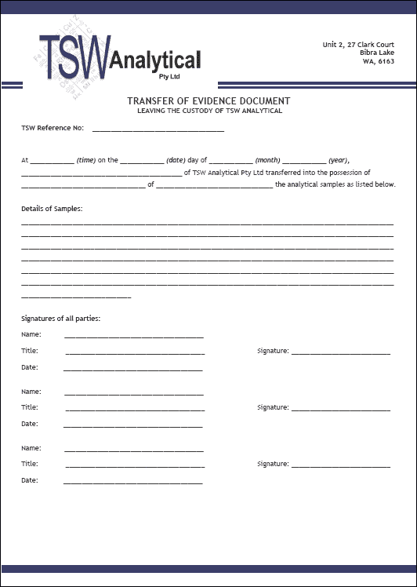
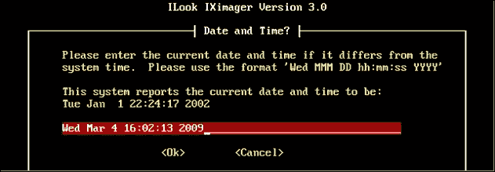
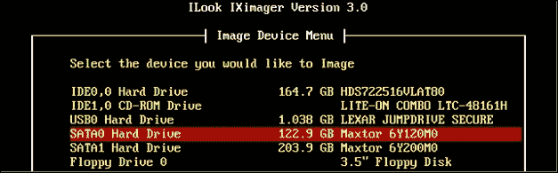

# 第四章：恢复与保存数字证据。

本章探讨了从各种设备收集并恢复数字证据的重要性，以及用于恢复和保存这些证据的过程。本章解释了如何按照法律要求保存数字证据的重要性。它描述了在不造成不当污染的情况下收集数字证据的法医过程和工具。本章涵盖的主题如下：

+   保管链的概念与从证据收集到法庭提交过程中的证据保存有关。

+   获取和安全保管数字设备和数据。

+   通过法医成像过程恢复数字证据，也称为**死恢复**。

+   通过**实时恢复**过程获取数字证据。

+   现有法医工具的有效性和增强工具的出现。

+   案例研究突出了从犯罪现场恢复和保存数字证据的过程和陷阱。

数字法医检查需要一个系统化、正式化且符合法律合规的方法，以增强证据的可采性，这一点在第三章《数字证据的性质与特殊属性》中已介绍并强调。始终要假设任何法医检查都会受到严格审查。法院需要确保证据的可靠性以及整个法医过程和工具在获取、保护和分析证据中的完整性。

数字犯罪现场与物理犯罪现场相结合，因为数字证据位于物理物件中，特别是某种形式的计算设备，如台式计算机、手机或数字存储介质，包括闪存驱动器和外部存储驱动器。物理犯罪现场遵循物理法则，决定了物理证据的适当回收，而存储数字数据的分析则用于寻找数字证据。

法院通常会接受一个展示物有责任且合法的保管链，这作为证据完整性的保证，除非有相反证据证明。保管链中任何历史上的断裂，都会降低数字证据的可采性及其证据价值。证据的完整性必须从扣押开始，直到证据保管人或展示物的保管人将其出示于法庭。

下一节描述了证据的保管链及其在保存证据展示物中的重要性，这些证据将在后续的法律程序中使用，包括刑事和民事案件。

# 理解保管链。

每当可能时，在收集并合法占有任何可能作为法律案件证据的物理对象时，必须非常小心。有许多重要的原因说明为何收集的证据必须避免污染。防止证据被故意或无意篡改至关重要。如果证据未保持原始状态，对方律师可能会提出不便且深入的质疑。

如果证据在某些方面被认为已被污染，那么其可接受性就会受到质疑。合情合理地，作为常规处理，它应当被质疑，因为它可能不可靠，且其真实性存在严重疑虑。在刑事案件中，若证据存疑，陪审团在揭示真相并确定可疑展品的可靠性时将面临极大的困难。在这种情况下，法官可能会指示将疑点利益归于被告。因此，展品的价值会被削弱，法官可能会将其排除，认为其不具备可接受性。这一点在本章后续的案例研究中得到了强调。

必须向法院展示已采取声音保护流程并遵循法院惯例和标准的保证。法院期望采取合理步骤以确保展品始终得到保护。遵守证据收集规则及证据的保管链至关重要，必须确保回收的证据未被污染。这包括确保证据在获取与呈交法律程序之间未被更改，甚至在其由从业人员获取之前也应如此。如果证据因某些原因被更改，那么必须向法院及案件其他方披露，并提供一些解释和正当理由。

一般数字取证恢复的收集规则包括以下内容：

+   对所收集的设备和证据在合法授权下获取的声明。

+   完整记录描述了计算机设备和外围设备，如调制解调器、显示器和打印机，以及它们在设备被查获或访问时所在的位置——一张草图图示是必需的。

+   先前两点的摄影和录像记录。

+   使用防静电和无菌手套处理每一件扣押物，并标记上牢固贴附的标签，描述该物品并可以与证据登记册交叉参考。

+   记录每个设备的电源状态，并注明设备是否已关机，以及在尝试实时恢复时的访问方式。

+   使用的取证工具的描述，包括使用的硬件和软件写保护器、每个设备或软件的型号或版本，并确认工具经过测试并且是最新的。

+   记录所有扣押和处理设备的人员，并且记录每个设备及证据存储设备从扣押到提交法庭的完整访问记录。

+   对证据恢复过程中任何更改的报告，以及对此类更改的解释和合理化。例如，在从手机中恢复数据时，通常需要开启设备并安装一个小的可执行文件以允许提取。从理论上讲，这可能会导致手机数据的丢失，但这是一个不可避免的过程，并且具有自我合理化的性质，只要执法人员能够在需要时进行解释。

展品的完整保管历史必须被完全记录，以说明其从扣押到提交过程中所在的位置及其保管责任。这包括确认展品在可能的上诉期限内的安全保管。法院还必须确信，展品的任何测试和检查都有完整记录，特别是展品是否有任何更改，例如，移除的样本组织用于毒理学和其他分析的情况。法院还要求提供证明，证明展品在从犯罪现场运输到保管地点及实验室的过程中没有受到物理损害。

显然，如果能够证明或怀疑证据的链条已被破坏，案件可能会崩溃。法官有时可能会指示证据不予接受，但也可能允许陪审团在考虑其证据价值的同时，决定其是否可以作为证据。因此，展示证据链条的完整性非常重要，否则如果对方法律团队质疑，法院可能会不允许该证据入庭。证据链条的完整性和准确性能够增强法院对数字证据真实性保证的接受度。因此，确保证据链条符合批准的法律标准至关重要。

# 描述数字证据的物理获取和保管过程

处理数字证据的过程特别容易出错。就像血样或指纹，可能在犯罪现场容易被污染，数字证据也可能在收集和提取过程中受到损坏，除非严格遵循程序。物理记录的存储和保管，例如证人陈述、犯罪现场照片、手稿副本等，需要谨慎的记录保存和安全保管，从而方便它们作为证据的出示。必须重申，法院期望能够证明数字证据从扣押时刻到法庭呈递时未被更改或污染。

这与犯罪现场保护没有什么不同，犯罪现场也要求证据保持原始状态。在传统犯罪现场，发现现场的人打扰现场并不罕见。极端天气条件如火灾、热风、雨水，动物、昆虫和细菌等，也能改变证据的状态。这使得法医检查员面临着一个挑战，那就是尽力保护遗留物和其他物证，如尸体或凶器，免受进一步的恶化。因此，这使得重建犯罪事件变得困难。

数字犯罪现场也是如此，必须防止被污染和进一步干扰。常见的情况是，存储在计算机上的信息表明某种形式的犯罪或不当行为，通常是由组织人员（如主管或管理员）发现的。他们本意良好，想要预览和收集他们认为是关键证据的内容，但实际上这些行为可能会污染证据，甚至使其在最坏的情况下无法被采纳，在最好的情况下，则可能会被篡改，降低证据的权重。如果没有经过正规的法医训练来恢复证据并初步管理可能的违规行为，这将是从事重建关键事件链条的人员面临的持续问题。

你可以参考案例研究中提到的第三章中的类似事件，*数字证据的性质与特殊属性*。

## 解释数字证据的证据链

数字证据的恢复通常是一个复杂的过程，需要非常小心，以确保证据不会被无意中污染、破坏或丢失（请参阅本章结尾的案例研究）。在恢复和保存阶段，常常会遇到一些常见的陷阱，且一个过于热心且缺乏经验的检查员在检查犯罪现场或返回法医实验室时，很容易无意中改变证据。回想一下第三章，*数字证据的性质与特殊属性*，数字元数据是多么容易被篡改。例如，最后访问时间戳可能会在计算机被扣押前或扣押时被一个无能的从业人员或保管人无意中删除或覆盖。

仅仅扣押展示物并将其锁入安全容器中，直到法庭需要时，并不足够。必须有正式记录，详细列出展示物的历史。法院期望对数字证据的安全保管提供与其他形式证据相同的保证，确保在整个拥有期间对数字证据进行妥善保管。执业者对证据的仔细处理和记录使法院能够重建数字证据的创建过程以及计算机系统中发生的事件，这将大大增强对证据真实性的信心。

保管链非常重要。每一项获取的展示物和每一个从设备恢复的数据所制作的法医影像都必须详细记录。在接收展示物时，必须记录获取的详细信息。此记录应包括展示物的完整描述、案件参考、保管人的详细信息以及所有相关方的签名，如以下截图所示：

证据展示物的获取

当保管权转交给另一方，比如法医检查员或外部检查员，或归还给原所有者时，转交详情必须记录在保管链登记表中。以下截图展示了这种表格的一个示例：

证据展示物转交给另一方

## 概述数字设备的扣押和初步检查

在传统的犯罪现场检查中，每一项实物证据通常是案件的单独且独立的组成部分。实物展示物的不可接受性可能不会严重削弱案件的强度，起诉方可能没有它也能成功。相比之下，数字证据通常与其他证据高度相关，如果它被认为不可接受，可能会对案件产生更大的负面影响。在重建关键事件时间线时，支持任何假设或反驳侵权性质的论点时，数字证据显得尤为重要，因此，尽可能地，执业者应该尝试将每个证据对象与其他信息进行对比，或至少展示两个事件之间的某种关联。如果有任何迹象表明证据在恢复过程之前、期间，甚至之后曾被篡改，这可能会改变数据和元数据，如相关时间戳，从而降低其价值。因此，执业者需要保持被扣押设备中证据的完整性。

在制作设备的法医图像时，传统上需要从设备中取出硬盘。如果硬盘没有立即返回设备，取出时应非常小心，以避免对硬盘造成物理损坏。应使用无菌防静电手套，避免对硬盘造成短路，防止使其无法操作。硬盘和正在复制图像的硬盘应进行标签标注，并放入防静电证据袋中，记录图像处理的日期和时间、案件识别信息、母机和硬盘的序列号、品牌、型号，以及填写标签人员的姓名。

此证据识别过程的记录将被复制并交叉引用在链条登记表中。记录应包括获取的日期、时间和地点，以及在恢复数字信息过程中使用的法医工具和流程。接下来我们将查看一些证据收集表格示例，首先是以下截图：

一个样本证据收集表格

以下截图展示了一个草图计划示例，显示了设备的连接性和它们在犯罪现场的位置：

一个样本证据收集表格

以下截图显示了被扣押证据的详细信息：

一个样本链条登记表

以下截图展示了一个证据追踪表和最终处置证明的示例：

一个样本链条登记表

附在收集表格上的还应包含另一个证据：图像日志报告，确认被影像化设备的身份、影像处理的日期和时间、从业人员姓名以及设备的哈希值。以下截图展示了来自自认证 `.ASB` 文件（本章稍后将描述的 IXImager 数字法医证据容器）的一个图像日志样本：

来自.ASB 法医图像日志的摘录

法律要求证据保管人能够提供文档证明，证明从记录创建到在法庭上提交证据时的完整链条无断裂。显然，从业人员应尽可能少地处理持有潜在证据的计算机，以确保保存在法医图像或容器中的数据的认证副本不被篡改。如果已被篡改，从业人员必须能够解释和描述发生的任何更改。

数字证据采集的恢复和保存阶段旨在稳定数字犯罪现场，从而防止或至少最小化提取数据时的数据丢失或更改。它需要将系统与任何电缆和活动的 Wi-Fi 网络连接隔离开。理想情况下，执行者应提前考虑恢复可能重要的易失性数据（如 RAM）的方式，因为这些数据在系统关闭时会丢失。

标准程序是拍摄犯罪现场的照片并记录视频，包括计算机显示器及屏幕上显示的任何图像。记录与每个证物相关的笔记，例如其在犯罪现场的位置、连接的任何电缆以及其电源状态，应当成为常规程序。

在移除硬盘或打开设备时，应佩戴防静电取证手套，或者至少佩戴防静电手环并确保接地。这将最小化静电放电对敏感电子设备电路的损害，避免设备无法操作。

执行者还应考虑识别在实时设备上运行的任何可疑进程。此外，电信设备和蓝牙发射器的使用（例如嵌入在手机和平板中的设备）可能会干扰被扣押设备的正常工作。如果可行，应断开这些电信设备和任何发射强磁波的设备。在需要防止外部电信干扰设备的情况下，应考虑使用便携式法拉第笼来运输和检查手机。

将物理证物运送到适合的地点进行后续检查通常涉及将被扣押的计算机设备转移到安全地点。较少见的是，可能涉及数据的网络传输。在运输过程中，确保证物免受物理损害或电子干扰非常重要。证物还需要避免热量、湿气、灰尘和物理冲击的影响。应当采用某种形式的保护包装，并附上标识标签，清晰描述证物以防止丢失或误认。特别是如果设备具有电话或 Wi-Fi 连接功能时，隔离设备非常重要，在访问设备上存储的数据时，如果设备（如手机）处于开机状态，这一点尤为需要考虑。

在大多数情况下，收集到的证据需要被安全存储，因为通常无法立即进行检查。应当小心识别和标记物理证据，如计算机，通常这些设备通过其存储的数字证据将证据与潜在嫌疑人联系起来。数字犯罪现场可以被视为物理犯罪现场的次级犯罪现场。还应当回忆一下*洛卡尔交换原理*：可能需要提取 DNA 和指纹样本，以确定谁曾接触过键盘和设备。

如果法医检查导致了庭审，实践者需要解释如何以及为什么使用了法医工具和流程。如果需要，实践者必须准备好为所有这些检查方面的完整性做担保，并能够验证这些方面的完整性。这将包括描述收集过程，并确认收集过程未造成任何污染，以及证据在收集后和检查期间保持无污染。

有时，实践者可能需要验证证据是否在任何方面未被篡改，这通常通过比较设备和成像的哈希签名来实现，二者应完全相同。这个过程将在本章稍后的*法医成像工具的可靠性以恢复和保护数字证据*小节中进一步讨论。对方的法律团队和法院可以坚持要求提供的数字证据必须能够通过独立分析进行确认。

怀疑包含证据的数字信息通常通过将其存储在另一台计算机、外部存储设备或 DVD 上来保存。在进行此复制过程之前，必须遵循严格的法医流程，确保严格遵守证据链。法医成像是证据链的一部分，接下来将详细介绍。

# 通过法医成像过程恢复数字证据

实践者负责获取包含数字证据的物理展品，这些展品与其他展品一样被保存在安全的存储中。如在第三章中所讨论的，*数字证据的性质与特殊属性*，法院承认数字证据存在更高的篡改风险和认证问题。数字证据的篡改相对容易，并且在过去曾造成对其可靠性的巨大不确定性。使用可靠的法医工具可以最大限度地减少在正式恢复数字数据过程中证据污染的风险。遗憾的是，数字取证作为一门科学学科仍处于不成熟阶段，这继续导致在定义有用且广泛接受的标准和流程方面存在分歧。

从计算机上取证的价值数据的死恢复或活恢复是从一台被认为持有有价值证据的计算机中恢复数据的一种选择。然而，从业者需要检查数据，并有几种选择方法。通常和首选的做法是对设备内部的驱动器进行取证镜像。这种恢复方式通常被称为死分析，允许在不激活操作系统的情况下对驱动器进行镜像。这旨在避免证据污染和复制错误。在这个阶段的不良实践可能会因污染而危及证据的可采纳性。

## 死分析证据恢复

**死恢复** 是指在不使用计算机操作系统的情况下对计算机进行取证复制数据的情况。术语“死”指的是操作系统的状态，并使用从可信 CD 或外部设备启动的计算机硬件，或者使用硬件写入阻塞器从提取的硬盘驱动器复制数据。

死分析恢复可以通过关闭设备、移除驱动器并分别对其进行镜像复制，或者开启设备来就地复制驱动器来实现。死恢复发生在系统关机后，信任的取证应用程序和硬件工具恢复数据。在过去的一段时间里，逮捕超出实际计算机终端的东西变得日益不切实际。在两种情况下，驱动器都没有完全启动，而在后一种情况下，设备由 CD 或 USB 闪存驱动器访问，这样可以防止操作系统被挂载，但允许从业者查看和选择镜像的文件分区。

## 写入阻止器硬件

实际上，死恢复确保所有操作系统进程在关闭系统时终止，如果设备在扣押时仍处于活动状态。写入阻止器硬件和软件通常用于防止证据被覆盖。死恢复确保后续对取证镜像的分析可以在可信的操作环境中使用可靠的取证硬件和软件进行。这个过程在镜像数据之后继续，以确保镜像不会以任何方式被更改，因为保留数据以供将来分析至关重要。

制作取证镜像的一个好处是可以复制镜像，并将复制品用作备份副本，交给其他检验员进行分析，或者交给其他法律团队进行独立证据检查。然而，逻辑会告诉我们只需要收集必要的数据。在这里，我与那些在需要取证镜像“任何活动中的东西”上过于拘泥的学科坚定分开。这一学科已经养成了一些不良习惯，而不加选择地镜像整个硬盘驱动器就是其中之一。

在法医恢复和检查阶段，完全有可能在不小心的情况下将数据写入包含证据的设备。显然，这种情况可能导致在法律程序中数字证据无法被接受。这就要求从业人员采取措施，避免证据的污染。

正常的计算机操作包括通过特定命令写入数据或读取存储在设备上的数据，并将这些命令传输到存储设备（如硬盘），从法医角度来看，这样会污染设备。避免此类污染的有效方法是使用写保护软件或硬件，在不写入设备的情况下进行数据恢复。

### 注意

使用写保护器可以防止源计算机向硬盘接口写入数据，避免覆盖或污染数据。

这里是一个硬件写保护器的图片，它可以用来访问 SATA 硬盘：

Tableau 写保护器

以下图像显示了一台通过硬件写保护器连接到 SATA 硬盘的笔记本电脑：

通过硬件写保护器连接到 SATA 硬盘的笔记本电脑

在现场恢复中，由于设备未关机，恢复到的证据可能是假和不完整的，因为操作系统和应用程序可能不可信，或可能隐藏或伪造数据。然而，过快切断电源可能会导致内存中的信息被清除。此外，突然断电可能会导致设备无法重新启动。设备硬件可能会遭受损坏，并且某些正在运行的服务和文件系统可能会丢失。对于桌面和笔记本电脑，它们会在 RAM 松余、交换文件和页面文件中保留这些过程的部分日志活动和硬盘上的一些信息，可能部分可恢复。

有一系列磁盘编辑程序，包括 Norton Diskedit，可以读取并恢复 RAM 中的内容，RAM 可能存有登录密码。近年来，RAM 中的内容在恶意软件分析中变得尤为重要，可以更容易地定位已在 RAM 中解密的加密或混淆的恶意软件，这些恶意软件在其他情况下通常难以解密和分析。然而，这些捕获过程要求系统处于运行状态，且程序需要在关机之前安装，这本身可能导致数据污染。当从存储有大量数据集的联网系统恢复数据时，在收集易失性数据之前关闭系统，可能会导致部分证据丢失。

在恢复过程开始之前，必须考虑操作系统文件和所有其他存储数据的保存，这可能会改变源设备。保存过程必须与数据恢复过程结合，以最小化，理想情况下避免污染，并保持数据的原始状态。在组织网络中进行死机恢复可能不合适，因为它可能导致长时间的功能丧失。如果网络没有镜像或复制，以避免正常业务的中断，这种情况可能会发生。

## 写保护软件

使用写保护软件的优势在于与需要拆卸硬盘的硬件写保护器相比，如下文所述的过程。

在启动并暂停计算机的过程中，硬盘仍保持原位，插入成像 USB 加密狗（或 CD），按下*F12*键以允许从 USB 加密狗（或 CD）启动。此时，成像提示屏幕（在下图中为 IXImager）会出现在显示器上，允许键入键盘指令，以访问和使用包含写保护器的软件应用程序的各种功能：

法医成像程序的启动界面

进一步的提示允许将计算机中持有的设备复制或克隆到附加的外部硬盘。下图所示的成像应用程序提示操作人员将**基本输入/输出系统**（**BIOS**）的日期和时间与外部可靠的时间进行比较，并输入一个单独的日期和时间记录实际时间与计算机时钟之间的差异，通常计算机时钟会走得太慢或太快：

IXImager：读取计算机时钟并添加实际时间的记录，以便在分析时进行对比

下图显示了选择不同硬盘和分区的各种选项：

IXImager：选择一个驱动器进行成像

一旦选择了要复制的设备和存储目标设备，成像过程就会开始，如下图所示。根据存储数据的大小、计算机中源驱动器的速度、计算机的处理速度以及 USB 接口的速度，整个过程可能会耗费相当长的时间。

在下图所示的示例中，选择了一个相对较小的 123GB 驱动器。驱动器和存储数据越大，成像过程所需的时间就越长：

成像过程开始

在下图示例中，一个更小的设备被复制，并且 130 MB 的数据被复制到映像文件中。面板显示唯一的哈希值，标记为 **SHA-1 值**。在这个实例中，映像已被压缩但未加密。哈希过程可能会显著增加处理时间。

确认映像过程的完成与状态

需要注意的是，IXImager 独立于物理硬件写保护器，因为它依赖于嵌入其程序代码中的软件封锁。

查看映像中的数据可以通过多种不同的法医应用程序来实现。下图示例展示了目录结构、文件查看和属性面板，供实践者研究感兴趣的文件：

查看 ASB 法医映像中的数据

在虚拟环境中（如 VMware 和 VirtualBox）也可以查看法医映像中的数据，只要该映像可以挂载。法医映像可以通过诸如 ILookIX 等法医工具进行挂载。虽然这并不等同于实时恢复，但操作系统和应用程序可以像实时分析一样使用，这对实践者有补充价值，通常能加速定位和查看与调查相关的应用日志及其他文件。由于法医映像是只读模式且是原始数据的副本，因此避免了证据污染，原始数据仍保留在源设备中。

## 增强恢复过程中数据的保存

确保法医工具经过校准以满足制造商规格，并安装任何固件更新，是标准的法医实践。这可以减少恢复过程中发生错误和不准确的可能性，例如在设备的法医映像过程中。校准用于存储法医映像和其他媒体的数字存储设备（如外部硬盘）同样重要。这些设备应进行清零、哈希处理，并检查是否有坏道或错误，这些问题可能会影响映像过程及映像的完整性。如果没有正确配置目标设备，可能会导致设备中残留的先前事件数据或制造过程中留下的数据与恢复数据混合，从而导致污染。

有效的保存过程通常会通过采集日志和哈希值进行记录，这些记录可以将事件和数据归因于设备的用户，并禁止日后声称数据被操作或篡改。及时的法医数据采集最小化了未来关于故意或意外污染的指控影响。

### 注意事项

**哈希算法**是对任何长度的数据进行复杂数学计算，生成一个固定长度的唯一字符串。

输入数据的修改会产生一个可通过比较两个输入来检测的不同输出。理论上，两个相同的输入会生成相同的哈希值，从而提供一个可重复的过程来验证两个文件是否相同。

在实际操作中，第二次使用相同的法医软件对同一个硬盘进行哈希时，并不总是会生成相同的哈希值。哈希过程是一个耗时的过程，实际上它在法医影像处理中才具有价值，而这种技术可能最终会变得过时——这对于一些目光短浅的观察者来说可能是一个离谱的预测。法医影像重要性下降的问题将在*概述现有法医工具的有效性以及增强过程和工具的出现*部分讨论，该部分讨论了新兴技术如何预示着数字证据收集方式的范式转变。

## 恢复已删除内存的残余

虽然死后恢复可能无法访问易失性内存，但内存残留通常会存在于所谓的文件空白区，这可能有助于某些内存恢复。这是 Windows 操作系统的一种现象，它规定了硬盘上每个文件的长度。由于大多数文件大小不同，且每个分配的簇或文件空间中有一部分未被文件占用，因此该扇区会被称为**RAM 空白区**的簇填充。计算机可能会将这片空闲空间填充为来自计算机内存的随机数据序列，这些数据可能是可恢复的，并提供一些关于最近和过往 RAM 事件的有用证据。如果在文件存储过程中需要更多的磁盘扇区，则会使用磁盘空白区，并填充已删除数据的残余。磁盘和 RAM 空白区可能包含内存残余，提供登录名、密码以及其他潜在的有用信息。恢复这些信息可能包括在法医镜像分析期间进行高级数据雕刻。实时恢复可能更容易恢复易失性内存，以下部分将讨论这一内容。

# 通过实时恢复过程获取数字证据

恢复数字证据的过程涉及在关机前提取实时系统数据，捕获并同时保存易失性内存、系统进程和网络信息，这些信息在传统的死后恢复过程中无法恢复。实时恢复发生在计算机操作系统仍在运行时。直到最近，通常的做法是进行死后恢复，建议关机以防止意外删除和污染证据。

数据集相对较小，使得作为惯例，硬盘映像制作变得可行，但仍然是时间消耗较大的工作。同时，也有一种观点认为，法院希望能够提供最好的证据，并且接受硬盘的法医映像，这无疑有助于恢复和分析证据，同时保障数据安全。

从业人员认为，使用实时恢复存在风险，因为恢复过程中的检查可能会导致数据被覆盖或删除。此外，也有合理的担忧认为，操作系统和软件应用程序可能已被修改，以在恢复过程中删除重要信息或产生虚假读数和信息。

在特殊情况下，从业人员发现通过实时恢复过程访问原始数据是可行的。进行实时恢复时，从业人员必须具备相应的能力，并提供证据解释其行动的相关性、正当性及其影响。所有使用的恢复过程必须进行完整记录，并在需要时提供审查。

## 实时恢复的好处

实时恢复的一个目标是尽可能保存和收集计算机的易失性数据，保持计算机操作系统和数据的状态。在事件响应场景中，从业人员进行某种形式的分类工作并不罕见，特别是在需要确定是否发生了重大事件的情况下。这种方法的好处是，在分类后，如果有正当理由，可以为全面的法医分析提供可靠的数据收集。这在使用现场工具进行手机恢复时似乎是相当常见的做法。

实时恢复并不会创建目标驱动的逐位镜像，而是对系统的目标部分进行快照，这通常是不可重复的，因为目标驱动可能已被后续使用，早期数据可能已经被修改。尽管法院曾因担心在恢复过程中可能丢失部分数据而质疑实时恢复中获得的证据的可采性，但这一问题现在已不再那么严重。然而，前提是从业人员能够解释涉及的恢复过程，并向法院保证，任何小规模的数据丢失不会对呈现的剩余证据产生不利影响。关于这一担忧的更多细节，请参见第五章，*增强法医工具的需求*。

## 实时恢复的挑战

从业人员仍然不愿意使用实时恢复，认为这不是一个健全和直接的取证过程。然而，另一些人认为，这一过程只会对操作系统和数据产生轻微影响。如果进行实时恢复，从业人员应能够预测恢复对系统和数据的影响，并解释和证明该过程。有趣的是，许多案例法支持使用任何能最好保存计算机媒体上所有数据的方法。

再次强调，从业人员通常会对每个存储设备内包含的所有字节数据进行取证性有效的镜像，以便进一步识别证据。到目前为止，从业人员更倾向于使用死机恢复来捕获和保存数字证据，担心在此过程中会修改数据，因此他们会关闭计算机。然而，如前所述，关机可能导致某些元数据丢失。例如，时间戳可能会被修改，从而妨碍和混淆后续事件的重建。此外，如果硬盘被密码保护和加密，可能无法访问。RAM 数据也会丢失。

对于检查本地和计算机网络的从业人员来说，使用反取证工具包带来的问题之一是如何确定数字证据的真实性和可靠性。这些工具包可能会使事件重建变得模糊不清，并可能阻碍从实时网络源中恢复证据。由于正在运行的程序修改了文件系统，进行实时恢复时，模糊的图像也可能出现，从而在采集过程中修改和改变元数据，影响与文件数据的关联。

在极端情况下，反取证策略可能会使设备陷入陷阱，使得设备启动时，先前安装的程序删除或更改设备上存储的数据。其他反取证手段，例如 Metasploit 项目，针对并阻止取证工具恢复证据。在其他情况下，爆炸物可能被连接到计算机，希望在启动时，调查人员会因爆炸而丧命。

在从业人员处理数字证据时，证据的丢失或污染是常见的，并且可能影响其可采性。这迫使法院，尤其是美国的法院，考虑现有的两种标准：法院可以对不完整或缺失的证据做出判决，或者法院依赖“起诉方的善意”。然而，一些评论者认为，这些做法可能会冤枉一个潜在无辜的人，或者让一个有罪的被告逃脱惩罚。直到现在，可靠的取证工具尚未能够进行实时恢复。这些内容在第五章 *增强取证工具的需求*中介绍，涉及增强型取证工具的出现。

## 挥发性内存恢复的好处

实时恢复的一个优势是能够恢复易失性和非易失性数据。易失性数据（如存储在 RAM 中的数据）是如果切断计算机的电源则可能丢失的信息，而使用死机恢复时这些数据是无法获取的。

然而，最有帮助的是，IXImager 可以快速重启，足以捕获系统的 RAM，从而有效地捕获正在运行的程序、密码等。这可以通过插入取证 USB 驱动器、光盘，甚至 SD 卡到计算机中，重启计算机并开始成像过程，以及成像设备文件夹中的 RAM 来完成。然而，建议首先确定需要按下哪个功能键（通常是*F12*）以防止正常启动过程，并确保成像过程成功。

实时恢复还便于恢复非易失性数据。恢复易失性数据有助于重建事件时间线，以确定嫌疑人的身份、可能的作案动机以及其他有用的事件记录。可能有价值的易失性数据类型包括：

+   系统日期和时间

+   当前网络连接

+   打开**传输控制协议**（**TCP**）和**用户数据报协议**（**UDP**）端口，以及打开这些端口的可执行文件

+   当前登录的用户

+   内部路由表

+   正在运行的进程

+   定时任务

+   打开的文件

+   进程内存转储

实时恢复有助于将正在检查的计算机与其他网络连接的计算机之间的信息进行关联。易失性数据可以在实时恢复过程中被定位并保存。易失性数据的顺序从快速被擦除的内存 RAM，到更持久且在计算机关机后通常会保留在驱动器上的原始磁盘块。易失性数据的范围从最易失性到最不易失性的顺序如下：

+   内存

+   交换文件

+   网络进程

+   系统进程

+   文件系统

+   信息

+   原始磁盘块

## 将设备与外部攻击隔离

来自外部的威胁对计算机中存储数据的完整性构成了一个永远存在的问题。尤其是在尝试实时恢复证据时，这一点尤为突出。将设备与设备上的不可预测数据隔离是明智的做法。位于可能被设置了陷阱以防止取证检查的系统上的数据，很可能包含可执行文件，这些文件可能会例如删除设备上的所有文件。

它还可以被编程与远程系统通信，并警告其他人实时恢复正在进行。打开文件（例如 HTML 文件）可能也会带来意外后果，例如导致已安装的浏览器执行脚本并从远程站点下载文件。与外部环境的隔离对于防止敌对方篡改嫌疑系统至关重要。这也将防止可能影响取证检查的意外传输。

在进行实时恢复时，实践者需要识别并暂停可能污染数据的任何可疑进程。如果存在网络连接，应该物理拔掉，或者设备可能连接到一个空的集线器，那么应小心防止网络断开日志消息发送到连接到设备的任何外部方。必须防止远程访问设备的风险，这可以通过应用网络过滤器来实现，从而阻止任何远程访问。

始终存在这样的可能性：在实时恢复过程中，远程攻击者可能与正在检查的计算机服务器建立联系。而且，可能存在从服务器进行的暴力攻击，针对其他联网计算机进行攻击。检查计算机的网络连接，查找活动连接并识别合法端口与可能表明黑客攻击的端口是标准做法。对于面对这种恢复形式的经验不足的实践者来说，他们常常会遇到大量未识别的开放端口，这些端口可能是合法的，也可能被利用作为后门攻击。因此，谨慎的做法是确定计算机上可能利用这些开放端口的可执行文件。

实时恢复认识到保护可能丢失的易失性数据的价值，但这可能会对系统和数据产生一定的影响。许多人认为，考虑到从运行中的系统中收集的数据价值，这是一种可以接受的权衡，因为对其他证据的影响最小。一些实践者评论说，改变证据可采性制度，证明实时恢复未或无法实质性修改或引入新信息，将使实践者能够进行更有效的检查。这可能会促进更多的数字证据在法庭程序中被提交。如果某个文件对证明案件至关重要，则必须证明它没有从原始状态被更改，因为证据识别和文件恢复的过程变得不再是一个问题。

另一个从业者常提出的论点是，实时恢复应作为最后手段，直到此过程得到判例法和法院裁决的支持。或许，从业者应当将辩论引向一个新的方向，而不是等待法院做出改变。这可能需要一些扎实的经验和训练来进行实时恢复，以便能够向法院展示和解释涉及的过程。事实上，许多从业者已经开始使用专为此目的设计的新法医工具进行实时恢复——这些工具已经适应了面对大型分散数据集时法医成像的低效性。

直到最近，该学科似乎仍然专注于繁重的案件处理、庞大的数据集以及那些未能为从业者提供更好结果的工具，这些工具未能满足这些新需求。下一节将讨论现有工具和流程的局限性。

# 概述现有法医工具的有效性及增强流程和工具的出现

一直以来，都需要验证法医过程和工具，并确定它们恢复和分析的数字证据的可信度。这些过程和工具必须提供可验证的结果，证明它们如何产生完整、真实、准确的证据，并且具有完整性和准确性。尽管学科内有人呼吁对工具和过程进行科学审查，但仍有关于工具可靠性的抱怨。人们对这些工具收集数据的能力以及成像数据易受到伪造的质疑。

有报告时常出现某些类型的法医硬件在数据恢复过程中明显发生故障，这引发了对成像和哈希过程有效性的质疑。以前从业者曾抱怨法医工具无法检测和恢复存储在**主机保护扇区**（**HPA**）和**设备配置覆盖区**（**DCO**）中的隐藏数据，从而引发了对工具成像能力有效性的疑问。我的共同研究开发者已经发现，现有的手机工具在从许多设备中恢复所有可恢复数据方面存在不足。

其他观察者对学术研究未能成功转化为实践感到失望，且法医工具供应商对学术法医研究了解甚少，情况更加复杂。从业者处于供应商的掌控之中，而供应商可能在向相对较小、资金紧张的执法人员市场销售工具时发现几乎没有盈利空间。低水平的工具标准也在普遍接受中占据主导地位。

法院对从业者及其使用的工具有着合理的期望。法院和立法标准存在，但是否对提升取证工具的质量有任何积极作用尚属可疑。尽管标准确实存在，但在许多司法管辖区很少被遵守，并且供应商在设计和试用新工具或版本时很少真正关注。供应商对利润追求的偏执，他们对从业者真实需求缺乏理解，以及缺乏第一手取证经验，很可能导致当今可用的取证工具质量低下。

下面的小节讨论了数字取证工具的标准，它们恢复和保护数字证据的可靠性，以及克服部分主要挑战的新工具的出现。

## 数字取证工具的标准

各种软件包协助从大型数据集中搜索可疑证据。这些工具能够过滤和减少大量数据，使其更易管理。它们还能协助切割已删除文件和查找隐藏数据。像 ILookIX 这样的工具，使用**极端文件恢复**（**XFR**），由**信息和通信技术**（**ICT**）专家和实践者设计并进行现场测试，将能够识别和打开文件夹和文件，同时还能挽救其他工具未能察觉的数据，这些数据常常未被发现和利用。因此，现在从传统工具产生的大量、杂乱的数据输出中去除了单调乏味的过程。这意味着通过更自动化、智能的文件系统分析，案件分析能更快速地得到解决。

信息安全标准概述在 ISO/IEC 27041/2015 中，该标准为验证取证工具提供了指导方针。这旨在确保工具适合用于取证恢复和分析。许多评论者称这些标准缺乏深度和足够详细，以便任何人理解其含义，并鼓励设计者在新的取证工具和应用程序的设计中临时应用它们。迅速而持续的数字技术变化几乎不可能在没有那些制定标准的人做出一些有力努力的情况下被吸收为某种形式的监管指南。

**美国国家标准与技术研究院**（**NIST**）管理着计算机取证工具测试计划，旨在确保取证工具符合法院的期望。特别是，该计划旨在确保工具可靠，提供准确的恢复，并在成像和分析过程中最大限度地减少任何数据污染。

2014 年，英国法庭科学监管机构发布了名为**数字取证方法验证**的草案指南，重点是验证用于恢复数字证据的过程。提议的指南要求所有恢复过程产生可靠的证据，并且必须创建和保留详细的文档，详细说明验证其过程所遵循的步骤。然而，类似于**国家标准与技术研究院**（**NIST**）的指南，没有提供关于“案件文件的完整性和链条保持的具体标准”，尽管它们是数字取证过程的重要组成部分。（*McCutcheon, 2014*）

**国际计算机证据组织**（**IOCE**）规定，包括成像软件包在内的法医软件工具需要独立评估其有效性，或者从软件提供者处获得某些保证，即使需要在法庭听证会上支持其产品的有效性。大多数数字取证工具是商业软件应用程序和硬件，未经独立验证，并且一些可能由用户定制。IOCE 已确定了独立验证所有工具的不切实际性和高昂费用，并依赖于更加务实的验证检查解决方案，通过增强执法机构之间的合作来确定合适和可靠的工具，然后共享测试结果，测试任何工具中发现的不足。

应当铭记道，道伯特测试评估了法医过程和工具的有效性。这有时要求这些工具的制造商解释和验证其工具的功效，以便法院能够确定其适用性。这些数字取证工具大多已经在广泛的司法管辖区内被接受，几乎没有人质疑其完整性和准确性。在美国，道伯特测试和法院惯例不太可能接受基于制造商或从业者任何不合格声明的工具的完整性，而不提供某种形式的正式和科学保证。

在某种程度上，对于分享关于开发符合从业者需求的更高质量法医工具的信息采取了平淡无奇的方法，进一步恶化了许多司法管辖区内工具标准和任何实质性合规要求的缺乏。

这导致了对同一问题的重复努力，并且阻碍了有效研究和成果的产生，无法生成有效的法医工具。大约 10 年或更长时间以来，人们已经认识到，未来对大数据集的分析将变得越来越耗时，进一步加剧了需要为利益相关者提供及时结果的要求。此外，由于缺乏先进的自动化恢复和分析技术，分析大数据集的工作几乎不可避免地由人工完成。这样的时间限制和人工干预会妨碍从业者，后者还需要提供专家证人证言，并恢复证据。

## 法医成像工具在恢复和保护数字证据方面的可靠性

国际法医计算机专家组织（IOCE）曾声称，硬盘的法医成像是一个简单的过程，只依赖于通过可靠的验证工具确认其准确性，或许这种说法没有进行充分的调查。

法医图像必须能够验证为真实副本，才能被接受。这通常通过哈希过程来实现，这是目前证明法医图像完整性的标准，并用于证明两个文件或图像的相同性。这些哈希值通常以未保护的文本文件形式存储，但必须加以保护，因为它们可能容易受到篡改或修改，而这些修改很难被发现。这种保护需要在图像采集过程中进行复杂的数学运算，并记录结果以供将来比较。

哈希报告与数字证据文件相关联，是存储来自源设备的文件及其日志、哈希值和描述采集过程的其他信息的构造物，但实际上，这些过程并未增加图像文件的安全性或完整性，因为它们可能被故意修改。一个违法者可以简单地用修改后的输入重新计算哈希值。一个加密的图像文件可能会被拥有解密密钥的人修改。这是一个诚实的从业者不希望处于的境地，而一个不诚实的从业者则不会过于担心，因为即使有所怀疑，也不太可能发现任何干扰。

数字证据图像文件最常见的保存格式是`E01`和高级法医格式，这些格式声称能够保存和保护从计算机设备恢复的数据。这些图像可能会进行哈希处理，以便稍后验证证据是否与从原始设备复制的内容相同，并且没有被修改。直到最近，人们一直认为，当这些图像文件受到密码保护并加密时，它们无法在不被检测到的情况下进行篡改。文件图像采集日志本应是不可侵犯的，但由 FTK Imager 和 EnCase 等流行的法医成像工具生成的日志现在已知容易受到利用。

然而，McCutcheon (*2014, p. 49-52*) 已经证明，`E01` 法医图像格式（它主导了约 90% 的法医成像环境）并非防污染的：McCutcheon 证明，使用简单的编辑工具，`E01` 图像可以在不被检测到的情况下篡改，而执业人员也无法认证法医图像。这一发现几乎没有引起人们对更好成像技术（如 `.ASB` 图像容器所提供的技术）进行探索，这一技术对该领域并不陌生。

McCutcheon 的实验明确证明了，`E01` 图像中的元数据可以使用开源的第三方库进行操控，这引发了对常用软件流程是否有效检查法医图像有效性的质疑。这些发现表明，文件数据、元数据甚至图像采集日志都可能被修改，并且通过一定技巧，可以伪装这些修改以避免 **Forensic Toolkit** (**FTK**) 和 **EnCase** 等工具的检测。在撰写本文时，这些工具根本无法认证图像文件的完整性。这意味着，如果对方认为在成像过程中执业人员有任何不当行为或对恢复并成像的数据的完整性存有疑虑，那么这些证据就可能受到挑战。

以下链接将为您提供有关此实验的更多信息：

[`researchrepository.murdoch.edu.au/24962/`](http://researchrepository.murdoch.edu.au/24962/)

我在现场和实验室对 IXImager `.ASB` 证据容器的测试确认了它能够安全地将法医图像存储在受保护的证据容器中，支持 McCutcheon 在 2014 年提出的关于证据认证的担忧。这些实验于 2015 年完成，得出了一些重要且令人鼓舞的结果，具体如下：

+   与 EnCase Forensic Imager 不同，后者会记录与更改数据相关的空数据，IXImager 会对修改后的图像进行自我认证，并通过在更改的区域写入零来修复它，从而使得可以检测到被篡改的扇区，从而提醒执业人员注意那些已被修改的图像扇区。

+   当使用成像应用程序 IXImager 打开时，应用程序会验证图像是否已被修改，并且不再是原始的。该应用程序提供了详细报告，列出图像的具体修改内容。此类事件会在检查证据容器时通知执业人员。

+   证据容器中嵌入并加密了采集日志和一个用于验证的秘密副本日志，这些日志是不可侵犯的，并为执业人员提供了原始采集情况的真实记录。

`.ASB` 证据容器已经为从事数字取证的人员提供了一段时间的工具，当在法庭听证中受到质疑时，可以用来验证数字证据。然而，大多数从业人员并未意识到或似乎对这一问题不感兴趣。大多数人仍然使用`E01`文件，这些文件无法自我验证，且无法提供防篡改的采集日志。到目前为止，NIST（美国国家标准与技术研究院）尚未审视这一做法，这可能会削弱法医图像的价值。然而，创建`.ASB`容器的 IXImager 是唯一一款 100%通过 NIST 认证的影像软件（*NIST, 2013*）。到撰写本章时（2016 年），这一情况没有发生变化。

IXImager 通过 CD 或 USB 闪存驱动器在启动设备时加载，提供了一个安全的避风港，用于存放法医图像和嵌入的影像日志表。此外，它的写保护软件避免了使用昂贵的硬件写保护器和多个加密狗。数据成像速度的测试也使得这款软件领先于竞争对手。

已有一些担忧表明，数字取证工具不适合在联网计算机上使用，它们主要针对的是从网络中移除的单台计算机进行成像和分析。恢复要求应规定对联网系统进行在线本地或远程分析，同时在成像和恢复过程中不会污染证据。第五章，*增强取证工具的需求*，详细讨论了这一问题的解决方案。

下一部分介绍了两个澳大利亚的案例研究，强调了在恢复数字证据时保持最高专业标准的重要性，并强调了证据保存的重要性。这些案例提出了一个问题：为什么执法机构过度依赖专业的数字取证单位，而不为普通警员提供一些基础的数字伪取证培训和更有效的工具，因为他们往往是犯罪现场的第一响应者，而这些现场越来越多涉及到某种形式的计算设备。

# 案例研究 – 将证据与用户关联

有时候，在法律程序中出现对可采性的挑战时，数字证据可能会不恰当地交给陪审团审理，因为法官未能理解证据的性质以及挑战的依据。这在 2007 年莫德伊诉西澳大利亚州的儿童色情非法持有案件的陪审团审判中得到了体现。案件表明，审判法官未能拒绝数字证据，尽管辩护律师在审判开始时已提出严重怀疑该证据的保管情况。因此，在上诉程序中，莫德伊案件中的数字证据被判定无效，具体的定罪也被撤销。你可以在这里阅读该案件的详情：

[`jade.io/article/12808`](https://jade.io/article/12808)

在 2008 年澳大利亚的一起儿童色情案件中，计算机技术员在之前由被告委托升级设备并移除疑似恶意软件时，在被告的笔记本电脑上找到了儿童色情视频和图片文件。在为电脑升级新内存芯片的过程中，操作系统被删除，被告的个人数据被保存到技术员的备份电脑中。在对硬盘进行碎片整理后，操作系统被重新安装到笔记本电脑上，随后被告的个人数据被复制回到笔记本电脑上。没有使用任何特殊的法医工具来复制、删除或稍后恢复这些个人数据。

在复制过程中，技术员打开了一些视频文件，这些文件似乎描绘了儿童色情内容。当地警方接到可能犯罪的通知，访问了工作室，并指示技术员将数据复制到 DVD 上，DVD 随后交给了警察。根据警方指示，个人数据被恢复到笔记本电脑上，之后笔记本电脑被返还给被告，待日后扣押。随后，警察丢失了这张 DVD。

这台笔记本电脑在技术员的办公室里放了几周，等待正确的内存芯片到货。其他技术员可以进入存放笔记本的房间，但警察团队并没有尝试在笔记本电脑被扣押之前就取走它并保存证据。正是这个事实导致案件被挑战，理由是笔记本电脑在被扣押之前并未建立起有效的物证链，而是在一个相当长时间后通过专门的计算机团队在被告的住所进行突击搜查时才被扣押。

两次审判无效。第三次重审时，法官认为部分数字证据因异常的文件元数据而不可靠——这并不令人惊讶，因为硬盘已经被清空，之后又被写入了更多数据。无法提供恢复数据与原始已删除数据的比较。恢复的数据可能与原始数据有所不同，或者已被篡改。

然而，尽管辩护律师反复且强烈质疑缺乏可靠的证据链（无法防止证据被篡改），陪审团仍然根据剩余的拥有罪名判定被告有罪。

被告之后提出的上诉被驳回，上诉法院指出，被告在笔记本电脑上承认了拥有儿童色情内容。尽管在被告笔记本电脑中缺乏任何对数据的责任关怀，并且 DVD 的副本丢失，但证据仍被允许呈交给陪审团。

起诉方有责任确认数字证据的完好无损，尽管显然并非如此。在毒品贩运和儿童色情内容拥有案件中，证据的无罪推定发生了逆转，导致被告需要证明自己并未意识到拥有非法或令人反感的材料。让人难以置信的是，当证据的真实性显得可疑时，竟然被视为可接受证据——这一点连检察官也表示认同！影响陪审团作出有罪判决的，可能是被告在视频采访中部分承认了罪行。

在数字取证调查中，这种缺乏专业性的情况遗憾地并不罕见。那些原本应作为法院诉讼一部分的信息，或者可能作为证据使用的信息，必须小心处理并加以保护。绝不容忍随意和不负责任的态度。因此，亲爱的读者，如果你打算成为这个领域的一部分，请在证据处理上保持严谨。

# 参考文献

Grossman, M. R. 和 Gordon, V. Cormack. 2011 年。*技术辅助审查在电子发现中比全面的人工审查更有效、更高效*。《里士满法律与技术期刊》 (17)：11-16。

Mowday 诉西澳大利亚州。2007 年，WASCA 165。

NIST. 2013 年。*IXImager v3.0.Nov.12.12：数字数据采集工具的测试结果*。美国国土安全部科技与研究部。参考文献：[`www.dhs.gov/cyber-research`](http://www.dhs.gov/cyber-research)。

# 摘要

本章首先从总体上看待证据恢复和保存，然后重点讨论这两者如何与数字证据相关。从保存包含数字信息的实物证据，到以数字形式恢复证据，本章概述了从业人员的责任以及在证据处理过程中面临的挑战。

死证与活证的恢复过程已被描述，尽管这些行之有效的过程如今正面临由先进技术带来的范式转变。新颖且更可靠的证据恢复与保存方法，以及更高效、可靠的法医成像方法被提出。

第五章，*增强法医工具的需求*，将探讨解决并克服活证恢复某些弊端的新技术和工艺，介绍一些“颠覆性技术”，这些技术正好及时到来，为从业人员在法医检查中提供竞争优势。这将使你能够在本章所学的基础上进一步拓展知识，并为你呈现数字证据恢复与处理的新兴环境。

本章还将重点介绍快速变化的法医环境，在这种环境中，传统的法医成像和日益增大的数据集的索引变得不可行。它将介绍新的法医过程和工具，以帮助更有效的证据恢复和资源的更好利用。这种“颠覆性技术”已经开始挑战既定的数字法医响应，并且使得法医专家的过度依赖面临考验，因为法医专家本身正被日益增加的案件负担压得喘不过气，且无法处理更大、更复杂的数据集。
