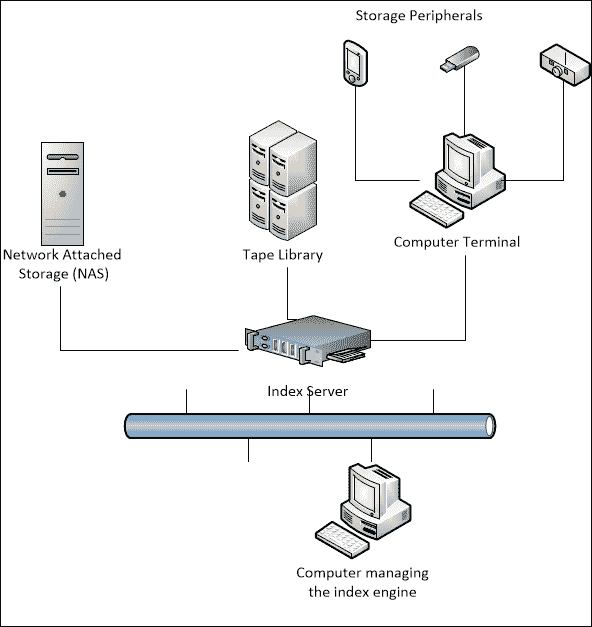
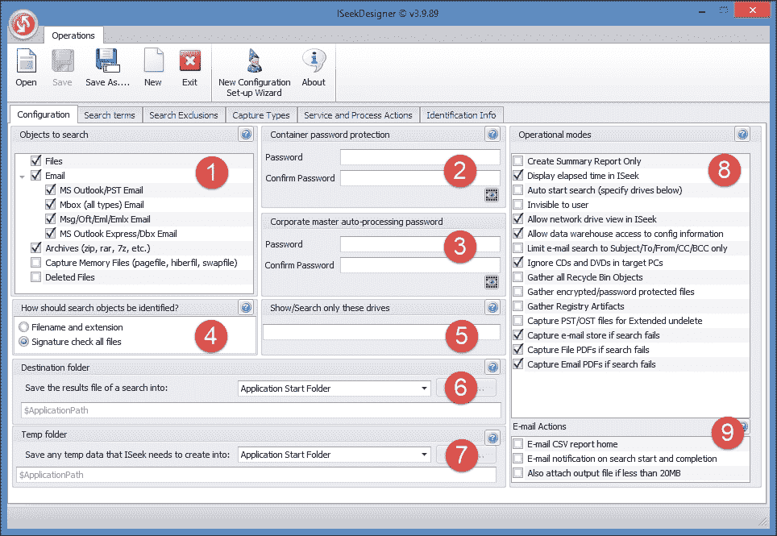
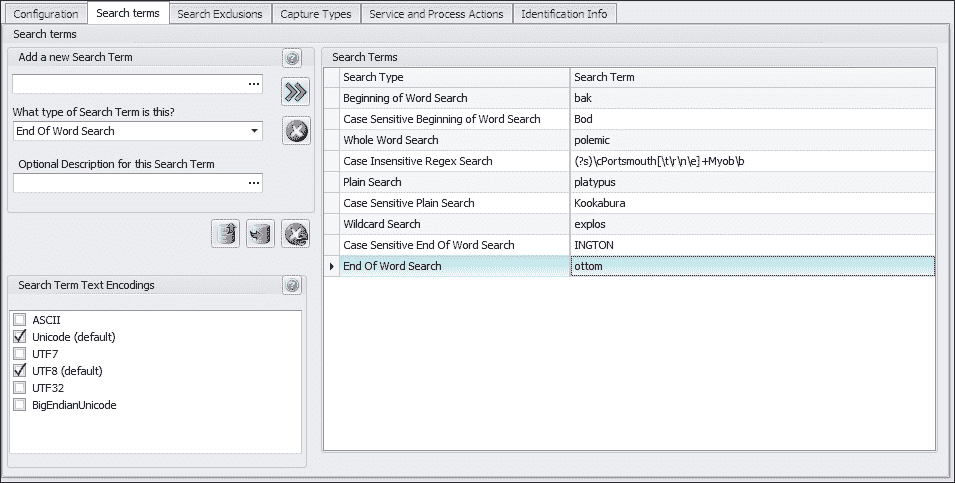
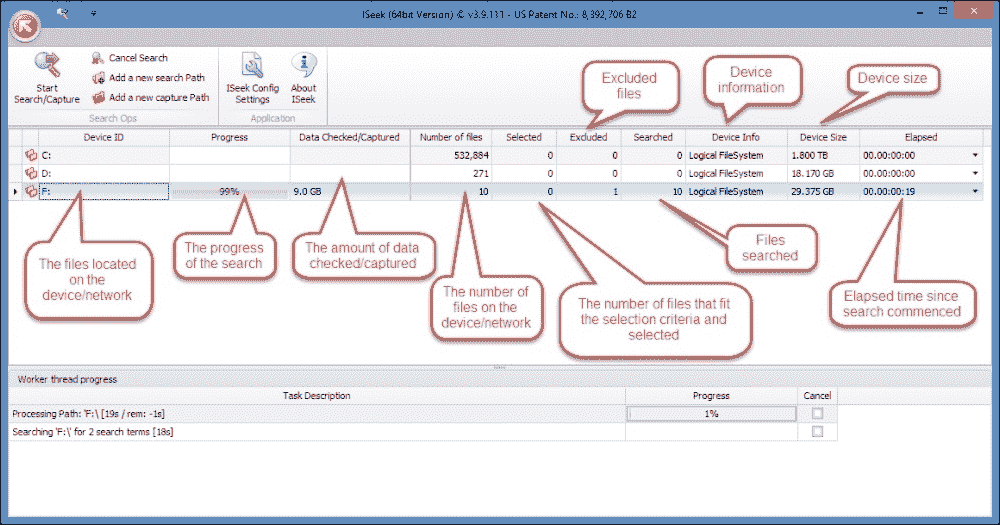
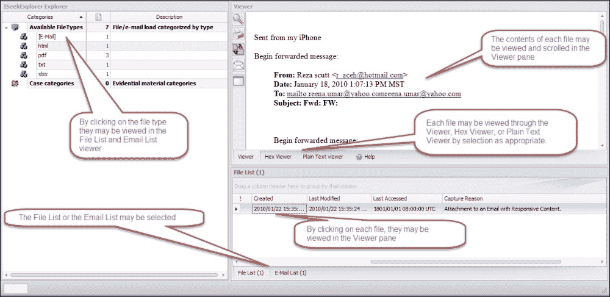
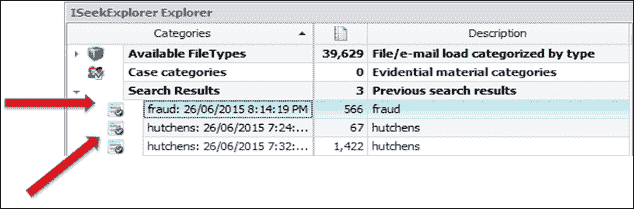
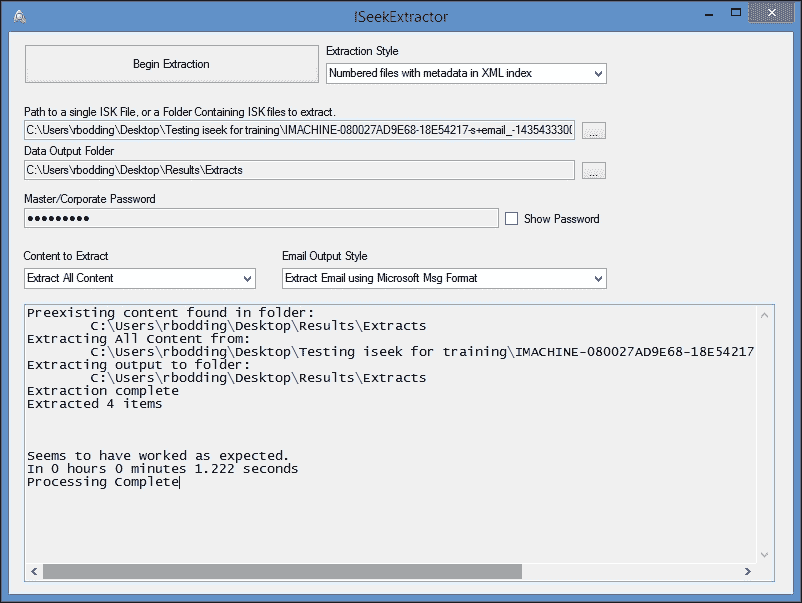
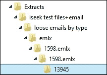
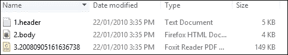
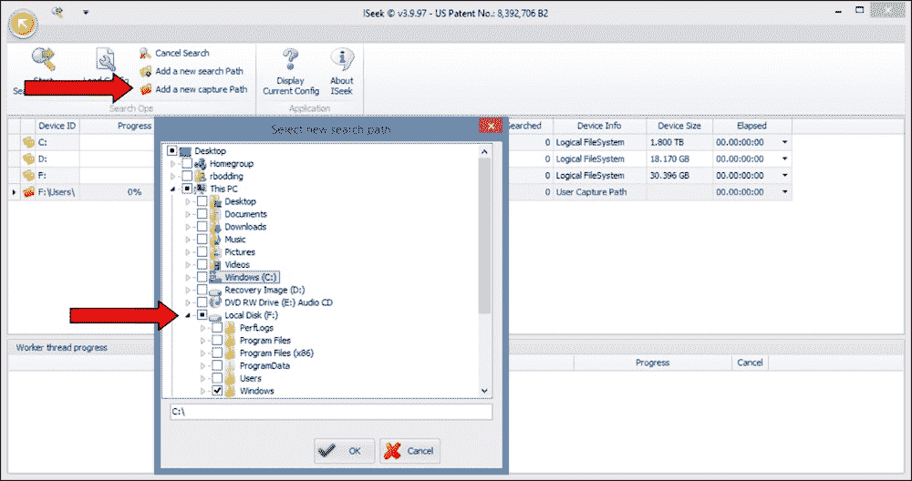

# 第五章：提升法医工具的需求

本章重点介绍了快速变化的法医环境，其中传统的法医成像和日益增大的数据集的索引变得不可行。它介绍了新的法医流程和工具，旨在帮助更有效地恢复证据并更好地利用资源。本章还介绍了**颠覆性技术**的出现，这些技术挑战了既有的数字法医响应，并使过度依赖法医专家的情况愈加严峻，而这些专家本身也正面临越来越重的工作负担以及处理更大、更分散数据集的能力受限。

本章将特别涵盖以下主题：

+   法医实验室和从业人员在从日益庞大和分散的数据集中恢复证据时所面临的新兴问题

+   帮助从业人员更有效应对这些挑战的流程和法医工具

+   使非专业的执法人员和其他相关方（如 IT 管理员、法医审计员和安全官员）成为数字犯罪现场的首批响应者

+   一个案例研究，展示了审查大数据集所面临的挑战

# 数字法医实验室

在过去十年中，政府和私营部门的数字法医培训和教育加速发展，以满足对合格从业人员日益增长的需求。许多进入这一领域的人都在法医实验室就业，参与数字法医检查工作。最近，预算约束正影响着许多数字法医实验室，导致它们的人员配备和专业培训受到严重限制。同时，实验室案件负荷的急剧增加可能对工作质量产生不利影响。简而言之，法医实验室在设备、人员和建筑方面的成本非常高。

然而，数字法医社区内的知识共享促成了在法医分析方面的显著进展。许多数字法医实验室，特别是执法环境中的实验室，正在利用这份共享知识库，制定指导方针，改进分析工作，从而实现任务自动化，加速处理原本繁琐且耗时的工作，以应对更大数据集。

近年来，全球许多企业的倒闭往往涉及管理者和员工在某些程度上的不诚实行为，他们试图通过剥削濒临破产的企业来获取某种形式的经济利益。这些违法行为涉及窃取企业和客户资产，需要取证审计专家的调查，而这些专家又需要从业人员的专业技能来定位和分析相关的数字证据。这给私人实验室带来了额外的负担，导致案件负担加重，同时也需要更多有经验和合格的从业人员来增加 staffing。

## 数字取证实验室的目的

很少有组织具备数字取证能力，也并非所有政府部门都拥有数字取证实验室，因为这些实验室成本高昂，并且需要经验丰富的人员，而这些人员并不总是随时可用。通常，组织会将数字取证集成到安全事件响应程序中。数字取证检查在时间和人力上可能非常昂贵，提供这些服务的实验室也不例外。执法机构、国防和情报机构、大型金融机构，以及国际会计公司，如德勤、安永、毕马威和普华永道，都拥有成熟的实验室。

较小的组织可能会使用已建立的私人从业人员或大中型会计事务所的取证人员提供的服务。聘请取证专家的费用始终很高，与辩护律师团队寻求独立审查由检方专家恢复的数字证据没有区别。遗憾的是，许多被告往往无法承担聘请顾问从业人员的费用，除非他们有足够的资金或获得某种形式的法律援助。

设计良好并运作正常的实验室为从业人员及其服务的组织提供了必要的支持和协调。这些实验室提升并提高了法医检查的标准，使其符合法院的预期，并提供了高效的案件处理和更好的资源管理。有效实验室的设计因组织不同而异，但有一些共同的要求。没有某个正式建立的法医学机构，能够适应并遵守相关法律辖区的证据规则，数字取证检查将会缺乏协调、零散且无效。

以下部分概述了数字取证实验室的基本组成部分，并探讨了它们面临的重大挑战。

## 数字取证标准的接受、共识和采纳

应该回顾一下，DNA 证据的早期优势在 OJ·辛普森案件中受到了挑战。该案件得到充足资金支持，帮助辩方成功反驳了法医证据，声称证据在实验室中被污染，最终导致辛普森被宣判无罪：

[`abcnews.go.com/US/oj-simpson-trial-now/story?id=17377772`](http://abcnews.go.com/US/oj-simpson-trial-now/story?id=17377772)。

在全球范围内，类似的情况屡见不鲜，糟糕的实验室操作导致了冤假错案。在澳大利亚，年轻婴儿 Azaria Chamberlain 的失踪事件及其在 Ayers Rock 的被害案件揭示了松散的法医实践和对证据的错误解读，至今仍在澳大利亚引发共鸣：

[`www.abc.net.au/news/2012-06-13/eastley-a-dingo-did-steal-her-baby/4068026`](http://www.abc.net.au/news/2012-06-13/eastley-a-dingo-did-steal-her-baby/4068026)。

准确有效的审查结果对于确保公正的审判至关重要。错误和不称职的法医检查可能导致错误定罪，或至少导致不安全的审判。因此，数字取证实验室的认证设立了更高的标准，法院可能会对法医分析和物证处理更有信心。尽管一些法域要求法医实验室进行正式认证，但大多数并未要求，尽管曾多次呼吁进行认证以及对法医从业人员进行认证。此类呼吁坚持认为法医从业人员需要接受包括能力测试在内的认证，确保他们具备执业资格并能提供专家证词。

然而，似乎不太可能在大多数法域达成对这种认证的普遍共识，国际认证协议的达成更是难上加难。更可能的是，从业人员需要在法院和雇主面前证明自己的专业资质，表明他们配得上作为专业合格从业人员的认定。

回顾第三章，*数字证据的性质与特殊属性*，使用 Daubert 测试来衡量数字取证工具的能力以及取证从业人员的资质，这在美国是常见的做法，但在其他法域中尚未广泛采用。美国倾向于在数字取证实践的测试与验证方面走在前列，这在很大程度上是由判例法和法律先例推动的。

还有一个期望，即数字取证实验室应符合`ISO 17025`或美国等效的**美国犯罪实验室主任协会/实验室认证委员会**（**ASCLD/LAB**）国际要求。ASCLD/LAB 国际认证实验室必须遵守`ISO 17025`的 360 项标准，但数字取证实验室遵循的标准要少得多。

尽管该规定未定义数字证据，但它要求实验室提供一些保证，确保：

+   适当的实物证据保管

+   法医过程和工具的验证

+   遵守法医最佳实践

+   法医计算机保持有效工作状态

+   可验证的法医工具校准

在这种体制下，证据的保存、处理以及物理安全政策和流程必须针对证据的保存进行调整。关于计算机和存储设备等实物证据的“标记和包装”问题有明确说明，但在数字证据和数字证据容器的定义方面，完全没有给出定义。这引发了一些关于计算机或其硬盘是否为实际证据，以及计算机外壳是否为容器的疑问。遗憾的是，未给出任何定义来澄清存储在硬盘或其他存储介质上的数字数据是否为证据容器。

这些可能被视为语义问题，但不明确的表述引发了关于原始证据数字化副本性质的挑战。例如，在检查过程中生成并导出供法院呈现的录像带被称为**原始证据**。然而，立法者和法院采取了务实的态度，认为任何可以在计算机上打印、复制或复印的数据记录都是最佳证据，并且在验证其真实性的前提下可以作为证据接受。

标准的采用主要由美国和欧盟推动。不幸的是，这些标准通常仅涵盖一般要求，并未专门针对数字取证，导致数字取证实验室不得不采取昂贵的零散努力，试图满足法院的期望。尽管`ISO 17025`在为更成熟的法医学科建立质量管理体系方面具有良好的记录，但它在数字取证实验室中的应用证明是资源和时间密集型的，并且效果不佳。这是因为该标准是为传统学科设计的。实施这些设计的人员通常是对数字取证和最佳实践了解有限的传统法医管理者。

## 数字取证实验室的最佳实践

最佳实践手册、法规和治理是任何取证实验室的核心部分，确保案件管理尽可能顺利和专业。最佳实践包括对设备的检查管理以及报告概览，确保设备检查和取证分析符合最佳实践，并且工作人员的发现已被交叉检查，以确保其准确性、完整性，排除任何错误和异常。

每个案件相关的所有数字证据和设备必须在证据保管登记册中得到妥善记录和核对，登记册记录了所有证据的移动情况以及曾经检查或测试过这些证据的人员。必须在实验室最佳实践的相关规定中明确计算机设备和存储介质提交分析时的适当标记和与证据登记册的交叉引用。

所有取证软件应用程序和技术工具的熟练测试必须在使用前完成。数字媒体的成像和复制到取证计算机，以及其他数字媒体的复制应遵循实验室的证据保管登记册及证据分析与报告协议。

数字证据、计算设备和存储介质的档案通常需要进行分类存储，以便在上诉审判、冷案复审和其他调查中作为未来参考。有些材料在经过指定期限后可能需要根据政府的证据、档案保存和记录管理法规进行处置或销毁。

## 数字取证实验室的物理安全

物理安全对于控制和保护证据及技术设备免受未经授权的污染和篡改至关重要。它还可以保护工作人员免受潜在攻击者或敌对方的威胁。证据必须得到妥善保管，且其证据链需谨慎维护、管理和协调。数字证据及其容器、原始硬盘或磁带应存放在安全级别的储物柜、柜子或保险箱中，最好配备组合锁和钥匙锁。

然而，准备取证图像和硬盘以供分析的过程可能要求取证设备在较长时间内持续运行，包括非办公时间。因此，分配给证据处理的工作空间本身必须防止未经授权的内部或外部访问。理想情况下，这可能需要严格的访问控制，每位工作人员的工作站需与物理访问隔离，并采用控制进入的措施以及某种形式的安全报警系统，以便在出现未经授权访问尝试时发出警报。实验室和证据展品的访问必须严格控制。为了防止未经授权的访问和篡改证据及相关设备，必须对所有访客进行监管。

除了物理安全性保护实验室周边和一定程度的工作站内部隔离外，计算机显示器不应从实验室窗户外部可见，以防泄露隐私。

## 数字取证实验室的网络和电子要求

可靠且经过批准的电力基础设施是保护敏感设备免受电力波动（如电压峰值和谷值）损害的关键要求。理想情况下，每个计算机电路应限制为两个端口，外围设备也应如此，以避免电力消耗和中断。将每个计算机系统与其他系统隔离开，有助于减少电力问题并提高正在检查数据的安全性。

每个从业人员/检查员需要一个独立的工作站和存储空间来存放当前正在检查的证物。理想情况下，每个从业人员的工作站应至少为 6 平方米，并包括一个用于拆解计算机设备的工作台以及一个用于分析恢复数据的工作台。从业人员还应能访问网络，因为他们可能经常需要互联网连接来检查在分析过程中恢复的信息。然而，这样做也存在一些固有风险，特别是如果其他有权限访问网络连接的用户获得了关于检查的信息。必须采取措施防止此类信息被截取，并隐蔽研究活动。

电缆设计应减少计算机网络中常见的谐波，以延长其他设备（如显示器）的使用寿命。所有敏感设备都应配备浪涌保护器、不间断电源以防止在断电时数据丢失，并且每个工作站都应有简化的电缆管理系统，这是至关重要的改进措施。

电磁干扰可能会污染存储在具备 Wi-Fi 通信功能的设备上的数字数据。移动电话就是一个例子，许多其他设备也是如此，包括配备蓝牙和其他 Wi-Fi 通信硬件的计算机。对这些设备进行数字取证检查时，要求它们被解除武装，并且无法与本地通信网络进行连接。

在开始从移动设备恢复数据时，标准程序是先取出 SIM 卡，并将设备切换到飞行模式，以防止它们与外部通信点连接。这可以防止新数据下载到设备或现有数据被修改或删除，从而影响从业人员恢复所有潜在证据。最好在设备开机前就将其屏蔽。

此类测试通常在有屏蔽的房间内进行，这些房间用多层细金属网或穿孔金属封闭。这些金属层被接地，以散除来自外部或内部电磁场产生的电流，阻挡可能损坏被检查设备并改变其存储数据的大量电磁干扰。这些房间可以用便携的取证（*迈克尔·法拉第*）袋替代，这些袋子可以带到犯罪现场，用于保护和检查移动设备。实际上，它们是法拉第笼，能够屏蔽电磁干扰，保护电子设备免受外部射频干扰的潜在损害。

为了确保人员的福祉并保持服务器和计算机设备的适当室温，空调和防尘（防静电）地毯也是必不可少的。由于审查过程的机密性，还应安装声学隔音设施，以确保不违反案件隐私。

## 目前数字取证实验室面临的困境

与传统犯罪形式相比，网络犯罪相关案件的数量现在显著增加。网络犯罪涵盖了广泛的违法行为，最典型的包括信用卡欺诈、身份盗窃、网络钓鱼、敲诈勒索和未经授权访问电子邮件等。大量数据集的爆发和计算设备的激增，已经使得执法实验室无法检查所有可能包含潜在证据的数据和设备。

许多执法机构已经通过依赖低效的筛查流程和案件优先级排序来应对这一挑战，这意味着除了那些被分类为高优先级的案件，其他案件可能会延迟处理数月甚至数年——这显然无法有效执法。与此同时，关于低技能的从业人员是否能够完成高质量的数字犯罪现场重建的担忧也在不断加剧。

为了节省时间，实践者有时会使用筛查过程，通过快速扫描存储介质来确定其是否包含有价值的证据，然后再进行更为全面的检查，尽管文件压缩技术有助于减少取证图像文件和案件数据的大小。尽管数据大小减少，存储和归档这些数据仍然是一个耗时的任务。存储设备数量和对这些设备进行的取证图像拍摄数量显著增加，给取证实验室带来了更多的担忧，导致了大量的工作积压和严重的处理错误。数据集大小的增加进一步加剧了这一积压问题。

# 因大规模和广泛分散的数据集而带来的新兴问题

尽管许多商业法医软件供应商都在努力应对数字证据性质的变化和数据集量的增加，但它并没有缓解或解决数据存储的重大问题。存储问题不容忽视。为了将来能检索和检查数字证据，进行分类和保存是一个既耗时又昂贵的过程，无论存储介质的成本较低且存储容量较大与否。需要考虑的一点是，如果这些遗留或冗余的法医工具没有被备份以便后续使用，它们可能无法再获得。如果工具厂商/供应商不再经营，可能还会出现未来的许可问题。

较小的数据需要更少的存储空间，且更容易归档。例如，ISseekExplorer 法医容器的好处在于，它为证据提供了一个永久的安全港，并且比传统容器占用更少的存储空间（这一点将在本章后面详细描述）。

数字证据分析通常涉及处理大量数据集，使用现有的法医工具需要技术专长和理解，这往往是法律从业者和 IT 经理等人群所不具备的。此外，数字证据的技术复杂性有时会导致对法律案件中提交的数字证据产生误解。尽管目前的法医工具理论上可以完成大型数据集的处理，但这将非常耗时，因此亟需研究以缓解大型数据集带来的问题。

我认为，在使用数字法医过程和工具时，刑事（主要是执法部门）和民事检查之间并没有实质性的区别，因为每个利益相关方都在寻找相同类型的证据，但可以说标准不同。我进一步认为，以前用于电子发现的方法，通常涉及大量机器，现在需要应用于数字法医，并进行一些改进，这是处理大量数据的唯一方法，尽管不一定是来自大量不同来源的数据。

因此，存储大型数据集并分析其内容以寻找证据的挑战是巨大的，有时这会对法律听证会产生不利影响。定位和保存刑事和民事案件中的数字证据的目标是相似的，但所使用的法医流程和工具在每种环境中的发展方式不同，这将在以下两个小节中进行描述。

## 揭穿法医成像的神话

法庭期望数字证据的恢复应遵循可靠的法医流程，这些流程在最佳情况下消除、在最坏情况下最小化数字信息的任何修改。这在电子发现中被误解了，某种程度上在刑事数字取证中也有类似误解，认为每个案件中设备上的完整数字信息都必须进行镜像。

在许多法域中，特别是在美国，并没有强制要求必须制作法医镜像。法院需要确认的是，所收集的证据在法医层面是可靠的，即能够证明它是未被修改且未被污染的。如在第四章中所示，*恢复与保存数字证据*，这一过程应包括一个可靠且可信的记录，说明数据是如何恢复的，以及采用了何种流程。

美国联邦证据规则第 901(a)条规定，认证展品，包括数字证据，必须有充分的证据证明恢复证据所使用的过程的真实性，这一规定适用于大多数民事和刑事案件。在民事案件中，法院和案件当事人倾向于“过度收集”证据，这一点可以从使用镜像的案件中看出。还有人担心，过多无关的信息可能会被审查，违反了其他数据来源方的隐私。

特别需要的是一些敏锐的推理，来判断应该选择恢复哪些信息，而不是采用全盘镜像的“桶式方法”，即完全复制硬盘。在过时的理论中，收集的数据应该是未被修改的，必须包含硬盘上的每一个比特，包括已删除和部分擦除的分配空间数据。法医镜像提供对在镜像过程中恢复的所有数据的访问，包括已删除、擦除和损坏的数据。这使得执法人员能够重建犯罪历史，但这需要相当的专业知识和时间成本，并且往往不会对调查产生有益的结果。

法医镜像通常作为刑事调查的标准流程使用，但在怀疑故意删除数据并需要特殊工具从镜像中恢复证据的企业调查中也经常使用。事实上，在需要恢复隐藏和修改过的数据的情况下，镜像仍然被认为是首选的方式。

成像的缺点在于，该过程从被成像的设备中恢复每一位数据，并且由于驱动器的大小，图像现在的大小显著增大。其大小之所以重要，是因为图像中大部分是无关的数据，这使得定位证据变得困难且耗时，并且传统上需要较高的专业水平。通常，图像中的证据价值部分仅占一小部分。此外，实践者必须前往设备所在位置，连接到设备或硬盘后完成成像过程。这增加了恢复数据所需的时间以及涉及人员的成本。

这种耗时且资源密集的取证成像实践正在迅速变得不可持续，因为更多案件涉及大数据集，并且表明存在比现有方法更有效的流程。虽然取证成像是刑事调查中的常态，但据估计，在超过 90%的民事案件中，进行取证成像的做法是过度的且没有正当理由的资源和资金浪费。未来几年，刑事调查中可能会出现相同的趋势。此外，取证成像工具无法有效地从基于网页的电子邮件账户、Dropbox 或其他云端或远程位置的账户中恢复证据。

## 目前困扰数字取证从业者的困境

从业者现在正在处理越来越大的，达到数 TB 的数据集，但却因分析工具不足以及耗时低效的恢复过程而感到困惑。早在 2004 年，取证从业者就因数据捕获后分析所需的时间密集型哈希和索引算法而在处理大数据集时感到困难。即使是像 500GB 这样适中的数据集，处理起来也有问题，因为这一过程本身就极其耗时且效率低下。这是因为数据提取和分析过程变得极其缓慢和低效。

十多年来，研究人员一直认为，实践者必须解决使用他们所描述的不充分的取证工具和流程来定位和恢复相关数据的问题。人们还预测，数据集的快速增长将需要更复杂的自动化分析来帮助定位和识别目标证据，并可能需要更多的计算能力。更为敏锐的观察者意识到，需要改进的自动化流程是及时且可靠地识别和分类隐藏在庞大且分散数据集中的相关证据的一部分。

过度依赖取证镜像以及不愿意进行如桌面计算机和网络服务器等设备的实时恢复，已使从业人员陷入困境，并迫使他们花费过多时间在不必要的恢复、存储和分析上。传统取证工具制作完整镜像并使这些镜像重建以便查看所有数据的能力多次失败。然而，镜像技术仍然是主流——至少目前是如此。

不过，对从业人员来说也有一些令人鼓舞的消息。需要更简单的、符合法律系统预期的流程，这些流程将在下一节中进行描述。

# 协助从业人员更有效应对这些挑战的流程和取证工具

与镜像技术形成鲜明对比的是，使用法医合规的工具和流程进行目标明确的实时恢复是可行的。在这一过程中，证据是通过搜索获得的，但搜索过程不会改变文件数据和元数据。恢复的数据会被收集到符合取证标准的、密码保护的证据容器中。电子发现工具正迎来这一变化——我预测这一变化将扩展到刑事证据恢复过程中。

## 电子发现证据的恢复与保存

目前用于电子发现的技术的最新发展，正在预示着一个范式转变，摆脱目前捕捉和识别数字证据的繁琐流程。对于参与民事诉讼的公司来说，电子发现的范围正在增加，涉及捕获与证据目的相关的数字信息。

现有流程涉及的技术有时挑战了数字取证和法律从业人员的技能与经验，从而产生了对专业数字取证从业人员的需求。这些专家的费用昂贵，这对发现过程来说是一项额外负担，尤其是考虑到处理恢复数据的强制性法律分析团队的高昂费用。

对所捕获的电子发现数据进行有限关键词搜索的处理时间例如，也非常耗时，往往需要数天甚至数周，而大量的搜索结果需要审查，常常使人不堪重负。证据检查受到人工分析师处理能力的限制，随着数据集规模的增加和后处理审查的加重，这一问题愈加严重。给从业人员提供仔细审查所有捕获证据和搜索大型数据集的机会早已过去，这显然表明需要更好的数字证据捕获和处理技术。

电子数据发现（E-discovery）几乎完全是一个民事问题，涉及不同组织之间的争议，因此“证据”的概念略有不同。然而，民事调查有时会导致恢复的证据被用于刑事审判、纪律听证会以及其他法庭程序，如不公平解雇案件。通常，围绕电子数据发现的案件要求当事人通过在其网络和存储系统中完成搜索，确定与诉讼相关的信息。所有被确定为与诉讼相关的文件将被提取、处理以去除无关文件，并提供给请求的当事人。请注意，此过程中没有进行法医成像。

在使用自动化工具优先选择和筛选文件以供审查的各种电子数据发现过程中，存在一个难题。这些自动化工具通常被认为是节省成本的方式，但却是繁琐的手动审查的劣质替代方案，后者需要对每个文件进行评估，以响应生产请求并确定特权。*Grossman 和 Cormack*（2011）引用了*Sedona Conference 关于电子数据发现中搜索和信息检索方法使用的最佳实践评论*，其中警告说：“[t]似乎存在一个误解，认为人工审查大量信息与自动化审查一样准确且完整——甚至可能是完美的——并且是所有搜索应当遵循的黄金标准。即便假设这个行业有足够的时间和资源继续对庞大的电子数据集进行人工审查（实际上并没有），这种方法与使用新开发的自动化审查方法的相对效能仍然是一个值得辩论的问题。”

电子数据发现中的索引过程由软件应用程序执行，这些程序扫描众多电子文件的可读文本，并将其纳入与文本文件相对应的搜索词数据库表中。索引旨在优化后续的搜索和检索，并有助于管理封闭的存储库、集中式数据档案和业务记录存储库。

通常，在基于索引和非基于索引的电子数据发现数据收集中，软件会安装在客户端服务器或网络上，允许对选定的语料库进行检查和索引，并将其保存在代理或索引服务器上，作为可搜索的数据，以便后续检索和处理，如下图所示：

网络数据的客户端-服务器索引

**电子存储信息**（**ESI**）的持有者，无论是公司还是客户，他们可能并不清楚，为了执行大多数 ESI 电子邮件数据库处理，几乎每一项他们拥有的知识产权价值，都在不知情的情况下大批量地转移到审查公司所在的地方，仅仅是为了丢弃 90%的数据。或许值得注意的是，数据泄露甚至企业间谍活动的巨大风险，可能会发生在审查者的数据中心。

根据我在该领域的案件工作，我坚信如果在获取阶段完成处理会更为理想。最终，为了存储图像而存储不仅占用存储空间、时间、金钱和管理成本，还涉及到安全问题，并且它还带来了可能扩展数据请求范围的潜在风险，这些请求超出了当前案件的范畴。一项从一个轨道开始的调查，可能无意中发现其他事件的数据切线，从而扩大调查范围，超出了最初导致案件发生的要点。

## 增强的数字证据恢复与保存

电子发现索引过程的局限性在于，管理大型档案库会导致搜索变慢和文件遗漏。许多组织抱怨在管理索引时遇到显著困难，特别是需要定期重新索引损坏的档案，从而消除了任何风险缓解的好处。也有人提出质疑，基于索引的电子发现工具是否能找到受特权保护的关键文件。在检查一些已经审查过的大型电子邮件数据库时，发现了一些在索引过程中遗漏的文档。

认识到资源成本、对电子发现快速增长的迫切依赖以及对专业知识的需求，以及搜索日益增长的数据集的挑战，我确定了一些需要改进的地方来应对这些挑战。通过审查各种工具和电子发现领域的专业知识、我之前对作为定位相关证据的主要过程——电子发现索引服务器的了解，以及*Adam*（2015 年）的早期实验，促使我进行初步研究，探索现有工具，看看是否有一些或所有所需的改进可以实现。

2015 年，我和我的共同研究者们研究了 Xtremeforensics 的独特专利自动化工具 ISeekDiscovery，并注意到它对电子发现相关利益方，甚至可能对执法分析，提出了多项有前景的结果。ISeekDiscovery 套件现在由 eReveal Technologies Pty Ltd 以 eFinder 的名义推向市场，包括一个配置工具、一个搜索工具和一个审查工具，这些工具不需要安装在目标设备或网络服务器上。它们的功能如下：

+   配置工具 ISeekDesigner 可以创建一个包含搜索词的配置文件，搜索词可以是整段文本（如果需要），以精确搜索。

+   搜索工具 ISeekDiscovery 无需安装，可以通过插入 USB 设备运行。包含搜索词的文件被放置在由 ISeekDesigner 设置的加密容器中。

+   审核工具 ISeekExplorer 可以访问加密容器，允许根据需要查看和提取已收集的文件。

提供有关其工具和服务的更多详细信息的 eReveal 网站位于此处：

[`www.e-reveal.com/`](http://www.e-reveal.com/)。

以下截图展示了一个设置良好的向导的第一个窗格，帮助用户使用 ISeekDesigner 准备搜索词以供 ISeekDiscovery 自动化程序使用：

ISeekDesigner 帮助向导的打开窗格（配置）

以下是该工具的一些基本功能：

+   根据您要查找的内容和/或在**要搜索的对象**部分的要求，选择适当的选项

+   **容器密码保护**

+   **企业主自动处理密码**

+   识别对象

+   **仅显示/搜索这些驱动器**

+   **操作模式**—讨论默认选择

+   **目标文件夹**

+   **临时文件夹**

+   **电子邮件操作**

下一个截图展示了一个搜索词和搜索词类型的列表，反映了自动化程序的搜索能力。更长的搜索短语能够优化特定文件和电子邮件内容的定位，帮助调查。这反过来过滤掉了许多无关的命中，并加速了搜索过程，同时减少了捕获的数据量，促进了所需数据集的更有效捕获：

ISeekDesigner 帮助向导的打开窗格（搜索词）

ISeekDesigner 的目的是创建一个包含搜索词和其他搜索过程参数的配置文件。该配置文件通常是一个几兆字节的小文件，并与同样小巧的 ISeekDiscovery 可执行文件（自动化程序）一起加载到客户端的网络服务器或计算机终端中。无需安装任何程序（对网络管理员来说是个福音），并且自动化程序包可以通过电子邮件发送到远程位置。ISeekDiscovery 可执行文件启动后，会在系统仍在运行的同时开始对网络或计算机进行低级别的扫描。不会修改文件，也不会进行索引操作。这将使数据捕获更快速，而不会干扰网络或附加终端的正常功能。

以下截图展示了自动化程序搜索计算机终端上的其中一个驱动器的情况，显示被选中的驱动器正在被搜索，搜索进度、读取的数据量以及捕获的命中记录：

查看 ISeekDiscovery 自动化程序搜索选定计算机驱动器

一旦搜索完成，通常所需时间仅为传统基于索引的工具完成任务所需时间的一小部分，自动化程序会通过电子邮件或查看面板通知执法人员记录的命中次数及文件选择的理由。套件中的第三个工具 ISeekExplorer 允许执法人员查看所选文件及其内容和元数据，以及每个捕获文件的搜索理由，如以下屏幕截图所示。这些文件存储在受密码保护的`.ISK`加密取证容器中，以保障隐私并便于法律特权保护：

ISeekExplorer 查看捕获的文件、文件内容及元数据

## 在刑事调查中，增强恢复工具的好处

注意到，与传统的电子发现或数字取证工具相比，执法人员或分析师可以编制搜索并审查捕获的数据是否相关。ISeekExplorer 通过为处理后的数据创建索引，便于在捕获后进行快速审查，而不是在目标数据集上进行，且提供了以下增强功能：

+   在不污染证据的情况下进行索引，从而产生有效的证据识别

+   显著减少完成数据捕获所需的时间：索引与搜索对比

+   显著减少所需捕获的数据量

+   避免现场访问及相关的差旅

+   提供一个“安全港”以便快速、低成本地传输捕获的数据

+   没有污染已收集的证据

+   在没有互联网连接或软件安装的情况下，轻松访问目标数据集

+   简单的可执行文件，所需的技术知识极少，避免了设置复杂捕获过程的繁琐

+   与分析师和法律团队目标兼容的可定制搜索选项

+   增强捕获后的过滤和分析

+   一种可用于犯罪调查和情报分析的过程

捕获的文件可以在容器内通过 ISeekExplorer 嵌入的高级软件进行索引。以下屏幕截图显示了在新创建的`Search Results`文件夹下，**Explorer**窗格中列出的搜索结果。每个子文件夹的名称基于所选的搜索词，可以在其他查看窗格中打开查看：

搜索结果被归档在 ISeekExplorer 保护的取证容器中

采用新的证据恢复方法，ISeekDiscovery 套件的试用表明，相关的研究和设计提供了一种可靠的工具，为证据检索的更务实的过程铺平了道路。ISeek 开发团队（顺便提一下，包括了经验丰富的取证从业人员和取证软件专家）目前正在整合和测试代码，以使 ISeekDiscovery 能够恢复选定的 Windows 注册表 hive 和键，以及从空闲空间恢复已删除文件。这增加了该工具被执法部门部署的相关性，特别是在追踪分布式网络上的证据时，如云或大型网络服务器。

像 ISeekDiscovery 这样的工具现在允许信息管理者和执法人员在最少的培训下，跨越广泛的数据存储库进行搜索，而无需复杂的取证工具和专家的协助。理论上，具备一定 IT 和取证培训的律师和审计员可以用这些工具取代昂贵的专家，并掌握自己的证据检索管理。仅将相关数据保存在受保护的取证容器中的便利，避免了存储问题和繁琐的索引与搜索过程。

我将进一步指出，这类工具提供的搜索和检索功能也可以应用于刑事调查中，其中以取证镜像为中心的关注点可以被更务实的过程所取代。这些以搜索为导向、以证据为基础的过程在取证分析上提供了显著的改进，并在资源成本上节省了大量开支。情报和防务领域也可能受益，因为这种过程所提供的搜索策略可以应用于现场调查和长期案件，其中计算机系统和数据集正作为调查的一部分进行审查。

第十章，*赋能从业人员和其他利益相关者*，概述了这些新技术的好处，帮助你了解这些技术将如何塑造数字取证的未来。

# 赋能非专业执法人员和其他利益相关者，使其成为数字犯罪现场更有效的首批响应者

如在第四章中提到的，*恢复与保存数字证据*，网络管理员、信息管理员或初到现场的执法人员，若在试图判断是否发生违规行为并保存证据时，缺乏一定的法医经验和合适的工具，他们的善意行为可能会变成无意间篡改证据。考虑到执法机构和数字取证从业人员的案件繁重，以及使用其服务的高成本，似乎已经迫切需要某种基本培训和工具，例如 ISeek，来帮助利益相关者管理潜在证据的识别与收集，避免证据污染。

本节探讨了数字证据收集与保存中的不足，并提供了一些务实的解决方案。

## 非法医执法人员面临的挑战

执法现场人员通常承担证据收集的任务。实际上，由于专业犯罪现场人员和法医检查员的工作负担沉重，他们未必随时能帮助稳定犯罪现场并及时恢复证据，因此执法人员实际上履行了类似法医的角色。执法人员在处理现场事件时，越来越多地需要扣押并检查计算机、计算机网络中的数据、移动设备、数码相机和录像机。

访问这些设备以获取信息，可能常常作为操作上的紧急需求，而非单纯作为证据收集和保存的任务。是否以及如何进行这一操作，最终是现场执法人员的判断。操作上的需求，例如可能导致抓捕嫌疑人、预防他人受伤或防止财产损失的情况，应优先于证据的收集。但这并不意味着不能为非法医专业人员提供一些意识与应对培训。

例如，从手机中恢复数据，传统上由熟悉恢复过程、并有实验室或法医现场工具的计算机犯罪团队处理。这些团队通常集中在某一地点，案件负担沉重，并且由于经常需要作为专家证人出庭作证，花费大量时间，通常专注于更高层次的案件类别。最多，他们只能向现场执法人员提供证据恢复的最佳响应方向，有时这会使得现场执法人员在没有经验、没有有效工具的情况下，得到有限的指导。

## 提升执法人员作为初响应者的能力

使用便携式手机恢复单元供执法人员使用，采用价格合理的恢复软件并为指定目标提供一些基础培训，这在中央和更广泛的操作地点提供了一定的好处。虽然它减少了对中央法证团队的过度依赖，但它依赖于机构能够购买足够多的高质量设备，才能产生实际影响。新兴的手机加密技术和新型号手机可能使这些现场工具包一夜之间变得过时。

使用这些工具包的指定人员的培训，有时在操作人员面对各种手机类型的特殊性时，效果不佳。近期我观察到的工具包效果和操作人员的能力，令人对其整体效益产生怀疑，尤其是那些本应能够恢复的证据未能恢复。如果要使用此类策略，设备的可靠性必须经过严格测试。此外，必须提供并监督对操作人员的持续培训，以确保最佳效果。

除了手机外，桌面和笔记本电脑的处理也需要一个务实的流程，以保存证据并提供可行的证据恢复指南，帮助案件预测。实现这一目标的基本要求包括：

+   合理的预算，用于设置和维护该计划

+   选择负担得起、经过验证且可靠的软件和硬件，这些软件和硬件相对容易使用和更新

+   可靠的培训人员，确保操作人员接受适当培训，并在需要时获得持续支持和再培训

+   对流程的审查，以确定其成功性及最终的重要性（以增强未来的预算编制）

+   审查的灵活性，以确保流程与技术的持续变化保持同步

作为流程的一部分，所需的技能包括能够对设备进行成像，或者更理想的是，搜索可以存储在法证安全数字证据容器中的证据，如 ISeek `.ISK`证据容器。可以通过使用 64GB 的 USB 闪存驱动器和预先设计的 ISeek 配置文件来实现，通过这些配置文件，可以选择并恢复设备中的内容，例如电子邮件记录或通讯文件。这是唯一可以启动 Apple 计算机并检索信息的工具。自动化设备还可以捕捉驱动器内容或选定的文件夹和分区。关键过程是设计搜索标准，以满足调查人员的需求。虽然这看起来很简单，但确实需要一些思考和使用搜索词的经验。

恢复过程可能需要 30 分钟到几个小时，具体取决于驱动器的大小，也可以部署在网络服务器上，且只需少量操作员培训。一旦搜索结果已知，可以选择数据并在现场访问，或将其发送到更安全的中央处理中心进行进一步分析。恢复的数据集可以迁移到处理应用程序，如**Relativity**；不过，ISeek 套件提供了一个应用接口，XtremeReporting，帮助法律和分析团队迅速处理数据。

或者，代理可以使用 ISeekExtractor 从`.ISK`文件中导出选定的文件和文件夹，进行本地或集中位置分析，如下图所示：

ISeekExtractor API 工具

提取的文件夹随后可以进行分类，方便搜索以查找关键证据，如下所示：

提取的电子邮件消息文件夹

以下截图展示了一个典型文件夹的内容，显示电子邮件头文件、电子邮件正文及附件——在此案例中为 PDF 文件：

查看提取到检查文件夹中的电子邮件头、正文和附件

使用自动化工具比成像过程要简单得多，即便是使用 IXImager，也只需要访问设备并适当设计配置文件。无需拆卸设备，该工具使用**冗余独立磁盘阵列**（**RAID**）和网络服务器，通过数据存储虚拟化技术定位必要的数据。

本章末尾的示例案例比较了旧流程和新流程在欺诈调查过程中促进数据快速恢复的效果。它展示了如何加速并简化犯罪调查中的数字取证部分。

## IT 管理员、法律团队、取证审计员和其他第一响应者面临的挑战

桌面和笔记本电脑的管理员及网络管理员了解他们数据持有、用户访问和运行的应用程序的特性。他们可能是第一响应者，发现系统遭遇不当使用，包括黑客攻击、内部欺诈或人员不当行为。对于组织来说，员工通过桌面终端、便携笔记本或移动设备访问，通常通过直接布线或远程访问、Wi-Fi 连接等与组织的网络服务器连接。

通常，调查会需要包含罪证的材料，这些材料通常以个人或商业通信的形式出现，特别是电子邮件信息及附件、文本文件、照片和图表，以及数据库访问记录和文档管理系统日志。此外，调查还可能需要进行更深层次的取证检查，以查找被故意隐藏和删除的信息。

这些类型的调查可能由一系列事件触发，包括：

+   保密性泄露

+   员工的突然离职且无明确解释

+   组织资金或资产的欺诈或挪用证据

+   账户审计异常

+   滥用互联网浏览权限

+   客户和其他员工对不当行为的投诉，包括行为不端、性骚扰和违反就业规范的其他行为

存储在桌面计算机和个人计算设备上的证据可能需要进行取证映像，或者在手机的情况下，使用一系列取证工具进行数据提取。然而，这些工具可能并不总是可用，且公司内部可能没有合格的使用人员。

为了从网络服务器提取数据，网络管理员可能会使用一系列数据备份应用程序，如 Safeback 或 ShadowProtect，来进行服务器的逻辑复制以及备份磁带的复制。然而，在查看和访问文件以确定是否存在安全漏洞或某些违规行为的证据时，可能会无意中更改文件数据、时间戳和审计日志。若提取的信息最终在法庭上呈现，对方团队可能会质疑数据的真实性，声称数据可能在恢复过程中被更改过，或者被敌对方故意篡改。

这些工具会对服务器进行逻辑复制，例如复制服务器上托管的任何数据库文件，如电子邮件服务器数据库和其他会计及管理数据库。在给定时刻对服务器文件的复制以及所有可用的备份磁带（无论是本地还是远程）的存储是一种便捷的措施，因为它允许组织在保持原始数据集（可能包含证据）的完整性的同时，重新开始业务操作。备份会复制所有系统文件，重申一下，这个过程非常耗时，且会收集比实际需要更多的数据。操作人员还可能受到网络管理员的限制，后者可能不在现场，或者在关键时刻无法访问以进行服务器数据备份。

通常，网络管理员会保存所有数据，以便在需要时进行相关数据的检查，尽管与法医影像不同，这将是数据的逻辑副本，而不是逐位精确的物理镜像，后者有助于定位隐藏和已删除的文件。对于一台 1TB 的网络服务器，复制过程需要 3 到 5 小时，但对于更大的网络，所需时间和存储空间会显著增加。

这可能是基于用户身份、时间框架和主题内容，隔离与可疑活动相关的电子邮件数据库的问题。在任何规模的组织中，调查不太可能检查与每位员工或经理相关的信息存储，而是从一开始就可能集中在一个或多个员工身上。另一方面，可能不清楚潜在嫌疑人的身份，但某个事件或主题可能为定位嫌疑人提供线索。

如果可能，拥有服务器的影像可能对索引和搜索证据有用，但如果网络分散且考虑影像化大数据集不切实际呢？复制并恢复网络影像非常耗时，可能需要一天到几天才能完成。虽然大量数据被保存，但其中所需的部分却很少。如果指定的调查员只被要求寻找与事件相关的某些网络部分，那么不能保证这些部分包含所有可用证据。员工终端也需要时间进行影像处理，然后再搜索证据，这并非没有挑战，正如在第六章中所展示的，*选择和分析数字证据*。

## 增强 IT 管理员、法律团队成员及其他人员作为初期响应者的能力

因此，我和我的研究同仁并不认为影像处理是最佳流程，我们使用并推荐使用 ISeek 自动化工具来定位和恢复具有潜在价值的数据。这在本章末尾的案例研究中有所体现，但请考虑通过自动化工具审问服务器和桌面终端，收集一个可管理的信息容器，从中进行早期的快速判断，这对调查具有帮助。

例如，电子邮件服务器可能包含成千上万的用户数据库，但调查可能只需要寻找一个或两个内部用户在特定时间范围内进行的某些活动的电子邮件。自动化工具可以配置为在调查范围内查找电子邮件和附件。它可以按文件大小、类型和时间段进行过滤，以避免处理不必要的数据，并加快定位证据和进一步调查线索的过程。

此外，这类调查需要对大量电子邮件和文档集合进行高效的过滤和分类，以减少检查团队人员的时间浪费和繁琐操作。执法人员用于搜索和筛选选定数据的策略在此同样适用。此外，尽管管理员可能能够隔离用户和电子邮件账户，但仍然有可能忽视服务器上其他位置的有价值信息，这些位置并不明显且不容易被检查团队察觉。检查团队可能缺乏足够的技术知识和经验，无法找到那些不太可能出现证据的位置。自动化系统无需依赖提取大数据集，可以快速高效地处理可能存有证据的驱动器。

管理员和审计员使用自动化系统的另一个好处是，他们可以参与配置搜索条件，这些搜索可以在服务器或终端上启动，而无需安装任何软件应用程序，也无需法医专家的现场支持。这扩展了调查的范围，否则由于聘请昂贵的专家及相关的旅行和住宿费用，可能会被推迟或放弃。所有这些都可以通过电子邮件和电话沟通完成。

确保证据的安全，或者初步检查后可能有助于后续调查的信息，是优先事项。确保证据保持完好无损在之前的章节中已有强调，同时也提到了其可能被敌对方或检查人员污染，以及那些试图将其保存到安全位置的人。

再次强调，ISeekDiscovery 工具具有快速部署的能力，只需一个简单的配置文件，就可以启用对驱动器或文件夹的捕获，将信息放入“安全港”。证据容器是密码保护和加密的，以限制对恢复证据的访问，确保保密性和安全保管。此图显示了选择一个驱动器文件夹供 ISeekDiscovery 捕获：

使用 ISeekDiscovery 捕获驱动器文件夹进行保管

这些是可能赋能第一响应者的软件应用解决方案。尽管所需的工具和培训并非没有成本，但它们确实使响应者能够对其负责的数字信息问题承担一定的责任，并在民事和刑事环境中直接负责保护已恢复的证据。第八章，*浏览器、电子邮件、消息系统和手机的检查*，将探讨法医过程，以增强数字证据的恢复和保存，包括存储在远程位置（如云端）的数据。

以下案例研究基于一起最初是企业破产的案件，后来揭示出由企业主主事人盗窃了大量客户和员工资金的事实。该案例旨在将恢复的证据交给执法机构，以便正式提出刑事指控，并进行旨在追回资金和其他财产的民事诉讼。

# 案例研究 – 说明审问大型数据集的挑战

考虑一个国内物业管理公司的案例，这家公司在大约 30 年的时间里，成功建立了在澳大利亚某州省会城市的多个时尚郊区管理住宅销售、购买和租赁的盈利业务。该公司主事人在相对年轻且缺乏商业管理能力的情况下进入了这项业务，但他充满了雄心壮志和表演天赋。

## 犯罪背景

一直以来盈利的企业的所有者们意识到，公司的财务状况出现了越来越严重的问题。来自承包商的催款信被收到了，这些承包商负责该公司管理的租赁物业的维护和修理工作，他们抱怨未支付他们的款项。客户抱怨作为销售和购买上市物业的一部分放入信托基金的款项未能在规定时间内清算。来自公司融资方的关于贷款违约的信函，以及员工未收到工资和佣金的投诉，进一步加剧了喧嚣。

主事人被询问问题的性质，经过一个月显然的推诿后，他带着自己的工作电脑和手机离开了公司。尝试采访主事人失败，随后发现主事人已被注册为破产者。资金的严重短缺和无法满足债权人要求的情况迫使公司进入了强制管理。

很快显而易见，通过负责人控制的一些空壳公司和信托，公司的大量资金被秘密转移。这些资金是公司储备的主要部分，总额约为 500 万美元，包括客户的信托基金。甚至员工的退休金基金也已空无一物；公司每月的基金缴纳已经拖欠了 6 个月。

## 调查

法证审计团队开始调查公司的事务，并注意到一些重要的商业账簿遗失了，这些账簿包含了与资金相关的近期交易，而这些资金在负责人意外离职前不久已被转移。负责人的丢失的笔记本电脑和办公电话使审计人员无法获得负责人的电子邮件和电话通信。通过审查公司的银行账户，确认了大量资金已由授权账户持有者——负责人转移到其他公司。

初步怀疑是负责人参与了资金转移，并可能利用他拥有的公司进行操作。有些人怀疑与转账以及这些公司相关的文件被伪造，以便促进转账并避免银行的检测，从而避免引起不必要的注意。

## 审计员的简报

虽然资金挪用涉及负责人，但仍然需要证明其知识、参与度以及动机是为了犯罪获利，而不是出于其他较轻微的原因。可以通过以下证据来证明：

+   与负责人及可能的共犯有关的电子邮件和其他通讯，包括附件，涉及可疑交易

+   与公司债务相关的所有通讯

+   遗失的商业账簿的电子副本痕迹（审计团队将单独检查财务和客户业务数据库，以识别缺失的交易）

+   与负责人及相关商业实体相关的 Word 和 Excel 文件，这些文件涉及可疑的财务交易

+   所有看似被扫描的`.PDF`文件，可能揭示与可疑交易相关的伪造证据

+   与复制和更改文件为 PDF 格式相关的所有应用程序，可能有助于涉嫌伪造

+   负责人的手机备份，可能提供更多参与欺诈的证据

+   任何可能提供调查线索并重建相关事件的其他信息

## 可用证据

可供审查员使用的数据包括：

+   网络服务器，包含约 800GB 的数据，包括电子邮件数据库、房地产管理数据库和员工工资及业务运营的会计数据库

+   17 个员工终端

+   物业管理数据库的备份驱动器

+   负责人丢弃的一部损坏的手机

## 数据提取过程

网络服务器数据需要进行镜像，以便最终由相关政府部门进行分析，并作为未来任何法律诉讼中对公司及负责人不利的最佳证据。由于服务器因紧急业务及不满客户和其他承诺无法关机，镜像硬盘的选项不可行。网络管理员，同时也是公司的无担保债权人，隔离了网络与负责人及其他人员，并制作了硬盘备份。备份花费了 48 小时，因为服务器自行刷新并延迟了这个过程。然而，管理员确实提供了约 60GB 的全体员工和用户终端的电子邮件存储数据。这些数据通过 ISeekDiscovery 进行了搜索。

然而，这些数据在 3 天内未能进行分析。服务器备份已恢复，花费了额外的 20 小时，并且将数据复制到政府部门的法证容器中又发生了延迟。

使用自动化工具，人员电子邮件 `.PST` 文件的检查在 2 小时内完成，找到了负责人电子邮件服务器账户中的证据，并在另一名员工账户中找到了少量相关信息。这与审计团队的观点一致，认为负责人是单独行动的。

如果在第一天启动自动化工具对服务器进行操作，电子邮件数据本可以被恢复。其他待寻求的文档证据，包括少数涉嫌伪造或编造的 PDF 文件及相关软件应用，也可以通过自动化工具迅速捕获。这本可以让审计团队更早了解负责人的不当行为，并识别出其他有力证据及可能与其他犯罪嫌疑人有关的线索。

对其他人员使用的六台台式电脑进行了镜像，以便进行更广泛的分析，因为认为可能会获得与欺诈相关的信息。使用 IXImager 镜像每台设备的过程非常迅速，且并行进行，3 小时内完成。镜像被挂载，并使用 ISeek 对可能的证据和其他线索进行了搜索。这一过程比起同时使用自动化工具在六个终端上进行搜索要更耗时，而事实证明，后者只恢复了很少的有力证据。然而，客户在最终结果表明，这些旧的、经过验证的流程耗时较长时，仍坚持使用这些流程。

通过这些组合过程获取了与 PDF 文件、手机和电子邮件信息及附件相关的数据，并使用 ISeekExtractor 进行了过滤，生成了相关数据的提炼版本，供审计团队审查。特别重要的证据被提取并纳入提供给法证审计团队进行分析的报告中，同时也反馈给从业人员以便进行进一步搜索。

## 恢复和检查结果

调查人员已获得足够的调查背景信息，以便进行一些分析和重建，帮助审计团队处理数字证据。与传统的取证工具相比，使用 ISeekExplorer 从最初的大数据集中搜索和编目可能的证据和线索，操作相对简单且速度较快。

对审计团队有价值的信息被提炼并包括以下内容：

+   校长与金融机构之间关于将大额资金从公司转移到校长控制的公司之间的电子邮件

+   从校长的手机备份服务器中恢复的同步电子邮件，涉及可疑的金融交易和校长的债务状况

+   涉嫌参与非法交易的校长所拥有和控制的家庭信托、单位信托及住宅物业的身份

+   存储在校长服务器文件夹中的文件，与公司岌岌可危状态相关的扫描书面交易

+   从公司账户转移到其他可能与调查相关实体的大额且规律的银行转账细节

没有发现任何文件伪造的证据，也没有找到可能用于更改和伪造文件的软件应用。校长与其配偶和家人的消息无害且与调查无关。没有其他员工涉及任何不当行为。

很明显，任何可能存在的实质性数字证据都在校长丢失的笔记本电脑或其他在工作场所之外使用的设备上。服务器的电子邮件数据库提供了一些校长的电子邮件，但对调查帮助不大。也有可能，使用公司电子邮件服务器的任何有罪证据邮件已被校长永久删除，因为该服务器没有防止用户进行无法恢复的永久删除。服务器的备份磁带没有发现任何有罪证据邮件。更有可能的是，实际的欺诈和伪造行为并未发生在公司场所内，也没有使用其计算机进行操作。

校长后来交出了笔记本电脑，使用 ISeekDiscovery 进行访问，但仅产生了少量但重要的潜在证据，形式为一个电子表格。该文件显然包含了校长涉及盗用客户资金的资金流动的具体细节。

## 结论

案例描述了通过结合旧有与新型取证过程对一个小型组织进行检查，并清晰地展示了新技术的优势。对于一个更大的组织，通过自动化系统获得的选择性数据将使用 ISeekExtractor 提取，最终处理则可使用像 Relativity 这样的软件进行。尽管最终恢复的数据量并不多，但所做的工作成本更低，所节省的时间和所需的检查也帮助降低了客户的成本。

# 参考文献

Adams, R. B. 2015\. “利用结合数字取证与电子发现的新技术进行情报用途。”《期刊》（2015 年 5 月 25 日）：1-4\. 来源：[`www.sageinternational.com.au/product/leveraging-new-technology-that-combines-digital-forensics-and-electronic-discovery-for-intelligence-purposes/`](http://www.sageinternational.com.au/product/leveraging-new-technology-that-combines-digital-forensics-and-electronic-discovery-for-intelligence-purposes/).

Grossman, M. R. 和 Gordon V. Cormack. 2011\. “在电子发现中，技术辅助审查比详尽的手工审查更有效且更高效。”《里士满法律与技术期刊》（17）：11-16。

# 摘要

本章节进一步描述了数据集规模快速增长所带来的挑战，这使得在没有大量时间、资金和人力投入的情况下很难寻找数字证据。传统的取证影像保护的可疑性也被提出。由于相应增加的安全数据存储规模和相关资源成本，预计传统的取证影像使用将逐渐减少。迫切需要使用更好的工具来处理大型数据集、识别重要证据，并将其保存在更为紧凑的存储空间中。

本章节介绍了证据搜索自动化系统，并通过测试和案例研究展示了其价值，证实了其在克服从业者面临的挑战中的有效性，并取得了一些令人鼓舞的成果。这些工具所提供的处理流程应该引起从业者的关注，不仅是在电子发现领域，而且在执法和情报界——这些领域面临着成本上升、人员减少和在有限时间内及时处理信息的难题。信息管理人员和法律界人士也寻求摆脱昂贵的专家和供应商的依赖，更好地管理、捕获和保存可能在后续法律案件中需要的信息。

我希望你能从本章获得的知识中受益，通过它你可以了解新兴的数字证据处理环境。这些新技术解决了日益庞大且分散的数据集带来的挑战，传统的影像复制方法已经无法再有效处理这么大的数据量。这些新技术不仅帮助解决了这些问题，使用它们的相对简便性也消除了许多关于电子发现专家和供应商宣传的神秘感。IT 管理员现在可以抓住机会，参与信息的有效采集和管理，这些信息很可能在法庭上使用，并且通过这些新技术，他们可以获得更大的权力。

第六章，*选择与分析数字证据*，介绍了使用结构化流程来导航获取的法医镜像和容器，特别是 ISeekExplorer `.ISK`容器文件，基于有效的法医实践定位和选择证据。本章提供的案例研究展示了案件的复杂性如何成为挑战，因此，采用一些结构化的方法来辅助实践者是非常重要的。每个案件都是独特的，可能有很大的差异，但它们都有一些共同的特征。虽然经验无可替代，但仍需要一些灵活且务实的框架，以确保检查能够有序进行。

恢复的数据量本身意味着需要使用最好的法医工具来完成检查。第六章，*选择与分析数字证据*，提供了法医工具的见解，这些工具用于提取和选择证据。它还将进一步描述出现的法医工具，这些工具减少了分析的单调性和耗费的时间，同时能够提取更多证据。法医检查中最令人兴奋的部分是知道在哪里寻找潜在证据，寻找什么，为什么它可能对调查至关重要，接着就是找到它。所有这些都需要经验，因为有许多盲区需要探索，尽管大脑是最好的法医工具，但在寻找和理解证据时，它也会感到疲倦、困惑和沮丧。对于经验丰富的实践者和新手来说，这些新工具确实在减少疲劳和急躁情绪方面产生了显著的差异，从而使检查更加完整和令人满意。
