# 第六章。选择和分析数字证据

本章将介绍通过选择和分析数字证据的迭代和互动阶段，进行获取的数字信息数字取证检查的过程。它将概述与公认的取证标准一致的数字证据选择和分析的关键阶段。本章将讨论：

+   使用结构化过程浏览获取的取证图像，以根据合理的取证实践定位和选择证据

+   减少分析繁琐性和耗时的取证工具的出现，以及可以获取更多证据的工具

# 定位和选择数字证据的结构化过程

目前使用了多种数字取证检查模型，每种模型强调的调查过程阶段略有不同，且从业人员之间并没有统一认可的模型。我已经分析了每个模型的结构，并提出典型的数字取证检查可以分为证据恢复和保存阶段，然后是定位、排序、选择和分析已恢复的证据，这些证据可能支持（或反驳）法律论点。下一阶段是验证证据，确保其符合其声明的内容。最后阶段是将选择的证据以正式报告的形式呈现。这可能是提交给法律团队或调查员，或者可能是由从业人员在法律听证会上作证时展示。

检查通常是一个迭代过程，因为在最终结论之前，可能需要多次回顾各个阶段。例如，稍后可能恢复的另一台设备将需要数据恢复和数据保存，正如在第四章中详细描述的，*恢复和保存数字证据*。

恢复和保存传统上涉及设备的成像，并将数据以大宗存储在取证文件中，或更安全地存储在取证图像容器中，特别是 ILookIX `.ASB` 容器。第五章，*增强取证工具的需求*，描述了如何使用 ISeekDiscovery 自动化工具从设备或网络系统中的较大数据集中恢复更小、更易管理的数据集。无论是检查图像容器还是提取 ISeekDiscovery `.ISK` 容器中的信息，都应该能够概览恢复的信息，并形成对应证据类型的更清晰感知。使用结构化过程来定位证据，使得找到证据的确定性更高，而且比使用非结构化方法更轻松。

一旦获取，图像或设备可以进行搜索以找到证据。定位证据需要一定程度的分析，并结合执业人员的知识和经验。如第二章中所述，*硬件和软件环境*，证据可能存在于各种设备中，并且位于这些设备的不同位置。感兴趣的信息可能位于电子邮件文件夹中，包含对调查员有用的消息和附件。选择过程需要分析，随着新的线索出现，寻找更多证据的力度逐渐加强，直到最终完成全面的搜索过程。

搜索过程涉及对可能的证据进行分析，在此过程中，证据可能被丢弃、收集或标记以便后续重新检查，从而启动选择过程。必须强调的是，执业人员选择候选证据并不意味着它是有罪或无罪的证据——它仅仅意味着所选择的证据似乎与案件相关并能提供支持。这意味着证据支持或增强了法律论点或假设——案件的最终*证据*，例如被告使用计算机击打死者的头部，导致其死亡！一些理论家和实践者在他们的模型中明确界定了一个阶段，称之为分析，但这可能会有些令人困惑，因为分析是所有阶段的一部分，并不完全是一个独立的过程。

下图是我提出的一个简单模型，重点突出数字证据在调查和法律领域中的审查过程。调查过程的倒数第二个阶段是证据的验证，目的是确定其可靠性、相关性、真实性、准确性和完整性。最后一个阶段是将证据呈交给相关方，如调查人员、法律团队，最终是法律裁决机构。证据验证的详细内容请参见第九章，*验证证据*。一旦法律程序完成，数字证据容器和数字设备可能需要安全存储，直至任何审查或法律上诉的结果：

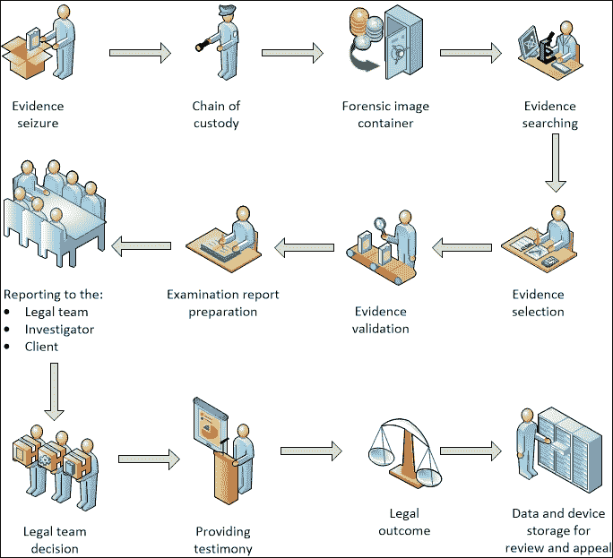

我的数字取证检查模型

以下子章节描述了证据搜索和选择的过程。

# 定位数字证据

从普遍存在的大型数据集中定位证据需要过滤掉多余的材料，直到最近，这主要是一个手动任务，需要从大量无关信息中筛选出有价值的部分。但重要的是清理繁忙操作系统和应用程序中的杂乱无章和噪音，因为只有少量的证据才真正需要提取。本节描述了实践者在寻找相关材料以协助调查时遵循的过程。

## 搜索过程

搜索过程包括在文件系统和文件内进行搜索；常见的文件搜索基于：

+   其名称或名称中的模式

+   内容中的关键词

+   时间数据（元数据），例如最后访问时间或最后写入时间

需要采取务实的方法进行检查，实践者需要创建一个关键词或搜索词的列表，从大量文件中提取特定的、具有证明力和案件相关的信息。ISeekDesigner 中的高级搜索词为实践者提供了高度的灵活性，以便定位证据，特别包括以下内容：

+   普通搜索

+   区分大小写的普通搜索

+   整词搜索

+   区分大小写的整词搜索

+   正则表达式搜索

+   不区分大小写的正则表达式搜索

+   通配符搜索

+   十六进制序列搜索

+   词首搜索

+   区分大小写的词首搜索

+   词尾搜索

+   区分大小写的词尾搜索

+   已禁用

哈希算法用于将文件的签名与包含恶意软件和儿童剥削材料的数据库进行对比。它还可以帮助在嫌疑计算机上定位与已知签名相符的文件。例如，尽管文件扩展名和名称被更改以隐藏伪造，但仍能通过使用文件内容的哈希值找到一个被伪造的文本文档，从而使得在一台计算机上找到并怀疑另一台计算机上的文件成为可能。

## 搜索桌面和笔记本电脑

下图显示了一台通过调制解调器连接到互联网的计算机终端。各种外围设备被连接：扫描仪、打印机、外部硬盘、闪存驱动器、存储设备、数码相机和手机。在办公室网络中，这将是一个更为复杂的系统。典型的家庭可能包括局域网以及各种用户和他们的数字设备。设备和互联网之间通过终端的连接留下了一系列的痕迹和日志记录，这些记录存在于终端、某些设备以及互联网中。电子邮件消息会在电子邮件服务器上被外部记录；打印机可能会保存打印任务的记录；外部存储设备和通信介质也会留下与终端相关的日志和数据。所有这些数据都可能有助于重构关键事件并提供与调查相关的证据：

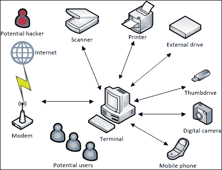

典型的单终端网络

如果我们查看存储在终端上的数据，可能是桌面电脑、笔记本电脑或上网本，可能会在那里找到相关数据的痕迹。在以下图示中，我们从**回收站**恢复了一个已删除的 MS Word 文档，内容是对另一个人的死亡威胁。

预定的受害者报告称收到了一封来自嫌疑人的电子邮件，附件中包含一个 Word 文档，嫌疑人的电脑随后被没收以供检查。在这个假设情境中（基于一个实际案例），实践者的任务是定位电子邮件和附件的证据。这一简单任务可能会揭示电子邮件文件和附件，但它可能只会找到消息的痕迹：

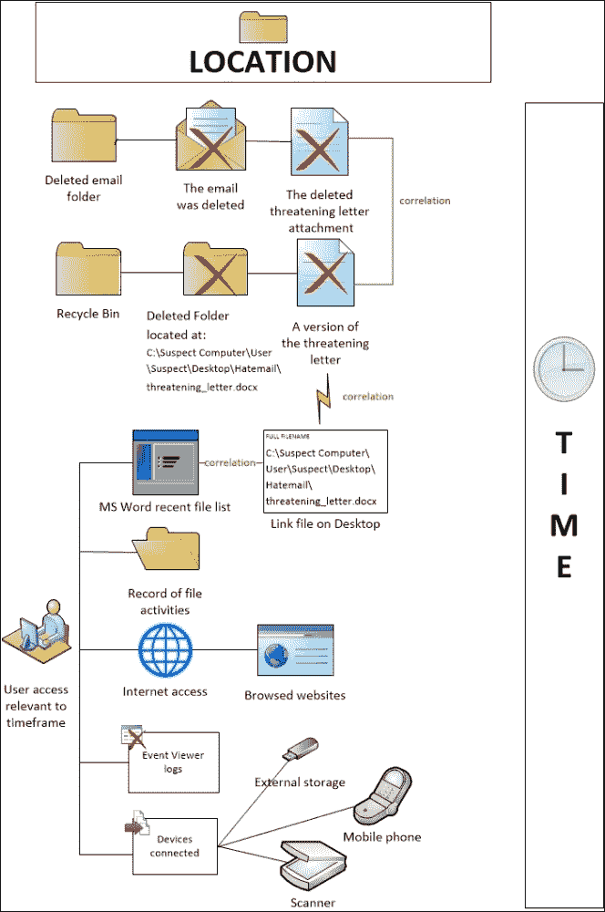

恢复的证据物证与其他物证之间的关系

### 注

时间戳元数据的异常也可能会使关键事件的重建更加复杂。

在这种情况下，我们有一封电子邮件，可能与记录事件的其他文件存在多种关系，这些事件似乎与电子邮件相关，并且在相关的时间范围内。通过这个恢复的文件，可以基于相关的时间戳和附加文件的位置重建时间线。这将有助于更全面地选择有用的信息，以帮助分析证据链。接下来的证据选择小节将详细讨论这一点，但首先，实践者需要知道在哪里寻找有用的线索。

从这个简单而常见的情境来看，请注意文件并非孤立存在。存在相关的信息应该被定位——并且位于与电子邮件消息的创建和传输对应的时间段内。首先，寻找与电子邮件消息相关的其他信息是很有帮助的，这些信息可能有助于澄清：

+   消息创建和发送的时间

+   是否是在嫌疑人的计算机上创建并发送的

+   附件的创建位置

+   附件创建时间

+   创建该 Word 文档的用户身份

先前的图示突出了看似相关的事件，这些事件是基于已删除的文件和创建或修改这些文件的应用程序，这些事件如下：

+   被删除的电子邮件文件夹包含了被删除的电子邮件和附件

+   回收站包含了一个已删除的文件夹以及先前位于计算机桌面上的威胁性 Word 文档的已删除版本

+   Word 文档文件包含了与文件先前位置及其记录作者相关的元数据

+   链接文件（或跳转列表日志）指的是之前位于桌面上的同名文件在此文件夹中的位置

+   微软 Word 已安装，并且在最近的文档日志中显示了具有相同名称的文件的创建和修改记录

在计算机上创建、修改、传输或存储的文件通常会留下链接的痕迹，记录文件在设备上的存在。这些链接常常包含元数据，如作者、文件位置和时间戳，这些都可能有助于事件重建，并且它们确实有助于定位这些链接。以下截图展示了**文件资源管理器**窗格中的**快速访问**功能。在这个示例中，显示了计算机用户经常访问的文件夹。截图展示了文件夹和一个单独的文件，这是典型的默认设置。通过启动设备的取证镜像，可以轻松观察到这一点，并且不会污染原始设备上的证据：

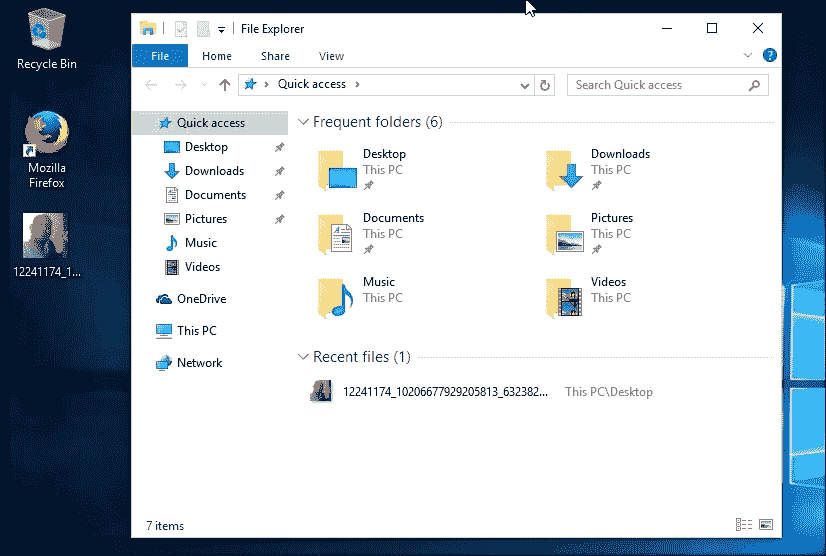

Windows 10 快速访问功能

然而，这些数据自 Windows 7 发布以来就存储在跳转列表文件中，旨在帮助用户快速便捷地访问存储在计算机不同位置的文件和应用程序。在设备的物理检查过程中，可以通过 Windows 注册表访问跳转列表的详细信息，路径为`HKCU\Software\Microsoft\Windows\CurrentVersion\Explorer\Advanced\Start_JumpListItems`。

这些 Windows 专有文件，被称为**对象链接和嵌入（OLE）**，用于嵌入和链接文档及应用程序，以便快速检索，通常位于 Windows 10 的文件夹中，如`C:\Users\LCDI\AppData\Roaming\Microsoftg\Windows\Recent\`。

跳转列表被分为两个目录：

+   **AutomaticDestinations**：这些是由操作系统和其他默认应用程序创建的，包含`DestList`流，记录最近或最常使用的文件。

+   **CustomDestinations**：当用户将应用程序固定到任务栏或**开始**菜单时，会创建这些文件，例如，在 Windows 10 中。

仔细分析这些文件有助于确定文件被访问的次数和具体日期。以下截图显示了任务栏上 Microsoft Word 的跳转列表，列出了固定文件和最近访问的文件：

显示最近使用的文件的 Word 文档跳转列表，位于任务栏上的应用程序

下一张截图展示了一个 Word 文档文件，提供了文档的一些背景信息、创建和最后修改日期、作者及文件位置——这些都是有助于事件重建的潜在有用证据，如果你知道在哪里查找：

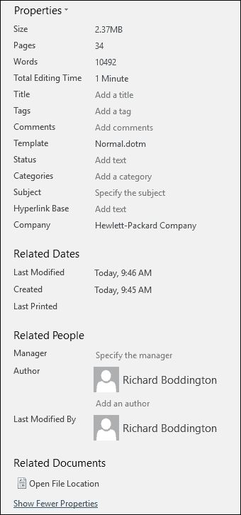

存储在 Word 文档中的文件元数据

以下截图显示了同一页面中的一个小菜单标签，允许检查文档以搜索隐藏的属性或个人信息。该工具查找可能包含不可见信息或已被格式化为不可见的嵌入文档：

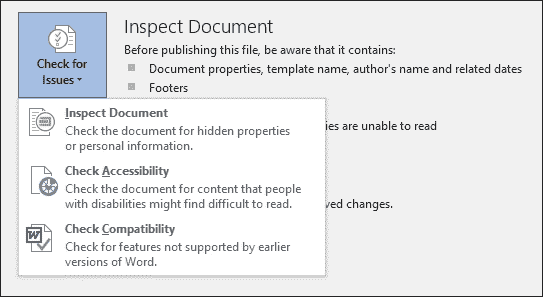

文档检查菜单

文件，在此示例中是 Word 文档，可以通过打开**相关文档**标签页找到，如下所示：

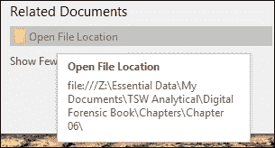

**相关文档**标签页–查找 Word 文档的文件夹位置

重要的是要确定计算机上的其他活动是否能够识别特定用户在创建和发送电子邮件及附件时的身份。例如，前面的截图表明了恢复的证据与相互验证的证据之间的关联。关键是要证明在相关时间段内发生或可能发生了这些附加事件。Windows 10 有大量指向频繁和最近使用文件的链接，如下面截图中的智能屏幕功能所示，其中显示了指向 Yahoo! Mail 帐户的链接和一些最近访问的网站：

启动表单显示常访问网站的列表

使用逻辑检查过程（启动镜像），我们可以看到，在下面的截图中，曾在计算机**桌面**上的一个已删除文件被放入了**回收站**。右键单击文件可以看到文件的创建和删除日期：

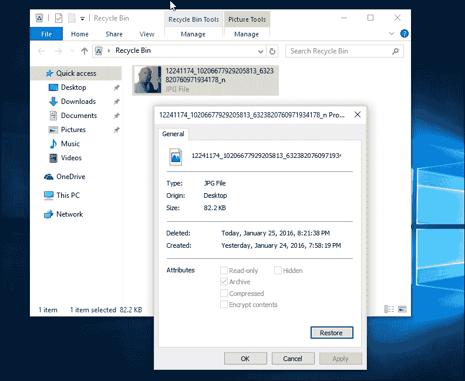

以下截图显示了 Mozilla Firefox 浏览器历史，列出了许多访问过的网站。此功能在大多数浏览器中作为默认设置启用，但如果用户选择了隐身模式浏览，则会停用该功能，以避免留下历史日志：

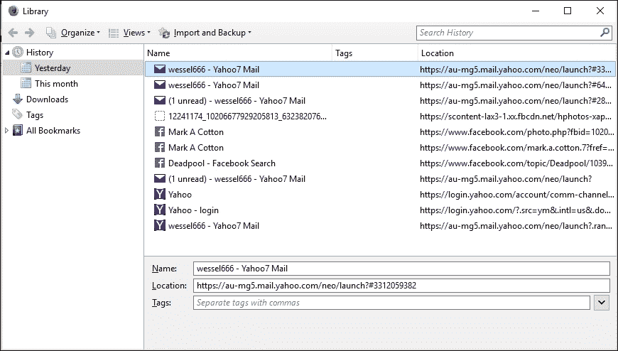

Mozilla Firefox 浏览历史

这张截图显示了从 IE 浏览器历史中恢复的类似历史列表：

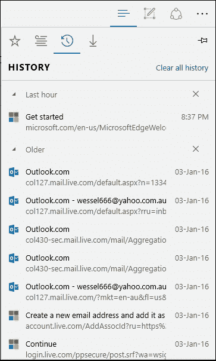

IE 浏览器历史

有时可能无法启动取证镜像并以其逻辑格式查看，这种格式对于用户来说更容易理解且更为熟悉。然而，以取证镜像中的物理形式查看数据，可以提供未更改的元数据和文件，这些数据和文件提供了关于应用程序和文件的准确信息。具体来说，正如下面的截图所示，可以查看存储在取证文件容器中的历史记录和搜索记录容器：

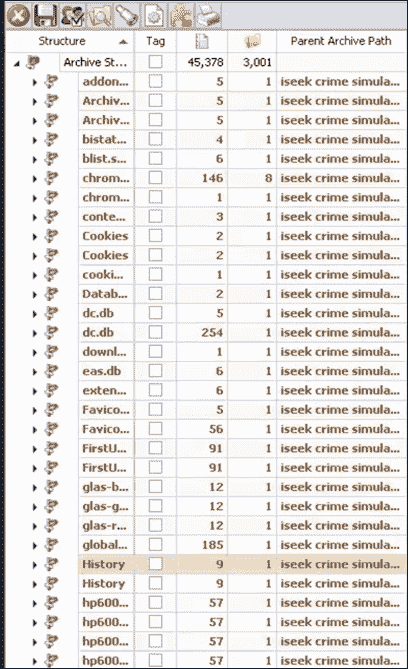

恢复的容器列表，包括浏览器历史数据库

ILookIX 已经恢复并解构了容器，显示了其内容，如下截图所示。此情况下的内容是电子表格（`.CSV` 文件），可以使用 ILookIX 查看或导出以供进一步分析，并在审判中作为证据呈现。文件和文件夹的路径以及在成像时的时间戳也已列出。以逻辑环境查看文件的缺点是，启动和使用各种应用程序的过程会改变元数据。

即使图像是写保护的，任何此类更改也是非持久性的，显示的视图也显示了当前对元数据的修改，并删除了原始时间戳。例如，最后访问的日期将在文件被打开后更改为当前查看文件的时间：

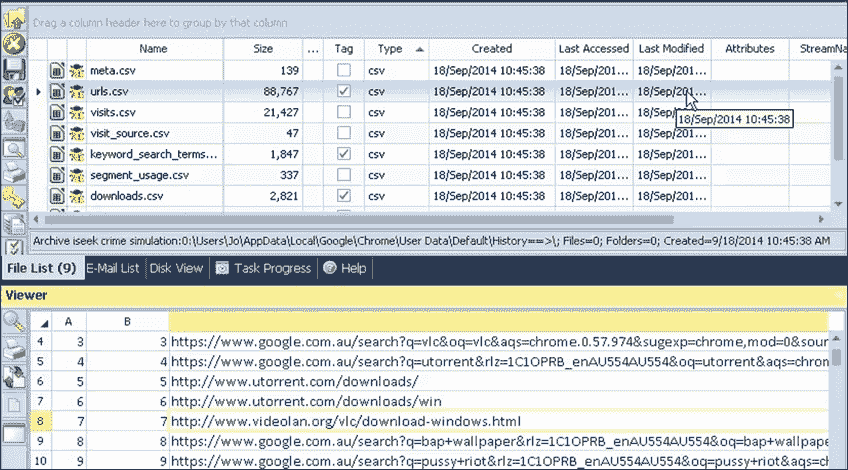

从浏览器历史记录数据库中提取的电子表格和内容列表

执业者应该了解违规行为的性质以及一些关键“角色”。案件可能集中在电子邮件或聊天消息上，或者可能与嫌疑人的浏览活动等相关。如果在检查 Skype 通信时，定位记录聊天日志的数据库文件非常有帮助，通常这些是 `.CSV` 电子表格文件。该文件是 `main.db`，通常位于特定用户的目录文件夹中。

这里显示的简短摘录提供了使用的 Skype 账户名称、每条消息的时间戳以及内容的详细信息：

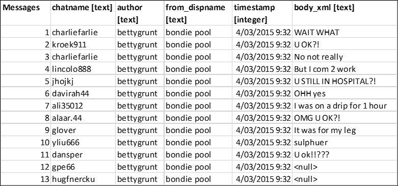

从 Skype 数据库提取的消息对话电子表格——经过严格筛选

明智的做法是假设账户的使用者不一定是账户的所有者。要确认当时使用应用程序的人的身份，可能需要一些有力的佐证。例如，用户的身份可以通过设备与其他数字设备的三角定位来确认。这可以通过追踪用户的手机数据来实现，证明手机与用于与他人通信的计算机处于相同位置。

其他案件涉及恢复在通信中披露的个人信息，这些信息已被记录在对话日志中，只有通信者或少数亲密的朋友或亲属知晓。用户的身份可以通过在相关时间见证用户操作键盘并在计算机显示器上观察 Skype 通信的其他人在场人员来确认。Skype 及其他消息系统，如 Kik 和 Whatsapp，是潜在的丰富信息来源，这些信息可能存储在计算机和手机中。视频片段、图片、音频、文本和语音通话都可能与这些广泛使用的应用程序相关联。

下一张截图显示了从 MacBook Air 中恢复的电子表格，其中提供了交换消息的详细信息以及涉及的用户帐户名称。**MediaDocuments**文件提供了两方对话中交换的非法图片的详细信息，这些图片后来从回收站中恢复出来：

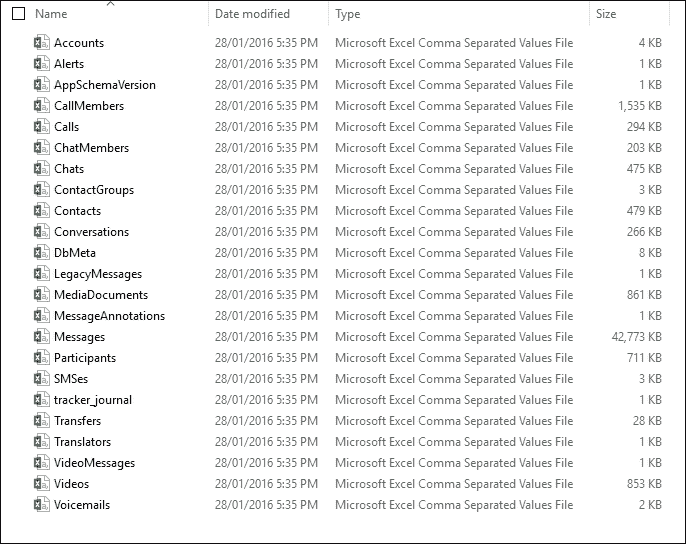

从 MacBook Air 中提取的 Skype 数据库中的电子表格

# 选择数字证据

审查过程的下一个阶段是选择并分析将成为法律案件一部分的证据。对于不熟悉调查的人来说，错误解读现成证据并得出错误结论是很常见的。商业经理在分析他们认为的案件事实时，明智的做法是寻求法律帮助，选择并评估他们可能希望作为案件基础的证据。

选择证据，通常称为分析阶段或事件重建阶段，涉及对已找到证据的分析，以确定系统中发生了哪些事件以及这些事件对案件的意义和证明价值。选择分析阶段要求执法人员仔细审查现有的数字证据，确保他们不误解证据并在没有仔细核对信息的情况下做出轻率的假设。这是一个事实发现过程，旨在构建一个合理的事实重建。与调查和法律团队合作，以确保选择相关且具有证明力的信息，可能是一个便捷的做法。

与传统犯罪调查类似，执法人员应寻找表明或暗示嫌疑犯的*动机*（为什么？）、*手段*（怎么做？）和*机会*（何时？）的证据。在依赖数字证据的案件中，确定这些因素可能是一个棘手的过程。然而，执法人员需要意识到，在寻求明确犯罪的三个基本要素时，同时保持中立和冷静，对嫌疑犯是否有罪保持不偏不倚。

## 寻求真相

在调查过程中，执法人员的主要角色之一是寻找支持初步假设的证据，但同样重要的是寻找反驳假设的证据。这也被称为**无罪证据**。需要强调的是，出于公正的考虑，即使是最处于困境中的执法人员也必须始终牢记这一要求，并在任何情况下遵守它。

执法人员寻求定罪，常常专注于选择最容易获得的证据。这被称为挑选“低垂的果实”，是一种选择性、偏向性的做法，有时会导致发现一些可能挑战其他证据的重要证据。任何值得在法庭上提出案件的检察官，都会寻找控方案件中的弱点，主要作为防止反击的策略。为了确保公正，控方所获取的与案件相关的所有证据必须与对方共享。对于辩方来说，是否需要回应这些证据在不同司法管辖区之间有所不同，依据的是对抗性法院程序——即控方必须证明被告有罪，而不是被告需要证明自己的清白。

审判日益依赖数字证据，并且已有记录表明无辜者被定罪，因此需要高度确认证据的有效性。更多细节可以在第九章中找到，*验证证据*。

在此过程中需要有一定的秩序，而不是采取随意的方法。重要的是定义所搜索证据的一般特征，然后在数据集合中寻找相关对象。例如，如果正在搜索图像文件，比如 JPEG 文件，调查员会寻找所有扩展名为`.jpeg`的图像文件。在前面提到的涉及恢复含有非法图片的 Skype 聊天消息的案例中，附件被保存后删除，最有可能是为了防止被发现。在下一张截图中，恢复了从用户受保护和隐藏文件夹中删除的 PNG 格式图片样本。由于文件名包含每个文件保存到 MacBook Air 时的日期和时间，它们被轻松识别。这些时间戳与聊天消息日志相关联，用来更全面地重建这些通信。这是一个间接但有力的关系，为此案的公正结果提供了重要支持：

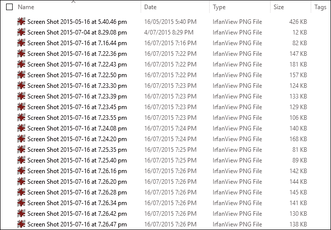

从嫌疑人隐藏文件夹中恢复的图片截图

随着调查的深入，调查员会发展出关于犯罪性质和可能嫌疑人的各种假设。调查员寻找能够支持或反驳有关事件假设的数据。例如，时间戳在大多数系统中可能会被更改；因此，寻找日志条目、网络流量和其他与嫌疑计算机相关的内外部事件是非常有帮助的。然后可以使用这些信息来三角定位与整个调查相关的数据的准确性和可靠性。

对证据的审查涉及使用可能大量的技术手段来寻找和解释重要数据。这可能需要以保持数据完整性和潜在有用性的方法修复或恢复损坏的数据。执业者必须时刻意识到，证据能够将假设与毫无根据的断言区分开来——它可能证实或驳斥一个假设。因此，可靠性和完整性是其在法庭上可接受性和权重的关键，且在选择过程中必须加以重视。

潜在嫌疑人往往过多，而将某个嫌疑人与犯罪事件联系起来并不总是像看起来那么直接。下图展示了一个典型的家庭网络设置，使用 Wi-Fi 连接家庭调制解调器，从而连接到互联网。在这个真实案例中，父母为自己和另外三名家庭成员提供了宽带服务。一个孩子的朋友在孩子的电脑上完成了大学作业，并将他们的 iPad 同步到孩子的设备：

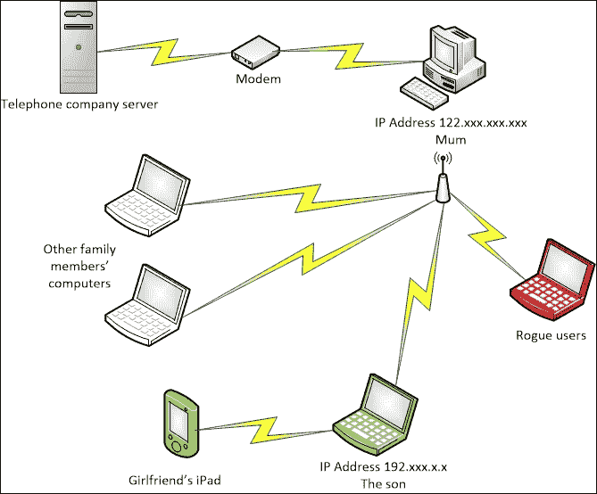

一般家庭网络的复杂性以及确定犯罪者身份

这个场景容易被利用，因为其他家庭成员和朋友在访问住宅时可以不受限制地访问孩子的电脑，并通过这些设备接入互联网。Wi-Fi 连接也容易被劫持，外部恶意攻击者能够访问并控制这个小型本地网络。假设某台设备包含犯罪数据，必须提出的问题是：它是如何进入的？是谁放在那里？可能的动机是什么？

对于传统的犯罪行为，犯罪行为或事件通常是显而易见的——有尸体、有盗窃，或者至少有可以处理的投诉，通常还会有一份潜在嫌疑人的名单，依据这些标准：

+   谁认识受害者？

+   谁曾物理接触过现场？

+   谁有动机？

例如，互联网可能会根据连接情况提供超过 7 亿个潜在嫌疑人。在这种情况下，不应假定持有含有犯罪数据的电脑或其他家庭成员是唯一的嫌疑人。显然，这是一个自然且直观的假设，但如果能证明其他人在相关时间内也能接触到该终端，这一假设就会变得危险。

在选择过程中，有时很难确定犯罪行为。以下是一些例子：

+   在网络犯罪中，事件的性质通常不那么明显且立即显现

+   如果黑客窃取了机密信息，受害者可能根本不知道被盗了哪些内容

+   受害者通常依赖系统管理员来获得信息

+   管理员可能直到事件发生很久之后才会发现——如本章最后的案例研究所示

+   身份盗窃诈骗是增长最快的金融犯罪，可能需要多年才能被揭露。

从业人员在选择证据时还应考虑其质量，并注意数字证据通常是间接的，且往往涉及大量可能与调查无关的数据审查。除非有充分的证据支持，否则它很少能单独提供足够的证据来证明罪行或无罪。

下一节将介绍有助于证据选择过程的新兴工具。

# 更有效的取证工具

有多种取证工具可以帮助从业人员选择并整理数据以进行审查、分析和调查。即便是个人电脑的混乱数据，也可能是一个耗时且复杂的排序过程。随着数字取证领域的发展，更好、更可靠的取证工具正在不断开发，以帮助从业人员从更大、更复杂的数据集中定位、选择和整理证据。需要指出的是，许多情况下涉及的不止一台设备，这些设备也需要进行审查。这无疑增加了整体取证检查的挑战。

以下小节展示了如何通过一系列管理过程来组织数据。

## 分类文件

在不同程度上，大多数用于查看和分析取证镜像或附加设备的数字取证工具都提供了有助于定位和分类与审查相关信息的用户界面。

提供文件访问和便捷查看的最先进应用是 ILookIX 中的**类别浏览器**功能，如此截图所示；它通过**类型**、**签名**和**属性**来划分文件：

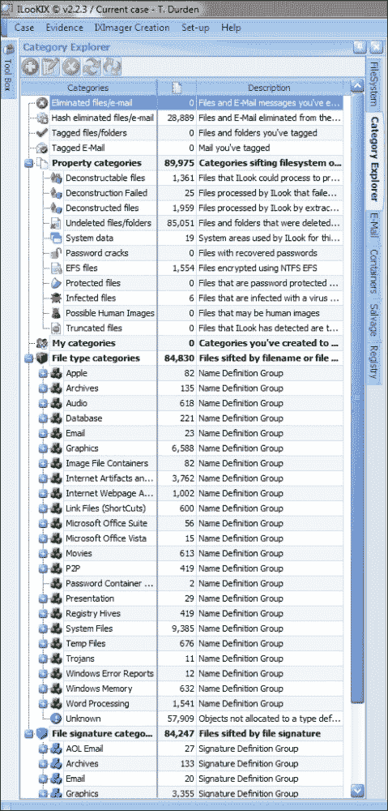

ILookIX 类别浏览器

**类别浏览器**还允许从业人员创建自定义类别，称为**我的类别**，以按相关性对文件进行分组。例如，在涉及阴谋的刑事调查中，从业人员可以为第一名嫌疑人创建一个类别，为第二名嫌疑人创建一个类别。在审查文件时，它们会被添加到一个或两个类别中。与标签不同，文件可以添加到多个类别中，且类别可以使用描述性名称。

要将文件或文件组添加到分类中，实践者可以按需选择一个或多个文件在**文件列表**中。选择**保存选定文件到分类**按钮后，将弹出**我的分类**窗口。以下截图显示了当前所有现有的分类（包括在初始案件创建过程中创建的分类）；审查员可以选择添加新的分类或删除冗余的分类。在此截图中，选定的要加入分类的文件是 Skype 消息文件。**我的分类**文件夹可以方便地在**分类资源管理器**窗口中查看和访问，允许实践者选择、编辑、取消选择，并在案件准备过程中将文件导出：

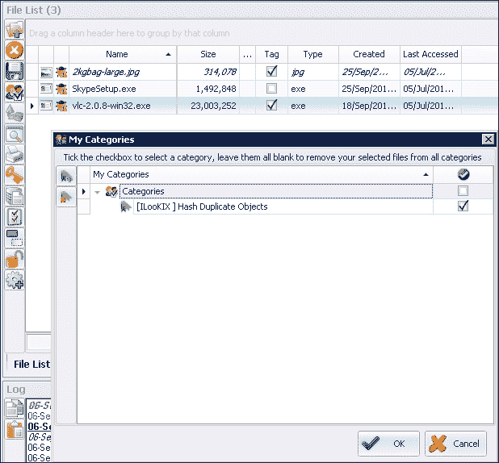

ILookIX 我的分类功能

在证据选择过程中，常常会找到一些令人垂涎的信息，但后来忘记了它们的具体位置，导致花费大量时间试图重新找到它们并跟进可能提供的重要线索。将可能相关的文件添加到应用程序中的不同容器中，可以减少不必要的重复操作。它还为实践者提供了将有趣的片段信息进行分类以便未来分析的机会。这避免了在选择过程中因过早关注可能分散注意力的有趣线索而影响到对关键证据的正式搜索。

## 消除多余的文件

在大量位于计算机上的文件中筛查证据的前景，可以与“无法看见森林中的树木，更别提看到任何木材（证据）”相提并论。计算机通常会存储相同文件的重复、三重或更多版本，这些文件往往散布在系统中的各个隐蔽角落。没有内容或零长度的文件也增加了杂乱；通过隐藏这些文件来消除它们，可以显著减少需要手动或通过自动化应用程序搜索的文件数量。

以下截图所示的 ILookIX **数据减少**功能，可以将文件从视图中消除，但这些文件并未被销毁，可以随时返回案件中。当文件处于已消除类别时，它们将不会出现在任何列表中，且诸如索引、哈希和搜索等处理将不会对其进行。ILookIX 允许通过多种方式消除文件。这些方式包括运行哈希消除或哈希去重处理，或根据文件类型或路径手动消除文件。文件消除通常用于在处理前从映像中移除文件以加速处理，也可用于抑制重复文件。哈希去重可在审查前使用，确保审查员仅获得每个感兴趣文件的一个副本，而不是多个不同名称下的相同副本：

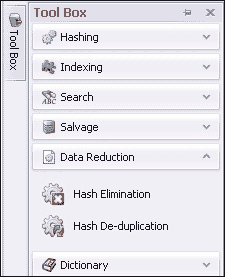

ILookIX 数据压缩功能

ILookIX 的**哈希集管理器**允许检查员审查加载的哈希集，并确定每个哈希集是否用于文件删除、哈希搜索或两者兼有。其**哈希删除**功能将案件中所有已哈希的文件，与选择用于删除的哈希集的所有哈希值进行比较，并将匹配的文件转移到**哈希删除文件/电子邮件**类别。**哈希去重**功能会将案件中所有已哈希的文件，与它们的哈希值进行比较，并将每个文件保留一份，其他重复的文件移至**哈希删除文件/电子邮件**类别。

一旦文件进入此类别，它们将不再出现在任何文件或电子邮件列表中，除非检查员选择**哈希删除**类别来查看文件，或者选择某个文件并恢复该文件。

## 解构文件

**可解构文件**是复合文件，可以进一步拆解为更小的部分，例如电子邮件、归档文件、缩略图存储和其他文件。一旦解构完成，这些文件将被分类为解构文件或解构失败文件。ILookIX 内置的文件解构功能允许实践者在处理图像或附加设备时解构各种复杂的文件，如下所示：

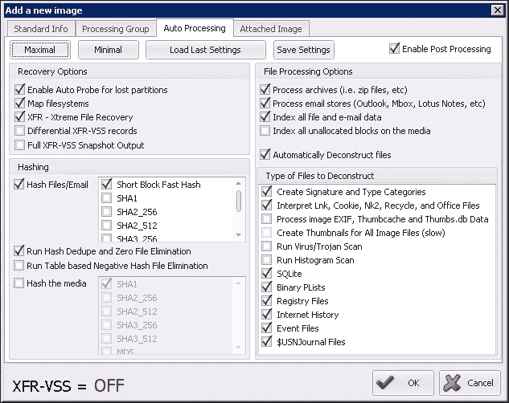

ILookIX 数据解构功能

### 注意

文件解构涉及处理复合文件，如归档、电子邮件存储、注册表存储或其他文件，从复杂的文件格式中提取有用的可用数据并生成报告。手动解构会显著增加完成检查所需的时间。

## 查找文件

根据映射的镜像类型和所选选项，可能需要相当长的时间才能将数据提供给检查员。最耗时的选项包括哈希、索引和恢复。根据检查的目的，应该权衡这些活动所消耗的时间与未来节省的时间。例如，哈希处理可以显著减少检查员需要审查的多余文件数量。索引则在需要进行多次关键字搜索的几乎所有检查中节省时间。

### 注意

索引是将数据块编目处理的过程。它是生成文本字符串表的过程，这些表可以几乎即时地进行多次搜索。

索引的两大主要用途是创建密码破解时使用的字典和为几乎即时搜索索引单词。索引在创建字典或使用 ILookIX 内置的任何分析功能时也非常有价值。ILookIX 支持在初始处理时一次性对整个媒体进行索引，也可以在处理后进行。索引有助于搜索文件和归档、Windows 注册表、电子邮件列表以及未分配空间。此功能可以通过设置选项进行高度自定义，并可以针对搜索优化或创建用于密码破解的自定义字典。

声音索引确保快速和准确的搜索。搜索是查看证据中特定项的过程，如一段文本或一个表达式。在搜索中，表达式是用于结构化数据的模式，例如信用卡号或电子邮件地址。ILookIX 提供了全面的搜索范围，包括关键字搜索，简单地查找磁盘上特定字符。

这种类型的搜索如果不先将复合文件解构为其组成部分，则会遗漏复合文件中的文件，即 PST 中的邮件或压缩文件中的`.docx`和`.xlsx`文件。已索引的搜索非常快速可靠，因为先前的索引过程消除了对整个驱动器或镜像进行重复和耗时的搜索的需求。

ILookIX 的**搜索历史**视图显示了案件中进行的所有搜索的历史记录，并允许调查人员将任何历史搜索的结果在稍后的时间发送回 ILookIX 的**列表窗格**，如下一张截图所示。本节后面将展示搜索结果和找到的文件示例：

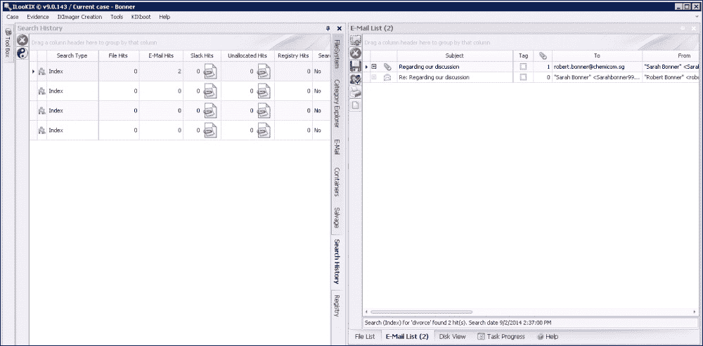

ILookIX 列表窗格显示各种搜索结果

## 事件分析工具

ILookIX 的**事件分析**工具为实践者提供了主题系统事件的图形化表示，如下所示：

+   文件的创建、访问或修改时间

+   发送或接收的电子邮件

+   其他事件，如 NTFS 系统上的主文件表修改

图表本身显示了以下内容：

+   `X`轴上的时间（以月为单位）

+   `Y`轴上的项目数量

事件按事件类型进行颜色编码，每种事件类型的总数显示在该月事件的条形图上，如下所示：

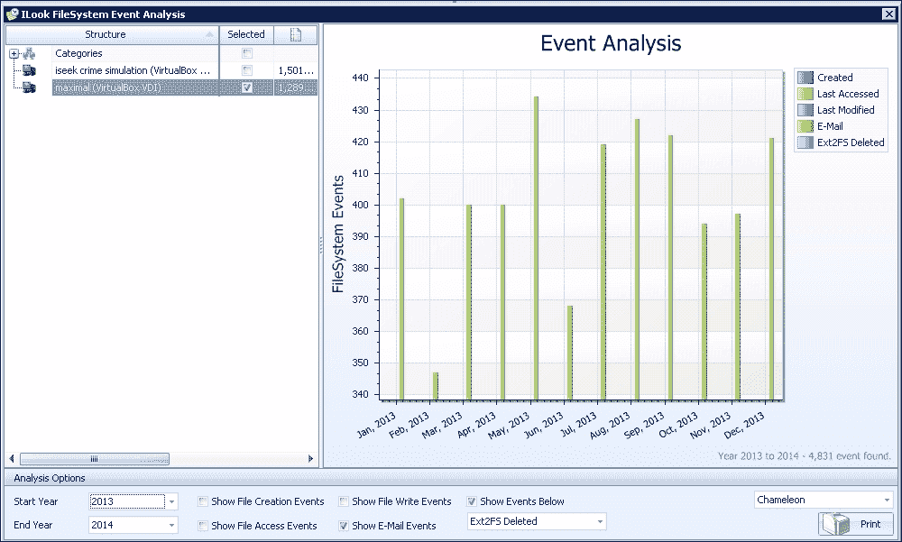

ILookIX 事件查看器显示选择日期之间的事件

该应用程序允许用户缩放图表上的任何点，以查看更具体的细节，如下所示：

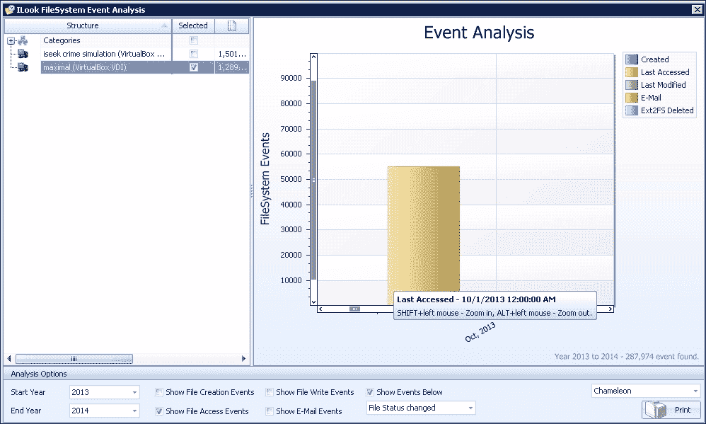

ILookIX 事件查看器显示最后访问的时间

在图表上的任何条形上单击左键，将返回主 ILookIX 窗口，并在**列表窗格**中显示所选日期条目的项目。以下截图展示了这种结果的一个示例。这对于分析特定时期的事件非常有帮助：

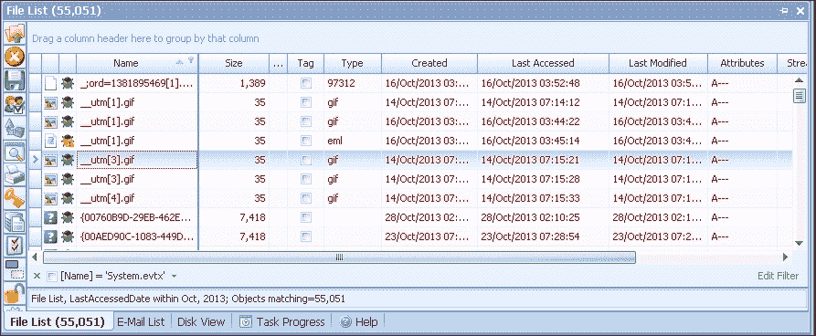

ILookIX 事件查看器显示提取的文件以供审查

## 云分析工具

嵌入在 ILookIX 中的**云分析**工具是一个视觉化表示，展示了单个词汇在案件中出现的频率。分析基于当前的索引数据库，因此在进行分析之前，执业人员必须先对案件数据进行索引。该分析以数据云的形式呈现，去除了底层分析的复杂性，并为执业人员提供了一个易于理解的分析图像。

在**云分析**查看器的右上角部分，如下图所示，有一个**高亮列表**，帮助将案件中的词汇组织成易于记忆的类别。这样，分析结果能够立即引起执业人员的注意，无需额外努力去查找：

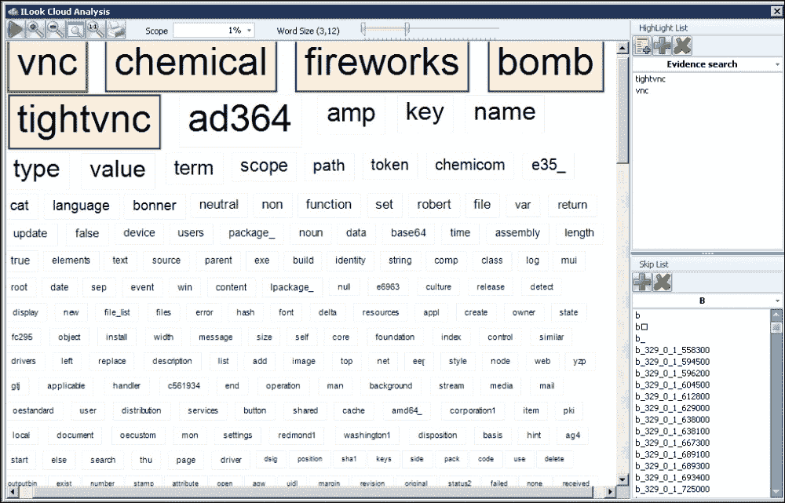

ILookIX 云分析正在搜索相关术语

**云分析**具有多个功能，旨在简化分析过程并将与案件相关的数据呈现出来。由于它是基于索引数据并且只需要简单点击就可以启动，功能问题是唯一需要描述的问题。由于生成的显示是一个交互式图示，用户可以通过逐个左键单击词汇来与选择项进行交互。然后，可以通过双击该词语来启动对该词汇的搜索。

在下面的示例中，选择的搜索词是**烟花**：

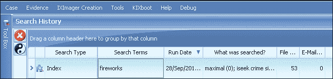

"烟花" 词语的云分析搜索结果

选择该搜索历史记录条目将显示包含该术语的所有对象的文件列表响应，如下图所示：

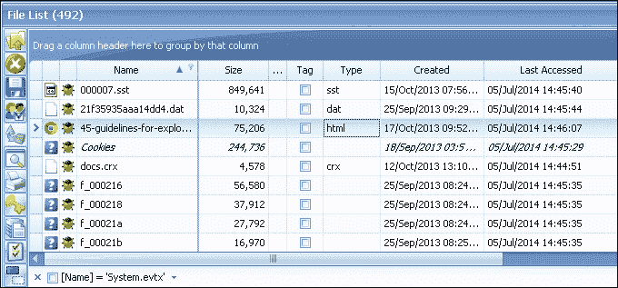

"烟花" 词语的搜索结果

## 领导分析工具

**领导分析**工具是一个嵌入在 ILookIX 中的交互式证据模型，允许执业人员将已知事实汇总为图形化表示，直接关联未见对象。它提供了答案，随着执业人员增加设计表面的细节，特定的关系也将呈现出来，否则这些关系可能被忽视。

**引导分析**的主要目的是帮助发现案件数据中那些可能不明显或直观的链接，且实践者可能没有直接意识到，或者缺乏相关背景知识来帮助手动建立这些关系。与其找出并记下各种信息，不如通过易于使用的链接模型展示分析结果。建模的复杂性被去除；我们得到了最清晰的发现方法。分析基于当前的索引数据库，再次提醒，进行分析前必须先对案件数据进行索引。

应用程序界面初始时会是空白的，如下图所示。分析对话框的中心是画布：这是证据链路的主要建模区域。左侧是**引导对象**部分：这些对象可以拖到**画布**上，用于为分析设置起始点或手动建模连接。右上角是**潜在链接**列表。右下角是**跳过列表**。这是一个全局**跳过列表**，应用程序也会使用它：

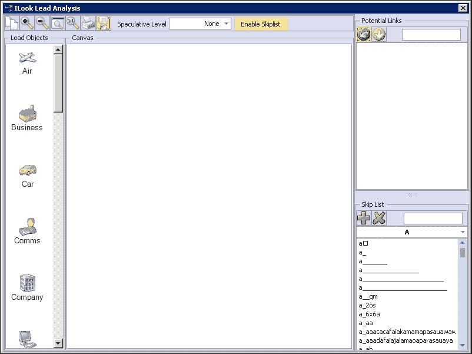

ILookIX 引导分析

第一个任务是陈述一些关于案件的事实，并以这些事实作为分析的起点。这些事实可以通过在画布上建立起始点来陈述，方法是将**引导对象**从“引导对象”部分拖动到画布上。然后，用户可以选择一个代表相关信息或概念的引导对象，并将其拖到画布上。接着，点击该对象的文本标签，它会切换到编辑模式，并将默认文本替换为与该引导相关的内容，如某人的姓氏。右键点击头像，再点击**查找链接**，会列出与头像名称相关的词汇，如下所示：

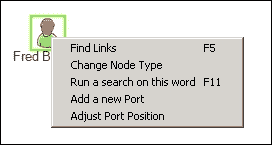

ILookIX 引导分析创建头像节点

一旦生成了潜在链接列表，就需要审查这些链接，看是否有潜在的相关链接。通过高亮显示相关链接并点击**潜在链接**的迷你工具栏上的绿色**链接转移**按钮，可以查看目录中是否包含这些链接。在以下截图中的示例场景中，找到了**离婚**一词，因为已知**Sarah**与计算机所有者（初步嫌疑人）离婚。通过左键单击某个词并点击绿色箭头将其与**Sarah**连接，如截图所示，可以揭示出一些在首次检查数据时并不明显的关系：

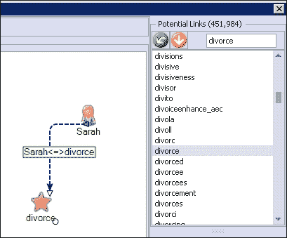

ILookIX 引导分析创建关系链接

一旦**Lead Objects**开始，就可以通过右键点击**Lead Object**并使用`Find Links`功能开始发现。如果存在任何链接，它们将显示在**潜在链接**列表中。如果没有找到链接，可能需要修改主对象的文本或从迷你工具栏的下拉框中增加**猜测级别**，如下所示的屏幕片段所示。在正常使用中，最好将**猜测级别**保持为**无**设置：

ILookIX Lead 分析设置猜测级别以搜索线索

每个已声明的事实都会成为画布上的一个起始线索。如果节点之间存在关联，可以通过手动将它们连接在一起来建模这种关系，方法是选择第一个要连接的**Lead Project**，右键点击并从菜单中选择**添加新端口**。然后对第二个要连接的**Lead Object**重复这一过程。通过简单地点击选定对象的新端口，将其拖动到应链接的**Lead Object**的端口上，一条连接两者的线将会出现。然后，可以使用每个起始节点或已发现节点反复执行此过程，直到能够理解整个案件数据。以下示例展示了嫌疑人、地点甚至概念之间的简单关系：

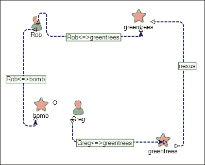

ILookIX Lead 分析发现各实体之间的关系

在更复杂的案件中，这使得从业者能够比手动搜索更有效地定位和分析关系。然后可以查看支持该模型的文档，以获取更多信息，正如以下截图中显示的文件命中数所示：

ILookIX Lead 分析发现的关系命中在**文件命中**（`448`）和**电子邮件命中**（`20`）中找到

以下截图展示了使用**Lead 分析**获得的部分关系命中结果：

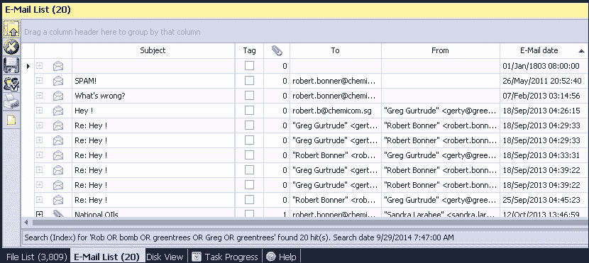

ILookIX Lead 分析发现的文件来自关系

## 分析电子邮件数据集

从大型电子邮件数据集中分析和选择证据是从业者的常见任务。ILookIX 的嵌入式应用程序**电子邮件关联分析**是一个交互式证据模型，旨在帮助从业者发现电子邮件数据中发件人之间的关联。该分析呈现为一个易于使用的链接模型；去除了建模的复杂性，提供了最清晰的发现方法。分析结果会在建模会话结束时保存，以便将来进行编辑。

必须理解的一个重要概念是 ILookIX 支持的所有电子邮件类型的同质性。所有电子邮件客户端的解构都成为相同基本浏览器电子邮件概念的一部分。这消除了客户端之间的差异，使得**电子邮件关联分析**等功能可以在一个新的、更易用的界面中进行分析和探索。这更容易解读复杂的电子邮件关系。它允许在向导案件加载过程中解构电子邮件，或者提供逐个或分组解构的选项。无论哪种方式，界面都提供了一个对象模型，涵盖了所有互联网电子邮件项目的特性，使用适用于所有互联网电子邮件发送/接收客户端的 RFC 标准。

如果需要处理大量电子邮件，则生成分析可能需要几分钟。为了使分析结果更易读，在首次使用该工具时，建议只选择一个或几个电子邮件存储进行分析。一旦生成分析，用户将看到电子邮件之间的联系。此时，可以看到通信者之间的线条，表示他们之间有某种关系。特别是，线条的粗细表示两个通信者之间的通讯频率，因此，较粗的流线表示更多的通讯。

该应用程序允许通过点击其名称旁边的复选框来选择电子邮件存储。在画布上，一旦分析生成，用户可以通过左键点击选择任何电子邮件收件人节点。创建分析非常简单，其中一个最直接有价值的资源是群体识别，如下所示的截图所示。ILookIX 将启动对该收件人的搜索，并列出所有该收件人参与的电子邮件。用户可以通过点击收件人节点并拖动到另一个节点来创建自己的连接线。节点可以被删除，从而允许在较小的群体之间建立联系：

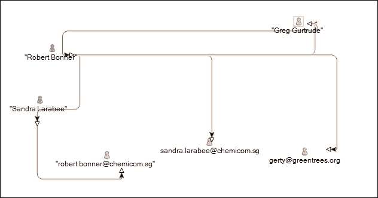

电子邮件关联工具显示与案件可能相关的关系

## 检测扫描图像

搜索扫描图像是一个可以帮助文件认证或检测伪造文件的过程。它可以通过**ILookIX 检测扫描图像**应用程序完成。结果可以在**类别浏览器**中查看，如下所示的截图。第三章，*数字证据的性质和特殊属性*，以及第五章，*需要增强法医工具*，中的案例研究包括了对扫描文件证据的搜索：

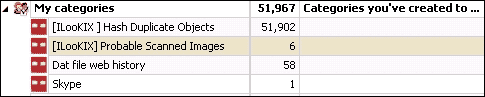

ILookIX 类别浏览器中可能的扫描图像列表

扫描文档也显示在**文件列表**查看器中，如下图所示：

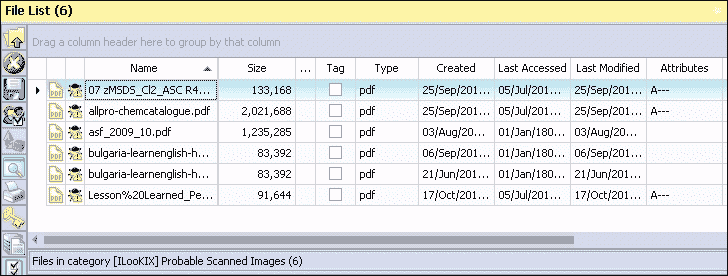

显示与案件可能相关的关系的电子邮件关联工具

## 卷影副本分析工具

卷影副本，也称为**卷快照服务**（**VSS**），是一项创建文件时间点副本的服务。该服务内置于 Windows Vista、7、8 和 10 版本中，并且默认启用。ILookIX 可以从卷影副本中恢复被覆盖文件的真实副本，只要它们在创建快照时已经存在于该卷上。VSS 恢复是一种从系统上可用的卷快照中恢复现存和已删除文件的方法。这是定位以前无法访问的数据以协助调查的宝贵资源，正如本章末尾案例研究所示。

与其他法医工具不同，ILookIX 能够在差异化或完全恢复模式下以可读结构重建 VSS 副本，包括 VSS 和已删除的文件和文件夹。无论哪种选项，都可以在工具的映像加载窗口中选择，如下图所示：

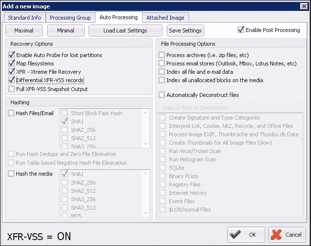

选择了差异化记录的 ILookIX 卷影副本快照工具

在下图所示的测试场景中，工具总共恢复了 87,000 个文件，等同于传统工具的恢复率。使用 ILookIX 的**Xtreme 文件恢复**，恢复了约 337,000 个文件。**最大完全卷影副本快照**应用程序恢复了总计 778,000 个文件。通过差异化过程，恢复了 354,000 个文件，这过滤出了 17,000 个额外文件以供进一步分析，如下图所示。这使得电子邮件消息和附件以及 Windows 注册表的更改得以检测到，这些通常是隐藏的或难以找到的：

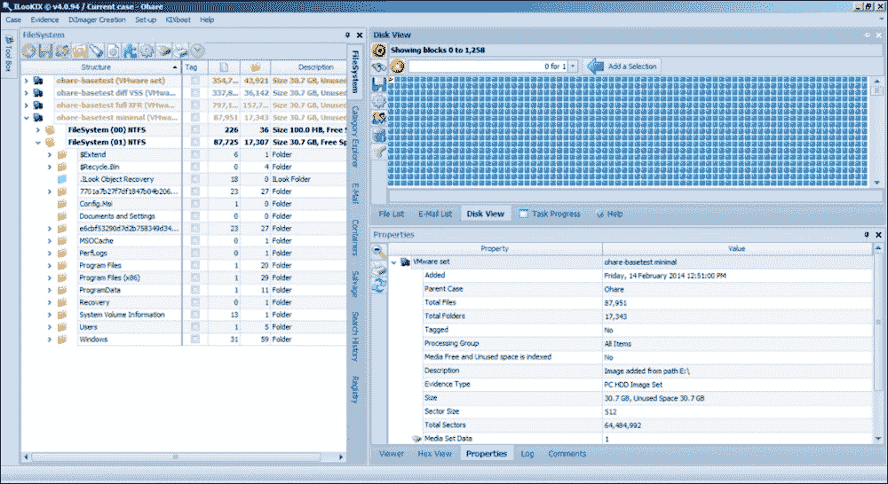

显示不同搜索结果的 ILookIX 卷影副本快照工具

差异化 XFR-VSS 记录仅报告那些在每个记录之间有差异（即使是一个文件）的 VSS，以加速证据材料的识别。删除的快照被恢复并进一步解构，从原始 30GB 硬盘中恢复了超过一 TB 的压缩数据——信不信由你！

## 时间线和其他分析工具

时间线通常用于重建给定时期的事件顺序。然而，它们可能变得过于密集，并且覆盖很长时间段，因此需要考虑制作更具可读性的图表。例如，整体重建可以通过简单、简洁的图表来展示关键事件等。每个主要事件节点可以作为单独的图表展示，并与相邻事件有所关联。

以下图示展示了一起涉及两名嫌疑人和一些电子交易及电子邮件的真实银行诈骗案件的简单重建：

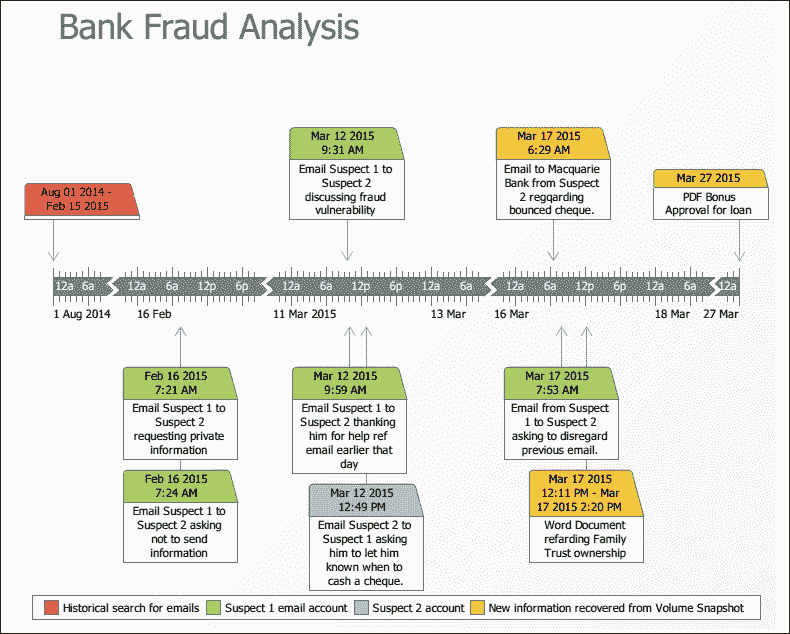

使用 Timeline Maker Pro 制作事件时间线

时间事件图表旨在纠正这些不足，流程图也有助于解释复杂的过程。当遇到一个复杂的方案或一个不熟悉的过程时，流程图有助于事件的可视化。

这些模型超出了本书的范围，但值得作为任何从业者分析工具包的一部分进行融入。

# 案例研究 – 说明如何恢复保存在卷影中的已删除证据

该案例研究涉及一家新兴企业，为一系列矿业勘探公司提供专业技术服务。该企业失去了多名技术专家，这些专家转投了一家竞争对手公司，且企业的市场份额出现下滑。人们怀疑离职的员工可能窃取了一些专有知识和技术，并随后将其分享给了竞争对手。一项对企业服务器及离职员工使用的计算机终端的法医检查被启动，以确定是否发生了某种形式的工业间谍活动或破坏行为。

除了 CEO 的直觉认为可能有不正当行为发生外，几乎没有其他线索，便对前员工的计算机终端和外部存储设备进行了搜索，以寻找可能的不当行为证据。从逻辑上讲，员工的电子邮件被认为是一个不错的起点，但检查仅恢复了他们对公司不满和蔑视的内容，以及计划跳槽到竞争对手的消息。然而，电子邮件确实提供了前员工与竞争对手公司联系人之间的联系细节，从中可以进一步发展出新的线索。

注意到一个 Dropbox 账户已被安装并使用在其中一位前员工的计算机上。该应用已被使用，并包含多个同步的文件夹，显然这些文件已上传到该员工的在线账户。大部分文件似乎是个人和社交性质的，且与调查无关。然而，有一个名为`Calibration.rar`的大型已删除的压缩档案文件，大小约为 4 GB，看起来是技术性质的。该文件在初步检查时无法打开，可能需要一些专业的恢复技术，前提是该文件没有严重损坏。

CEO 被告知文件的位置，并被询问文件的重要性以及 Dropbox 账户为何出现在该员工的终端上，这似乎是一个令人震惊的安全操作。该文件似乎是与业务操作至关重要的技术校准的基本记录，随后得知：

+   包含数据的文件夹在公司服务器上存储不安全，但在大约同一时间出现在员工的终端上时就已被移除。

+   服务器的安全性差，导致所有用户都能访问并可能破坏和窃取任何数据，且未记录事件。

+   除非能够恢复数据，否则公司面临严重的运营问题，可能会导致关闭。

看来档案文件夹是作为故意破坏行为被移除的，同时也导出了员工的 Dropbox 文件夹用于其他目的。随后对员工电脑进行了“深度清洗”，ILookIX 恢复了 12 个 VSS 文件夹，其中一个来自较早时期，提供了可读的档案文件副本。该文件未设置密码保护，CEO 检查后确认其中包含了对公司运营至关重要的丢失数据，且数据完好无损。文件在以下截图中突出显示，它是从 Dropbox 同步帐户中恢复的：

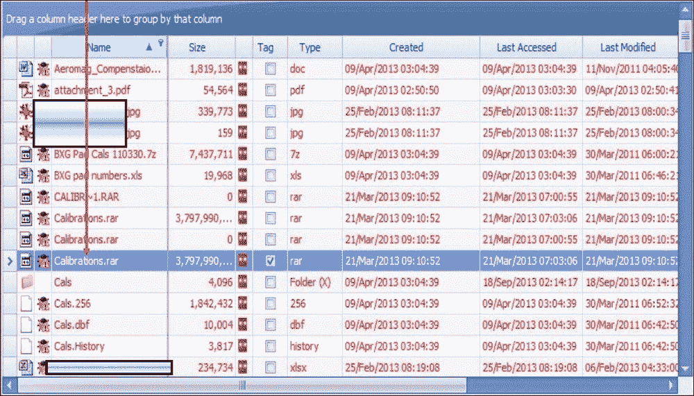

从存储在卷影快照中的 Dropbox 文件夹恢复的数据

虽然公司在短时间内成功找回了珍贵的数据，但关于公司未能保护其重要电子资产的以下几点仍需注意：

+   公司并未意识到档案丢失，若不是在检查过程中被恢复，几周内可能都无法得知其失踪情况。

+   服务器和终端没有密码保护，且没有有效的备份来保护和保存关键数据

+   数据访问管理未进行任何安全审计。

+   办公场所的物理防护措施不足，增加了公司整体的脆弱性。

+   网络管理员是 CEO 的朋友，且网络安全能力较差，是一个业余爱好者。

盗窃和恶意破坏电子信息的证据，以及针对前员工的民事诉讼证据已被确认。由于缺乏任何有效的信息安全管理系统，基于较少的信息进行有意义的搜索受到了阻碍，发现安全漏洞和恢复证据大多依赖于直觉。涉及恢复被盗数据和指向特定嫌疑人的证据的这种有利结果并不是常见的结局。令人遗憾的是，业务在信息安全方面依然不足，显然未从过去的错误中吸取教训。

# 摘要

本章更详细地描述了定位和选择证据的过程，作为一个通用过程进行说明。它还进一步解释了数字证据的性质，并提供了其在支持法律案件中的价值的示例。展示了各种先进的分析和恢复工具，展示了技术如何加速并提高证据定位和选择过程的效率。其中一些工具并不新颖，但已得到增强，而另一些则具有创新性，能够寻找通常对从业人员不可得的证据。

大多数笔记本电脑、台式机和基于网络的计算机使用 Windows 操作系统，本书的本章及前几章已经对其进行了不同程度的详细介绍。第七章，*Windows 及其他操作系统作为证据来源*，将概述 Windows 注册表、系统文件和日志，并介绍 VSS 恢复作为数字证据恢复和分析的一种资源的额外好处。它将详细描述常见的其他操作系统，包括 Apple 和 Linux。本章还将涉及远程访问、恶意软件攻击以及反取证的普遍性和挑战，这些都妨碍了证据的恢复和识别。
