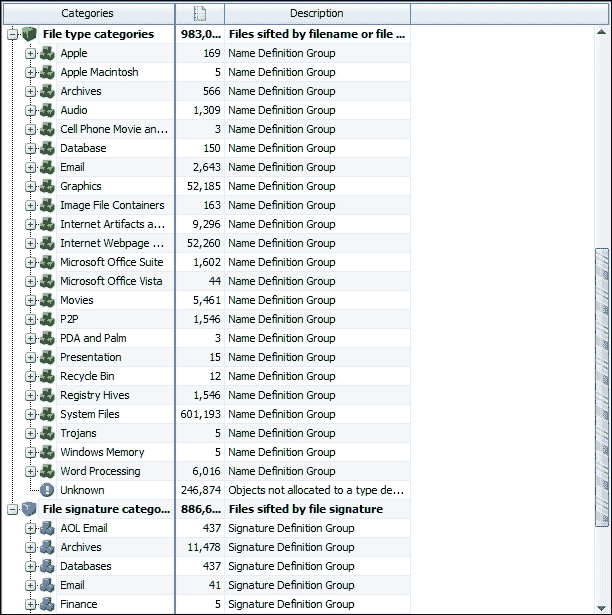

# 第七章：Windows 和其他操作系统作为证据来源

大多数笔记本电脑、台式机和基于网络的计算机使用 Windows 操作系统，本章将详细描述这一点，并简要介绍其他常见的操作系统。本章将帮助你理解计算机上处理的信息的复杂性和性质，从而辅助司法鉴定，并有助于重建与存储在各类操作系统中的数字证据相关的关键事件。

本章将讨论：

+   Windows 注册表、系统文件和日志作为数字证据资源

+   苹果及其他操作系统结构

+   远程访问和恶意软件攻击，以及反取证技术对数字证据恢复所带来的普遍挑战

+   一个关于 Windows 注册表分析的案例研究

# Windows 注册表、系统文件和日志作为数字证据资源

基于 Windows 的系统有一个名为**Windows 注册表**的设置集中库。注册表通常是一个宝贵的信息来源，可以用于澄清和证实从文件系统中恢复的其他相关信息。Windows 注册表是 Windows 操作系统的重要组成部分，维护着系统的配置、支持的应用程序、访问系统的用户以及附加的设备和网络的配置。

注册表由一个目录结构组成，包含文件夹或“蜂巢”，这些蜂巢包含文件或键，这些键包含值，有时还包含子键。每个键包含特定的值，这些值被操作系统或依赖该值的应用程序使用，例如计算机使用的时区、远程访问设置的状态或附加存储设备的详细信息。

**注册表资源管理器**允许用户探索注册表蜂巢的内容，这些蜂巢在查看之前必须经过处理。根据检查的目的，注册表可能包含有价值的信息。注册表键有一个关联值，称为**最后写入时间**，它记录了键的最后修改时间。最后修改时间可能揭示键中更改的内容。有些注册表键包含多个值，这也使得确定哪个值被更改变得更加困难。

以下截图展示了使用 ILookIX 注册表资源管理器查看的**注册表蜂巢**的样本，包含所有已处理的注册表蜂巢，并附有一个查看器用于查看选定的键和值：

使用 ILookIX 注册表资源管理器查看注册表蜂巢

从业人员必须对注册表的工作原理和布局有所了解，并知道它可能提供哪些佐证。接下来的小节将介绍如何找到需要查看的地方以及所需的信息。

## 在注册表中寻找有用的线索

注册表浏览器有两个部分：

+   上部显示了 hives、键和子键

+   下部显示注册表值的名称和属性

hives 的结构显示在顶部面板中，如下图所示。点击 hives 中的任何键将显示该键的值在下方面板中。点击下方面板中的一个值将显示该值的数据，并在查看面板中展示。

注册表查看器显示注册表的 hives 和键

注册表浏览器具有其他取证工具中不存在或实现不完全的功能，例如：

+   **搜索**：它搜索已加载的 hives 的值数据

+   **列表**：用于列出你当前在顶部面板中选择的键下的所有值

+   **键结构报告**：此功能创建当前在顶部面板中可见的结构报告

+   **Hive 值报告**：此功能创建当前在下方面板中显示的值报告

+   **值名称查找**：此功能允许你搜索值名称

+   **隐藏值列表**：用于列出你当前在顶部面板中选择的键下的所有隐藏值（如果有的话）

注册表浏览器标记了一些可能从正常视图中隐藏的 hives、键和值。隐藏的键和值，通常用于存储病毒和 Trojan 数据，可能包含额外的数据。如果有这些数据，ILookIX 将允许从业人员查看。Windows 中的程序，包括病毒和 Trojan，有能力通过直接写入注册表来读取和写入值，而使用标准 **Win32 应用程序编程接口**（**Win32 API**）的程序无法检测到这些。这些值被称为隐藏值。

也有一些程序不依赖于 Win32 API，并能够向注册表写入隐藏值。这可以用来隐藏数据。隐藏值不应自动被解释为恶意的，因为例如 Windows XP 中就有约 27 个隐藏值。

通过选择一个键或子键，或使用任一**生成列表**按钮，值的列表将被传送到注册表浏览器下部的**值列表**框中。下方窗口中的列表将显示有关该值的相关信息，如下图所示：

注册表查看器显示一些键的值

以下截图显示了值的十六进制编辑器视图：

键值的十六进制视图

以下屏幕截图显示的搜索功能使用索引搜索来识别有用的数据，例如在相应字段中进行的词语搜索：

+   **注册表键**

+   **注册表值**

+   **注册表数据**

在注册表中搜索信息

## 通过注册表映射设备

通过映射设备以确定分区和已挂载及附加的存储设备，工作人员将更深入了解设备的使用情况。例如，考虑一种情况，计算机上已拆卸的内部硬盘被恢复，并包含一些可用的证据。

应考虑以下事项：

+   它可以与设备关联吗？

+   如果是这样，这是否增加了设备用户与硬盘之间存在关系的可能性？

+   如果不是，这是否影响嫌疑人与设备上证据之间的关联强度？

ILookIX 将识别设备分区并从中提取数据。然而，检查其他证据可能会提供更具体的设备来源细节。

Windows 会记录连接到设备的各种内部和外部硬盘的详细信息，以及其他外设的细节，如打印机、光驱和优盘。通过该设备日志，可能显示以前连接的、现已断开的外部设备的记录。在注册表中，`SYSTEM\MountedDevices` 键记录了以前挂载的设备。它可以提供许多附加 USB 设备的实际序列号——这是工作人员在重建关键事件时最有用的属性。以下屏幕截图显示了连接到台式计算机的设备集合：

查看注册表中的系统挂载设备

## 检测 USB 可移动存储

为了重申，已连接到计算机的外部设备的详细信息，尤其是 USB 设备、手机和数码相机，会被存储在注册表中。注册表记录了一些附加外设的基本信息，如内部硬盘、显示器、键盘和鼠标，但它也会保存有关可能曾暂时连接到计算机的其他设备的信息，例如外部硬盘、优盘、手机和数码相机。

以下屏幕截图显示了存储在注册表中的附加 USB 优盘记录，并显示了制造商的名称。通常，设备的唯一序列号可以被恢复。

显示附加 USB 设备记录的注册表

并非所有 USB 闪存驱动器都有序列号。这可以通过设备 ID 的第二个字符是`&`而不是数字来判断。在检查每个附加设备时，可以看到显示了各种值，包括`ParentIdPrefix`，但几乎没有其他信息能帮助实践者确定该值的来源或系统的使用情况。然而，注册表确实保存了其他可能有帮助的信息，例如`HKEY_LOCAL_MACHINE\System\MountedDevices`键，实际上是一个挂载卷的数据库。该数据库记录了与这些卷的唯一标识符相关的持久卷名。通过检查这些附加数据，通常可以证明分配给卷的名称，如驱动器字母`F`，将与附加闪存驱动器的`ParentIdPrefix`值相关联。如果用户为闪存驱动器指定了特定名称，这个名称也可能会记录在注册表中。

## 用户活动

注册表为每个被授权使用设备的用户保存各种文件，如`NTUSER.DAT`文件，并存储该用户的特定设置。这些文件的内容被映射到`HKEY_USERS\SID`配置单元，以记录用户登录的情况。该过程会创建并更新`HKEY_CURRENT_USER`配置单元，该配置单元可以提供有关用户登录设备后所采取的操作的有用信息。

## 审查最近使用和跳跃列表活动

注册表保存**最近使用**（**MRU**）列表和**跳跃列表**，它们在第六章，*选择与分析数字证据*中被介绍。这个功能旨在帮助用户跟踪近期活动，例如快速访问曾查看的文字处理文档或图片视频。然而，从取证角度来看，它们就像窃贼在花园里留下的“脚印”，对于重建用户执行特定操作时的历史条目非常有用。它们被存储以跟踪用户可能在未来返回的项目。

注册表在此键中维护用户输入到**开始** | **运行**框中的命令列表：

`HKEY_CURRENT_USER\Software\Microsoft\Windows\CurrentVersion\Explorer\RunMRU`

当在**运行**框中输入命令时，操作会被记录到该键，并维护一个最近使用的值列表，尽管这些数据可能与文件和应用程序的元数据相关联。作为常规操作，检查这些数据是谨慎的做法，以确保没有无法解释的异常情况，以免影响证据的可信度。

## 检测无线连接

Windows 机器上的网络连接提供**服务集标识符**（**SSID**）数据，确认当前及先前连接到桌面或笔记本电脑的无线网络。这个常用数据保存在注册表中的`HKEY_LOCAL_MACHINE\Software\Microsoft\WZCSVC\Parameters\Interfaces` Hive 中。此存储库可以提供包括 IP 地址在内的网络设置详细信息，这些信息存储在`KEY_LOCAL_MACHINE\System\CurrentControlSet\Services\TCPIP\Interfaces\GUID`键下。通过这些数据，可能有助于将 IP 地址与从计算机恢复的证据相联系。

## 查看 Windows 事件查看器日志

从 Windows 7 开始维护的事件查看器日志记录了比注册表中更多的信息。例如，它可以证明 USB 设备的连接，而这些连接可能并未保留在注册表日志中。它还可以记录某些程序的使用频率，例如虚拟网络，这些程序可能曾在操作并能够验证应用程序记录的日志。

以下截图中显示的部分文本格式包含与 USB 设备相关的相同信息，这些信息也可以在`System` Hive 中找到。注册表中还应显示设备驱动程序的安装日期，通常这些信息也会记录在事件查看器日志中。

Windows 事件查看器显示连接的 USB 设备的记录

断开连接的 USB 设备会生成日志，这些日志可以证明需要更详细地检查外部设备断开连接的情况，并可能提供断开时间的时间戳。这些信息可能位于`System` Hive 中的`CurrentControlSet\Enum\DeviceType\DeviceID\InstanceID\Properties\xxxx`路径下。

## 从 VSS 中恢复隐藏数据

回顾第五章，*增强取证工具的需求*，可以得出结论，启用了 VSS 功能的 Windows 系统可以恢复额外的数据。在上一章节中的案例研究中，重要的文件从一个 VSS 文件夹中的 Dropbox 帐户恢复。在以下截图所示的实例中，ILookIX 的**差异 XFR-VSS 记录**功能被用来仅恢复那些包含文件内容差异的 VSS 文件夹：

VSS 文件夹的恢复选项

在这次实验室仿真中，恢复了七个 VSS 文件夹，具体可以在以下截图中看到：

从仿真图像中恢复的 VSS 的不同实例

不仅可以恢复已删除的文件，这些文件在其他情况下可能会被遮蔽，还可以恢复帮助重建违规行为的系统信息和日志。下图显示了注册表键和蜂巢的先前版本以及事件查看器的日志记录。这些记录可能揭示与远程访问、时钟和桌面设置更改以及注册表的恶意入侵相关的各种活动。

从 VSS 文件夹恢复的各种注册表蜂巢和键实例

还可以恢复诸如归档存储（包括压缩文件）之类的附加信息。下图突出显示了存在于不同 VSS 文件夹中的一些额外 ZIP 文件，并显示了不同的日期：

从 VSS 中恢复的归档存储，位于 ILookIX 容器类别中

从 VSS 文件夹中恢复的额外电子邮件存储，如下图所示，反映了不同时间段的电子邮件信息。在模拟过程中，`VSS`文件夹中提供了一封已删除的电子邮件，该电子邮件在当前驱动器视图中找不到：

从 VSS 文件夹中恢复的电子邮件

## 检查预取文件

启动 Windows 系统的过程会将一系列文件读取到 RAM 中，这是一个较长的过程，因此每当程序第一次运行时，Windows 都会创建预取文件。这些信息可以为执法人员提供与正在调查的系统上相关的各种程序的历史信息。

应用程序执行可能表明使用了反取证程序，例如，用于掩盖某种违规行为。如果程序已被删除，可能能够找到一个预取文件，确认该程序在删除前已被执行——这比简单的声明“该程序已安装，但是否执行过未知”要有帮助得多。

恶意软件活动有时可以通过检查预取文件来确定，预取文件可以提供其下载和执行的历史记录。`prefetch`文件夹和`ReadyBoot`文件夹如下面的截图所示：

预取文件夹及其子文件夹视图

应用程序预取使用类似的过程，但它仅限于单个应用程序的启动，并且通常将其追踪文件存储在`C:\Windows\Prefetch`中。预取数据以一个名为`Layout.ini`的文件形式存在，文件按顺序保持一个目录，记录了在启动过程中活动的文件和文件夹，这是系统维护的一部分：

Layout.ini 文件视图

预取文件分析并不复杂，实际上确认文件包含关于应用程序运行频率、音量细节和应用程序首次与最后一次运行的时间戳并不困难。Windows 10 会记录每次应用程序运行时最多八个时间戳，并将它们存储在`ROOT/Windows/Prefetch`文件夹中。

## 页面文件

Windows 使用`pagefile.sys`来存储当前无法适配到物理内存的内存帧。Windows 支持 16 个页面文件，但通常只使用一个隐藏文件，并将其存储在`%SystemDrive%\pagefile.sys`中。作为虚拟内存文件的作用，当 RAM 达到极限时，隐藏的`pagefile.sys`文件会运行，成为虚拟内存文件。当系统内存不足时，它会将内存转储到硬盘上作为页面文件，以补充稀缺的内存。这可能导致系统变慢，通常发生在运行过多应用程序时。

这个操作与`hiberfil.sys`的功能相似，因为它存储特定时间内运行的进程。然而，应该注意的是，`pagefile.sys`并不会记录所有的 RAM 活动。

`pagefile.sys`文件对系统的良好运行至关重要，并随着设备使用的不断进行而发生变化。以下截图显示了一个大尺寸的`pagefile.sys`文件的多个副本：

定位 pagefile.sys 文件

## 休眠和睡眠文件

`hiberfil.sys`文件是 Windows 用于保存机器状态的默认文件，作为休眠过程的一部分。由于操作系统一直保持该文件处于打开状态，因此在系统运行时无法读取该文件。互联网遗留物通常存在于内存中，并通常以页面文件或休眠文件的形式保留下来。恢复已删除的休眠数据可以帮助确定休眠前内存中的内容。

睡眠模式提供的信息有限，因为 RAM 仍在后台工作，并且一旦设备重新启动，这些信息会消失。休眠模式可能提供更多来自笔记本电脑的有用数据，因为在休眠过程中，RAM 中的所有数据会被捕捉并写入硬盘。

以下截图显示了对休眠文件的搜索，以寻找可能帮助实践者的信息：

搜索 hiberfile.sys 实例

## 检测隐写术

**隐写术**是将数据隐藏在通信中的过程，只有发送者和接收者知道其存在，并能访问隐藏的信息。在可能的情况下，隐藏在数字文件或图像中的数据通常会被加密。检测隐写编码文件被称为**隐写分析**。隐写分析仅限于检测嵌入的信息，这可能识别嵌入过程。当隐写工具或隐藏方法被识别后，可能能够提取出信息。

隐写图像中的不寻常模式显而易见，容易引起怀疑，但最初可能难以检测。可以使用许多磁盘分析工具，如 ILookIX，这些工具可以报告和过滤存储设备中未使用的簇或分区中的隐藏信息。通过识别重复的模式，可能会发现隐藏在看似无害文件中的信息。这种重复可能揭示出隐写工具的存在以及隐藏的信息。比较一个真实的原始文件与一个怀疑包含隐藏信息的文件是一个可行的过程，但这需要有两个样本进行比较。

水印通常用于合法地识别和保护版权材料。尽管水印通常被隐藏，但有时会被伪造者识别并非法去除，以阻碍调查者的工作。

为了协助使用各种工具检测隐藏信息，实践者必须识别并匹配每个怀疑文件的哈希值。这样做涉及导入或构建哈希集合的库，尤其是隐写软件，作为比较库的一部分。

# 苹果及其他操作系统结构

虽然微软主导了家庭市场和许多网络系统，但其他流行的操作系统，如苹果和 Linux，也被广泛使用，并且很可能需要法医人员进行检查。以下小节简要介绍了这些系统。

## 检查苹果操作系统

苹果的 Macintosh 设备使用不同的操作系统（目前称为 OS X），与微软的系统不同，它允许应用程序独立运行，用户无法直接访问文件系统。简单性和便利性是一般惯例，这基于 Unix 文件系统。

安装在苹果机器上的应用程序与文件系统的交互是有限的，因为应用程序只能在其沙盒中的目录内进行操作，无法访问文件系统。沙盒保护系统和用户免受恶意软件攻击。实际上，它限制了每个应用程序的访问权限，以增强设备的安全性。

安装应用程序时，会创建一些具有特定角色的容器。通常，应用程序的操作文件保存在捆绑容器中，数据文件则保存在数据容器和子目录中。用户通过**查找器**功能访问文件。文件系统由四个主要域组成，将资源与文件分开，以便于访问和使用，并提供良好的安全保护。这些域包括：

+   **用户域**：此域包含特定于用户的资源，限制每个用户仅能访问和控制他们自己的主目录。

+   **本地域**：此域与当前计算机上安装的应用程序相关，并在所有用户之间共享，包含本地启动卷上的多个目录，由系统管理。具有管理员权限的用户可以添加、删除或修改此域。

+   **网络域**：此域包含本地网络中所有用户共享的应用程序和文档。

+   **系统域**：此域包含 Apple 安装的系统软件，防止用户添加、删除或修改项目。

作为简化应用程序使用、查找功能和其他一些功能（如**打开**和**保存**面板）的一部分，系统会隐藏不需要用户访问或干预的文件和目录。通过取证工具查看的典型目录结构如以下截图所示：

Apple 文件层次结构

存储在 Apple 桌面和笔记本电脑上的各种文件类别可供从业人员访问，并在以下 ILookIX **类别资源管理器**的截图中显示：

从 Apple 计算机中归档的文件类别和签名

文件元数据，包括时间戳、图像文件的 EXIF 数据和文件位置，也可以从 iOS 中恢复，如以下截图所示：

从 Apple 计算机收集的文件元数据

## Linux 操作系统

Linux 操作系统，Unix 的一个变种，将应用程序的指令传递给计算机的中央处理单元和处理器。处理器执行指令任务，并通过操作系统将结果返回给应用程序。尽管 Linux 具有许多与 Windows 和 OS X 相似的功能，但它是一个开源操作系统，由用户、公司和合作伙伴共同开发。这促进了经济研究与开发工作，生产出一种创新的、许多人称之为更优的操作系统。Linux 已经成为一个重要的桌面系统，并且是网络和许多设备（如手机）基础操作系统的核心。

由于 Linux 存在于笔记本和手机的系统 BIOS 中，它大大提高了这些设备的启动速度。Linux 正越来越多地用于运行大量的 Web 服务器，包括亚马逊的云服务。Twitter、LinkedIn、YouTube 和 Google 都使用 Linux 作为他们的操作系统。

操作系统的架构包含内核，其中包含一组编码指令，使计算机硬件响应操作系统，并默认响应应用程序级程序。与许多人认为笨重且只有少数程序员能接触到的微软 Windows 内核不同，Linux 内核的灵活性和模块化结构为开发者提供了许多优势。特别是，内核的大小可以根据开发者的需求进行增减，以满足开发者希望为不同的操作环境和设备重新设计系统的需求。这在系统小型化方面，尤其是在更小型的手持设备上，具有特别重要的意义。

Linux 内核中嵌入的一整套工具实际上就是其操作系统，这些工具还具有模块化的优点。Linux 为用户提供了多种选择方式，使其能够按照自己的需求使用系统，包括许多用户熟悉的 Windows 和 OS X 中的窗口和桌面功能。

一个包含用户、组和权限的系统被嵌入到 Linux 中，以确保操作系统的安全性。它提供类似于其他操作系统的独立用户账户。例如，个人文件存储在用户的`home`目录中，并可以轻松访问。然而，典型的 Linux 文件系统可能包含一系列复杂的本地和远程文件及正在运行的进程，并且与 Windows 不同的是，Linux 中没有`Program Files`目录。以下截图展示了 Linux 系统的菜单视图：

Linux 系统中的菜单视图

以下截图展示了一个示例 Linux 操作系统的档案视图：

Linux 系统的档案视图

# 远程访问和恶意软件威胁

恶意软件和其他通过黑客攻击（通常通过远程访问漏洞）引发的安全问题，仍然是对由于安全管理不善而脆弱的计算机和网络系统的重大威胁。这些问题将在以下小节中讨论。

## 远程访问

"特洛伊木马辩护"已经被无辜和有罪的计算机用户用来支持他们的清白主张，指责非法活动是由远程攻击者造成的。虽然这种说法有一定的合理性，但似乎是反转了无罪推定的责任，原本应该由检察官承担举证责任，却由被告来承担。所有数字取证检查中的大难题是将嫌疑人与犯罪事件联系起来。对于取证人员来说，澄清远程访问漏洞的可能性或概率会更公正，尽管显然这有时会花费大量时间。

Windows 操作系统允许出于合法目的的远程访问，但通常情况下，Windows 更新是为了解决功能中的漏洞，特别是其远程桌面协议服务，这一服务本身是不安全的，容易受到利用。

远程访问还可以通过恶意软件攻击获得，帮助黑客访问目标设备或网络。如果缺乏安全保护或安全保护水平较低，这尤其成问题。

虽然 Wi-Fi 连接很方便，但它通常会允许敏感网络流量的窥探，可能会为计算机和手持设备上的账户提供轻松访问。缺乏对这些通信的有效加密将使得针对在线银行和涉及财务交易的其他账户的网络攻击变得可能。

## 检测恶意软件攻击和其他漏洞

注册表在多个位置存储自动启动键，这些键可以在没有用户直接干预的情况下启动应用程序。黑客最常利用的一个键是运行键，它允许许多此类漏洞继续留在系统中：`HKEY_LOCAL_MACHINE\Software\Microsoft\Windows\CurrentVersion\Run`。启动键将在系统启动时、用户登录系统时或用户执行其他指定操作时启动程序。

`HKEY_LOCAL_MACHINE \SOFTWARE\Microsoft\Windows NT\CurrentVersion\Image File` 注册表项是为管理员调试各种执行选项而设计的，但它容易受到外部攻击者的攻击，攻击者可以利用它将应用程序重定向到被劫持的应用程序副本。添加 Word 的自动启动键可以将进程指向一个包含恶意代码的 Word 副本，这样每次启动该程序时都能访问计算机。这些自动启动键通常会留下某些电子指纹，帮助判断是计算机用户还是入侵者对相关事件负责。

在第四章《恢复与保存数字证据》中，提到了读取和恢复 RAM 内容，以分析那些杀毒程序未检测到的恶意软件。IXImager 可以足够快速地重启，以便捕获系统的 RAM，从而捕捉到正在运行的程序、密码等内容。这是通过将 USB、CD 或 SD 卡插入计算机端口，重启计算机并开始成像过程，进而恢复和存储捕获的 RAM 数据以供分析。

ISeekDiscovery 自动化工具提供了一种新颖且高效的搜索虚假文件的方法。例如，如果用户想要查找计算机上所有命名错误、拼写错误或没有扩展名的 Word 和 Excel 文件，只需要通过 Excel 和 Word 的签名使用**自动捕获**功能，并且还需使用**搜索排除**标签（如下图所示），并添加以下文件扩展名：

+   `*.xls`

+   `*.xlsx`

+   `*.doc`

+   `*.docx`

使用 ISeekDesigner 排除文件扩展名

当此例程运行时，它将删除具有合法名称的文件，仅保留那些具有虚假名称的文件。这对于入侵检测应该非常有帮助，因为隐藏的黑客可执行代码导致了大量的安全漏洞。

## 反取证过程和工具的普及

混淆和销毁证据不是一种新现象，它随着数字取证的出现而出现，挑战并妨碍证据恢复。它包括一系列广泛的软件工具，这些工具可以混淆与违规行为相关的事件，以及删除或修改数据。反取证也可能旨在延迟完成检查的时间。有时，它可能会对稍后在法庭上依赖的证据的有效性产生怀疑。这些工具通常隐藏其存在，并且在设备被没收后可能会继续存在。

这一非法行为的具体应用包括：

+   覆盖或更改数据和元数据，包括时间戳

+   隐藏和加密数据以及隐写术（前面提到过）

+   加密文件夹、分区和网络流量

+   使用外部设备使计算机能够启动，但不在主机上留下任何活动痕迹

检测反取证活动不一定是直观的过程，但应该始终考虑到它可能已经在正在检查的设备上进行。能够检测甚至阻止反取证活动的工具似乎供应不足，显然需要进一步研究这个问题。

本书不会推广或提供关于这些在互联网上自由提供的工具包的任何信息，但我承认这些工具包已经开始损害数字取证工具的声誉，而这些工具仍然被广泛依赖。令人关注的是这些工具被用来保护有罪者并可能牵连无辜者。第八章，*浏览器、电子邮件、消息系统和手机的检查*，描述了暗网以及使用此类反取证工具来加密和隐藏信息的情况，如 Tor 和 12P。

# 案例研究 – 使用 Windows 注册表进行证据核实

本案例研究示范了如何在可能的情况下始终对数字证据进行核实和验证。

该案件与下载非法儿童剥削图片和电影文件有关。恢复的其中一份可能有害的文件是一张未成年儿童的色情图片。检方辩称该文件曾作为计算机的桌面壁纸显示，且在计算机启动时清晰可见。检方合理地认为，计算机用户不可能没有注意到这一点，从而暗示用户在处理非法淫秽材料方面的共谋行为。

在查获时，计算机桌面显示了一张无害的空白图片，未引起立即注意。然而，后续检查发现计算机中有一个 `.jpg` 文件，里面是未成年儿童的淫秽图片。该令人不安的图片位于 `C:\Documents and Settings\xyz\Application Data\Opera\Opera\xxx.jpg`。检方的办案人员证明，在一个确认的日期和时间，`xxx.jpg` 被设置为桌面壁纸。一个名为该文件的图片文件位于 `C:\Documents and Settings\xyz`，这是确认的默认目录，包含与用户账户 `xyz` 相关的文件和文件夹。

实验人员的测试表明，直到应用一个非 Windows 标准图片作为桌面壁纸时，才会创建此条目。如果桌面更改为另一个非标准图片，注册表键值将被修改，以反映新图片，而不保留旧文件的列表。当选择标准 Windows 图片作为桌面时，这个键值将保留，显示最后使用的非标准图片。

对与`xyz`用户账户相关的注册表项分析表明，并没有发现非人工干预创建桌面壁纸并将非法图像文件放入用户账户的证据，但也不能完全排除这种可能性，因为此类事件的痕迹不容易被识别以供进一步检查。在本例中，系统将通常的背景壁纸位图存储在壁纸注册表热键中，位置为`HKEY_CURRENT_USER\Control Panel\Desktop\Wallpaper`注册表项。Windows 注册表并不会记录使用过的标准 Windows 文件的历史记录。

`xxx.jpg`的元数据揭示了文件的创建、修改和最后访问时间，这与在重建犯罪时间线时确定的互联网使用情况相吻合。检查表明，文件曾存在于计算机的另一个位置，但无法确认它是从互联网下载的，还是从外部设备复制的。

用户不太可能通过手动搜索目录`C:\Documents and Settings\xyz\Application Data\Opera\Opera\`来将图像设置为桌面壁纸。更常见的做法，也因此更有可能的情况是，用户通过 Opera 浏览器查看该图像，然后使用右键将其设置为壁纸。该文件也被保存到了`xyz`文件夹，这表明有两个手动过程，这暗示着用户或用户群体的故意操作。这些操作可能是由恶意软件（如木马病毒）的存在引起的，但鉴于案件中的其他证词，这种可能性似乎不大。

不幸的是，没有数据能够显示何时某个用户将图像从壁纸中移除，转而选择了默认设置**无**或在桌面框架中没有图像的黑色屏幕。如果有这些信息，至少能够提供一个非法文件操作的更精确时间。Windows XP 操作系统上未安装 VSS，如果安装了，可能会对这些注册表更改提供一些澄清。

虽然注册表在许多情况下是有帮助的，但在本例中，它留下了一些不确定性。当假设计算机的用户（被告家中的租户，而非被控拥有儿童性剥削材料的实际所有者）在计算机被查扣前 14 小时已知执法机关对该计算机的关注时，这一点尤其令人困惑。怀疑他们在计算机被查扣前匆忙删除了涉案壁纸以及其他一些涉案文件，后来证明所有者（被告）无法访问该计算机。

该所有者有一个铁证如山的不在场证明，证明他在计算机文件被删除时身处另一个郊区。如果在准备对被告提起指控时考虑到这一点，案件不太可能进入审判。回想起来，似乎调查侦探和法医专家没有看到用户访问中的明显冲突，也没有尝试确定其他有访问权限的人员的参与。这再次是一个以嫌疑人为主导的调查的典型例子。

随着设备的法医检查进行，明显发现不止一个本地用户可以访问该设备。人们认为，判断是否发生了远程攻击，以及是否有外部人员对非法文件的存在负责，是明智的做法。计算机设置显示，在扣押时外部用户访问计算机的功能已被禁用，但不一定是在相关事件发生时禁用的。

实践者声称计算机已被搜索以查找恶意应用程序，但没有结果。然而，辩方实践者在`C:\Documents and Settings\xyz\My Documents\setup.exe`位置找到了`ZLOB.JN`木马下载程序。该文件被辩方实践者删除并隔离，等待进一步检查。

关于此恶意软件的未经证实的信息有很多，从将其描述为严重威胁到仅仅是一个导致计算机变慢并启动弹出命令的烦扰。一些观察者声称，它可以作为获取计算机访问权限的一种手段，让黑客远程访问计算机。一些版本的 Zlob 会在启动时自动加载，并通过劫持 Windows 资源管理器程序来隐藏其存在。该木马被声称有能力完全控制计算机，但这一说法并未得到证实。

一些评论认为，Zlob 感染会开始接管计算机浏览器，导致不断弹出窗口、将 URL 重定向到其他网站、删除文档和图片，甚至侵入个人信息，这些信息可能被删除或分发到其他网站。手动清除 Zlob 需要一定的技术知识。它因在不同名称下复制自己而难以清除。即使清除，可能已经在计算机上复制并重新安装了自己。

对嫌疑文件 Zlob 文件 `setup.exe` 的检查显示，它是在计算机上记录的非法活动之前创建的，且未被杀毒程序识别或移除。据报道，该特洛伊木马会在系统中创建多个文件，包括 `stdole3.tlb`，并创建注册表项，试图在启动时运行 `Troj/Zlob-JN`，包括 `HKLM\SOFTWARE\Microsoft\Windows\CurrentVersion\policies\explorer\run wininet.dll` 和 `HKLM\SOFTWARE\Microsoft\Windows\CurrentVersion\policies\explorer\run regperf.exe`。

然而，检查计算机时未能在 Windows 注册表或计算机中找到这三个文件。似乎不太可能发生外部攻击，因此留下了一个可能性，即一个或多个本地用户对非法活动负责。尽管防御方专家对外部攻击的可能性进行了额外的检查并未取得成果，但这一工作必须完成，为什么不由提出指控的方来做呢？被告被陪审团判定无罪，但未对其他涉及使用计算机的用户提出进一步指控。

再次强调，这个案件突显了反驳论证作为审查的一个重要部分的好处，反驳论证有助于寻找可能存在的辩解证据，若存在此类证据，则可能会修改或反驳一个论点，回想一下实践者和学者*达迪克*（2010）简洁而有力的名言：“没有什么比明显的事实更具欺骗性。”

# 参考文献

Dardick, G. S. 2010. "*网络取证保障*." 第 8 届澳大利亚数字取证会议，西澳大利亚珀斯。SECAU: 57–64.

# 总结

本章详细描述了 Windows 操作系统以及其他常见检查的操作系统，包括 Apple 和 Linux。介绍了 Windows 注册表、系统文件和日志，以及 VSS 恢复的一些额外优势，作为数字证据恢复和分析的宝贵资源。本章还涉及了远程访问和恶意软件攻击，以及反取证的普遍性和挑战，这些挑战妨碍了证据的恢复和识别。

第八章，*检查浏览器、电子邮件、消息系统和移动电话*，将描述定位和恢复与个人通信记录相关的数字证据的过程，包括存储在计算机设备中的电子邮件和浏览记录，以及保存在手机上的电话通信。具体将讨论互联网浏览和搜索记录的恢复，其他消息系统，包括 Skype 和虚拟私人网络，以及电子邮件分析。

本章将介绍手机取证及其在法医鉴定中的重要性，同时讨论从个人计算机和 GPS 设备中获取证据日益增加的挑战。本章将让你认识到定位、提取并检查存储在计算机和手机上的与相关人员之间的通信记录的价值。
