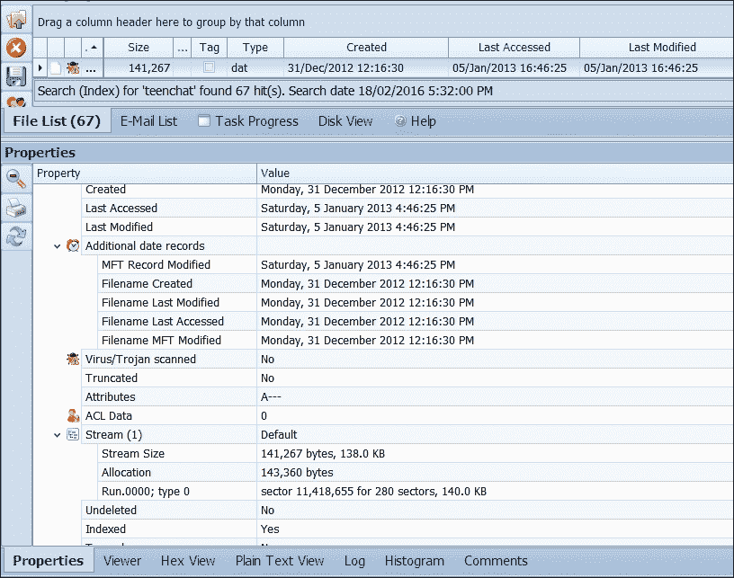
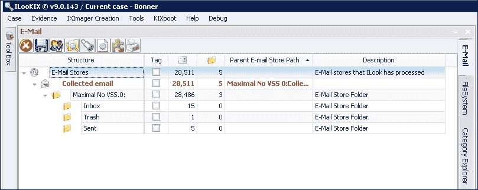

# 第八章：浏览器、电子邮件、消息系统和手机的检查

本章讨论了互联网浏览器、电子邮件和消息系统、手机及其他手持设备——这些通常被认为是数字证据的丰富来源。描述了定位和恢复与个人通信记录相关的数字证据的过程，包括存储在计算机设备中的电子邮件和浏览记录以及存储在手机上的电话通信记录。你将理解定位、提取和检查存储在计算机和手机上的通信记录的价值，这些记录通常是丰富的证据来源。

本章将为你提供以下概念的基本理解：

+   恢复互联网浏览和搜索记录以及其他消息系统，包括 Skype 和虚拟私人网络

+   电子邮件分析及大规模电子邮件数据库的处理

+   手机取证及从个人计算设备（包括平板电脑和 GPS 设备）中获取证据的日益增长的挑战

多种互联网浏览器可用于桌面和笔记本设备，也可以用于平板电脑及其他手持设备，包括 Mozilla Firefox、Google Chrome、Microsoft Internet Explorer，以及最近的 Microsoft Edge、Safari 和其他浏览器。下一节及*从手机和手持设备中恢复证据的日益增长的挑战*部分将概述使用浏览器时存储的数据的价值。

# 定位互联网浏览证据

与用户网页浏览活动相关的信息通常以 Cookies、缓存文件、URL 历史记录、搜索词、历史记录以及计算机上的其他文件形式存储。这是许多取证检查的重要组成部分，因为它可以帮助重建嫌疑人在与知识产权侵权、网络犯罪、儿童色情及其他严重犯罪相关的案件中的在线浏览行为。以下小节描述了一些有助于犯罪重建的网页浏览事件的基本特征。它们还概述了从浏览器数据中恢复证据的过程，这一过程也可以从未分配的空间中进行，为执法人员提供对私人浏览活动的洞察。

## 典型的网页浏览行为

典型的浏览活动涉及搜索存储在网站上的特定主题，例如个人、事件、组织或电子邮件或消息账户——几乎是搜索者在寻找的任何内容。在访问或链接到远程网站的过程中，根据*洛卡尔交换原理*，会发生一些数据交换：一些痕迹会被留下，部分数据会转移到另一台设备。远程网站可能会在不同程度上记录用户访问的某些细节。像 Hotmail 和 Yahoo! 这样的基于 Web 的电子邮件服务器会记录账户持有人的登录信息，并经常在访问账户时记录他们的 IP 地址。这些信息在重建违规行为时非常有用，特别是当它们与账户持有人的设备匹配时。

例如，Gmail 将电子邮件消息存储在其云服务器上，而不是本地机器上，因此，除了可能存在于瞬态内存中的电子邮件状态外，从这些账户中恢复电子邮件证据的可能性较小。然而，现在这些电子邮件账户可以同步并备份到 **邮局协议** (**POP**) 客户端，这是一个标准协议，用于通过互联网连接从远程服务器检索和管理消息。这样一来，消息会被下载并存储到本地机器上。Windows 10 的电子邮件消息也同样将这些消息缓存到本地磁盘中，从而可能有助于法医恢复。

浏览记录通常会被缓存到用户的本地机器上。例如，默认浏览器设置会以多种不同的形式记录浏览活动，最显著的是：

+   缓存的文件夹存储访问过的网页的 HTML 和多媒体文件

+   访问过的网页的历史数据库，以及某些程度上记录某个网页访问的日期和时间范围

+   使用如 Google 和 Bing 等应用程序进行搜索的数据库记录

+   记录访问过网站及每次访问时间戳的 Cookie 存储

+   用户访问的在线账户记录

+   电子商务活动，包括电子银行记录和账户

法医工具处理可能包含有用证据材料的常见文件类型。许多这些小型数据库文件需要解构，包括历史数据库和图像缩略图数据库 `.db` 文件，`index.dat` 以及其他记录互联网历史的文件等。下表展示了从 Firefox 默认缓存和位于嫌疑人笔记本电脑中的默认临时文件夹中恢复的图像和 Shockwave 文件。这些信息构成了提起对嫌疑人指控的部分证据，并帮助确认了与主指控相关的浏览活动的时间段。表中展示了从浏览器缓存和默认 `temp` 文件夹中恢复的图像和媒体文件。

| 名称 | 类型 | 路径 | 创建时间 | 修改时间 | 访问时间 |
| --- | --- | --- | --- | --- | --- |
| `E3A65A2Ed01` | `.jpg` | `\Documents and Settings\User\Local Settings\Application Data\Mozilla\Firefox\Profiles\7yyxpig9.default\Cache` | `17/07/2015 5:54` | `17/07/2015 5:54` | `14/09/2015` |
| `25C1B625d01` | `.jpg` | `\Documents and Settings\User\Local Settings\Application Data\Mozilla\Firefox\Profiles\7yyxpig9.default\Cache` | `17/07/2015 5:49` | `17/07/2015 5:49` | `14/09/2015` |
| `PV.SWF` | `.swf` | `\Documents and Settings\User\Local Settings\Temp\TMP27340-11320` | `5/03/2015 0:04` | `5/03/2015 0:04` | `14/09/2015` |
| `PE.SWF` | `.swf` | `\Documents and Settings\User\Local Settings\Temp\TMP27340-11320` | `5/03/2015 0:04` | `5/03/2015 0:04` | `14/09/2015` |
| `PR.SWF` | `.swf` | `\Documents and Settings\User\Local Settings\Temp\TMP27340-11320` | `5/03/2015 0:04` | `5/03/2015 0:04` | `14/09/2015` |

以下表格显示了第一个已删除的图像文件，该文件已从缓存文件夹中恢复。其之前的位置未知，但该文件提供了一些可能有用的时间戳。其余已删除的文件没有位置或时间戳，但它们有一个哈希过的文件名和签名，可能可用于与设备上恢复的其他文件进行比较。文件雕刻过程从扇区中恢复了这些文件，进一步检查这些扇区可能有助于发现它们的更多背景。没有某种形式的佐证，这些证据的证据效力会减弱。表格显示了从未分配空间中恢复的已删除文件，记录了文件名和（在一种情况下）时间戳：

| 名称 | 类型 | 路径 | 创建时间 | 修改时间 | 访问时间 |
| --- | --- | --- | --- | --- | --- |
| `12DffGbbvt` | `jpg` | `\路径未知\Cache` | `23/08/2014 01:58` | `23/08/2014 01:58` | `23/08/2014 01:58` |
| `00049.jpg` | `jpg` | `\路径未知\Carved 文件` |   |   |   |
| `00476.jpg` | `jpg` | `\路径未知\Carved 文件` |   |   |   |
| `00352.jpg` | `jpg` | `\路径未知\Carved 文件` |   |   |   |
| `00573.jpg` | `jpg` | `\路径未知\Carved 文件` |   |   |   |
| `00700.jpg` | `jpg` | `\路径未知\Carved 文件` |   |   |   |
| `00865.jpg` | `jpg` | `\路径未知\Carved 文件` |   |   |   |
| `00869.jpg` | `jpg` | `\路径未知\Carved 文件` |   |   |   |
| `00886.jpg` | `jpg` | `\路径未知\Carved 文件` |   |   |   |
| `01492.jpg` | `jpg` | `\路径未知\Carved 文件` |   |   |   |
| `01931.jpg` | `jpg` | `\路径未知\Carved 文件` |   |   |   |

以下表格显示了一些 `.db` 数据库文件，这些文件保存了存在于设备上某个未知位置的文件夹中的图像痕迹。尽管没有时间戳，但文件的命名约定表明它们可能是在 2015 年 8 月的两个日期中创建或访问的。通过 X-Ways Forensics 工具获得的数据的可靠性可能不足以使这些证据在没有其他可靠证据的情况下被认为具有可采性。

| 名称 | 类型 | 路径 | 创建时间 | 修改时间 | 访问时间 |
| --- | --- | --- | --- | --- | --- |
| `Thumbnail.jpg` | `jpg` | `\Path unknown\Carved files\C120,D380 2015-08-13 03:15:03.jpg` |   |   |   |
| `Thumbnail.jpg` | `jpg` | `\Path unknown\Carved files\C120,D380 2015-08-22 05:22:04.jpg` |   |   |   |

以下截图展示了从一台笔记本电脑中恢复的 URL 和关键字搜索历史文件。这些信息用于重建嫌疑人的浏览活动以及作为在线犯罪活动一部分的搜索术语的性质。数据库中提取的电子表格提供了时间戳、访问过的网站的详细信息，以及在犯罪实施过程中使用的搜索术语：

从浏览器数据库解构的恢复电子表格，显示了多种浏览活动

## 从松散区域和未分配空间恢复浏览痕迹

使用 ILookIX 对未分配扇区的索引将对未分配给文件或文件夹的每个扇区的原始扇区内容进行索引。以下截图展示了搜索术语**tightvnc**的结果，旨在探索这个远程访问程序是否可能被用来妥协桌面计算机。恢复了**116**个文件松散区的命中，并记录了**423**个文件命中，从而为针对设备的远程攻击提供了更多线索：

在文件和文件松散区域中恢复的搜索命中

以下截图展示了包含搜索术语或命踪的恢复扇区的样本。请注意，这些数据没有时间戳，显示的日期是执法人员提取痕迹后，免费和未分配空间在取证图像中被索引的日期。在许多情况下，即便使用内置的十六进制编辑器，数据也不完全可读——通常缺少时间戳和原始文件位置。

在这个实例中，恢复了 BitTorrent 活动，提供了细节，表明嫌疑人使用 BitTorrent 点对点协议从其他 torrent 用户下载媒体。在这个例子中，部分活动的时间戳非常清晰可见，同时还可以看到正在下载的媒体的性质：

在文件和文件松散区域中恢复的搜索命中

在这个例子中，数据是通过使用术语`search terms`从松散文件区域中恢复的。以下截图中的一个命中提供了驱动器扇区和记录所在的连续扇区的详细信息。对这些扇区的数据雕刻可能会提供数据的部分重建，但除非信息正文中包含某些时间戳，否则对时间数据的分析最多也只能是猜测：

从松散空间恢复的互联网浏览数据的属性

通过打开这些数据，可以获取一些重要信息。下图突出显示了一个访问过的网站，用于删除 Skype 账户。这些信息与嫌疑人可能试图删除账户以防止未来涉及与有组织犯罪人物的非法活动调查的行为相符：

从松散空间恢复的部分可读的互联网浏览记录数据

这些数据包含一些时间性材料，与已删除的 HTML 数据相关联，帮助确定搜索发生的月份和年份。下图显示了 Skype 可能已安装在计算机上的可能性，但在回收站或松散空间中没有找到该程序及已删除的数据文件。Windows 事件查看器确实提供了其早期安装和使用的证据，尤其是在特定时间段内。通过从松散空间恢复的 Skype 活动残余，包括消息文本和卸载过程的搜索，进一步证明了这一点。从松散空间恢复的部分网页也提供了该网页在网站上创建的大致时间。对这些分散残余的证据进行佐证，对于重建关键事件是非常有用的。

在这种情况下，是试图删除 Skype 及其相关数据，这可能被认为是潜在的有罪证据：

从未分配空间恢复的数据与事件重构的关联，以及试图掩盖使用 Skype 的行为

ILookIX 包括一个快捷方式功能，可以获取常用值，如 Internet Explorer 中最近输入的网页地址和设置，并重新生成这些注册表项、键和值为快捷方式树，方便检查，截图如下所示：

从注册表中恢复的活动前因

## 私密浏览

私密浏览是一些网页浏览器提供的功能，包括 Google Chrome、Mozilla Firefox 和 Internet Explorer，目的是为了避免在浏览会话中留下用户活动的任何痕迹，保护隐私，并可能出于安全原因。它也通常用于那些希望隐藏涉及一定非法性的浏览活动的用户。这使得分析和定位与网页浏览活动相关的证据变得可能更加困难，因为私密浏览可能已经删除了所有与浏览活动相关的证据，而这些证据可能对调查有所帮助。

我进行的研究旨在更清晰地理解私人浏览功能及其对法医检查的影响。以前的研究主要集中在从计算机硬盘中恢复浏览数据，而其他研究则强调了从计算机上存储的 RAM 数据中记录浏览活动的智慧。早期的实验中使用了一些法医程序来分析网页浏览器，包括 EnCase、AccessData 的 Forensic Toolkit、Nirsoft Internet Tools 和 Internet Evidence Finder。

我的实验旨在确定在正常和私人浏览会话中，计算机系统哪些区域被修改或访问。这表明，在私人浏览期间，IE 会正常存储所有内容，但在退出浏览器后会删除它。Chrome 修改了安全浏览数据库、cookies 和历史记录，Firefox 修改了 Firefox 配置文件和安全浏览数据库。这些结果可能有助于研究人员在分析网页浏览器时集中搜索目标。

在是否 `pagefile.sys` 文件包含与私人浏览相关的信息方面注意到了一些差异，但这可能与可用的 RAM 大小有关，因为当内存被完全使用时，会创建内存交换文件并将数据存储在硬盘上。这似乎更像是偶然现象，而不是在硬盘死亡分析中可以依赖的内容，随着会话之后的时间和计算机使用增加，找到相关数据的机会会减小。

使用 ILookIX 和 IXImager 在 Windows 7 Ultimate 上对每个浏览器进行成像和检查的实验结果表明，Chrome 和 Firefox 的私人浏览模式比 Internet Explorer 更安全，除了与 Firefox 或 Chrome 相关文件中的日期变化外，未发现与私人浏览会话相关的任何信息。以下是可以做出的总体观察：

+   **谷歌浏览器**：检查了空闲空间、`pagefile.sys` 文件、未分配空间和针对谷歌浏览器的字符串搜索，但未恢复任何文物。早期的研究者只发现了 SysVolume 信息中的时间戳变化，以及像 `Safebrowsingcookies.db` 这样的文件中存在的变化。

+   **Mozilla Firefox**：分析仅发现了 **Firefox** | **Profiles** 文件中的时间戳变化。

+   **Internet Explorer**：与之前的研究一致，私密浏览会话后恢复的数据更多，从所有访问过的网站中恢复了浏览文档。大部分恢复的数据位于缓存、历史记录和临时 Internet 文件中，也有部分位于未分配的空间中。研究发现，浏览信息既出现在常规文件夹，也出现在未分配的空间中。这些浏览文档所在位置的差异可能是由于系统、网页浏览器版本或取证分析软件的不同所导致。研究还发现，在 Internet Explorer 的私密浏览会话后，可恢复的文档数量有所不同。这似乎取决于私密浏览时用于访问文件的不同过程，当直接在 InPrivate 浏览模式下打开 Internet Explorer 时，恢复的文档较少。

这些结果表明，虽然相关浏览器文件的时间戳发生了变化，表明有浏览事件发生，但如果有人在 Firefox 或 Chrome 中进行私密浏览会话，从硬盘的死机分析中恢复任何浏览文档将非常困难——最好说是无法恢复。在这项研究中没有找到任何内容。然而，使用 Internet Explorer 进行私密浏览会话时，与网页浏览器会话相关的信息是可以恢复的。然而，当直接以私密浏览模式打开 Internet Explorer 时，比起以正常模式打开然后切换到私密模式时，恢复到的信息较少。

Microsoft Edge，作为 Internet Explorer 的变种，也包含私密浏览功能，以下截图显示了这一功能。初步研究表明，像 Internet Explorer 一样，该功能的痕迹依然会保留在设备中，并且可以恢复：

从注册表中恢复的活动先兆

# 消息系统

许多安装在计算机上的消息应用程序通常提供关于不法分子活动、联系人和意图的有用数字证据。移动电话越来越多地用于此类通信，后文将详细描述这一点。

MSN Messenger、Skype、Yahoo! Messenger 和其他基于网页的电子邮件应用程序是许多计算机上的常见功能。曾经似乎注定要被淘汰的聊天室，因为其使用简便和普遍的便利性，在计算机、平板电脑和手机上经历了复兴。例如，Banter 使得与附近的其他人进行轻松聊天成为可能。

Facebook、Twitter、LinkedIn、Google+、Flickr 和 Meetup 等社交网络站点是用户结识朋友、联系人以及其他具有相似兴趣的人的一些常见平台。其他网站则提供各种兴趣和追求的聊天室——并非所有的都是合法的或有品味的。

## 检查 Skype 和聊天室文档

以下截图显示了通过社交网站**TeenChat**（[`www.teenchat.com/`](http://www.teenchat.com/)）恢复的嫌疑人与年轻人之间的聊天消息文件属性表。该网站旨在供青少年使用，但其用户有时会被网络跟踪者和恋童癖者所利用：

使用 TeenChat 进行无害对话的记录属性表

与聊天室相关的数据通常会被记录下来，即使不法分子试图删除并移除有罪证据，对话和多媒体文件的交换也可能仍然保留在设备中。Skype 默认会留下对调查人员有用的电子表格。在以下截图中，有一些包含各种方之间对话记录的文件示例：

与 Skype 活动相关的恢复文件

通常，尝试删除或掩盖这些通信记录，犯罪者可能会认为对话记录已经被永久销毁。然而，其他对话方以及负责的网站托管服务可能会保留一些流量数据，并且根据法律要求必须与调查团队分享这些数据。

为了混淆执法调查，犯罪者会采用第七章中介绍的反取证手段，*Windows 和其他操作系统作为证据来源*，包括使用不可见的互联网。

## 不可见互联网

据估计，全球信息网只是网络站点的一个小代表，大部分（一些观察者估计超过 90%）由所谓的不可见互联网或深网组成。像 Google 这样的搜索引擎无法识别和索引这些站点。要定位这些站点，需要一定的内部知识、一些技巧和像 Tor 这样的网页浏览器。

另一方面，暗网并非不可见，但其托管网站在后台是不可见的，因为它们已经通过 Tor 和 I2P 提供的特殊工具进行了加密和隐藏。臭名昭著的丝绸之路在线毒品交易网站就是通过这些工具进行隐秘活动的。其他人也使用它来进行合法活动，但希望在浏览网络时保持匿名。

显然，在设备上定位这些秘密通信的残留物是从业者面临的又一个挑战，但实际上，这些残留物确实经常被遗留下来。在接下来的截图中，经版图处理，ILookIX 能够从一台笔记本电脑上恢复到了一些 Tor 活动的迹象。这些信息支持了嫌疑人秘密访问非法色情网站等行为的可能性，并且希望这些行为对其他计算机用户保持秘密。遗憾的是，恋童癖者团伙利用网络交换非法和淫秽材料，并与其他人进行这种恶心的交流，希望能够避免被检测和起诉：

浏览暗网网站获取色情内容

下面的截图显示了从另一台设备中恢复的`.TOR`文件的示例。尽管许多文件已被删除且无法恢复，但一些仍然存在，并提供了有用的信息，证实了与案件相关的知识产权侵犯。

恢复的.TOR 文件显示了使用 Tor 下载多媒体文件。

在许多情况下，即使使用内置的十六进制编辑器，也无法读取所有数据，并且缺少时间戳和原始文件位置信息。在这种情况下，已经恢复了 BitTorrent 活动，提供了嫌疑人使用 BitTorrent 点对点协议从其他 BitTorrent 用户下载媒体的详细信息。在这个示例中，一些活动的时间戳清晰可见，以及正在下载的媒体的性质：

从 slack 空间恢复的种子下载数据

# 电子邮件分析和大型电子邮件数据库的处理

从台式机或笔记本电脑中恢复的电子邮件可以保存大量数据，但在网络服务器上保存的电子邮件存储，即使是中等大小的存储，也可能包含大量的消息和附件，需要使用特殊程序来选择和正确管理它们。以下各小节进一步描述了如何管理这些数据集以及从业者可能采用更有效的方法进行电子邮件分析和识别。

## 从台式机和笔记本电脑中恢复电子邮件

在下图中，ILookIX 已从单个帐户中解构了超过 28,000 封电子邮件消息和附件。文件以反映电子邮件目录结构的方式显示在设备上。这使从业者能够快速了解电子邮件布局，并获得对邮件系统的快速视角：

ILookIX 电子邮件查看器中查看的电子邮件目录结构

**电子邮件存储**文件是任何包含电子邮件消息或类似数据的文件，如 Microsoft Outlook 的 `.OST` 或 `.PST` 文件中的日历和联系人信息。这包括 `.EML`、`.MSG`、`.NSF`、`.MBOX`、`.MBS`，甚至基于 `.HTML` 的电子邮件。一些电子邮件存储，如 `.EML` 或 `.MSG` 文件，每个文件包含一条消息，但即便是这些文件也需要通过 ILookIX 解构才能在电子邮件浏览器中显示。每个电子邮件存储在电子邮件浏览器中都作为一个条目列出，无论该存储包含单条消息（如 `.EML` 或 `.MSG` 文件）还是包含消息的完整结构（如 `.PST` 文件中的文件夹和子文件夹）。

一个必须理解的重要概念是 ILookIX 支持的所有电子邮件类型的同质性。所有电子邮件客户端的解构都成为同一基本电子邮件浏览器概念的一部分。这消除了客户端之间的差异，使得像电子邮件链接这样的功能可以在一个新的、更易于解读的界面中进行分析和探索。该界面提供了一个对象模型，涵盖了使用适用于所有互联网电子邮件收发客户端的 RFC 标准的互联网电子邮件项目的所有特征。在此过程中，像 Lotus Notes 这样的项目被纳入与 Outlook `.OST` 文件相同的模型——该界面包括电子邮件的浏览器栏。

电子邮件浏览器将所有电子邮件存储（如 Microsoft Outlook 的 `.PST` 文件）整合在一起，并显示每个存储的文件夹结构。在文件夹结构中，用户可以查看消息、联系人、附件和其他项目，具体取决于处理的邮箱类型。在处理文件时，电子邮件消息通过选择电子邮件存储或存储中的子文件夹显示在**列表窗格**中，如以下截图所示：

按主题查看电子邮件

消息可以通过**查看器**、**十六进制视图**或**纯文本视图**查看。在以下截图中，消息和附件通过**查看器**窗格查看：

阅读电子邮件及附件

电子邮件文件属性表提供了有关消息的重要文件和元数据，这对于案件准备非常宝贵：

电子邮件属性表

电子邮件消息的附件可以通过在**电子邮件列表**中显示消息，然后选择**文件列表**来查看。每条消息的最左侧列默认会有一个与之相关的图标。该图标可以是信封，表示没有附件的电子邮件消息，也可以是回形针，表示有文件附件的消息，如下所示：

检查电子邮件附件状态

这将显示所有附加在邮件中的文件，并允许用户将它们作为一个组进行操作，但不会显示每个附件的具体来源。通过选择**电子邮件列表**，用户可以在邮件的上下文中查看附件，并获得更多的选择：

查看电子邮件附件

此外，附件列会显示每条邮件的附件数量：

邮件头、附件和邮件正文

ILookIX 还可以在**电子邮件列表**中对消息进行分组和筛选。分组允许用户将所有显示的消息按单一列进行分组。这可以节省时间，并在用户筛选证据时增强证据的分类工作：

分类电子邮件的潜在相关证据

电子邮件消息可以与文件归类到相同类别，或者根据需要为邮件创建专门的类别，由用户决定。整个电子邮件存储或其中的子文件夹可以通过在电子邮件资源管理器中选择存储或文件夹，然后选择**将消息保存到我的类别**来添加到类别中：

对潜在相关的电子邮件进行分类

分类后的文件可在**类别资源管理器**中查看，便于访问：

在选择过程中，通过对有价值证据的分类来实现良好的管理

## 从较大数据集中恢复和分析电子邮件

如第五章所述，*对增强型取证工具的需求*，ISeekDiscovery 自动化工具是一款分布式采集工具，可以从大量计算机和数字存储设备中捕获**电子存储信息**（**ESI**）。与其他工具不同，它利用其专利技术，将每台目标机器用于处理，且对该计算机用户的影响最小。ISeekDiscovery 极大地改善了 ESI 的采集，并为法医检查员进行了增强，以便在大规模网络中远程采集传统数字取证工具无法捕获的数据（包括 RAM 和 Windows 注册表数据）。

重申一下，自动化工具只需要访问设备并适当设计配置文件；它只收集所需的证据，从而使端点分析变得不那么令人生畏，因为数据集的大小较小，这有助于过滤和搜索证据。然而，提取的数据仍然可能很大，且需要大量的后期恢复处理。

XtremeForensics 提供的 32 位和 64 位 API 允许用户利用公司的服务器从`.ISK`证据容器中提取大规模数据集。这是一个相对简单的过程，打开应用程序并登录到我们的服务器，然后让 ISeekExtractor 开始操作。

提取过程提供多种提取样式选项：

+   原始文件夹和文件名，丢弃元数据

+   原始文件夹和文件名，添加`.XML`元数据

+   带有元数据的编号文件，在`.XML`索引中

通过使用**动态链接库**（**DLL**）文件，可以在几分钟内初始化 API，并进行指导，以便快速且安全地将所有捕获的数据从 ISeekExplorer 容器中传输到：

+   任何用于当前使用的基本审查平台的数据库或审查系统

+   适合导入其他系统的文件格式

当从大型网络服务器捕获大量数据时，这种方法尤其节省时间。

## 搜索扫描文件

搜索扫描图像可以使用 ILookIX 提供的**便携式扫描图像**工具，如下方截图所示。定位扫描物品有助于识别那些无法被索引和搜索的文档，因为在扫描过程中，它们没有通过**光学字符识别**（**OCR**）进行转换，因此无法作为文本文件进行索引。这些文件可能包含相关信息，因此可能需要手动查看，或者如果数量过多，则通过 OCR 过程进行转换。

该过程对于确定与伪造和欺骗相关的文件的来源和真实性也非常有用：

恢复的扫描文件准备手动检查

# 从手机和手持设备中恢复证据的日益严峻挑战

数字证据可能来自多种设备，包括手机、GPS 导航设备、打印机、数码相机和视频录像机、录音笔、Kindle、家庭安防设备、汽车计算机、Xbox 和 Wii 游戏机、飞行记录器和数码手表。

手机和其他手持设备存储用户的个人信息，包括通话记录、互联网浏览记录、文件下载和上传、地理位置、短信、电子邮件、多媒体文件、联系人列表、日历事件和私人信息。如果启用了定位设置，它们还会记录用户的位置——总之，这些数据可能有助于调查。例如，存储的信息可能揭示用户的联系人和他们在某些违法行为中的通信细节，以及对其动机和思维方式的洞察。

以下截图显示了关于手机用户活动的项目和已删除项目报告，包括短信、电话、位置和浏览活动：

移动电话账户和文件的一般取证报告

然而，移动电话对取证从业人员提出了挑战，特别是随着新型手机和操作系统的快速发展，以及对保护和加密的依赖，极大地挑战了证据的恢复。随着使用不同硬件和操作系统的手机快速增长，开发一个通用的流程或工具来应对所有情况变得困难。除了不断增长的智能手机和平台种类，包括 Android、Blackberry、Apple iPhone 和 Windows Mobile 外，还有大量使用旧版系统的廉价手机。以下部分概述了从移动电话恢复证据的过程。

## 从移动设备提取数据

移动电话中存储着不同类型的文件证据，可能存在多个位置，包括设备内存、可拆卸存储器如 SD 卡以及可移除的 SIM 卡。

每部手机都会提供一个通常唯一的标识符，称为**国际移动设备身份码**（**IMEI**），用于唯一标识广泛的移动电话。这个唯一的号码通常打印在电池仓内或手机外壳上。它也存储在手机的嵌入式存储器中，并且可以从那里显示在屏幕上并通过取证工具恢复。IMEI 用来识别和验证手机硬件与 GSM 网络的连接，防止被盗手机接入该网络。IMEI 是手机使用和身份的重要记录。

在以下截图中，XRY Micro Systemation 取证工具提取了关于 iPhone 4 的基本信息，包括其 IMEI 号码。SIM 卡识别号记录在报告的底部：

显示 iPhone 4 基本设备设置的取证报告

### 注意

用户通过另一个唯一标识符来识别：存储在 SIM 卡上的 IMEI 号码，该号码用于识别和认证用户。这有助于取证人员与电话网络联系，获取账单信息、通话位置和联系人—这些都是潜在的证据。

在从业人员中，最佳实践是记录用于访问和恢复来自移动电话的证据的手动和技术流程，并尽量减少数据丢失或更改。Android 和 Apple 手机以及其他许多手机在 SQLite 数据库中存储大量用户信息—这些信息有时在其他信息删除后仍然保留在设备上。这可能成为一个有用的信息来源，取证工具通常可以恢复广泛的文件类型，包括数据库。

在下一个截图中，使用 NowSecure Mobile Forensics 工具从 Android 手机恢复信息。此类新一代工具将检查工作组织为一个项目，使所有恢复的数据都可以分类，并通过简易的图形界面进行分析：

在 NowSecure Mobile Forensics 中创建法医案件

被检查的设备是一款新型号的 Android 手机，无法获取物理转储，如下图所示：

从 Android 手机恢复数据的选项

设备的逻辑提取或备份可以用于分析，在这个实例中，选择了设备的备份：

准备法医检查并插入案件详情

一旦提取完成，专家可以从一系列恢复的项目类别中进行选择，如图所示：

NowSecure Mobile Forensics 中从 Android 手机恢复的数据目录

在下一个实例中，提供了一系列互联网浏览活动，包括网页标题、网址和时间戳，供专家参考：

恢复的网页，包括标题、网址和时间戳

在下一个截图中，显示了下载文件的列表以及源网站和相关时间戳：

从 Android 手机下载的文件及其元数据列表

在下一个截图中，该工具已恢复存储在手机外部 SD 卡上的视频和音乐文件：

查看从附加 SD 卡恢复的数据

手机上安装了多种不同的应用程序，部分应用程序可以在下图中看到：

安装在 Android 手机上的应用程序及其安装日期

在以下的犯罪模拟中，XRY Micro Systemation 恢复了一些具有证据性质的聊天消息：

从 SMS 对话记录，可以追溯到呼叫者和发件人手机

电子邮件也可以从手机中恢复，以下模拟展示了嫌疑人与妻子之间的部分通讯：

从 Android 手机恢复的电子邮件记录和内容

恢复的关于嫌疑人 iPhone 5 的一般信息，包括 IMEI 和**国际移动用户身份**（**IMSI**）号码以及关于手机的基本信息：

从 iPhone 5 中获取的常规信息

以下截图是 Google 地图提取的内容，显示了手机在**2012 年 12 月 23 日**的具体位置。在此模拟中，可以追踪到手机位于西澳洲的位置，然后又被追踪到位于澳大利亚东海岸的维多利亚的另一个目的地。这些记录可以通过三角定位与电信公司信息进行比对，记录设备经过每个基站时的位置信息，同时获取其打电话和接电话时的位置记录。

恢复的地图显示了手机的位置

在以下截图中，记录了一个新的位置，显示手机接近一个主要道路交叉口的位置：

恢复的地图显示了手机在运输过程中的位置

以下表格是记录在一部 iPhone 上的聊天消息摘录，该手机被用来反驳配偶的强奸指控。它记录了两方的对话，显示出比受害者先前披露的更多的友好与同情。此案件在下级法院被驳回：

夫妻之间的聊天消息作为辩解证据

在下面的摘录中，涉及一宗关于遗嘱争议的民事案件，恢复了已故人与其配偶之间的一条聊天消息以及在诺基亚手机上记录的多个语音邮件通知。遗憾的是，手机未能提供任何进一步的信息来帮助解决争议双方：

与遗嘱纠纷相关的聊天消息和语音邮件通知

移动设备将信息以及系统和应用文件存储在固态硬盘上，这些硬盘体积小巧、紧凑且物理耐用。这种格式与平板设备以及小型笔记本或上网本（如 Windows Surface Pro、苹果的 MacBook Air 和华硕上网本）类似。这种设备的格式以及其安全加密技术目前使得在启动过程中制作设备镜像变得具有挑战性。与我合作的一个研究团队目前正在寻找解决方案，并在使用 ISeek 技术制作苹果桌面和 Windows Surface Pro 笔记本的逻辑副本时取得了一些成功，从而恢复了本来难以定位和恢复的证据。

移动电话和平板电脑在存储数据的容量上受到严格限制，平均只能存储大约 32 到 64 千兆字节的数据。这些驱动器的删除过程使用了磨损均衡技术，以确保高效地删除数据，从而最大限度地延长驱动器的使用寿命。这意味着，尽管删除的数据可能不显眼，但它可能在设备上持续更长时间，并且通过对删除扇区进行物理转储，有可能恢复这些数据。相反，磨损均衡和删除功能通常在手机开机时启用，因此在查获后应避免开启设备。Android 手机和 iPhone 的物理提取工作由于设备安全性以及手机厂商不愿帮助从业者进行合法证据恢复的努力而受到阻碍。

执法机关处理大量的电话拦截数据，同时编制嫌疑人和有组织犯罪集团的数据库。从单一设备恢复的数据处理可能非常耗时，但处理更多手机以重建犯罪事件以及嫌疑人之间的关系则更为复杂。像 Cellebrite 和 XRY Micro Systemation 等复杂的取证工具可以从这些大量数据中筛选出无关的材料。这些工具和其他工具能够创建关系图和时间线，帮助重建犯罪活动并快速识别关键信息群体。

现代移动取证工具提供了许多节省劳动的功能，例如准备关系矩阵、报告、数据整理报告和时间轴。以下屏幕截图中的时间轴由 NewSecure ViaExtract 取证工具生成，帮助从业者概览证据的性质和关键事件，并筛选数据以创建有意义的时间线：

从手机恢复的关键活动时间线

一些移动取证工具，如 MobileEdit，可以从用于同步启用密码保护的 iPhone 的计算机中检索移动备份文件。安装在计算机上的 iTunes 应用程序用于同步音乐，但默认情况下，该应用程序会存储之前连接的 iPhone 的锁定文件。如果从业者可以访问用于同步特定 iPhone 的计算机或 Mac，而手机的密码未知，这时可以使用该过程。通过定位并复制 `lockdown.plist` 文件，可以使用该文件配合取证工具访问锁定的 iPhone。

这些 iTunes 文件夹通常存储在以下位置：

+   Windows 10: `C:\ProgramData\Apple\Lockdown`

+   Mac OS X: `/var/db/lockdown`

其他工具能够通过暴力破解攻击恢复用户的访问 PIN 码，并且可以识别屏幕滑动解锁路径，从而允许访问锁定的手机。

## 管理证据污染

常规的桌面设备死区影像可以实现，但通常不适用于手机。移除内部硬盘在技术上具有挑战性且越来越不实际。然而，外部设备和 SIM 卡可以被移除，内容可以使用适当的工具进行复制和分析。

应注意隔离手机，防止其与电话服务提供商以及本地 Wi-Fi 和蓝牙服务进行通信。移除 SIM 卡可以防止与电话服务提供商的通信，但如果设备在恢复过程中开机，建议在一个与无线通信隔离的实验室中进行操作——法拉第袋或容器是另一种常见的保护选项。启用设备的飞行模式也能将手机与干扰隔离，但取证人员需要迅速找到该功能，以防干扰发生。

手机操作系统可能会受到低电池电量、极端温度、灰尘和湿气的负面影响。设备失败或连接点被腐蚀，或受到静电荷影响导致连接问题并不少见。

手机及某些其他手持设备可以通过其所有者远程访问，用以定位丢失或被盗的设备，还可以通过删除私人信息并将其重置为出厂默认状态或永久锁定手机来“杀死”手机。这可能会让窃贼感到沮丧，但也阻止了取证人员恢复证据。

从桌面和笔记本电脑以及手持设备恢复数据之间存在一些差异，尽管这些差异正变得越来越模糊，最显著的差异如下：

+   这些设备连接到如电信系统、Wi-Fi 和蓝牙等通信网络

+   存储在设备上的信息可能会完全丢失，因为它容易被新数据或通过无线网络接收的远程销毁命令覆盖

此外，要从移动设备中提取信息，设备必须开启，以便进行实时证据恢复。这可能会导致设备上某些数据被污染或销毁。取证工具通常会在设备上放置一个小的可执行文件，且可能会更改 Android 设备的开发者选项等。例如，在下图中，Android 手机的开发者选项在与取证软件和计算机配对之前手动更改：

准备 Android 手机与取证工具配对

在以下示例中，Android 手机的设置已手动修改，以允许手机数据的取证恢复：

一部 Android 手机正在与取证工具配对

如下图所示，取证工具正在开始与 iPhone 配对过程：

一个 iPhone 正在与法证工具配对

## 隐藏非法活动

尽管执法机构成功地通过从手机中恢复的数字证据起诉了许多罪犯，但现在这一趋势正在逆转。手机强加密，一些 RIM Blackberry 和一次性手机的保护措施非常完善，通常无法恢复任何证据。一些罪犯使用多个 SIM 卡和/或预付费移动设备，用于短期使用。这有效地使从业者无法访问由电话网络提供商提供的与正常使用相关的任何计费或其他跟踪信息：

一部通常用于安全隐秘电子邮件的 RIM BlackBerry 9320 Curve

## 从云端提取移动数据

云端也成为了数字证据的宝贵来源，来自于手机备份存储以及社交媒体账户，例如 Facebook、Twitter 和 Kik。例如，Cellebrite 提供了一种法庭程序，能够在适当的法律许可下从这些网站中恢复私人用户数据。这包括使用之前从嫌疑人其他数据中检索的用户识别和密码登录这些用户账户。该过程在恢复过程中保护恢复的数据免受污染，并将其保持在法庭状态以供进一步检查。

## 分析 GPS 设备和其他手持设备

GPS 网络用于导航和查看全球各地的位置。正如前文所述，它们是手机功能的重要组成部分，并且现在通常安装在汽车仪表板上，取代了安装在挡风玻璃或支架上的独立单元。

手持设备，包括卫星电话、平板电脑和网络书籍，还存储有关设备访问过的位置的有限信息以及显示设备在特定位置的时间戳。发布到社交媒体网站的 EXIF 数据也可能包含有关拍摄照片的大致位置的信息。更先进的移动取证工具可以验证照片是否是使用所谓的**相机弹道过程**在移动设备上拍摄的。数字书籍阅读器，如 Kindle，也会受到法证检查，因为它们被发现隐藏了证据材料。

从平板电脑和其他手持设备获取数据相对简单，类似于计算机和手机。它们为证据重建提供了有用的数据。GPS 设备越来越难以从中检索数据，特别是那些内置在车辆仪表板中的设备。通常情况下，这些设备提供的数据不会超过家庭位置和作为潜在目的地输入的位置。它们通常不记录旅程和旅程的任何有意义的时间顺序，但它们可以通过协助手机记录和电信日志来增加调查的内容。

# 案例研究 - 炸弹恶作剧中的手机证据

这个案例研究进一步说明了数字证据应始终得到协作、验证，尽可能核实，绝对不能轻信的重要性。

该案件中的被告被控根据与向被告的父亲发送短信有关的电信立法的严重罪行，声称一颗炸弹将在被告的兄弟姐妹所就读的学校爆炸。这一威胁被报告给当地警察，后者随即疏散了学校作为安全措施。学校的搜查证实了这一威胁可能是一个恶作剧，但这仍然是一个非常严重的问题。不幸的是，这些恶作剧太常见了，在学校遭到敲诈者、极端分子和有严重心理健康问题的人袭击的情况下，执法部门和受影响的各方总是认真对待。然而，它们如此频繁，以至于人们很难责怪第一响应者偶尔对逮捕这些恶作剧的肇事者采取漠不关心的态度。

事发前，被告一直在手机上收到一些恼人和险恶的短信。这些短信部分用英语写成，部分用另一种亚洲语言写成。它们似乎提到了一个当时居住在另一个国家的前情人。它们还对被告的未婚妻发表了贬低的评论，后者也开始收到类似的短信。

在这个时候，被告看起来更像是受害者，手机上收到了一些险恶的短信，以下是其中一些的样本：

被告及其未婚妻对这些短信的回应似乎刺激了来电者发出更多威胁性的短信，包括从未婚妻手机中提取的以下短信：

后来发给未婚妻的短信暗示了炸弹威胁和其他险恶行为：

这些短信的语气变得更加奇怪和威胁：

并且它们继续以类似的方式：

在这一点上，被告向当地警方投诉了这些信息以及被告与年幼兄弟共享的父母家中明显发生的入室盗窃。投诉被记录，警方前往家中，但他们注意到虽然被告的卧室被洗劫一空，但显然没有被盗。

第二天，被告的父亲收到了一条炸弹恐吓信息，警方接管了被告父亲的手机，后来能够确定来电者的订户号码。电话提供商提供了手机与其他联系人之间的通话记录日志，这些记录仅限于属于被告、未婚妻和父亲的手机。手机的 IMEI 和 SIM 卡的 IMSI 号码被确定，进一步的调查证实手机属于被告，尽管 SIM 卡是在未提供身份证明的情况下购买的（这并不罕见）。

被告卧室（先前被盗）的搜查发现手机放在被告床底下。事实证明，这部手机是被告购买并后来换成了新型号的旧手机。因此，被告接受了询问，随后被逮捕，起诉行动开始。然而，被告这位受人尊敬的办公室工作人员的动机并未得到确认——考虑到背景情况，这是不寻常的。此外，警方并未注意到导致炸弹恐吓事件的前期事件，于是我被委托去寻找事情的真相。

通过比较可用的起诉证据与辩护调查结果，对犯罪进行了重建。毫无疑问，短信是从属于被告的扣押手机发送的，但从未找到 SIM 卡。被告通过手机、记录在上面的短信以及电信提供商提供的协助信息与犯罪联系在一起——这是强有力的证据，但并非必然是动机不足的结论。

我通过辩护团队向检察官提出了以下关切：

+   起诉方提供的发现事实缺乏辩护团队进行合理审查所需的基本信息。

+   未对被告的新手机或未婚妻的手机进行法庭报告，这些手机包含了无罪证据。

+   未提供用于从扣押的手机中提取数据的法庭工具和流程的详细信息。

+   通过这些过程获得的扣押手机的实际法庭文件副本未完整分享。

+   未检查任何手机中恢复的任何 Wi-Fi 连接细节，并提供给辩护团队。

+   没有提供任何可能从犯罪者手机中恢复的 GPS 位置数据的详细信息，特别是在发送威胁性短信时。

+   没有提供有关扣押手机的记录位置的详细信息，以确定在被告和其他当事人收到恶意和威胁电话的期间，通过连接到电话塔来确定其位置。

最后提出的问题很重要，以确定发送炸弹威胁信息的人的位置，并将其与被告的手机位置进行比较，该手机在发送炸弹威胁信息时处于活动状态。被告声称在威胁发生时处于一个遥远的郊区，并有一个坚实而独立的不在场证明来支持这一说法。如果可以证明威胁是从另一个地点发送的，这似乎是可能的，那么可以推断在关键时刻被告并没有手机。

在检控机构被告知这些问题的一天内，对被告的指控出人意料地被撤销，而没有提供理由。不希望对参与此案的机构过分批评，似乎存在一些系统性问题，这在处理数字证据时并不罕见。当然，检控调查存在缺陷，不完整，并且过于狭隘地专注于在低级法院迅速定罪以解决警官可能认为是例行骚扰电话的问题。粗心的警务工作导致调查标准低下，过度依赖扣押的设备，并未注意或考虑其他数字和证人证据。

尚不清楚实际罪犯是谁，但以下观察似乎表明是被告的年幼兄弟，因为：

+   他可以进入被告的卧室，并在发送威胁后将带有罪证的手机放在床底下后取走并后来放回。

+   他能流利地讲外语，并对家庭内部和家庭成员的活动有亲密的了解，正如短信中所反映的那样。

+   他患有某种形式的精神疾病，智力较低，这似乎在一些短信中有所体现。

+   他不喜欢未婚妻，并对父母和被告有着过分的占有欲。

实际上，他有动机、手段和机会牵连被告。奇怪的是，被告似乎不愿提供除手机证据外的其他证据，并似乎在保护兄弟。这只是猜测，但高度可信，有一些理由认为被告希望数字证据能成功推翻案件而不牵连兄弟。

这是一个不寻常的案例，你可能会觉得很有趣，虽然它提供了一个真实案例的样本，但它也引出了下一章，重点讨论一个永远重要的法医规则：追求真相，依赖所有证据，绝不让调查员的偏见遮掩真相。

# 总结

本章提供了定位和恢复与个人通信记录相关的数字证据的关键过程，包括存储在计算机设备上的电子邮件和浏览记录，以及存储在手机上的电话通信。它概述了恢复和搜索互联网浏览记录及其他消息系统（如 Skype）的方法。它还更详细地描述了电子邮件分析和恢复的过程。

引入了手机取证及其在法医检查中的重要性，同时解释了从个人计算设备和 GPS 设备获取证据日益增长的挑战。案例研究提供了对手机证据的一些关键问题的见解。它描述了调查人员对手机取证复杂性理解不足以及对案件相关环境的假设过度依赖所带来的陷阱。

第九章，*验证证据*，将回顾数字证据分析的基础：对证据的彻底审查，以验证其真实性、相关性和可靠性。你将进一步认识到并欣赏对数字设备和证据进行科学检查的重要性，以确保保持最佳的法医实践。

尤其是，下一章将描述一些常见的陷阱，这些陷阱通过草率和有偏见的检查削弱了数字取证的价值。一个案例研究将展示正确选择和分析证据的重要性，并强调在选择证据时保持公正，以确保符合法庭的期望。验证证据的相关性和真实性，以期其在法律程序中被采纳，依赖于对证据进行测试和检查，确保其与声称的一致。这包括对收集的证据进行更为结构化的分析，包括根据法医标准发展和测试假设与反驳论点。
