# 第九章. 验证证据

缺乏清晰的数字证据验证模型是数字取证这一新兴学科中实践者面临的许多根本性弱点之一。“每个案件都是独特的！”是常见的口号。的确如此，但大多数案件有许多共同的特征，这些共同知识可以比现在更好地加以利用，并且在更广泛的范围内应用。

本章反思了数字证据分析的基本理念，即确保无论案件的情况如何，以及对实践者施加了什么样的限制，都应尽可能彻底地检查证据，以测试其真实性、相关性和可靠性。

本章描述了一些常见的陷阱，这些陷阱会降低数字证据的可采性，并影响已提交证据的证明力或价值。验证证据依赖于对其进行测试和检查，以确保其所声明的内容是准确的。这需要对所收集的证据进行结构化分析，包括根据法医学标准发展和测试假设与反论点。实践者需要基于某种合理的推理过程来证明其证据选择，这一过程必须是可以解释的，并且没有偏见或无根据的评论。

在听证会上以普通人能够理解的术语呈现复杂的技术证据，是许多法医检查和实践者的努力与专业知识的结晶。出庭作证要求保持冷静和清晰的精心准备，并且证据的确凿性至关重要。本书并非旨在成为提供专家证人的一系列建议的权威指南；这是一个过于复杂的问题；您可以参考以下资源来了解更多内容：

[`legal.thomsonreuters.com.au/expert-evidence-individual-technical-chapters/productdetail/118878`](http://legal.thomsonreuters.com.au/expert-evidence-individual-technical-chapters/productdetail/118878)

本章末尾的案例研究将展示证据选择和分析的重要性。它将强调在选择证据时保持公正性的重要性，以确保满足法院的期望。

本章概述了验证数字证据的困难，并提供了一些解决方案来应对这一问题。它将描述并讨论以下内容：

+   不可靠数字证据的性质和问题

+   在选择数字证据以满足法律期望时，公正性和客观性的重要性

+   对收集到的证据进行结构化分析，包括根据法医学标准发展和测试假设及反论点

+   正式化验证过程和最佳实践的解决方案

+   数字证据的呈现

+   数字取证实践者面临的伦理问题

+   一个案例研究，描述了问题并为法医实践者提供了建议

# 不可靠数字证据的性质和问题

在法律听证会上提交的证据必须符合法院的期望。数字证据的有效性必须经过检验，以确定其在法律案件中的可采性，就像其他确立的证据形式验证一样。

如第三章所述，*数字证据的性质和特殊属性*，为了使证据在听证会上可采，必须满足三个条件：其获得是合法的，与案件相关，并且没有被污染。

一般来说，必须证明其在获取前、获取过程中或获取后没有被篡改或损坏，并且已经收集到足够的证据来支持案件。如果符合这些条件，就可以认为该证据已被验证，或者至少经过了测试，并且其有效性已经得到了确认。如果它有效，那么它可以被提交并根据其证据价值进行判断。

目前并没有普遍公认或标准化的流程来指导数字取证从业人员验证数字证据制品，以确保其在法律程序中的可采性。然而，迫切需要对数字证据的有效性进行更科学的测量，而不是依赖从业人员或律师的直觉，这些直觉可能在简单的“是”或“否”证据分析中具有洞察力。

从更复杂或曲折的情况中可以明显看出，数字证据由于其特殊性质可能会产生误导。最重要的是，文件位置、时间戳和其他包含文件前因及文件数据的元数据需要仔细审查，以确保能够充分识别和解释其属性。当关联文件事件时，如果引入了一定程度的不确定性，那么必须以某种方式进行测量，以确定展品的有效性，这使得分析变得更加具有挑战性。

为了说明表面看起来简单的问题，考虑一下在计算机的**已发送邮件**文件夹中找到的有罪电子邮件的位置。计算机所有者在嫌疑人主导的检查中成为主要嫌疑人（这种情况太常见了），因为通常存在隐含的有罪推定，因为计算机所有者最有可能对其创建和发送负责。在证据主导的检查中，证据是客观地、不带偏见和错误直觉地进行审查的，试图确定其前因以及与可能的犯罪嫌疑人的关联。了解这种替代类型检查的整个过程后，法院更倾向于采用这种客观过程，而非仅凭直觉判断。

在这个例子中，简单地说明电子邮件文件在发件箱中，暗示它是由计算机的某个用户发送的——这确实是或者不是。但实际上，检查其前因会引发一系列问题，包括确定是否有“黑客攻击”，是否是从另一台计算机发送并同步到嫌疑人计算机的，时间戳是否异常，或者信息是否被篡改。如果对这些问题的回答是“是”、“不是”甚至“不确定”，通过仔细关注细节，可能会对发生了什么有所了解，但这仍然需要通过可能性进行判断。如果某些问题或所有问题的答案是不确定的，那么这会增加对证据合理性的怀疑；因此，需要对证据进行一些测试、检查，并在可能的情况下进行证据的 corroboration 来确定真相。

用普通人能够理解的方式解释这些复杂性，需要对技术细节有清晰的理解，并具备良好的沟通能力。后续章节中将更详细地描述这一点。文献表明，阻碍从业人员有效验证证据可采性的困难可能归因于：

+   向法院解释数字证据的技术复杂性挑战

+   法医子学科的不成熟

+   计算机和网络的安全完整性不足

+   证据污染

## 解释数字证据的复杂性挑战

这是广泛接受的观点，且我通过自己的研究和与多个法律团队的合作也证实了这一点：法律界和客户往往对计算机系统缺乏清晰的理解，并且常常对呈现给他们的数字证据的有效性和重要性感到困惑。尽管数字证据与其他间接证据（如纸质文件）有很多相似之处，但其固有的技术复杂性使得法医专家在许多法律环境中尝试呈现和解释数字证据时面临挑战。对数字证据的日益依赖可能会增加其可采性面临的法律挑战，最终影响其证据效力。

使用图表、图尔敏图（在本章节的*数字证据展示*部分有描述）以及其他视觉辅助工具，比单纯的详细报告更能打破许多人感到困惑的局限；视觉材料可以突破沟通障碍。

## 法医子学科的不成熟

观察者指出，许多实践者在数字取证检查中迅速采用科学过程和工具的愿望过于鲁莽，同时有一种不良的看法，认为方法和过程的适当审查与验证是没有必要的。这种审查和测试往往完全甚至部分被忽视。我对这一不良做法表示担忧。似乎这种误解会导致新过程产生的证据受到质疑，因为在恢复和分析过程中使用的过程或新法医工具未经过验证，无法确定其是否适用于法医检查。这并不意味着恢复的证据无效，而是说如果这些过程和工具没有经过测试和独立的科学评估，那么它们会使证据的可靠性降低。

这是一个全球性的问题，案件依赖于基于有缺陷的法医科学分析的信息和证词，而这些分析被认为导致了无辜者的错误定罪。缺乏标准化的法医实践协议以及对许多法医过程和实践有效性的 uncertainty，令人惊讶的是并不罕见。

因为不当的证据收集、处理和保存过程而在法庭程序中被拒绝的证据，实际上是浪费的努力。长时间以来，知情观察者和实践者普遍认为，虽然这一学科有所发展，但尚未成熟。对这一学科缺乏实质性和重要性的研究，未能确定广泛的科学标准。此外，目前并没有明确建立的科学来支撑和支持数字证据的使用。指纹分析作为嫌疑人识别的手段，长期以来是一个成熟的学科；然而，最近由于缺乏坚实的科学基础，它开始受到审查。

数字取证的未成熟性引发了对其作为科学学科的正当性提出质疑，原因是缺乏标准化和法律管辖区以及刑事和民事调查环境中的一致性。

## 计算机和网络的安全完整性不有效

法庭在评估证据时遇到困难，因为有时实践者难以向其提供关于存储证据的计算和网络系统的完整性和可靠性的保证。在提供数字证据时，常见的做法是由记录的保管人或其他合格的证人证明记录是可信的。

法庭假定计算设备和管理计算机网络的人员的证据完整性是可靠的，同时还期望能够提供保障，证明计算机和网络系统的安全性和完整性，而这些系统通常易受各种威胁的影响。

## 证据污染

证据不仅必须合法获取，法院现在已认识到数字证据在篡改和认证方面的风险增加。近年来，DNA 证据可以被伪造和制造，从而产生关于其可靠性的巨大不确定性，这一点已被充分证明。近期也明确表明，数字证据可能在不留下明显篡改痕迹的情况下被修改，尽管可以推测证据曾经存在，但如果它确实存在，它已经无法恢复。

使用有效的法医工具可以在从数字设备恢复数据时最小化证据污染的风险，这有助于法院确定恢复数据的可靠性。然而，当对涉及数字法医工具和流程的案件应用标准测试时，如美国的标准，数字法医作为一门科学学科的地位引发了一些争议，因为缺乏广泛接受的标准和流程。数字证据的保存在前面的章节中已有较为详细的描述，其重要性不容忽视。

# 在选择证据时保持公正

数字证据的恢复和法医分析及其最终在法庭上的呈现与其他法医证物没有区别。这需要遵循最佳的法医标准，并期望从业人员具备特殊技能，尤其是：

+   能够进行公正、无偏见且彻底的证据审查

+   拥有并遵循强烈的道德规范

+   一定程度的良好的法医审查经验

+   能够访问其他从业人员进行交流互动

+   广泛阅读数字法医实践和案例研究

+   拥有最佳法医工具，并具备高水平的使用和部署能力

+   充分理解相关法律法规

+   认识到自身能力的局限性并及时寻求专家支持

+   了解客户需求并在早期阶段明确定义审查性质的能力，并在必要时持续进行

+   具备良好的沟通能力，能够向法律团队并最终向法院解释发现结果

+   能够让法院相信证据已经过检查和测试以验证其有效性

这些特质是法医从业人员所期望具备的，最重要的是，他们必须证明在案件审查中没有偏见。那些基本上是“肮脏证人”的从业人员丧失了公正性，得到了为客户或组织服务的名声，显然他们绝不是法院的仆人。其他人往往选择符合自己主观观点的证据，这通常被称为**检查者偏见**。

懒散和庸俗可能主导执业者的行为，尤其是在他们认为自己的意见不会受到挑战时，以及他们可能会产生一种优越感。这种情况发生时，良心强烈的人必须避免这一陷阱。这些伦理问题将在稍后的*数字取证执业者面临的伦理问题*部分详细讨论。

根据我在刑事和民事案件中工作的取证经验，显而易见的是，即使是在较小的数据集里寻找证据，也需要耐心、专注以及为客户做好工作的决心。这个领域可能听起来很有魅力，偶尔在法庭上亮相，展示和辩论证据，确实能带来成就感，但有时却令人感到煎熬和恐惧。尽管如此，证据的呈现，不论其价值如何，必须基于稳妥的专业检查和分析。

在理想的世界里，时间和资源不受限制，执业者可以花时间和心思进行彻底、从容的分析。然而，如果客户预算有限，可能只能在有限的时间内完成彻底的检查。临近的审判日期和其他紧张的日程往往会限制执业者的时间。此外，缺乏确保检查彻底性的时间，结合过重的工作负荷或案件内容（例如性不端行为和暴力等令人不快的话题），有时会导致执业者感到压力和失望——这显然不利于保持有效的取证输出。

## 含义只有在上下文中才能清晰理解

信息的模式结合在一起提供实质内容，就像拼图一样，碎片被组合在一起以呈现出一个完整的画面。然而，这些证据性资料可能很容易被误解，有时会产生误导性，甚至显而易见是错误的。

错过的证据或未被认为与调查相关的信息可能会带来灾难性的后果，常见的问题是未能：

+   确认证据的存在

+   收集新鲜的证据

+   确定与搜查令相关的材料

+   正确标记和记录展品

相反，执业者可能会：

+   将并非证据的物品误认为证据

+   收集搜查令所不允许的物品

+   错误地标记展品

+   制造伪证

## 错误的案件管理和证据验证

自 2008 年以来，我为澳大利亚的辩护刑事律师提供数字证据的专家分析。这涉及重新审查和验证州和联邦执法案件中呈现的数字证据。许多被告成功说服了陪审团，并因此被判无罪。虽然陪审团的审议是严格保密的，但人们认为，数字证据的重新审查和测试提供了额外的解释和对证据的相反看法，同时更加清晰地呈现所有证据，可能帮助陪审团做出更公正或更充分知情的决策。

对我和我在该领域的同事们来说，显而易见的是两个相关的问题：

+   通过不充分分析和展示数字证据而导致的案件管理失误

+   数字证据的验证不完整和不准确

在实际操作中，不充分分析往往由多种因素导致，例如案件负担或从业者经验不足。然而，有时也可能是由于与案件相关的证据被忽视或未被识别。这些证据可能是无罪辩护型的，即它可能为嫌疑人辩解或指控其他嫌疑人。一些从业人员倾向于在选择证据时只挑选最简单的证据，而没有对证据进行分析，确保它确实是所声称的内容，这仍然是一个问题。这表明从业人员需要更多的责任心，因为他们实际上是法庭的服务者。

在审查证据时，真正的危险在于，无论其形式如何，证据可能会具有诱惑力，并提供寻找者希望看到的内容。乍一看似乎显而易见的东西，可能会是具有误导性的。实践者必须坚持证据本身，而不是沉迷于是否基于个人感受来证明有罪或无罪。由于数字证据的偏见和错误解读而导致的诉讼失败并不罕见。这是无益的，因为它可能加重那些证据成功挑战后，并未导致有罪之人定罪的案件。相反，偏见证据可能导致无辜者被定罪。

从业人员必须预料到他们的陈述和专家意见会受到质疑和驳斥，因为在许多司法辖区，法律的基本原则是被告在未被证明有罪之前是无罪的。有一些例外情况，例如毒品贩运和持有案件，其中基本的保护被逆转。在这些案件中，证明清白的责任落在被告身上，必须解释清楚证据并证明自己是无辜的。

“被告推定无罪”似乎是一个陈词滥调和误解的术语。警察如果没有足够的证据证明被告有罪，是不会起诉的，这也是一个危险的谬论。初步案件并不假定被告有罪，也不意味着最终必然有罪。检方的责任是为法官或陪审团提供尽可能有力的案件以供审议。被告不需要证明自己无罪；检方必须证明事件与被告之间是否存在联系。实际上，检方必须证明被告并非无辜。

就依赖数字证据的案件而言，通常证据可能是真的，但却容易被否定。需要某些验证过程来确定证据是否准确、事实是否属实、是否相关（并始终相关）、是否适用于违法行为发生的时间，并且是否能够呈现完整的事实真相。还可以加入其他同义词，但关键是需要某种正式的程序来帮助从业者界定他们所呈现的证据的有效性。相关内容将在以下章节中讨论。

# 数字证据的结构化和平衡分析

很明显，阅读过前几章后，希望你能意识到直觉并不足够，也无法给法庭留下深刻印象——需要坚实的事实并且应通过逻辑分析来支持。必须努力寻找所有证据，单凭直觉可能不足以帮助缺乏经验的从业者发现隐藏和难以找到的证据。没有全面识别所有应被寻找的证据，可能会阻碍对关键事实的调查。这可能是由于从业者的无能或经验不足，或者由于缺乏时间和可用资源。

不对证据进行验证可能会毁掉案件，如果证据后来被成功质疑。我特别批评那些在追求将主要嫌疑人“框住”的过程中忽视*有利辩解*证据的从业者。将嫌疑人与可能构成罪证的事件联系起来（假设这些事件确实是罪证），是任何调查中的第一个障碍，这需要进行假设验证。即便这些事件构成罪证，也必须验证它们与嫌疑人之间的关系。

## 发展假设

例如，公司系统管理员进行的内部调查通常会导致一份较为非正式的报告提交给管理层，并且往往会导致证据被污染。这一常见现象困扰着法医调查，并在本章结尾的案例研究中得到了突出展示。关于设备或网络上可能发生的事件，通常是由调查人员、执法团队以外的人来提出假设或论点。

法医检查的结果可以在刑事或民事法院、某些法律听证会上，或者在内部纪律案件中提交给管理团队。领导行动的团队将提出一个由各种证据物件和论点支持的最终假设。在听证会之前，从业人员可能需要测试数字证据的每个假设，这些假设可能会被驳斥，或者需要证实以支持其有效性。一位真正的专业人士会寻找另一种假设或反假设，以测试哪一种更可能。

更精确的衡量和标准化证据的方法可能有助于从业人员、调查人员和陪审员决定证据的有效性。对于从业人员来说，始终保持客观是至关重要的。一旦数字证据被作为证据接受，常识似乎就会消失。

为某些类型的案件制定标准操作程序将限制人为错误的可能性，并且通常作为一般过程最为有效。当然，仍然需要为各种类型的案件制定一套必要的行动步骤。重要的是，证据能够独立突出并指向真相。从业人员应避免在审查过程中根据情况选择采取哪些行动，因为这可能被视为有争议的，非*证据主导*的，过于主观且倾向于寻求罪行。这也可能会错过线索，误解其他事实，而不是建立在一个坚实的框架之上。

## 建立论证模型

从业人员需要尝试回答的一个重要问题是，哪些属性是证据在特定调查背景下有效所必需的和/或充分的。这在一定程度上将依赖于以下因素：

+   数据的完整性，或确保证据未被故意或无意篡改，是一个主要关切。

+   必须具备认证信息的能力。

+   能够重现用于收集和检查证据的过程是另一个需要考虑的问题。

+   重要的是要知道，证据的扣押不会实质性地改变证据或其来源系统的状态。

+   可能还需要证明，只有与调查相关的信息被访问了。

## 图尔敏的论证模型

我是图尔敏论证模型的倡导者，并且发现它在图示形式下有助于向法律团队解释在案件不同层次上关于数字证据的论点。

图尔敏的理论定义了论证中的六个方面，这些方面在任何类型的论证中都是常见的，如下图所示，该图展示了一个论证过程，即嫌疑人明知自己电脑上有攻击性图像（该论证的支持点），但这一论点被数据和文件时间戳的不可靠性所反驳（对论点有效性的保留）：

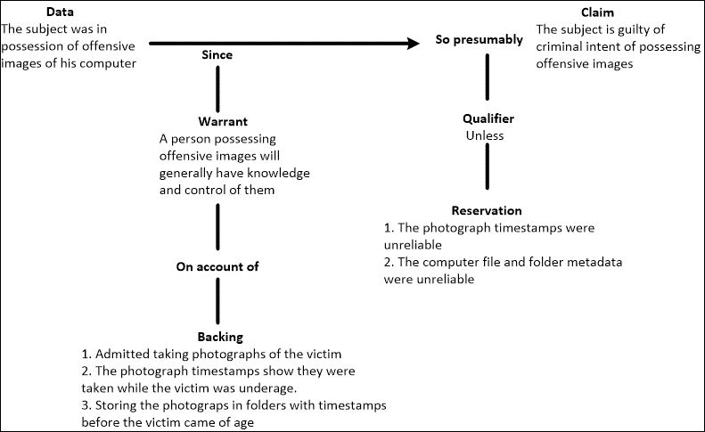

托尔敏图展示了验证证据有效性的简易性

一个有趣的网站提供了关于论证模型的背景和示例，网址是[`changingminds.org/disciplines/argument/making_argument/toulmin.htm`](http://changingminds.org/disciplines/argument/making_argument/toulmin.htm)。

该图是证据的简单表示，我用它来展示最终假设，然后每组证据可以在单独的图表中拆解，展示主张和保留意见（或反论点）的可能性。它要求从业人员以可视化的形式展示关键问题和普通人能理解的反问题。

# 数字证据验证的形式化

数字证据中的“验证”一词定义不清。我提供以下验证的定义：

> *“数字证据的验证是一个确保法院案件中呈现的数字证据是合法可采的过程，这意味着可以证明其是合法获取的；未经污染、相关，并且由于其情境性质，得到证实；并且其证明价值超过其偏见效应。”*

目前没有现行流程指导数字取证从业人员验证数字证据的有效性，以确保其在法律程序中的可采性。我的持续研究和数字取证检查增强验证模型的开发，旨在使取证从业人员能够以关于证据项目的问题形式输入数据，并通过模型中嵌入的计算，得出证据可采性有效性的诊断。模型中包含了一个软件应用，结合了**贝叶斯网络**推理过程和基于数字取证检查中遇到的一系列案例研究和情境的数据存储库。

## 正式化验证过程的预期好处

原型模型隐含的功能是，它能够量化数字验证过程，并以简单易懂的格式提供从业人员用于诊断证据验证的测量值。具体来说，模型设计必须：

+   确保每项取证检查所适用的验证条件已经满足，特别是在检查和测试每一项证据有效性时的彻底性。

+   提供可靠的证据有效性测量，以确定每一项证据是否符合证据可采性条件

这里展示的原型模型旨在通过帮助取证从业人员更好地理解和明确他们自己的取证工具、流程和实践，来协助数字证据验证。具体目标包括：

+   开发数字证据验证的正式流程

+   将这一过程实施在一个实践模型中，供从业者使用

+   提供对证据有意义且易于理解的预判，帮助从业者并最终帮助法庭

+   在验证过程中最小化错误和证据误解

+   提供彻底的验证检查机制

+   通过提供更可靠的证据分析，并能够通过科学过程验证分析，减少冗长且昂贵的法律挑战的发生

**基于设计的模型**被认为对法庭和法律从业者有益，能够提供更可靠的科学证据分析。

## 选择的理由

在各种推理模型中，选择了贝叶斯网络模型进行实验。贝叶斯推理作为一种正式的推理过程，已被法医学专家用于帮助理解和解释法律案件中复杂证据的性质。它在解读存在不确定性的证据时特别有用，尤其是当证据的可靠性存在疑问时。贝叶斯模型对于理想法庭评估新证据项的规范性较强，并且比以往更加明确地区分了信息和意见。

法律辩护人和法官倾向于依赖**归纳推理**来基于支持事实发展和评估合理的假设。然而，法医学从业者在证据验证过程中使用**贝叶斯概率论**的好处，尤其是与法院的区别，仍具有一定的价值。

研究人员强调区分科学知识和司法判断的重要性和适宜性，因为前者可以通过贝叶斯概率论得出。诉讼律师和法官通常避免基于概率推理的统计学来解释证据的合理性，但是否有必要让法律从业者理解概率推理的基本原理？在数字环境中，使用这些过程增强决策者对证据最可能表明的内容的理解，可能会带来益处。

我的研究表明，这种模型为从业者提供了一个有用的验证过程，能够：

+   以结构化的方式浏览证据组，以识别需要验证的证据

+   测试并检查这些证据，衡量它们作为证据的有效性

+   提供易于理解的测量计算方法解释

+   提供有意义的有效性度量

+   作为新手从业者的培训工具

证据的合理性帮助法医专家提供他们证据的客观证明价值的评估。从中，陪审团或裁判员可以决定被告有罪或无罪的概率。贝叶斯定理基于概率或某事发生或成立的可能性。它可以用赔率来表示，例如预测印度在测试赛中战胜巴基斯坦的可能性。这些赔率不是随机的猜测，也不是基于证据线索的推测性猜测（如归纳推理），而是基于已知和可能的结果，通常能够产生比人类猜测更可靠的预测。

在法律案件中，试图证明有罪的证据的证明力度可以通过似然比表示：

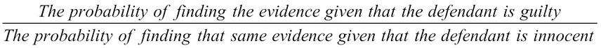

当该似然比与决策者已知的其他证据的强度（先前的赔率）结合时，决策者就掌握了**后验赔率**。贝叶斯逻辑也可以类似地用于衡量可接纳性的似然比，如下所示：

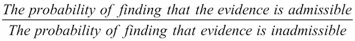

在贝叶斯推理中，任何正在考虑的假设都必须具有某种成立的概率。如果基于附加证据的假设为真，那么就会有一定的概率观察到该证据；相反，如果该假设是假的，则有另一个不同的概率观察到该证据。

## 模型的概念框架

我的研究认为，每个证据对象的有效性必须在其被认为可以接纳之前进行验证。换句话说，支持某一状态事实声明的证据验证至关重要。这些数字证据（以及一般的间接证据）可接纳的条件可以定义为其法律可接纳性、其未受污染的状态、与当前问题的相关性，以及理想情况下，是否有佐证。描述这四个证据条件及证据与声明之间关系的概念框架如下所示：

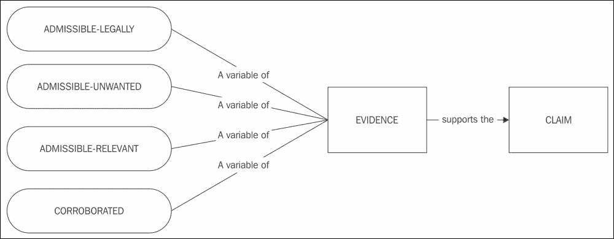

模型的概念框架

因此，为了模型的目的，*所有*可接纳条件必须满足，即，如果证据在法律上可接纳、未受污染且相关，那么该证据可以被接纳，并且在适当的情况下，证据应当被独立佐证。在下图中，突出显示的可接纳条件及其相互依赖性如下所示：

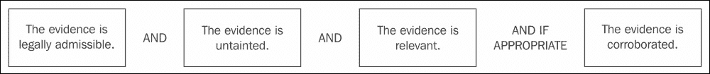

可接纳性条件图示

原型模型基于需要验证的证据可采纳条件的子结构。每个条件的提议子集已包含在内，以概述模型结构，如下所示：

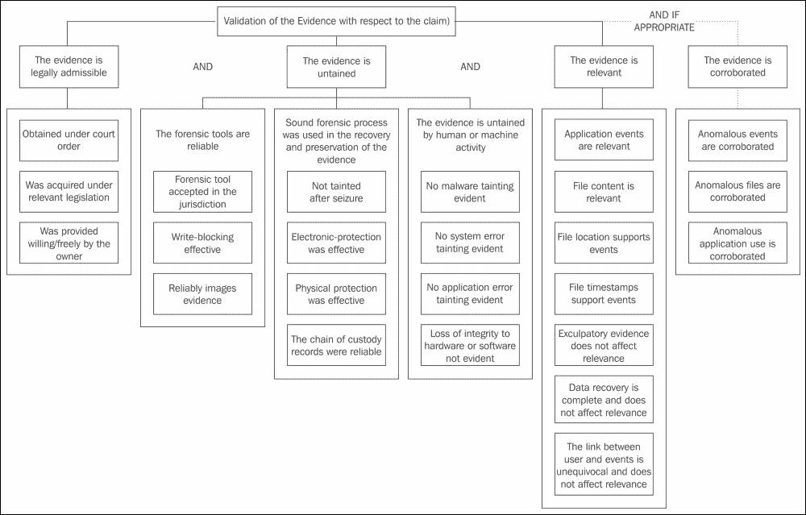

需要验证的证据可采纳性条件的结构

## 验证过程

需要验证的证据输入通过模型进行处理，基于对一组相关的、预定的问题的回应，这些问题以**e1**、**e2**等形式表示，存储在统计数据库中，如下图所示。证据输入是选择证据并准备进行质询的正式方式，建立在预设的测试和检查基础上。质询输入需要与预定事件和阈值的统计数据库进行比较，以衡量证据的可采纳性：

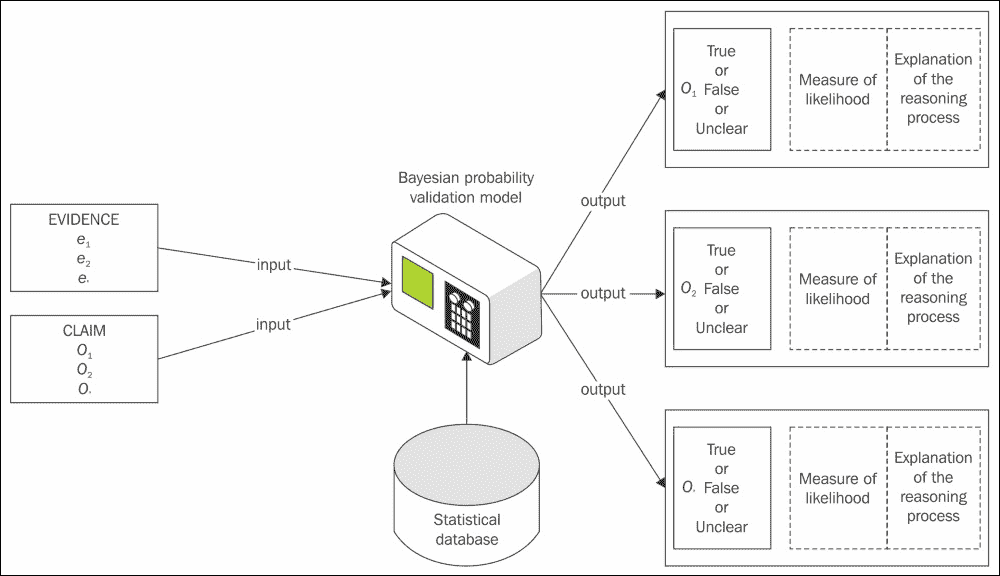

数字取证检查的增强验证模型

通过由嵌入式贝叶斯网络推理软件应用程序完成的计算，该程序利用统计数据库，模型生成一条输出声明，指出证据物品的有效性。统计数据库包含与正在审查的证据物品相关的广泛信息问题。这些问题要求有经验的证据证明，以表明它们及其相关的回答范围适合纳入统计数据库。可以基于证据物品是否满足特定的可采纳性条件来验证广泛的数字证据物品，输出结果或回应可以是简单的`Yes`（是）、`No`（否）、`Unsure`（不确定）、`Discounted`（已折扣）或`Cannot Be Determined`（无法确定）。

输出结果包括可供实践者理解的推理过程说明，以及对于如果提供的测量结果得出负面预期所需进一步调查过程的建议评论。

## 将贝叶斯推理应用于验证分析

本模型所展示的真正价值在于帮助验证那些存在一定不确定性的证据。模型的第一个条件——证据的法律可采纳性——是一个相对直接的组成部分，不像其他条件那样复杂，且没有明确的最终结果声明。这个相对简单的条件将在以下小节中描述。

### 法律可采纳性分析的相对简易性

在许多情况下，证据的有效性是明确证实的且没有争议的。证据的合法可采性要求遵循某些法律程序，允许扣押和检查证据，或者要求合法所有者授权获取该证据。除非在特殊情况下，通常需要确认证据是否合法获取，才能在审判中提交。证据扣押的合法性，例如根据搜查令扣押的手机，似乎很简单，前提是没有需要更严格遵守搜查令的特殊情况。

在电子发现过程中，搜查令可能会规定只收集特定数据，以保护数据保管人和用户的隐私。任何超出搜查令条款收集的证据可能会面临法律挑战。

这些合法授权的情况可以通过一个简单的决策树过程和流程图进行检查，通常会给实践者和法律代表提供正面或负面的结果。根据搜查令收集的证据合法性检查过程在以下图表中有所展示。该过程要求满足所有检查条件；否则，收集到的信息可能无法被采纳。实践者必须参考立法下的其他扣押形式以及所有者的许可，并应用类似的检查：

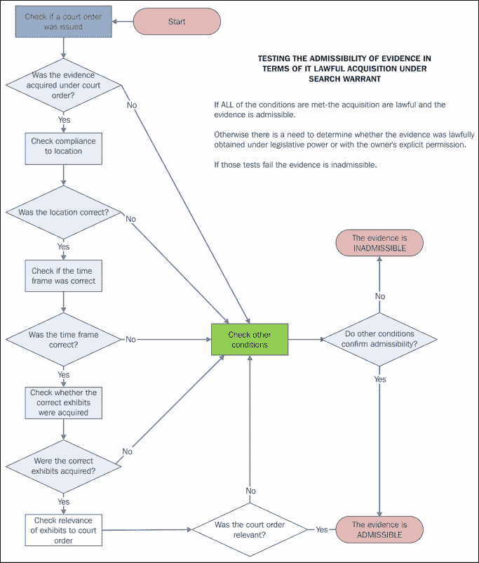

流程图：测试证据合法获取的条件

在这些情况下，并不需要复杂的软件过程，但检查其他可采条件可能需要一些结构化的指导。尤其是在确定计算设备上基于文件的事件的相关性时，正如下一小节中的示例所解释的那样。

### 更复杂的组件需要科学测量

文件与操作系统和应用程序系统之间的关系涉及复杂的动态，需进行仔细审查。对于数字证据有效性的更科学测量需求，在更加复杂或曲折的情况下尤为明显，因为数字证据的性质可能由于其特性而产生误导。

这些特性包括检查文件位置；时间戳；创建、传输和存储的前因；以及其他帮助重建设备或系统使用的事件，如软件和用户生成的事件。当将文件事件（或其缺失）关联时，这一分析变得更加具有挑战性，并引入了一定的不可确定性，这种不可确定性必须以某种方式被测量，以确定证据的有效性。

如果仅凭直觉和经验对这些复杂问题进行评估，可能并不正确。可能存在对基本事实的主观和权宜处理的倾向。关于相关性的解释，在不同的从业人员中也会有所不同，且很少有人或根本没有考虑测试他们的假设。当然，除了自己的组织或团队外，实际上没有任何中心化的资料库供从业人员查阅，因此，一些从业人员可能会表现出防御性自我中心的倾向——这显然不是理想的科学环境，但出于安全原因，可能不会分享此类案件细节。

例如，已经证明，基于网页的电子邮件消息相对容易伪造和替换，且通过一些基本知识，干预的证据也容易被掩盖。

如果为了突出模型，我们拆解其中一个可采纳性条件，例如证据的相关性，如下图所示，则必须检查七个已识别的子条件，以确定其相关性。例如，若以子条件**r7**为例，用户与事件之间的联系是明确的，不影响相关性。

存在许多可能的远程访问实例，应促使从业人员验证某个陈述是否成立。检查嫌疑用户与关键事件之间的关联可能需要检查，是否有其他用户通过物理访问、黑客攻击等远程访问方式，或通过如 TightVNC 等软件应用程序的存在访问计算机：

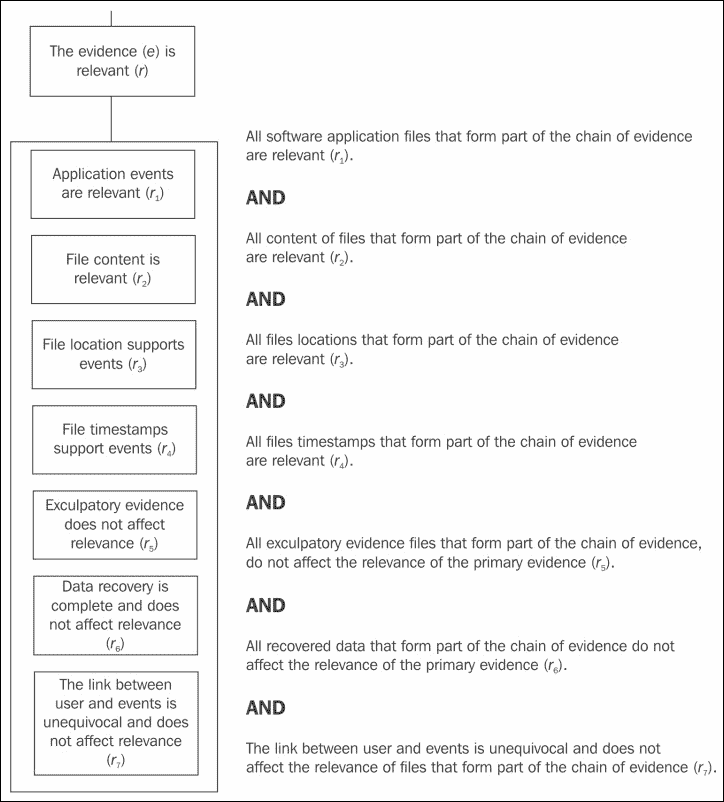

可采纳性条件——相关性

这些可能的远程访问实例可能表明，单一用户并未独占计算机的访问权限，因此需要更大的确定性来建立特定用户与违规证据之间的联系。在实践中，作为案件审查的一部分，从业人员应检查所有这些潜在的联系。为了说明这一过程，以下演示通过假设的情况展示了如何通过软件应用程序的存在来测量远程访问漏洞的可能性。

流程图如下所示，展示了检查应用程序和文件的过程，以确定在与违规行为相关的时间是否发生了其他用户访问。检查过程的不同结果有助于从业人员判断证据是否可采纳，因为发生远程访问的可能性很小。检查结果还可能表明，证据不太可能牵连到计算机所有者，因为其他用户的访问是通过远程访问得以暗示的。此过程还可能显示，其他用户访问的可能性不确定，或可能无法确定。

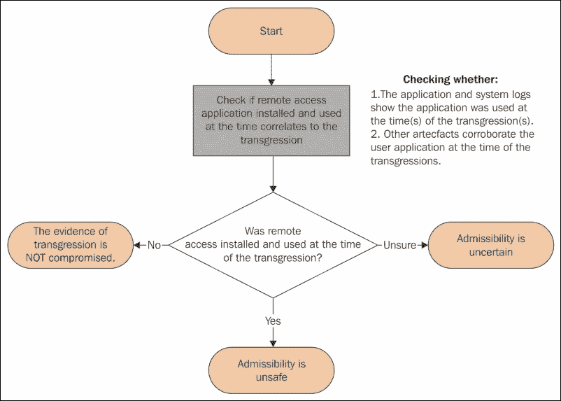

检查通过设备上安装的应用程序进行远程访问的过程

关键问题是远程应用程序是否在违规发生期间已安装并使用。从业者可能确认或不确认计算机上是否存在该应用程序，因为它可能已被卸载或删除且没有留下痕迹，并且日志文件可能也不再存在。如果无法得出结论，检查其他系统记录（如事件查看器和注册表）可能会揭示该应用程序以前的使用情况。任何显示应用程序在违规时或接近违规时启用了远程访问的迹象，都会引发未经授权使用计算机的可能性。此示例用于演示该模型处理推理输入并提供有用输出预后的能力。

在此选定的样本场景中，重要的是确定计算机上是否曾经存在远程访问应用程序。如果确认这一点，那么它可能对违规事件的性质产生的影响应该被视为理所当然地考虑。一个勤勉的从业者会检查应用程序文件的元数据，以确定应用程序是否在安装之前已经安装。如果确认先前已安装，那么重点将放在检查应用程序和系统日志，以确认该应用程序是否在违规时使用。

对应用程序运行证据的正面回应应该引发警觉，如果其他证据支持在违规时使用该应用程序，那么从业者应考虑计算机的其他用户活动。

如果能够确定应用程序在违规时未被使用，这将使从业者得出结论，认为此事不会降低证据的价值。此外，如果应用程序一直存在于计算机上且未使用，则不会降低其有效性。

然而，如果应用程序已安装，这将引起对其在违规时使用的担忧，并需要进一步检查。应用程序降低证据有效性的可能性增加，并且可能会被衡量，特别是当能证明它在违规时已被安装并使用时。如果其使用不确定，这将影响可能性比率，并具有不确定预后的含义。

如果其他证据支持在违规时使用该应用程序，则会呈现不同的可能性比率。正是这些问题的累积结果和所提供的输出测量值，使从业者能够深入了解所提出的含义，但有时，大脑需要额外的帮助。

### 确定先验概率

每个假设都有一个先验概率，即在任何证据被关联之前，该假设为真的概率，并且可以在任何时候进行修改。在假设远程用户通过在目标计算机上安装并运行远程访问软件来利用漏洞的例子中，设置先验概率是首要任务。

模型中的每个子类别都有不同的阈值，用以向专家展示不同的输出。

在试图确定是否存在远程应用程序来利用该设备时，可能会决定这种事件的发生概率不高或极不可能，其他的量表也可能会被选择，但仍然在合理预期的范围内。问题是，是否有远程应用程序允许外部攻击用户的计算机。实践者必须决定是否有发生这种事件的概率较低、极不可能、可能、最有可能等。所有的预测必须是合理的，并且在计算机上可能发生的范围内。

如果事件发生不频繁，可以选择一个较低的先验概率阈值 0.01，表示概率为 1/100。如果发生的可能性更大，可以选择较高的先验概率阈值，比如 0.1，表示概率为 1/10。较低的阈值意味着这种事件发生的频率较低，而较高的阈值则表示发生频率较高。

模型中嵌入了灵活性，允许根据刑事和民事案件的确定性标准进行调整，例如刑事案件中的“超出合理怀疑”或民事案件中的“平衡概率”。在刑事案件中，如果证据不能超出合理怀疑，那么被告应当得到怀疑的利益。

### 设置后验概率

下一步是根据不同假设来确定后验概率或后期概率。与此命题相关的有两个证据：

+   违规时远程应用程序是否在运行？

+   系统日志是否确认在违规时远程应用程序正在运行？

如果其中任何一个在运行，这将表明远程用户在违规发生时访问了计算机的概率（这可能是未经授权的黑客攻击，也可能不是）。我们可以将此概率设置为 0.8，即 10 次中有 8 次的概率。我们也可以将阈值设置为 1.0，这意味着当这些事件中的任何一个在违规期间发生时，就可以确定远程攻击已经发生。然而，没有确凿的证据时，无法预测这样的确定性。

在尺度的另一端，我们可以将其设置为 0.01，这意味着即使远程应用程序没有受到攻击，仍然有 1/100 的概率观察到应用程序在违规时正在运行。在测试样本中，先验概率分别设置为 0.1 和 0.01，以观察在计算这两个问题的输出时是否有显著差异。每个问题的后验概率分别设置为 0.8 和 0.1，因为这两个问题的重要性被认为相同，均用于确定远程攻击的可能性。

这些后验概率比率是基于以下认识计算的：如果这两个问题中的任何一个回答为肯定，那么远程攻击的可能性就很高；如果两个问题的答案都为肯定，则高度可能。更高的 0.8 阈值支持这一测量，而 0.01 阈值则被认为是代表了不应轻易忽视这一概念的事实。

模型根据这个问题提出了这些阈值：远程应用程序在违规时是否正在运行？在这种情况下：

+   如果远程应用程序在违规时正在运行，则观察到的概率为 0.8。

+   即使远程应用程序未被攻破，也会观察到在违规行为发生时应用程序正在运行的概率为 0.01。

它还会考虑以下问题：系统日志是否确认远程应用程序在违规时正在运行？在这种情况下：

+   如果远程应用程序在违规时正在运行，则观察到的系统日志显示的概率为 0.8。

+   即使远程应用程序未被攻破，也会观察到系统日志显示在违规行为发生时应用程序正在运行的概率为 0.01。

基于对**是**、**否**和**不确定**提示的完整响应范围，模型的输出如下表所示。如表所示，在使用 0.1 和 0.01 的先验概率比率时，观察到了一些差异。使用较低的 0.01 概率比率时，比使用较高的 0.1 阈值时，支持假设的范围或赔率较低。

以下九个输出报告包括：

+   **假设是可能的**：来自实例**D**的一个结果。

+   **假设不确定**：来自实例**B**、**C**、**F**、**G**、**H**和**I**的六个结果。

+   **假设被否定**：来自实例**A**和**E**的两个结果。

    | 应用程序状态与赔率实例 | 远程应用程序在违规期间是否正在运行 | 其他系统数据是否表明远程应用程序在违规期间正在运行 | 先验赔率（后验赔率 0.8 和 0.01） | 模型计算得出的赔率 | 远程应用程序攻破的预后 |
    | --- | --- | --- | --- | --- | --- |
    | **A** | 否 | 否 | 0.1 | 2 in 443 | 这个假设被排除 |
    | 0.01 | 1 in 2,427 |
    | **B** | 是 | 否 | 0.1 | 9 in 14 | 这个假设不确定 |
    | 0.01 | 8 in 57 |
    | **C** | 否 | 是 | 0.1 | 9 in 14 | 这个假设不确定 |
    | 0.01 | 8 in 57 |
    | **D** | 是 | 是 | 0.1 | 712 in 713 | 这个假设是可能的 |
    | 0.01 | 66 in 67 |
    | **E** | 不确定 | 不确定 | 0.1 | 1 in 100 | 这个假设被排除 |
    | 0.01 |
    | **F** | 是 | 不确定 | 0.1 | 53 in 59 | 这个假设不确定 |
    | 0.01 | 17 in 38 |
    | **G** | 不确定 | 是 | 0.1 | 53 in 59 | 这个假设不确定 |
    | 0.01 | 17 in 38 |
    | **H** | 否 | 不确定 | 0.1 | 7 in 319 | 这个假设不确定 |
    | 0.01 | 1 in 491 |
    | **I** | 不确定 | 否 | 0.1 | 7 in 319 | 这个假设不确定 |
    | 0.01 | 1 in 491 |

### 检查远程访问应用程序是否在违规时运行

关于远程访问应用程序在违规时是否运行的结果分析，检查过程提供了不同的结果，具体描述如下：

+   这个假设是可能的：从这些结果中，执业人员会认识到，在一个实例（D）中，反映出两个问题都是积极输入的情况下，远程利用的可能性较高。

+   这个假设不确定：实例 B、C、F、G、H 和 I 应该让评估者意识到，是否发生了远程利用现在有一些不确定性。在实例 B、C、F 和 G 中，0.1 的结果显示支持这些假设的可能性大于反对，而 0.01 的结果则显示相反。其余实例显示使用任何可能性比率时对假设的支持非常小。结果的不确定性可以衡量，且有些结果偏向排除这些假设，尤其是实例 H 和 I，而 B、C、F 和 G 是更模棱两可的结果，暗示远程访问利用是可能的，但并未得到证明。

+   这个假设被排除：实例 A 和 F 表明这个假设极不可能。

提供给执业人员的注释，包括关于输入问题的重要性及一些背景信息，以协助检查和测试响应问题所依据的证据，也会包含在输出报告中。

以下是关于应用程序在违规时是否运行的样本说明：

### 注释

证据：应用程序在违规时是活跃的

问题：应用程序在违规时是否运行？

响应：是

注意：应用程序的操作日志可能提供确认，证明应用程序在违规期间是活跃的。检查 Windows 中的可用卷影副本也可能提供一些确认，证明应用程序在关键时刻是活跃的。

这是有关应用程序在违规时段运行的样本注释，基于系统日志：

### 注意

证据：其他系统日志确认远程应用程序运行

问题：其他系统日志是否确认远程应用程序运行？

回复：是的

注意：此信息可能来源于 Windows 事件查看器文件。Windows 注册表还可能提供额外信息。

### 现有的限制和范围

该模型处理的是展品的可接受性而不是其证据重量。证据的重量，包括其合理性，超出了模型的范围，是调查团队和法律从业者讨论和最终由陪审团决定的问题。

原型和其他模型的结果必须增强对数字证据物件有效性的复杂性和似然比的理解。这被视为增强从业者将其发现传达给他人的方式的一部分。

# 数字证据的呈现

有两种主要类型的专业人士在审判、询问或听证会上提供证词：

+   技术或科学证人证词

+   专家证人证词

数字取证从业者可能被要求扮演两种或两种角色。技术或科学证人提供调查过程中发现的事实证据，并描述发现的内容及其获取方式。专家证人基于经验对所观察到的内容提供意见，使用演绎推理来说明或检查的事实。

强调再次强调，在撰写报告或亲自作证时，从业者必须确保无论是有利于被告还是不利于被告的证据都被提供给对方。从业者在呈现证据时必须确保以下事项：

+   结论在技术上是合理的

+   证据坚实支持它们并且被适当地保留

+   已考虑到可能发现的任何有利证据

## 准备数字取证报告

在准备法庭审查报告时，重要的是力求清晰简明，并确保证据易于访问并正确交叉引用。报告应提出建议，包括预防事件再次发生的建议，并描述允许其发生的根本原因（如果有的话）。

在最佳状态下呈现证据，并逐步展示检查过程。此外，还应描述案件的优势和劣势如下：

+   首先和最后的最受欢迎的立场

+   中间的选择

+   在过程的背景下总结证据

+   在对方之前处理异常情况

+   如有结论，提出结论

+   提供得出这些结论的依据

+   处理其他可能的解释及其基础

+   清晰的结论，包括可理解和有理有据的推理

+   如果给定的信息有误或发生变化，结果和结论是否会改变

这里展示了一个样本报告大纲：

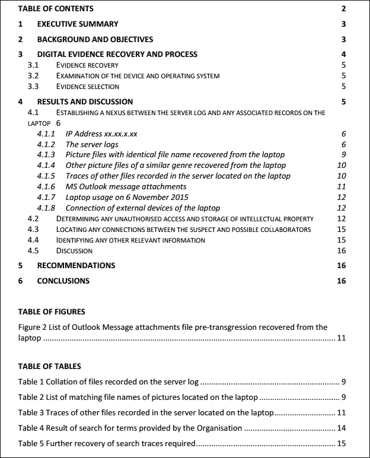

一个样本法医报告布局

它包含一个**执行摘要**，简明扼要地概述报告的目的、涉及的过程、恢复证据的分析以及其他关键事实。报告的主体部分提供了更详细的案件背景和法医检查的目标。

报告还应包括证据恢复过程，包括链条信息（如果没有单独的登记册）。然后，具体详细地描述检查结果，在这一部分的末尾进行讨论，并将其嵌入报告的相关部分。报告的最后包括任何建议和结论，并附上图表、表格以及相关文件的附件。

## 出庭

陪审团对从业人员的证据非常重视，这得益于《犯罪现场调查》。我们*所有人*都有责任帮助他们理解*并*不高估它。仅仅因为从业人员了解自己的专业领域，并不意味着陪审团和法律团队也能理解。

专家的基本规则是：

+   知识要扎实

+   永远不要低估律师

+   在回答问题前要先思考

+   诚实

+   结果并不重要

记住，从业人员应保持公正，并且需要证明：

+   使用的过程背后的科学原理

+   技术的过程或验证数据

+   使用的参考数据库及使用原因

+   他们计算统计数据和可能性比率的能力（为这些过程的必要性辩护，正如在验证模型中所述！）

从业人员还应实践以下内容：

+   使用简明的语言，避免行话。

+   保持在自己的专业领域内。

+   确保他们在相关特定事项上的研究是最新的，特别是当该领域不断变化时。

+   如果报告中存在错误，或从业人员在试验前改变了想法，需紧急通知律师。

+   如果从业人员在法庭上改变了想法，那就改变吧：要勇敢。如果真相要求改变立场，就要做好准备。

+   承认知识的不足或不确定性，并接受其他合理的提议。

+   如果问题不清楚或提出复杂问题，请要求重复并拆解问题——如果含义仍不明确，拒绝回答。

+   注意问题中的假设和误引，并确保所依赖的信息容易找到，例如在计算机上共享信息作为视觉辅助工具时。

+   尽量避免防御性反应。

+   对诸如“难道不可能吗？”的问题回答：“我没有看到任何证据支持这个说法。”或者“这非常不可能。”

+   留意模糊或多部分的问题。

+   为法官提问并准备接受进一步的交叉盘问做好准备。

+   保留初步笔记并在审判前复查。

+   标注笔记，带到法庭，并要求在作证时引用它们。

+   倾听、暂停、思考，仅回答被问到的问题。

+   说出完整的真相，不要对律师居高临下。

+   如果答案是“是”或“不是”可能引起误导，请不要仅仅回答这些——寻求法官的帮助。

+   在审判前向朋友练习。

+   不要表现得过于聪明。

+   不要争辩或失去重点。

+   不要试图猜测。

+   在各个案件之间保持一致性。

+   将每个问题视为案件中最重要的一个。

除非从业人员：

+   居高临下地与律师对话

+   显示明显的偏见

+   自负、失去耐性并变得防御性强

+   准备不足

+   提供令人困惑、难以阅读、杂乱无章的视觉辅助材料

法院和法律团队希望看到从业人员的资质，其中应包括：

+   你的职称和工作年限

+   在该领域工作的年数

+   进行此类分析的次数

+   资质，包括学术背景和培训课程

+   在数字取证过程和工具的能力上具备的技能和认证

+   职业经验

+   发表的文章

+   向专业学会作的讲座和报告

+   先前的专家证词，包括作证的法院类型

+   专业组织的会员身份

+   参加的研讨会/座谈会

# 面对数字取证从业人员的伦理问题

伦理学关乎对与错的行为，促使我们反思一个人在各种情况中应如何行动，尤其是当面临伦理困境时。通常，每种情况下，每一项行动选择都有令人信服的支持和反对论点。

除其他行为外，伦理行为要求：

+   诚实

+   公正

+   良好的声誉

+   一致性

+   良好意愿

+   勤奋

+   熟练程度

+   社区意识

伦理学是哲学的一个分支，研究人类与他人、动物、环境以及宇宙中所有事物之间的相互关系。它询问某个行为是否是：

+   好或坏

+   对与错

+   可接受或不可接受

+   善良或邪恶

伦理学实际上是很难定义的，不同的解释和环境使得尝试定义一个普遍意义变得复杂。我们每个人都可能从许多来源中衍生出个人的伦理观，包括家庭和文化、宗教或信仰、法律体系以及我们生活的地方。考虑到需要保持最高标准，在进行法医检查时的懒散和庸俗是不可原谅的。

从业人员将会经历一些考验其伦理标准的情况，正如以下案例研究所示。公正性和对法院的服务听起来可能有些陈旧，但当被迫放弃标准时，它却是一个坚固的防线。专家的首要责任是对法院，而非对委托方。

# 案例研究——假定未经授权使用知识产权

这个最近的案例研究展示了在检查过程中可能出现的一些问题，并提供了一些避免常见陷阱的建议。

## 案例背景

这是一起涉及员工的工业间谍案件，员工涉嫌窃取雇主的知识产权。当监控录像显示员工在下班后两个小时仍在工作站上时，产生了怀疑——这种行为对员工来说非常不寻常。对监控录像的审查显示，画面中部分可见员工的笔记本电脑，并且可以看到桌面上文件的打开。

对公司的服务器进行检查确认了在与 CCTV 监控录像同时，下载了一些文件，包括图像、电子表格以及一些文本文件。服务器日志还显示了服务器与笔记本电脑上的电子邮件账户之间的同步。雇主得知员工将加入竞争公司及其他有关其不忠的传闻后，员工的服务在 3 个月后被终止。

在员工离职之前，公司悄悄地在笔记本电脑（公司的财产）上安装了一个应用程序，用于监控感兴趣的浏览活动。此举的合法性存在疑问。员工离职后，IT 管理人员对笔记本进行了检查，寻找可能证明员工有罪的信息。他们安装了各种应用程序试图恢复已删除的文件，但未能成功。此时，寻求了法医专家的服务，希望通过寻找证据来决定是否有足够的理由向警方提出投诉。

## 法医恢复

随后对笔记本进行了检查，但无论是通过启动还是移除硬盘，均无法获得硬盘的物理镜像，这个过程显得繁琐且有一定风险可能损坏设备。理想情况下，物理镜像能够恢复已删除的数据，但此次情况下，并不能保证安装在固态硬盘上的设备特有的操作系统能提供更多的证据。

不是所有设备都能够通过启动过程进行恢复，设备移除（如果可能）应作为最后手段。建议在一个特别配置的外部硬盘上安装 ISeekDiscovery，以便捕获设备的逻辑镜像，但由于插入硬盘可能覆盖附加硬盘日志，因此对此表示担忧。

公司法务团队被告知，证据可能会有些许污染，但由于设备已经被其他人员访问过，损害已经发生，法医过程不太可能进一步污染数据。已获得许可继续提取数据，且已按程序完成。

## 法医检查

检查恢复了一些数据，并作出了以下观察：

+   确认在服务器下载发生的下班后期间，笔记本电脑处于开启状态。时间与其他证据相符，这些证据与员工在办公室工作场所的身体存在有关。

+   找到了一些图片文件的位置，这些文件与从服务器下载的信息有些相似。从笔记本电脑中恢复的一些图片文件名与服务器日志中记录的文件名似乎完全相同。

+   笔记本电脑上还找到了其他一些看似属于组织的知识产权的图片文件。

+   服务器日志中记录的多个相似文件名在笔记本电脑上找到了，但时间戳不匹配。

+   服务器日志中记录的多个文件名在笔记本电脑上未找到。

+   笔记本电脑上找到了多个电子邮件和日历文件，且这些文件似乎与组织的业务相关。

+   设备上有一些克隆软件的证据，表明有组织财产被复制。

## 将嫌疑人与设备以及设备与服务器的联系

IT 管理员无法确认服务器日志中记录的文件是否通过员工的笔记本电脑进行了打开和访问，依据是服务器日志中显示的 IP 地址。根据 IT 管理员的说法，这是在员工登录服务器时，分配给多个员工的 IP 地址。然而，尽管进行了大量搜索，笔记本电脑上没有找到该 IP 地址的任何痕迹，这很可能是在员工离职后，设备退役过程中被删除的。IT 管理员还确认，除了 IT 管理团队外，没有其他员工有权限远程访问服务器。并且确认了 IT 管理团队未曾访问过服务器。

还建议保留访问日志的备份副本作为潜在证据。办公室的监控视频显示了员工在工作场所的身影，而不是显示建筑物的监控视频，视频中显示其他员工已提前离开。笔记本电脑没有显著的标识特征来确认它就是监控视频中显示的那一台，尽管可以看到疑似员工正在使用其键盘。笔记本电脑上没有任何记录表明与服务器有连接，除了通过电子邮件同步和公司拥有的数据之外，这些数据后来通过搜索词被识别出来。

对该日期恢复的其他数据表明，员工的电子邮件账户曾用于发送和接收工作消息。这建立了员工、笔记本电脑与服务器之间的合理联系，且难以反驳。然而，确认文件被下载到笔记本电脑并在未经授权的情况下使用并不那么简单。

## 分析下载的文件

在笔记本电脑上仅恢复了部分已下载的文件，并且时间戳与下载时间不匹配，有些时间戳早于，另一些则晚于服务器记录。同样，日志中显示的任何同步服务器电子邮件也未在笔记本电脑上找到。

## 连接的存储设备

在 IT 管理员人员安装数据恢复设备到笔记本电脑之前，未检测到任何关于外部设备连接的信息，如 U 盘或外部存储设备。这些信息有助于确定是否使用外部设备复制了公司的数据。

这种连接日志缺失可能归因于以下因素：

+   操作系统未保持完整的附加设备列表，类似于 Windows 系统。

+   IT 管理员团队在法医检查之前附加外部设备，尝试恢复已删除的文件并检查笔记本电脑。这会导致覆盖并删除任何早期的日志事件。

+   在涉嫌违规事件发生和员工离职之间的三个月期间，系统可能还记录了连接的设备，但这些事件可能已覆盖任何相关的早期连接记录，并很快发生了变化。

+   日志可能已经被手动删除，但这需要一定的存在知识和技术技能。

+   USB 端口位于键盘的左侧和右侧，靠近屏幕。显然，根据监控录像，没有报告发现任何连接的设备。

笔记本电脑未配备 micro-SD 卡槽，因此该数据传输过程不可用。或者，如果图片和其他文档如电子表格和 PDF 文件曾出现在桌面上并随后被删除，如果它们已被删除并从回收站中移除，恢复这些文件的可能性很小——简单来说，证据并不存在。

## 非法复制数据

在涉嫌违规后，克隆应用程序的安装文件位于笔记本电脑上，且早期浏览记录与该软件网站有关。该应用程序会对笔记本电脑进行克隆，这意味着如果它被使用，将允许用户保存完整的数据记录，以便未来可能使用。通过这种过程保存的数据可以让用户在另一台机器上重新安装数据并使数据可用。目前无法确定该应用程序是否用于克隆设备；然而，存在这种可能性。谁加载并安装了该应用程序尚未确定，且这可能不是员工所为，因为笔记本电脑的数据完整性在法医检查之前，已在某种程度上受到工作人员操作的影响。

## 结果

有一些证据显示员工最有可能持有公司财产，并利用该财产来私下谋取商业机会。是否这些信息足以证明盗窃或知识产权滥用的案件尚不确定，但实际上，这并不是从业者所关心的问题。为什么在这里呈现这种不起眼但并不罕见的案件，是因为它让公司形象受损，并突显了从业者面临的一些挑战：

+   客户是以怀疑为驱动，基于八卦和暗示在初始阶段就已决定员工有罪，而从业者则是证据驱动且保持中立。

+   客户期待这些怀疑得到确认，但当证据部分不明确且不具决定性时，感到失望。

+   证据在某种程度上证实了这些怀疑，但仅限于此，案件显得薄弱，客户期待法医提供更多的辅助证据——有时确实如此；有时则恰恰相反。

+   客户要求将有关证据污染的评论从从业者报告中删除。由于伦理和程序原因，这一要求被拒绝，客户被严厉告知，从业者是法院的仆人，而非客户的仆人，并且不是一个可以受客户操控的调查员。从业者的这一拒绝得到了客户律师的支持。

+   在这个特定法域内，安装网页浏览追踪应用程序是否合法存在一些疑问，这需要法官的授权令。

亲爱的读者，请思考一下，如果从业者未能作出全面且诚实的说明，法律团队本可能会继续推进，准备起诉或诉讼，并且有合理的机会通过威胁迫使员工承认某些责任和罪行。

如果从业者妥协并删除了污染信息，外界会怀疑客户可能通过一个看似合理的案件进行拖延，试图让员工承认怀疑中的违规行为。但一旦从业者迎合客户的意愿，便会陷入堕落的滑坡。通常，反方法律团队会发现并未做出全面和公开的证据披露。这可能导致案件被法院驳回，并且从业者的声誉受到损害，甚至可能是永久性的。

# 总结

本章描述了不可靠的数字证据问题、在进行法医检查时需要保持公正性，以及一些常见的陷阱，这些陷阱通过草率和偏见的检查降低了数字法医的价值。

结构化和平衡分析的迫切需求被概述，同时还强调了验证证据的必要性，以确定其在法律程序中提交时的相关性和真实性。该过程强调了测试和检查证据的重要性，以确保其与声明一致。这包括对所收集证据的更结构化分析的讨论，包括根据法医标准发展和测试假设以及反驳论点。

提出了一个验证的原型模型，旨在帮助实践者处理复杂证据，其中通过一个示例场景展示了测试和检查数字证据的过程。证据报告的呈现和法院出庭也得到了简要讨论。

在案例研究中概述了伦理问题，并强调了选择和分析证据的重要性，同时强调了在选择证据时保持公正性，以确保法院的期望得到满足。

第十章，*赋能实践者与其他利益相关者*，将总结书中涵盖的主题，讨论影响实践者和利益相关者的趋势，并强调以更务实的方式管理可能在法律听证中依赖的数字信息的必要性。它将描述通过更好的流程赋能数字取证实践者和其他利益相关者的方法。我将重点介绍数字取证实践中的趋势，以及采用更好策略来管理日益庞大和复杂数据集的需求。同时，还将介绍增加利益相关者意识和提高他们管理所托管的数字信息能力的流程、工具和法医应急策略。
