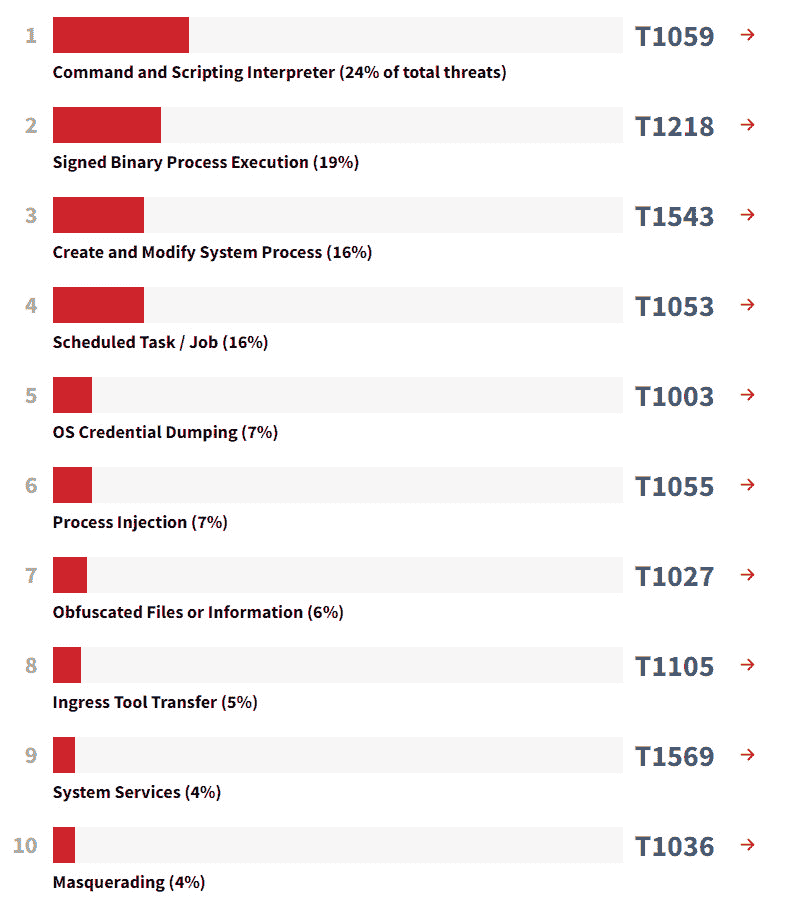

# 第一章：为什么选择内存取证？  

我们生活在一个变化无常的世界里，而网络犯罪也不例外。新的攻击技术不断被开发出来，数百种恶意程序和脚本被编写并测试，以绕过安全控制，同时扫描器也在互联网世界中仔细检查易受攻击的主机和公开的服务。这就是为什么保持与时俱进并拥有各种工具和技术以便与威胁行为者保持同步显得尤为重要。  

那么，为什么**内存取证**在今天的许多数字*取证检查*和*事故响应工作*中是至关重要的一部分？数字取证和事故响应专业人员使用的主要调查目标和技术是什么？他们每天面临哪些挑战？你将在本章中找到这些问题的答案。

本章将涵盖以下主题：  

+   了解内存取证的主要好处  

+   了解调查目标和方法  

+   发现内存取证的挑战  

# 了解内存取证的主要好处  

自然地，对于拿起这本书的读者来说，好处是显而易见的。既然你已经决定深入了解内存取证，想必你有自己的原因。不过，让我们再来看看**随机存取内存**（**RAM**）调查可以在以下几种常见情况下发挥重要作用的场景（不仅仅是在数字取证中，还有事故响应和恶意软件分析中），也许你会发现自己所学的知识和技能还有新的应用场景。  

## 没有留下任何痕迹  

过去几年，使用*地面生存*和*无文件*攻击技术的威胁行为者数量大幅增加。攻击者不再像以前那样关心清除自己的痕迹，而是尽量留下尽可能少的痕迹以避免被检测到。这使得信息安全专业人员的工作变得更加困难，因为内建工具的使用和磁盘上没有恶意文件可供扫描意味着一些传统的安全解决方案可能失效。缺乏日志记录可能使得在事后检查过程中很难重建威胁行为者如何滥用内建的双用途工具，例如各种命令和脚本解释器，因此获取和分析内存可能在这些案例中起到关键作用。  

让我们分别讨论每个案例。  

### 在内存中找到我  

让我们从专门在内存中工作的**恶意软件**谈起。这个概念本身并不新鲜。当谈到内存驻留恶意软件的时代初期时，一些研究人员提到*马耳他变形虫*，这是一种 1991 年在爱尔兰首次发现的病毒。也有些人喜欢从 2001 年出现的*Code Red*蠕虫谈起。无论如何，自 21 世纪初以来，无文件攻击势头越来越强，并变得越来越流行。例如，载荷可能通过 PowerShell 直接注入到内存中，这已经变得极为普遍。进程注入技术本身已被许多网络安全厂商列入 2020 年 MITRE ATT&CK®十大技术之一。例如，以下是*Red Canary 2021 年威胁检测报告*中的十大技术，来源于[`redcanary.com/threat-detection-report/techniques/`](https://redcanary.com/threat-detection-report/techniques/)：

图 1.1 – 2020 年 MITRE ATT&CK 十大技术

进程空洞化、动态链接库注入、进程双胞胎等**进程注入**子技术不仅被高级的国家支持的威胁团体使用，甚至普通的恶意软件操作者也会使用。

### 工作框架

另一个问题是使用大量**后渗透框架**，如 Metasploit、Cobalt Strike 或 PowerShell Empire。这些工具为攻击者提供了广泛的选项，可以生成各种恶意载荷并将其注入内存。

这些框架最初是为进攻性安全而设计的，最先让渗透测试人员和红队员使用，随后各种威胁行为者也开始使用它们。这些框架使得即便没有出色的恶意软件开发经验的攻击者，也能以非常有限的磁盘足迹使用各种技术。例如，Cobalt Strike 的 Beacon 载荷的非托管 PowerShell 功能允许威胁行为者在不实际运行`powershell.exe`的情况下执行，反而是滥用 Windows API 来实现。

像 Cobalt Strike 这样的框架已经变得如此普遍，以至于一些威胁行为者甚至使用它们代替定制恶意软件。例如，臭名昭著的 Evil Corp 集团，其成员被认为是多个高知名度勒索软件攻击的幕后黑手，包括 Garmin 公司，已将 Dridex 木马转为 Cobalt Strike 的 Beacon，在其*WastedLocker*攻击活动中使用。

### 利用现有资源

**利用现有资源**是一种非常流行的方法，攻击者利用内置工具和已安装的合法软件来达到自己的目的。例如，大多数工具，如 PowerShell 或 WMI，通常由系统管理员用于执行日常任务，这使得不仅仅是发现攻击者变得困难，而且要阻止攻击者使用的工具也非常有挑战性。

攻击者可以利用“以土地为生”（living-off-the-land）技术，采取多种策略。PowerShell 可以用于从攻击者控制的服务器下载初始有效载荷，像`rundll32.exe`和`regsvr32.exe`这样的二进制文件可以用于执行和防御规避，**Ntdsutil**可以被用来访问凭证，**PsExec**和**WMIC**则可以被滥用进行远程执行。有许多类似的例子，如果 IT 基础设施没有先进的日志记录功能，分析师提取这些信息的机会可能非常低。如果能及时获取，内存分析可能会提供极大的帮助！

另一个重要的提醒是，在许多情况下，你只能在磁盘上找到恶意二进制文件的第一阶段——下一阶段（甚至可能是接下来的多个阶段！）直接从服务器加载到内存中，因此，如果没有内存镜像，在事后分析时你将无法看到它。

更重要的是，现在大多数恶意二进制文件都经过打包、编码和加密，以避免被检测到，但在内存中却不会如此！因此，你可以使用像 PE-sieve 这样的工具来收集潜在的恶意代码进行进一步分析。当然，我们将在接下来的章节中向你展示如何操作。

## 隐私保护者

近年来，*隐私*问题变得更加严峻。每天都有大量个人数据、照片和消息出现在网络上。服务提供商收集关于我们个性、兴趣和日常习惯的信息，以提高工作效率和实用性。即时通讯工具、带隐私模式的浏览器、内存文件系统、密码管理器和加密容器应运而生。

当然，隐私是每个人关心的问题，但它与网络犯罪分子最为相关，因为他们确实有东西需要隐藏。我们不止一次看到过在嫌疑人计算机上发现的感兴趣文件被加密或保存在加密容器中的情况。在这种情况下，内存收集和分析是打开所有大门的钥匙，因为它可以帮助调查人员恢复解密所需的密码和密钥。

正如你所见，存在不同的案例，但它们都有一个共同点，那就是在每一个案例中，内存取证都可以发挥极其重要的作用。

# 了解调查目标和方法

任何**取证调查**的基础都是**目标**设定。目标决定了要寻找的证据、使用的方法以及我们需要的工具。正确的目标设定方法有助于快速高效地实现预期结果。还记得那个著名的"*分而治之*"原则吗？尽管它的起源和主要目的是如此，这个原则对于实现任何目标都非常有效，关键是理解该分解什么，以及如何使用它。作为调查目标设定的一部分，这一原则可以用来将主要目标分解成更小、更简单的目标。因此，通过将目标分解成各个部分，我们得到了一个具体行动的集合，最终的结果就是拼凑出事件的全貌，所有我们需要做的就是将这些碎片拼接起来。

让我们从更一般的目标开始。如果我们接收到与事件相关的设备进行检查，那么很可能它是以下之一：

+   被害人的设备

+   嫌疑人的设备

让我们在接下来的部分中探讨这两者。

## 被害人的设备

假设被害人的设备正在调查中。在这种情况下，主要目标是回答问题，*发生了什么？* 一种方法是将这个问题分解成几个部分：

1.  攻击者是如何进入系统的？

1.  启动了哪些工具？

1.  攻击者是否获得了持久性？

1.  是否有横向移动的迹象？

1.  在目标上执行了哪些操作？

现在让我们用相同的方法来思考问题，*攻击者是如何进入系统的？*：

1.  是否有潜在恶意文件/链接被打开的痕迹？

1.  是否有远程连接服务正在运行？

1.  是否有可疑连接的痕迹？

1.  是否有可移动设备连接的痕迹？

让我们也提问有关恶意文件的问题：

1.  是否有保存可疑文件的痕迹？

1.  是否有打开可疑链接的痕迹？

1.  是否有可疑文件被打开的痕迹？

寻找这些问题的答案不仅需要了解数字证据及其来源，还需要了解攻击者的战术、技术和程序，因此这样的评估必须是*以网络威胁情报为驱动*的。

这是每个上级问题应该分解的层次。因此，我们最终得出了一个问题列表，这些问题将帮助我们拼凑出事件的整体情况，并详细回答第一个问题，*发生了什么？*

## 嫌疑人的设备

可以使用类似的方法来调查可能是攻击源的设备。在这种情况下，问题将根据该设备的所有者被怀疑的行为来提出。例如，如果他们被怀疑是恶意软件开发者，我们的问题将与开发工具、源代码的痕迹、恶意软件销售等相关。

所以，我们已经讨论了内存取证如何帮助我们的调查以及我们可以应用的调查方法。然而，我们不能沉默不语，忽视其中的弱点和潜在的风险。让我们来讨论内存取证中的挑战。

# 发现内存取证中的挑战

我们希望你已经意识到内存分析的重要性。现在是时候去寻找其中的陷阱了。RAM 是一个非常有用且极其脆弱的东西。任何对系统的交互，哪怕是最小的，都可能导致不可逆的后果。因此，内存分析中最重要的挑战之一就是**数据保存**。

下一部分列出了与内存转储创建相关的几个重要事项。

## 工具

由于大多数操作系统没有内置的解决方案来创建完整的内存转储，因此你必须使用专门的工具。目前市面上有各种各样的工具可用于创建完整的内存转储以及提取单个进程。调查员在选择工具时可能会根据不同的考量做出选择：

+   对系统的更改

+   成本

+   远程转储创建的可能性

不幸的是，即使使用受信任的工具，也无法保证 100% 成功。而且，这可能会破坏系统，这引出了下一个问题。

## 关键系统

在某些情况下，运行工具创建内存转储可能会导致系统过载。这就是为什么决定创建内存转储的调查员必须准备好承担可能的风险。被调查的系统可能是一个关键对象，禁用该系统不仅可能导致重要数据丢失，还可能导致关键业务流程中断，极少数情况下甚至可能威胁到人们的生命和健康。对这类系统进行内存转储的决策应当是经过深思熟虑的，考虑到所有的利与弊。

## 不稳定性

如果被调查的系统感染了编写不当的恶意软件，它本身就会是*不稳定的*。在这种情况下，尝试创建内存转储可能会导致不可预测的后果。

此外，有时恶意软件会尝试使用*反取证技术*，并尽一切可能防止内存保存，这同样会导致不可预测的后果。这种情况发生得很少，但这个因素也应该被考虑在内。

# 总结

内存在经验丰富的调查员手中是一个重要的取证来源。内存分析提供了关于恶意软件活动及其功能、用户上下文，包括最近的操作、浏览活动、消息传递以及独特证据，如无文件恶意软件、内存中的应用数据、加密密钥等信息。

内存分析就像其他任何事情一样，都必须以某种方式进行。最重要的一点是设定调查目标，并将其拆解成简单的组成部分，以便更快速高效地进行调查，更重要的是，决定是否有必要进行调查，或者磁盘上留下的数据是否足够提供答案。

当然，没有万全之策，内存取证也有其缺点。主要的问题是数据保存，但如果你能够妥善处理这一点，你将会获得丰厚的回报。

既然你已经了解了内存取证的好处以及相关挑战，并且理解了调查的方法，那么接下来该做什么呢？我们认为是时候深入实际内容了，我们的第一站是内存获取过程，我们将在下一章中讨论这个话题。
