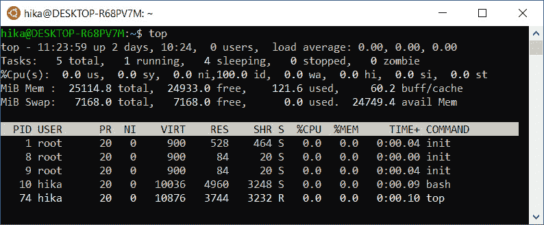

# 第二章：获取过程

**内存获取**通常指的是将易失性内存的内容复制到非易失性存储设备中以供保存的过程。为了充分理解这一过程，调查员需要至少了解一些**内存管理**原则，理解**内存提取**工具的工作原理，并能够选择最合适的工具并正确使用。此外，重要的是要理解，创建完整的内存转储并不总是唯一的解决方案。还有**实时内存分析**，它也有其优点，在某些情况下，可能比内存获取更为合适。

在本章中，你将学习以下内容：

+   介绍内存管理概念

+   什么是实时内存分析？

+   理解部分与完整内存获取

+   探索流行的获取工具和技术

# 介绍内存管理概念

有几个与**随机访问内存**（**RAM**）的组织和管理相关的概念。理解这些概念将帮助你使内存调查过程更加有意识和有效。我们从**地址空间**开始。

## 地址空间

RAM 是一个内存单元的数组，每个单元都有自己的物理地址，用于访问该单元。然而，进程不能直接访问物理内存。这是因为进程与物理内存交互时，可能会轻易损害操作系统，甚至导致其完全崩溃。此外，进程使用物理地址使得同时执行程序的组织变得困难。为了解决这些问题，创建了一个叫做*地址空间*的抽象概念。

地址空间是一组可以用来访问内存的地址。每个进程都有自己隔离的地址空间，这解决了进程之间以及进程与操作系统之间的安全和隔离问题。但是，如果没有足够的物理内存来容纳所有正在运行的进程的代码和数据，该怎么办呢？

这里我们来到了下一个抽象概念。

## 虚拟内存

`0x00000000` 到 `0x7FFFFFFFF`，如下面的图示所示：


图 2.1 – x86 系统中内核空间和用户空间的默认分配

对半分割是标准做法，但不是强制要求。例如，在 Windows 中，有一个选项可以使用 3:1 的分割，其中 3 GB 属于用户空间。

在 x64 架构中，可以为进程分配更多的内存。在这种情况下，用户空间占用地址 `0x0000000000000000` 到 `0x000007ffffffffffffff`，而内核空间从地址 `0xffffff08000000000000` 开始。

## 分页

整个进程地址空间被划分为固定大小的块。这样的块被称为**页**，它们代表一系列连续的地址。正是这些页被映射到物理内存中。

**内存管理器**负责卸载页面并释放物理内存。内存管理器还通过硬件的帮助将虚拟地址转换为物理地址。

因此，进程使用其地址空间中的虚拟地址来访问内存，操作系统将此地址转换为物理地址，以从内存中检索所需的数据。

以下图表直观地展示了**分页**：


图 2.2 – 分页概念的示意图

这种方法使得我们可以仅将那些在特定时间内程序正常运行所需的页面加载到物理内存中。其余的页面存储在磁盘上，等待加载。

决定哪些进程内存页应该位于物理内存中，哪些应该保留在磁盘上的机制称为分页。存在许多页面替换算法（FIFO、LRU、Clock、WSClock 等）。它们的共同目标是：*提高稳定性和性能*。

为了存储未使用的内存页面，操作系统会使用一个单独的文件（`pagefile`、`swapfile`）或磁盘上的特殊分区（交换区）。因此，在创建内存转储时，我们只会获取加载到 RAM 中的页面内容。同时，包含对调查员有重要信息的页面可能位于磁盘上。为了获得完整的画面，建议将*内存转储*分析与*非内存驻留数据*的分析结合起来。

## 共享内存

如前所述，每个进程都有自己的隔离地址空间，但也有例外。开发者总是寻求提高性能、增加效率并减少资源消耗，而内存也不例外。结果就是**共享内存**。

共享内存是多个进程可以同时访问的内存区域。这个机制有几个用途。首先，能够访问同一内存空间的进程可以利用它来交换数据或执行相同的代码段。其次，这个机制提高了使用库的效率。例如，如果多个进程使用相同的动态库，那么将库的一个实例放入物理内存，并将所有需要它的进程的虚拟内存页映射到这个实例中会更简单。

## 栈和堆

每个进程包含*静态*数据和*动态*数据。静态数据被放置在与进程虚拟地址空间相关联的区域中。动态数据通常存储在称为**栈**和**堆**的内存区域中。为了更好地理解这些概念，这里有一张进程虚拟内存的示意图：


图 2.3 – 进程虚拟内存的示意图

堆栈存储与可执行代码直接相关的数据。如果程序执行过程中调用了某个函数，就会为该函数分配一个独立的堆栈帧。被调用函数的参数、变量和返回地址会被放入其中。**堆栈帧数据**只存在于给定函数执行的范围内；然而，这一部分的内容能够告诉调查员在特定时刻该进程执行了哪些函数。

与堆栈不同，堆中的数据会在进程的整个生命周期中存储，这对于数字取证专家来说至关重要。此外，它存储动态分配的数据，例如在文本编辑器中输入的文本、可能包含密码的剪贴板，或正在运行的消息软件中的聊天内容。

我们已经讲解了基本概念，接下来我们将在后续章节中提及。现在是时候进入下一个主题——**实时分析**了。

# 什么是实时内存分析？

有几种情况是无法创建内存转储的。我们已经在*第一章*中讨论了这些情况，*为什么选择内存取证？* 另外，对于远程系统或内存大于 32 GB 的系统，内存提取可能变得低效。在这种情况下，您可以使用**实时内存分析**手动检查正在运行的进程、它们的内存内容、网络连接以及当前的系统状态。

重要提示

请记住，您通常需要一个具有管理员权限的用户才能执行实时分析。如果攻击者能够访问目标系统并使用凭证挖掘工具，那么以特权用户身份登录就相当于直接泄露了您的凭证。

## Windows

要在 Windows 主机上执行实时内存分析，有许多工具可供选择，从内置工具到高级取证框架都有。此外，现在许多 EDR/XDR 解决方案也允许事件响应人员执行实时内存分析。

让我们来看一个非常常见的实时分析工具，**Process Hacker**，如下图所示：


图 2.4 – Process Hacker 进程标签

Process Hacker 允许您获取以下信息：

+   正在运行的进程列表

+   启动的服务

+   活跃的网络连接

+   磁盘使用情况

此外，双击正在运行的进程可以进入该进程的内存。您可以在其中找到有关使用的资源的信息，查看进程的地址空间，包括堆栈和堆，甚至可以使用正则表达式在其中搜索特定数据。

当你已经知道需要寻找什么时，这种方法可能非常有用。例如，你知道某个恶意软件将有效负载注入到`explorer.exe`（Windows 资源管理器）中。通常，`explorer.exe`的实例不多；而且，它通常不应该进行网络连接。因此，使用如 Process Hacker 等工具和一些网络威胁情报，你可以轻松地发现恶意进程。

如前所述，也有一些内建工具，如**Windows 命令行**、**PowerShell**或**Windows 管理工具**（**WMI**）。这些工具提供了广泛的功能，帮助你获取活动进程列表、它们使用的资源、内存内容、活动网络连接等。

让我们看一下以下命令：

```
C:\WINDOWS\system32> wmic process list full
CommandLine=powershell.exe -nop -w hidden -enc SQBmACg<edited>
CSName=DESKTOP-1J4LKT5
Description=powershell.exe
ExecutablePath=C:\WINDOWS\System32\WindowsPowerShell\v1.0\powershell.exe
```

该命令通过`wmic`（WMI 命令行工具）列出所有活动进程，包括它们的命令行和可执行文件路径。

## Linux 和 macOS

对于运行 Linux 和 macOS 的系统，前面描述的方法同样有效。*Apple Terminal*和*Linux Terminal*都允许你查看网络连接信息、资源使用情况或正在运行的进程，如下截图所示：



图 2.5 – 基于 Linux 系统的活动进程列表

尽管实时分析方便且快速，但它也有其缺点。检查实时系统无法查看已终止进程和关闭的网络连接信息，限制了与内核对象的交互，并且可能导致重要痕迹被抹去，因为与目标系统的任何交互都会导致内存中的变化。

还值得注意的是，内存内容是不断变化的，在实时分析过程中很容易忽视某些信息，这也是为什么在可能的情况下进行转储永远不会多余。我们将在下一部分中讨论这一点。

# 理解部分与完整内存获取

我们已经确定，处理内存转储有其一定的优势。剩下的唯一问题是要*转储*什么。Windows 系统上有一些工具允许你创建特定进程的转储。其中一个工具是**ProcDump**，它是*Sysinternals Suite*的一部分。

以下截图展示了使用**Telegram Messenger**通过 ProcDump 创建完整进程转储的示例：


图 2.6 – Telegram 进程的内存转储

在*图 2.6*中，ProcDump 也有适用于类似 Linux 系统的工具，它提供了一种方便的方式来创建 Linux 应用程序的核心转储。同样，通过**GDB**（**GNU 调试器**）也可以在 macOS 上创建进程转储，但这是一项更复杂的任务，因为它需要直接指定内存地址来创建转储。

单个进程的转储可以稍后通过调试器进行分析。以下截图展示了在**WinDbg**中打开的 Telegram 进程的转储：


图 2.7 – 在 WinDbg 中打开的 Telegram 进程转储

这种分析技术适用于例如事件响应过程中，当需要从内存中快速提取某些数据（如 IP 地址或可执行代码）时。然而，如果需要进行全面调查，提取用户数据或加密密钥，或者构建基于 RAM 的时间线，则需要创建完整的内存转储。接下来，我们将讨论这一点。

# 探索流行的获取工具和技术

创建内存转储并非一项简单的任务，涉及多个因素。我们将在本章的这一部分单独讨论它们。

## 虚拟或物理

环境在转储创建过程中起着重要作用。这是因为虚拟机内存的转储不需要额外的工具。

事实上，虚拟机内存的内容部分或完全被放置在具有特定扩展名的文件中，因此获取转储实际上就是获取该精确的文件。以下截图展示了用于存储虚拟机内存的基本**虚拟化**工具和文件：


图 2.8 – 虚拟化工具和包含内存相关数据的文件

获取虚拟机内存的一个重要标准是其状态。需要理解的是，如果虚拟机正在运行，内存内容是不断变化的。因此，有两种可能的解决方案：

+   **挂起**：虚拟机的内存将在稳定状态下保存到磁盘。然而，一些解决方案在挂起虚拟机之前执行几个进程，这可能导致重要数据丢失。例如，VMware 在虚拟机进入挂起状态之前关闭所有活动的网络连接。

+   **创建快照**：创建快照时，虚拟机当前的状态和内存将被写入单独的文件中，不做任何更改。

因此，为了保存原始数据，创建快照以获取虚拟机内存更为可取。之后对虚拟机文件的进一步操作将取决于具体的供应商和内存保存的格式。

## 本地或远程

如果我们的目标系统是*裸金属*，我们无法避免使用额外的工具来创建内存转储。在这种情况下，物理访问主机起着关键作用。

在当今世界，远程从目标系统收集数据并不罕见。可以使用以下方案，在最简单的情况下远程创建内存转储：

1.  创建一个带有管理员权限的*临时用户*，这将帮助您防止攻击者窃取特权用户的凭据。

1.  创建一个*网络共享*（`$C`或`$ADMIN`），并复制所需的工具以创建转储。

1.  使用任何远程控制工具、服务创建或任务调度来运行您的工具，然后通过反向连接将转储发送到网络共享。

1.  删除临时管理员账户。

    重要提示

    确保在将转储文件发送到网络之前和之后计算其校验和以检查其完整性。

如果可以物理访问主机，则我们需要解决的第一个问题是在哪里存储数据。强烈建议不要将内存转储保存在目标系统上，因为这可能导致在磁盘上覆盖法庭重要数据。在写入转储时，应预先准备可移动设备。不建议使用同一设备处理多个疑似感染主机，以及将设备直接连接到调查员计算机。这是因为存在恶意软件（主要用于对能源部门的攻击，例如**USBferry**、**Crimson.USBWorm**或**USBCulprit**），这些恶意软件使用可移动设备进行自我传播和数据传输。在这种情况下，最好将设备连接到中间主机，从中将所有必要的数据发送到调查员的主机，例如通过网络。

如果可以物理访问目标系统，则可以使用硬件和软件解决方案创建内存转储。

一种硬件解决方案是使用**直接内存访问**（**DMA**），例如**FireWire**。应该立即指出的是硬件解决方案有许多限制（例如，从 Windows 10 和 macOS 10.7.2 开始，对于锁定系统，DMA 被禁用），并且通常需要额外的驱动程序，这并不是一个优点。

使用软件解决方案完全是另一回事。市场上有大量免费和商业工具，可以创建不同格式的内存转储。总的来说，大多数工具的工作方式相似。在转储时，加载内核模块，将物理地址映射到进程的虚拟地址空间，从中写入数据到文件。重要的是要注意设备内存的存在。设备内存是保留给固件使用的物理内存的一部分。尝试访问内存的这一部分可能会导致不可预测的结果。这就是为什么大多数现代工具设计为跳过设备内存区域。

## 如何选择

对于这么多工具的显而易见的问题是如何选择最合适的工具。这个问题非常个体化。我们只想列举一些在选择工具时应考虑的因素：

+   支持的操作系统和硬件架构

+   远程转储能力

+   对目标系统的影响

+   可靠性

前两个因素是情境性的——根据必须进行转储的环境，可能适合某些工具。后两个因素则更为普遍。无论背景如何，我们始终尽量减少对目标系统的影响。至于可靠性，必须强调的是，不要使用你之前未在目标系统上使用过并测试过的工具，因为它们可能会出现不可预测的行为。因此，建议在创建目标系统的内存转储之前，先在相同条件下测试该工具。

## 是时候了

唯一需要弄清楚的是，何时进行转储最为合适。显然，转储创建的时刻在很大程度上决定了其内容。让我们回想一下在*第一章*中讨论的两个主要案例，*为什么选择内存取证？*

+   **嫌疑人设备**：在这种情况下，我们很可能希望在攻击者没有明显活跃时创建内存转储。这将帮助我们避免外部干扰转储过程。

+   **嫌疑人设备**：这里的情况恰恰相反，因为重要的是要找到设备所有者非法活动的证据。基于这一点，最好在目标主机上有任何活动时进行内存转储。

关于转储时间的一般建议是选择启动、关机、重启、系统更新以及其他活动较多的时段之外的时间。

# 总结

对内存结构和内存管理概念的基本理解是进行智能有效调查过程的关键。

在某些情况下，创建内存转储可能变得复杂或效率低下。在这种情况下，实时内存分析提供了帮助，它允许你获取目标系统当前状态的基本信息。

创建完整内存转储的另一种替代方法是提取单个进程的内存。这在事件响应中可能会有所帮助，但它无法提供完整的图景，极大地限制了调查员的能力。

创建内存转储是一个复杂的过程，取决于多个因素。为了成功创建转储，检查员应考虑各种细微差别，包括数字环境、远程数据提取的需求、使用工具的可靠性以及转储创建的时间。

在接下来的章节中，我们将更详细地介绍在不同操作系统上创建内存转储所需的工具，并进行实际操作。
