# 第三章：Windows 内存获取

你已经掌握了一些理论知识，但正如你所知道的，理论和实践本质上是没有区别的，但实际上*是有差别的*。所以，让我们继续深入实际任务，从**Windows 内存获取**开始，因为 Windows 是最广泛使用的操作系统。

这意味着什么？它是威胁行为者最常见的目标！这也意味着在你处理事件响应时，你会经常遇到它（当然，也包括一些刑事案件）。因此，了解如何从 Windows 主机获取内存是一个非常好的起点。

本章将向你介绍用于 Windows 内存获取的四种最常见工具，当然，你还将学习如何使用它们并获取内存镜像，以供后续分析。

我们将讨论以下主题：

+   了解 Windows 内存获取问题

+   准备进行 Windows 内存获取

+   使用 **FTK Imager** 获取内存

+   使用 **WinPmem** 获取内存

+   使用 **Belkasoft Live RAM Capturer** 获取内存

+   使用 **Magnet RAM Capture** 获取内存

# 了解 Windows 内存获取问题

在上一章中，我们详细介绍了内存转储的基本概念，并讨论了可能出现的问题。然而，每个操作系统都有其特殊性。与 Windows 内存提取相关的主要特点是访问**随机访问内存**（**RAM**），但首先还是从基础开始。

还记得我们之前谈到过的**设备内存**吗？那是为设备保留的物理内存区域。这些设备包括显卡、声卡、外部组件互联（**PCI**）卡等等。它们直接访问物理内存对其高效且质量良好的运行至关重要。你还记得尝试访问设备内存可能会导致什么吗？没错——它可能会导致*不可预测的后果*。

问题在于，尝试访问或写入设备内存会被转换为发送到相应设备的请求。然而，不同的设备可能会对试图与它们保留的物理内存交互的尝试做出不同的反应。在某些情况下，这可能会导致依赖于设备功能的关键信息发生变化。然而，从法医角度来看，这种后果可能是重要证据的丧失，或者在最坏的情况下，系统的冻结或关闭。

在 Windows 操作系统中，访问物理内存是通过 `\Device\PhysicalMemory` 内核对象实现的。以前，这个文件很容易操作，因为它对用户空间程序完全可访问。然而，如果我们考虑之前的信息，很明显这种方法并不是完全安全的。

这一切都随着**Windows Server 2003 Service Pack 2 (SP2)**的发布发生了变化。当然，用户空间程序仍然可以读取这个文件，但写入访问现在只能从内核空间进行。因此，获取工具必须在内核级别工作，或者使用特殊的驱动程序来创建内存转储。

另一个影响内存提取工具变化的因素是*虚拟化*的广泛使用。这导致当在启用**虚拟安全模式**（**VSM**）的系统上运行这些工具时，系统会崩溃。尽管如此，最常用工具的最新版本已经成功解决了这个问题。

尽管这些变化发生了，但用于 Windows 内存获取的工具数量仍然很大。

让我们在接下来的章节中看一下最常用的一些工具。

# 准备 Windows 内存获取

在我们开始使用映像工具之前，我们需要准备一些东西。首先，你需要找到一个闪存驱动器，用来存储工具本身和创建的内存转储，所以确保它有足够的空间。其次，你需要对它进行清理。这意味着你需要*法证擦除*驱动器。

重要说明

在标准删除过程中，与*已删除*文件相关的元数据会被更改，并且这些文件所在的空间会被标记为*可供重用*。换句话说，删除后，文件的内容仍会保留在驱动器上，并且可以恢复。格式化过程也非常相似。一些特定的主文件会被重写，但信息仍然可以从驱动器中提取。因此，要安全地删除文件，你需要用零或随机数据覆盖内容。

要擦除驱动器，可以根据可移动介质的类型使用不同的工具和方法。我们已经决定使用闪存驱动器；在这种情况下，有两种非常有效且快速的选项，概述如下：

+   写入一个与闪存驱动器整个容量成比例的预先准备好的文件。

+   使用**Secure Erase（安全擦除）**选项。

不幸的是，并不是所有厂商都有自己的工具，允许你使用安全擦除选项来安全地擦除他们的驱动器。你可以在闪存驱动器厂商的官方网站上查看这些信息。

当你的闪存驱动器被清理干净后，你可以在其中添加一些映像工具。

# 使用 FTK Imager 获取内存

**AccessData FTK Imager**是最受欢迎的免费工具之一。它通常被法证分析师和事件响应人员用来查看磁盘映像预览，甚至进行实时响应，因此它不仅可以用于按位映像，还可以用于创建自定义内容映像，当然也可以用于创建内存映像。让我们更详细地了解一下！请按照以下步骤操作：

1.  要获取**FTK Imager**，请访问*AccessData*的官方网站：[`accessdata.com/products-services/forensic-toolkit-ftk/ftkimager`](https://accessdata.com/products-services/forensic-toolkit-ftk/ftkimager)。

1.  选择**产品与服务** | **FTK® Imager**。点击**立即下载 FTK Imager！**链接并按下**立即下载**。你将被要求填写一份包含你联系信息的简短表格。之后，一个链接将发送到你提供的电子邮件地址。

现在，你需要在闪存驱动器上安装 FTK Imager。你可以使用**InstallShield 向导**工具，它提供了逐步安装说明。

要创建内存转储，FTK Imager 会将设备驱动程序加载到内核中，并随后通过映射 `\Device\PhysicalMemory` 内核对象来读取内存。从用户的角度来看，使用 FTK Imager 进行内存获取非常简单直观。按照以下步骤创建你的内存映像：

1.  将闪存驱动器连接到目标系统，并运行 FTK Imager。主窗口将出现，如下所示：

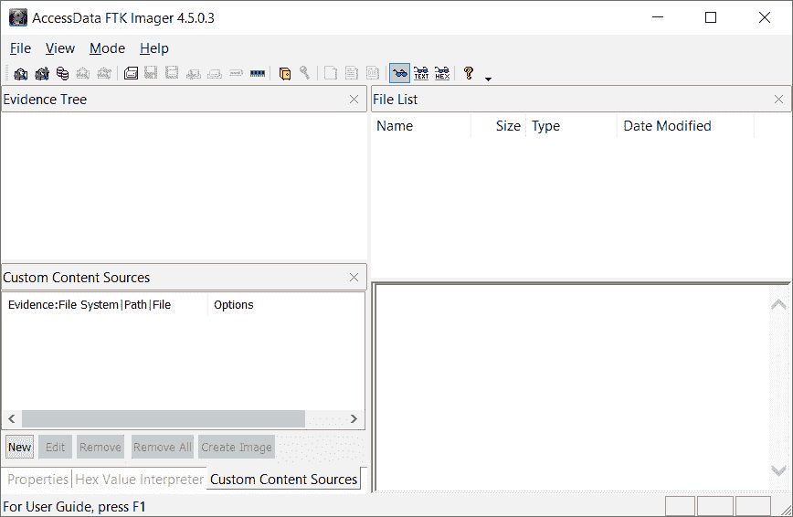

图 3.1 – FTK Imager 主窗口

1.  进入**文件**，点击**捕获内存…**，或者在工具栏上找到相关图标。下图展示了前一种选项：

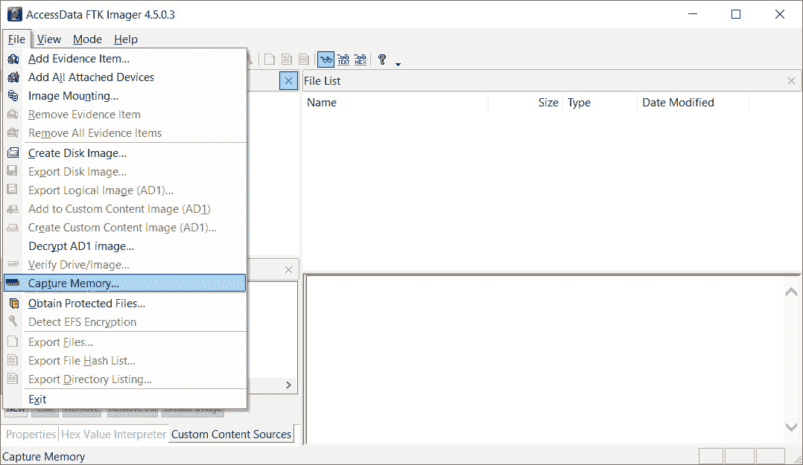

图 3.2 – FTK Imager 文件菜单

1.  在对话框中，点击 `memdump.mem`。我们还建议你勾选**包括页面文件**复选框，如下所示：

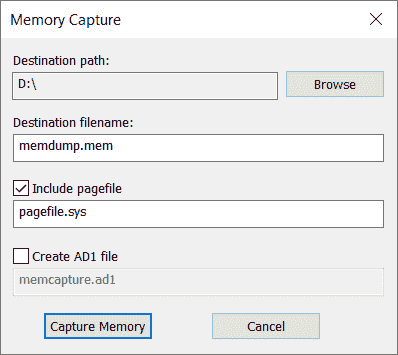

图 3.3 – 内存捕获对话框窗口

1.  按下**捕获内存**按钮。结果，你将看到如下所示的对话框，展示了转储创建的进度：

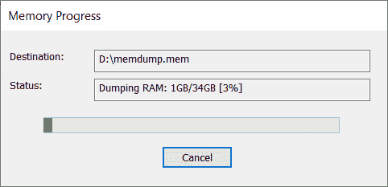

图 3.4 – 映像进度

等待几分钟后，我们获得了内存转储，这是一个 `.mem` 扩展名的文件。该映像已准备好使用你选择的工具进行分析——例如，**Volatility 框架**。

FTK Imager 是一款功能强大的工具，具有广泛的功能，但我们希望你有选择权，所以让我们看看其他一些工具。

# 使用 WinPmem 获取内存

**WinPmem**最初由谷歌开发，并作为**Rekall 框架**的一部分发布，但现在已作为独立的内存获取工具发布。该工具支持从**XP**到**10**的各种 Windows 版本，并且为 32 位和 64 位系统提供独立的可执行文件。

WinPmem 使用三种独立的方法来创建内存转储，具体如下：

+   **页面表项** (**PTE**) 重映射

+   使用 `MMMapIoSpace` 内核 **应用程序编程接口** (**API**)

+   传统的 `\Device\PhysicalMemory` 映射

上述方法中的第一种方法默认使用，因为它被认为是最稳定的。然而，用户可以手动选择其他任何方法。

要下载此工具，请访问 *Velocidex* GitHub 页面上的 `WinPmem` 仓库，[`github.com/Velocidex/WinPmem`](https://github.com/Velocidex/WinPmem)。

页面如下所示：

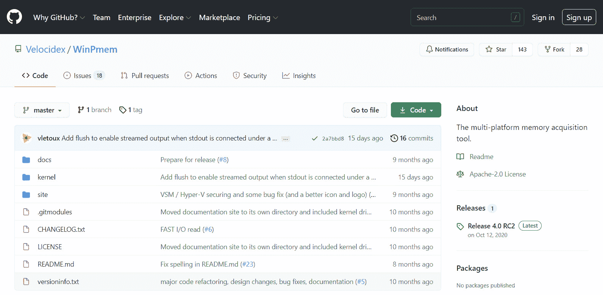

图 3.5 – WinPmem GitHub 仓库

在页面的右侧，找到`winpmem_mini_x64.exe`。将该可执行文件复制到你的闪存驱动器。此程序无需任何额外的依赖项，且是独立运行的。同时，你不必担心 x64 和 x86 的区别，WinPmem 会自动加载正确的驱动程序。

以下说明将帮助你使用 WinPmem 获取内存：

1.  将闪存驱动器连接到目标系统。以`管理员`身份运行`cmd`或`PowerShell`，如下图所示：

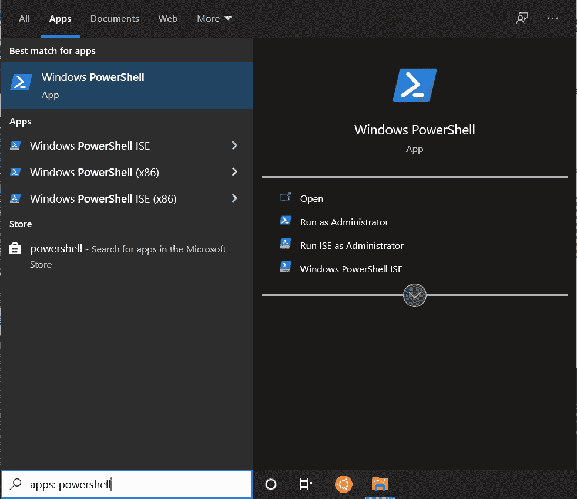

图 3.6 – 从搜索框运行 PowerShell

1.  移动到你的闪存驱动器，并以内存转储文件名作为*参数*运行`winpmem_mini_x64.exe`。如下面的截图所示，`memdump.raw`是提供的参数：

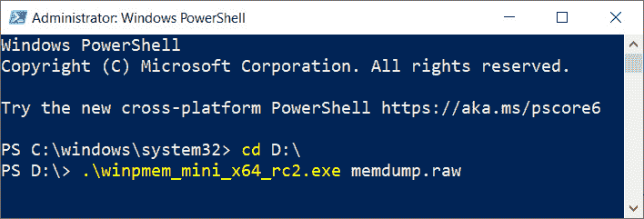

图 3.7 – WinPmem 执行

1.  在内存转储过程中，你将能够看到所有相关信息，如下图所示：

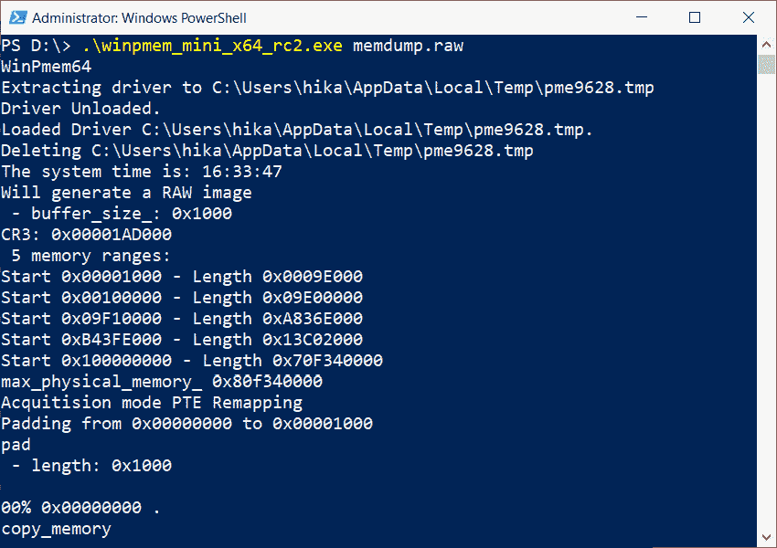

图 3.8 – 使用 WinPmem 创建转储

一会儿后，我们将得到一个指定名称的原始内存转储。

这是我们如何使用 PowerShell 和 WinPmem 提取 Windows 内存的方法，但这还不止这些。让我们再添加几个工具到我们的工具集。

# 使用 Belkasoft RAM Capturer 获取内存

**Belkasoft RAM Capturer**是另一个免费的内存获取工具。与前述工具类似，它使用内核驱动程序提取物理内存并创建转储。该工具兼容所有 32 位和 64 位版本的 Windows，包括 Windows **XP**、Windows **Vista**、Windows **7** 和 **8**、Server 2003 和 2008 以及 Windows **10**。

你需要采取以下步骤：

1.  要获取此工具，请访问官方*Belkasoft*网页的**下载**标签：https://belkasoft.com/。

1.  选择`x64`和`x86`文件夹，这些文件夹应当被提取到闪存驱动器中。

1.  这次，你需要找出你正在处理的是 x64 还是 x86 系统。为此，使用`system`并运行**系统信息**应用程序，如下图所示：

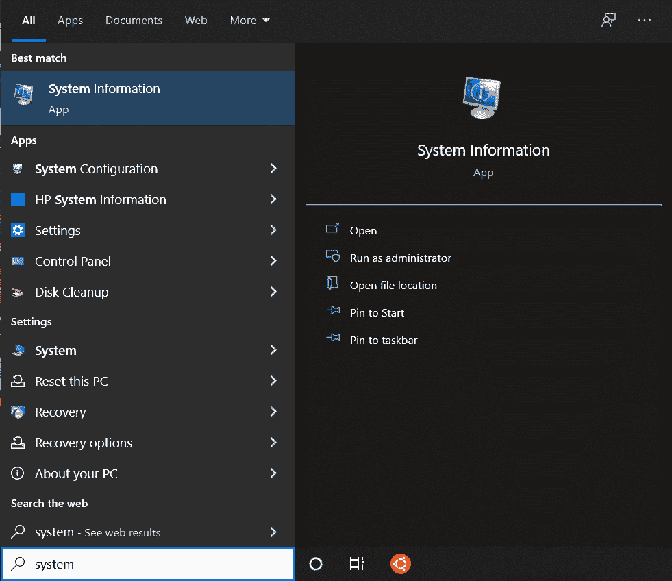

图 3.9 – 从搜索框运行系统信息

在打开的窗口中，搜索**系统类型**，位于**系统摘要**下，如下图所示。**x64 基础 PC**值表示 64 位系统：

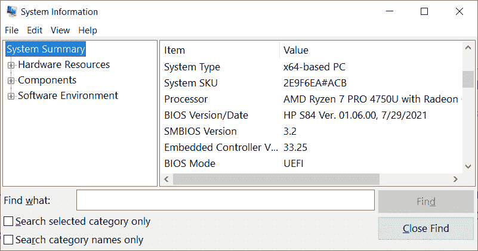

图 3.10 – 系统类型检测

如果是`x64`文件夹，请选择它；否则，选择`x86`文件夹中的其他一个。你准备好创建内存转储了。请按照以下步骤操作：

1.  将闪存驱动器连接到目标系统并运行`RamCapture`可执行文件。

1.  在指定字段中输入输出文件夹路径，并按下**Capture!**按钮。

转储创建过程将如下所示：

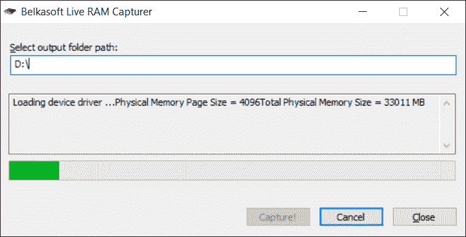

图 3.11 – 使用 Belkasoft RAM Capturer 进行成像

最终，我们得到一个 `.mem` 扩展名的内存转储。默认情况下，文件名由采集日期组成，但你可以将其替换为更具描述性的名称。

现在，你可以使用三种不同的工具创建内存转储。让我们来看看最后一个工具，虽然它并不是最不重要的。

# 使用 Magnet RAM Capture 获取内存

**Magnet Forensics** 也发布了自己的免费内存获取工具，名为 **Magnet RAM Capture**，它可以用来从 Windows 系统中获取内存。为了提取物理内存，Magnet RAM Capture 使用内核模式驱动程序。它创建的是原始格式的内存转储，这种格式既可以被开源内存取证工具支持，也可以被功能完整的数字取证套件支持。

下载 Magnet RAM Capture 时，按照以下步骤操作：

1.  访问官方 *Magnet Forensics* 网页的 **RESOURCES** 标签页，然后点击 **FREE TOOLS** 标签页：[`www.magnetforensics.com/`](https://www.magnetforensics.com/)。

1.  选择 `MRCv120.exe` 文件到你的闪存驱动器。

使用 Magnet RAM Capture 进行内存转储非常简单，按照以下步骤操作即可：

1.  将闪存驱动器连接到目标系统，并以管理员身份运行 `MRCv120.exe`。

1.  在下拉菜单中选择一个 **Segment size** 选项（默认值为 **Don't Split**，这是推荐的模式）。

1.  点击 **Browse…** 按钮，选择内存镜像的文件名和保存位置。

1.  点击 **Start** 按钮。

成像过程将开始；你应该等待进度条达到 `100%`。这是使用 Magnet RAM Capture 进行成像过程的一个例子：

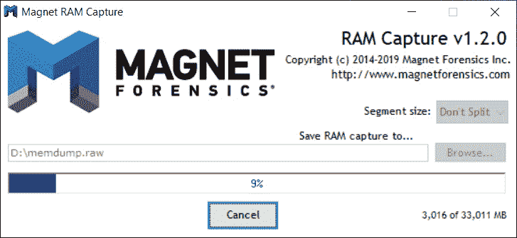

图 3.12 – 使用 Magnet RAM Capture 进行成像过程

处理完成后，你将在之前指定的位置找到一个原始内存镜像文件。

# 总结

在创建内存镜像时，你不仅需要考虑一般概念，还需要考虑每个操作系统独有的因素。对于 Windows 操作系统来说，一个重要因素就是访问 `/Devices/PhysicalMemory` 内核对象。

大多数现代工具使用内核驱动程序来创建转储，但一些工具有自己独特的方法，表现为使用与经典的 `/Devices/PhysicalMemory` 映射不同的替代方案。

尽管有多种 Windows 内存提取工具，但值得记住的是，最好的工具是那些已经在与目标系统相同或至少非常相似的系统上经过成功测试的工具。

在本章中，我们已经学习了如何使用各种免费工具创建内存转储。现在，到了深入查看这些转储内容的时候了！在下一章，我们将了解 Windows 内存转储分析工具，并学习如何搜索用户活动的痕迹。
