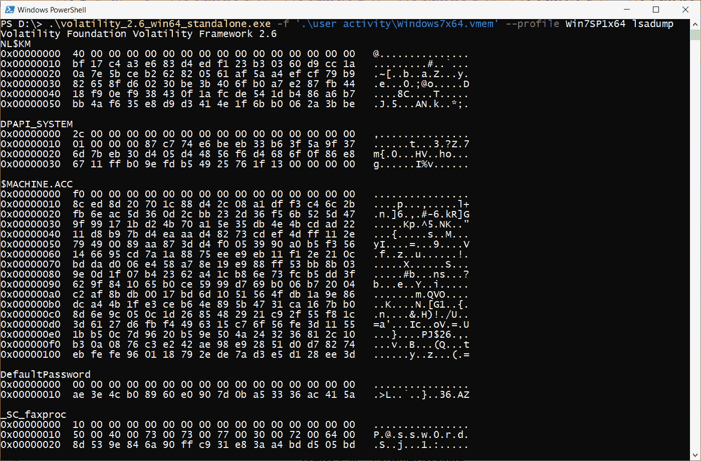

# 第四章：通过 Windows 内存取证重建用户活动

用户活动重建对于许多使用场景至关重要，因为它帮助我们更好地理解发生了什么。在第一章中，我们讨论了如果收到参与事件的设备，受害者或嫌疑人可能是设备的拥有者。如果我们分析受害者的设备，用户活动可以告诉我们感染是如何发生的，或者攻击者在远程访问计算机时是如何行动的。如果我们谈论的是攻击者的设备，这种分析可以帮助我们了解攻击准备是如何进行的，威胁行为者执行了哪些操作，并且如何找到非法活动的证据。另外，如果您处理的案件与黑客攻击无关，而是涉及传统犯罪，如儿童色情、人口贩卖和毒品交易，内存镜像可能包含关键证据来源。在这里，您可能能够恢复私人通信和浏览器历史记录，以及嫌疑人用来隐藏数据的容器的加密密钥。

本章将提供一些有关用户行为恢复技术的见解，这些技术不仅基于正在运行的进程，还基于分析内存中的 Windows 注册表和文件系统。

本章将涵盖以下主题：

+   分析已启动的应用程序

+   搜索已打开的文档

+   调查浏览器历史记录

+   检查通信应用程序

+   恢复用户密码

+   检测加密容器

+   从注册表中提取最近的活动

# 技术要求

使用下一章介绍的工具并进行 Windows 内存取证时，您不需要满足特定的技术要求。只需要在主机或虚拟机上安装 Windows 操作系统即可。

# 分析已启动的应用程序

应用程序分析可以帮助调查员建立嫌疑人的档案。分析运行中的进程可以帮助我们了解嫌疑人是否在使用一些具有高度匿名性的消息应用程序或网络浏览器，或者是否有加密容器正在挂载。这些数据源可能充满了有价值的取证文物，且在事后分析中可能无法访问。

每次用户启动程序时，相应的进程会在内存中创建并添加到活动进程列表中。通过分析这个列表，我们可以获得关于在转储时运行的程序的信息。这就是我们一旦掌握分析工具后将要做的事情。

## 介绍 Volatility

**Volatility 框架**是最流行的免费内存转储分析工具。许多厂商已经在他们的解决方案中加入了对该工具的支持，包括*Autopsy*和*Magnet AXIOM*。该工具的源代码是用 Python 编写的，因此 Volatility 可以在不同的操作系统上使用。此外，Volatility 还允许你分析各种操作系统，从*Windows XP*到*Linux*和*macOS*。当然，我们也决定以 Volatility 为基础，但我们不会仅限于此。

要运行 Volatility，你可以使用以下其中一种选项：

+   **Volatility 独立版**：此版本是一个独立的可执行文件。最后发布的该格式版本是**Volatility 2.6**。你可以从官方网站下载：[`www.volatilityfoundation.org/26`](https://www.volatilityfoundation.org/26)。只需下载适合你操作系统的版本并将可执行文件复制到一个方便的位置。

+   **Python 脚本**：使用脚本有其优势，因为它们更新频繁，支持更多的配置文件。要获取这些脚本，你只需访问 Volatility 的 GitHub 仓库并克隆该项目：[`github.com/volatilityfoundation/volatility`](https://github.com/volatilityfoundation/volatility)。

+   **Volatility Workbench**：此选项适用于那些喜欢使用具有图形界面的工具的用户。Workbench 的开发者定期更新该工具，因此它也支持 Volatility 的最新版本，包括 Volatility 3。然而，它也有一些缺点，比如对 Volatility 中所有可用参数的支持不完整。你可以从官方网站免费下载 Workbench：[`www.osforensics.com/tools/volatility-workbench.html`](https://www.osforensics.com/tools/volatility-workbench.html)。

Volatility 项目得到了积极支持，因此你总能在适当的公共资源中找到详细的安装说明、官方插件描述、社区插件以及更多信息。这些资源包括官方网页、Volatility 的 GitHub 仓库以及各种论坛。

截至写作时，Volatility 的最新版本是 Volatility 3。然而，该版本仍在开发中，我们所需的一些插件尚未开发完成，甚至完全缺失。此外，Volatility 3 的输出处理不像 2.6 版本那么简便，因此我们优先选择了之前的版本。

截至写作时，Volatility 的最新版本是 Volatility 3。然而，该版本仍在开发中，我们所需的一些插件尚未开发完成，甚至完全缺失。此外，Volatility 3 的输出处理不像 2.6 版本那么简便，因此我们优先选择了之前的版本。

我们将选择简单的方式，使用独立版本。如果你在 Windows 系统上运行，下载 Volatility 后，你将获得 `volatility_2.6_win64_standalone.exe` 可执行文件。Volatility 是一个命令行工具，因此你需要使用 *Windows PowerShell* 或 *Windows 命令提示符* 来运行它。为了检查一切是否正常工作，你可以打开 PowerShell，进入包含工具的文件夹（在我们的案例中是 `D:\` 驱动器），并使用 `--info` 选项运行 Volatility。该选项会打开帮助菜单，如下图所示：


图 4.1 – Volatility 信息

请注意 **Profiles** 部分，因为它列出了你的 Volatility 版本支持的所有操作系统版本。如果没有正确指定配置文件，工具将无法按预期工作。

## 配置文件识别

`imageinfo` 插件中的每个配置文件都会尝试为你找到最合适的配置文件。运行此插件时，你还需要使用 `-f` 选项，并指定你要分析的内存转储路径。我们使用的内存转储文件名为 `Win10Mem.vmem`，位于 `D:\user activity` 文件夹中。整个命令应如下所示：


图 4.2 – Volatility imageinfo

如果你成功运行该命令，`Suggested profiles` 行会显示 Volatility 认为适合分析的配置文件列表。在大多数情况下，列表中的第一个配置文件是最合适的，但如果你发现某些插件在该配置文件下无法正常工作（可能是没有输出、不正确的输出或错误消息），可以尝试更换配置文件。

另一个重要的点是，如果转储的操作系统非常新，可能没有适合的配置文件。在这种情况下，你可以在 GitHub 上搜索并将新的配置文件添加到 Volatility，查看 Volatility 的下一个版本——此时是 Volatility 3——或者使用其他工具。当然，如果你无法找到合适的配置文件，你也可以自己编写，但这将需要更深入的编程和操作系统知识。

在我们的案例中，我们将使用 `Win10x64_14393` 配置文件来分析 `Win10Mem.vmem` 转储文件。

到此，我们已经拥有工具和合适的配置文件。现在，我们可以分析活动进程列表了。

## 搜索活动进程

Volatility 提供了多个插件，用于列出内存转储创建时系统上运行的进程。第一个插件 `pslist` 允许你按时间获取进程列表。如果你更关心父进程与子进程之间的关系而非创建时间，使用 `pstree` 插件会更好。两个插件都使用内存中活动进程的列表，并显示可以在实时系统中通过 **任务管理器** 获取的数据。

启动任何插件的通用命令如下：

```
volatility_2.6_win64_standalone.exe -f <memory dump location> --profile <suitable profile from profile list> <plugin to run>
```

让我们尝试按时间排序获取活动进程的列表：


图 4.3 – Volatility pslist

看一下前面的截图。在插件的输出中，我们不仅可以找到正在运行的进程的名称，还能找到其唯一标识符、父进程的标识符、关联的句柄和线程数、进程创建的时间以及如果进程已经终止，则可以看到它退出的时间。

重要提示

内核对象种类繁多。当一个进程需要打开某个特定对象时，会为其打开一个称为句柄的引用。由于每个活动进程必须至少有一个线程（表示最小程序指令序列的对象），因此这种类型的对象总是有一个句柄。此外，句柄通常还会为文件、注册表项，甚至是其他进程等对象创建。

然而，如果进程最近已经终止，并且它的信息已经从活动进程列表中删除了，那该怎么办呢？

## 正在查找已结束的进程

从操作系统的角度来看，所有进程都是某种`_EPROCESS`结构的对象。当一个进程完成工作后，它的数据仍会在内存中保存一段时间，直到被该进程占用的空间被覆盖。Volatility 允许你通过类似`_EPROCESS`结构的对象搜索来查找这些进程。

要查找这些进程，可以使用`psscan`插件。其执行过程如下所示：


图 4.4 – Volatility psscan

如你所见，显示的信息与`pslist`的结果非常相似，但现在我们可以获得更多关于已终止进程的信息。

现在，我们可以搜索在创建转储时由用户运行的程序或最近终止的程序。然而，如果我们需要进一步查找，并搜索那些较早终止的程序呢？

在这种情况下，Volatility 提供了一个`userassist`插件，它可以获取用户经常运行的程序的信息。它还包括用户最近操作过的程序。

我们可以获取这样的数据，如通过*Windows 资源管理器*启动的应用程序的名称、运行次数以及最后一次运行的时间：


图 4.5 – Volatility userassist

首先，在执行后，你将能够看到关于信息所在具体位置的详细信息。例如，`\??\C:\Users\Ben\ntuser.dat`意味着显示的子键和值与用户`Ben`相关。

以下截图展示了与每个应用程序相关的独立条目：


图 4.6 – Userassist 条目

如你所见，`userassist`显示了可执行文件的完整路径、运行次数、聚焦时间，以及与应用程序最后一次运行时间相关的键更新的日期和时间。在这里，你不仅可以找到内存转储创建时正在运行的程序，还可以找到之前启动的程序。

现在，假设在正在运行或最近完成的进程列表中，我们有`WINWORD.exe`（当你启动 MS Word 时，会创建这样的进程）：


图 4.7 – 活跃的 MS Word 进程

哪个文档在这里被打开了？我们能从内存中获取这些信息吗？

# 查找已打开的文档

在某些情况下，你可能想了解是否有任何微软 Office 文件或只是文本文件被相应的应用程序打开。为什么？它们可能包含密码或一些从调查角度来看有价值的数据。Volatility 有多个插件可以让你在内存中处理文件。例如，`filescan`插件可以让你获取内存转储中遇到的所有文件的信息，而`dumpfiles`插件则可以尝试提取这些文件（记住，有些文件在转储创建时可能已被卸载）。那么，我们如何找到在 MS Word 中打开的文件呢？

## 进程内存中的文档

如果我们注意到`-p`选项，只对该进程运行 Volatility 插件。如果我们想查看我们的进程使用了哪些资源，`handles`插件可以帮助我们。让我们使用`-p`选项和`-t` `File`选项，它将帮助我们仅显示与文件相关的资源。


图 4.8 – Volatility 句柄

在前面的截图中，我们可以看到我们的进程资源提到了一个名为`GOT-7_HR`的文件。让我们来找出这个文件在内存中的位置。为此，我们需要运行`filescan`插件，并将其输出重定向到一个文本文件，如下所示：

```
PS D:\> .\volatility_2.6_win64_standalone.exe -f '.\user activity\Windows7x64.vmem' --profile Win7SP1x64 filescan > D:\filescan.txt
```

当插件运行完成时，我们可以在指定路径下找到一个名为`filescan.txt`的文本文件，其中包含以下内容：


图 4.9 – Volatility filescan 输出

在这里，我们可以看到文件被找到的物理偏移量，一些相关的属性，以及文件在磁盘上的完整路径。让我们来找找我们的文件：


图 4.10 – 文件偏移

我们现在知道了文件的物理偏移量，并且可以使用`dumpfiles`插件从内存中提取它。这里，我们将使用`-Q`选项来指定物理偏移量，并使用`-D`选项来指定我们希望保存文件的路径。


图 4.11 – Volatility dumpfiles

如你所见，我们的文件在这个偏移位置被检测到。现在，`D:\user activity` 文件夹中出现了两个新文件，分别是 `file.None.0xfffffa80282a6b80.vacb` 和 `file.None.0xfffffa80258625f0.dat`。

文件数据扩展名标识数据提取自的对象：

+   `dat`：DataSectionObject

+   `vacb`：ImageSectionObject

+   `img`：SharedCacheMap

这些文件是容器，其中存储着文件的内容和数据。要获取原始文件，尝试使用其扩展名重命名容器。通过这种方式，你可以使用合适的工具打开提取的文件并继续分析。

重要提示

如果你导出了一个你认为是恶意的文件，请确保不要在你的工作机器上运行它进行分析。最好在沙箱中处理此类文件，或使用专门的工具处理它们，我们将在下一章讨论这些工具。

文件已经处理完了，那么与浏览器相关的进程呢？

# 调查浏览器历史记录

浏览器中可能包含很多有用的数据。通过分析浏览器历史记录，我们可以了解用户访问了哪些网站、执行了哪些搜索查询以及下载了哪些文件。即使用户使用了隐私模式或特殊浏览器（例如 *Tor Browser*）上网，我们仍然可以在内存中找到有用的信息。

下图显示了 `pslist` 插件的输出，我们可以看到几个与*Google Chrome*、*Mozilla Firefox* 和 *Tor Browser* 相关的进程：


图 4.12 – 浏览器相关进程

那么，如何获取访问过的资源信息呢？有几种方法可以做到这一点：

+   导出进程内存并使用 `Strings` 工具进行处理（[`docs.microsoft.com/en-us/sysinternals/downloads/strings`](https://docs.microsoft.com/en-us/sysinternals/downloads/strings)），该工具允许你从各种文件中获取 ASCII 和 Unicode 字符列表。

+   导出进程内存并使用 `bulk_extractor` 工具进行处理（[`downloads.digitalcorpora.org/downloads/bulk_extractor/`](https://downloads.digitalcorpora.org/downloads/bulk_extractor/)），该工具允许你扫描磁盘映像、内存转储、特定文件或目录并提取有用信息。

+   使用正则表达式或 YARA 规则搜索 URL。

我们有三个浏览器和三个选项，因此这个计划看起来不错。让我们从 Google Chrome 和正则表达式搜索开始。

## 使用 yarascan 分析 Chrome

`Yarascan` 是 Volatility 插件之一，允许你使用正则表达式或 YARA 规则搜索特定的信息。

重要提示

YARA 最初是为帮助恶意软件研究人员检测和分类恶意软件样本而开发的。然而，这个工具也适用于内存取证，因为它允许我们使用文本或二进制数据创建搜索模式。有关更多信息，请参阅 [`yara.readthedocs.io/en/v4.1.0/gettingstarted.html`](https://yara.readthedocs.io/en/v4.1.0/gettingstarted.html)。

要使用 `yarascan` 和 YARA 规则文件，我们需要提供 `.yar` 文件的路径，并使用 `-Y` 选项。在我们的案例中，我们将使用 `-y` 选项，并使用 `/(https?:\/\/)?([\w\.-]+)([\/\w \.-]*)/` 正则表达式。此外，我们只扫描一个 Chrome 进程——`ID 4236` 的进程，如下所示：


图 4.13 – Volatility yarascan

在这里，你可以看到我们通过这个正则表达式直接找到了几个链接——这些链接存在于 `ID 4236` 的 Google Chrome 进程的内存中。

现在我们已经看过 Chrome，让我们继续分析 Firefox。

## 使用 bulk extractor 进行 Firefox 分析

Bulk extractor 是一个命令行工具，允许你在不同来源中搜索特定的信息，例如 URL、电子邮件和 PDF 文件。还有 **BEViewer**，这是一个用于 bulk extractor 的图形界面，但需要额外安装。

在使用此工具之前，我们需要转储 Firefox 进程的内存。`memdump` 插件非常适合此任务，因为我们只需添加 `-p` 选项，并指定所需进程的 ID，还需要添加 `-D` 选项，并指定保存转储的文件夹。在我们的案例中，ID 为 `6380`，路径为 `.\user activity\firefox`。

当插件完成时，一个以进程 ID 为文件名并带有 `.dmp` 扩展名的文件将在指定的目录中出现。

现在，我们可以启动我们的 bulk extractor。


图 4.14 – Volatility memdump 和 bulk extractor

对于 bulk extractor，我们使用了几个选项：

+   `-o`：提供输出目录

+   `-x all`：禁用所有扫描器

+   `-e email`：启用电子邮件扫描器，搜索电子邮件和 URL

最终，我们需要提供我们要分析的文件路径。

重要说明

要查看所有可用的 bulk extractor 扫描器，只需运行 `bulk_extractor.exe`，而不添加任何选项。

结果，多个文件将出现在指定的目录中：


图 4.15 – Bulk extractor 的输出

在这些文件中，我们可以找到有关在 Firefox 内存中出现的电子邮件和 URL 的信息。例如，我们可以查看 `url_histogram.txt` 文件：


图 4.16 – URL 直方图文件内容

或者，我们可以检查通过 Firefox 浏览器进行的搜索，查看 `url_searches.txt` 文件：


图 4.17 – URL 搜索

从中我们可以看到，用户正在搜索 Tor 浏览器。

既然我们已经看过了 Chrome 和 Firefox，现在是时候进入最有趣的部分了。让我们尝试使用`Strings`工具分析 Tor 进程。

## 使用 Strings 工具分析 Tor

Tor 是一款私人浏览器，它不仅可以访问标准资源，还能访问深网和暗网中的网站，这些网站上有一些私人或有时是非法的资源。因此，我们不能忽视这个过程。

在分析时，我们将使用 `Strings` 工具，它是 **Sysinternals Suite** 的一部分，可以用来搜索文件中的不同字符。在分析像 Tor 这样的私人浏览器时，这个工具非常有用。

在开始之前，我们需要转储 Tor 内存。我们可以使用之前的技术来进行。我们的 `tor.exe` 文件的 `ID` 是 4708，因此我们将使用 `-p` 选项和 `memdump` 插件。不要忘记添加 `-D` 选项，并提供存储转储文件的路径。

创建转储文件后，我们可以运行 `Strings` 工具。为此，我们必须将进程转储的路径作为参数传递，并将输出重定向到文本文件中，正如我们之前所做的那样。结果将得到以下输出：


图 4.18 – Volatility memdump 和 Strings 工具

这个选项需要更长的时间，最终的文件也更难以处理，但可以找到比标准 URL 更多的数据。

最终我们得到的文本文件大致如下：


图 4.19 – Tor 内存中的 URL

我们也可以使用正则表达式或常规关键词搜索，快速找到感兴趣的信息。

这样，我们已经了解了浏览器的历史，甚至简要涉及了电子邮件分析的话题。现在，让我们更进一步，仔细看看电子邮件和即时通讯工具。

# 分析通讯应用程序

你多久使用一次通讯应用程序进行聊天、发送视频或查看你收到的可爱猫咪照片？答案可能是每天。电子邮件和即时通讯工具已经成为我们生活的必需品，因此我们无法避免它们。在分析受害者电脑的内存转储时，我们可能会发现通过电子邮件发送的恶意文档，而在嫌疑人电脑的内存转储中，可能会找到与同谋的通信记录。

我们已经讨论过电子邮件了，因此从这里开始。

## 电子邮件，电子邮件，电子邮件

如今，有许多不同的电子邮件客户端，一些人更喜欢使用浏览器来查看邮件。因此，我们可以将分析简化为以下几点：

+   如果在运行的进程列表中看到与电子邮件客户端相关的进程，我们可以使用 `handles` 插件检查该进程所使用的资源，并寻找可能是附件的文件。

+   此外，如果有一个活跃的电子邮件客户端进程，我们可以使用`memdump`插件提取其内存，并使用`Strings`工具处理转储文件。这将使我们不仅能搜索附件中的文件名，还能查找电子邮件内容的片段。

+   按照前一节中的方法运行 bulk extractor，但这次用它来分析整个内存转储。在这种情况下，我们将能够收集所有电子邮件和附件的信息，无论是使用电子邮件客户端还是浏览器。不过，要小心，因为 bulk extractor 运行的时间会比之前更长。

由于这些方法已经有详细的描述，我们将只关注其中一种：使用 bulk extractor 进行分析。

由于我们现在将使用整个转储进行搜索，我们无需单独提取每个进程的内存。相应的命令如下所示：


图 4.20 – 使用 bulk extractor 的完整内存转储分析

现在，我们可以检查`email_histogram.txt`文件，其中包含了所有在内存中出现的电子邮件地址的信息：


图 4.21 – 电子邮件直方图

我们还可以在`url_histogram.txt`文件中进行关键词搜索，以查找关于邮箱和附件的信息：


图 4.22 – URL 直方图中的电子邮件附件

关于电子邮件一切似乎都很清楚，但即时通讯软件呢？我们如何查看对话并从中找到有用的内容？

## 即时通讯软件

说到即时通讯软件，最简单的方法是使用即时通讯内存分析工具。我们再看看进程列表：


图 4.23 – 活跃进程列表

在活跃进程列表中，我们可以看到一些知名的即时通讯软件，包括*Telegram*和*Discord*。我们可以转储这些进程的内存，并使用`Strings`工具进行解析，如下图所示：


图 4.24 – Telegram 内存提取与解析

在输出文件中，你可以搜索特定的用户名、消息、网址或关键词：


图 4.25 – Telegram 内存中的消息历史

这就是我们如何获得即时通讯软件内存中的一些信息。顺便提一下，有些人可能会用即时通讯软件和自己聊天，在多个设备间共享密码，所以你也可以检查密码的出现情况。

# 恢复用户密码

即时消息并不是我们唯一可以搜索密码的位置。我们还可以在缓存中、文本编辑器的内存中、缓冲区、命令行中，甚至一些特定的系统进程中找到它们。Volatility 有多个插件可以收集有关凭证的信息：

+   `hashdump`

+   `lsadump`

+   `cachedump`

让我们一一查看它们。

## Hashdump

`hashdump`插件可以用于转储 Windows 8 之前的 Windows 系统上本地用户密码的哈希。命令如下所示：


图 4.26 – Volatility hashdump

在输出中，你可以看到账户名，接着是相对标识符、LM 和 NT 哈希。请注意，我们在管理员和来宾用户上有相同的哈希值。这些特定的哈希值表示空密码。

另一种转储凭证的方法是使用`cachedump`插件。

## Cachedump

这个插件可以用于转储缓存的域用户密码哈希。默认情况下，我们的系统会存储最多 10 个最新的域帐户凭证。我们可以尝试使用`cachedump`访问它们。其执行方式与`hashdump`非常相似：


图 4.27 – Volatility cachedump

在这里，你可以看到域用户名，接着是密码哈希和域名本身。

另一件我们可以做的事情是搜索**本地安全权限**（**LSA**）信息。

## Lsadump

LSA 子系统服务负责用户身份验证，因此其分析可以帮助我们获取一些有用的信息。请看以下示例：



图 4.28 – Volatility lsadump

在这里，我们可以看到来自不同资源的信息，并且在其中一些资源中，我们能够识别出明文密码。明文密码的其他位置可以在文本编辑器进程的内存中，或一些特定工具的命令行中找到，例如**PsExec**。

## 明文密码

由于我们已经学习了如何提取和分析进程内存，现在让我们集中精力分析命令行。Volatility 有多个插件可以让我们检索命令行参数。其中一个插件是`cmdline`，它不需要任何额外的参数：


图 4.29 – Volatility cmdline

从一开始，我们就可以看到关于系统进程启动的信息以及为此目的使用的命令行。在需要传输明文密码的程序运行情况下，我们将能够找到类似于以下内容的信息：


图 4.30 – PsExec 命令行中的明文密码

在这种情况下，我们可以看到 PsExec 已被用来远程连接到**win7**主机，并且最大用户密码已以明文传输。

现在，您有几种方法可以获取用户的密码信息。但是，那些使用加密和加密容器的用户怎么办呢？

# 检测加密容器

Windows 上有几种流行的加密工具：

+   Bitlocker

+   TrueCrypt

+   VeraCrypt

虽然这些工具的实现有所不同，但它们的目的是相同的——加密用户数据。对于某些人来说，这可能是保持数据私密的机会，而对其他人来说，这可能是隐藏非法活动的机会。对于我们这些调查人员来说，重要的是要理解，如果加密磁盘在转储时正在使用，我们可能会找到缓存的卷密码、主加密密钥、一些未加密文件的部分内容或它们在内存中的确切位置。

我们调查的第一步是确定是否存在任何加密工具以及哪些数据被加密。有时，我们可以轻松从正在运行的进程列表中识别该工具，正如以下截图所示：


图 4.31 – VeraCrypt 进程

不幸的是，Volatility 提供的功能不足以与不同的加密解决方案配合使用，但它为 TrueCrypt 提供了一套很好的插件：

+   `truecryptmaster` 搜索加密主密钥。

+   `truecryptpassphrase` 搜索所使用的密码短语。

+   `truecryptsummary` 收集与 TrueCrypt 相关的信息。

最后一个插件允许我们收集关于 TrueCrypt 进程、服务、驱动程序、相关符号链接和文件对象的信息。


图 4.32 – Volatility TrueCrypt 总结

在这里，我们可以看到其中一个驱动器被**TrueCrypt**加密了，因此我们可以尝试从内存中提取主密钥：


图 4.33 – Volatility TrueCrypt 主密钥

默认情况下，TrueCrypt 和一些其他工具使用 AES 进行加密。这就是为什么获取加密主密钥的另一种方式是使用任何具有 AES 检测功能的工具。我们已经讨论过这样一个工具：可以使用其中一个批量提取器扫描器来实现这一目的。让我们运行 AES 扫描器：


图 4.34 – 批量提取器 AES 扫描器

作为结果，我们将得到一个名为 `aes_keys.txt` 的文本文件。该文件的内容如下所示：


图 4.35 – 提取的 AES 密钥

在这里，我们发现了几对 `AES256` 密钥。通过将这些 256 位密钥对结合起来，我们可以获得 512 位的主密钥。

这个过程并不容易，这也是一些取证软件开发人员在他们的解决方案中包含密钥提取功能的原因。

Passware 是最流行的工具之一，用于搜索加密文件、解密加密驱动器以及恢复 Windows 密码和存储在密码管理器中的密码。此工具支持大多数全盘加密解决方案，包括**BitLocker**、**TrueCrypt**和**PGP**。


图 4.36 – Passware

如果你想尝试这个工具，可以从他们的官方网站申请一个演示版：[`www.passware.com/kit-forensic/`](https://www.passware.com/kit-forensic/)。

我们已经讨论了如何查找已启动的程序和打开的文档，如何恢复密码以及如何检测加密驱动器。然而，还有一件重要的事情被忽视了——Windows 注册表。

# 调查 Windows 注册表

关于用户常用的程序、最近打开的文档、外发的 RDP 连接等信息都被写入计算机的注册表中，我们总是能在内存中找到它们的最新版本。为了避免混淆，我们需要理解注册表在 Windows 中的工作原理。

## 虚拟注册表

为了正常工作，你的计算机需要存储关于硬件和软件配置的信息、所有系统用户的数据、每个用户的设置，以及更多信息。当我们的系统启动时，它会从硬件和存储在非易失性内存中的注册表文件中收集这些信息，并在内存中创建一个虚拟注册表。这个虚拟注册表是当前配置存储的地方，也是所有将被写入磁盘的更改的初始存储位置。与注册表的交互过程是持续进行的，因此我们总是能够在内存转储中找到虚拟注册表的蜂巢和相关文件。

大多数时候，我们需要处理多个文件：

+   `SAM`包含关于组和用户的信息，包括他们的权限、密码和最后登录日期。

+   `SYSTEM`包含操作系统相关的信息，例如计算机的名称、服务、连接的 USB 设备、时区信息和网络适配器配置。

+   `SOFTWARE`包含已安装软件、计划任务、自动启动和应用程序的向后兼容性信息。

+   `NTUSER.DAT`包含与特定用户相关的信息：最后查看的文档、常用的程序、资源管理器历史记录以及外发的 RDP 连接。

还记得`userassist`插件吗？它从注册表中提取信息——更确切地说，是从`NTUSER.DAT`文件中提取。`hashdump`和`cachedump`也使用注册表。

让我们看看如何在内存中处理注册表文件。

重要提示

我们不会深入讲解 Windows 注册表取证的细节，因为这个主题需要深入研究。然而，我们将拆解出为实现目的所需的主要键。

Volatility 提供了几个插件用于一般的注册表工作：

+   `Printkey` 显示注册表键、它们的子键及其值。

+   `hivelist` 列出了可访问的注册表 hive。

+   `dumpregistry` 允许我们从内存中提取注册表文件。

+   一些插件还提取了某些键的值：

+   `userassist`

+   `shutdowntime`

+   `shellbags`

所有这些插件在启动后都会显示具有相同名称的键的值。

然而，以这种方式处理注册表并不总是方便。此外，它们并不适应与更新版本的 Windows 10 一起使用。如果我们需要分析一个新的构建版本，应该怎么办呢？有一个很棒的工具，可以让你将物理内存作为虚拟文件系统中的文件查看。它叫做 **MemProcFS**。

## 安装 MemProcFS

查看这个链接，了解 MemProcFS 的安装过程：[`github.com/ufrisk/MemProcFS/blob/master/README.md`](https://github.com/ufrisk/MemProcFS/blob/master/README.md)。

该工具有多个依赖项。首先，你需要安装 `LeechCore`。为此，你需要在 PowerShell 中执行以下命令：


图 4.37 – 安装 LeechCore

下一步是安装 Microsoft Visual Studio 2019 的 Visual C++ 可再分发组件。你可以从 [`go.microsoft.com/fwlink/?LinkId=746572`](https://go.microsoft.com/fwlink/?LinkId=746572) 获取安装程序。接下来，你需要安装 `DokanSetup_redist` 版本。你所需要的最后一个组件是 *Python 3.6* 或更高版本。你可以从官方网页获取适合的 Python 版本：[`www.python.org/downloads/windows/`](https://www.python.org/downloads/windows/)。

恭喜 – 你现在已经准备好下载 MemProcFS！前往 MemProcFS 的 GitHub 仓库 [`github.com/ufrisk/MemProcFS`](https://github.com/ufrisk/MemProcFS)，并搜索最新版本。


图 4.38 – MemProcFS GitHub 仓库

下载 `files_and_binaries` ZIP 压缩包并解压到合适的位置。要运行 `MemProcFS`，打开 PowerShell 并进入你解压文件的文件夹。运行以下命令以从你的内存转储创建一个虚拟文件系统（使用 `-device` 选项提供你的内存转储位置）。


图 4.39 – MemProcFS 执行

如你所见，我们的操作系统已被识别，转储成功地挂载在 `M:\` 驱动器上。现在，我们可以通过资源管理器打开这个驱动器，并搜索一些有趣的内容。

## 与 Windows 注册表的工作

我们决定告诉你这个工具的原因。因为使用 MemProcFS，你可以轻松地从内存中提取所有的注册表文件。（老实说，你甚至不需要提取任何东西。）打开你的驱动器（在我们的例子中是`M:\`驱动器），进入`registry` > `hive_files`，如下图所示。在这里，你将找到我们在转储中所有可用的注册表文件。


图 4.40 – MemProcFS Hive 文件

所以，我们找到了注册表，但接下来该做什么呢？这里有几种选择。首先，你可以使用*Eric Zimmerman 的 Registry Explorer* 工具。最新版可以从官方仓库下载：[`ericzimmerman.github.io/#!index.md`](https://ericzimmerman.github.io/#!index.md)。包含工具的压缩包必须用 7-Zip 解压，否则工具将无法正常工作。Registry Explorer 允许你查看各种键值，并使用包含有用信息的预设书签。


图 4.41 – 注册表查看器

另一方面，你也可以使用*RegRipper*来解析这些文件。这样，所有信息都会作为一个单一的文本文件提供给你。你可以从以下 GitHub 仓库下载这个工具：[`github.com/keydet89/RegRipper3.0`](https://github.com/keydet89/RegRipper3.0)。

要运行图形界面工具，你需要使用`rr.exe`文件。在出现的窗口中，你需要指定要处理的文件路径和保存执行结果的文本文件路径。填写完所有字段后，点击`ntuser`文件夹中的文件，从我们的`hive_files`文件夹中复制它到方便的位置，然后尝试分析它。


图 4.42 – RegRipper

结果是，你将得到两个文本文件。第一个文件，带有`.log`扩展名，是程序的日志。第二个文件，带有`.txt`扩展名，包含了解析结果。你可以在任何文本编辑器中打开它并使用关键词搜索。例如，要查找用户运行的程序，你可以搜索`userassist`。


图 4.43 – Userassist 注册表键

如果你想查看用户最近处理的文档，可以查找`opensave`或`recentdocs`。


图 4.44 – RecentDocs 注册表键

最后，如果你想查看用户在本地或远程主机上访问过的目录，可以从相应的 GitHub 仓库下载*ShellbagsExplorer*（https://ericzimmerman.github.io/#!index.md）。找到`usrclass`注册表文件并将其拖入运行中的工具中。你应该能看到如下输出：


图 4.45 – ShellBags Explorer

请注意，这个文件是从内存转储中提取的，我们在其中发现了由 TrueCrypt 加密的 S 盘的痕迹。通过分析`usrclass`文件，我们能够看到加密磁盘的一部分内容。

# 总结

分析用户活动是内存调查中的一个非常重要的部分。在本章中，你学到了可以恢复很多痕迹。这对于刑事调查尤为重要，因为这些痕迹能帮助你重建用户活动，即使他们使用了匿名浏览器或安全通讯工具。

波动性是内存转储分析的一个重要工具，但不要因此而停滞不前。在需要时，千万不要害怕使用额外的工具或替代解决方案。

尽管进程内存中信息丰富，但不要忽视虚拟注册表，它存储了大量有用的信息，包括与用户活动相关的信息。此外，一些注册表键值能够告诉我们很多关于恶意软件活动和持久性痕迹的信息。我们将在下一章讨论这些及其他恶意活动的痕迹。
