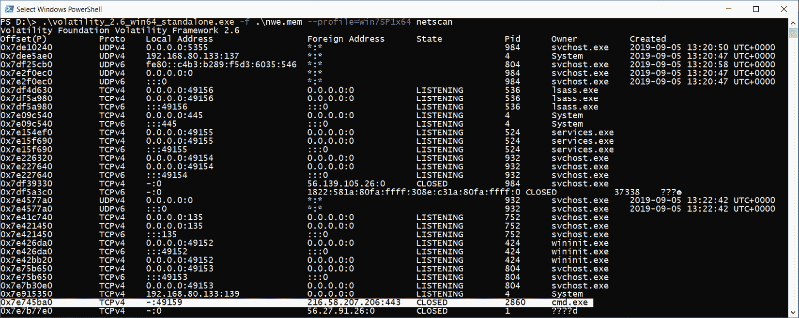
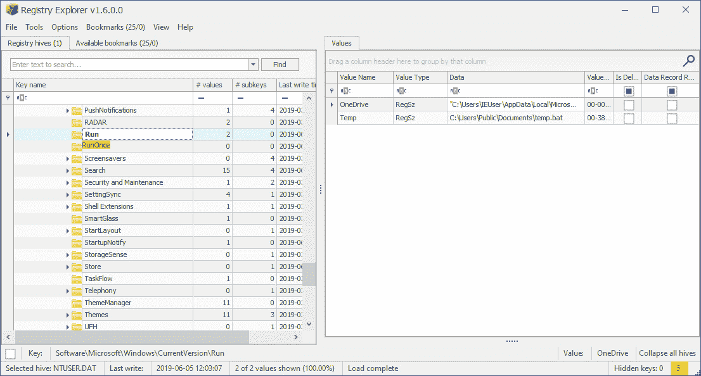

# 第五章：使用 Windows 内存取证进行恶意软件检测与分析

内存转储的取证分析并不仅限于分析用户的行为，尤其是在处理受害者计算机时。在这种情况下，专家通常需要进行分析，以寻找恶意活动的痕迹。这些痕迹可能是恶意进程、网络连接、代码注入，或者任何与恶意软件或攻击者工具行为相关的内容。由于现代恶意软件倾向于尽可能少地在磁盘上留下痕迹，而威胁行为者会使用 PowerShell 和批处理脚本保持隐蔽，内存分析正成为取证调查中的一个关键元素。

本章将解释如何在网络连接和活动进程中搜索恶意活动的痕迹，同时还会分析 Windows 注册表、事件日志和文件系统伪迹。

本章将涵盖以下主题：

+   搜索恶意进程

+   分析命令行参数

+   检查网络连接

+   检测进程内存中的注入

+   寻找持久化证据

+   创建时间线

# 搜索恶意进程

我们已经学会了如何分析在转储时活跃的进程，以识别用户活动。类似的技术也可以用于搜索攻击者留下的痕迹；然而，在这里，我们的重点将转向检测一些特定标志，帮助识别恶意活动。用户程序，如浏览器或 MS Office 组件，不会像云存储相关进程那样，成为关于用户及其近期活动的信息来源，而更可能成为初始访问痕迹的潜在来源。与此相关的进程，将被视为可能的数据外泄技术。我们调查的主要目标是寻找潜在恶意活动的标志和各种异常——如奇怪的进程名称或不寻常的参数、它们的非典型行为等。然而，先从最简单的开始——进程名称。

## 进程名称

在上一章中，我们讨论了如何获取活跃进程列表以及一个名为 `pslist` 的插件。所以我们不会重复这一部分；我们只会讨论你需要注意的要点。

首先，你需要了解系统进程。Windows 有许多这样的进程，负责运行个别服务和系统本身。这些进程常常成为恶意软件的目标，恶意软件会试图伪装成系统进程，或者在最坏的情况下，利用一个合法进程。但我们会在后面详细讨论这一点。让我们看看下面的示例：


图 5.1 – Volatility pslist 插件

*图 5.1*显示了通过`pslist`插件收集的进程列表。我们故意添加了一个正则表达式，用于选择那些包含`host`的进程名称。请注意`svchost`进程。这些是从动态库加载的服务的标准进程。现在，看看`ID 1664`的进程名称。你能看到不同之处吗？这个转储来自一个被`IcedID`感染的主机，`IcedID`是一种非常常见的恶意软件，通过钓鱼邮件传播，并与恶名昭著的勒索病毒运营者如 REvil、Conti 和 Egregor 有关联。在执行过程中，这种恶意软件会将一个名为`svhost.exe`的可执行文件丢入临时目录并将其作为子进程运行。

为了快速找到这种*伪装*的进程，不仅需要了解关键系统进程的名称及其特点，还需要考虑上下文，因为不同版本的 Windows 系统中的进程可能有所不同。这些差异通常是微不足道的，但了解这些差异将帮助你更有效地浏览进程列表并进行分析。

虽然一些恶意程序隐藏在合法进程的伪装后面，但另一些则非常公开地运行。这就是双重用途工具和一些攻击者使用的程序的情况。让我们看一下进程列表，如*图 5.2*所示：


](img/Figure_5.2_B17056.jpg)

图 5.2 – 正在运行的进程列表

在这里，我们可以看到大量看似合法的进程：`whoami.exe`、`ipconfig.exe`、`netstat.exe`等。这些工具可以被系统管理员或高级用户用来检查设置和配置网络。然而，这些相同的工具也可以被攻击者用来收集关于系统的信息，正如我们在场景中所做的那样。

像`cmd.exe`、`powershell.exe`、`wscript.exe`、`cscript.exe`和`rundll32.exe`这样的进程需要特别注意，因为它们经常被攻击者和现代恶意软件用作执行、持久化、防御规避、发现、收集等战术的一部分。在进程列表中出现这些进程不仅仅是重要的，相关的父进程同样也至关重要。父子进程的不典型组合是潜在恶意行为的标志之一。

## 检测异常行为

异常行为可能表现为许多不同的形式。对于某些进程，建立网络连接是非常不典型的，而对于其他进程，生成新进程或访问某些文件系统对象则是不典型的。

让我们考虑以下示例：


](img/Figure_5.3_B17056.jpg)

图 5.3 – 进程树

这里，`WINWORD.EXE` 进程生成了一个子进程 `rundll32.exe`，这在正常情况下是非常不典型的行为。这种行为可能是由嵌入在用户打开的文档中的宏所引起的。通常，MS Office 文档会成为网络钓鱼电子邮件的附件，长期以来，这一直是用于初始访问的最常用技术之一。Trickbot、Qakbot、Dridex 和 IcedID 都是通过这种方式传播的。例如，在 Trickbot、IcedID 和 Qakbot 的网络钓鱼活动中，用户会收到一封网络钓鱼邮件，其中附带了一个包含以下内容的文档：


图 5.4 – 欺骗性文档

你可能会问：*为什么不同的威胁行为者使用相同的诱饵？* 其实，他们利用了另一个威胁行为者 Shathak（也称为 TA551）的服务，后者专注于恶意软件分发。

在我们的案例中，要验证恶意文档的假设，我们需要找出哪个文件在 MS Word 中被打开，并尝试将其导出以供进一步分析。为此，我们可以使用 `handles`、`filescan` 和 `dumpfiles` 插件。我们回顾一下操作的顺序，如下所示：

1.  使用 `handles` 插件并结合 `-t` `file` 和 `--silent` 选项来获取有关我们进程使用的文件的信息，并查找由用户打开的文档。

1.  使用 `filescan` 插件来搜索有关包含所需文档的物理偏移量的信息。

1.  使用 `dumpfiles` 插件，并结合 `-Q` 选项以及先前步骤中获得的物理偏移量，再加上 `-D` 选项和我们想要保存文件的路径。

在上一章中，我们已经从 `WINWORD.EXE` 的内存中转储了 `GOT-7_HR (00000007).docm` 文件。现在让我们探索如何分析这个文档是否含有恶意内容。为此，你可以使用 `https://github.com/decalage2/oletools`）。Oletools 是一个 Python 工具包，用于分析 Microsoft OLE2 文件，如 MS Office 文档或 Outlook 消息。你只需安装 Python 3，并在 PowerShell 中运行以下命令，就可以安装这些工具：

```
pip3.exe install -U oletools
```

必要的依赖项将自动安装。因此，你将能够通过 PowerShell 使用 `oletools` 包中的任何工具来分析可疑文档。让我们检查导出的文档：


图 5.5 – olevba 输出

在该工具的输出中，你还可以找到有关宏、参数、导入的库等更详细的信息：


图 5.6 – 详细的宏描述

如你在前面的屏幕截图中看到的，我们的文档包含了内嵌的宏，具有混淆字符串和向进程注入代码所需的功能。

那么，我们在这里得到了什么？好吧，用户在 MS Word 的未保护模式下打开了文档，然后嵌入的脚本被执行，创建了`rundll32.exe`进程，该进程产生了多个相同名称的子进程。

让我们来看另一个例子，如*图 5.7*所示：


图 5.7 – 进程树

你是否记得`svhost.exe`进程伪装成合法的`svchost.exe`？让我们考虑它的父进程——`nwe.exe`，其`PID 1744`。即使我们在最初的分析中没有注意到 svhost 名称中缺少 *c*，父进程仍然会揭示它的秘密。因为`svchost`进程是系统进程，它们有一个预定义的父进程——`services.exe`。

注意

除了某些父进程外，所有系统进程都有固定的实例数量、预定义的用户、启动时间和磁盘上可执行文件的位置。任何偏离定义参数的情况都会引起怀疑，并需要额外检查。

回到我们的`nwe.exe`进程，注意到除了恶意的`svhost.exe`，它还创建了几个`cmd.exe`进程。像`cmd.exe`、`powershell.exe`等嵌入式工具常被攻击者用来进行无文件攻击。通过这种方式，攻击者利用经过批准的应用程序执行恶意命令和脚本。与传统方法不同，这种方式不需要在目标系统上安装任何代码，从而使检测变得更加困难。

让我们考虑无文件勒索软件的例子。在第一阶段，向用户发送一封钓鱼邮件，其中包含一个恶意宏，如前面所讨论的那样。运行宏会启动一个命令行，执行 PowerShell 脚本。该脚本下载加密密钥和额外模块——其执行结果是数据加密和赎金通知展示。

这样的攻击场景已经变得越来越经典。这就是为什么我们需要找出启动这些进程时使用了哪些参数，以及执行了什么。

# 分析命令行参数

分析命令行参数非常重要，因为它允许你检查可执行文件运行的位置以及传递给它的参数。这些参数可能包括其他受感染主机的 IP 地址或主机名、被盗的凭证、恶意文件名和整个脚本，如下图所示：


图 5.8 – Emotet 操作员使用的命令行参数

让我们探索几种获取感兴趣数据的方法。

## 进程的命令行参数

首先，我们可以使用我们已经熟悉的`pstree`插件并添加`-v`选项。这将允许我们输出进程树，同时显示启动特定程序时使用的命令行详细信息。这就是添加`-v`选项后，输出如*图 5.7*所示的变化：


图 5.9 – 详细的 pstree 输出

如你所见，我们有了新的行：`audit`、`cmd`和`path`。在这里，我们可以找到关于可执行文件的位置以及启动它时使用的参数的信息。你也可以使用一个独立的插件——`cmdline`，它的输出将如下所示：


图 5.10 – cmdline 输出

为了清晰起见，`cmdline`是使用`-p`选项和进程 ID 运行的，如前面的示例所示。从两个命令的输出中，我们可以看到我们的`svhost.exe`文件是从`C:\Users\lesly\AppData\Local\Temp`目录可执行的，这对于合法的`svchost`进程来说也不标准。这是另一个标志，表明该进程是恶意的。

让我们来看另一个例子，展示参数的作用：


图 5.11 – 通过正则表达式选择的进程的 cmdline 输出

在这种情况下，我们可以观察到运行 PsExec 时使用的参数，PsExec 是一种在攻击中经常用来远程执行命令和在主机上运行脚本的工具。那么，这告诉调查员什么呢？首先，它告诉我们攻击者正在使用`PsExec`进行执行和横向移动。其次，它揭示了他们正在交互的主机的名称。第三，它识别了已被攻破的用户凭据。

除了关于启动程序时使用的参数的信息之外，了解攻击者通过命令行执行的命令也会很有用。我们接下来讨论这个问题。

## 命令历史记录

自然，通过命令行执行的命令信息也会存储在内存中。为了获取这些数据，你可以使用 Volatility `cmdscan` 插件，它可以帮助你在内存中查找命令历史记录对象。该插件的输出如*图 5.12*所示：


图 5.12 – cmdscan 输出

请注意，这个插件的功能是有限的。例如，它只搜索默认历史记录大小的实例。如果你愿意，可以使用`-M`选项并设置其他任何值；然而，如果历史记录大小已被更改，找到该值会存在问题。

这个插件的替代方案是使用`yarascan`，我们在`cmd`命令中已经讨论过它，你可以编写规则来查找 PowerShell 和其他感兴趣的工具：


图 5.13 – 使用 YARA 规则检测恶意 PowerShell

*图 5.13*展示了一个简单的`YARA 规则`示例，用于搜索带有典型`-nop`、`-w hidden`和`-enc`选项的恶意 PowerShell 脚本。使用带有此规则的`yarascan`插件，你不仅可以找到恶意脚本本身，还可以获得在其中找到它们的进程的相关信息。

能够理解命令行上执行了什么是好的，而知道执行结果更好。`consoles`插件允许你获取不同命令行解释器执行的命令的数据：`cmd`、`PowerShell`、Python shell 和 Perl shell。`consoles`的主要优势是，它还允许你输出来自输入和输出缓冲区的信息，这样你就可以查看命令执行的结果。运行`consoles`与运行`cmdline`类似。让我们来看一个使用此插件获取的输出示例：


图 5.14 – Volatility 的 consoles 插件

在*图 5.14*中，首先，我们查看关于`conhost.exe`进程及其附加进程的信息，并伴随着当前使用的设置详情。最有趣的部分是`dump`。在这里，我们可以观察到实际执行的内容。请注意，在顶部，我们可以看到关于`cmd.exe`进程和`updater.bat`文件的信息，而在`dump`中，我们看到的是 PowerShell。那么，发生了什么呢？让我们稍微明确一点，并将`3008`和`3672`进程的`cmdline`插件输出添加到这里：


图 5.15 – 所选进程的 cmdline 输出

在*图 5.15*中，我们可以观察到，ID 为`3008`的进程是通过`cmd.exe /c`启动的。在我们的案例中，这意味着`Updater.bat`文件（其路径在`/c`选项后面指定）必须通过`cmd`来运行。在`consoles`插件的 dump 中，我们看到 PowerShell 正在运行，因此我们可以得出结论，PowerShell 及其所有选项是在同一个`Updater.bat`文件的内容中，这个文件是通过`cmd`执行的。

请注意 PowerShell 运行时的`-enc`选项。这个选项告诉我们，后面跟着的是 Base64 编码的命令。在法医调查中，这并不罕见。你可以使用在线的 CyberChef 工具（`https://gchq.github.io/CyberChef/`）解码这样的代码。你只需将 PowerShell 中的编码部分复制并粘贴到**输入**窗口中。接下来，选择需要应用的配方，搞定，一切准备好：


图 5.16 – 使用 CyberChef 解码的 Base64 代码

请注意，这个脚本的一个功能是创建一个`WebClient`对象。这类对象通常用于执行网络通信。

网络可以被恶意软件用来与**命令与控制**（**C2**）服务器进行通信并下载恶意负载。除此之外，如果攻击者以交互方式连接到远程主机，也会建立网络连接。因此，分析网络连接并寻找其中的异常是搜索恶意活动痕迹的另一个关键部分。

# 检查网络连接

Volatility 的`netscan`插件用于分析网络连接。它可以帮助你收集有关所有活动和最近连接的信息，以及打开的套接字。让我们看一个例子：


图 5.17 – Volatility netscan 输出

在*图 5.17*中，我们可以查看标准的`netscan`输出。这为我们提供了有关 OSI 传输层协议及其版本、涉及的 IP 地址和端口、PID，以及启动网络活动的进程名称和创建时间等信息。对于 TCP 协议，它与 UDP 不同，建立连接来传输数据，还会指定连接状态。例如，如果一个进程在某个端口上监听并等待传入连接，状态将是`LISTENING`。此外，如果连接到远程主机已建立，状态将是`ESTABLISHED`，而如果连接已终止，状态则是`CLOSED`。那么，我们如何处理这些信息？我们该寻找什么呢？

## 进程 – 启动者

让我们从一个简单的开始。就像在分析进程时，我们通过分析父子关系来寻找不典型的组合一样，我们也可以从启动连接的进程数据开始。显然，对于一些进程来说，创建网络连接是正常的。我们可以将这些进程称为浏览器、邮件代理或即时通讯工具。此外，一些程序可能会建立网络连接以检查更新和下载，这也是正常行为。现在，假设一个由资源管理器进程建立的网络连接。该进程需要通过图形用户界面向用户提供文件和目录的访问，或显示开始菜单。它创建网络连接并不 100%典型。当然，`explorer.exe`确实有可能会创建网络连接；例如，在传输 Windows 遥测数据时，特别是在开始菜单设置发生变化时。然而，请记住，这些连接将使用特定的 IP 地址建立，因此外部地址将是恶意活动的标志。不过，我们稍后会更详细地讨论这一点。

除了非典型的发起者外，还有一些进程我们需要特别注意。包括 `cmd.exe` 和 `powershell.exe`。如果你检测到这些进程建立的连接，一定要检查 `Foreign Address` 字段中指定的 IP 地址：



](img/Figure_5.18_B17056.jpg)

图 5.18 – cmd.exe 进程连接到远程 IP 地址

看一下前面的示例。在这里，`cmd.exe` 进程（PID `2860`）与 IP 地址 `216.58.207.206` 建立了网络连接。我们来检查一下这个地址。为此，你可以使用各种在线资源，例如 VirusTotal（[`www.virustotal.com/gui/home/search`](https://www.virustotal.com/gui/home/search)）。这个资源允许你搜索 IP 地址、URL、文件哈希值或文件本身的信息：


](img/Figure_5.19_B17056.jpg)

图 5.19 – VirusTotal 中的可疑 IP 地址

在*图 5.19*中，你可以查看我们 IP 地址的搜索结果。乍一看，一切似乎都很好——没有检测到任何威胁。然而，请注意 `10+ 个检测到的文件与此 IP 地址通信` 的消息。为了查看更多关于与这个 IP 地址通信的文件的信息，你可以切换到**RELATIONS**标签，找到**Communicating Files**字段，如下截图所示。如果你在 VirusTotal 上有账户，你还可以点击右侧的图标查看所有的通信，以图形化方式展示：


](img/Figure_5.20_B17056.jpg)

图 5.20 – VirusTotal 通信文件

在*图 5.20*中，我们可以看到，尽管这个 IP 地址没有被识别为恶意的，但它与很多恶意文件相关联，这意味着它并不安全。

如你所见，IP 地址在取证调查中起着重要作用。

## IP 地址和端口

不仅仅是 IP 地址和端口的使用情况能告诉你某个网络连接是否恶意，有时候，它们还可以告诉你攻击者使用了哪些工具。我们来看看接下来的截图：


](img/Figure_5.21_B17056.jpg)

图 5.21 – Volatility netscan

显示的信息不多；然而，即使在这里，你也可以看到可以通过 RDP 连接到此主机。那么，接下来的连接呢？你看到什么可疑的地方吗？来看看：


](img/Figure_5.22_B17056.jpg)

图 5.22 – 另一个可疑的连接

成功了！你可以看到 `UWkpjFjDzM.exe` 进程，而这个奇怪的名字背后是一个 `meterpreter`。

重要提示

`Meterpreter` 是 Metasploit 负载之一，提供交互式 shell，攻击者可以用它在目标机器上执行各种操作。

那么，我们是如何仅通过一行网络连接信息就知道这些的呢？事实上，端口在这里发挥了重要作用。我们已经提到过用于建立连接的传输层协议。当两个主机使用这些协议建立连接时，它们会根据端口号进行识别。通常，特定用途的端口是由**互联网号码分配局**（**IANA**）分配和注册的，尽管在实际操作中，经常会出现非官方使用的情况。然而，确实有一份用于特定用途的默认标准端口列表。有时，使用这些*默认*端口可以泄露攻击者使用的某些服务或工具。以下是最常用的 TCP 端口及其用途：


图 5.23 – 常用端口及其用途

如你所见，前表中列出的部分端口可以被攻击者利用。例如，`80`、`443`、`445` 或 `3389`。

除了标准服务常用的端口外，还有一些工具使用的默认协议，例如端口扫描器或后期利用框架。下表列出了这些工具及其默认端口：


图 5.24 – 特定工具使用的默认端口

这样，就解决了 Meterpreter 载荷的其中一个谜团。但这可真是个棘手的问题，不是吗？通常，Meterpreter 是通过注入进程的内存来部署的。它完全存在于内存中，因此不会写入磁盘。此外，也不会创建新的进程。这是因为 Meterpreter 被注入到一个受感染的进程中，然后它可以迁移到其他正在运行的进程。因此，攻击的取证痕迹非常有限。你明白这意味着什么吧？是时候谈谈注入和如何检测它们了。

# 检测进程内存中的注入

进程内存中有不同类型的注入。有些相似，而有些则差异很大。根据使用的技术，检测注入的方法可能会有所不同。我们将尝试讨论最相关的几种注入类型及其检测方法。

## 动态链接库注入

攻击者可以利用此技术进行防御规避或特权提升战术。通常，**动态链接库**（**DLLs**）注入是用于在合法进程的地址空间中执行任意代码的方法之一。DLL 注入有两种主要类型：*远程*注入和*反射*注入。

### 远程 DLL 注入

恶意进程获取 `SeDebugPrivilege` 权限，这使它能够作为调试器操作，并获得对其他进程地址空间的读写权限。利用这些权限，恶意进程打开目标进程的句柄，访问其地址空间，并将恶意库的完整路径写入其中。该库应该已经存在于磁盘上。然后，恶意进程使用 Windows API 函数在目标进程的上下文中创建一个新线程。这个新线程是用来将恶意库加载到目标进程地址空间中的。当这一过程发生时，恶意进程会清除写入磁盘的库路径所在的内存位置，并关闭目标进程的描述符。如果我们将这一过程整合成一个算法，它会是以下内容：

1.  获取权限并打开目标进程的句柄。

1.  将恶意 DLL 的完整路径写入目标进程的地址空间。

1.  创建一个新线程，使用 Windows API 函数从磁盘加载 DLL。

1.  从目标进程的内存中删除恶意 DLL 的路径。

1.  关闭目标进程的句柄。

由于远程 DLL 注入会将库写入磁盘，我们可以使用像 `dlllist` 和 `ldrmodules` 这样的 Volatility 插件来检测这一点。

有趣的是，`dlllist` 是一个插件，允许你获取已加载到进程中的库列表：


图 5.25 – Volatility dlllist 插件

请注意，关于进程使用的库的信息存储在三个不同的列表中：

+   `LoadOrderList`组织了模块加载到进程中的顺序。

+   `MemoryOrderList`组织了模块在进程虚拟内存中出现的顺序。

+   `InitOrderList`组织了 `DllMain` 函数执行的顺序。

`dlllist` 插件只与 `LoadOrderList` 一起工作。问题在于，有时候恶意库可能会从此列表中取消链接以隐藏它们的存在。这也会影响 `dlllist` 插件的输出，因为有关取消链接库的信息将不会显示。在这种情况下，`ldrmodules` 插件将提供帮助，因为它不仅输出三个列表中的所有信息，还提供关于该库是否存在于每个列表中的数据：


图 5.26 – Volatility ldrmodules 插件

通过这种方式，你可以检测已被取消链接的库。这些库在 `InLoad` 列中会显示为 `False`，而在其他列中则显示为 `True`。

重要提示

可执行文件本身也出现在这两个插件的输出中。在 `ldrmodules` 的输出中，`InInit` 列始终显示为 `False`。这是因为它的初始化方式不同，不像其他模块那样。

那么，如何判断这些插件提取的库中是否包含恶意库呢？你可以通过分析库的名称和位置来开始。注意一些不寻常的名称和库所在的磁盘目录。特别关注用户目录和临时目录。如果你在视觉上很难识别异常，可以随时使用`dlldump`和`dumpfiles`插件，并尝试将 DLL 提取到磁盘上进行额外检查。运行`dlldump`插件类似于`dumpfiles`插件。你只需要使用`-p`选项指定你感兴趣的进程 ID，使用`-D`选项指定你希望保存结果的目录路径。带有标准`.dll`扩展名的文件将出现在你指定的目录中。此时，你可以统计库的哈希值，并在`VirusTotal`上检查它们。

假设我们已为进程 ID 为`1072`的进程运行了以下命令，我们认为它可能是可疑的：

```
PS D:\> .\volatility_2.6_win64_standalone.exe -f .\dll.bin 
--profile=Win7SP1x64 dlldump -p 1072 -D .\output\
```

结果，我们的库已保存在输出目录中。为了快速计算 DLL 的哈希值，你可以使用以下 PowerShell 命令：


图 5.27 – 使用 PowerShell 计算 DLL 的哈希值

这个命令对目录中的每个文件调用`Get-FileHash`函数。

让我们用 VirusTotal 检查我们的哈希值：


图 5.28 – 使用 VirusTotal 检测到的恶意 DLL

这是我们的恶意 DLL。现在，我们可以分析它是如何进入系统的，并更详细地探讨它的功能。

另一个需要记住的重要点是，恶意 DLL 可能会使用打包工具进行打包。如果在解包阶段 DLL 代码被写入新的内存区域，我们可以使用`malfind`插件来检测它，稍后会讨论该插件。

### 反射式 DLL 注入

另一种注入库的方法是通过反射式 DLL 注入。这种方法更受欢迎，因为它不需要库存在磁盘上，因此留下的痕迹更少。这样的库可以通过网络下载，并立即注入到进程内存中。此方法的另一个特点是使用反射加载器，它嵌入在库本身中，而不是标准的 Windows 加载器。这个加载器会处理执行环境，并运行`DllMain`函数。

反射式 DLL 注入的逐步算法如下：

1.  获取权限并打开目标进程的句柄。

1.  在目标进程中分配内存并将恶意 DLL 写入其中。

1.  创建一个新线程以调用反射加载器。

1.  关闭目标进程的句柄。

这种技术被商业恶意软件广泛使用。例如，`SDBbot` 从 C2 下载恶意库并将其注入到新创建的 `rundll32.exe` 进程中。`Netwalker` 勒索病毒也使用相同的方式，将库反射性地注入到 `explorer.exe` 进程中。除此之外，许多后渗透框架也具备反射注入 DLL、shellcode 或可执行文件到进程的功能。我们熟知的 Metasploit、CobaltStrike 和 PowerShell Empire 都具有此功能。

你可以使用 `malfind` 插件来检测反射 DLL 注入。关键是，当使用这种技术时（就像使用压缩工具一样），会在目标进程内存中创建一个带有 `EXECUTE_READWRITE` 保护的页面。这是为了能够在该页写入恶意代码并执行它。`malfind` 插件可以帮助你找到这样的页面，并检查它们是否包含可执行文件头或者正确的 CPU 指令。

重要提示

一些程序可能会作为其合法活动的一部分注入库或代码。例如，反病毒解决方案就具有这样的功能。

`malfind` 插件有几个有用的选项，你可以根据需要单独或组合使用它们：

+   `-p <PID>` 允许你在具有特定 ID 的进程中搜索注入内容。

+   `-n <正则表达式>` 允许你搜索所有进程中与正则表达式匹配的注入内容。

+   `-D` 允许你转储注入的代码段。

让我们来看一下以下示例：


图 5.29 – Volatility malfind 插件

在这里，我们用 `rundll32.exe` 的进程 ID 运行了 `malfind`，并使用 `-D` 选项将注入的代码转储保存到输出目录。正如你所看到的，在这种情况下，我们的插件发现了具有有效 CPU 指令的 `PAGE_EXECUTE_READWRITE` 页面。

继续检查插件的输出，你还可以观察到带有可执行文件魔术数字的页面，如下图所示：


图 5.30 – 带有 MZ 魔术数字的 malfind 输出

你并不总是能够找到这些魔术数字。这是因为攻击者通常会使用各种掩蔽技术，包括移除头部信息。因此，你不应该只关注这些魔术数字的存在；更好的做法是检查所有看起来可疑的内容。

由于我们已经将 `malfind` 的输出提取到磁盘上，我们可以检查它们是什么内容。为此，你可以使用专门的工具，如 CFF Explorer（`https://ntcore.com/?page_id=388`）。另外，你还可以回到我们熟悉的 VirusTotal，它不仅可以给出提取代码的恶意性，还能帮助分析其性质。

在我们的案例中，以下是一个有趣的结果：


图 5.31 – 被 malfind 检测到的恶意 DLL

在这里，我们转储的一个注入被识别为恶意的。在右侧，注意到转储的内容是一个 DLL 文件。

如前所述，可执行文件也可以以类似的方式注入到进程中。接下来我们来看一个例子。

## 可移植执行文件注入

这种注入方式背后的思想非常简单。如前所述，它首先通过获得调试器权限并为目标进程打开句柄开始。接下来，在目标进程的地址空间中分配一块内存区域，然后用来写入恶意代码。当代码写入完成后，会创建一个新线程，目的是执行注入的恶意代码。通过这种方式，我们能够使恶意代码在合法进程的上下文中运行。

在这种情况下，逐步算法如下：

1.  获取权限并打开目标进程的句柄。

1.  在目标进程中分配内存并在其中写入恶意代码。

1.  创建一个新线程来运行注入的代码。

1.  关闭目标进程的句柄。

正如你所看到的，一切尽可能简单，最重要的是，磁盘上没有留下任何痕迹。第二步中分配的页面通常具有 `EXECUTE_READWRITE PROTECTION` 权限。这意味着 Volatility 的 `malfind` 插件也能帮助我们检测这种类型的注入。然而，请注意，`malfind` 只分析具有读、写和执行权限的私有内存区域。这意味着该插件的可检测性是可以被绕过的。想象一下，攻击者最初分配一个具有读写权限的页面；然后，在写入恶意代码后，他们将其更改为读和执行权限。从恶意活动的角度来看，一切照常工作，但 `malfind` 无法检测到。此时，我们可以使用手动分析。

进行这种分析的一个方便工具是 `Fireeye` 的 Redline，它可以通过填写一个简短的表单从官网 ([`www.fireeye.com/services/freeware/redline.html`](https://www.fireeye.com/services/freeware/redline.html)) 下载。这个工具有图形界面，可以让你查看内存区域及其内容和保护标志：


图 5.32 – 使用 Redline 进行内存分析

正如你在前面的截图中看到的，我们可以在表格视图中检查感兴趣的信息。如果我们需要了解某个特定区域的更多细节，可以双击该区域进行查看：


图 5.33 – Redline 完整详细信息

除了`malfind`，还有其他插件可以用于查找特定的注入。例如，`cobaltstrikescan`是由日本 CERT 专家开发的。它专门用于通过`YARA 规则`查找注入到进程中的 Cobalt Strike 信标。

重要提示

除了内置的 Volatility 插件外，您还可以使用社区开发的插件。为此，您需要在与 Volatility 版本相同的目录中创建一个`plugins`文件夹，并将您要使用的插件代码放入其中。要启动一个新的插件，只需在 Volatility 命令行中添加`--plugins=<插件文件夹路径>`，并且不要忘记指定插件名称。

要使用此插件，我们在与 Volatility 本身相同的目录中创建一个`plugins`文件夹，并在其中保存从 GitHub 仓库下载的`.py`扩展名的文件（[`github.com/JPCERTCC/aa-tools/blob/master/cobaltstrikescan.py`](https://github.com/JPCERTCC/aa-tools/blob/master/cobaltstrikescan.py)）。启动 Volatility 时，我们指定`--plugins=./plugins`。为了检查插件是否已成功加载，我们可以使用`--` `info`命令，此时插件列表中应显示一个新名称：


图 5.34 - 检查已添加的社区插件

现在我们可以进行测试了。让我们来看看`cobaltstrikescan`如何处理注入信标的搜索：


图 5.35 – cobaltstrikescan 的结果

如上图所示，Cobalt Strike 信标在`Outlook.exe`和`rundll32.exe`进程中被检测到。这意味着在这些进程的内存中，您可以找到其配置文件，其中包含诸如 C2 IP 地址等有用参数。

像 DLL 注入和代码/可执行文件注入这样的技术已经存在相当长的时间，因此已经有了或多或少可靠的检测方法。当检测到较新的技术时，事情变得更加复杂，但这些技术被攻击者频繁使用。当前最流行的技术之一是进程空壳化。

## 进程空壳化

空壳进程注入的基本思路是创建一个合法进程的新实例，并将其设置为`SUSPEND`状态，然后用恶意代码覆盖其可执行代码所占据的地址空间。因此，与以前的技术不同，经过进程空壳化后，合法进程的可执行代码将不再存在。与此同时，**进程环境块**（**PEB**）中的进程数据保持不变。因此，我们最终得到一个容器，包含合法进程的数据（DLL、堆、堆栈和句柄），其中执行恶意代码。

重要提示

PEB 是一个存储有关 DLLs、堆、环境变量以及进程命令行参数、当前工作目录和标准句柄信息的结构。

为了便于理解，我们再来看看操作的算法：

1.  启动一个合法进程的新实例，并使其第一个线程挂起。

1.  释放或取消映射包含合法进程代码的内存区域。

1.  分配一个新的内存段，具有读、写和执行权限。

1.  将从磁盘或网络上获得的恶意代码复制到新分配的内存段中。

1.  将挂起线程的起始地址设置为恶意代码的入口点。

1.  恢复线程。

由于这些操作，恶意代码会在由合法进程创建的容器中执行。进程空洞化的使用并不罕见。例如，Trickbot 就使用这种技术将其有效载荷注入到 `wermgr.exe` 进程中。

可以使用两种方法来检测进程空洞化。第一种方法涉及比较 PEB 和 **虚拟地址描述符** (**VAD**) 结构，寻找不一致之处。

重要提示

VAD 是另一个重要的结构，用于跟踪已保留或已提交的、虚拟上连续的页面集合。这些描述符包含内存映射文件的名称、初始保护设置及一些与页面及其内容相关的其他标志。

这可以通过由 Monnappa K. A. 编写的 `psinfo` 插件来完成。该插件从 VAD 和 PEB 中收集信息，并以易于比较的格式输出。此外，`psinfo` 还尝试检测具有执行可能性的可疑内存区域：


图 5.36 – psinfo 输出

在 *图 5.36* 中，你可以看到 `psinfo` 输出显示了来自 VAD 和 PEB 的基地址、进程路径和保护设置，以及命令行和其他与进程相关的详细信息。那么，我们在进程空洞化的情况下会看到什么呢？从 PEB 获取的信息将与作为容器的进程匹配，但 VAD 结构将不再将文件映射到此内存区域。

另一种检测空洞进程的方法是使用我们已经知道的 `ldrmodules` 插件。你还记得在那里的可执行文件是什么样子的吗？没错；在除 `InInit` 外的所有列表中，它设置为 `True`，然后是文件在磁盘上的完整路径信息。在进程空洞化的情况下，标志（`True False True`）仍然会保持，但可执行文件的路径将会缺失。

除了进程空洞化，攻击者还常用另一种注入方式：进程双胞胎（Process Doppelgänging）。

## 进程双胞胎

该技术首次在 2017 年的 BlackHat 大会上介绍，此后一直被攻击者广泛使用。例如，Bazar Loader 就使用进程双胞胎技术来注入其有效载荷。

该技术基于 NTFS 事务的使用。事务性 NTFS 是在 Windows Vista 中引入的，目的是使文件系统的更改更加安全高效。使用事务时，会创建特殊的事务文件，任何预期的更改都写入这些文件中。一旦更改完成，可以提交事务以一次性应用所有更改，或者通过删除事务文件及其更改来回滚事务。此技术在安装新程序时非常有用，因为如果在更改过程中发生崩溃，事务将被回滚，系统将恢复到原始的稳定状态。让我们看看该技术如何在进程双重伪装算法中使用：

1.  创建事务并打开一个干净的交易文件。

1.  用恶意代码覆盖交易文件。

1.  创建一个内存区域，指向交易文件。

1.  回滚事务（这将从文件系统中删除所有交易文件的痕迹，但不会删除映射了恶意代码的内存区域）。

1.  创建对象，进程和线程对象；将线程的起始地址设置为恶意代码的入口点。

1.  创建进程参数并将其复制到新创建的进程地址空间。

1.  运行双重伪装的进程。

使用此技术相当难以检测。对于 Windows 10 之前的系统，你可以检查与可疑进程相关联的`File_Object`。如果该文件启用了写访问权限，可能是进程双重伪装。对于 Windows 10 系统，由于`_EPROCESS`结构的新成员，这会稍微容易些。关键在于，对于双重伪装的进程，`_EPROCESS`的`ImageFilePointer`被设置为`NULL`。要检查可疑进程的相关信息，可以使用 Volatility 的`volshell`。

首先，在`volshell`中运行`ps()`来识别可疑进程的偏移量：


图 5.37 – 执行 volshell ps()

然后，使用`dt('_EPROCESS',<offset>)`来获取与目标进程相关的信息：


图 5.38 – 获取进程相关数据

搜索`0x448` `ImageFilePointer`。如果出现`NULL`而不是正常值（如*图 5.39*所示），恭喜！看起来你刚刚找到了双重伪装的进程：


图 5.39 – 正常的 ImageFilePointer 值

值得在这里提到的是，即使攻击者使用隐秘的注入技术，如进程双胞胎（Process Doppelgänging），也有可能使用广泛使用的工具，如`mimikatz`或来自后期利用框架的 payload，在合法进程的上下文中执行。这为我们提供了使用关键字、正则表达式和`YARA 规则`搜索进程内存的可能性。让我们来看一下以下的例子。我们有一个名为`wscript.exe`的进程。如前所述，这是我们必须警惕的进程之一，因为威胁行为者可以利用`wscript.exe`来执行他们的恶意脚本。

重要提示

WScript 是微软 Windows 的一个组件，旨在运行用脚本语言（如 Visual Basic）编写的脚本。

在我们的场景中，调查命令行参数和进程使用的文件句柄仅让我们得到了正在使用的脚本的名称。因此，我们转储进程内存并使用`strings`工具来获取 ASCII 和 UNICODE 字符：


图 5.40 – 转储 wscript 的内存并使用 strings64 解析

在生成的文本文件中，你可以使用`powershell`、`cmd`、`vbs`和`base64`关键字来搜索任何感兴趣的信息：


图 5.41 – Base64 关键字搜索结果

在*图 5.41*中，你可以查看使用`base64`关键字找到的 Base64 编码代码。为了更好地理解该代码的性质，你可以使用`CyberChef`解码它：


图 5.42 – 解码后的 Base64

CyberChef 已经自动检测到我们的 Base64 编码代码是一个 PE 文件。此时，我们可以保存生成的 PE 文件进行进一步分析。通过继续分析这些行，我们发现该文件是通过网络下载的，并且随后被注入到一个新的进程中。

这就是我们如何检测恶意进程并在内存转储中找到各种注入。然而，这并不是全部。攻击者通常需要在系统上保持持久性，以保持对受感染主机的访问。可以通过多种方式实现这一点。接下来让我们讨论这些方式。

# 寻找持久化证据

恶意软件和攻击者有许多技术可以用于在系统中占据立足点。这些技术包括已经使用多年的经典技术。此外，还有一些相对较新的技术，正逐渐流行起来。我们并不是在这里讲解每一个存在的技术，而是提供一些我们认为最有可能帮助你发现系统中恶意软件持久性工具的工具。当然，例子也不会缺少。

## 启动或登录自动启动执行

在这种技术中，攻击者通过更改系统设置，在系统启动或登录时自动执行程序。例如，他们可以将恶意可执行文件的路径添加为以下键的某个值的数据：

+   `HKLM\SOFTWARE\Microsoft\Windows NT\CurrentVersion\Winlogon`

+   `HKLM\Software\Microsoft\Windows\CurrentVersion\Run`

+   `HKLM\Software\Microsoft\Windows\CurrentVersion\RunOnce`

+   `HKCU\Software\Microsoft\Windows\CurrentVersion\Run`

+   `HKCU\Software\Microsoft\Windows\CurrentVersion\RunOnce`

在上一章中，我们讨论了几种从内存中提取注册表的方法。你可以选择最适合你的方式，导出与前述键对应的`SOFTWARE`和`NTUSER.DAT`注册表文件。要处理这些文件，你可以使用`Registry Explorer`或`RegRipper`，就像我们之前所做的那样：



图 5.43 – 运行键分析

在前面的截图中，可以清楚地看到`Temp`值和`temp.bat`。你还可以使用 Volatility 的`prinkey`插件，配合`-K`选项，检查虚拟注册表中该键的内容。

如果你想更有逻辑地构建搜索持久化使用的键，你可以先检查`handles`插件的输出，使用`-t Key`选项，它会显示该进程使用的所有注册表键：


图 5.44 – Volatility handles

这种方法不仅加速了搜索用于持久化的注册表键，而且还提供了恶意软件感兴趣的注册表键的信息，以及它可能如何使用这些键。需要注意的是，如果你在`handles`插件的输出中没有看到你寻找的键，不能保证它没有被使用。因此，如果结果不理想，建议你还是检查注册表。如果仍然能找到该键，你可以使用`prinkey` `-K <key>`检查其内容，如*图 5.45*所示：


图 5.45 – 使用 Volatility printkey 检查 Load 值

当然，通过滥用*运行*键来实现持久化并不是威胁行为者使用的唯一技术，另一个常见的技术是 Windows 注册表操作。以下是一些其他示例：

+   Winlogon 助手 DLL（MITRE ATT&CK 中的 T1547.004）：威胁行为者修改`Software\Microsoft\Windows NT\CurrentVersion\Winlogon`注册表键来实现持久化。

+   图像文件执行选项注入（MITRE ATT&CK 中的 T1546.012）：威胁行为者修改`HKLM\SOFTWARE\Microsoft\Windows NT\CurrentVersion\Image File Execution Options`和`HKLM\SOFTWARE\Microsoft\Windows NT\CurrentVersion\SilentProcessExit`注册表键来实现持久化。

+   登录脚本 (T1037.001，依据 MITRE ATT&CK)：威胁行为者修改`HKCU\Environment\UserInitMprLogonScript`注册表键值来实现持久化。

让我们继续查看其他流行的持久化技术。例如，创建新账户。

## 创建账户

这种技术通常被勒索软件操作员使用，因为它非常适合保持对受感染系统的访问。可以再次使用注册表查找新账户的痕迹。记住，在前一章中，我们讨论了 SAM 注册表文件及其如何包含用户信息，包括创建日期。为了便于分析用户创建数据，最好使用`Registry Explorer`工具和书签选项卡。操作方法是，将导出的 SAM 文件拖入 Registry Explorer，点击**书签**，然后选择**用户**。这将显示一个包含所有用户的表格：


图 5.46 – 用户书签

如你所见，在前面的截图中，**创建时间**列显示了每个用户的创建日期和时间。你可以通过比较这些时间戳来识别在攻击期间创建的用户。

当然，这种方法有一个显著的局限性——关于域用户的相关信息可能缺失。因此，我们将考虑的另一种方法是导出事件日志。

重要提示

Windows 事件日志是位于`C:\Windows\System32\winevt\Logs`目录下的`.evtx`文件。它们包含与系统操作、用户活动等相关的各种事件。

这种方法与常规文件导出没有区别。操作步骤如下：

1.  运行`filescan`插件，并将其输出重定向到文本文件中。

1.  打开包含`filescan`结果的文本文件，并找到你感兴趣的日志。

1.  从文本文件中复制所需日志的偏移量。

1.  运行`dumpfiles` `-Q <offset>`。

1.  重命名生成的文件，包括扩展名。

与创建新用户相关的事件存储在`Security.evtx`日志中。请注意，在普通用户的计算机上，这个日志会记录本地用户创建的信息，而对于域用户，你需要查看位于域控制器上的日志。

要在 Windows 中打开导出的事件日志，你可以使用内置的`事件查看器`。有关创建和启用用户的其他信息可以在`4720`和`4722`事件中找到。你可以使用这些事件 ID 来创建过滤器。最终结果应该是这样的：


图 5.47 – 通过事件查看器打开的 Security.evtx

在这里，我们有关于在`seriouscats`域中创建`honka`用户的信息。还有一个时间戳，表示事件发生的时间，也就是用户被创建的时间。

重要提示

有时候，事件日志在从内存转储中导出时会损坏。若要尝试恢复来自损坏日志的事件，您可以使用 CQURE 的优秀工具`CQEvtxRecovery`。

因此，根据情况，你可以在注册表或事件日志中寻找新用户创建的痕迹。

事件日志本身是关于系统中发生的事情的极好数据来源：远程连接、创建用户及更改其属性、启动 PowerShell 脚本、Windows Defender 崩溃等。让我们来探索导出的内存事件日志还可以用来做什么。

## 创建或修改系统进程

当使用这种持久化技术时，攻击者会安装一个新服务，该服务应该运行磁盘上的可执行文件或执行脚本。通常，像`Emotet`和`Trickbot`这样的木马会利用安装新服务的方式。

有关服务安装的附加信息记录在`System.evtx`事件日志中，这也可以从内存转储中导出。我们会关注事件 ID 为`7045`的记录：**一个服务被安装到系统中**。分析此类事件时，您应该注意可执行文件的名称和位置，以及在脚本的情况下，所使用的参数：


图 5.48 – System.evtx

在*图 5.48*中，你可以看到一个恶意服务的示例。请注意，可执行文件位于用户的临时文件夹中。

分析服务的另一种方式是使用专门的 Volatility 插件。例如，你可以使用`svcscan`插件获取关于正在运行的服务、服务名称、类型、状态、二进制路径等信息，如*图 5.49*所示：


图 5.49 – svcscan 输出

还有一个由社区开发的插件，名为`autoruns`（[`github.com/tomchop/volatility-autoruns/blob/master/autoruns.py`](https://github.com/tomchop/volatility-autoruns/blob/master/autoruns.py)）：


图 5.50 – autoruns 输出

这个插件不仅收集有关服务的信息，还收集可能被用于持久化的各种注册表键值。一方面，插件提供了相当简便的方式来访问各种信息；另一方面，收集的数据集是有限的。因此，在使用该插件之前，我们建议您阅读收集的数据列表，该列表可以在同一 GitHub 仓库中找到。

除了安装新服务外，攻击者还可以通过调度器创建任务。让我们来看看这一技术及如何检测它。

## 调度任务

创建调度任务是最常见的技术之一。它被商用恶意软件广泛用于在被感染系统上获取持久性。有关调度任务的信息存储在多个位置：

+   `C:\Windows\System32\Tasks`：在这里，你可以找到带有任务描述的 XML 文件。

+   `Microsoft-Windows-TaskScheduler%4Operational.evtx`：你可以分析与创建新任务相关的事件 ID 106。

+   `SOFTWARE`：任务缓存的信息也存储在注册表中。

我们将继续进行注册表分析。所以，我们需要像之前一样导出 `SOFTWARE` 文件。这次，我们将使用 `RegRipper` 来解析我们的注册表文件：


图 5.51 – 使用 RegRipper 解析 SOFTWARE

我们可以使用 `taskcache` 关键字来搜索所需的信息。有两个插件可以显示与任务相关的数据：`tasks` 和 `taskcache`。这两个插件都显示关于任务的路径和创建时间的信息，但第二个插件还会显示任务 ID，如下所示：


图 5.52 – taskcache 和 tasks 插件

如你所见，存在各种持久性技术，这只是其中的一小部分。然而，利用我们已经回顾过的分析方法，你将能够分析更多的技术。

法医调查中的另一个重要步骤是时间线的创建。其应用在很大程度上取决于你的目标，因为你不仅可以寻找与恶意活动相关的信息，还可以收集关于用户文件的数据。让我们更详细地看看这个话题。

# 创建时间线

时间线非常有用。它们在调查中扮演着重要角色，因为你不仅可以了解目标系统在特定时间段内发生了什么，还可以一步步重建攻击者的行动。以下是使用时间线的几种方法：

+   **事件期间系统变化分析**：如果你已经有了事件发生时的数据，可以使用时间线分析目标系统在此期间发生的变化。

+   **文件时间戳分析**：通过基于文件系统的时间线，你可以搜索与特定文件相对应的条目，并分析它们的出现时间戳或对其执行的操作。

+   `.pf` 扩展名的文件在 `C:\Windows\Prefetch` 目录中创建，文件与正在运行的程序相对应。这个文件的名称通常包含正在运行的程序的名称。因此，时间线中关于预取文件创建的记录不仅可以告诉你某个程序已启动，还可以让你确定到底是哪个程序启动了。

如你所见，时间线有多种类型。我们将讨论那些可以通过内存转储构建的时间线。

## 基于文件系统的时间线

这个时间线基于文件系统元文件。例如，对于 NTFS 文件系统，这个文件可能是**主文件表**（**$MFT**）。这个文件包含关于文件系统中所有文件及其时间戳的信息。

要基于 $MFT 构建时间线，首先需要获取其数据。这可以通过 Volatility 的 `mftparser` 插件完成，该插件从内存中收集所有 $MFT 条目。运行此插件的过程如下：


图 5.53 – Volatility mftparser

注意所使用的选项；它们用于以我们想要的格式保存数据。结果是一个包含无序 MFT 记录的文本文件。要将它们转换为时间线，您可以使用 `TheSleuthKit` 中包含的 `mactime` 工具。要运行此工具，您需要安装 Perl。为此，您只需从官方网站下载安装程序并按照说明进行操作（[`strawberryperl.com/`](https://strawberryperl.com/)）。

要获取 `mactime` 工具本身，请访问 `TheSleuthKit` 的官方网站（[`www.sleuthkit.org/sleuthkit/download.php`](https://www.sleuthkit.org/sleuthkit/download.php)）并下载 Windows 版本的二进制文件。将下载的压缩包解压到您方便的目录中。

现在我们准备将 MFT 记录转换为时间线。使用以下命令：

```
PS D:\> C:\Strawberry\perl\bin\perl.exe .\sleuthkit-4.10.2-win32\bin\mactime.pl -b .\output\body.txt > .\output\timeline.txt
```

使用 `-b` 选项时，我们指定了以正文格式传递文件。我们将工具的输出重定向到 `timeline.txt` 文本文件中。

您可以使用文本编辑器或 MS Excel 来查看此文件：


图 5.54 – 基于文件系统的时间线

在之前的时间线中，我们可以看到 `Gnh3J8f.EXE` 的预取文件被创建，这表明它已被执行。

自然地，时间戳不仅存储在文件中，还存储在创建的进程、网络连接等内容中。所有这些信息也可以添加到时间线中。让我们来看看如何做。

## 基于内存的时间线

您可以使用 Volatility 的 `timeliner` 插件来构建存储在内存中的所有信息的时间线。由于此插件的输出非常庞大，我们建议您立即将其重定向到磁盘上的文本文件中：

```
PS D:\> .\volatility_2.6_win64_standalone.exe -f .\nwe.mem 
--profile=Win7SP1x64 timeliner > .\output\timeline.txt
```

这次，我们的文件中将有更多的信息：


图 5.55 – 基于内存的时间线

有时候，这些信息量过大，特别是当以文本文件的形式处理这些数据时并不太方便。作为替代方案，您可以使用 Redline，它也允许基于内存转储中的数据构建时间线。与此不同的是，您将拥有一个图形界面，并且可以轻松地添加和删除某些数据源：


图 5.56 – Redline 的时间线

看起来更方便了，不是吗？

通过这种简单的方式，我们可以构建不同的时间线并将其添加到我们的调查中。

# 总结

搜索恶意活动的痕迹是一个复杂但有趣的过程。

你可以使用各种标记来检测恶意进程。这些标记可以包括进程名称、可执行文件位置、启动参数、非标准的父子进程组合以及异常行为。此外，与恶意软件或攻击工具相关的进程通常会执行网络活动。对这些活动的内存分析不仅可以帮助你检测恶意进程并获取 C2 服务器的 IP 地址，还能帮助你了解攻击者使用的工具。

如果你检测到一个进程正在与远程 IP 地址通信，但没有发现其他恶意标记，那么是时候在内存中寻找恶意软件注入的痕迹了。最常见的注入类型包括 DLL 注入、可执行文件注入、进程空洞化以及 Process Doppelgänging。可以在内存转储中找到这些注入的痕迹。

一旦识别出恶意进程，值得寻找持久化痕迹，这些痕迹通常在攻击中用于维持对受损主机的访问。为了搜索这些痕迹，你可以使用专门的 Volatility 插件，或进行注册表和事件日志分析。

在调查中，构建时间线是一个很好的补充，它不仅可以帮助你查找与系统中某个变更相关的时间戳，还能帮助你将所有信息整理到一起。

这就是我们如何进行内存转储的取证调查，寻找恶意活动的痕迹。然而，内存转储并不是唯一的易失性数据来源。Windows 还具有其他来源，如`pagefile`、`swapfile`、`hibernation files`和`crash dumps`。我们将在下一章讨论这些来源并进行分析。
