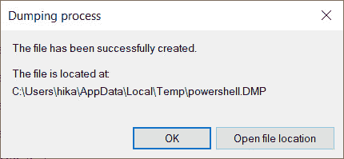

# 第六章：易失性内存的替代来源

在前几章中，我们讨论了内存转储作为法医调查中有用数据来源的重要性。我们查看了许多不同的分析工具，讨论了用户活动检查的技巧，并讨论了检测恶意软件痕迹的技术。然而，关于 Windows 操作系统内存取证的内容还没有结束。

我们一开始就提到过，除了主内存本身外，还有其他可能包含相似信息的内存来源。如果由于某些原因，你无法创建完整的内存转储或其分析失败，你总是可以转向这些来源：休眠文件、页面文件、交换文件和崩溃转储。这正是我们将在本章中讨论的内容。

本章将解释如何访问其他易失性数据来源，使用哪些工具进行分析，当然，还会讲解使用哪些技术来检索特定的信息。

本章将涵盖以下主题：

+   调查休眠文件

+   检查页面文件和交换文件

+   分析崩溃转储

# 调查休眠文件

我们将首先查看的替代来源是休眠文件。我们之所以从这里开始，是因为休眠文件是关闭电源前`hiberfil.sys`文件的压缩副本。这是睡眠模式和休眠模式之间的主要区别，因为休眠模式下电源完全切断。

由于休眠文件是计算机进入节能模式时 RAM 的副本，它可以包含用户正在处理的文件，即使这些文件在休眠文件进行分析时已经不再存在于磁盘上。因此，这个来源可能在法医调查中起着重要作用，那么我们该如何获取这个文件呢？

## 获取休眠文件

完整的休眠文件通常位于根目录下；然而，该文件受系统保护，默认情况下是隐藏的。如果你正在处理一台运行中的计算机，并且休眠文件已经创建，你可以使用成像工具将文件复制到可移动媒体上。

你可以使用著名的**法医工具包成像工具**（**FTK Imager**）来完成这项工作。在目标主机上运行它，点击**文件** -> **添加证据项...**，如以下截图所示：


图 6.1 – FTK Imager 的添加证据项选项

在出现的窗口中，选择**逻辑驱动器**，如以下截图所示，然后点击**下一步**：


](img/Figure_6.2_B17056.jpg)

图 6.2 – 选择源窗口

从下拉菜单中选择根目录（`C:\`），然后点击**完成**，如以下截图所示：


](img/Figure_6.3_B17056.jpg)

图 6.3 – 选择驱动器窗口

然后你将看到目标主机的文件系统出现在主窗口的左侧。在根目录下，你可以找到休眠文件。为了将其复制到可移动媒体，右键点击该文件并选择 **导出文件…**，如以下截图所示：


图 6.4 – 导出文件选项

在对话框中，选择你想要保存休眠文件的可移动媒体，并点击**确定**，如以下截图所示：


图 6.5 – 目标路径

你应该看到一个进度条，显示将文件复制到可移动媒体的过程，如下截图所示：


图 6.6 – 导出过程

这将导致一个 `hiberfil.sys` 文件出现在可移动媒体上，准备进一步处理。

如果目标主机上没有休眠文件，但你仍然想创建一个，你需要执行以下操作：

1.  确保已启用休眠模式。

为此，请以管理员身份运行 PowerShell 并执行以下命令：

```
PS C:\windows\system32> .\powercfg.exe /availablesleepstates
```

1.  如果休眠已启用，你将在出现的列表中看到 `Hibernate`。否则，你可以通过执行以下命令启用它：

    ```
    PS C:\windows\system32> .\powercfg.exe /hibernate on 
    ```

命令示例如下截图所示：


图 6.7 – powercfg.exe

1.  创建一个休眠文件。

要执行此操作，只需运行以下命令：

```
PS C:\windows\system32> .\shutdown.exe /h 
```

该命令将使目标计算机进入休眠模式，你将得到一个带有时间戳的 `hiberfil.sys` 文件，时间戳对应命令执行的时间。然后你可以使用 FTK Imager 导出这个文件。

请注意，在法医调查中，你更可能与法医镜像打交道，而不是与实时系统打交道。要从法医镜像中提取休眠文件，只需使用特殊工具打开它。你可以使用相同的 FTK Imager 和 **添加证据项…** 菜单选项，但现在，你必须选择**镜像文件**，并指定驱动器上法医副本的路径，而不是实时系统的逻辑驱动器。导出休眠文件到磁盘的其余过程将与之前描述的过程类似。

现在我们已经成功获取了休眠文件，接下来让我们看看如何分析它。

## 分析 hiberfil.sys

由于休眠文件是 RAM 的压缩副本，我们首先需要解压它并获取原始副本。这可以通过使用一个名为 `imagecopy` 的 Volatility 插件来完成。这个插件允许我们将内存转储转换为不同的格式，并将休眠文件转换为原始格式。它的界面如下所示：


图 6.8 – Volatility imagecopy

我们使用 `-f` 选项指定休眠文件的路径，使用 `-O` 或 `--output-image` 选项指定我们希望保存结果的路径，并指定文件名和扩展名。别忘了使用 `--profile` 选项，在此处需要指定与目标主机操作系统版本相对应的配置文件。这将为您提供一个准备好进行分析的文件，在本例中是 `hiberfil.raw`。

将休眠文件转换为原始格式的另一种方法是使用 Comae 工具包中包含的 `Hibr2Bin` 工具。要获取此工具，您需要通过在官方网站上注册成为测试计划的成员，网址是 [`www.comae.com/`](https://www.comae.com/)。

该工具可以通过命令行运行。除了输入和输出文件外，还必须指定多个选项，例如平台以及操作系统的主版本和次版本，如下所示：


图 6.9 – Comae 工具包 Hibr2Bin

`Hibr2Bin` 支持以下版本：

+   `/MAJOR 5` `/MINOR 1` Windows XP

+   `/MAJOR 5` `/MINOR 2` Windows XP x64；Windows 2003 R2

+   `/MAJOR 6` `/MINOR 0` Windows Vista；Windows Server 2008

+   `/MAJOR 6` `/MINOR 1` Windows 7；Windows Server 2008 R2

+   `/MAJOR 6` `/MINOR 2` Windows 8；Windows Server 2012

+   `/MAJOR 6` `/MINOR 3` Windows 8.1；Windows Server 2012 R2

+   `/MAJOR 10` `/MINOR 0` Windows 10；Windows Server 2017

这也将产生一个原始文件。此类文件可以使用您已经熟悉的工具进行分析。例如，您可以使用 Volatility 获取活动进程列表，搜索文件，或者检测恶意活动的痕迹。

重要提示

由于休眠文件有其自身的结构，因此其中某些信息仍然会缺失。例如，当您进入休眠模式时，关于活动网络连接的信息会被清除，因此您无法从 `hiberfil.sys` 文件中获取有关网络连接的完整信息。

让我们看看如何使用 Volatility 从休眠文件中获取活动进程列表。为此，我们使用 `pslist` 插件，如下图所示：


图 6.10 – 来自休眠文件的活动进程列表

同样，我们可以获取休眠文件中遇到的文件的详细信息，如下图所示：


图 6.11 – 来自休眠文件的文件列表

我们甚至可以尝试提取它们，如下所示：


图 6.12 – 从休眠文件提取文件

如您所见，这一分析步骤与完整内存转储的分析没有太大区别。因此，您可以毫无疑虑地应用我们在前几章中讨论的技术。

对于休眠文件的自动处理和分析，您可以使用如 Arsenal Recon 的 Hibernation Recon 等付费工具，或像 Magnet AXIOM 或 Belkasoft Evidence Center 这样复杂的解决方案。

这就是我们分析休眠文件的方式，但这只是我们考虑的替代数据源之一。接下来，我们继续。

# 检查页面文件和交换文件

我们在前几章中已经提到过页面文件和交换文件。在那里，我们讨论了操作系统用来让大量进程同时运行的机制。当物理内存不足时，该机制会将临时进程数据存储到磁盘上一个专门保留的空间——页面文件中。

重要提示

数据按页面逐页加载到页面文件中，每页大小为 4 **千字节**（**KB**），因此数据可以占据连续区域以及页面文件的不同部分。因此，在分析过程中，您可以同时使用文件雕刻和字符串搜索。此外，Windows 在运行时仅在内存中跟踪页面文件条目及其与特定进程的关系，因此无法在页面文件分析过程中恢复这种关系。

交换文件和页面文件的主要区别在于，交换文件存储来自 Microsoft Store 应用程序（以前称为 Metro 应用程序）的数据。它存储那些当前不需要，但在切换应用程序或从动态磁贴打开应用程序时可能需要的数据，这些数据存储在 `pagefile.sys` 中。

## 获取页面文件

默认情况下，页面文件是启用的，因此您无需手动创建它。此外，系统中可能会有多个此类文件，它们不一定位于根目录。要查找分页文件，您需要检查 `HKEY_LOCAL_MACHINE\SYSTEM\CurrentControlSet\Control\Session Manager\Memory Management` 注册表项中的 `ExistingPageFiles` 和 `PagingFiles` 值。这可以通过在在线机器上使用注册表编辑器，或通过分析从取证映像中获得的 `SYSTEM` 注册表文件来完成，如下图所示：


图 6.13 – SYSTEM 注册表文件中的 ExistingPageFiles 和 PagingFiles 值

一旦检查了分页文件的数量和位置，您可以像提取休眠文件一样提取它们，如下所示：


图 6.14 – 页面文件提取

此外，一些工具允许您在创建内存转储的同时创建页面文件的副本。回顾 FTK Imager 转储创建过程；在那里，您可以通过启用 **包含页面文件** 复选框来捕获页面文件，如下图所示：


图 6.15 – FTK Imager 包含页面文件

这将创建两个文件：一个内存转储文件和一个页面文件的副本。

一旦你成功提取了页面文件，就可以开始分析它了。

## 分析 pagefile.sys

分析页面文件有不同的方法。我们将尽量详细阐述一些最重要的方法，以便你可以选择最适合你调查目标的方法。

重要说明

从 `10525`版本开始，Windows 10 使用页面文件压缩。这意味着你需要先解压页面文件才能进行分析。你可以使用 Maxim Sukhanov 开发的`winmem_decompress`工具来实现这一目的（[`github.com/msuhanov/winmem_decompress`](https://github.com/msuhanov/winmem_decompress)）。

一些工具——例如 MemProcFS——允许联合分析内存转储、页面文件和交换文件。为此，`-pagefile0...9`选项会添加到`-device`选项中。页面文件的默认值为 0；而交换文件则是 9。下面展示了运行 MemProcFS 的一个示例：


图 6.16 – 联合分析内存转储与相应页面文件

在这种情况下，页面文件中的数据将补充内存转储中的数据，但在这种情况下更容易遗漏特定信息。因此，最好使用独立工具来分析页面文件。

我们之前已经提到，页面文件中的数据是以 4 KB 的块存储的。由于这些块可能占据文件的不同部分，而且很难获得数据内容的结构化表示，因此页面文件分析不会很直接。因此，开始分析页面文件的最佳方法之一是查找字符串。

### 字符串搜索

分析页面文件最简单的方法是查找特定的字符串。你可以使用你已经熟悉的`Strings`工具来提取给定文件中所有的 ASCII 和 Unicode 字符。运行该工具时，可以通过 PowerShell 和以下命令来执行：

```
PS D:\> .\strings64.exe .\pagefile.sys > D:\output.txt
```

输入是我们页面文件的路径，输出会重定向到一个文本文件，即 `output.txt`。在生成的文件中，像之前一样，我们可以使用关键词搜索，或者简单地检查输出，查看是否有与执行任何程序（可能是攻击者使用的程序）相关的字符串，如下图所示：


图 6.17 – 字符串输出

你可以在前面的截图中看到，`Strings`工具的分析结果检测到了一个**HTTPS 反向 shell**运行。

既然我们在谈论字符串搜索，自然不能忘记使用`yara`工具来帮助我们。这个工具的原理与 Volatility 的`yarascan`插件相同。你可以通过官方的 GitHub 仓库下载这个工具，链接为 [`github.com/VirusTotal/yara/`](https://github.com/VirusTotal/yara/)。你可以在以下截图中看到 GitHub 页面：


图 6.18 – yara GitHub 仓库

页面右侧有一个指向最新版本发布的链接，这正是你需要的。在**Releases**页面，选择所需的版本，然后下载并解压包含可执行文件的档案。你可以使用 PowerShell 来运行它。要查看所有可用的选项，请运行以下命令，如下图所示：


图 6.19 – yara 选项

你可以使用来自公共来源的 YARA 规则，也可以编写自己的规则。我们来使用一个 YARA 规则来查找文件中的 URL。规则及其结果如下所示：


图 6.20 – yara 扫描结果

我们还可以通过 `bulk_extractor` 扩展搜索，查找域名、电子邮件、SQL 查询等，正如以下截图所示：


图 6.21 – bulk_extractor 执行

在这里，我们不仅能找到 IP 地址和域名，还能找到完整的 URL，如下所示：


图 6.22 – bulk_extractor URL 直方图

请注意 IP 地址。你可以随时在 VirusTotal 或任何你喜欢的资源上检查它们。如果你检查我们找到的其中一个地址，你将看到以下结果：


图 6.23 – VirusTotal 结果

VirusTotal 已检测到多个包含此 IP 地址的恶意文件。最好检查我们的页面文件是否包含此类文件。

### 文件切割

除了字符串搜索外，你还可以使用工具进行文件切割。你可以使用 PhotoRec 作为工具。此工具支持基于签名的搜索，可以识别超过 300 种文件类型，包括归档文件、图片、Microsoft Office 文件、PDF 文件等。

PhotoRec 可以和 TestDisk 工具一起从官方网站下载，网址是 [`www.cgsecurity.org/wiki/PhotoRec`](https://www.cgsecurity.org/wiki/PhotoRec)。为此，在页面右侧找到最新版本的链接并点击它。在打开的窗口中选择适当的版本，然后下载并解压档案。你需要一个名为 `photorec` 的可执行文件。

运行以下命令分析分页文件：

```
PS D:\> .\testdisk-7.2-WIP\photorec_win.exe D:\pagefile.sys
```

这将打开一个独立的窗口，如下所示：


图 6.24 – PhotoRec 媒体选择

按*Enter*继续，你将看到如下内容：


图 6.25 – PhotoRec 文件系统类型

由于我们的文件系统是**新技术文件系统**（**NTFS**），无需更改任何设置，直接再次按*Enter*。在接下来的窗口中，您需要选择保存结果的目录，如下图所示：


图 6.26 – PhotoRec 目标文件夹选择

在我们的例子中，`output`文件夹将用来保存雕刻结果。当指定了`output`目录时，必须按下*C*键开始。文件恢复过程将是这样的：


图 6.27 – PhotoRec 雕刻过程

雕刻过程需要一些时间，所以请耐心等待。最终，所有恢复的文件将出现在您选择的目录中，如下图所示：


图 6.28 – 雕刻结果

正如前面的截图所示，我们能够恢复大量的动态链接库（DLL）文件，以及一些文本和可执行文件。现在我们可以检查是否有包含我们之前检查过的 IP 地址的文件。我们可以使用 PowerShell 和`Select-String`命令，如下图所示：


图 6.29 – Select-String 结果

请注意我们检测到 IP 地址的文件的上下文和扩展名。该内容类似于防病毒解决方案用来查找恶意软件的签名。这是一个相当常见的情况，所以要小心。在这种情况下，该文件更可能是合法的；然而，仍然没有什么可以阻止我们检查其他文件是否含有恶意软件。例如，以下是检查其中一个恢复的库文件的结果：


图 6.30 – 恶意 DLL 检测

几个厂商已将我们的文件识别为恶意文件。这不能被忽视，因此可以对恢复的 DLL 文件进行更深入的分析。

正如你所看到的，分页文件也是一个很好的数据来源。你可能会找到不仅是有趣的 IP 地址、域名、部分电子邮件或 Shell 命令，甚至是完整的文件。所有这些数据将帮助你补充拼图中的缺失部分，完整事件的全貌。

现在，到了查看我们最新的替代来源——崩溃转储的时候。

# 分析崩溃转储

当系统进入不稳定状态时——例如，因无法正确处理的异常——会发生 Windows 崩溃。这是因为内核驱动程序或其他在内核级别运行的代码存在 bug。在这种情况下，Windows 会尝试保存与崩溃相关的信息，并可以用于调试。由于系统在崩溃期间处于不稳定状态，数据首先会写入分页文件，然后在下一次启动时转移到适当的转储文件中。根据系统配置，可以创建不同的崩溃转储。以下截图显示了 Windows 10 提供的转储格式：


图 6.31 – Windows 10 中的崩溃转储格式

让我们更仔细地看看这些格式，如下所示：

+   **小型内存转储**：这些文件在 32 位和 64 位系统中分别为 64 KB 和 128 KB。它们包含正在运行的进程、加载的驱动程序和错误检查信息。

+   **内核内存转储**：这些文件仅包含内核模式中的内存页面。因此，它们包含有关内核使用的内存的信息。通常，这种转储文件的大小大约为系统物理内存的三分之一。

+   **完整内存转储**：这些是最大的内核模式转储。它们包含崩溃时的物理内存的完整转储。未映射的内存不包括在内。

+   **自动内存转储**：此转储类似于内核内存转储。主要区别在于信息的存储方式。对于自动内存转储，Windows 会设置系统分页文件的大小。从 Windows 8 开始，这是创建崩溃转储的默认方法。

+   **活动内存转储**：此转储是在 Windows 10 中引入的，类似于完整内存转储，包含来自用户模式和内核模式的活动内存。然而，不太可能与主机计算机故障排除相关的页面将被过滤掉。

您可能会根据创建的转储类型获取不同数量的信息。要检查特定主机上创建了哪些崩溃转储，可以检查实时系统上的设置。为此，请转到 `HKEY_LOCAL_MACHINE\SYSTEM\CurrentControlSet\Control\CrashControl` 注册表键。要从法医映像中检索此数据，可以参考 `SYSTEM` 注册表文件，如下图所示：


图 6.32 – CrashControl 注册表键

`CrashDumpEnabled` 值定义了要创建的转储类型。在 Windows 10 上，以下值是可能的：

+   `0`：无

+   `1`：完整或活动内存转储

+   `2`：内核内存转储

+   `3`：小型内存转储

+   `7`：自动内存转储

请注意，在此处，您还可以找到创建崩溃转储的路径。默认情况下，这是 `%SystemRoot%\MEMORY.DMP` 文件。

除了系统崩溃外，某些特定应用程序发生问题并且系统保持稳定的情况也可能发生。在这种情况下，会创建包含错误代码、应用程序和主机详细信息的迷你崩溃转储。这些转储由 `C:\ProgramData\Microsoft\Windows\WER` 生成。WER 还可以配置为创建用户模式进程的完整内存转储。为此，在 `HKLM\Software\Microsoft\Windows\Windows` `error` `reporting` 注册表项中创建一个 `LocalDumps` 键，并设置 `DumpType` 的值为 `DWORD = 00000002`。通过此设置，创建的用户进程转储将存储在出现错误的用户的 `%LocalAppData%\Crashdumps` 文件夹中，而系统进程的转储将存储在 `C:\Windows\System32\config\systemprofile\AppData\Local\CrashDumps\` 文件夹中。

进程崩溃转储的分析在事件响应中尤其重要，因为恶意软件利用应用程序漏洞后，通常会导致该应用程序崩溃。分析应用程序崩溃转储可以告诉我们攻击者在初始访问中使用了哪些技术。

前面描述的所有文件都是系统在不同崩溃过程中创建的。你可以在取证镜像中搜索这些文件，并按前面描述的方式提取它们，就像休眠文件一样。

如果你正在处理一个实时系统，在必要时你可以自己创建这些文件。

## 崩溃转储创建

在开始创建崩溃转储之前，你需要确保已启用其创建功能。别忘了选择你想要的转储类型。你可以通过进入**我的电脑** -> **系统和安全** -> **系统** -> **高级设置** -> **启动和恢复**来完成这一步。准备好后，你就可以开始创建崩溃转储了。

模拟系统崩溃有不同的方式——例如，使用标准的 Windows 工具或**Windows 调试器**（**WinDbg**）。然而，最简单且最可靠的方式仍然是使用来自**Sysinternals**的**NotMyFault**工具。要使用此工具，只需从官方网站下载并解压缩存档，[`docs.microsoft.com/en-us/sysinternals/downloads/notmyfault`](https://docs.microsoft.com/en-us/sysinternals/downloads/notmyfault)。在存档中，你将找到适用于 32 位和 64 位系统的可执行文件。

### 系统崩溃模拟

以管理员身份运行`notmyfault.exe`。在弹出的窗口中，你将看到与系统崩溃最常见原因对应的选项，如下图所示：


图 6.33 – NotMyFault 主窗口

选择适合你的选项并点击`MEMORY.DMP`文件，这是一个崩溃转储文件。

对于应用程序转储则是另一回事。创建它们的过程更简单且更灵活，因为你可以使用标准的 Windows 工具，如任务管理器，或者第三方工具。让我们来看一下如何创建进程转储。

### 进程转储创建

让我们从内置工具开始——更具体地说，是任务管理器。

要转储进程，按*Ctrl* + *Alt* + *Delete*启动任务管理器。在弹出的窗口中，找到可疑进程并右键点击其名称。在弹出的菜单中，选择**创建转储文件**，如截图所示：


图 6.34 – 使用任务管理器创建进程转储

如果转储文件成功创建，你将看到如下窗口：



图 6.35 – 进程转储结果

在这里，你可以找到你创建的转储文件及其所在位置。正如你所见，这种方法易于使用，但不允许选择转储格式。另一个工具，Process Hacker（[`processhacker.sourceforge.io/downloads.php`](https://processhacker.sourceforge.io/downloads.php)）可以以类似的方式使用。你可以在下图中看到该工具的使用场景：


图 6.36 – 使用 Process Hacker 创建进程转储

如果你想能够创建不同类型的进程转储，Sysinternals 还提供了另一个工具，叫做 ProcDump。顾名思义，这个工具专门用于创建进程转储。与 NotMyFault 一样，它可以从官方网站下载：[`docs.microsoft.com/en-us/sysinternals/downloads/procdump`](https://docs.microsoft.com/en-us/sysinternals/downloads/procdump)。这个工具支持下图所示的转储类型：


图 6.37 – ProcDump 支持的格式

正如你可能已经注意到的，你需要使用 PowerShell 来运行该工具。你可以通过任务管理器的 **详细信息** 标签页中的 PID 来指定要转储的进程，如下图所示：


图 6.38 – 识别 PID

要创建包含进程、线程、模块、句柄、地址空间和堆栈信息的小型转储，你需要使用 `-mm` 选项，而要创建完整转储，则使用 `-ma` 选项。效果如下所示：


图 6.39 – 小型转储和完整转储的创建

这些是你可以用来创建各种转储的工具。现在，我们来谈谈如何分析这些转储。

## 分析崩溃转储

由于系统崩溃和应用程序崩溃会创建不同的转储，因此一些分析方法会有所不同。让我们从分析系统崩溃时创建的转储开始。

### 系统崩溃转储

分析系统崩溃转储最直接的方法是使用 WinDbg。这个工具专为调试设计，不仅可以分析崩溃转储，还能帮助你找出崩溃原因。使用以下链接下载该工具：[`docs.microsoft.com/en-us/windows-hardware/drivers/debugger/debugger-download-tools`](https://docs.microsoft.com/en-us/windows-hardware/drivers/debugger/debugger-download-tools)。找到 **从 Microsoft Store 下载 WinDbg Preview** 选项，并点击 **WinDbg Preview** 链接。点击 **GET**，然后你将被重定向到 Windows Store。再次点击 **GET** 进行安装。

安装完成后，你可以启动 WinDbg。进入 **文件** 菜单，选择 **打开转储文件**，如下图所示：


图 6.40 – WinDbg 文件菜单

选择你的崩溃转储文件，加载完成后，使用命令行运行`!analyze -v`命令，如下所示的截图所示：


图 6.41 – WinDbg !analyze -v 命令

此命令允许你显示有关崩溃原因的详细信息，如下所示：


图 6.42 – WinDbg Bugcheck 分析

在这里，你可以找到例如有缺陷的驱动程序信息、异常错误和代码、故障 IP、失败 ID 哈希字符串等数据。

另一个可以进行类似分析的工具是**BlueScreenView**，由**NirSoft**公司开发 ([`www.nirsoft.net/utils/blue_screen_view.html`](https://www.nirsoft.net/utils/blue_screen_view.html))，该工具在下方的截图中展示：


图 6.43 – NirSoft BlueScreenView

请记住，这个工具在处理实时系统上的小型转储时效果最佳，因此不适合用于事后分析。

还有另一种解决方案可以帮助你进行事后分析：**SuperDump** ([`github.com/Dynatrace/superdump`](https://github.com/Dynatrace/superdump))。它的主要优势在于可以自动化分析过程，并以图形报告的形式提供所有数据。该工具在下面的截图中展示：


图 6.44 – SuperDump

SuperDump 是一个自动化崩溃转储分析服务，提供 Web 界面以及**REST**（**表现性状态转移**）接口来上传 Windows 崩溃转储。此外，它还允许你分析 Linux 核心转储。不过，要运行该工具，你需要安装 Docker。

现在，你已经拥有了几种用于系统崩溃转储分析的工具。你可以选择最适合你操作的工具。接下来我们将进入更有趣的内容：进程转储分析。

### 进程转储分析

进程转储分析是调查单个可疑进程的绝佳方式，而无需创建完整的内存转储。此技术在事件响应过程中常常被使用。

调试器自然可以用于分析进程转储，但也可以应用更经典的方法——例如，字符串搜索或基于 YARA 规则的搜索。在这里，使用`bulk_extractor`进行分析也是可行的。

让我们考虑一个关于可疑进程`explorer.exe`的转储分析示例。我们从`Strings`工具开始。我们将使用标准命令，如下所示：

```
PS D:\> .\strings64.exe .\explorer.exe_210813_000718.dmp > D:\explorer.txt
```

生成的文本文件可以通过关键字进行搜索。在我们的案例中，通过搜索`cmd`关键字，我们找到了恶意软件执行的命令，如下所示的截图所示：


图 6.45 – Strings 输出中的恶意 cmd 命令

`bulk_extractor` 也会非常有用。我们可以通过以下命令找到恶意软件使用的 IP 地址和域名：

```
PS D:\> .\bulk_extractor.exe -o D:\output\ .\explorer.exe_210813_000718.dmp
```

扫描结果如下所示：


图 6.46 – bulk_extractor 域名直方图

检查这些 IP 地址后发现，许多与恶意文件相关，如下所示：


图 6.47 – 来自 bulk_extractor 输出的 IP 地址

最后，我们回到 `Strings` 工具的结果。搜索关键字 `exe` 也得到了极其有用的信息，如下所示：


图 6.48 – 检测恶意文件

在这种情况下，我们可以看到恶意软件使用的目录名称，以及可执行文件和库的名称。使用新的关键字让我们发现了更多与恶意活动相关的数据，如下所示：


图 6.49 – yrpoykg 关键字搜索

如你所见，一些分析技术对整个内存转储和单个进程的内存转储都非常有效。

# 总结

分析 Windows 内存转储是一个耗时的过程，但可以产生非常宝贵的结果。除了检查完整的转储外，你还不应忽视其他来源，它们在法医调查和事件响应中也能提供很大的帮助。

替代来源包括休眠文件、页面文件和交换文件，以及崩溃转储和进程内存转储。部分文件，如页面文件和交换文件，是默认启用并在操作系统运行时自动创建的。其他文件则在系统进入特定状态时创建——例如，当系统进入休眠模式时，会创建休眠文件。后者的崩溃转储在系统崩溃或应用程序崩溃时生成，但你也可以人为触发这些状态。除此之外，还有一些特殊工具，可以在不直接影响进程状态的情况下，创建独立的进程转储，例如进程内存转储。

对于替代来源的分析，可以使用调试器等特殊工具，或是允许你通过字符串、正则表达式、YARA 规则和签名搜索的通用工具。

在这一点上，我们完成了对 Windows 内存的分析。尽管这个系统多年来一直是桌面操作系统市场的领导者，但其他系统如 macOS 和 Linux 正逐年变得越来越受欢迎。现在是时候谈论它们的分析了。在接下来的部分中，我们将详细讲解如何创建 Linux 内存转储，并继续进行其分析。像往常一样，我们将介绍 Linux 数字取证调查中使用的关键技术和工具，并附上我们实践中的示例。下部分见！
