# 第七章：Linux 内存获取

尽管 Windows 是最常见的桌面操作系统，但 Linux 系统的角色不容忽视。由于其灵活性，基于 Linux 的操作系统可以安装在各种硬件上：个人电脑、平板、笔记本、智能手机和服务器。尤其在企业环境中，后者的应用尤为重要。

运行 Linux 操作系统的服务器是基础设施的重要组成部分，因为它们常常作为网页、邮件、应用程序、数据库和文件服务器的基础。因此，攻击者每年对这些主机的兴趣与日俱增。涉及 Linux 系统的攻击数量每年稳步增长。越来越多的团体，无论是国家支持的还是出于财务动机的团体，都在其武器库中拥有基于 Linux 的工具和恶意软件。例如，臭名昭著的 Fancy Bear APT 曾被美国国家安全局和联邦调查局劝说使用一种先进的 Linux rootkit，名为**Drovorub**。另一个很好的例子是多个勒索病毒运营商——所有主要的勒索病毒即服务程序现在都为其加盟商提供 Linux 版本。

所有这些都引出了掌握分析基于 Linux 的系统所需工具和技术的必要性。这将是本书这一部分的主要讨论内容。

就像之前做的一样，收集所需的数据至关重要。在我们的案例中，这涉及到创建内存转储。这将是我们开始讨论这一主题的地方。

本章将涵盖以下主题：

+   理解 Linux 内存获取问题

+   准备 Linux 内存获取

+   使用 LiME 获取内存

+   使用 AVML 获取内存

+   创建 Volatility 配置文件

# 理解 Linux 内存获取问题

在*第二章*《获取过程》中，我们讨论了通用的内存转储问题，这些问题在基于 Linux 的系统中也同样适用。然而，创建 Linux 内存转储的过程也有一些特有的问题，这些问题是这些系统特有的。这些就是我们将重点讨论的问题。

专业人员在进行内存转储时遇到的主要难题是分发版的数量。由于 Linux 内核是开源的，并且根据 GNU 通用公共许可证进行分发，它迅速在社区中获得了普及，成为了许多分发版的基础，每个分发版都有其自己的特点。自然，这对内存提取过程产生了影响。

在 Linux 2.6 之前的较早版本内核中，可以通过 `/dev/mem` 和 `/dev/kmem` 设备访问内存。`/dev/mem` 接口允许程序以 root 权限访问物理内存进行读写操作，而 `/dev/kmem` 则允许访问内核的虚拟地址空间。因此，要创建一个原始内存转储，仅需使用简单的 `cat` 或 `dd` 工具读取 `/dev/mem` 并将输出重定向到一个单独的文件中。这种方法无疑非常方便，但也带来了明显的安全问题。例如，由于从物理偏移量 `0` 开始的非顺序内存映射，缺乏经验的技术人员可能会直接访问敏感的内存区域，导致系统不稳定、内存损坏或系统崩溃。

在较新版本的 Linux 内核中，之前描述的接口已被禁用。现在，物理内存需要通过加载一个特殊的内核模块来访问。最大的挑战在于，必须在目标系统或具有匹配发行版和内核版本的系统上构建此内核模块，才能正常工作。显然，不建议在目标系统上构建模块，因为它需要许多依赖项，而安装这些依赖项可能会覆盖重要数据。因此，如果使用需要加载内核模块的工具，最好在测试环境中构建这些模块。

有许多不同开发者提供的工具可以用于内存提取。在本章中，我们将集中介绍最方便有效的 Linux 内存转储工具，但首先，让我们来看看准备过程。

# 准备 Linux 内存获取

由于一些常用的 Linux 内存提取工具需要加载内核模块，因此需要在与真实环境相似的环境中构建该模块。为此，你可以在准备好的虚拟机上构建模块。你可以使用 **VMWare**、**VirtualBox** 或其他类似的解决方案创建这样一台虚拟机。最重要的是，在虚拟机上安装与目标主机相同的操作系统发行版和内核版本。因此，准备虚拟环境的第一步是确定目标主机的发行版和确切的内核版本。要确定发行版，请在目标主机的终端中运行以下命令：

```
$ cat /etc/*-release
```

要获取确切的内核版本，请运行以下命令：

```
$ uname -r 
```

你应该得到以下输出：

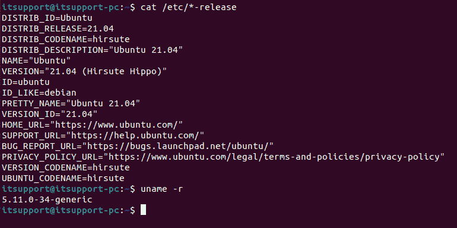

图 7.1 – 目标发行版和内核版本

我们现在知道目标主机上安装的是 `Ubuntu 21.04`，内核版本是 `5.11.0-34-generic`。这些信息可以用于创建虚拟机。由于大多数发行版都是免费提供的，你应该不会遇到找不到合适版本的问题。内核版本也是如此。或者，如果你已经有了一个带有正确发行版和更新内核的虚拟机，也可以选择进行内核降级。

你还需要准备可移动存储介质以便转储内存。我们已经在*第三章*中讲解过这个过程，*Windows 内存获取*，所以这部分我们就不再详细讲解。如果你打算通过网络捕获内存转储，你需要准备一个网络共享，并确保目标主机能够访问。在本章中，我们将同时探讨这两种捕获转储的方法。与此同时，我们将开始讨论具体的工具。

# 使用 LiME 获取内存

我们将首先介绍的工具是**Linux 内存提取器**，或称**LiME**。LiME 是一个可加载的内核模块，使得从 Linux 及基于 Linux 的系统（包括 Android）中提取内存成为可能。这个工具的主要优点是它对进程的占用非常小，并且可以计算转储内存的哈希值。LiME 还能够通过网络创建转储。这个工具可以在以下 GitHub 仓库中找到：[`github.com/504ensicsLabs/LiME`](https://github.com/504ensicsLabs/LiME)。以下是 LiME 的截图：

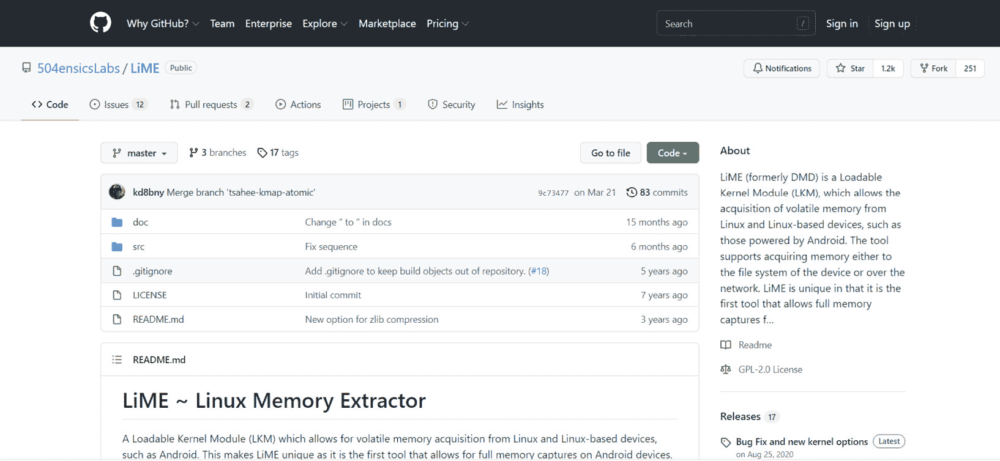

图 7.2 – LiME GitHub 仓库

我们从构建内核模块的过程开始。为此，我们将使用与目标主机相同的发行版和内核版本的虚拟机——分别是 `Ubuntu 21.04` 和 `5.11.0-34-generic`。

由于我们正在使用 Linux，我们将通过终端进行所有操作。首先，我们需要安装 LiME 及所有必需的包。为此，请使用以下命令：

```
sudo apt-get install -y linux-headers-$(uname -r) build-essential make gcc lime-forensics-dkms
```

命令的执行过程如下所示：

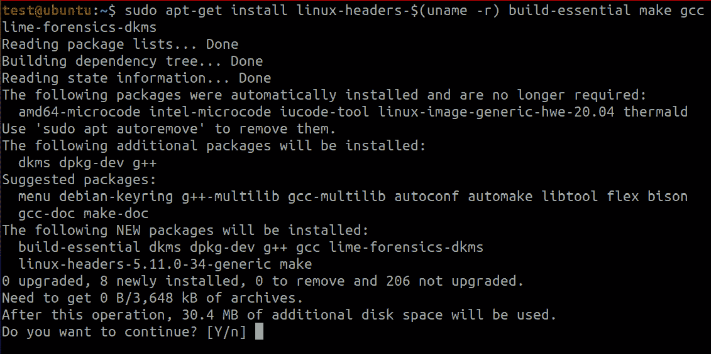

图 7.3 – 包安装

一旦这个过程完成，我们就可以进入下一步：编译。为此，使用 `cd` 进入 `lime` 目录并运行 `make`，如下所示：

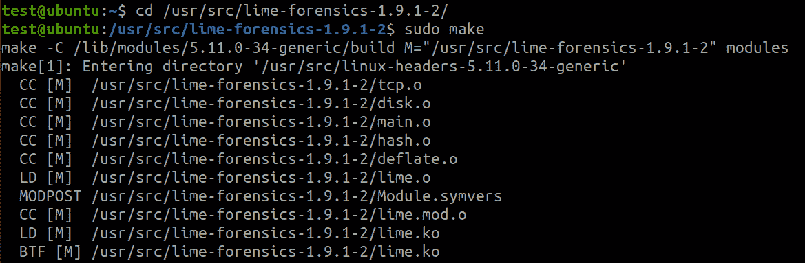

图 7.4 – 内核模块创建

`make` 是一个工具，用于自动化将文件从一种形式转换为另一种形式的过程。转换规则本身是在一个名为 `Makefile` 的脚本中定义的，该脚本位于工作目录的根目录——在我们的例子中是 `/usr/src/lime-forensics-1.9.1-2`。

一旦 `make` 执行完毕，我们将得到一个名为 `lime-5.11.0-34-generic.ko` 的内核模块。我们可以将其复制到可移动存储介质或网络共享上，并用它来转储目标主机上的内存。

让我们来看一下通过网络创建转储的过程。首先，我们需要使内核模块文件在目标主机上可用。这可以通过将其放置在网络共享中，或使用`scp`将其复制到目标主机来完成，`scp`是一个允许在两个位置之间（包括远程位置）安全地复制文件和目录的工具。当模块可用时，你可以使用`insmod`来加载内核模块。此操作需要通过路径参数指定输出文件的位置和名称，并且需要在格式参数中指定文件格式——例如`raw`、`lime`等。由于我们决定通过网络创建转储，因此我们将通过`path`参数传递要使用的协议和将从中发送输出的端口：

```
$ sudo insmod ./lime-5.11.0-34-generic.ko "path=tcp:4444 format=lime"
```

该命令将加载内核模块，创建内存转储，并将其发送到`4444`端口。请注意文件的格式。如果你希望所创建的内存转储能够被 Volatility 识别，最好以`lime`格式创建。

然后，你需要在调查员的主机上运行`netcat`。`Netcat`或`nc`是一个命令行工具，能够通过 TCP 或 UDP 协议读取和写入网络连接上的数据。你还需要将输出重定向到一个文件。可以按以下方式进行：

```
$ nc 192.168.3.132 4444 > mem.lime
```

在这种情况下，`netcat`将从`192.168.3.132` IP 地址接收数据并写入`mem.lime`文件。最后，可以使用以下命令卸载内核模块：

```
$ sudo rmmod lime
```

结果生成的`mem.lime`文件可以用于分析，但我们稍后再详细讲解。现在，让我们看看另一个用于创建内存转储的工具。

# 使用 AVML 获取内存

**AVML**，即**获取 Linux 的易失性内存**，是微软开发的用户态获取工具。AVML 的主要优点是，它不需要在目标主机上构建，并且支持多种来源：

+   `/dev/crash`

+   `/proc/kcore`

+   `/dev/mem`

如果在运行 AVML 时没有指定特定的源，该工具将会遍历所有源，寻找有效源并从中收集内存。

这个工具的缺点可能是，它只在有限数量的发行版上进行了测试，因此最好先在虚拟环境中进行检查，然后再使用。

在编写本书时，以下发行版已经过测试：

+   **Ubuntu**：12.04，14.04，16.04，18.04，18.10，19.04，19.10

+   **Centos**：6.5，6.6，6.7，6.8，6.9，6.10，7.0，7.1，7.2，7.3，7.4，7.5，7.6

+   **RHEL**：6.7，6.8，6.9，7.0，7.2，7.3，7.4，7.5，8

+   **Debian**：8，9

+   **Oracle Linux**：6.8，6.9，7.3，7.4，7.5，7.6

因此，你需要做的第一件事是下载该工具。为此，打开 GitHub 上的仓库页面：[`github.com/microsoft/avml`](https://github.com/microsoft/avml)，并转到**Releases**标签页。

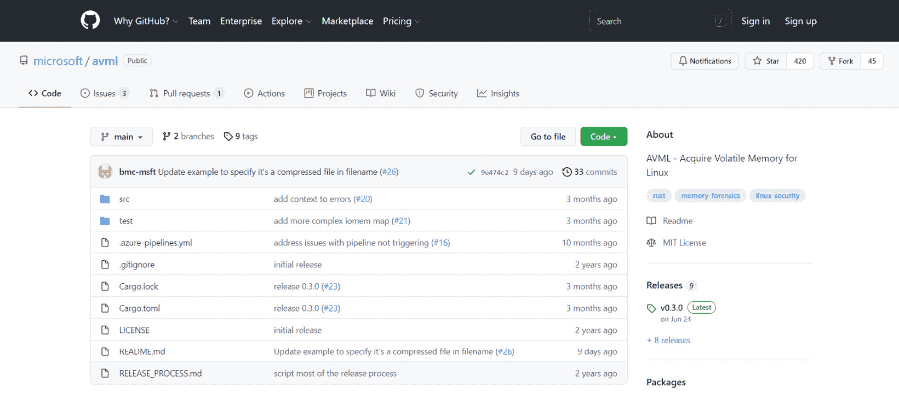

图 7.5 – AVML GitHub 仓库

找到 AVML，下载它，并将其放到可移动媒体或网络共享中，这样你就可以在目标主机上运行它。这次我们将使用可移动媒体。在运行之前，你需要使用`chmod`命令使文件可执行，`chmod`命令可以让你更改文件和目录的权限：

```
$ sudo chmod 755 avml
```

接着，你可以开始创建内存转储。只需运行 AVML 并指定输出文件的位置和名称。结果将生成以下输出：

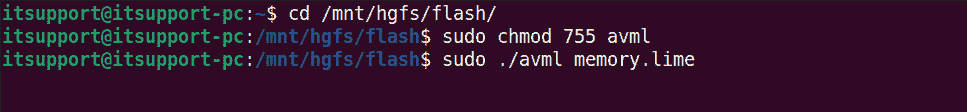

图 7.6 – AVML 使用示例

请注意，AVML 不要求构建内核模块。命令完成后，你将获得一个 LiME 格式的内存转储，准备进行分析。然而，注意 Volatility 没有为基于 Linux 的系统提供预构建的配置文件。考虑到这一点，我们还应该讨论如何为 Volatility 创建一个配置文件。

# 创建 Volatility 配置文件

要分析 Linux 内存转储，你需要创建一个与目标主机配置相对应的 Volatility 配置文件。我们通过一个例子来考虑这个问题。首先，你需要安装`zip`和`dwarfdump`包，如下图所示：

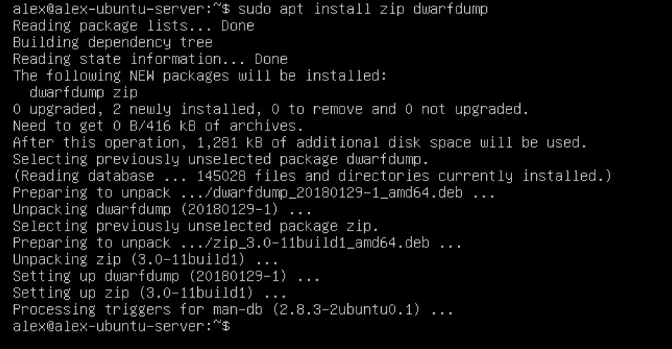

图 7.7 – dwarfdump 和 zip 安装

接下来，我们需要下载 Volatility。为此，我们将使用`git clone`命令，它允许我们从 GitHub 克隆仓库。如果你没有`git`，需要使用`apt`安装它：

```
$ sudo apt-get install git
$ git clone https://github.com/volatilityfoundation/volatility.git
```

之后，你应该进入`volatility/tools/linux`目录并运行`make`命令：

```
$ cd volatility/tools/linux
$ make
```

列出的操作如下所示：

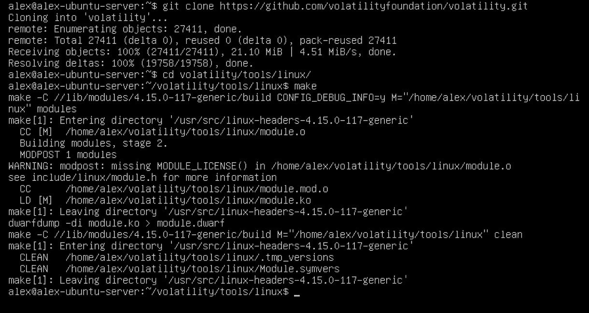

图 7.8 – 创建 dwarf 模块

结果，你将得到一个`module.dwarf`文件。

重要提示

根据你所使用的发行版，执行`make`可能会导致各种错误，从依赖问题到许可证问题。遗憾的是，没有一种通用的解决方案可以解决所有问题，但在网上查找有关`make`错误的解决方案可能会有所帮助。

生成的`dwarf`模块必须与正确版本的`System-map`合并到一个归档中。可以使用以下命令完成此操作：

```
$ sudo zip $(lsb_release -i -s)_$(uname -r).zip ./module.dwarf /boot/System.map-$(uname -r)
```

让我们理解一下这里发生了什么：

+   `lsb_release -i -s`命令输出当前发行版的名称。

+   `uname -r`将显示内核版本。

这将把你的归档命名为`<distribution>_<kernel>.zip`，但你可以按需命名。

该命令的输出可能如下所示：

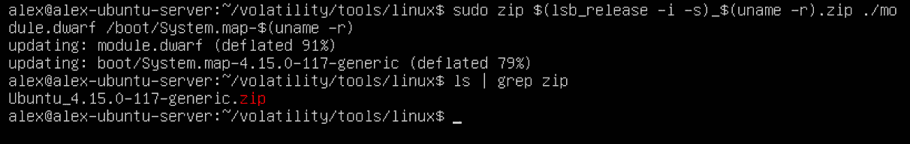

图 7.9 – 创建 Volatility 配置文件

如你所见，我们最终得到了`Ubuntu_4.15.0-117-generic.zip`归档文件，这是该主机的 Volatility 配置文件。你可以将这个文件放入配置文件夹，并将该路径作为`--plugins`选项传递给 Volatility 文件夹，如下图所示：

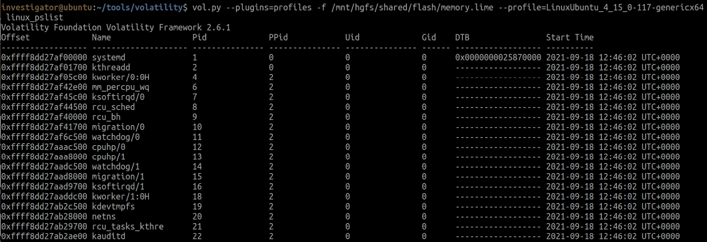

图 7.10 – 使用自定义 Volatility 配置文件

如你可能已经注意到的，收集 Linux 内存的过程并不简单，需要进行许多不同的操作。然而，在实践中，你经常会遇到安装在虚拟机中的系统。在这种情况下，你只需要创建虚拟机的快照，并简单地处理现有的`.vmem`文件。然而，这并不能让你免于创建 Volatility 配置文件。另一方面，如果你需要调查一个相当流行的发行版，你可以始终尝试在网上找到现成的配置文件。你可以从官方的 Volatility Foundation 仓库开始：[`github.com/volatilityfoundation/profiles/tree/master/Linux`](https://github.com/volatilityfoundation/profiles/tree/master/Linux)。

除了其他内容外，还有一些工具可以帮助你自动化之前的步骤。例如，Linux Memory Capturer（[`github.com/cpuu/lmc`](https://github.com/cpuu/lmc)）是 Linux Memory Grabber 的一个分支，后者由 Hal Pomeranz 开发。这个工具允许你自动化创建 Linux 内存转储和 Volatility 配置文件的过程。你只需要安装并运行该工具。

由于此工具使用 LiME，你将被要求创建一个内核模块，其中包括模块本身和它生成的内存转储文件，二者都会保存在主机上。然后，你将被提示为 Volatility 创建配置文件。

输出是一个类似这样的文件夹：

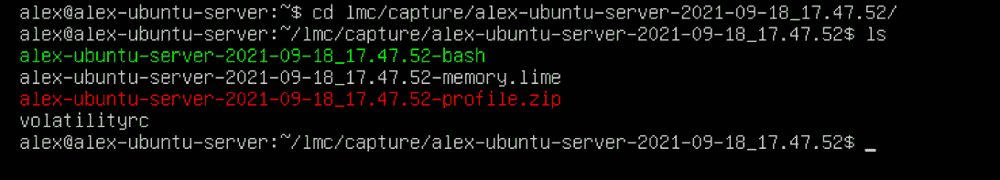

图 7.11 – lmc 输出

在这里，你会找到以下内容：

+   `hostname-YYYYY-MM-DD_hh.mm.ss-memory.lime`：以 LiME 格式保存的内存

+   `hostname-YYYYY-MM-DD_hh.mm.ss-profile.zip`：Volatility 配置文件

+   `hostname-YYYY-MM-DD_hh.mm.ss-bash`：`/bin/bash`的副本

+   `volatilityrc`：Volatility 配置文件的原型

生成的内核模块可以在/`usr/src/lime-forensics`找到。你可以使用生成的模块在目标主机上创建内存转储，并使用 Volatility 配置文件进一步分析。

看起来不错吧？然而，目前，该工具使用的是 Python 2.7，这意味着你只能在有限的情况下使用它。此外，使用此类工具并不会解决之前提到的`make`问题。因此，在使用这些工具之前，最好在与目标机器配置相似的虚拟环境中进行测试。

# 概述

创建基于 Linux 的系统内存转储是一个繁琐的过程。你没有一款可以一键完成所有需求的工具。然而，存在一些相当高效的解决方案，正确使用时，它们能帮助你获取所需的一切。

不同的工具可能使用不同的方法来访问内存。最常见的方法是加载内核模块；然而，这种方法需要大量的准备工作，因为该模块必须在与目标主机相似的发行版和内核版本的系统上构建。创建 Volatility 配置文件也需要相同的条件，否则进一步分析转储将变得困难。

有几种脚本解决方案可以自动化创建内存转储和 Volatility 配置文件的过程，但这些解决方案通常只适用于有限数量的发行版，因此最好在类似于真实环境的条件下测试它们，然后再使用。

在本章中，我们回顾了允许你创建基于 Linux 系统的内存转储的工具。现在，到了讨论内存转储分析的时刻。这就是我们将在下一章中要做的。
