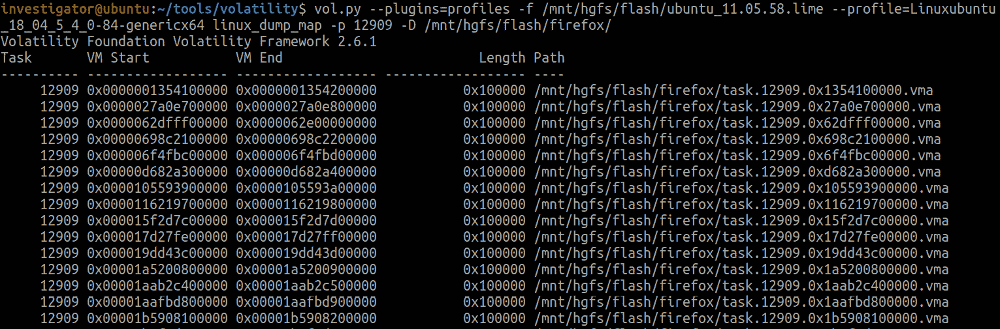
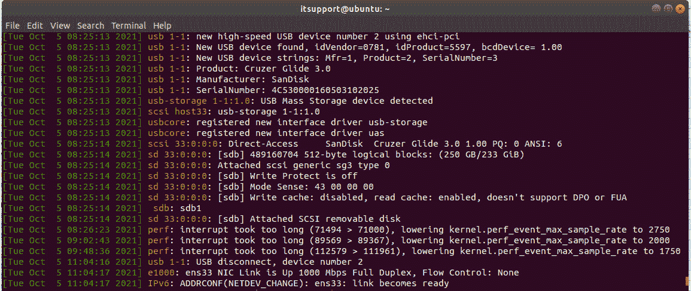

# 第八章：用户活动重建

在取证调查和事件响应过程中，重建用户活动是从受害者和攻击者主机收集重要数据的关键部分。基于 Linux 的系统在这方面扮演着重要角色，因为攻击者常常使用它们进行活动。这是因为许多不同的网络和漏洞扫描器、Web 应用程序安全测试工具以及后渗透框架都是在 Linux 下实现的。因此，调查攻击者使用的主机能够为我们揭示有关攻击中使用的工具和技术的详细信息。此外，通过检查用户活动，我们可以了解攻击准备的各个阶段、可能的合作伙伴、在不同论坛上的活动等。

基于前面的内容，我们需要考虑以下主题：

+   调查已启动的程序

+   分析 Bash 历史

+   搜索最近的文件

+   从内存中恢复文件系统

+   检查浏览历史

+   调查通信应用程序

+   寻找挂载的设备

+   检测加密容器

# 技术要求

这次，我们将使用 Linux 和 Windows 系统来操作接下来两章中描述的工具，并执行 Linux 内存取证。在我们的案例中，**Volatility** **2.6.1** 和一些内置实用工具将在 Ubuntu 21.04（Hirsute Hippo）上运行，而像 **Bulk Extractor** 或 **PhotoRec** 这样的程序将在 Windows 上运行。

# 调查已启动的程序

在上一章中，我们已经讨论了为基于 Linux 的系统创建配置文件的过程，因此现在我们将只检查你可用的配置文件。

假设你已经创建了一个配置文件，并将其放置在配置文件文件夹中。别忘了，你需要使用 `--plugins` 选项传递此文件夹的路径。为了检查你的配置文件是否可用，你可以运行 `--info`。为了只获取必要的输出，我们使用 `grep`，这是一种命令行实用工具，允许我们在输入中查找与给定正则表达式匹配的行并打印出来：


](img/Figure_8.1_B17056.jpg)

图 8.1 – Volatility 中的 Linux 配置文件

如你所见，我们可以使用多个 Ubuntu 配置文件以及一个 Debian 配置文件。类似地，我们还可以看到所有可供这些配置文件使用的插件列表：


](img/Figure_8.2_B17056.jpg)

图 8.2 – Volatility 中的 Linux 插件

现在我们已经确保我们拥有所需的一切，可以开始分析了。像 Windows 一样，我们将从调查活动进程开始，这将告诉我们用户正在运行哪些程序。

Volatility 为基于 Linux 的系统提供了 `pslist` 和 `pstree` 等效插件。这些插件也适用于活动进程列表，并允许我们查看这些信息。我们可以使用 `linux_pslist` 插件：


图 8.3 – 活跃进程列表

该插件的输出将会相当长。这是因为 Linux 系统使用相同的内核结构来存储进程信息，就像它们存储内核线程信息一样。因此，该插件的输出将包含进程和内核线程。后者可以通过缺少 DTB 来识别。

重要提示

DTB 是用于从进程地址空间读取数据的进程目录表基址的物理偏移量。由于内核线程使用内核地址空间，因此它们没有 DTB。

注意，输出中还有一个 `Uid` 列，它对应用户 ID。通过这个列，你可以筛选出特定用户的信息。我们来看看由 ID 为 `1000` 的用户启动的进程。为此，我们只需要使用 `grep` 工具：


图 8.4 – 特定用户启动的进程

我们现在可以看到，在 `Uid` 列中所有值为 `1000` 的行都属于同一用户。我们可以更仔细地查看这些输出：


图 8.5 – 用户进程

在这里，我们已经看到一些熟悉的名字。例如，我们可以推测，ID 为 `1000` 的用户曾打开了终端、nano、Thunderbird、LibreOffice 等。我们也希望能获取更多关于该用户的信息。

通常，用户信息可以在 `/etc/passwd` 文件中找到，但如果我们手头只有内存转储，访问该文件可能会有些困难。不过，我们或许可以看到与启动这些进程相关的环境信息。为此，我们可以使用 `linux_psenv` 插件。让我们运行这个插件并指定一个 ID 为 `23639` 的 bash 进程：


图 8.6 – 进程环境变量

请注意，用户名出现在该进程的环境变量中。我们现在知道，我们检测到的程序是由 `itsupport` 用户启动的。

不过，让我们回到正在运行的进程。除了标准的 `pslist` 和 `pstree` 插件外，我们还有另一个有趣的插件可用，它允许我们查看正在运行的程序的名称、位置以及启动时传递给它们的参数。这个插件叫做 `linux_psaux`。让我们来检查一下：


图 8.7 – Volatility linux_psaux

如你所见，我们再次使用了 `grep` 来获取与特定用户关联的进程信息。现在我们得到了关于正在运行的程序的位置以及传递给它们的参数的所有数据。这些信息为什么有用呢？让我们看看以下图示：


图 8.8 – 命令行中的文件名

在这里，我们不仅可以看到用户运行的程序，还可以看到与之一起打开的文件。例如，现在我们知道用户不仅仅是在运行 Libre Office，而是在运行 calc，这是 Linux 上类似 Excel 的程序，并且打开了 `clients.xls` 文件。我们还可以看到，nano 被用来处理位于桌面上的 `passwords.txt` 文本文件。

重要说明

由于 `linux_psaux` 显示的是启动时的参数，您可能无法从这里获取有关程序打开的所有文件的信息。您可以使用另一种方法来检索这些信息，稍后将讨论。

您可能已经注意到，我们的用户不仅积极使用图形界面程序，还与终端进行交互。这是 Linux 系统用户的常见情况，因此执行命令的分析成为用户活动调查的重要组成部分。

# 分析 Bash 历史记录

在 Linux 系统中，最常用的 Shell 是 Bash，它是最流行的 Unix Shell 之一。它受欢迎的原因之一是它在绝大多数 Linux 发行版中预装。同时，Bash 功能非常强大，可以交互式地执行许多命令和脚本、操作文件系统、重定向命令的输入和输出等。

通常，如果启用了 Bash 历史记录日志，它会存储在用户的主目录中的 `.bash_history` 文件里。当然，攻击者可能会对这个文件以及历史记录日志过程进行各种操作，以隐藏他们的痕迹。然而，我们仍然可以尝试从内存中恢复这些信息。Volatility 提供了一个专门的插件 `linux_bash` 来进行此操作。运行该插件的方式如下：


图 8.9 – Bash 历史记录

如您所见，在我们的例子中，用户首先尝试使用 `cat` 输出密码文件的内容，然后用 `nano` 打开它，但显然该文件不在桌面上，因此用户用 `touch` 命令创建了该文件。随后，进行了网络检查，使用 `ping` 并通过 `apt` 安装了 Git。显然，当威胁行为者在主机上操作时，Bash 历史记录分析具有特别的重要性。让我们来看一下以下示例：


图 8.10 – 攻击者主机上的 Bash 历史记录

在这里，我们看到攻击者的主机上安装并运行了后渗透框架 Metasploit，以及网络扫描工具 Nmap。我们还看到了 `rockyou.txt` 文件，并可以推测这是常用的密码字典之一，用于暴力破解。

因此，检查攻击者主机上的 Bash 历史记录可以揭示有关使用的工具和应用的技术，而受害者主机上的 Bash 则能告诉我们攻击中使用的工具，以及攻击者关注的具体文件或系统。

请注意，这不是我们第一次遇到打开某些文件。让我们更仔细地看看如何获取用户正在使用的文件的信息。

# 搜索已打开的文档

不幸的是，基于 Linux 的系统没有与 Windows 相同级别的信息记录。尽管如此，仍然可以找到有关特定文件的信息，甚至尝试从内存中恢复其内容。但首先要有条不紊。

您已经知道，可以使用`linux_psaux`或`linux_bash`插件查看程序启动时打开的文件。如果您对程序运行时打开的文件感兴趣，可以使用`linux_lsof`插件，通过`-p`选项传递您感兴趣的进程的 ID。让我们尝试查找`itupport`用户的`soffice.bin`进程打开的`xls`文件的信息。为了搜索特定类型的文件，我们将使用`grep`：


图 8.11 – 在 LibreOffice 中打开的文件

输出显示，在我们的情况下，LibreOffice 只连接到一个文件，`cliens.xls`。了解这个文件的内容也是很好的。Volatility 提供了一种机制来查找最近使用过的文件并导出它们。事实上，基于 Linux 的系统会缓存从磁盘读取和写入的文件数据。Volatility 允许您使用`linux_find_file`插件列出和恢复这些文件。让我们从列出在内存中缓存的文件开始。为此，应使用`-L`选项。由于列表相当长，我们建议将其保存到文件中，如*图 8.12*所示：


图 8.12 – 缓存文件列表

从输出中，您可以看到这里可以找到有关使用的目录和文件的信息，以及它们的`inode`编号和地址。

重要提示

`inode`或索引描述符是一种存储有关标准文件、目录或其他文件系统对象的元数据的数据结构，除了数据和名称本身。

或者，如果您想快速检查内存中的文件，可以使用`-F`选项，后跟您要查找的文件的名称或位置。如果找到文件，您将看到其位置和`inode`信息。

利用这些信息，我们可以尝试提取找到的任何文件。为此，我们可以使用`-i`选项，之后应指定所需的`inode`。在这里，我们还应使用`-O`选项指定输出文件的路径。文件搜索和提取将如下所示：


图 8.13 – 文件提取

正如你所看到的，我们首先找到了感兴趣的文件，然后使用其`inode`将数据文件提取到磁盘上。但这并不是`inode`给我们的所有可能性。让我们深入了解一下。

# 恢复文件系统

除了检索单个文件外，Volatility 还提供了恢复在创建转储时存储在内存中的文件系统部分的能力。这正是由于存储在`inode`中的大量元数据而变得可能。可以使用`linux_recover_filesystem`插件来进行文件系统恢复：

```
$ vol.py --plugins=profiles -f /mnt/hgfs/flash/ubuntu_11.05.58.lime 
--profile=Linuxubuntu_18_04_5_4_0-84-genericx64 linux_recover_filesystem -D /mnt/hgfs/flash/recover_fs/
```

请注意，这里我们添加了`-D`选项，指定我们要保存要恢复的文件系统的目录。在我们的情况下，它将保存在`recover_fs`文件夹中。插件的结果将如下所示：


图 8.14 – 恢复的文件系统

在这里，您可以看到已恢复的标准目录以及一个`swapfile`，这是 Linux 中与 Windows 的`pagefile`相当的文件。您可以使用类似的工具，如 strings 或 Bulk Extractor，以类似的方式分析此文件。

一般来说，Linux 发行版中使用的文件系统具有类似的层次结构。根目录是`/`，然后是`/bin/`、`/boot/`和`/etc/`等标准目录，以及其他目录：


图 8.15 – Linux 目录层次结构

事实上，大多数 Linux 发行版遵循文件系统层次结构标准描述的一般规则。

重要提示

**文件系统层次结构标准**（**FHS**）由 Linux 基金会维护。它定义了 Linux 发行版中的目录结构和目录内容。

因此，每个目录都有其自己的目的，并存储特定内容。以下是关键目录的列表：


图 8.16 – 标准目录

因此，使用恢复的文件系统，您可以尝试查找感兴趣的用户文件或处理系统文件，如`~/.bash_history`和`/etc/passwd`，或系统日志。在进行取证调查或应对事件时，以下是一些您可能感兴趣的文件：

+   `/etc/os-release` – 操作系统信息

+   `/etc/passwd` – 关于用户、其`uid`、`guid`、主目录和登录 shell 的信息

+   `/etc/group` – 关于组及其成员的信息

+   `/etc/sudoers` – 关于特权分离的信息

+   `/var/log/syslog` – 来自不同程序和服务的消息，包括内核模式，但不包括认证消息

+   `/var/log/auth.log` – 认证消息

+   `/var/log/error.log` – 错误消息

+   `/var/log/dmesg` – 关于操作系统事件的一般消息

+   `/home/<user>/.bash_history` – bash 历史记录

+   应用程序日志文件

检查前述文件可以帮助您了解更多关于用户、启动的程序、执行的命令等内容。

重要提示

在从内存中提取文件系统时，Volatility 会尝试保留现有的文件时间戳。然而，`ext4` 之前的文件系统不存储文件创建信息。因此，`linux_recover_filesystem` 插件不会复制这些时间戳。

Volatility 还允许提取 `tmpfs`。可以使用 `linux_tmpfs` 插件来实现这一目的：


](img/Figure_8.17_B17056.jpg)

图 8.17 – Linux tmpfs 信息

使用 `-L` 选项运行它会列出所有可供提取的超级块，并且使用 `-S` 和 `-D` 选项，您可以将它们保存到磁盘。

重要提示

`Tmpfs` 是许多类 Unix 操作系统中的临时文件存储工具，驻留在内存中。在 Linux 中，从版本 2.4 开始支持 `tmpfs`。它用于存储包含临时数据的目录，这些数据会在系统重启时被删除：`/var/lock`、`/var/run`、`/tmp` 等等。`Tmpfs` 还可以托管在重启之间存储数据的目录，例如 `/var/tmp`，或用于特定程序（如浏览器）的缓存目录。

恢复内存中文件的另一种方法是使用已熟悉的 PhotoRec 工具。我们来看一下如何操作。首先，您需要通过 PowerShell 使用以下命令运行 PhotoRec：

```
PS D:\> .\testdisk-7.2-WIP\photorec_win.exe .\ubuntu_11.05.58.lime
```

接下来，确认我们是否要处理指定的文件：


](img/Figure_8.18_B17056.jpg)

图 8.18 – 输入文件确认

在下一个窗口中，选择所需的分区并按 *Enter*：


图 8.19 – 分区选择

由于基于 Linux 的系统通常使用 `ext` 文件系统，我们需要为正确的文件雕刻指定该类型：


图 8.20 – 文件系统选择

在下一个窗口中，选择您希望保存恢复文件的目录。在我们的案例中，这是 `photorec output` 目录：


图 8.21 – 输出目录

在最后一个窗口，按 *Shift* + *C* 开始恢复过程：


图 8.22 – 恢复过程

当过程完成时，您将看到恢复的文件总数，并能够在您之前指定的目录中找到这些文件：


图 8.23 – PhotoRec 恢复结果

在这里，您可以搜索您感兴趣的扩展名的文件并进行分析。

如果这种方法也无法提供您想要的结果，您可以直接在进程的内存中搜索内容。这就是我们将在下一部分讨论的内容，我们将以浏览器历史记录调查为例。

# 检查浏览历史

在基于 Linux 的系统上，与 Windows 一样，大多数流行的浏览器将其数据存储在 SQLite 数据库中。例如，Firefox 将其历史记录存储在位于`/home/user/.mozilla/firefox/*.default-release`中的`places.sqlite`文件中，而 Chrome 将其历史记录存储在位于`/home/user/.config/google-chrome/Default`中的`history`文件中。如果您在文件系统恢复过程中成功检索到这些文件，那就太好了。但当然，情况并非总是如此。如果您没有标准的历史记录文件，您将不得不在进程内存中搜索有关访问资源的信息。在某种程度上，这种方法甚至更加灵活，因为它允许您获取有关访问的网站的数据，而不受使用的浏览器和历史记录存储格式的限制。

访问单个进程内存的过程不像在 Windows 中那样直接。举个例子，让我们再次看看在我们的主机上运行的进程列表：


图 8.24 – Firefox 在活动进程列表中

这是具有`12909` ID 的 Firefox 进程。在 Kernel 版本 3.6 之前，可以使用`linux_route_cache`插件检索通过浏览器访问的站点的信息，但在更新版本中，路由缓存被禁用，因此我们将拆分一个更通用的方法来查找我们感兴趣的信息。更具体地说，我们将尝试查看我们的 Firefox 进程的内存。

与 Windows 不同，我们无法导出整个进程内存。在运行时加载器将所有需要的东西（如可执行文件、共享库、堆栈、堆等）映射到进程地址空间的不同区域。我们可以使用`linux_dump_map`插件提取这些映射：



图 8.25 – Firefox 内存

如您所见，使用此插件时，每个映射都保存到单独的文件中。但我们仍然可以使用`strings`等工具来搜索这些信息。为了避免逐个处理每个文件，我们可以使用以下简单脚本：

```
for file in <dir>
do
strings "$file" >> <output>
done
```

在我们的情况下，它将如下所示：


图 8.26 – 运行多个文件上的字符串脚本

这将为`/mnt/hgfs/flash/firefox`中的每个文件运行`strings`，并将结果添加到`firefox_strings.txt`中：


图 8.27 – 字符串输出

通过正则表达式搜索，很容易找到我们访问的 URL 和用户的搜索查询。

另一种查找这些信息的方法是使用已经熟悉的 Bulk Extractor。我们将使用 Windows 来运行它，但首先我们将把所有文件合并成一个，以便 Bulk Extractor 可以处理它们。为此，我们将使用一个 PowerShell 脚本：

```
> Get-ChildItem -Path D:\firefox -File -Recurse | ForEach-Object -Process {Get-Content -Path $_.FullName | Out-File -FilePath D:\firefox-result.vma -Append}
```

该脚本将 `firefox` 目录中每个文件的内容添加到 `firefox-result.vma` 共享文件中。当收到共享文件后，我们可以开始解析。我们使用常规选项：

+   `-o` – 指定输出文件夹

+   `-x` – 禁用所有插件

+   `-e` – 启用电子邮件扫描器以搜索 URL

生成的启动界面如下所示：


图 8.28 – Bulk Extractor 执行

当解析完成后，你可以在输出文件夹中查找结果。例如，在 `url_histogram.txt` 文件中，我们可以提取出感兴趣的链接：


图 8.29 – 解析结果

请注意，即便是像 DuckDuckGo 这样的搜索引擎信息，也能通过内存分析被捕获，尽管它非常注重用户的匿名性和隐私。

这种类型的分析可以应用于任何进程。具体来说，你可以对与通信相关的应用程序进行进程内存分析，以查找你感兴趣的数据——对话、发布内容等等。这正是我们将要讨论的内容。

# 调查通信应用

除了各种浏览器，基于 Linux 的桌面操作系统还支持大量通信应用程序——即时通讯工具、邮件客户端、聊天室等。自然，这些应用程序所包含的信息可能对我们有用，特别是当它们是由攻击者托管时。

如前所述，分析这些应用程序与分析浏览器的方式不会有太大不同，因为我们将处理的是进程内存。让我们来看一个例子。我们已经看到目标主机上有一个 ID 为 `51825` 的 Thunderbird 应用。现在我们来转储它的内存，就像之前我们对 Firefox 所做的那样：


图 8.30 – Thunderbird 内存

我们现在可以使用之前的脚本从转储的文件中提取所有可读的行：

```
$ for file in /mnt/hgfs/flash/thunderbird/*; do strings "$file" >> /mnt/hgfs/flash/thunderbird_strings.txt; done
```

一旦执行，我们将得到一个大的文本文件。可以手动浏览，或通过关键词或正则表达式进行搜索。无论哪种方式，你都能够找到例如来自社交网络和服务的不同通知，这将让你了解用户有哪些账户和服务，他们感兴趣的内容是：


图 8.31 – 来自社交网络的电子邮件

当然，你也可以找到正常对话的部分，附件名称，发件人地址等：


图 8.32 – 对话部分

通过这种简单的方法，你可以发现很多有关用户的有趣信息。但是现在，让我们继续。我们下一个讨论的话题是已挂载的设备。

# 查找已挂载的设备

在 Linux 操作系统上，用户有能力挂载设备和特定的文件系统。分析这些信息可以帮助我们识别不仅是挂载到主机的单个设备和文件系统，还可以恢复它们挂载的相对时间线。

Volatility 的 `linux_mount` 插件可以用于查找有关已连接设备和文件系统的信息：


图 8.33 – 挂载的文件系统

正如你从截图中看到的，这个插件显示了所有挂载的设备和文件系统的信息，包括它们的位置、挂载点、类型和访问权限。细心的读者可能已经注意到，我们也谈到了时间线，但这里缺少这些信息。那么，我们该怎么办呢？

在这种情况下，内核调试缓冲区将帮助我们。内核调试缓冲区包含有关已连接 USB 设备及其序列号、混杂模式下的网络活动以及事件时间线的信息。要访问此缓冲区，我们可以使用 Volatility 的 `linux_dmesg` 插件。为了方便起见，插件的输出被重定向到一个文本文件中：


图 8.34 – Volatility linux_dmesg 输出

如果你仍然想尝试至少计算出大致的连接时间，可以执行以下计算：

1.  在 *图 8.34* 中，你可以看到 SanDisk Cruzer Glide 3.0 USB 设备已连接到所检查的主机。这里，你可以看到它连接的详细信息，例如没有写保护。你在左侧看到的时间戳是相对时间戳，能够帮助你分析事件的顺序，但解释这些时间戳时有一个问题。这些内核时间戳是从各个 CPU 保持的正常运行时间值中派生的。随着时间的推移，这个值与实时时钟之间会发生偏差，因此从内存转储中可靠地重建事件的时间是有问题的。


图 8.35 – Systemd 启动时间

1.  我们看到 `systemd` 进程的启动时间为 `2021-10-02 17:05:54` UTC。我们需要将这个时间转换为秒。任何纪元转换器都可以为我们完成此操作。我们将使用在线转换器 [`www.unixtimestamp.com`](https://www.unixtimestamp.com)：


图 8.36 – 启动时间转换

1.  这导致了一个值为 `1633442754` 秒的结果。`dmesg` 中显示的值是纳秒，因此必须将其转换为秒。我们 USB 设备的连接时间戳是 `4824232947404.4824` 纳秒，四舍五入后为 `4824` 秒。这个值会加到你之前计算的 Unix 时间戳上。最终得到的时间戳为 `1633447578` 秒。

1.  我们的最后一步是将得到的时间戳转换为可读格式。为此，我们可以再次使用转换器：


图 8.37 – Unix 时间戳转换

现在，我们知道 USB 设备连接的大致时间是 2021 年 10 月 5 日 `15:26:18`。

自然，如果我们可以访问一个实时主机，特定事件的定时任务会更容易。不过，请记住，在写入磁盘后，`dmesg` 日志可能会被攻击者篡改，您感兴趣的事件可能根本不存在。您仍然可以使用交叉检查来检测这些篡改。

为了以可读的格式输出 `dmesg` 时间戳，许多 Linux 发行版引入了 `-T` 选项。其使用方法如下。我们运行 `dmesg` `-T` 命令，并获得 `dmesg` 记录的事件的准确时间：



图 8.38 – 实时主机上的 dmesg 输出

命令输出显示，所涉及的 USB 设备连接发生在 2021 年 10 月 5 日 8:25:13（主机的本地时间）。主机所在的时区为 PDT，因此连接时间为 15:25:13 UTC。正如您所看到的，我们计算出的时间戳偏差相对较小，因此在无法访问实时主机的情况下，可以使用上述计算时间戳的方法。

我们需要考虑的最后一件事是加密容器的检测，接下来我们将讨论这一内容。

# 检测加密容器

在 Linux 系统上调查用户活动时，一个重要的步骤是寻找加密容器，尤其是在调查潜在威胁行为者使用的主机时。事实上，为了自身的安全，他们可以将与攻击准备、开发的恶意工具或被窃取的信息相关的重要数据放入加密容器中。

基于 Linux 的系统有多种加密选项，从 `dm-Crypt` 到更标准的 `TrueCrypt` 和 `VeraCrypt`。实际上，检测加密容器并恢复加密密钥的过程几乎与 Windows 中的过程相同。因此，我们只讨论主要的要点。

首先，您仍然可以通过分析正在运行的进程来检测加密容器，因为如果系统上打开了加密容器，您仍然可以在进程列表中找到相应的进程。

其次，对于最流行的 TrueCrypt 解决方案，Volatility 有一个单独的插件，用于恢复缓存的密码短语 – `linux_truecrypt_passphrase`。

第三，您始终可以使用 Bulk Extractor AES 扫描器来搜索可能用于加密的 AES 密钥。这与 Windows 中的情况相同：


图 8.39 – 使用 Bulk Extractor 搜索 AES 密钥

输出是相同的 `aes_keys` 文件，其中包含所有由 Bulk Extractor 提取的 AES 密钥：


图 8.40 – 找到的 AES 密钥

了解系统上运行的加密容器，及其使用的 AES 算法和密钥长度后，你可以尝试从现有数据中恢复主密钥。

# 总结

无论调查的是哪种操作系统，用户活动分析都起着重要作用，因为它可以重建事件发生的背景，并揭示用户采取的行动的关键信息。另一方面，Linux 操作系统常常被攻击者使用，因此在这种系统上调查用户活动具有特殊意义。

由于 Linux 系统的设计方式，调查它们不像 Windows 那样简单。然而，我们仍然可以获得关于运行中的程序、打开的文档、连接的设备、使用的加密容器等数据。

在分析 Linux 上用户活动时，一个重要的辅助工具是检查进程内存，这需要几个步骤来完成。尽管提取映射及其进一步处理相对较难，但进程内存可能包含有价值的数据——访问过的链接、对话、发布内容、电子邮件地址、文件名等。

因此，我们已经涵盖了分析用户活动的一般方法。现在是时候讨论一些恶意内容了。这将是我们在下一章讨论的内容。
