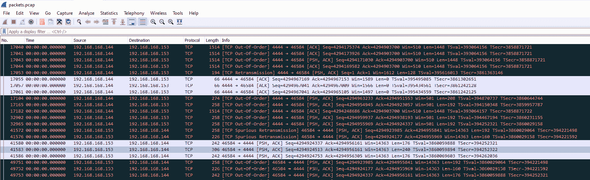

# 第九章：恶意活动检测

在大多数情况下，内存取证调查的主要目标是寻找恶意活动。根据最近 **TrendMicro** ([`www.trendmicro.com/vinfo/us/security/news/cybercrime-and-digital-threats/a-look-at-linux-threats-risks-and-recommendations`](https://www.trendmicro.com/vinfo/us/security/news/cybercrime-and-digital-threats/a-look-at-linux-threats-risks-and-recommendations)) 和 **Group-IB** ([`www.group-ib.com/media/ransomware-empire-2021/`](https://www.group-ib.com/media/ransomware-empire-2021/), [`blog.group-ib.com/blackmatter`](https://blog.group-ib.com/blackmatter)) 的研究，针对基于 Linux 的系统的攻击正在上升，许多威胁行为者已将专门针对 Linux 系统的软件加入到他们的武器库中。例如，勒索软件操作员如 **BlackMatter**、**RansomExx** 和 **Hive** 都已将相应版本加入到他们的武器库中。此外，后期利用框架和个别脚本也被用来攻击基于 Linux 的系统。同时，漏洞利用和安全配置错误的使用仍然是最广泛的初步访问技术，尤其是当我们谈论到 web 应用程序时。

我们将要讨论的主要活动几乎是相同的——网络连接、注入到进程中以及访问非典型资源。这是我们将重点关注的内容，但这次我们会尝试通过具体示例来细分不同的分析技术。

在本章中，我们将讨论以下主题：

+   调查网络活动

+   分析恶意活动

+   检查内核对象

# 调查网络活动

由于大多数恶意软件需要与命令和控制服务器通信、下载附加模块或发送一些数据，因此网络连接的出现是不可避免的。然而，在调查网络连接之前，了解我们的主机上使用了哪些网络接口及其配置方式是个好主意。为此，我们可以使用 Volatility 的 `linux_ifconfig` 插件，该插件以如下方式提供所有必要的信息：


图 9.1 – 网络接口信息

在输出中，我们可以看到调查的主机上使用了三个接口：

+   `lo` – 一个回环接口，标准 IP 地址为 `127.0.0.1`

+   `ens33` – 一个网络接口，IP 地址为 `192.168.168.144`

+   `ens38` – 一个网络接口，IP 地址为 `192.168.3.133`

现在我们可以开始调查活跃的网络连接。为此，Volatility 提供了 `linux_netstat` 插件，可以按以下方式运行：


图 9.2 – Volatility linux_netstat 插件

如您所见，在这种情况下，我们也将获得相当大量的输出，并且它不仅仅与我们直接感兴趣的网络连接相关，因此最好将输出重定向到文本文件中：


图 9.3 – 活跃的网络连接

在这种情况下，我们看到由 Firefox 浏览器建立的连接，以及由`192.168.3.132` IP 地址建立的多个连接，这些连接通过端口`22`建立，这通常用于`SSH`。很可能这就是受害者的主机，它通过`SSH`连接。

另一种检查网络活动的方法是使用 Bulk Extractor，因为它允许我们从内存转储中提取剩余的网络流量。在这种情况下，我们使用网络扫描器，如图所示：


图 9.4 – Bulk Extractor 网络扫描器

输出将包含`packets.pcap`文件，这是网络流量的转储文件。这个文件可以通过**Wireshark**打开，Wireshark 是最广泛使用的网络协议分析工具之一。要获取此工具，只需访问官方网站（[`www.wireshark.org/`](https://www.wireshark.org/)），点击**下载**图标，并选择适合您系统的安装版本。

安装后，您可以运行 Wireshark 并简单地将`packets.pcap`文件拖放到其中：


图 9.5 – 使用 Wireshark 打开的网络流量转储

在这里，您可以查看端点统计信息并找出连接到哪些 IP 地址。为此，请打开**统计**标签并搜索**端点**：


图 9.6 – 端点

同样，您可以查看所使用协议的统计信息：


图 9.7 – 协议层次结构

我们可以检查单独的数据包或尝试提取传输的对象，也可以配置过滤器并检查与单个 IP 地址的通信。例如，在我们的案例中，您可以通过使用简单的`ip.addr==192.168.3.133 && ssh`过滤器来检查是否与特定的 IP 地址建立了`SSH`连接：


图 9.8 – Wireshark 过滤器用于 SSH

在图中，我们看到大量数据包在我们的 IP 和`192.168.3.132` IP 之间传输。这种通信自然会引起我们的注意。

这里是另一个例子，说明如何通过分析内存转储中的网络连接或网络流量来获得有用信息：



图 9.9 – Meterpreter 活动

在这里，我们可以看到端口`4444`的活跃使用。记得在*第五章*，*使用 Windows 内存取证进行恶意软件检测与分析*中，我们提到过一些端口是不同软件默认使用的吗？这正是这种情况，端口`4444`是 Meterpreter 反向 shell 默认使用的端口。所以，我们从一次流量分析中就可以判断，被检查的主机上有与 Meterpreter 相关的进程。

我们再看一个例子：


图 9.10 – Nginx 活动

在 `linux_netstat` 的输出中，我们可以看到被调查的主机作为 Web 服务器使用，因为在端口 `80` 上，`nginx` 进程正在监听：


图 9.11 – SSH 连接

此外，我们还看到几个不同 IP 地址的 `SSH` 连接。在这种情况下，我们可以推断其中一个 IP 地址可能是攻击者使用的。

由于插件的输出包含了发起连接的进程信息，自然，迟早我们会开始调查这些进程。

在所有这些例子中，我们看到了潜在恶意活动的痕迹。现在，让我们来讨论如何分析这种活动。

# 分析恶意活动

让我们仔细看看最后一个例子。我们看到有几个 `SSH` 连接。我们可以分析可能与之相关的进程。为此，我们将使用 `linux_pstree` 插件并添加 `sshd` 进程标识符 – `29897` 和 `23251`：


图 9.12 – Volatility linux_pstree

在*图 9.12*中，我们看到 `sshd` 的子进程是 bash 和 `sudo`，这意味着使用了提升的权限。在这种情况下，我们可以搜索 bash 历史记录，也可以转储并分析这些进程的内存。

我们从 bash 历史记录开始。为此，我们将使用`linux_bash`插件：


图 9.13 – Bash 历史记录

在这里，我们可以看到有人在使用 MySQL 和 WordPress，并且看到与 `site-info.php` 文件的交互，以及与 bash 进程（PID 为 `30112`）关联的 `nyan-cat.gif` 下载。

我们可以检查在这种情况下哪个用户运行了 bash。为此，我们将使用已知的 `linux_psenv` Volatility 插件：


图 9.14 – Bash 进程的环境

该插件的输出使我们能够确定此活动是通过来自 `192.168.110.40` IP 地址的 `SSH` 连接由用户 admin 执行的。我们可以搜索有关此用户的信息。在前一章中，我们已经提到过这些信息可以在 `/etc/passwd` 文件中找到，因此让我们使用 `linux_recover_filesystem` 插件并尝试从内存中恢复文件系统。为此，我们将使用以下命令：

```
$ vol.py --plugins=profiles -f /mnt/hgfs/flash/ubuntu-server.vmem --profile=Linuxubuntu-server_17_47_52-profilex64 linux_recover_filesystem -D /mnt/hgfs/flash/recovered/
```

在我们的案例中，恢复的文件系统将被放置在恢复文件夹中：


图 9.15 – 恢复的文件夹内容

如图所示，`/etc` 目录未能恢复；不过，我们有 `/var/log` 目录，在那里可以找到 `auth.log` 文件：


图 9.16 – 恢复的 auth.log 文件

该文件记录了所有认证尝试，我们可以找到以下内容：


图 9.17 – auth.log 文件内容

请注意，从这里我们得知 admin 用户是在攻击时创建的，我们还获得了创建的具体时间戳。之后，我们还可以看到此用户的多次登录以及其使用 root 权限，正是通过该权限下载了我们的图片。我们还看到该图片被上传到 `/var/www/wordpress`。幸运的是，`linux_recover_filesystem` 插件能够部分恢复此文件夹：


图 9.18 – 恢复的 WordPress 文件夹

在这里，我们可以看到我们的图片。因此，我们需要找出它在这里扮演的角色，以及攻击者是如何访问系统的。

让我们将从内存转储中提取的网络流量转储添加到我们的调查中。为了提取流量，我们运行 Bulk Extractor：


图 9.19 – 网络流量提取

现在，我们在 Wireshark 中打开 `packets.pcap` 文件。检查数据包时，您可能会遇到以下内容：


图 9.20 – Wireshark 数据包分析

我们看到一个带有有趣参数的 `GET` 请求。正如你所看到的，这里列出的用户代理是 `WPScan v.3.8.7`。这意味着此请求是使用 WPScan 工具发出的，WPScan 用于搜索 WordPress 内容管理系统中的漏洞。类似的信息应该记录在 `nginx` 访问日志中。这个日志也通过 `linux_recover_filesystem` 恢复，并可以在 `/var/log/nginx` 中找到：


图 9.21 – 恢复的访问日志

在 `access.log` 中，我们可以看到来自一个我们已经知道的 IP 地址，由 WPScan 发出的大量请求。如果我们进一步查看，还能看到以下内容：


图 9.22 – 评论帖子

扫描完成后，发送了一个`POST`请求，并带有评论；可能是利用了与评论发送相关的漏洞来实现初始访问。

在继续分析时，我们可以尝试使用 Wireshark 的导出对象功能提取在网络会话期间传输的对象：


图 9.23 – Wireshark 中的对象导出

正如你在前面的图中看到的，在我们的例子中，发现了几个我们可以尝试提取的对象。包括一些评论。让我们检查一下：


图 9.24 – 导出的评论

正如我们所看到的，一位用户在博客上留言，并附上了访问相同`192.168.110.40` IP 地址的链接。你还可以在流量转储中看到，尝试打开该链接后不久，开始出现相同的`SSH`连接。

如果从 WordPress 的角度考虑，用户发送的评论必须保存在数据库中。因此，你可以在 MySQL 日志中或该进程的内存中查找相关信息。从进程列表中，我们可以看到与 mysql 守护进程相关的 mysqld 进程的标识符是`29602`：


图 9.25 – mysqld 的进程 ID

现在，我们可以使用`linux_dump_map`插件转储此进程的映射：


图 9.26 – Volatility linux_dump_map

现在，轮到`strings`工具了：

```
$ for file in /mnt/hgfs/flash/mysql/*; do strings "$file" >> /mnt/hgfs/flash/mysql_strings.txt; done
```

现在，我们可以探索`strings`输出，并寻找关于我们评论的信息：


图 9.27 – mysqld 进程内存中的评论

万事俱备！在这里，我们不仅看到了发送的评论，还看到了实际使用的有效载荷。现在，我们可以确定攻击者是利用漏洞进行初始访问的。这解决了一个谜团。

在*图 9.27*中，我们还可以注意到与页脚中的`site-info.php`文件的交互。由于我们已经成功提取了 WordPress 文件夹及其文件系统，让我们找到这个文件：


图 9.28 – 与 WordPress 相关的文件

该文件的内容如下：


图 9.29 – site-info.php 文件的内容

根据获得的所有信息，我们可以得出结论，在攻击者访问主机后，他们修改了站点的源代码，使得现在当用户访问被破坏的资源时，他们会看到一张图片，而不是博客。

让我们以类似的方式考虑我们之前提到的 Meterpreter 示例。这是一个值得特别关注的例子，因为这种类型的有效载荷最常出现在参与事件的基于 Linux 的系统上。所以，我们有信息表明某些连接是通过端口`4444`建立的。让我们尝试找出与 Meterpreter 相关的进程。这里最合乎逻辑的做法是检查网络连接，寻找我们知道的端口和地址的连接，然后寻找建立连接的进程。然而，你可能会遇到没有网络连接信息或者没有你寻找的具体连接信息的情况。在这种情况下，你可以使用 YARA 规则与 `linux_yarascan` 插件，尝试在进程的内存中找到包含我们的 IP 地址的进程。此外，进程注入通常与 Meterpreter 有关，因为攻击者需要以某种方式将有效载荷加载到内存中。在这种情况下，Volatility 提供了 `linux_malfind` 插件，这是 Windows 插件的类似物。让我们运行它：


](img/Figure_9.30_B17056.jpg)

图 9.30 – Volatility linux_malfind

在插件的输出中，我们可以找到类似的内容。我们有一个 `rules_for_emplo` 进程，关联着位于 `it-sec` 用户下载目录中的 `rules_for_employees` 文件。那里的注入文件以 `ELF` 开头，因此我们正在处理一个可执行的文件。

重要提示

**可执行和可链接格式**（**ELF**）是一种二进制文件格式，广泛应用于许多现代类 UNIX 操作系统，如 Ubuntu、FreeBSD、Linux 和 Solaris。

首先，我们可以尝试分析 `rules_for_emplo` 进程。为此，我们可以使用 `linux_procdump` 插件提取可执行文件本身：


](img/Figure_9.31_B17056.jpg)

图 9.31 – 可执行文件提取

提取后，我们可以计算可执行文件的哈希值，并在网络威胁情报平台中检查，或者尝试在受控环境中运行文件，了解它的功能。当然，如果你具备逆向工程技能或有专门的恶意软件分析团队，他们也是不错的选择。另一种方法是使用 `linux_dump_map` 插件提取该进程的内存：


](img/Figure_9.32_B17056.jpg)

图 9.32 – 进程内存提取

然后，我们可以再次使用我们的脚本获取可读的字符串：

```
for file in /mnt/hgfs/flash/rules_for_employees/*; do strings "$file" >> /mnt/hgfs/flash/rules_strings.txt; done
```

结果将是如下所示：


](img/Figure_9.33_B17056.jpg)

图 9.33 – 规则 _for_emplo 进程内的 IP 地址

从我们进程提取的内存字符串中，我们可以找到 `192.168.168.144` IP 地址，这个地址与我们看到的多个连接有关，还有 `tcp://192.168.168.153:4444` 字符串。由此，我们可以推测使用了 `reverse_tcp`。

让我们深入看看 `rules_for_emplo` 进程启动后发生了什么。我们将使用 `linux_pstree` 插件获取活动进程列表，并显示它们的父子关系：


图 9.34 – `rules_for_emplo` 的子进程

在这里，我们看到了 `rules_for_emplo` 进程，它启动了多个 shell，包括具有提升权限的 shell、Python 和 systemctl。让我们看看这些进程是如何启动的。为此，我们将使用 `linux_psaux` 插件：


图 9.35 – 子进程的启动参数

在这里，我们看到 Python 被用来启动一个 `tty` shell，并获得 `sudo` 权限。要理解这里发生了什么，我们可以使用 `linux_bash` 插件查看执行了哪些命令：


图 9.36 – Bash 历史

从这个插件的输出中，我们可以看到攻击者试图安装一个 cron 作业以实现持久性，而 systemctl 被用来重新加载 cron 服务并检查其状态。我们还注意到 `/tmp` 目录被用作创建和存储临时文件的工作目录。我们希望知道最终创建了什么 cron 作业。在基于 Linux 的系统中，这种活动应该记录在 `/var/log/cron.log` 文件中，从中可以获取关于创建的作业的信息。

顺便提一下，如果你对某个进程使用的资源感兴趣，你仍然可以使用 `linux_lsof` 插件。关键在于，Linux 的哲学是“一切皆文件”。也就是说，如果进程使用了文本文件、套接字或管道，所有这些内容都可以在 `linux_lsof` 的输出中找到。例如，如果我们对 `rules_for_emplo` 及其所有派生的进程运行 `linux_lsof` 并将输出重定向到一个文本文件中，我们将看到以下内容：


图 9.37 – Volatility linux_lsof 输出

在这里，我们看到以下资源的描述符：

+   `/dev/null` 是一个特殊文件，通常被称为 *空设备*。无论写入多少信息，写入都总是成功的，而读取则相当于读取文件的末尾。

+   `/dev/ptmx` 是一个字符文件，用于创建伪终端主从对。

+   `/dev/pts` 是由 Linux 内核动态创建的特殊目录。`/dev/pts` 中的条目对应于伪终端（**伪 TTY** 或 **PTY**）。

+   `/dev/tty` 代表当前进程的控制终端。

如你所见，一般来说，在基于 Linux 的系统上进行初步的恶意活动检测和分析过程，与 Windows 上的过程没有太大区别。我们主要关注寻找可疑的连接、具有奇怪名称的进程、非典型的子进程或行为，之后我们根据这些发现逐步解开链条。然而，也存在一些特殊情况。例如，rootkit 以前常用于对 Linux 的攻击。

历史上，*rootkit* 这个术语曾用于指可加载的内核模块，攻击者在获得 root 权限后立即安装这些模块。Rootkit 使攻击者能够在被攻破的系统中获得持久性，并通过隐藏文件、进程和 rootkit 本身的存在来掩盖活动。尽管 rootkit 现在几乎不存在了，但我们认为有必要讨论一些主要的分析技术，帮助你检测内核对象及其相关接口的操作。

# 检查内核对象

首先，rootkit 是已加载的内核模块。因此，我们需要检测已加载模块的方法。在这种情况下，Volatility 提供了一些非常实用的插件：`linux_lsmod`，它列举内核模块，以及 `linux_hidden_modules`，它通过内存切割找到隐藏的内核模块。

第一个插件通过遍历 `modules` 变量中存储的全局列表来列举内核模块。输出结果如下所示：


](img/Figure_9.38_B17056.jpg)

图 9.38 – 加载的内核模块列表

在这里，我们可以看到已加载模块的名称及其大小。请注意，如果使用需要加载内核模块进行转储的工具，加载的模块也会出现在此列表中。例如，在我们的案例中，第一行中可以看到 lime 模块。

`linux_hidden_modules` 插件扫描内存中的模块结构实例，并将结果与 `linux_lsmod` 报告的模块列表进行比较。它的效果如下：


](img/Figure_9.39_B17056.jpg)

图 9.39 – 隐藏的内核模块列表

如我们所见，在我们的案例中有两个隐藏的模块。为了分析它们，我们可以尝试使用 Volatility 的 `linux_moddump` 插件提取它们。为此，我们需要使用 `-b` 选项设置基地址，并使用 `-D` 选项设置保存结果的目录。例如，如果我们想尝试提取 `RG24XR24AR24` 模块，我们需要运行以下命令：

```
$ vol.py --plugins=profiles -f /mnt/hgfs/flash/it-sec.lime --profile=Linuxubuntu_it-secx64 linux_moddump -b 0xffffffffc0521970 -D /mnt/hgfs/flash/
```

当然，rootkit 不一定总是试图隐藏其模块；相反，它们可能会使用伪装，并试图看起来像合法的模块。在这种情况下，为了找到 rootkit，可以提取通过 `linux_lsmod` 找到的所有模块，并将它们与合法的模块进行比较。

另一个重要的观点是，rootkit 经常使用钩子来执行其活动。

重要提示

钩子（Hooking）是通过拦截在组件之间传递的函数调用、消息或事件来修改或增强操作系统、应用程序或其他软件组件行为的过程。

钩子技术有很多种，但最常见的是 IDT 钩子和系统调用钩子（syscall hooks）。

重要提示

**中断描述符表**（**IDT**）存储指向中断服务例程的指针。当发生中断时，处理器停止当前活动并调用中断服务例程来处理该中断。此类中断可能由按钮按下、鼠标移动或其他事件触发。

`syscall` 函数允许直接进行此类调用，而 Linux 系统调用表本身就是该操作系统 API 的一部分。

Volatility 提供了 `linux_check_idt` 和 `linux_check_syscall` 插件来检测 IDT 和系统调用钩子。

第一个插件的运行方式如下：


图 9.40 – IDT 钩子

在我们的案例中，没有检测到 IDT 钩子，因为我们会在输出中看到 `HOOKED` 这个词。

第二个插件的运行方式与第一个相同：


图 9.41 – 系统调用钩子

在这里，情况更为复杂。我们看到很多系统调用钩子，但遗憾的是没有关于这些钩子的额外信息，所以我们需要手动分析它们。

除此之外，Volatility 还提供了几个插件，用于分析其他类型的钩子：

+   `linux_apihooks` – 检查用户空间 API 钩子

+   `linux_check_evt_arm` – 检查异常向量表，查找系统调用表钩子

+   `linux_check_inline_kernel` – 检查内联内核钩子

+   `linux_check_tty` – 检查 tty 设备中的钩子

在某些情况下，根套件（rootkits）也可以与不同的文件进行交互。Volatility 允许我们通过 `linux_kernel_opened_files` 插件找到从内核内部打开的文件，并通过 `linux_check_fop` 插件检查文件操作结构是否存在根套件修改。

这就是我们如何进行初步的内核对象检查并搜索根套件。但是，再次说明，在写这本书时，根套件几乎已经过时。它们已被后期利用框架和专用恶意软件取代。

# 总结

用于检测和分析 Linux 系统上恶意活动的技术与用于 Windows 操作系统的技术类似。我们集中在调查活跃的网络连接和进程行为中的各种异常。然而，这种活动的分析通常归结为检查网络流量转储（也可以从内存中提取）、调查单个进程的内存，或检查内存中的文件系统。在大多数情况下，正是这三个元素帮助我们找到必要的证据并重建威胁行为者的行动。

毫无疑问，了解文件系统结构、主要文件的位置和内容在调查基于 Linux 的系统中起着重要作用。因此，了解被调查系统上使用的软件，以及知道它的日志和配置文件存储在哪里，将使你能够轻松找到所需的信息并补充事件中的缺失细节。

这就结束了我们对基于 Linux 系统内存的研究。我们在这段艰难但迷人的旅程中的最后一站将专注于 macOS。我们将讨论如何从 macOS 获取内存转储并实际进行调查。所以，我们迫不及待地想在下一部分见到你。
