# 第十章：macOS 内存获取

本书的最后一部分专注于一个重要话题——运行 **macOS** 系统的内存调查。在国际桌面操作系统市场中，macOS 当之无愧地排名第二。尽管苹果设备最初被认为是个人使用的独立设备，但每年越来越多的用户将其用于工作目的。最近，macOS 在工作中的使用达到了新高度，这个操作系统开始在企业范围内使用（尽管这种做法目前在美国更为普遍）。到 2021 年，Macintosh 在美国企业的市场份额已达 23%：[`www.computerworld.com/article/3604601/macs-reach-23-share-in-us-enterprises-idc-confirms.html`](https://www.computerworld.com/article/3604601/macs-reach-23-share-in-us-enterprises-idc-confirms.html)。

随着 macOS 用户数量的增加以及企业的采用，威胁行为者对该操作系统的兴趣也在上升。近年来，针对 macOS 的攻击数量显著增长。出现了专门针对该操作系统的攻击工具，这意味着是时候扩展我们的工具库，增加用于 macOS 调查的技术和工具了。但在我们分析数据之前，必须先收集它。这就是为什么，我们一如既往地从 macOS 内存获取技术概述开始。

将涵盖以下主题：

+   理解 macOS 内存获取问题

+   准备进行 macOS 内存获取

+   使用 `osxpmem` 获取内存

+   创建 Volatility 配置文件

# 理解 macOS 内存获取问题

在前几章中，我们讨论了硬件和软件方法的内存提取。对于 **OS X** 和 **macOS**，这些方法同样适用，但有几个极为重要的事项需要考虑。我们从基于硬件的解决方案开始。

回顾一下，基于硬件的获取工具依赖于直接内存访问，并使用诸如 FireWire 或 Thunderbolt 等技术。目前，几乎所有的 Macintosh 都配备了 FireWire 或 Thunderbolt 端口，在这种情况下获取内存内容不需要管理员密码和解锁计算机。然而，显然事情不会那么简单。首先，这项技术仅允许获取前 4 GB 的内存，而这不足以彻底检查具有超过 4 GB 内存的系统。其次，自 2013 年以来，启用了 **Intel 虚拟化技术**（**VT-d**）用于定向输入/输出。这项技术充当重映射器，有效地阻止了直接内存访问请求。另一个问题是，如果启用了 **FileVault**，OS X 和更新版本的 macOS 会在计算机锁定时自动关闭直接内存访问。结果是，使用软件解决方案仍然是优先选择。

软件获取工具，像其他操作系统一样，必须在解锁系统上的用户界面中运行。然而，针对 OS X 和 macOS 的此类工具并不多，尤其是那些能在最新操作系统版本上正常运行的工具。在 OS X 10.6 版本之前，物理内存可以通过 `/dev/mem` 设备文件或 `/dev/kmem` 访问，后者指向内核的虚拟地址空间。如果这些设备文件可用，则可以使用 `dd` 工具通过设备文件读取内存内容。然而，在操作系统的最新版本中，这种方法已不再可行，需要使用专门的获取工具。由于内存保护防止普通用户直接访问内存，大多数内存获取工具依赖于加载 BSD 内核扩展，简称 `kext`，它允许对物理内存进行只读访问。一旦 `kext` 加载到内核中，就可以通过 `/dev/pmem/` 设备文件读取物理内存。然而，要将 `kext` 加载到内核中，需要管理员权限和一些小的安全配置更改。接下来，我们来看看运行工具之前需要采取的所有步骤。

# 准备 macOS 内存获取

macOS 内存获取工具并不多，而且它们仅支持特定版本的操作系统。因此，在选择和测试合适的工具之前，我们需要先了解计划使用的操作系统版本。要查看安装的 macOS 版本，请点击屏幕左上角的苹果菜单图标，然后选择 **关于本机**：

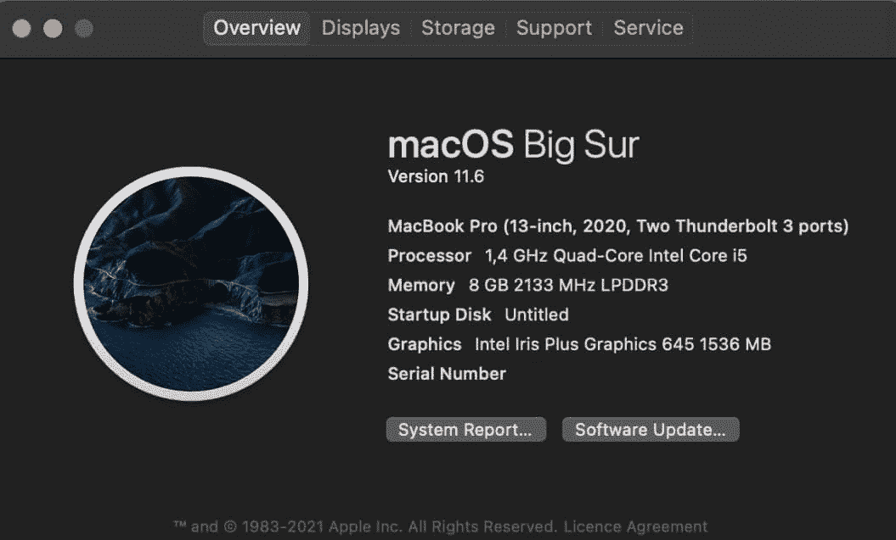

图 10.1 – 关于本机

在弹出的窗口中，您将看到操作系统的版本；在我们的例子中，它是 macOS Big Sur 版本 11.6。通过操作系统版本的信息，您可以找到支持从该操作系统进行内存转储的工具。

截至写作时，以下工具是公开可用的：

+   `osxpmem` – 支持 **OS X Mountain Lion** (10.8)、**OS X Mavericks** (10.9)、**OS X Yosemite** (10.10)、**OS X El Capitan** (10.11)、**macOS Sierra** (10.11)、**macOS High Sierra** (10.13)、**macOS Mojave** (10.14) 和 **macOS Catalina** (10.15) 的 64 位版本。

+   `MandiantMemoryzeforMac` – 支持 **Mac OS X Snow Leopard** (10.6) 32/64 位、**Mac OS X Lion** (10.7) 32/64 位和 **OS X Mountain Lion** (10.8) 64 位。

尽管这些工具覆盖了相当广泛的操作系统，但它们无法获取最新 macOS 版本的内存转储。除了这些工具，还有一些专有解决方案，如 **Cellebrite Digital Collector**、**SUMURI RECON ITR** 或 **Volexity Surge Collect**，它们试图更新其产品并添加对新版 macOS 的支持。例如，SUMURI 最近宣布 RECON 现在支持 macOS Monterey，而 Volexity 则为 Surge 增加了对 M1 系列新 Mac 的支持。

重要提示

别忘了，为了与目标主机配合工作，你需要准备可移动介质或网络共享，存放所有必要的工具和文件，以及生成的内存转储。

一旦选择了合适的工具，你就可以开始测试它了。为此，你需要一台虚拟机，其配置应与目标主机类似。与 Windows 和 Linux 不同，macOS 并不容易作为客户系统安装。事实上，要创建一个 macOS 虚拟机，你需要通过修改配置文件来做一些小技巧。幸运的是，部署指南并不难找到。例如，这里有一份关于如何在 Windows 上使用 VirtualBox 和 VMware 部署 macOS 虚拟机的不错指南：[`www.makeuseof.com/tag/macos-windows-10-virtual-machine/`](https://www.makeuseof.com/tag/macos-windows-10-virtual-machine/)。

创建虚拟机后，你可以继续测试工具。由于 macOS 在启动第三方文件方面比 Windows 和 Linux 有更好的保护，我们将不得不使用一些技巧，稍后会详细介绍。

# 使用 osxpmem 获取内存

这次，我们只讨论一种创建内存转储的工具——`osxpmem`。选择这个工具是因为它是免费分发的，并且支持最多的 OS X 和 macOS 版本。

你可以从官方 GitHub 仓库下载此工具：[`github.com/Velocidex/c-aff4/releases`](https://github.com/Velocidex/c-aff4/releases)。在`osxpmem`中，截至目前，这是**版本 3.2**：

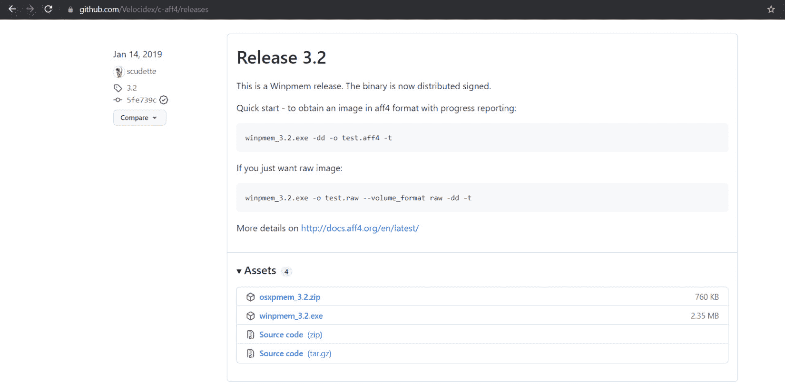

图 10.2 – 最新版本与 osxpmem

下载`osxpmem`归档并解压。在其中，你将找到`osxpmem.app`，这是我们用来创建内存转储的工具。该工具是一个命令行工具，需要通过终端运行。首先，我们需要打开终端并进入`osxpmem.app`。在这个位置，我们需要使用`kextutil`加载`kext`，如下所示：

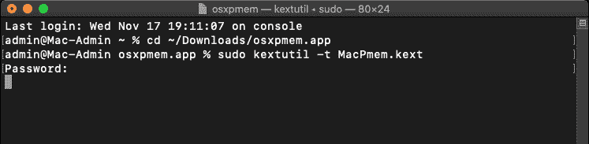

图 10.3 – MacPmem.kext 加载

使用像`osxpmem`这样的工具的主要困难是 macOS 的安全策略。因此，如果我们在没有额外步骤的情况下尝试运行该工具，首先会出现一系列`文件所有者/权限不正确`的错误，其次会显示一条软件被阻止的消息。

为了解决第一个问题，我们需要更改文件的所有者和权限。为此，在终端中运行`chown`和`chmod`命令。要检查所做的更改，可以使用`ls -lah`命令，结果如下所示：

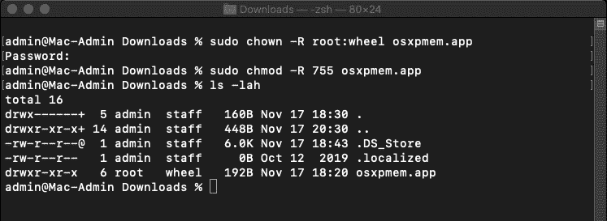

图 10.4 – 更改所有者和权限

为了解决第二个问题，打开**设置**并进入**安全性与隐私**。在这里的**常规**标签中，我们会看到有关阻止程序的信息：

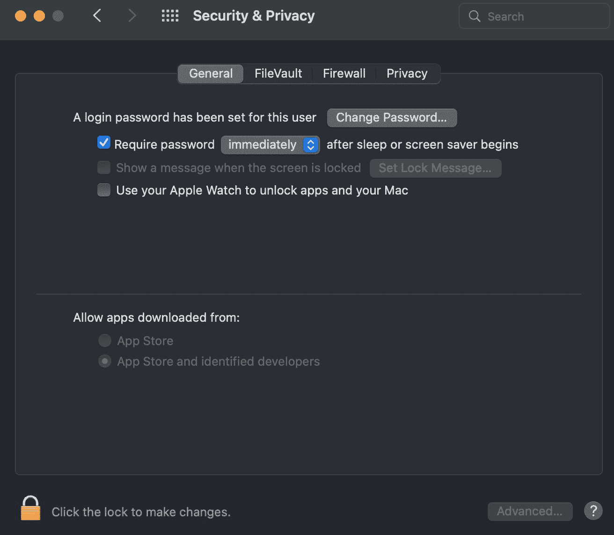

图 10.5 – 安全性与隐私常规选项卡

为了解锁我们的程序，我们需要点击底部的锁，并同意解锁它。

此外，你可能需要禁用系统完整性保护。为此，请在终端中运行以下命令：

```
csrutil disable
```

在较新版本中——例如，在 macOS Catalina 中——你可能需要执行更多全局操作，因为只有在恢复模式下才能禁用系统完整性保护。

重要提示

自然地，在恢复模式下更改配置时，我们需要重启主机，这意味着大部分数据将丢失。然而，在处理持久性恶意软件或一个反向 shell 监听某个端口并等待攻击者连接的情况下，重启后获取的内存转储分析仍然能为我们提供有用的信息。

要禁用系统完整性保护，进入恢复模式。为此，重新启动系统并按下*command* + *R*（如果你使用虚拟机并且主机操作系统是 Windows，则按*Win* + *R*）。这将使你进入正确的模式。在出现的窗口中，选择**实用工具**和**终端**：

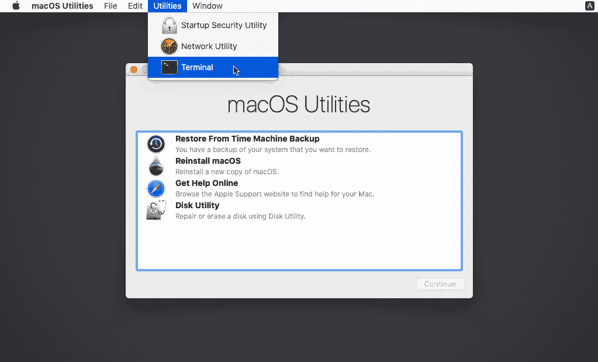

图 10.6 – 恢复模式

在终端中，我们需要运行之前提到的命令：

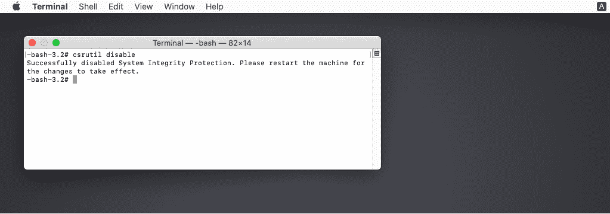

图 10.7 – 禁用系统完整性保护

如你所见，你需要再次重启系统才能成功应用更改。重启后，你可以打开主终端并再次加载`kext`。这应该不会有错误。

加载`kext`后，你需要运行一个命令来收集内存转储。命令将如下所示：

```
sudo osxpmem.app/osxpmem --format raw -o mem.raw
```

`--format`选项用于指定内存转储的格式，而`-o`选项则用于指定输出文件的路径。

你将得到一个包含原始内存转储的`mem.raw`文件。在我们的案例中，执行上述步骤看起来像这样：

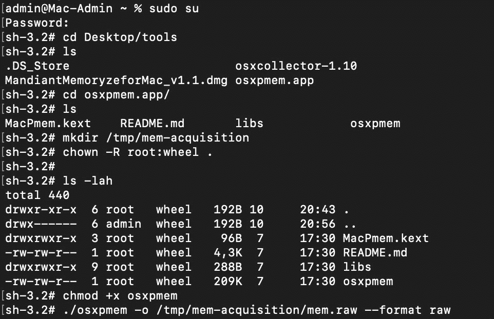

图 10.8 – 内存获取

如果你运行`ls -lah`，你将看到生成的文件：

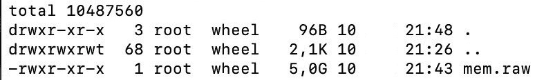

图 10.9 – 已创建的内存转储

之后，你可以使用以下命令卸载内核扩展：

```
$ sudo osxpmem.app/osxpmem -u
```

这样，我们可以获得内存转储，但这只是旅程的开始。为了能够使用 Volatility 处理这个文件，我们需要创建一个合适的配置文件。这将在下一节中讨论。

# 创建 Volatility 配置文件

要创建一个 macOS 配置文件，我们需要安装一些额外的工具。首先，我们需要安装 Brew 包管理器，可以通过访问官方网站的说明进行安装：[`docs.brew.sh/Installation`](https://docs.brew.sh/Installation)。

基本上，你需要做的就是运行主页上的命令：

```
$ /bin/bash -c "$(curl -fsSL https://raw.githubusercontent.com/Homebrew/install/HEAD/install.sh)"
```

我们需要使用 Brew 管理器来安装我们已经知道的`dwarfdump`，所以一旦安装了`brew`，可以在终端中运行以下命令：

```
$ brew install dwarf
```

最后需要下载的是`KernelDebugKit`。为此，请使用此链接：[`developer.apple.com/download/all/?q=debug`](https://developer.apple.com/download/all/?q=debug)。请注意，为了访问该链接，你需要一个 Apple ID，你可以通过点击`Create yours now`链接来创建。输入你的 ID 后，你将看到**下载**页面：

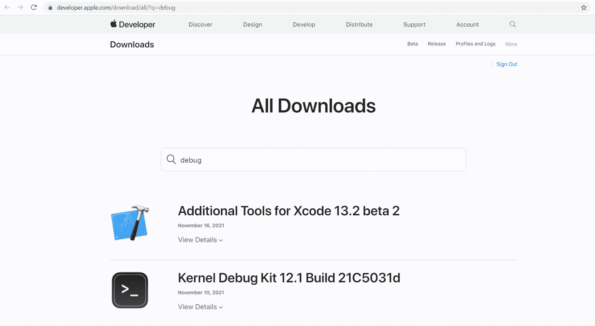

图 10.10 – Apple 开发者下载页面

在此页面上，你需要找到与你的操作系统版本对应的 KDK。例如，屏幕截图中显示的**KDK 12.1**对应的是最新的 macOS Monterey。下载 KDK 后，你需要安装它。此过程可以通过标准方式完成，双击将挂载文件并打开安装程序，安装程序将引导你完成安装过程。

你可以使用`ls`命令验证一切是否已安装，因为安装后，你的 KDK 版本应该出现在`/Library/Developer/KDKs`中。

如果 KDK 已存在，你可以开始从内核获取调试信息。为此，我们使用`dwarfdump`，它应该使用以下参数：

+   `-arch`：架构 – 我们为 32 位系统指定`i386`，为 64 位系统指定`x86_64`

+   `-i`：指向 KDK 中`kernel.dSYM`文件的路径

我们还需要将输出重定向到一个以`dwarfdump`为扩展名的文件。

因此，如果我们使用 64 位 macOS Mojave，命令将如下所示：

```
$ dwarfdump -arch x86_64 -i /Library/Developer/KDKs/KDK_10.14.6_18G2016.kdk/System/Library/Kernels/kernel.dSYM > 10.14.6_x64.dwarfdump
```

在我们的案例中，前面的步骤如下所示：

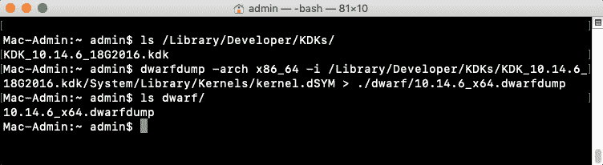

图 10.11 – 从内核获取 dwarf 调试信息

结果，我们得到了`10.14.6_x64.dwarfdump`文件，将其放入`dwarf`目录。接下来，我们将需要 Volatility。在终端中，进入`volatility/tools/mac`并执行`convert.py`脚本，将创建的`dwarfdump`路径和输出文件路径作为参数传递。在我们的案例中，命令如下所示：

```
$ python convert.py 10.14.6_x64.dwarfdump converted_10.14.6_x64.dwarfdump
```

这将生成一个 Linux 风格的输出，可以被 Volatility 读取。之后，我们需要从转换后的文件中创建类型：

```
$ python convert.py converted_10.14.6_x64.dwarfdump > 10.14.6_x64.vtypes
```

接下来，我们需要使用`dsymutil`生成符号信息：

```
$ dsymutil -s -arch x86_64 /Library/Developer/KDKs/KDK_10.14.6_18G2016.kdk/System/Library/Kernels/kernel > 10.14.6_x64.symbol.dsymutil
```

再次，我们传递使用的架构信息和 KDK 中的内核文件路径作为参数。输出被重定向到一个以`.dsymutil`为扩展名的文件。

我们的最后一步是创建一个包含`.dsymutil`和`.vtypes`文件的 ZIP 文件。为此，我们可以使用以下命令：

```
$ zip 10.14.6_x64.zip 10.14.6_x64.symbol.dsymutil 10.14.6_x64.vtypes
```

最后，你将获得你的配置文件。要使用新创建的配置文件，只需将其放入`volatility/plugins/overlays/mac`目录中。

重要提示

`convert.py` 脚本在 High Sierra 之前的版本中运行良好。对于较新的版本，可能会遇到一些问题，因为 `dwarf` 的结构发生了一些变化。为了解决这个问题，你需要修改 `convert.py` 脚本。

创建 macOS 配置文件并不是一件容易的事。不过，如果你需要分析一个包括 High Sierra 在内的 macOS 版本，你可以使用 GitHub 上现成的配置文件：[`github.com/volatilityfoundation/profiles/tree/master/`](https://github.com/volatilityfoundation/profiles/tree/master/)`Mac`。相比之下，如果使用 Volexity Surge Collect 等专有解决方案，你将能获取到甚至最新版本 macOS 的配置文件。如果目标主机运行的是 Intel 处理器，那么可以直接使用 Volexity 提供的配置文件来配合 Volatility 进行分析。对于 M1 处理器，情况稍有不同。由于这是一个 ARM 架构芯片，必须在 Volatility 命令行中传入一些额外的参数。这些参数即是 Surge Collect 创建的 `meta.json` 文件。在这种情况下，当你运行 Volatility 时，除了标准选项和配置文件外，还需要添加以下内容：

+   `--shift – value`，对应 `meta.json` 中的 `KaslrSlide` 参数

+   `--dtb – value`，对应 `meta.json` 中的 `dtb` 参数

因此，运行 Volatility 的命令应该是这样的：

```
$ ./vol.py -f <path to memory dump> --profile=<profile> 
--shift=< KaslrSlide value> --dtb=<dtb value> <plugin>  
```

另一个重要的事项是，要在 Volatility 中分析来自 M1 Mac 的内存转储，需要 ARM64 支持。在这种情况下，你可以使用 `Volatility` 的分支版本：[`github.com/tsahee/volatility/tree/arm64`](https://github.com/tsahee/volatility/tree/arm64)。

# 总结

与之前讨论的操作系统相比，macOS 是最难处理的。大多数支持在新版本 macOS 上创建内存转储的工具都是付费的，而免费工具仅支持创建到 Catalina 版本的内存转储。

另一个困难是启动工具本身。由于 macOS 的安全功能，需要更改一些设置才能运行来自第三方来源的程序。尤其是对于使用 `kext` 加载的工具，情况尤为如此。

另一个难点是为新版本的 macOS 创建 Volatility 配置文件。这是因为创建配置文件需要将 `dwarf` 文件转换为 Volatility 可识别的格式，而 Volatility 开发者提供的脚本和官方 GitHub 仓库中的脚本并不适用于最新版本的 macOS。

鉴于创建适合分析的 macOS 内存转储过程中可能遇到的种种困难，在开始这个过程之前，我们建议你评估一下情况，权衡利弊，仔细考虑是否有必要创建内存转储。

在本章中，我们已经介绍了在 macOS 系统上创建内存转储的过程。接下来的主题同样令人着迷——分析获得的内存转储。
