# 第十一章：利用 macOS 内存取证进行恶意软件检测与分析

之前，针对 macOS 的攻击以及针对该操作系统特定恶意软件的开发，通常是偶发事件，并且常常局限于琐碎的广告软件。在 2020 到 2021 年期间，macOS 面临的主要威胁仍然是广告软件 **Shlayer**（[`redcanary.com/threat-detection-report/threats/shlayer/`](https://redcanary.com/threat-detection-report/threats/shlayer/)），但我们越来越多地看到背后有先进威胁行为者的定向攻击。一个典型例子是 **APT32** 或 **OceanLotus**，这是一个与越南相关的组织，曾通过恶意的 Microsoft Word 文档向 macOS 用户传播后门。

macOS 在企业环境中日益流行，促使了各种 macOS 后渗透工具的出现：**MacShellSwift**、**MacC2**、**PoshC2** 和 **Empire** 后渗透框架。此外，针对 macOS 的 **恶意软件即服务**（[`www.computerworld.com/article/3626431/scary-malware-as-a-service-mac-attack-discovered.html`](https://www.computerworld.com/article/3626431/scary-malware-as-a-service-mac-attack-discovered.html)）已经出现在暗网论坛上。

不足为奇的是，搭载 M1 芯片的新设备也没有逃脱网络犯罪分子的关注。因此，**Red Canary** 的专家最近发现了一种新的恶意软件 Silver Sparrow，专门攻击配备新 M1 处理器的 Mac（[`www.macworld.co.uk/news/new-malware-m1-mac-3801981/`](https://www.macworld.co.uk/news/new-malware-m1-mac-3801981/)）。

所有这些新闻告诉我们一件事：我们需要了解工具并掌握 macOS 分析技术。这正是本章将要重点讨论的内容。

以下是将要覆盖的主题：

+   使用 Volatility 学习 macOS 分析的特点

+   调查网络连接

+   分析进程和进程内存

+   恢复文件系统

+   获取用户应用程序数据

+   寻找恶意活动

# 使用 Volatility 学习 macOS 分析的特点

在上一章中，我们讨论了在 macOS 上创建内存转储和相应配置文件时可能遇到的困难。然而，这并非全部。如您所知，Volatility 依赖于内核调试工具包（Kernel Debug Kit，KDK）来创建 macOS 配置文件，以获取解析所需的所有数据。此数据对工具的性能至关重要，因为使用的数据结构和算法会随着内核版本的不同而变化。同时，Apple 不再在 KDK 中包含所有类型信息，这导致许多插件在执行时出现错误。另一个问题是，某些 Volatility 插件使用了 Intel 特定的数据。因此，适用于从 Intel 主机提取的内存转储的插件可能无法与从 M1 主机提取的转储一起使用。接下来，我们将使用适用于 Intel 和 M1 的插件（如果可能的话），在不适用的情况下，我们将尽力说明所有细节。此外，由于分析方法本身和在 macOS 内存转储中寻找异常的过程与 Windows 和 Linux 没有显著差异，这次我们将重点讨论获取特定信息的工具和方法，而不是具体的调查方法。

# 技术要求

为了分析 macOS 内存转储，我们将同时使用 Linux 和 Windows 系统。我们仍然会在 Ubuntu 21.04（Hirsute）上运行 Volatility 2.6.1，并且像 Bulk Extractor 这样的程序将运行在 Windows 上。在示例中，我们将使用来自 macOS Sierra 10.12.6 的内存转储，但所有描述的操作也可以应用于更新版本的 macOS。

# 调查网络连接

网络活动分析帮助我们确定哪些进程正在建立网络连接，以及使用了哪些 IP 地址和端口。由于大多数恶意软件和后期利用工具都会建立网络连接，因此调查网络活动是我们的首要任务之一。在 macOS 的情况下，Volatility 提供了多个插件来检查网络接口、活动网络连接以及路由表的内容。

我们可以使用`mac_ifconfig`插件获取有关被调查主机网络接口配置的信息：

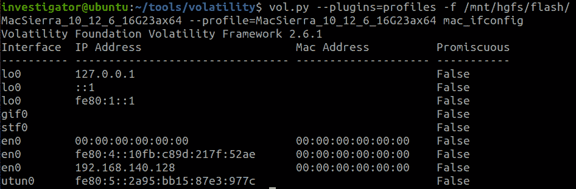

图 11.1 – Volatility mac_ifconfig 输出

如图所示，该插件提供了有关接口名称、分配的 IP 和 MAC 地址，以及设置的混杂模式的信息。

重要提示

混杂模式是一种网络接口控制器模式，它强制控制器将所有传入的流量传递给 CPU，而不仅仅是传递控制器被编程接收的帧。

在我们的例子中，我们看到以下接口：

+   `lo0` – 回环接口

+   `gif0` – 软件网络接口

+   `stf0` – 6to4 隧道接口

+   `en0` – 带有 IPv4 和 IPv6 地址的以太网

+   `utun0` – VPN 和“回到我的 Mac”接口

你可以使用 `mac_netstat` 和 `mac_network_conns` 插件来获取关于网络连接的信息。第一个插件将显示关于活动连接和开放套接字的信息：

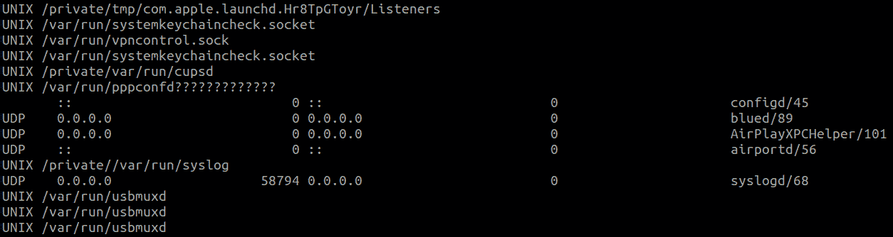

图 11.2 – Volatility mac_netstat 输出

同时，`mac_network_conns` 插件仅提供网络连接的信息：

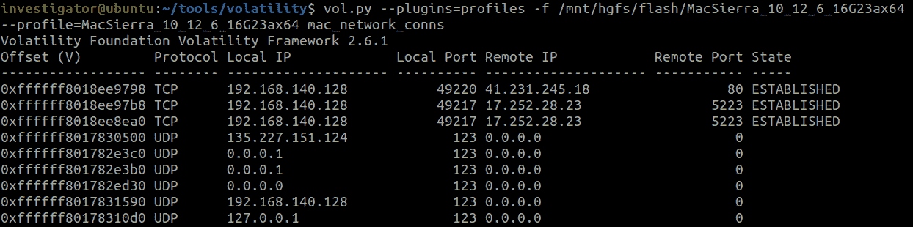

图 11.3 – Volatility mac_network_conns 输出

除了网络连接分析，Volatility 还提供了研究路由表的功能。`mac_route` 插件适用于此：

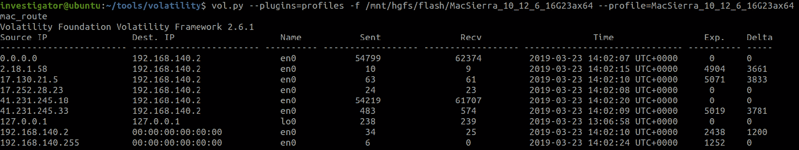

图 11.4 – Volatility mac_route 输出

在这个插件的输出中，我们可以看到源 IP 和目标 IP 地址、接口名称，并且从 OS X 10.7 开始，我们还可以看到发送/接收统计数据和过期/时间差。

另一种检查网络活动的方式是使用 Bulk Extractor 工具和著名的 net 解析器：

```
> .\bulk_extractor.exe -o .\output\ -x all -e net .\MacSierra_10_12_6_16G23ax64
```

结果，我们得到一个 `packets.pcap` 文件，里面包含了来自内存转储的网络捕获数据。为了分析这个文件，我们可以像之前一样，使用 **Wireshark**：

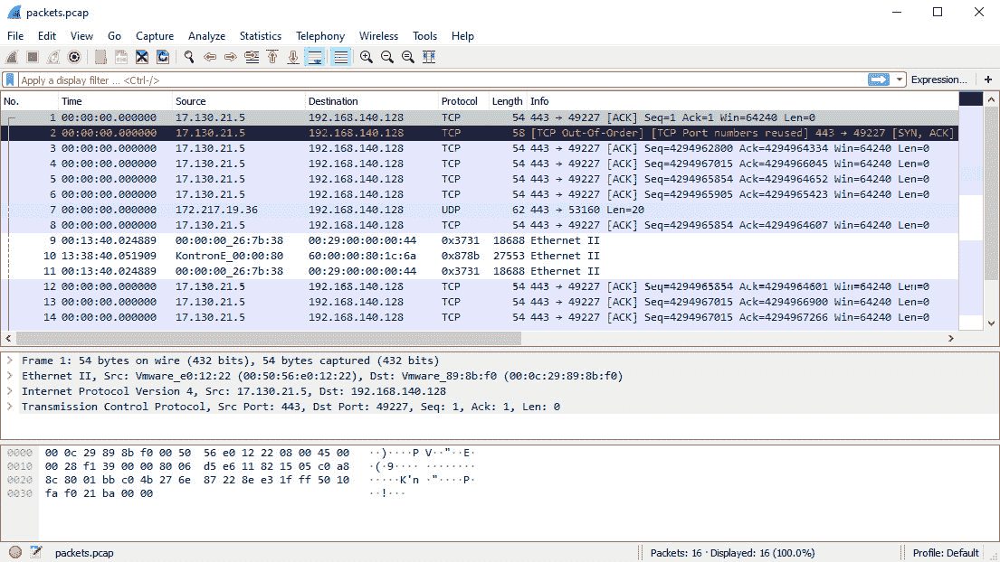

图 11.5 – 网络捕获分析

通过这种方式，我们可以获取关于 macOS 网络活动的信息。研究网络活动的自然补充是查看活动进程。这就是我们接下来要讨论的内容。

# 分析进程和进程内存

进程可以被分析，用来寻找异常、识别潜在的恶意进程，以及观察用户活动。与之前一样，Volatility 提供了多个插件用于获取关于进程及其内存的数据。例如，`mac_pslist`、`mac_pstree` 和 `mac_tasks` 插件可以用来获取进程列表。从实际操作的角度来看，`mac_tasks` 被认为是获取活动进程信息的最可靠来源。与 `mac_pslist` 不同，`mac_tasks` 插件枚举任务并搜索进程对象，而不是依赖于可能在 macOS 内存获取过程中被损坏的进程链表。然而，在最新版本的操作系统上测试时，`mac_pstree` 插件表现得最为高效，能够正确显示针对 Intel 和 M1 芯片的 macOS 结果。

插件的启动方式与 Windows 和 Linux 相同：

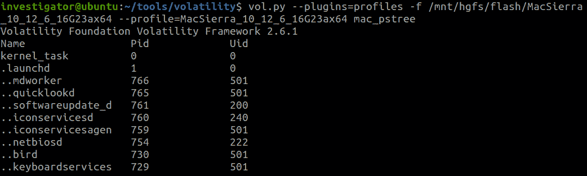

图 11.6 – Volatility mac_pstree 输出

除了进程本身的列表，我们当然也对启动这些进程时使用的参数感兴趣。为了获取这些数据，我们可以使用 `mac_psaux` 插件：

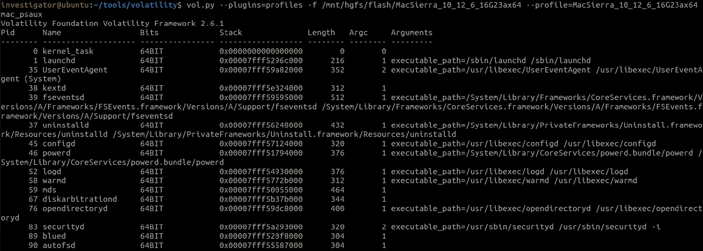

图 11.7 – Volatility mac_psaux 输出

在此插件的输出中，你不仅可以找到参数，还可以找到可执行文件的完整路径。然而，在处理从带有 M1 芯片的 macOS 获取的内存转储时，这个插件可能无法正常工作并导致错误。

除了进程的启动参数外，我们还不能忘记命令行的历史记录。在这种情况下，我们可以使用 `mac_bash` 插件，它可以检索在 shell 中执行的命令，以及 `mac_bash_hash` 插件，它显示命令别名的哈希表。另一种获取此类信息的方法是调查与终端应用程序相关的进程内存。我们可以分别使用 `mac_procdump` 和 `mac_memdump` 插件提取可执行文件和进程内存进行分析。然而，目前这些插件只能正确提取从具有 Intel 芯片的主机获得的内存转储数据。尽管如此，对于 Intel 和 M1 芯片，我们仍然有机会检查每个进程中分配的内存块、它们的权限以及映射文件的名称。这可以通过 `mac_proc_maps` 插件来完成：

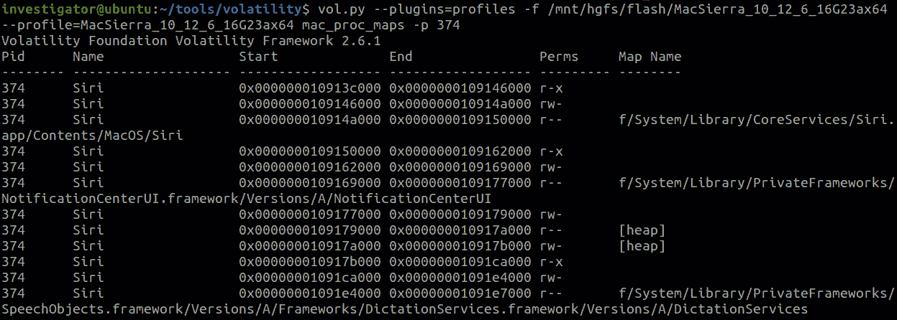

图 11.8 – Volatility mac_proc_maps 输出

如你在 *图 11.8* 中所见，在此插件的输出中，我们可以找到进程所使用的文件及其在磁盘上的完整路径。如果需要，我们还可以使用 `mac_dump_maps` 插件提取这些内存块。如果我们对特定的内存块感兴趣，可以使用 `-s` 选项指定其起始地址，如下所示：

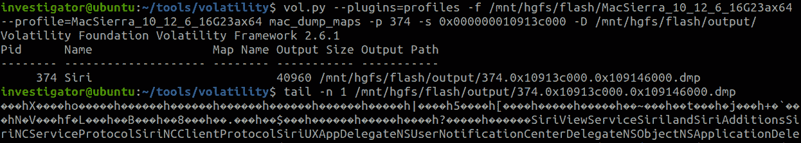

图 11.9 – Volatility mac_dump_maps 结果

如你所见，第一个 Siri 进程内存块的内容已成功提取，并且可以通过其他工具单独进行分析。通过这种方式，我们可以尝试提取可执行文件、库和其他文件。然而，还有一种分析和提取与进程相关文件的方法。让我们来讨论一下。

# 恢复文件系统

处理 macOS 内存中文件系统的方法也并非独特。首先，我们可以使用 `mac_lsof` 插件检查进程的打开文件描述符。它的启动和输出格式与 Linux 对应的插件没有区别：

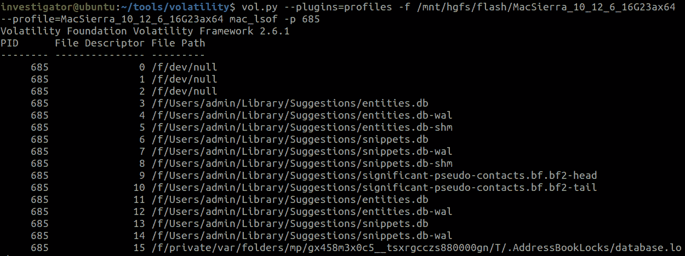

图 11.10 – Volatility mac_lsof 输出

如你所见，我们还可以使用 `-p` 选项来标识特定进程并查看与之相关的文件。此外，我们还可以收集有关文件缓存中存储的所有文件的信息。`mac_list_files` 插件将帮助我们完成这项工作：

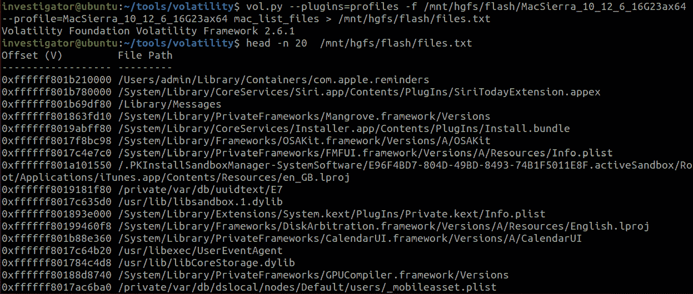

图 11.11 – Volatility mac_list_files 输出

你可以使用 `mac_recover_filesystem` 插件来导出文件。当然，Volatility 也有 `mac_dump_file` 插件，用于导出特定文件，但目前该插件在最新版本的 macOS 上显示出不佳的效果。启动 `mac_recover_filesystem` 插件的过程仍然保持不变：

```
$ vol.py --plugins=profiles -f /mnt/hgfs/flash/MacSierra_10_12_6_16G23ax64 
--profile=MacSierra_10_12_6_16G23ax64 mac_recover_filesystem 
-D /mnt/hgfs/flash/output/
```

在我们的案例中，输出文件夹的内容如下所示：

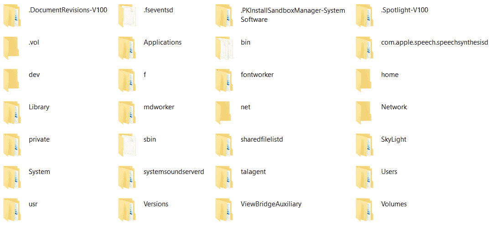

图 11.12 – Volatility mac_recover_filesystem 结果

通过这种方式，我们可以从缓存的文件系统中恢复主要位置和各种文件。在这里，你还可以找到与用户的 bash 历史相关的文件：

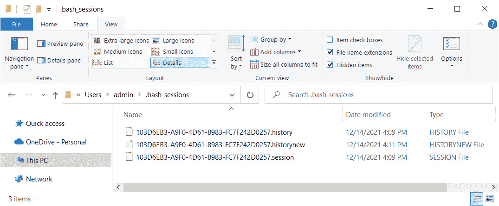

图 11.13 – 恢复的 bash 历史文件

该插件的缺点是，它目前在从带有 M1 芯片的主机收集的内存转储上无法正常工作。如果你使用的是旧版本的 macOS，你还可以使用 **PhotoRec** 工具，它支持 HFS+ 文件系统。此选项适用于 High Sierra 之前的版本，因为 macOS 10.13 或更高版本的默认文件系统是 APFS。

如你所见，从 macOS 内存中导出文件并非易事，特别是对于最新版本的操作系统。然而，也有一些积极的方面。其中之一是能够相对容易地从特定用户应用程序中恢复数据。

# 获取用户应用数据

默认情况下，macOS 用户可以访问 Apple 提供的内建应用程序，如日历、联系人和备忘录。由于这些应用程序的高质量和便捷性，它们赢得了用户的喜爱，也吸引了调查人员的兴趣。Volatility 提供了一套现成的插件，允许你提取上述应用程序中的数据。例如，要从 `Calendar.app` 中恢复事件，可以使用 `mac_calendar` 插件。要恢复备忘录中的内容，可以使用 `mac_notesapp`，而要恢复 `Contacts.app` 中的联系人，则可以使用 `mac_contacts`：

```
$ vol.py --plugins=profiles -f /mnt/hgfs/flash/MacSierra_10_12_6_16G23ax64 
--profile=MacSierra_10_12_6_16G23ax64 mac_contacts
Volatility Foundation Volatility Framework 2.6.1
<edited>
AppleappleAppleapple Apple ?5E
Johnyphish Johny phish Johny
```

一旦你获得了这些数据，你可以使用正则表达式或 YARA 规则与 `mac_yarascan` 插件一起尝试找到更多关于该联系人的信息。例如，与该联系人相关的电子邮件地址。

由于我们讨论的是用户活动，我们不应忘记那些更为通用的插件，它们允许我们获取有关用户正在运行的程序或已连接的设备的数据。在第一种情况下，我们使用相同的插件来分析正在运行的进程。同时，如果需要将某个进程与特定用户关联，我们可以使用 `mac_list_sessions` 插件，它从会话哈希表中枚举会话。该插件的工作方式如下：

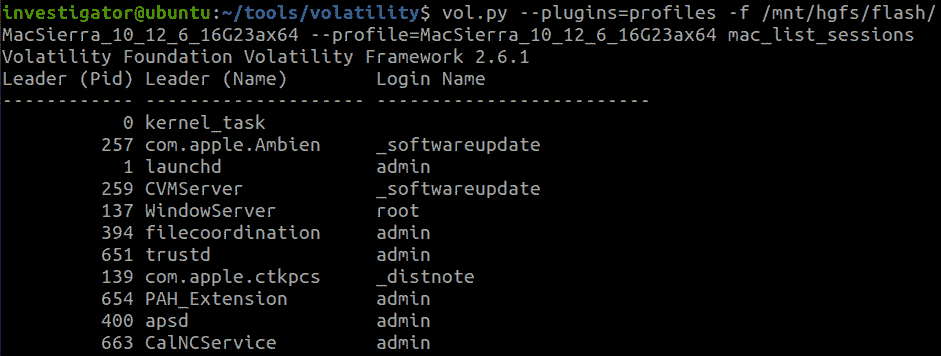

图 11.14 – Volatility mac_list_sessions 输出

通过这种方式，我们可以获得进程 ID、进程名称以及关联用户的名称信息。

对于连接的设备，我们可以转向熟悉的 `mac_mount` 和 `mac_dmesg` 插件：

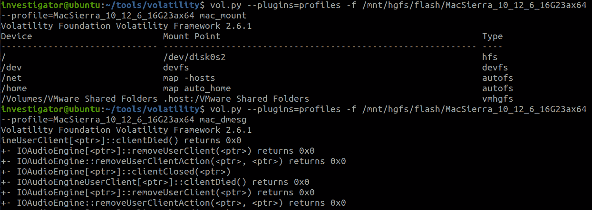

图 11.15 – Volatility mac_mount 和 mac_dmesg 插件

正如你在*图 11.15*中看到的，这些插件与 Linux 系统中同名的插件完全相同。

另一个有趣的插件是 `mac_keychaindump`，它可以帮助恢复用户数据。顾名思义，这个插件尝试恢复可能存在的钥匙串密钥。随后，如果恢复成功，你可以尝试使用 `Chainbreaker2`（[`github.com/n0fate/chainbreaker`](https://github.com/n0fate/chainbreaker)）获取关于名称、账户、密码，以及钥匙串记录的创建和最后修改的时间戳。然而，值得注意的是，在编写本书时，最后一个正式支持的 macOS 版本是 Catalina。

当然，我们不能忘记分析与浏览器、邮件客户端和即时通讯软件相关的进程，因为它们可能包含大量有用数据，包括访问的 URL、电子邮件地址和对话内容。为了获取这些数据，我们可以分析相关进程的内存，使用 `mac_memdump` 或 `mac_dump_maps` 插件，结合关键字、正则表达式或 YARA 规则的搜索。另一方面，我们可以使用**Bulk** **Extractor** 工具和**邮件**解析器来提取 URL 和电子邮件地址：

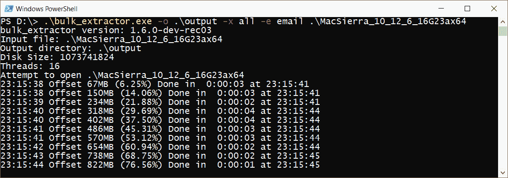

图 11.16 – Bulk Extractor 邮件解析器

在输出文件夹中，我们关注两个文件——`email_histogram.txt` 和 `url_histogram.txt`，它们分别包含从内存转储中提取的所有电子邮件地址和 URL：

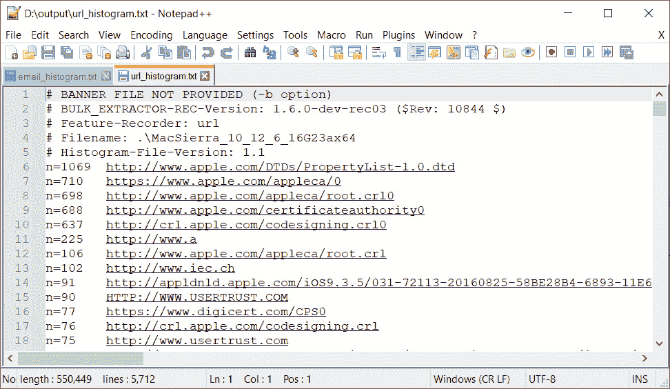

图 11.17 – 提取的 URLs

这样，我们可以分析不同的用户数据。我们最后讨论的话题将是如何搜索和调查恶意活动。

# 搜索恶意活动

在 macOS 中搜索恶意活动基本上归结为我们在前几章中处理的基本元素：寻找可疑的网络连接，寻找进程中的异常，寻找代码注入，寻找使用的钩子技术的痕迹，以及检查 shell 中执行的命令。例如，`-f0L` 作为命令行参数之一，用于通过 `unzip` 命令将受保护的归档解压到 `/tmp` 目录下。同时，在 shell 中运行脚本和命令也可能在更复杂的攻击中被威胁行为者使用，尤其是当他们直接访问主机时。

要查找代码注入，我们可以使用熟悉的`mac_malfind`插件。然而，请注意，在从 M1 芯片的主机上获取的内存转储上运行该插件可能会导致执行错误：

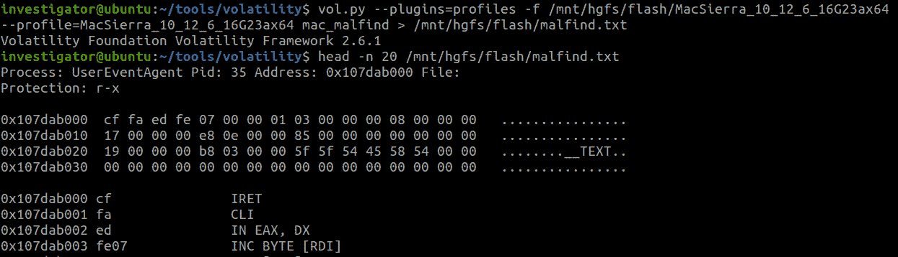

图 11.18 – Volatility mac_malfind 输出

这种方法对于检测通过`ptrace`或`NSCreateObjectFileImageFromMemory` API 进行的注入非常有用。另外，准备好应对大量的误报结果，这些结果需要进行二次检查。

也不要忘记查找恶意库注入进程的痕迹。在这种情况下，`mac_proc_maps`和`mac_dyld_maps`插件可能会很有用。如果恶意库试图隐藏自己，可以使用`mac_ldrmodules`插件，该插件将`mac_proc_maps`的输出与从`libdl`获得的库列表进行比较：

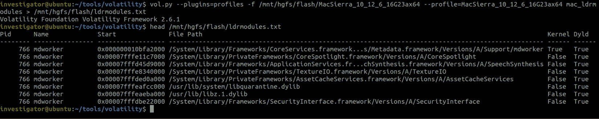

图 11.19 – Volatility mac_ldrmodules 输出

如果需要，你还可以使用`mac_librarydump`插件提取感兴趣的库，该插件能够从进程内存中提取任何可执行文件。

在 macOS 的恶意活动分析中，一个显著的特点是寻找持久性痕迹，因为在这个操作系统中，用于持久性的技术将不同于前面讨论的那些。威胁行为者和恶意软件最常用的技术包括以下 MITRE ATT&CK 子技术：

+   `T1547.011`：Plist 修改

+   `T1547.007`：重新打开的应用程序

+   `T1547.015`：登录项

+   `T1543.001`：启动代理

+   `T1543.004`：启动守护进程

+   `T1546.004`：Unix Shell 配置修改

+   `T1053.003`：Cron

前两个子技术可用于持久性和特权升级。攻击者可以修改或添加可执行文件的路径，添加命令行参数，并将键/值对插入自动启动位置的属性列表文件（`plist`）。要查找这些子技术的痕迹，你可以分析`~/LaunchAgents`和`~/Library/Application Support/com.apple.backgroundtaskmanagementagent/backgrounditems.btm`位置的`plist`文件。别忘了检查`~/Library/Preferences/com.apple.loginwindow.plist`、`~/Library/Preferences/ByHost/com.apple.loginwindow.*.plist`以及应用程序的`Info.plist`文件。你可以尝试从缓存的文件系统中提取这些文件，或者直接在主机上检查。

登录项、启动代理和启动守护进程子技术使用类似的方法。你应该检查`~/Library/Application Support/com.apple.backgroundtaskmanagementagent/backgrounditems.btm`、`~/Library/Preferences/com.apple.loginitems.plist`以及应用程序的`/Contents/Library/Loginltems/`，以查找它们的痕迹。你还应该检查`/System/Library/LaunchAgents`、`/Library/LaunchAgents/`、`/Library/LaunchDaemons/`和`~/Library/LaunchAgents/`中的新`plist`文件。

Unix Shell 配置修改子技术与运行终端应用程序时修改所使用的文件相关。终端基本上使用`zsh`，它是自 macOS Catalina 起所有 macOS 版本的默认 shell。请注意，对于传统程序，`/etc/bashrc` 会在启动时执行。因此，我们应该检查 `/etc/profile` 和 `/etc/profile.d`，以及 `~/.bash_profile`，以查找该子技术的痕迹。你还可以检查 `/etc/shells` 文件，其中包含有效 shell 的文件路径列表。

最后一个子技术与我们在*第九章*中看到的*恶意活动检测*相似，因此我们在这里不会详细讨论。然而，值得一提的是，`T1547.006`：内核模块和扩展子技术，它涉及使用 `kextload` 命令加载恶意的 `kext`，在早期的 macOS 版本中非常流行。然而，自 macOS Catalina 起，内核扩展已被弃用。尽管如此，Volatility 提供了插件来探索已加载的内核模块和扩展：`mac_lsmod` 和 `mac_lsmod_kext_map`：

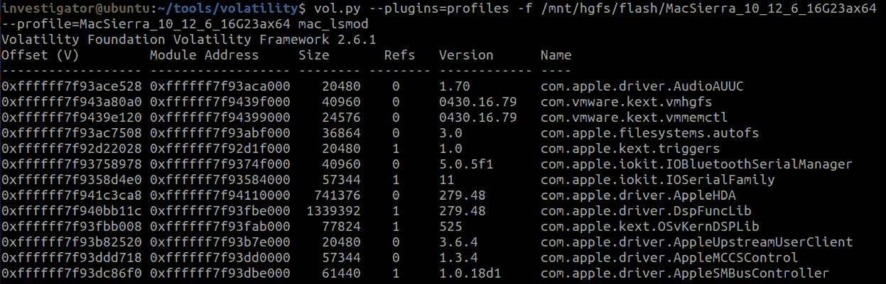

图 11.20 – Volatility mac_lsmod 输出

你还可以使用 `mac_moddump` 插件将指定的内核扩展导出到磁盘。此子技术常常被 rootkit 用来保持持久性和提升权限。

通常，与 Linux rootkit 一样，macOS rootkit 现在非常难以找到。然而，即使是这种罕见的情况，我们也有一些插件，可以让我们检测该类型恶意软件使用的不同钩子技术：

+   `mac_apihooks` – 检查 API 钩子，允许你检测内联钩子及钩子重定位表。

+   `mac_check_sysctl` – 列出所有 `sysctl` 值和处理程序。由于 sysctl 是允许用户空间组件与内核通信的接口，它被不同的 rootkit 广泛使用。`Sysctl` 钩子提供了隐藏 rootkit 数据和创建后门的机会。

+   `mac_check_trap_table` – 检查是否有钩子影响 trap 表条目。Trap 表是为满足对 OS X 和 macOS BSD 层的请求而实现的。替换 trap 表条目可以用于 rootkit 实现，因此它也引起了威胁行为者和恶意软件的兴趣。

+   `mac_notifiers` – 检测添加钩子的 rootkit，这些钩子插入 I/O Kit。I/O Kit 是一组不同的工具和 API，提供与硬件设备交互的机会，并可能被 rootkit 滥用。

+   `mac_trustedbsd` – 列出恶意的 `trustedbsd` 策略。TrustedBSD 子系统允许你通过确定哪些进程可以访问哪些资源的策略来控制对系统资源的访问。这些策略通常是 rootkit 的目标之一。

通过搜索上述对象的异常和操作痕迹，我们可以检测到 macOS 上的 rootkit。

# 总结

分析 macOS 内存转储的过程与分析 Windows 或 Linux 的过程并没有太大区别。然而，有一些细节需要注意。

首先，最新版本 macOS 的 Volatility 配置文件几乎无法获得，目前，唯一相对可靠的获取方式是使用专有的内存转储解决方案，在该方案中，配置文件可以与转储一起自动创建。

其次，并非所有在旧版本 macOS 上运行良好的 Volatility 插件在最新版本的操作系统上都能显示出良好的结果。此外，插件的性能可能取决于目标主机的芯片架构，该主机是从中提取转储的设备。

第三，我们曾用于从 Windows 和 Linux 恢复文件的工具（如 PhotoRec）对于从 macOS High Sierra 开始的 macOS 版本帮助不大，因为它们不支持 APFS 文件系统。

否则，内存转储分析的方法本身保持不变。在分析用户活动时，我们倾向于关注正在运行的应用程序及其包含的动态数据，如 Apple 应用程序（如日历或联系人）、来自钥匙串的数据以及已挂载的设备。为了检测恶意活动，我们专注于检查网络连接，寻找进程中的异常，检测注入的代码和库，以及检测使用的持久性技术。
