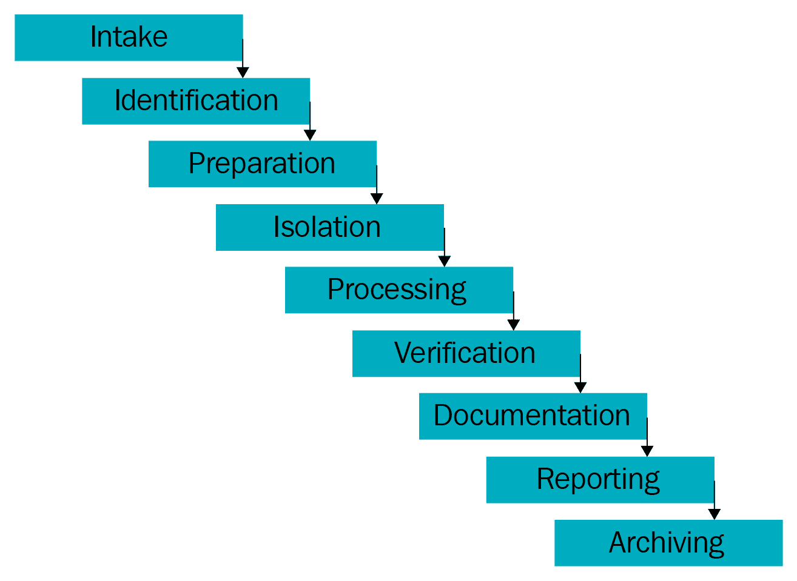

# 第一章：移动取证简介

毋庸置疑，移动设备已经成为我们生活的一部分，并彻底改变了我们进行大多数活动的方式。因此，移动设备现在已经成为一个庞大的存储库，保存着关于其拥有者的敏感和个人信息。这反过来促进了移动设备取证学的发展，取证学是数字取证的一个分支，专门处理从移动设备中提取数据。本书将帮助你了解在三个主要平台上进行取证的技术——Android、iOS 和 Windows。我们将介绍可以用来收集不同移动设备证据的各种方法。

本章将覆盖以下主题：

+   移动取证的需求

+   了解移动取证

+   移动取证的挑战

+   手机证据提取过程

+   实用的移动取证方法

+   手机中存储的潜在证据

+   检查与分析

+   证据规则

+   良好的取证实践

# 移动取证的需求

根据 Statista 的报告（[statista.com](http://www.statista.com)），全球手机用户数预计在 2020 年将超过 50 亿。世界正见证技术和用户从桌面电脑迁移到手机的过程。移动市场的大部分增长可以归因于智能手机需求的持续增加。

根据爱立信的一份报告，到 2022 年，全球移动数据流量将达到每月 71 艾字节（exabytes），相比 2017 年的 8.8 艾字节，年复合增长率为 42%。如今的智能手机，如苹果的 iPhone 和三星的 Galaxy 系列，是具有高性能、大容量存储和增强功能的紧凑型计算机。手机是用户访问的最具个人性的电子设备。它们用于执行简单的通信任务，如拨打电话和发短信，同时也支持浏览互联网、收发电子邮件、拍照和录像、创建和存储文档、通过 GPS 服务定位以及管理商业事务。

随着新功能和应用程序的不断加入，手机上存储的信息量也在不断增长。

手机已经成为便携的数据载体，跟踪你所有的活动。随着手机在日常生活和犯罪中的普及，从手机中获取的数据已经成为与刑事、民事甚至高调案件相关的调查中不可或缺的证据来源。很少有数字取证调查不包括手机。2010 年，纽约时代广场的未遂炸弹袭击案件中，手机通话记录和 GPS 数据被用来帮助破案。

案件的详细信息可以在[`www.forensicon.com/forensics-blotter/cell-phone-email-forensics-investigation-cracks-nyc-times-square-car-bombing-case/`](https://www.forensicon.com/forensics-blotter/cell-phone-email-forensics-investigation-cracks-nyc-times-square-car-bombing-case/)找到。

从手机中恢复数字证据的科学被称为手机取证，我们将在下一节讨论它。数字证据被定义为存储在电子设备上、由电子设备接收或传输的信息和数据，这些数据可用于调查。数字证据包括所有可以作为案件证据使用的数字数据。

# 了解手机取证

数字取证是法医学的一个分支，专注于恢复和调查存储在电子或数字设备中的原始数据。该过程的目标是在不改变设备上现有数据的情况下，提取并恢复数字设备中的任何信息。随着计算机和各种其他数字设备的快速发展，数字取证也与时俱进。根据涉及的数字设备类型，数字取证有多个分支，如计算机取证、网络取证和手机取证。

手机取证是数字取证的一个分支，专门处理从移动设备中获取和恢复证据的问题。取证有效性是数字取证领域中广泛使用的术语，用来确认和证明某一特定取证技术或方法的使用。确保取证过程不改变原始证据是有效取证检查的核心原则之一，而这对于移动设备来说是极其困难的。有些取证工具需要与移动设备进行通信，因此标准的写保护在取证过程中无法有效工作。

其他取证获取方法可能涉及在提取数据进行取证检查之前，从移动设备上拆卸芯片或安装自定义引导程序。在无法在不改变设备配置的情况下进行检查或数据获取的情况下，必须仔细测试并记录程序及更改，以供以后参考。遵循正确的方法和指南对于检查移动设备至关重要，因为这样可以获得最有价值的数据。与任何证据收集一样，不按照正确的程序进行检查可能会导致证据丢失或损坏，或者使其在法庭上无法作为有效证据。

移动取证过程分为三个主要类别——*扣押*、*获取*和*检查/分析*。在扣押手机作为证据来源时，取证员面临一些挑战。在犯罪现场，如果发现手机已关机，你作为检查员应将设备放入法拉第袋中，以防设备自动开机后发生变化。法拉第袋专门设计用来隔离手机与网络的连接。

如果手机被发现开机，关机的操作涉及很多需要考虑的问题。如果手机被 PIN 码或密码锁定，或经过加密，你需要绕过锁定或确定 PIN 码才能访问设备。手机是联网设备，可以通过不同的方式发送和接收数据，例如电信系统、Wi-Fi 接入点和蓝牙。因此，如果手机处于开机状态，犯罪分子可能通过执行远程擦除命令来安全地清除手机上存储的数据。当手机开机时，应将其放入法拉第袋中。如果可能，在将移动设备放入法拉第袋之前，你应断开它与网络的连接，通过开启飞行模式并禁用所有网络连接（Wi-Fi、GPS、热点等）来保护证据。这还可以延长电池寿命，因为电池在法拉第袋中会消耗电量，并防止法拉第袋出现泄漏。一旦移动设备被正确扣押，检查员可能需要几种取证工具来获取和分析存储在手机上的数据。

移动设备取证获取可以通过多种方法进行，具体方法将在后面定义。这些方法会影响所需的分析量，具体内容将在后续章节中详细讨论。如果某种方法失败，必须尝试另一种方法。可能需要多次尝试和不同的工具，以便从移动设备中获取最大量的数据。

手机是动态系统，在提取和分析数字证据时给我们带来了很多挑战。不同制造商的不同类型手机数量的快速增长使得开发单一的流程或工具来检查所有类型的设备变得困难。随着现有技术的进步和新技术的引入，手机不断发展。此外，每部手机都设计有多种嵌入式操作系统。因此，取证专家需要特别的知识和技能来获取和分析这些设备。

# 移动取证中的挑战

当涉及移动平台时，最大的取证挑战之一是数据可以在多个设备之间访问、存储和同步。由于数据易变且可以迅速在远程进行转换或删除，需要更多的努力来保留这些数据。移动取证与计算机取证不同，并对取证人员提出独特挑战。

执法部门和取证人员经常难以从移动设备中获取数字证据。以下是其中一些原因：

+   **硬件差异**：市场上充斥着来自不同制造商的不同型号的手机。取证人员可能会遇到不同尺寸、硬件、功能和操作系统不同的手机型号。此外，由于产品开发周期短，新型号经常出现。随着移动设备领域每天都在发生变化，对于您来说，适应所有挑战并保持对各种设备上的移动设备取证技术的更新至关重要。

+   **移动操作系统**：与个人计算机不同，Windows 多年来一直主导市场，移动设备广泛使用更多操作系统，包括苹果的 iOS、谷歌的 Android、RIM 的 BlackBerry OS、微软的 Windows Phone OS、惠普的 webOS 等。即使在这些操作系统中，也有几个版本，这使得您的任务变得更加困难。

+   **移动平台安全功能**：现代移动平台包含内置的安全功能，用于保护用户数据和隐私。这些功能在取证获取和检查过程中起到障碍作用。例如，现代移动设备从硬件层到软件层都配备了默认加密机制。您可能需要突破这些加密机制才能从设备中提取数据。FBI 与苹果之间的加密争端在这方面是一个分水岭时刻，苹果的安全实施阻止了 FBI 破解从圣贝纳迪诺案件中袭击者手中夺取的 iPhone。

+   **防止数据修改**：取证中的一个基本规则是确保设备上的数据不被修改。换句话说，从设备中提取数据的任何尝试都不应更改该设备上的数据。但这在移动设备上实际上是不可能的，因为只需打开设备就可能改变该设备上的数据。即使设备看起来处于关闭状态，后台进程仍可能在运行。例如，在大多数手机中，闹钟即使手机关闭也仍在工作。从一个状态突然转变到另一个状态可能导致数据的丢失或修改。

+   **反取证技术**：反取证技术，如数据隐藏、数据混淆、数据伪造和安全擦除，使数字媒体的调查变得更加困难。

+   **密码恢复**：如果设备受到密码保护，取证专家需要在不损坏设备数据的情况下访问设备。虽然有一些技术可以绕过屏幕锁定，但它们可能并不适用于所有版本的操作系统。

+   **资源不足**：如前所述，随着手机数量的增加，取证专家所需的工具数量也在增加。为了获取这些设备，必须维护取证配件，如用于不同手机的 USB 数据线、电池和充电器。

+   **证据的动态性质**：数字证据可能会被轻易修改，无论是有意还是无意。例如，在手机上浏览某个应用程序可能会改变该应用程序在设备上存储的数据。

+   **意外重置**：手机提供了重置所有内容的功能。在检查过程中如果不小心重置设备，可能会导致数据丢失。

+   **设备修改**：设备修改的方式可能包括移动应用数据、重命名文件或修改制造商的操作系统。在这种情况下，应考虑嫌疑人的专业技能。

+   **通信屏蔽**：手机设备通过蜂窝网络、Wi-Fi 网络、蓝牙和红外进行通信。由于设备通信可能会改变设备数据，因此在获取设备后，应消除进一步通信的可能性。

+   **工具不可用**：手机设备种类繁多。需要使用多种工具组合，因为单一工具可能无法支持所有设备或执行所有必要功能。因此，选择适合特定手机的工具可能很困难。

+   **恶意程序**：设备可能包含恶意软件，如病毒或木马。这些程序可能尝试通过有线或无线接口传播到其他设备。

+   **法律问题**：手机设备可能涉及跨越地理边界的犯罪。为了处理这些跨辖区问题，取证专家应熟悉犯罪的性质和地区法律。

接下来，让我们看看证据提取的过程。

# 手机证据提取过程

证据提取和不同手机设备的取证检查可能会因多种因素而有所不同。然而，遵循一致的检查流程将帮助取证专家确保从每部手机中获取的证据有良好的记录，并且结果可靠。对于手机取证，目前没有公认的标准流程。

然而，以下图示提供了从手机设备提取证据时的一些过程考虑。所有提取数据的方法都应经过测试、验证并详细记录：

移动电话证据提取过程

处理和处理移动设备的一个重要资源可以在[`digital-forensics.sans.org/media/mobile-device-fo`](http://digital-forensics.sans.org/media/mobile-device-forensic-process-v3.pdf)[rensic-process-v3.pdf](http://digital-forensics.sans.org/media/mobile-device-forensic-process-v3.pdf)中找到。

如前面图示所示，移动设备的取证包括几个阶段，从证据接收阶段到归档阶段。以下各节提供了各个阶段中需要考虑的各种事项的概述。

# 证据接收阶段

证据接收阶段是开始阶段，涉及记录业主信息和移动设备涉及的事件类型的文书工作，并概述请求者所寻求的数据类型。为每个检查制定具体目标是此阶段的关键部分。这有助于明确你的目标。在开始物理扣押过程之前，你应熟悉与个人权利相关的联邦、州和地方法律。如果未按照正确程序进行，调查可能会在法庭上被认为是非法的。程序和合法性可能根据你是政府代理人还是私人方有所不同。例如，在美国，**第四修正案**权利禁止政府代理人在没有适当搜查令的情况下进行任何搜查或扣押。搜查令应明确授权扣押移动设备以及需要收集的数据类型。成功扣押后，应注意确保建立设备和数据收集的链条证据。

根据 NIST（[`csrc.nist.gov/`](https://csrc.nist.gov/)），链条证据是指通过记录每个处理证据的人、收集或转移的日期/时间以及转移目的，跟踪证据在收集、保护和分析生命周期中的移动过程。

此外，在扣押设备时，应小心不要修改设备上存在的任何数据。同时，任何有助于调查的机会都不应错过。例如，在扣押设备时，如果设备没有锁定，可以尝试禁用密码。

# 标识阶段

取证检查员应为每次对移动设备的检查识别以下详细信息：

+   法律授权

+   需要提取的数据

+   设备的制造商、型号和标识信息

+   数据存储介质

+   其他潜在证据来源

我们将在接下来的各节中讨论这些内容。

# 法律授权

对于法医检查员而言，确定并记录获取和检查设备的合法授权非常重要，还需要了解在设备检查之前对媒体的任何限制。例如，如果设备的调查是基于搜查令进行的，则搜索应仅限于搜查令中定义的区域。简而言之，在扣押设备之前，你需要回答以下问题：

+   如果没有搜查令，设备所有者是否同意进行搜查？

+   如果有搜查令，设备是否包含在原始搜查令中？

+   如果设备包含在搜查令中，是否也定义了可以收集的数据？

+   如果是企业调查，设备是个人所有还是属于其雇主？

+   企业政策是否允许收集和后续分析？

# 需要提取的数据

你将根据所请求的数据确定检查的深度。检查的目标在选择检查手机的工具和技术时具有重要影响，并提高检查过程的效率。

# 设备的制造商、型号和识别信息

在检查过程中，确定手机的制造商和型号有助于判断哪些工具可以与手机配合使用。若有可能，建议记录被扣押设备的以下细节：

+   设备制造商

+   设备型号

+   移动设备的序列号

+   设备的颜色

+   设备屏幕或锁屏壁纸

+   设备是否具有任何硬件组件（如前置摄像头、耳机插孔等）

+   设备的任何特定细节描述（如划痕、破损的屏幕等）

接下来，我们来看一下数据存储介质。

# 数据存储介质

许多移动电话提供使用可拆卸存储设备扩展内存的选项。如果在提交检查的移动电话中发现了这类可拆卸介质，存储卡应当移除，并使用传统的数字取证技术进行处理。最好在移动设备中获取存储卡，以确保手机内存和存储卡上的数据能够关联，便于分析。相关内容将在接下来的章节中详细讨论。

# 其他潜在证据来源

移动电话是良好的指纹和其他生物证据来源。在检查移动电话之前，应该先收集此类证据，以避免污染问题，除非收集方法会损坏设备。检查员在处理证据时应佩戴手套。

# 准备阶段

一旦确定了手机型号，准备阶段就包括对要检查的特定手机及其获取和检查所需的适当方法和工具进行研究。通常，这基于设备型号、底层操作系统及其版本等信息进行。这时，需要使用哪些工具也要根据设备以及检查的范围和目标来决定。

# 隔离阶段

移动电话的设计目的是通过蜂窝电话网络、蓝牙、红外和无线（Wi-Fi）网络功能进行通信。当电话连接到网络时，新的数据通过来电、短信和应用程序数据传入手机，这些数据会修改手机上的证据。

数据的完全销毁也可以通过远程访问或远程擦除命令实现。因此，在获取和检查设备之前，将设备与通信源隔离是非常重要的。网络隔离可以通过将手机放入射频屏蔽布中，然后将手机设置为飞行模式来完成。飞行模式会禁用设备的通信渠道，如蜂窝网络、Wi-Fi 和蓝牙。然而，如果设备已锁屏，这种方法就不可行。此外，由于现在飞机上可以提供 Wi-Fi 服务，一些设备在飞行模式下也能够启用 Wi-Fi 访问。

另一种解决方案是通过使用法拉第袋隔离手机，这些袋子可以阻挡手机的信号收发。法拉第袋包含能够屏蔽外部静电场（包括无线电波）的材料。因此，法拉第袋可以屏蔽被扣押的移动设备免受外部干扰，防止数据擦除和定位追踪。为了更方便地处理扣押的设备，法拉第帐篷和房间也已出现。

# 处理阶段

一旦手机与通信网络隔离，手机的实际处理工作就开始了。你将在这一阶段面临的挑战之一是确定使用哪些工具，因为这受多种因素的影响，例如价格、易用性、适用性等。移动取证软件价格昂贵，而且与计算机取证不同，有时你需要使用多个工具来访问数据。在选择工具时，请确保它具有内建功能以保持取证完整性。保持取证完整性需要一个能够以一种可能难以轻易修改或篡改的格式打包收集数据的工具。

手机应通过一种经过验证的、可重复的方法获取，并且尽可能具有法医有效性。物理获取是首选方法，因为它可以提取原始内存数据，并且在获取过程中设备通常是关闭的。在大多数设备上，物理获取过程中设备发生的变化最少。如果物理获取不可行或失败，应尝试获取移动设备的文件系统。逻辑获取应始终执行，因为它可能只包含已解析的数据，并提供检查原始内存映像的线索。这些获取方法将在后续章节中详细讨论。

# 验证阶段

处理完手机后，需要验证从手机中提取的数据的准确性，以确保数据未被修改。提取数据的验证可以通过多种方式完成：

+   **将提取的数据与手机数据进行比较**：检查从设备提取的数据是否与设备显示的数据一致（如果适用）。提取的数据可以与设备本身的数据或逻辑报告进行比较，具体取决于偏好。请记住，处理原始设备可能会对唯一证据——设备本身，造成更改。

+   **使用多个工具并比较结果**：为了确保准确性，使用多个工具提取数据并比较结果。

+   **使用哈希值：**所有映像文件在获取后都应进行哈希计算，以确保数据保持不变。如果支持文件系统提取，您可以提取文件系统，然后计算提取文件的哈希值。之后，可以计算并检查任何单独提取文件的哈希值与原始值的匹配情况，以验证其完整性。哈希值出现任何不一致必须有解释（例如，设备开机后再次获取，因此哈希值不同）。

# 文档编制和报告阶段

法医检查员需要在整个检查过程中记录所有与获取和检查过程中所做的工作相关的内容。一旦完成调查，结果必须经过某种形式的同行评审，以确保数据已被检查且调查完成。您的笔记和文档可能包含以下信息：

+   检查开始的日期和时间

+   手机的物理状态

+   手机和单个组件的照片

+   收到时手机的状态——是开机还是关机

+   手机品牌和型号

+   用于获取的工具

+   用于检查的工具

+   在检查过程中发现的数据

+   同行评审记录

在整个调查过程中，确保从移动设备提取和记录的信息能够清晰地呈现给其他检查员或法庭是非常重要的。文档记录是你最重要的技能之一。在获取和分析过程中，从移动设备提取的数据的取证报告非常重要。这可能包括纸质和电子格式的数据。

你的发现必须以一种能让证据在法庭上自行说明的方式进行文档记录和呈现。发现应该清晰、简洁且可重复。许多商业移动取证工具提供的时间线和链接分析功能，将有助于跨多个移动设备报告和解释发现。这些工具可以帮助你将多个设备的通信方式联系在一起。

# 存档阶段

保留从移动电话提取的数据是整体过程中的一个重要环节。同样重要的是，数据必须以可用格式保留，以便在持续的法庭过程中使用，以防当前的证据文件损坏，以及为记录保存的需要。法院案件可能会持续多年，直到最终裁决做出，大多数司法管辖区要求为了上诉的目的长时间保留数据。随着该领域和方法的进展，可能会出现从原始物理镜像中提取数据的新方法，到时候你可以通过从档案中提取副本来重新审视数据。

现在我们已经了解了证据提取过程的工作原理，我们将研究实际移动取证中的不同方法。

# 实际移动取证方法

类似于任何法医调查，获取和检查/分析来自手机的数据可以使用几种不同的方法。移动设备的类型、操作系统和安全设置通常决定了法医过程中的程序。每个调查都有其独特的情况，因此不可能为所有案件设计一种确定的程序方法。以下细节概述了提取移动设备数据时的一般方法。

# 理解移动操作系统

移动电话的数据获取和检查/分析的主要因素之一是操作系统。从低端手机到智能手机，移动操作系统已经发展了很多，具有许多功能。移动操作系统直接影响你如何访问移动设备。例如，Android 提供终端级访问权限，而 iOS 则没有此选项。

对移动平台的全面理解帮助法医检查员做出合理的法医决策并进行有结论的调查。尽管智能移动设备种类繁多，但随着黑莓的没落，目前市场上主要由两大操作系统主导，分别是谷歌的 Android 和苹果的 iOS（其次是遥不可及的 Windows Phone）。更多信息请参见[`www.idc.com/promo/smartphone-market-share/os`](https://www.idc.com/promo/smartphone-market-share/os)。本书涵盖了这三种移动平台的法医分析。我们将简要概述领先的移动操作系统。

# Android

Android 是一个基于 Linux 的操作系统，是谷歌为手机提供的开源平台。Android 是全球使用最广泛的智能手机操作系统。数据显示，苹果的 iOS 排名第二（[`www.idc.com/promo/smartphone-market-share/os`](https://www.idc.com/promo/smartphone-market-share/os)）。Android 由谷歌开发，作为硬件制造商和手机运营商的开放免费选择。这使得 Android 成为那些需要低成本、可定制、轻量化操作系统的公司首选，且不必从头开始开发新操作系统。

Android 的开放性进一步鼓励开发者构建大量应用并将其上传到 Google Play。之后，最终用户可以从 Android Market 下载这些应用，这使得 Android 成为一个强大的操作系统。据估计，在本书撰写时，Google Play 商店中有 330 万个应用程序。关于 Android 的更多细节请见第七章，*理解 Android*。

# iOS

iOS，前身为 iPhone 操作系统，是由苹果公司开发和分发的唯一移动操作系统。iOS 正逐步发展为所有苹果移动设备的通用操作系统，例如 iPad、iPod Touch 和 iPhone。iOS 源自 macOS，因此基于类似 Unix 的操作系统。iOS 管理设备硬件，所需的本地应用程序实现技术也由 iOS 提供。iOS 还附带了各种系统应用，如 Mail 和 Safari，提供标准的系统服务。iOS 本地应用程序通过 App Store 分发，并由苹果公司进行严格监管。有关 iOS 的更多细节请见第二章，*理解 iOS 设备内部结构*。

# Windows Phone

Windows Phone 是微软为智能手机和口袋电脑开发的专有移动操作系统。它是 Windows Mobile 的继任者，主要面向消费者市场，而非企业市场。Windows Phone 操作系统类似于 Windows 桌面操作系统，但它针对存储空间较小的设备进行了优化。第十二章中讨论了 Windows Phone 的基本知识和取证技术，*Windows Phone 取证*。

# 移动取证工具分级系统

移动电话取证获取和分析涉及手动操作和自动化工具的使用。有多种工具可供执行移动取证。所有工具都有其优缺点，理解没有单一工具适用于所有目的这一基本原则非常重要。因此，了解各种类型的移动取证工具对取证检查员来说至关重要。

在确定适合进行手机取证获取和分析的工具时，由 Sam Brothers 开发的移动设备取证工具分类系统（如下图所示）对于检查员非常有用：

手机工具分级金字塔（Sam Brothers，2009）

移动设备取证工具分类系统的目标是使检查员能够根据工具的检查方法对取证工具进行分类。从金字塔底部到顶部，分析方法和工具通常变得更加技术化和复杂，并且需要更长的分析时间。每一层使用的不同技术都有优缺点。取证检查员在应用特定技术之前，应当意识到这些问题。如果给定的方法或工具没有得到正确使用，证据可能会被完全销毁。随着金字塔向上移动，这种风险会增加。因此，为了从移动设备中获取数据并取得最高成功率，必须进行适当的培训。

每个现有的手机取证工具都可以归类为一个或多个五个级别中的某一类。以下部分包含了每个级别的详细描述。

# 手动提取

手动提取方法仅仅通过滚动设备上的数据并直接通过设备的键盘或触摸屏查看手机上的数据。然后，发现的信息会通过拍照进行记录。提取过程快速且易于使用，几乎适用于所有手机。此方法容易出现人为错误，例如由于不熟悉界面而遗漏某些数据。在这个级别上，无法恢复已删除的信息或提取所有数据。

有些工具，如 Project-A-Phone，已被开发出来帮助检查员轻松记录手动提取过程。然而，这也可能导致数据的修改。例如，查看未读的短信会将其标记为已读。

# 逻辑分析

逻辑分析涉及通过 USB 电缆、RJ-45 电缆、红外线或蓝牙将移动设备连接到取证硬件或取证工作站。连接后，计算机会发送指令到设备，设备的处理器将解释该指令。接着，从设备内存中接收请求的数据并发送回取证工作站。之后，你可以查看数据。

当前大多数可用的取证工具都在此分类系统层级工作。该提取过程快速且易于使用，且对用户的培训要求较低。但另一方面，这个过程可能会向手机写入数据，从而可能改变证据的完整性。此外，使用此过程通常无法访问已删除的数据。

# 十六进制转储

十六进制转储，也称为物理提取，是通过将设备连接到取证工作站，将未签名的代码或引导加载程序推送到手机，并指示手机将内存数据从手机转储到计算机来实现的。由于生成的原始图像是二进制格式，因此需要技术专长来分析它。该过程成本较低，提供更多的数据供检查员使用，并且允许从大多数设备的未分配空间恢复已删除的文件。

# 芯片提取

芯片提取指的是直接从设备中的内存芯片获取数据。在这个层级，芯片被物理地从设备中移除，并使用芯片读取器或第二部手机来提取其存储的数据。这个方法在技术上具有更大的挑战性，因为手机中使用了各种不同类型的芯片。该过程费用较高，并且需要硬件层面的知识，因为它涉及到内存芯片的去焊接和加热。执行芯片提取需要经过培训。若操作不当，可能会损坏内存芯片并使所有数据无法恢复。在可能的情况下，建议在进行芯片提取之前先尝试其他层级的提取方法，因为该方法具有破坏性。此外，从内存中提取出的信息是原始格式，需要解析、解码和解释。芯片提取方法在需要精确保留设备内存状态的情况下优先使用。当设备损坏但内存芯片完好时，它也是唯一可行的选项。

设备上的芯片通常通过**联合测试行动小组**（**JTAG**）方法读取。JTAG 方法涉及连接到设备上的**测试接入端口**（**TAPs**），并强制处理器传输存储在内存芯片上的原始数据。JTAG 方法通常用于那些操作正常但无法通过标准工具访问的设备。这两种技术即使在设备屏幕被锁定时也能工作。

# 微观读取

微观读取过程涉及手动查看和解释存储在内存芯片上的数据。检查员使用电子显微镜，分析芯片上的物理门，然后将门的状态转换为 0 和 1，以确定结果的 ASCII 字符。整个过程既耗时又昂贵，需要对内存和文件系统有广泛的知识和训练。由于微观读取涉及极其复杂的技术，它通常只在所有其他提取技术都已用尽后，针对类似国家安全危机的高调案件进行尝试。该过程很少执行，目前也没有充分的文档记录。此外，目前没有商业工具可用来执行微观读取。

# 数据采集方法

数据采集是指从数字设备及其他附加介质中成像或以其他方式提取信息的过程。从手机中获取数据并不像标准硬盘法医采集那样简单。以下几点细分了针对手机的三种法医采集方法：物理采集、逻辑采集和手动采集。这些方法可能与移动法医工具分级系统中讨论的某些级别有些重叠。可收集的数据量和类型将根据所使用的采集方法而有所不同。虽然我们将在接下来的章节中详细介绍这些方法，但以下是它们的简要描述。

# 物理采集

移动设备的物理采集仅仅是对物理存储的逐位复制。通过直接访问闪存，可以通过物理提取从设备中获取信息。闪存是非易失性存储器，主要用于存储卡和 USB 闪存驱动器作为固态存储。该过程创建了整个文件系统的逐位复制，类似于计算机法医调查中采取的方法。物理采集能够获取设备上所有的数据，包括已删除的数据，并且可以访问大多数设备上的未分配空间。

# 逻辑采集

逻辑获取是指从文件系统中提取逻辑存储对象，如文件和目录。手机的逻辑获取是通过设备制造商的应用程序接口来完成的，目的是将手机的内容与计算机同步。许多取证工具可以执行逻辑获取。对于取证工具来说，通过逻辑获取提取的数据更容易进行组织和呈现。然而，取证分析师必须了解获取过程是如何进行的，并且是否在过程中手机有被修改。根据手机和所使用的取证工具，可能会获取全部或部分数据。逻辑获取容易执行，只能恢复手机中的文件，无法恢复未分配空间中的数据。

# 手动获取

对于手机来说，物理获取通常是最佳选择，逻辑获取是第二选择。手动提取应该是执行手机取证获取时的最后选择。逻辑和手动获取都可以用来验证物理数据中的发现。在手动获取过程中，检查员使用用户界面来调查手机内存中的内容。设备通过按键或触摸屏和菜单导航正常使用，检查员拍摄每个屏幕内容的照片。手动提取带来更高的风险，容易出现人为错误，并且有可能删除证据。手动获取易于执行，仅获取手机上显示的数据。

接下来，我们来看一下可以从手机中提取的信息量。

# 存储在手机上的潜在证据

本节详细介绍了从手机中可以获取的信息范围。手机中的数据可以在多个位置找到——例如 SIM 卡、外部存储卡和手机内存。此外，服务提供商还会存储与通信相关的信息。本书主要集中于从手机内存中获取的数据。移动设备数据提取工具从手机内存中恢复数据。尽管在取证获取过程中恢复的数据取决于手机型号，但一般来说，以下数据在所有型号中都是常见的，并且有助于作为证据。请注意，以下大部分数据项都包含时间戳：

+   **通讯录**：包含联系人姓名、电话号码、电子邮件地址等信息。

+   **通话历史**：包含拨打、接听和未接来电及通话时长。

+   **短信 (SMS)**：包含发送和接收的文本信息。

+   **彩信 (MMS)**：包含发送和接收的照片和视频等媒体文件。

+   **电子邮件 (E-mail)**：包含发送、草稿和接收的电子邮件。

+   **网页浏览历史**：包含已访问网站的历史记录。

+   **照片**：这包含使用手机摄像头拍摄的照片、从互联网下载的照片以及从其他设备转移过来的照片。

+   **视频**：这包含使用手机摄像头拍摄的视频、从互联网下载的视频以及从其他设备转移过来的视频。

+   **音乐**：这包含从互联网下载的音乐文件和从其他设备转移过来的音乐文件。

+   **文档**：这包含使用设备应用程序创建的文档、从互联网下载的文档以及从其他设备转移过来的文档。

+   **日历**：这包含日历条目和约会。

+   **网络通信**：这包含 GPS 位置。

+   **地图**：这包含用户访问过的地点、查找的方向以及搜索和下载的地图。

+   **社交网络数据**：这包含应用程序存储的数据，如 Facebook、Twitter、LinkedIn、Google+ 和 WhatsApp。

+   **删除的数据**：这包含从手机中删除的信息。

接下来，我们将快速了解调查的最后一步：检查与分析。

# 检查与分析

这是调查的最终步骤，旨在揭示设备中存在的数据。检查通过应用经过验证的科学方法来确定结果，而分析阶段则专注于从其他数据中分离出相关数据，并深入探查与案件相关的数据。检查过程始于对之前使用某些技术获得的证据副本，这些技术将在接下来的章节中详细介绍。使用第三方工具进行的检查和分析通常是通过将设备的内存转储导入到移动设备取证工具中，这些工具将自动检索结果。了解案件的背景也对执行有针对性的数据分析至关重要。例如，涉及儿童色情的案件可能需要专注于设备上所有的图像，而不是查看其他数据。

了解你所使用的取证工具如何运作非常重要。熟练使用工具中的功能和选项将大大加快检查过程。有时，由于软件中的编程缺陷，工具可能无法识别或将数据转换为你能够理解的格式。因此，你需要具备必要的技能来识别这些情况，并使用替代工具或软件来构建结果。在某些情况下，个人可能故意篡改设备信息或删除/隐藏一些关键数据。取证分析师应该理解自己工具的局限性，并有时补偿这些局限，以获得最佳结果。

# 证据规则

法庭越来越依赖手机中的信息作为重要证据。法庭上有效证据的存在需要对证据规则有深入的理解。移动取证是一个相对较新的学科，关于证据有效性的法律并不广为人知，而且这些法律在不同国家之间有所不同。然而，有五条适用于数字取证的通用证据规则，必须遵循这些规则，证据才能在法庭上被采纳。忽视这些规则会导致证据不可接受，案件可能因此被驳回。这五条规则是**可接受**、**真实**、**完整**、**可靠**和**可信**：

+   **可接受**：这是最基本的规则，也是衡量证据有效性和重要性的标准。证据必须以一种可以在法庭或其他地方使用的方式被保存和收集。许多错误可能会导致法官裁定某一证据不可接受。例如，使用非法手段收集的证据通常会被判定为不可接受。

+   **真实**：证据必须以相关的方式与事件联系在一起，以证明某个事实。取证专家必须对证据的来源负责。

+   **完整**：当证据被呈现时，必须清晰、完整，并且能够反映出整个事件的经过。仅仅收集显示事件某一方面的证据是不够的。呈现不完整的证据比不提供任何证据更危险，因为这可能导致不同的裁决。

+   **可靠**：从设备上收集的证据必须是可靠的。这取决于所使用的工具和方法。所使用的技术和收集的证据不能对证据的真实性产生怀疑。如果使用了无法重复的技术，除非相关人员，如法官和陪审团，明确指示，否则该证据不被视为有效。这包括可能破坏证据的提取方法，例如芯片提取。

+   **可信**：取证专家必须能够清晰简洁地解释他们使用了哪些过程，以及如何保持证据的完整性。你所提供的证据必须清晰、易于理解，并且让陪审团相信。

现在让我们看看最佳实践。

# 良好的取证实践

良好的取证实践适用于证据的收集和保存。缺乏健全的取证实践甚至可能导致收集的证据在法庭上无效。无论是故意还是意外修改证据，都可能影响案件。因此，理解最佳实践对取证专家至关重要。

# 保护证据

随着智能手机功能的不断升级，比如*查找我的 iPhone*和远程擦除，确保手机的安全，使其无法被远程擦除变得尤为重要。此外，当手机开机并且有服务时，它会不断接收新的数据。为了确保证据的安全，应使用合适的设备和技术将手机与所有网络隔离。通过隔离，可以防止手机接收任何新数据，这些新数据可能会导致活动数据被删除。根据案件的需要，可能还需要使用其他取证技术，如指纹匹配，来建立设备与其所有者之间的关联。如果设备处理不当，物理证据可能会被无意篡改，从而失去其效力。

同时，收集现场存在的任何外设、相关媒体、数据线、电源适配器及其他配件也很重要。在调查现场，如果发现设备已连接到个人计算机，直接拔掉设备会停止数据传输。建议在拔掉设备之前先捕获个人计算机的内存，因为在很多情况下，这其中包含了重要的细节。

# 保存证据

随着证据的收集，必须以可接受的方式保存，以便法庭使用。直接操作原始证据可能会改变证据。因此，一旦恢复了原始磁盘镜像或文件，应该创建只读的主副本并进行复制。为了使证据具有可接受性，必须有科学的方法验证提交的证据与收集的原始证据完全一致。这可以通过生成图像的取证哈希值来实现。

取证哈希值用于确保收集的图像/数据的完整性，通过计算图像/数据的加密强哈希值，该值是不可逆的。

在复制原始磁盘镜像或文件后，计算并验证原始副本和复制品的哈希值，以确保证据的完整性得到维护。任何哈希值的变化都应记录并进行说明。所有后续处理或检查都应在证据的副本上进行。任何对设备的使用都可能改变手机上存储的信息。因此，只应执行绝对必要的任务。

# 记录证据和变化

在可能的情况下，应该创建所有可见数据的记录。建议拍摄手机设备及其周围的其他媒体，如电缆、外设等。这在以后如果对环境产生疑问时会有所帮助。拍照时请勿触摸或接触手机设备。确保记录下收集和提取证据时使用的所有方法和工具。详细记录您的笔记，以便其他检查员能够复现它们。您的工作必须是可复现的；如果不可复现，法官可能会裁定其不可采纳。记录整个取证过程，包括在采集和检查过程中所做的所有更改，非常重要。例如，如果用于数据提取的取证工具将磁盘镜像切割并存储，那么必须记录这一点。对手机设备的所有更改，包括电源循环和同步，都应该在案件记录中进行记录。

# 报告

报告是准备对所有步骤和结论进行详细总结的过程，作为检查的一部分。报告应包括您所执行的所有重要操作的详细信息、采集结果以及从结果中得出的任何推论。大多数取证工具都带有内置的报告功能，可以自动生成报告，同时提供定制的空间。一般来说，报告可能包含以下详细信息：

+   报告机构的详细信息

+   案件标识符

+   法医调查员

+   提交者的身份

+   证据接收日期

+   被查扣设备的详细信息，包括序列号、品牌和型号

+   检查过程中使用的设备和工具的详细信息

+   检查过程中采取的步骤的描述

+   保管链文档

+   发现或识别出的问题的详细信息

+   在检查过程中恢复的证据，涵盖聊天消息、浏览历史、通话记录到已删除消息等

+   检查过程中拍摄的任何图像

+   检查和分析信息

+   报告结论

# 总结

现代移动设备存储着各种各样的信息，如短信、通话记录、浏览器历史、聊天消息、位置信息等。因此，它们往往是许多刑事案件、事件重建、企业和法律案件中的关键因素。移动设备取证也面临着一些独特的挑战和概念，这些问题超出了传统数字取证的范围。在处理设备时，从证据采集阶段到归档阶段，都需要格外小心。负责移动设备检查的人员必须了解不同的获取方法，并理解在分析过程中处理数据的复杂性。从移动设备提取数据只是战斗的一半。操作系统、安全特性和智能手机类型将决定你对数据的访问程度。在调查过程中，遵循合理的取证实践并确保证据不被篡改是非常重要的。

下一章将深入探讨 iOS 取证。你将了解 iOS 设备的文件系统布局、安全特性以及文件存储的方式。
