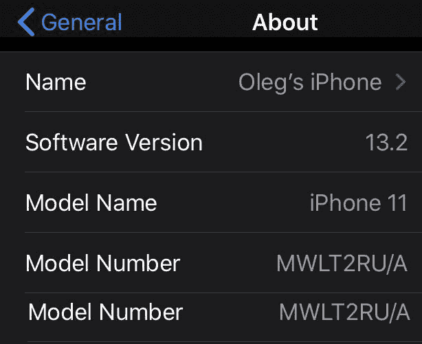
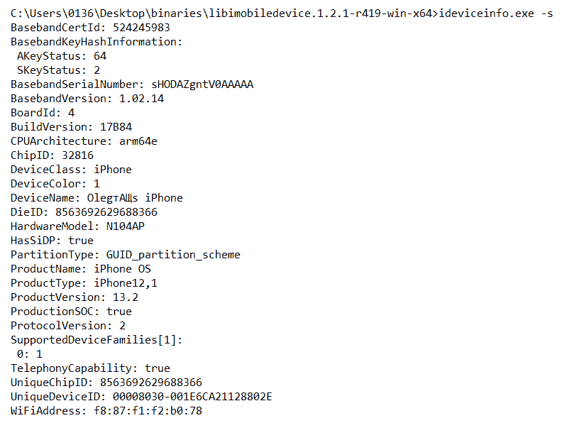
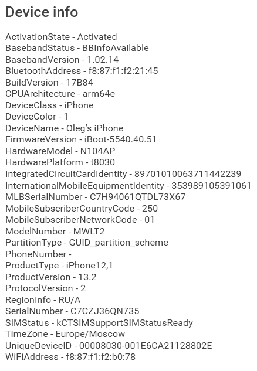
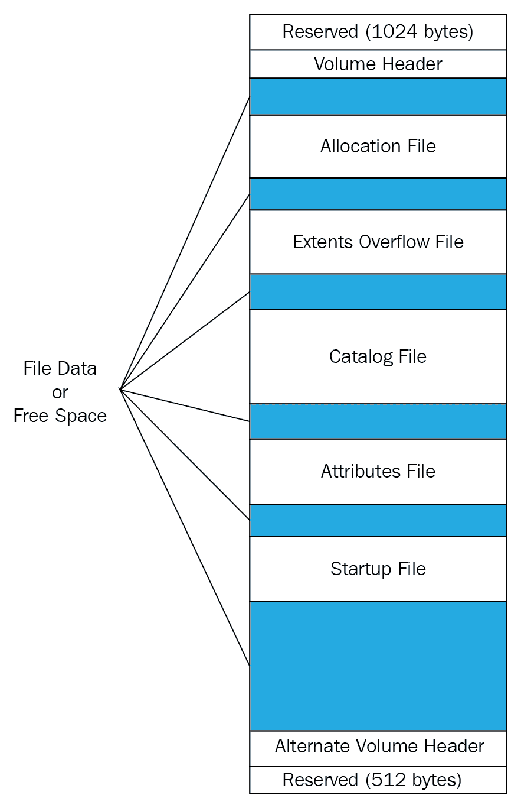
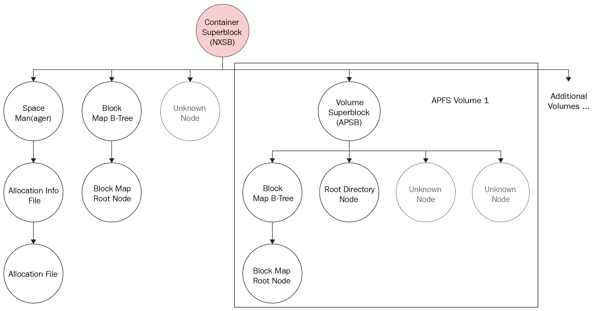
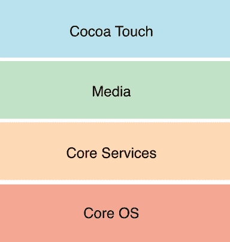
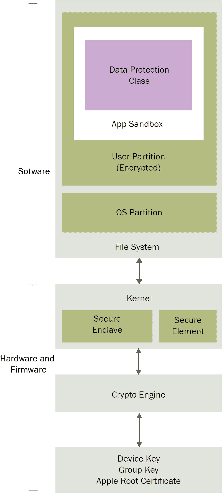

# 第三章：理解 iOS 设备的内部结构

根据苹果公司数据，2019 年活跃的苹果设备达到 14 亿部，其中 9 亿部运行 iOS。尽管 iOS 是全球平板电脑的主要**操作系统**（**OS**），但 Android 依然是智能手机的主导操作系统。不论统计数据如何，如果你是一名法医检查员，你很可能需要对 iOS 设备进行检查。

为了执行 iOS 设备的法医检查，作为检查员，你必须了解该设备的内部组件和内部工作原理。了解移动设备的基础组件将有助于你理解法医过程中的关键要素，包括可以获取哪些数据、数据存储的位置以及如何使用方法从该设备中访问数据。因此，在我们深入研究 iOS 设备检查之前，了解现有的不同型号及其内部组件是非常必要的。在本书中，我们将对 iOS 设备进行法医数据获取和分析，包括 iPhone、iPad 和 Apple Watch。

本章的目标是向你介绍 iOS 设备技术。我们将讨论一些常常被忽视的细节，但这些细节会在你的法医调查中提供帮助。在成功提取数据之前，你必须了解不同的 iOS 设备及其数据存储方式。

在本章中，我们将详细介绍以下主题：

+   iPhone 型号与硬件

+   iPad 型号与硬件

+   **分层文件系统**（**HFS**）Plus 和 **苹果文件系统**（**APFS**）文件系统

+   iPhone 操作系统

# iPhone 型号与硬件

iPhone 是市场上最受欢迎的智能手机之一。苹果公司于 2007 年 6 月发布了第一代 iPhone。自首次发布以来，iPhone 因其许多开创性的功能和易用性而变得极为流行。iPhone 的推出重新定义了整个移动计算世界。消费者开始寻求更快、更高效的手机。目前有多款 iPhone 型号，具备不同的功能和存储能力，以满足消费者的需求。

自 *《实用移动取证》第三版* 发布以来的 iPhone 型号——iPhone XR、XS、XS Max、11 和 11 Pro——在处理文件系统取证采集方法时可能会比较困难。就像自 iPhone 5 发布以来的设备一样，除非设备越狱，否则没有可用的方法或工具可以从这些设备中物理恢复数据。然而，如果 iPhone 已解锁，则可以进行逻辑采集。数据提取的采集方法将在 第三章 *iOS 设备的数据采集* 和 第四章 *iOS 备份的数据采集* 中讨论。现在，让我们学习如何识别正确的硬件型号。

# 识别正确的硬件型号

在检查 iPhone 之前，必须识别设备的正确硬件型号和安装的固件版本。了解 iPhone 的详细信息有助于你理解从 iPhone 获取证据的关键点和可能性。例如，在许多情况下，获取逻辑镜像需要设备的解锁密码。根据 iOS 版本、设备型号和密码复杂性，可能可以使用暴力破解攻击来获取设备的解锁密码。

有多种方法可以识别设备的硬件。识别某些设备硬件的最简单方法是观察设备背面的型号。为了让这项任务更简单，你可以使用 Apple 的知识库文章。有关 iPhone 型号的更多信息，请访问 [`support.apple.com/en-in/HT201296`](https://support.apple.com/en-in/HT201296)。

iPhone 的固件版本可以通过访问“设置”选项，然后依次进入“通用 | 关于本机 | 软件版本”找到，如下图所示。固件的目的是启用某些功能并协助设备的正常运行：



显示软件版本 13.2 的 iPhone 关于本机页面

另外，可以使用 `libimobiledevice` 软件库中提供的 `ideviceinfo` 命令行工具（[`www.libimobiledevice.org/`](http://www.libimobiledevice.org/)）来识别 iPhone 型号及其 iOS 版本。

在 Windows 10 工作站上获取 iPhone 型号及其 iOS 版本信息，请按照以下步骤操作：

1.  从以下链接下载最新的二进制文件：[`dev.azure.com/libimobiledevice-win32/imobiledevice-net/_build/results?buildId=419`](https://dev.azure.com/libimobiledevice-win32/imobiledevice-net/_build/results?buildId=419)（点击“Artifacts | Binaries”开始下载）。

1.  解压包含 x86 或 x64 二进制文件的归档，具体取决于工作站的版本。

1.  打开命令提示符并将目录切换到包含二进制文件的目录（使用 `cd` 命令）。

1.  使用 **Universal Serial Bus** (**USB**) 数据线将 iPhone 连接到你的工作站（对于最新的 iOS 版本，还需要输入密码），然后运行带有 `-s` 选项的 `ideviceinfo` 命令，如下所示：

```
$ ideviceinfo -s
```

`ideviceinfo` 命令的输出显示了 iPhone 的标识符、内部名称以及 iOS 版本，如下图所示：



ideviceinfo 输出显示固件版本 13.2

一些其他工具，如 iExplorer，也可以提供类似的 iOS 设备信息，如下图所示。恢复 iPhone 设备信息的方法也适用于 iPad 设备。在这里，iExplorer 被用来从 iPhone 获取设备信息：



iExplorer 显示设备信息

每一次 iPhone 的发布都带来了改进或新增的功能。正如本章前面所述，了解 iPhone 的详细信息有助于你理解如何从中获取证据的关键性和可能性。你必须知道设备的型号，以确保所部署的工具和方法支持该特定型号的 iPhone。此外，必须确定 iPhone 的内部存储大小，以确保证据容器足够大，可以存放整个取证镜像。大多数工具在证据驱动器没有足够的磁盘空间时，不会提醒你，直到空间用完为止。这将浪费时间并迫使你重新获取设备。最后，还必须注意设备的网络功能，以便你能够正确隔离设备，防止在检查过程中远程访问或清除数据。更多内容将在第三章，*iOS 设备数据获取*中进一步讨论。

再次强调，对 iPhone 设备硬件的基本了解将有助于你在进行取证调查时判断如何处理该设备。某些型号启用了全盘加密，而较旧的型号则没有。加密设备在获取过程中需要额外的步骤——即使能够访问的话。你必须为获取和分析阶段可能遇到的所有障碍做好准备。此外，了解 iPhone 的功能——包括初始和当前的 iOS 版本——会对你能够从设备恢复的数据产生影响。苹果在不同的 iOS 版本中存储数据的位置并不一致。因此，你必须知道设备首次使用时安装的原始版本，以确保取证工具不会忽视可能有助于调查的数据。

有关识别 iPhone 型号的更多信息，请访问 [`support.apple.com/en-us/HT201296`](https://support.apple.com/en-us/HT201296)。

# 理解 iPhone 硬件

iPhone 是由来自不同制造商的模块、芯片和电子组件组成的。由于 iPhone 的复杂性，硬件组件的列表非常庞大，每个设备都应研究其内部组件。

例如，iPhone 11 配备了 A13 仿生处理器；64 GB、128 GB 或 256 GB 存储；4 GB 内存；6.1 英寸液态视网膜**液晶显示屏**（**LCD**）；以及一个双镜头 12 MP 后置相机阵列。

所有 iPhone 的内部图像可以在[`www.ifixit.com/Device/iPhone`](https://www.ifixit.com/Device/iPhone)的拆解部分找到。

# iPad 型号与硬件

苹果 iPhone 改变了手机的生产和使用方式。同样，2010 年 1 月推出的 iPad——一种平板电脑版本——打击了笔记本电脑的销售。使用 iPad，个人可以拍摄视频、拍照、播放音乐、阅读书籍、浏览互联网以及做更多的事情。目前存在各种 iPad 型号——例如，iPad Air 3 和 iPad Pro——具有不同的功能和存储能力。有关如何识别 iPad 型号的更多信息，请访问[`support.apple.com/en-in/HT201471`](https://support.apple.com/en-in/HT201471)。

与 iPhone 一样，并非所有版本的 iPad 都支持文件系统获取。此外，苹果在 iOS 版本中改变了数据存储位置，这也影响了 iPad 设备。你必须了解不同的型号、发布和当前安装的 iOS 版本、存储能力、网络访问路径等。

# 理解 iPad 硬件

苹果 iOS 设备成功的关键因素之一是正确选择其硬件组件。就像 iPhone 一样，iPad 也是由来自不同厂商的模块、芯片和电子组件组成。所有 iPad 的内部图像可以在[`www.ifixit.com/Device/iPad`](https://www.ifixit.com/Device/iPad)的拆解部分找到。

# HFS Plus 和 APFS 文件系统

为了更好地理解 iOS 设备的取证过程，了解所使用的文件系统非常有用。最初，iPhone 和其他苹果 iOS 设备使用的文件系统是 HFSX。这是 HFS Plus 的一种变体，主要区别在于 HFSX 区分大小写，而 HFS Plus 则不区分大小写。其他差异将在本章稍后讨论。APFS 于 2016 年 6 月推出，作为 HFS Plus 的替代品，并在 iOS 10.3 发布时成为 iOS 设备的默认文件系统，macOS 10.13 发布时成为 macOS 设备的默认文件系统。

# HFS Plus 文件系统

1996 年，苹果公司开发了一个新的文件系统 HFS，以适应大数据集的存储。在 HFS 文件系统中，存储介质被表示为卷。HFS 卷被划分为 512 字节的逻辑块。逻辑块在给定卷上从第一个到最后一个编号，并且保持与物理块相同的大小——即 512 字节。这些逻辑块被分组为分配块，HFS 文件系统通过这些分配块来更高效地跟踪数据。HFS 使用 16 位的值来定位分配块，这使得分配块的数量限制为 65,535。为了克服磁盘空间分配效率低下以及 HFS 的一些限制，苹果公司推出了 HFS Plus 文件系统（[`dubeiko.com/development/FileSystems/HFSPLUS/tn1150.html`](http://dubeiko.com/development/FileSystems/HFSPLUS/tn1150.html)）。

HFS Plus 文件系统的设计旨在支持更大的文件大小。HFS 卷上的扇区通常为 512 字节。这些扇区组成了分配块。分配块的数量取决于卷的大小。HFS Plus 使用 32 位的块地址来定位分配块。HFS Plus 默认启用 *日志记录* 功能。日志记录是将每个事务写入磁盘的过程，这有助于防止文件系统损坏。HFS Plus 文件系统的主要特点包括以下几点：高效利用磁盘空间、支持文件名的 Unicode 编码、支持名称分叉、文件压缩、日志记录、动态调整大小、动态碎片整理，以及能够在 macOS 之外的操作系统上启动。

# HFS Plus 卷

HFS Plus 卷包含多个内部结构，用于管理数据的组织方式。这些结构包括头部、备用头部以及五个特殊文件：分配文件、扩展溢出文件、目录文件、属性文件和启动文件。在这五个文件中，三个文件（扩展溢出文件、目录文件和属性文件）使用 B 树结构。这是一种数据结构，允许数据高效地搜索、查看、修改或删除。HFS Plus 卷结构如以下图所示：



HFS Plus 卷结构

卷结构描述如下：

+   保留区（1024 字节）：此区域保留给引导加载程序信息。

+   **卷头部**：存储卷的信息，如分配块的大小、卷创建时的时间戳以及关于每个五个特殊文件的元数据。

+   **分配文件**：此文件用于跟踪系统中哪些分配块正在使用。文件格式为每个分配块占 1 位。如果该位被设置，则该块正在使用；如果未设置，则该块为空闲。

+   **扩展溢出文件**：该文件记录了在文件大小超过八个块时分配的分配块，帮助定位在引用时的实际数据。坏块也会在文件中记录。

+   **目录文件**：该文件包含关于文件和文件夹层次结构的信息，用于定位卷中的任何文件和文件夹。

+   **属性文件**：该文件包含内联数据属性记录、分支数据属性记录和扩展属性记录。

+   **启动文件**：该文件包含协助引导不支持 HFS Plus 的系统所需的信息。

+   替代卷头：这是卷头的备份，主要用于磁盘修复。

+   保留（512 字节）：这部分为 Apple 保留，在制造过程中使用。

接下来，让我们来看一下 APFS 文件系统。

# APFS 文件系统

APFS 是一个用于 iOS、macOS、tvOS 和 watchOS 的新文件系统。它是一个 64 位文件系统，支持在单个卷上存储超过 9 quintillion 个文件。以下是其主要功能列表：

+   **克隆**：这些是文件或目录的即时副本。修改内容会写入其他位置，并继续共享未修改的块；更改会作为克隆文件的增量进行保存。

+   **快照**：**时间点**（**PIT**）只读实例的文件系统。

+   **空间共享**：这允许多个文件系统共享物理卷上的相同底层空闲空间。

+   **加密**：有三种模式，具体如下：

    +   无加密

    +   单密钥加密

    +   使用每个文件的密钥进行的多密钥加密，并为敏感元数据提供单独的密钥。

根据硬件的不同，使用 **基于 AES-XTS 的高级加密标准 XEX 调整后的密码本模式，带有密文窃取**（**AES-XTS**）或 **高级加密标准-密码块链**（**AES-CBC**）加密模式。

+   **崩溃保护**：这是一种新颖的写时复制元数据方案；用于确保文件系统更新的崩溃保护。

+   **稀疏文件**：这些文件允许文件的逻辑大小大于它们在磁盘上占用的物理空间。

+   **快速目录大小计算**：它快速计算目录层次结构所占用的总空间，允许随着层次结构的发展进行更新。

# APFS 结构

因此，APFS 结构是在一个单一容器中，容器内可以包含一个或多个卷。以下图示展示了 APFS 结构：



APFS 结构概述

每个 APFS 文件系统结构都以一个块头开始。块头从一个校验和（使用 Fletcher 校验和算法）开始，用于整个块，并且还包含块的写时复制版本、块 ID 和块类型。

APFS 结构可以解释如下：

+   容器超级块包含块大小、块数量以及指向任务空间管理器的指针、所有卷的块 ID 和指向块映射 B 树的指针（B 树包含每个卷的条目以及其 ID 和偏移量）。

+   **节点**用于存储不同类型的条目。它们可以是 B 树的一部分，也可以独立存在，并且可以包含灵活大小或固定大小的条目。

+   空间管理器（Space Manager）管理 APFS 容器中已分配的块，存储空闲块的数量和指向分配信息文件的指针。

+   **分配信息文件**存储分配文件的长度、版本和偏移量。

+   **B 树**管理多个节点并包含根节点的偏移量。

+   **卷超级块**包含卷的名称、其 ID 和时间戳。

至于分配文件，它们是简单的位图，并没有块头和类型 ID。

# 磁盘布局

默认情况下，文件系统配置为两个逻辑磁盘分区：系统（根或固件）分区和用户数据分区。

系统分区包含操作系统及所有预加载的 iPhone 应用程序。系统分区在操作系统升级进行时或设备越狱时才会挂载为只读状态。该分区仅在设备进行固件升级时才会更新。在此过程中，iTunes 会格式化整个分区，但不会影响任何用户数据。系统分区仅占用少量存储空间，通常介于 0.8 GB 和 4 GB 之间，具体取决于 NAND 驱动器的大小。由于系统分区被设计为在 iPhone 的整个生命周期中保持在出厂状态，因此通常很少能从中获取有用的证据性信息。如果 iOS 设备被越狱，则可能有包含越狱和用户数据的信息文件驻留在系统分区中。越狱 iOS 设备允许用户获取 root 权限，但会使制造商的保修失效。本章后续将讨论越狱。

用户数据分区包含所有用户创建的数据，从音乐和联系人到第三方应用程序数据。用户数据分区占用了大部分 NAND 内存，并挂载到设备的`/private/var`目录。大多数证据性信息可以在此分区中找到。在文件系统获取过程中，应该捕获并保存用户数据分区的内容为`.tar`文件。获取的数据可以通过大多数商业移动取证工具轻松提取和解析。

# iPhone 操作系统

iOS 是苹果公司最先进、功能最丰富的专有移动操作系统。它随第一代 iPhone 发布。刚推出时，它被命名为 iPhone OS，后来为了反映所有苹果 iOS 设备（如 iPhone、iPod touch、iPad 和 Apple TV）统一的操作系统特点，改名为 iOS。iOS 源自核心的 OS X 技术，并经过简化，旨在为移动设备提供紧凑且高效的操作系统。

它利用多点触控界面，通过简单的手势来操作和控制设备，比如用手指在屏幕上滑动翻页，或者用捏合手势来缩放。简单来说，iOS 协助设备的基本功能运作。

# iOS 架构

iOS 是设备硬件组件和屏幕上的应用程序之间的中介。应用程序不会直接与底层硬件交互，而是通过一个明确的系统接口来与硬件交互，这样可以保护应用程序免受硬件变动的影响。这种抽象化使得在不同硬件能力的设备上构建应用变得更加容易。

iOS 架构由四层组成：Cocoa Touch 层、媒体层、核心服务层和核心操作系统层。每一层由多个框架构成，帮助构建应用程序，如下图所示：



iOS 层次

这些层可以描述如下：

+   **Cocoa Touch**：这一层包含开发 iOS 应用视觉界面所需的关键框架。该层的框架提供了基本的应用基础设施，并支持一些关键技术，如基于触摸的输入、多任务处理以及许多高级系统服务。

+   **媒体**：这一层提供图形、音频和视频框架，旨在创造出在移动设备上最优质的多媒体体验。该层的技术帮助开发者构建外观和声音俱佳的应用程序。

+   **核心服务**：这一层提供应用程序所需的基本系统服务。并非所有这些服务都会被开发者使用，虽然系统的许多部分都建立在这些服务之上。该层包含支持位置服务、iCloud 和社交媒体等技术。

+   **核心操作系统**：这一层是基础层，直接位于设备硬件之上。它处理低级功能，并提供如网络（**伯克利软件分发**（**BSD**）套接字）、内存管理、线程（**可移植操作系统接口**（**POSIX**）线程）、文件系统处理、外部配件访问和**进程间通信**（**IPC**）等服务。

现在我们已经了解了 iOS 架构，接下来让我们看看 iOS 安全性。

# iOS 安全

更新版的 iOS 已将安全性作为其核心设计。在最高层次，iOS 安全架构如下：



iOS 安全架构

苹果的 iOS 设备如 iPhone、iPad 和 iPod Touch 设计时就考虑了多层次的安全性。低级硬件特性可以防范恶意软件攻击，高级操作系统特性则防止未经授权的使用。接下来的章节将简要概述 iOS 安全功能。

# 密码、Touch ID 和 Face ID

密码限制未经授权的设备访问。一旦设置密码，每次打开或唤醒设备时，系统都会要求输入密码才能访问设备。iOS 设备支持简单和复杂密码。iOS 9 发布了使用六位数简单密码的选项，替代了传统的四位数密码选项。iPhone 5S 及以后的设备还支持 Touch ID 指纹作为密码，且可通过简单或复杂密码进行备份。iPhone X 及以后的设备支持一种新的生物识别锁定方式——Face ID，用户可以使用自己的面部特征作为密码。它甚至更安全，因为使用 Touch ID 解锁你的 iPhone 的概率是 1/50,000，而使用 Face ID 的概率是 1/1,000,000。

# 代码签名

代码签名防止用户下载和安装未经授权的应用程序。苹果公司对此做出了如下说明：

*“代码签名是您编译的 iOS 应用程序被密封并标识为您所有的过程。此外，iOS 设备不会运行未经过受信方签名的应用程序或加载库。为了确保所有应用来自已知且经过批准的来源且未被篡改，iOS 要求所有可执行代码必须使用苹果发布的证书进行签名。”*

# 沙盒

沙盒技术通过将应用程序放入一个严格限制的区域，减轻了代码执行后的利用风险。安装在 iOS 设备上的应用程序都处于沙盒环境中，一个应用程序不能访问另一个应用程序存储的数据。本质上，沙盒是一种强制实施精细控制的机制，限制应用程序对文件、网络资源、硬件等的访问。

# 加密

在 iOS 设备（从 iPhone 4 开始）上，整个文件系统使用一个由设备唯一硬件密钥计算得到的文件系统密钥进行加密。这个密钥存储在可清除存储区域，该区域位于设备的操作系统和硬件层之间。这就是**联合测试行动组**（**JTAG**）和芯片拆卸方法不适用于数据获取的原因，因为整个数据转储将被加密。

# 数据保护

数据保护旨在保护静态数据并使离线攻击变得困难。它允许应用程序利用用户的设备密码，并与设备硬件加密一起生成强加密密钥。之后，强加密密钥用于加密存储在磁盘上的数据。此密钥在设备锁定时保护数据免受未经授权的访问，因此即使设备被破解，关键信息也能得到保护。

# 地址空间布局随机化（ASLR）

地址空间布局随机化（ASLR）是一种在 iOS 4.3 中引入的漏洞缓解技术。ASLR 随机化应用程序对象在内存中的位置，使得利用内存损坏漏洞变得困难。

# 特权分离

iOS 运行时遵循**最小权限原则**（**PoLP**）。它包含两个用户角色：*root* 和 *mobile*。系统中最重要的进程以 root 用户权限运行。所有其他用户可以直接访问的应用程序，如浏览器和第三方应用程序，均以 mobile 用户权限运行。

# 栈破坏保护

栈破坏保护是一种漏洞缓解机制。它通过在缓冲区和栈上的控制数据之间放置一个随机且已知的值（称为栈金丝雀），来保护设备免受缓冲区溢出攻击。

# 数据执行防护（DEP）

数据执行防护（DEP）是一种漏洞缓解机制，处理器可以通过它区分内存中可执行代码的部分和数据部分。例如，在代码注入攻击中，攻击者试图注入一个向量并执行它。但 DEP 防止了这种情况，因为它将注入的部分识别为数据而非代码。

# 数据擦除

iOS 提供了“抹掉所有内容和设置”选项来擦除 iPhone 上的数据。此类数据擦除通过删除保护数据的加密密钥来擦除用户设置和信息。由于加密密钥被从设备中删除，因此无法恢复已删除的数据，甚至在法证调查过程中也无法恢复。还有其他擦除方法，它们通过覆盖设备内存中的数据来进行数据擦除。关于擦除的更多信息，可以访问[`support.apple.com/en-in/HT201274`](https://support.apple.com/en-in/HT201274)。

# 激活锁

激活锁，随着 iOS 7 的推出，是一种防盗机制，它通过利用“查找我的 iPhone”功能工作。当启用“查找我的 iPhone”时，它会启用激活锁，要求用户的 Apple ID 和密码才能关闭“查找我的 iPhone”、擦除设备以及重新激活设备。

# 应用商店

应用商店是 iOS 的一个应用程序分发平台，由 Apple 开发和维护。它是一个集中的在线商店，用户可以在其中浏览并下载免费和付费应用程序。这些应用程序扩展了移动设备的功能。截止到 2019 年第一季度，应用商店中已有 220 万个应用程序。

App Store 中的应用程序通常由第三方开发者编写。开发者使用 Xcode 和 iOS **软件开发工具包** (**SDK**) 来开发应用程序。之后，他们将应用程序提交给苹果进行审核。苹果会遵循一套严格的审核流程，检查应用是否符合公司的指南。如果苹果批准该应用，它将被发布到 App Store，用户可以下载或购买。严格的审核过程使得 App Store 不容易受到恶意软件的攻击，但并非 100%安全。

XcodeGhost，是一种感染了苹果 App Store 中 50 款应用程序的苹果恶意软件，首次在 2015 年 9 月被发现。这款恶意软件嵌入在 Xcode 中，使其更难被检测到，据报道已影响全球超过 5 亿用户。一旦被发现，苹果立即删除了这些感染的应用程序。

# 越狱

越狱是通过使用软件和硬件漏洞去除苹果移动操作系统（OS）所施加的限制的过程。越狱允许未签名的代码运行并获得操作系统的根权限。越狱的最常见原因是扩展苹果 App Store 所施加的有限功能集并安装未批准的应用程序。越狱有助于法医获取数据，但会使用户的保修失效，可能*导致设备变砖*，并且可能无法恢复到出厂设置。

如果你越狱了设备，最好假设它将永远处于越狱状态，并且保修不再有效。

许多公开的越狱工具会向设备添加一个非官方的应用程序安装器，例如 Cydia，它允许用户从在线文件库中安装许多第三方应用程序、工具、插件和应用。通过 Cydia 下载的软件为设备打开了无尽的可能性，而未越狱的设备则无法实现这些功能。最受欢迎的越狱工具包括 Pangu、TaiG、Electra 和 Unc0ver。并非所有 iOS 版本都可以越狱。下表将帮助您根据您的设备和 iOS 版本选择合适的越狱工具：

| **版本** | **发布日期** | **工具** |
| --- | --- | --- |
| iPhone OS 1.0 | 2007 年 6 月 29 日 | (无名称) |
| iPhone OS 2.0 | 2008 年 7 月 11 日 | PwnageTool |
| iPhone OS 3.0 | 2009 年 6 月 17 日 | PwnageTool |
| iOS 4.0 | 2010 年 6 月 21 日 | PwnageTool |
| iOS 5.0 | 2011 年 10 月 12 日 | redsn0w |
| iOS 6.0 | 2012 年 9 月 19 日 | redsn0w |
| iOS 7.0 - 7.0.6 | 2013 年 9 月 18 日 | evasi0n7 |
| iOS 7.1 - 7.1.2 | 2014 年 5 月 29 日 | Pangu |
| iOS 8.0 - 8.1 | 2014 年 9 月 17 日 | Pangu8 |
| iOS 8.1.1 - 8.4 | 2014 年 11 月 17 日 | TaiG, PP Jailbreak |
| iOS 8.4.1 | 2015 年 8 月 13 日 | EtasonJB |
| iOS 9.0 | 2015 年 9 月 16 日 | Pangu9 |
| iOS 9.1 | 2015 年 10 月 21 日 | Pangu9 |
| iOS 9.3.5 | 2016 年 8 月 25 日 | Phoenix |
| iOS 10.0 - 10.1.1 | 2016 年 9 月 13 日 | Yalu |
| iOS 11.0 - 11.1.2 | 2017 年 9 月 19 日 | LiberiOS |
| iOS 11.0 - 11.1.2 | 2017 年 9 月 19 日 | Electra1112 |
| iOS 11.0 - 11.4.1 | 2018 年 7 月 7 日 | Electra1131 |
| iOS 11.0 - 11.4.1 | 2018 年 10 月 14 日 | Unc0ver |
| iOS 12.0 - 12.2, 12.4 - 12.4.2 | 2019 年 9 月 17 日 | Chimera, Unc0ver |
| iOS 12.3 - 13.2.3 | 2019 年 11 月 10 日 | checkra1n |

我们现在已经了解了越狱过程，并且查看了当前可用的不同越狱工具。

# 概述

对 iOS 设备进行取证检查的第一步应该是识别设备型号。iOS 设备的型号可以帮助检查员了解设备的底层组件和功能，这些信息有助于制定获取数据和进行检查的方法。旧版 iOS 设备不应被忽视，因为它们可能会成为调查的一部分。你必须了解所有 iOS 设备，因为旧设备有时仍在使用，且可能与刑事调查有关。

下一章将提供一些工具，帮助从 iOS 设备中获取数据，以便进行后续的取证检查。并非所有工具都相同，因此了解哪些工具能有效完成任务非常重要。
