# 第四章：从 iOS 设备获取数据

从犯罪现场恢复的 iOS 设备可能是一个丰富的证据来源。想想看，智能手机对用户来说有多个人化；没有任何其他数字设备能比得上这一点。我们很少在离开家或者走出家门时没有将智能手机放在触手可及的地方。它几乎像是我们日常活动的日记，深入窥视人类最私密的方面。根据多个新闻报道，奥斯卡·皮斯托瑞斯的 iPad 被一名移动专家检查，并在他的审判中展示，显示他在女友去世前几小时的互联网活动。当 iOS 设备能够提供所谓的*铁证*时，作为检查员的你必须确保知道如何正确处理、采集和分析该设备。

有多种方法可以从 iOS 设备获取取证数据。尽管每种方法都有其优缺点，但任何采集方法的基本原则都是尽可能获取更多的数据。

本章将涵盖以下主题：

+   iOS 设备操作模式

+   密码保护和潜在的绕过方法

+   逻辑采集

+   文件系统采集

# iOS 设备的操作模式

在我们深入探讨取证技术和采集方法之前，了解 iOS 设备的不同操作模式非常重要。许多取证工具和方法要求将设备置于某一操作模式。理解 iOS 设备的操作模式是执行特定操作所必需的。

尽管大多数商业工具会演示如何将设备置于某种特定模式，你必须理解该模式代表的含义。iOS 设备能够运行在不同的操作模式下：正常模式、恢复模式和 **设备固件更新** (**DFU**) 模式。一些取证工具要求你知道设备当前使用的是哪种模式。本节将定义每种模式。

请注意，当提到 *iPhone* 时，应理解该说法适用于所有 iOS 设备。

# 正常模式

当 iPhone 开机时，它的操作系统会启动；这种模式称为正常模式。大多数常规活动（如拨打电话、发短信等）都会在正常模式下进行。

当 iPhone 开机时，内部会通过一个*安全启动链*，如下图所示。这在越狱设备上不会发生。启动过程中的每个步骤都包含由 Apple 加密签名的软件组件，以确保完整性：

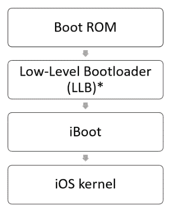

正常模式下 iPhone 的安全启动链

*启动 ROM 反过来验证低级引导加载程序（LLB）是否经过 Apple 签名，并将其加载。LLB 由启动 ROM 加载并验证，但这只在配备 A9 或更早版本 A 系列处理器的设备上发生。

*启动 ROM*，也叫 *安全 ROM*，是 **只读内存**（**ROM**），是 iPhone 上运行的第一段重要代码（[`www.apple.com/business/docs/iOS_Security_Guide.pdf`](https://www.apple.com/business/docs/iOS_Security_Guide.pdf)）。iOS 设备的启动过程定义在以下步骤中：

1.  启动 ROM 代码包含 Apple 根 **证书授权**（**CA**）公钥，用于验证下一阶段的签名，然后才允许其加载。

1.  当 iPhone 启动时，应用处理器执行来自启动 ROM 的代码。

1.  启动 ROM 会验证 **低级引导加载程序**（**LLB**）是否由 Apple 签名并加载它。LLB 会被启动 ROM 加载并验证，但这只会在配备 A9 或更早 A 系列处理器的设备上发生。

1.  当 LLB 完成其任务时，它会验证并加载第二阶段引导加载程序（iBoot）。iBoot 会验证并加载 iOS 内核。

1.  iOS 内核会验证并运行所有用户应用程序。

当 iOS 设备处于此状态时，可以通过取证获取用户可访问的一部分内容。最常见的包括逻辑获取，稍后将在本章中讨论。

# 恢复模式

在启动过程中，如果某一步无法加载或验证下一步，则启动会停止，iPhone 会显示以下屏幕：


iOS 设备恢复模式

此模式被称为恢复模式，并且在执行升级或恢复 iPhone 时是必需的。要进入恢复模式，请执行以下步骤：

1.  关闭设备。

1.  按住 iPhone Home 按钮，并通过 USB 数据线将设备连接到计算机。设备应该会开启。

1.  持续按住 Home 按钮，直到出现连接到 iTunes 的屏幕。然后，可以释放 Home 按钮（在越狱的 iOS 设备上，此屏幕可能会显示不同的图标）。大多数取证工具和提取方法会提醒您当前 iOS 设备的状态。

1.  要退出恢复模式，请重新启动 iPhone。在 iPhone 6s 及更早版本上，可以通过同时按住 Home 按钮和睡眠/电源按钮，直到出现 Apple 标志来完成。在 iPhone 7 和 iPhone 7 Plus 上，可以通过同时按住侧边按钮和音量下按钮来完成。对于 iPhone 8 及更新版本，您需要先按音量加按钮，再按音量减按钮，然后长按侧边按钮。

您可以在 [`support.apple.com/en-in/HT201263`](https://support.apple.com/en-in/HT201263) 阅读有关 iOS 设备恢复模式的更多信息。

通常，重启过程会将 iPhone 从恢复模式恢复到正常模式。相同的方法适用于 Apple Watch。你可能会遇到 iPhone 不断重启到恢复模式的情况，这被称为恢复循环。当用户或检查员尝试越狱 iOS 设备时，若发生错误，可能会出现恢复循环。要摆脱恢复循环，必须将设备连接到 iTunes，以便恢复备份到设备。

这会对证据造成更改，因此请确保在尝试使用这些方法处理真实证据之前，已在测试设备上验证过你的获取方法。

# DFU 模式

在启动过程中，如果 Boot ROM 无法加载或验证 LLB 或 iBoot（在较新的设备上），iPhone 将进入**设备固件升级**（**DFU**）模式。DFU 模式是一个低级诊断模式，旨在为 iPhone 执行固件升级。

要进入 DFU 模式，请按照以下步骤操作适用于 iPhone 8 及更高版本：

1.  使用 USB 数据线将设备连接到工作站。

1.  按下音量加大按钮并迅速释放。

1.  按下音量减小按钮并迅速释放。

1.  按住侧边按钮，再次按音量减小按钮。

1.  5 秒后，释放侧边按钮，但继续按住音量减小按钮，直到你看到恢复模式屏幕。

按照以下步骤操作适用于 iPhone 7：

1.  使用 USB 数据线将设备连接到工作站。

1.  同时按住侧边和音量减小按钮。

1.  释放侧边按钮，但继续按住音量减小按钮，直到你看到恢复模式屏幕。

按照以下步骤操作适用于 iPhone 6s 及更早版本：

1.  使用 USB 数据线将设备连接到工作站。

1.  同时按住主屏和顶部（或侧边）按钮。

1.  释放顶部（或侧边）按钮并继续按住主屏按钮。

对于 iPhone 6s 及更早版本，当设备处于 DFU 模式时，屏幕上不会显示任何内容。

在 macOS 上验证 iPhone 是否处于 DFU 模式时，启动系统报告并转到 USB 选项。你应该能看到类似以下截图的内容：

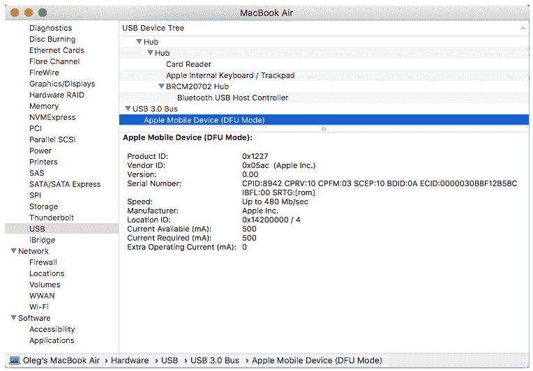

显示 DFU 模式设备的 MacBook 系统信息

接下来，我们将快速浏览设置取证环境所需的工具。

# 设置取证环境

如今，我们有一些工具可以供移动取证检查员使用，帮助在 macOS 和 Windows 系统主机上获取和分析 iOS 设备。例如，*Elcomsoft iOS Forensic Toolkit* 有 macOS 和 Windows 版本；至于免费和开源工具，`libimobiledevice` 库可以使用——不仅在 macOS 和 Windows 的取证工作站上，甚至在 Linux 上也可以使用！

我们将在本章后面介绍这些工具的使用，包括实践中的逻辑和文件系统获取，甚至越狱。但是让我们先从密码保护和可能的绕过方法开始，因为没有密码，我们无法从现代 iOS 设备中提取任何数据。

# 密码保护和潜在绕过方法

我们先从坏消息开始：如果你正在检查运行 iOS 8 或更高版本的 iPhone，特别是如果是较新的设备，比如 iPhone 6s，那么解锁的机会几乎为零。

当然，也有一些硬件解决方案，比如 IP-BOX 3，但它们都只能偶尔奏效，使用这些工具甚至可能导致设备变砖。随着 iOS 11 的发布，这个问题变得更加严重——即使检查的设备没有密码保护，你仍然需要输入密码，因为必须输入密码来确认设备与工作站之间的信任关系。

那么，移动取证专家该怎么办呢？使用锁定文件！这些锁定文件以`plist`文件的形式存储在*受信任的计算机*上，允许你欺骗设备，让它认为在取证工作站上已被解锁或*信任*。

锁定文件位于以下位置：

+   macOS 中的`/var/db/lockdown`

+   Windows 7 及更高版本中的`C:\ProgramData\Apple\Lockdown`

你必须知道，只有设备在上次重启后至少一次通过密码解锁，才能通过锁定文件解锁设备。

还有一些高级技术存在。包括通过指纹模具欺骗 Touch ID、通过面具欺骗 Face ID，以及通过 NAND 镜像绕过密码输入限制。

第一种技术最早由 Jason Chaikin 演示。他展示了如何通过用常见的模具材料（如牙科模具和橡皮泥）提取他人指纹，从而绕过 Touch ID。

第二种技术由越南网络安全公司 Bkav 作为概念验证进行了演示。他们创建了一种面具，利用三维打印、化妆和二维图像的组合，可以欺骗 Face ID 功能。

最后一种技术由剑桥计算机实验室安全小组的高级研究员 Sergei Skorobogatov 演示。这项技术通过焊接掉 iPhone 的闪存芯片并克隆它，绕过了密码输入限制。这项技术应该适用于任何 iOS 设备，直到 iPhone 6s Plus。

# 逻辑获取

逻辑获取捕获了用户可访问的部分内容；换句话说，就是包含在 iTunes 备份中的内容。这意味着我们无法获取任何已删除的文件，但得益于 SQLite 数据库的空闲列表和未分配空间，我们可以恢复已删除的记录，包括短信和其他聊天记录、浏览历史等。我们将在第五章中讨论恢复 SQLite 数据和已删除的证据，*iOS 数据分析与恢复*。

逻辑获取是确认设备是否解锁的最简单方式，因为它只是使用内置的备份机制。大多数支持 iOS 设备逻辑获取的工具和方法，如果设备被锁定，都会失败。有些人认为，如果捕获了物理镜像，就几乎不需要进行逻辑获取。然而，并不是所有数据都会在物理镜像中解析出来，这就是为什么获取逻辑镜像、获得可读数据能帮助你深入物理镜像，从中提取支持法医调查的证据。

逻辑获取是最快、最简单、最便宜的方式来获取存储在 iOS 设备上的数据。有各种工具，从商业工具到免费的工具，都能够捕获逻辑镜像。大多数这些工具要求设备已解锁，或者主机机器上可以轻松访问 `plist` 文件。

# 使用 libimobiledevice 进行实际的逻辑获取

理论掌握好是好事，但将其付诸实践更为重要。让我们使用 `libimobiledevice` 创建一个运行 iOS 13.2 的 iPhone 的逻辑镜像，它应该已经安装在你的工作站上，因为我们在上一章中使用它来收集设备信息。

好的，让我们开始：

1.  首先，让我们使备份加密。将 iOS 设备连接到工作站并启动命令提示符。将目录更改为包含 `libimobiledevice` 的目录，并输入以下命令：

```
idevicebackup2.exe backup encryption on <your_password>
```

1.  如果你看到“备份加密已成功启用”，那么你已经做对了，备份将会被加密。这将帮助你，作为法医检查员，获取更多关于用户密码、Safari 浏览历史等信息。

1.  现在是时候创建备份了——我们的 iOS 设备逻辑镜像。为此，请输入以下命令：

```
idevicebackup2 backup --full <the_folder_you_want_the_image_to_be_saved>
```

就是这样。你可以在下面的截图中看到逻辑成像的过程：

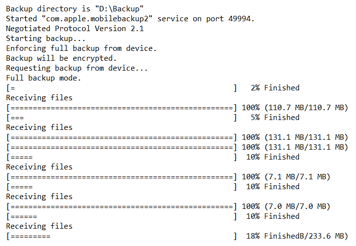

使用 libimobiledevice 进行 iPhone 逻辑成像

接下来，让我们看看如何使用 Belkasoft Acquisition Tool 进行逻辑获取。

# 使用 Belkasoft Acquisition Tool 进行实际的逻辑获取

由于逻辑获取是现代 iOS 设备最常见的选项，我们将演示如何使用更多免费的工具。第一个工具是 Belkasoft Acquisition Tool。这个工具不仅可以用于 iOS 设备获取，还可以用于硬盘，甚至是云数据。

让我们使用 Belkasoft Acquisition Tool 获取一台运行 iOS 13.2.3 的 iPhone：

1.  启动 Belkasoft Acquisition Tool 并选择移动设备选项：

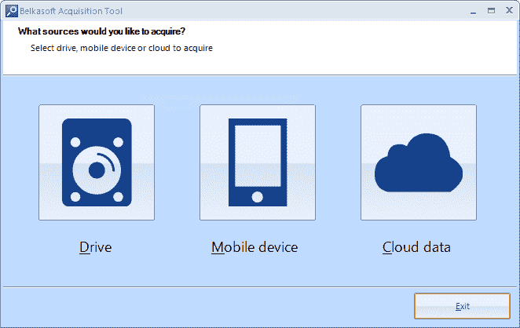

选择源

1.  在下一个窗口中，选择 Apple 选项：

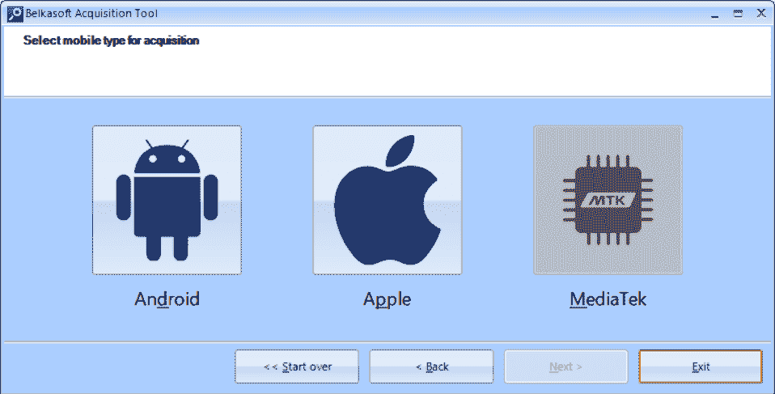

选择移动类型

1.  现在，选择获取方法和图像路径：

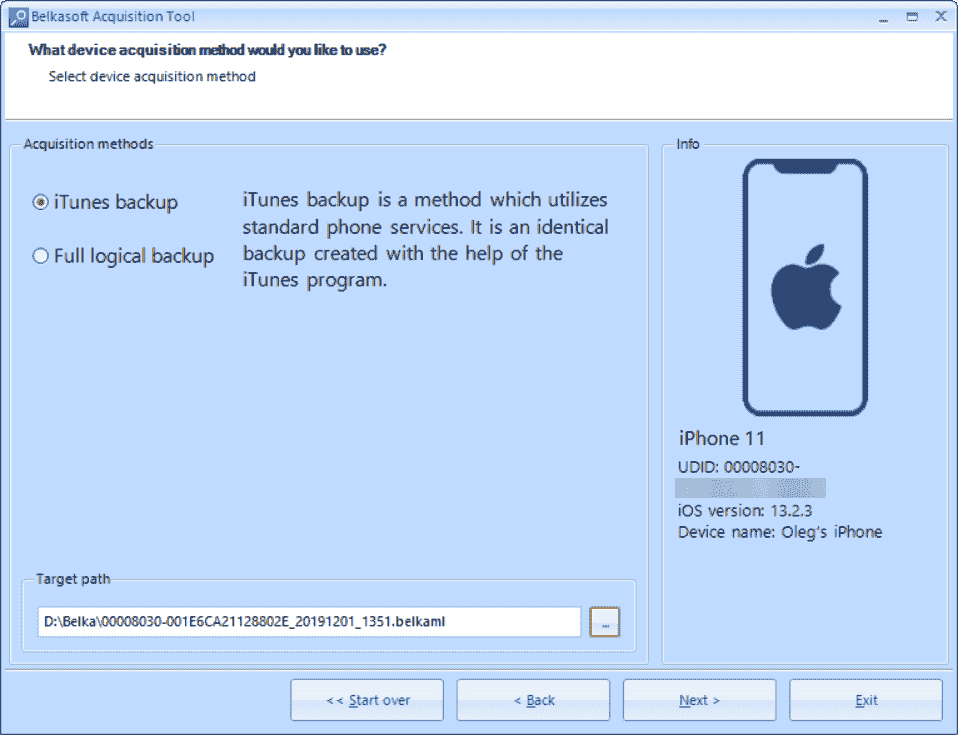

选择获取方法

该工具能够在设备未越狱的情况下创建 iTunes 备份，在设备越狱的情况下执行文件系统提取。

1.  等待任务成功完成。你将找到设备的逻辑镜像文件，保存在你在上一步中选择的文件夹里：

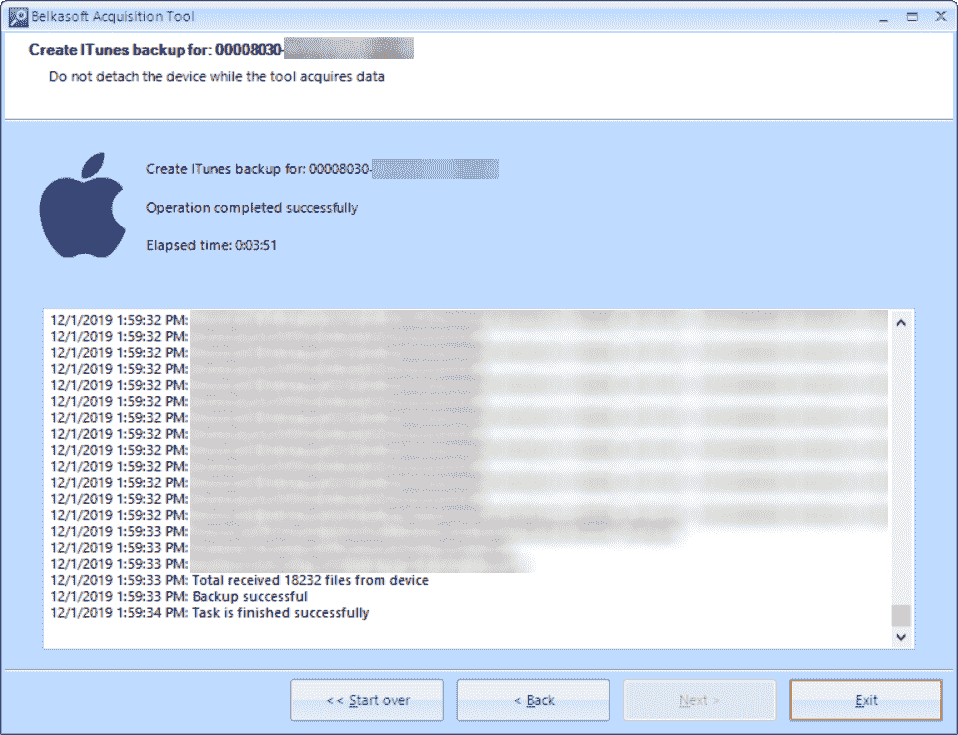

创建备份

备份可以通过 Belkasoft Evidence Center 以及许多其他移动取证工具进行分析。

# 使用 Magnet ACQUIRE 进行实际的逻辑获取

另一个免费工具，Magnet Forensics 的**ACQUIRE**，也能进行逻辑获取。让我们再次进行逻辑获取，这次使用运行 iOS 12.2 的设备：

1.  启动 Magnet ACQUIRE 并从列表中选择你想要获取镜像的设备：

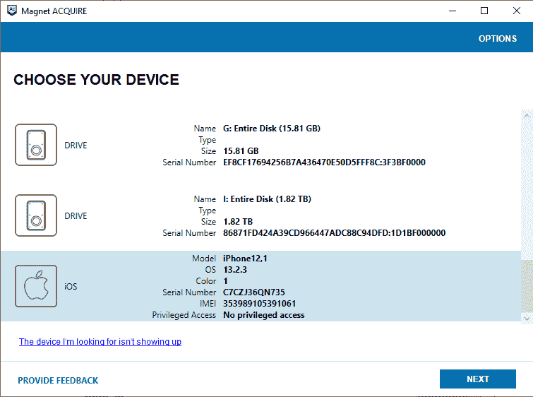

选择设备

1.  选择你想要获取的图像类型。我们想要获取逻辑图像，并且我们的设备没有越狱，所以我们将选择 Quick 选项：

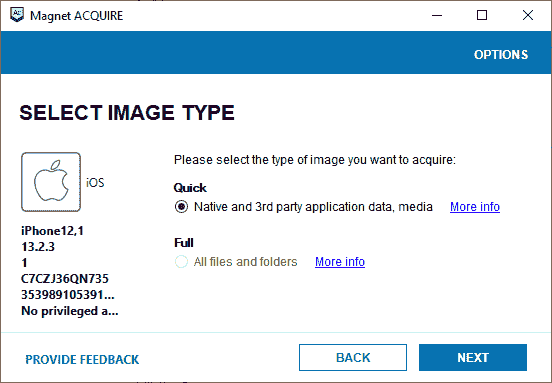

选择图像类型

1.  如果需要，你可以添加证据源的描述，并选择你希望保存图像的文件夹：

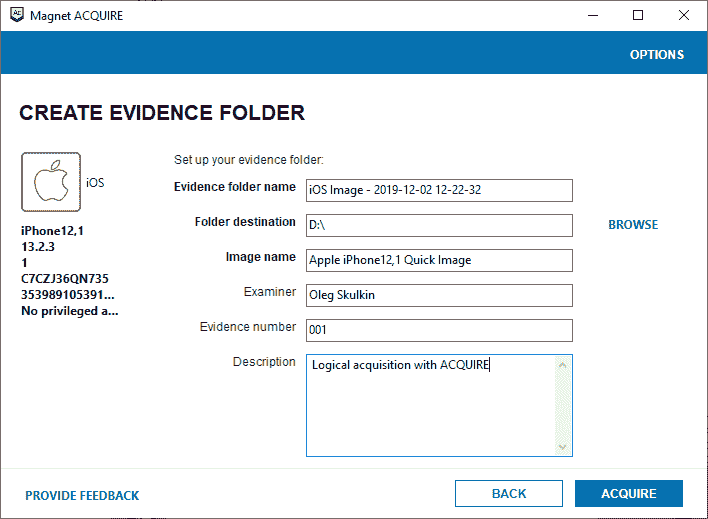

选择目标文件夹、图像名称和图像信息

1.  等待任务成功完成；你将看到获取过程的总结：

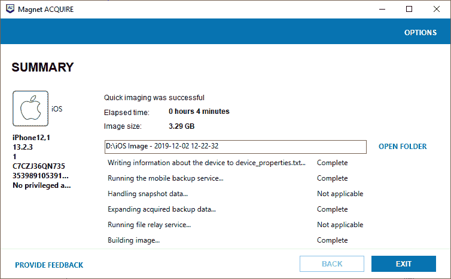

创建镜像

所有提取的数据将保存在目标文件夹中的 ZIP 归档文件中。此外，目标文件夹将包含一个 TXT 文件，其中包含获取过程的日志和图像信息。

下一部分将指导你如何进行越狱和文件系统获取。

# 文件系统获取

Secure Enclave 为 iOS 取证专家带来了新的挑战。我们无法提取解密设备镜像所需的加密密钥，因此执行物理获取是无效的。但仍有文件系统获取。遗憾的是，在大多数情况下，这需要 iOS 设备越狱。接下来的章节将向你展示如何使用 Electra 对运行 iOS 11.4.1 的 iPhone 进行越狱，并使用 Checkra1n 对运行 iOS 13.2 的 iPhone 进行越狱。

# 实际的越狱操作

要执行文件系统获取，我们需要将 iOS 设备进行越狱。以下是越狱 iOS 11.4.1 设备的步骤：

1.  从以下链接下载`Electra`：[`github.com/coolstar/electra-ipas/raw/master/Electra1141-1.3.2.ipa`](https://github.com/coolstar/electra-ipas/raw/master/Electra1141-1.3.2.ipa)。

1.  下载`Cydia Impactor`（[`www.cydiaimpactor.com/`](http://www.cydiaimpactor.com/)），运行它并将设备连接到你的工作站：

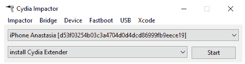

运行 Cydia Impactor

1.  将`Electra IPA`文件拖放到`Cydia Impactor`窗口中。

1.  在新窗口中输入任何 Apple ID（你可以为每个检查的设备注册一个新的 Apple ID）。

1.  使用此 Apple ID 登录 [`appleid.apple.com/`](https://appleid.apple.com/) 并在安全部分生成一个应用专用密码。将此密码粘贴到下一个窗口中。等待过程完成。

1.  在手机上，进入 设置 | 通用 | 设备管理 | Apple ID 并点击信任：

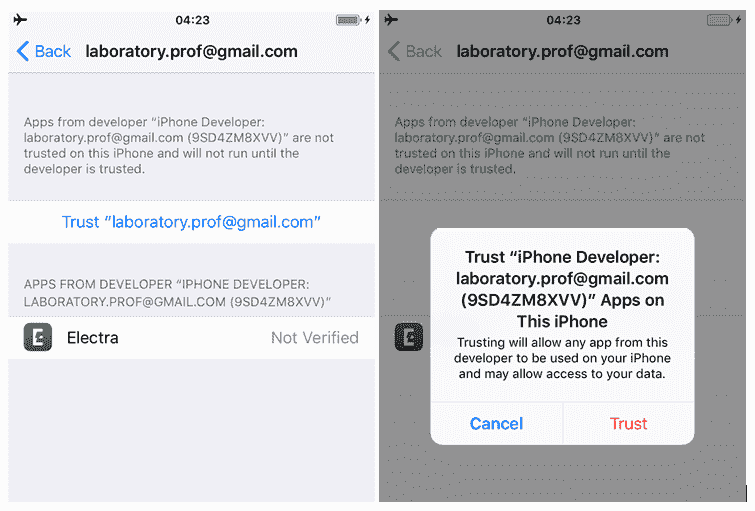

验证开发者

1.  将手机置于飞行模式，关闭 Siri，然后重启设备。

1.  在主屏幕上点击 Electra 图标，然后选择越狱。如果过程成功完成，你将在主屏幕上看到 Cydia 图标：

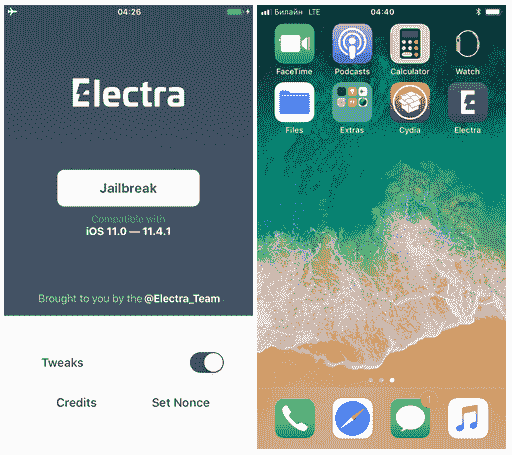

越狱设备

现在，手机已经越狱，可以进行文件系统获取了。

`Checkra1n`基于 bootrom 漏洞和利用，支持广泛的 iOS 设备，甚至包括运行最新（截至写作时）的 iOS 13.2 的设备。以下是越狱运行 13.2 的 iOS 设备的步骤：

1.  从 [`checkra.in/`](https://checkra.in/) 下载 `Checkra1n`。

1.  运行应用程序。写作时，`Checkra1n`仅适用于 macOS。

1.  连接设备并将其置于 DFU 模式：

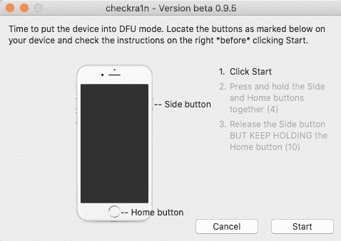

将设备置于 DFU 模式

1.  等待利用过程完成：

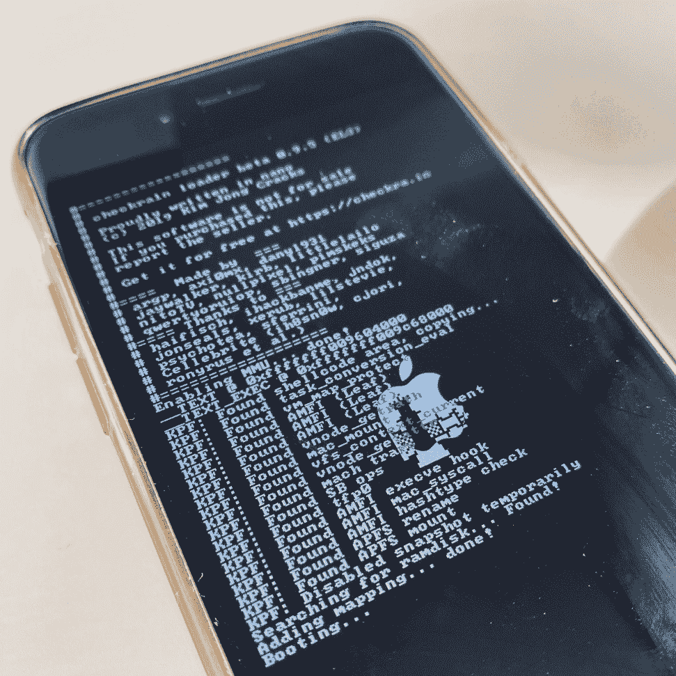

利用过程

一旦设备重新启动，你将在主屏幕上看到 checkra1n 图标——设备现在已经越狱，并准备好进行文件系统获取。

如需更多越狱技术，请参考第二章中的*越狱*部分，*理解 iOS 设备的内部结构*。

# 使用免费工具进行实用的文件系统获取

现在是进行文件系统获取的时候了。我们只需要`libimobiledevice`中的`iproxy`：

1.  打开命令提示符窗口，并使用以下参数运行`iproxy`：

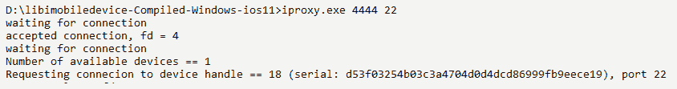

1.  打开另一个命令提示符窗口，切换到你希望存储镜像的目录，并运行以下命令：

```
ssh root@127.0.0.1 -p 4444 "tar -cf - /private/var/" > userdata.tar
```

通过 SSH 连接时，会提示输入必要的密码。SSH 的默认密码是 *alpine*。

一旦过程完成，你将在之前切换的目录中找到创建的文件系统镜像。它是一个 TAR 压缩文件，可以使用许多压缩软件（如 7-Zip）打开。

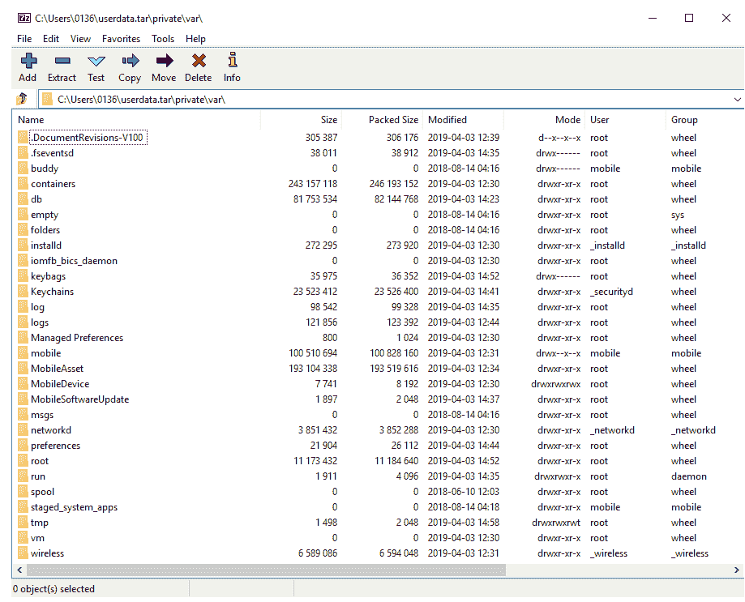

文件系统镜像内容

接下来，我们来看一下*Elcomsoft iOS 取证工具包*。

# 使用 Elcomsoft iOS Forensic Toolkit 进行实际的文件系统获取

当然，商业工具更加稳定和可靠。能够进行文件系统获取的工具之一是 Elcomsoft iOS Forensic Toolkit。在这里，我们将获取一台运行 iOS 12.4.3 的越狱 iOS 设备。

执行此操作的步骤如下：

1.  将设备连接到工作站并启动 `Toolkit.cmd`。

1.  选择用于 SSH 连接的端口（默认是 `22`，但由于我们使用了 checkra1n 越狱，端口改为 `44`），然后输入密码（默认是 `alpine`）：

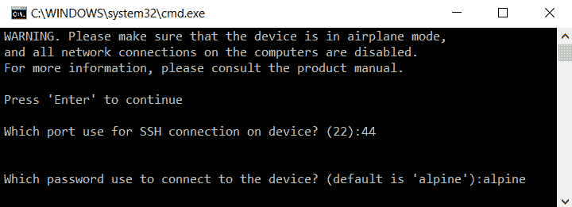

1.  要获取设备的文件系统，请输入 *F*：

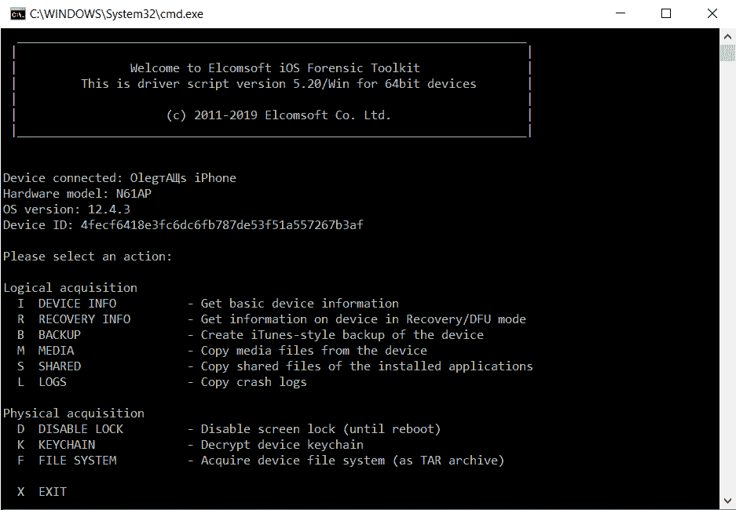

1.  选择镜像名称并启动该过程。

一旦过程完成，我们将拥有一个文件系统镜像，可以用我们选择的移动法医工具进行分析。

# 摘要

iOS 设备法医检查的第一步是从设备中获取数据。有几种不同的方法可以从 iOS 设备获取数据。本章涵盖了逻辑和文件系统获取技术，以及越狱和绕过密码的相关方法。

虽然文件系统获取是法医学上从 iOS 设备中获取大部分数据的最佳方法，但备份文件可能存在，或者可能是从设备提取数据的唯一方法。

下一章将详细讨论 iOS 设备的备份文件，包括用户、法医、加密和 iCloud 备份文件，以及您可以执行的法医学检查方法。
