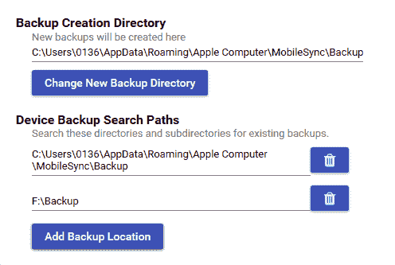

# 第五章：从 iOS 备份中获取数据

在上一章中，我们介绍了从 iOS 设备获取数据的技术，包括逻辑和文件系统获取。本章介绍了如何使用 Apple 的同步协议，将设备上的文件备份到计算机或 iCloud 的技术。

对 iOS 设备的物理获取在调查中提供了最多的数据，但你也可以在 iOS 备份中找到大量信息。iOS 设备用户有几种方式备份他们设备上的数据。用户可以选择将数据备份到他们的计算机，使用 Apple iTunes 软件，或备份到 Apple 的云存储服务 iCloud。每次 iPhone 与计算机或 iCloud 同步时，它都会通过复制设备中选择的文件来创建备份。用户可以确定备份中包含的内容，因此有些备份可能比其他备份更为全面。此外，用户还可以同时备份到计算机和 iCloud，每个位置的备份数据可能会有所不同。这通常是由于 iCloud 免费存储的限制。用户可能仅将照片和联系人备份到 iCloud，但可能会将所有数据的完整备份备份到计算机。如前所述，物理获取提供了对 iOS 设备上所有数据的最佳访问权限；然而，备份可能是唯一可用的数字证据来源，尤其是当我们处理最新的 iOS 设备时。

在本章中，我们将涵盖以下主题：

+   使用 iTunes 备份

+   创建并分析 iTunes 备份

+   提取未加密的备份

+   处理加密的备份文件

+   使用 iCloud 备份

# 使用 iTunes 备份

在任何之前与 iOS 设备同步过的计算机上，都存储着大量信息。这些计算机通常被称为主机计算机，可能包含历史数据和密码绕过证书。在刑事调查中，可以通过搜索令状来扣押属于嫌疑人的计算机，从而访问备份和锁定证书。对于其他所有情况，需要获得同意或合法的访问权限。iOS 备份文件取证主要涉及分析由 iPhone 或 iPad 创建的离线备份。Apple Watch 的数据将包含在与其同步的 iPhone 备份中。

iTunes 备份方法在其他获取类型不可行的情况下也非常有用。在这种情况下，你实际上是创建了设备的 iTunes 备份，并使用取证软件进行分析。因此，了解备份过程和涉及的工具非常重要，以确保工具能够在不污染设备上其他现有数据的情况下创建取证备份。

可以使用 iTunes 软件创建 iPhone 备份文件，iTunes 适用于 macOS 和 Windows 平台。iTunes 是 Apple 提供的免费工具，用于在 iOS 设备和计算机之间同步和管理数据。iTunes 使用 Apple 的专有同步协议将数据从 iOS 设备复制到计算机。例如，可以使用数据线或 Wi-Fi 将 iPhone 与计算机同步。iTunes 提供了加密备份的选项，但默认情况下，每当 iPhone 同步时，它会创建一个未加密的备份。加密备份一旦破解，会提供对 iOS 设备上存储的数据的额外访问权限。此部分将在本章后面讨论。

用户通常会创建备份文件以保护数据，以防设备损坏或丢失。可以创建法医备份作为最佳证据，或者从现有的 iOS 备份文件中提取数据以搜索遗留信息。例如，如果你正在接受调查并删除了文件或擦除了 iPhone，你在 iCloud 和 Mac 上的备份文件依然存在。根据使用的是 iTunes 还是 iCloud，可能会有多个同一设备的备份。你必须对每个备份进行法医分析，以揭示与调查相关的痕迹。

iTunes 配置为在 iOS 设备连接到计算机后自动启动同步过程。为避免 iOS 设备与计算机之间发生无意的数据交换，请在将证据连接到法医工作站之前禁用自动同步功能。以下流程的*第 2 步*截图展示了在 iTunes 版本 12.9.4.102 中禁用自动同步的选项。

要禁用 iTunes 中的自动同步，请执行以下步骤：

1.  转到 编辑 | 偏好设置 | 设备。

1.  选中“防止 iPod、iPhone 和 iPad 自动同步”并点击确定按钮，如下截图所示：


禁用 iTunes 中的自动同步

1.  如前述截图所示，iOS 备份文件存在于系统中。如果这是一个法医工作站，这些备份文件将不会存在，或者会被永久删除，以防止交叉污染。

1.  一旦验证同步设置，使用**通用串行总线**（**USB**）数据线将 iOS 设备连接到计算机。如果连接的设备没有设置密码保护，或者它最近已连接到计算机，iTunes 会立即识别设备；否则，你将需要输入密码。这可以通过 iTunes 界面左侧显示的 iPhone 图标进行验证，如以下截图所示：


一个被 iTunes 识别的 iPhone

1.  在 iTunes 可以访问 iPhone 之前，你必须启用计算机和手机之间的信任。系统会提示你在计算机上点击“继续”（如下面的截图所示），并在 iPhone 上选择“信任”。在 iOS 11 中，你还必须输入设备的密码：


iTunes 提示访问权限

1.  一旦 iTunes 识别到设备，单击 iPhone 图标即可显示 iPhone 概要，包括 iPhone 的名称、容量、固件版本、序列号、可用空间和电话号码。iPhone 概要页面还显示了创建备份的选项。创建备份的过程将在以下部分进行讨论。

现在，我们准备开始备份设备。接下来的部分将引导你完成这个过程。

# 使用 iTunes 创建和分析备份

在这一部分，我们将引导你通过使用 Apple iTunes 来备份 iOS 设备。我们使用的是 iTunes 版本 12.10.2.3 和运行 iOS 13.2 版本的 iPhone。请执行以下步骤：

1.  连接设备并点击 iTunes 界面左侧显示的 iPhone 图标。

1.  进入备份部分，你可以选择备份目标（本地计算机或 iCloud），并选择是否加密，如下图所示：


iTunes 备份部分

加密的 iTunes 备份包含未加密备份没有的数据，包括密码、Wi-Fi 设置和网页浏览历史，因此确保你创建了加密备份以供取证使用。

1.  点击“立即备份”按钮并等待过程完成。完成后，最新的备份日期和时间将被更新。

如果你想使用 iTunes 并将备份保存到外部驱动器，按照以下说明操作（我们使用的是 iTunes 版本 12.10.2.3 和 Windows 10）：

1.  重命名原始备份文件夹。

1.  连接外部驱动器并在其上创建一个备份文件夹。

1.  打开命令提示符并输入以下命令：

```
mklink /J "C:\Users\<username>\AppData\Roaming\Apple Computer\MobileSync\Backup" "f:\Backup"
```

1.  现在，你可以创建一个常规的本地备份，并将其保存到外部驱动器中。

现在，我们已经准备好备份进行进一步分析。让我们深入了解其结构。

# 理解备份结构

当 iPhone 备份到计算机时，备份文件会存储在备份目录中，该目录以 40 个字符的十六进制字符串存在，并与设备的**唯一设备标识符**（**UDID**）对应。最新的设备已经更改了 UDID 格式——现在是 24 个字符的字符串，因此它们的备份名称也相应改变。备份过程可能需要相当长的时间，具体取决于第一次备份时 iPhone 上存储的数据大小。备份目录的位置取决于计算机的操作系统。以下表格列出了常见操作系统及其 iTunes 备份目录的默认位置：

| **操作系统** | **备份目录位置** |
| --- | --- |
| Windows XP | `C:\Documents and Settings\<username>\Application Data\Apple Computer\MobileSync\Backup\` |
| Windows Vista/7/8/10 | `C:\Users\<username>\AppData\Roaming\Apple Computer\MobileSync\Backup\` |
| macOS | `~/Library/Application Support/MobileSync/Backup/`（`~`代表主文件夹） |

在第一次同步时，iTunes 会创建一个备份目录并进行设备的完整备份。目前，在后续的同步中，iTunes 只会备份设备上修改的文件并更新现有的备份目录。过去并非如此，因为每次 iOS 设备备份时，都会创建一个新的备份。此外，当设备更新或恢复时，iTunes 会自动启动备份并执行*增量备份*。增量备份与备份目录具有相同的名称，但会附加一个破折号（`-`）、备份的**国际标准化组织**（**ISO**）日期、另一个破折号（`-`），以及 24 小时格式带秒的时间（`[UDID]+ '-' + [Date]+'-'+[Time stamp]`）。

iTunes 备份可能会对设备上的所有内容进行备份，包括联系人、**短消息服务**（**SMS**）消息、照片、日历、音乐、通话记录、配置文件、文档、钥匙串、网络设置、离线网页应用缓存、书签、cookies、应用数据（如果选中），以及更多内容。例如，如果备份未加密，则电子邮件和密码将不会被提取。备份还包含设备的详细信息，如序列号、UDID、**订户身份模块**（**SIM**）信息和电话号码。这些信息也可以用来证明备份与移动设备之间的关联。

备份目录包含四个标准文件，以及独立文件（直到 iOS 9）或文件夹（iOS 10 及更高版本）。在 iOS 9 之前，这四个文件分别是`info.plist`、`manifest.plist`、`status.plist`和`manifest.mbdb`，但从 iOS 10 开始，以下是标准文件：

+   `info.plist`

+   `manifest.plist`

+   `status.plist`

+   `manifest.db`

这些文件存储有关备份及其来源设备的详细信息。

# info.plist

`info.plist`文件存储有关备份设备的详细信息，通常包含以下信息：

+   `Applications`：这是设备上安装的应用程序列表。

+   `Build version`：这是 iOS 的构建版本号。

+   `Device name and display name`：这是设备的名称，通常包括所有者的名字。

+   `GUID`：这是设备的**全局唯一标识符**（**GUID**）。

+   `ICCID`：这是**集成电路卡标识符**（**ICCID**），它是 SIM 卡的序列号。

+   `IMEI`：这是**国际移动设备身份码**（**IMEI**），用于唯一标识移动电话。

+   `Installed Applications`：这是已安装应用程序的列表。

+   `Last backup date`：这是上次成功备份的时间戳。

+   `MEID`：这是设备的**移动设备识别码**（**MEID**）。

+   `Phone Number`：这是备份时设备的电话号码。

+   `Product Name`：这是设备的名称（例如，iPhone X）。

+   `Product type and product version`：这是设备的型号和固件版本。

+   `Serial Number`：这是设备的序列号。

+   `Target Identifier and Unique Identifier`：这是设备的 UDID。

+   `iTunes Files`：此项包含有关照片、文件夹、语音备忘录和 iTunes 偏好的信息。

+   `iTunes Settings`：此项包含关于已删除应用程序和应用程序库的信息。

+   `iTunes version`：这是用于创建备份的 iTunes 版本。

现在我们来看一下`manifest.plist`文件。

# manifest.plist

`manifest.plist`文件描述了备份的内容，通常包含以下信息：

+   `Backup keybag`：`Backup keybag`包含一组数据保护类密钥，这些密钥不同于`System keybag`中的密钥，备份数据会使用新的类密钥进行重新加密。`Backup keybag`中的密钥有助于以安全的方式存储备份。

+   `Version`：这是备份的版本。

+   `Date`：这是创建或最后更新备份的时间戳。

+   `ManifestKey`：这是用于加密`manifest.db`的密钥（采用保护级别 4 进行包装）。

+   `WasPasscodeSet`：此项标识设备上次同步时是否设置了密码。

+   `Lockdown`：此项包含设备详细信息、上次备份计算机的名称及其他远程同步配置。

+   `Applications`：这是备份设备上安装的第三方应用程序列表，包括版本号和包标识符。

+   `IsEncrypted`：此项标识备份是否加密。对于加密备份，值为`True`；否则为`False`。

接下来，我们将查看`status.plist`文件。

# status.plist

`status.plist`文件存储有关备份状态的详细信息，通常包含以下信息：

+   `IsFullBackup`：此项标识备份是否为设备的完整备份。

+   `UUID`：这是设备的 UUID。

+   `Date`：这是备份最后一次修改的时间戳。

+   `BackupState`：这标识备份是新的还是已更新的备份。

+   `SnapshotState`：这标识备份过程是否已经成功完成。

现在，我们将查看`manifest.db`文件。

# manifest.db

`manifest.db`是一个 SQLite 数据库，包含了通过备份机制从 iPhone 提取的所有文件和文件夹的列表。该数据库的`Files`表包括以下字段：

+   `fileID`：这是**安全哈希算法 1**（**SHA1**）对域名的哈希值，再加上`-`符号和文件或文件夹的相对路径。例如，`ae94e0607ca39a88c18aca095cb5b4f8471291a0`是`CameraRollDomain-Media/PhotoData/Thumbnails/V2/DCIM/102APPLE`的 SHA1 哈希值。

+   `domain`：这是文件或文件夹所属的域（iOS 中的所有文件被划分为多个域，例如`CameraRollDomain`和`HomeDomain`）。

+   `relativePath`：这是文件（包括文件名）或文件夹的相对路径。

+   `flags`：这些是文件标志。

+   `file`：这是一个嵌入的`.plist`文件。这些`.plist`文件包含了许多重要信息，包括但不限于：

    +   `LastModified`：这是文件的最后修改时间戳，采用 Unix 格式。

    +   `Birth`：这是文件的创建时间戳，采用 Unix 格式。字段如下面的截图所示：


manifest.db 内容

你可以使用例如**DB Browser for SQLite**（**DB4S**）这样的工具轻松导出这个嵌入的`.plist`二进制文件。操作步骤如下：

1.  使用**打开数据库**按钮打开`manifest.db`。

1.  转到**浏览数据**标签页。

1.  点击文件列中的一个单元格。

1.  在**编辑数据库单元格**面板中，使用**导出**按钮将数据保存为`.plist`文件，如下方截图所示：


使用**DB4S**导出嵌入的.plist 文件

自 iOS 10 以来，文件不再以 40 字符的十六进制字符串命名。相反，你会看到一系列以 2 字符的十六进制字符串命名的文件夹，这些文件夹包含你在早期版本中看到的文件，如下面的截图所示：


iPhone 备份文件

现在你已经了解了备份结构，接下来我们学习如何从中提取有价值的数据。

# 提取未加密的备份

有许多免费的和商业的工具可以用来分析未加密备份中的数据。这些工具分析`manifest.db`数据库，恢复文件名，并创建用户在 iOS 设备上看到的文件结构。一些流行的工具包括 iBackup Viewer、iExplorer，以及商业取证工具，如 Belkasoft Evidence Center、Magnet AXIOM 和 UFED Physical Analyzer。

# iBackup Viewer

iBackup Viewer 是一款免费的工具，支持 Windows 和 macOS，可以从 [`www.imactools.com/iphonebackupviewer/`](http://www.imactools.com/iphonebackupviewer/) 下载。

该工具默认期望备份位于默认位置，但您可以将其更改为您选择的位置——例如，外部硬盘。

要提取备份，请按照以下步骤操作：

1.  如果您想分析的备份没有保存在默认位置，请点击主屏幕上的首选项超链接，并选择正确的位置，如以下截图所示：


选择备份位置

1.  您将在您选择的位置看到可用的备份。点击您想要检查的备份。

您将看到可用的潜在证据源，包括联系人、通话历史记录、消息、日历、笔记、语音邮件和浏览历史，如以下截图所示：


潜在证据源

1.  需要注意的是，您可以使用原始数据模式（上一个截图中的最后一个图标）将备份浏览为文件系统，如以下截图所示：


原始数据模式

借助这个工具，您可以轻松查看和导出感兴趣的文件。当然，这不是唯一能解决此类任务的工具。让我们再看一个——iExplorer。

# iExplorer

iExplorer 提供免费的版本，您可以从 [`macroplant.com/iexplorer`](https://macroplant.com/iexplorer) 下载。此工具支持 Windows 和 macOS，也可以浏览 iTunes 备份。以下是如何使用它：

1.  启动 iExplorer 并点击浏览 iTunes 备份。

1.  若要从自定义位置添加备份，请点击添加/修改备份位置。

1.  现在，点击添加备份位置按钮并选择路径，如以下截图所示：



添加自定义路径

1.  现在，来自自定义位置的备份应该可用。

另外，还有一个有趣的选项——iExplorer 可以为您收集 SQLite 数据库。为此，请点击原始数据库按钮，进入以下屏幕（您将在接下来的章节中了解更多关于 SQLite 法医的数据）：


iExplorer 原始数据库选项

您还可以通过 iExplorer 将备份浏览为文件和文件夹列表；为此，请使用左侧面板。您也可以使用备份浏览器按钮，然后使用主面板来浏览备份。

如您所见，有足够的工具可以从 iTunes 备份中提取有价值的数据，即使它是加密的。当然，通常如果您知道密码是可以的。但如果您不知道密码呢？您将在下一节中学习如何绕过它。

# 处理加密的备份文件

对于加密备份，备份文件使用 **高级加密标准-256**（**AES-256**）算法在 **密码块链模式**（**CBC**）下加密，并使用一个唯一的密钥和一个空的 **初始化向量**（**IV**）。唯一的文件密钥由 `Backup keybag` 中的一组类密钥保护。`Backup keybag` 中的类密钥通过从 iTunes 中设置的密码生成的密钥保护，该过程通过 **基于密码的密钥派生函数 2**（**PBKDF2**）进行 10,000 次迭代。在 iOS 10.2 中，该机制进行了升级，现在需要 10,000,000 次迭代。

许多免费的和商业的工具在知道密码的情况下支持加密备份文件的解析。不幸的是，这并非总是成立，因此有时法医检查员需要破解这些密码。下一部分将通过使用 Elcomsoft Phone Breaker 来引导你完成这个过程。

# Elcomsoft Phone Breaker

**Elcomsoft Phone Breaker** 是一款由 Elcomsoft 开发的 **图形处理单元**（**GPU**）加速的商业工具，适用于 Windows 平台。该工具可以在无法获取备份密码的情况下解密加密的备份文件。如果无法获得备份密码，工具提供了一种选项来启动密码暴力破解攻击。Elcomsoft Phone Breaker 通过字典和暴力破解攻击尝试恢复保护加密备份的明文密码。相对较短且简单的密码可以在合理的时间内恢复。然而，如果备份使用的是强大且复杂的密码，破解可能需要非常长的时间。

工具可在此处获得（包括免费试用版）：[`www.elcomsoft.com/eppb.html`](https://www.elcomsoft.com/eppb.html)。

要暴力破解备份密码，请执行以下步骤：

1.  启动 Elcomsoft Phone Breaker 工具，工具的主屏幕将出现，如下所示的截图：


Elcomsoft Phone Breaker 的主屏幕

1.  进入 密码恢复向导 | 选择源 | iOS 设备备份。导航到你想要破解的备份文件，并选择 `Manifest.plist` 文件。

1.  在攻击部分配置暴力破解模式，然后点击开始按钮以启动暴力破解攻击，如下截图所示：


密码恢复过程

如果暴力破解攻击成功，工具将在主屏幕上显示密码。

如果你有一部运行 iOS 11 或更高版本的 iPhone，并且知道其密码，你可以重置实际密码并使用新的已知密码进行备份。下面是如何操作：

1.  在 iPhone 上，进入 设置 | 通用 | 重置。

1.  选择“重置所有设置”并输入设备的密码。需要注意的是，这样做不会删除任何数据。

1.  重置设置后，你可以创建一个新的备份，并设置你选择的密码。

如果设置了屏幕使用时间密码，你在重置备份密码时也需要输入该密码。

# 使用 iCloud 备份

iCloud 是苹果公司推出的一项云存储和云计算服务，发布于 2011 年 10 月。该服务允许用户将日历、联系人、提醒事项、照片、文档、书签、应用程序、笔记等数据在多个兼容设备（运行 iOS 5 或更高版本的 iOS 设备；运行 macOS X 10.7.2 或更高版本的计算机；以及 Microsoft Windows）之间同步，使用一个集中管理的 iCloud 帐户。该服务还允许用户无线并自动将其 iOS 设备备份到 iCloud。iCloud 还提供其他服务，例如 *查找我的 iPhone*（跟踪丢失的手机并远程擦除数据）和 *查找我的朋友*（与朋友共享位置并在设备到达某个位置时通知用户）。

注册 iCloud 是免费的，并且只需使用 Apple ID 即可轻松完成。当你注册 iCloud 时，Apple 会为你提供 5 GB 的免费云存储空间。如果你需要更多存储空间，可以购买升级计划。为了确保数据安全，Apple 强制要求用户在创建 Apple ID 并与 iCloud 一起使用时选择一个强密码。密码必须至少包含八个字符，其中包括一个数字、一个大写字母和一个小写字母。

运行 iOS 5 及更高版本的 iOS 设备允许用户将设备设置和数据备份到 iCloud。备份的数据包括照片、视频、文档、应用程序数据、设备设置、消息、联系人、日历、电子邮件和钥匙串，如下图所示。你可以通过进入 设置 | 密码与帐户 | iCloud | iCloud 来启用设备上的 iCloud 备份：


iPhone 上的 iCloud 备份选项

当你的手机插入电源、锁定并连接到 Wi-Fi 时，iCloud 可以自动备份你的数据。也就是说，只要有足够的空间进行当前备份，iCloud 备份将代表设备上信息的新鲜副本，并且几乎是实时的。

你也可以通过将设备连接到 iTunes 并选择 iCloud 选项来从计算机发起 iCloud 备份。iCloud 备份是增量的；也就是说，一旦初始 iCloud 备份完成，所有后续的备份只会复制设备上已更改的文件。iCloud 通过加密传输中的数据、以加密格式存储数据以及使用安全令牌进行身份验证来保护你的数据安全。

苹果的内置应用（例如，邮件和联系人）使用安全令牌来访问 iCloud 服务。使用安全令牌进行身份验证可以避免在设备和计算机上存储 iCloud 密码。

# 提取 iCloud 备份

存储在 iCloud 上的在线备份通常在原始 iOS 设备损坏、升级或丢失时进行恢复。要从 iCloud 提取备份，你必须知道用户的 Apple ID 和密码。知道 Apple ID 和密码后，你可以登录 [`www.icloud.com/`](https://www.icloud.com/) 并访问联系人、备忘录、邮件、日历、照片、提醒事项等数据。你还可以使用法医工具从 iCloud 中提取数据。例如，你可以使用 **Belkasoft Acquisition Tool**，这是 Belkasoft 提供的一款免费工具，可以从以下网址下载：[`belkasof`](https://belkasoft.com/get)[t.com/get](https://belkasoft.com/get)。

要提取 iCloud 数据，请执行以下步骤：

1.  启动 Belkasoft Acquisition Tool。

1.  选择“云端”选项。

1.  选择 iCloud。

1.  输入 Apple ID 登录和密码，然后点击“下一步”。

1.  选择你要下载的工件及目标文件夹，如下图所示：


可下载的数据类型

1.  输入验证码。

1.  等待过程完成。你会在所选文件夹中找到这些文件。

如果你更喜欢完整的备份，最佳选择是 Elcomsoft Phone Breaker。

要下载 iCloud 备份，请按照以下步骤操作：

1.  启动 Elcomsoft Phone Breaker。

1.  选择“备份”选项。

1.  输入 Apple ID 和密码，或使用之前提取的令牌。

1.  如果 Apple ID 启用了 **双重身份验证** (**2FA**)，请输入相应字段中的验证码。

1.  选择你要下载的备份，如下图所示：


选择要下载的备份。

下载完成后，你可以使用你选择的工具分析备份文件——例如，本章讨论的某些工具。

# 总结

iOS 设备备份包含了可能是你唯一证据来源的重要信息。iOS 备份中存储的信息包括照片、视频、联系人、邮件、通话记录、用户账户和密码、应用程序以及设备设置。本章解释了如何创建备份文件并尽可能从 iTunes 和 iCloud 备份中恢复数据，包括加密的备份文件。

以下章节，第五章，*iOS 数据分析与恢复*，进一步深入法医调查，向你展示如何分析从备份文件中恢复的数据。
