# 第六章：iOS 数据分析与恢复

iOS 设备取证的一个关键方面是检查和分析所获取的数据，以解读证据。在前面的章节中，你学习了从 iOS 设备获取数据的各种技巧。任何类型的获取的镜像都包含数百个数据文件，这些文件通常通过之前章节中描述的工具进行解析。即使数据已经通过取证工具进行解析，可能仍然需要手动分析以揭示更多的证据或仅仅是验证你的发现。

本章将帮助你理解 iOS 设备上数据的存储方式，并将指导你逐一检查在每次调查中应重点检查的关键证据，以尽可能多地恢复数据。

本章我们将涵盖以下主题：

+   解读 iOS 时间戳

+   操作 SQLite 数据库

+   关键证据——重要的 iOS 数据库文件

+   属性列表

+   其他重要文件

+   恢复已删除的 SQLite 记录

# 解读 iOS 时间戳

在检查数据之前，理解 iOS 设备上使用的不同时间戳格式非常重要。iOS 设备上的时间戳通常以*Unix 时间戳*或*Mac 绝对* *时间*格式呈现。你，作为检查员，必须确保工具能够正确转换这些时间戳。访问原始的 SQLite 文件将允许你手动验证这些时间戳。你将在接下来的几节中学到如何解码每种时间戳格式。

# Unix 时间戳

Unix 时间戳是自 1970 年 1 月 1 日午夜以来经过的秒数。Unix 时间戳可以很容易地转换，可以使用 Mac 工作站上的`date`命令，或使用在线的 Unix 纪元转换工具，如[`www.epochconverter.com/`](https://www.epochconverter.com/)。

`date`命令在以下代码片段中展示：

```
$ date -r 1557479897
Fri May 10 12:18:17 MSK 2019
```

你可能会遇到以毫秒或纳秒格式表示的 Unix 时间戳。这并不是一个大问题；有许多在线转换工具，例如[`currentmillis.com/`](http://currentmillis.com/)，如以下截图所示：

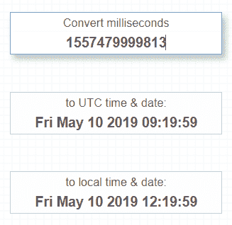

使用 http://currentmillis.com/转换的毫秒级 Unix 时间戳

Unix 纪元是 iOS 设备最常见的时间格式，但也有其他格式，包括 Mac 绝对时间和 WebKit/Chrome 时间。

# Mac 绝对时间

iOS 设备自 iOS 5 开始采用了 Mac 绝对时间。Mac 绝对时间是自 Mac 纪元时间开始以来经过的秒数，Mac 纪元时间从 2001 年 1 月 1 日午夜开始。Unix 纪元时间和 Mac 时间之间的差异正好是 978,307,200 秒。这意味着你可以轻松地将 Mac 时间转换为 Unix 纪元时间，并使用相同的方法最终将其转换为人类可读的时间戳。当然，也有一些在线转换工具，如[`www.epochconverter.com/coredata`](https://www.epochconverter.com/coredata)，如以下截图所示：

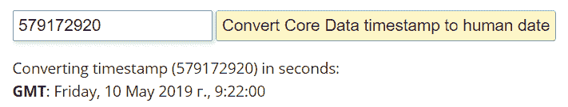

使用 https://www.epochconverter.com/coredata 转换的 Mac 时间戳

当然，也有离线工具可以进行时间戳转换。我们将在下一节介绍其中一种。

# WebKit/Chrome 时间

在分析 iOS 应用数据时，尤其是对于 Google Chrome、Safari 和 Opera 等网页浏览器，你可能会遇到另一种时间戳格式——*WebKit/Chrome 时间*。这是自 1601 年 1 月 1 日午夜以来的微秒数。对于这一格式，也有一个在线转换器：[`www.epochconverter.com/webkit`](https://www.epochconverter.com/webkit)。

如果你不喜欢或由于某种原因不想使用在线转换器，你还可以使用一个免费的工具：Digital Detective 的 DCode。该工具可以用于转换多种不同格式的时间戳，包括 Unix 时间（秒和毫秒）、Mac 绝对时间和 WebKit/Chrome 时间，如下图所示：

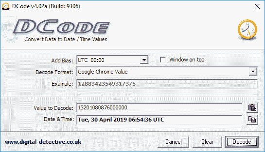

使用 DCode 转换的 WebKit/Chrome 时间戳

许多商业移动取证套件能够轻松自动转换提取的时间戳，但在某些情况下，验证它是极其重要的，因此你必须清楚理解时间戳格式。

# 使用 SQLite 数据库

SQLite 是一个开源的进程内库，提供一个自包含、零配置和事务型的 SQL 数据库引擎。这是一个包含多个表、触发器和视图的完整数据库，所有内容都包含在一个跨平台的文件中。由于 SQLite 具有便携、可靠且小巧的特点，它成为了许多移动平台上流行的数据库格式。

与其他智能手机和平板电脑一样，Apple 的 iOS 设备大量使用 SQLite 数据库来存储数据。许多内置应用程序——如电话、信息、邮件、日历和笔记——都将数据存储在 SQLite 数据库中。除此之外，设备上安装的第三方应用程序也利用 SQLite 数据库进行数据存储。

SQLite 数据库可以有或没有文件扩展名。它们通常具有 `.sqlitedb` 或 `.db` 文件扩展名，但也有些数据库使用其他扩展名。

SQLite 文件中的数据被拆分成包含实际数据的表。要访问存储在文件中的数据，你需要一个能够读取它的工具。大多数商业移动取证工具——如 Belkasoft Evidence Center、Magnet AXIOM 和 Cellebrite **通用取证提取设备** (**UFED**) Physical Analyzer——都支持对 SQLite 数据库的检查。如果你没有这些工具，以下是一些不错的免费工具：

+   **SQLite 数据库浏览器（DB4S）**：可以从 [`sqlitebrowser.org/`](http://sqlitebrowser.org/) 下载。

+   **SQLite 命令行客户端**：可以从 [`www.sqlite.org/`](http://www.sqlite.org/) 下载。

+   **SQLiteStudio**（[`sqlitestudio.pl`](https://sqlitestudio.pl)）：这是一个免费的跨平台 SQLite 管理器，支持 Windows 9x/2k/XP/2003/Vista/7/8/10，macOS 和 Linux。

+   **SQLiteSpy**：这是一个免费的**图形用户界面** **(GUI)** 工具，适用于 Windows。您可以从[http](http://www.yunqa.de/delphi/doku.php/products/sqlitespy/index)[://www.yunqa.de/delphi/doku.php/products/sqlitespy/index](http://www.yunqa.de/delphi/doku.php/products/sqlitespy/index)下载它。

macOS 默认包含 SQLite 命令行工具（`sqlite3`）。该命令行工具可以用来访问单个文件，并对数据库运行 SQL 查询。在接下来的部分中，我们将使用`sqlite3`命令行工具以及其他 SQLite 工具和浏览器来从各种 SQLite 数据库中检索数据。在检索数据之前，您需要学习的基本命令将在以下部分中进行说明。

# 连接到数据库

使用免费的工具，可以手动检查 iOS SQLite 数据库文件。以下是使用 Mac 本地命令在终端中检查数据库的示例：

1.  确保您的设备镜像是只读挂载的，以防止对原始证据进行更改。

1.  要通过命令行连接到 SQLite 数据库，请在终端中运行`sqlite3`命令并输入您的数据库文件。这将为您提供一个 SQL 提示符，您可以在其中执行 SQL 查询，如下所示的代码块所示：

```
$ sqlite3 sms.db
SQLite version 3.28.0 2019-04-15 14:49:49
Enter ".help" for usage hints. 
```

1.  要断开连接，请使用`.exit`命令。这将退出 SQLite 客户端并返回终端。

下一部分将指导您使用`sqlite3`内置命令进行数据库分析。

# 探索 SQLite 特殊命令

连接到数据库后，您可以使用一些内置的 SQLite 命令，这些命令被称为*点命令*，可以用来从数据库文件中获取信息。

您可以通过在 SQLite 提示符下输入`.help`命令来获取特殊命令的列表。这些是 SQLite 特有的命令，不需要在末尾加分号。最常用的点命令包括以下几种：

+   `.tables`：此命令列出数据库中的所有表。以下截图显示了`sms.db`数据库中的表列表：

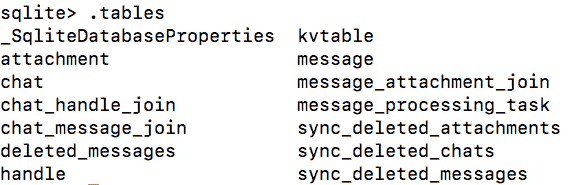

+   `.schema table-name`：此命令显示构建表所使用的`SQL CREATE`语句。以下截图显示了`sms.db`数据库中`handle`表的模式：

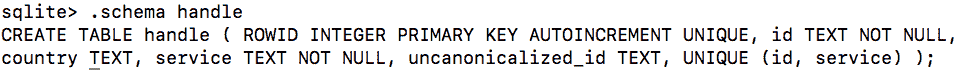

+   `.dump table-name`：此命令将表的全部内容导出为 SQL 语句。以下截图显示了`sms.db`数据库中`handle`表的导出内容：

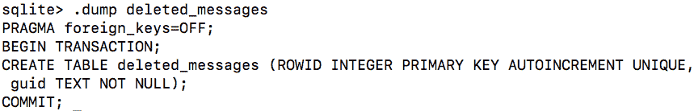

+   `.output file-name`：此命令将输出重定向到磁盘上的文件，而不是显示在屏幕上。

+   `.headers on`：此命令在发出`SELECT`语句时显示列标题。

+   `.help`：此命令显示可用 SQLite 点命令的列表。

+   `.exit`：此命令用于断开与数据库的连接并退出 SQLite 命令行界面。

+   `.mode`：此命令设置输出模式，可以是`.csv`、HTML、制表符等。

确保 SQLite 提示符和点命令之间没有空格；否则，整个命令将被忽略。

# 探索标准 SQL 查询

除了 SQLite 点命令之外，还可以在命令行中向 SQLite 数据库发出标准 SQL 查询，如`SELECT`、`INSERT`、`ALTER`和`DELETE`。与 SQLite 点命令不同，标准 SQL 查询需要在命令末尾加上分号。

大多数你将检查的数据库只会包含合理数量的记录，因此可以执行`SELECT *`语句，打印表中包含的所有数据。本章将详细介绍这一部分内容。

# 使用商业工具访问数据库

虽然可以使用免费工具手动检查 iOS SQLite 数据库文件，但大多数检查员更倾向于在手动深入文件进行检查之前，先使用商业支持。以下是使用 SQLite（它包含在 Belkasoft Evidence Center 中）检查数据库的示例。

要打开并分析数据库，只需遵循以下几个简单步骤：

1.  启动 Belkasoft Evidence Center，进入视图 | SQLite Viewer，选择要检查的数据库文件。

1.  一旦选择了数据库，它会立即在 SQLite Viewer 中打开，准备好进行检查，如下图所示：

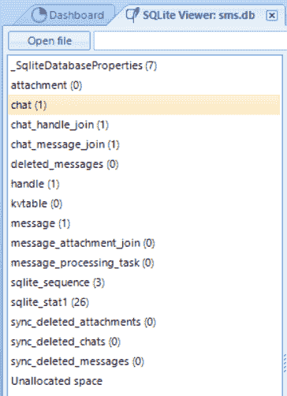

使用 Belkasoft Evidence Center 的 SQLite Viewer 打开的 sms.db 数据库

为什么检查员需要使用这些商业查看器，而不是免费的开源工具？例如，这个特定的查看器甚至支持损坏或部分覆盖的 SQLite 数据库。更重要的是，该工具支持从自由列表、**预写日志**（**WAL**）和未分配空间中提取数据，如下图所示：

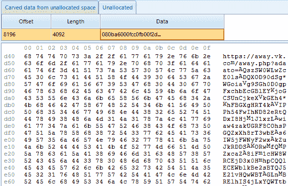

在 Belkasoft Evidence Center 的 SQLite Viewer 中看到的数据库未分配空间

当然，也有一些免费的开源工具可用于 SQLite 数据恢复。你将在接下来的章节中了解更多这类工具。

# 关键证据 – 重要的 iOS 数据库文件

按照第三章*iOS 设备的数据获取*和第四章*iOS 备份的数据获取*中的说明提取的文件系统和备份应包含以下 SQLite 数据库，这些数据库可能对您的调查很重要。如果这些文件未恢复，请确保您正确获取了 iOS 设备。这些文件是在运行 iOS 的设备上通过逻辑获取提取的。由于 Apple 在每次 iOS 版本发布时都会为内置应用程序添加新功能，因此不同 iOS 版本中的文件格式可能会有所不同。

# 通讯录联系人

通讯录包含有关所有者个人联系人丰富的信息。除第三方应用程序外，通讯录包含设备上存储的所有联系人的联系人条目。通讯录数据库位于`/HomeDomain/Library/AddressBook.sqlitedb`。`AddressBook.sqlitedb`文件包含多个表，其中以下三个表特别值得关注：

+   `ABPerson`：此表包含每个联系人的姓名、组织、备注等信息。

+   `ABMultiValue`：此表包含`ABPerson`表中条目的电话号码、电子邮件地址、网站**统一资源定位符**（**URLs**）等信息。`ABMultiValue`表使用`record_id`文件将联系人信息与`ABPerson`表中的`ROWID`关联起来。

+   `ABMultiValueLabel`：此表包含用于标识存储在`ABMultiValue`表中的信息类型的标签。

存储在`AddressBook.sqlitedb`文件中的部分数据可能来自第三方应用程序。您应手动检查应用程序文件夹，以确保所有联系人都已被统计和检查。

虽然以下所有命令都可以在 Mac 上本地运行，但我们将使用 DB4S 来检查 iOS 设备上最常见的数据库。这是一个免费工具，简化了过程，并为您提供清晰的数据视图。一旦数据库加载完成，您可以起草查询来检查最相关的数据，并将通讯录导出为名为`AddressBook.csv`的`.csv`文件，如下截图所示：

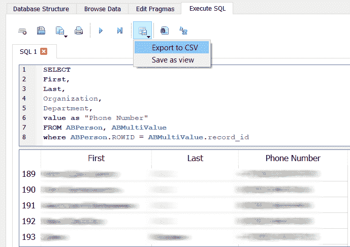

DB4S 中的 AddressBook.sqlitedb 文件

在前面的截图中，您可以看到建议的查询，用于从`ABPerson`和`ABMultiValue`表中解析数据。

# 通讯录图片

除了通讯录数据外，每个联系人可能还包含与之关联的图像。每当用户接到某个特定联系人的来电时，图像会显示在屏幕上。这些图像可以由具有访问设备联系人权限的第三方应用程序创建。通常，联系人会与第三方应用程序的个人资料照片相关联。通讯录图像数据库可以在`/HomeDomain/Library/AddressBook/AddressBookImages.sqlitedb`中找到。

通讯录图像可以手动解析，但使用商业软件可以使这一过程变得更加实用。大多数免费和商业工具将提供访问通讯录图像的功能。然而，一些工具无法建立图像与联系人的关联，这可能需要一些手动重建。有时，免费解决方案在从 iOS 设备解析简单数据时效果最好。接下来，我们将检查在 iExplorer 中查看通讯录图像的过程，*iOS 备份数据采集*。

在下面的截图示例中，iExplorer 自动将联系人数据与图像匹配：

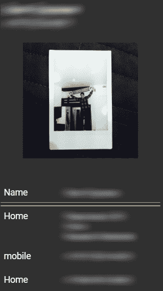

在 iExplorer 中检查通讯录图像

相同的缩略图可以在`ABThumbnailImage`表的`data`列中找到。你可以手动将照片与联系人匹配，方法是使用`AddressBookImages.sqlitedb`中`ABThumbnailImage`表的`record_id`列和`AddressBook.sqlitedb`中`ABPerson`表的`ROWID`列。

# 通话记录

用户拨打、未接和接听的电话或 FaceTime 通话会与其他元数据（如通话时长、日期和时间）一起记录在通话历史中。通话历史数据库可以在`/HomeDomain/Library/CallHistoryDB/CallHistory.storedata`中找到。`CallHistory.storedata`文件是随着 iOS 8 引入的，目前在编写时使用的是（iOS 13.2）。

`CallHistory.storedata`数据库中的`ZCALLRECORD`表包含了通话记录。需要注意的是，只有有限数量的通话可能会存储在活动数据库中。由于数据库在需要空间时会删除最旧的记录，但这并不意味着数据被删除。它只是存储在 SQLite 数据库文件的空闲页面中，可以使用取证工具或手动恢复。`ZCALLRECORD`表中最重要的列如下：

+   `ZDATE`：此列包含通话的时间戳，采用 Mac 绝对时间格式。

+   `ZDURATION`：此列包含通话时长。

+   `ZLOCATION`：此列包含电话号码的位置。

+   `ZADDRESS`：此列包含电话号码。

+   `ZSERVICE_PROVIDER`：此列包含服务提供商——例如，电话、WhatsApp、Telegram 等。

你可以在 DB4S 中运行以下查询以解析通话历史。之后，你可以将其导出为`.csv`文件，如下图所示：

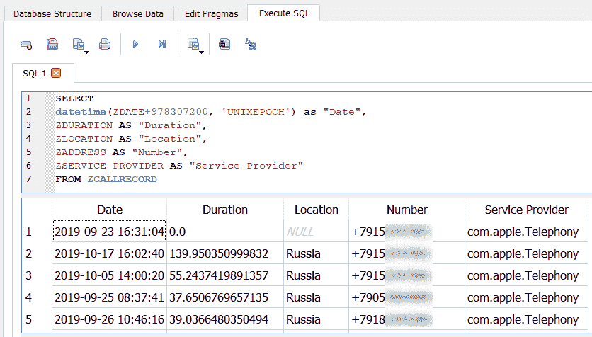

在 DB4S 中检查 CallHistory.storedata

这次查询非常简单，因为所有相关列都在同一张表中。请注意，我们使用了`datetime`将 Mac 的绝对时间戳转换为人类可读的日期。

# 短信服务（SMS）消息

SMS 数据库包含了从设备发送和接收的文本和多媒体消息，以及远程方的电话号码、日期和时间和其他运营商信息。从 iOS 5 开始，iMessage 数据也存储在 SMS 数据库中。iMessage 允许用户通过蜂窝或 Wi-Fi 网络向其他 iOS 或 macOS 用户发送 SMS 和**多媒体消息服务**（**MMS**）消息，从而提供了一种替代 SMS 的方式。SMS 数据库可以在`/HomeDomain/Library/SMS/sms.db`找到。

你可以在 DB4S 中运行以下查询来解析短信消息。之后，你可以将其导出为`.csv`文件，如下图所示：

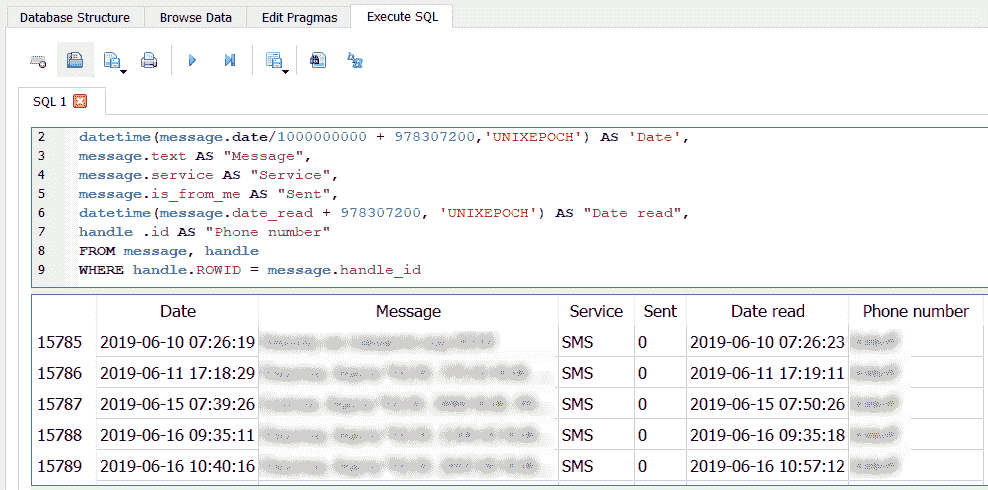

在 DB4S 中检查 sms.db

还有一个有趣的子目录可以在`/HomeDomain/Library/SMS/`下找到——`Drafts`。在里面，有更多的子文件夹，每个文件夹包含一个`message.plist`文件。每个文件都是一个属性列表，存储了用户开始输入但未发送的草稿消息。你将在接下来的章节中了解更多关于属性列表的内容。

# 日历事件

用户手动创建或通过邮件应用或其他第三方应用同步的日历事件存储在`Calendar`数据库中。`Calendar`数据库可以在`/HomeDomain/Library/Calendar/Calendar.sqlitedb`找到。

`Calendar.sqlitedb`文件中的`CalendarItem`表包含日历事件的摘要、描述、开始日期、结束日期等。你可以在 DB4S 中运行以下查询来解析日历，如下图所示：

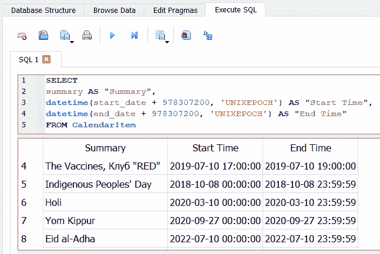

在 DB4S 中检查 calendar.sqlitedb

如你所见，`CalendarItem`表以 Mac 的绝对时间格式存储日期，因此我们添加了`978307200`来揭示实际的时间戳，借助`datetime`函数。

# 笔记

`Notes`数据库包含用户通过设备内置的`Notes`应用创建的笔记。`Notes`是最简单的应用，通常包含最敏感和机密的信息。`Notes`数据库可以在`/HomeDomain/Library/Notes/notes.sqlite`找到。

`notes.sqlite`文件中的`ZNOTE`和`ZNOTEBODY`表包含每条笔记的标题、内容、创建日期、修改日期等。你可以运行以下查询来解析`Notes`数据库：

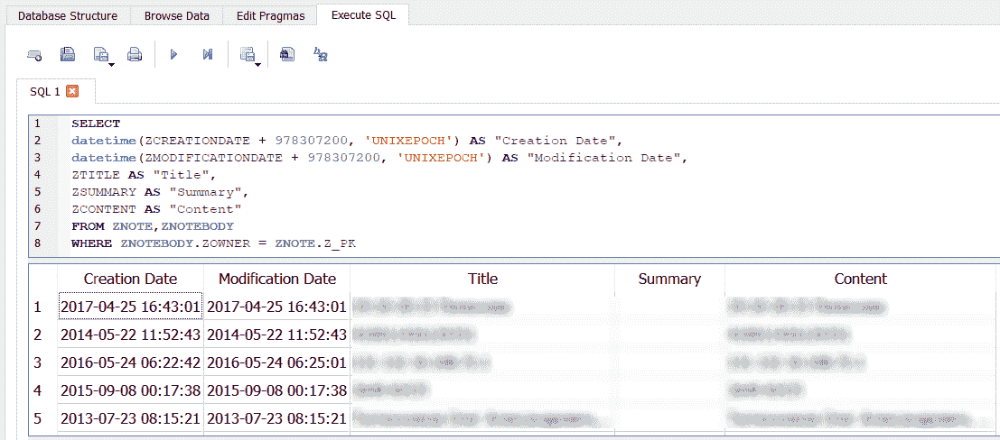

在 DB4S 中检查笔记

这个查询合并了两个表的数据，所以我们使用了来自`ZNOTEBODY`的`ZOWNER`、来自`ZNOTE`的`Z_PK`，以及一个`WHERE`子句来执行。

# Safari 书签和历史记录

在 iOS 设备上使用的 Safari 浏览器允许用户书签他们喜爱的网页。`Bookmarks`数据库可以在`/HomeDomain/Library/Safari/Bookmarks.db`找到。书签数据可以通过一个非常简单的查询提取，如以下截图所示：

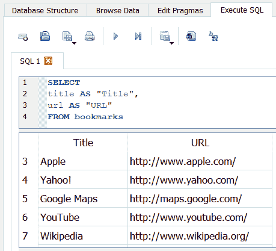

在 DB4S 中检查书签

浏览历史记录可以在`History.db`中找到，路径为`/HomeDomain/Library/Safari/`。可以从`history_items`和`history_visits`表中提取关于访问过的网站的最重要信息，如下图所示：

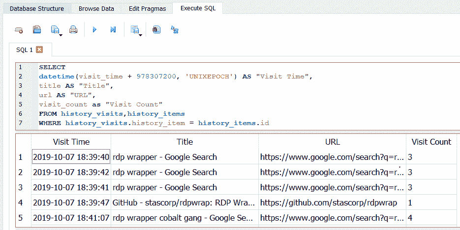

在 DB4S 中检查历史记录

除了 Safari，其他浏览器也可以用来存储 iOS 设备上的数据。因此，我们建议使用专门解析互联网历史记录的工具，以确保不遗漏数据。解决此任务的好取证工具包括 Magnet Forensics 的 AXIOM、Cellebrite 的 Physical Analyzer 等。

# 语音邮件

`Voicemail`数据库包含关于存储在设备上的每个语音邮件的元数据，包括发件人的电话号码、回拨号码、时间戳和消息时长等。语音邮件录音以**自适应多速率**（**AMR**）音频文件格式存储，可以通过任何支持 AMR 编解码器的媒体播放器播放（例如，QuickTime Player）。`Voicemail`数据库可以在`/HomeDomain/Library/Voicemail/voicemail.db`下找到。

# 录音

`Recordings`数据库包含关于存储在设备上的每个录音的元数据，包括时间戳、时长、存储位置等。该数据库可以在`/MediaDomain/Media/Recordings`找到。可以使用以下截图中显示的查询来提取元数据：

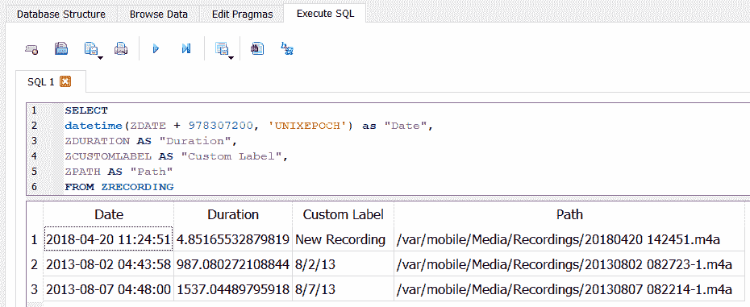

在 DB4S 中检查录音

如前面的截图所示，实际的录音文件存储在同一目录中。

# 设备交互

有一个 SQLite 数据库记录用户与不同应用程序的交互情况。该数据库名为`interactionC.db`，位于`/HomeDomain/Library/CoreDuet/People`。`ZINTERACTIONS`表包含关于用户是否读取消息、发送消息、进行通话等信息。你可以通过以下截图中显示的查询从表中提取这些信息：

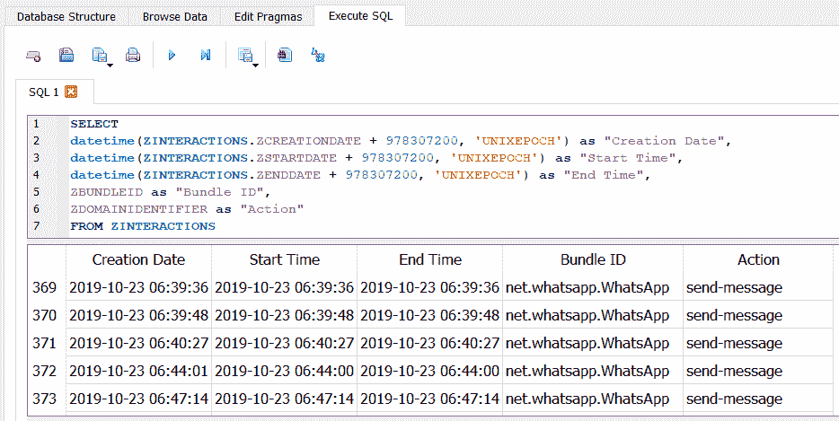

在 DB4S 中检查交互

同时，确保检查`ZCONTACTS`表——它包含关于用户与设备互动时涉及的联系人信息（如果适用）。

# 电话号码

通过分析位于`/WirelessDomain/Library/Databases`的`CellularUsage.db`文件，你可以获取用户使用的所有电话号码的信息，即使他们更换了手机并从备份恢复。提取此数据的查询如以下截图所示：

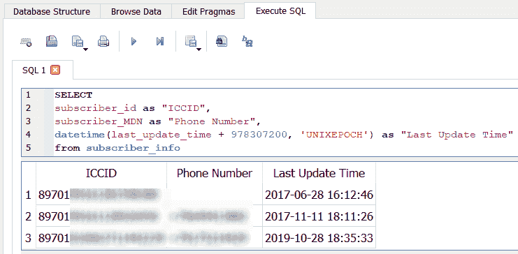

提取电话号码

如您所见，这里不仅有电话号码，还有**用户身份模块**（**SIM**）卡的**集成电路卡标识符**（**ICCID**）。

# 属性列表

属性列表，通常称为`plist`，是一种结构化数据格式，用于存储、组织和访问 iOS 设备以及 macOS 设备上的各种类型数据。`plist`文件是二进制格式的，可以使用属性列表编辑器查看，该编辑器能够读取或将二进制格式转换为**美国信息交换标准代码**（**ASCII**）格式。

`Plist`文件可能带有或不带有`.plist`文件扩展名。要访问这些文件中存储的数据，您需要一个可以读取它们的工具。一些好的免费工具包括以下：

+   可以从[`www.icopybot.com/plist-editor.htm`](http://www.icopybot.com/plist-editor.htm)下载 plist Editor Pro。

+   macOS 上的`plutil`命令行工具。

您可以使用 Xcode 查看`plist`文件。macOS 默认包含`plutil`命令行工具。此命令行工具可以轻松地将二进制格式的文件转换为人类可读的文件。此外，大多数商业取证工具都很好地支持解析`plist`文件。

以下截图显示了`com.apple.mobile.ldbackup.plist`文件：

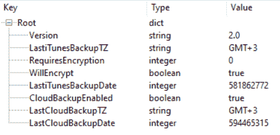

plist Editor Pro 中的 com.apple.mobile.ldbackup.plist

如您所见，这个`plist`揭示了最后一次本地和云备份的日期（当然是 Mac 绝对时间），它创建时的时区，以及备份是否加密的事实。

# 重要的 plist 文件

在第三章《iOS 设备数据获取》和第四章《iOS 备份数据获取》中提到的原始磁盘镜像或提取的备份，应包含对调查至关重要的以下`plist`文件。显示的文件是从 iOS 13.2 设备备份中提取的。对于您的 iOS 版本，文件位置可能会有所不同。

以下是包含可能与您的调查相关数据的`plist`文件：

| **plist 文件** | **描述** |
| --- | --- |
| `/HomeDomain/Library/Preferences/com.apple.commcenter.shared.plist` | 包含正在使用的电话号码 |
| `/HomeDomain/Library/Preferences/com.apple.identityservices.idstatuscache.plist` | 包含有关 Apple ID 使用的电子邮件地址和用户通过该 ID 与 FaceTime 或 iMessage 互动的人员的电话号码的信息 |
| `/HomeDomain/Library/Preferences/com.apple.mobile.ldbackup.plist` | 包含最后一次 iTunes 和 iCloud 备份的时间戳、最后一次 iTunes 备份的时区，以及是否加密 |
| `/HomeDomain/Library/Preferences/com.apple.MobileBackup.DemotedApps.plist` | 包含操作系统自动卸载的未使用应用程序列表 |
| `/HomeDomain/Library/Preferences/com.apple.mobilephone.speeddial.plist` | 包含用户最喜爱的联系人列表，包括他们的姓名和电话号码 |
| `/HomeDomain/Library/Preferences/com.apple.preferences.datetime.plist` | 包含用户设置的时区信息 |
| `/RootDomain/Library/Caches/locationd/clients.plist` | 包含使用位置服务的应用程序列表 |
| `/RootDomain/Library/Preferences/com.apple.MobileBackup.plist` | 包含有关从备份中恢复的最后信息，包括恢复开始日期、文件传输持续时间、传输的文件数量、源设备**唯一设备标识符**（**UDID**）等 |
| `/SystemPreferencesDomain/SystemConfiguration/com.apple.mobilegestalt.plist` | 包含用户分配的设备名称 |
| `/SystemPreferencesDomain/SystemConfiguration/com.apple.wifi.plist` | 包含设备所有者使用的无线接入点信息 |
| `/WirelessDomain/Library/Preferences/com.apple.commcenter.plist` | 包含设备电话号码、网络运营商、ICCID 和**国际移动用户身份**（**IMSI**）信息 |

当然，`plist`文件不像 SQLite 数据库那样包含大量信息，但它们在您的取证检查中仍然可以是有用的。接下来，我们将查看一些可能也有用的其他文件。

# 其他重要文件

除了 SQLite 和`plist`文件外，还有其他一些位置可能包含对调查有价值的信息。

其他来源包括以下内容：

+   本地字典

+   照片

+   缩略图

+   壁纸

+   已下载的第三方应用程序

让我们逐一看看这些文件。

# 本地字典

用户添加到字典中的单词列表存储在`LocalDictionary`纯文本文件中，文件位置为`/KeyboardDomain/Library/Keyboard/`。由于该文件是纯文本格式，您可以使用您喜欢的文本编辑器查看。

# 照片

照片存储在位于`/CameraRollDomain/Media/DCIM`的目录中，该目录包含使用设备内置相机拍摄的照片、截图、自拍、照片流、最近删除的照片以及相关的缩略图。一些第三方应用程序也会将拍摄的照片存储在该目录中。存储在`DCIM`文件夹中的每张照片都包含**可交换图像文件格式**（**EXIF**）数据。可以使用`ExifTool`提取存储在照片中的`EXIF`数据，`ExifTool`可以从[`sno.phy.queensu.ca/~phil/exiftool/`](https://sno.phy.queensu.ca/~phil/exiftool/)下载。当照片被标记为用户的地理位置时，如果用户在 iOS 设备上启用了位置权限，`EXIF`数据可能包含地理位置信息。

# 缩略图

另一个与照片相关的重要证据来源是`ithmb`文件。你可以在`/CameraRollDomain/Media/PhotoData/Thumbnails`找到这些文件。这些文件不仅包含设备上实际照片的缩略图，还有已删除照片的缩略图。当然，有一个工具可以解析这些文件——`iThmb Converter`，可以从[`www.ithmbconverter.com/en/download/`](http://www.ithmbconverter.com/en/download/)下载，以下截图展示了该工具：

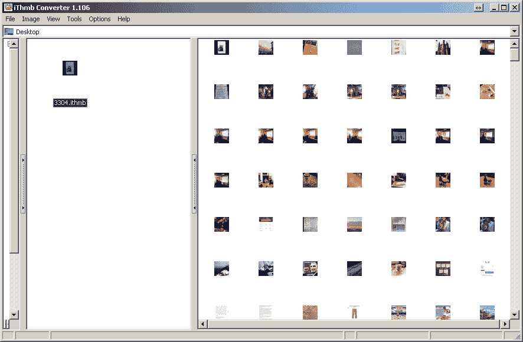

使用 iThmb Converter 检查 3304.ithmb

由于这些文件可能包含已删除照片的缩略图，法医检查员不得忽视它们。更重要的是，其中一些文件包含相当大的缩略图，因此可以清楚地看出所拍摄的内容。

# 壁纸

当前设置为 iOS 设备的背景墙纸可以从`/HomeDomain/Library/SpringBoard`中的`LockBackgroundThumbnail.jpg`和`LockBackgroundThumbnaildark.jpg`文件中恢复。

壁纸图片可能包含有关用户的身份信息，这些信息可能有助于失踪人员案件，或者可能在从盗窃调查中恢复的 iOS 设备上找到。

# 下载的第三方应用程序

从 App Store 下载并安装的第三方应用程序——包括 Facebook、WhatsApp、Viber、Threema、Tango、Skype 和 Gmail 等应用——包含大量对调查有用的信息。某些第三方应用程序使用 Base64 编码，需转换为可查看格式，此外还涉及加密。加密数据库文件的应用程序可能会阻止你访问表中存储的数据。加密方式根据应用程序和 iOS 版本的不同而有所差异。

在`/private/var/mobile/Containers/Data/Application`目录中，为设备上安装的每个应用程序创建一个带有**全局唯一标识符**（**UUID**）的子目录。应用程序目录中存储的大多数文件都是 SQLite 和`plist`格式。每个文件必须检查其相关性。我们建议在可能的情况下，使用 Belkasoft Evidence Center、Cellebrite UFED Physical Analyzer、Elcomsoft Phone Viewer 和 Magnet AXIOM 来快速提取这些证据，再回去手动运行查询并解析数据。

此外，关于已安装应用程序的信息可以从位于`/HomeDomain/Library/FrontBoard`的`applicationState.db`数据库中获取。这是另一个 SQLite 数据库，可以使用合适的查看器进行分析，具体选择由检查员决定。

# 恢复已删除的 SQLite 记录

SQLite 数据库将已删除的记录存储在数据库本身中，因此通过解析相应的 SQLite 数据库，可以恢复已删除的数据，如联系人、短信、日历、笔记、电子邮件、语音邮件等。如果 SQLite 数据库进行了 vacuum 或碎片整理，则恢复已删除数据的可能性非常小。这些数据库需要的清理量很大程度上取决于 iOS 版本、设备以及用户在设备上的设置。

一个 SQLite 数据库文件由一个或多个固定大小的页面组成，每个页面仅使用一次。SQLite 使用 B 树页面布局来存储索引和表内容。有关 B 树布局的详细信息，可以参考 [`github.com/NotionalLabs/SQLiteZer/blob/master/_resources/Sqlite_carving_extractAndroidData.pdf`](https://github.com/NotionalLabs/SQLiteZer/blob/master/_resources/Sqlite_carving_extractAndroidData.pdf)。

商业取证工具提供对 SQLite 数据库文件的已删除数据恢复支持，但它们并不总是能恢复所有数据，也不支持从 iOS 设备上的所有数据库中提取数据。建议检查每个包含关键证据的数据库是否存在已删除数据。应使用免费的解析器、十六进制查看器，甚至是你的取证工具，检查本书中已讨论的关键证据或数据库，以确定用户是否删除了与调查相关的证据。

要提取 SQLite 数据库，你可以查看原始十六进制数据，或使用由 Mari DeGrazia 开发的免费 Python 脚本 `sqliteparse.py`。你可以从 [`github.com/mdegrazia/SQlite-Deleted-Records-Parser`](https://github.com/mdegrazia/SQlite-Deleted-Records-Parser) 下载该 Python 脚本。

以下示例从 `notes.sqlitedb` 文件中恢复已删除的记录，并将输出转储到 `output.txt` 文件中。这个脚本应适用于从 iOS 设备恢复的所有数据库文件。要验证脚本运行结果，只需在十六进制查看器中检查数据库，确保没有遗漏任何内容。代码可以在这里查看：

```
$python sqliteparse.py -f notes.sqlitedb -r -o output.txt
```

此外，对数据库文件执行 `strings` 转储也可以揭示已删除的记录，这些记录可能会被忽略，命令如下所示：

```
$strings notes.sqlitedb
```

如果你更喜欢图形界面，Mari DeGrazia 友好地创建了一个图形界面并将其发布在她的 GitHub 页面上。

你还可以使用另一个开源工具 Undark 来恢复已删除的 SQLite 记录。你可以在这里下载：[`pldaniels.com/undark/`](http://pldaniels.com/undark/)。使用该工具时，运行以下命令：

```
./undark -i sms.db > sms_database.csv
```

需要注意的是，Undark 不区分当前数据和已删除数据，因此你会得到完整的数据集，包括实际数据和已删除的数据。

# 概述

本章涵盖了各种数据分析技术，并指定了在 iOS 设备文件系统中常见工件的位置。在编写本章时，我们旨在涵盖大多数调查中涉及的最流行的工件。显然，不可能涵盖所有内容。我们希望一旦你学会如何从 SQLite 和`plist`文件中提取数据，直觉和毅力将帮助你解析那些未被覆盖的工件。

请记住，大多数开源和商业工具都能够从常见的数据库文件中提取活动数据和已删除数据，如联系人、通话记录、短信等，但它们通常忽略第三方应用程序的数据库文件。我们最好的建议是了解如何手动恢复数据，以防你需要验证你的发现或作证说明你的工具如何工作。

我们介绍了恢复已删除 SQLite 记录的技术，这在大多数 iOS 设备调查中非常有用。同样，获取方法、编码和加密方案会影响你在检查过程中可以恢复的数据量。

在下一章，*iOS 取证工具*中，我们将向你介绍最流行的移动取证工具——Cellebrite UFED Physical Analyzer、Magnet AXIOM、Elcomsoft Phone Viewer 和 Belkasoft Evidence Center。
