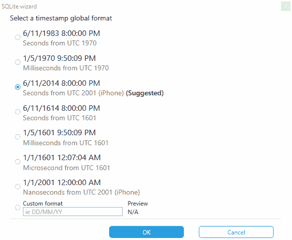
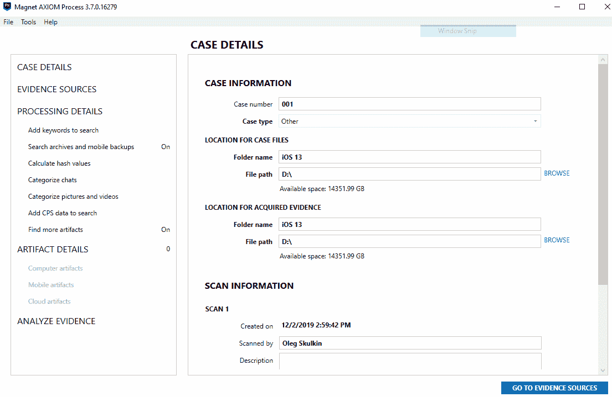

# 第七章：iOS 取证工具

作为检查员，你不仅需要知道如何使用取证工具，还必须理解工具在调查中所采用的方法和获取技术。除了节省时间外，取证工具还使取证分析过程变得更加轻松。然而，每个工具都有其缺陷。你必须发现任何错误，并知道如何通过利用其他工具或技术来纠正它们。没有任何工具能支持所有设备。你需要学习并使用最佳的工具来完成工作。如我们在前面的章节中所讨论的，你必须理解 iOS 设备上的数据是如何存储的，以确保工具能够捕获所有可访问的数据。

当前，市面上有许多商业工具，如 Cellebrite UFED Physical Analyzer、BlackBag BlackLight、Oxygen Forensic Detective、Belkasoft Evidence Center、MSAB XRY、Magnet AXIOM 等，可用于 iOS 设备的取证获取和分析。本章将通过几个工具的使用，为你提供了解这些工具所需的步骤以及如何进行 iOS 设备的获取和分析的详细信息。

本章我们将涵盖以下主题：

+   使用 Cellebrite UFED Physical Analyzer

+   使用 Magnet AXIOM

+   使用 Belkasoft Evidence Center

+   使用 Elcomsoft Phone Viewer

# 使用 Cellebrite UFED Physical Analyzer

根据供应商的说法，Cellebrite **Universal Forensic Extraction Device**（**UFED**）赋能执法机关、反恐和安全组织，从手机、智能手机、PDA 及各种便携手持设备中捕获关键的取证证据，包括针对新发布型号的更新。该工具通过法医数据提取、解码和分析技术，支持从不同移动设备中获取现有数据和已删除数据。截止 2019 年 2 月，UFED 已支持从近 28,000 种移动设备中提取数据。

# Cellebrite UFED Physical Analyzer 的功能

以下是 Cellebrite UFED Physical Analyzer 的功能：

+   支持不同类型的数据获取

+   提取设备密钥，用于解密物理镜像和钥匙链项目

+   解密物理镜像和钥匙链项目

+   显示设备密码（并非所有锁定设备均可用）

+   允许你使用已知密码打开加密的原始磁盘镜像文件

+   支持密码恢复攻击

+   支持对提取的应用数据进行高级分析和解码

+   提供对在同一用户界面中提取的物理和逻辑数据的访问，使分析更加简便

+   以几种流行格式生成报告，包括 Microsoft Excel、PDF 和 HTML

+   转储原始文件系统分区，以便将其导入并在其他取证工具中进行检查

+   除了 UFED 快捷文件外，还创建了一个二进制镜像文件，方便导入到其他取证工具进行验证

现在我们来看看高级逻辑采集与分析。

# 使用 Cellebrite UFED Physical Analyzer 进行高级逻辑采集与分析

正如我们之前提到的，Physical Analyzer 不仅可以用来解析从获取的镜像中提取的不同类型的取证证据，还可以执行来自 iOS 设备的逻辑、文件系统（甚至是物理提取，适用于老旧设备）等多种类型的提取。由于物理采集实际上仅适用于旧设备，最好的选择是高级逻辑采集。

我们将从运行 iOS 13.2.3 的 iPhone 获取并分析数据。开始吧：

1.  通过适当的电缆将设备连接到工作站。确保它是可信的，并启动 Physical Analyzer。

1.  转到 Extract | iOS 设备提取。iOS 设备数据提取向导窗口将弹出：

选择提取类型

1.  由于我们正在处理一台现代的 iOS 设备，让我们选择高级逻辑提取。如果设备被识别，你将看到设备的名称、其 UDID 以及 iOS 版本：

连接设备

在我们的例子中，iPhone 的 iTunes 备份被已知密码保护，所以最好的方法是方法 1：

选择提取方法

1.  如果你希望备份数据加密（推荐），可以在下一页选择此选项：

选择备份是否加密

1.  现在是选择数据保存位置的时候了；在我们的例子中，保存位置是`D:\`驱动器的根目录：

选择保存提取数据的位置

1.  现在，采集过程将开始。确保设备在整个过程中都保持连接：

提取数据

一旦提取过程完成，提取的数据将通过强大的 Physical Analyzer 插件进行解析。最终，你将获得一组分成多个类别的证据：

由 Physical Analyzer 提取和解析的手机数据

数据文件也可以做同样的处理：

由 Physical Analyzer 提取的数据文件

如你所见，括号中的红色数字代表已删除记录，这些记录已经通过 Physical Analyzer 的插件恢复。正如你所知，从广泛使用于 iOS 的 SQLite 数据库中恢复已删除的数据并不是奇迹。

说到 SQLite 数据库，Physical Analyzer 还有另一个令人惊叹的功能，可能对为你的移动取证报告添加自定义证据以及解析未知应用数据非常有用——SQLite 向导。你可以在 Tools | SQLite 向导下找到它：

1.  首先选择一个数据库，当然，最好选择一个物理分析器不会自动解析的应用。在我们的例子中，这款应用叫做 Scan：

选择数据库

1.  确保你已经选择了**包括已删除行**选项；这将帮助你自动恢复数据，但当然，这也会增加误报记录的数量：

启动 SQLite 向导

因此，我们的应用用于扫描二维码，并包含四个感兴趣的列——扫描日期和时间、纬度、经度和扫描结果。所有这些行都属于`ZSCSCANEVENT`：

选择数据库表和列

1.  下一步是选择时间戳。你已经了解了 iOS 时间戳的知识，应该能认出`ZTIMELESSCREATIONDATE`中的格式，但即使你没有，SQLite 向导也会为你做这件事：

选择时间戳格式

1.  通用模型适用于任何数据库，但也有一些现有的物理分析器模型可以用于典型内容，例如*聊天*或*联系人*。在我们的例子中，我们使用的是通用模型：

选择模型

一旦你选择了列的模型和字段类型，你就可以运行查询并将新解析的工件添加到你的提取中，之后再添加到报告中。

# 使用 Magnet AXIOM

Magnet AXIOM 是市场上最有用的数字取证工具之一。它可以用于计算机和移动取证；该套件的最新版本引入了全新的功能——云取证。至于 iOS 取证，它既可以用于逻辑采集和文件系统采集，并支持所有 iOS 版本——从最旧的到最新的。当然，它也可以用于解析 iTunes 备份和由第三方工具如 Elcomsoft iOS 取证工具包创建的物理镜像。

Magnet AXIOM 的最佳功能之一是它能够实时开始处理提取数据，因此你无需等采集过程完成后才开始取证分析。

# **Magnet AXIOM**的特点

以下是**Magnet AXIOM**的特点：

+   支持逻辑和文件系统（针对越狱设备）采集

+   支持加密和未加密的 iTunes 备份

+   恢复超过 500 种工件类型

+   与其他流行的移动取证工具兼容，如 Cellebrite UFED 和 XRY

+   包含内置的 SQLite 和 plist 查看器

+   创建所谓的**可移植案件**，以便你可以与团队成员和第三方共享整个数据集

+   可以生成几种流行格式的报告，如 Microsoft Excel、PDF 和 HTML

# 使用 Magnet AXIOM 进行逻辑采集和分析

如你所知，现代 iOS 设备的最常见获取方式是逻辑类型。以下是使用 Magnet AXIOM 获取 iOS 设备的步骤：

1.  首先创建一个新案件：

创建新案件

1.  由于我们正在处理的是一台 iOS 设备，因此我们将选择 MOBILE 选项：

选择证据来源

1.  有多个选项可供选择，但在我们的情况下，iOS 选项是正确的：

选择证据来源

1.  获取证据有三种选项——我们可以选择已经获取的镜像（例如，iTunes 备份或由第三方工具获取的文件系统镜像）、从设备中提取数据，或使用 GrayKey 进行获取。我们选择第二种选项：

选择获取证据

1.  设备已被识别并准备好成像。如果你没有看到设备，请使用 UNKNOWN 选项：

选择设备

1.  有两种提取方式——快速和完整。完整选项仅在你要获取的设备已越狱时才会显示。在我们的案例中，它没有越狱：

选择镜像类型

1.  系统会提示你输入备份的密码。如你所记，这样做能获得更多数据，因此强烈推荐使用：

加密备份

1.  在开始获取和处理之前，你可以选择感兴趣的关键字，使用 Magnet.AI 对聊天进行分类，或配置动态应用查找器：

处理详细信息

动态应用查找器是 Magnet IEF 和 AXIOM 的功能，能够在镜像中查找潜在的移动聊天应用数据库。你可以在以下链接中了解更多关于这个功能的内容：[`www.magnetforensics.com/mobile-forensics/using-dynamic-app-finder-to-recover-more-mobile-artifacts/`](https://www.magnetforensics.com/mobile-forensics/using-dynamic-app-finder-to-recover-more-mobile-artifacts/)。

1.  你可以从这里自定义 MOBILE ARTIFACTS。例如，如果你只关心聊天证据，最好只选择这些类型的证据，这样可以缩短处理时间：

选择移动证据

1.  点击 ANALYZE EVIDENCE 按钮将开始获取和分析过程：

镜像证据来源

1.  Magnet AXIOM 有两个窗口——Process 和 Examine。第一个用于监控获取和处理证据来源的过程，第二个则用于分析已提取和解析的数据。如前所述，你可以在处理阶段结束之前开始分析。只需在 Magnet Examine 中点击 LOAD NEW RESULTS 即可：

正在加载新结果

1.  处理阶段结束后，您可以在 Magnet Examine 的移动设备部分找到已解析的数据：

移动设备部分

当然，它不会包括所有内容；您还可以在其他有价值的部分找到从 iOS 设备提取的证据，例如 **CHAT**、**MEDIA** 和 **DOCUMENTS**。

# 使用 Belkasoft Evidence Center

Belkasoft Evidence Center 是另一款流行的数字取证工具，能够执行 iOS 设备的获取和分析。像 AXIOM 一样，它可以用于计算机、移动设备和云端取证。

Belkasoft Evidence Center 最棒的功能之一是它能够处理损坏的 iTunes 备份。因此，如果您有一个没有任何工具能够处理的备份，尝试使用 Belkasoft Evidence Center；根据我们的经验，它会成功处理此备份。

# Belkasoft Evidence Center 的功能

以下是 Belkasoft Evidence Center 的功能：

+   支持逻辑和文件系统（对于越狱设备）获取

+   支持加密和未加密的 iTunes 备份

+   支持损坏的 iTunes 备份

+   恢复超过 700 种证据类型

+   与其他流行的移动取证工具兼容，如 Cellebrite UFED 和 XRY

+   包含内置的 SQLite 和 plist 查看器

+   包含免费的脚本模块 BelkaScript，允许检查员编写自己的脚本来自动化一些常见任务

+   可以生成多种流行格式的报告，如 Microsoft Excel、PDF 和 HTML

# 使用 Belkasoft Evidence Center 进行逻辑获取和分析

由于备份处理和分析是 Belkasoft Evidence Center 最优秀的功能之一，我们将在此为您详细介绍该过程：

1.  让我们开始创建一个新案件：

创建新案件

1.  这里有多个选项——您可以处理先前获取的镜像文件，例如 iTunes 备份，或者选择先从设备提取数据。让我们从逻辑获取开始。选择“移动设备”选项：

选择数据源

1.  由于我们正在处理 iOS 设备，请选择 Apple。您将看到一个可用设备列表：

可用设备进行获取

1.  由于我们的设备没有越狱，因此我们的选择是逻辑获取或 iTunes 备份：

选择获取方法

1.  一旦获取完成，您可以选择感兴趣的证据。确保只选择与 iOS 相关的证据；这将减少处理时间：

选择数据类型

1.  处理完成后，提取的证据将显示在概览标签中：

概览标签

1.  最后，如果你想浏览法医镜像的文件系统，请使用文件系统标签：

文件系统标签

其他可用的标签也可能很有用——Dashboard 标签显示你当前正在处理的案件的所有可用信息，任务管理器标签允许你监控处理进度，搜索结果标签显示关键词搜索结果。

# 使用 Elcomsoft Phone Viewer

Elcomsoft Phone Viewer 是一款能够解析和查看从 iOS 设备、BlackBerry 10 和 Windows Phone 设备提取的数据的工具。它提供只读、法医可靠的访问权限，适用于逻辑图像、文件系统图像，以及从云端提取的数据。

# Elcomsoft Phone Viewer 的功能

以下是 Elcomsoft Phone Viewer 的功能：

+   分析在线活动，包括网页浏览历史、书签和打开的标签页。

+   提供对同步数据、密码和用户数据的访问，包括信息、通话记录和联系人。

+   它将多媒体文件分类，以便你更容易理解一张照片是通过信息接收的，还是通过手机的摄像头拍摄的。

+   汇总来自不同来源的位置信息。

+   支持逻辑图像、文件系统图像以及 iTunes 和 iCloud 备份。

# 使用 Elcomsoft Phone Viewer 进行文件系统分析

Elcomsoft Phone Viewer 不支持设备采集，但可以解析并帮助你查看通过 Elcomsoft iOS Forensic Toolkit、Elcomsoft Cloud eXtractor 或几乎任何其他能够进行 iOS 设备采集的工具提取的数据。

若要查看之前使用 Elcomsoft iOS Forensic Toolkit 创建的文件系统图像，请按照以下步骤操作：

1.  启动 Elcomsoft Phone Viewer 并选择合适的数据源。在我们的案例中，这个数据源是 iOS 设备图像：

选择数据源

1.  选择你想要导入的文件和要解析的证据：

选择数据类型

1.  等待提取过程完成：

提取过程

结果，你将获得设备的信息，以及按多个类别划分的解析证据：

解析的证据

现在，你可以轻松查看、筛选并导出任何可能对你的检查有用的数据——你只需要点击相应的图标。

# 总结

法医工具对检查员很有帮助，因为它们不仅节省了时间，还让过程变得更加简单。然而，并不是每个人都有足够大的预算来购买商业工具进行 iOS 采集。虽然有免费的采集工具，但支持可能有限，可能需要多次提取才能获得与商业工具相同数量的数据。

对于越狱设备，可以通过 SSH 将 iOS 设备连接到取证工作站进行实时检查，这也是一些工具获取必要数据的方法。然而，对于那些刚接触移动取证的人来说，这并不是一种推荐的方法。为了此目的，本章介绍了几种可用的 iOS 取证工具，并包括了你需要遵循的获取和分析步骤。

你应该采取进一步的措施来验证和理解可能作为调查一部分使用的每个工具。我们建议你使用已知数据的测试设备，以确保没有任何遗漏，证据没有被篡改，并且在可能的情况下，方法能够让你访问到感兴趣的数据。

下一章将介绍安卓取证，并涵盖安卓平台的基本概念。
