# 第八章：理解 Android

在前面的章节中，我们详细介绍了 iOS 设备的相关内容，包括文件系统结构、关键文件、备份文件以及获取和分析方法。从本章开始，我们将重点关注 Android 平台，以及如何对 Android 设备进行取证。对 Android 生态系统、安全限制、文件系统及其他特性的良好理解，将在取证调查中提供帮助。掌握这些基础知识将有助于取证专家在进行调查时做出明智的决策。

本章我们将涵盖以下主题：

+   Android 的演变

+   Android 架构

+   Android 安全性

+   Android 文件层级结构

+   Android 文件系统

# Android 的演变

Android 是一款基于 Linux 的移动操作系统，专为触摸屏移动设备开发。它由一个名为 **开放手机联盟**（**OHA**）的公司联盟开发，主要贡献者和商业推广者是 Google。自首次发布以来，Android 操作系统经历了显著的演变。Android 于 2008 年正式向公众推出，版本为 1.0。在 2009 年发布的 Android 1.5 杯形蛋糕版本中，Android 版本命名为糖果的传统正式诞生。接下来的十年中，版本名称按字母顺序发布。然而，在 2019 年，Google 宣布停止基于糖果的命名方式，未来版本将使用数字顺序命名。在最初的几年里，Android 版本每年更新超过两次，但近年来版本更新通常每年一次。最新的主要 Android 更新是 Android 11，它是 Android 操作系统的第十一大版本，于 2020 年 2 月 19 日由 Google 发布。

以下是截至本文写作时的 Android 版本历史概览：

| **版本** | **版本名称** | **发布日期** |
| --- | --- | --- |
| Android 1.0 | 苹果派 | 2008 |
| Android 1.1 | 香蕉面包 | 2009 |
| Android 1.5 | 杯形蛋糕 | 2009 |
| Android 1.6 | 甜甜圈 | 2009 |
| Android 2.0 | 闪电 | 2009 |
| Android 2.2 | 冰激凌三明治 | 2010 |
| Android 2.3 | 姜饼 | 2010 |
| Android 3.0 | 蜂巢 | 2011 |
| Android 4.0 | 冰淇淋三明治 | 2011 |
| Android 4.1 | 果冻豆 | 2012 |
| Android 4.4 | 奇巧 | 2013 |
| Android 5.0 | 糖果 | 2014 |
| Android 6.0 | 棉花糖 | 2015 |
| Android 7.0 | 牛轧糖 | 2016 |
| Android 8.0 | 奥利奥 | 2017 |
| Android 9.0 | 甜品派 | 2018 |
| Android 10.0 | Q | 2019 |
| Android 11 | R | 2020 |

这一演变也大大影响了 Android 的安全性考虑以及取证技术的应用。例如，最初版本的 Android 并没有**全盘加密**（**FDE**）机制，将数据以加密格式存储在设备内。因此，从设备中提取数据对取证调查员来说比现在容易得多。随着每个 Android 版本的更新，越来越多的安全功能，如应用权限、**可信执行环境**（**TEE**）和安全内核，已经被添加到平台中，以提高整体安全性，但同时也使得数据提取的过程变得更加复杂。我们将在本章的其他部分详细讨论这些安全功能。

现在我们已经了解了 Android 的历史和版本，接下来我们将看一下 Android 的架构。

# Android 架构

要有效理解在处理 Android 时的取证概念，你应该对 Android 架构有基本了解。就像一台计算机一样，任何与用户交互并执行复杂任务的计算系统都需要操作系统来有效处理任务。这个操作系统（无论是桌面操作系统还是移动操作系统）负责管理系统资源，为应用程序提供与硬件或物理组件交互的方式，以完成特定任务。Android 目前是最受欢迎的移动操作系统，旨在为移动设备提供支持。你可以在[`developer.android.com/about/android.html`](https://developer.android.com/about/android.html)了解更多信息。

作为一个开源操作系统，Android 根据 Apache 许可证发布其代码，这是许多开源许可证之一。实际上，这意味着任何人（特别是设备制造商）都可以访问它，随意修改它，并根据任何设备的要求使用软件。这也是 Android 被广泛接受的主要原因之一。使用 Android 的知名厂商包括三星、HTC、索尼和 LG。

像任何其他平台一样，Android 由一层一层叠加在一起的各个层次组成。要理解 Android 生态系统，首先必须对这些层次及其作用有基本了解。

下图总结了 Android 软件栈中涉及的各个层次：

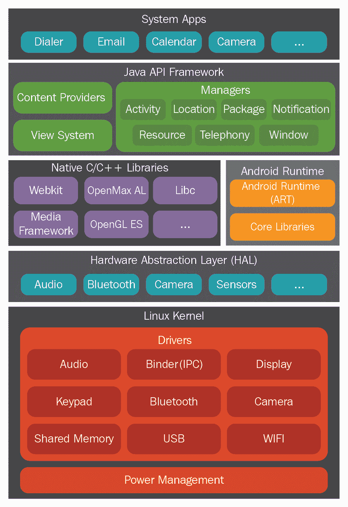

Android 架构

此图像是基于由 Android 开源项目创建并共享的作品进行修改的： [`developer.android.com/guide/platform`](https://developer.android.com/guide/platform)

许可证： [`creativecommons.org/licenses/by/4.0/`](https://creativecommons.org/licenses/by/4.0/)

每一层执行多个操作，以支持特定的操作系统功能。每一层为其上方的层提供服务。让我们稍微详细了解一下它们。

# Linux 内核层

Android 操作系统建立在 Linux 内核之上，并且谷歌对其进行了一些架构上的修改。选择 Linux 内核的原因有多个，其中最重要的是，Linux 是一个可移植的平台，可以在不同硬件上轻松编译。内核充当软件和硬件之间的抽象层。以相机为例，当你使用设备上的相机按钮拍照时，会发生什么呢？在某个时刻，硬件指令（按下按钮）必须转换为软件指令（拍照并将其存储在相册中）。内核包含驱动程序来促进这一过程。当用户按下按钮时，指令会传递到内核中相应的相机驱动程序，该驱动程序向相机硬件发送必要的命令，这类似于按下键盘上的按键时的情况。简而言之，内核中的驱动程序控制着底层硬件。如 Android 架构模型所示，内核包含与 Wi-Fi、蓝牙、**通用串行总线**（**USB**）、音频、显示等相关的驱动程序。

Linux 内核负责管理 Android 的核心功能，例如进程管理、内存管理、安全性和网络连接。Linux 在安全性和进程管理方面是一个经过验证的平台。Android 利用了现有的 Linux 开源操作系统，为其生态系统构建了坚实的基础。每个版本的 Android 都有不同版本的 Linux 内核。Oreo 版本的 Android 使用的是 Linux 内核 3.18 或 4.9，而 Pie 版本使用的是 Linux 内核 4.4、4.9 或 4.14。Android Q 版本则针对的是 Linux 内核 4.9、4.14 或 4.19。实际的内核取决于具体的设备。

# 硬件抽象层

设备的硬件能力通过 **硬件抽象层**（**HAL**）暴露给高层 Java 框架。HAL 由多个库模块组成，这些模块实现了特定类型硬件组件的接口。这使得硬件供应商能够在不更改高层系统的情况下实现功能。

# 库

Android 架构中的下一层由 Android 的原生库组成。这些库是用 C 或 C++ 编写的，帮助设备处理各种不同的数据。例如，SQLite 库对于从数据库中存储和检索数据非常有用。其他库包括媒体框架、WebKit、Surface Manager 和 **安全套接字库**（**SSL**）。

媒体框架库作为主要接口，向其他底层库提供服务。WebKit 库在网页浏览器中提供网页，而 Surface Manager 库负责维护图形。在同一层中，我们有 **Android Runtime**（**ART**）和核心库。ART 负责在 Android 设备上运行应用程序。*运行时*（runtime）一词指的是应用程序启动到关闭的这段时间。

# Dalvik 虚拟机（DVM）

您在 Android 设备上安装的所有应用程序都是用 Java 编程语言编写的。当 Java 程序被编译时，我们会得到字节码。**虚拟机**（**VM**）是一种作为操作系统运行的应用程序——也就是说，可以使用虚拟机在 Mac 上运行 Windows 操作系统，反之亦然。**Java 虚拟机**（**JVM**）就是这样一种可以执行前面提到的字节码的虚拟机。但 Android 5.0 之前的版本使用的是一种叫做 DVM 的虚拟机来运行它们的应用程序。

DVM 运行 Dalvik 字节码，这是通过**Dalvik 可执行文件**（**DEX**）编译器转换的 Java 字节码。因此，`.class` 文件通过 `dx` 工具转换为 `dex` 文件。与 Java 字节码相比，Dalvik 字节码更适合低内存和低处理能力的环境。另外，需要注意的是，JVM 的字节码由一个或多个 `.class` 文件组成，具体取决于应用程序中存在的 Java 文件数量，而 Dalvik 字节码仅由一个 `dex` 文件组成。每个 Android 应用程序都运行自己实例的 DVM。这是 Android 安全性的重要方面，将在第八章《*Android 取证设置与数据提取前技术*》中详细讨论。

下图提供了 Android 的 DVM 与 Java 的 JVM 的差异：

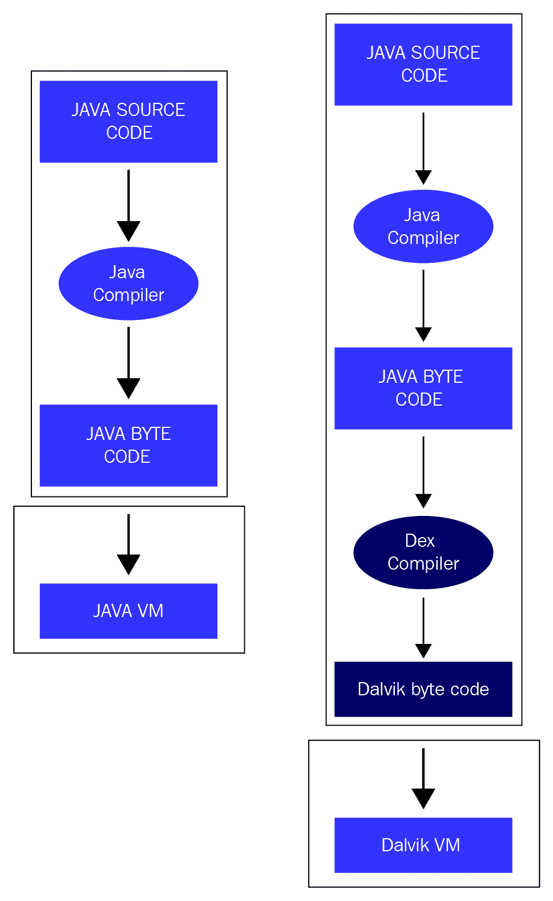

JVM 与 DVM

现在我们已经理解了 JVM 和 DVM 之间的基本差异，让我们快速看一下 ART。

# ART

从 Android 5.0 Lollipop 版本开始，Dalvik 被 ART 替代。Android 早期版本使用 **即时编译**（**JIT**）与 Dalvik（频繁执行的操作会被识别并动态编译成本地机器代码）。这种频繁使用字节码的本地执行，称为追踪（traces），提供了显著的性能提升。

与 Dalvik 不同，ART 使用**提前编译**（**AOT**）技术，在应用安装时将整个应用程序编译成原生机器代码。这会自动增加应用的安装时间，但其主要优势是消除了 Dalvik 的解释和基于跟踪的 JIT 编译，从而提高了效率并减少了功耗。ART 使用名为 `dex2oat` 的工具，接受 `DEX` 文件作为输入，并为目标设备生成已编译的应用可执行文件。使用 ART 后，**优化的 DEX**（**.odex**）文件已被 **可执行和可链接格式**（**ELF**）的可执行文件取代。

# Java API 框架层

应用框架是处理手机基本功能的层级，例如资源管理、处理电话等。通过这一层，安装在设备上的应用可以直接与设备进行交互。以下是应用框架层中的一些重要模块：

+   **电话管理器**：此模块管理所有语音电话。

+   **内容提供者**：此模块管理不同应用之间的数据共享。

+   **资源管理器**：此模块管理应用中使用的各种资源。

最后一层是系统应用层，接下来将讨论这一层。

# 系统应用层

这是最顶层的层级，用户可以直接与设备进行交互。这里有两种类型的应用——预安装应用和用户安装应用。预安装应用——如拨号器、网页浏览器和联系人——是随设备一起提供的。用户安装的应用可以从不同的地方下载，例如 Google Play 商店、亚马逊市场等。你在手机上看到的所有内容（联系人、邮件、相机等）都是应用。

到目前为止，我们已经了解了 Android 架构和重要的构建模块。接下来，我们将深入探讨 Android 操作系统中的一些固有安全特性。

# Android 安全

Android 的设计重点之一就是安全性。Android 作为一个平台，提供并执行某些功能，通过多层次的安全保护用户数据。平台有一些默认的安全设置可以保护用户，同时开发社区可以利用某些功能来构建安全的应用程序。作为一名取证调查员，了解 Android 安全的内部机制至关重要，因为这有助于识别在特定情境下应采用的最佳技术、某些技术的技术限制等。

接下来的几个章节将帮助我们更好地了解 Android 的安全特性和功能。

关于 Android 安全的详细解释可以在 [`source.android.com/security/`](https://source.android.com/security/) 找到。

# 安全内核

内核是任何操作系统安全性的核心。通过选择 Linux，作为一个经过多年来发展的可信平台，Android 建立了一个非常稳固的安全基础。Linux 内核固有的大多数安全功能都被 Android 自动采纳。例如，Linux 的基于用户的权限模型，实际上在 Android 中也运作良好。如前所述，Linux 内核中内置了大量特定代码。随着每个 Android 版本的发布，内核版本也发生了变化。以下表格显示了 Android 版本及其对应的内核版本：

| **Android 版本** | **Linux 内核版本** |
| --- | --- |
| 1 | 2.6.25 |
| 1.5 | 2.6.27 |
| 1.6 | 2.6.29 |
| 2.2 | 2.6.32 |
| 2.3 | 2.6.35 |
| 3.0 | 2.6.36 |
| 4.0 | 3.0.1 |
| 4.1 | 3.0.31 |
| 4.2 | 3.4.0 |
| 4.2 | 3.4.39 |
| 4.4 | 3.8 |
| 5.0 | 3.16.1 |
| 6.0 | 3.18.1 |
| 7.0 | 4.4.1 |
| 8.0 | 4.10 |
| 9.0 | 4.4, 4.9 和 4.14 |
| 10.0 |  4.9, 4.14 和 4.19 |

Linux 内核自动将其一些固有的安全功能带到 Android 平台，包括以下内容：

+   基于用户的权限模型

+   运行进程的隔离（应用沙箱）

+   安全的**进程间通信**（**IPC**）

现在我们来了解这些功能中的每一个。

# 权限模型

如下图所示，任何 Android 应用都必须获得用户的权限才能访问敏感功能——例如互联网、拨号器等。这为用户提供了一个机会，提前了解哪些设备功能正在被应用访问。简而言之，它需要用户的权限才能执行任何类型的恶意活动（窃取数据、破坏系统等）。

这种模型帮助用户防止攻击，但如果用户没有意识到并授予了很多权限，就会陷入麻烦（记住——在任何设备上安装恶意软件时，最弱的环节始终是用户）。

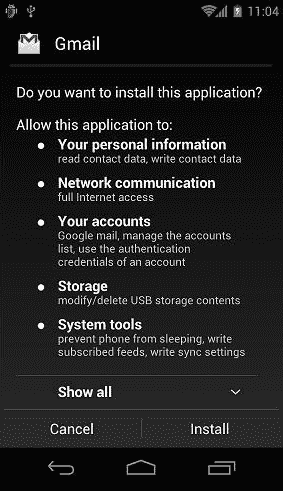

Android 中的权限模型

在 Android 6.0 之前，用户需要在安装时授予权限。用户必须接受所有权限才能安装应用，或者选择不安装应用。但是，从 Android 6.0 开始，用户在应用运行时授予应用权限。这种新的权限系统还允许用户更好地控制应用的功能，通过允许用户授予选择性权限。例如，用户可以拒绝某个应用访问他们的位置，但可以提供对互联网的访问权限。用户可以随时通过进入应用的设置界面撤销权限。从取证的角度来看，这意味着可以从设备中提取的信息不仅取决于设备和已安装的应用程序，还取决于用户配置的权限。

# 应用沙箱

在 Linux 系统中，每个用户都会被分配一个唯一的**用户标识符**（**UID**），并且用户之间是隔离的，一个用户不能访问另一个用户的数据。然而，某个特定用户下的所有应用程序都以相同的权限运行。类似地，在 Android 中，每个应用程序都作为一个独立的用户运行。换句话说，每个应用程序都会被分配一个 UID，并作为一个独立的进程运行。这一概念确保了内核级别的应用程序沙盒。内核通过利用现有的 Linux 概念，如 UID 和 **组标识符**（**GID**），来管理应用程序之间的安全限制。如果一个应用程序试图做一些恶意操作——比如读取另一个应用程序的数据——这是不允许的，因为该应用程序没有用户权限。因此，操作系统会保护应用程序，避免其访问其他应用程序的数据。

# 安全的进程间通信（IPC）

Android 提供了安全的进程间通信（IPC），通过这种方式，应用程序中的一个活动可以向同一应用程序或不同应用程序中的另一个活动发送消息。为了实现这一点，Android 提供了 IPC 机制：意图（Intents）、服务（Services）、内容提供者（Content Providers）等。这对于为 Android 平台编写第三方应用程序的开发者来说尤为重要。在后台，取证工具利用这些概念中的一些来获取设备信息。

# 应用程序签名

所有安装的应用程序必须进行数字签名。开发者只能在签名应用程序后，将其上传到 Google Play 商店。签名应用程序所使用的私钥由开发者持有。通过相同的密钥，开发者可以为应用程序提供更新、在应用程序间共享数据等操作。未经签名的应用程序，如果尝试安装，将会被 Google Play 或 Android 设备上的包安装器拒绝。在 Android 8.0 及以上版本中，用户必须进入“安装未知应用”设置，才能运行未经签名的应用程序，如下所示：

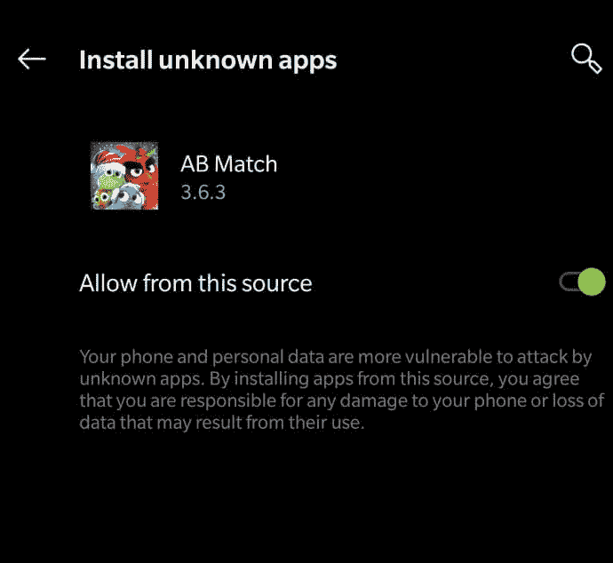

Android 中的安装未知应用屏幕

现在我们已经了解了一些关于数字签名应用程序的基本知识，接下来让我们来看一下 Android 中的一个安全特性。

# 安全增强 Linux（SELinux）

SELinux 是一种安全功能，它在 Android 4.3 中引入，并在 Android 5.0 中完全强制执行。在此之前，Android 安全基于 **自主访问控制** (**DAC**)，即应用程序可以请求权限，用户可以授予或拒绝这些权限。因此，恶意软件可以通过获取这些权限来在手机上制造破坏。但 SE Android 使用 **强制访问控制** (**MAC**)，确保应用程序在隔离的环境中运行。因此，即使用户安装了恶意应用，恶意软件也无法访问操作系统并破坏设备。SELinux 用于对所有进程执行 MAC，包括那些以 root 权限运行的进程。在 SELinux 中，任何没有明确允许的操作，默认都会被拒绝。SELinux 可以在两种全局模式下运行：**宽容**模式，记录权限拒绝但不强制执行；以及 **强制**模式，记录并强制执行权限拒绝。有关 SELinux 的更多详细信息，请参阅 [`source.android.com/security/selinux/concepts`](https://source.android.com/security/selinux/concepts)。

# FDE

从 Android 6.0 Marshmallow 开始，谷歌要求大多数设备启用 FDE，只要硬件符合某些最低标准。加密是将数据通过一个秘密密钥转换成密文的过程。在 Android 设备中，FDE 指的是使用秘密密钥加密所有用户数据的过程。该密钥又由用户设置的 **个人识别号码** (**PIN**) /图案/密码进行加密。一旦设备被加密，所有用户创建的数据会在写入磁盘前自动加密，所有读取操作则会在返回数据给调用进程前自动解密。Android 中的 FDE 仅适用于 **嵌入式多媒体卡** (**eMMC**) 和类似的闪存设备，这些设备在内核中以块设备的形式呈现。

从 Android 7.x 开始，谷歌决定将加密功能从 FDE 转移到 **基于文件的加密** (**FBE**) 中。在 FBE 中，不同的文件使用不同的密钥进行加密。通过这种方式，这些文件可以独立访问，而无需解密整个分区。因此，系统现在可以显示开放通知或访问与启动相关的文件，而无需等待用户解锁手机。

# Android 密钥库

Android 密钥库用于保护敏感的加密密钥免受未授权访问。存储在密钥库中的密钥可以用于执行加密操作，但无法从密钥库中提取出来。硬件支持的密钥库提供了硬件级别的安全性——也就是说，即使操作系统被攻击，硬件模块中的密钥仍然安全。

# TEE

TEE 是一个隔离区域（通常是一个独立的微处理器），旨在保证存储在其中的数据的安全性，同时确保代码的完整性执行。移动设备上的主处理器被认为是不可信的，不能用于存储机密数据（如加密密钥）。因此，TEE 专门用于执行这些操作，主处理器上运行的软件将任何需要使用机密数据的操作委托给 TEE 处理器。

# 验证启动

验证启动旨在确保在 Android 设备上执行的所有代码来自合法的来源，而非来自攻击者或欺诈行为。它建立了完整的信任链，并防止任何其他操作系统的侧加载。在设备启动过程中，每个阶段都会在交给下一个阶段执行之前，验证其完整性和真实性。

现在，我们将探讨 Android 设备上可用的各种分区和文件系统。

# Android 文件层次结构

为了对任何系统（桌面或移动）进行取证分析，了解底层的文件层次结构非常重要。基本了解 Android 如何组织文件和文件夹中的数据，能够帮助取证分析师将研究范围缩小到特定问题。就像其他操作系统一样，Android 使用多个分区。本章提供了一些最重要分区及其存储内容的概述。

值得再次提到的是，Android 使用 Linux 内核。因此，如果你熟悉类 Unix 系统，你将会非常了解 Android 的文件层次结构。对于那些不太了解 Linux 模型的人，以下是一些基本信息：在 Linux 中，文件层次结构是一个单一的树形结构，树的顶部表示为 `/`（称为 *根目录*）。这与在驱动器中组织文件（如 Windows 系统）是不同的。无论文件系统是本地的还是远程的，都将位于根目录下。

Android 文件层次结构是现有 Linux 层次结构的定制版本。根据设备制造商和底层 Linux 版本，这一层次结构可能会有一些不显著的变化。以下是大多数 Android 设备常见的几个重要文件夹列表。列出的一些文件夹仅通过 root 权限可见。Rooting 是在 Android 设备上获得特权访问权限的过程。关于 rooting 和执行 `adb` 命令（下文列表中展示的命令）的更多详细信息，请参见第八章，*Android 取证设置与数据提取前技巧*：

+   `/boot`：顾名思义，这个分区包含手机启动所需的信息和文件。它包含内核和**随机存取存储器**（**RAM**）磁盘，因此没有这个分区，手机无法启动其进程。RAM 中的数据非常有价值，应该在取证采集时进行捕获。

+   `/system`：该分区包含与系统相关的文件，除了内核和 RAM 磁盘之外。这个文件夹绝不能删除，否则设备将无法启动。可以通过以下命令查看此分区的内容：

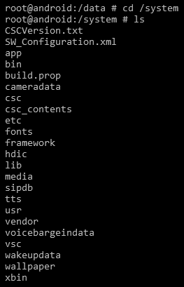

/system 分区

+   * `/recovery`：该分区用于备份目的，并允许设备进入恢复模式。在恢复模式下，您可以找到修复手机安装的工具。

+   `/data`：这是包含每个应用数据的分区。大多数属于用户的数据——如联系人、短信和拨打的号码——都存储在这个文件夹中。从取证角度来看，这个文件夹具有重要性，因为它保存着宝贵的数据。可以通过以下命令查看数据文件夹的内容：

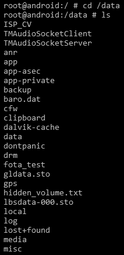

/data 分区

+   * `/cache`：这是用于存储频繁访问的数据和一些日志文件以便快速检索的文件夹。`/cache` 分区对于取证调查也很重要，因为这里的数据可能在 `/data` 分区中已经不存在。

+   * `/misc`：顾名思义，这个文件夹包含杂项设置的信息。这些设置主要定义设备的状态——即开/关。关于硬件设置、USB 设置等信息可以从此文件夹中访问。

+   `/sdcard`：这是保存所有**Secure Digital**（**SD**）卡上信息的分区。它非常重要，因为它可以包含图片、视频、文件、文档等信息。

现在我们已经理解了 Android 文件层级结构，并查看了其中的重要文件夹，接下来我们将在下一部分看看文件系统。

# Android 文件系统

理解文件系统是取证方法中的一个重要部分。了解文件系统的属性和结构对于取证分析非常有用。文件系统指的是从存储卷中存储、组织和检索数据的方式。基本安装可能基于一个卷，分成多个分区；在这里，每个分区都可以由不同的文件系统管理。正如 Linux 中的情况一样，Android 使用挂载点，而不是驱动器（即 `C:` 或 `E:`）。

在 Linux 中，挂载是将一个额外的文件系统附加到计算机当前可访问的文件系统中的操作。Linux 中的文件系统不是通过驱动器名称访问的，而是组织成一个多级层次结构，最顶层是一个名为`root`的目录。每个新的文件系统在挂载时都会加入这个单一的文件系统树中。

无论文件系统是存在于本地设备上，还是远程设备上，都没有任何区别。所有内容都在一个从`root`开始的单一层次结构中。每个文件系统定义了自己的规则来管理卷中的文件。根据这些规则，每个文件系统在文件检索、速度、安全性、大小等方面提供不同的性能。Linux 使用多个文件系统，安卓也是如此。从法医角度来看，了解安卓使用的文件系统并识别与调查相关的文件系统是非常重要的。例如，存储用户数据的文件系统是我们关注的重点，而用于启动设备的文件系统则相对次要。

# 查看安卓设备上的文件系统

可以通过查看`proc`文件夹中的`filesystems`文件内容来确定安卓内核支持的文件系统。可以使用`# cat /proc/filesystems`命令查看该文件的内容：

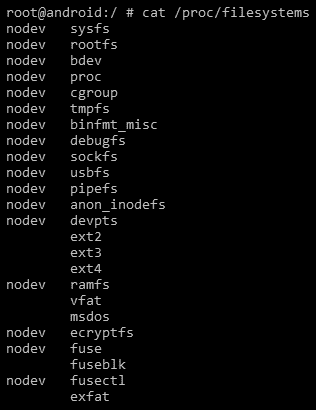

安卓设备上的文件系统

在前面的输出中，第一列告诉我们文件系统是否已挂载在设备上。具有`nodev`属性的文件系统未挂载在设备上。

第二列列出了设备上存在的所有文件系统。简单的`mount`命令会显示设备上可用的不同分区，如下所示：

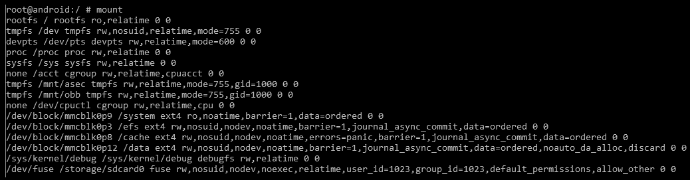

安卓设备上的分区

接下来，我们来看一下安卓上的常见文件系统。

# 安卓上的常见文件系统

安卓中的文件系统主要可以分为以下三类：

+   闪存存储文件系统

+   基于媒体的文件系统

+   虚拟文件系统

让我们详细看看它们。

# 闪存存储文件系统

闪存存储是一种持续通电的**非易失性存储器**（**NVM**），即在没有电源供应的情况下仍能保持数据。闪存可以在称为块的内存单元中被擦除和重新编程。虽然支持的文件系统根据设备和底层 Linux 内核的不同而有所变化，但常见的闪存存储文件系统如下：

+   **扩展文件分配表**（**exFAT**）是微软专有的文件系统，专门设计用于像 USB 闪存盘和 SD 卡这样的闪存驱动器。由于许可要求，它并不是标准 Linux 内核的一部分。但仍然有一些厂商为此文件系统提供支持。

+   **闪存友好文件系统**（**F2FS**）于 2013 年 2 月发布，用于支持运行 Linux 3.8 内核的三星设备。F2FS 采用基于日志的结构化方法，优化 NAND 闪存。该文件系统的离线支持功能是其亮点，尽管它仍在不断更新中，且处于过渡阶段。

+   **另一个闪存文件系统 2**（**YAFFS2**）是一个开源的单线程文件系统，发布于 2002 年。它主要设计用于处理 NAND 闪存时的高效性。YAFFS2 使用 **带外**（**OOB**），但在取证过程中，这通常无法正确捕获或解码，这使得分析变得困难。我们将在[第九章](https://cdp.packtpub.com/practical_mobile_forensics__fourth_edition/wp-admin/post.php?post=60&action=edit#post_470)中进一步讨论，*Android 数据提取技术*。YAFFS2 曾是最受欢迎的版本，并且至今仍广泛应用于 Android 设备中。YAFFS2 是一个基于日志的文件系统，即使在突然断电的情况下，也能保证数据的完整性。2010 年曾宣布，在 Gingerbread 版本之后，设备将从 YAFFS2 转向 **第四扩展文件系统**（**EXT4**）。目前，YAFFS2 不再被较新的内核版本支持，但某些移动厂商可能仍会继续支持它。

+   **健壮文件系统**（**RFS**）支持三星设备上的 NAND 闪存。RFS 可以总结为 **文件分配表 16**（**FAT16**）或 FAT32 文件系统，其中启用了通过事务日志的日志记录。许多用户抱怨三星应坚持使用 EXT4。RFS 已知存在延迟问题，导致 Android 功能变慢。

接下来是基于媒体的文件系统。

# 基于媒体的文件系统

以下是一些 Android 设备支持的基于媒体的文件系统。

**扩展文件系统**（**EXT**），1992 年专为 Linux 内核推出，是最早的文件系统之一，并且采用了虚拟文件系统。EXT2、EXT3 和 EXT4 是后续版本。EXT3 相较于 EXT2 的主要优点是日志记录功能。有了 EXT3，如果发生意外关机，就不需要验证文件系统。EXT4 文件系统在实现双核处理器的移动设备中变得越来越重要。已知 YAFFS2 文件系统在双核系统上存在瓶颈。随着 Android 的 Gingerbread 版本，YAFFS 文件系统被替换为 EXT4。

以下是三星 Galaxy 移动设备上使用 EXT4 的挂载点：

```
/dev/block/mmcblk0p9 /system ext4 ro,noatime,barrier=1,data=ordered 0    0
/dev/block/mmcblk0p3 /efs ext4 rw,nosuid,nodev,noatime,barrier=1,journal_async_commit,data=ordered 0 0
/dev/block/mmcblk0p8 /cache ext4 rw,nosuid,nodev,noatime,barrier=1,journal_async_commit,data=ordered 0 0
/dev/block/mmcblk0p12 /data ext4 rw,nosuid,nodev,noatime,barrier=1,journal_async_commit,data=ordered,n oauto_da_alloc,discard 0 0  
```

**虚拟文件分配表**（**VFAT**）是对 FAT16 和 FAT32 文件系统的扩展。微软的 FAT32 文件系统被大多数 Android 设备所支持，并且几乎所有主要操作系统（包括 Windows、Linux 和 macOS）都支持它。这使得这些系统可以轻松地读取、修改和删除 Android 设备上 FAT32 部分的文件。大多数外部 SD 卡都是使用 FAT32 文件系统格式化的。

请观察以下输出，显示了 `/sdcard` 和 `/secure/asec` 挂载点使用 VFAT 文件系统：

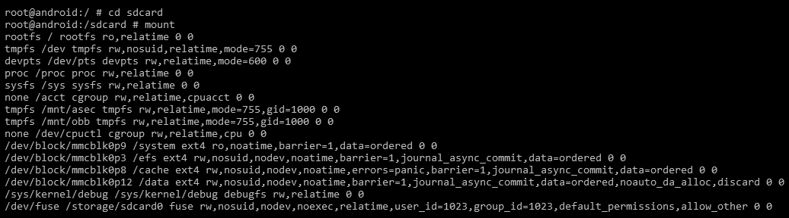

Android 中的 mount 命令输出

最后一类是假文件系统。

# 假文件系统

假文件系统，顾名思义，并非实际的文件，而是文件的逻辑分组。以下是 Android 中一些重要的假文件系统：

+   根文件系统（`rootfs`）是 Android 的主要组件之一，包含了启动设备所需的所有信息。当设备开始启动过程时，需要访问许多核心文件，因此它会挂载根文件系统。如前所示的 `mount` 命令行输出所示，这个文件系统挂载在`/`（`root` 文件夹）下。因此，这是所有其他文件系统逐步挂载的文件系统。如果这个文件系统损坏，设备将无法启动。

+   `sysfs` 文件系统挂载 `/sys` 文件夹，该文件夹包含有关设备配置的信息。以下输出显示了 Android 设备中 `sys` 目录下的各个文件夹：

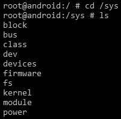

Android 中 `/sys` 目录下的文件夹

由于这些文件夹中的数据大多数与配置相关，因此对于法医调查员来说通常意义不大。但在某些情况下，我们可能希望检查手机上某个特定设置是否已启用，在这种情况下，分析这个文件夹可能会有所帮助。

请注意，每个文件夹包含大量文件。通过法医采集捕获这些数据是确保数据在检查过程中未发生更改的最佳方法。

+   `devpts` 文件系统为 Android 设备上的终端会话提供接口。它挂载在 `/dev/pts` 下。每当建立一个终端连接时——例如，当 `adb` shell 连接到 Android 设备时——一个新的节点会在 `/dev/pts` 下创建。以下是当 `adb` shell 连接到设备时的输出：

```
shell@Android:/ $ ls -l /dev/pts ls -l /dev/pts
crw------- shell shell 136, 0 2013-10-26 16:56 0
```

+   `cgroup` 文件系统代表 **控制组**。Android 设备使用这个文件系统来跟踪它们的任务。它们负责聚合任务并进行跟踪。此数据在法医分析中通常不太有用。

+   `proc` 文件系统包含有关内核数据结构、进程以及其他系统相关信息，这些信息存储在 `/proc` 目录中。例如，`/sys` 目录包含与内核参数相关的文件。同样，`/proc/filesystems` 显示设备上可用的文件系统列表。以下命令显示设备的 **中央处理单元** (**CPU**) 的所有信息：

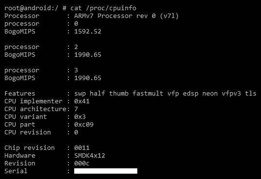

在 Android 设备上运行 cpuinfo 命令的输出

类似地，还有许多其他有用的文件，在你浏览它们时提供了宝贵的信息。

+   `tmpfs` 文件系统是设备上的一种临时存储设施，它将文件存储在 RAM（易失性内存）中。使用 RAM 的主要优点是访问和检索速度更快。但一旦设备重新启动或关闭，这些数据将无法再访问。因此，取证调查员必须在设备重启之前检查 RAM 中的数据，或通过 RAM 获取方法提取数据。

当今的取证工具可以轻松挂载这些文件系统，并在 **图形用户界面** (**GUI**) 屏幕上显示其内容，从而使取证调查员能够轻松地浏览和解析这些文件。在 Android 取证的初期，调查员通常需要运行一系列 Linux 或 Windows 命令来格式化并查看这些文件系统。

# 总结

在本章中，我们介绍了 Android 操作系统的基础特性、文件系统以及在取证调查中有用的其他细节。我们了解了 Android 中内置的有趣安全功能。与 iOS 不同，Android 存在多个变种，因为许多设备运行 Android 操作系统，每个设备可能具有不同的文件系统和独特的功能。Android 是开放和可定制的，这也改变了数字取证的竞争格局。这些知识将有助于理解取证获取技术。

在下一章中，我们将讨论如何在执行分析之前设置取证工作站。
