# 第九章：安卓法医设置和数据提取前的技术

在上一章中，我们介绍了安卓架构、安全特性、文件系统以及其他功能的基础知识。在开始检查之前，建立一个法医环境非常重要，因为这确保了数据的保护，同时你作为检查员能够控制工作站。本章将解释设置数字法医检查环境的过程，并阐述设置时需要考虑的事项。始终保持对法医环境的控制至关重要；这可以防止污染物的引入，从而影响法医调查。

本章将涵盖以下主题：

+   为安卓设置法医环境

+   将安卓设备连接到工作站

+   屏幕锁绕过技术

+   获得 root 权限

# 为安卓设置法医环境

作为一名法医检查员，在调查过程中你可能会遇到各种类型的手机。因此，有必要在此基础上设置一个基本环境，根据需求进行扩展。同时，始终保持对环境的完全控制也非常重要，以避免任何意外情况的发生。设置一个合适的实验室环境是法医过程中的一个重要环节。安卓法医设置通常包括以下步骤：

1.  从一个全新或法医无菌的计算机环境开始。这意味着系统中不存在其他数据，或者数据以一种方式进行存储，避免污染当前的调查。

1.  安装连接设备所需的基本软件。安卓法医工具和方法可以在 Windows、Linux 和 macOS 平台上运行。

1.  获得对设备的访问权限。你必须能够启用设置或绕过它们，以便从安卓设备中提取数据。

1.  使用本章和第九章中定义的方法，*安卓数据提取技术*，向设备发出命令。

以下章节提供了设置基本安卓法医工作站的指导。

# 安装软件

安卓**软件开发工具包**（**SDK**）帮助开发者构建、测试和调试在安卓上运行的应用程序。安卓 SDK 包括安卓 Studio，这是开发安卓应用的官方**集成开发环境**（**IDE**）。安卓 Studio 提供了有价值的文档和其他工具，在安卓设备调查过程中能提供很大的帮助。或者，你也可以仅下载平台工具，它们是安卓 SDK 的一部分，包含与安卓平台交互的工具，如 ADB、fastboot 等；这些将在以下章节中详细描述。

对 Android SDK 有良好的理解将帮助你掌握设备的细节及其数据。

Android Studio 包含软件库、API、工具、模拟器和其他参考材料。你可以从[`developer.android.com/studio/index.html`](https://developer.android.com/studio/index.html)免费下载。平台工具可以从[`developer.android.com/studio/releases/platform-tools`](https://developer.android.com/studio/releases/platform-tools)下载。

在进行取证调查时，拥有这些工具可以帮助你连接到 Android 设备并访问其中的数据。Android SDK 更新非常频繁，因此确认你的工作站也保持更新非常重要。Android SDK 可以在 Windows、Linux 和 macOS 上运行。

# 安装 Android 平台工具

在对取证设备进行调查时，必须安装并正确配置 Android SDK 或 Android 平台工具。Windows 版的 Android Studio 大约是 718MB，相较于仅为 20MB 的 Android 平台工具软件来说较为庞大。

以下是在 Windows 10 机器上安装 Android 平台工具的逐步步骤：

1.  在安装 Android Studio 或平台工具之前，请确保你的系统已安装**Java 开发工具包**（JDK），因为 Android SDK 依赖于 Java SE 开发工具包。

JDK 可以从[`www.oracle.com/technetwork/java/javase/downloads/index.html`](http://www.oracle.com/technetwork/java/javase/downloads/index.html)下载。

1.  从[`developer.android.com/studio/releases/platform-tools`](https://developer.android.com/studio/releases/platform-tools)下载平台工具的最新版本。

1.  右键点击并将 ZIP 文件解压到一个文件夹。安装位置由你选择，并且必须记住以便未来访问。在本示例中，我们将其解压到`C:\ folder`。

1.  打开目录（`C:\platform-tools`），并注意到以下工具列出在其中：

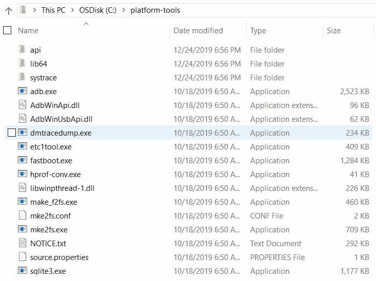

Android 平台工具

这完成了基础的 Android 工具安装。如果你安装的是完整的 Android Studio 版本，你仍然应该能在新安装的 Android 目录下看到平台工具文件夹。

# 创建 Android 虚拟设备

使用 Android Studio，你可以创建一个**Android 虚拟设备**（**AVD**），也叫做模拟器，这通常在开发者创建新应用时使用；然而，从取证的角度来看，模拟器也具有重要意义。模拟器在理解应用程序如何在设备上运行和执行时非常有用。这在确认在取证调查过程中发现的某些结果时会有所帮助。

此外，在使用运行较旧平台的设备时，您可以为相同的平台设计仿真器。此外，在将取证工具安装到真实设备之前，可以使用仿真器来了解取证工具如何工作以及如何更改 Android 设备上的内容。要在 Windows 工作站上创建新的 AVD，请按照以下步骤操作：

1.  打开 Android Studio 并导航到工具 | AVD 管理器。Android 虚拟设备管理器窗口如下图所示：

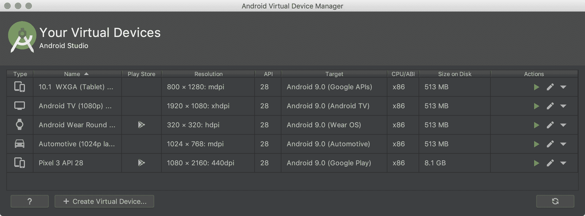

Android 虚拟设备管理器

1.  点击“创建虚拟设备”以创建新的虚拟设备。在接下来的屏幕中，选择适当的硬件、系统映像、API 级别、AVD 名称等，并继续操作。例如，以下截图显示选择了 Android Pie：

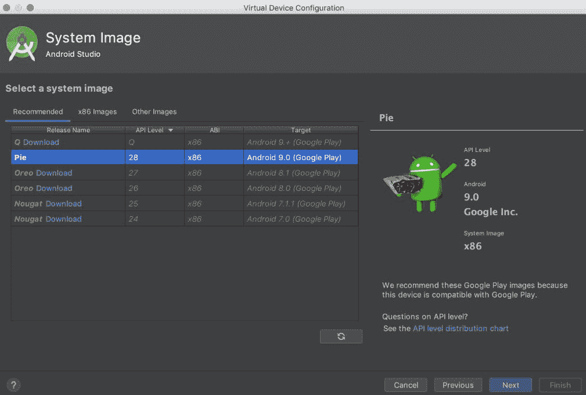

虚拟设备配置

1.  设备成功创建后，会显示一个确认消息。现在，选择 AVD 并点击播放按钮。

1.  这应该会启动仿真器。请注意，这可能需要几分钟，甚至更长时间，具体取决于工作站的 CPU 和内存。仿真器确实会消耗系统大量资源。成功启动后，AVD 将运行，如下图所示：


Android 仿真器

从取证的角度来看，分析师和安全研究人员可以利用仿真器的功能来了解文件系统、数据存储等。通过仿真器工作时创建的数据存储在主目录下名为`android`的文件夹中。例如，在我们的示例中，我们之前创建的 Pixel_XL_API_28 仿真器的详细信息存储在`C:\Users\Rohit\.android\avd\Pixel_XL_API_28.avd`下。

在此目录下的各种文件中，以下是对取证分析师有兴趣的文件：

+   `cache.img`：这是`/cache`分区的磁盘映像（记得我们在*第七章*《理解 Android》中讨论了 Android 设备的`/cache`分区）。

+   `sdcard.img`：这是 SD 卡分区的磁盘映像。

+   `Userdata-qemu.img`：这是`/data`分区的磁盘映像。`/data`分区包含设备用户的宝贵信息。

现在我们已经了解了设置环境的步骤，接下来让我们将 Android 设备连接到取证工作站。

# 将 Android 设备连接到工作站

使用开源工具对 Android 设备进行取证采集时，需要将设备连接到取证工作站。任何设备的取证采集应在取证工作站上进行。取证工作站仅限于用于取证，不能用于个人用途。

请注意，每当设备插入计算机时，可能会对设备进行更改；你必须始终完全控制与 Android 设备的所有交互。

为了成功将设备连接到工作站，您需要执行以下步骤。请注意，写保护可能会阻止设备成功获取数据，因为可能需要向设备发送命令以提取信息。所有以下步骤应在测试设备上验证后，再尝试在真实证据上执行。

# 识别设备数据线

Android 设备的物理 USB 接口允许它连接到计算机以共享数据，如歌曲、视频和照片。此 USB 接口可能因制造商和设备型号不同而有所变化。例如，一些设备使用 mini-USB，而另一些则使用 micro-USB 和 USB Type C。此外，一些制造商使用自己的专有格式，如 EXT-USB、EXT micro-USB 等。在获取 Android 设备的第一步是确定所需的设备数据线类型。

有不同类型，如 mini-USB、micro-USB 以及其他专有格式。以下是最常用连接器类型的简要描述：

| **连接器类型** | **描述** |
| --- | --- |
| Mini - A USB | 它的大小大约为 7 x 3 毫米，长边的两个角被抬起。 |
| Micro - B USB | 它的大小大约为 6 x 1.5 毫米，两个角被切掉形成一个梯形。 |
| 同轴连接器 | 它有一个圆形孔，中间插着一个针。此类别有不同的尺寸，直径从 2 毫米到 5 毫米不等。广泛应用于诺基亚型号。 |
| D Sub-miniature | 它的形状为矩形，具有两个圆角。矩形的长度不同，但高度始终为 1.5 到 2 毫米。主要用于三星和 LG 设备。 |

接下来，我们来快速了解一下如何安装设备驱动程序。

# 安装设备驱动程序

为了正确识别设备，计算机可能需要安装某些驱动程序。如果没有必要的驱动程序，计算机可能无法识别并正常与连接的设备工作。问题在于，由于 Android 允许制造商进行修改和定制，因此没有通用的驱动程序适用于所有 Android 设备。每个制造商编写自己的专有驱动程序并通过互联网发布，因此，确定需要安装的特定设备驱动程序非常重要。当然，一些 Android 取证工具包（我们将在后续章节中讨论）确实提供了一些通用驱动程序或一组最广泛使用的驱动程序；但它们可能无法适用于所有型号的 Android 手机。

一些 Windows 操作系统在设备插入后能够自动检测并安装驱动程序，但大多数情况下它们会失败。所有制造商的设备驱动程序都可以在各自的官方网站上找到。

# 访问连接的设备

如果你还没有这样做，请直接使用 USB 电缆将解锁的 Android 设备连接到计算机。Android 设备将显示为一个新驱动器，你将能够访问外部存储上的文件。如果设备被锁定，则此时你将无法访问任何文件，可能需要使用“开启 USB 存储”选项，这个选项可以在手机上启用，如下图所示：

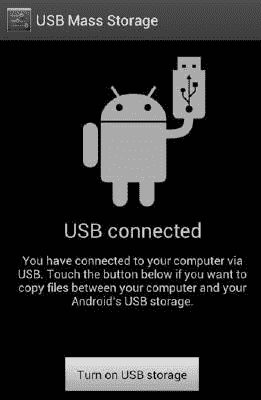

Android 4.1 版本中的 USB 大容量存储

对于一些 Android 手机（尤其是 HTC 手机），当设备通过 USB 电缆连接时，它可能会暴露出多个功能。例如，如下图所示，当 HTC 设备连接时，它会呈现一个包含四个选项的菜单。默认选择是仅充电。当选择磁盘驱动器选项时，它将作为磁盘驱动器挂载：

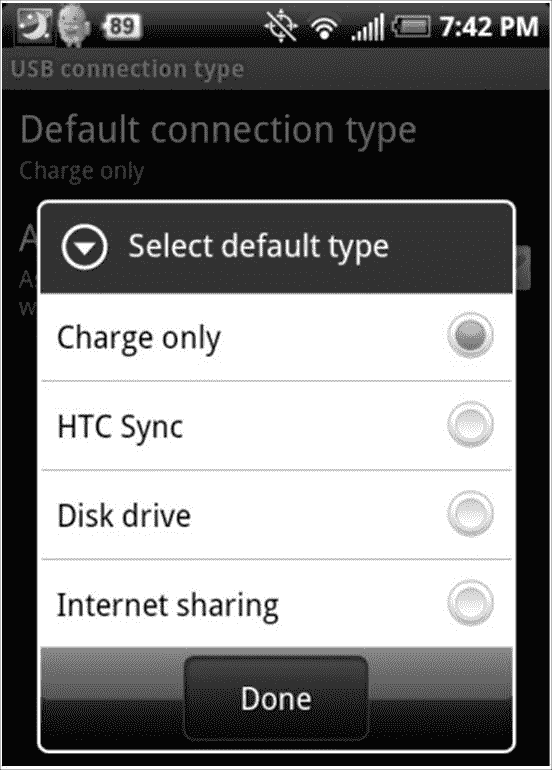

HTC 手机的 USB 选项

当设备作为磁盘驱动器挂载时，你将能够访问设备上存在的 SD 卡。从法医角度来看，SD 卡具有重要价值，因为它可能包含对调查重要的文件；然而，存储在`/data/data`下的核心应用数据将保留在设备上，并无法通过这些方法访问。

# Android 调试桥

被认为是 Android 取证中最关键的组件之一，**Android 调试桥**（**ADB**）是一个命令行工具，允许你与 Android 设备进行通信并控制它。在接下来的章节中，我们将详细了解 ADB；现在，我们将专注于 ADB 的基本介绍。你可以在`/platform-tools/`下访问 ADB 工具。

在我们讨论任何关于 ADB 的内容之前，我们需要先了解**USB 调试**选项。

# USB 调试

此选项的主要功能是启用 Android 设备与安装了 Android SDK 的工作站之间的通信。在 Samsung 手机上，你可以在“设置 | 开发者选项”中找到这个选项，如下图所示：

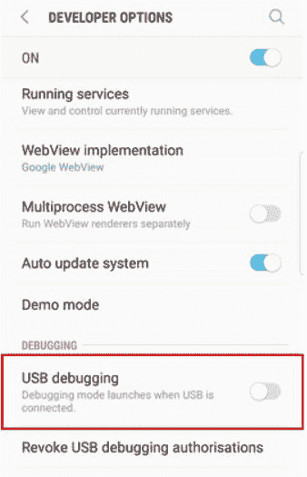

Samsung S8 设备中的 USB 调试选项

其他 Android 手机可能有不同的环境和配置特性。你可能需要通过访问构建模式来强制启用“开发者选项”。

然而，从 Android 4.2 开始，开发者选项菜单被隐藏，以确保用户不会意外启用它。要启用它，请进入设置 | 关于手机，然后连续点击“版本号”字段七次。完成此操作后，开发者选项将出现在设置菜单中。在 Android 4.2.2 之前，启用此选项是与设备通过 ADB 通信的唯一要求；然而，从 Android 4.2.2 开始，Google 引入了安全的 USB 调试选项。此功能仅允许用户明确授权的主机通过 ADB 连接设备。

因此，当你通过 USB 将设备连接到新工作站以访问 ADB 时，你需要首先解锁设备，并通过在确认窗口中按 OK 来授权访问，如下图所示。如果勾选了“始终允许来自此计算机的访问”，则以后设备将不会再提示授权：

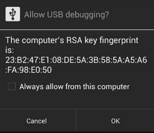

安全的 USB 调试

当选择 USB 调试选项时，设备将运行 **adb 守护进程** (`adbd`) 在后台，并持续寻找 USB 连接。该守护进程通常在一个没有特权的 shell 用户账户下运行，因此不会提供对完整数据的访问权限；然而，在 root 设备上，`adbd` 会以 root 账户运行，从而提供对所有数据的访问权限。除非所有其他取证方法都失败，否则不推荐将设备 root 以获取完全访问权限。如果你选择将 Android 设备 root，必须在尝试应用到真实证据之前对方法进行详细记录和测试。关于 root 的内容将在本章末尾讨论。

在安装了 Android SDK 的工作站上，`adbd` 将作为后台进程运行。同时，在同一工作站上，还会有一个客户端程序，可以通过在 shell 中输入 `adb` 命令来启动。当 `adb` 客户端启动时，它会首先检查是否已经有 `adb` 守护进程在运行。如果没有，它会启动一个新的进程来启动 `adb` 守护进程。`adb` 客户端程序通过端口 `5037` 与本地的 `adbd` 通信。

# 使用 adb 访问设备

一旦环境设置完成，且 Android 设备处于 USB 调试模式，使用 USB 电缆将 Android 设备连接到取证工作站并开始使用 `adb`。

# 检测连接的设备

以下 `adb` 命令提供了所有连接到取证工作站的设备列表。如果在发出命令时模拟器正在运行，它也会被列出。另外请记住，如果未安装必要的驱动程序，则该命令将显示空白消息。如果遇到这种情况，请从制造商处下载并安装必要的驱动程序：

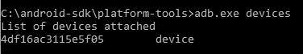

我们现在已经获得了连接到工作站的设备列表。接下来，我们将查看如何停止本地 ADB 服务器。

# 杀死本地 ADB 服务器

以下命令用于终止本地的 `adb` 服务：

```
C:\android-sdk\platform-tools>adb.exe kill-server
```

在终止本地 `adb` 服务后，执行 `adb devices` 命令。你将看到服务器已启动，如以下截图所示：

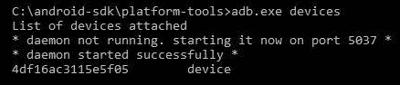

现在我们将访问 Android 设备上的 ADB shell。

# 访问 adb shell

`adb` shell 命令允许你访问 Android 设备上的 shell，并与设备进行交互。

以下是访问 `adb` shell 并执行基本 `ls` 命令以查看当前目录内容的命令：

```
C:\android-sdk\platform-tools>adb.exe shell shell@android:/ $ ls
ls acct cache
config d
data default.prop dev
efs etc
factory fstab.smdk4x12 init
init.bt.rc init.goldfish.rc init.rc init.smdk4x12.rc init.smdk4x12.usb.rc
....  
```

Android 模拟器可供你执行并理解 `adb` 命令，然后再在设备上使用它们。在第九章《*Android 数据提取技术*》中，我们将详细介绍如何利用 adb 安装应用程序、从设备中复制文件和文件夹、查看设备日志等。

# 基本 Linux 命令

现在我们将快速浏览一些常用的 Linux 命令及其在 Android 设备上的使用：

+   `ls`：`ls` 命令（不带任何选项）列出当前目录中存在的文件和目录。使用 `-l` 选项时，该命令会显示文件和目录的详细信息，如大小、修改日期和时间、文件所有者及其权限等，如以下命令行输出所示：

```
shell@android:/ $ ls -l
ls -l
drwxr-xr-x root     root             2015-01-17 10:13 acct
drwxrwx--- system   cache             2014-05-31 14:55 cache
dr-x------ root     root              2015-01-17 10:13 config
lrwxrwxrwx root     root              2015-01-17 10:13 d -> /sys/kernel/debug
drwxrwx--x system   system            2015-01-17 10:13 data
-rw-r--r-- root     root          116 1970-01-01 05:30 default.prop
drwxr-xr-x root     root              2015-01-17 10:13 dev
drwxrwx--x radio    system            2013-08-13 09:34 efs
lrwxrwxrwx root     root              2015-01-17 10:13 etc -> /system/etc
...  
```

同样，以下是一些可以与 `ls` 命令一起使用的选项：

| **选项** | **描述** |
| --- | --- |
| `a` | 列出隐藏文件 |
| `c` | 按时间戳显示文件 |
| `d` | 只显示目录 |
| `n` | 显示长格式列表，包括 GID 和 UID 编号 |
| `R` | 显示子目录 |
| `t` | 根据时间戳显示文件 |
| `u` | 显示文件访问时间 |

根据需求，调查员可以使用以下一个或多个选项来查看详细信息：

+   `cat`：`cat` 命令用于读取一个或多个文件并将其内容输出到标准输出，示例如下所示：

```
shell@android:/ $ cat default.prop
cat default.prop
#
# ADDITIONAL_DEFAULT_PROPERTIES
#
ro.secure=1
ro.allow.mock.location=0
ro.debuggable=0
persist.sys.usb.config=mtp  
```

要将多个文件合并为一个文件，我们可以使用 `>` 运算符。要向现有文件追加内容，我们可以使用 `>>` 运算符。

+   `cd`：`cd` 命令用于在不同目录之间切换。通常在从一个文件夹切换到另一个文件夹时使用。以下示例展示了用于切换到 `system` 文件夹的命令：

```
shell@android:/ $ cd /system
cd /system
shell@android:/system $   
```

+   `cp`：`cp` 命令可以用于将文件从一个位置复制到另一个位置。该命令的语法如下：

```
$ cp [options] <source><destination>  
```

+   `chmod`：`chmod` 命令用于更改文件系统对象（文件和目录）的访问权限。它还可以更改特殊模式标志。该命令的语法如下：

```
$ chmod [option] mode files  
```

例如，`chmod 777` 命令为文件赋予所有人读取、写入和执行权限。

+   `dd`：`dd` 命令用于复制文件，并根据操作数进行转换和格式化。在 Android 上，`dd` 命令可以用来创建 Android 设备的逐位镜像。关于镜像的更多细节，请参阅 *第四章*，*来自 iOS 备份的数据获取*。以下是需要与此命令一起使用的语法：

```
dd if=/test/file of=/sdcard/sample.image    
```

+   `rm`：`rm` 命令可以用来删除文件或目录。以下是此命令的语法：

```
rm file_name    
```

+   `grep`：`grep` 命令用于在文件或输出中搜索特定的模式。该命令的语法如下：

```
grep [options] pattern [files]    
```

+   `pwd`：`pwd` 命令用于显示当前工作目录。例如，以下命令行输出显示当前工作目录为 `/system`：

```
shell@android:/system $ pwd
pwd
/system  
```

+   `mkdir`：`mkdir` 命令用于创建新目录。以下是此命令的语法：

```
mkdir [options] directories  
```

+   `exit`：`exit` 命令用于退出当前所在的 shell。在 shell 中输入 `exit` 即可退出。

接下来，我们将看到如何在调查前高效地处理 Android 设备。

# 处理 Android 设备

在进行法医调查之前，正确处理 Android 设备是非常重要的任务。应小心确保我们的无意操作不会导致数据修改或其他不必要的事件。以下章节将重点介绍在法医调查的初期阶段处理设备时需要考虑的一些问题。

随着技术的进步，*设备锁定* 的概念在过去几年发生了显著变化。由于安全意识的普遍提高，大多数用户现在在其设备上启用了密码锁定机制。在我们研究一些绕过锁定 Android 设备的技术之前，重要的是当有机会时，我们不要错过禁用密码锁定的机会。

当第一次访问要分析的 Android 设备时，检查设备是否仍然处于活动状态（未锁定）。如果是，请更改设备设置，以便获得更多的设备访问权限。当设备仍然处于活动状态时，可以考虑执行以下任务：

+   **启用 USB 调试**：一旦启用了 USB 调试选项，就可以通过 `adb` 连接获得更多对设备的访问权限。这对于从设备提取数据至关重要。启用 USB 调试的选项位置可能因设备而异，但通常位于设置中的开发者选项下。大多数物理获取 Android 设备的方法都需要启用 USB 调试。

+   **启用保持唤醒设置**：如果选中保持唤醒选项，并且设备正在充电，则设备永远不会锁定。如果设备锁定，数据采集过程可能会被中断。

+   **增加屏幕超时**：这是设备解锁后有效激活的时间。访问此设置的位置会根据设备型号有所不同。在三星 Galaxy S3 手机上，您可以通过导航至 设置 | 显示 | 屏幕超时 来访问此设置。

除此之外，如 *第一章* 中所述，*移动法证简介*，设备需要与网络隔离，以确保远程擦除选项无法在设备上生效。安卓设备管理器允许远程擦除或锁定手机。这可以通过登录到配置在手机上的 Google 账户来完成。更多的细节将在后续章节中提供。如果安卓设备未设置为允许远程擦除，则只能通过安卓设备管理器对设备进行锁定。此外，市场上还有一些 **移动设备管理** (**MDM**) 软件产品，允许用户远程锁定或擦除安卓设备。某些产品可能不需要在设备上启用特定设置。

使用可用的远程擦除软件，可以删除所有数据，包括电子邮件、应用程序、照片、联系人以及其他文件，以及存储在 SD 卡上的文件。为了将设备与网络隔离，您可以将设备设置为飞行模式并禁用 Wi-Fi，作为额外的预防措施。启用飞行模式并禁用 Wi-Fi 是有效的，因为设备将无法通过蜂窝网络进行通信，并且无法通过 Wi-Fi 访问。移除手机的 SIM 卡也是一个选项，但这并不能有效阻止设备通过 Wi-Fi 或其他蜂窝网络进行通信。要将设备设置为飞行模式，请按住电源按钮并选择飞行模式。

当安卓设备未锁定时，可以执行所有这些步骤；然而，在调查过程中，我们常常会遇到被锁定的设备。因此，了解如何绕过锁定密码（如果已启用）变得尤为重要。

# 屏幕锁定绕过技术

由于用户意识的提高以及功能的简易性，使用密码选项来锁定安卓设备的数量呈指数增长。这意味着在法证调查过程中绕过设备屏幕锁定变得越来越重要。迄今为止讨论的屏幕锁定绕过技术的适用性取决于具体情况。需要注意的是，这些方法中的一些可能会导致我们对设备进行更改。请确保在非证据性质的安卓设备上测试并验证所有列出的步骤。您必须获得授权才能对设备进行必要的更改，记录所有采取的步骤，并能够在需要法庭证词时描述所采取的步骤。

当前，安卓提供三种类型的屏幕锁机制。尽管有些设备提供语音锁、面部识别锁和指纹锁等选项，但我们将仅讨论以下三种，因为这三种是所有安卓设备中最广泛使用的：

+   **图案锁**：用户在手机上设置一个图案或设计，必须画出相同的图案才能解锁设备。安卓是首个引入图案锁的智能手机操作系统。

+   **PIN 码**：这是最常见的锁定选项，许多手机都有此功能。PIN 码是一个四位数字，需要输入该数字才能解锁设备。

+   **密码**：这是一个由字母和数字组成的密码。与仅包含四位数字的 PIN 码不同，字母数字密码包括字母和数字。

以下部分详细介绍了几种技术，你可以用来绕过这些安卓锁屏机制。根据情况，这些技术可能帮助调查人员绕过屏幕锁。

# 使用 ADB 绕过屏幕锁

如果安卓设备上启用了 USB 调试，明智的做法是利用这一点，通过 USB 连接使用`adb`进行连接，正如本章前面部分所讨论的那样。你应该将设备连接到取证工作站并执行`adb` devices 命令。如果设备显示出来，则说明 USB 调试已启用。如果安卓设备被锁定，你必须尝试绕过屏幕锁。以下两种方法可能在启用 USB 调试时帮助你绕过屏幕锁。

# 删除 gesture.key 文件

删除`gesture.key`文件将删除设备上的图案锁；然而，需要注意的是，这会永久改变设备，因为图案锁已被移除。如果你正在进行秘密操作，这一点应考虑在内。以下是该过程的步骤：

1.  使用 USB 线将设备连接到取证工作站（本示例中为 Windows 机器）。

1.  打开命令提示符并执行以下指令：

```
adb.exe shell
cd /data/system rm gesture.key  
```

1.  重启设备。如果图案锁仍然出现，只需随便画一个图案，设备应该能够顺利解锁。

当设备已被 root 时，这种方法有效。在未 root 的设备上，此方法可能无法成功。未经适当授权，不应对安卓设备进行 root 操作，因为这会改变设备的原始状态。

# 更新 settings.db 文件

要更新`settings.db`文件，请按以下步骤操作：

1.  使用 USB 线将设备连接到取证工作站。

1.  打开命令提示符并执行以下指令：`/data/data/com.android.providers.settings/databases sqlite3 settings.db`：

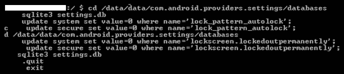

1.  退出并重启设备。

1.  安卓设备应处于解锁状态。如果未解锁，尝试按照之前的说明删除`gesture.key`文件。

在接下来的部分，我们将查看恢复模式和 ADB 连接。

# 检查修改后的恢复模式和 ADB 连接

在 Android 中，恢复指的是存放恢复控制台的专用分区。恢复的两个主要功能是删除所有用户数据和安装更新。例如，当你恢复出厂设置时，恢复分区会启动并删除所有数据。同样，当需要安装更新时，也是通过恢复模式来完成的。

有许多热衷的 Android 用户通过修改的恢复模块安装自定义 ROM。这个修改过的恢复模块主要是为了简化安装自定义 ROM 的过程。恢复模式的访问方式因设备制造商而异；关于哪种方法适用于哪种制造商的设备的信息可以在互联网上轻松找到。通常，这可以通过同时按住不同的按钮来完成，比如音量键和电源键。进入恢复模式后，将设备连接到工作站并尝试访问 `adb` 连接。如果设备的恢复模式未被修改，你可能无法访问 `adb` 连接。设备的修改版恢复版本会为用户提供不同的选项，如下图所示：

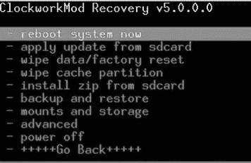

接下来，我们将看到如何刷新恢复分区。

# 刷新新的恢复分区

有可用机制可以通过修改的镜像刷新 Android 设备的恢复分区。fastboot 工具可以方便地完成这一过程。Fastboot 是一个诊断协议，随 SDK 包提供，主要用于通过主机计算机的 USB 连接修改闪存文件系统。为此，你需要将设备启动到引导加载程序模式，在此模式下只执行最基本的硬件初始化。

一旦在设备上启用该协议，它将接受通过 USB 数据线发送的特定命令集。这些命令通过命令行发送。刷新或重写一个分区，使用保存在计算机上的二进制镜像文件就是一个允许的命令。一旦恢复分区被刷新，启动设备进入恢复模式，挂载 `/data` 和 `/system` 分区，并使用 `adb` 删除 `gesture.key` 文件。重启手机后，应该能够绕过屏幕锁；然而，这只有在设备的引导加载程序解锁的情况下才能生效。此外，刷新操作会永久改变设备。你也可以使用 fastboot `boot` 命令临时启动恢复镜像，在不永久改变恢复分区的情况下删除键文件。

# 使用自动化工具

市场上有几种自动化解决方案可以解锁安卓设备。像 Cellebrite 和 XRY 这样的商业工具能够绕过屏幕锁定，但大多数工具都要求启用 USB 调试。接下来，我们将探讨如何使用 UFED 用户锁定代码恢复工具解锁安卓设备。此工具仅适用于支持 USB OTG 的设备。此过程还需要 UFED 相机、500 号绕过锁定电缆和 501 号绕过锁定电缆。工具安装在工作站后，按照以下步骤解锁安卓设备：

1.  在工作站上运行该工具并按 `1`，如下图所示：

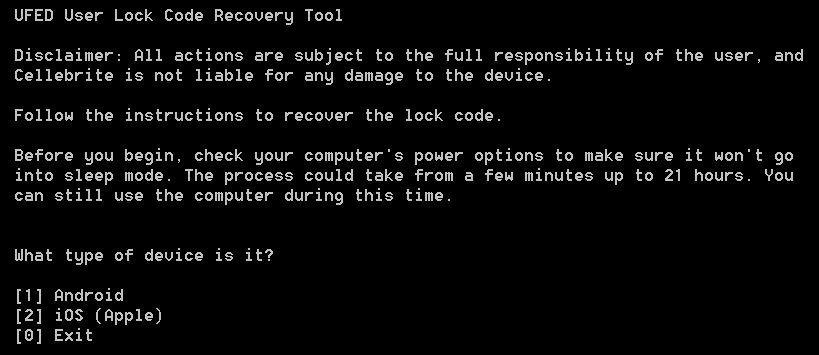

UFED 用户锁定代码恢复工具

1.  现在，将 500 号绕过锁定电缆的 A 端连接到工作站的 USB 端口。同时，将 500 号绕过锁定电缆的 B 端连接到 501 号 OTG 电缆，然后将另一端连接到设备。

1.  连接后，工具会提示你选择恢复配置文件。选择 `[1] 手动选择恢复配置文件`。

1.  现在，选择设备上使用的锁定类型和恢复配置文件，并按照屏幕上的指示进行操作。

1.  接下来，确保设备屏幕上出现了数字键盘，并准备好接受 PIN 码。

1.  关闭任何可能出现的消息窗口。按 `1` 并按 *Enter*。现在，通过输入随机内容进行五次错误的登录尝试，然后点击设备底部的“忘记图案”。

1.  按照屏幕上的指示操作，等待相机窗口打开，然后点击相机窗口。

1.  使用光标选择设备屏幕上任意非空区域，将绿色方框覆盖其上——例如，选择屏幕上的任意数字。工具将使用此信息来检测设备是否已解锁。按 *Enter* 键开始过程。

1.  工具将尝试多种组合来解锁设备。解锁成功后，它会提示你结束该过程。

现在我们将了解 Android 设备管理器以及如何使用它解锁设备。

# 使用 Android 设备管理器

大多数最新的安卓手机都配备了一项名为 Android 设备管理器的服务，该服务帮助设备拥有者定位丢失的手机。此服务还可以用来解锁设备；然而，只有在你知道配置在设备上的 Google 账户凭据时，才能实现此功能。如果你可以访问账户凭据，请按照以下步骤解锁设备：

1.  在工作站上访问 [`google.com/android/devicemanager`](http://google.com/android/devicemanager)。

1.  使用配置在设备上的 Google 账户登录。

1.  选择需要解锁的设备并点击“锁定”，如下图所示：

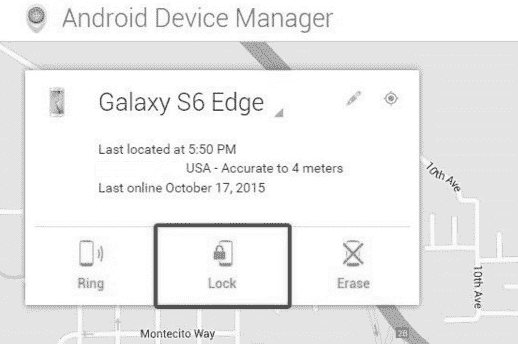

Android 设备管理器

1.  输入临时密码后，再次点击“锁定”。

1.  成功后，在设备上输入临时密码以解锁设备。

这可以在不知道保存登录凭据的计算机（即嫌疑人的电脑）凭证的情况下完成。

# 使用“查找我的手机”绕过（仅限三星手机）

使用“查找我的手机”是一个值得尝试的技术，尤其是当你处理三星设备时；但是，它仅在设备所有者已登录三星账户并且你知道设备上配置的三星账户凭据时有效。

要开始此过程，请从网页浏览器访问“查找我的手机”服务，然后使用在设备上注册的三星账户凭据登录，如下所示：

1.  点击位于左侧的“锁定我的屏幕”选项：

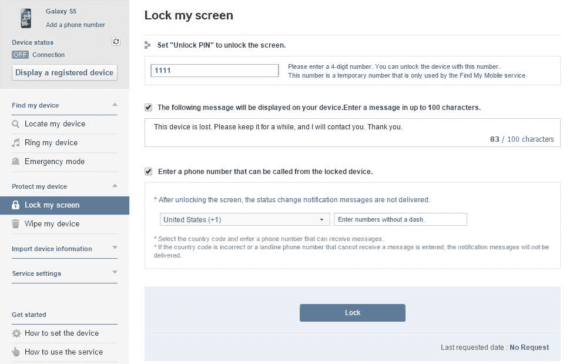

1.  现在，输入任意临时 PIN，然后点击“锁定”按钮。（某些设备上可能会看到“解锁我的屏幕”选项，它也具有相同的功能）。现在，可以使用之前设置的临时 PIN 解锁手机。

接下来，让我们看一下污迹攻击。

# 污迹攻击

在少数情况下，污迹攻击可能用于推测触摸屏移动设备的密码。这种攻击依赖于识别用户手指留下的污迹。虽然这种方法可能提供绕过方式，但必须指出，由于大多数 Android 设备是触摸屏的，且使用设备时也会留下污迹，污迹攻击不太可能成功；然而，已经证明，在适当的光线下，留下的污迹是可以轻松检测到的，如以下截图所示。

通过分析污迹痕迹，我们可以辨识出用于解锁屏幕的图案。这种攻击在识别 Android 设备上的图案锁时更可能有效。在某些情况下，也可以通过屏幕的清洁程度来恢复 PIN 码。因此，在进行取证调查时，应小心首次处理设备时，确保屏幕未被触碰：


在适当光线下设备上可见的污迹

我们现在将讨论下一个方法，即忘记密码选项。

# 使用忘记密码/忘记图案选项

如果你知道设备上配置的主 Gmail 地址的用户名和密码，你可以更改 PIN、密码或解锁设备。在进行一定次数的解锁失败后，Android 会提供一个选项，叫做“忘记图案？”或“忘记密码？”，如下图所示：

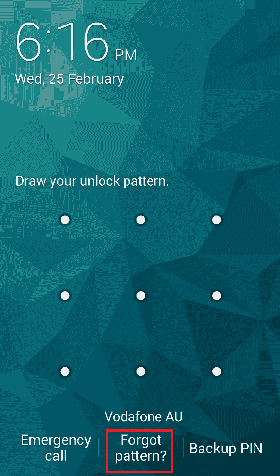

Android 设备上的忘记图案选项

点击该链接并使用 Gmail 用户名和密码登录。这将允许你为设备创建新的图案锁或密码。

请注意，这只适用于运行 Android 4.4 或更早版本的设备。

# 通过启动安全模式绕过第三方锁屏

如果屏幕锁是第三方应用程序，而不是内置锁屏，可以通过进入安全模式并禁用它来绕过。要在 Android 4.1 或更高版本的设备上进入安全模式，按住 *电源* 按钮，直到出现电源选项菜单。然后，再按住 *电源* 按钮，你将被提示重新启动 Android 设备进入安全模式。点击 OK 按钮，如下图所示：

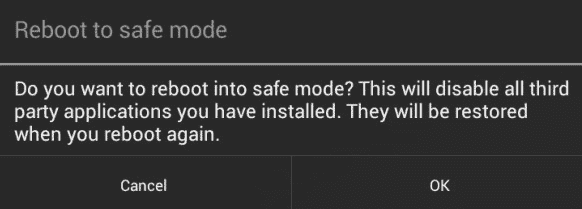

Android 中的安全模式

一旦进入安全模式，你可以禁用第三方锁屏应用，或者将其完全卸载。之后，重启设备，你应该能在没有任何锁屏的情况下访问设备。

# 使用 ADB 密钥绕过安全 USB 调试

如前所述，在使用 USB 调试时，如果选中了“始终允许来自此计算机的连接”选项，设备将不会在未来提示授权。这是通过将某些密钥，即 `adbkey` 和 `adbkey.pub`，存储在计算机上实现的。任何来自不信任计算机的 `adb` 连接尝试都会被拒绝。在这种情况下，可以从嫌疑人的计算机中提取 `adbkey` 和 `adbkey.pub` 文件，并将其复制到调查员的工作站。设备将认为它正在与已知的、授权的计算机通信。`adbkey` 和 `adbkey.pub` 文件可以在 Windows 计算机的 `C:Users<username>.android` 目录下找到。

# 在 Android 4.4.2 中绕过安全 USB 调试

如前文所述，Android 4.4.2 中引入的安全 USB 调试功能仅允许授权的工作站连接到设备；然而，正如 [`labs.mwrinfosecurity.com/`](https://labs.mwrinfosecurity.com/) 所报道的，这一功能存在一个漏洞，允许用户绕过安全 USB 调试功能，并将设备连接到任何工作站。以下是绕过 Android 设备上安全 USB 调试功能的步骤：

1.  在解锁的设备上，尝试使用 `adb`。设备将显示错误信息。

1.  现在，导航到紧急拨号器或锁屏相机，并执行以下命令：

```
$ adb kill-server
$ adb shell  
```

1.  确认对话框将被触发，工作站现在可以在不解锁设备的情况下授权。确认对话框将显示在紧急拨号器上，如下图所示：

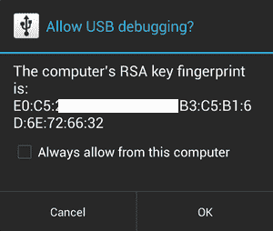

Android 4.2.2 中的安全 USB 调试

1.  一旦通过 `adb` 连接到设备，尝试使用以下命令绕过锁屏：

```
$ adb shell pm clear com.android.keyguard 
```

接下来，我们来看一下如何通过崩溃锁屏界面来绕过屏幕锁定。

# 在 Android 5.x 中崩溃锁屏 UI

在运行 Android 5.0 至 5.1.1 的设备上，密码锁屏（而非 PIN 或图案锁）可以通过崩溃屏幕 UI 来绕过。通过执行以下步骤可以实现这一点，如 [`android.gadgethacks.com/`](https://android.gadgethacks.com/) 中所解释：

1.  在锁屏界面点击紧急呼叫选项，然后在拨号屏幕上输入任何随机内容（例如，10 个星号）。

1.  双击该字段以高亮显示已输入的文本，如下图所示，并选择复制。现在，将其粘贴回同一字段：

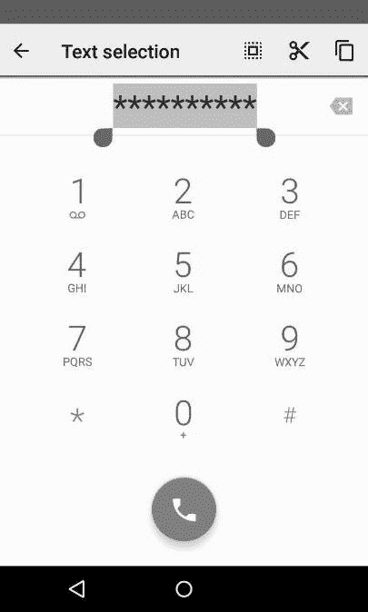

崩溃的锁屏界面

1.  重复此过程以添加更多字符。直到双击该字段时，字段不再高亮显示字符为止。

1.  返回锁屏界面并打开相机快捷方式。然后，下拉通知屏幕并点击设置图标。接下来，系统会提示你输入密码。

1.  按住输入框并选择粘贴，重复此过程多次。一旦足够的字符被粘贴到输入框中，锁屏界面将崩溃，从而让你能够访问设备。

现在，让我们来看看一些其他技巧。

# 其他技巧

上述所有技巧和现有的商业工具对于任何想要访问 Android 设备数据的取证检查员（像你一样）都非常有用；然而，也有可能出现这些技巧都无法奏效的情况。为了获取设备的完整物理镜像，当商业和开源解决方案失败时，可能需要使用芯片脱落（chip-off）和 JTAG 等技术。这里简要介绍了这些技术。

芯片脱落技术将内存芯片从电路中拆除并尝试读取，而 JTAG 技术则通过探测 JTAG **测试访问端口**（**TAPs**）并将连接器焊接到 JTAG 端口上，从而读取设备内存中的数据。芯片脱落技术更具破坏性，因为一旦芯片从设备中拆除，恢复设备的原始功能状态就变得非常困难。此外，需要专业技术人员通过去焊芯片从电路板上小心移除芯片。拆除芯片所需的高温也可能损坏或摧毁芯片上存储的数据，这意味着当数据无法通过开源或商业工具恢复，或设备已损坏到无法修复的程度时，才应使用此技术。使用 JTAG 技术时，JTAG 端口帮助你访问内存芯片，从而无需拆除芯片即可提取设备数据的物理镜像。要关闭设备的屏幕锁定，你可以识别出锁定代码在物理内存转储中的存储位置，关闭锁定，并将该数据复制回设备。商业工具，如 Cellebrite Physical Analyzer，可以接受来自芯片脱落和 JTAG 获取的`.bin`文件，并为你破解锁定代码。一旦代码被手动移除或破解，你就可以使用常规技术分析设备。

芯片脱落和 JTAG 技术都需要大量的研究和经验，才能在真实设备上尝试。关于设备的 JTAG 和芯片脱落的宝贵资源可以在[`forensicswiki.xyz/page/Main_Page`](https://forensicswiki.xyz/page/Main_Page)找到。

在本节中，我们探讨了绕过 Android 设备屏幕锁的各种方式。现在我们将了解 Android root 权限到底是什么。

# 获取 root 访问权限

作为一名移动设备取证检查员，了解所有与设备调整和修改相关的内容至关重要。这将帮助你更详细地理解设备的内部工作原理，并了解你在调查过程中可能遇到的许多问题。Root Android 手机已经成为一种普遍现象，你可能会在取证检查中遇到 root 手机。在适用的情况下，你可能还需要 root 设备以便获取取证数据。这意味着，了解 root 设备的详细情况及其与其他手机的区别非常重要。以下章节将介绍 Android root 及其他相关概念。

# 什么是 root？

类 Unix 操作系统中的默认管理员账户叫做 **root**。在 Linux 中，root 用户有权启动/停止任何系统服务，编辑/删除任何文件，改变其他用户的权限等等。我们已经了解到 Android 使用的是 Linux 内核，因此大多数 Linux 的概念同样适用于 Android；然而，大多数 Android 手机默认不允许你以 root 用户身份登录。

获取 Android 手机的 root 权限就是为了访问设备，执行设备上通常不允许的操作。制造商希望设备按一定方式工作，以供普通用户使用。Root 设备可能会使保修失效，因为使用 root 会使系统暴露于漏洞之中，并赋予用户超级用户权限。

想象一个恶意应用程序获得了 Android 系统的 root 访问权限。请记住，在 Android 中，每个应用程序都被视为一个独立的用户，并且会被分配一个 UID。这意味着应用程序只能访问有限的资源，并且强制执行应用程序隔离的概念。实际上，root Android 设备使得超级用户权限成为可能，并提供对 Android 设备的开放访问。

超级用户权限类似于 Windows 计算机上的管理员权限，能够执行普通用户无法完成的操作。在移动设备中，这种超级用户访问权限是设计上禁用的，但 root 手机则可以让你获得这一特权。

# 理解 root 过程

尽管硬件制造商尽力通过足够的限制来阻止访问 root，黑客们总是能找到不同的方式来获取 root 权限。Root 过程因底层设备制造商而异；然而，root 任何设备通常涉及利用设备固件中的安全漏洞，然后将`su`（超级用户）二进制文件复制到当前进程路径中的一个位置（`/system/xbin/su`），并使用`chmod`命令授予其可执行权限。

为了简单起见，可以想象一台安卓设备有三到四个分区，这些分区运行的程序并不完全与安卓相关（安卓只是其中之一）。

引导加载程序位于第一个分区，是手机开机时首先运行的程序。这个引导加载程序的主要任务是启动其他分区并加载安卓分区，通常被称为 ROM。要查看引导加载程序菜单，需要按特定的组合键，比如同时按住电源键并按音量加键。这个菜单提供了进入其他分区的选项，比如恢复分区。

恢复分区负责安装手机的升级，这些升级会直接写入安卓 ROM 分区。这是你在设备上安装任何官方更新时所看到的模式。设备制造商会确保只有官方更新可以通过恢复分区安装。这意味着，绕过这一限制可以让你安装/刷入任何解锁的安卓 ROM。修改版恢复程序不仅允许更简便的 root 过程，还提供了在正常恢复模式下看不到的各种选项。以下截图展示了正常恢复模式：

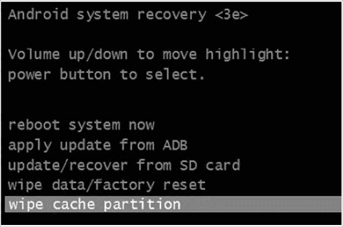

正常的安卓系统恢复模式

以下截图展示了修改版恢复模式：

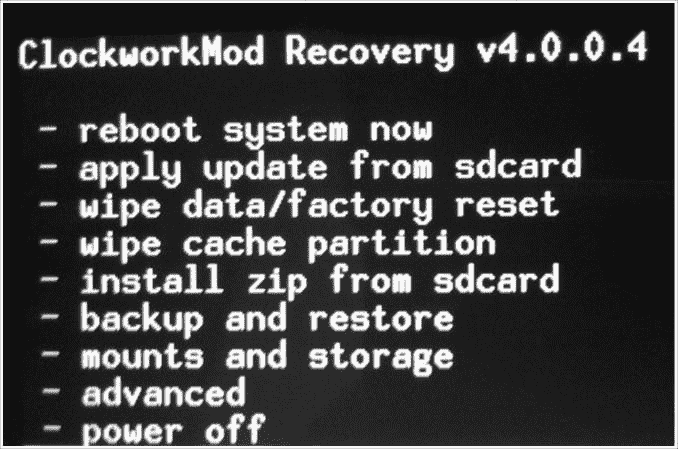

修改版恢复模式

在安卓世界中，最常用的恢复程序是 Clockwork 恢复，也叫**ClockworkMod**。大多数 root 方法都是通过刷入修改版恢复到恢复分区开始的。之后，你可以发布更新，这个更新可以让设备获取 root 权限；然而，你不需要手动执行所有操作，因为市面上已有大多数型号的手机都可以通过软件一键 root。

从安卓 7.x 开始，谷歌开始严格执行**验证启动**。验证启动确保设备上的软件在启动到正常模式之前没有被修改。这一机制通过每个阶段验证下一个阶段的完整性和真实性后再执行。如果某个分区或段落被修改，完整性检查将失败，手机可能无法正常启动。有关验证启动的更多信息，可以参考[`source.android.com/security/verifiedboot/verified-boot`](https://source.android.com/security/verifiedboot/verified-boot)。

这也意味着，root 这类安卓设备将变得极为困难，因为 root 涉及到对安卓操作系统的修改。Marshmallow 是第一个提供系统完整性警告的安卓版本，但自安卓 7.x 版本起，这一功能已经成为强制性要求。

# 对安卓设备进行 root

现在我们来看一下获取 Android 设备 root 权限的不同方法。影响你选择方法的主要因素是底层的引导加载程序是锁定还是解锁。对于解锁的引导加载程序，获取 root 权限非常容易，而对于锁定的引导加载程序，获取 root 权限则不那么简单，这意味着解锁 Android 手机的引导加载程序通常是获取 root 权限和刷入自定义 ROM 的第一步。可以通过 fastboot 模式（在前面章节中有讨论）或遵循特定厂商的引导加载程序解锁程序来完成。一旦设备的引导加载程序被解锁，下一步就是复制 `su` 二进制文件并授予执行权限。可以通过多种方式完成此操作。

以下是如何获取三星 Galaxy S7（国际版 SM-G930F/FD/X、韩国版 SM-G930K/L/S 和加拿大版 SM-G930W8 Exynos 型号）的 root 权限：

1.  确保在开发者选项中启用了 OEM 解锁。

1.  下载 ODIN（可通过 [`build.nethunter.com/samsung-tools/Odin_3.12.3.zip`](https://build.nethunter.com/samsung-tools/Odin_3.12.3.zip) 获取），并将压缩包内容提取到你选择的目录中。

1.  下载 TWRP 镜像（可通过 [`twrp.me/samsung/samsunggalaxys7.html`](https://twrp.me/samsung/samsunggalaxys7.html) 获取）。

1.  重启设备进入下载模式。为此，在设备重启时按住音量下 + Home 按钮。当你看到下载模式警告屏幕时，按音量上继续。

    启动 Odin 并将 TWRP 镜像放入 AP 插槽；不要忘记禁用自动重启。开始刷入恢复模式。

1.  要退出下载模式，请按住音量下 + Home + 电源；当屏幕变黑时，立即将音量下改为音量上。

1.  通过右滑允许系统修改。

1.  下载 SuperSU（可通过 [`download.chainfire.eu/supersu`](https://download.chainfire.eu/supersu) 获取）。

1.  通过 MTP 将包含 SuperSU 的压缩包传输到设备，并通过相应的 TWRP 选项进行安装。

Root（获取 root 权限）是一个高度依赖设备的过程，因此取证调查员在将这些技术应用到任何 Android 设备之前需要小心。Root 设备有其优点和缺点。以下是获取 root 权限的优点：

+   Root 允许对设备上的软件进行最深层次的修改——例如，你可以超频或降频设备的 CPU。

+   它允许绕过运营商、制造商等对设备的限制。

+   对于极端自定义，可以下载并安装新的自定义 ROM。

以下是获取 root 权限的缺点：

+   获取 root 权限必须小心谨慎，因为错误可能导致手机软件无法修复的损坏，将设备变成一个毫无用处的“砖头”。

+   Root 可能会使设备的保修失效。

+   Root 操作会导致设备暴露于恶意软件和其他攻击中。能够访问整个 Android 系统的恶意软件可能会造成严重破坏。

一旦设备被 root，像 **Superuser 应用程序** 这样的应用程序就可以提供或拒绝 root 权限。这个应用程序帮助你在设备上授予和管理超级用户权限，如下图所示：

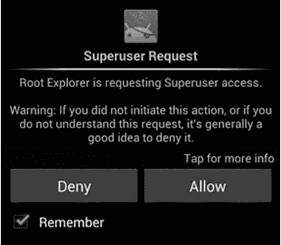

请求 root 权限的应用程序

现在我们来看 root 访问。

# Root 访问 - ADB shell

普通的 Android 手机不允许你访问设备上的某些目录和文件。例如，尝试访问一个未 root 的 Android 设备上的 `/data/data` 文件夹，你将看到如下信息：

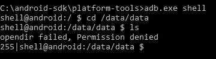

没有 root 权限时的权限拒绝

在已 root 的手机上，你可以通过执行以下命令以 root 身份运行 `adb` shell：

```
C:\android-sdk\platform-tools>adb.exe root 
```

下图显示了前面命令的输出：

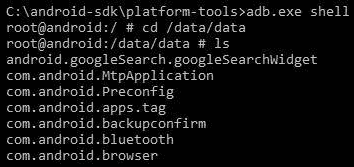

在已 root 设备上成功执行的 shell 命令

因此，root 手机可以让你访问本来无法访问的文件夹和数据。还要注意，`#` 表示 root 或超级用户权限，而 `$` 则表示普通用户，如前面的命令行所示。

Android 7.0（Nougat）及更高版本支持 **基于文件的加密**（**FBE**），允许使用不同的密钥加密不同的文件。对于像你这样的取证调查员来说，重要的是要注意，对于启用了 FBE 的设备，无法应用永久的 root 权限来进行采集。因此，建议使用自定义恢复方法，因为恢复分区是以 root 权限运行的。

# 总结

在本章中，我们学习了如何在对 Android 设备进行调查之前，设置一个合适的取证工作站。首先，从一个已安装了必要基本软件和设备驱动程序的无菌取证工作站开始。如果取证采集方法要求解锁 Android 设备，则需要确定最佳的方法来访问设备。如果设备启用了 USB 调试功能，那么绕过屏幕锁定就非常简单。我们学习了各种屏幕锁定绕过技巧，并帮助你根据不同情况确定使用哪种方法。根据取证采集方法和调查范围，对设备进行 root 应该能提供对设备文件的完全访问权限。我们还学习了 root 操作，以及它如何用于获取对设备文件系统的完全访问权限并执行通常不允许的操作。

现在我们已经覆盖了访问 Android 设备的基本概念，接下来将介绍采集技术，并描述如何使用每种方法在 *第九章* 中提取数据，*Android 数据提取技术*。
